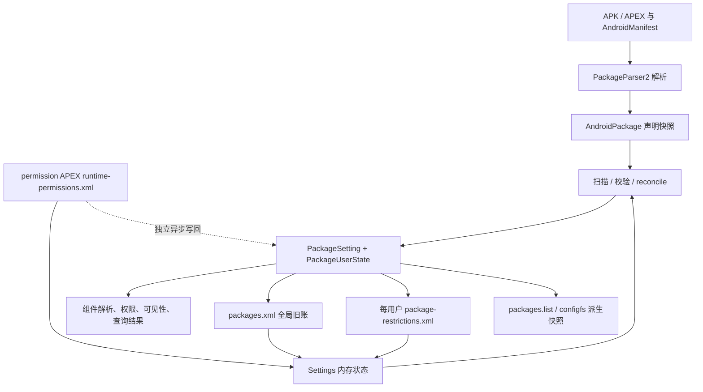
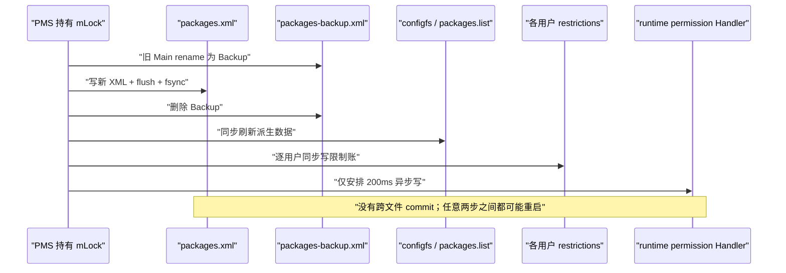
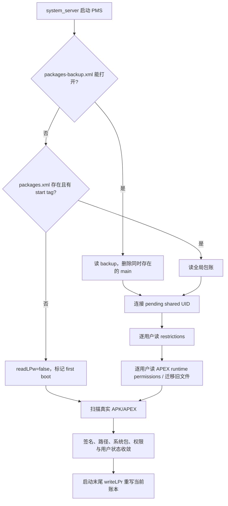

# 第552章 Android PMS Settings持久化完整链：packages.xml、PackageSetting、每用户限制、写回调度与开机恢复

> 源码基线：AOSP `android-11.0.0_r48`（Android 11 / API 30）  
> 学习目标：理解 PackageManagerService（下文简称 PMS）怎样把“内存中的包状态”拆到多个账本，怎样延迟或同步写回，以及重启后怎样从备份、XML 和重新扫描出的 APK 收敛成可用状态。  
> 阅读约定：本章只做 macOS 上的源码阅读与检索，不要求编译 Android。

## 1. 本章先回答什么问题

安装结束后，PMS 已经能查询到新应用；用户又可能禁用组件、暂停应用、授予运行时权限。设备突然断电再启动时，系统怎样知道包名、`appId`、签名、每用户安装状态和权限仍是什么？

答案不是“读取一个数据库”，而是：PMS 维护一组内存对象，再把不同性质的数据拆到多个持久化文件；开机先读旧账，再扫描真实 APK，最后校验、修正并重写。

## 2. 一句话主线

`AndroidPackage` 回答“APK 声明了什么”，`PackageSetting` 回答“系统长期记住了什么”，`PackageUserState` 回答“某个用户当前怎样看这个包”；`Settings` 负责把这些设备状态按全局、每用户和权限维度拆账读写。

## 3. 为什么这一章非常重要

前面看安装、Intent、Role 时会频繁遇到 `PackageSetting`。如果把它误当成 `packages.xml` 的 Java 映射，后面就会连续误判：

- 以为所有字段都写进同一文件；
- 以为改了内存对象便已耐受重启；
- 以为一次 `writeLPr()` 能原子提交所有文件；
- 以为 XML 是权威真相，APK 扫描只是加载代码；
- 以为角色、运行时权限和组件启停共享一套恢复协议。

本章的目的就是把这些误解一次拆干净。

## 4. 先建立六个名词

- `AndroidPackage`：完整解析 Manifest 后得到的声明快照，重启时可由 APK 再构造。
- `PackageSetting`：某个包的长期设备状态与内存连接点。
- `PackageUserState`：`PackageSetting` 内按 `userId` 保存的状态。
- `Settings`：PMS 内部的状态容器和 XML 读写器，不是系统设置 App。
- `packages.xml`：设备全局包账。
- `package-restrictions.xml`：某一用户的包可用性、组件覆盖和 Intent 偏好账。

运行时权限、Role、安装 Session 等还有各自账本，不能塞回这六个概念里。

## 5. “真相”不是单一来源

PMS 启动后的有效状态至少由三类信息合成：

1. 磁盘上实际存在的 APK/APEX 及其 Manifest；
2. 上次保存的 `PackageSetting`、签名、`appId`、每用户覆盖等；
3. 当前平台政策，例如系统分区身份、权限升级规则和用户列表。

所以 XML 不能凭空让一个已消失的 APK 继续运行，APK 也不应在每次启动时随意获得一个新 `appId`。

## 6. 本章的“六本账”

| 账本 | 典型位置 | 主要内容 | 写回机制 |
|---|---|---|---|
| 全局包账 | `/data/system/packages.xml` | 包名、代码路径、appId/shared UID、签名、安装来源、版本、keyset、install permission | 手工主文件/备份协议 |
| 每用户限制账 | `/data/system/users/<id>/package-restrictions.xml` | installed、stopped、enabled、hidden、suspended、组件覆盖、preferred 等 | 手工主文件/备份协议 |
| 运行时权限账 | `/data/misc_de/<id>/apexdata/com.android.permission/runtime-permissions.xml` | grant、flags、版本、fingerprint | `AtomicFile` |
| Role 账 | PermissionController 的每用户 DE 目录 | holder 与 Role 元数据 | 独立 `AtomicFile`，上一章已讲 |
| 原生消费快照 | `/data/system/packages.list` | 包名、appId、dataDir、seinfo、GID 等 | `JournaledFile` |
| 内核映射 | `/config/sdcardfs`（存在时） | appId 与排除用户映射 | configfs 命令式写入 |

它们有关联，但不是一个跨文件数据库事务。

## 7. Settings 是什么，不是什么

`Settings` 的类注释是“保存动态设置”。它持有 `mPackages`、`mSharedUsers`、`mAppIds`、`mVersion`、签名/keyset 辅助表以及多个 per-user resolver。

它不是：

- Android 设置界面；
- SQLite 数据库；
- 每个包独立一个对象文件；
- 完整 Manifest 模型；
- 负责所有 PMS 状态的万能持久化层。

## 8. 第一幅图：从 APK 到多本账



图中的双向箭头不能理解为“同一个字段原样来回拷贝”。扫描会用当前 APK 重建 `pkg`，也会校验旧签名、路径、版本和系统身份。

## 9. Settings 的核心索引

`mPackages` 是“包名 → `PackageSetting`”；`mSharedUsers` 是“shared user 名 → `SharedUserSetting`”；`mAppIds` 与 `mOtherAppIds` 则让 PMS 从 appId 找回包或 shared user。

同一状态以多种索引暴露，是为了高频查询，不代表落盘时会复制成多份独立权威数据。

## 10. 全局目录怎样得到

构造 `Settings` 时，传入的是 data 根目录。源码用 `new File(dataDir, "system")` 得到系统目录，再构造 `packages.xml`、`packages-backup.xml` 和 `packages.list`。

在真实设备上，通常就是 `/data/system`；测试可以注入不同的 `dataDir`。

## 11. packages.xml 的职责边界

`packages.xml` 主要保留跨用户共享、不能只靠 APK 重新推导或必须稳定延续的状态，例如：

- 包对应哪个 appId 或 shared UID；
- 上次代码路径、版本、安装与更新时间；
- 安装器、发起方、来源方；
- 签名、签名轮换数据、keyset；
- install permission 状态；
- updated system app 的工厂版本记录；
- 重命名、版本数据库、部分旧式域名验证和 MIME group 数据。

它不保存完整 activity/service/provider 声明。

## 12. 每用户限制账的职责边界

同一个包在用户 0 已安装，在用户 10 可以被逻辑卸载；同一个组件也可能只在用户 10 被禁用。因此这些状态必须按用户保存。

`package-restrictions.xml` 还保存普通/持久 preferred activity、跨 profile Intent filter、旧默认应用记录与禁止卸载列表。文件名里的“restrictions”比实际内容窄，它不只是限制项。

## 13. 运行时权限为什么另存

运行时权限天然按用户变化，且 Android 11 已把 PermissionController/权限持久化迁入可更新 permission APEX 的数据目录。

`packages.xml` 仍可写 install permission；不要因此推导“runtime permission 也在里面”。二者的生命周期、版本升级与写回延迟不同。

## 14. Role 为什么还要再分一账

Role holder 是策略层记录。获得 Role 后可能派生 runtime permission、AppOps、preferred activity 等能力，但 holder 本身不等于这些能力的集合。

因此 Role 账独立存在，开机后由 PermissionController 重新校验与收敛；它不是 `packages.xml` 的一个隐藏标签。

## 15. packages.list 是派生文件

`packages.list` 面向 native 消费者，按行输出包名、应用 appId、debug 标志、用户 0 的数据目录、seinfo、补充 GID、shell profileable 标志和 long versionCode。

它不是用来恢复 `PackageSetting` 的主数据库；源码注释还明确提醒，修改格式必须同步 native 解析器。

## 16. configfs 映射是命令接口

只有 `/config/sdcardfs` 存在时，`Settings` 才维护 `mKernelMappingFilename`。写某些小文件相当于向内核接口提交 appId 或排除用户变化。

它更像派生控制面，而不是可在开机时完整回读的 XML 账本。

## 17. AndroidPackage 与 PackageSetting 的分工

`AndroidPackage` 包含解析出的组件、intent-filter、requested permissions、targetSdk、进程等 Manifest 事实。

`PackageSetting` 包含代码路径缓存、appId、签名、安装来源、时间、ABI、长期权限状态和 per-user state，并通过 `pkg` 字段临时连接到当前解析出的 `AndroidPackage`。

一句话：前者偏“包自述”，后者偏“系统记账”。

## 18. pkg 字段不会序列化为 Java 对象

`PackageSetting.pkg` 是一个 `AndroidPackage` 引用。重启后 `packages.xml` 先恢复 `PackageSetting` 骨架；后续扫描 APK 才把新的解析对象挂回来。

所以不能看到 `pkg != null` 就以为 XML 存了整个对象图。组件表也由 `ComponentResolver` 在扫描提交阶段重新建立。

## 19. PackageSettingBase 保存哪些全局字段

它保存 `codePath`、resourcePath、ABI、版本、安装时间、签名、keyset、installSource、volume UUID、category hint 等。

其中部分字段是持久化输入，部分是运行时派生或缓存。判断某字段是否跨重启，最终要看 `writePackageLPr()` 和对应 read 分支，不能只看成员变量。

## 20. PackageUserState 是稀疏表

`PackageSettingBase.mUserState` 是 `SparseArray<PackageUserState>`。只有需要具体状态时才通过 `modifyUserState(userId)` 创建对象。

读取不存在的用户项会返回共享的 `DEFAULT_USER_STATE`，调用者绝不能修改这个默认单例。

## 21. 默认用户状态里的 installed 是 true

`PackageUserState()` 构造函数把 `installed` 初始化为 `true`，enabled 为 DEFAULT，domain verification 为 UNDEFINED。

这是一条非常重要的缺省语义：没有创建显式 per-user state 时，包默认被看作已为该用户安装。新用户创建流程会再根据系统包、用户类型白名单等显式设置真实结果。

## 22. appId 不是完整 UID

`PackageSetting.appId` 是应用部分的 ID。运行到具体用户时，完整 UID 由 `UserHandle.getUid(userId, appId)` 组合。

`packages.xml` 的属性名历史上叫 `userId`，但对普通包实际保存的是 appId；把这个 XML 属性直接解释成 Android 多用户的 userId 会读错。

## 23. shared UID 让权限归属改变

普通包在 `packages.xml` 写 `userId=appId`；shared UID 包写 `sharedUserId=appId`。shared user 标签自身保存名字、userId、签名和 install permissions。

`PackageSetting.getPermissionsState()` 在有 `sharedUser` 时返回 shared user 的权限状态，而非包自己的基类状态。这解释了为什么 runtime-permissions.xml 也分别有 package 和 shared-user 两类节点。

## 24. shared user 需要延迟连接

读取 `packages.xml` 时，`<package>` 可能出现在其 `<shared-user>` 之前。此时 `Settings` 先把包放入 `mPendingPackages`。

顶层 XML 解析结束后再按 sharedUserId 查表并连接；若 ID 指向普通包、或根本不存在，源码记录严重设置问题而不会假装连接成功。

## 25. per-volume VersionInfo

`Settings.mVersion` 按 volume UUID 保存 `sdkVersion`、`databaseVersion` 和 `fingerprint`。

它们分别帮助判断权限/格式升级、签名兼容恢复以及系统 OTA。内部存储和主物理外置存储可以拥有各自版本信息。

## 26. 数据库版本不是 XML schema 声明

Android 11 r48 的 `CURRENT_DATABASE_VERSION` 为 3，对应签名历史恢复阶段。它是 PMS 的迁移判断值，不是一个通用 XML schema 版本，也不能保证第三方工具可安全修改文件。

升级代码要求幂等，因为异常重启可能让升级路径再次运行。

## 27. 签名为什么必须持久化

若 APK 路径与时间戳看起来未变，PMS 可以复用旧 `SigningDetails`，减少开机验签成本；包升级时还要比较旧签名、轮换 lineage 与 capability。

因此签名是安全决策输入，不是单纯性能缓存。丢失或错误恢复会影响升级兼容、shared UID 和 signature permission。

## 28. mPastSignatures 是一次序列化去重表

写 `packages.xml` 前会清空 `mPastSignatures`。各包和 shared user 写签名时，可通过索引复用已经写过的证书。

它只是这次 XML 序列化的共享表，不是长期独立账本；读取时也用相同顺序重建引用。

## 29. installSource 是链式来源信息

Android 11 不只记录 `installerPackageName`，还可记录 initiating、originating 包、initiating 是否已卸载及其签名。

这些字段用于归因、权限和查询；它们不是 APK Manifest 自己声明的，因此属于系统全局账。

## 30. updated system app 有两份 PackageSetting

系统分区原包被 data 分区更新后，当前有效包在 `mPackages`，被遮蔽的工厂版本在 `mDisabledSysPackages`，写成 `<updated-package>`。

卸载更新时 PMS 需要恢复工厂包，所以这份记录不是重复垃圾。

## 31. renamed-package 保存兼容映射

`mRenamedPackages` 的键是新名、值是旧名，但源码注释说明包在其他地方通常仍以原名出现。

这个映射帮助包名迁移；它不能代替 Manifest 的 package 名，也不会自动迁移所有外部引用。

## 32. 第一段关键源码：文件位置与默认锁

下面摘录直接说明 `Settings` 复用 PMS 的 `mLock`，并构造三份核心全局文件：

```java
// frameworks/base/services/core/java/com/android/server/pm/Settings.java
Settings(File dataDir, PermissionSettings permission, Object lock) {
    mLock = lock;
    mPermissions = permission;
    mRuntimePermissionsPersistence = new RuntimePermissionPersistence(mLock);

    mSystemDir = new File(dataDir, "system");
    mSystemDir.mkdirs();
    FileUtils.setPermissions(mSystemDir.toString(),
            FileUtils.S_IRWXU | FileUtils.S_IRWXG
                    | FileUtils.S_IROTH | FileUtils.S_IXOTH,
            -1, -1);
    mSettingsFilename = new File(mSystemDir, "packages.xml");
    mBackupSettingsFilename = new File(mSystemDir, "packages-backup.xml");
    mPackageListFilename = new File(mSystemDir, "packages.list");
    FileUtils.setPermissions(mPackageListFilename, 0640, SYSTEM_UID, PACKAGE_INFO_GID);

    final File kernelDir = new File("/config/sdcardfs");
    mKernelMappingFilename = kernelDir.exists() ? kernelDir : null;
}
```

这里的 `lock` 不是另起一把文件锁，而是 PMS 创建时传入的共享内部锁。

## 33. writeLPr 先使查询缓存失效

`writeLPr()` 开头调用 `invalidatePackageCache()`，同时清 PackageManager 信息缓存与 ChangeId 状态缓存。

延迟写场景甚至在“安排写回”时先失效一次，因为若等十秒后才失效，调用者可能在窗口里读到已过期的缓存。

## 34. 全局账采用手工备份协议

写入前，如果 `packages.xml` 存在且没有 backup，就先把主文件重命名为 `packages-backup.xml`。新文件完整写完、flush、`FileUtils.sync()` 并关闭后，才删除 backup。

这提供“旧完整文件或新完整文件”的基本保障，但实现不是 `AtomicFile` 类。

## 35. 已有 backup 时为什么删除当前主文件

若 backup 已存在，说明之前写回可能失败。此时源码保留更旧的 backup，删除当前主文件，再尝试写新主文件。

它选择“保护最后已知的旧副本”，而不是用可能损坏的当前主文件覆盖 backup。

## 36. rename 失败会放弃本次写回

若主文件不能重命名为 backup，`writeLPr()` 记录 `wtf` 并直接返回，不冒险覆盖唯一主文件。

内存变化仍存在，但若随后重启便可能丢失；日志原文也明确写“current changes will be lost at reboot”。

## 37. 成功点包含 fsync

XML 的 `endDocument()` 之后先 flush，再对底层 `FileOutputStream` 调用 `FileUtils.sync()`，然后 close。

这比“Java 缓冲区已经 flush”更强，因为它请求文件系统把内容同步到稳定存储；但它仍不等于多个文件共同原子提交。

## 38. 文件权限在成功后设置

`packages.xml` 成功后设置为 owner/group 可读写，即代码组合出的 0660 风格权限。目录本身还有 system/group rwx 和 others rx。

实际访问还受 UID/GID 与 SELinux 约束；不能只看传统 mode 位就判断普通 App 能读取。

## 39. 全局写成功后还会连写四类派生状态

`writeLPr()` 删除 backup 后继续调用：

1. `writeKernelMappingLPr()`；
2. `writePackageListLPr()`；
3. `writeAllUsersPackageRestrictionsLPr()`；
4. `writeAllRuntimePermissionsLPr()`。

前三者中，用户限制账同步逐用户写；runtime permission 只是安排异步写。

## 40. writeLPr 不是跨文件事务

`packages.xml` 已成功并删除 backup 后，`packages.list` 或某个用户限制账仍可能失败。外层没有统一 commit marker，也不会把全局账回滚。

因此“`writeLPr()` 返回了”只能描述调用流程结束，不能证明六本账在同一个磁盘时刻完全一致。

## 41. 第二幅图：一次全局写回的真实时间线



这幅图是本章最应记住的图。

## 42. 第二段关键源码：一个全局 package 节点写什么

下面保留能看清边界的核心片段；组件列表并未出现在这里：

```java
// frameworks/base/services/core/java/com/android/server/pm/Settings.java
void writePackageLPr(XmlSerializer serializer, final PackageSetting pkg)
        throws IOException {
    serializer.startTag(null, "package");
    serializer.attribute(null, ATTR_NAME, pkg.name);
    serializer.attribute(null, "codePath", pkg.codePathString);
    serializer.attribute(null, "publicFlags", Integer.toString(pkg.pkgFlags));
    serializer.attribute(null, "privateFlags", Integer.toString(pkg.pkgPrivateFlags));
    serializer.attribute(null, "ft", Long.toHexString(pkg.timeStamp));
    serializer.attribute(null, "it", Long.toHexString(pkg.firstInstallTime));
    serializer.attribute(null, "ut", Long.toHexString(pkg.lastUpdateTime));
    serializer.attribute(null, "version", String.valueOf(pkg.versionCode));
    if (pkg.sharedUser == null) {
        serializer.attribute(null, "userId", Integer.toString(pkg.appId));
    } else {
        serializer.attribute(null, "sharedUserId", Integer.toString(pkg.appId));
    }

    pkg.signatures.writeXml(serializer, "sigs", mPastSignatures);
    writePermissionsLPr(serializer,
            pkg.getPermissionsState().getInstallPermissionStates());
    writeDomainVerificationsLPr(serializer, pkg.verificationInfo);
    writeMimeGroupLPr(serializer, pkg.mimeGroups);
    serializer.endTag(null, "package");
}
```

源码中还会写 ABI、installSource、volume、category、keyset、static library 等；这里为理解主线做了中间删节。

## 43. XML 会省略很多默认值

每用户文件只在值偏离默认时写某些属性，例如 `installed=true` 不写、`stopped=false` 不写、enabled 为 DEFAULT 不写。

所以“XML 中没有属性”通常表示采用源码规定的默认值，而不是“未知”或“从未设置”。

## 44. 全局 package 的 userId 命名有历史包袱

普通包写 `userId=pkg.appId`，shared user 包写 `sharedUserId=pkg.appId`。这里两者都不是“当前用户 0/10”。

阅读真实 `packages.xml` 时，应把这个 `userId` 翻译成“分配给包的应用 ID”，再在具体用户下组合 UID。

## 45. install permission 与 runtime permission 必须分开

`writePackageLPr()` 取 `getInstallPermissionStates()` 写 `<perms>`。runtime permission 则按 userId 从同一个 `PermissionsState` 的 runtime 子集另存。

共享一个内存权限状态容器，不代表共享一份磁盘格式。

## 46. forceQueryableOverride 也在全局账

`forceQueryable` 属性是安装态可见性覆盖，写在包节点上。扫描当前 Manifest 并不能可靠重建“安装时人为强制可查询”的决定。

这类字段正体现了 `PackageSetting` 的价值：保存系统决策，而非复述 Manifest。

## 47. MIME group 的运行时内容会持久化

Manifest 声明 MIME group 的名字，运行时可以修改组内 MIME type。`packages.xml` 保存每组当前集合。

扫描新版本时，`updateMimeGroups()` 会保留仍声明组的旧内容，删除不再声明的组，并为新组建立空集合。

## 48. readLPw 优先尝试 backup

开机读取时，只要 `packages-backup.xml` 能打开，源码就选择它，并删除同时存在的 `packages.xml`，因为后者可能是中断写产生的文件。

这不是“比较两份谁更新”，也不检查时间戳后选择最新。

## 49. 能打开 backup 不等于已验证内容正确

backup 被 `FileInputStream` 打开后，正常主文件便可能删除；如果后续 XML 解析才发现 backup 损坏，代码不会回头再尝试已删除的主文件。

手工备份协议主要防写入中断，不是双副本内容校验系统。

## 50. 没有 packages.xml 才是真正 first boot 入口之一

当 backup 未读到且主文件不存在时，`readLPw()` 记录“creating initial state”，把内部/主物理 volume 的版本强制设为当前值并返回 `false`。

PMS 用 `mFirstBoot = !readLPw(...)` 得到首次启动标志，再扫描系统目录建立初始状态。

## 51. “没有起始标签”也返回 false

文件存在但找不到 XML start tag 时，`readLPw()` 记录 WARN/`wtf` 并返回 false。

这会把 PMS 引向 first-boot 风格的扫描路径，但空/坏文件与真正全新设备并不是运维上同一种原因，日志必须保留。

## 52. XML 中途解析异常可能留下部分内存状态

`XmlPullParserException` 或 `IOException` 在外层被捕获并记录后，代码继续进行 pending shared UID 连接、每用户账读取等，最后仍返回 `true`。

因此不能简单说“packages.xml 损坏就完全回退到 first boot”。若异常发生在中间，前面已经解析的包可能留在表中，后续扫描再尝试收敛。

## 53. 顶层标签是逐项兼容读取

`readLPw()` 识别 package、permissions、permission-trees、shared-user、updated-package、renamed-package、restored-ivi、keyset-settings、version 等。

还保留 `last-platform-version`、`database-version`、旧 user 0 preferred/default 等迁移分支；未知顶层元素会告警并跳过，而非让整个文件必然失败。

## 54. 数字字段常采用容错默认

例如 package version、flags、时间和 category 的数字解析有不少局部 `NumberFormatException` 吞掉或记录问题后使用 0/默认值的路径。

这提高旧数据兼容性，也意味着“XML 能解析完”不等于每个属性都可信完整。

## 55. 扫描会校验旧账，不会盲信

读完 Settings 后，PMS 扫描 system/vendor/product/system_ext/data 等包目录，收集当前 APK 信息与签名，然后 Prepare、Scan、Reconcile、Commit。

旧账提供稳定身份和历史安全输入；当前 APK 提供现状。路径消失、系统包更新、签名不兼容等都要在扫描阶段处理。

## 56. readLPw 发生在系统包扫描之前

PMS 构造阶段先加载系统配置、SELinux 安装策略和 fallback，然后在 `read user settings` 阶段调用 `mSettings.readLPw(users)`。

之后才设置 `SCAN_BOOTING | SCAN_INITIAL` 并扫描各分区。这一顺序保证扫描能用旧 `PackageSetting` 做升级与身份校验。

## 57. 缺失代码路径会先做一轮孤儿修复

读账后，若某个非外置 `PackageSetting` 的 codePath 不存在，且它恰是 updated system app，PMS 会移除当前记录并重新启用被遮蔽的工厂系统包。

这是“旧账 + 真实文件系统”收敛的直接例子。

## 58. 启动末尾会统一重写

系统/data 扫描、权限更新、数据目录协调和 OTA 迁移完成后，PMS 把 `databaseVersion` 设为当前值并同步调用 `mSettings.writeLPr()`。

因此开机读取的旧格式、扫描修正与当前平台状态最终会重新落成新账。

## 59. commitPackageSettings 先提交内存可见状态

`commitPackageSettings()` 的注释说，完成后包即可查询与解析。它在 `mLock` 下把 `PackageSetting` 插入 `mSettings`、把 `AndroidPackage` 放进 `mPackages`，注册 keyset、组件、AppsFilter 和权限声明。

这里的“commit”主要是内存数据结构提交，并不在函数末尾直接写 XML。磁盘提交由安装后续的 `updateSettingsInternalLI()` 完成。

## 60. 安装成功路径同步 writeLPr

正常安装在完成权限更新、per-user installed/installReason、kernel mapping 等后，设置成功结果并在 `mLock` 内同步调用 `mSettings.writeLPr()`。

因此安装结果回调前的重要状态通常已经经过一次全局写回；但 runtime permission 子账仍可能只是被异步安排。

## 61. 内存 commit 与耐久 commit 不是同一个瞬间

在 `commitPackageSettings()` 后、`writeLPr()` 前，系统内查询已经可能看到新包。若流程后面失败，需要安装清理/回滚代码恢复内存和文件。

理解安装事务时必须区分：

- Session/stage 文件；
- PMS 内存可见状态；
- packages.xml 耐久状态；
- per-user/permission 衍生账；
- 广播与结果回调。

## 62. 每用户文件的实际路径

`getUserPackagesStateFile(userId)` 用 `mSystemDir/users/<id>/package-restrictions.xml`。

backup 方法却直接用 `Environment.getUserSystemDirectory(userId)` 构造路径。这在真实系统中指向相同目录，但测试注入自定义 dataDir 时两种求路径方式并不完全对称，源码自己也留下了 TODO。

## 63. 每次写限制账会遍历所有已知包

`writePackageRestrictionsLPr(userId)` 对 `mPackages.values()` 全量遍历，读取每包的 `PackageUserState` 并输出 `<pkg>`。

它不是只写本次变动的一行，也没有增量日志；十秒合并写可减少高频全量重写。

## 64. per-user 文件保存的标量字段

主要包括：

- ceDataInode、installed、stopped、notLaunched、hidden；
- distraction flags、suspended、instant app、virtual preload；
- enabled 与 lastDisableAppCaller；
- domain verification status、app-link generation；
- install/uninstall reason、harmful warning。

不要把 dataDir 实际内容或进程运行状态也想象在这个文件里。

## 65. 组件覆盖是集合，不是重写 Manifest

`enabled-components` 与 `disabled-components` 保存的是类名集合。查询组件有效性时再把 Manifest 默认、包级 enabled、组件级覆盖和用户状态合成。

所以文件中出现 disabled component 不表示 APK 中该组件被修改。

## 66. suspendParams 按“谁暂停”分项保存

Android 11 的 `PackageUserState.suspendParams` 是 suspending package → 参数的映射，可含对话框信息、给 App/Launcher 的 PersistableBundle。

只要还有一个 suspending package，包仍保持 suspended；撤掉一个发起方不能粗暴清除其他发起方的参数。

## 67. preferred 与 cross-profile 也写在同一用户文件

写完包行后，源码继续写 preferred activity、persistent preferred activity、cross-profile Intent filters、default apps 和 block-uninstall packages。

所以诊断“为什么 Intent 总去某组件”时，除了包的 enabled 状态，还要看同一文件后部的 resolver 记录。

## 68. 用户限制账也使用主文件/backup

协议与全局账相似：主文件存在时先 rename 到 `package-restrictions-backup.xml`；若已有 backup 则保留旧 backup、删除当前主文件；新文件 flush + fsync 成功后删除 backup。

它同样不是 `AtomicFile`，且写失败不会抛给 `writeLPr()` 统一回滚。

## 69. 没有 per-user 文件时有强缺省恢复

如果主文件和 backup 都不存在，源码遍历所有 `mPackages`，为该用户显式设：

- installed=true；
- stopped=false；
- notLaunched=false；
- hidden/suspended/instant/virtualPreload=false；
- enabled=DEFAULT；
- domain status=UNDEFINED；
- reason=UNKNOWN。

随后直接返回。

## 70. “没有文件 = 全部已安装”不是普遍产品规则

注释把它描述为 first boot 兼容策略，目的是让已有第三方 App 在首次建立账时初始化，而不是停在 stopped 状态。

新建用户走 `createNewUserLI()`，会按系统包、disallowed packages 和 user type 白名单重新设置 installed；不能把缺文件逻辑套到所有新用户场景。

## 71. 未知包行会被跳过

若 per-user XML 有一个包名，但全局 `mPackages` 没有对应 `PackageSetting`，读取器记录警告并跳过整项。

这符合依赖方向：per-user 覆盖必须附着在已知全局包上，不能单独创造一个包。

## 72. per-user XML 中途损坏也可能部分生效

读取异常只记录严重日志，之前已调用 `setUserState()` 的包不会自动恢复到整文件读取前的快照。

因此“解析失败”不是事务性失败；诊断时要同时看异常位置、此前条目顺序和随后开机扫描/写回。

## 73. app-link generation 会从最大值继续

读取该用户所有包时，源码跟踪最大 `app-link-generation`，结束后把 `mNextAppLinkGeneration[userId]` 设为最大值 + 1。

这是一个从现有 per-user 状态重建的内存计数器，不需要另写一个独立顶层字段。

## 74. 旧 packages-stopped.xml 只用于迁移

如果旧的 `packages-stopped.xml` 或 backup 存在，`readLPw()` 读取旧格式，删除两份旧文件，再把用户 0 状态写成新 `package-restrictions.xml`。

否则才逐用户读取新格式。看到旧文件名不应误以为 Android 11 仍以它为主账。

## 75. 普通 Settings 写回延迟十秒

PMS 定义 `WRITE_SETTINGS_DELAY = 10 * 1000`。`scheduleWriteSettingsLocked()` 仅在尚无同类消息时安排 `WRITE_SETTINGS`。

这是 debounce/coalescing：十秒窗口中的多次变动合并为一次全量写，不是每次调用都把截止时间向后推十秒。

## 76. per-user 写回用 dirtyUsers 合并

`scheduleWritePackageRestrictionsLocked(userId)` 先把目标用户加入 `mDirtyUsers`，再保证队列中有一条 `WRITE_PACKAGE_RESTRICTIONS` 消息。

同一条消息触发时遍历 dirty users，各写一次完整文件，然后清空集合。

## 77. 全局写消息会吞并限制账消息

Handler 处理 `WRITE_SETTINGS` 时会同时移除 `WRITE_SETTINGS` 和 `WRITE_PACKAGE_RESTRICTIONS`，调用 `writeLPr()`，最后清 `mDirtyUsers`。

这是正确的吞并，因为 `writeLPr()` 自己会同步写所有用户限制账。不是把 dirty 用户的变更直接丢弃。

## 78. 限制账消息不会替代全局写

反过来，`WRITE_PACKAGE_RESTRICTIONS` 只移除自身消息、写 dirty users，不会取消待执行的 `WRITE_SETTINGS`。

因为仅写 per-user 文件无法持久化 appId、签名、installSource 等全局变更。

## 79. 同步 flush 是显式耐久边界

`flushPackageRestrictionsAsUser()` 在权限检查后持有 `mLock`，同步写指定用户文件，从 dirty set 删除该用户；若 dirty set 为空，再移除排队消息。

源码注释明确提醒它会同步访问磁盘，调用者应考虑在后台线程执行。

## 80. shutdown 只补写待处理的限制账

`shutdown()` 会写 package usage、编译统计、dex usage、watchdog，并检查 `WRITE_PACKAGE_RESTRICTIONS`，同步刷新 dirty users。

此处没有对待处理 `WRITE_SETTINGS` 做同样的显式 flush。不能笼统声称 PMS shutdown 会清空所有 Settings 写队列。

## 81. 第三段关键源码：两个消息怎样合并

```java
// frameworks/base/services/core/java/com/android/server/pm/PackageManagerService.java
case WRITE_SETTINGS: {
    synchronized (mLock) {
        removeMessages(WRITE_SETTINGS);
        removeMessages(WRITE_PACKAGE_RESTRICTIONS);
        mSettings.writeLPr();
        mDirtyUsers.clear();
    }
} break;

case WRITE_PACKAGE_RESTRICTIONS: {
    synchronized (mLock) {
        removeMessages(WRITE_PACKAGE_RESTRICTIONS);
        for (int userId : mDirtyUsers) {
            mSettings.writePackageRestrictionsLPr(userId);
        }
        mDirtyUsers.clear();
    }
} break;

void scheduleWriteSettingsLocked() {
    PackageManager.invalidatePackageInfoCache();
    if (!mHandler.hasMessages(WRITE_SETTINGS)) {
        mHandler.sendEmptyMessageDelayed(WRITE_SETTINGS, WRITE_SETTINGS_DELAY);
    }
}
```

真实源码在消息前后还会切换线程优先级；这里删去与写回语义无关的行。

## 82. runtime permission 已迁到 permission APEX 的 DE 目录

`RuntimePermissionsPersistenceImpl.getFile()` 通过 `ApexEnvironment.getDeviceProtectedDataDirForUser(user)` 获取目录。

ApexEnvironment 最终使用 `Environment.getDataMiscDeDirectory(userId)/apexdata/com.android.permission`，因此 Android 11 的新主文件通常不是旧的 `/data/system/users/<id>/runtime-permissions.xml`。

## 83. 旧 runtime-permissions.xml 仍可迁移

若新 APEX 文件不存在，`Settings.RuntimePermissionPersistence` 会读取旧 user system directory 下的 legacy 文件，然后安排异步写入新位置。

这是一条迁移路径，不表示之后每次都双写两处。

## 84. runtime permission 使用 AtomicFile

permission APEX 实现用 `AtomicFile.openRead()`、`startWrite()`、`finishWrite()` 和 `failWrite()`。

写异常时 `failWrite()` 恢复 backup。与 `Settings` 手工 rename 协议相比，API 封装更集中，但仍只保障这一位用户的这一份权限文件。

## 85. 权限写回是 200ms debounce、最长约 2s

首次变动安排 200ms 后写。若窗口中继续变动，Handler 消息被移除并重新安排；但从第一笔未写变动起达到 2000ms 时，不再继续拖延。

它和普通 Settings 的固定十秒合并策略不同。

## 86. 权限快照与磁盘 I/O 分开

`writePermissionsSync(userId)` 在 `mPersistenceLock` 下遍历 package/shared-user 权限状态，构造纯 `RuntimePermissionsState`；退出锁后才调用 APEX persistence 写文件。

这减少持锁执行文件 I/O 的时间。这里传入的 `mPersistenceLock` 实际就是 Settings/PMS 的共享锁。

## 87. ONE_TIME 权限不会以 granted=true 持久化

序列化时，若 permission flags 含 `FLAG_PERMISSION_ONE_TIME`，即便内存 `isGranted()` 为 true，也会把 `granted` 写成 false；flags 仍写出。

一次性授权本来就不应跨重启继续作为已授予权限。

## 88. 文件缺状态与 R 升级有特殊兼容

读取新 runtime permission 账时，若某已知 package/shared user 没有对应状态，非“升级到 R”的场景会标记 `PermissionsState.missing` 并告警。

从旧版本升级到 R 时暂不按同样规则标缺失，以容纳存储迁移和格式变化。

## 89. 权限 fingerprint 包含 PermissionController 版本

扩展 fingerprint 是 `Build.FINGERPRINT + "?pc_version=" + version`。PermissionController 版本变化也能触发权限升级需要判断。

这比只看系统 build fingerprint 更细，因为权限政策可随模块版本变化。

## 90. runtime permission 解析损坏更“硬”

APEX persistence 遇到 XML/IO 错误会抛 `IllegalStateException`；旧文件解析失败也会抛。它不像 `readPackageRestrictionsLPr()` 那样仅记录后返回部分状态。

“都叫 XML”不代表错误处理策略相同。

## 91. runtime permission 仍不与 packages.xml 原子提交

`writeLPr()` 最后只调用 `writePermissionsForUserAsyncLPr()`。如果全局账已成功、权限 Handler 尚未写而进程/设备退出，就存在两账时间差。

启动时权限管理代码会重新校验请求、默认授权和升级，但不能把这种收敛机制误写成磁盘事务。

## 92. Role 账与权限账也不是共同事务

角色切换可能先改权限/AppOps/preferred，再写 holder；失败恢复依赖各层自己的逻辑。上一章已经看到 Role grant/revoke 本身也是分步操作。

本章只需记住：`roles.xml` 不在 `Settings.writeLPr()` 的提交集合中。

## 93. packages.list 用 JournaledFile

`writePackageListLPrInternal()` 以主文件与 `packages.list.tmp` 构造 `JournaledFile`，选择 write target，写完 flush + sync 后 `commit()`，异常则 `rollback()`。

它的协议又不同于前述两种 XML。

## 94. packages.list 的 UID 行仍有历史限制

源码用 `pkg.pkg.getUid()`，数据目录则明确按 `UserHandle.USER_SYSTEM` 计算，并有 TODO：“doesn't handle multiple users”。

GID 是按活动用户集合计算的。不要把这一行解释成“每个 Android 用户各一条完整包记录”。

## 95. packages.list 会跳过缺少解析元数据的包

`pkg.pkg == null` 或 dataPath 为空时会跳过；dataPath 包含空格也跳过。

这再次说明它依赖当前已扫描的 `AndroidPackage`，不是单靠 `PackageSetting` 就能恢复的主账。

## 96. packages.list 失败不会推翻 packages.xml

内部捕获异常、记录 `wtf` 并 rollback journal，但 `writeLPr()` 不接收布尔失败结果。

短时间内 native 消费者可能看到旧 packages.list，而 Java PMS 已有新全局账；后续写回或重启扫描再修正。

## 97. configfs 失败也只是局部失败

`writeIntToFile()` 捕获 `IOException` 并记录警告。全局包账不会因此回滚。

因此排查外部存储访问时，要区分 PMS 内存/package XML 正确与内核派生映射未更新这两类故障。

## 98. 大多数 Settings 磁盘 I/O 在 mLock 下执行

PMS Handler 的两类写消息、安装成功同步写、开机末尾写都会在 `mLock` 下调用 `Settings`。

这样保证序列化看到一致的内存结构，却会延长锁持有时间。runtime permission 的最终文件 I/O 是特意在快照锁外执行的例外。

## 99. LPr、LPw 后缀是锁约定，不是 Java 语法

旧 PMS 命名中常见：

- `LPr`：调用时应在 lock 下读取；
- `LPw`：调用时应在 lock 下写/修改；
- `LI`：通常要求 install lock；
- `LIF/LIPr` 等是组合约定。

编译器不会自动验证这些后缀；要结合 `@GuardedBy`、调用点和 synchronized 块判断。

## 100. “写盘”同时承担缓存失效

`writeLPr()`、`writePackageRestrictionsLPr()` 都调用缓存失效；schedule 方法也提前使 package info cache 失效。

所以某次状态变更即使延迟落盘，运行期查询仍应尽早看见内存新值，而不是等 XML 写完才更新。

## 101. 正确的变更契约是“改内存 + 选择写回策略”

调用 `ps.setEnabled()`、`setInstalled()` 或修改 preferred resolver 本身只改内存。上层必须根据风险选择：

- schedule 十秒写；
- 只 schedule 指定用户限制账；
- 同步 flush 用户账；
- 同步 `writeLPr()`；
- 单独同步/异步写权限账。

源码审查时要沿调用链找到这一步，不能停在 setter。

## 102. 三个典型崩溃窗口

- 改内存后、延迟消息前：若调用者忘记 schedule，变化永远不耐久。
- 主文件 rename 为 backup 后、新主文件未完成：重启优先读 backup，恢复旧状态。
- packages.xml 成功后、per-user/permission 未完成：重启看到跨账版本差，再依靠扫描与策略收敛。

备份只覆盖第二类中的单文件问题。

## 103. 第三幅图：开机恢复不是“反序列化完就结束”



注意：XML 中途解析异常不完全落入图中的“文件不存在”分支，它可能保留部分已读内存状态。

## 104. 同时存在 main 和 backup 时读谁

全局账和 per-user 限制账都优先 backup，并删除 main。理由是 backup 的存在意味着上次写回未完成，main 可能只是部分新文件。

它不使用 modification time 比较，也不会把两份 XML 合并。

## 105. 全局账成功、限制账失败会怎样

本次运行内存仍是新状态，`packages.xml` 也是新全局状态，但对应用户可能保留旧 `package-restrictions.xml` backup。

重启时全局包先恢复，再按该用户的旧限制覆盖。结果可能表现为包存在、appId 正确，但 installed/enabled/suspended 等回到旧值。

## 106. per-user 文件完全缺失会怎样

源码不是把每个状态留成“未知”，而是把所有已知包设为 installed 且 started 风格的默认。

因此手工删除该文件不是安全的“重置一个开关”操作，而是大范围重置用户包状态；学习阶段只读，绝不要在真实设备随意删。

## 107. 新用户创建不依赖这个缺文件捷径

`createNewUserLI()` 遍历包，只有符合条件的系统包初始 installed=true；再准备 DE/CE app data、应用默认 preferred。

这条显式初始化路径比“缺文件即全装”更能代表现代多用户创建语义。

## 108. 删除用户会清哪些 Settings 状态

`removeUserLPw()` 从每个 `PackageSetting` 移除 user state，清 preferred、删除主/backup 限制文件、清跨 profile filter、清内存 runtime permission 状态，并刷新 packages.list/configfs。

但在 r48 这条函数链里，`RuntimePermissionPersistence.onUserRemovedLPw()` 只清 Handler 消息和内存权限状态，没有调用新 APEX persistence 的 `deleteForUser()`；`deleteUserRuntimePermissionsFile()` 在本树中只用于“升级时按开关清权限文件”。用户 APEX 数据目录是否随用户数据整体销毁，属于更外层生命周期，不能从 `Settings.removeUserLPw()` 单独证明。

## 109. 一套可靠的开机心智模型

先读旧账是为了保留身份和历史；再扫 APK 是为了确认现实；再 reconcile 是为了执行安全/升级规则；最后重写是为了把“旧账 + 当前文件 + 新政策”的结果固化。

不是：

- XML 永远压过 APK；
- APK 永远压过 XML；
- XML 坏了就必定恢复出完整默认；
- 扫描成功就代表所有子账已同步。

## 110. 调试时按五步回读

1. 用 `dumpsys package <pkg>` 看 PMS 当前内存；
2. 区分问题是全局字段还是 per-user 字段；
3. 查对应写回调用是否同步、延迟或遗漏；
4. 查 main/backup 与严重日志，判断最近一次成功点；
5. 再看 APK 真实路径、签名和开机扫描日志，判断是否被 reconcile 改写。

不要第一步就手改 XML。

## 111. 用一次“安装后禁用组件并授权限”串全链

安装完成时，`commitPackageSettings()` 让组件进入解析表；`updateSettingsInternalLI()` 设置 installed/installReason 并同步 `writeLPr()`。

随后禁用某组件主要修改用户 10 的 `PackageUserState.disabledComponents`，通常安排该用户限制账；授予运行时权限修改 `PermissionsState`，以 200ms/最长 2s 策略写 APEX 文件。三项状态在内存里能同时生效，但落到三本账的时间不相同。

## 112. macOS 只读练习一：确认全局文件与写回级联

目标：亲自看到 `Settings` 的文件路径、backup 协议、fsync 和后续四类写回。命令只读取源码：

```bash
set -eu
AOSP_SRC=/Users/ninebot/androidSource
SETTINGS_JAVA="$AOSP_SRC/frameworks/base/services/core/java/com/android/server/pm/Settings.java"
test -f "$SETTINGS_JAVA"
rg -n 'mSettingsFilename|mBackupSettingsFilename|mPackageListFilename|void writeLPr|renameTo|FileUtils[.]sync|writeAllUsersPackageRestrictionsLPr|writeAllRuntimePermissionsLPr' "$SETTINGS_JAVA"
sed -n '2436,2597p' "$SETTINGS_JAVA"
```

阅读结果应能回答：backup 在何时删除？runtime permission 是同步完成还是只被安排？

## 113. macOS 只读练习二：对照每用户字段与缺文件默认

目标：把 `PackageUserState`、读取缺省和写 XML 三处对齐：

```bash
set -eu
AOSP_SRC=/Users/ninebot/androidSource
SETTINGS_JAVA="$AOSP_SRC/frameworks/base/services/core/java/com/android/server/pm/Settings.java"
USER_STATE_JAVA="$AOSP_SRC/frameworks/base/core/java/android/content/pm/PackageUserState.java"
test -f "$SETTINGS_JAVA"
test -f "$USER_STATE_JAVA"
rg -n 'readPackageRestrictionsLPr|assuming all started|setUserState|writePackageRestrictionsLPr|ATTR_INSTALLED|TAG_ENABLED_COMPONENTS|TAG_SUSPEND_PARAMS' "$SETTINGS_JAVA"
sed -n '63,138p' "$USER_STATE_JAVA"
```

阅读结果应能解释：为什么 XML 中没有 `installed` 属性通常等于 true？

## 114. macOS 只读练习三：比较十秒 Settings 与权限 200ms/2s 调度

目标：确认两个调度器不是同一套策略，并确认权限新文件位于 APEX DE 目录：

```bash
set -eu
AOSP_SRC=/Users/ninebot/androidSource
PMS_JAVA="$AOSP_SRC/frameworks/base/services/core/java/com/android/server/pm/PackageManagerService.java"
SETTINGS_JAVA="$AOSP_SRC/frameworks/base/services/core/java/com/android/server/pm/Settings.java"
PERM_JAVA="$AOSP_SRC/frameworks/base/apex/permission/service/java/com/android/permission/persistence/RuntimePermissionsPersistenceImpl.java"
APEX_ENV_JAVA="$AOSP_SRC/frameworks/base/core/java/android/content/ApexEnvironment.java"
rg -n 'WRITE_SETTINGS_DELAY|scheduleWriteSettingsLocked|scheduleWritePackageRestrictionsLocked|mDirtyUsers' "$PMS_JAVA"
rg -n 'WRITE_PERMISSIONS_DELAY_MILLIS|MAX_WRITE_PERMISSIONS_DELAY_MILLIS|writePermissionsForUserAsyncLPr' "$SETTINGS_JAVA"
rg -n 'AtomicFile|getDeviceProtectedDataDirForUser|FLAG_PERMISSION_ONE_TIME' "$PERM_JAVA" "$APEX_ENV_JAVA"
```

阅读结果应能说出：持续高频权限变更为什么最多约两秒就会触发一次写？

## 115. macOS 只读练习四：追开机读取、扫描提交与安装同步写

目标：串起“旧账 → 扫描 → 内存 commit → 安装写回 → 启动末尾重写”：

```bash
set -eu
AOSP_SRC=/Users/ninebot/androidSource
PMS_JAVA="$AOSP_SRC/frameworks/base/services/core/java/com/android/server/pm/PackageManagerService.java"
SETTINGS_JAVA="$AOSP_SRC/frameworks/base/services/core/java/com/android/server/pm/Settings.java"
rg -n 'mFirstBoot = !mSettings[.]readLPw|commitPackageSettings|insertPackageSettingLPw|updateSettingsInternalLI|mSettings[.]writeLPr|databaseVersion = Settings[.]CURRENT_DATABASE_VERSION' "$PMS_JAVA"
rg -n 'boolean readLPw|Reading from backup settings file|No settings file; creating initial state|mPendingPackages|readPackageRestrictionsLPr|readStateForUserSyncLPr' "$SETTINGS_JAVA"
sed -n '2991,3082p' "$PMS_JAVA"
```

阅读结果应能回答：`commitPackageSettings()` 中的 commit 与 `packages.xml` 的耐久提交为什么不是同一时刻？

## 116. 常见故障定位矩阵

| 现象 | 先看内存/文件 | 再看调用链 | 特别留意 |
|---|---|---|---|
| 重启后包 appId/安装来源异常 | `packages.xml`、backup、`dumpsys package` | `readPackageLPw`、扫描 reconcile | backup 优先、部分解析 |
| 只在某用户显示为未安装/禁用 | 对应 `package-restrictions.xml` | setter 后是否 schedule/flush | userId、默认省略值 |
| 运行时权限重启后回退 | APEX DE runtime permission 文件 | permission write async/sync | 200ms/2s 窗口、ONE_TIME |
| native 服务仍见旧 GID/包 | `packages.list` | `writePackageListLPrInternal` | journal rollback 不回滚主账 |
| 外部存储权限映射异常 | `/config/sdcardfs` 是否存在 | kernel mapping 写入 | 局部 I/O 失败 |
| OTA 后状态变化 | `VersionInfo`、fingerprint | upgrade/scan/default grant | 收敛修正不等于 XML 丢失 |
| 开机报 Settings parse error | main/backup 与 critical log | 异常位置、已解析项 | 不一定完整 first boot |

## 117. 最容易出现的二十个误解

1. `Settings` 是设置 App 的后端——不是，它是 PMS 内部状态容器。
2. `PackageSetting` 就是一行 `packages.xml`——不是，它还连着 per-user、权限和解析对象。
3. Manifest 完整存进 `packages.xml`——组件声明会从 APK 重扫。
4. XML 的 `userId` 是 Android 用户编号——普通包节点中实际是 appId。
5. 一个包只有一个 installed 状态——它按 userId 保存。
6. per-user XML 没写 installed 表示未知——默认是 true。
7. `writeLPr()` 是六本账的原子事务——不是。
8. `packages.xml` 使用 `AtomicFile`——r48 这里是手工 rename/backup。
9. 所有 XML 都采用同一恢复策略——runtime permission 的策略明显不同。
10. backup 和 main 同在时选择更新者——代码固定优先 backup。
11. backup 能打开就证明内容完整——解析可能随后失败。
12. packages.xml 解析异常一定返回 false——中途异常路径最后仍可返回 true。
13. package-restrictions 损坏会全文件回滚——此前已读状态可留在内存。
14. `commitPackageSettings()` 已完成磁盘 commit——它首先是内存提交。
15. schedule 每调用一次都把十秒重新计时——已有消息时不会重排。
16. WRITE_SETTINGS 取消限制消息会丢数据——`writeLPr()` 会写所有用户限制账。
17. shutdown 一定 flush 所有全局 Settings——这里显式补写的是待处理限制账。
18. runtime permission 仍只在 `/data/system/users`——Android 11 新主账在 permission APEX DE 数据目录。
19. packages.list 是恢复 PMS 的权威数据库——它是面向 native 的派生快照。
20. 手删 XML 是无害重置——缺文件有大范围强默认，且会破坏跨账一致性。

## 118. 本章源码导航

| 主题 | 源码文件与关键入口 |
|---|---|
| Settings 容器/文件 | `frameworks/base/services/core/java/com/android/server/pm/Settings.java`：构造函数、`writeLPr`、`readLPw` |
| 全局包节点 | 同文件：`writePackageLPr`、`readPackageLPw`、`readSharedUserLPw` |
| 每用户限制 | 同文件：`writePackageRestrictionsLPr`、`readPackageRestrictionsLPr` |
| 权限桥接 | 同文件内部类 `RuntimePermissionPersistence` |
| APEX 权限文件 | `frameworks/base/apex/permission/service/java/com/android/permission/persistence/RuntimePermissionsPersistenceImpl.java` |
| APEX 数据目录 | `frameworks/base/core/java/android/content/ApexEnvironment.java` |
| PackageSetting | `PackageSetting.java`、`PackageSettingBase.java`、`SettingBase.java` |
| per-user 默认 | `frameworks/base/core/java/android/content/pm/PackageUserState.java` |
| PMS 调度/启动 | `PackageManagerService.java`：Handler、schedule、构造扫描、`shutdown` |
| 扫描内存提交 | 同文件：`commitPackageSettings` |
| 安装最终写回 | 同文件：`updateSettingsInternalLI` |
| native 派生账 | `Settings.writePackageListLPrInternal`、`writeKernelMappingLPr` |

推荐阅读顺序：先看 `PackageUserState` 默认值，再看两个 XML 写函数，然后看两个读函数，最后回到 PMS 调度与开机扫描。直接从 `readLPw()` 一口气读到底，容易被大量旧格式兼容分支淹没。

## 119. 生成后复读修正记录

本章初稿完成后，按“字段归属、时间顺序、失败语义、多用户、Android 版本”五个维度复读并做了这些修正：

- 把“PackageSetting 写入 packages.xml”改成“不同字段分别进入全局账、per-user 账和权限账”，避免对象与文件一一对应的错觉。
- 明确 `writeLPr()` 在全局 XML 成功后同步写限制账、异步安排 runtime permission，不能写成跨文件原子事务。
- 明确全局/per-user 是手工 backup，runtime permission 是 `AtomicFile`，packages.list 是 `JournaledFile`。
- 补出 backup 能打开后会删除 main，但后续解析损坏不会再回退 main 的边界。
- 修正“packages.xml 解析失败必定 first boot”：无 start tag 返回 false，中途异常则可能保留部分状态并最终返回 true。
- 补出 per-user 文件缺失时“所有已知包 installed=true、started 风格默认”，并与现代新用户显式初始化分开。
- 把 XML `userId` 解释修正为普通包 appId，避免与 Android 多用户 userId 混淆。
- 明确 `commitPackageSettings()` 是内存可查询提交，安装成功路径的 `writeLPr()` 才是后续耐久边界。
- 补出十秒普通 Settings debounce 不会每次重排，权限写则会重排但受两秒上限约束。
- 补出 ONE_TIME grant 序列化为 `granted=false`、permission fingerprint 包含 PermissionController 版本。
- 补出 shutdown 只显式刷新待处理 restriction 消息，没有据此证明所有 WRITE_SETTINGS 都被 flush。
- 补出 `packages.list` 多用户 TODO、派生文件失败不回滚 packages.xml，以及 configfs 局部失败边界。
- 补出 r48 的 `removeUserLPw()` 只清新权限账的内存状态，没有在该调用链直接执行 APEX `deleteForUser()`，避免把更外层用户目录销毁当成本函数行为。
- 删除了“XML 是最终权威”的表述，改为旧账、真实 APK 与当前政策共同收敛。

已再次核对本章三段源码摘录与 r48 行为；第112—115节命令仅执行 `test`、`rg` 和 `sed`，不会编译或修改源码。

## 120. 本章结论与下一步

记住四句话就抓住了本章：

1. `PackageSetting` 是跨多本账的内存账户，不是一份 XML 的别名。
2. `packages.xml` 管全局身份/历史，`package-restrictions.xml` 管每用户覆盖，runtime permission 与 Role 另有账。
3. 单文件有 backup/atomic/journal 保护，但这些文件之间没有共同事务。
4. 开机恢复是“读旧账 → 扫真实 APK → reconcile → 重写”，不是简单反序列化。

下一章进入第553章：继续沿包身份往下读 `SharedUserSetting`、appId 分配/回收、shared UID 权限合并、包卸载与 updated system app 恢复链，解释“包删了以后 UID 和共享权限怎样安全收尾”。
