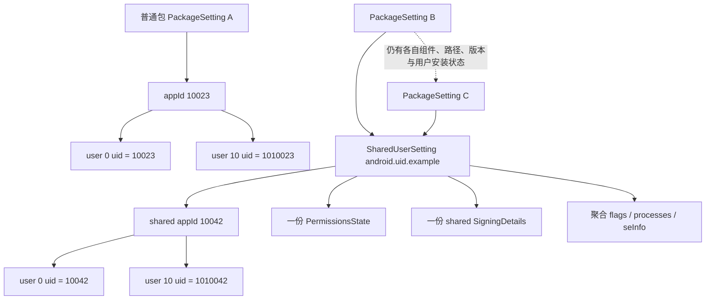
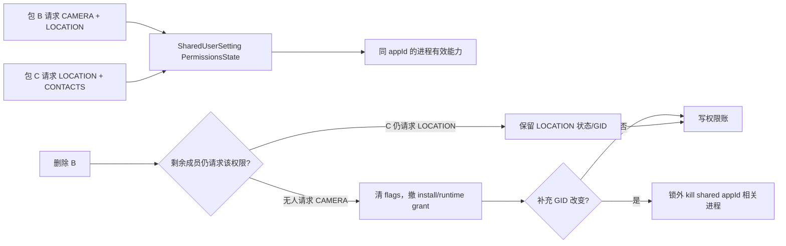
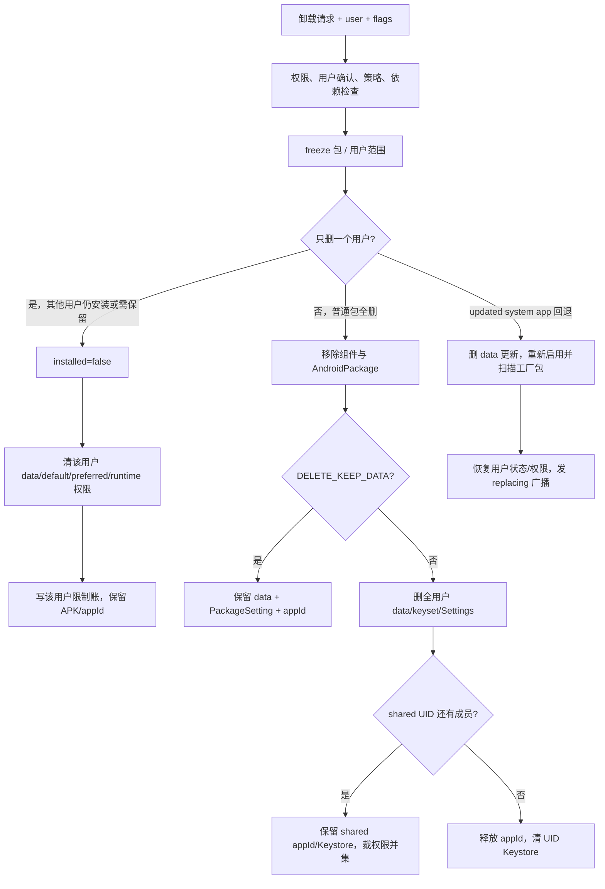

# 第553章 Android 包身份与卸载收敛链：SharedUserSetting、appId分配回收、shared UID权限、用户卸载与系统包回退

> 源码基线：AOSP `android-11.0.0_r48`（Android 11 / API 30）  
> 学习目标：理解包怎样取得并长期保留 appId，多个包共享 Linux UID 后签名、权限、SELinux 与进程状态怎样合并；再沿用户级卸载、全量卸载和系统更新回退，追踪代码、数据、权限、Settings、Keystore、广播与 appId 的不同完成点。  
> 阅读约定：本章继续在 macOS 上只读源码，不要求编译或连接真机。

## 1. 本章从一个危险问题开始

假设 A、B 两个 APK 使用同一个 shared UID。删除 A 时，系统能不能顺手释放 UID、撤销所有权限、删除 Keystore 数据？

不能。B 仍依赖同一个 appId、同一份 UID 级权限和密钥空间。PMS 必须先判断“删的是某用户的一份安装状态、一个 shared UID 成员，还是整个身份的最后一个持有者”。

## 2. 一句话主线

普通包通常独占一个 appId；shared UID 的多个包共同指向一个 `SharedUserSetting` 和一份 `PermissionsState`。卸载先决定作用域，再分别清解析对象、用户状态、应用数据、权限与 Settings；只有身份确实无人使用时，才释放 appId 并清 UID 级资源。

## 3. 与上一章怎样衔接

第552章说明 `packages.xml` 保存普通包 `userId=appId`，shared UID 包保存 `sharedUserId=appId`，并另写 `<shared-user>`。

本章继续回答：

- 新 appId 怎样分配进索引；
- shared user 怎样成为多个包的身份中心；
- 删除一个包时为什么有时返回 appId、有时返回 -1；
- 卸载系统更新为什么又会出现同名包；
- 哪些“删除成功”其实只是某个用户的 installed=false。

## 4. 先区分四种“ID”

- package name：Java/Manifest 世界里的逻辑名称。
- appId：UID 的应用部分，普通应用范围通常 10000—19999。
- userId：Android 多用户编号，例如 0、10。
- uid：运行时完整 Linux UID，近似由 `userId + appId` 编码组合。

`packages.xml` 普通包节点的历史属性名 `userId` 实际存 appId，仍要保持上一章的警惕。

## 5. sharedUserId 是名字，不是数字

Manifest 的 `android:sharedUserId` 是一个经过包名式校验的字符串。Settings 再把这个名字映射到 `SharedUserSetting`，后者持有数值 `userId` 字段——该字段在这里实际也是 shared appId。

同一术语同时出现字符串名字、字段 `userId` 和 Linux UID，最容易造成阅读错位。

## 6. shared UID 会合并哪些边界

同一 shared UID 的成员至少共享或聚合：

- appId/运行时 Linux UID；
- `PermissionsState` 与补充 GID；
- shared-user 签名身份；
- UID 级系统/privileged 标志；
- 为保持同一 SELinux domain 而选择的 seInfo target；
- 同名进程声明的聚合视图。

但每个包仍有自己的代码路径、版本、组件和 per-user installed 状态。

## 7. 第一幅图：普通包与 shared UID 的身份拓扑



图中 UID 示例用于说明组合关系，不要求手算时死记十进制位数；源码应使用 `UserHandle.getUid()`。

## 8. appId 的可分配范围

r48 的 `Process.FIRST_APPLICATION_UID` 是 10000，`LAST_APPLICATION_UID` 是 19999，共 10000 个普通应用 appId。

低于 10000 的 ID 包含 system、radio、shell 等预定义身份，不走普通应用数组的同一索引方式。

## 9. Settings 用两张 appId 索引

`mAppIds` 是 `ArrayList<SettingBase>`，用于应用范围；数组下标是 `appId - FIRST_APPLICATION_UID`。

`mOtherAppIds` 是 `SparseArray<SettingBase>`，用于低位/特殊 appId。索引值指向普通 `PackageSetting` 或 `SharedUserSetting`，所以“appId → 对象”的返回类型是基类 `SettingBase`。

## 10. 为什么索引值可能是两种对象

普通包独占 appId 时，索引直接指向它的 `PackageSetting`。

共享身份时，索引必须指向 `SharedUserSetting`；否则从 UID 反查只会看到某一个成员，无法得到共享权限、成员集合与聚合进程信息。

## 11. registerExistingAppIdLPw 的职责

从 `packages.xml` 恢复或沿用 disabled system package appId 时，PMS 不应重新分配，而是把指定值注册回索引。

该函数会：

1. 拒绝高于 `LAST_APPLICATION_UID` 的值；
2. 对应用范围把 `mAppIds` 补 null 到目标下标；
3. 检查目标槽是否已占用；
4. 写入对象；
5. 对低位 ID 使用 `mOtherAppIds`。

重复 ID 会记录 Settings 错误并拒绝后来的对象。

## 12. addPackageLPw 对重复包名也保留第一个

若 `mPackages` 已有同名记录且 appId 相同，直接返回旧对象；若同名但 appId 不同，则报告“Adding duplicate package, keeping first”并返回 null。

这里优先保护既有身份，不会为了让 XML 看起来完整而覆盖第一条记录。

## 13. 新普通包先以 appId=0 表示待分配

`Settings.createNewSetting()` 为真正新包创建 `PackageSetting` 时，构造参数里的 sharedUserId 为 0。

若它没有 shared user、也没有要继承的 disabled system package，appId 暂时仍是 0；扫描结果进入 reconcile 前，再由 `registerAppIdLPw()` 分配。

## 14. shared user 在包设置创建前取得 appId

`scanPackageNewLI()` 看到 Manifest sharedUserId 后，调用 `getSharedUserLPw(name, ..., create=true)`。

若名字不存在，Settings 立即创建 `SharedUserSetting`、调用 allocator 分配并注册 appId，然后放入 `mSharedUsers`。随后新 `PackageSetting.appId` 直接采用 `sharedUser.userId`。

## 15. appId 分配为什么叫“乐观注册”

扫描只是候选，reconcile/commit 后面仍可能失败。为了让后续步骤能使用确定 UID，PMS 先 `optimisticallyRegisterAppId()`。

若此次确实创建了普通包 appId，而后续失败，finally/异常分支调用 `cleanUpAppIdCreation()` 清槽；这是一种“先占位、失败补偿”，不是数据库事务。

## 16. 第一段关键源码：分配、释放与 r48 扫描起点

```java
// frameworks/base/services/core/java/com/android/server/pm/Settings.java
void removeAppIdLPw(int appId) {
    if (appId >= Process.FIRST_APPLICATION_UID) {
        final int index = appId - Process.FIRST_APPLICATION_UID;
        if (index < mAppIds.size()) mAppIds.set(index, null);
    } else {
        mOtherAppIds.remove(appId);
    }
    setFirstAvailableUid(appId + 1);
}

private void setFirstAvailableUid(int uid) {
    if (uid > mFirstAvailableUid) {
        mFirstAvailableUid = uid;
    }
}

private int acquireAndRegisterNewAppIdLPw(SettingBase obj) {
    final int size = mAppIds.size();
    for (int i = mFirstAvailableUid; i < size; i++) {
        if (mAppIds.get(i) == null) {
            mAppIds.set(i, obj);
            return Process.FIRST_APPLICATION_UID + i;
        }
    }
    if (size > (Process.LAST_APPLICATION_UID - Process.FIRST_APPLICATION_UID)) {
        return -1;
    }
    mAppIds.add(obj);
    return Process.FIRST_APPLICATION_UID + size;
}
```

注意单位：循环变量 `i` 是数组下标，`removeAppIdLPw()` 传给扫描起点的却是绝对 appId + 1。

## 17. r48 已释放槽位通常不会立即复用

假设释放 appId 10005：数组槽是 5，但 `mFirstAvailableUid` 会被推进到 10006。对最大仅约 10000 项的 `mAppIds`，循环起点通常已经不小于 size，于是 allocator 直接在尾部追加。

这是按 r48 代码可验证的实际计算结果。源码没有在这里解释意图，本章不把它武断命名为安全策略，也不单凭这一段断言产品必然耗尽；但阅读本版本时不能反过来说“删除后总会优先复用最小空洞”。

## 18. mFirstAvailableUid 还是 static

该字段是 `static`，不是每个 `Settings` 对象独立的普通成员。

真实 system_server 通常只有主实例；测试或同进程重建对象时，这个高水位可能跨实例残留。判断测试行为时要留意静态状态。

## 19. 容量判断允许最后一个 appId

当 `mAppIds.size()==9999` 时，`size > LAST-FIRST` 仍为 false，可追加下标 9999，返回 19999。

下一次 size=10000，条件成立并返回 -1，安装上层把它转换为 `INSTALL_FAILED_INSUFFICIENT_STORAGE`。此错误名不仅可能代表字节空间，也可能代表无法取得 appId。

## 20. 乐观清理本身也会推进高水位

普通新包已获得 appId、但 reconcile/commit 失败时，`cleanUpAppIdCreation()` 调用同一个 `removeAppIdLPw()`。

所以“最终未安装成功”也可能改变本进程后续 allocator 的扫描起点。补偿恢复了槽位占用，却不等于所有分配器元数据回到调用前。

## 21. 新 shared user 的副作用更微妙

`getSharedUserLPw(create=true)` 已先注册 shared appId。随后包的 `registerAppIdLPw()` 会发现该槽已有 `SharedUserSetting`，返回 false，也就是“此次没有创建新的包 appId”。

若后续安装失败，基于该 false 的普通 cleanup 不会删除刚创建的空 shared user。源码在 `scanPackageNewLI()` 上方也承认“potentially creating a new shared user setting”仍是待解决的副作用。

## 22. 空 shared user 会在何时被裁剪

开机 system package 扫描后调用 `mSettings.pruneSharedUsersLPw()`：

- 移除成员已不在 `mPackages` 的引用；
- 名下没有成员的 shared user 从 `mSharedUsers` 删除。

但该函数只删名字映射，没有同时调用 `removeAppIdLPw()`。因此本次启动内 appId 索引仍可能暂留旧对象；下一次从已重写的 XML 重建时才自然消失。

## 23. pruneSharedUsers 不是安装失败的即时回滚器

它位于开机系统包扫描流程，不是每次普通安装失败都会调用。

因此运行期创建后失败的空 shared user 可能一直保留到重启，或被后来真正加入同名 shared UID 的包复用。诊断 duplicate appId 时应看创建失败历史。

## 24. SharedUserSetting 自己也是 SettingBase

`SettingBase` 只持有限定后的 package flags/private flags 与一份 `PermissionsState`。

普通 `PackageSetting` 继承它；`SharedUserSetting` 也继承它。二者共有权限容器接口，但 shared 包的 `PackageSetting.getPermissionsState()` 会转发到 shared user。

## 25. 包自己的权限容器可能不是有效容器

`PackageSetting` 基类里始终有 `mPermissionsState`，但 `getPermissionsState()` 在 `sharedUser != null` 时返回 `sharedUser.getPermissionsState()`。

因此不能用“Java 对象里字段存在”推断它被业务读取。共享身份的有效授权状态集中在 shared user 上。

## 26. packages 集合是成员关系的核心

`SharedUserSetting.packages` 是 `ArraySet<PackageSetting>`。add/remove 成员会触发 flags、private flags 与进程聚合更新。

包自身也保存 `sharedUser` 反向引用；提交时两边必须一起收敛，`addPackageSettingLPw()` 还会修正 appId 索引指向 shared user。

## 27. public flags 采用 OR 聚合

`uidFlags` 是与 UID 本身关联的基线；成员加入后用 `this.pkgFlags | packageSetting.pkgFlags` 聚合。

成员移除时，若可能影响聚合结果，就从 `uidFlags` 起重新 OR 所有剩余成员。`SettingBase.setFlags()` 最终只保留 SYSTEM 与 EXTERNAL_STORAGE 等允许位。

## 28. private flags 也采用受限 OR 聚合

privileged、OEM、vendor、product、system_ext、required-for-system-user、ODM 等允许位被聚合。

这意味着 shared UID 任一成员的相关身份可能影响 UID 级判断；移除后必须重算，不能只对当前整数做异或。

## 29. 进程声明按进程名合并

`addProcesses()` 遍历成员的 parsed processes。名字首次出现时复制 `ParsedProcess`，再次出现则 `addStateFrom()`。

删除成员后 `updateProcesses()` 清空并从剩余所有包重建，避免被删包的进程属性永久残留。

## 30. per-user installed 仍然属于每个包

B 与 C 共享 appId，不代表它们对用户 10 必须同时 installed。每个 `PackageSetting` 仍有自己的 `PackageUserState`。

查询 shared UID 在某用户是否完全无成员安装，需要求所有成员“not installed 用户集合”的交集，而不是并集。

## 31. SharedUserSetting.getNotInstalledUserIds 的交集含义

源码先取第一个成员的 not-installed users，再逐成员移除那些“当前成员其实已安装”的 userId。

最终留下的是：对这个 userId，没有任何 shared UID 成员安装。只有这时才能把 shared 身份整体看作在该用户不可用。

## 32. SELinux 为什么选择最低 targetSdk

所有 shared UID 包必须进入同一 SELinux domain。r48 用成员中最低 targetSdkVersion 作为 shared `seInfoTargetSdkVersion`，对应较少最新限制的兼容域。

若每个成员按自己的 target 生成 seInfo，相同 UID 却落入不同域，会破坏 shared UID 进程/文件访问模型。

## 33. 新成员不会在运行期随意切换整个 UID 的 seInfo

`SELinuxMMAC.getTargetSdkVersionForSeInfo()` 的注释明确说：shared user 已有成员后，即使新装/更新包 target 更低，也不会立刻修改 shared target，要等下次启动。

理由是保持所有已运行/现有包仍处于同一 domain，避免半个 UID 当场切换标签策略。

## 34. 开机末尾才统一 fixSeInfoLocked

所有包扫描完后，PMS 遍历 shared users，`fixSeInfoLocked()` 找最低 target，并给每个成员写 `overrideSeInfo`。

同一阶段还会对 shared user 做 ABI 调整和进程表重建。此时 PMS 已经看见完整成员集合，适合统一决定。

## 35. 删除最低 target 成员也不会当场提高域

`removePackage()` 重算 flags 和 processes，却没有重置/重新计算 `seInfoTargetSdkVersion`；`fixSeInfoLocked()` 自身也只在发现更小 target 时下调。

所以本次启动内删除最低 target 成员后，shared target 可能保持较旧的低值；重启创建新对象并扫描剩余成员后才可能提高。这里的“延迟”与保持运行期 domain 稳定一致。

## 36. shared UID 的 ABI 也要协调

开机时 `getAdjustedAbiForSharedUser()` 计算共同 ABI，`applyAdjustedAbiToSharedUser()` 把结果写入相关 `PackageSetting`，必要时删除旧 dex。

shared UID 成员可能共享进程，不能让同一个 Linux UID 的运行环境出现互不兼容的指令集选择。

## 37. shared 签名不只是“证书字节完全相等”

`verifySignatures()` 会用 `SHARED_USER_ID` capability 双向检查新旧 signing lineage，也保留 compat/recover 迁移。

证书轮换场景中，新证书能否继续共享 UID 取决于 lineage 与 capability，不应简化成普通 `Signature.equals()`。

## 38. 还要检查所有成员的 lineage

若新包含 past signing certificates，PMS 遍历 shared UID 其他成员：对处于新包 lineage 中的旧 signer，必须仍授予 `SHARED_USER_ID` capability。

最后还要求新包与 shared user 签名 lineage 有共同祖先，阻止分叉谱系借同名 sharedUserId 合并身份。

## 39. “只有自己一个成员”有特殊更新例外

如果 capability 检查失败，但 shared user 当前仅有一个成员且就是被更新包，源码允许继续比较。

这是为“唯一成员更新 lineage 并撤销旧 key 的 shared-UID capability”准备的特殊情况；不能扩展到有其他成员的 shared UID。

## 40. system package OTA 的签名例外很严格

系统分区包验签失败时，r48 可能允许 OTA 更新 shared user 的签名，但同一次启动只允许第一个成员初始化变化；后续成员必须一致。

首发 API level 大于 29 的设备遇到系统 shared UID 签名不一致可抛 `IllegalStateException`，因为继续启动会让系统身份处于不可预测状态。

## 41. 第二段关键源码：成员加入、移除与运行期稳定

```java
// frameworks/base/services/core/java/com/android/server/pm/SharedUserSetting.java
boolean removePackage(PackageSetting packageSetting) {
    if (!packages.remove(packageSetting)) return false;
    if ((pkgFlags & packageSetting.pkgFlags) != 0) {
        int aggregatedFlags = uidFlags;
        for (PackageSetting ps : packages) aggregatedFlags |= ps.pkgFlags;
        setFlags(aggregatedFlags);
    }
    if ((pkgPrivateFlags & packageSetting.pkgPrivateFlags) != 0) {
        int aggregatedPrivateFlags = uidPrivateFlags;
        for (PackageSetting ps : packages) {
            aggregatedPrivateFlags |= ps.pkgPrivateFlags;
        }
        setPrivateFlags(aggregatedPrivateFlags);
    }
    updateProcesses();
    return true;
}

void addPackage(PackageSetting packageSetting) {
    if (packages.size() == 0 && packageSetting.pkg != null) {
        seInfoTargetSdkVersion = packageSetting.pkg.getTargetSdkVersion();
    }
    if (packages.add(packageSetting)) {
        setFlags(pkgFlags | packageSetting.pkgFlags);
        setPrivateFlags(pkgPrivateFlags | packageSetting.pkgPrivateFlags);
    }
    if (packageSetting.pkg != null) addProcesses(packageSetting.pkg.getProcesses());
}
```

注意 remove 没有重算 seInfo target 和签名；这些状态有各自更谨慎的生命周期。

## 42. 第二幅图：shared UID 的权限并集与删成员



“包 C 没在自己的 Manifest 请求 CAMERA，却同 UID 受益”正是 shared UID 扩大安全边界的根本原因。

## 43. 权限查询会走 shared user 慢路径

修改权限 flags 时，如果目标包自己未请求该权限，PermissionManagerService 会查询同 shared UID、该用户下已安装的其他包。

只要某成员请求，便可操作共享 `PermissionsState` 中的该权限。权限语义属于 UID，但 API 入口仍以包名做安全与可见性检查。

## 44. shared UID 权限不是简单永久并集

安装/更新会重新收集所有成员当前请求的权限；不再被任何成员请求的 install/runtime permission 需要裁剪。

因此并集是“当前有效成员声明 + 平台策略”的动态结果，不是历史上任何成员请求过就永远保留。

## 45. 全量删成员前要保存 deletedPkg

`removePackageDataLIF()` 一开始先把 `deletedPs.pkg` 保存为 `deletedPkg`，随后会从 PMS 组件/包表移除该包。

后面计算“被删包请求了哪些权限”、销毁数据、构造广播仍需要解析对象，所以不能在删除索引后再按包名查询。

## 46. updateSharedUserPermsLPw 只看被删包请求项

它遍历 `deletedPs.pkg.getRequestedPermissions()`，对每项检查 shared user 剩余成员是否仍请求。

仍有人请求便保留；无人请求才清 flags、尝试撤 install permission 与该用户 runtime permission。

## 47. disabled system package 还能保住权限

若被删的是 data 分区的 updated system app，`mDisabledSysPackages` 里可能还有被遮蔽的工厂包。

只要工厂版本仍请求该权限，helper 不撤销，因为马上恢复系统版本后它仍需要这项能力。

## 48. install permission 与 runtime permission 的撤销粒度不同

install permission 对 shared user 是跨用户状态，撤销造成 GID 变化时返回 `USER_ALL`。

runtime permission 按传入 userId 撤销；外层对所有用户逐个调用 helper，再汇总是否需要 kill。

## 49. 源码注释在这里写错了一个词

`revokeRuntimePermission()` 上方注释写“Try to revoke as an install permission which is per user”。

实际调用和数据都明确是 runtime permission。这是注释漂移，阅读时应信函数与类型，不能照抄注释。

## 50. GID 改变为什么要杀进程

Linux 进程补充组在创建时确定。磁盘权限状态变了，已运行进程的 group list 不会自动缩减。

helper 发现撤权引起 GID 变化后，外层把 kill 投递到 Handler，离开锁再调用三参数重载 `killApplication(packageName, appId, KILL_APP_REASON_GIDS_CHANGED)`；该重载内部再补上 `USER_ALL`。这样既避免持锁调用 ActivityManager，也避免各用户下的旧进程继续持有已撤组能力。

## 51. 替换安装还有更完整的裁剪器

PermissionManagerService 的 `revokeUnusedSharedUserPermissionsLocked()` 先收集所有成员请求权限的并集，再遍历共享 install/runtime 状态删除未使用项。

它用于 shared UID 包替换/权限重算；卸载 helper 与它目标相近，但入口、回调与 GID 处理并非同一个函数。

## 52. runtime permission 持久化按 shared-user 节点写

上一章看到 permission APEX 文件分别输出 package 与 shared-user 两类节点。

普通包状态以包名为键；shared UID 只写一次 shared user 名对应的权限列表，避免给每个成员复制一份看似独立、实则冲突的授权。

## 53. shared user 签名写在 packages.xml 顶层

`writeLPr()` 对 `mSharedUsers` 写 `<shared-user name=... userId=...>`，其中包含 shared signatures 与 install permissions。

各成员 `<package>` 仍写自身签名，升级时既校验包自己的历史，也校验它与 shared identity 的兼容性。

## 54. Instant App 禁止声明 sharedUserId

安装准备阶段若 instant app 的 parsed package 含 sharedUserId，直接以 `INSTALL_FAILED_INSTANT_APP_INVALID` 拒绝。

Instant App 的临时、受限身份模型与跨包长期共享 UID 不兼容。

## 55. static shared library 也禁止 sharedUserId

解析 `<static-library>` 时，只要包已有 sharedUserId 就返回 `INSTALL_PARSE_FAILED_BAD_SHARED_USER_ID`。

“静态共享库”共享的是版本化代码依赖，不是 Linux UID；两个“shared”概念完全不同。

## 56. 卸载入口先处理身份与用户交互

`deletePackageVersionedInternal()` 要求 `DELETE_PACKAGES`，规范化 renamed/static-lib 包名，检查 locked task、silent uninstall 资格、跨用户权限、用户限制和 block-uninstall。

不满足静默卸载条件时，它回调 `onUserActionRequired(ACTION_UNINSTALL_PACKAGE)`，并未开始实际删除。

## 57. DELETE_PACKAGES 不等于任意静默卸载

调用者还必须属于允许静默卸载的角色/来源，或走专门的 allowSilent 路径。否则系统要求用户确认。

这体现两层门：有能力请求卸载，不代表能绕过用户界面直接执行。

## 58. DELETE_ALL_USERS 还要过跨用户门

删除所有用户时，PMS 枚举用户并要求 `INTERACT_ACROSS_USERS_FULL`（在跨用户条件成立时）。

若部分用户被 block-uninstall，源码会为未阻止用户逐个做 user-only 卸载，但最终整体回调仍报告 `DELETE_FAILED_OWNER_BLOCKED`。

## 59. 设备管理员、锁定任务和静态库依赖会阻止删除

`deletePackageX()` 拒绝 active device admin；前置还拒绝 locked-task 基础包。

若包提供 static shared library 且目标用户仍有依赖者，返回 `DELETE_FAILED_USED_SHARED_LIBRARY`，不会先删再等依赖崩溃。

## 60. 真正删除被投递到 PMS Handler

API 线程完成检查后 `mHandler.post()` 执行 `deletePackageX()`。删除可能涉及 installd、数据目录、扫描恢复和广播，不能堵住 Binder 入口。

Observer 最终收到结果；observer 死亡只记录日志，不反向撤销已经完成的删除。

## 61. 删除前先 freeze 对应范围

普通用户卸载通常 freeze 指定用户；卸载 updated system app 的更新若会回退工厂版本，则 freeze `USER_ALL`。

冻结防止旧代码在结构切换期间继续启动或运行，尤其系统包回退会影响所有用户。

## 62. 先决定 user-only 还是 full delete

条件核心是：

- 目标不是 system app，或明确带 `DELETE_SYSTEM_APP`；
- userId 不是 `USER_ALL`。

先把该用户标记未安装；若其他用户仍安装，或设备策略要求保留 uninstalled package，则只清该用户状态并返回。否则暂时把 installed 设回 true，以便进入 full delete 与正确广播。

## 63. 第三段关键源码：user-only 分叉

```java
// frameworks/base/services/core/java/com/android/server/pm/PackageManagerService.java
if ((!systemApp || (flags & PackageManager.DELETE_SYSTEM_APP) != 0)
        && userId != UserHandle.USER_ALL) {
    synchronized (mLock) {
        markPackageUninstalledForUserLPw(ps, user);
        if (!systemApp) {
            boolean keep = shouldKeepUninstalledPackageLPr(packageName);
            if (ps.isAnyInstalled(mUserManager.getUserIds()) || keep) {
                clearPackageStateAndReturn = true;
            } else {
                ps.setInstalled(true, userId);
                mSettings.writeKernelMappingLPr(ps);
                clearPackageStateAndReturn = false;
            }
        } else {
            clearPackageStateAndReturn = true;
        }
    }
    if (clearPackageStateAndReturn) {
        clearPackageStateForUserLIF(ps, userId, outInfo, flags);
        synchronized (mLock) {
            scheduleWritePackageRestrictionsLocked(user);
        }
        return;
    }
}
```

这里“设回 installed=true”只是在转入全量删除前恢复广播/状态语义，并不是撤销用户请求。

## 64. markPackageUninstalledForUserLPw 重置哪些状态

目标用户被设为：

- installed=false；
- stopped=true、notLaunched=true；
- enabled=DEFAULT；
- hidden/suspended/instant/virtualPreload=false；
- 组件覆盖清空；
- app-link generation=0；
- install/uninstall reason=UNKNOWN；
- harmful warning 清空。

旧 domainVerificationStatus 被保留，而不是完全清零。

## 65. user-only 卸载不会删除全局 APK

其他用户仍安装时，`PackageSetting`、appId、组件的全局解析记录和代码路径都保留。

查询目标用户时 per-user installed=false 把组件过滤掉；另一用户仍可使用同一 APK。这就是“卸载应用”在多用户设备上的第一种含义。

## 66. user-only 可以只删除一个用户的数据

`clearPackageStateForUserLIF()` 在没有 `DELETE_KEEP_DATA` 时只对目标 userId 调 `destroyAppDataLIF()`，覆盖 DE、CE 和 external 数据。

同一包其他用户的数据目录不应被删除；它们使用不同 userId/UID 与路径。

## 67. profile 清理范围比数据更宽

进入 `clearPackageStateForUserLIF()` 后先调用 `destroyAppProfilesLIF(pkg)`，没有 userId 参数。

因此即使只卸载一个用户，编译 profile 的清理也按包级处理；不要把所有清理项都假设成严格 per-user。

## 68. user-only 还会清默认与权限

对每个受影响用户，源码清默认浏览器、Keystore 中该 user/appId 数据、包 preferred activities，并调用 `resetRuntimePermissions(pkg, userId)`。

最后 schedule 该用户 `package-restrictions.xml`；权限回调会按自身同步/异步策略写权限账。

## 69. shared UID 的 reset 会保护其他已安装成员

`resetRuntimePermissionsInternal()` 查询该用户下已安装的 shared UID 包。若另一成员仍请求某权限，跳过对该权限的 reset。

因为 `markPackageUninstalledForUserLPw()` 已先把当前包 installed=false，成员查询不会把被删包自己当作保留理由。

## 70. 默认/Role/策略固定权限也有保护

runtime reset 不覆盖 SYSTEM_FIXED 或 POLICY_FIXED；GRANTED_BY_DEFAULT/ROLE 会重新确保 granted。

所以“卸载某个 shared 成员”不等于把 shared UID 所有 runtime flags 无条件归零，平台策略仍参与结果。

## 71. keep-uninstalled package 是另一种保留条件

DevicePolicy 可通过 PackageManagerInternal 设置需保留的包名单。即使最后一个用户卸载，PMS 仍可能保留代码/全局设置，只把该用户标未安装并清数据。

当包从保留名单移除且确实无人安装，PMS 再异步触发 full delete。

## 72. DELETE_KEEP_DATA 与保留名单不是同一个机制

`DELETE_KEEP_DATA` 控制删除过程是否销毁 app data/Settings 身份；keep-uninstalled list 决定 user-only 分支是否保留包代码与全局记录。

二者可在不同调用场景生效，不能都翻译成“卸载后保留数据”。

## 73. full delete 先移除运行期包结构

`removePackageDataLIF()` 先调用 `removePackageLI()`，从 PMS `mPackages` 删除 `AndroidPackage`，并清组件、权限定义、protected broadcast、instrumentation、shared libraries 等运行期结构。

此时 `Settings.mPackages` 里的 `PackageSetting` 仍暂时存在，供后续清 keyset、AppsFilter、权限与 appId。

## 74. 不带 KEEP_DATA 才销毁所有用户数据

full delete 且无 `DELETE_KEEP_DATA` 时，`destroyAppDataLIF(..., USER_ALL, DE|CE|EXTERNAL)` 删除全用户应用数据，并销毁 profiles。

带 KEEP_DATA 时跳过这一块，也跳过后面 `mSettings.removePackageLPw()` 的完整身份删除。

## 75. KEEP_DATA 会保留 PackageSetting 与 appId

Settings 删除、appId 释放、Keystore UID 清理都位于“不保留数据”分支或依赖其返回值。

所以 full delete + KEEP_DATA 不是“只剩裸数据目录”：PMS 还保留用于后续重装继承的包设置身份。它常用于替换/恢复流程，不能随意对普通卸载套用。

## 76. AppsFilter 与 keyset 在身份删除前清理

无 KEEP_DATA 时，锁内依次清域名验证、默认浏览器、包 keyset、AppsFilter，然后调用 `mSettings.removePackageLPw()`。

随后 PermissionManager 更新该包定义，再处理 shared UID 剩余权限和 preferred activity。不同子系统没有单一 transaction 对象。

## 77. 普通包 full delete 返回自己的 appId

`Settings.removePackageLPw()` 对非 shared 包调用 `removeAppIdLPw(p.appId)` 并返回 appId。

外层把它写入 `PackageRemovedInfo.removedAppId`，随后用于 Keystore 清理和 `ACTION_UID_REMOVED`。

## 78. shared UID 非最后成员不会释放 appId

它先从 `sharedUser.packages` 移除当前包。若集合仍非空，不删除 `mSharedUsers`、不清 appId 索引，并最终返回 -1。

因此外层不执行 UID 级 Keystore 清理，也不把共享身份广播成已移除。

## 79. shared UID 最后成员才删除共同身份

若成员集合变空，Settings 删除 shared user 名映射、调用 `removeAppIdLPw(sharedUser.userId)` 并返回共同 appId。

此时才可把该 UID 视为无人持有，并清所有用户下对应 Keystore 数据。

## 80. Keystore 清理为什么依赖 removedAppId

appId 非 -1 时，`removePackageDataLIF()` 对 `USER_ALL` 调 `removeKeystoreDataIfNeeded(..., removedAppId)`。

对 shared UID 非最后成员返回 -1，恰好保护其他成员仍使用的 UID 级密钥；普通包或最后成员则完整清理。

## 81. 删除 installer 包还会改其他包的来源

`removePackageLPw()` 调 `removeInstallerPackageStatus(name)`。如果被删包曾作为其他包的 installer，遍历剩余 `PackageSetting`，从 installSource 移除该 installer 名。

发起/来源信息的具体保留由 `InstallSource.removeInstallerPackage()` 决定，不是删除所有安装历史字段。

## 82. shared flags 在成员删除后重算

`SharedUserSetting.removePackage()` 以 UID 基线 flags 加剩余成员重新 OR，避免已删 privileged/system 成员的标志永久污染 shared UID。

但只有允许位会被 `SettingBase.setFlags/setPrivateFlags` 保留；这不是对完整 `ApplicationInfo.flags` 的任意合并。

## 83. shared processes 会立即从剩余成员重建

这部分与 seInfo 不同：remove 直接调用 `updateProcesses()`，因此被删包独有的进程声明当场消失。

同名进程若还有其他成员声明，则聚合对象仍存在，并由剩余成员重新构造。

## 84. seInfo 则故意不立即重算

运行期提高或降低 shared UID 的 domain 可能使同 UID 进程状态不一致。因此本版本把统一 recalculation 放在下次启动全成员扫描后。

同一个 removePackage() 对 processes 与 seInfo 采取不同策略，是理解生命周期设计的好例子。

## 85. 第三幅图：三类卸载的分叉与收敛



图中每条分支都可能有独立磁盘写和异常窗口，不是一个不可分割操作。

## 86. PermissionManager 还要移除被删包定义的权限

`mPermissionManager.updatePermissions(deletedPs.name, null)` 不只是处理被请求权限，也处理该包作为 permission owner 定义的权限。

若某权限定义随包消失，其他包的相关授权可能受影响；所以卸载清理不能只遍历 deletedPkg.requestedPermissions。

## 87. preferred activity 清理可能影响默认 HOME

full delete 清该包所有用户 preferred activities，收集 changedUsers；锁外更新默认 HOME 并发送 preferred changed 广播。

用户级卸载则只清受影响用户。默认应用是 per-user 策略，不应因为另一个用户卸载而全局清空。

## 88. 写 Settings 发生在资源文件真正删除前

`removePackageDataLIF()` 可同步 `mSettings.writeLPr()`；`deletePackageX()` 随后先发送 removed 广播，最后才在 `mInstallLock` 下执行 `outInfo.args.doPostDeleteLI(true)` 删除代码资源。

注释说明先给其他进程收到广播并清引用，再删除资源。不要把“包从查询消失”与“APK 文件已 unlink”当成同一时刻。

## 89. static shared library 不发送普通移除广播

`PackageRemovedInfo.sendPackageRemovedBroadcastInternal()` 对 static shared lib 直接返回。

这类库只对依赖者可见，且有依赖时本就不允许删除；广播可见性与普通应用不同。

## 90. ACTION_PACKAGE_FULLY_REMOVED 的条件更窄

只有 `dataRemoved=true` 且不是“移除系统更新、马上回退工厂包”时才发送 FULLY_REMOVED，并通知 package removed observer。

普通 PACKAGE_REMOVED 可以带 `EXTRA_REPLACING`，表示身份并未真正从系统消失。

## 91. updated system app 为什么有两份设置

data 分区更新生效时：

- `mPackages` 是当前 update；
- `mDisabledSysPackages` 保存 system/product 等分区工厂版本。

卸载更新不是把包彻底删除，而是销毁/移走 data 版本，再启用、重扫工厂版本。

## 92. disableSystemPackageLPw 的 copy 有历史状态

安装系统更新时，Settings 把原 `PackageSetting` 复制到 disabled map，保留工厂路径、appId、签名、权限与用户组件覆盖参考。

前面章节已经提醒该复制并非所有内部对象深拷贝；流程依赖后续 scan/reconcile 正确更新，不能把两份设置当成完全隔离快照。

## 93. 是否保留数据取决于版本回退

卸载系统更新时，若工厂 `disabledPs.versionCode < data update versionCode`，源码清掉 `DELETE_KEEP_DATA`，即版本降级时删除数据。

若工厂版本不低于当前更新，则设置 KEEP_DATA。这个判断优先考虑旧代码读取新数据的兼容风险。

## 94. 先删更新，再启用工厂记录

`deleteInstalledPackageLIF()` 清当前 update；随后锁内 `enableSystemPackageLPw(disabledPs.pkg)` 把工厂 `PackageSetting` 重新加入全局表，并清 updated-system-app 标志。

之后才以 system partition parse/scan flags 调 `installPackageFromSystemLIF()`。

## 95. 工厂 APK 必须重新扫描

恢复不是简单把 disabled `pkg` 引用塞回 ComponentResolver。PMS 按真实 codePath 再 `scanPackageTracedLI()`，更新 shared libraries、准备 app data，并重新执行权限更新。

这保证组件与当前磁盘工厂 APK 一致。

## 96. 权限状态会跨回退传递再裁剪

调用恢复时把 `deletedPs.getPermissionsState()` 传入；新工厂 `PackageSetting` 先 copyFrom 这份状态，然后 `updatePermissions(factoryPkg)` 移除工厂版本不再适用的权限并授 install permissions。

这是“保留用户选择，再按旧 Manifest 收敛”，不是无条件原样恢复所有 grant。

## 97. 每用户 installed 状态要跨回退传播

删除前 `PackageRemovedInfo.origUsers` 记录哪些用户已安装 update。恢复工厂包后逐用户重新设置 installed，并为已安装用户清 uninstallReason。

即使调用参数 `writeSettings=false`，源码仍显式 `writeAllUsersPackageRestrictionsLPr()`，因为这份传播不能丢。

## 98. runtime permission 写仍然异步

恢复循环对每个用户调用 `writeRuntimePermissionsForUserLPr(userId, false)`；第二个参数 false 表示非同步写。

随后若 `writeSettings=true`，`writeLPr()` 又会安排权限写。多次 schedule 会被权限持久化层合并。

## 99. stub system app 还有二次状态处理

若工厂包是 compressed stub，恢复扫描后先把 stub 在 system user 禁用；外层稍后可能启用压缩包对应的完整版本，再恢复原 enabled state。

因此 system-update uninstall 返回成功时，代码资源和 enabled 状态可能还经历 stub 展开步骤。

## 100. 系统更新回退发送一组 replacing 广播

removed 阶段带 `EXTRA_REPLACING=true`；恢复成功后又发 PACKAGE_ADDED、PACKAGE_REPLACED 和定向 MY_PACKAGE_REPLACED。

监听者应把它理解成“同一包身份换回另一版本”，而不是“永久卸载后安装一个新 UID”。

## 101. ACTION_UID_REMOVED 也可能不表示 UID 真释放

`PackageRemovedInfo` 的注释明确指出：卸载 system app update 时 UID 实际没有移除，但某些服务仍需知道受影响包名。

因此 replacing 场景的 UID_REMOVED extras 会额外放 package name。消费者必须结合 `EXTRA_REPLACING`，不能只凭 action 名清掉所有长期 UID 状态。

## 102. 恢复工厂包失败会把删除报告成失败

`installPackageFromSystemLIF()` 抛异常时包装成 `SystemDeleteException`，`deletePackageLIF()` 返回 false。

但流程此前可能已经移除 update、修改 Settings 或数据；源码没有统一回滚事务。错误处理要查看当时系统包是否已重新启用、scan 到哪一步，而不能只看最终 code。

## 103. commit 源码自己承认可能半提交

`commitReconciledScanResultLocked()` 注释警告：方法中途可能抛异常并留下不一致系统状态，未来应改成到达 commit 后不再失败。

这与 appId 乐观注册、shared user 提前创建、卸载多子系统清理共同说明：r48 PMS 大量依赖补偿和重启收敛，而非通用数据库事务。

## 104. 开机会清理哪些残留

开机读 packages.xml、扫描 system/data 包、裁空 shared users、处理可能丢失的 updated system app、协调 appId/签名/组件，最后重写 Settings。

但“能重启收敛”不是忽略运行期错误的理由。appId 索引残留、部分数据已删等情况仍要用日志确认具体恢复结果。

## 105. appId 稳定为什么比复用节省更重要

appId 参与：

- Linux 文件 owner；
- Keystore namespace；
- runtime permission 与 AppOps UID 状态；
- packages.list/GID；
- 进程和广播 UID；
- 外部存储映射。

错误复用旧 appId 可能让新包继承旧身份残留。PMS 宁可保守维护历史，也不能把它当普通自增数据库主键随意重排。

## 106. shared UID 的安全模型要按“共同信任域”理解

签名兼容只是准入门。加入后，同 UID 成员会共享 Linux DAC 身份和许多 UID 级授权，数据隔离也显著减弱。

所以源码在签名 lineage、SELinux domain、ABI、进程与权限上做共同收敛。它不是为了减少 UID 数量的轻量优化。

## 107. 场景一：普通包只从用户10卸载

假设是普通卸载、没有 `DELETE_KEEP_DATA`，且用户0仍安装：

1. 用户10 installed=false、stopped/notLaunched=true；
2. 只删用户10 DE/CE/external data；
3. 清用户10 preferred、browser、runtime permission、Keystore；
4. APK、全局 PackageSetting 和 appId 保留；
5. 写用户10 restrictions；
6. 广播只面向受影响用户集合。

这不是 full delete。

## 108. 场景二：普通包最后一个用户卸载

假设没有 `DELETE_KEEP_DATA`、也未命中 keep-uninstalled 名单，PMS 暂时把该用户 installed 恢复 true 后转 full delete，移除组件/包、删全用户数据与 profiles、清 keyset/AppsFilter/权限/preferred、删除 Settings/appId/Keystore，写回并发广播。

代码资源在广播之后做 post-delete 清理，所以每个完成点要单独记录。

## 109. 场景三：全量删除 shared UID 的一个非末成员

假设 A 已进入不保留数据的 full delete；从成员集合移除 A 后，B 仍存在：

- shared appId 不释放；
- UID Keystore 不全清；
- flags/processes按 B 重算；
- A 独有且无人请求的权限/flags撤销；
- B 仍请求的权限保留；
- GID 变化时 kill 共同 appId 进程；
- shared signing identity继续存在。

返回 -1 在这里是“没有 UID 被移除”，不是删除失败。

## 110. 场景四：卸载 updated system app

删除 data update，按版本决定数据是否保留；启用 disabled factory setting，用 system flags 重新扫描，拷贝并裁剪权限，恢复各用户 installed，写 restrictions/settings，再发送 replacing 语义的 removed/added/replaced 广播。

最终包名与 appId通常不变，代码版本/路径回到工厂分区。

## 111. 调试卸载问题的七步顺序

1. 确认请求 package name 是否被规范化；
2. 确认 userId、DELETE_ALL_USERS、DELETE_SYSTEM_APP、KEEP_DATA；
3. 看是否因 admin、block、locked task、static-lib dependency 被拒；
4. 看 user-only 分支是否返回；
5. 看 Settings.removePackageLPw 返回 appId 还是 -1；
6. 看 shared permission/GID、Keystore 和写回；
7. 若是 system update，再追 disabledPs 重扫与 replacing 广播。

只看“observer 返回成功”无法回答数据、UID 和工厂恢复是否分别完成。

## 112. macOS只读练习一：追 appId 索引、分配与释放

目标：验证 10000—19999 范围、数组下标换算和 r48 高水位行为：

```bash
set -eu
AOSP_SRC=/Users/ninebot/androidSource
SETTINGS_JAVA="$AOSP_SRC/frameworks/base/services/core/java/com/android/server/pm/Settings.java"
PROCESS_JAVA="$AOSP_SRC/frameworks/base/core/java/android/os/Process.java"
test -f "$SETTINGS_JAVA"
test -f "$PROCESS_JAVA"
rg -n 'FIRST_APPLICATION_UID|LAST_APPLICATION_UID' "$PROCESS_JAVA"
rg -n 'mAppIds|mOtherAppIds|registerExistingAppIdLPw|removeAppIdLPw|setFirstAvailableUid|acquireAndRegisterNewAppIdLPw' "$SETTINGS_JAVA"
sed -n '1088,1161p' "$SETTINGS_JAVA"
sed -n '4296,4321p' "$SETTINGS_JAVA"
```

阅读后手算：释放 appId 10005 时，空槽下标和新的循环起点分别是多少？

## 113. macOS只读练习二：追 shared UID成员、签名与seInfo

目标：对齐成员聚合、签名 capability 和运行期不切换 SELinux domain：

```bash
set -eu
AOSP_SRC=/Users/ninebot/androidSource
SHARED_JAVA="$AOSP_SRC/frameworks/base/services/core/java/com/android/server/pm/SharedUserSetting.java"
UTIL_JAVA="$AOSP_SRC/frameworks/base/services/core/java/com/android/server/pm/PackageManagerServiceUtils.java"
SEINFO_JAVA="$AOSP_SRC/frameworks/base/services/core/java/com/android/server/pm/SELinuxMMAC.java"
rg -n 'packages|addPackage|removePackage|fixSeInfoLocked|updateProcesses|getNotInstalledUserIds' "$SHARED_JAVA"
rg -n 'SHARED_USER_ID|hasCommonAncestor|revoked the sharedUserId capability' "$UTIL_JAVA"
rg -n 'getTargetSdkVersionForSeInfo|will NOT be modified until next boot|same selinux domain' "$SEINFO_JAVA"
```

阅读后回答：为什么进程聚合能立即重建，而 seInfo target 要等完整启动扫描？

## 114. macOS只读练习三：区分用户卸载、全量删除和 shared权限裁剪

目标：追 `markPackageUninstalledForUserLPw` 到 full delete 的分叉：

```bash
set -eu
AOSP_SRC=/Users/ninebot/androidSource
PMS_JAVA="$AOSP_SRC/frameworks/base/services/core/java/com/android/server/pm/PackageManagerService.java"
SETTINGS_JAVA="$AOSP_SRC/frameworks/base/services/core/java/com/android/server/pm/Settings.java"
PERM_JAVA="$AOSP_SRC/frameworks/base/services/core/java/com/android/server/pm/permission/PermissionManagerService.java"
rg -n 'deletePackageX|executeDeletePackageLIF|markPackageUninstalledForUserLPw|clearPackageStateForUserLIF|removePackageDataLIF|DELETE_KEEP_DATA' "$PMS_JAVA"
rg -n 'updateSharedUserPermsLPw|removePackageLPw|removeAppIdLPw' "$SETTINGS_JAVA"
rg -n 'resetRuntimePermissionsInternal|revokeUnusedSharedUserPermissionsLocked|getSharedUserPackagesForPackage' "$PERM_JAVA"
```

阅读后回答：为什么删除 shared UID 非最后成员时 `removePackageLPw()` 返回 -1？

## 115. macOS只读练习四：追 updated system app工厂回退和广播

目标：确认数据保留条件、工厂重扫、用户状态传播与 replacing 广播：

```bash
set -eu
AOSP_SRC=/Users/ninebot/androidSource
PMS_JAVA="$AOSP_SRC/frameworks/base/services/core/java/com/android/server/pm/PackageManagerService.java"
SETTINGS_JAVA="$AOSP_SRC/frameworks/base/services/core/java/com/android/server/pm/Settings.java"
rg -n 'disableSystemPackageLPw|enableSystemPackageLPw|mDisabledSysPackages' "$SETTINGS_JAVA"
rg -n 'deleteSystemPackageLIF|installPackageFromSystemLIF|isRemovedPackageSystemUpdate|sendSystemPackageUpdatedBroadcasts|EXTRA_REPLACING|ACTION_UID_REMOVED' "$PMS_JAVA"
sed -n '18934,19100p' "$PMS_JAVA"
```

阅读后回答：工厂版本更低时为什么清 `DELETE_KEEP_DATA`，以及为什么 UID_REMOVED 不能单独证明 UID 已释放？

## 116. 常见故障定位矩阵

| 现象 | 第一证据 | 关键分支 | 容易忽略 |
|---|---|---|---|
| 新安装报 UID/空间不足 | Settings critical log、mAppIds | allocator 返回 -1 | 不一定是磁盘字节不足 |
| 同 sharedUserId 安装失败 | 签名 lineage/capability log | `verifySignatures` | 包签名匹配自己仍可能不匹配 shared identity |
| 删 A 后 B 丢权限 | shared members/requested perms | `updateSharedUserPermsLPw` | 工厂 disabled 包也可能保权限 |
| 只在一个用户仍能/不能看到包 | per-user installed | user-only branch | APK 和 appId 可能仍全局存在 |
| 卸载后数据仍在 | DELETE_KEEP_DATA / keep list | full vs user-only | 保留名单与 KEEP_DATA 不同 |
| Keystore 被保留 | removedAppId=-1 | shared 非最后成员 | 这是保护共同 UID |
| 系统 App“卸载后又回来” | disabled system setting | factory restore | 实际是卸载 data update |
| 收到 UID_REMOVED 但 UID还在 | EXTRA_REPLACING | system-update broadcast | action 名不等于字面终态 |
| 安装失败后 appId 仍占 | 新 shared user 副作用 | cleanup bool | boot prune 也不立即清 appId索引 |
| 删除成功但 APK稍后才消失 | PackageRemovedInfo.args | post-delete | 广播先于资源删除 |

## 117. 最容易出现的二十个误解

1. appId 就是完整 UID——还要与 Android userId 组合。
2. XML 的 userId 一定是多用户 ID——包节点里是 appId。
3. 删除包后最小空 appId 会立刻复用——r48 代码不能支持这个结论。
4. 乐观注册失败补偿完全无副作用——高水位和新 shared user 可能残留。
5. prune 空 shared user 会同步清 appId 索引——该函数没有调用 removeAppId。
6. sharedUserId 只是让两包共享数据 API——它合并 Linux 身份和大量 UID 级能力。
7. shared UID 每个包仍有独立 runtime grant——有效 `PermissionsState` 在 shared user。
8. shared UID 要求证书字节永远完全相等——轮换还看 lineage/capability。
9. 新低 target 成员会立即让所有包切 seInfo——源码明确等下次启动。
10. 删除最低 target 成员会立即提高 domain——remove 不重算 seInfo target。
11. 卸载某成员必须撤它请求的全部权限——剩余成员仍请求的要保留。
12. full delete 一个 shared UID 非末成员总会发 UID_REMOVED——`removePackageLPw()` 返回 -1；注意 user-only 分支会为目标用户设置广播用的 removedAppId，不能混为一谈。
13. “卸载成功”总会删 APK——user-only 分支保留全局代码。
14. 最后一个用户卸载天然就是 user-only——源码会转入 full delete。
15. keep-uninstalled 与 DELETE_KEEP_DATA 是同一 flag——不是。
16. KEEP_DATA 只保留目录、不保留身份——r48 还保留 PackageSetting/appId。
17. 用户级卸载的所有清理都只影响该用户——profiles 是包级清理。
18. uninstall system update 等于彻底移除系统包——会回退工厂版本。
19. ACTION_UID_REMOVED 必然意味着 UID 已不存在——replacing 是明确反例。
20. 删除 observer 成功意味着所有文件已先删除——代码资源 post-delete 在广播之后。

## 118. 本章源码导航

| 主题 | 源码文件与入口 |
|---|---|
| appId索引/分配 | `Settings.java`：`registerAppIdLPw`、`registerExistingAppIdLPw`、`removeAppIdLPw`、`acquireAndRegisterNewAppIdLPw` |
| 新设置/shared创建 | `Settings.createNewSetting`、`getSharedUserLPw` |
| shared UID内存账 | `SharedUserSetting.java` |
| 权限基类 | `SettingBase.java`、`PackageSetting.getPermissionsState` |
| shared签名 | `PackageManagerServiceUtils.verifySignatures`、PMS reconcile 签名分支 |
| seInfo | `SELinuxMMAC.getTargetSdkVersionForSeInfo`、`SharedUserSetting.fixSeInfoLocked` |
| 权限裁剪 | `Settings.updateSharedUserPermsLPw`、`PermissionManagerService.revokeUnusedSharedUserPermissionsLocked` |
| 卸载入口 | `PackageManagerService.deletePackageVersionedInternal`、`deletePackageX` |
| 分叉执行 | `executeDeletePackageLIF`、`markPackageUninstalledForUserLPw`、`clearPackageStateForUserLIF` |
| full delete | `removePackageDataLIF`、`Settings.removePackageLPw` |
| 系统包回退 | `deleteSystemPackageLIF`、`installPackageFromSystemLIF`、`enableSystemPackageLPw` |
| 广播 | `PackageRemovedInfo` |
| 设备策略保留 | `PackageManagerInternalImpl.setKeepUninstalledPackages` |

推荐顺序：先手算 appId 索引，再读 `SharedUserSetting` 全文件；接着只画出 `executeDeletePackageLIF` 的三条分支，最后深入每条清理函数。不要一开始就在两千多行卸载代码里来回跳。

## 119. 生成后复读修正记录

本章生成后按“ID单位、共享粒度、用户作用域、失败补偿、广播字面含义”复读，完成这些修正：

- 把 appId、userId、uid 与 XML 历史 `userId` 分开，避免把数组下标和绝对 appId混用。
- 依据 r48 算术补出 `removeAppIdLPw(appId+1)` 与 allocator 下标循环的单位错位；仅陈述可验证行为，没有无证据命名设计意图。
- 补出 `mFirstAvailableUid` 为 static，乐观 appId 清理仍会改变后续高水位。
- 补出新 shared user 在 scan 前创建、普通 cleanup bool 为 false时可能留下空 shared user；boot prune 又只删名字映射、不清 appId 索引。
- 修正“shared UID 成员权限各自独立”，明确 `PackageSetting.getPermissionsState()` 转发共同状态。
- 修正“shared 签名必须简单相等”，加入 certificate lineage、`SHARED_USER_ID` capability、共同祖先与唯一成员例外。
- 补出 seInfo target 在运行期不随新低 target或删除成员立即变化，而 processes/flags 会重建。
- 修正“卸载就是删 APK”，拆成用户级逻辑卸载、full delete、KEEP_DATA 和系统更新回退。
- 补出用户级卸载保留 domain status，却重置 link generation/组件覆盖，并且包 profiles 清理不是 per-user。
- 明确 shared UID 非最后成员返回 -1 是“身份未删除”，从而保护 appId 与 Keystore。
- 补出 updateSharedUserPerms 上方把 runtime 写成 install permission 的注释漂移。
- 修正“系统更新卸载保留数据”：r48 依据工厂/更新 versionCode 决定，真实降级会清 KEEP_DATA。
- 补出权限状态先 copy 到工厂设置再按旧 Manifest 收敛、restrictions 即使 writeSettings=false也强制写。
- 补出 static shared library 不发普通删除广播，以及 replacing 场景 UID_REMOVED 不代表 UID 真释放。
- 收紧 UID_REMOVED 的适用范围：full delete 非末 shared 成员没有 removedAppId，但 user-only 分支会为受影响用户携带 appId。
- 修正 GID 变化后的 kill 调用：外层使用三参数重载，`USER_ALL` 由重载内部补入。
- 明确资源 post-delete 晚于 removed 广播，observer 结果不能替代各子系统完成点。
- 四个 macOS 练习只用 `test`、`rg`、`sed`，不改源码、不编译。

## 120. 本章结论与下一步

记住五句话：

1. appId 是长期安全身份，不是可以随意重排的普通序号。
2. shared UID 的多个包共同持有 appId、权限、签名与安全域；删除成员必须先求剩余并集。
3. 用户级卸载主要写 installed=false并清该用户状态，full delete 才考虑释放身份。
4. shared UID 只有最后成员消失时才释放 appId并清 UID 级 Keystore。
5. 卸载 updated system app 是一次版本回退，广播和 UID action 必须结合 replacing 解释。

下一章进入第554章：读取包变化广播、`PackageMonitor`、UID/package observers、缓存失效与系统消费者收敛链，解释 PMS 状态改变后“谁在什么时候收到什么，以及为什么广播到达不等于所有后台消费者已经同步”。
