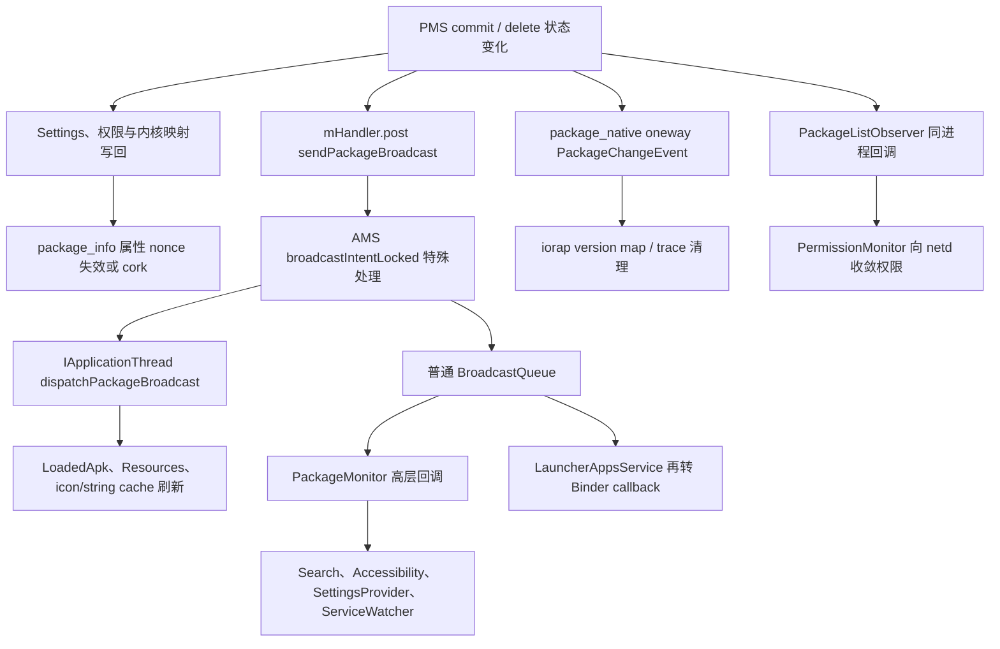
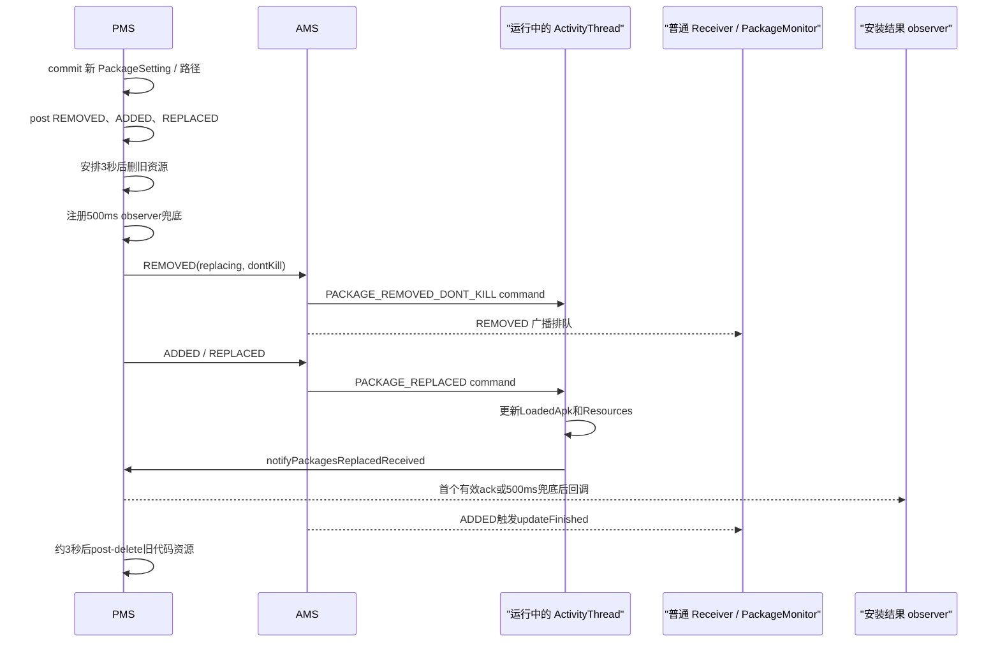
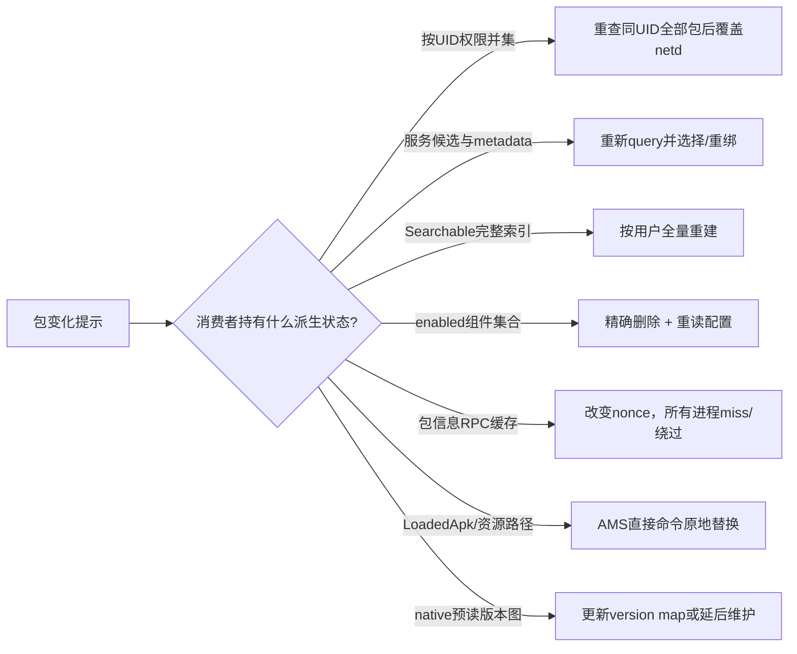

# 第554章 Android 包变化通知与缓存收敛链：Package广播、PackageMonitor、PackageListObserver、UID观察与系统消费者

> 源码基线：AOSP `android-11.0.0_r48`（Android 11 / API 30）  
> 学习目标：把“PMS 已修改权威状态”“包变化事件已发出”“AMS 已执行内部清理”“某个监听者已回调”“所有消费者缓存已收敛”拆成不同完成点，理解广播、system_server 本地观察者、native Binder 观察者、进程内资源刷新和属性失效缓存各自解决什么问题。  
> 阅读约定：继续在 macOS 上只读源码，不编译、不连接设备；文中的先后关系以 r48 代码为准。

## 1. 本章从一句危险判断开始

“安装接口返回成功，所以 Launcher、Settings、netd、运行中的 App 和 native 服务此刻一定都已经看见新包。”

这句话不成立。安装成功首先表示 PMS 的主流程成功；不同消费者通过同步本地回调、异步 Binder、普通广播、直接进程命令或共享属性 nonce 得知变化，它们没有共同的全局完成栅栏。

## 2. 一句话主线

PMS 先改变权威内存状态，并同步完成或安排必要写回，再按用途发出多条通知；system_server 内部观察者可以较早同步执行，AMS 在广播入队前还做一批权威清理，`PackageMonitor` 把 Intent 翻译成高层回调，客户端进程和各系统服务最后按自己的线程、缓存与重建策略逐步收敛。

## 3. 与第553章怎样衔接

第553章已经追到用户卸载、full delete 和 updated system app 回退，并指出代码资源可能在 removed 广播后才真正删除。

本章继续回答：

- PMS 到底发哪些动作和 extras；
- 为什么一次更新会被 `PackageMonitor` 看成“先消失、后出现”；
- AMS 为什么不仅转发广播，还主动清 AppOps、URI grant、RecentTasks 和进程缓存；
- system_server 内部监听为什么可以早于普通 Receiver；
- `ACTION_UID_REMOVED`、`IUidObserver.onUidGone()` 与 appId 释放为什么不是一个概念；
- 缓存怎样在没有广播回调的情况下立即绕开旧值。

## 4. 先拆成六个通知平面

1. PMS 权威内存与 Settings 持久化；
2. `PackageManagerInternal.PackageListObserver` 本进程同步回调；
3. `package_native` 的 `IPackageChangeObserver` oneway Binder；
4. PMS → AMS 的 package lifecycle Intent；
5. AMS → 运行中 `ActivityThread` 的直接 package command；
6. `PropertyInvalidatedCache` 共享属性 nonce 与各消费者自己的重建。

它们可能携带相同包名，却不是同一条消息的不同写法。

## 5. 通知不是权威数据库

包名、版本、installed、enabled、权限、可见性等最终事实仍应向 PMS/对应服务重查。

通知更像“你依赖的事实可能变了，请刷新”。如果监听者离线、进程重启或中途异常，正确恢复方式应是重新枚举/查询，而不是假设自己收齐了从开机以来的每一个事件。

## 6. 一次变化有多个完成点

可按下面的时间点分别打日志：

- T1：scan/reconcile/commit 已修改内存；
- T2：Settings/权限账已同步写或已安排写；
- T3：本地观察者已被调用；
- T4：PMS 已把发送任务 post 到 Handler；
- T5：AMS 已执行 package 特殊副作用并把广播入队；
- T6：某 Receiver/LauncherApps callback 已执行；
- T7：旧 APK/资源已 post-delete；
- T8：每个消费者自己的缓存或绑定已重建。

“完成”必须指明是哪一个 T。

## 7. 第一幅图：六个平面的总体拓扑



图中箭头表示调用/通知关系，不表示所有末端都完成后才向安装者返回。

## 8. 先认清包广播词汇

- `PACKAGE_ADDED`：目标用户现在看见包；更新完成时也会发，但带 replacing。
- `PACKAGE_REMOVED`：目标用户不再看见旧实例；更新开始也会发，但带 replacing。
- `PACKAGE_REPLACED`：更新后的包已就位。
- `MY_PACKAGE_REPLACED`：显式只发给被更新包自己。
- `PACKAGE_CHANGED`：包或组件 enabled 等状态变化。
- `PACKAGE_FULLY_REMOVED`：数据已按 full-delete 语义移除，且不是系统更新回退。
- `UID_REMOVED`：PMS 删除路径发出的 UID 影响通知，不能脱离 extras/分支解释。

## 9. 普通更新为什么会出现四个动作

成功替换通常按 PMS post 顺序产生：

1. `PACKAGE_REMOVED` + `EXTRA_REPLACING=true`；
2. `PACKAGE_ADDED` + `EXTRA_REPLACING=true`；
3. `PACKAGE_REPLACED`；
4. 显式 `MY_PACKAGE_REPLACED`。

安装器、required verifier 还可能收到额外的定向 ADDED/REPLACED。这里是多次广播，不是一个拥有四个阶段的事务对象。

## 10. PackageMonitor 故意不监听 PACKAGE_REPLACED

它的 package filter 注册 ADDED、REMOVED、CHANGED、restart 与 data-cleared，却没有 `ACTION_PACKAGE_REPLACED`。

更新开始由 REMOVED + replacing 映射为 `onPackageUpdateStarted()`；更新结束由 ADDED + replacing 映射为 `onPackageUpdateFinished()`。这样高层监听者不必再处理一次 REPLACED 重复结束事件。

## 11. 首次安装的 ADDED 含义

没有 replacing 时，`PackageMonitor` 依次调用：

1. `onPackageAdded(packageName, uid)`；
2. `onPackageAppeared(packageName, PACKAGE_PERMANENT_CHANGE)`；
3. `onSomePackagesChanged()`；
4. `onFinishPackageChanges()`。

`uid` 是广播针对当前 changing user 重写后的完整 UID，不要默认它永远等于 appId。

## 12. 普通移除的 REMOVED 含义

没有 replacing 时，回调顺序是：

1. `onPackageRemoved()`；
2. 若 `EXTRA_REMOVED_FOR_ALL_USERS=true`，再调 `onPackageRemovedAllUsers()`；
3. `onPackageDisappeared(..., PACKAGE_PERMANENT_CHANGE)`；
4. `onSomePackagesChanged()`；
5. `onFinishPackageChanges()`。

“向用户10发了 removed”和“已从设备所有用户移除”由不同信息表达。

## 13. FULLY_REMOVED 比 REMOVED 更窄

`PackageRemovedInfo` 只在 `dataRemoved=true` 且不是系统更新回退时发送 `PACKAGE_FULLY_REMOVED`，同处还调用 system_server 的 `notifyPackageRemoved()`。

user-only 卸载即使物理删除目标用户 data，r48 的 `clearPackageStateForUserLIF()` 也没有把 `outInfo.dataRemoved` 设为 true；这里的 extra 更接近“全量包数据已移除”，不能反推目标用户目录未删除。

## 14. UID_REMOVED 不是 appId 释放证明

三种反例已经能在源码中找到：

- 卸载 updated system app 时 appId 马上被工厂版本继续使用，extras 带 replacing；
- user-only 卸载会把 `removedAppId=ps.appId` 用于目标用户广播，但全局 appId 仍保留；
- user-only 删除 shared UID 的一个成员时，同用户的其他成员甚至可能仍使用该完整 UID。

因此 `ACTION_UID_REMOVED` 是删除流程信号，不是 `Settings.removeAppIdLPw()` 已发生的同义词。

## 15. PackageMonitor 还会丢掉 UID_REMOVED 的上下文

处理 `ACTION_UID_REMOVED` 时，它只调用 `onUidRemoved(intent.getIntExtra(EXTRA_UID, 0))`。

`EXTRA_REPLACING` 与系统更新场景附带的 `EXTRA_PACKAGE_NAME` 没有进入这个高层回调。仅覆写 `onUidRemoved(int)` 的消费者必须把它当清理/重查触发器，不能单凭该参数宣告身份永久消失。

## 16. 第一段关键源码：广播发送只是异步入口

```java
// frameworks/base/services/core/java/com/android/server/pm/PackageManagerService.java
public void sendPackageBroadcast(String action, String pkg, Bundle extras,
        int flags, String targetPkg, IIntentReceiver finishedReceiver,
        int[] userIds, int[] instantUserIds,
        SparseArray<int[]> broadcastWhitelist) {
    mHandler.post(() -> {
        IActivityManager am = ActivityManager.getService();
        if (am == null) return;
        int[] resolvedUserIds = userIds == null
                ? am.getRunningUserIds() : userIds;
        doSendBroadcast(am, action, pkg, extras, flags, targetPkg,
                finishedReceiver, resolvedUserIds, false, broadcastWhitelist);
        if (instantUserIds != null && instantUserIds != EMPTY_INT_ARRAY) {
            doSendBroadcast(am, action, pkg, extras, flags, targetPkg,
                    finishedReceiver, instantUserIds, true, null);
        }
    });
}
```

调用者返回时，普通广播通常尚未进入 AMS。

## 17. 同一个 Handler 保住的是 post 次序

同一 `handlePackagePostInstall()` 先后调用多次 `sendPackageBroadcast()`，每次都向 PMS Handler 尾部 post Runnable。

这使 REMOVED、ADDED、REPLACED 的提交顺序可推演，但不等于所有接收者完成顺序构成全局事务；AMS 还会拆动态/Manifest receiver、不同用户与定向广播。

## 18. userIds=null 只解析正在运行的用户

发送 Runnable 中，`userIds == null` 会调用 `am.getRunningUserIds()`，不是枚举设备上所有已创建用户。

外置存储可用/不可用等资源变化常走 null。休眠且未运行用户不会因为这次广播被当场启动来消费通知，之后必须靠权威状态恢复。

## 19. EXTRA_USER_HANDLE 是 PackageMonitor 的硬前提

`doSendBroadcast()` 为每个目标 user 都写入 `Intent.EXTRA_USER_HANDLE`。

`PackageMonitor.onReceive()` 第一件事就是读取它；若得到 `USER_NULL`，只打印警告并直接 return，连 `onBeginPackageChanges()` 与 `onFinishPackageChanges()` 都不会执行。手工构造测试 Intent 时很容易漏掉此项。

## 20. EXTRA_UID 会按目标用户重写

同一 appId 发往用户0和用户10时，`doSendBroadcast()` 检查 extra 中原 UID 的 user 部分；若不同，使用 `UserHandle.getUid(targetUser, getAppId(uid))` 重写。

所以 Receiver 不应把第一次构造 Bundle 时的 UID 当作所有用户共同值。

## 21. Instant App 被拆成另一批发送

普通 userIds 与 instantUserIds 分开调用 `doSendBroadcast()`。

Instant App 批次要求 `ACCESS_INSTANT_APPS`，且传入的 visibility whitelist 为 null；这里依赖权限门，而不是把普通包可见性的 whitelist 原样复用。

## 22. AppsFilter whitelist 同时裁动态和Manifest接收者

PMS 计算“哪些 appId 能看见变化包”的有序数组；AMS 对 Manifest `ResolveInfo` 和动态 `BroadcastFilter` 都删除不在数组中的 application appId。

低于 `FIRST_APPLICATION_UID` 的系统身份不受这一步裁剪。whitelist 是包可见性门，不替代 receiver exported、权限、用户状态和后台执行规则。

## 23. 定向 installer/verifier 通知绕开一般 whitelist

PMS 除了通用广播，还会用 `intent.setPackage(targetPkg)` 定向通知 installer、required verifier/installer。

这些调用传入 null whitelist，有的还加 `FLAG_RECEIVER_INCLUDE_BACKGROUND`，目的是让承担安装职责的包即使不在普通运行/可见集合里也能获知结果。

## 24. r48 的删除可见性存在分支不对称

替换安装在移除旧包前把 `mAppsFilter.getVisibilityWhitelist()` 存入 `removedInfo`，之后 REMOVED/REPLACED 复用它。

普通 `deletePackageX()` 新建的 `PackageRemovedInfo` 没有同样赋值；本版本该路径向 `sendPackageBroadcast()` 传 null whitelist。这里只陈述源码差异，不把它扩展成所有版本的隐私结论；AMS 的其他接收规则仍继续生效。

## 25. static shared library 不走普通生命周期广播

安装 static shared library 时，PMS 不直接发普通 ADDED，而是给它的 consumer 发 `PACKAGE_CHANGED`。

删除侧 `PackageRemovedInfo.sendPackageRemovedBroadcastInternal()` 也对 static shared lib 直接 return。代码依赖变化和可启动应用变化是两种不同通知语义。

## 26. 通用包广播通常没有完成回调

PMS 只有 `finishedReceiver != null` 时才要求 serialized；常规 ADDED/REMOVED/CHANGED 多数传 null。

因此 `sendPackageBroadcast()` 没有等待所有 Receiver 的 ack。若业务必须在消费者完成后做事，应建立自己的幂等协议或重新查询，不能把“广播已调用”当完成回执。

## 27. AMS 不是透明转发器

包相关 Intent 进入 `ActivityManagerService.broadcastIntentLocked()` 后，会先进入 action switch 执行系统内部副作用，再解析、过滤并入 BroadcastQueue。

这意味着某些系统状态已经在任何普通 Receiver 之前收敛；也意味着调试时只看 Receiver 日志会漏掉最重要的清理。

## 28. 包特殊广播受系统权限保护

UID_REMOVED、PACKAGE_REMOVED、PACKAGE_CHANGED、external available/unavailable 和 suspend/unsuspend 等动作要求发送者拥有 `BROADCAST_PACKAGE_REMOVED`。

普通应用不能伪造同等权威的包删除信号去驱动 AMS 清理。PMS 经 system 身份进入该路径。

## 29. AMS 对 UID_REMOVED 做什么

AMS 先从 extra 取 UID，通知 BatteryStats 删除 UID。

若 replacing=true，则调用 AppOps `resetAllModes(userId, packageName)`；否则调用 `uidRemoved(uid)`。这里再次证明 replacing 的 UID_REMOVED 不等于 UID 真正消失。

## 30. AMS 对非 replacing 的 PACKAGE_REMOVED 做什么

AMS 源码把 `removed && !replacing` 记入名为 `fullUninstall` 的局部变量；该条件也覆盖 user-only 的 REMOVED，并不等于 PMS 一定删除了全局 `PackageSetting`。随后 AMS 会执行：

- 通知 AppOps package removed；
- 按广播 user 删除该包授予/获得的 URI grants；
- 按 user 删除 RecentTasks 中对应记录；
- force-stop 相关 Service；
- 通知 ATMS package uninstalled；
- 通知 BatteryStats package uninstalled。

这些是广播入口的同步特殊处理，不是某个 Manifest Receiver 的工作；每项的具体用户范围仍要看它收到的 `userId` 参数，不能因局部变量名就推断设备上所有用户都已 full delete。

## 31. 更新开始的 REMOVED 只做受控切换

REMOVED + replacing 不进入 fullUninstall 清理，因此不会把 URI grants、recent tasks 等按永久卸载处理。

它仍可能依据 `EXTRA_DONT_KILL_APP` kill 包进程或只 kill app zygote，并向运行进程分发 PACKAGE_REMOVED/PACKAGE_REMOVED_DONT_KILL command，准备刷新旧引用。

## 32. PACKAGE_CHANGED 的 kill 取决于 extra

若 `EXTRA_DONT_KILL_APP=false`，AMS 按包/appId/user 杀相关进程；随后清理被禁用组件的运行记录。

PMS 对小粒度组件变化还会加 `FLAG_RECEIVER_REGISTERED_ONLY`，避免为一个组件开关唤起大量 Manifest receiver。

## 33. PACKAGE_REPLACED 会更新运行态 ApplicationInfo

AMS 先重新向 PMS 查询 `ApplicationInfo`；查询不到就丢弃这个 REPLACED。

查到后更新 association、通知 ATMS、刷新 Service 的 ApplicationInfo，再向所有运行中进程发送 `ApplicationThreadConstants.PACKAGE_REPLACED` command。

## 34. PACKAGE_ADDED 也有 AMS 内部消费者

AMS 调用 `mAtmInternal.onPackageAdded(packageName, replacing)`，并查询版本后记入 BatteryStats package installed。

这发生在普通 Receiver 排队前；Launcher 收到 ADDED 不是系统开始认识该包的第一时刻。

## 35. PACKAGE_DATA_CLEARED 不等于移除包

AMS 只通知 `mAtmInternal.onPackageDataCleared(packageName)` 等相关清理；PackageMonitor 映射为 `onPackageDataCleared()`。

它不会触发 `onSomePackagesChanged()`，因为组件集合通常没变。SettingsProvider 则利用专门回调删除该 UID/包写入的 Settings 状态。

## 36. AMS 还有一条直达所有运行进程的命令

`ProcessList.sendPackageBroadcastLocked()` 遍历 LRU 进程，只要 `r.thread != null` 且用户匹配，就调用 `IApplicationThread.dispatchPackageBroadcast(cmd, packages)`。

这不是普通 `BroadcastReceiver.onReceive()`；即使应用没有注册包广播，运行进程仍可能收到缓存维护命令。

## 37. 进程命令为什么要覆盖“无关”进程

一个进程可能通过 Context、Resources 或共享库加载另一个包的 `LoadedApk`、图标和字符串。

所以不能只通知被更新包自己的进程。每个运行进程都检查自身弱引用缓存，决定是否真的持有受影响包。

## 38. kill 模式的 PACKAGE_REMOVED 会删 LoadedApk 弱表项

`ActivityThread.handleDispatchPackageBroadcast()` 对 PACKAGE_REMOVED 在 `mPackages` 与 `mResourcePackages` 找到活对象后，killApp=true 时移除表项。

`PACKAGE_REMOVED_DONT_KILL` 不删表项，因为稍后的 REPLACED 要原地更新仍运行应用的引用。

## 39. no-kill 更新需要原地修 LoadedApk

PACKAGE_REPLACED command 到达后，进程重新查询新 `ApplicationInfo`，更新正在运行 Activity 的 info，计算旧资源路径，再调用 `LoadedApk.updateApplicationInfo()`。

如果不做这一步，旧进程会继续用旧 sourceDir、split 和 resource 路径，广播层“更新成功”也救不了它。

## 40. ResourcesManager 替换资源实现

更新 `LoadedApk` 后，`ResourcesManager.applyNewResourceDirsLocked()` 把受影响 `Resources` 指向新目录。

这就是 PMS 对 `killApp=false` 特别谨慎的原因：代码、资源与运行对象同时存在一段交接窗口。

## 41. ApplicationPackageManager 还清图标与字符串缓存

每个进程最后调用 `ApplicationPackageManager.handlePackageBroadcast()`，按 package name 删除静态 icon/string cache 条目，并安排 GC；外置存储不可用时立即 GC。

这套缓存刷新来自 AMS 的直接进程命令，不依赖应用实现 `PackageMonitor`。

## 42. 第二幅图：no-kill 更新的真实时序



安装 observer、PackageMonitor 和旧资源删除之间没有同一个终点。

## 43. 运行进程会向 PMS 回报资源已刷新

处理 PACKAGE_REPLACED command 的 `ActivityThread` 收集真正持有该包 `LoadedApk` 的包名，调用 `notifyPackagesReplacedReceived()`。

PMS 据此提前完成 no-kill 安装 observer；不持有该包的进程传空数组，不会误报完成。

## 44. 安装 observer 仍有500毫秒兜底

`DEFERRED_NO_KILL_INSTALL_OBSERVER_DELAY_MS` 是 500ms。

若没有“主包名等于被替换包”的运行进程，`ProcessList` 会直接通知 PMS；这个 `foundProcess` 判断并不会检查其他进程是否仅通过资源/共享库持有该包的 `LoadedApk`。若找到目标包进程但回报没及时到，Handler 的 500ms message 最终仍回调安装者。它是有界等待，不是所有进程确认栅栏。

## 45. 旧代码资源另等3秒

`DEFERRED_NO_KILL_POST_DELETE_DELAY_MS` 是 3 秒；到时才在 install lock 下 `doPostDeleteLI(true)`。

安装 observer 最迟约500ms回调并不能证明旧 APK 已删。两个定时器服务不同目标：一个改善调用者完成体验，一个给运行进程的资源切换留窗口。

## 46. PackageMonitor 本质是动态 BroadcastReceiver

它注册三组静态 `IntentFilter`：带 `package:` data 的包动作、不带 data 的 UID/user/suspend 动作，以及可选 external storage 动作。

它不是 PMS 的直接 observer，也不保证在进程不存活时补发历史事件。

## 47. Handler 决定回调线程

传入 Looper 时新建 Handler；传 null Looper 时使用 `BackgroundThread.getHandler()`；也可直接传自定义 Handler。

因此子类不能默认回调在主线程。需要改 UI 时还要切回 UI Handler，需要持服务锁时则要分析所选线程与锁顺序。

## 48. user=null 与 UserHandle.ALL 不同

register 的 user 参数为 null 时调用普通 `context.registerReceiver()`，跟随 Context 所在用户。

要跨用户监听需显式传 `UserHandle.ALL`，且接收者仍要通过 `getChangingUserId()` 区分事件属于哪个用户。

## 49. onBegin/onFinish 只包住一条 Intent

每次有效 `onReceive()` 先调 begin、最后调 finish。

一次 App 更新的 REMOVED 与 ADDED 是两条 Intent，因此会有两对 begin/finish；它们不是“整个更新事务”的 begin/end。

## 50. onSomePackagesChanged 不是万能总回调

普通 add/remove、更新完成、external available/unavailable、suspend/unsuspend 会把 `mSomePackagesChanged=true`。

UID_REMOVED、PACKAGE_DATA_CLEARED、USER_STOPPED、QUERY_PACKAGE_RESTART 与 PACKAGE_RESTARTED 不会自动触发它。消费者若关心这些事件必须覆写专门方法。

## 51. 更新开始的回调顺序

收到 REMOVED + replacing：

1. `mChangeType=PACKAGE_UPDATING`；
2. `onPackageUpdateStarted()`；
3. `onPackageDisappeared(..., PACKAGE_UPDATING)`；
4. `onFinishPackageChanges()`。

这里故意不调 `onSomePackagesChanged()`；真正内容变化在重新 ADDED 时统一通知。

## 52. 更新完成的回调顺序

收到 ADDED + replacing：

1. `onPackageUpdateFinished()`；
2. `onPackageModified()`；
3. `onPackageAppeared(..., PACKAGE_UPDATING)`；
4. `onSomePackagesChanged()`；
5. `onFinishPackageChanges()`。

同时覆写 updateFinished、modified 与 some 的消费者，可能对一条 Intent 重建三次。

## 53. onPackageChanged 的 boolean 只控制总回调

PACKAGE_CHANGED 总会调用 `onPackageChanged()`，随后总会调用 `onPackageModified()`。

只有 `onPackageChanged()` 返回 true 才把 `mSomePackagesChanged` 置 true。默认实现仅当 changed component list 含整个 package name 时返回 true。

## 54. 小组件变化可能只有 modified

如果只改变 `com.example/.Receiver`，默认 `onPackageChanged()` 返回 false，仍调用 `onPackageModified(packageName)`，但不调 `onSomePackagesChanged()`。

这让粗粒度消费者可以忽略小变化，精确消费者仍能检查 `isComponentModified()`。

## 55. mUpdatingPackages 在 r48 实际不可用

REMOVED + replacing 分支本应把包加入 `mUpdatingPackages`，但 add 代码被注释；ADDED + replacing 只执行 remove。

因此 `isPackageUpdating()` 在本版本通常一直返回 false。应使用当前回调的 `isReplacing()/mChangeType`，不要依赖这个集合跨两条广播记忆更新状态。

## 56. onPackageRemovedAllUsers 看 extra，不看接收用户数

该回调由 `EXTRA_REMOVED_FOR_ALL_USERS` 决定。

即使当前 Receiver 只在用户10收到一条 REMOVED，只要 PMS 已把包从全局 mPackages 删除，extra 仍可为 true；反之 DELETE_ALL_USERS 被策略部分阻止时也不能只凭请求 flags 推断。

## 57. force-stop 使用“试问/执行”两阶段

`ACTION_QUERY_PACKAGE_RESTART` 调 `onHandleForceStop(..., doit=false)`，返回 true 时 PackageMonitor 设置 ordered broadcast result 为 `RESULT_OK`。

真正 `ACTION_PACKAGE_RESTARTED` 再以 doit=true 调用。Accessibility 就利用该协议先回答“是否受影响”，再在执行阶段移除 enabled service。

## 58. external available/unavailable 是临时出现/消失

默认 change type 为 `PACKAGE_TEMPORARY_CHANGE`；若 extra replacing=true 才为 UPDATING。

事件携带 package 数组，先调批量 callback，再逐包调 appeared/disappeared，最后 some/finish。它不能套用单包 `package:` URI 解析。

## 59. suspend/unsuspend 没有 package data URI

它们放在 non-data filter，包名来自 `EXTRA_CHANGED_PACKAGE_LIST`，并把 some=true。

PMS 发送时强制 `FLAG_RECEIVER_REGISTERED_ONLY`；系统不希望一次策略批量变化启动大量后台应用。

## 60. PackageMonitor 暂存字段只在回调窗口可靠

`isPackageAppearing()`、`isPackageDisappearing()`、`isReplacing()`、`isComponentModified()` 读取的是当前 receiver 对象上的临时字段。

不要把 PackageMonitor 跨线程并发注册到多个 Handler，也不要把这些查询延迟到回调返回以后；它们不是带事件编号的永久历史。

## 61. mTempArray 会被反复复用

单包事件让 appearing/disappearing/modified 指向同一个长度为1的 `mTempArray`。

子类若要异步保存结果，应复制字符串/数组，而不是保存 `mAppearingPackages` 引用；下一条广播会改写元素。

## 62. 第二段关键源码：更新的两半怎样翻译成回调

```java
// frameworks/base/core/java/com/android/internal/content/PackageMonitor.java
if (Intent.ACTION_PACKAGE_ADDED.equals(action)) {
    mSomePackagesChanged = true;
    if (intent.getBooleanExtra(Intent.EXTRA_REPLACING, false)) {
        mChangeType = PACKAGE_UPDATING;
        onPackageUpdateFinished(pkg, uid);
        onPackageModified(pkg);
    } else {
        mChangeType = PACKAGE_PERMANENT_CHANGE;
        onPackageAdded(pkg, uid);
    }
    onPackageAppeared(pkg, mChangeType);
} else if (Intent.ACTION_PACKAGE_REMOVED.equals(action)) {
    if (intent.getBooleanExtra(Intent.EXTRA_REPLACING, false)) {
        mChangeType = PACKAGE_UPDATING;
        onPackageUpdateStarted(pkg, uid);
    } else {
        mChangeType = PACKAGE_PERMANENT_CHANGE;
        mSomePackagesChanged = true;
        onPackageRemoved(pkg, uid);
    }
    onPackageDisappeared(pkg, mChangeType);
}
```

`onSomePackagesChanged()` 在整个 action 分支完成后统一调用。

## 63. r48 没有在每条 Intent 前清 mModifiedPackages

onReceive 开头清了 appearing、disappearing、some 与 modifiedComponents，却没有把 `mModifiedPackages` 设 null。

所以后续 UID_REMOVED、USER_STOPPED 等回调窗口里，`isPackageModified(oldName)` 可能仍返回上一条 ADDED-replacing/CHANGED 的结果。`mChangeType` 同样没有统一重置；这些 helper 只能在对应事件语境使用。

## 64. PackageMonitor 不做事件去重

通用广播、定向 installer/verifier 广播、存储重新挂载或服务重注册可能让同一业务事实沿不同路径到达。

框架 helper 没有 generation 或 event ID。消费者的正确模式是“收到提示后按包名/用户重查并幂等替换缓存”，而不是把 callback 次数当增量计数。

## 65. SearchManagerService 展示了重复重建风险

它同时覆写 `onPackageModified()` 与 `onSomePackagesChanged()`，二者都调用 `updateSearchables()`。

对 PACKAGE_CHANGED 整包变化或更新完成的 ADDED，一条 Intent 会先 modified 重建，再 some 重建。功能正确但可能重复查询；这证明 PackageMonitor 回调不是互斥分支。

## 66. SearchManager 的正确恢复策略仍是重建

`updateSearchables()` 按 changing user 找现有 `Searchables`，重新枚举 searchable activities，然后发 `SEARCHABLES_CHANGED`。

它没有尝试从 component delta 手工修补所有派生索引。派生关系复杂时，全量重建往往比维护易丢事件的增量账更可靠。

## 67. Accessibility 会按事件做精确清理再重读

package removed 时，它从 binding/crashed/enabled/touch-exploration 集合移除目标组件并写 Secure Settings。

update finished 时，它清绑定中的旧组件、重读已安装服务并重新绑定；随后同一 ADDED 还会触发 `onSomePackagesChanged()` 的通用重读，存在重复但保持幂等。

## 68. SettingsProvider 区分包删除与 UID 删除

其 PackageMonitor：

- `onPackageRemoved` 按 packageName + user 删除该包写入的设置；
- `onPackageDataCleared` 做相同包级清理；
- `onUidRemoved` 再执行 UID 级清理。

由于高层 UID callback 丢 replacing 信息，这里体现的是保守清理策略，而不是“先证明 UID 无人使用”。

## 69. ServiceWatcher 把通知当重新选服务触发器

服务包 added/removed/update-finished/changed 时都调用 `onPackageChanged(packageName)`，再在指定 Handler 上重新评估最佳 system service 并决定是否 rebind。

包事件只告诉它候选可能变化；真正哪个组件胜出仍由重新 query、版本与 multiuser 规则决定。

## 70. LauncherAppsService 是广播到应用回调的桥

公开 `LauncherApps.Callback` 并非 PMS 直接调用。LauncherAppsService 在第一个 listener 注册时启动一个跨用户 PackageMonitor，再把回调转成 `IOnAppsChangedListener` Binder。

最后一个 listener 移除或死亡时停止监控，避免没有订阅者仍做全套转发。

## 71. Listener 注册先验证 callingPackage

`addOnAppsChangedListener()` 查询 callingPackage 在调用用户的 UID，并要求等于 Binder callingUid。

然后先 unregister 同一 binder 再 register，避免 RemoteCallbackList 中简单重复；cookie 保存调用用户、包名、pid 和 uid，供后续 profile/shortcut 权限判断。

## 72. Launcher 回调还要过 profile 可访问性

每次 package event 根据 `getChangingUserId()` 构造 UserHandle，再检查目标 user 是否为 listener 用户的 enabled profile。

跨 profile 回调是 LauncherApps 的策略，不是 PackageMonitor 自己完成的。直接使用 PackageMonitor 的系统服务必须自行做用户过滤。

## 73. suspension extras 会被拆成多次 Binder 回调

LauncherAppsService 查询每个 suspended package 的 launcher extras：无 extras 的包合并成一次数组回调，有 extras 的包逐个回调。

因此一次 `PACKAGES_SUSPENDED` 广播不保证下游 listener 只收到一次 callback，客户端仍应按包名合并。

## 74. RemoteCallbackList 解决死亡，不提供处理完成确认

Launcher listener 死亡会自动移除并在计数归零时停监控；单个 callback `RemoteException` 只记录日志，其他 listener 继续。

回调到达仅表示事件已投递给客户端 Binder；客户端 UI 是否完成刷新仍是更后的完成点。

## 75. PackageListObserver 是 system_server 内部快车道

`PackageManagerInternal.getPackageList(observer)` 只供 LocalServices 消费：返回调用时包名快照，并把包装后的 observer 放入 PMS 的 `mPackageListObservers`。

它不经过 AMS、BroadcastQueue、Manifest 解析或 PackageMonitor，适合 netd 权限、PermissionPolicy、窗口持久化等 system_server 内部状态同步。

## 76. 第三段关键源码：先快照、锁外同步回调

```java
// frameworks/base/services/core/java/com/android/server/pm/PackageManagerService.java
public PackageList getPackageList(PackageListObserver observer) {
    synchronized (mLock) {
        ArrayList<String> list = new ArrayList<>(mPackages.size());
        for (int i = 0; i < mPackages.size(); i++) {
            list.add(mPackages.keyAt(i));
        }
        PackageList packageList = new PackageList(list, observer);
        if (observer != null) mPackageListObservers.add(packageList);
        return packageList;
    }
}

public void notifyPackageChanged(String packageName, int uid) {
    final PackageListObserver[] observers;
    synchronized (mLock) {
        observers = mPackageListObservers.toArray(
                new PackageListObserver[mPackageListObservers.size()]);
    }
    for (int i = observers.length - 1; i >= 0; --i) {
        observers[i].onPackageChanged(packageName, uid);
    }
}
```

复制数组避免持 PMS 主锁执行消费者代码，但回调本身仍是当前线程同步调用。

## 77. 移除 observer 后仍可能再收到一次

notify 已在锁内复制 observer 数组；随后另一个线程调用 remove，只能从主集合删除，无法撤回已复制数组。

这正是接口注释所说“移除后仍可能被调用”。它不一定来自异步线程，快照竞态本身已经足够造成晚到回调。

## 78. PackageList 的 packageNames 不会自动更新

`PackageList.onPackageAdded/Changed/Removed()` 只转发 wrapped observer，没有修改 `mPackageNames`。

`getPackageNames()` 明确是 copy-in-time。消费者若要维护实时集合，必须在 callback 中更新自己的数据，或需要时重新获取快照。

## 79. AutoCloseable 不等于离开作用域自动注销

`PackageList.close()` 会调用 `removePackageListObserver(this)`；Java 普通变量离开作用域不会自动调用 close，只有 try-with-resources 或显式调用才会。

PMS observer 集合还持有 PackageList 强引用，所以“等 GC 自动注销”不成立。长期服务可以有意保持到 system_server 生命周期结束。

## 80. r48 接口注释与实现已有漂移

`getPackageList(observer)` 注释仍说更新包不会通知，但接口已经有默认 `onPackageChanged()`，post-install 对更新/按用户已有包安装也确实调用 `notifyPackageChanged()`。

读本版本应以调用点为准，并把这条注释标为历史漂移，不能据它忽略 update callback。

## 81. 本地 observer 异常没有隔离

`notifyPackageAdded/Changed/Removed()` 的循环没有 try/catch。

可信 system_server observer 若抛 RuntimeException，可能中断后续 observer 与当前 post-install/remove 通知流程。内部回调应短小、幂等，并把可能失败的 IPC/重活自行隔离或异步化。

## 82. PermissionMonitor 用它同步 netd UID权限

包 added/changed/removed 都重新查询该 UID 下所有包，把 INTERNET/UPDATE_DEVICE_STATS 等权限求并集后发送 netd。

shared UID 删除一个成员时不能只减该成员声明；重新查询剩余包才能得到正确 UID 权限。最后一个包消失时返回 `PERMISSION_UNINSTALLED`。

## 83. PermissionPolicyService 用它同步权限与AppOps

用户已启动时：added 同步该包权限/AppOps；changed 同步后再清 UID 不再请求的 AppOp permission；removed 重算 UID 剩余请求。

它不等待普通 PackageMonitor 广播，避免系统权限政策长时间落后于已提交包状态。

## 84. LaunchParamsPersister 只关心永久包名消失

其 observer 对 added 为空操作，对 removed 删除该包所有持久化窗口启动参数。

更新不应清窗口位置；full removal 才清。这说明不同消费者需要的事件粒度不同，不能一律收到变化就清空全部缓存。

## 85. 本地 removed 通知只在更窄的删除点触发

`notifyPackageRemoved()` 位于 `dataRemoved && !isRemovedPackageSystemUpdate` 分支。

user-only 卸载、updated system app 回退、static shared library 旁路不会都变成 PackageList removed；该观察面更接近“全局包列表永久删除”，与每用户 PackageMonitor 语义不同。

## 86. 第三幅图：消费者为什么采用不同收敛策略



事件只是入口；收敛算法取决于缓存的键、作用域和权威来源。

## 87. PackageInfo缓存不靠每个进程注册Receiver

`PackageManager` 的 ApplicationInfo/PackageInfo cache 与 PermissionManager 的 permission cache 共享 `cache_key.package_info`。

PMS/Settings/PermissionsState 修改相关事实时调用 `PackageManager.invalidatePackageInfoCache()`，改变所有进程可见的属性 nonce。

## 88. 一个 nonce 会让多类缓存一起失效

共享 key 覆盖：

- ApplicationInfo query cache；
- PackageInfo query cache；
- UID permission check cache；
- packageName + permission check cache。

这种粗粒度失效牺牲一些命中率，换来权限与包信息不互相看到不同代状态。

## 89. 延迟写回时要在 schedule 就失效

PMS 的 `scheduleWriteSettingsLocked()`、`scheduleWritePackageListLocked()`、`scheduleWritePackageRestrictionsLocked()` 都先 invalidate，再延迟/coalesce 磁盘写。

如果等十秒后真正写文件才失效，客户端会在内存状态已变时继续命中旧值。缓存正确性跟权威内存提交走，不跟磁盘完成时间走。

## 90. AutoCorker 把高频失效合并为两秒窗口

`invalidatePackageInfoCache()` 实际调用 `AutoCorker.autoCork()`，默认 delay 为 2000ms。

第一次变化 cork cache；后续变化延长 deadline；最终 uncork 时产生新 nonce，避免短时间反复写系统属性。

## 91. cork 期间不是继续返回旧缓存

`corkInvalidations()` 把属性置为 NONCE_UNSET；`PropertyInvalidatedCache.query()` 看到该状态会绕过本地缓存，直接访问 backing service。

所以合并失效并非“容忍两秒陈旧”，代价是这段时间更多 Binder 查询。uncork 后新 nonce 建立新一代缓存。

## 92. 缓存失效与包广播互不替代

nonce 能让“下一次查询”得到新 PackageInfo，却不会主动让 Launcher 删除旧图标行；PackageMonitor 能提示 UI 更新，却不能清每个进程内部的 LoadedApk。

因此 r48 同时使用属性、进程命令和广播。看到多条路径不应立即当重复设计，它们命中的状态对象不同。

## 93. 资源icon缓存与PackageInfo RPC缓存也不是一类

ApplicationPackageManager 的 `sIconCache/sStringCache` 通过 AMS 直接 command 按包名删除；PropertyInvalidatedCache 通过共享 nonce 让 RPC 查询 miss。

前者保存资源派生对象，后者保存 Binder 查询结果。仅失效一个并不能保证另一个自动清空。

## 94. package_native 提供给 native 服务另一条事件流

PMS 发布 `package_native`，其 `IPackageManagerNative` 允许注册 `IPackageChangeObserver`。

`PackageChangeEvent` 携带 packageName、version、lastUpdateTimeMillis、newInstalled、dataRemoved、isDeleted；AIDL callback 标为 `oneway`，强调非阻塞通知。

## 95. native update事件早于普通post-install广播

安装主流程在 dexopt/commit 后调用 `notifyPackageChangeObserversOnUpdate()`；普通 ADDED/REMOVED 则在后续 `handlePackagePostInstall()` 中 post。

native consumer 可能已经开始清预读数据时，Launcher 的 PackageMonitor 还没收到 ADDED。不要跨通知面假定 callback 时间一致。

## 96. oneway 表示没有消费者完成回执

PMS 调 `observer.onPackageChanged(event)` 只保证 Binder 事务被提交；远端处理结果不会成为同步返回值。

iorap 源码也直说：即使 handler 返回 BAD_VALUE，由于 oneway，在常规构建里这个返回对发送端没有实际反馈意义。

## 97. iorap 用事件维护版本与预读文件

非删除事件先更新 package version map；若版本未变仍收到 update，则清理该包该版本的预读文件，防止“同 version 换内容”继续使用旧 trace。

删除事件当前不立即删除 DB，而是留给 maintenance。这是消费者自己的延迟收敛策略。

## 98. r48 native删除事件不能作为成功证明

`deletePackageVersionedInternal()` 的 Handler Runnable 在调用 delete、再回调 delete observer 后，无条件执行 `notifyPackageChangeObserversOnDelete()`。

即使删除被策略阻止或返回失败，native observer 仍可能收到 `isDeleted=true`。消费者必须重新查询或容忍 maintenance 校正。

## 99. 删除事件字段本身还有信息损失

helper 把 `dataRemoved` 固定为 false、`lastUpdateTimeMillis` 固定为0，并直接使用请求传入的 version。

若调用者使用 `VERSION_CODE_HIGHEST` 哨兵，event.version 也不一定是被删 APK 的实际版本。这个事件适合做 invalidation hint，不适合审计精确卸载事实。

## 100. native observer注册有几个r48边界

- `ArrayList` 不去重，重复注册可重复回调；
- linkToDeath 失败后仍把 observer 加入列表；
- unregister 只 remove 一项且没有保存 recipient 去 unlink；
- callback RemoteException 只 `Log.wtf`，当场不移除；
- 通知时持 `mPackageChangeObservers` 锁遍历。

可信 native 服务通常按一次注册/一次注销使用，但阅读故障时要知道容器不是 `RemoteCallbackList`。

## 101. IUidObserver.onUidGone 是另一套生命周期

AMS 的 `IUidObserver` 报告 UID 进程状态：gone、active、idle、procState、cached。

`onUidGone` 的注释是“该 UID 已没有运行进程”，并不表示包卸载或 appId 释放；普通应用退出也可触发，包仍完整安装。

## 102. ACTION_UID_REMOVED 与 onUidGone 不能互换

- UID_REMOVED：PMS 删除/替换路径通过广播产生，偏包身份清理；
- onUidGone：AMS Oom/进程账产生，偏运行状态；
- removeAppIdLPw：Settings 身份索引真正释放，偏持久身份。

三者名字都含 UID，但观察对象分别是删除流程、进程存在性和 appId 所有权。

## 103. UID observer变化还会被合并

`enqueueUidChangeLocked()` 为同一 UidRecord 复用 pendingChange，把 active/idle、cached、procState 等 bit 合并，再向 UI Handler 投递统一 dispatch。

这是一套有 cutpoint/flags 的状态流，不承诺为每个中间 procState 逐条回调。它更不能用来还原包安装历史。

## 104. PACKAGE_CHANGED 也会延迟合并

设置 component enabled 且带 `DONT_KILL_APP` 时，PMS 把包/组件放入 `mPendingBroadcasts`。

系统启动早期延迟10秒，稳定运行后延迟1秒；同一 user/package 的组件名去重合并后再发一次 CHANGED，减少抖动。

## 105. 不带 DONT_KILL_APP 会立即发并清 pending

若调用要求可杀进程，PMS 立即发送当前累积 components，并从 pending map 删除旧项。

这避免延迟广播稍后再次报告同一批变化；同时 extra 告诉 AMS 是否需要 kill 目标进程。

## 106. 整包变化与组件变化的接收范围不同

changed component list 若不包含 packageName，PMS 加 `FLAG_RECEIVER_REGISTERED_ONLY`；包含整包名则允许 Manifest receiver 正常参与。

PackageMonitor 默认 `onPackageChanged()` 也用“列表是否含 packageName”决定要不要触发 some。发送侧与消费侧共同降低小粒度变化的放大成本。

## 107. 完成点对照表

| 你看到的信号 | 可以说明 | 不能说明 |
|---|---|---|
| install observer success | PMS 安装主流程成功 | 所有Receiver、旧资源删除已完成 |
| PackageListObserver callback | 本地PMS已发内部变化 | Launcher/外部进程已刷新 |
| native PackageChangeEvent | native invalidation已排队 | 删除一定成功、字段一定是实际终值 |
| PackageMonitor updateFinished | ADDED+replacing已到该Handler | 所有其他消费者也已完成 |
| ACTION_UID_REMOVED | 某删除分支报告UID受影响 | appId已释放、无shared成员 |
| IUidObserver.onUidGone | 当前没有该UID进程 | 包已卸载 |
| property nonce变化 | 后续缓存query会miss/绕过 | 已主动刷新所有UI对象 |
| post-delete完成 | 旧代码资源已清 | 每个监听者一定处理过广播 |

## 108. 场景一：首次安装普通包

PMS commit并失效 package-info cache；native observer收到 newInstalled；post-install 授权、InstantApp登记，计算首次用户与可见性 whitelist；ADDED发送任务入队；Role/默认权限恢复；本地 PackageListObserver `onPackageAdded` 同步执行；随后 AMS 与各 Receiver逐步处理。

因此 netd权限同步可能早于Launcher图标出现。

## 109. 场景二：no-kill更新正在被其他进程加载的包

PMS先提交新路径，发送旧包 REMOVED(replacing/dontKill)，AMS让进程保留LoadedApk；REPLACED后进程查询新ApplicationInfo并替换资源；首个有效ack或500ms兜底完成安装observer；PackageMonitor从ADDED得到updateFinished；约3秒后才删旧资源。

任何一步失败都应重查当前 ApplicationInfo/sourceDir，而不是只数广播。

## 110. 场景三：只从用户10卸载

PMS把用户10 installed=false并清该用户状态，包仍在全局 mPackages；REMOVED只面向用户10，`REMOVED_FOR_ALL_USERS=false`。`removedAppId` 被用于广播，所以还会有该用户完整 UID 的 UID_REMOVED；但 PackageListObserver 不收到全局 removed。

若同shared UID还有成员，UID_REMOVED也不能证明该用户下共同UID无人使用。

## 111. 场景四：最后一个用户full delete

PMS移除运行期包与Settings身份，dataRemoved=true；先 post REMOVED、FULLY_REMOVED、UID_REMOVED并同步通知本地 PackageListObserver removed；AMS收到后清AppOps、URI grant、recent tasks等；普通Receiver异步处理；最后代码资源 post-delete。

这里“本地 observer 已完成”仍早于“广播Receiver全部完成”。

## 112. macOS只读练习一：追PMS发送与AMS内部副作用

目标：验证发送先post、UID按用户重写、AMS先处理再入队：

```bash
set -eu
AOSP_SRC=/Users/ninebot/androidSource
PMS_JAVA="$AOSP_SRC/frameworks/base/services/core/java/com/android/server/pm/PackageManagerService.java"
AMS_JAVA="$AOSP_SRC/frameworks/base/services/core/java/com/android/server/am/ActivityManagerService.java"
PROCESS_LIST="$AOSP_SRC/frameworks/base/services/core/java/com/android/server/am/ProcessList.java"
test -f "$PMS_JAVA"
test -f "$AMS_JAVA"
rg -n 'sendPackageBroadcast\(|doSendBroadcast\(|EXTRA_USER_HANDLE|getVisibilityWhitelist' "$PMS_JAVA"
rg -n 'ACTION_UID_REMOVED|ACTION_PACKAGE_REMOVED|ACTION_PACKAGE_REPLACED|collectReceiverComponents|broadcastWhitelist' "$AMS_JAVA"
rg -n 'sendPackageBroadcastLocked|dispatchPackageBroadcast|notifyPackagesReplacedReceived' "$PROCESS_LIST"
sed -n '12707,12830p' "$PMS_JAVA"
sed -n '16110,16275p' "$AMS_JAVA"
```

阅读后回答：为什么 `sendPackageBroadcast()` 返回不能当作 Receiver 完成？

## 113. macOS只读练习二：手推PackageMonitor每种回调顺序

目标：确认更新两半、some条件、临时字段与真实消费者：

```bash
set -eu
AOSP_SRC=/Users/ninebot/androidSource
MONITOR_JAVA="$AOSP_SRC/frameworks/base/core/java/com/android/internal/content/PackageMonitor.java"
SEARCH_JAVA="$AOSP_SRC/frameworks/base/services/core/java/com/android/server/search/SearchManagerService.java"
ACCESS_JAVA="$AOSP_SRC/frameworks/base/services/accessibility/java/com/android/server/accessibility/AccessibilityManagerService.java"
SETTINGS_PROVIDER="$AOSP_SRC/frameworks/base/packages/SettingsProvider/src/com/android/providers/settings/SettingsProvider.java"
test -f "$MONITOR_JAVA"
rg -n 'sPackageFilt|mUpdatingPackages|mModifiedPackages|onBeginPackageChanges|ACTION_PACKAGE_ADDED|ACTION_PACKAGE_REMOVED|onSomePackagesChanged' "$MONITOR_JAVA"
rg -n 'class MyPackageMonitor|onPackageModified|onSomePackagesChanged|updateSearchables' "$SEARCH_JAVA"
rg -n 'onPackageUpdateFinished|onPackageRemoved|onSomePackagesChanged' "$ACCESS_JAVA"
rg -n 'onPackageRemoved|onUidRemoved|onPackageDataCleared' "$SETTINGS_PROVIDER"
sed -n '300,465p' "$MONITOR_JAVA"
```

阅读后写出 update 的 REMOVED 与 ADDED 各自回调序列，并找出哪些 action 不触发 some。

## 114. macOS只读练习三：比较本地observer与跨进程缓存失效

目标：看见同步回调、快照不更新、nonce cork与进程资源缓存不是一回事：

```bash
set -eu
AOSP_SRC=/Users/ninebot/androidSource
PMS_JAVA="$AOSP_SRC/frameworks/base/services/core/java/com/android/server/pm/PackageManagerService.java"
LIST_JAVA="$AOSP_SRC/frameworks/base/services/core/java/com/android/server/pm/PackageList.java"
PM_JAVA="$AOSP_SRC/frameworks/base/core/java/android/content/pm/PackageManager.java"
CACHE_JAVA="$AOSP_SRC/frameworks/base/core/java/android/app/PropertyInvalidatedCache.java"
APP_THREAD="$AOSP_SRC/frameworks/base/core/java/android/app/ActivityThread.java"
APP_PM="$AOSP_SRC/frameworks/base/core/java/android/app/ApplicationPackageManager.java"
rg -n 'notifyPackageAdded|notifyPackageChanged|notifyPackageRemoved|getPackageList\(' "$PMS_JAVA"
rg -n 'onPackageAdded|onPackageChanged|onPackageRemoved|close|getPackageNames' "$LIST_JAVA"
rg -n 'invalidatePackageInfoCache|AutoCorker|sPackageInfoCache|sApplicationInfoCache' "$PM_JAVA"
rg -n 'class AutoCorker|autoCork|corkInvalidations|uncorkInvalidations' "$CACHE_JAVA"
rg -n 'handleDispatchPackageBroadcast|notifyPackagesReplacedReceived|applyNewResourceDirsLocked' "$APP_THREAD"
rg -n 'handlePackageBroadcast|sIconCache|sStringCache' "$APP_PM"
```

阅读后回答：为什么 PackageList snapshot、PackageInfo cache、LoadedApk 和 icon cache 要分别维护？

## 115. macOS只读练习四：区分native包观察与UID进程观察

目标：验证删除事件字段、oneway语义、iorap消费和UID gone边界：

```bash
set -eu
AOSP_SRC=/Users/ninebot/androidSource
PMS_JAVA="$AOSP_SRC/frameworks/base/services/core/java/com/android/server/pm/PackageManagerService.java"
PKG_EVENT="$AOSP_SRC/frameworks/native/libs/binder/aidl/android/content/pm/PackageChangeEvent.aidl"
PKG_OBSERVER="$AOSP_SRC/frameworks/native/libs/binder/aidl/android/content/pm/IPackageChangeObserver.aidl"
UID_OBSERVER="$AOSP_SRC/frameworks/base/core/java/android/app/IUidObserver.aidl"
IORAP_EVENT="$AOSP_SRC/system/iorap/src/manager/event_manager.cc"
rg -n 'notifyPackageChangeObserversOnUpdate|notifyPackageChangeObserversOnDelete|registerPackageChangeObserver|linkToDeath' "$PMS_JAVA"
rg -n 'packageName|version|lastUpdateTimeMillis|newInstalled|dataRemoved|isDeleted' "$PKG_EVENT"
rg -n 'oneway|onPackageChanged' "$PKG_OBSERVER"
rg -n 'onUidGone|onUidActive|onUidIdle|onUidStateChanged|onUidCachedChanged' "$UID_OBSERVER"
rg -n 'OnPackageChanged|isDeleted|version_map_|CleanUpFilesForPackage' "$IORAP_EVENT"
sed -n '17120,17170p' "$PMS_JAVA"
sed -n '23940,23985p' "$PMS_JAVA"
```

阅读后回答：为什么 native `isDeleted=true` 与 `onUidGone()` 都不能单独证明包已永久删除？

## 116. 常见故障定位矩阵

| 现象 | 第一证据 | 应检查的通知面 | 容易忽略 |
|---|---|---|---|
| 安装成功但Launcher稍后才出现 | PMS post-install、LauncherApps callback | 广播/PackageMonitor | 本地observer可更早 |
| 更新后运行进程资源仍旧 | ActivityThread package command | LoadedApk/Resources | 不等于普通Receiver未收到 |
| 图标旧但PackageInfo已新 | ApplicationPackageManager cache | direct command | nonce只管RPC cache |
| netd权限晚/错 | PermissionMonitor回调与getPackagesForUid | PackageListObserver | shared UID需重算并集 |
| onSome未调用 | action/changed list | PackageMonitor | data-cleared/UID removed不触发 |
| update触发两次重建 | modified + some | 消费者覆写组合 | 回调不是互斥 |
| 收到UID_REMOVED但包仍在 | replacing/user-only/shared UID | PackageRemovedInfo extras | appId未必释放 |
| native报告deleted但查询仍在 | delete返回码与事件调用点 | package_native | 删除失败也会发hint |
| install observer已回但旧APK在 | no-kill定时器 | 500ms observer / 3s post-delete | 两个完成点不同 |
| 只在部分用户收到 | target user/running users | sendPackageBroadcast | null不是所有创建用户 |

## 117. 最容易出现的二十个误解

1. PMS调用send broadcast就代表Receiver执行完——只是post发送任务。
2. 包变化只有普通广播一种通知——还有本地observer、native observer、进程命令与nonce。
3. PACKAGE_REPLACED由PackageMonitor直接监听——它用ADDED+replacing结束更新。
4. 一次更新只有一对begin/finish——REMOVED和ADDED各有一对。
5. onSome覆盖所有动作——UID removed/data cleared等不会自动触发。
6. onPackageModified与onSome互斥——同一Intent可先后调用二者。
7. isPackageUpdating能跨广播可靠判断——r48加入集合的代码被注释。
8. PackageMonitor临时数组可异步保存引用——mTempArray会复用。
9. ACTION_UID_REMOVED等于removeAppIdLPw——user-only/replacing/shared UID都是反例。
10. onUidGone等于包卸载——它只表示当前无运行进程。
11. EXTRA_DATA_REMOVED=false说明目标用户数据没删——user-only路径可能已删但保持全局语义false。
12. visibility whitelist是AMS所有安全检查——它只是包可见性的一层。
13. userIds=null等于所有设备用户——这里解析为running users。
14. PackageList返回实时可变集合——它是copy-in-time且callback不改列表。
15. AutoCloseable对象离开作用域会自动close——必须显式或try-with-resources。
16. PackageList注释说更新不通知就一定不回调——r48实现已调用onPackageChanged。
17. cache autocork会容忍两秒旧值——cork期间query绕过缓存。
18. native oneway callback能反馈消费者处理成功——发送端没有完成ack。
19. native delete event字段是精确审计结果——失败也可能发送且dataRemoved固定false。
20. install observer成功时旧资源一定已删——no-kill旧资源约3秒后另行清理。

## 118. 本章源码导航

| 主题 | 源码文件与入口 |
|---|---|
| PMS广播出口 | `PackageManagerService.sendPackageBroadcast`、`doSendBroadcast` |
| 安装广播序列 | `handlePackagePostInstall`、`sendPackageAddedForNewUsers` |
| 删除广播 | `PackageRemovedInfo.sendPackageRemovedBroadcastInternal` |
| component变化合并 | `mPendingBroadcasts`、`SEND_PENDING_BROADCAST`、`sendPackageChangedBroadcast` |
| AMS内部副作用 | `ActivityManagerService.broadcastIntentLocked` package action switch |
| 运行进程缓存刷新 | `ProcessList.sendPackageBroadcastLocked`、`ActivityThread.handleDispatchPackageBroadcast` |
| icon/string缓存 | `ApplicationPackageManager.handlePackageBroadcast` |
| 高层广播helper | `com.android.internal.content.PackageMonitor` |
| Launcher回调桥 | `LauncherAppsService.MyPackageMonitor` |
| system_server本地观察 | `PackageManagerInternal.PackageListObserver`、`PackageList` |
| netd/权限消费者 | `connectivity.PermissionMonitor`、`PermissionPolicyService` |
| 共享nonce缓存 | `PackageManager.invalidatePackageInfoCache`、`PropertyInvalidatedCache.AutoCorker` |
| native观察 | `IPackageManagerNative`、`IPackageChangeObserver`、`PackageChangeEvent` |
| native消费者 | `system/iorap/src/manager/event_manager.cc` |
| UID运行态 | `IUidObserver.aidl`、AMS `enqueueUidChangeLocked/dispatchUidsChanged` |

推荐阅读顺序：先手画首次安装、更新、user-only卸载、full delete四条广播线；再完整读 PackageMonitor；之后对比 PackageListObserver 与 PropertyInvalidatedCache，最后用 ActivityThread 和 iorap 理解“同一事实为何需要多种缓存收敛”。

## 119. 生成后复读修正记录

本章完成后重新对照 r48 调用点，做了这些收紧：

- 修正“包广播发出后AMS只是转发”，补出AMS在入队前清BatteryStats、AppOps、URI grant、RecentTasks、Service与ATMS状态。
- 修正“UID_REMOVED证明appId释放”，加入updated system app、user-only与shared UID非末成员反例。
- 补出PackageMonitor会丢掉UID_REMOVED的replacing/packageName extras，专门回调只能作为清理提示。
- 修正“更新完成看PACKAGE_REPLACED”，确认PackageMonitor实际用ADDED+replacing。
- 补出onPackageModified与onSome可对同一Intent重复触发，Search/Accessibility需要幂等重建。
- 补出r48 `mUpdatingPackages`从未add、`mModifiedPackages/mChangeType`未统一重置和mTempArray复用边界。
- 修正“PackageList是实时列表/自动离开作用域注销”，确认它只转发callback、快照不变且close必须显式。
- 标出PackageList接口“update不通知”的注释漂移；r48 post-install确实调用onPackageChanged。
- 修正“AutoCork两秒内读旧值”，确认NONCE_UNSET期间缓存绕过并直查backing service。
- 补出no-kill更新500ms安装observer与3秒旧资源post-delete是两个定时完成点。
- 收紧no-kill立即完成条件：ProcessList只按运行进程的主包名设置foundProcess，不枚举所有跨包LoadedApk引用。
- 修正AMS的`fullUninstall`局部命名误导：它实际覆盖所有非replacing REMOVED，包括user-only事件，具体清理仍带userId。
- 补出native delete事件在删除失败后也会发、dataRemoved固定false、version可能仍是请求哨兵。
- 区分ACTION_UID_REMOVED、IUidObserver.onUidGone与Settings appId释放三种UID生命周期。
- 四个macOS练习只使用 `test`、`rg`、`sed`，不改源码、不编译。

## 120. 本章结论与下一步

记住六句话：

1. 包通知是失效提示，不是权威状态副本。
2. PMS本地observer、native oneway、AMS广播和进程缓存命令有不同先后与完成语义。
3. PackageMonitor把多条Intent翻译成便利回调，但不补历史、不去重，也会丢一部分extras。
4. UID_REMOVED、UID gone和appId释放必须分开判断。
5. 正确消费者应按包名+用户重查并幂等覆盖派生状态。
6. 安装回调、Receiver回调、缓存刷新与旧资源删除之间没有全局事务栅栏。

下一章进入第555章：读取 `DexManager`、`PackageDexUsage`、`PackageDexOptimizer`、`BackgroundDexOptService`、secondary dex 与编译产物清理链，解释安装完成后 dex 使用记录怎样驱动后续编译，以及“dexopt返回成功”为什么仍不等于所有进程已切换到新产物。
