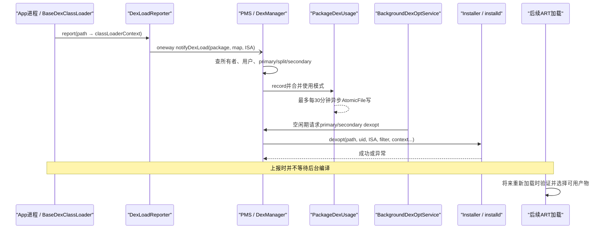
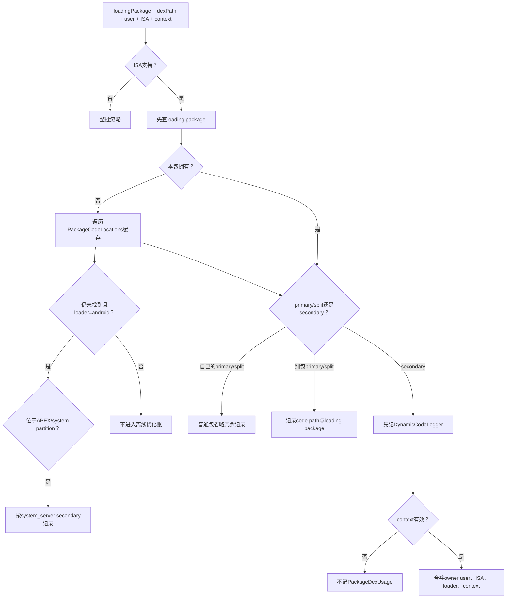
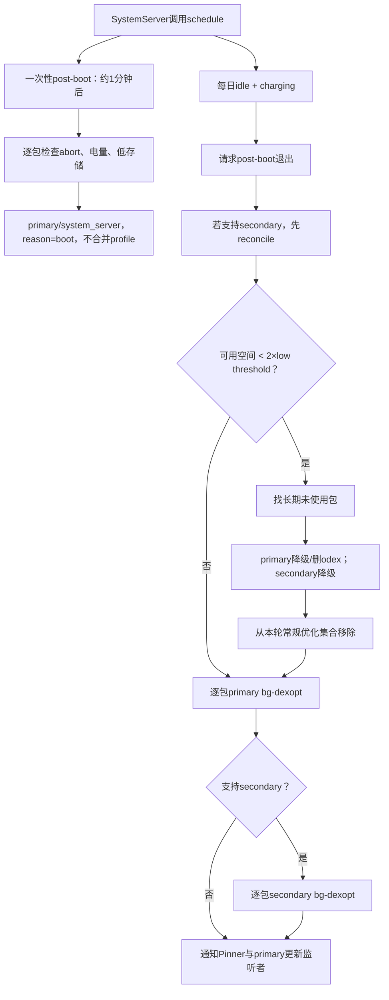

# 第555章 Android DEX 使用与后台优化链：DexLoadReporter、DexManager、PackageDexUsage、secondary dex与BackgroundDexOpt

> 源码基线：AOSP `android-11.0.0_r48`（Android 11 / API 30）  
> 学习目标：把“类加载器创建并上报”“PMS 找到 DEX 所有者”“使用模式写入磁盘”“dexopt 请求成功”“编译产物将来被运行时采用”“失效产物被清理”拆成不同完成点，理解 primary/split DEX、secondary DEX、system_server 动态路径为什么不能用同一套判断。  
> 阅读约定：继续在 macOS 上只读源码，不实际编译、不连接设备；所有结论优先描述 r48 代码实际行为，不把明显的注释漂移或条件错误解释成设计意图。

## 1. 本章先拆掉一句常见误解

“应用加载了一个 dex，Android 就会立刻把它编译好，并让当前进程马上改用新生成的机器码。”

这句话把至少五件事揉在了一起：ART 创建类加载器、App 进程上报路径、PMS 记录使用方式、后台任务请求 dexopt、以后某次加载验证并采用产物。上报可以成功而没有落盘，落盘可以成功而没有执行 dexopt，dexopt 成功也不等于正在运行的进程被热替换。

## 2. 一句话主线

`BaseDexClassLoader` 构造后把“DEX 路径 → class loader context”交给 `DexLoadReporter`；它通过 oneway Binder 通知 PMS，`DexManager` 按包代码路径和每用户数据目录推断所有者，`PackageDexUsage` 合并并限频持久化使用模式；开机后或设备空闲充电时，`BackgroundDexOptService` 再让 `PackageDexOptimizer` 通过 `Installer`/`installd` 编译、降级或清理相应产物。

## 3. 与第554章怎样衔接

第554章说明包安装、更新和卸载会触发多类通知与缓存收敛。DEX 账也属于消费者之一：

- 新安装用户会把该用户的数据目录加入 DEX 归属缓存；
- 包更新会刷新 base/split 路径，并清除主代码“被其他 App 使用”的旧标记；
- 包数据销毁会按用户或全包清 DEX 使用记录；
- 包发生变化还会解除后台 dexopt 的失败跳过状态。

所以 DEX 优化并不是独立于 PMS 生命周期的另一套系统，它依赖第552—554章建立的包身份、用户状态和变化通知。

## 4. 先认清六个关键词

- **primary DEX**：通常指 base APK 中的 `classes*.dex` 所代表的主代码路径；PMS 以 APK 路径为记录单位。
- **split DEX**：带代码 split APK 中的 DEX，同样以 split APK 路径参与 primary 路径优化。
- **secondary DEX**：App 数据目录中运行期产生、下载或解包后由类加载器加载的 `.dex`/`.jar` 等代码。
- **ISA**：加载进程使用的指令集，如 `arm64`；secondary DEX 要记住实际 loader ISA。
- **compiler filter**：如 `verify`、`speed-profile`、`speed`，描述验证/编译强度，不是简单的“优化开关”。
- **class loader context**：编码当前 DEX 的父加载器链和前置 classpath，用于证明编译时类解析假设与运行时一致。

## 5. 这一链实际有七本账

学习时不要只盯着 `package-dex-usage.list`：

1. PMS 的包、base/split 路径和每用户数据目录；
2. App 进程当前构造出的类加载器链；
3. `PackageDexUsage` 的 primary共享使用和 secondary 使用账；
4. `PackageDynamicCodeLoading` 的动态代码安全审计账；
5. PackageSetting 中最近使用时间；
6. current/reference profile；
7. oat/odex、vdex、art 等编译产物。

其中任一本更新，都不能自动证明另外六本已经同步完成。

## 6. 六个完成点必须分开说

可以把一次 secondary DEX 加载标成：

- T1：`BaseDexClassLoader` 已构造，并计算出 context map；
- T2：oneway `notifyDexLoad()` 已入 Binder；
- T3：`DexManager` 已识别所有者并更新内存账；
- T4：AtomicFile 中的新账已经写完；
- T5：后台/显式 dexopt 已让 installd 完成处理；
- T6：后续 ART 加载时，产物通过路径、ISA、context 等校验并被采用。

“DEX 已优化”至少要说明指的是 T5 还是 T6。

## 7. 第一幅图：从类加载到未来采用产物



图中的 oneway 箭头尤其重要：App 进程并不知道 system_server 最后是否接受、记录或优化了该路径。

## 8. primary、split 与 secondary 的根本差别

primary/split 路径来自已扫描包声明，PMS 已知道代码路径、split 依赖、ABI 和共享库，因此可以在安装、启动阶段或后台直接构造编译上下文。

secondary 路径是在 App 私有数据中运行期出现的；system_server 通常不能直接读取不可信 App 内容，也不能仅凭文件名知道加载顺序，所以必须依赖运行期上报的 owner user、loader ISA 和 class loader context，再让降权后的 installd 做路径/访问校验。

## 9. 为什么需要运行期上报

只扫描 APK 无法回答：

- App 后来在数据目录创建了哪些 DEX；
- 同一条 secondary 路径由哪些 ISA 的进程加载；
- 某包的主 APK 是否被另一个包加载；
- DEX 在怎样的父加载器和前置 classpath 下解析类；
- 某个动态代码路径是否已经消失，需要清理旧产物。

`DexLoadReporter` 解决的是“发现事实”，不是“同步编译”。

## 10. Reporter 并非无条件存在

`LoadedApk.setupJitProfileSupport()` 先检查 `dalvik.vm.usejitprofiles`。属性为 false 时，它直接返回，不安装全局 `BaseDexClassLoader.Reporter`。

因此不能说所有 Android 11 设备上的每次 `DexClassLoader` 构造都一定上报；这条链首先受设备运行时配置控制。

## 11. Reporter 在类加载器构造后被触发

`BaseDexClassLoader` 构造函数先固定 shared library loaders、创建 `DexPathList`，随后调用 `reportClassLoaderChain()`。native 方法返回成对数组：偶数位置是 DEX 路径，奇数位置是该路径的 context；Java 再把它变成不可修改 Map。

这表示上报粒度是“这次类加载器链中当前可见的各路径”，不是“某个类第一次真正执行”的逐类事件。

## 12. `setReporter()` 是进程级静态设置

`BaseDexClassLoader.setReporter()` 设置的是静态 reporter。设置以后新创建的 `BaseDexClassLoader` 才会在构造阶段报告；它不是每个 `LoadedApk` 各有一个隔离实例。

`DexLoadReporter` 自身也是单例，因此同一进程可能累积多个 `LoadedApk` 注册的数据目录，这对 shared UID 或 `createPackageContext()` 场景尤其重要。

## 13. “上报”和“主 APK profile 注册”的 UID 条件不同

`setupJitProfileSupport()` 先设置 reporter，然后才判断 `mApplicationInfo.uid != Process.myUid()`。不同 UID 的 `LoadedApk` 不会为对方主 APK 注册 JIT profile，但全局 reporter 已经可以接收之后创建的类加载器报告。

不要把“跨 UID 不支持 profile”误写成“跨包代码完全不上报”。

## 14. 数据目录只用于 App 进程本地的 secondary profile 判断

同 UID 且至少存在一个 base/split code path 时，`registerAppDataDir()` 才把 `mDataDir` 加入同步保护的 `HashSet`。报告发生时先复制数组，再离开锁做文件 I/O；无代码路径的 `LoadedApk` 会在注册数据目录之前返回。

若 `dalvik.vm.dexopt.secondary=true`，落在任一已注册数据目录内的路径会尝试创建相邻 `oat/<文件名>.cur.prof`，并调用 `VMRuntime.registerAppInfo()`；创建失败只记日志，不阻断类加载，也不撤销已经发给 PMS 的使用上报。

## 15. context map 的含义不能简化成“路径列表”

例如同一 `PathClassLoader` 依次含 `foo.dex`、`bar.dex`，`foo.dex` 的 context 可以是 `PCL[]`，而 `bar.dex` 是 `PCL[foo.dex]`。后者说明解析 `bar.dex` 时，`foo.dex` 已在它前面的 classpath。

如果只记两个文件名而丢掉顺序，dex2oat 可能在错误的类解析假设下生成不可安全复用的代码。

## 16. 第一段关键源码：报告先通知 PMS，再尝试本地 profile

```java
// frameworks/base/core/java/android/app/DexLoadReporter.java
@Override
public void report(Map<String, String> classLoaderContextMap) {
    if (classLoaderContextMap.isEmpty()) {
        Slog.wtf(TAG, "Bad call to DexLoadReporter: empty classLoaderContextMap");
        return;
    }

    notifyPackageManager(classLoaderContextMap);
    registerSecondaryDexForProfiling(classLoaderContextMap.keySet());
}

private void notifyPackageManager(Map<String, String> classLoaderContextMap) {
    String packageName = ActivityThread.currentPackageName();
    try {
        ActivityThread.getPackageManager().notifyDexLoad(packageName,
                classLoaderContextMap, VMRuntime.getRuntime().vmInstructionSet());
    } catch (RemoteException re) {
        Slog.e(TAG, "Failed to notify PM about dex load for package " + packageName, re);
    }
}
```

顺序只表示 App 进程先发 Binder，再做本地 profile 处理；因为 AIDL 是 oneway，它不表示 PMS 已经处理完成。

## 17. oneway 的错误边界

`IPackageManager.notifyDexLoad()` 声明为 oneway。App 侧只能捕获发送阶段的 `RemoteException`，拿不到 `DexManager` 的“未找到所有者”“ISA 不支持”“context 无效”结果。

这是一条尽快返回的遥测/维护链，而不是 App 启动所依赖的同步事务。

## 18. PMS 的调用者校验比直觉更窄

r48 只明确阻止非 `SYSTEM_UID` 把 `loadingPackageName` 报成 `android`。对普通包名，它按 calling user 查询所报包的 `ApplicationInfo`，没有在该方法中调用 `isCallerSameApp()` 验证 calling UID 与包名一致。

源码注释认为伪造 DEX 报告“没有特别危险”，但学习时仍应把字段当作来自 App 进程的非权威输入。后续 owner 查找、CE/DE 归属和 installd 降权校验才是更关键的约束；不能把一条 Binder 报告当成文件所有权证明。

## 19. calling user 仍是硬边界之一

PMS 使用 `UserHandle.getCallingUserId()`，只查询该用户下所报包的 `ApplicationInfo`。包在此用户不存在时直接返回。

随后 owner search 也带同一个 `loaderUserId`，因此正常路径不会把用户10的数据目录记录成用户0的 secondary DEX。

## 20. `DexManager.notifyDexLoad()` 故意兜住异常

公共入口用 `try/catch (Exception)` 包住内部处理并记录 warning。注释明确要求它在 App 加载 DEX 时尽快返回。

因此一个坏路径、非法字段或账内矛盾应让维护信息丢失，而不是把异常沿 oneway 调用反向破坏 App 的类加载主路径。

## 21. ISA 是第一道快速过滤

空 Map 被视为 bad call；`PackageManagerServiceUtils.checkISA(loaderIsa)` 不通过时整批返回。

secondary DEX 编译需要对实际加载 ISA 生成对应产物。把任意 ABI 字符串直接传给 installd 既没有意义，也会扩大本地接口攻击面，所以 Java 层和 `Installer.assertValidInstructionSet()` 都会检查。

## 22. 所有者查找先走加载包快路径

`getDexPackage()` 先临时用 `loadingAppInfo` 创建 `PackageCodeLocations`，按当前用户检查：

1. 是否等于 base code path；
2. 是否等于任一 split code path；
3. 是否位于该用户 App data dir 前缀下。

大多数 App 加载自己的代码时，不需要遍历全局缓存。

## 23. 再做全包反向查找

加载包不拥有路径时，`DexManager` 在 `mPackageCodeLocationsCache` 中逐包搜索。这个缓存来自开机已安装包枚举，以及后续安装/更新通知。

注释承认缓存过期可能产生 false negative；结果是该路径不进入离线优化，而不是随便指定一个 owner。

## 24. r48 的数据目录匹配有一处值得警惕

`PackageCodeLocations.searchDex()` 对 secondary 使用 `dexPath.startsWith(dataDir)`，而 `DexLoadReporter` 和 CE/DE 推断使用 `FileUtils.contains()`。

纯字符串前缀会让 `/data/user/0/com.demo2/...` 看起来以 `/data/user/0/com.demo` 开头。正常 `ApplicationInfo` 与真实加载路径减少了误判机会，后续 installd 还会验证；但读源码时不能把这一行描述成严格的目录边界检查。

## 25. system_server 是特殊宽网

若加载包是 `android`，普通包缓存仍找不到 owner，`DexManager` 会把 `/apex/` 或已注册 system partition 下的路径视为 system_server 所有，并按 secondary 形式记录。

原因不是这些文件真位于 App data，而是 system_server 动态加载路径可能带非空 context；现有 primary 记录结构不保存 context，所以借用 secondary 结构保存 ISA、用户与 context。

## 26. 完全找不到 owner 就不记优化账

`DEX_SEARCH_NOT_FOUND` 只在 DEBUG 下记录日志。源码明确说明影响是该 DEX 不会被考虑 offline optimization。

这不表示 ART 当时没有加载它，也不表示安全系统已经拒绝它；这里只是 PMS 无法把观测归入可信包/用户维护账。

## 27. 自己加载自己的主 APK 通常不记录

若路径是 primary/split、owner 等于 loader，且 owner 不是 `android`，`DexManager` 直接 continue。PMS 已从包扫描知道主路径及常规优化信息，这条记录没有新增价值。

所以 `package-dex-usage.list` 没有某 App，不等于它从未运行。

## 28. 主代码被其他包加载才有新增信息

若包B加载包A的 base/split，A 的 `PackageUseInfo` 会按 code path 记录 loading package B。后续 profile-guided 目标可能被调整为 `pm.dexopt.shared` 对应的非 profile-guided filter，避免只按 A 私有 profile 生成对共享调用者不合适的产物。

“被其他 App 使用”改变的是优化策略，不是自动授予 B 读取 A 代码的权限。

## 29. shared UID 会造成保守近似

代码的 `isUsedByOtherApps` 只比较包名，不比较是否共享同一运行时/UID。注释承认两个包共享 runtime 时可能被标成“其他 App 使用”。

这是偏向安全可复用编译方式的 false positive；不能据此反推发生了跨 UID 代码共享。

## 30. DynamicCodeLogger 是并行安全审计账

所有非 primary/split 路径在 context 校验前就调用 `mDynamicCodeLogger.recordDex()`。它记录 owner、路径、owner user 与 loading package，但不记录 ISA/context，并且连不受支持的类加载器场景也想覆盖。

`PackageDexUsage` 服务于优化，`DynamicCodeLogger` 服务于动态代码安全记录；前者因 context 无效不记，后者仍可能保留，这不是重复写同一本账。

## 31. context 合法性决定能否进优化账

只有 context 非 null 且 `VMRuntime.isValidClassLoaderContext()` 为真时才调用 `PackageDexUsage.record()`。

这条顺序意味着：owner 已找到、动态代码已审计，也仍可能没有可离线优化的记录。无法表达正确类加载假设时，宁可放弃优化信息。

## 32. 第二幅图：所有者与记录决策树



这张图要和“是否允许加载”分开：它画的是观测如何进入维护账，不是 Java 类加载权限判决图。

## 33. class loader context 到底保护什么

dex2oat 可能把“类X最终解析到父加载器中的哪个定义”固化进优化结果。若运行时换了父加载器、前置 DEX 或顺序，旧假设可能失效。

ART 把 PCL（PathClassLoader）、DLC（DelegateLastClassLoader）、classpath 与父链编码成字符串，编译与加载双方据此检查一致性。

## 34. `PCL[]` 不是“没有类加载器”

`PCL[]` 表示当前 PathClassLoader 在该 DEX 之前没有同层 classpath 项；如果它还有父加载器，完整字符串后面仍可能出现 `;PCL[...]`。

空方括号描述的是该加载器的前置 classpath，不是整个世界没有 BootClassLoader 或共享库。

## 35. 同一 classpath 中每个 DEX 的 context 不同

`DexoptUtils.processContextForDexLoad()` 从第一个加载器的 classpath 依次处理。第一个路径的当前 classpath 为空；处理后再把它追加，作为第二个路径的前置依赖。

所以把整条 classpath 统一编码给每个 DEX 会错误地制造循环或超前依赖。

## 36. 不支持与变化是两种状态

旧格式可能出现 `=UnsupportedClassLoaderContext=`；当前新上报则先由 `VMRuntime` 过滤。相同 secondary 路径后来观察到不同的两个有效 context 时，账会永久合并成 `=VariableClassLoaderContext=`。

普通 secondary 优化遇到这两类标记会退到 `extract` 且传 null context；system_server 优化则直接跳过这些路径。二者策略不同。

## 37. PackageDexUsage 的职责边界

它是 `AbstractStatsBase<Void>` 的子类，文件名为 `/data/system/package-dex-usage.list`。内存主结构是“owner package → PackageUseInfo”。

它只负责合并、序列化、读回和裁剪使用模式；选择编译 filter、调用 installd、判断文件是否真实存在不在这个类完成。

## 38. `PackageUseInfo` 中有两种不同结构

- `mPrimaryCodePaths`：code path → loading package 集合，只关心主/split 是否被其他包使用；
- `mDexUseInfoMap`：secondary path → `DexUseInfo`，包含 owner user、是否共享、loader ISA 集、loading package 集和 context。

不要给 primary 记录虚构 owner user/ISA；源码注释明确说主代码会为所有用户/相关 ISA 处理，没必要在这本账重复保存。

## 39. 第一次看到 secondary 路径时保存什么

新 `DexUseInfo` 以当前 owner user、context 和 loader ISA 初始化；若 loader 包不同于 owner，再加入 loading package 集，并把 `isUsedByOtherApps` 置为 true。

同 owner 自己加载时，loadingPackages 可以为空，但 secondary 路径本身仍有价值，因此仍会进入 map。

## 40. 第二段关键源码：相同路径的使用模式只做保守合并

```java
// frameworks/base/services/core/java/com/android/server/pm/dex/PackageDexUsage.java
private boolean merge(DexUseInfo dexUseInfo) {
    boolean oldIsUsedByOtherApps = mIsUsedByOtherApps;
    mIsUsedByOtherApps = mIsUsedByOtherApps || dexUseInfo.mIsUsedByOtherApps;
    boolean updateIsas = mLoaderIsas.addAll(dexUseInfo.mLoaderIsas);
    boolean updateLoadingPackages = mLoadingPackages.addAll(dexUseInfo.mLoadingPackages);

    String oldClassLoaderContext = mClassLoaderContext;
    if (isUnsupportedContext(mClassLoaderContext)) {
        mClassLoaderContext = dexUseInfo.mClassLoaderContext;
    } else if (!Objects.equals(mClassLoaderContext, dexUseInfo.mClassLoaderContext)) {
        mClassLoaderContext = VARIABLE_CLASS_LOADER_CONTEXT;
    }

    return updateIsas
            || oldIsUsedByOtherApps != mIsUsedByOtherApps
            || updateLoadingPackages
            || !Objects.equals(oldClassLoaderContext, mClassLoaderContext);
}
```

`usedByOther` 是 OR，ISA/loader 是集合并集，context 变化则降级为 variable；它不是“最后一次上报覆盖前一次”。

## 41. owner user 不允许被同路径改写

若已记录路径的 `mOwnerUserId` 与新记录不同，`record()` 抛 `IllegalArgumentException`。源码认为同一个 App 私有数据路径跨用户改变 owner，说明上层路径/权限检查出了问题。

外层 `DexManager.notifyDexLoad()` 会捕获异常，因此不会把整条异常传回 App，但这次新信息不会成功合并。

## 42. `isUsedByOtherApps` 是粘性的

一旦 secondary 路径被其他包加载，后续 owner 自己加载不会把它改回 false。对主 code path，包更新时才调用 `clearUsedByOtherApps()` 清理旧版本共享事实。

保守合并避免偶尔一次自加载覆盖更重要的共享使用证据。

## 43. ISA 和 loading package 都是集合

同一个 secondary DEX 可能先被 64 位进程加载，后被 32 位进程加载。账要同时保留两个 loader ISA，后台才有机会为两者处理产物。

loading package 集只保存与 owner 不同的包；owner 自身是否加载不需要额外名字，因为路径进入账本身已经表达“观察过”。

## 44. context 一旦 variable 不会恢复成稳定值

现有 context 为 variable，再与任何普通 context 比较仍不相等，结果继续写回 variable。只有旧 unsupported marker 有“以后用一个有效 context 替换”的特殊分支。

这意味着 context 波动需要路径/文件生命周期改变或记录被清理才能重新学习，而不是等下一次稳定上报自动修复。

## 45. 每个 owner 最多保存100条 secondary 路径

`MAX_SECONDARY_FILES_PER_OWNER=100` 防止一个 App 用不断变化的路径造成 system_server 内存和磁盘账无限增长。

r48 在达到上限后构造了未插入的新 `DexUseInfo`；若 loading package 与 owner 不同，局部 `updateLoadingPackages` 仍可能让方法返回 true 并触发一次写，但第101条路径实际没有进入 map。这是返回值粒度的小瑕疵，不要写成“第101条只保存 loader 名”。

## 46. primary code path 的集合语义

`mergePrimaryCodePaths()` 无论 loader 是否等于 owner，都会把传入包名加入集合；但正常 own-primary 已在 `DexManager` 被跳过，因此常见记录只有其他包。

`isUsedByOtherApps(path)` 会区分集合是否包含 owner：包含 owner时要求 size 大于1；不含 owner时只要非空就算共享。

## 47. 更新时清除的是 loading package 值，不是 map key

`clearCodePathUsedByOtherApps()` 对每个集合执行 `retainAll([owner])`，但不删除空集合对应的 code path key。

因此单路径的 `isUsedByOtherApps(path)` 可以变回 false；这正是 primary 编译 filter 所用的判断。

## 48. r48 的 `isAnyCodePathUsedByOtherApps()` 有残留键边界

该方法直接返回 `!mPrimaryCodePaths.isEmpty()`。更新清理后，map 可能仍保留“路径 → 空集合”，于是它仍返回 true，虽然每个具体路径的 `isUsedByOtherApps(path)` 都是 false。

这会影响 `syncData()` 是否保留整个 package 记录，以及 `isUnusedSinceTimeInMillis()` 对后台共享使用的判断。应描述为 r48 数据结构/查询口径不一致，不能泛化成“更新后仍确定被其他 App 使用”。

## 49. 文件写入使用 AtomicFile，但跨账不原子

`PackageDexUsage.writeInternal()` 用 `AtomicFile.startWrite()/finishWrite()`；失败时 `failWrite()` 恢复主文件语义。

它只保证这一份文件的一次替换，不与 packages.xml、动态代码账、profile 或 oat 产物组成跨文件事务。

## 50. 文件格式为什么既有人可读性又有限制

版本2大致是：包名行；`+` 开头的主 code path；下一行 `@` loading packages；`#` 开头的 secondary path；再跟 owner user/共享位/ISA、loading packages 与 context。

它用逗号分隔集合，没有转义复杂路径协议，因为输入本来受包名、路径和 context 约束；这是 system_server 私有维护文件，不是公开稳定 API。

## 51. “触发异步写”不等于马上落盘

`AbstractStatsBase` 默认要求两次后台写至少间隔30分钟，且同一时刻只允许一个 writer thread。`maybeWriteAsync()` 返回 false 可能只是仍在限频窗口或已有写线程。

新记录先存在内存；意外掉电可能丢掉最近模式，代价是以后少一次离线优化，不应影响 DEX 当次能否运行。

## 52. 正常关机会强制刷写

PMS `shutdown()` 调用 `mDexManager.writePackageDexUsageNow()`，它同步写 PackageDexUsage 和 DynamicCodeLogger，并更新最后写时间。

这提高正常关机耐久性，但崩溃/断电仍可能发生在30分钟限频窗口内，所以不能把每次 `record()==true` 解释成磁盘已更新。

## 53. 开机读账先检查唯一支持的版本2

r48 已删除版本1读取支持。头部缺失、格式错误或 DexManager load 外层异常会清内存账，以 fresh state 继续开机。

维护账损坏不会让 PMS 因无法恢复优化历史而拒绝启动；代价仍是重新学习使用模式。

## 54. r48 读取 ISA 的检查对象写错了

解析每条 secondary 记录时，不支持的 ISA 会被日志拒绝加入 `dexUseInfo.mLoaderIsas`。随后源码想在该条没有受支持 ISA 时忽略路径，却检查了全局 `supportedIsas.isEmpty()`，而不是当前记录的 loader ISA 集。

在正常设备上全局支持集不会为空，因此一个手工损坏或 OTA 后只含旧 ISA 的条目可能以空 loader ISA 集留下。后续 secondary 优化循环零次却仍返回 `DEX_OPT_PERFORMED`。这是 r48 实际边界，不要替源码脑补成已经正确丢弃。

## 55. 开机 `load()` 同时重建归属缓存并裁剪旧账

PMS 在所有包数据目录 reconcile 完成后，按用户枚举已安装 `PackageInfo` 交给 `DexManager.load()`。它构造：包 → 已安装用户集合、包 → 当前 base/split 路径集合，以及快速归属缓存。

`syncData()` 删除已卸载包、已删除用户的 secondary、已经变化的主 code path和不存在的 loading package；若包既无共享主代码也无 secondary，再删除整个记录。

这次开机裁剪只改内存，`loadInternal()` 没有紧接着为裁剪结果调用异步写；旧磁盘内容要等后续 usage 写或正常关机才被新快照覆盖。再次开机重复裁剪是允许的。

## 56. 包更新只刷新主路径共享标记

`notifyPackageUpdated()` 更新 base/split cache，并清 primary code path 的 used-by-other loading 集后安排异步写。

它不会仅因 APK 更新就删除所有 App 数据目录内的 secondary 记录；secondary 是否仍存在，交给数据销毁通知或后台 reconcile 判断。

## 57. 数据销毁按用户与全包分开

`USER_ALL` 会删除 owner package 的全部 PackageDexUsage 与 DynamicCodeLogger 记录；具体 user 只删除该 owner user 的 secondary 信息。

主 code path 记录不是按 user 保存，因此 user-only 数据销毁不会把跨设备安装身份的主共享账按用户切片。

## 58. “无使用信息”本身是有歧义的

`getPackageUseInfoOrDefault()` 找不到记录时返回空默认对象。源码明确说这可能表示没用过，也可能只是按普通方式由 owner 自己使用，因此被优化省略。

调用者只能把默认值理解为“没有已记录的 secondary/跨包共享证据”，不能理解为“应用从未运行”。

## 59. 读者拿到的是防御性深拷贝

`getPackageUseInfo()` 深拷贝主路径集合和每个 `DexUseInfo`，避免调用者遍历期间类加载上报并发修改内部 Map。

磁盘写也先 clone，再离开 `mPackageUseInfoMap` 锁序列化；这缩短热点锁时间，但快照之后的新上报自然等下次写。

## 60. DexoptOptions 是意图，不是最终执行参数

选项包含 package、reason/filter、是否查 profile、force、boot complete、only secondary、only shared、downgrade、as shared library、idle background 等。

`PackageDexOptimizer` 还会根据 debuggable、safe mode、embedded DEX、是否共享、存储类型和 context 调整 filter/flags，因此调用者传 `speed-profile` 不保证 installd 最终收到同一个 filter。

## 61. reason 通过系统属性映射 filter

r48 定义 first-boot、boot、install、bg-dexopt、ab-ota、inactive、shared 七种 reason，对应 `pm.dexopt.<reason>` 属性。

`PackageManagerServiceCompilerMapping.checkProperties()` 会验证属性存在且是合法 filter；shared reason 明确不允许 profile-guided filter。

## 62. 被其他 App 使用会改变 profile-guided 目标

目标 filter 若是 profile-guided 且 code 被其他包使用，`getRealCompilerFilter()` 改用 `REASON_SHARED` 的 filter。

原因是 owner 私有 profile 未必覆盖其他加载者的热点/类路径。这里不是“共享就一定编译更多”的硬编码结论，具体强度仍由产品的 `pm.dexopt.shared` 配置决定。

## 63. debuggable、safe mode 与 embedded DEX 还会再降级

embedded DEX 或被配置 OOB 的 privileged app 返回 `verify`；vm safe mode 或 debuggable 使用安全模式 filter。源码解释 debuggable 运行时本来也会忽略其编译代码，并可能因方法很多让编译器内存压力过大。

最终 filter 是多条约束合并后的结果，不应只从 reason 名称猜。

## 64. primary profile 检查有副作用

primary 且使用 profile-guided filter 时，`isProfileUpdated()` 会调用 installd `mergeProfiles()`；注释明确这是破坏性/有副作用的 current→reference 合并检查。

post-boot job 故意不设置 CHECK_FOR_PROFILES_UPDATES，以避免开机阶段合并 profile 干扰后台编译；idle job 才设置它。

## 65. primary 的 context 来自静态包结构

`DexoptUtils.getClassLoaderContexts()` 根据 base、split 是否含代码、isolated split、split dependency 和 uses-library 构造每条 code path 的 context。

无 isolated split 时，后一个 split context 会包含 base 与前面 split；有依赖图时则递归拼父 split 链。该逻辑必须与 `LoadedApk` 实际创建 classpath 的顺序保持同步。

## 66. PMS 会先尝试优化共享库依赖

`performDexOptInternalWithDependenciesLI()` 找出包的 shared libraries，先以 `DEXOPT_AS_SHARED_LIBRARY` 调 `PackageDexOptimizer`，忽略依赖失败的返回值，再继续目标包。

因此“目标包返回成功”不证明每个依赖这次都成功；依赖可能早已 up-to-date，也可能失败后主包仍继续。

## 67. primary 先在 system_server 判断是否需要 dexopt

对每个含代码的 base/split 和 dex code ISA，`DexFile.getDexOptNeeded()` 根据路径、ISA、filter、context、profile 是否更新和 downgrade 算出需要程度。无需处理则返回 `DEX_OPT_SKIPPED`。

需要处理才调用 `Installer.dexopt()`；这与 secondary 把 `dexoptNeeded=0` 交给 installd 内部判断不同。

## 68. primary 产物不一定在包内 `oat/`

只有 `AndroidPackageUtils.canHaveOatDir()` 且 codePath 是目录时，Java 传包目录下 `oat`；未更新 system app 或 monolithic 路径等情况可能传 null，让 installd 使用其他合法位置。

所以看到 `/data/app/.../oat` 只是常见布局，不是所有包唯一产物位置。

## 69. primary 的三个返回值语义清楚一些

- `DEX_OPT_SKIPPED`：所有路径/ISA都无需本次处理；
- `DEX_OPT_PERFORMED`：至少一条真正调用 installd 且成功；
- `DEX_OPT_FAILED`：任一路径返回失败，聚合结果保持失败。

它仍只是请求处理结果，不承诺当前已运行进程立即切换到新代码。

## 70. 第三段关键源码：secondary 把可疑 context 降为 extract

```java
// frameworks/base/services/core/java/com/android/server/pm/PackageDexOptimizer.java
String compilerFilter = getRealCompilerFilter(info, options.getCompilerFilter(),
        dexUseInfo.isUsedByOtherApps());
int dexoptFlags = getDexFlags(info, compilerFilter, options) | DEXOPT_SECONDARY_DEX;

if (info.deviceProtectedDataDir != null
        && FileUtils.contains(info.deviceProtectedDataDir, path)) {
    dexoptFlags |= DEXOPT_STORAGE_DE;
} else if (info.credentialProtectedDataDir != null
        && FileUtils.contains(info.credentialProtectedDataDir, path)) {
    dexoptFlags |= DEXOPT_STORAGE_CE;
} else {
    return DEX_OPT_FAILED;
}

String classLoaderContext = null;
if (dexUseInfo.isUnsupportedClassLoaderContext()
        || dexUseInfo.isVariableClassLoaderContext()) {
    compilerFilter = "extract";
} else {
    classLoaderContext = dexUseInfo.getClassLoaderContext();
}
```

“context 不稳定”并非照常做激进 AOT；普通 App secondary 退到 extract，system_server 路径则直接跳过。

还要留意 r48 的执行顺序：`dexoptFlags` 先按原目标 filter 计算，之后才因 variable/unsupported context 把 `compilerFilter` 改成 `extract`，且没有重新计算 flags。因此传给 installd 的 filter 已退化，但 profile-guided/public/app-image 等位仍可能反映原目标；不能把它描述成“从头按 extract 重新生成了一套完全一致的 flags”。

## 71. secondary 优化前重新按 owner user 查询包

`DexManager.dexoptSecondaryDex()` 遍历防御性快照，对每条记录用其 owner user 调 `getPackageInfo()`，获得真实 UID、CE/DE 目录、volume UUID、seInfo 和 target SDK。

若该用户下包已卸载，就删除该 user 的使用记录并继续其他用户；不会因一个用户消失停止整包循环。

## 72. 为什么 secondary 不能由 system_server 自己打开判断

App 私有文件不应由高权限 system_server 随意读取；源码注释说 `dexoptNeeded` 和 output 由 installd 计算，因为 system_server 不能读取不可信 App 内容。

Java 传 owner UID、包名、volume、CE/DE flag，installd 在受控路径验证和降权环境中处理。

## 73. CE/DE flag 不是装饰信息

路径落在 `deviceProtectedDataDir` 加 `DEXOPT_STORAGE_DE`，落在 `credentialProtectedDataDir` 加 `DEXOPT_STORAGE_CE`；两者都不匹配直接失败。

它既帮助构造正确存储路径，也让 native `validate_secondary_dex_path()` 验证 owner/user/卷边界。用户未解锁时 CE 可用性与 DE 不同，不能混写。

## 74. 每个记录的全部 loader ISA 都会处理

`PackageDexOptimizer` 对 `dexUseInfo.getLoaderIsas()` 循环调用 `Installer.dexopt()`。其中任一调用抛 `InstallerException`，整个路径返回 failed。

集合为空是异常数据；r48 读取检查错误可能留下这种条目，此时循环零次却走到 performed，正是第54节指出的口径漏洞。

## 75. secondary 的 `PERFORMED` 不等于真的重新编译

源码注释明确：secondary 当前只能从 installd 得到成功/异常，不能区分“已是最新而跳过”和“实际生成新产物”。只要所有 ISA 调用没有抛异常，就返回 `DEX_OPT_PERFORMED`。

因此统计或回调看到 performed 时，应理解为“secondary 处理成功”，不要精确翻译成“本次执行了 dex2oat”。

## 76. only-shared 可以只处理共享 secondary

选项带 `DEXOPT_ONLY_SHARED_DEX` 且该路径未标记 used-by-other 时，直接 skipped。r48 后台普通 secondary 优化并未设置此 flag；它通常处理该包已记录的全部 secondary。

这是可供特定调用者缩小范围的策略位，不是 PackageDexUsage 只保存共享 secondary。

## 77. install lock 与 wakelock 解决不同问题

`PackageDexOptimizer` 在 `mInstallLock` 下串行 Installer 操作；system ready 后还以包 UID 作为 WorkSource 获取 partial wakelock，超时长度比 PMS watchdog 多一分钟。

锁防止并发安装/优化互相踩文件，wakelock避免处理中途休眠；二者都不提供文件级事务回滚。

## 78. force 通过包装器改变 needed/flags

`ForcedUpdatePackageDexOptimizer` 若原本 NO_DEXOPT_NEEDED，就伪装成 filter 变化并加 force flag，而不是把 force 参数层层传遍所有函数。

源码注释说 force 主要用于命令行测试；后台常规任务不会无条件强制重编所有包。

## 79. system_server DEX 使用固定 verify

`DexManager.dexoptSystemServer()` 强制把 options filter 覆盖为 `verify`。源码说明 system_server 不能从 system partition 之外加载可执行代码，但可以使用验证数据，因此选择 verify。

不存在路径会删除记录；variable/unsupported context 跳过；任一路径 failed 令聚合失败，至少一个实际处理令结果 performed。

## 80. `registerDexModule()` 是提前登记入口

它只接受属于调用包数据目录的 secondary 路径，拒绝 base/split 和他包路径；然后为 App 声明的全部 ISA 记录 `VARIABLE_CLASS_LOADER_CONTEXT`。共享模块用伪 loader 名 `.shared.module` 让 used-by-other 为 true。

它随后按 install reason 尝试 secondary dexopt，但 API 设计即使优化失败也返回“注册成功”，因为 App 仍可使用模块，后台任务以后可重试。

AIDL 本身是 oneway；system_server 的 Binder 处理仍会先做登记和这次 dexopt 尝试，再把结果 post 到 PMS Handler 调 callback。App 应等待异步 callback 获得“登记结果”，不能从 oneway 方法返回推断优化步骤已经结束。

## 81. r48 的失败日志条件写反

注释说“如果优化失败则记错误”，实际条件却是 `result != DEX_OPT_FAILED` 时打印 `Failed to optimize dex module`。也就是成功/跳过会报失败，真正 failed 反而不进该日志分支。

这是明确的代码与注释矛盾。学习笔记应记录实际条件，不能用注释替它改正，也不能把这条误导日志当成真实失败证据。

## 82. `registerDexModule()` 的调用者身份检查也有限

PMS 按 calling user 查询传入 `packageName`，再由路径 owner 检查“路径属于这个包”；该入口同样没有在展示的方法里先做 `isCallerSameApp(packageName, uid)`。

不过最终只登记包私有目录下的路径，native 优化还有 UID/路径验证。这里的正确结论是“报告字段需要后续校验”，不是直接断言存在可执行权限提升。

## 83. reconcile 处理的是“账与文件是否还一致”

App 可以自行删除 secondary DEX，却不会同步通知 PMS。若只删源 DEX，旧 oat/vdex/art/profile 可能残留占空间，PackageDexUsage 也会继续尝试优化不存在的路径。

后台 idle job 因此先遍历所有有 secondary 记录的包，执行 `reconcileSecondaryDexFiles()`。

## 84. Java 层先恢复真实 UID 与存储类型

对普通 App，DexManager 重新查询 owner user 的 `PackageInfo`，用 `FileUtils.contains()` 判断 DE 或 CE。无法归类的路径直接从使用账删除，不调用 native。

对 system_server，Java 自己有权限 `Files.exists()`；不存在就删除相应记录，不走 installd。

## 85. native 清理会 fork 并降到 App UID

installd 的 `reconcile_secondary_dex_file()` 先验证 ISA/存储 flag，然后 fork；child 调 `drop_capabilities(uid)`，再校验 secondary 路径并检查文件可访问性。

源码明确说用包 UID 的降低能力来 unlink ART 产物，是安全边界的一部分，不是单纯为了性能隔离。

## 86. 源 DEX 不存在时清哪些东西

native 对每个 ISA 删除对应 oat/odex、vdex、art，还删除 current/reference secondary profile 和一个历史旧 profile 路径；最后尝试移除空的 ISA/oat 目录。

所以 Java 返回 `dexStillExists=false` 不只是“stat 失败”，成功路径已经尝试回收相关编译/画像产物。

## 87. 路径验证失败会被当作“不再保留记录”

native 的 validation error 最终把 out-exists 设 false，同时 Binder 方法本身返回成功；Java 因而删除 PackageDexUsage 条目。

IO access error 则让 Binder 返回错误，`Installer` 抛异常；两类失败的重试语义不同。

## 88. InstallerException 时 Java 保留记录等待重试

DexManager 把 `dexStillExists` 初值设为 true；捕获 `InstallerException` 只记日志，不改为 false。因此 IO/installd 短暂失败不会误删使用账，下次 idle job可重试。

这也意味着一次 reconcile 日志失败后，旧产物与记录可能继续存在，并非已经清理完成。

## 89. reconcile 更新仍受30分钟写限频

一轮可以删除多个 path/user 记录，最后只调用一次 `maybeWriteAsync()`。内存已收敛与磁盘账收敛仍是两个时间点。

如果随后正常关机，会同步刷写；若立刻崩溃，下次开机可能从旧磁盘记录再次 reconcile，操作设计为可重试。

## 90. 第三幅图：后台 Job 的选择、降级与优化顺序



顺序很重要：reconcile 在优化前，低空间时未使用包先降级并从后续“升级优化”集合移走。

## 91. 两个 Job 的调度条件不同

`SystemServer` 启动后调用 `BackgroundDexOptService.schedule()`，除非 `pm.dexopt.disable_bg_dexopt=true`。

JOB 801 是一次性 post-boot，minimum latency 和 override deadline 都是一分钟，没有 charging/idle 条件；JOB 800 是默认每天一次的 periodic job，并要求设备 idle 与 charging。

## 92. JobScheduler 条件不是循环内检查的全部条件

idle job 依赖 scheduler 的 idle/charging；循环内还实时看 abort flag 与 usable space。post-boot 没有 scheduler 电池约束，所以代码逐包读取 sticky battery Intent，与 `config_lowBatteryWarningLevel` 比较。

“任务被调度”不等于一定处理到最后一个包。

## 93. post-boot 只做主代码路径

它从 `getOptimizablePackages()` 得到所有 `canOptimizePackage()` 的包，逐包以 `REASON_BOOT | DEXOPT_BOOT_COMPLETE` 调 `performDexOptWithStatus()`。

没有 `DEXOPT_ONLY_SECONDARY_DEX`，所以普通包走 primary；`android` 包在 PMS 内被转到 system_server 特殊路径。

## 94. post-boot 中断不会自动补齐

JobScheduler 请求停止时，`onStopJob()` 设置 abort flag并返回 false；循环遇低电量、低空间也 break。末尾只要线程正常走到那里，就 `jobFinished(..., false)`。

若命中 scheduler abort，worker 是直接 return，不再调用 `jobFinished()`，因为 JobScheduler 已经进入停止处理；低电量、低空间和被 idle 接管的 break 才会继续走到末尾完成通知。

源码 TODO 直说尚应考虑未处理完时重调度。当前 r48 不能描述成“本轮没做完一定马上续跑”；每日 idle 是另一条后续机会。

## 95. post-boot 刻意不检查 profile 更新

注释解释这是为了避免开机合并 profile 干扰后台编译并节省启动阶段工作。结果是 `pm.dexopt.boot=speed-profile` 与 `pm.dexopt.bg-dexopt=speed-profile` 可能表现不同。

这不是 profile 不存在，而是该调用没有请求 destructive merge/update check。

## 96. idle job 会让 post-boot 提前退出

`idleOptimization()` 先把 `mExitPostBootUpdate=true`。post-boot 每包检查该位，看到后 break，让要求 idle/charging 的维护任务接管。

两者真正的 Installer 操作还由 PackageDexOptimizer 的 install lock 串行，因此不会同时改同一路径。

## 97. 常规候选集是“可优化包”，不是已证明需要编译包

`getOptimizablePackages()` 只枚举 `canOptimizePackage()`：普通包有 code，platform 特殊允许。它不先判断 profile 新鲜度或 dexoptNeeded。

是否真需要工作在每包/每路径深入后决定，所以候选很多、结果 skipped 很正常。

## 98. secondary 全链还受第二个系统属性控制

idle 中 `supportSecondaryDex()` 读取 `dalvik.vm.dexopt.secondary`。为 false 时，不 reconcile、不降级 secondary、也不做 secondary 常规优化。

这与 reporter 安装所需的 `dalvik.vm.usejitprofiles` 是两个属性；前者开而后者关可能没有新记录，前者关则即便残留账存在也不在这轮处理。

## 99. idle 先 reconcile 再看是否降级

这避免对已删除 secondary 文件继续调用 dexopt，也让旧产物先被清掉。reconcile 逐包只检查 scheduler abort，不检查低存储，因为它本身通常是在回收无主产物。

源码 TODO 还提到是否应把 reconcile 失败包加入 blacklist，目前不会。

## 100. 降级触发阈值比真正低存储线更早

当 usable space 小于 `2 * StorageManager.getStorageLowBytes(/data)` 时开始考虑 downgrade；常规优化则在小于 low threshold 时中止。

这样系统在真正触碰低存储状态前，先把长期不活跃 App 的高成本产物降级/删除，留出缓冲。

## 101. “长期未使用”不是只看最后前台时间

候选必须安装时间也超过阈值，最近前台使用不在窗口内；若最近后台有使用且主 code path 有其他包使用证据，也视为活跃。

阈值来自 `pm.dexopt.downgrade_after_inactive_days`；缺失时返回 `Long.MAX_VALUE`，实际几乎不会把包判成达到时长。

## 102. primary downgrade 有两条路径

能有包内 oat 目录时，以 `REASON_INACTIVE_PACKAGE_DOWNGRADE`、DOWNGRADE flag 和对应 filter 重新处理；不能有 oat dir 的 system/monolithic 等包，不重编，而是逐 code path/ISA 调 `deleteOdex()`。

删除产物后运行时仍可从 APK DEX 验证/JIT，不等于卸载代码。

## 103. r48 删除 odex 的分支没有记成 performed

`downgradePackage()` 中 `deleteOatArtifactsOfPackage()` 返回后，局部 `dex_opt_performed` 仍是 false。因此不会加入 updatedPackages，也不会写 `APP_DOWNGRADED` 的前后大小统计。

实际文件可能已删除，但该函数的布尔结果说“未 performed”。这是通知/统计完成点与文件副作用不一致，排查 Pinner 未更新时很关键。

同一处大小统计还有一个 r48 口径问题：`getPackageSize()` 先递归统计 base APK 的父目录，又对每个 split 的父目录重复递归；标准安装中这些 APK 常在同一目录，因此绝对大小可能被重复累计。它更适合读作该日志路径的近似比较值，而不是精确包占用。

## 104. secondary downgrade 仍通过 secondary dexopt

它保留 DOWNGRADE flag，遍历已记录 path/ISA，让 installd 选择较小 filter/产物。因 secondary 返回值粒度粗，成功调用会被包装为 performed，即使 native 最终认为无需变化。

降级过的 unusedPackages 随后从本轮普通候选移除，避免刚降级又按 bg-dexopt filter 升回来。

## 105. 常规 idle 先 primary，全部完成后才 secondary

每个阶段在每包前检查 scheduler abort 和可用空间。primary 阶段中途无空间就直接返回，不开始 secondary。

secondary 的 updatedPackages 集会收集结果，但 finally 只通知 primary 的 updatedPackages；源码注释说不想因 secondary 变化无谓使 iorap trace 失效。

## 106. 两种 abort 的 JobScheduler语义不同

无空间返回 `OPTIMIZE_ABORT_NO_SPACE_LEFT`，worker 会调用 `jobFinished(..., false)`，不主动要求重调度。scheduler stop 返回 `OPTIMIZE_ABORT_BY_JOB_SCHEDULER`，worker 不再调用 jobFinished，而 `onStopJob()` 对 idle 返回 true 请求重调度。

日志同为“中止”时，是否重排不能混为一谈。

## 107. 失败包集合是跨 Job run 的内存黑名单

执行前先把包加入对应集合；结果不是 failed 才移除。下次任务看到集合中已有包便 skipped，避免每天重复撞同一失败。

包发生变化时 `BackgroundDexOptService.notifyPackageChanged()` 同时从两集合删除，让新版本重新尝试；system_server 重启也会丢失这些静态内存集合。

## 108. r48 的 primary/secondary 集合命名与实参方向反了

`trackPerformDexOpt(..., isForPrimaryDex)` 为 true 时选 `sFailedPackageNamesPrimary`，但 `performDexOptPrimary()` 传 false，secondary 传 true。

由于同一调用路径后续查询始终用同样的反向实参，两个失败域仍彼此分开，实际跳过功能没有互换到同一集合；只是名为 Primary 的集合装 secondary 失败，名为 Secondary 的集合装 primary 失败。诊断 dump/测试若按变量名理解就会误判。

## 109. 后台通知只说明“这批被认为更新”

post-boot/idle 将 primary 返回 `DEX_OPT_PERFORMED` 的包交给 PinnerService，并通知静态 `PackagesUpdatedListener`。skipped、failed、删 odex但布尔未置 true的包不在集合。

回调不是全局 ART 缓存栅栏，更不等待所有 App 进程重启；消费者仍按自身逻辑处理。

## 110. worker 线程与 JobService 生命周期

`onStartJob()` 本身只做低存储/空集合检查，然后创建命名 Thread并返回 true，表示还有异步工作。`onStopJob()` 通过 AtomicBoolean 请求协作式退出，不能强杀正位于 installd 调用中的线程。

因此停止到真正退出之间有窗口；install lock 保证文件操作串行，循环在下一包/阶段边界再观察 abort。

## 111. 用一个完整场景串起本章

假设用户0的包A下载 `files/plugin.jar`，用 `DexClassLoader` 加载：类加载器先正常可用并上报；DexManager 以A的数据目录判断 owner，记 user0、loader ISA、context；30分钟限频可能让磁盘稍后才更新。每日 idle 先确认文件仍存在，再由 installd 在A的 UID/CE边界下处理。

若A随后删除 jar，下次 reconcile 让降权 child 清相关 oat/vdex/art/profile，并从内存账删记录；磁盘账可能再稍后刷写。整个过程中没有一步承诺当前A进程把已加载类热换成另一版本。

## 112. macOS只读练习一：追加载上报与PMS入口

目标：亲手确认 reporter 的启用条件、oneway AIDL 和 PMS 对普通包名的校验范围。

```bash
set -eu
AOSP_ROOT="/Users/ninebot/androidSource"
cd "$AOSP_ROOT"

rg -n "setupJitProfileSupport|setReporter|registerAppDataDir" \
  frameworks/base/core/java/android/app/LoadedApk.java
rg -n "report\(|notifyPackageManager|registerSecondaryDexForProfiling" \
  frameworks/base/core/java/android/app/DexLoadReporter.java
sed -n '518,535p' frameworks/base/core/java/android/content/pm/IPackageManager.aidl
sed -n '9890,9928p' \
  frameworks/base/services/core/java/com/android/server/pm/PackageManagerService.java
```

读完回答：App 能同步得到 DexManager 的处理结果吗？普通包分支是否在这里验证 calling UID 就是 `loadingPackageName` 的 UID？

## 113. macOS只读练习二：观察使用账怎样保守合并

目标：区分 primary map、secondary map、context variable、限频写和开机裁剪。

```bash
set -eu
AOSP_ROOT="/Users/ninebot/androidSource"
cd "$AOSP_ROOT"

sed -n '55,205p' \
  frameworks/base/services/core/java/com/android/server/pm/dex/PackageDexUsage.java
sed -n '690,850p' \
  frameworks/base/services/core/java/com/android/server/pm/dex/PackageDexUsage.java
sed -n '20,125p' \
  frameworks/base/services/core/java/com/android/server/pm/AbstractStatsBase.java
rg -n "syncData|clearUsedByOtherApps|notifyPackageDataDestroyed" \
  frameworks/base/services/core/java/com/android/server/pm/dex/{DexManager.java,PackageDexUsage.java}
```

读完手推三次上报：同路径 `arm64/PCL[]`、`arm/PCL[]`、`arm64/PCL[x.jar]`。最终 ISA 集应有两个元素，context 应变成 variable。

## 114. macOS只读练习三：比较primary与secondary dexopt

目标：确认谁计算 dexoptNeeded、CE/DE flag、context 异常退化和返回值差异。

```bash
set -eu
AOSP_ROOT="/Users/ninebot/androidSource"
cd "$AOSP_ROOT"

sed -n '130,320p' \
  frameworks/base/services/core/java/com/android/server/pm/PackageDexOptimizer.java
sed -n '375,505p' \
  frameworks/base/services/core/java/com/android/server/pm/PackageDexOptimizer.java
rg -n "processContextForDexLoad|getClassLoaderContexts|VARIABLE_CLASS_LOADER_CONTEXT" \
  frameworks/base/services/core/java/com/android/server/pm/dex/{DexoptUtils.java,PackageDexUsage.java}
sed -n '365,400p' \
  frameworks/base/services/core/java/com/android/server/pm/Installer.java
```

读完回答：primary skipped 是否调用 installd？secondary performed 是否能证明真正重编？variable context 对普通 secondary 与 system_server 分别怎样处理？

## 115. macOS只读练习四：追后台调度、降级与native清理

目标：把 Job 约束、空间阈值、失败集合、reconcile 降权清理连起来。

```bash
set -eu
AOSP_ROOT="/Users/ninebot/androidSource"
cd "$AOSP_ROOT"

sed -n '105,280p' \
  frameworks/base/services/core/java/com/android/server/pm/BackgroundDexOptService.java
sed -n '330,575p' \
  frameworks/base/services/core/java/com/android/server/pm/BackgroundDexOptService.java
sed -n '590,650p' \
  frameworks/base/services/core/java/com/android/server/pm/BackgroundDexOptService.java
sed -n '2310,2442p' frameworks/native/cmds/installd/dexopt.cpp
```

读完回答：idle 为什么先 reconcile？低于哪两个不同阈值时分别“开始降级”和“停止普通优化”？scheduler stop 与 no-space 谁会请求重新调度？

## 116. 本章最容易写错的十句话

1. 错：构造 DexClassLoader 一定上报。对：先受 JIT profile/reporter 配置影响。  
2. 错：oneway 返回代表 PMS 已记录。对：调用者拿不到处理结果。  
3. 错：账里没有包代表包从未运行。对：owner 自用 primary 被有意省略。  
4. 错：startsWith 就是严格目录归属。对：r48 此处存在纯前缀边界。  
5. 错：新上报覆盖旧 context。对：不同 context 合并成 variable。  
6. 错：record true 就已落盘。对：后台写默认限频30分钟。  
7. 错：secondary performed 必然实际重编。对：它只知道 installd 未抛异常。  
8. 错：dexopt 完成会热换当前进程代码。对：产物供以后加载验证采用。  
9. 错：空闲任务每天必处理全部包。对：abort、空间与失败集合都可提前跳过。  
10. 错：reconcile 只删账。对：native 还会清 oat/vdex/art/profile。

## 117. 排查“secondary DEX 为什么没优化”的固定顺序

先问 reporter 是否启用、PMS 是否收到支持的 ISA；再看 owner 是否能由同用户包路径/数据目录识别；再看 context 是否有效、是否超过100条上限、内存账是否存在；随后检查 `dalvik.vm.dexopt.secondary`、Job 是否运行、包是否在失败集合、CE/DE 是否匹配、installd 路径验证是否通过。

最后才看产物：即使 `package-dex-usage.list` 有记录，也可能尚在写限频窗口、Job 尚未触发或 filter 退成 extract。

## 118. 复读源码时固定画四条边界

- **进程边界**：App → PMS oneway Binder；system_server → installd Binder。
- **权限边界**：calling user、owner UID、CE/DE/volume 验证、native child drop capabilities。
- **线程边界**：类加载线程、PackageDexUsage writer、post-boot/idle worker。
- **耐久边界**：内存 usage、AtomicFile、profile、编译产物分别完成。

只要图中跨过一条边界，就不要使用“于是已经完成”而不写具体对象。

## 119. 本章最终心智模型

把 PackageDexUsage 想成一张“以后如何安全维护这些 DEX”的提示卡，而不是已编译代码索引。它记录谁拥有、谁加载、在哪个用户/ISA、用什么 context；PackageDexOptimizer 再把提示卡和当前包事实、产品 filter、profile、空间策略合并；installd 最后以本地安全边界验证文件并处理产物。

提示卡缺失通常降低性能机会，提示卡过时通过 reconcile 清理；真正能否执行 DEX 仍由 ART 加载、文件权限和运行时校验决定。

## 120. 本章结论与下一步

本章完成了“类加载观测 → 所有者识别 → 使用模式合并/持久化 → primary/secondary/system_server dexopt → idle降级与失效产物清理”的 Java 主链，并专门修正了“上报等于编译”“performed等于重编”“dexopt等于当前进程热切换”等易错理解。

还确认了 r48 的几个真实边界：普通包 `notifyDexLoad` 身份校验有限、secondary owner 使用字符串前缀、更新后 primary map 可能留空键、旧 ISA 检查对象错误、module失败日志条件反向、后台失败集合命名与实参方向相反、删 odex 后未记 performed。下一章继续下沉到 native installd 与 dex2oat：参数如何转成子进程命令、路径与权限怎样校验、oat/vdex/art/profile 文件怎样布局，以及 ART 后续如何判断产物可用。
