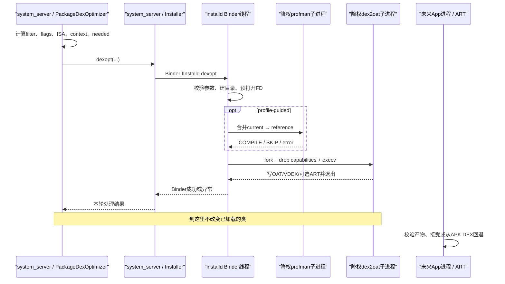
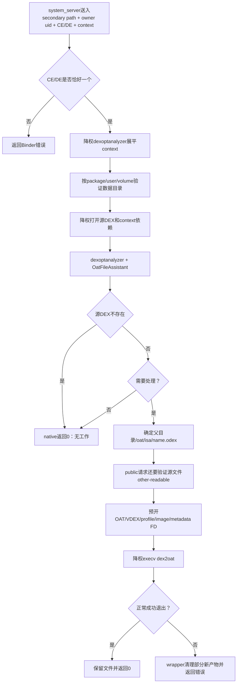
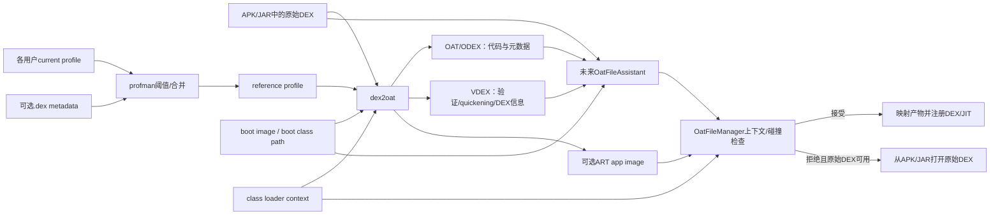

# 第556章 Android dexopt Native与产物采用链：installd、dexoptanalyzer、dex2oat、Profiles、OAT/VDEX/ART与运行时回退

> 源码基线：AOSP `android-11.0.0_r48`（Android 11 / API 30）  
> 学习目标：从 system_server 的 `Installer.dexopt()` 一直追到 installd、dexoptanalyzer、profman、dex2oat，再回到以后某次 ART 类加载；能够解释参数、UID、文件描述符、profile、OAT/VDEX/ART 的职责，以及失败后为什么通常还能从 APK 中的原始 DEX 运行。  
> 阅读约定：继续在 macOS 上只读源码，不实际编译、不连接设备；目录示例描述设备端布局，并不表示这些设备目录存在于本机。

## 1. 本章先拆掉一句最危险的话

“`Installer.dexopt()` 没抛异常，就证明应用已经在运行新编译的机器码。”

这句话跨越了两个不同时间：installd 本轮是否成功处理产物，以及以后某个进程加载 DEX 时 ART 是否接受这些产物。即使 dex2oat 成功写出了 OAT，后续仍要校验 DEX 校验和、boot image、compiler filter、class loader context和重复类；正在运行的进程也不会因此被热替换。

## 2. 一句话主线

`PackageDexOptimizer` 先在 system_server 计算目标 filter、flags、ISA、context和“是否需要优化”；`Installer` 通过 Binder 把请求交给 installd；installd 验证调用者与路径、准备输出文件和profile，以降权子进程运行 dexoptanalyzer/profman/dex2oat；以后 ART 再由 `OatFileAssistant` 选择候选，并由 `OatFileManager` 做上下文/重复类检查，不可采用时通常回退到 APK 原始 DEX。

## 3. 与第555章的接口在哪里

第555章停在 Java 侧的两种入口：primary/split DEX 先由 `DexFile.getDexOptNeeded()` 判断，再调用 installd；secondary DEX 因 system_server 不适合直接读 App 私有代码，会把更多判断交给 installd 中降权后的分析子进程。

本章回答上一章留下的三个问题：native 怎样把路径请求变成受控文件描述符，dex2oat 实际写了什么，以及下一次加载凭什么采用或拒绝这些文件。

## 4. 先认清七个参与者

- `PackageDexOptimizer`：Java 策略层，决定路径、ISA、filter、flags、profile和context。
- `Installer`：system_server 中的 Java Binder 包装层。
- `InstalldNativeService`：installd Binder入口、参数检查和全局串行边界。
- `dexopt.cpp`：本地文件准备、权限切换、子进程编排与清理。
- `dexoptanalyzer`：借助 `OatFileAssistant` 回答“现在需要何种 dexopt”。
- `profman` / `dex2oat`：前者维护profile，后者验证/编译并写产物。
- `OatFileAssistant` / `OatFileManager`：以后 ART 加载时判断产物新鲜度、安全性与回退。

它们不是同一个进程里的连续函数；至少跨过 system_server → installd，以及 installd → 多个短命子进程两类边界。

## 5. 先建立六个完成点

一次完整处理可以标成：

1. Java 已决定需要处理；
2. installd Binder 已接收并完成入口检查；
3. profman/dexoptanalyzer 已给出分析结果；
4. dex2oat 子进程已正常退出；
5. installd 已保留新文件并向 Java 返回成功；
6. 未来 ART 已接受 OAT，或者拒绝后从原始 DEX 回退。

“优化完成”最好明确指第5点；“已经用上”必须有第6点证据。

## 6. 第一幅图：一次primary dexopt的进程与完成点



图中 profman 并非每次都运行，dex2oat 也可能因“无需处理”而不运行；只有按具体分支阅读，才能知道本轮停在哪个完成点。

## 7. Java策略层已经带来了哪些事实

进入 native 前，Java 通常已经知道包名、目标SDK、代码路径、目标 ISA、compiler filter、class loader context、是否profile-guided、是否公开可读、是否后台任务、是否secondary及CE/DE位置。

native 不重新理解整个 `AndroidPackage`；它信任并验证一组扁平参数，同时利用文件系统所有权、SELinux和降权后的实际可访问性形成第二道边界。

## 8. 第一段关键源码：Installer只是受控Binder包装

```java
// frameworks/base/services/core/java/com/android/server/pm/Installer.java
public void dexopt(String apkPath, int uid, @Nullable String pkgName, String instructionSet,
        int dexoptNeeded, @Nullable String outputPath, int dexFlags,
        String compilerFilter, @Nullable String volumeUuid, @Nullable String sharedLibraries,
        @Nullable String seInfo, boolean downgrade, int targetSdkVersion,
        @Nullable String profileName, @Nullable String dexMetadataPath,
        @Nullable String compilationReason) throws InstallerException {
    assertValidInstructionSet(instructionSet);
    BlockGuard.getVmPolicy().onPathAccess(apkPath);
    BlockGuard.getVmPolicy().onPathAccess(outputPath);
    BlockGuard.getVmPolicy().onPathAccess(dexMetadataPath);
    if (!checkBeforeRemote()) return;
    try {
        mInstalld.dexopt(apkPath, uid, pkgName, instructionSet, dexoptNeeded, outputPath,
                dexFlags, compilerFilter, volumeUuid, sharedLibraries, seInfo, downgrade,
                targetSdkVersion, profileName, dexMetadataPath, compilationReason);
    } catch (Exception e) {
        throw InstallerException.from(e);
    }
}
```

这里的 `BlockGuard` 是 Java 线程磁盘访问策略提示，并不完成设备文件权限校验；真正的路径、UID、打开文件与降权发生在 installd。方法返回也只是 Binder 调用完成，没有运行时采用回执。

## 9. `checkBeforeRemote()` 的特殊测试语义

正常 system_server 会等待 installd 可用后再调用。`Installer` 的 isolated 模式或尚未连接远端时，`checkBeforeRemote()` 可能让包装方法直接返回；测试代码可借此避免真实文件操作。

因此读单元测试时不要把 Java `void` 返回自动解释成 native 做过工作，要同时确认 `Installer` 是否真正连接 `IInstalld`。

## 10. Native Binder入口先限制谁能调用

`InstalldNativeService::dexopt()` 开头执行 `ENFORCE_UID(AID_SYSTEM)`。宏允许 system UID，公共辅助逻辑也允许 root；普通应用不能直接把任意路径送给 installd 请求编译。

这是“谁能请求”的边界，不是“被请求路径一定安全”的全部证明。路径与所有者还要继续验证。

## 11. 入口的基础路径检查做了什么

`CHECK_ARGUMENT_PATH` 需要非空绝对路径，拒绝明显的 `..` 路径片段和换行等危险字符；可空参数为空时跳过。包名、volume UUID也有各自格式检查。

它属于语法级过滤，不会仅凭字符串证明 secondary DEX 真在指定包的CE/DE目录里，更不会证明文件最终能由目标 UID 打开。后续存储归属检查和降权打开才补足语义。

## 12. “绝对路径通过”不等于“可信路径”

例如 `/data/user/0/a/../b/x.dex` 会在基础检查被拒绝，但一个语法正常的 `/data/user/0/other/x.dex` 仍需要与包、用户、存储类型匹配。

primary APK 的来源是PMS已扫描包；secondary路径不具备同样信任，所以 native 的 secondary 分支更长。学习安全代码时要区分输入来源可信度，而不是只数检查函数个数。

## 13. installd用全局递归锁串行这一调用

Binder入口在真正调用 `android::installd::dexopt()` 前持有 `mLock`，锁的生命周期包含目录准备、分析、fork、等待dex2oat以及清理。

这简化了同一组编译文件并发更新的状态，但也表示一个慢 dex2oat 会占住 installd 的这条全局变更锁；Java层的 install lock 与这里是不同进程中的两层串行化。

## 14. 指定oat目录创建失败时会回退

若 Java 给出 `outputPath`，入口先调用 `createOatDir(oatDir, isa)`。它校验路径并准备 `oat/<isa>` 目录及标签；如果失败，代码把 `oat_dir` 置空，让后续改用 dalvik-cache，而不是立刻让整个 dexopt 失败。

所以“包目录没有oat产物”不能单独证明没编译，也可能产物落在全局 `/data/dalvik-cache`。

## 15. flag mask先拒绝未知位

`dexopt()` 用 `DEXOPT_MASK` 验证没有未知flag，然后拆出 public、debuggable、boot complete、profile guided、secondary、idle background、hidden API checks、compact dex、app image和restore等布尔量。

flag决定文件权限、profile、二进制、调度和输出形式；compiler filter只表示验证/编译强度，两者不能互相替代。

## 16. primary传入的UID常常不是完整应用UID

`PackageDexOptimizer` 对primary/split使用 `UserHandle.getSharedAppGid(pkg.getUid())` 得到共享GID口径，并将其作为 native 参数。这样同一包跨用户可共享安装代码产物；输出通常由 system 拥有、组设为该 shared GID。

secondary DEX位于某个用户的私有数据中，Java则传 `ApplicationInfo.uid`，native文件通常以该应用UID作为owner和group。两种UID语义不同，不能只把参数名 `uid` 理解成“当前用户应用UID”。

## 17. 第二段关键源码：primary在Java层先算needed

```java
// frameworks/base/services/core/java/com/android/server/pm/PackageDexOptimizer.java
@GuardedBy("mInstallLock")
private int dexOptPath(AndroidPackage pkg, @NonNull PackageSetting pkgSetting, String path,
        String isa, String compilerFilter, boolean profileUpdated, String classLoaderContext,
        int dexoptFlags, int uid, CompilerStats.PackageStats packageStats, boolean downgrade,
        String profileName, String dexMetadataPath, int compilationReason) {
    int dexoptNeeded = getDexoptNeeded(path, isa, compilerFilter, classLoaderContext,
            profileUpdated, downgrade);
    if (Math.abs(dexoptNeeded) == DexFile.NO_DEXOPT_NEEDED) {
        return DEX_OPT_SKIPPED;
    }

    String oatDir = getPackageOatDirIfSupported(pkg,
            pkgSetting.getPkgState().isUpdatedSystemApp());

    Log.i(TAG, "Running dexopt (dexoptNeeded=" + dexoptNeeded + ") on: " + path
            + " pkg=" + pkg.getPackageName() + " isa=" + isa
            + " dexoptFlags=" + printDexoptFlags(dexoptFlags)
            + " targetFilter=" + compilerFilter + " oatDir=" + oatDir
            + " classLoaderContext=" + classLoaderContext);
    try {
        long startTime = System.currentTimeMillis();

        // TODO: Consider adding 2 different APIs for primary and secondary dexopt.
        // installd only uses downgrade flag for secondary dex files and ignores it for
        // primary dex files.
        String seInfo = AndroidPackageUtils.getSeInfo(pkg, pkgSetting);
        mInstaller.dexopt(path, uid, pkg.getPackageName(), isa, dexoptNeeded, oatDir,
                dexoptFlags, compilerFilter, pkg.getVolumeUuid(), classLoaderContext,
                seInfo, false /* downgrade*/, pkg.getTargetSdkVersion(),
                profileName, dexMetadataPath,
                getAugmentedReasonName(compilationReason, dexMetadataPath != null));

        if (packageStats != null) {
            long endTime = System.currentTimeMillis();
            packageStats.setCompileTime(path, (int)(endTime - startTime));
        }
        return DEX_OPT_PERFORMED;
    } catch (InstallerException e) {
        Slog.w(TAG, "Failed to dexopt", e);
        return DEX_OPT_FAILED;
    }
}
```

这段是r48方法原文。primary 的 `SKIPPED` 可在Binder之前产生；`PERFORMED`表示这次 native 调用无异常，不是未来App已加载OAT。另一个细节是形参 `downgrade` 没有传给installd，而是固定传 `false`；源码注释说明native只对secondary消费这个布尔值，primary降级已通过needed/filter等上游决策表达。

## 18. primary与secondary的“谁判断needed”不同

primary路径通常可由 system_server/ART API读取，Java先调用 `DexFile.getDexOptNeeded()`。secondary属于App私有存储，native先降权验证并运行dexoptanalyzer，再把结果写回局部 `dexopt_needed`。

这正是上一章中 secondary Java返回粒度较粗的根因：Java发起后只看到 installd 成功，native内部可能得到 `NO_DEXOPT_NEEDED` 并直接返回0。

## 19. secondary必须恰好声明CE或DE

native从flags取 `DEXOPT_STORAGE_CE` 和 `DEXOPT_STORAGE_DE`。secondary要求两者恰有一个；primary反而断言两者都不能出现。

CE需用户解锁后可用，DE可在Direct Boot阶段使用。这个flag不只是布局提示，它参与计算owner数据目录与路径验证。

## 20. secondary路径验证的基本思路

`validate_secondary_dex_path()` 根据 package、volume、UID拆出userId/appId，构造该包的CE或DE数据根目录，要求dex路径以该目录为前缀；内部存储还兼顾 `/data/user/0` 的兼容链接布局。

随后分析/编译子进程会降到owner UID，并以真实文件系统与SELinux权限打开路径。字符串归属与实际访问能力是两层检查。

## 21. r48这里仍有纯字符串前缀边界

该验证使用 `strncmp(dexPath, appDataDir, appDataDir.size())`，没有额外要求下一字符必须是 `/`。从纯字符串看，`.../com.demo2`可能匹配`.../com.demo`前缀。

这应记录为r48边界，但不能直接夸大成可任意读写：调用者仍限system/root，子进程降权、Unix权限与SELinux继续约束实际文件访问。严谨安全分析要把每层都列出。

## 22. class loader context先被展平成依赖路径

secondary context可能是 `PCL[a.jar:b.jar]` 等编码。installd先fork一个dexoptanalyzer子进程，以 `--flatten-class-loader-context` 解析并把上下文中的DEX路径写到stdout，父进程再逐个打开为FD。

这样主流程不靠手写字符串切分理解复杂context；但解析子进程正常退出码50才表示flatten成功。

## 23. 为什么上下文文件也要变成FD

dex2oat不仅需要目标DEX，还要在编译时解析前置classpath。若只传可变路径，校验后到打开前可能被替换；预打开FD可让后续子进程使用已固定对象。

命令行仍带逻辑location和context字符串用于身份/元数据，真正读取内容则尽量通过FD。路径回答“它叫什么”，FD回答“这一次实际打开的是哪个对象”。

## 24. dexoptanalyzer不是dex2oat的轻量模式

它是独立可执行程序，会创建一个小型ART Runtime和 `OatFileAssistant`，检查原始DEX及现有OAT/VDEX、目标filter、boot image和context，然后用退出码表达需要的工作。

它不负责生成最终机器码；分析成功也不表示dex2oat必然会成功。

## 25. dexoptanalyzer退出码需要按协议读

r48常见含义为：0无需工作，1从scratch处理，2/3针对oat位置的boot-image/filter变化，4/5针对odex位置的boot-image/filter变化；50专用于flatten context成功；101以上是分析错误域。

数字不是通用shell成功/失败语义。父进程必须结合本次模式解释，不能把所有非0都写成错误。

## 26. needed正负号编码的是位置

`OatFileAssistant::GetDexOptNeeded()` 约定正值倾向oat位置，负值表示odex位置，scratch例外保持正值。绝对值才表达“从头、boot image变化、filter变化”等原因。

这也解释 Java 经常用 `Math.abs(dexoptNeeded)` 判断 `NO_DEXOPT_NEEDED`；符号不是优化强弱。

## 27. secondary只接受odex位置类返回

secondary产物固定在源文件父目录下的 `oat/<isa>`，属于odex布局。native把分析器返回4/5映射成负needed，0映射无需工作，1映射scratch；若收到2/3这种oat位置结果，则视为协议不符合secondary预期而失败。

这里的“odex”是路径类别/历史命名，不表示文件内部不是OAT格式。

## 28. secondary源文件消失被当成无需工作

分析子进程若因目标DEX不存在返回专门状态，父流程会把它归为 `NO_DEXOPT_NEEDED` 并成功返回。真正清除过时记录和相关产物主要由上一章的reconcile链完成。

因此“Installer无异常”在文件已消失时同样可能成立，不应据此声称生成了新文件。

## 29. force只改“已有目标时怎样做”

DEXOPT_FORCE会把可执行的needed覆盖为scratch，迫使重新生成；但不能凭空编译一个已经不存在或无法打开的源DEX。

“强制”是绕过新鲜度判断，不是绕过路径、权限、ISA和输入存在性。

## 30. secondary的public标志还要看源文件模式

即使Java请求 `DEXOPT_PUBLIC`，native仍检查源secondary DEX是否真实other-readable；不满足时把 `is_public` 降为false，避免公开生成由私有输入导出的产物。

这是调用意图与文件事实合并的例子：flag是上限，不是对权限状态的无条件命令。

## 31. 第二幅图：secondary DEX的额外分析与路径边界



图中的路径验证发生不止一次：分析子进程和实际处理分支都要面对owner UID与文件系统事实，不能把前面的Java owner推断当成最终授权。

## 32. 三种主要输出布局

包内oat目录通常是 `<package-code-dir>/oat/<isa>/<apk-base>.odex`；secondary是 `<dex-parent>/oat/<isa>/<dex-base>.odex`；没有可用包oat目录时，primary可落到 `/data/dalvik-cache/<isa>/<转义路径>@classes.dex`。

每种布局旁边都可能有同stem的 `.vdex` 和 `.art`。真实路径由工具函数生成，不建议在调试脚本中手拼。

## 33. 包内primary示例怎样读

假设代码路径为 `/data/app/.../base.apk`，输出可能是 `oat/arm64/base.odex`、`base.vdex`和可选`base.art`。split APK会按自身basename得到对应stem。

一个目录同时出现多种ISA子目录很正常；它们服务不同运行指令集，不是重复垃圾。

## 34. secondary示例怎样读

若源为 `/data/user/0/com.demo/files/plugin.jar`，arm64输出通常在 `/data/user/0/com.demo/files/oat/arm64/plugin.odex`，旁边是`plugin.vdex`和可选`plugin.art`。

profile不是都放在这一ISA目录：secondary current/reference profile通常在源文件父目录的`oat`下，以DEX文件名派生，供不同ISA的优化共享使用事实。

## 35. dalvik-cache名称为什么看起来像路径转义

全局cache要把许多绝对路径映射到单一目录，所以把 `/` 等转成 `@`，并添加classes标记。不要从一个字符串示例推断所有multidex细节；应调用 `create_cache_path()` 同类逻辑定位。

包目录创建失败后的回退、只读system路径等，都可能让产物出现在dalvik-cache。

## 36. `.odex`在这里仍然是OAT文件

Android历史留下了odex扩展名和“oat/odex位置”术语，但 `OatFileAssistant` 明确把它们当OAT候选打开。不要把扩展名理解成“这里存的只是优化DEX、没有ELF/OAT结构”。

判断内容应看OAT header和工具输出，而不是只看后缀。

## 37. primary与secondary输出所有权不同

`set_permissions_and_ownership()` 对primary一般把owner设为system，group设为传入shared GID；secondary把owner和group都设为应用UID。基础模式让owner可读写、group可读，public时再给other读。

这反映生命周期：primary安装代码由系统维护并跨用户复用，secondary属于具体用户App私有数据。

## 38. installd先打开输出，再让子进程降权

installd以自身权限创建/打开OAT、VDEX、profile、image和DEX metadata输入，然后fork；child删除能力并切到目标UID/GID，继承这些FD，再 `execv()` dex2oat。

这是很重要的权限分工：高权限父进程决定“允许操作哪些对象”，低权限编译器只通过已给FD处理内容，减少编译器直接漫游文件系统的能力。

## 39. 为什么仍同时传路径和FD

FD用于真实I/O与竞态收敛；location字符串用于OAT元数据、错误信息、校验和class loader context中的逻辑身份。dex2oat参数会同时出现 `--zip-fd` 与 `--zip-location`、`--oat-fd` 与 `--oat-location`。

把字符串当显示名、FD当授权后的对象引用，是理解这套接口最稳的方式。

## 40. `ExecVHelper`不经过shell

父进程先在fork前把字符串和argv指针准备好，child直接调用 `execv(argv[0], argv)`。参数不会经过shell解释，因此路径里的空格不会触发命令拼接，`$()`等也不会被展开。

fork到exec之间尽量不分配内存，可降低多线程native进程fork后的锁状态风险。

## 41. dex2oat参数大致分六组

第一组是输入/输出FD及location；第二组是ISA、features、variant和boot image；第三组是compiler filter、线程数、CPU set、swap；第四组是profile与app image；第五组是class loader context及其FD列表；第六组是target SDK、hidden API、DEX metadata和compilation reason。

日志看到一个很长的DexInv命令时，应按这六组拆读，而不是逐字符硬看。

## 42. 设备属性参数最后追加可覆盖默认值

`dalvik.vm.dex2oat-flags` 按空格拆分并追加到参数末尾，源码注明这样便于调试时覆盖前面生成的设置。

这不是shell tokenizer，带复杂引号的单个值不会像终端那样自动保留；属性内容的解析能力比命令行shell简单。

## 43. dex2oat32或64不由目标ISA直接决定

native在设备支持64位且 `dalvik.vm.dex2oat64.enabled` 打开时选择dex2oat64，否则选择dex2oat32；目标代码ISA仍通过单独参数传给编译器。

“64位dex2oat进程”描述宿主编译器进程位宽，“为arm64生成代码”描述输出目标，二者相关但不是同一字段。

## 44. debug二进制选择也有产品条件

运行时使用debug ART，或非REL的debuggable构建执行特殊后台编译时，且debug二进制真实存在，才会选 dex2oatd；release候选的后台任务刻意不使用debug二进制。

所以看到 `DEXOPT_IDLE_BACKGROUND_JOB` 不等于一定启动 dex2oatd。

## 45. boot complete改变线程和调度策略

开机完成前后分别读取不同的线程数/CPU set属性，child还调用 `SetDex2OatScheduling(boot_complete)`。后台任务flag也参与配置与二进制选择。

compiler filter决定“做多少验证/编译”，调度参数决定“用多少资源、在何种优先级做”；性能排查需要同时观察。

## 46. 加密最小框架阶段会强制extract

设备尚处于加密的minimal-framework启动情形时，native把filter强制成`extract`并增加`-Xnorelocate`，避免依赖尚不可用的完整boot image环境。

这说明上层请求的filter不是最终执行filter的唯一来源；启动阶段安全性/可用性可以进一步降级它。

## 47. swap文件是“已unlink但FD仍有效”

若属性允许，installd创建 `<oat>.swap` 后立刻unlink名字，把FD传给dex2oat。Unix语义保证child仍能使用对象，最后一个FD关闭后空间自动回收。

因此目录里看不到 `.swap` 不能证明编译没用swap；这种设计反而减少崩溃后留下命名临时文件的机会。

## 48. OAT输出会先加非阻塞flock

dex2oat child对输出OAT FD尝试非阻塞独占锁，避免与另一编译者同时写同一文件。若锁失败，child退出，父进程按失败清理本轮输出。

Java install lock、installd `mLock`和文件锁分别保护跨层/跨进程场景，不能用其中一个概括全部并发控制。

## 49. 输出替换不是原子rename事务

`open_output_file(..., recreate=true)` 先unlink旧文件，再用 `O_CREAT|O_EXCL` 创建新文件。失败时 `Dex2oatFileWrapper` 会unlink部分新文件，但旧版本在开始时已经删除。

因此不能说dexopt采用“旧文件始终可用、成功后原子切换”的事务模型。它选择清理半成品，并依赖以后从原始DEX回退维持可运行性。

## 50. `Dex2oatFileWrapper`是失败清理护栏

wrapper默认在析构时执行cleanup：OAT/VDEX/ART通常unlink，reference profile可能清空。只有整个native流程确认成功后才逐个 `SetCleanup(false)` 保留对象。

这更像作用域回滚，不是跨多个文件的原子提交；进程突然断电仍需依赖下次校验识别不完整或过期产物。

## 51. VDEX为什么有输入和输出两个FD

旧VDEX可携带已验证信息和quickening数据，dex2oat可复用它；新VDEX承载本轮与当前DEX/boot环境一致的结果。installd会在删/建输出前先打开旧输入，避免名字替换后丢失读取句柄。

“复用旧VDEX”不等于不校验，它只是为本轮减少重复工作提供输入。

## 52. VDEX有一个谨慎的原地更新分支

当输入输出位置相同、变化原因是boot image、且不是profile-guided时，代码可能原地更新VDEX。若失败，cleanup会删除这个VDEX，避免留下看似有效但内容部分更新的文件。

其他常见分支创建新的输出VDEX，失败时删新文件。调试时要结合needed原因与profile flag判断是哪条路径。

## 53. app image为何总先清理旧文件

`.art`可能被另一个运行进程mmap。直接在原inode上修改可能让运行中进程看到不一致内容，因此代码先unlink旧名字，再创建新文件；即使本轮不生成image，也会清掉过时image。

app image创建失败通常不是整个DEX编译的致命条件，系统可以只保留OAT/VDEX；没有reference profile时也会主动禁用image，因为收益不足。

## 54. reference profile失败清理比想象更激进

profile-guided时，installd以wrapper打开reference profile。若后续dex2oat失败，cleanup函数会清空reference profile；成功才关闭cleanup。

这是避免持续使用可能触发失败/不一致的profile，但意味着“编译失败只影响产物，不影响profile”并不准确。

## 55. public secondary不能使用reference profile

若secondary产物要公开读取，native拒绝把owner的私有使用profile用于这次公开编译，避免通过公开产物暴露用户使用特征。

这是一条隐私边界：代码文件可公开，不代表该用户的热点方法统计也可公开。

## 56. DEX metadata进入编译的方式

安装包旁的 `.dm` 可以携带profile或预生成VDEX等metadata。installd用 `O_NOFOLLOW` 打开metadata路径，并把FD交给dex2oat；打开失败会记录错误，但是否致命要看后续是否真正依赖该内容。

`.dm`不是已签收的OAT替代品；内容仍需由PackageInstaller校验关联和ART工具校验格式/DEX一致性。

## 57. 成功后为何修改OAT时间戳

dex2oat成功后，installd的 `update_out_oat_access_times()` 只把输出OAT/ODEX的访问、修改时间对齐到APK输入时间；这个函数没有同时改VDEX和ART。这样OAT时间更便于维护逻辑和诊断比较。

mtime只是辅助元数据，ART真正的新鲜度判断依赖校验和、boot image、filter等，不能只用`ls -l`时间判断可采用。

## 58. wait_child成功才会保留文件

父进程等待dex2oat，非正常退出或非0状态会生成带工具名的错误信息并返回；只有正常成功后才更新时间并关闭各wrapper的cleanup。

Binder错误到Java后变为 `InstallerException`，primary通常包装成 `DEX_OPT_FAILED`；secondary上层也只能得到整次调用失败，而非每个内部文件的精细状态。

## 59. 当前正在运行的App为什么不会热切换

类和方法已经由当前ClassLoader、DexFile和可能的JIT代码管理。installd只在文件系统生成供未来打开的产物，没有向所有应用进程发送“替换已加载DexFile”的协议。

新的OAT一般在进程重启、创建新类加载器或未来相应加载路径中重新选择；不要把磁盘维护写成在线代码补丁。

## 60. profile要先分current和reference

current profile记录某个用户当前运行产生的热点，允许频繁更新；reference profile是系统维护、供优化决策使用的收敛版本。profman决定current相对reference是否有足够新信息，并在合适时合并。

两者分开可避免dex2oat直接读取仍被应用持续写的文件，也让多用户使用数据汇总到包级优化输入。

## 61. primary profile的设备端路径

primary current通常为 `/data/misc/profiles/cur/<user>/<package>/primary.prof`；split使用 `<split>.split.prof` 一类profileName。reference通常为 `/data/misc/profiles/ref/<package>/<profileName>`。

路径由 `ArtManager.getProfileName()` 和 installd工具函数统一生成；不要假设所有split都共享`primary.prof`。

## 62. secondary profile的设备端路径

secondary current通常在 `<dex-parent>/oat/<dex-name>.cur.prof`，reference在同一oat目录的 `<dex-name>.prof`。它跟随动态代码所在用户数据区，便于以owner UID维护。

这里的 `<dex-name>`包含原文件名派生规则；调试时优先搜索`create_current_profile_path`和`create_reference_profile_path`，不要凭后缀猜。

## 63. current profile是谁写出来的

`LoadedApk.setupJitProfileSupport()` / `DexLoadReporter`向 `VMRuntime.registerAppInfo()` 注册profile与code paths，ART `Runtime::RegisterAppInfo()`在JIT存在、profile文件名有效且code paths非空等条件下启动 `ProfileSaver`。

ProfileSaver异步观察热点方法、采样方法和类并写current profile。它是运行时统计，不是PMS在安装时凭空生成的热度。

## 64. profile saver启动有前置条件

没有JIT、profile路径为空/不存在或代码路径集合为空，都可能不启动保存；系统属性也可能禁用JIT profile支持。即使文件预先创建，应用没产生足够活动也可能几乎没有有效条目。

因此“current.prof存在”只证明容器被准备过，不证明有可用于profile-guided编译的热点。

## 65. profman合并的输入范围

primary通常打开该包所有已知用户的current profiles，以及一个可读写reference profile；secondary只处理owner用户对应的动态DEX profile。然后fork profman并降到相应UID/GID。

跨用户汇总的是方法/类使用轮廓，不表示应用私有数据文件彼此可见。

## 66. `mergeProfiles()`不是简单复制

profman比较current与reference的增量是否达到阈值、格式和DEX键是否兼容。只有“值得编译”的结果才告诉上层profile updated；小增量可以skip。

profile-guided filter仍可在无新profile时判断现有产物是否足够新，而不是每次启动后台Job都重编。

## 67. profman退出码的四类后果

- COMPILE：有意义的新信息，合并reference并清current；
- SKIP：增量不足，不清两边；
- BAD_PROFILES/版本不兼容等：清current与reference，避免坏数据反复使用；
- I/O或锁问题：不编译，也尽量保留两边等待以后重试。

所以“merge返回false”可能是正常skip，也可能是错误；必须结合日志/退出码。

## 68. 第三段关键源码：安装时先准备profile容器

```java
// frameworks/base/services/core/java/com/android/server/pm/dex/ArtManagerService.java
public void prepareAppProfiles(
        AndroidPackage pkg, @UserIdInt int user,
        boolean updateReferenceProfileContent) {
    final int appId = UserHandle.getAppId(pkg.getUid());
    if (user < 0) {
        Slog.wtf(TAG, "Invalid user id: " + user);
        return;
    }
    if (appId < 0) {
        Slog.wtf(TAG, "Invalid app id: " + appId);
        return;
    }
    try {
        ArrayMap<String, String> codePathsProfileNames = getPackageProfileNames(pkg);
        for (int i = codePathsProfileNames.size() - 1; i >= 0; i--) {
            String codePath = codePathsProfileNames.keyAt(i);
            String profileName = codePathsProfileNames.valueAt(i);
            String dexMetadataPath = null;
            // Passing the dex metadata file to the prepare method will update the reference
            // profile content. As such, we look for the dex metadata file only if we need to
            // perform an update.
            if (updateReferenceProfileContent) {
                File dexMetadata = DexMetadataHelper.findDexMetadataForFile(new File(codePath));
                dexMetadataPath = dexMetadata == null ? null : dexMetadata.getAbsolutePath();
            }
            synchronized (mInstaller) {
                boolean result = mInstaller.prepareAppProfile(pkg.getPackageName(), user, appId,
                        profileName, codePath, dexMetadataPath);
                if (!result) {
                    Slog.e(TAG, "Failed to prepare profile for " +
                            pkg.getPackageName() + ":" + codePath);
                }
            }
        }
    } catch (InstallerException e) {
        Slog.e(TAG, "Failed to prepare profile for " + pkg.getPackageName(), e);
    }
}
```

它逐base/split建立current profile；只有允许更新reference时才寻找`.dm`。准备成功不代表`.dm`中的profile一定有有效热点，更不代表已经运行dex2oat。

## 69. native `prepare_app_profile()`的两步

第一步用严格权限创建current profile；没有DEX metadata时到此成功返回。第二步在有`.dm`时打开reference、metadata和APK FD，运行profman的copy-and-update模式。

child使用应用shared GID降权，因此profile导入也处于受限身份，不是高权限父进程直接解析不可信metadata。

## 70. r48准备profile有一个返回值漏洞

`prepare_app_profile()` 等待profman后只检查 `WIFEXITED(return_code)`，没有再检查 `WEXITSTATUS`是否为成功码。也就是说profman只要“正常退出”，即使退出状态表示处理失败，该函数仍可能返回true。

这会让Java日志缺少失败提示，但不能证明坏内容已被接受；后续profman/dex2oat仍会做自己的格式与一致性检查。

## 71. profile snapshot是另一个用途

开发者/系统诊断可请求profile snapshot，用于导出当前可读快照。snapshot涉及权限、包是否可profile、路径和回调FD，与后台dexopt直接消费reference profile不是同一API。

不要把“可导出profile”写成“下一次一定profile-guided编译”；调度、filter、增量阈值和空间仍会决定是否编译。

## 72. compiler filter不是线性“优化级别”开关

Android 11常见filter包括 `assume-verified`、`extract`、`verify`、`quicken`、`space-profile`、`space`、`speed-profile`、`speed`、`everything-profile`、`everything`。枚举顺序参与“是否至少一样好”的比较，但各filter还分别控制验证、quickening、AOT范围和profile依赖。

诊断时应同时记录目标filter和现有OAT记录的filter。

## 73. 前四类filter不要误写成完整AOT

`assume-verified`、`extract`、`verify`、`quicken`不进行普通方法的AOT机器码编译；`verify`及以上会做验证，`quicken`还可生成JNI stubs/执行quickening。真正AOT从space/profile一类开始，范围随filter变化。

所以 `verify`产物仍有价值，但价值主要是验证信息/VDEX，不等于大量本地机器码。

## 74. 哪些filter依赖profile

`space-profile`、`speed-profile`、`everything-profile`是profile-dependent。profile变化会让原本匹配filter的产物仍需要更新；非profile filter不会因为current热点小变化直接失效。

应用safe mode会把需要AOT的请求映射到更保守的`quicken`，以减少有问题本地代码的影响。

## 75. 验证与boot image为什么有关

当filter启用verification时，验证结果依赖boot class path中的类和方法解析。OAT/VDEX保存boot image/boot class path校验信息；系统更新造成boot image变化时，旧验证/编译假设可能失效。

这就是needed中“boot image out of date”与“compiler filter mismatch”分开的原因。

## 76. 超大应用可能在dex2oat内部降级

dex2oat `Setup()`可因DEX总量超过阈值，把实际compiler filter降为`verify`并禁用app image，避免一次安装消耗过多资源。

r48源码注释还指出OAT key-value里的filter会保留原始目标值，而实际编译器已降级。诊断工具显示的“记录filter”因此可能高估实际做过的工作；这是实现权衡，不应粗暴等同为所有up-to-date判断都失效。

## 77. dex2oat主流程先做什么

入口大致是解析参数、按需读取profile、尽早打开输出、`Setup()`构造Runtime与writer、宽容校验profile、编译app/image、写输出、flush/close/strip并退出。

每一步都可能失败；“进程启动成功”远早于“文件完整并由父进程保留”。

## 78. `Setup()`会建立编译时运行环境

它整理Runtime options、boot image、ISA特征、OatWriters和输入DEX来源，读取/写出需要的DEX视图，并创建class loader context。context依赖也由传入FD打开。

这不是启动完整Android应用，而是搭一个足以解析类、验证和编译的ART环境。

## 79. CompilerDriver负责的核心阶段

编译阶段先准备CompilerDriver与verifier dependencies；必要时把输入VDEX的quickening还原，创建代表目标加载环境的ClassLoader，执行PreCompile，然后 `CompileAll()` 按filter选择方法生成代码。

class loader context不是只在最后打标签，它影响编译时类解析和能否安全复用已有结果。

## 80. VDEX里主要是什么

VDEX主要承载与DEX绑定的校验依赖、验证结果、quickening信息以及可能的DEX内容/校验元数据，用来减少以后重复验证并支持运行时执行优化。

它不是完整机器码ELF，通常与OAT配套；某些只验证/提取场景可让运行时从VDEX获益而没有大量AOT代码。

## 81. OAT里主要是什么

OAT通常嵌在ELF结构中，包含OAT header、DEX/OatDexFile索引、编译代码、映射表、GC/stack map、key-value元数据、动态段及可选调试信息。

扩展名可能是`.odex`，内容角色仍是ART可打开的OAT。`oatdump`比文本编辑器更适合观察它。

## 82. ART app image里主要是什么

`.art`是预初始化对象堆镜像，可把类对象等启动期状态直接映射，减少启动构造成本。它依赖对应OAT、boot image、profile和运行时配置，采用条件比单独OAT更严格。

它不是应用资源图片，也不是必须产物；缺失时应用仍可通过OAT/VDEX或原始DEX运行。

## 83. multidex怎样进入同一处理

输入APK可能包含`classes.dex`、`classes2.dex`等。OatWriter会枚举并记录各DEX location/checksum，OatFileAssistant以后也检查multidex数量与校验和是否一致。

因此只验证主`classes.dex`不足以证明产物对应当前APK；增加/删除一个secondary-in-APK multidex条目同样会使候选过期。

## 84. `.dm`中的VDEX也不能无条件信任

dex2oat从metadata FD读取可复用内容时仍要对照APK中的DEX校验和和格式；包安装链还负责`.dm`与APK文件名/签名的一致性。

metadata的意义是提供可信安装输入链中的优化提示，不是跳过ART校验。

## 85. profile验证为何偏“宽容”

dex2oat发现profile与DEX不完全匹配时通常记录问题并继续，而不是总让整次安装编译失败。源码解释这是为了避免昂贵的完全回退成本；不匹配条目可被忽略。

这提高可用性，但意味着“使用profile-guided filter”不保证每条profile记录都参与编译。

## 86. 写文件的顺序不等于原子提交顺序

Writer分别写VDEX的验证/quickening/header，写OAT的rodata、text、header、dynamic/debug等，再flush各FD，并可让ImageWriter写`.art`。中途失败由父/析构清理命名文件。

多个FD没有共同日志事务；未来加载的完整性检查才是崩溃后防止误用半成品的最后防线。

## 87. dex2oat为何release主流程使用`_exit`

成功/失败路径在release构建可直接 `_exit`，避免销毁完整ART Runtime和大量对象带来的额外时间；操作系统会关闭进程FD并回收内存。

这不绕过父进程wait，也不自动保留输出；父进程仍按exit status决定wrapper cleanup。

## 88. 第三幅图：产物与未来运行时采用关系



这张图强调产物不是“编译完即权威”；原始DEX、boot环境、filter和加载上下文共同决定未来采用。

## 89. OatFileAssistant是新鲜度裁判

它围绕一个DEX location维护oat/odex候选信息，尝试打开文件，计算状态并选择best info。常见状态包括cannot open、DEX out of date、boot image out of date和up to date。

“能open”只越过第一关，不等于up to date。

## 90. DEX校验具体看哪些事实

Assistant比较原始DEX的校验和、multidex数量/条目和OAT/VDEX记录；DEX内容变化、APK替换或multidex集合变化都会让候选过期。

文件名和mtime相同也不能骗过这些内容绑定；反过来，mtime变化本身也未必需要重编。

## 91. read barrier与运行时模式也要兼容

OAT header记录编译环境。运行时的read barrier配置等关键模式若与产物不兼容，候选不能安全采用。

这属于“二进制/GC运行约定”校验，和应用DEX本身校验和是不同维度。

## 92. boot image校验何时重要

当filter依赖verification/compiled assumptions时，Assistant核对boot class path/image校验和。系统框架更新即便应用APK没变，也可能令应用产物成为boot-image-out-of-date。

后台dexopt随后可用对应needed原因重写；在此之前运行时通常选回退路径。

## 93. 只有VDEX时为何可能只能判boot-image-out-of-date

VDEX可以证明DEX checksum匹配，却未必携带足够信息证明当前boot image完全兼容。r48在信息不足时采取保守判断，把候选视为需要因boot image更新。

安全的新鲜度判断宁可多做未来维护，也不凭缺失元数据宣布up to date。

## 94. target filter怎样比较

若现有产物filter至少满足目标且其他依赖未变，可能无需dexopt；目标更强、现有更弱时需要filter dexopt。profile-dependent现有产物还要考虑profile changed。

这不是简单字符串相等；`CompilerFilter`定义了兼容/优劣关系和依赖属性。

## 95. context不匹配通常要求scratch

编译时保存的class loader context若无法与当前期望上下文匹配，或上下文DEX无法打开，且原始DEX仍在，分析会请求从scratch重新处理，避免复用错误类解析假设。

若连原始DEX都不存在，则没有材料可重建，`GetDexOptNeeded`可能返回无需工作；这不是候选正确，而是无法执行修复。

## 96. best位置选择和DEX父目录可写性有关

对于以FD分析或父目录可写的普通App路径，Assistant倾向odex位置；system只读路径则会在oat/dalvik-cache与预置odex之间按可用性、新鲜度和原始DEX存在性选择。

因此“总优先包内odex”或“总优先dalvik-cache”都不准确，要带上路径类型。

## 97. 运行时入口不只看Assistant

`OatFileManager::OpenDexFilesFromOat()`先构造当前 `ClassLoaderContext`，让Assistant找最佳OAT；拿到候选后，还要判断当前上下文与编译上下文是否匹配以及是否存在重复类碰撞。

新鲜度回答“内容与环境大致还有效”，collision检查回答“放进当前ClassLoader链是否安全”。

## 98. context完全匹配时可以快速接受

若OAT记录的context与当前context精确匹配，说明编译时类查找前提一致，可跳过昂贵的全量重复类碰撞扫描。

这正是准确记录class loader context的性能价值；它不只是为失败时打印日志。

## 99. context不匹配并非一律拒绝OAT

若上下文编码不同，OatFileManager可以真正遍历当前classpath与候选DEX的类定义，检查重复类。没有碰撞时仍可接受OAT；有碰撞则走拒绝/回退策略。

所以“context字符串不相等就永远不能用”也过于绝对。

## 100. 不支持的ClassLoader上下文有r48宽松边界

如果当前ClassLoader结构无法被支持的context模型表达，r48可能打印警告并接受候选，而不是完成严格碰撞检查；源码注释承认这带来正确性含义。

这是兼容性/可用性折中，不能把它泛化为所有context失配都被忽略。

## 101. verification关闭时为何可跳过碰撞检查

对不启用verification的低filter产物，没有依赖这些验证假设的编译代码，重复类碰撞不会以同样方式破坏已编译解析结果，因此代码可跳过相应检查。

这不等于Java类加载规则允许重复类随便覆盖；实际ClassLoader仍按自己的查找顺序定义结果。

## 102. app image采用条件更严格

OAT可在无碰撞时接受，但app image预装了对象与类状态，通常要求context精确匹配或已完成无碰撞证明，并检查debuggable兼容性。共享场景即便先跳过碰撞，也可能为image重新检查。

所以日志中“OAT已使用”与“app image已加载”是两个结论。

## 103. 正常回退路径保证可运行性

若OAT不可接受，而APK/JAR仍含原始DEX且允许dex-file fallback，运行时从原始文件打开DexFile，必要时解释/JIT，并把它注册给JIT。

这就是失败清理敢于先删旧输出的可用性基础：多数普通应用遭受的是启动/运行性能损失，而不是代码立即不可运行。

## 104. 没有原始DEX时会进入艰难分支

某些产物可能是唯一代码来源。若发生碰撞或上下文问题但原始DEX不存在，r48有“勉强接受现有OAT以避免启动失败”的警告路径；在禁用fallback时也可能直接失败。

这是极端保活策略，不能用来描述普通APK总会接受过期OAT。

## 105. 接受后还会注册JIT

无论从OAT得到DexFiles，还是从原始APK回退打开，运行时会把可执行DEX注册给JIT，后续仍可收集profile并按热点编译。

AOT、VDEX验证信息与JIT不是互斥开关；真实运行可组合使用。

## 106. 一次完整primary场景

PMS为`base.apk`计算 `speed-profile`、arm64、context和shared GID；若profile增量值得处理且现有产物不满足，Binder进入installd。installd准备包oat目录，打开APK、旧/新VDEX、OAT、reference profile与可选image，降权执行dex2oat；成功后保留文件。

下一次App启动，Assistant核对APK/boot/filter，OatFileManager核对context/碰撞；通过才映射OAT/可选image，否则从APK DEX运行。两次“成功”相隔一个进程生命周期。

## 107. 一次完整secondary场景

`plugin.jar`被第555章的上报账记录后，后台任务传owner UID、CE、ISA和context。installd先展平context，以owner身份确认jar与依赖可打开，dexoptanalyzer判断是否需要，确定`files/oat/arm64/plugin.odex`，再预开FD并降权跑dex2oat。

若分析认为无需工作，Binder也成功；若jar已删，亦可按“无工作”成功。以后新建对应DexClassLoader时，ART仍重新验证产物与实际上下文。

## 108. 安全模型可归纳为四层

第一层是Binder调用者仅system/root；第二层是包名、UUID、绝对路径和secondary CE/DE归属检查；第三层是父进程预开FD后child降权及SELinux；第四层是ART对内容、boot环境和context的采用校验。

任何一层通过都不能替代下一层。FD设计降低TOCTOU，runtime校验则防止合法写入后环境变化。

## 109. 失败模型也可归纳为四类

策略失败：Java判断参数/context/filter无效；准备失败：目录、权限或FD打开失败；工具失败：profman/analyzer/dex2oat异常退出；采用失败：文件存在但以后ART判定过期或碰撞。

排障时先确定失败发生在哪一类，避免看到“dex2oat failed”就反复清包数据，或看到“run-from-apk”就断言此前没有编译。

## 110. r48最值得记住的实现边界

包括secondary路径纯字符串前缀、包oat目录创建失败静默回dalvik-cache、输出先unlink并非原子rename、失败可清reference profile、prepare profile只查正常退出不查exit status、超大APK实际filter降级但元数据保留原目标、无法表达context时运行时可宽松接受。

这些边界应写进版本化笔记，而不是当成Android所有版本的永久契约。

## 111. 阅读这条链的固定检查表

先问输入是primary还是secondary、UID是shared GID还是完整app UID、CE/DE哪个目录；再问needed由Java还是analyzer计算、profile是否真有增量、输出落包oat还是dalvik-cache；最后问dex2oat是否成功、wrapper是否保留，以及未来ART的checksum/boot/filter/context/collision哪一关通过。

只回答“有没有`.odex`”不足以判断任何一轮是否真正生效。

## 112. macOS只读练习一：追Java到installd Binder入口

目标：确认primary在Java先算needed、Installer只是包装、native入口如何校验并回退oat目录。

```bash
set -eu
AOSP_ROOT="/Users/ninebot/androidSource"
cd "$AOSP_ROOT"

sed -n '285,370p' \
  frameworks/base/services/core/java/com/android/server/pm/PackageDexOptimizer.java
sed -n '365,405p' \
  frameworks/base/services/core/java/com/android/server/pm/Installer.java
sed -n '2380,2435p' \
  frameworks/native/cmds/installd/InstalldNativeService.cpp
sed -n '185,225p' \
  frameworks/native/cmds/installd/InstalldNativeService.cpp
```

读完回答：`NO_DEXOPT_NEEDED`能否在Binder之前返回？`createOatDir`失败后是整次失败还是回dalvik-cache？基础路径检查是否已经证明secondary owner？

## 113. macOS只读练习二：观察secondary分析与FD边界

目标：确认CE/DE、context flatten、dexoptanalyzer返回码及secondary无需工作分支。

```bash
set -eu
AOSP_ROOT="/Users/ninebot/androidSource"
cd "$AOSP_ROOT"

sed -n '1900,2085p' frameworks/native/cmds/installd/dexopt.cpp
sed -n '2088,2208p' frameworks/native/cmds/installd/dexopt.cpp
rg -n "flatten-class-loader-context|kFlattenClassLoaderContextSuccess|kNoDexOptNeeded|kDex2OatForOdex" \
  art/dexoptanalyzer/dexoptanalyzer.cc frameworks/native/cmds/installd/dexopt.cpp
rg -n "validate_secondary_dex_path|strncmp\(" \
  frameworks/native/cmds/installd/{dexopt.cpp,utils.cpp}
```

读完回答：为什么secondary分析必须降权？源DEX消失时Binder一定报错吗？路径前缀检查之后还有哪两类实际边界？

## 114. macOS只读练习三：追profile与输出失败清理

目标：理解current/reference profile、profman、预开FD、非原子替换与wrapper cleanup。

```bash
set -eu
AOSP_ROOT="/Users/ninebot/androidSource"
cd "$AOSP_ROOT"

sed -n '889,990p' frameworks/native/cmds/installd/dexopt.cpp
sed -n '1140,1288p' frameworks/native/cmds/installd/dexopt.cpp
sed -n '1320,1550p' frameworks/native/cmds/installd/dexopt.cpp
sed -n '2970,3045p' frameworks/native/cmds/installd/dexopt.cpp
```

读完回答：失败时旧OAT是否一定还在？reference profile可能怎样变化？`prepare_app_profile`为什么可能把profman的非0正常退出误报为成功？

## 115. macOS只读练习四：追未来ART采用与回退

目标：把“文件存在”“Assistant判新鲜”“OatFileManager接受”“原始DEX回退”分开。

```bash
set -eu
AOSP_ROOT="/Users/ninebot/androidSource"
cd "$AOSP_ROOT"

sed -n '180,225p' art/runtime/oat_file_assistant.cc
sed -n '650,735p' art/runtime/oat_file_assistant.cc
sed -n '790,875p' art/runtime/oat_file_assistant.cc
sed -n '360,575p' art/runtime/oat_file_manager.cc
```

读完回答：context不匹配是否必然拒绝OAT？何时做重复类检查？OAT拒绝但APK仍含DEX且允许fallback时，应用靠什么继续运行？

## 116. 复读后最容易误解的十二句话

1. 错：Binder成功就是App已用上OAT。对：未来加载仍要选择与校验。  
2. 错：secondary的needed也总在Java算。对：通常由降权dexoptanalyzer算。  
3. 错：outputPath创建失败必然失败。对：primary可回dalvik-cache。  
4. 错：绝对路径检查等于owner验证。对：还有数据目录、UID、权限和SELinux。  
5. 错：dex2oat用shell拼命令。对：预构造argv并直接execv。  
6. 错：目标arm64必用dex2oat64。对：编译器位宽由设备能力/属性选择，目标ISA另传。  
7. 错：输出用原子rename替换。对：r48常先unlink旧文件再建新文件。  
8. 错：编译失败只删半成品。对：还可能清reference profile。  
9. 错：`.art`是必要的机器码文件。对：它是可选app image，OAT才承载主要编译代码。  
10. 错：`verify`等于完整AOT。对：它主要做验证，不编普通方法机器码。  
11. 错：context字符串不等就必拒绝。对：可进一步做重复类碰撞检查。  
12. 错：OAT拒绝就无法运行。对：多数普通APK可从原始DEX回退并JIT。

## 117. 排查“明明dexopt成功却仍run-from-apk”的顺序

先确认本轮是否真的运行dex2oat，而非native `NO_DEXOPT_NEEDED`成功；再定位包oat与dalvik-cache两类输出；随后用日志/oatdump核对DEX checksum、multidex、boot image和filter；再检查当前class loader context、重复类碰撞和debuggable/image兼容；最后确认是否因原始DEX可用而正常fallback。

不要先删除整个`/data/dalvik-cache`。那会扩大影响面，也掩盖原始失配证据。

## 118. 本章源码地图

- Java策略与Binder：`frameworks/base/services/core/java/com/android/server/pm/{PackageDexOptimizer.java,Installer.java}`
- profile Java入口：`frameworks/base/services/core/java/com/android/server/pm/dex/ArtManagerService.java`
- AIDL与native入口：`frameworks/native/cmds/installd/binder/android/os/IInstalld.aidl`、`InstalldNativeService.cpp`
- native编排/路径：`frameworks/native/cmds/installd/{dexopt.cpp,dexopt.h,utils.cpp}`
- 工具主线：`art/dexoptanalyzer/dexoptanalyzer.cc`、`art/dex2oat/dex2oat.cc`
- 未来采用：`art/runtime/{oat_file_assistant.cc,oat_file_manager.cc}`
- filter/profile运行时：`art/runtime/compiler_filter.cc`、`art/runtime/jit/profile_saver.cc`、`art/runtime/runtime.cc`

建议先用四个练习建立骨架，再围绕某一条日志按路径反查，不要从dex2oat的巨型main顺序通读全部实现。

## 119. 本章最终心智模型

把installd想成“受控文件与身份编排器”，把dexoptanalyzer想成“维修需求检查员”，把profman想成“热点账合并员”，把dex2oat想成“产物制造机”，把OatFileAssistant/OatFileManager想成“未来入场验票员”。制造机交货不等于验票员一定放行，验票失败也不一定无法观看，因为原始DEX通常仍是可执行后备。

整条链的可靠性来自多层校验与可回退，而不是一个跨进程、跨时间的原子事务。

## 120. 本章结论与下一步

本章完成了 `PackageDexOptimizer → Installer → InstalldNativeService → dexoptanalyzer/profman/dex2oat → OatFileAssistant/OatFileManager` 的闭环，分清shared GID与app UID、CE/DE、路径与FD、current/reference profile、OAT/VDEX/ART、分析成功/编译成功/未来采用三个不同结果。

复读还确认了r48若干容易漏写的边界：secondary目录采用纯前缀检查但仍有降权/SELinux后续层；oat目录失败可回全局cache；输出替换不是原子rename；失败可清reference profile；profile准备可能漏查profman exit status；超大DEX实际filter可降级；context不匹配可能经碰撞检查后接受，无法表达context时还存在宽松兼容路径。下一章转向ART应用进程内部：ClassLinker如何从DexFile定义类、验证/解析/初始化怎样推进，解释器、JIT与AOT入口怎样在一次方法调用中汇合。
