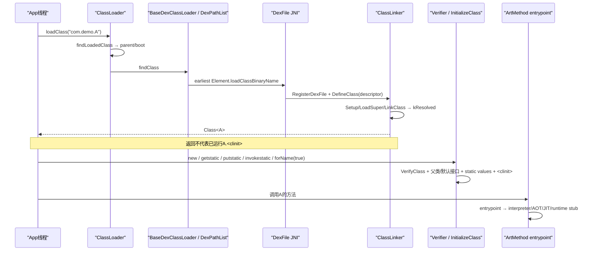
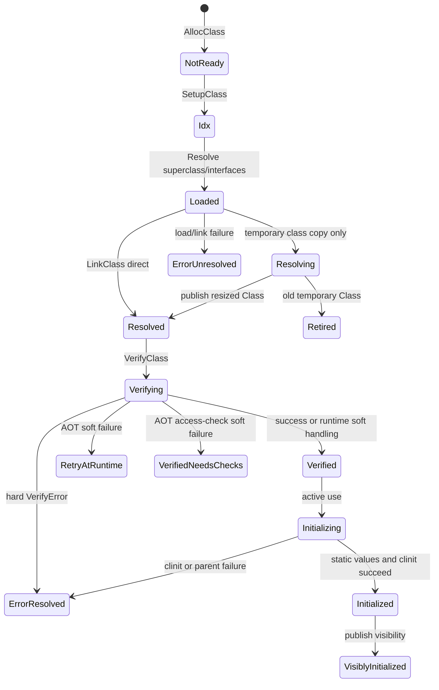
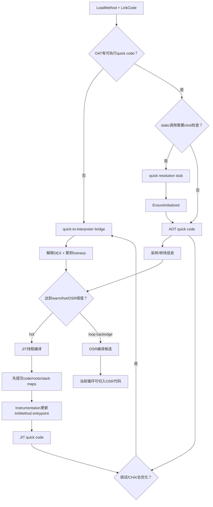

# 第557章 Android ART类加载与方法执行链：ClassLoader、DexFile、ClassLinker、验证初始化、解释器、JIT与AOT

> 源码基线：AOSP `android-11.0.0_r48`（Android 11 / API 30）  
> 学习目标：从 `ClassLoader.loadClass()` 追到 `DexFile.defineClassNative()`、`ClassLinker::DefineClass()`，分清加载、链接、验证、初始化和方法执行；理解同一个 `ArtMethod` 怎样通过entrypoint接入解释器、AOT或JIT。  
> 阅读约定：继续在macOS只读源码，不实际编译、不连接设备；本章讲Android 11实现，不把JVM规范术语和ART内部status机械地一一等同。

## 1. 本章先拆掉一句常见误解

“`loadClass()`就是把整个类验证、执行`static`代码，并决定以后永远走AOT。”

实际至少有五个阶段：按ClassLoader规则找到定义、创建并链接`Class`、按需验证方法字节码、在主动使用时初始化静态状态、每次调用通过可变化的`ArtMethod`入口进入解释器/AOT/JIT。`loadClass()`成功通常只推进到resolved，不保证已verified，更不保证`<clinit>`执行；方法入口以后也可能被JIT、调试器或去优化机制更换。

## 2. 一句话主线

Java `ClassLoader`先按已加载表、parent/shared-library/dexPath次序找类；`DexPathList`把最早命中的DEX交给`DexFile`，native注册DexCache并让`ClassLinker`分配`mirror::Class`、解码字段方法、解析父类接口、布局vtable/IMT/字段并标记resolved；主动使用时再验证与执行`<clinit>`；方法调用最后只看`ArtMethod`当前entrypoint，它可以指向解释器桥、OAT代码、JIT Code Cache或各种runtime stub。

## 3. 与第556章怎样衔接

第556章回答“磁盘上的OAT/VDEX/ART何时可采用”。采用之后并不是把整个应用立即加载进内存：ART只获得可用的DexFile/OatFile及可选app image，具体类仍按请求逐步进入ClassTable。

本章从 `OatFileManager::OpenDexFilesFromOat()` 的输出继续：同一个DEX类定义怎样变成Class对象，同一个OAT method quick code又怎样装入ArtMethod入口。

## 4. 先分清六个词

- **查找**：按ClassLoader委派与dex顺序寻找某个名字。
- **定义**：把某个DexFile中的`class_def`与定义ClassLoader绑定成Class对象。
- **加载**：ART内部解码字段、方法、父类和接口，推进到`kLoaded`。
- **链接/准备**：建立继承分派表和字段布局，静态字段具有零/null默认值，推进到`kResolved`。
- **验证**：检查DEX指令、类型流、访问与控制流安全，可复用OAT/VDEX状态。
- **初始化**：写入encoded static values、初始化父类/默认接口并运行`<clinit>`。

中文资料常把前四项统称“加载”，读源码时必须写出具体status。

## 5. 这条链的七个关键对象

`ClassLoader`保存委派关系；`DexPathList`保存有序Element；Java `DexFile`持有opaque cookie；native `DexFile`表示已打开DEX；`DexCache`缓存该DEX索引的解析结果；`mirror::Class`是Java层可见的`Class<?>`对象；`ArtMethod`/`ArtField`是native方法和字段元数据。

它们的生命周期不同。关闭Java DexFile句柄不等于已定义Class瞬间消失，ClassLoader可达时ClassTable、DexCache和已加载类仍会维持需要的根。

## 6. 先记住五个完成点

一次`loadClass("com.demo.A")`可标记为：

1. 委派规则选定一个定义来源；
2. `ClassDef`已找到并插入ClassTable；
3. 字段/方法/父接口已加载并完成链接，status为resolved；
4. 类验证完成；
5. encoded static values与`<clinit>`完成，并对其他线程可见。

普通`loadClass`返回通常证明到第3点；`Class.forName(name, true, loader)`才明确请求推进到第5点。

## 7. 第一幅图：从名字到可执行方法



图中真正跨Java/native边界的是DexFile JNI；后面的验证、初始化和方法入口仍在发起加载的应用进程中执行，不会回到installd。

## 8. 第一段关键源码：默认ClassLoader是parent-first

```java
// libcore/ojluni/src/main/java/java/lang/ClassLoader.java
protected Class<?> loadClass(String name, boolean resolve)
    throws ClassNotFoundException
{
        // First, check if the class has already been loaded
        Class<?> c = findLoadedClass(name);
        if (c == null) {
            try {
                if (parent != null) {
                    c = parent.loadClass(name, false);
                } else {
                    c = findBootstrapClassOrNull(name);
                }
            } catch (ClassNotFoundException e) {
                // ClassNotFoundException thrown if class not found
                // from the non-null parent class loader
            }

            if (c == null) {
                // If still not found, then invoke findClass in order
                // to find the class.
                c = findClass(name);
            }
        }
        return c;
}
```

顺序是“已加载 → parent/boot → 自己findClass”。parent抛出的CNFE被暂时吞掉，自己的查找仍有机会；其他LinkageError不会在这里当成“没找到”吞掉。

## 9. r48的`resolve`形参没有被使用

注意源码中没有 `if (resolve) resolveClass(c)`。Android移除了标准JDK实现里围绕`getClassLoadingLock()`与显式resolve的部分；ART的DefineClass本身会把类推进到resolved，因此这个boolean在r48默认实现中被忽略。

这不表示链接没有发生，而是“是否链接”的Java形参不再控制ART内部链接时点。不要根据方法签名猜实现。

## 10. `findLoadedClass()`先查什么

它通过 `VMClassLoader.findLoadedClass(loader, name)`进入ART已加载类表。命中时返回既有Class对象，不再遍历DEX，也不会重新运行`<clinit>`。

表中可能包含由parent定义、但这个loader作为initiating loader已使用过的Class；真正类身份仍看Class对象携带的defining ClassLoader。

## 11. parent为null不等于“什么也不查”

默认实现会调用`findBootstrapClassOrNull`，Android内部对应boot class path/BootClassLoader。`java.lang.String`等核心类来自boot空间，不会由App APK里同名class覆盖。

这也是安全边界之一：普通parent-first PathClassLoader无法通过在APK放置`java.*`同名类替换boot实现。

## 12. shared library loaders插在哪一层

LoadedApk构造的BaseDexClassLoader可携带`sharedLibraryLoaders`。默认链的真实顺序是parent/boot先成功；只有进入`BaseDexClassLoader.findClass()`后，才按数组顺序查shared libraries，然后查自己的dexPath。

因此shared library优先于应用自身DEX，但不能越过boot/parent已返回的类。

## 13. 第二段关键源码：shared libraries早于自身dexPath

```java
// libcore/dalvik/src/main/java/dalvik/system/BaseDexClassLoader.java
@Override
protected Class<?> findClass(String name) throws ClassNotFoundException {
    // First, check whether the class is present in our shared libraries.
    if (sharedLibraryLoaders != null) {
        for (ClassLoader loader : sharedLibraryLoaders) {
            try {
                return loader.loadClass(name);
            } catch (ClassNotFoundException ignored) {
            }
        }
    }
    // Check whether the class in question is present in the dexPath that
    // this classloader operates on.
    List<Throwable> suppressedExceptions = new ArrayList<Throwable>();
    Class c = pathList.findClass(name, suppressedExceptions);
    if (c == null) {
        ClassNotFoundException cnfe = new ClassNotFoundException(
                "Didn't find class \"" + name + "\" on path: " + pathList);
        for (Throwable t : suppressedExceptions) {
            cnfe.addSuppressed(t);
        }
        throw cnfe;
    }
    return c;
}
```

这里捕获的仅是每个shared loader的CNFE；一旦某个loader找到类但链接失败，错误通常向上抛出，不会把后续loader当成无条件备用。

## 14. DexPathList中的顺序就是遮蔽顺序

`DexPathList.findClass()`从`dexElements[0]`开始，逐Element调用`findClass`，第一个返回非null的Class立即获胜。同名类位于base、split、动态追加DEX中的先后，直接影响实际定义。

“APK中存在某class”只说明它是候选；前面Element或parent已有同名类时，它可能永远不会定义。

## 15. suppressed exceptions为何重要

建Element时的zip/dex打开错误会保存到`dexElementsSuppressedExceptions`；定义某类时的 `NoClassDefFoundError`/`ClassNotFoundException`也可加入本次列表。最终全部附到CNFE的suppressed exceptions。

排查“Didn't find class”时不要只读顶层消息，suppressed里常有坏zip、缺依赖或某个早期Element定义失败的真正线索。

## 16. `DelegateLastClassLoader`不是完全child-first

r48顺序是boot class path始终第一，然后shared libraries、自身dexPath，最后parent。Java实现通过先找boot、再`findClass()`、最后parent达成；native fast path也显式编码同样顺序。

它允许覆盖parent普通类，但仍不能覆盖boot类。资源是否delegate还受独立boolean控制，不能把资源顺序自动等同类顺序。

## 17. 类身份为什么必须带ClassLoader

JVM/ART中的类身份不是只有descriptor，而是“binary name/descriptor + defining ClassLoader”。两个互不相关的loader各自定义`com.demo.Api`，得到两个不同Class对象，彼此`isAssignableFrom`为false，强转可抛ClassCastException。

插件常见的“明明类名一样却不能转型”，第一检查项就是接口类是否被宿主和插件各定义了一份。

## 18. initiating loader与defining loader不要混淆

A向parent请求类B时，A是发起/initiating loader，真正从DEX定义B的parent才是defining loader，`B.class.getClassLoader()`返回后者。ART可在A对应查找表里记住该结果以加速以后请求，但不会把B的定义身份改成A。

共享库ClassLoader同理：App使用类，不等于App ClassLoader定义了类。

## 19. ClassLoader namespace不是native linker namespace

Java ClassLoader决定DEX类身份与查找；第143章一类native namespace决定`.so`符号/依赖可见性。它们在LoadedApk创建阶段有关联，但不是同一张表。

出现`ClassNotFoundException`优先查dexPath/loader，出现`UnsatisfiedLinkError`还要查ABI、nativeLibraryDirectories和linker namespace。

## 20. primitive与array class走特殊路径

`ClassLinker::FindClass()`看到单字符descriptor时直接返回预建primitive Class；数组descriptor则通过`CreateArrayClass()`按component type与loader创建，不从某个`class_def`解码字段方法。

数组类没有自己的Java `<clinit>`。`Class.forName("[Ldemo.A;", true, loader)`只加载component type，不因此初始化`demo.A`。

## 21. Java DexFile的cookie是什么

`mCookie`是Java不可解释的opaque对象，native把它转换成一组`const DexFile*`和可选OatFile。一个Java DexFile可能对应APK内多个DEX条目，因此cookie不是“单个classes.dex指针”。

这些native指针只能由ART配套函数解码；把cookie反射出来当稳定ABI是不安全的。

## 22. 第三段关键源码：DexFile只吞两类“继续找”异常

```java
// libcore/dalvik/src/main/java/dalvik/system/DexFile.java
public Class loadClassBinaryName(String name, ClassLoader loader, List<Throwable> suppressed) {
    return defineClass(name, loader, mCookie, this, suppressed);
}

private static Class defineClass(String name, ClassLoader loader, Object cookie,
                                 DexFile dexFile, List<Throwable> suppressed) {
    Class result = null;
    try {
        result = defineClassNative(name, loader, cookie, dexFile);
    } catch (NoClassDefFoundError e) {
        if (suppressed != null) {
            suppressed.add(e);
        }
    } catch (ClassNotFoundException e) {
        if (suppressed != null) {
            suppressed.add(e);
        }
    }
    return result;
}
```

VerifyError、ClassFormatError、IncompatibleClassChangeError等没有在这里被吞掉，通常立即终止查找；只有CNFE/NCDFE被视为可附加后继续Element搜索的失败。

## 23. binary name怎样变成descriptor

Java传入通常是`com.demo.A`或内部slash形式；native `DexFile_defineClassNative`调用`DotToDescriptor`得到`Lcom/demo/A;`并计算Modified UTF-8 hash。

DEX索引、ClassTable和ClassLinker大多使用descriptor。日志里点号名、斜杠名、两端`L...;`可能指同一类，但输入是否合法的规则不同。

## 24. native会遍历cookie里的多个DexFile

它把cookie展开后逐DexFile用 `OatDexFile::FindClassDef(dex_file, descriptor, hash)`查定义。命中ClassDef后，先注册DexFile/DexCache，再调用`ClassLinker::DefineClass()`。

这里可使用OAT中的类索引加速查找；即使有OAT，定义的语义来源仍绑定到对应DexFile和ClassDef。

## 25. `ClassDef`只是定义入口，不是完整Class对象

DEX `class_def_item`给出access flags、super type、interfaces、source file、annotations、class_data和static values偏移。字段和方法细节还要从class_data的差分索引流解码。

因此找到ClassDef只完成“有这个定义”，还没完成父类解析、方法入口、字段布局或验证。

## 26. RegisterDexFile建立DexCache关系

`RegisterDexFile()`为DexFile与ClassLoader找到或创建DexCache，并把DexFile指针、location、class loader、resolved strings/types/fields/methods等缓存关联起来。ClassTable还持有DexCache强根，避免已定义类依赖的元数据过早消失。

同一个native DexFile对象若已注册到不同ClassLoader，r48会抛InternalError；正常想让同一物理代码由两个loader定义，需有各自正确打开/注册上下文，而不是复用一个不允许共享的native对象。

## 27. DexCache不是“所有类的全局缓存”

每个解析槽的index只在所属DexFile中有意义。`type_idx=10`在另一个DEX可能是完全不同的descriptor；DexCache必须与DexFile/loader一起理解。

它缓存的是“这个DEX在这个加载上下文里已解析到什么对象”，不能跨ClassLoader盲目复制。

## 28. `FindClass`与`DefineClass`职责不同

`FindClass`先查已加载ClassTable，再处理primitive/array，理解常见BaseDexClassLoader层级并按委派顺序寻找；找不到或碰到自定义loader时，它可能回调Java `ClassLoader.loadClass()`。

`DefineClass`已经拿到具体DexFile/ClassDef，负责唯一创建、加载与链接。前者是路由器，后者是建造器。

## 29. ART为什么实现BaseDexClassLoader native快路径

对PathClassLoader、DexClassLoader、InMemoryDexClassLoader和DelegateLastClassLoader，ART可直接读取已知字段与DexFiles，避免每次从native回Java再进JNI。

快路径仍复制Java语义：普通loader按parent→shared→own，delegate-last按boot→shared→own→parent。若遇到不支持的自定义loader，才让Java代码决定行为。

## 30. runtime线程不能随意回调Java loader

JIT/AOT编译线程等可能被标记为runtime thread。若native快路径无法理解loader层级，它不能执行可能运行用户代码的Java `loadClass()`，而是设置预分配NoClassDefFoundError并退出。

因此一个自定义ClassLoader在普通应用线程能工作，不保证编译器runtime线程可用同样方式主动加载尚未出现的依赖；ART尽量只编译已安全解析的图。

## 31. r48快路径有一个“首个定义失败”边界

`FindClassInBaseDexClassLoaderClassPath()`找到第一个含ClassDef的DexFile后，即使DefineClass因可吞的CNFE/NCDFE失败，也停止本轮native DexFile访问；源码TODO质疑是否应继续后面的DEX。

随后是否回Java重新发现取决于known hierarchy、fast CNFE、debuggable等分支。不能简单承诺“前一个DEX有坏定义时后一个同名类一定兜底”。

例如Element 0和Element 1都声明`Ldemo/A;`，但Element 0的A缺少父类：native快路径先看到Element 0的ClassDef，定义失败后不会在同一趟继续Element 1。部分分支会回Java重走`DexPathList`而有机会继续，非debuggable的fast-CNFE分支则可直接抛CNFE；所以修复思路应先消除前面的坏重复定义，而不是依赖后项覆盖。

## 32. app image可让DefineClass整段被跳过

第556章采用app image后，许多Class、DexCache和ClassTable条目已经映射并修正到当前ClassLoader。`FindClass`首先LookupClass，命中后只需`EnsureResolved()`。

所以抓一次启动trace看不到`LoadClass()`，不等于没有这个类；它可能在boot/app image中早已准备好。

## 33. 第二幅图：ClassStatus主状态机



这是主路径简化图；枚举中错误、临时类和AOT专用状态存在特殊转移。最重要的是`Resolved < Verified < Initialized`，三个词不能互换。

## 34. `AllocClass`得到的Class一开始还不能用

ART从managed heap分配`mirror::Class`，初始status为`kNotReady`。接口或不带embedded tables的类可能一开始就按最终大小分配；普通类有时先用临时尺寸，链接后再复制为正确大小。

Class对象也受GC移动，因此native代码使用Handle/ObjPtr和mutator lock，不能长期保存裸对象指针跨可挂起点。

## 35. `ClassPreDefine`是工具改写插口

分配后，runtime callbacks收到descriptor、loader、原DexFile/ClassDef，并可返回替换后的DexFile/ClassDef。JVMTI重定义/变换等能力依赖此类回调。

回调可能执行复杂逻辑甚至抛异常，所以DefineClass在继续前重新检查pending exception并重新RegisterDexFile。

## 36. `SetupClass()`把Class推进到kIdx

它设置`java.lang.Class`元类、Java access flags、defining loader、DexCache、class_def index与type index，然后把status设为`kIdx`。

此时super字段还只是DEX index意义，尚未全部解析成Class引用；`kIdx`不是“索引已全部解析”。

## 37. 为什么在解码字段方法前先插ClassTable

DefineClass先给Class上锁并插入`descriptor → klass`，之后才分配LinearAlloc中的ArtField/ArtMethod数组。这样若另一线程竞争，失败方不会先制造无法回收的native元数据；GC也能从ClassTable访问刚建立的字段/方法root。

代价是其他线程可能看见尚未resolved的Class，因此必须通过`EnsureResolved()`等待状态推进。

## 38. 两个线程同时定义同名类时怎样收敛

`InsertClass()`若发现既有Class，当前线程放弃新对象并调用`EnsureResolved(existing)`。Android把所有ClassLoader视为parallel capable，Java默认loadClass没有大锁，唯一性主要由native ClassTable插入竞争保证。

返回哪个Class由第一次成功插表者决定，但它还必须完成链接；若赢家失败，等待者收到此前失败而不是偷偷发布第二个定义。

## 39. `EnsureResolved()`并非普通monitor wait

临时Class要等待retired并从表取替代对象；普通未resolved Class则循环尝试检查status，先`sched_yield()`最多1000轮，之后每次sleep 1ms。源码说明直接monitor wait可能在返回加锁时形成死锁。

同线程发现循环定义会抛ClassCircularityError并把类标错误；这不是无限忙等。

## 40. `LoadClass()`真正装了哪些东西

它用`ClassAccessor`解码class_data，分别分配static/instance ArtField数组、direct/virtual ArtMethod数组，写入DEX index、声明类、access flags、code item offset等。

这些ArtField/ArtMethod主要位于该ClassLoader的LinearAlloc，而不是每次调用临时创建。

## 41. 字段装载只保存元数据，不写业务值

`LoadField()`记录dex field index、declaring Class、访问和hiddenapi runtime flags。instance字段的最终offset、static字段在Class对象里的布局还由LinkClass决定。

业务对象字段值要等对象分配；static encoded values更要等初始化阶段写入。

## 42. 方法装载还会接入已有OAT代码

`LoadMethod()`记录method index、declaring Class、code item offset和flags；随后`LinkCode()`从OatClass对应OatMethod取quick code，决定装真实AOT入口还是解释器/解析/JNI stub。

所以“类加载”已经能把第556章采用的OAT方法入口连到ArtMethod，但这不意味着方法已经执行。

## 43. r48怎样处理重复field/method index

DexFileVerifier保证class_data索引有序，但r48容忍重复字段定义：LoadClass忽略重复index并缩小逻辑size，保留过量分配空间。重复方法index则给重复ArtMethod设置相同method index映射。

这是兼容历史DEX的实现边界，不代表Java源码允许合法声明两个完全相同字段/方法。

## 44. `LoadSuperAndInterfaces()`为何会递归加载

它解析superclass type和接口type，必要时再次进入ClassLinker查找/定义；检查不能直接继承自身及访问可见性，写入super Class引用，最后把status从`kIdx`推进到`kLoaded`。

加载一个叶子类可能因此递归加载整条父链和接口图，但不会自动加载它所有字段类型和方法体引用。

## 45. `ClassLoad`回调发生得比想象早

父类/接口就绪并到`kLoaded`后，ART发布RuntimeCallbacks `ClassLoad`；此时`LinkClass`还没完成，Class甚至可能是稍后会retire的临时对象。

调试器/agent若监听ClassLoad，不能假设已经有最终class size与vtable；ClassPrepare才表示准备/链接完成。

## 46. `LinkClass()`的五件核心工作

它校验/链接super关系，建立方法分派结构，布局instance fields，布局static fields并算最终Class大小，最后生成GC需要的reference instance offsets。

任何一步失败会把Class标为error并让DefineClass返回null；“ClassDef存在”不能保证可链接。

## 47. superclass链接还检查哪些约束

`java.lang.Object`不能有super，普通类不能继承interface/final class，interface的super语义也受规则限制；跨ClassLoader签名还可能解析成不同Class对象，触发LinkageError。

这类错误常在类第一次被用到时暴露，与“文件找不到”的CNFE不同。

## 48. vtable解决invoke-virtual

ART复制super vtable，再用当前类override方法替换对应slot，新virtual方法追加。以后`invoke-virtual`按receiver实际Class和vtable index找到最终ArtMethod，不需每次按字符串搜索。

错误override、final覆盖或签名不一致会在链接/验证阶段被拒绝。

## 49. iftable与IMT解决invoke-interface

iftable记录实现的接口和对应method array；IMT是固定大小快速表，接口方法hash到slot。不同方法碰撞时slot指向conflict method/trampoline，慢路径再根据调用点选择。

因此IMT碰撞是预期性能分支，不等于Java接口冲突；真正默认方法冲突另有链接规则。

## 50. direct/static/super调用为什么不走vtable

构造器、private/direct、static和明确super调用的目标由解析结果与调用类型确定，不根据receiver动态覆盖。ART会检查invoke类型和目标method属性是否匹配，不匹配可抛IncompatibleClassChangeError。

调用指令相似不代表分派表相同，读smali时先看`invoke-virtual/interface/direct/static/super`。

## 51. instance字段布局不是源码声明顺序照抄

ART先考虑父对象大小与对齐，把引用字段集中到便于GC扫描的位置，再按8/4/2/1字节类型和可复用gap安排offset。`Class.java`也注明对象引用字段位于本类field list前部。

反射返回字段的次序不是内存offset契约；native代码不能根据Java声明顺序手算对象布局。

## 52. reference offsets为GC提供什么

`CreateReferenceInstanceOffsets()`编码对象中哪些slot是引用，GC据此扫描实例并追踪可达对象。若引用太多或布局不能用紧凑bitmap表达，可走更通用的扫描方式。

链接错误会破坏GC正确性，所以字段布局不是纯性能优化，而是运行时安全元数据。

## 53. 为什么临时Class会被复制并retire

带embedded vtable/IMT的Class最终大小只有链接完才知道。若初始对象尺寸不对，LinkClass复制成正确大小，修复所有ArtField/ArtMethod的declaring Class指针，更新ClassTable；旧Class标`kRetired`并唤醒等待者。

调试日志里同一descriptor出现两个Class地址，不一定是两个有效定义，也可能是临时对象替换。

## 54. Class Hierarchy Analysis在resolved前更新

新类可能override此前被认为“只有一个实现”的方法。LinkClass在发布resolved前调用CHA更新层级，必要时使JIT/AOT优化假设失效。

JIT提交代码也持CHA锁重新确认single-implementation依赖，避免“新子类已出现但仍发布旧去虚拟化代码”的竞态。

## 55. `kResolved`到底证明什么

它证明字段/方法元数据、super/interface、分派表、字段布局和Class大小已就绪，可以安全解析/实例化所需结构；不证明所有method body已完成运行时验证，也不证明static业务初始化完成。

`ClassLoader.loadClass()`返回的Class通常处于这里或更高状态。

## 56. `ClassPrepare`发生在resolved之后

DefineClass注释明确：preparation创建static field storage并给零/false/null默认值，但不执行任何代码；Class此时可能尚未verified。随后发布ClassPrepare回调和JIT type-loaded通知。

因此调试器收到ClassPrepare时读取static字段，可能只看到默认值，尚未看到源码initializer结果。

## 57. 链接时的static默认值与初始化值不同

`static int x = 7`在准备后先是0；初始化阶段读取DEX encoded static value或执行`<clinit>`才变成7。编译期常量可能由调用方直接内联，不一定触发持有类初始化。

“static storage已分配”与“Java静态初始化语义完成”必须分开。

## 58. 为什么loadClass通常不运行`<clinit>`

ClassLoader的任务是找到并返回Class；主动初始化由`new`、静态字段/方法使用、反射、JNI或`Class.forName(..., true, ...)`等触发。预加载大量类若都运行static代码，会引入副作用与启动成本。

可用`Class.forName(name, false, loader)`只加载/链接，用`true`明确初始化来做实验。

## 59. DEX文件验证与Class验证是两层

打开DexFile时的DexFileVerifier检查header、map、offset、索引范围、class_data排序、code item结构等全文件不变量；ClassVerifier则围绕某Class的方法做寄存器类型流、指令语义、分支、访问和异常处理验证。

一个DEX容器结构合法，不代表每个方法都能通过类验证。

## 60. VerifyClass通常何时触发

InitializeClass发现Class未verified时会调用VerifyClass；解释器/解析入口也可在执行前要求验证。AOT编译期则会预验证大量类，并把status/依赖写入OAT/VDEX供运行时复用。

因此首次`loadClass`后不访问类，验证可能延后；有app image/OAT时又可能看起来几乎没有运行时验证成本。

## 61. OAT预验证不是盲信一个bit

`VerifyClassUsingOatFile()`先找到DexFile绑定的OatDexFile/OatClass，读取编译时ClassStatus；只有至少`kVerifiedNeedsAccessChecks`等可复用状态才返回preverified。resolved、not-ready或编译期hard error会重新跑runtime verifier以产生精确错误。

这个复用成立的前提是第556章已接受OAT与class loader context。

## 62. verifier先处理父类和默认接口

子类验证依赖父方法与类型规则，所以先确保super验证；普通类还递归检查带default methods的super-interfaces。interface自身不会仅因验证而递归初始化superinterface。

验证顺序与初始化顺序有关联，但不是同一过程；验证不会运行`<clinit>`。

## 63. runtime ClassVerifier检查什么

它为每个方法构造寄存器类型状态，沿控制流合并，检查opcode参数、return类型、uninitialized reference、monitor、异常边、方法/字段访问以及invoke兼容性。

验证的目标是让解释器/compiled code可以依赖一组安全不变量，而不是证明业务逻辑正确。

## 64. hard verification failure怎样留下痕迹

hard failure会抛VerifyError，把Class设为`kErrorResolved`并保存相关错误信息。以后再次使用这个Class，ART重放先前验证错误或包装为相应LinkageError，不会重新尝试把同一定义当正常类。

清进程可以重建ClassLoader状态，但若DEX内容不变，下一进程仍会以同样原因失败。

## 65. AOT soft failure为什么不是立即拒绝

AOT环境可能缺少运行时才存在的DEX/loader事实，无法完全解析类型。它可标 `kRetryVerificationAtRuntime`，不为该类生成依赖强验证假设的代码，等App进程实际加载上下文再验证。

soft表示“当前编译环境不足以证明”，不等于代码必定错误。

## 66. `VerifiedNeedsAccessChecks`表达什么

编译期只在访问检查方面软失败时，可标这个状态；运行时将它推进为verified，但设置`verificationAttempted`，不为方法添加“可跳过访问检查”的flag。

结果是代码仍可运行，解释器/慢路径保留必要access checks，性能可能低于完全预验证。

## 67. `kAccSkipAccessChecks`来自哪里

完全验证成功或可信预验证后，`EnsureSkipAccessChecksMethods()`给相应方法设置runtime flag，使解释器不必重复做已证明安全的访问检查。强制soft-fail/needs-checks场景则刻意不设置。

这是verification带来的直接执行优化之一，不代表Java visibility规则被关闭。

## 68. “解析resolution”是按DEX索引绑定对象

DEX指令引用type_idx、field_idx、method_idx或string_idx。ClassLinker把这些index解析成Class、ArtField、ArtMethod或String，并写入DexCache；后续相同DEX index可走缓存快路径。

解析会触发相关类加载/链接，但一般不把整个DEX引用图一次性展开。

## 69. ResolveType会怎样找Class

先看DexCache resolved type槽；未命中则从DexFile type descriptor调用FindClass，验证解析到的Class确实匹配descriptor，再缓存。失败保留pending exception供调用指令传播。

解析一个字段类型不一定初始化该类型，通常只要求Class resolved。

## 70. ResolveField/Method还检查调用语义

字段解析按声明class和name/type查static或instance字段，检查期望static属性；方法解析根据invoke type查direct/virtual/interface等目标并检查访问、抽象、冲突。成功结果写入DexCache。

同名同签名在不同ClassLoader解析成不同参数Class时，还可能触发loader constraint式LinkageError。

## 71. lazy resolution为什么有价值

大型应用DEX可能引用成千上万从未执行的类/方法。按第一次实际使用解析，可缩短启动并减少Class/DexCache工作；AOT/JIT则可提前解析热点所需部分。

因此dumpsys/heap中“resolved methods数量少于method_ids”很正常。

## 72. hidden API与Java访问检查在哪发生

LoadField/LoadMethod先把hiddenapi runtime flags写入元数据；真正通过反射、JNI或解析访问成员时，根据调用者domain、target SDK、名单和access method判定。普通public/private/protected/package访问也在解析/验证/运行入口检查。

成功加载一个framework Class不等于应用有权调用它的hidden/private成员。

## 73. `const-class`为什么不初始化类

`ResolveVerifyAndClinit(..., can_run_clinit=false)`只解析Class并做所需access check，不调用EnsureInitialized。这对应获取`SomeClass.class`/DEX `const-class`：得到Class对象本身不是主动使用static业务状态。

这能解释为什么打印`A.class`常看不到A的static日志。

## 74. 哪些字节码通常触发初始化

`new-instance`在分配前确保目标类初始化；`sget/sput`首次访问非编译期常量static字段要初始化声明类；`invoke-static`在调用前初始化声明类。反射构造/静态访问、JNI相应操作也走EnsureInitialized。

访问子类继承的static字段，实际初始化的是声明该字段的类；不要只看源码写的限定名。

## 75. `Class.forName`是观察初始化边界的最好入口

无参版本等价于`forName(name, true, callerLoader)`。三参版本把null loader替成BootClassLoader，native先FindClass，只有`initialize=true`才调用`EnsureInitialized(self, c, true, true)`。

数组name的component只加载不初始化，primitive关键字也不是通过该API取得primitive Class。

## 76. InitializeClass以Class monitor串行

它先无锁快查initialized，再进入Class对象锁重新检查error/resolved/verified/initializing状态。另一个线程已在初始化时，本线程`WaitIgnoringInterrupts()`直到成功或error；中断不会破坏JLS初始化一次性。

同一个Class的`<clinit>`不会由两个线程并发执行。

## 77. 初始化前必须先验证

若status尚未verified，InitializeClass在Class锁协议内发起VerifyClass。hard error立即失败；runtime可接受的soft情形推进到verified并保留动态检查。

所以第一次主动使用的耗时可能包含“类验证 + 父类初始化 + 自身初始化”，不只是static block运行时间。

## 78. superclass descriptor还会在初始化前复核

r48在verified后验证跨ClassLoader的super方法签名是否解析成相同类型；若可信OAT已记录至少`kSuperclassValidated`可跳过。class path与编译期不一致时OAT本应在采用阶段被拒绝。

这是第556章context校验与本章运行时类型一致性的接缝。

## 79. 同线程递归进入`<clinit>`不会死锁

Class记录`clinitThreadId`。若status为initializing且当前tid相同，InitializeClass直接返回true，让当前初始化栈继续；这是处理A初始化时再次间接引用A的规则。

其他线程看到不同tid则等待。递归返回不表示`<clinit>`已完成，只表示当前线程可继续其初始化协议。

## 80. 类初始化先处理superclass

普通class先递归InitializeClass其super，super失败则当前Class标error。interface直接初始化时不自动初始化所有superinterfaces，这符合Java初始化规则。

因此`new Child()`的日志通常先出现Parent static，再出现Child static。

## 81. default method接口是特殊依赖

初始化普通class时，ART按声明树递归访问接口，只对含default methods的接口执行EnsureInitialized；无default method接口会标记递归检查完成但不运行其初始化。

这条规则比“实现类会初始化所有接口”更窄，也比“接口从不随实现类初始化”更宽。

## 82. encoded static values在`<clinit>`前写入

ART遍历Class的static fields，预填DexCache field槽，再由`RuntimeEncodedStaticFieldValueIterator`把DEX `static_values_off`中的常量写到字段；之后才查找并调用ClassInitializer。

没有显式static block的简单常量类也有初始化阶段，只是可能没有`<clinit>`方法。

## 83. `<clinit>`最终也只是ArtMethod调用

`FindClassInitializer()`取得静态构造方法，随后 `clinit->Invoke(self, nullptr, 0, &result, "V")`。它进入与普通方法相同的ArtMethod入口体系，可解释执行或运行预编译代码。

“初始化器是VM魔法”只对触发与状态协议成立，方法体执行仍复用ART调用机制。

## 84. 第一次初始化失败和以后失败不同

若`<clinit>`抛非Error异常，ART包装为ExceptionInInitializerError；若本来就是Error则直接传播。Class随后标`kErrorResolved`。其他线程或未来再次主动使用通常得到NoClassDefFoundError，并把前次原因作为cause/存储错误。

因此第一次现场日志最有价值，后续NCDFE只是“这个Class已坏”的二次结果。

## 85. initialized与visibly initialized为何分两步

`kInitialized`表示本线程完成初始化；`kVisiblyInitialized`表示通过回调/内存屏障让其他线程和compiled fast path安全观察。非x86平台可先批量积累再发布，x86因内存模型直接跳到visible状态。

这是内存可见性优化，不是`<clinit>`会运行两次。

对写Java业务代码的人，两者都应理解为“一次初始化协议的内部尾声”：触发初始化的线程已经可以继续，其他线程/编译代码只在ART建立可见性后走免检查快路径。不要据此写轮询ClassStatus的业务同步方案。

## 86. 方法执行前先认识ArtMethod

ArtMethod保存声明类、DEX method/code item index、access flags、hotness/profiling信息、JNI入口和quick compiled entrypoint。无论Java反射、JNI还是DEX invoke，最终都会收敛到某个ArtMethod。

它不是Java `java.lang.reflect.Method`对象；后者只是反射包装，内部可解码到ArtMethod。

## 87. `LinkCode()`给新方法安装哪种入口

有可用OatMethod quick code且允许执行时，普通方法可直接装AOT入口；无quick code时，Java方法装quick-to-interpreter bridge，native方法装generic JNI stub；不可调用方法装抛调用错误的bridge。

调试/interpret-only策略也可强制解释器桥，即使OAT里存在代码。

## 88. static AOT方法为何先装resolution stub

若method有编译代码但调用前必须检查声明类初始化，LinkCode先装QuickResolutionStub。第一次调用由stub解析目标并EnsureInitialized；Class初始化完成后`FixupStaticTrampolines`换回真实quick code。

因此看到ArtMethod entrypoint指向resolution stub，不表示没有AOT代码，可能只是`<clinit>`栅栏尚未跨过。

## 89. quick ABI是三种执行方式的共同入口

调用方通过quick invoke stub/compiled call约定进入ArtMethod当前entrypoint。该指针可能是实际机器码，也可能是把frame转成ShadowFrame的解释器桥、解析trampoline、instrumentation入口或JNI trampoline。

调用点无需每次执行一个“if AOT else JIT else interpreter”的高级分支，路由已经编码进entrypoint/stub。

## 90. 第三幅图：同一ArtMethod入口怎样变化



图中entrypoint是可变运行时状态；磁盘OAT不被修改，JIT代码另存在进程Code Cache中。

## 91. 解释器桥做了什么

quick-to-interpreter bridge把quick调用约定转换成ShadowFrame/寄存器视图，然后进入switch interpreter或mterp执行DEX指令。每条invoke/field/type指令需要时调用ClassLinker/DexCache慢路径。

解释执行不是“完全不优化”：可用VDEX quickening、已解析DexCache、inline cache和JIT profiling信息仍会降低成本。

## 92. `ArtMethod::Invoke()`何时强制解释

Runtime尚未started，或当前Thread被调试器等标记force interpreter且方法适用时，Invoke直接`EnterInterpreterFromInvoke(... stay_in_interpreter=true)`；否则调用quick stub。

即使entrypoint有AOT/JIT代码，调试/启动阶段也可选择解释执行。性能日志必须带进程运行模式。

## 93. AOT代码从哪里连进来

ClassLinker `LoadClass()`找到当前DexFile对应OatClass，再按class_def method index取得OatMethod quick code；LinkCode把入口写入ArtMethod。OAT code使用同一ArtMethod/DexCache/Class布局元数据和runtime entrypoints处理慢路径。

第556章拒绝OAT时，这里的`quick_code`为空或不可执行，方法自然落到解释器/JIT，而不是Class加载失败。

## 94. JIT怎样获得“热”的证据

解释器方法进入、backedge、compiled↔interpreter转场等调用`AddSamples()`增加16位counter；virtual/interface调用还可在ProfilingInfo记录receiver type。ProfileSaver另把长期热点写current profile，二者相关但不是同一份内存结构。

counter用于当前进程JIT触发，磁盘profile用于未来AOT/background优化。

## 95. warm、hot和OSR三个阈值不同

跨warm阈值时通常分配ProfilingInfo；跨hot阈值把普通/baseline编译任务放入JIT线程池；有backedge并跨更高OSR阈值时请求on-stack replacement版本。源码断言`OSR > hot > warm`。

阈值由运行时JIT options控制，不是Android 11所有设备固定常数。

## 96. JIT编译是异步且可放弃的

JitCompileTask在后台线程执行，方法可能在排队期间变obsolete、被调试器设断点、全局deopt或已有任务；`NotifyCompilationOf`还会去重/检查Code Cache资源。失败不会阻断原方法继续解释/AOT运行。

“达到hot”只证明有资格入队，不证明下一次调用已经JIT。

## 97. JIT提交顺序防止半成品入口

`JitCodeCache::Commit()`先把机器码写入执行区，再提交GC roots与stack maps；持jit lock和CHA lock验证single-implementation依赖仍成立，最后才由Instrumentation更新ArtMethod entrypoint。

因此mutator不会看到一个已发布入口却缺stack map/root的JIT方法。

## 98. JIT如何替换AOT/解释器入口

普通非OSR编译成功后，`Instrumentation::UpdateMethodsCode(method, newEntry)`更新ArtMethod；若instrumentation正在接管入口，新地址可保存到ProfilingInfo而实际入口保持instrumentation stub。

移除/失效JIT代码时再把entrypoint恢复解释器桥或合适入口，磁盘OAT仍可作为未来进程/重新链接来源。

## 99. AOT与JIT不是二选一

一个方法可以开始走AOT，收集到更具体的运行时receiver/profile后被JIT成更激进版本；另一个无AOT方法从解释器升到JIT；冷方法始终解释。不同方法在同一进程同时处于三种状态很正常。

“这个应用是AOT模式”是过度简化，至少要落到具体method与时间点。

JIT只把新代码写入当前进程的Code Cache并修改内存中的ArtMethod入口，不会回写或覆盖磁盘OAT；进程退出后这些JIT代码消失，热点可通过current profile影响以后一次后台AOT。是否真的从AOT再升到JIT还受JIT开关、采样入口、方法可编译性和调试状态控制。

## 100. OSR是当前执行切换的特殊例外

第555—556章的磁盘dexopt不会热替换当前已加载代码；JIT OSR却能在热循环backedge把当前method activation切入专门OSR compiled code，不必等方法返回再调用。

两者不要矛盾化：一个是后台生成未来可采用的AOT文件，一个是同进程JIT为当前栈设计的转换协议。

## 101. deoptimization怎样回到解释器

若调试、instrumentation、CHA假设失效或显式请求去优化，compiled code在安全点构造去优化上下文/抛内部deoptimization exception，ART重建解释器frames并从对应DEX PC继续。

这是优化代码的安全逃生路径，不是应用可捕获的业务异常。

## 102. debugger会怎样改变观察结果

断点、single-step、method tracing、JVMTI class redefine可让线程force interpreter、安装entry/exit stubs、阻止不安全JIT或把方法标obsolete。Attach debugger后性能和调用栈形态可能与release运行显著不同。

排查“为什么没走AOT/JIT”要先确认是否debuggable及正在使用哪些instrumentation。

## 103. 新类加载为什么能让旧JIT代码失效

CHA可能把一个virtual call暂时去虚拟化为唯一实现。后来加载的新子类override该method时，`UpdateAfterLoadingOf`发现层级变化并让依赖代码deopt/失效；JIT Code Cache保存这些dependency。

动态加载插件不仅增加Class，也可能改变已有热代码的优化假设。

## 104. 反射与JNI也要经过初始化和入口

反射Constructor在创建前EnsureInitialized，静态Method/Field访问也检查声明类；JNI `FindClass`、GetMethodID、NewObject、CallStatic等最终解析Class/ArtMethod并遵守相应初始化规则。反射本身还叠加hidden API与Java access判断。

反射慢不只因“按字符串找方法”，还可能首次触发加载、验证、初始化与包装对象创建。

## 105. Class卸载以ClassLoader为单位收敛

ClassLinker为非boot loader保存JNI weak root、ClassTable和LinearAlloc。GC清除不可达ClassLoader弱根后，`CleanupClassLoaders()`删除整套loader data，并处理CHA/JIT依赖和native library卸载。

ART不是任意卸载某个仍由活ClassLoader持有的单类；插件要可卸载，必须让Class、实例、线程、JNI/global ref等都不再反向保持loader。

## 106. 三种内存角色不要混

`mirror::Class`和Java对象在managed heap，由GC追踪/移动；ArtMethod/ArtField与ClassTable辅助结构多在LinearAlloc/native heap；JIT code/stack maps位于JIT Code Cache的可执行/数据区；OAT映射又来自文件-backed memory。

“类占了多少堆”要说明统计哪一层，普通Java heap dump并不覆盖全部native元数据和代码页。

## 107. 常见异常可按阶段定位

- CNFE：ClassLoader搜索最终没找到；
- NCDFE：依赖定义失败、已失败初始化或运行时解析无法取得定义；
- VerifyError：方法/类验证hard failure；
- ClassCircularityError：父/定义解析形成非法循环；
- IllegalAccessError / ICCE：链接或invoke类型/访问不兼容；
- ExceptionInInitializerError：首次`<clinit>`抛出非Error异常；
- ClassCastException：常见于同名不同defining loader。

不要把所有“类加载报错”都归因于ProGuard删类。

## 108. 替换DEX文件为何不能更新已有Class

ClassTable已把descriptor绑定到Class和defining loader，ArtMethod/field布局及对象实例都依赖旧定义。把磁盘JAR覆盖、append新DexPath或完成后台dexopt，不会重建已有Class。

需要新定义通常创建新ClassLoader/进程；JVMTI redefine有严格结构限制和专门obsolete/deopt协议，不等于普通文件替换。

## 109. 用一次冷启动场景串起主链

App第一次引用`FeatureActivity`：PathClassLoader先让Boot/parent查找，再查shared与base/split Element；native fast path找到ClassDef，RegisterDexFile，插ClassTable，装ArtField/Method与OAT/bridge入口，递归解析Activity父类，建vtable/iftable/fields并resolved返回。

框架随后实例化Activity，ResolveVerifyAndClinit触发验证、父类/default-interface和自身static初始化；构造器/生命周期方法通过各自ArtMethod entrypoint运行。不是一个巨大同步“加载所有类”。

## 110. 再用一次热方法场景串起执行链

某业务方法没有AOT code，最初通过quick-to-interpreter bridge解释；进入次数跨warm后分配ProfilingInfo，记录receiver；跨hot后JIT线程编译，提交code/roots/stack maps并更新entrypoint。以后的调用直接进JIT quick code。

若动态插件加载新override使CHA假设失效，JIT入口被撤销并deopt回解释器；之后可按新层级再次编译。

## 111. 阅读类加载源码的固定检查表

先写清binary name/descriptor、initiating/defining loader及委派顺序；再确认Class是ClassTable命中、app image命中还是新DefineClass；记录status到了loaded/resolved/verified/initialized哪一步；最后看ArtMethod entrypoint实际是AOT、JIT、interpreter bridge、resolution还是instrumentation stub。

只看调用栈顶的`ClassNotFoundException`或只看目录中有无OAT，都不足以解释结果。

## 112. macOS只读练习一：追Java委派与DEX顺序

目标：亲手确认parent-first、shared library、自身Element和delegate-last的差别。

```bash
set -eu
AOSP_ROOT="/Users/ninebot/androidSource"
cd "$AOSP_ROOT"

sed -n '350,395p' libcore/ojluni/src/main/java/java/lang/ClassLoader.java
sed -n '188,218p' libcore/dalvik/src/main/java/dalvik/system/BaseDexClassLoader.java
sed -n '520,545p' libcore/dalvik/src/main/java/dalvik/system/DexPathList.java
sed -n '120,175p' libcore/dalvik/src/main/java/dalvik/system/DelegateLastClassLoader.java
```

读完画两条顺序：普通PathClassLoader与DelegateLastClassLoader。`resolve`参数在默认ClassLoader实现中是否真正被消费？

## 113. macOS只读练习二：追DexFile JNI与DefineClass状态

目标：确认cookie多DEX、RegisterDexFile、插表竞态、LoadClass和LinkClass完成点。

```bash
set -eu
AOSP_ROOT="/Users/ninebot/androidSource"
cd "$AOSP_ROOT"

sed -n '275,310p' libcore/dalvik/src/main/java/dalvik/system/DexFile.java
sed -n '420,478p' art/runtime/native/dalvik_system_DexFile.cc
sed -n '3194,3385p' art/runtime/class_linker.cc
sed -n '35,102p' art/runtime/class_status.h
```

读完回答：Class为什么先插表再LoadClass？ClassPrepare时是否必然verified/initialized？临时Class为什么会retire？

## 114. macOS只读练习三：分开验证与初始化

目标：观察OAT预验证、soft/hard failure、初始化锁、static values与`<clinit>`。

```bash
set -eu
AOSP_ROOT="/Users/ninebot/androidSource"
cd "$AOSP_ROOT"

sed -n '4608,4878p' art/runtime/class_linker.cc
sed -n '5283,5575p' art/runtime/class_linker.cc
sed -n '170,225p' art/runtime/native/java_lang_Class.cc
sed -n '701,742p' art/runtime/entrypoints/entrypoint_utils-inl.h
```

读完回答：`Class.forName(..., false, ...)`停在哪类完成点？首次`<clinit>`失败与第二次主动使用分别可能抛什么？`const-class`是否运行初始化？

## 115. macOS只读练习四：观察解释器、AOT与JIT入口切换

目标：确认LinkCode初始入口、ArtMethod调用、JIT阈值和提交后发布顺序。

```bash
set -eu
AOSP_ROOT="/Users/ninebot/androidSource"
cd "$AOSP_ROOT"

sed -n '3616,3688p' art/runtime/class_linker.cc
sed -n '312,390p' art/runtime/art_method.cc
sed -n '1499,1582p' art/runtime/jit/jit.cc
sed -n '630,790p' art/runtime/jit/jit_code_cache.cc
```

读完回答：无OAT quick code时entrypoint指向哪里？JIT为什么先提交roots/stack maps再改ArtMethod？OSR与后台dexopt“不会热换当前进程”是否冲突？

## 116. 复读后最容易误解的十二句话

1. 错：loadClass会运行static block。对：通常只到resolved，主动使用才初始化。  
2. 错：类名相同就是同一个类。对：还要有相同defining ClassLoader。  
3. 错：BaseDexClassLoader先查自己。对：默认先parent，findClass内再shared→own。  
4. 错：delegate-last可覆盖boot类。对：boot仍始终最先。  
5. 错：ClassDef命中就一定能返回Class。对：父类、链接、布局都可能失败。  
6. 错：ClassLoad回调时已初始化。对：它早于LinkClass；ClassPrepare也可能未验证。  
7. 错：resolved、verified、initialized是同一状态。对：三者顺序和副作用不同。  
8. 错：DEX结构合法就一定通过ClassVerifier。对：这是两层验证。  
9. 错：获取`A.class`会执行A静态代码。对：const-class不clinit。  
10. 错：有OAT就所有方法都走AOT。对：entrypoint可混合bridge/AOT/JIT/stub。  
11. 错：达到hot阈值就立即JIT成功。对：只是异步入队资格。  
12. 错：dexopt不热换与OSR矛盾。对：OSR是同进程JIT的专门栈转换。

## 117. 排查ClassNotFound/NoClassDefFound的固定顺序

先打印请求name、initiating loader、parent/shared/dexPath顺序及同名定义；展开CNFE suppressed；再找最早含ClassDef的DEX是否因缺父类/接口返回NCDFE；若类曾出现，检查是否`<clinit>`第一次已失败；若能加载却cast失败，打印两边`Class.getClassLoader()`；最后才看混淆、split安装、动态DEX文件和包更新。

若报VerifyError/ICCE/IllegalAccessError，应转向DEX指令、版本不一致和loader签名解析，而不是继续搜索文件名。

## 118. 本章源码地图

- Java委派：`libcore/ojluni/src/main/java/java/lang/{ClassLoader.java,Class.java}`
- Android loader：`libcore/dalvik/src/main/java/dalvik/system/{BaseDexClassLoader.java,DexPathList.java,DexFile.java,DelegateLastClassLoader.java}`
- DexFile JNI：`art/runtime/native/dalvik_system_DexFile.cc`、`java_lang_Class.cc`
- Class核心：`art/runtime/{class_linker.cc,class_linker.h,class_status.h}`、`art/runtime/mirror/class.h`
- 验证：`art/runtime/verifier/class_verifier.cc`、`art/libdexfile/dex/dex_file_verifier.cc`
- 执行入口：`art/runtime/{art_method.cc,entrypoints/entrypoint_utils-inl.h}`、`art/runtime/interpreter/`
- JIT：`art/runtime/jit/{jit.cc,jit.h,jit_code_cache.cc}`

建议先做四个练习，再按一个具体类的descriptor串联；`class_linker.cc`接近万行，不适合从头顺序背诵。

## 119. 本章最终心智模型

把ClassLoader想成“名字路由与身份边界”，DexFile/ClassDef想成“定义原料”，ClassLinker想成“Class结构建造与状态机”，DexCache想成“该DEX在该loader里的解析记忆”，ArtMethod entrypoint想成“可动态改道的执行门牌”。

Class对象先建好结构，再按需验证和初始化；门牌可从解释器桥换到AOT/JIT，也可因调试或假设失效换回来。这样才能同时解释启动懒加载、同名类隔离、首次static卡顿和运行中JIT升温。

## 120. 本章结论与下一步

本章完成了 `ClassLoader.loadClass → BaseDexClassLoader/DexPathList → DexFile.defineClassNative → ClassLinker Define/Load/Link/Verify/Initialize → ArtMethod interpreter/AOT/JIT` 的闭环，明确了委派顺序、定义身份、ClassStatus、多线程定义/初始化协议、DexCache惰性解析以及entrypoint可变性。

复读特别保留了r48边界：默认`resolve`形参未消费、所有loader按parallel capable处理、native BaseDex快路径首个ClassDef定义失败后停止本轮DEX访问、ClassLoad可能面对临时未链接Class、ClassPrepare可能尚未验证、AOT soft failure运行时重验、default-method接口初始化规则、`kInitialized`到`kVisiblyInitialized`分离，以及OSR能切当前热循环但后台dexopt不能热换已加载Class。下一章继续到ART内存与GC：对象怎样从TLAB/Region分配，write/read barrier怎样维护引用，GC roots、Concurrent Copying、Mark Sweep与暂停点怎样协作。
