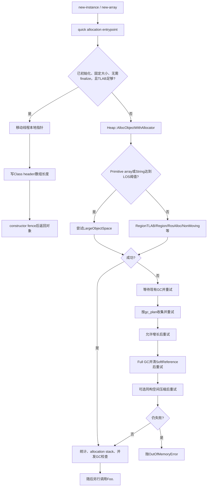
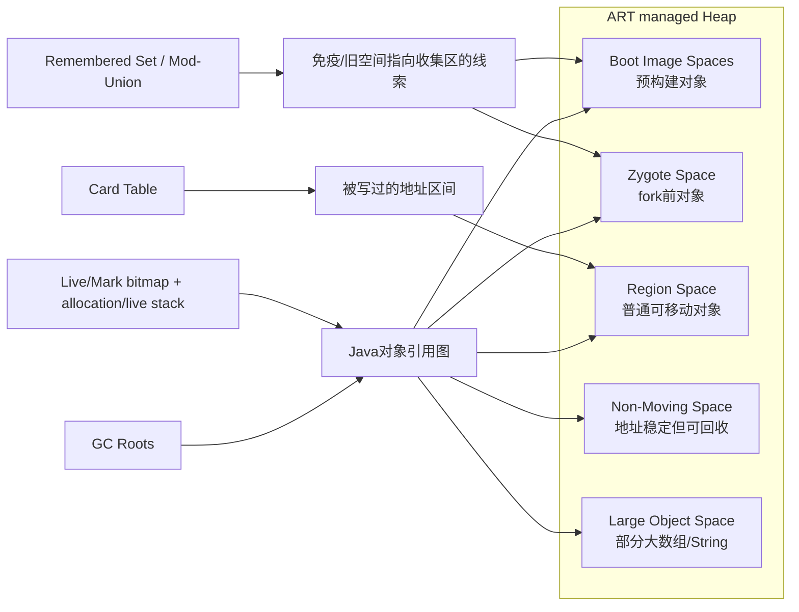
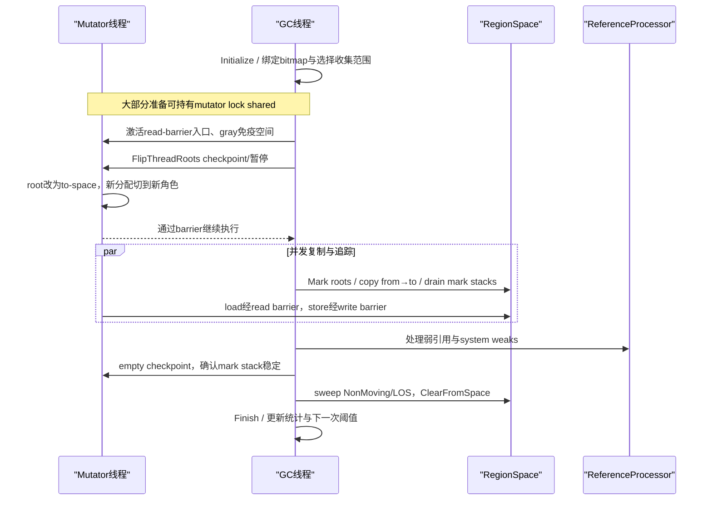

# 第558章 Android ART对象分配与GC链：Heap、Spaces、Roots、读写屏障、Concurrent Copying、Mark Sweep与暂停

> 源码基线：AOSP `android-11.0.0_r48`（Android 11 / API 30）  
> 学习目标：从一条`new`指令追到ART分配快慢路径，再沿Heap、Space、GC roots、读写屏障进入Concurrent Copying与Mark Sweep，能够解释一次GC何时并发、何时暂停、何时才真正释放空间。  
> 阅读约定：继续在macOS只读源码，不实际编译、不连接设备；不同产品可选择不同collector，正文凡写“常见/默认”都不等于所有Android 11设备必然相同。

## 1. 本章先拆掉一句常见误解

“Java执行一次`new`，ART就去堆里找空洞；内存不足时暂停所有线程并把没用对象删掉。”

实际链路更细：固定大小、已可见初始化且无需finalize的类，常先在线程自己的TLAB/RegionTLAB里移动一个指针；只有本地额度不够才补充region或走通用allocator；再失败才可能等待或触发GC。并发复制GC的大部分追踪与复制可同应用线程并行，但线程根翻转等阶段仍有暂停；对象“不可达”、from-space区域被清空、malloc/LOS完成sweep、日志打印完成也不是同一时点。

## 2. 一句话主线

编译代码调用quick allocation entrypoint，ART优先在线程本地空间分配并设置Class header；慢路径由`Heap::AllocObjectWithAllocator()`选择Region、non-moving或large-object等空间，失败后逐级GC与扩容；GC从线程栈、JNI、类表等roots出发，借助write barrier记住并发期间的新引用、借助read barrier把旧from-space引用解析为to-space对象，最后回收未标记对象或整片from-space。

## 3. 与第557章怎样衔接

第557章已经把类推进到resolved、verified、initialized，并说明`ArtMethod`如何进入解释器/AOT/JIT。本章从执行`new-instance`继续：类元数据已能告诉ART对象大小、是否finalizable、是否数组；分配返回一个对象地址后，调用构造方法仍是另一条method invoke链。

所以“类初始化”和“对象初始化”要分开：前者是一次性`<clinit>`和Class状态，后者先获得清零内存、写入对象头，再由应用字节码调用`<init>`设置实例字段。

## 4. 先分清四类内存

- **Java managed heap**：ART认识对象布局、能沿引用图追踪并由GC管理。
- **ART native元数据**：`ArtMethod`、ClassLinker结构、JIT Code Cache等，不等于Java对象堆。
- **应用native heap**：C/C++ `malloc`、图像/媒体库等分配，Java GC不能直接扫描其中任意指针。
- **进程其他映射**：DEX/OAT、共享库、线程栈、ashmem/mmap、图形buffer等。

因此`Runtime.maxMemory()`只描述Java堆政策上限的一部分，不能代表进程PSS上限或设备剩余RAM。

## 5. 这条链的关键参与者

`mirror::Class`提供对象大小和类型属性；`Thread`保存TLAB、线程局部分配栈和根；`Heap`统一选择allocator、GC计划和增长目标；各种`Space`负责实际地址范围；`GarbageCollector`实现追踪/复制/清扫；`CardTable`、remembered set与mod-union table保留跨代或免疫空间引用线索；`ReferenceProcessor`处理Soft/Weak/Finalizer/Phantom引用。

它们都在应用自己的ART运行时进程内，不会为一次普通分配跨Binder去system_server。

## 6. 必须标出六个完成点

一次`new Foo()`至少可标出：

1. Class已满足分配前置状态；
2. allocator取得一块足够、清零且对齐的内存；
3. ART写入Class header和必要的数组长度；
4. 分配记录/根保护与发布栅栏完成，对象可安全返回；
5. Java `<init>`正常返回；
6. 将来对象不可达并被某次GC真正回收。

第4点不等于第5点；构造方法抛异常时，内存也不会在抛出那一刻同步归还。

## 7. 第一幅图：分配快路径、慢路径与GC阶梯



图中的每个“重试”都可能发生线程挂起；若挂起期间allocator或instrumentation入口被切换，旧路径会返回null让上层用新配置重新开始。

## 8. `new`并不是一个C++ `malloc`

DEX的`new-instance`先解析目标Class并检查可实例化性，quick/interpreter入口才向Heap请求内存。ART需要知道对象大小、Class指针、引用字段布局和finalizable属性，因此不能把任意`malloc`地址直接当Java对象。

对象引用在r48运行时通常是压缩的`HeapReference`；native实现持有它时还要服从moving GC与mutator lock规则。

## 9. quick entrypoint为何存在

解释器、AOT和JIT最终都可调用按allocator生成的快速入口，如`art_quick_alloc_object_initialized_region_tlab`。运行时切换collector或打开allocation instrumentation时，可以重置线程的quick entrypoint，不需要让业务Java代码知道具体allocator。

因此反汇编看到一个allocation stub，只表示进入ART约定入口，不说明每次都执行完整Heap慢路径。

## 10. 最快路径有哪些硬条件

`quick_alloc_entrypoints.cc`的注释非常具体：`GetObjectSizeAllocFastPath()`只在Class“visibly initialized”、对象固定大小且non-finalizable时提供可通过检查的大小。还要求未开启instrumentation、编译时选择的allocator为TLAB，并且字节数小于当前线程TLAB剩余额度。

任何条件不满足都只是回到通用路径，不等于分配失败。

## 11. TLAB是什么

TLAB是Thread Local Allocation Buffer：Heap一次给线程一段连续额度，线程在其中分配时只移动自己的指针，不必为每个小对象争抢全局锁或CAS。

RegionTLAB同样是线程局部思想，但底层来自RegionSpace的一段region。`AllocatorType`注释明确称`kAllocatorTypeRegionTLAB`是多数小对象的默认选择；这仍受具体collector和产品配置控制。

## 12. 快路径到底写了什么

快路径做三件核心事：`self->AllocTlab(byte_count)`取得地址，`obj->SetClass(klass)`写对象头，在Baker read barrier构建中检查初始barrier state，然后执行`ThreadFenceForConstructor()`再返回。

这里没有调用`Foo.<init>`，也没有逐字段写0。新空间本就必须满足零初始化语义；数组长度等额外头字段可由`PreFenceVisitor`在发布栅栏前填写。

## 13. 构造栅栏不是Java构造方法

`QuasiAtomic::ThreadFenceForConstructor()`是内存可见性/发布所需的底层栅栏，名字里的Constructor不代表它会执行Java字节码。真正`invoke-direct Foo.<init>`发生在分配入口返回后。

把两者混为一谈，会错误地认为“ART分配函数返回就完成了业务字段初始化”。

## 14. 数组和String为何有独立入口

普通实例大小可从Class固定取得；数组大小依赖元素个数和component size，String也有从bytes/chars/String构造的专用路径。quick入口宏因此同时生成object、array和多种String入口。

数组长度为负或尺寸计算溢出会在分配前形成异常；不能把它们全归因于“堆没空间”。

## 15. 第一段真实Java源码：`Runtime.gc()`只是显式请求入口

```java
// libcore/ojluni/src/main/java/java/lang/Runtime.java
// Android-changed: Added BlockGuard check to gc()
// public native void gc();
public void gc() {
    BlockGuard.getThreadPolicy().onExplicitGc();
    nativeGc();
}

private native void nativeGc();
```

Java层先通知`BlockGuard`当前线程发生显式GC，再进入native。它不是分配器每次失败都调用的通用途径；分配失败直接在Heap内部使用`kGcCauseForAlloc`，显式调用则记为`kGcCauseExplicit`。

## 16. `AllocatorType`描述“从哪里分”，不是“怎样判活”

r48枚举包含BumpPointer、TLAB、RosAlloc、DlMalloc、NonMoving、LOS、Region和RegionTLAB。allocator解决地址取得、空闲块组织和对象是否可移动等问题；collector解决如何从roots判活以及回收/复制。

同一个collector可能配多个allocator，例如CC常把普通对象放RegionSpace，却仍需要NonMovingSpace和LargeObjectSpace。

## 17. 当前allocator会变化

Heap构造早期把`current_allocator_`初始化为DlMalloc，随后`ChangeCollector()`根据目标collector重设实际allocator和entrypoint。前后台collector切换、instrumentation或homogeneous compaction都可能让挂起前后的配置不同。

因此不要从构造函数初始化列表得出“Android 11都用DlMalloc”的结论，也不要从枚举存在推断设备一定启用某条路径。

## 18. Region与RegionTLAB

Concurrent Copying使用RegionSpace，把大地址区切成region。Region可处于free、from-space、to-space或unevacuated等状态；分配通常进入新/to-space区域，复制时可按region整体选择是否疏散。

RegionTLAB从region切一段给线程，减少竞争；额度耗尽时线程再向RegionSpace补充，而不是立即GC。

## 19. BumpPointer与TLAB的关系

BumpPointerSpace使用线性指针推进，回收通常依赖复制/空间翻转，不擅长逐个复用任意空洞。TLAB是把这类线性空间的一部分私有化给线程。

r48注释说普通BumpPointer空间主要用于ZygoteSpace构建；不能把老版本SemiSpace描述机械套到CC的RegionSpace。

## 20. RosAlloc与DlMalloc

RosAlloc按尺寸类别管理run和slot，支持线程局部小对象路径；DlMalloc是传统malloc风格空间。它们允许sweep后复用不连续空洞，但会面对碎片问题。

当malloc-space在OOM前可执行homogeneous space compaction时，Heap会尝试把存活对象搬到同构备用空间；CC路径明确关闭这一套OOM压缩，因为它本身已是移动式collector。

## 21. NonMovingSpace不是“永不回收区”

NonMoving只保证对象地址不因移动collector而改变，不代表对象永久存活。GC仍可标记并sweep其中不可达对象。

它用于需要稳定地址的数组、某些运行时对象或不能移动的场景。native代码若要长期稳定地址，应使用明确API与生命周期协议，不能靠“这次碰巧没移动”。

## 22. LargeObjectSpace的选择比名字严格

`ShouldAllocLargeObject()`的r48实际返回式只检查两项：对象字节数达到阈值，并且Class是primitive array或String。普通巨型`Object[]`或含引用字段的大实例不能仅凭大小推断一定进LOS。

紧邻源码注释又说明这条设计依赖ZygoteSpace，避免大对象在Zygote建堆阶段被过早释放；但函数里并没有第三个`HasZygoteSpace()`条件。读实现时应把“实际布尔谓词”和“成立所依赖的生命周期前提”分开。

## 23. LOS失败还有一次普通空间机会

`AllocLargeObject()`失败会留下OOME，但通用分配路径会清掉该异常并尝试normal spaces。源码注释点名一种原因：虚拟地址空间碎片使LOS无法取得映射，而普通空间仍可能成功。

所以一次大数组最后落在哪个Space不能只按阈值猜；日志和heap dump才是证据。

## 24. 分配后的根保护

某些allocator分配出的对象要压入allocation stack；启用线程局部分配栈时，每个线程先缓冲固定数量的引用，再由GC撤销/合并。它避免新对象尚未被普通对象图引用时被并发GC误判为死对象。

TLAB空间本身和collector的to-space规则也会参与“新对象已活”的保证，具体不能简化成只有一张全局列表。

## 25. 统计为何会看起来跳跃

TLAB/RegionTLAB可能按整段批量计入`num_bytes_allocated_`，单个对象只消费其中一部分。因此Java heap统计可以在补充TLAB时跳大，随后若干对象分配却不逐次增加同样的全局计数。

unused TLAB在撤销时还会修正；不要把某一瞬间的bulk accounting等同于每个对象尺寸精确之和。

## 26. instrumentation会关闭部分最快路径

allocation tracking、JVMTI监听器、统计或调试功能需要看到每次分配，ART会切换到instrumented quick entrypoints。通用路径可记录allocation stack trace、更新runtime stats并回调listener。

这会改变性能和时序，所以“开Profiler后分配变慢”可能是观测机制本身的影响。

## 27. 通用分配路径仍有局部快路

`Heap::AllocObjectWithAllocator()`不是一进入就GC。它依次可尝试large object、当前TLAB、RosAlloc线程局部slot，再调用`TryToAllocate()`按allocator向具体Space要内存。

只有`TryToAllocate()`返回null，才进入`AllocateInternalWithGc()`。

## 28. 第一步：先等别人正在做的GC

分配失败线程先`WaitForGcToComplete(kGcCauseForAlloc)`。若另一个线程/HeapTask正在GC，它不应重复启动冲突collector；等待完成后立刻重试。

日志里看到线程因GC阻塞，不代表它是发起那次GC的线程。

## 29. 第二步：按`next_gc_type_`收集

没有可利用的现有GC结果时，Heap调用`CollectGarbageInternal(next_gc_type_, kGcCauseForAlloc, false)`，成功运行后再分配。随后遍历`gc_plan_`中尚未尝试的其他scope。

`next_gc_type_`是sticky/partial/full范围选择，不是CC/CMS算法选择。

## 30. 第三步：允许Heap增长

常规收集仍不够时，`TryToAllocate<..., grow=true>`允许目标footprint朝growth limit增长。这里的“增长”通常是允许更多已保留/可提交的Java堆容量，不等于立刻向系统永久占满`-Xmx`。

growth limit与capacity也不同；`clearGrowthLimit()`是受限内部API，普通应用不应把它当内存优化手段。

## 31. 第四步：清理SoftReference后再试

源码明确在接近OOME时用最后一个GC scope并传`clear_soft_references=true`，然后再尝试分配。注释说明抛OOME前需要给SoftReference清除机会。

这意味着SoftReference只适合作为可丢缓存提示，不能作为关键业务数据唯一持有者。

## 32. 这里不会同步跑完finalizer

紧邻SoftReference收集的源码写着`TODO: Run finalization, but this may cause more allocations to occur.`。所以不能声称ART分配失败阶梯一定“先运行全部finalize再OOME”。

Finalizer由引用处理与Java daemon异步接力，而且finalize本身还能分配、阻塞甚至复活对象。

## 33. 第五步：有限条件下尝试压缩

只有RosAlloc/DlMalloc、配置允许且距上次OOM压缩超过最小间隔时，才尝试`PerformHomogeneousSpaceCompact()`。moving GC被禁用、VM退出或其他拒绝条件都会跳过。

它主要缓解“总空闲可能够但连续/合适块不够”的碎片，不会创造超过growth limit的容量。

## 34. 最后才抛OOME

所有步骤仍返回null，Heap调用`ThrowOutOfMemoryError()`。原因可能是活对象逼近上限、单次对象太大、地址空间/LOS碎片、moving被禁用或GC无法及时释放；“设备还有几GB RAM”不能否定进程Java OOME。

反过来，进程也可能先因native/GPU/mmap压力被杀，而从未抛Java OOME。

## 35. 第二幅图：Heap中不同Space和辅助账本



图是职责图，不代表这些Space在虚拟地址中一定按同样顺序紧邻；Heap构造会按collector、image和产品参数决定映射。

## 36. Boot Image Space

boot image装有预初始化的核心类与对象，多个进程可映射共享页。它通常被collector视为immune space：本轮不搬动/逐个回收其中对象，但其中指向应用堆的可变引用仍需通过mod-union/card线索扫描。

“immune”是某次collector的收集范围概念，不是说其中任何字节都物理只读。

## 37. Zygote Space

Zygote在fork前预加载、分配大量框架对象，首次`PreZygoteFork`后相关空间成为ZygoteSpace，子进程通过COW共享干净页。应用修改其中可写页会产生私有脏页，降低共享收益。

GcType的通用注释说明partial不标记Zygote、full覆盖应用与Zygote heap；Mark Sweep会按这个scope决定是否扫描`sGcRetentionPolicyFullCollect`空间。但r48 Concurrent Copying的`GetGcType()`只返回partial或sticky，`BindBitmaps()`又固定把ZygoteSpace加入immune集合。因此不能把MS的“full可收Zygote”套到CC，也不能脱离collector只说“Zygote对象永远/一定不会回收”。

## 38. Region Space为何预留两倍capacity

Heap在CC下为RegionSpace创建`capacity_ * 2`的虚拟地址范围，注释说明显式GC可能疏散全部region，需要同时容纳from-space与to-space。预留地址范围不等于两倍物理页始终常驻。

GC期间`EvacBytes()`会纳入heap size tracing，因为同一存活对象在复制窗口可能暂时有旧、新两份。

## 39. Continuous与discontinuous space

malloc、image、region等可覆盖连续地址区间；LargeObjectMapSpace之类可由独立映射组成，属于discontinuous语义。Heap维护两类space列表，bitmap和card覆盖策略也不同。

因此“Java堆是一整段连续内存”只是教学简图，不是ART地址布局事实。

## 40. Live bitmap与mark bitmap

bitmap用地址对应bit表达“已知live/本轮marked”，malloc space sweep可比较live与mark找死对象。GC开始时会绑定、清理或交换相应bitmap；结束交换bitmap是一种避免逐bit复制的优化。

Region evacuation更常按region状态和复制计数回收，但non-moving/LOS仍需要mark/sweep账本。

## 41. allocation stack与live stack

Heap创建allocation stack和live stack。Mark Sweep暂停阶段会`SwapStacks()`，冻结旧live stack的大小并撤销线程局部分配栈，避免mutator继续把新对象写入正被GC当作快照处理的那一份。

它们是增量追踪的辅助根集合，不是“所有对象唯一目录”；bitmap、Space自身状态和roots仍共同参与判活。

## 42. Card Table记录什么

write barrier把“发生引用写入的目标对象所在card”标脏。card覆盖一段地址，而不是精确记录某字段的新值；GC稍后扫描这一小段中的对象与引用，换取极低的写入开销。

所以dirty card意味着“这里可能出现需要重新检查的引用”，不表示该card上所有对象都活，也不表示新引用一定跨代。

## 43. Remembered Set与Mod-Union Table

当只收集部分Heap时，GC不能每次完整扫描image/Zygote/non-moving等不在本轮主收集区的所有对象。remembered set或mod-union table汇总“这些空间可能指向被收集空间”的边。

Heap构造会为boot image添加Image mod-union table；某些SemiSpace配置还为non-moving space添加remembered set。具体启用组合取决于collector。

## 44. GC是可达性，不是引用计数

GC从roots沿强引用边遍历，未到达的对象才是候选垃圾。A和B互相引用但都与roots断开时，两者会一起不可达，所以循环引用可被回收。

反之，一个巨大对象只要被静态集合、ThreadLocal、JNI global或消息队列间接引用，就不会因为“业务已经不用”自动释放。

## 45. 什么叫GC root

root是collector开始遍历时由运行时保证可直接找到的引用槽位，而不是“引用次数最多的对象”。root槽位本身在moving GC后可能被改写为新地址。

分析泄漏时，真正问题通常是从某个root到目标对象的保留路径，而不是目标对象自身大小。

## 46. 线程roots

每个Java线程的解释器shadow frame、quick frame栈映射、JNI local reference、HandleScope、线程peer、挂起异常与监视器等都可能含对象引用。Runtime通过ThreadList遍历线程并让各线程在安全状态暴露roots。

native C++局部变量里的裸`mirror::Object*`若跨越可能挂起点，不会自动成为可更新root；这正是`Handle`/`ObjPtr`纪律重要的原因。

## 47. 非线程roots

ClassLinker的ClassTable/DexCache、intern table、JNI global/weak global、runtime预分配异常、transaction roots、monitor pool、JIT code roots和系统weak holder等都由不同访问器上报。

它们并非全部同等强度：weak globals与系统weak要在强可达标记完成后按专门顺序清理。

## 48. Class为什么会保住很多对象

存活ClassLoader可通过ClassTable保住其Classes和DexCaches；Class又可通过静态字段保住任意对象图。动态模块卸载要求ClassLoader本身变得不可达，并等到GC与ClassLinker cleanup完成。

仅关闭DexFile或删掉磁盘DEX，不会让已经加载的Class立即消失。

## 49. JNI local与global引用

JNI local ref通常随native frame返回释放，global ref要显式`DeleteGlobalRef`，weak global不会让对象保持强可达。三者都是句柄，不应直接用其数值当稳定对象地址。

长期忘删global ref是典型native侧Java heap泄漏；忘释放native buffer则是另一类native heap泄漏。

## 50. Handle保护会移动的对象

例如分配函数把`klass`放入`StackHandleScope`，因为慢路径可能GC并移动Class对象；GC更新Handle中的引用后，代码才能继续用新地址。若把原始指针跨过`WaitForGcToComplete()`，旧地址可能指向from-space。

这是源码里判断“某调用可能挂起/GC”的实用线索：看它是否建立HandleScope、是否标注mutator lock、是否用`ScopedAllowThreadSuspension`。

## 51. 强引用标记完成后才处理弱语义

collector先建立强可达闭包，再由ReferenceProcessor识别Reference子类。若在强标记过程中把WeakReference.referent当普通强边遍历，弱引用就永远无法清除。

r48对Reference对象还会设置gray/read-barrier状态，确保并发读取referent与GC处理之间不破坏to-space不变量。

## 52. Write barrier解决哪场竞态

并发标记时，GC可能已经扫描过对象A；mutator随后执行`A.child = B`，而B尚未标记。没有记录的话，GC可能看不到新边并错误回收B。

write barrier让A所在card变dirty，GC在remark/pre-clean阶段重扫相应区域，从而补上并发期间变化的引用图。

## 53. r48 write barrier的核心很小

`WriteBarrier::ForFieldWrite(dst, offset, newValue)`在非null写时调用`CardTable::MarkCard(dst)`；array write和every-field write同样标记目标对象的card。offset、范围参数在这个实现里不用于逐字段日志，而是保留统一接口语义。

小并不等于可省略：编译器、解释器、runtime手写字段更新都必须让barrier与引用写配套，并在下个GC safepoint前完成。r48并发标记的竞态注释甚至展示了“先dirty card、后真正写字段”的次序，所以不要强行理解为barrier永远在store之后。

## 54. 写null为什么常可省barrier

把字段清为null只会删除一条可达边，不会凭空产生通向尚未标记对象的新路径，所以模板默认可在`new_value == nullptr`时直接返回。

但批量复制、对象整体字段变更和特定collector仍有专用入口；应用开发者不应据此自行绕过语言/runtime提供的写入API。

## 55. Write barrier不是CPU memory barrier

名称中的barrier是GC记账屏障；主要动作是标card。它不等同于Java `volatile`、锁的happens-before，也不自动让普通字段跨线程可见。

相反，`ThreadFenceForConstructor()`属于内存顺序机制。两者可能在相邻代码出现，但解决的问题不同。

## 56. 旧对象指向新对象为何危险

sticky/young collection只重点检查近期对象时，旧/immune对象新写入的引用若不记录，新对象可能从局部收集视角“没有root”。card/remembered set就是跨区域边的摘要。

这也是partial GC不能只遍历“新对象列表”的原因：必须把旧到新的出边作为附加roots。

## 57. `SetClass()`为何有特殊说明

普通分配路径直接`obj->SetClass(klass)`不总调用write barrier；新对象还受allocation/to-space规则保护。但在SemiSpace remembered-set配置且对象分到NonMoving allocator时，Class可能是近期可移动对象，源码显式对Class字段补`ForFieldWrite()`。

这说明barrier省略依赖非常具体的不变量，不能推广成“对象构造期间写引用都不用barrier”。

## 58. Read barrier解决哪场竞态

Concurrent Copying把对象从from-space复制到to-space时，mutator可能仍从某字段读出旧地址。read barrier检查该引用是否需要标记/转发，返回可用的to-space引用；实现可选择顺手更新原字段。

其接口注释明确：返回值必须是更新后的引用，但除`kAlwaysUpdateField`外，不保证每次都回写引用槽。

## 59. Read barrier也不是Java读屏障

它不是`volatile` acquire语义，也不是防止CPU乱序的通用API。它服务moving GC，在对象引用load路径恢复to-space不变量。

Java内存模型的可见性仍由volatile、锁、final字段规则等承担。

## 60. Baker read barrier的gray bit

Baker实现把对象read-barrier state编码在对象lock word的一位：NonGray可以表示white或已扫描完成的black，Gray表示已标记但引用字段尚未全部扫描、位于mark stack。

mutator读gray对象的引用时走barrier mark入口，帮助GC推进；这让部分扫描工作分散到实际读取路径。

## 61. forwarding address与复制竞态

多个线程可能同时第一次遇到同一个from-space对象。复制路径分配to-space副本、拷贝内容，并用原子操作发布forwarding address；竞争失败者丢弃/回收自己的候选副本并采用胜者地址。

因此日志中的moved bytes是collector记账结果，不意味着每次尝试复制都产生永久第二份对象。

## 62. Baker、Brooks、table lookup不是同时启用

`read_barrier_config.h`由构建宏选择Baker、Brooks或table lookup，且显式禁止Baker与Brooks同时开启。r48源码里Brooks路径标为未实现，常见产品使用Baker，但具体构建必须看宏。

不能因为类中存在三组常量，就说一次对象读取会连续穿过三种barrier。

## 63. 有read barrier时Heap限制collector组合

Heap构造函数检查：`kUseReadBarrier`为真时，foreground必须是CC，background必须是CCBackground。否则前后台collector是否moving还要满足兼容约束。

这是一条构建/运行时一致性断言，不是应用可在Java中随意选择的开关。

## 64. CollectorType、GcType、GcCause要三栏记录

- `CollectorType`：CC、CMS、MS、SS等算法/实现。
- `GcType`：sticky、partial、full等本轮覆盖范围。
- `GcCause`：for alloc、background、explicit、native alloc、collector transition等触发原因。

一行“Background concurrent copying GC”里往往同时含cause和collector；不要只用“Full GC”包办所有维度。

## 65. `GcType`枚举顺序有意义

源码注明顺序用于决定先尝试哪些GC：none、sticky、partial、full。sticky尝试释放上次GC后新分配对象；partial标记应用堆但不标记Zygote；full覆盖应用与Zygote heap。

它描述收集集合，不保证full一定压缩，也不保证sticky一定是分代CC。再注意一个r48特例：`ConcurrentCopying::GetGcType()`在generational young模式返回sticky，其余CC返回partial，CC没有返回full；显式CC通过`force_evacuate_all_`强制疏散所有Region，也不等于把ZygoteSpace纳入full scope。

## 66. `GcCause`也包含“假GC”临界区

除真正触发原因外，枚举还含Instrumentation、Debugger、ClassLinker、JitCodeCache、Hprof等，用于和GC建立互斥/临界区；注释明确说它们不是real GC cause。

看到`ScopedGCCriticalSection`不应直接推断发生了对象回收，它可能只是在阻止并发collector进入。

## 67. Android 11不等于所有进程统一CC

若构建启用read barrier，Heap断言前台CC、后台CCBackground；但源码仍完整保留CMS/MS/SS并允许不同参数、AOT compiler或特殊进程采用它们。`kCollectorTypeDefault`还由构建宏选择CMS或SS。

准确写法是“该目标构建/进程当前collector为…”，证据来自runtime参数、日志或源码配置，而不是只看Android版本号。

## 68. CC为什么叫“mostly concurrent copying”

它把可移动对象从选中的from-space region复制到to-space，依赖read barrier让mutator与collector并行；但仍要建立一致的region角色、翻转线程roots、执行checkpoint并在特定阶段暂停。

所以“Concurrent”表示主要工作并发，不表示pause time恒为0。

## 69. CC的高层阶段

`RunPhases()`依次执行Initialize；某些generational full场景先做一次Marking以计算live bytes；可选并发gray免疫空间；FlipThreadRoots；CopyingPhase；可选无from-space验证暂停；Reclaim；Finish。

这里方法名`MarkingPhase()`既可在前置live-bytes计算出现，实际并发复制主工作还在`CopyingPhase()`，读源码时不能只按方法名想象传统mark-sweep。

## 70. 第三幅图：Concurrent Copying的时间线



这幅图把“暂停”和“整个GC wall time”分开：日志中总耗时可明显长于pause合计，因为复制、扫描和sweep大量在mutator继续运行时完成。

## 71. InitializePhase建立本轮不变量

Initialize会重置计数、选择young/full模式、绑定bitmap、准备region状态和免疫空间。GC线程通常以mutator lock shared访问对象，意味着应用线程仍可运行，但双方必须遵守barrier。

在真正flip前，不能提前宣称所有线程root已转成to-space。

## 72. 为什么先gray dirty immune objects

image/Zygote等immune空间本轮不整体复制，但其中被mutator改过的对象可能指向from-space。CC可在暂停前并发把dirty immune objects设gray，缩短暂停；暂停中还会重处理gray cards消除竞态。

源码特别要求先切换read-barrier mark entrypoints，再把对象设gray，避免mutator看到gray却仍调用旧入口。

## 73. `FlipThreadRoots()`是真暂停边界

CC调用`ThreadList::FlipThreadRoots()`，让每个线程转换TLAB/allocator视图并forward/mark线程roots。某些线程通过checkpoint自己执行，无法及时运行的线程由GC在其已挂起状态代办。

函数完成后设置to-space invariant并执行发布fence。此后mutator不应继续暴露未处理的from-space引用。

## 74. Safepoint不是任意时刻强冻OS线程

ART线程在allocation、method entry/backedge、suspend check、JNI状态切换等可协作位置响应checkpoint或挂起请求。处于native阻塞/临界区的线程需要按Thread状态和runtime协议处理。

暂停延迟因此不仅取决于GC算法，还取决于线程多久能到达可安全检查位置，以及是否持有禁止moving的临界区。

## 75. from-space、to-space与unevacuated

from-space是本轮候选旧区域；to-space接收存活副本和新分配；unevacuated region保留原地对象并使用mark/sweep方式处理。选择可根据live bytes、young/full模式与可用空间，不要求每轮搬完整个Heap。

只有被清除的from-space region能按整片快速回收；unevacuated和NonMoving/LOS仍需逐对象判活。

## 76. 新分配对象放在哪里

flip后mutator的新对象必须直接满足to-space/marked语义，通常进入新的Region/RegionTLAB或被allocation stack保护。否则刚分配对象还没接入普通引用图就可能被GC漏掉。

CC期间heap统计把evac bytes加进trace，解释了为何GC运行中“已分配字节”可能暂时上升。

## 77. CopyingPhase怎样推进对象图

GC捕获runtime、non-thread和thread roots，把引用指向的from-space对象复制/forward，再扫描副本引用并持续drain mark stack。mutator读取gray/from-space引用时也可通过read barrier参与mark。

最终目标不是“每个对象都复制”，而是所有强可达边都满足to-space invariant，且需保留区域的live对象已标记。

## 78. mark stack有多种模式

为减少竞争，CC可让mutator使用thread-local mark stack，之后切到shared，再由GC exclusive drain。模式切换配合checkpoint/barrier，确保没有某线程私有栈中的工作被遗漏。

仅检查GC线程自己的stack为空并不足够，Reclaim前还会发empty checkpoint并再次确认。

## 79. 弱引用处理为何靠后

只有强可达闭包稳定后，才能判断referent是否只剩弱可达。CC暂停/并发流程会暂时启用Reference.getReferent慢路径、禁止某些system weak新增，处理后再恢复。

WeakReference被clear与ReferenceQueue consumer真正消费是两个完成点；后者由Java线程调度。

## 80. ReclaimPhase先sweep再清from-space

源码先sweep malloc spaces、交换bitmap并解绑，再统计region from/to bytes，调用`RegionSpace::ClearFromSpace()`整片清除已疏散区域。顺序避免内存工具在检查dead malloc对象Class时发现其Class所在from-space已先消失。

`freed_bytes = cleared_bytes - moved_bytes`甚至可能因near-OOM复制到non-moving时padding而近似或为负；不要用一次内部字段做绝对物理内存结论。

## 81. `ClearFromSpace()`才是region复用点

对象被判定可达并拿到forwarding address时，旧副本尚可能存在；必须等所有可见引用都已转向to-space且checkpoint确认稳定，才可把from-space region清为free。

因此“对象复制完”不等于“旧内存已归还”，峰值RSS通常出现在Reclaim清from-space之前。

## 82. sweep与copy的“释放”含义不同

malloc/LOS sweep逐个找unmarked对象，把块交还Space allocator；CC对已完全疏散的region可整片清空。两者往往先让ART内部可复用，不保证内核立刻把对应物理页从进程RSS扣除。

Heap trim/madvise是另一条把空闲页归还内核的任务，日志“freed 20MB”与`dumpsys meminfo`立即下降20MB并无必然等式。

## 83. FinishPhase才收尾本轮状态

Finish会汇总timing、清理临时结构、调整下一次GC计划/阈值并解除collector活动状态。应用线程可能早在并发阶段继续执行，但从Heap管理角度本轮尚未结束。

判断“GC完成”应看collector/Heap的完成条件或日志完整行，而不是只看到首个pause结束。

## 84. CC的暂停并非只有一个数字

常规路径至少有FlipThreadRoots相关pause；debug验证可增加`VerifyNoFromSpaceReferences`暂停，checkpoint等待也影响延迟。GC日志可能列出一个或多个`paused`时段及total。

优化卡顿时应看最大单次pause、总pause、GC频率与CPU并发开销，不能只看total wall time。

## 85. Mark Sweep的基本思想

MS从roots递归标记所有可达对象，再扫描可收集Space，把未标记块放回free list。存活对象地址不变，因此没有from/to副本和引用重写成本，但会留下离散空洞。

这类collector适合不能/不想移动对象的场景，却可能更受碎片影响。

## 86. CMS只是把部分阶段并发化

r48同一个`MarkSweep`类以`concurrent`参数实现MS/CMS。CMS在mutator运行时执行MarkingPhase，然后进入`ScopedPause`做ReMarkRoots、扫描dirty objects、swap stacks、禁system weaks和启用reference慢路径；Reclaim/sweep又以mutator lock shared并发进行。

所以CMS同样有remark暂停；write barrier/card table正是补并发标记期间修改的关键。

## 87. 非并发MS暂停哪些工作

non-concurrent分支先进入`ScopedPause`，在暂停中完成MarkingPhase和PausePhase；随后sweep仍按源码注释“always done concurrently”，即应用线程可与Reclaim并行。

把“non-concurrent mark sweep”说成从初始化到Finish全程世界静止，仍不精确。

## 88. Sticky Mark Sweep为何更快也更局限

sticky收集尝试只释放上次GC后分配的对象，依赖live/allocation stack与dirty cards把旧对象到新对象的引用补成roots。存活对象占比高或需要更大空间时，Heap会升级到partial/full。

r48 MarkSweep初始化还规定非sticky收集总会清SoftReference；sticky是否清由当前iteration策略决定。

## 89. SemiSpace与homogeneous compaction

SemiSpace把存活对象从一个bump space复制到另一个，实现压缩；homogeneous space compaction可在两个同构malloc space间搬迁，主要用于CMS前后台转场或OOM碎片缓解。

它们都会移动对象，因此必须与JNI critical、debugger、instrumentation等禁止moving的临界区协调。

## 90. Collector切换会连带allocator切换

前后台进程状态变化可触发collector transition。Heap不仅替换collector，还可能重建/切换main space、更新current allocator、重置所有线程quick allocation entrypoints。

分配慢路径每次挂起后检查allocator/instrumentation是否变化，正是为了避免用旧Space规则继续操作。

## 91. mutator lock的读写含义

处于Runnable的Java线程通常共享持有mutator lock；GC并发访问对象也以shared方式进入。需要Stop-The-World时，collector获得exclusive mutator lock，阻止mutator继续读写managed objects。

这不是业务Java代码可见的某把`ReentrantLock`，而是ART全运行时对象访问协议。

## 92. Checkpoint与SuspendAll的区别

checkpoint让每个线程在安全位置执行一个closure，部分已挂起线程可由发起者代执行；SuspendAll/ScopedPause则建立全局暂停。CC的thread root flip把checkpoint、barrier和短暂停顿组合起来。

看到`RunCheckpoint()`不必然等于长时间STW，但发起线程仍可能等待所有目标线程响应。

## 93. 禁止moving的临界区

`GetPrimitiveArrayCritical`等需要暂时稳定数组地址，Heap用`disable_moving_gc_count_`和`kGcCauseDisableMovingGc`协调；若临界区过长，移动collector可能等待、退化或被拒绝。

JNI规范也要求critical区短小，不应阻塞或做任意JNI调用。把数组指针保存到critical区之外是生命周期错误。

## 94. `System.gc()`在Android Java层还有合并语义

`System.gc()`并非每次都直接调用Runtime：r48用`runGC`和`justRanFinalization`在`System.gc()`、`System.runFinalization()`之间协调，只有特定状态才执行`Runtime.getRuntime().gc()`，其余请求可延后到finalization路径。

即使进入native，runtime配置也可禁用explicit GC；应用不能把调用返回当作“目标对象已回收且RSS已下降”的证明。

## 95. 后台并发GC怎样排队

`Heap::RequestConcurrentGC()`用原子`concurrent_gc_pending_`合并重复请求，把`ConcurrentGCTask`加入`TaskProcessor`并立即到期。任务执行`ConcurrentGC()`，等待冲突GC，按`next_gc_type_`或更大scope收集，最后清pending标记。

这是应用进程内HeapTask线程处理，不是system_server替应用做GC。

## 96. 分配阈值怎样触发后台GC

GC结束后Heap根据target footprint、目标利用率、估算分配速度和collector持续时间计算`concurrent_start_bytes_`。新分配让已分配字节接近阈值时，`CheckConcurrentGCForJava()`请求background GC，争取在真正分配失败前产生空闲。

高分配速率会让预留remaining bytes更大、GC更早启动；这也是短时间对象洪峰会造成GC频繁和CPU上升的原因。

## 97. 第二段真实Java源码：non-moving与native分配通知API

```java
// libcore/libart/src/main/java/dalvik/system/VMRuntime.java
@UnsupportedAppUsage
@libcore.api.CorePlatformApi
@FastNative
public native Object newNonMovableArray(Class<?> componentType, int length);

@UnsupportedAppUsage
@libcore.api.CorePlatformApi
@FastNative
public native long addressOf(Object array);

@UnsupportedAppUsage
@libcore.api.CorePlatformApi
public native void registerNativeAllocation(long bytes);

@UnsupportedAppUsage
@libcore.api.CorePlatformApi
public native void registerNativeFree(long bytes);
```

这些是平台内部API。前两项把特定primitive array放在不会移动的位置并取得元素地址；后两项只是让Heap知道一笔非malloc native字节的增减，不会把native内存变成Java对象，也不会代替真正`free()`。

## 98. native allocation为何会触发Java GC

NativeAllocationRegistry/VMRuntime把native占用纳入一种加权压力模型。Heap比较Java已分配量、较新的native bytes、旧native bytes与watermark；超过阈值可请求`kGcCauseForNativeAlloc`，压力远超目标且持续分配时甚至等待GC。

源码注释强调这项检查“不强制Java heap bounds”；它是尽早让关联Java wrapper变不可达并执行Cleaner的反馈机制，不是native heap硬上限。

## 99. malloc分配为什么走采样通知

对普通`malloc()`，每次都调用`mallinfo()`成本太高。`VMRuntime.notifyNativeAllocation()`在Java层用AtomicInteger累计，达到`notifyNativeInterval`才调用native `notifyNativeAllocationsInternal()`。

而明确大小、非malloc的大分配用`registerNativeAllocation(bytes)`精确加账；两条入口不要重复报告同一内存。

## 100. 第三段真实Java源码：`NativeAllocationRegistry`怎样绑定Cleaner

```java
// libcore/luni/src/main/java/libcore/util/NativeAllocationRegistry.java
public Runnable registerNativeAllocation(Object referent, long nativePtr) {
    if (referent == null) {
        throw new IllegalArgumentException("referent is null");
    }
    if (nativePtr == 0) {
        throw new IllegalArgumentException("nativePtr is null");
    }

    CleanerThunk thunk;
    CleanerRunner result;
    try {
        thunk = new CleanerThunk();
        Cleaner cleaner = Cleaner.create(referent, thunk);
        result = new CleanerRunner(cleaner);
        registerNativeAllocation(this.size);
    } catch (VirtualMachineError vme /* probably OutOfMemoryError */) {
        applyFreeFunction(freeFunction, nativePtr);
        throw vme;
    }
    thunk.setNativePtr(nativePtr);
    Reference.reachabilityFence(referent);
    return result;
}
```

它先成功创建Cleaner并报告native占用，最后才把指针交给thunk；若注册过程因VM error失败，会立即调用freeFunction避免泄漏。`reachabilityFence(referent)`防止优化器认为referent可提前回收。返回Runnable允许调用者主动清理，但仍必须确保只释放一次。

## 101. Cleaner不是“及时析构器”

Cleaner动作要等referent变成phantom reachable、GC发现并入队、ReferenceQueueDaemon/Cleaner线程获调度才执行，时间不确定。资源应提供显式`close()`，Cleaner只做兜底。

nativePtr的其他副本在referent不可达后可能悬空；源码文档明确警告不能继续访问。

## 102. Soft、Weak、Finalizer、Phantom的次序直觉

SoftReference可在内存压力或非sticky收集中被清；WeakReference在仅弱可达时清并入队；finalizable对象先由FinalizerReference保留并异步执行finalize，可能复活；Phantom/Cleaner用于确认不可再正常访问后的清理通知。

这是简化可达性模型，具体批次与队列时点由ReferenceProcessor和Java daemons协调；不要根据一次`System.gc()`写确定性测试。

## 103. finalization为什么危险

finalize可阻塞、抛异常、访问其他对象并通过静态变量复活自己，至少增加一个GC周期和不可预测延迟。FinalizerWatchdog还会监控长时间finalize。

r48分配失败路径没有同步跑finalizer的事实进一步说明：用finalize释放文件描述符或native大块内存会把正确性押在不确定调度上。

## 104. 怎样读一行ART GC日志

典型字段包含cause/是否background、collector名、free objects/bytes、LOS对象/bytes、heap占用变化、pause时间和total。首先把“释放Java普通对象”“释放LOS”“暂停”“总耗时”分别抄表。

`freed 0`不一定毫无作用：moving collector可能压缩/疏散、处理weak、调整阈值；反之释放很多字节但很快重新分配，GC频率仍会很高。

## 105. pause time、wall time与CPU time

pause是mutator不能运行的时间；wall time从GC开始到结束，含并发阶段；CPU time是GC线程实际消耗，可因并行线程总和接近或超过wall time。卡顿最直接看pause落在哪一帧，耗电/抢占则要看并发CPU。

一个“总计20ms、暂停0.3ms”的CC与“暂停20ms”的STW影响完全不同。

## 106. `dumpsys meminfo`为何对不上Java heap

Java Heap列、Native Heap、Code、Stack、Graphics、Private Other、Shared等口径不同；PSS按共享页比例计算，RSS则计入所有驻留页。ART内部free bytes可能仍驻留并可快速复用，因此PSS不必同步下降。

排查应同时看对象保留图、native allocations、mmap/graphics和系统memory pressure，不能只盯`Runtime.freeMemory()`。

## 107. 常见OOME的四种形态

一是活对象确实接近growth limit；二是单个数组尺寸超过可满足范围；三是Space/虚拟地址碎片导致合适连续块失败；四是moving被critical区限制或GC赶不上分配速率。native分配失败还可能抛来自库自身的错误或直接触发进程终止。

诊断时必须保存OOME完整消息、GC日志和分配类型，不能只说“内存泄漏”。

## 108. 面向应用的源码化优化原则

减少峰值live set比单纯减少`new`次数更重要；避免无界静态缓存、长生命周期Context/View引用、未清ThreadLocal/JNI global；大图片按展示尺寸解码并明确释放native资源；短命小对象如果不逃逸，TLAB分配本身常很便宜。

真正代价常在对象长期存活、晋升/复制、扫描大引用图和频繁触发阈值，而不是`new`关键字本身。

## 109. 场景推演：一个普通小对象

已visibly initialized的`Point`大小固定且无finalize，JIT代码调用RegionTLAB/TLAB quick入口；线程本地额度足够，移动指针、设置Class、fence后返回；随后`Point.<init>`写x/y。整个过程没有GC、Binder或全局allocator锁。

若allocation tracking开启，同样Java代码会改走instrumented入口，记录事件后再返回。

## 110. 场景推演：一个巨大`byte[]`

数组入口先验证length并算对齐尺寸；达到阈值后，`ShouldAllocLargeObject()`因它是primitive array而允许尝试LOS。若LOS因地址碎片失败，清临时OOME、回到normal space；仍失败则走GC/增长/清SoftReference阶梯，最终成功或抛OOME。

这条链不能推广到同样大小的`Object[]`，因为r48 LOS判断只允许primitive array或String；ZygoteSpace是相邻注释声明的设计前提，不是该返回式中的第三个布尔条件。

## 111. 阅读任何GC函数的固定检查表

先问：当前collector/type/cause是什么；mutator lock是shared还是exclusive；本轮收哪些Space；roots是否已snapshot/flip；并发写靠哪种barrier补；新对象如何保护；weak何时处理；旧地址何时失效；回收是Space内部复用还是归还内核；日志完成点在哪里。

带着这十问，方法名就不容易误导你。

## 112. macOS只读练习一：定位分配快路和OOM重试阶梯

```bash
cd /Users/ninebot/androidSource
rg -n "kUseTlabFastPath|GetObjectSizeAllocFastPath|AllocTlab|AllocateInternalWithGc|Forcing collection of SoftReferences|ThrowOutOfMemoryError" \
  art/runtime/entrypoints/quick/quick_alloc_entrypoints.cc \
  art/runtime/gc/heap-inl.h art/runtime/gc/heap.cc
```

预期：先命中quick入口的TLAB条件和header/fence，再命中`AllocateInternalWithGc()`中的等待、GC、SoftReference和最终OOME。练习只读；用命中行号继续`sed -n`即可复核上下文。

## 113. macOS只读练习二：分清allocator、collector、scope与cause

```bash
cd /Users/ninebot/androidSource
sed -n '20,90p' art/runtime/gc/allocator_type.h
sed -n '20,95p' art/runtime/gc/collector_type.h
sed -n '20,90p' art/runtime/gc/collector/gc_type.h
sed -n '20,105p' art/runtime/gc/gc_cause.h
```

预期：四个文件分别回答“从哪里分”“用什么算法收”“本轮收多大范围”“为何触发”。把四栏各抄一个例子，禁止再把`full`当collector名。

## 114. macOS只读练习三：核对CC与Mark Sweep的暂停边界

```bash
cd /Users/ninebot/androidSource
rg -n "RunPhases|FlipThreadRoots|ScopedPause|PausePhase|ReclaimPhase|ClearFromSpace|Sweeping always" \
  art/runtime/gc/collector/concurrent_copying.cc \
  art/runtime/gc/collector/mark_sweep.cc
```

预期：CC的`FlipThreadRoots()`和可选验证明确形成pause；CMS把Marking放在shared mutator lock下，却用`ScopedPause`做remark；MS/CMS的sweep都在pause之后并发执行。

## 115. macOS只读练习四：追踪barrier与native内存通知

```bash
cd /Users/ninebot/androidSource
rg -n "ForFieldWrite|MarkCard|BarrierForRoot|kUseBakerReadBarrier|registerNativeAllocation|notifyNativeAllocation|Cleaner.create|reachabilityFence" \
  art/runtime/write_barrier.h art/runtime/write_barrier-inl.h \
  art/runtime/read_barrier.h art/runtime/read_barrier_config.h \
  libcore/libart/src/main/java/dalvik/system/VMRuntime.java \
  libcore/luni/src/main/java/libcore/util/NativeAllocationRegistry.java
```

预期：write barrier最终标card，read barrier接口保证返回更新引用；VMRuntime按大小或采样通知Heap，NativeAllocationRegistry再把referent、Cleaner和freeFunction绑定起来。

## 116. 本章最容易写错的十句话

“每次new都锁全局堆”“分配返回时构造方法已执行”“所有大对象都进LOS”“NonMoving对象永不回收”“CC完全无停顿”“Full就是压缩算法”“write barrier等于内存栅栏”“read barrier等于volatile读”“GC freed等于RSS立即下降”“System.gc返回保证目标被回收”——十句都不成立。

正确做法是指出条件、collector、Space与完成点。

## 117. 一条实战诊断顺序

先从GC日志判断频率、cause、collector、pause与回收量；再用`dumpsys meminfo`区分Java/native/graphics；Java增长用heap dump找dominators与root path；native增长用heapprofd/库级统计；若pause长，查线程是否长期JNI critical、root set/dirty cards是否巨大及并发GC是否被CPU抢占。

不要一上来循环`System.gc()`：它既污染证据，也可能引入显式GC卡顿。

## 118. 本章源码地图

- 分配入口：`art/runtime/entrypoints/quick/quick_alloc_entrypoints.cc`
- Heap快慢路径：`art/runtime/gc/heap-inl.h`、`heap.cc`、`heap.h`
- Space实现：`art/runtime/gc/space/`
- CC：`art/runtime/gc/collector/concurrent_copying.cc`
- MS/CMS：`art/runtime/gc/collector/mark_sweep.cc`
- barrier：`art/runtime/read_barrier*`、`write_barrier*`
- roots：`art/runtime/runtime.cc`、`thread.cc`、`thread_list.cc`
- Java引用/native资源：`libcore/ojluni/src/main/java/java/lang/ref/`、`libcore/luni/src/main/java/libcore/util/NativeAllocationRegistry.java`

建议先读入口与`RunPhases()`骨架，再按一个具体字段追下去；不要第一遍钻进所有bitmap模板。

## 119. 最终心智模型

ART把“便宜分配”和“昂贵全局判活”解耦：线程先在局部额度线性分配；Heap用多个Space承载不同地址稳定性与尺寸需求；roots定义初始生命线；write barrier保留并发写产生的新边；read barrier让moving GC期间的旧引用安全转向新副本；collector以短暂停顿建立一致边界，再并发追踪、复制或清扫。

对象不可达只是一项逻辑判定，真正可复用、旧region清除、弱引用入队、Cleaner执行、物理页归还内核各有自己的完成点。

## 120. 下一章预告

第559章进入Java/native边界：从JNI方法注册与trampoline开始，追`JNIEnv`、local/global/weak references、CheckJNI、异常协议、线程attach/detach、primitive array critical与moving GC协调。

学完下一章，你就能解释为什么ART源码反复把裸对象指针包进Handle，以及一个看似普通的native方法怎样同时影响类加载、GC安全和线程状态。
