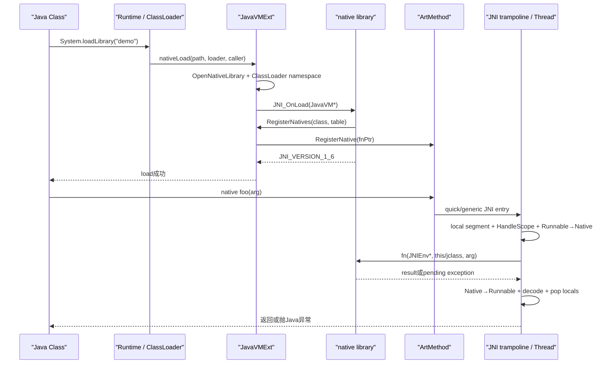
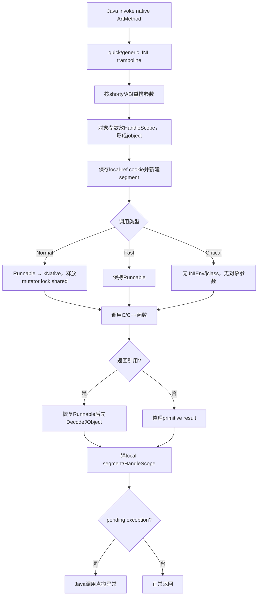
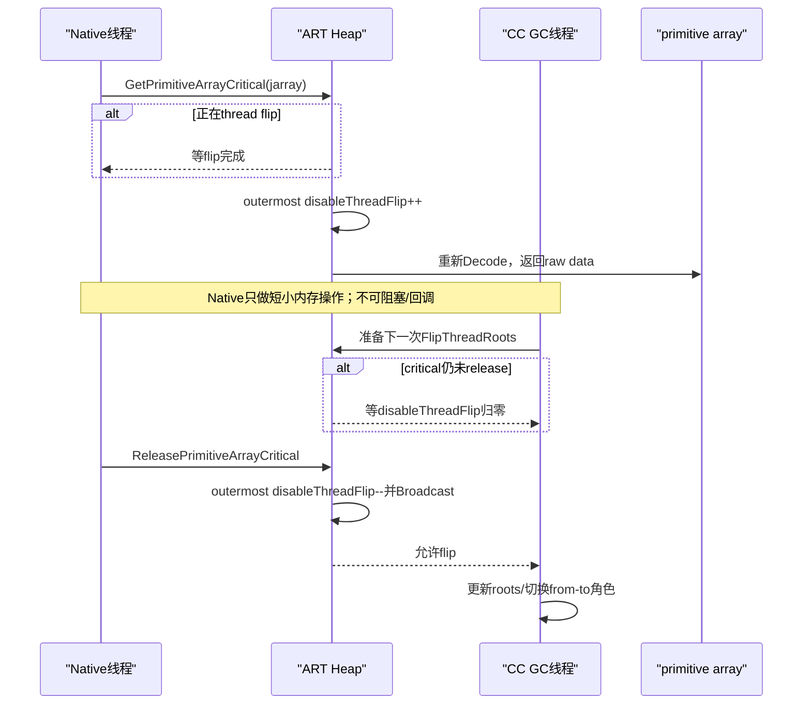

# 第559章 Android ART JNI边界链：注册、JNIEnv、引用、CheckJNI、异常、线程Attach与Critical数组

> 源码基线：AOSP `android-11.0.0_r48`（Android 11 / API 30）  
> 学习目标：从`System.loadLibrary()`追到native library、`JNI_OnLoad`、`RegisterNatives`与ArtMethod入口，理解JNIEnv和三类引用怎样服从moving GC，掌握异常、线程attach/detach、数组/String访问以及Fast/CriticalNative的真实限制。  
> 阅读约定：继续在macOS只读源码，不实际编译、不运行so；正文讲r48 ART实现，JNI规范通用结论与ART特有实现会明确分开。

## 1. 本章先拆掉一句最危险的误解

“JNI就是把Java对象地址传给C++，native方法拿到`jobject`后随便保存；反正Java与C++在同一进程。”

同一进程不等于同一对象模型。`jobject`通常是可由ART解码、更新和校验的间接引用，不是可长期解引用的`mirror::Object*`；普通native调用期间线程从Runnable转成Native，使GC能移动对象；局部引用随native frame批量失效；native创建的线程没有attach就连合法`JNIEnv*`都没有。

## 2. 一句话主线

ClassLoader把so加载进对应native namespace，ART调用`JNI_OnLoad`并可用`RegisterNatives`把Java native方法的`ArtMethod`绑定函数地址；调用时JNI trampoline建立HandleScope与local-ref segment、按ABI转换参数、让普通native线程退出Runnable；native只能通过当前线程JNIEnv操作local/global/weak handles，处理好pending exception、copy/pin和release；返回时ART恢复Runnable、解码结果并一次性弹出局部引用。

## 3. 与第558章怎样衔接

第558章说明moving GC会重写roots，裸对象指针跨挂起点会过期。JNI就是把这套规则暴露给C/C++的边界协议：local/global引用进入可扫描root表，weak global由GC专门清理，Critical数组则暂时阻止移动或CC thread flip。

本章回答“native代码怎样不破坏GC不变量”，而不是教授CMake/NDK构建。

## 4. 先分清五类值

- `JavaVM*`：进程级VM invocation接口，可跨线程保存，用于attach/GetEnv。
- `JNIEnv*`：线程级JNI函数表与扩展状态，只属于取得它的那个线程。
- `jobject/jclass/jstring/jarray`：managed对象的引用句柄，有local/global/weak生命周期。
- `jmethodID/jfieldID`：方法/字段标识，不是对象引用。
- native pointer：C/C++地址，ART不会自动知道其所有权或扫描内部引用。

把五类都强转成`void*`虽然C++编译器可能接受，却会抹掉最重要的生命周期边界。

## 5. 这条链的关键对象

Java `Runtime`选择so路径与ClassLoader；`JavaVMExt`管理已加载library、global/weak table和invocation接口；`JNIEnvExt`绑定Thread、local IRT和CheckJNI函数表；`ArtMethod`保存native entrypoint；`IndirectReferenceTable`编码引用kind/index/serial；quick JNI trampoline完成ABI和线程状态转换。

ClassLinker、Heap和ThreadList仍在幕后参与类解析、GC root访问和attach注册。

## 6. 一次native调用至少有八个完成点

1. so被native loader成功打开；
2. `JNI_OnLoad`成功返回受支持JNI版本；
3. Java native声明与函数地址完成绑定；
4. 调用trampoline建立本次local segment/HandleScope；
5. 普通native线程进入kNative；
6. C/C++函数返回值或pending exception就绪；
7. ART恢复Runnable并解码引用返回值；
8. local segment弹出，Java调用者继续。

`System.loadLibrary()`成功只证明前两项及OnLoad内同步完成的注册，不能证明某个将来动态查找的方法已经被执行。

## 7. 第一幅图：so加载、注册与首次调用



若不显式注册，ArtMethod起初指向dlsym stub，第一次调用时才按JNI短名/长名查符号并缓存；图中的注册阶段就会延后到首次调用。

## 8. Java `native`声明没有实现体

ClassLinker加载方法时只看到access flags、名称与descriptor；`native`表示执行体来自runtime绑定的函数地址。静态native的C ABI通常多一个`jclass`，实例native多一个`jobject this`，两者前面都有`JNIEnv*`；CriticalNative是后文例外。

Java签名与C函数参数宽度、顺序不匹配是未定义行为，可能直接破坏寄存器/栈，而不是优雅抛`ClassCastException`。

## 9. 第一段真实Java源码：`System.loadLibrary()`保留调用者ClassLoader

```java
// libcore/ojluni/src/main/java/java/lang/System.java
@CallerSensitive
public static void loadLibrary(String libname) {
    Runtime.getRuntime().loadLibrary0(Reflection.getCallerClass(), libname);
}
```

`@CallerSensitive`让Runtime获得真实调用Class；`loadLibrary0`再使用该Class的ClassLoader解析库。它不是简单对进程全局执行`dlopen("libdemo.so")`。

## 10. 名称先经过ClassLoader解析

对应用常用的PathClassLoader/DelegateLastClassLoader，Runtime让loader的`findLibrary()`返回具体文件；若返回null再形成“couldn't find libxxx.so”。boot/system调用路径才会从`java.library.path`映射名称。

Android native loader还会结合targetSdk、caller location和ClassLoader的native library search path选择linker namespace。

## 11. `nativeLoad()`返回的是错误字符串

Java Runtime的nativeLoad成功返回null，失败返回说明文本，Java层再构造`UnsatisfiedLinkError`。所以native loader内部false、Java nativeLoad返回非null、Java抛ULE是三个连续完成点。

排查要保存ULE完整message，里面常含namespace、ABI、依赖so或符号错误。

## 12. 同一路径与ClassLoader绑定

`JavaVMExt::LoadNativeLibrary()`先查已加载表：同一路径、同ClassLoader allocator且先前OnLoad成功，直接复用；同一路径已被另一个ClassLoader关联则拒绝，JNI规范不允许同一个native library同时加载到多个loader。

r48比较ClassLoader allocator地址，避免为了比较而反复解码weak loader引用。

## 13. `dlopen`并不是链路终点

`OpenNativeLibrary()`成功后，ART先把`SharedLibrary`记录加入表，再查找`JNI_OnLoad`。没有这个符号也可视为成功；存在时必须返回受支持版本，返回JNI_ERR或错误版本会让加载失败。

依赖so解析仍由dynamic linker完成，可能受namespace和可见库限制。

## 14. `JNI_OnLoad`为什么拿`JavaVM*`

OnLoad不是某个Java native方法调用，没有业务`this`/jclass参数。它拿进程级JavaVM，可对当前已attach线程调用`GetEnv`取得JNIEnv，再查Class和注册方法。

不要把当前`JNIEnv*`缓存给别的线程；若确需全局保存，保存JavaVM并让每个线程自行GetEnv/Attach。

## 15. OnLoad期间`FindClass`的ClassLoader修正

栈顶看起来是`Runtime.nativeLoad`，按普通规则会选错误loader。LoadNativeLibrary在调用OnLoad前临时把请求的ClassLoader放入Thread override；`GetClassLoader()`检测当前方法为Runtime.nativeLoad便使用override。

OnLoad返回后恢复旧override。这个窗口解释了为何OnLoad里的`FindClass("com/demo/Foo")`通常能找到加载该so的应用类。

## 16. OnLoad返回版本不是装饰

`JNI_VERSION_1_6`等值声明库所需JNI接口版本。r48用`IsBadJniVersion()`校验；错误值不会被当成“默认1.6”，而会记录错误并使加载失败。

`GetVersion()`在r48 JNI实现返回1.6，但OnLoad仍必须返回合法常量。

## 17. OnLoad失败留下什么

源码明确说失败后不宜立即`dlclose()`：OnLoad可能已经部分注册方法或产生其他可访问状态。library会被标成bad，后续同loader加载尝试继续失败。

这不是事务回滚。OnLoad应先验证前置条件，再以可清理顺序建立全局资源，避免半初始化。

## 18. 两种方法绑定方式

显式注册用`JNINativeMethod{name, signature, fnPtr}`数组交给`RegisterNatives`；动态绑定则导出`Java_pkg_Class_method`或带参数编码的长符号名，让首次调用dlsym查找。

AOSP平台库普遍偏好显式表：函数可保持内部符号名、重构更可控，也能注册CriticalNative。

## 19. `RegisterNatives`先做输入校验

负method_count触发JniAbort；0会警告但返回JNI_OK；class、methods数组、每项name/signature/fnPtr都必须非null。函数先把jclass解码成Handle，确保后续查找或异常分配发生GC时Class仍安全。

返回JNI_ERR时还可能有pending Java异常，调用者不能只看整数而忽略ExceptionCheck。

## 20. 查找键是“名称 + descriptor”

descriptor如`(JLjava/lang/String;)Z`精确区分重载；`FindMethod<true>`优先只查native方法，再查所有方法以便给“匹配但非native”更明确错误。

漏写`;`、把Java `long`写成`I`或混用数组descriptor，都会变成NoSuchMethodError/注册失败。

## 21. r48还会沿父类向上找

RegisterNatives从传入Class先查direct/virtual方法，未命中才到superclass。CheckJNI打开时，一旦需要去parent会警告“method not in the given class”，因为这种注册慢且传错Class的概率高。

能注册成功不代表这是好写法；应把表注册到实际声明Class。

## 22. 匹配到非native方法仍拒绝

第二轮查所有方法只用于诊断；若找到的ArtMethod没有native flag，ART抛NoSuchMethodError并返回JNI_ERR，不能把任意Java方法热改成native。

同理，`UnregisterNatives`是恢复native方法的查找stub，不是把Java方法变回有DEX实现。

## 23. 绑定最终落到`ArtMethod`

每个合法表项调用`m->RegisterNative(fnPtr)`，更新native entry/quick入口所用地址。随后所有线程调用同一ArtMethod都会进入新函数；这是进程内运行时状态，不回写DEX/OAT文件。

一次RegisterNatives数组中前几项成功、后面失败时没有自动回滚前几项的循环逻辑，因此也应避免把它想成原子批事务。

## 24. `!bang JNI`在r48已经降级

历史表项可在signature前加`!`表示fast JNI。r48识别后警告已废弃，将`is_fast`重新置false，要求迁移到`@FastNative`；它不会因为旧前缀继续获得fast语义。

读取老AOSP代码时必须看这段降级逻辑，不能只看早期注释。

## 25. 动态绑定何时发生

未注册native方法的entrypoint指向JNI dlsym stub。首次调用的`artFindNativeMethod`取得当前ArtMethod，由JavaVMExt在合适ClassLoader的libraries中查符号；找到后`RegisterNative`缓存地址，未来调用不再dlsym。

因此loadLibrary成功时，拼错的动态符号可一直潜伏到该方法第一次执行。

## 26. JNI短名与长名

ART先试短名，如`Java_com_demo_Foo_bar`；再试带`__参数编码`的长名，用于重载。下划线、分号、数组等字符按JNI mangling转义，不是简单把`.`换`_`。

r48测试给出的例子包括`Java_java_lang_String_charAt__I`，可用来核对编码器，而不应手凭印象拼复杂名称。

## 27. dlsym只搜匹配ClassLoader的库

Libraries遍历已加载so时比较`SharedLibrary::GetClassLoaderAllocator()`与声明方法Class的loader allocator，不匹配就跳过。这避免另一个动态模块的同名导出函数意外接管当前类。

随后才在TI agent libraries查短名/长名。

## 28. 动态查找会暂时进入Native状态

dlsym可能因其他线程dlopen而长时间阻塞，`FindNativeMethod`用`ScopedThreadSuspension(kNative)`释放mutator lock，再执行查找；回到Runnable后才安全访问managed元数据并注册地址。

这也是Class必须通过ArtMethod/Handle等稳定结构持有的原因。

## 29. 查找失败如何表现

JavaVMExt把PrettyMethod、尝试过的short/long name写进detail，`FindCodeForNativeMethod`设置`UnsatisfiedLinkError`。stub返回null时线程必须已有pending exception。

“No implementation found”优先查符号名、ABI、visibility、ClassLoader关联库以及方法descriptor，不要先怀疑GC。

## 30. Native Bridge是另一层适配

库若需Native Bridge，FindSymbol还传方法shorty协助架构/ABI桥接。它解决目标指令集适配，不改变JNI引用、异常和线程attach规则。

是否通过bridge由OpenNativeLibrary结果记录在SharedLibrary中，而不是每次Java调用重新决定。

## 31. 第二幅图：一次普通JNI调用内部发生什么



CriticalNative没有对象参数，因而不建普通JNI local/Handle参数框架；FastNative仍可接JNIEnv和对象，只是保持Runnable，风险完全不同。

## 32. `ArtMethod`入口可能是stub也可能是编译JNI桥

若OAT已生成专用JNI stub，参数搬运与frame布局可由编译代码完成；否则quick generic trampoline根据ArtMethod shorty计算frame、建立HandleScope并调用目标。

两条路径最终遵守相同local segment、thread state、exception/result协议，性能不同不改变正确性。

## 33. 为什么对象参数先变Handle

进入普通native后线程不再持有mutator lock，GC可移动实参对象。trampoline在managed stack上建立HandleScope，传给C函数的是可被GC更新的jobject表示；native每次JNI调用再解码当前对象。

保存解码后的`mirror::Object*`跨越可能挂起或JNI调用，仍然错误。

## 34. 普通JNI函数签名的隐藏参数

实例方法通常形如`Return fn(JNIEnv* env, jobject thiz, ...)`；静态方法为`Return fn(JNIEnv* env, jclass clazz, ...)`。Java参数从第三个C参数开始。

`jboolean`、`jchar`、`jlong`等JNI typedef与C++ `bool/char/long`不总同宽，必须使用JNI类型。

## 35. `jclass`也是对象引用

静态native的jclass指向声明Class的Java mirror，属于本次调用local引用语义。若要在返回后缓存Class，必须`NewGlobalRef`，不能把jclass原值存进static C变量。

Class global又会保住ClassLoader及其类图，动态模块需要卸载时尤其要删除。

## 36. `JNIEnv*`只属于当前线程

`JNIEnvExt`内部直接保存`Thread* const self_`、该线程local IRT、monitor记录与critical计数。CheckJNI会比较当前Thread与env对应Thread，跨线程复用会报错/终止。

正确跨线程模式是缓存JavaVM；目标线程先`GetEnv`，若返回JNI_EDETACHED再Attach。

## 37. `jobject`不是C++对象指针

IRT注释明说IndirectRef不是valid object pointer，它编码表索引、2-bit kind和serial；HandleScope形式也由ART识别。只能交给JNI API或按规范比较，不能`reinterpret_cast<MyObject*>`后访问字段。

对象移动时GC更新表slot/Handle，jobject数值本身可继续解码到新地址。

## 38. Local reference的生命周期

Java→native每次调用自动创建一个local segment，参数和JNI返回的对象通常是local refs；native返回时整个segment批量弹出。它们强可达，能保护对象不被GC回收。

“local”指调用frame/线程局部，不是C++花括号作用域；离开一个内层`{}`不会自动DeleteLocalRef，除非用了RAII包装。

## 39. native调用本身就是一个segment

`JniMethodStart`保存旧local_ref_cookie，再把当前IRT top作为新segment底；End恢复segment state并弹HandleScope。删除local只允许作用在当前有效segment，防止跨frame误删。

这使一次native调用遗留的local refs能O(1)式批量丢弃，而不必逐个遍历C++变量。

## 40. 局部引用也会在长循环里耗尽

虽然方法返回会自动清理，但一个native函数内循环创建成千上万临时String/Class而不DeleteLocalRef，IRT会持续增长，增加root扫描和容量压力。

每轮用`ScopedLocalRef`/DeleteLocalRef，或用PushLocalFrame/PopLocalFrame分批清理。

## 41. `PushLocalFrame(capacity)`做什么

ART先`EnsureLocalCapacityInternal`确认本frame至少能再容纳capacity，再把当前segment state压入`stacked_local_ref_cookies_`并开启子segment。负capacity返回JNI_ERR并产生诊断。

capacity是最低保证，不是给数组预分配Java对象；Push成功后仍可能因Java对象分配本身OOME。

## 42. `PopLocalFrame(result)`保留一个幸存者

实现先把result解码成managed对象，再Pop子frame，最后在父segment为该对象建立新local ref。顺序很关键：若先Pop再解码，传入的result handle已经失效。

传null就只清理子frame。返回的新jobject和旧数值不必相同。

## 43. `EnsureLocalCapacity`不创建新frame

它只保证当前segment可再创建指定数量local refs，不提供批量回收边界。要让循环中的整批refs一次失效，仍需Push/Pop。

JNI默认还保证进入native时至少有规范要求的少量local容量；r48 JNIEnvExt初始表大小512是实现初值，不是应用可依赖的固定上限。

## 44. IRT为什么不用对象地址当handle

moving GC会改变地址；表slot可由GC更新。IRT还要快速判定local/global/weak kind、验证删除是否属于当前segment并识别use-after-delete，这些都不是裸指针能可靠完成的。

r48选择可扩容的表与holes复用，在常见append/pop路径保持低成本。

## 45. IndirectRef低两位表示kind

枚举把0保留给HandleScope/invalid，1为local，2为global，3为weak global，与JNI `jobjectRefType`方便对应。剩余位编码index和serial。

这只是ART实现细节；native代码不得用位运算自行判断引用类型，应调用`GetObjectRefType`。

## 46. serial怎样抓陈旧引用

slot删除后将来可被另一个对象复用。IRT在handle和entry中保存轮换serial；旧handle的serial与新entry不符时，CheckJNI/解码能发现stale reference。

serial数量有限，不是密码学世代号，但比只比较对象bit更能捕获常见delete后继续用错误。

## 47. `DeleteLocalRef`不是把对象删除

它只移除一条local root；对象若仍被Java字段、其他local/global或栈引用，继续存活。反之，删掉最后一条强root也只是允许未来GC回收，不会同步执行析构。

删除后继续把该jobject传给JNI属于use-after-delete，哪怕本次还没GC也不合法。

## 48. `IsSameObject`才是引用身份比较

同一managed对象可同时有多个local/global handle，数值不相等；weak被清也有特殊表示。JNI规范提供`IsSameObject(a,b)`比较解码对象身份，包括与null检查weak是否已清。

直接`a == b`只能比较handle bit，不是可靠对象身份判断。

## 49. Global reference是进程级强root

`NewGlobalRef`先解码输入，再在JavaVMExt `globals_` IRT添加条目；GC的`VisitRoots`把整表作为`kRootJNIGlobal`扫描。任何attached线程都可使用global handle。

这解决跨调用/跨线程生命周期，不代表访问global table无需ART内部锁；JNI函数替你处理同步。

## 50. Global ref泄漏会保住整张图

忘记`DeleteGlobalRef`不仅消耗表slot，还可能通过Activity、Class或ClassLoader保住大量Java对象。ART在global表接近耗尽时甚至会开启allocation tracking，牺牲性能换取终止诊断。

建议用RAII所有权封装并明确“谁创建、谁删除、在哪个VM存活期删除”。

## 51. Weak global不保活对象

`NewWeakGlobalRef`加入独立weak table。GC强标记后若对象未存活，`SweepJniWeakGlobals`把slot写为runtime的cleared weak sentinel，而不是把table hole直接删除，以区分“有效但已清”与“无条目”。

调用者仍须`DeleteWeakGlobalRef`释放句柄本身。

## 52. weak global不能先判再裸用

线程做`IsSameObject(weak,null)`后，GC可能立刻清对象；随后再使用原weak形成TOCTOU竞态。安全做法是`NewLocalRef(weak)`：ART原子语义下解码，已清则返回null，成功则新local强保活到segment结束。

这和Java `WeakReference.get()`返回一个临时强引用的思路相同。

## 53. CMS与CC访问weak的协调不同

无read barrier的CMS在并发reference processing时可能暂时禁止新weak/global decode，调用线程在condition variable等待；CC依赖per-thread weak-ref access flag与to-space invariant，通过checkpoint协调。

所以`NewWeakGlobalRef`在极端时刻也可能阻塞，不能当绝对无等待原语。

## 54. local/global是强root，weak不是普通root

IRT头注释明确：strong local/global属于GC root set；weak global不在普通强root访问中，由collector自身sweep并修改。JavaVMExt::VisitRoots只遍历globals，旁边注释指出weak由GC访问。

这解释了为何三类引用不能只按“作用域长短”理解，强弱语义同样重要。

## 55. `jmethodID/jfieldID`不是jobject

它们标识ArtMethod/ArtField，用于Call/Get/Set API，不需要NewGlobalRef，也不能DeleteLocalRef。r48可将ID表示为直接pointer、indices或可切换pointer，是否间接由JniIdType决定。

应用必须把ID当opaque token；依赖其数值是错误的。

## 56. ID通常可以缓存，但要看Class生命周期

GetMethodID/GetFieldID会解析name+descriptor，结果可跨调用/线程复用，常放native static。JNI规范层面它们在定义Class卸载前有效；动态ClassLoader真正卸载后，旧ID不能继续使用。

若同时缓存jclass，jclass必须变成global；这也会阻止Class卸载，形成明确权衡。

## 57. GetMethodID也可能初始化Class或抛异常

查static/instance ID会访问Class元数据，名称/签名错误产生NoSuchMethodError等pending exception。返回null后不能继续Call；先检查异常并按API契约清理。

method ID仅选择方法元数据，虚调用是否动态分派还由`Call<Type>Method`与`CallNonvirtual<Type>Method`的API类别决定。

## 58. `FindClass`使用哪个ClassLoader

在Java→native调用内，ART取当前native ArtMethod的声明ClassLoader；在Runtime.nativeLoad/OnLoad窗口用override；没有current method的attached native线程先尝试system ClassLoader，再退boot path。

这比“JNI FindClass永远用系统ClassLoader”准确，也解释了native工作线程上偶现ClassNotFound：它缺少应用方法调用上下文。

## 59. 第二段真实Java源码：MessageQueue声明展示static与instance native

```java
// frameworks/base/core/java/android/os/MessageQueue.java
private native static long nativeInit();
private native static void nativeDestroy(long ptr);
private native void nativePollOnce(long ptr, int timeoutMillis); /*non-static for callbacks*/
private native static void nativeWake(long ptr);
private native static boolean nativeIsPolling(long ptr);
private native static void nativeSetFileDescriptorEvents(long ptr, int fd, int events);
```

`nativePollOnce`故意是实例方法，以便native poll期间回调同一个MessageQueue；其他函数只需显式`long ptr`即可static。这个long是native MessageQueue地址/句柄，不是Java对象引用，也不会被GC扫描。

## 60. `long nativePtr`必须单独管理所有权

Java字段保存native地址时要定义创建、并发访问、destroy、重复关闭和finalizer/Cleaner兜底；GC只会移动Java wrapper，不会自动free该地址。native回调前还要防止Java对象已close导致use-after-free。

第558章的NativeAllocationRegistry可帮绑定Cleaner与内存压力记账，但不替代线程安全状态机。

## 61. JNI上调Java方法的三步

先获得目标Class/对象强引用，再GetMethodID/GetStaticMethodID，最后选择匹配返回类型和dispatch语义的Call方法。每一步都可能设置pending exception；成功Call也可能因Java实现抛异常而返回默认C值。

调用后必须先ExceptionCheck，不能把0/null直接解释成业务结果。

## 62. descriptor比Java源码类型更底层

基本类型用Z/B/C/S/I/J/F/D/V，对象用`Lpkg/Class;`，数组前缀`[`；方法签名为`(参数...)返回`。内部类名使用`$`，包分隔用`/`。

JNI的String API使用Modified UTF-8，descriptor本身也按modified UTF-8名称规则处理；不要用C++ RTTI名代替。

## 63. Virtual、Nonvirtual与Static不能混用

`CallObjectMethod`按接收者实际Class虚分派；`CallNonvirtualObjectMethod`要求显式Class并调用指定实现；`CallStatic...`以jclass和static method ID调用。CheckJNI会验证对象是否为声明Class实例以及ID类别。

ABI碰巧相同也不构成合法用法。

## 64. JNI写对象字段仍会走GC write barrier

SetObjectField解码obj/value并由ArtField设置引用，runtime执行必要write barrier和instrumentation event；native代码不能取得对象内存地址后直接改压缩引用slot，否则card table与并发GC都看不到新边。

primitive字段不需要引用barrier，但仍须使用正确field ID和类型。

## 65. JNI异常是Thread上的pending状态

Java方法通过JNI抛出时，native函数不会像C++ `throw`那样自动跳栈；Call...返回一个占位值，Thread保存pending Throwable。native必须检查并选择：清除并恢复、替换/包装，或立即清理native资源后返回让ART传播。

忽略pending exception后继续调用大多数JNI API，会被CheckJNI判错。

## 66. null返回值与异常必须成对检查

FindClass/GetMethodID/NewObject/NewStringUTF等返回null可能表示Java null、查找失败或OOME。只有`ExceptionCheck()`能区分是否有pending exception；不能看到null就盲目ThrowNew，覆盖原始根因。

反之，某些函数返回非null前也可能因回调留下异常，按具体API契约核对。

## 67. pending exception期间只允许有限操作

CheckJNI的默认规则是有pending exception就拒绝调用；ExceptionOccurred/Describe/Clear/Check，以及Delete refs、Release数组/String、MonitorExit等标了`kFlag_ExcepOkay`的清理函数例外。

因此错误处理顺序应是“保存/检查异常→释放native与JNI资源→返回或明确Clear”，而不是继续正常业务JNI调用。

## 68. `Throw`与`ThrowNew`

`Throw(jthrowable)`把已有Throwable设为Thread exception；`ThrowNew(jclass,msg)`创建指定异常。返回JNI_OK只表示pending状态建立，不会从C函数当前行自动跳走。

设异常后C/C++仍须显式`return`；否则后续误调用会扩大损坏。

## 69. `ExceptionDescribe()`不会在r48永久清掉原异常

实现先用Handle保存old exception、清pending以便调用`printStackTrace()`，处理打印期间的新异常，最后把old exception恢复。它主要用于诊断，不是`ExceptionClear()`替代品。

想消费异常必须明确Clear，并理解这会改变Java调用者可见语义。

## 70. native返回时ART如何处理引用结果

End trampoline先恢复Runnable/mutator lock，再在local segment仍有效时DecodeJObject result；若已有pending exception则不解码可能无效的result。随后Pop locals，CheckJNI可验证返回对象类型，最后交给Java调用者。

所以返回一个已DeleteLocalRef或来自别的线程的jobject，可能在边界才被发现。

## 71. C++异常不能穿过JNI ABI

JNI没有为C++ exception unwinding穿过ART生成frame定义跨语言协议。native库应在边界内catch自己可能抛出的C++异常，转换成Java异常或错误码，并完成RAII清理。

让未捕获C++ exception越过JNI通常导致`std::terminate`/native crash，而不是Java catch。

## 72. native crash绕过Java异常机制

空指针、越界、use-after-free、错误函数签名触发SIGSEGV/SIGABRT，由debuggerd/tombstoned生成native tombstone；它不是pending Throwable，Java `try/catch`救不了进程。

排查需把Java stack、native backtrace、fault address和so build ID合并，而不是只看logcat的最后一个Java异常。

## 73. `GetStringUTFChars`总是Modified UTF-8副本

r48先算UTF字节数、分配`char[bytes+1]`、转换并补NUL，`is_copy`设JNI_TRUE；Release直接`delete[]`。Modified UTF-8对U+0000和supplementary字符的编码与标准UTF-8不同。

不能把返回指针保存在Release之后，也不能用标准UTF-8长度函数推断Java String的UTF-16 length。

## 74. `GetStringChars`可能copy也可能direct

若String可移动或采用压缩Latin-1表示，r48分配jchar副本；非压缩且non-moving时可直接返回内部UTF-16 data。Release根据压缩状态与指针是否等于内部value决定delete。

调用者必须无条件配对Release，不能因某次`isCopy==JNI_FALSE`就永久缓存。

## 75. 普通PrimitiveArrayElements倾向copy可移动数组

r48 `GetPrimitiveArray<T>`检查精确数组类型；若Heap认为对象可移动，分配对齐native副本并memcpy，`is_copy=true`；non-moving数组可直接给data指针。

这避免长时间阻止moving GC，但大数组copy本身有时间和峰值内存成本。

## 76. Release mode的三个语义

mode 0：若是copy则写回并释放；`JNI_COMMIT`：写回但不释放copy/不退出direct critical状态，之后还需再次Release；`JNI_ABORT`：copy不写回并释放。direct pointer没有copy可丢，ABORT不会撤销已直接写入的数组内容。

错误地把COMMIT当最终release会泄漏buffer或长期阻塞GC边界。

## 77. Array Region API何时更简单

只需读写一个范围时，`Get/Set<Type>ArrayRegion`由JNI完成边界检查与copy，不暴露长期元素指针，也没有COMMIT状态。它常比Elements/Critical更容易写对。

是否更快仍取决于数据量和调用次数，先保证生命周期正确再测量。

## 78. `GetPrimitiveArrayCritical`在r48返回direct pointer

实现检查必须是primitive array；若对象可移动，无read barrier collector就递增`disable_moving_gc_count_`并等待当前moving GC，CC则只递增`disable_thread_flip_count_`、必要时等正在运行的flip；重新解码数组后设置`is_copy=false`并返回raw data。

这比“Critical可能总是copy”更贴近r48正常实现；CheckJNI的forcecopy调试层是后文例外。

## 79. CC为何只需阻止thread flip

CC建立to-space invariant后，数组当前地址不会在同一线程未经历下一次flip时悄然变成不可用from-space；critical section阻止新的thread flip边界即可。传统moving collector则要全局禁止moving GC。

Release最外层critical时分别DecrementDisableThreadFlip或DecrementDisableMovingGC。

## 80. Critical可以嵌套，但计数必须完全配对

Thread记录嵌套disable-thread-flip count；只有最外层进入才增加Heap全局计数，最外层退出才唤醒等待flip的GC。CheckJNI也维护`critical_`，多Release或漏Release都会诊断。

嵌套合法不代表适合长时间持有，GC等待由最长外层区间决定。

## 81. Critical区间里禁止做什么

JNI规范要求critical get与release之间不要阻塞，也不要调用任意JNI；CheckJNI把大多数函数标为`kFlag_CritBad`，只允许相应release和少数明确`CritOkay`操作。I/O、锁等待、回调Java或大循环都会放大GC暂停风险。

正确模式是取得指针→极短纯内存处理→立即release。

## 82. CheckJNI forcecopy为何故意改变行为

调试配置可把Critical得到的direct pointer再包装成带red-zone/canary的guarded copy，检测buffer越界和错误release；这时`is_copy`与性能不同于基础实现。

所以打开forcecopy后复现不了某些pinning时序并不奇怪，它是故意扰动实现来暴露bug。

## 83. 第三幅图：Critical数组与GC thread flip互相怎样等待



无read barrier的moving collector把图中的thread flip计数替换为disable moving GC计数，保护范围更大。

## 84. Normal native为什么更适合阻塞工作

普通JNI在入口`TransitionFromRunnableToSuspended(kNative)`，不再持mutator lock shared。它在文件I/O、系统调用或native mutex上阻塞时，GC无需等该线程到Java safepoint；Handle/local table仍让对象参数可更新。

需要访问managed对象时，JNI API内部用`ScopedObjectAccess`短暂回Runnable，操作完成再回Native。

## 85. `@FastNative`省掉什么

FastNative入口只push local segment，不做Runnable→Native转换；返回前若Thread flags表明有suspend/checkpoint请求，`GoToRunnableFast`执行CheckSuspend。它仍接收JNIEnv、可有对象参数/返回值并能调用JNI。

节省状态转换成本的代价是执行期间GC认为线程仍Runnable；长阻塞会拖住SuspendAll。

## 86. 第三段真实Java源码：CriticalNative与FastNative声明差异

```java
// libcore/libart/src/main/java/dalvik/system/VMRuntime.java
@CriticalNative
public static native void doNotInitializeInAot();

@libcore.api.CorePlatformApi
@FastNative
public static native boolean hasBootImageSpaces();
```

第一项是static、无对象参数、void返回，符合CriticalNative约束；第二项虽同样static且返回primitive，却保留普通FastNative ABI，可拿JNIEnv。注解是平台隐藏优化，不应把示例理解成普通App的随意性能开关。

## 87. `@CriticalNative`连JNIEnv和jclass都没有

CriticalNative只允许static、primitive参数和primitive/void返回；native函数签名必须去掉隐式JNIEnv和jclass，直接接Java primitive参数。Verifier发现instance、object参数或object返回会拒绝。

没有JNIEnv意味着它不能分配Java对象、查类、抛Java异常或回调Java；只能做极短的纯native计算/状态操作。

## 88. CriticalNative必须显式注册

注解文档明确要求RegisterNatives，不能依靠内建dynamic JNI linking；trampoline需要在绑定时知道特殊ABI，dlsym短/长符号约定仍假设普通隐藏参数。

如果忘注册，问题不是“第一次稍慢”，而是实现根本无法按正确ABI解析。

## 89. Fast/Critical长时间持锁会造成死锁

注解源码给出典型环：线程1持native锁后回Java并被GC挂起；线程2进入FastNative等待同一锁，但它保持Runnable、GC又等线程2响应挂起，于是闭环。

规则比“通常很快”严格：任何最坏时长无上界、可能I/O或等待外部锁的方法都不要标Fast/Critical。

## 90. synchronized native还有隐式Monitor

普通synchronized JNI入口先对实例this或静态Class执行MonitorEnter，再转Native；返回时先恢复Runnable，保存pending exception，MonitorExit，最后恢复原异常并pop locals。

Fast/Critical与synchronized组合在generic end中被DCHECK为不支持，不能叠加所有“优化”。

## 91. native回调Java会暂时回Runnable

普通native处于kNative，但`CallObjectMethod`等JNI实现创建ScopedObjectAccess，获取mutator lock并进入可访问managed对象的Runnable状态；Java回调返回后再回原native状态。

回调可以触发任意Java代码、GC与异常，因此此前保存的裸managed地址都不再可信。

## 92. 线程attach解决什么

由`pthread_create`、库线程池等native创建的线程不在ART ThreadList，没有JNIEnv、Java peer/local IRT，也不能被GC按managed线程协议扫描。`AttachCurrentThread`创建Thread/JNIEnvExt、注册ThreadList，并通常创建java.lang.Thread peer加入ThreadGroup。

Java `new Thread().start()`创建的线程本来就已由ART attach，不需要native方法再次attach。

## 93. 已attach时再次Attach直接复用

JavaVMExt先检查`Thread::Current()`；非null就把现有`GetJniEnv()`返回并JNI_OK，不重复创建peer，也不会把普通attach改成daemon。

因此通用线程入口可以先GetEnv，detached才Attach；退出时只由真正执行Attach的一层负责Detach，避免误拆Java线程。

## 94. Zygote模式禁止attach新native线程

r48 `AttachCurrentThreadInternal`检测`runtime->IsZygote()`并返回JNI_ERR，避免Zygote在fork前形成多线程状态。Android应用子进程specialize后不再是该限制窗口。

在JNI_OnLoad里擅自启动后台线程还会增加库初始化、fork与卸载复杂度，应尽量延后到应用进程明确生命周期。

## 95. Attach参数还能指定名字与ThreadGroup

`JavaVMAttachArgs`版本必须合法，可带name与group；ART创建peer、设置daemon标志和native优先级，通知ThreadGroup.add。失败创建peer时会记录并清pending异常，再注销新Thread。

Attach返回JNI_ERR时`*p_env`被置null，调用者必须终止JNI路径。

## 96. daemon attach影响VM退出等待

DestroyJavaVM会等待其他non-daemon threads退出；AttachCurrentThreadAsDaemon创建的Thread不阻止这一等待条件。但daemon不等于可以泄漏global refs或跳过Detach，它只改变VM生命周期角色。

Android应用进程通常由系统终止而非主动DestroyJavaVM，所有权规则仍应写完整。

## 97. `GetEnv`不会自动attach

调用线程未attach时，JavaVMExt把输出env设null并返回JNI_EDETACHED；版本不支持则JNI_EVERSION。只有AttachCurrentThread会建立Thread。

这允许库区分“当前是Java/已attach线程”与“需要由自己attach的native线程”。

## 98. Detach有严格前置条件

JavaVM invocation接口在Thread::Current为空时返回JNI_ERR；Runtime::DetachCurrentThread还检查不能仍有managed stack，否则fatal。真正注销会退出持有的JNI monitors、清根/peer、从ThreadList移除并删除Thread/JNIEnvExt。

不能在Java调用进来的native方法内部Detach，因为managed JNI frame还在栈上。

## 99. r48不会替忘记Detach的线程悄悄收尾

pthread TLS destructor第一次发现attached native线程退出，会警告并重新设置TLS，让其他pthread-key destructor有机会调用Detach；若再次析构仍未Detach则LOG(FATAL)。这不是自动detach兜底。

最稳妥是在pthread清理路径显式Detach，并用线程局部标志记录本库是否负责attach。

## 100. Detach后所有local refs和JNIEnv都失效

JNIEnvExt属于被删除Thread，local IRT随之销毁；保存到其他线程或下次重attach继续用都是use-after-free。Global/weak属于JavaVM表，若未Delete则仍存在。

同一pthread稍后可以重attach并获得新的JNIEnv，但不能假定地址或local handles复用。

## 101. attached native线程上的`FindClass`陷阱

没有current ArtMethod时，r48先使用Runtime system ClassLoader；某些应用动态feature/自定义loader的Class不在其路径。可靠方案是在Java调用上下文获取Class并保存global，或把明确ClassLoader/global传给工作线程再调用其loadClass。

不要长期缓存一个local ClassLoader；要global并在模块退出时释放。

## 102. native线程回调也要检查异常

Call...返回后Thread可能pending exception。若线程准备继续native event loop，应把异常转换到明确错误通道并Clear，或记录后终止该任务；带pending exception继续循环会让下一次JNI调用被CheckJNI拒绝。

若回调是Java→native同步链的一部分，通常直接返回让原Java调用者接到异常更自然。

## 103. 线程身份影响ClassLoader和安全上下文

JNI调用发生在当前OS/ART线程，不会自动切主线程；Java callback同样在该native线程执行。Looper、Binder calling identity、StrictMode和ThreadLocal都取当前线程状态。

需要主线程语义时应通过Handler/Executor显式派发，不能因回调对象属于Activity就假设运行在UI线程。

## 104. CheckJNI是什么

JavaVMExt可把所有线程JNIEnv function table切成CheckJNI包装表；每个包装先验证attached thread、env归属、引用kind/有效性、对象/数组/ID类型、pending exception与critical状态，再调用base function，并可trace返回值。

错误通常以`JNI DETECTED ERROR IN APPLICATION`加Java/native栈fatal终止，目标是尽早暴露本会随机崩溃的未定义行为。

## 105. CheckJNI常抓哪些错误

跨线程JNIEnv、stale local ref、把jstring当jarray、错误jmethodID/receiver、坏Modified UTF-8、RegisterNatives空fnPtr、critical期间调用非法JNI、Release指针/模式不匹配、pending exception继续调用、monitor跨frame未释放等。

它还能forcecopy并用buffer red zone检查越界。

## 106. CheckJNI不会证明native代码正确

它看不到任意native pointer所有权、C++容器越界、数据竞争、忘free非JNI内存、错误业务协议；关闭CheckJNI后时序和copy策略也可能变化。还需ASan/HWASan、UBSan、TSan适用场景、heapprofd和tombstone。

CheckJNI应作为边界契约检查器，而不是全套native内存安全证明。

## 107. CheckJNI本身有性能与时序影响

每次JNI调用多做类型解析、锁/trace检查，forcecopy会改变array指针和内存压力。性能基准必须在生产配置测；正确性复现则应同时在CheckJNI/forcecopy下跑。

一个只在关闭CheckJNI时出现的bug，常提示依赖direct pointer或竞态，而不是证明CheckJNI制造了虚假错误。

## 108. native library何时能卸载

SharedLibrary以weak global保存非boot ClassLoader。GC清loader后，`UnloadNativeLibraries()`从表移除对应库，进入kNative后调用`JNI_OnUnload`并删除SharedLibrary；boot loader的null引用不会卸载。

但r48 LoadNativeLibrary注释也指出正常加载没有立即配对dlclose，真正卸载依赖ClassLoader卸载与引用计数条件。

## 109. Global jclass会阻止库卸载闭环

库在OnLoad创建某应用Class的global jclass，Class保住ClassLoader，loader weak永不清，库就无法进入OnUnload；而OnUnload才删除global则形成循环依赖。

动态插件应设计显式shutdown，先停线程/回调、删globals，让loader可达性断开；不能只等OnUnload清所有东西。

## 110. `JNI_OnUnload`的限制

它由ART在卸载路径以JavaVM调用，不能假定原应用对象仍存活；应只释放库级native资源和仍合法的global/注册状态，避免复杂Java回调。多线程仍执行库代码时卸载会危险，需先有上层生命周期栅栏。

进程直接被kill时也不保证OnUnload执行，持久化正确性不能依赖它。

## 111. 阅读JNI源码的固定检查表

先问：库关联哪个ClassLoader/namespace；方法显式还是动态注册；函数ABI是否Normal/Fast/Critical；当前Thread状态与JNIEnv归属；每个jobject是什么kind、活到何时；是否可能GC/回调；pending exception如何处理；数组/String是copy还是direct；release/detach由谁保证；退出点是否成对清理。

把这十问写在code review旁边，比只检查`env != nullptr`有效得多。

## 112. macOS只读练习一：追so加载、OnLoad和动态符号查找

```bash
cd /Users/ninebot/androidSource
rg -n "loadLibrary0|nativeLoad|LoadNativeLibrary|OpenNativeLibrary|JNI_OnLoad|FindCodeForNativeMethod|JniShortName|JniLongName" \
  libcore/ojluni/src/main/java/java/lang/System.java \
  libcore/ojluni/src/main/java/java/lang/Runtime.java \
  art/runtime/jni/java_vm_ext.cc art/runtime/art_method.cc
```

预期：看到调用者Class传入Runtime、library与ClassLoader绑定、OnLoad override，以及dlsym先短名后长名。练习只读，不构建so。

## 113. macOS只读练习二：核对三类引用与IRT编码

```bash
cd /Users/ninebot/androidSource
rg -n "IndirectRefKind|serial_|PushLocalFrame|PopLocalFrame|NewGlobalRef|NewWeakGlobalRef|SweepJniWeakGlobals|VisitJniLocalRoots" \
  art/runtime/indirect_reference_table.h \
  art/runtime/jni/jni_env_ext.h \
  art/runtime/jni/jni_internal.cc \
  art/runtime/jni/java_vm_ext.cc
```

预期：local在JNIEnvExt、global/weak在JavaVMExt；kind占低位，serial抓stale；strong tables由roots访问，weak由GC sweep。

## 114. macOS只读练习三：对比Normal、Fast与Critical入口

```bash
cd /Users/ninebot/androidSource
rg -n "JniMethodStart|TransitionFromRunnableToSuspended|JniMethodFastStart|IsCriticalNative|Skip calling JniMethodStart|CheckSuspend" \
  art/runtime/entrypoints/quick/quick_jni_entrypoints.cc \
  art/runtime/entrypoints/quick/quick_trampoline_entrypoints.cc \
  libcore/dalvik/src/main/java/dalvik/annotation/optimization/FastNative.java \
  libcore/dalvik/src/main/java/dalvik/annotation/optimization/CriticalNative.java
```

预期：Normal转kNative，Fast保持Runnable并在返回检查suspend，Critical跳过普通start且没有对象/hidden JNI参数。

## 115. macOS只读练习四：核对Critical数组和线程attach/detach

```bash
cd /Users/ninebot/androidSource
rg -n "GetPrimitiveArrayCritical|IncrementDisableMovingGC|IncrementDisableThreadFlip|JNI_COMMIT|AttachCurrentThreadInternal|JNI_EDETACHED|DetachCurrentThread|ThreadExitCallback" \
  art/runtime/jni/jni_internal.cc art/runtime/gc/heap.cc \
  art/runtime/jni/java_vm_ext.cc art/runtime/runtime.cc art/runtime/thread.cc
```

预期：r48基础Critical数组返回direct pointer；CC阻止thread flip，非RB moving collector禁移动；未attach的GetEnv返回JNI_EDETACHED，忘Detach最终fatal。

## 116. 本章最容易写错的十二句话

“jobject就是对象地址”“JNIEnv可跨线程”“local离开C++花括号自动失效”“global只占一个小句柄不算泄漏”“weak判非null后可直接长期用”“jmethodID要NewGlobalRef”“loadLibrary成功保证所有动态方法已绑定”“ThrowNew会自动return”“Critical总copy”“FastNative适合I/O”“GetEnv会自动attach”“线程退出ART自动detach”——在r48都不成立。

每句话都能在本章找到对应源码完成点。

## 117. 一条实战诊断顺序

ULE先核so路径/ABI/namespace、OnLoad返回、RegisterNatives descriptor或动态short/long符号；`JNI DETECTED ERROR`直接按首条契约错误修，不追随后崩溃；随机GC相关crash重点查stale local、跨线程env、裸对象地址和critical配对；ClassNotFound重点记FindClass当前method/loader；退出fatal查native线程Detach所有权。

性能问题再分JNI调用频率、copy字节量、FastNative阻塞、critical持有时长与Java回调次数。

## 118. 本章源码地图

- Java加载入口：`java/lang/System.java`、`java/lang/Runtime.java`
- library与JavaVM：`art/runtime/jni/java_vm_ext.cc`
- JNI函数实现：`art/runtime/jni/jni_internal.cc`
- JNIEnv/local状态：`art/runtime/jni/jni_env_ext.*`
- 引用表：`art/runtime/indirect_reference_table.*`
- 调用trampoline：`art/runtime/entrypoints/quick/quick_jni_entrypoints.cc`、`quick_trampoline_entrypoints.cc`
- CheckJNI：`art/runtime/jni/check_jni.cc`
- Thread attach：`art/runtime/runtime.cc`、`thread.cc`、`thread_list.cc`
- Fast/Critical约束：`dalvik/annotation/optimization/*.java`

第一遍按加载→注册→调用→引用→退出顺序读，暂时跳过各架构汇编frame细节。

## 119. 最终心智模型

JNI不是绕过ART，而是ART允许native参与对象世界的受控协议：ClassLoader限定库可见域，ArtMethod绑定ABI入口，trampoline把managed引用变成可更新handle并调整线程状态，JNIEnv把操作归属到当前Thread，local/global/weak表把生命周期交给GC可见账本，异常留在Thread pending槽，array/string API明确copy或暂时阻止移动。

任何“缓存一个地址省一次JNI调用”的优化，都必须先证明它没有越过GC、frame、thread、ClassLoader和资源所有权五条边界。

## 120. 下一章预告

第560章继续ART可观测与调试链：JVMTI agent加载、event callbacks、instrumentation entry/exit、method tracing、JDWP debugger、deoptimization、对象tag与heap walk怎样和JIT/GC建立临界区。

学完下一章，你会理解为何打开调试/trace会替换method entrypoint、关闭某些优化并改变分配与线程时序，以及这些观测结果应怎样解读。
