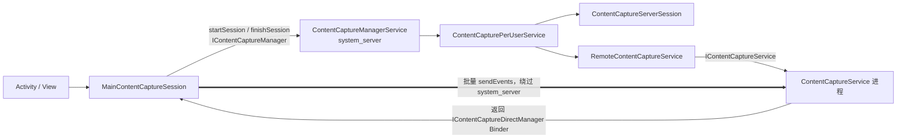
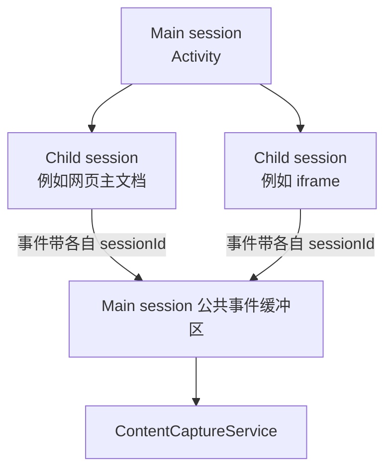
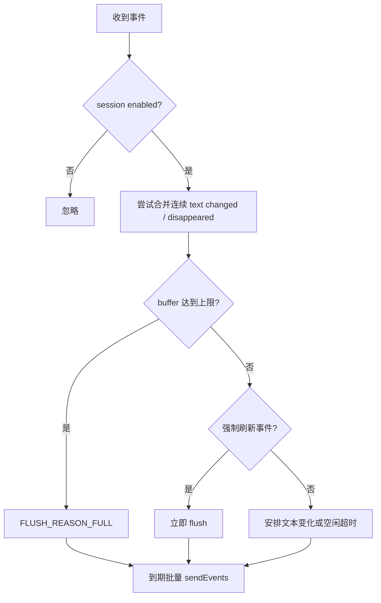
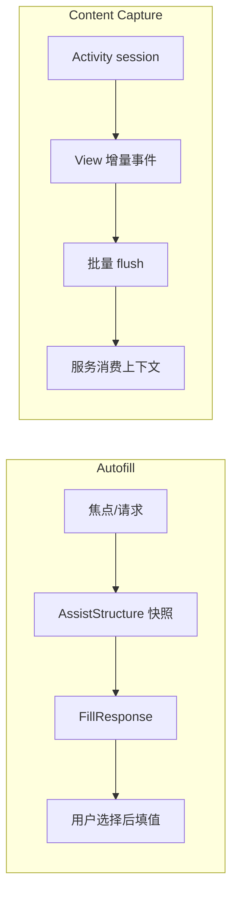
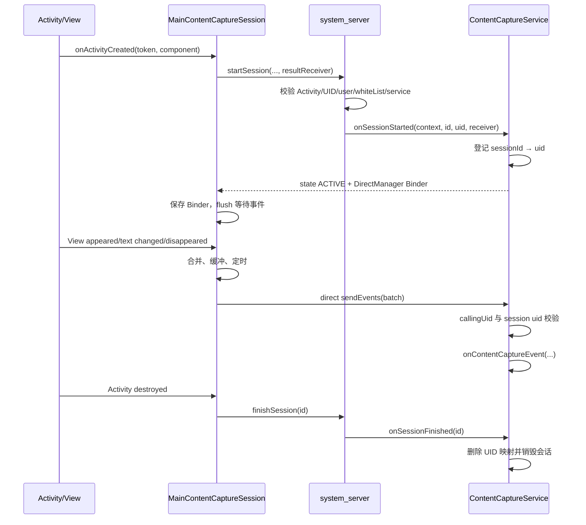

# 56 ContentCaptureManagerService、ContentCaptureService 与页面内容采集

> 源码版本：Android 11 / API 30 / `android-11.0.0_r48`  
> 学习方式：macOS 只读源码，不要求编译。  
> 本章目标：理解 Activity 与 View 如何产生内容捕获事件，系统如何按用户、白名单和窗口安全属性决定是否建立会话，以及事件为何不持续经过 `system_server`，而是通过直连 Binder 批量送给 `ContentCaptureService`。

---

## 1. Content Capture 到底是什么

Content Capture 是 Android 提供给受信任系统服务的一套“页面语义变化流”。它可以告诉服务：

- 某个 Activity 会话开始、恢复、暂停或结束；
- 某个重要 View 出现或消失；
- 某个文本 View 的内容发生变化；
- 页面上下文或 `LocusId` 发生变化；
- 一批 View 树即将发送或已经发送完成。

服务可以利用这些结构化事件为设备上的辅助能力建立上下文，例如智能建议或内容组织。它并不是普通应用都可以注册的全局监听器。

一句话理解：**Content Capture 传递的是经过筛选的 View 语义事件，不是屏幕像素，也不是任意应用可读取的实时 View 对象。**

---

## 2. 先和四个相似机制分开

| 机制 | 主要目的 | 主要数据 | 触发/接收方 |
|---|---|---|---|
| Content Capture | 持续理解页面语义变化 | ViewNode、文本变化、会话事件 | 受信任 ContentCaptureService |
| Autofill | 用户输入字段的填充与保存 | AssistStructure、AutofillId/Value | 用户选择的 AutofillService |
| Accessibility | 辅助用户理解和操作界面 | AccessibilityNodeInfo、事件、动作 | 启用的 AccessibilityService |
| 屏幕截图/录屏 | 捕获视觉输出 | 像素 Buffer | 系统截图或 MediaProjection |
| Assist | 某个时刻获取页面快照 | AssistStructure、AssistContent | Assistant/系统 |

最容易出现的误解：Content Capture 虽然复用了 `AutofillId`、`ViewStructure`/`ViewNode` 等基础设施，但它不是 Autofill 的“另一种保存密码接口”。

```text
Autofill：围绕一次填充/保存请求建立受控快照
Content Capture：围绕 Activity 生命周期持续发送增量事件
```

---

## 3. 整体架构：控制面与事件数据面



这张图有两个方向：

1. 控制面：应用 → system_server → 服务，用于会话建立、资格检查、服务绑定、结束和管理；
2. 高频数据面：应用 → ContentCaptureService，用于发送批量 `ContentCaptureEvent`。

系统不是完全退出链路。它先验证 Activity、UID、用户、服务启用状态与白名单，再由可信服务返回一根直连 Binder；服务收到直连事件时还会用会话登记的 UID 再验证调用者。

---

## 4. 核心源码地图

### 4.1 应用与 View 侧

```text
frameworks/base/core/java/android/app/Activity.java
frameworks/base/core/java/android/view/View.java
frameworks/base/core/java/android/view/ViewGroup.java
frameworks/base/core/java/android/view/ViewRootImpl.java
frameworks/base/core/java/android/content/ContentCaptureOptions.java
```

### 4.2 客户端会话

```text
frameworks/base/core/java/android/view/contentcapture/ContentCaptureManager.java
frameworks/base/core/java/android/view/contentcapture/ContentCaptureSession.java
frameworks/base/core/java/android/view/contentcapture/MainContentCaptureSession.java
frameworks/base/core/java/android/view/contentcapture/ChildContentCaptureSession.java
frameworks/base/core/java/android/view/contentcapture/ContentCaptureContext.java
frameworks/base/core/java/android/view/contentcapture/ContentCaptureEvent.java
frameworks/base/core/java/android/view/contentcapture/ViewNode.java
frameworks/base/core/java/android/view/contentcapture/IContentCaptureManager.aidl
frameworks/base/core/java/android/view/contentcapture/IContentCaptureDirectManager.aidl
```

### 4.3 system_server

```text
frameworks/base/services/contentcapture/java/com/android/server/contentcapture/
    ContentCaptureManagerService.java
    ContentCapturePerUserService.java
    ContentCaptureServerSession.java
    RemoteContentCaptureService.java
    ContentCaptureMetricsLogger.java
```

### 4.4 远端服务 API

```text
frameworks/base/core/java/android/service/contentcapture/ContentCaptureService.java
frameworks/base/core/java/android/service/contentcapture/IContentCaptureService.aidl
frameworks/base/core/java/android/service/contentcapture/IContentCaptureServiceCallback.aidl
frameworks/base/core/java/android/service/contentcapture/ContentCaptureServiceInfo.java
```

---

## 5. 三种 Session 不要混淆

| 对象 | 所在进程 | 作用 |
|---|---|---|
| `MainContentCaptureSession` | 目标应用 | 收集、合并、缓冲、刷新事件，保存直连 Binder |
| `ChildContentCaptureSession` | 目标应用 | 为页面子区域建立独立语境，最终仍委托 main session 发送 |
| `ContentCaptureServerSession` | system_server | 记录 Activity token、组件、UID、task/display、远端服务关系 |

远端服务收到的 `ContentCaptureSessionId` 是对整数 session id 的公开包装。它代表逻辑会话，不等于 Binder 连接，也不等于 Activity token。



Child session 让服务知道不同页面区域的上下文和父子关系，但不会为每个 child 再建立一根独立 Binder。

---

## 6. Activity 生命周期如何启动主会话

`Activity` 在生命周期内部调用 `notifyContentCaptureManagerIfNeeded()`：

```text
CONTENT_CAPTURE_START  → ContentCaptureManager.onActivityCreated(token, component)
CONTENT_CAPTURE_RESUME → onActivityResumed()
CONTENT_CAPTURE_PAUSE  → onActivityPaused()
CONTENT_CAPTURE_STOP   → onActivityDestroyed()
```

START 时还会读取 Window attributes，因为窗口可能通过安全 flag 禁止捕获。

主会话的 `start()` 简化后是：

```java
if (!isContentCaptureEnabled()) return;
mState = STATE_WAITING_FOR_SERVER;
mApplicationToken = token;
mComponentName = component;
mSystemServerInterface.startSession(
        mApplicationToken, component, mId, flags, mSessionStateReceiver);
```

此时会话只进入 `STATE_WAITING_FOR_SERVER`，还不能说 Content Capture 已经激活。真正激活必须等 system_server 和远端服务通过 `IResultReceiver` 返回状态与直连 Binder。

---

## 7. startSession 在 system_server 做哪些检查

`ContentCaptureManagerServiceStub.startSession()` 根据 Binder 调用身份取得 user/uid，并进一步取得 Activity 的真实展示信息。随后 `ContentCapturePerUserService.startSessionLocked()` 检查：

1. Activity presentation info 是否存在；
2. 当前 per-user 服务是否启用；
3. 是否解析到目标 `ContentCaptureService`；
4. 包或 Activity 是否在白名单；
5. session id 是否重复；
6. 远端服务是否建立并可绑定；
7. 调用 UID、Activity token、组件关系是否合法。

失败不是一个统一 boolean，而会返回带原因的 session state，例如：

```text
STATE_DISABLED | STATE_NO_SERVICE
STATE_DISABLED | STATE_NOT_WHITELISTED
STATE_DISABLED | STATE_DUPLICATED_ID
STATE_DISABLED | STATE_INTERNAL_ERROR
```

这非常重要：应用中能取得 `ContentCaptureManager`，不代表当前 Activity 一定会被采集。

---

## 8. 白名单是必要条件，不是“应用自己授权自己”

Android 11 的远端 `ContentCaptureService` 可以通过回调设置捕获白名单：

```java
setContentCaptureWhitelist(packages, activities);
```

system_server 保存 per-user 的全局捕获选项。启动会话时判断：

```text
package 在白名单
OR
具体 ComponentName 在白名单
```

只有满足条件才创建 server session。

这意味着：

- 目标 App 不能单方面宣布“请把我所有页面发给任意服务”；
- 服务也不能通过普通公开 Binder 绕过 system_server 随便订阅；
- 白名单可以细到 Activity，也可以覆盖整个包；
- 白名单变更后，已有会话可能需要重新评估或更新状态。

`ContentCaptureCondition` 又是另一层条件，常用于浏览器按 `LocusId`/网站限制捕获。源码注释特别指出：设置 conditions 不会自动替应用执行禁用，应用实现需要读取条件并按场景处理。不要把 condition 和 system_server 强制白名单混为同一个开关。

---

## 9. 服务如何把“直连 Binder”交给应用

这是本章最关键的链路。

### 9.1 system_server 先通知服务建会话

```text
ContentCaptureServerSession.notifySessionStartedLocked()
→ RemoteContentCaptureService.onSessionStarted()
→ IContentCaptureService.onSessionStarted()
→ ContentCaptureService.handleOnCreateSession()
```

### 9.2 服务登记 session → UID

`ContentCaptureService` 内有：

```java
private final SparseIntArray mSessionUids = new SparseIntArray();
```

主会话由 system_server 可信地创建时，服务把 session id 对应到目标应用 UID。

### 9.3 服务返回客户端接口

`ContentCaptureService` 持有两套 Binder：

```text
mServerInterface：接收 system_server 的会话与管理调用
mClientInterface：IContentCaptureDirectManager，接收目标 App 的事件批次
```

`handleOnCreateSession()` 最终通过 `setClientState()` 把 `mClientInterface.asBinder()` 放进 `IResultReceiver` 返回给 App。

### 9.4 App 保存并监听死亡

`MainContentCaptureSession.onSessionStarted()`：

```java
mDirectServiceInterface =
        IContentCaptureDirectManager.Stub.asInterface(binder);
binder.linkToDeath(mDirectServiceVulture, 0);
```

从此批量事件可以直接发往远端服务。Binder 死亡时，客户端将状态改为服务死亡/禁用，不能继续假装事件已成功交付。

---

## 10. 为什么事件数据面绕过 system_server

View 出现、消失和文本修改的频率可能很高。如果每个事件都走：

```text
App → system_server → Service
```

system_server 会承担两次 Binder 传输、对象转发和额外内存压力。建立可信会话以后使用：

```text
App → IContentCaptureDirectManager → Service
```

可以降低中心进程负担。

但“直连”不代表“无校验”：

- Binder 提供真实 calling UID；
- 服务已有 system_server 写入的 session → UID 映射；
- 每个事件带 session id；
- `handleIsRightCallerFor(event, uid)` 验证调用者；
- 不匹配事件会被丢弃并受到日志限频控制。

这是常见系统设计：低频控制面集中裁决，高频数据面拿到能力后点对点传输，并在终点再次验证身份。

---

## 11. View 如何决定自己是否重要

`View` 提供五种 `importantForContentCapture` 模式：

```text
AUTO
YES
NO
YES_EXCLUDE_DESCENDANTS
NO_EXCLUDE_DESCENDANTS
```

后两者不仅决定自身，还阻止后代独立改变最终结果。源码会沿父链检查 exclude-descendants。

AUTO 的 Android 11 启发式相当保守：

- `ViewGroup` 只要有一个重要 child，就可视为重要；
- 显式设置了 autofill hints 的 View 视为重要；
- 否则默认不重要。

因此“页面上能看见的每个 View 都会发送”是错误的。是否可见、是否 laid out、是否已通知过以及 importance 都会参与判断。

---

## 12. appeared/disappeared 为什么需要状态位

View 的 attach、layout、visibility 和父树变化都可能触发检查。如果不去重，同一个 View 会频繁重复上报。

源码用私有状态位记录：

```text
PFLAG4_NOTIFIED_CONTENT_CAPTURE_APPEARED
PFLAG4_NOTIFIED_CONTENT_CAPTURE_DISAPPEARED
```

规则包括：

1. appeared 只能在 View 已 layout 且 visibility 为 VISIBLE 时发送；
2. 必须先 appeared，之后才能 disappeared；
3. 同一种状态不能连续重复发送；
4. 当前 Context 没有 ContentCaptureOptions 时尽早返回；
5. session 不存在或 View 不重要时不发送。

这套状态机描述的是“服务是否已知该节点存在”，不是简单镜像 `View.isShown()`。

---

## 13. ViewStructure 与 ViewNode 传递什么

View appeared 时，需要创建适用于 Content Capture 的 structure。`View.dispatchProvideContentCaptureStructure()` 最终让 View 填充结构化字段，再封装为 `ViewNode`。

可能包含：

- `AutofillId` 和 parent id；
- 类名；
- 文本、hint、content description；
- bounds、scroll、visibility；
- enabled/clickable/focusable 等状态；
- input type、autofill hints；
- HTML/locale 等可选语义。

它不是实际 View 引用。服务拿到的是某一时刻的 parcelable 描述，不能直接在目标 App 调用 `view.setText()`。

### 为什么复用 AutofillId

Content Capture 需要稳定区分节点，并把后续 `TYPE_VIEW_TEXT_CHANGED` 与先前 appeared 的节点关联起来。`AutofillId` 已经支持真实 View 和 virtual child，适合复用作跨进程语义节点标识。

复用 ID 不代表两套服务共享会话或权限。

---

## 14. ContentCaptureEvent 的主要类型

| 类型 | 主要载荷 | 含义 |
|---|---|---|
| `TYPE_SESSION_STARTED` | parent session、context | 子会话开始 |
| `TYPE_SESSION_FINISHED` | parent/session id | 子会话结束 |
| `TYPE_VIEW_APPEARED` | `ViewNode` | 一个重要节点现在出现 |
| `TYPE_VIEW_DISAPPEARED` | `AutofillId`/ids | 节点消失 |
| `TYPE_VIEW_TEXT_CHANGED` | id、文本 | 已知节点文本改变 |
| `TYPE_VIEW_TREE_APPEARING` | session | 一批 View 树事件即将到来 |
| `TYPE_VIEW_TREE_APPEARED` | session | 一批 View 树事件完成 |
| `TYPE_CONTEXT_UPDATED` | context | 页面语境改变 |
| `TYPE_SESSION_RESUMED` | session | Activity/会话恢复 |
| `TYPE_SESSION_PAUSED` | session | Activity/会话暂停 |
| `TYPE_VIEW_INSETS_CHANGED` | Insets | 可视区域相关 Insets 变化 |

事件是增量协议。服务需要根据 appeared 建立节点、根据 text changed 更新、根据 disappeared 删除；不能把每一个事件当成一棵完整页面树。

---

## 15. 文本变化为什么单独处理

文字输入可能每次按键都产生变化：

```text
h → he → hel → hell → hello
```

若每个字符立即跨 Binder，代价高且暴露过多中间状态。`MainContentCaptureSession` 会检查缓冲区最后一个事件：若它也是同一个 session、同一个 `AutofillId` 的 `TYPE_VIEW_TEXT_CHANGED`，就用新事件合并/替代旧状态。

这是一种 coalescing：服务通常更关心短时间停顿后的最新文本，而不是每个瞬时字符。

但不能笼统认为“文本事件永远只发最终值”：

- 超时到达时会 flush；
- buffer 满会 flush；
- session 状态事件可强制 flush；
- 用户停顿的多个阶段仍可能分别送达。

服务必须能处理多次增量更新。

---

## 16. 缓冲、合并与 Flush

`ContentCaptureOptions` 向客户端提供关键参数：

```text
maxBufferSize
idleFlushingFrequencyMs
textChangeFlushingFrequencyMs
logHistorySize
loggingLevel
whitelistedComponents
```

`MainContentCaptureSession.handleSendEvent()` 的核心策略：



常见 flush reason：

- buffer full；
- view root entered；
- session started/finished；
- idle timeout；
- text change timeout；
- session connected。

如果直连 Binder 尚未返回，事件可以先缓冲；但等待期间达到 buffer 上限且 session 仍未 active，会话会以 `STATE_NO_RESPONSE` 禁用，避免无限堆积。

---

## 17. disappeared 为什么也会合并

移除一整棵 View 子树时可能连续产生很多 `TYPE_VIEW_DISAPPEARED`。若每个事件单独保存，会带来大量对象和 Binder 开销。

源码允许相邻、同 session 的 disappeared 事件合并多个 `AutofillId`。服务侧必须同时处理：

```text
单个 id 消失
一组 ids 消失
```

这说明阅读 Parcelable 事件不能只看类型，还要看该类型在合并后允许哪些字段组合。

---

## 18. 服务端如何分发一批事件

`IContentCaptureDirectManager.sendEvents()` 在 Binder 线程取得真实 calling UID，然后把工作投递到 `ContentCaptureService` 主线程 Handler。

`handleSendEvents()` 大致执行：

1. 取得 `ParceledListSlice<ContentCaptureEvent>`；
2. 空列表直接返回；
3. 遍历每个 event；
4. 校验 event session 对应 UID 与 calling UID；
5. session id 变化时切换 `ContentCaptureSessionId`；
6. session started：登记 child session UID 并回调 `onCreateContentCaptureSession()`；
7. session finished：删除映射并回调 destroy；
8. View/文本/其他事件：调用 `onContentCaptureEvent()`；
9. 汇总本批 flush metrics。

```java
case TYPE_VIEW_APPEARED:
case TYPE_VIEW_DISAPPEARED:
case TYPE_VIEW_TEXT_CHANGED:
    onContentCaptureEvent(sessionId, event);
    break;
```

服务实现者拿到回调后自行决定如何索引、持久化或消费，但不能假设回调发生在 Binder 线程；Framework 已切到服务主线程 Handler。

---

## 19. Session UID 校验如何防伪造

直连接口看起来只要求调用方传 event，而 event 内 session id 是一个整数。如果不校验，恶意 App 可以猜测别人的 id 并伪造页面数据。

防护链是：

```text
system_server 用可信 Activity/UID 信息创建主 session
→ ContentCaptureService 登记 main sessionId → uid
→ App 直连时 Binder.getCallingUid()
→ 每个事件执行 handleIsRightCallerFor(event, uid)
→ child session start 只能继承已经验证的调用 UID
→ mismatch 事件被跳过
```

`mCallerMismatchTimeout` / `mLastCallerMismatchLog` 还用于限制重复错误日志，防止攻击者用大量伪造事件刷爆日志。

---

## 20. ContentCaptureContext 与 LocusId

`ContentCaptureContext` 描述“这些事件属于什么逻辑内容”。它可以携带：

- `LocusId`；
- extras；
- Activity component（系统端补充）；
- 父 session 关系；
- reconnected/disabled 等 flags。

`LocusId` 是应用定义的稳定逻辑位置标识，例如：

```text
聊天会话 conversation/42
文档 document/abc
网页 https://example.com/article/7
```

它不是 Activity 实例 id，也不是用户可读标题。Activity 可通过 `setLocusContext()` 更新主会话 context；复杂页面可创建 child session 给 iframe 或嵌套内容独立 context。

安全提醒：LocusId 应用于关联语境，不应直接塞入密码、token 或完整敏感正文。

---

## 21. Child session 的完整链路

```text
mainSession.createContentCaptureSession(childContext)
→ 创建 ChildContentCaptureSession
→ notifyChildSessionStarted(parentId, childId, context)
→ MainContentCaptureSession 把 TYPE_SESSION_STARTED 放入公共 buffer
→ 直连 Binder 批量发送
→ ContentCaptureService 验证 main/parent 所属 UID
→ mSessionUids.put(childId, callingUid)
→ onCreateContentCaptureSession(childContext, childId)
```

child 销毁时发送 `TYPE_SESSION_FINISHED`，服务删除 child id 的 UID 映射并回调 `onDestroyContentCaptureSession()`。

主 session 的开始/结束通过 system_server 控制面通知；child session 的开始/结束作为事件走直连数据面。这是很容易漏掉的区别。

---

## 22. FLAG_SECURE 与应用禁用

会话建立时，服务侧会根据 client context flags 计算状态：

```java
if (clientFlags has FLAG_DISABLED_BY_FLAG_SECURE) {
    stateFlags |= STATE_FLAG_SECURE;
}
if (clientFlags has FLAG_DISABLED_BY_APP) {
    stateFlags |= STATE_BY_APP;
}
if (stateFlags != 0) {
    stateFlags |= STATE_DISABLED;
}
```

所以 `WindowManager.LayoutParams.FLAG_SECURE` 不只是防截图/投屏的一层视觉策略，在 Content Capture 会话中也会转化为禁用原因。

应用还可以通过公开/隐藏的管理接口在特定场景禁用捕获。隐私页面的正确策略不是“照常发送，指望服务不保存”，而是在采集源头就阻断会话或 View。

---

## 23. 多用户与服务选择

`ContentCaptureManagerService` 是 master service；`ContentCapturePerUserService` 为每个 Android user 管理：

- 当前服务组件；
- `RemoteContentCaptureService` 连接；
- server sessions；
- 白名单与条件；
- enable/disable 状态；
- 包更新与服务死亡恢复。

工作资料与主用户不能简单共用会话。Binder UID 自带 userId，system_server 按用户取得服务和 Activity 信息。服务配置、白名单和数据政策也应按用户理解。

当远端服务更新或死亡时，已有 session 可能 pause；重新连接后 `resurrectLocked()` 使用带 `FLAG_RECONNECTED` 的 context 通知服务重建状态。服务应把重连视为恢复协议，不能假设内存中的旧节点状态仍完整存在。

---

## 24. 服务声明与绑定边界

一个 ContentCaptureService 需要声明规定的 service interface、绑定权限和 metadata。概念结构如下：

```xml
<service
    android:name=".MyContentCaptureService"
    android:permission="android.permission.BIND_CONTENT_CAPTURE_SERVICE"
    android:exported="true">
    <intent-filter>
        <action android:name="android.service.contentcapture.ContentCaptureService" />
    </intent-filter>
    <meta-data
        android:name="android.content_capture"
        android:resource="@xml/content_capture_service" />
</service>
```

绑定权限控制谁能绑定服务，system_server 的服务选择控制哪个组件成为当前 per-user provider，白名单控制哪些目标 App/Activity 能建立捕获会话。三者是不同层次。

---

## 25. 数据删除与主动数据共享不是普通事件

`ContentCaptureManager` 还提供 `DataRemovalRequest`、`DataShareRequest` 等 API。

### DataRemovalRequest

应用可以要求服务删除与本包、特定 `LocusId` 等关联的数据。请求经过 system_server，服务端校验 calling package，再调用远端服务的 `onDataRemovalRequest()`。

### DataShareRequest

这是应用主动向服务分享一段额外数据的独立受控通道，使用读写 adapter/文件描述符和一次性传输协议。它不是 `TYPE_VIEW_TEXT_CHANGED`，也不是让服务反向任意读取 App 文件。

两者与持续 View 事件要分开：

```text
ContentCaptureEvent：页面状态增量流
DataRemovalRequest：生命周期外的数据治理请求
DataShareRequest：应用主动发起的额外数据传输
```

---

## 26. 与 Autofill 的共享和差异

二者共享：

- `AutofillId` 节点标识；
- `ViewStructure`/`ViewNode` 语义表达；
- `importantFor...` 和 hints；
- per-user 系统服务与远端 provider；
- Activity/View Framework 钩子。

但主链不同：



AutofillService 返回 Dataset 并影响当前页面；ContentCaptureService 的主要方向是接收语义事件，通常不直接修改目标 View。

---

## 27. 与 Accessibility 的差异

AccessibilityService 能在授权范围内查询节点树并执行动作；ContentCaptureService 接收 App 主动产生的增量事件，没有通用的“找到节点并点击它”控制协议。

```text
Accessibility：可查询 + 可操作，面向实时辅助交互
Content Capture：事件流输入，面向语义理解与后续服务能力
```

二者都可能接触敏感 UI 信息，因此都需要强信任、用户/系统配置和源头过滤。但不能用 Accessibility 的安全模型推导 Content Capture 的具体白名单与直连 Binder 行为。

---

## 28. 线程模型

### 目标 App

- Activity 生命周期和多数 View 通知发生在 UI 线程；
- `MainContentCaptureSession` 使用 Handler 串行维护 state、buffer 和 flush；
- Binder 发送发生在 flush 调用处，但事件已批量化；
- 不应在 View 回调中做服务侧重计算。

### system_server

- Binder Stub 先接收 start/finish；
- master/per-user service 在全局锁保护下管理状态；
- 远端绑定由 `RemoteContentCaptureService` 的 remote-service 基础设施协调。

### ContentCaptureService

- Binder Stub 先取得 calling UID；
- 再将连接、会话和事件处理投递到主线程异步 Handler；
- 应用实现的 `onContentCaptureEvent()` 不应执行长期阻塞 I/O，否则会阻塞后续批次。

“sendEvents 是一次 Binder”不代表服务回调直接运行在发送方线程。

---

## 29. 服务死亡、客户端死亡和清理

### 远端服务死亡

`RemoteContentCaptureService` 通知 per-user service；会话可能暂停。客户端直连 Binder death recipient 把 session 标记为服务死亡并禁用。重新绑定后 system_server 可 resurrect sessions。

### App 进程死亡

`ContentCaptureServerSession` 对 Activity/session receiver Binder 注册死亡通知。客户端来不及正常 finish 时，system_server 仍可移除 server session，避免泄漏。

### 正常结束

```text
Activity destroyed
→ MainContentCaptureSession.destroy()
→ 先刷新必要的 session finished 事件
→ IContentCaptureManager.finishSession(mainId)
→ server session 从 per-user map 移除
→ RemoteContentCaptureService.onSessionFinished()
→ ContentCaptureService 删除 UID 映射并回调 destroy
→ 客户端 unlinkToDeath，清空 direct interface
```

主会话控制面结束与缓冲区事件结束必须协调，否则最后一批文本/child finished 可能丢失。

---

## 30. 性能与隐私为什么是同一套设计

减少事件量既提升性能，也减少不必要的数据暴露：

- 只有白名单包/Activity 建会话；
- 只有 important View 发送；
- 父节点可以 exclude descendants；
- appeared/disappeared 状态去重；
- 连续文本变化合并；
- disappeared 批量合并；
- 事件缓冲后批量 Binder；
- 文本和 idle 使用独立 flush 频率；
- buffer 有硬上限；
- secure/app-disabled 在源头关闭；
- 服务终点验证 session UID。

不要把“更完整的页面镜像”当成优化目标。正确目标是：在授权范围内，用最少、可关联、及时且有明确生命周期的数据满足能力需求。

---

## 31. 常见误解纠正

### 误解 1：Content Capture 就是后台截图

错误。它发送 View 结构和增量语义事件，不传屏幕像素。

### 误解 2：每个 View 都会发送

错误。View 必须满足启用、session、layout/visibility、importance 和去重条件。

### 误解 3：所有事件都经过 system_server

错误。system_server 负责建立可信会话；之后批量事件通过 `IContentCaptureDirectManager` 从 App 直达服务。

### 误解 4：直连 Binder 没有安全校验

错误。服务用 Binder calling UID 对照 system_server 建立的 session → UID 映射逐事件校验。

### 误解 5：AutofillId 表示这是 Autofill 数据

错误。这里只是复用跨进程节点身份；协议目的和权限边界仍是 Content Capture。

### 误解 6：出现事件携带完整 View 对象

错误。跨进程的是 `ViewNode` 快照，远端不能直接操作原 View。

### 误解 7：文本每改一个字符就一定发一次 Binder

错误。连续同节点文本事件会合并，并根据文本超时、buffer full 等条件批量刷新。

### 误解 8：拿到 manager 就说明采集已启用

错误。还要经过服务存在、per-user enable、白名单、窗口/应用禁用和会话回调。

### 误解 9：ContentCaptureCondition 会被系统自动强制执行

不完全正确。本版本注释明确要求目标应用读取并按条件禁用；它与 system_server 白名单不是同一机制。

### 误解 10：主会话和 child 会话以同样方式创建

错误。主会话经 system_server 控制面创建；child start/finish 作为直连事件发送。

---

## 32. 一次页面打开的完整链路



排错时要明确卡在：manager 创建、server session 创建、direct binder 返回、View 事件产生、buffer flush、服务 UID 校验还是服务业务处理。

---

## 33. 只读源码练习

### 练习 1：追 Activity 生命周期

阅读 `Activity.notifyContentCaptureManagerIfNeeded()`，把 START/RESUME/PAUSE/STOP 分别对应到 manager/session 方法，并说明为什么 START 要读取 Window attributes。

### 练习 2：追主会话建立

按顺序阅读：

```text
MainContentCaptureSession.start()
ContentCaptureManagerServiceStub.startSession()
ContentCapturePerUserService.startSessionLocked()
ContentCaptureServerSession.notifySessionStartedLocked()
RemoteContentCaptureService.onSessionStarted()
```

列出每层所在进程和主要输入。

### 练习 3：找直连 Binder 交接点

阅读：

```text
ContentCaptureService.mClientInterface
ContentCaptureService.handleOnCreateSession()
ContentCaptureService.setClientState()
MainContentCaptureSession.onSessionStarted()
```

回答 Binder 对象在哪里创建、经过谁返回、最终存在哪里。

### 练习 4：理解 View importance

阅读 `View.isImportantForContentCapture()`，分别推导：

- 显式 YES 的普通 View；
- AUTO 且设置 autofillHints 的 EditText；
- NO_EXCLUDE_DESCENDANTS 的父布局下显式 YES 子 View；
- AUTO 且没有重要 child 的 ViewGroup。

### 练习 5：追 appeared 事件

从 `notifyAppearedOrDisappearedForContentCaptureIfNeeded()` 追到 `notifyViewAppeared()`、`ContentCaptureEvent(TYPE_VIEW_APPEARED)` 和 buffer。记录每一道提前 return 条件。

### 练习 6：分析五次连续输入

阅读 `MainContentCaptureSession.handleSendEvent()` 的文本合并逻辑。假设同一 View 快速输入 `hello`，解释 buffer 中可能剩几个 text-changed 事件，以及哪些条件会提前 flush。

### 练习 7：验证服务端 UID

阅读 `ContentCaptureService.handleSendEvents()` 与 `handleIsRightCallerFor()`。画出 main session UID 从 system_server 进入 map、child session 继承 UID、finish 删除映射的过程。

### 练习 8：追服务重连

阅读 `ContentCapturePerUserService.onServiceDied()`、session pause、`resurrectSessionsLocked()` 和 `ContentCaptureServerSession.resurrectLocked()`，说明 `FLAG_RECONNECTED` 与 `STATE_SERVICE_RESURRECTED` 的意义。

---

## 34. 分层排错路线

### 症状 A：服务完全收不到某个 Activity

检查：

1. 当前 user 是否配置并启用 ContentCaptureService；
2. 组件能否按 service interface 和权限解析；
3. 包/Activity 是否在白名单；
4. Activity token 和 component 校验是否通过；
5. Window 是否有 FLAG_SECURE；
6. 应用是否主动禁用；
7. session state receiver 返回了哪个 disabled reason；
8. 远端服务是否成功绑定。

### 症状 B：会话创建了但没有 View 事件

检查：

- `ContentCaptureOptions` 是否存在且不是 lite-only 场景；
- View 是否 important；
- 是否已经 layout 且 visible；
- View 是否继承到 main/child session；
- appeared 状态位是否已经发送；
- AttachInfo 是否 ready for content capture updates；
- direct Binder 是否已经返回；
- buffer 是否只是在等待 timeout。

### 症状 C：只有 appeared，没有 text changed

检查具体控件是否调用 `notifyViewTextChanged()`，id 是否与 appeared 的 `AutofillId` 相同，事件是否被连续合并尚未 flush，session 是否 pause/disabled。

### 症状 D：服务收到批次却丢弃事件

检查 Binder calling UID、event session id、`mSessionUids` 是否存在映射、main session 是否已结束、child start 是否先于 child View 事件。

### 症状 E：页面关闭后服务仍保留节点

检查 disappeared 是否在整树移除时生成和合并、最后一批是否 flush、child session 是否 finish、主 session 是否经 system_server finish、服务是否正确处理 destroy/重连。

---

## 35. 本章自检问题

1. Content Capture 与截图、Autofill、Accessibility 分别有何不同？
2. `MainContentCaptureSession` 与 `ContentCaptureServerSession` 各在哪个进程？
3. 为什么系统建立会话后要返回 `IContentCaptureDirectManager`？
4. 事件绕过 system_server 后，如何防止 App 伪造别人的 session？
5. View 在 AUTO 模式下怎样判断 importance？
6. appeared/disappeared 状态位解决什么问题？
7. `ViewNode` 为什么不是远端可操作的真实 View？
8. 连续文本事件如何合并，何时 flush？
9. 主 session 与 child session 的创建路径有什么不同？
10. 白名单、condition、FLAG_SECURE、应用禁用分别处在哪个控制层？
11. 远端服务死亡后会话怎样暂停和恢复？
12. 为什么性能优化同时也是隐私最小化？

---

## 36. 最终主链

```text
Activity 创建
→ ContentCaptureManager.onActivityCreated(activityToken, component)
→ MainContentCaptureSession.start()
→ IContentCaptureManager.startSession()
→ ContentCaptureManagerService 解析真实 user/uid/Activity
→ ContentCapturePerUserService 检查 enabled、service、whiteList、重复 id
→ 创建 ContentCaptureServerSession
→ RemoteContentCaptureService 绑定受信任服务
→ IContentCaptureService.onSessionStarted(context, sessionId, uid)
→ ContentCaptureService 登记 sessionId → uid
→ 通过 IResultReceiver 返回 ACTIVE + IContentCaptureDirectManager Binder
→ App 保存直连 Binder 并监听死亡
→ View 根据 options、session、visibility、layout、importance 生成 appeared/text/disappeared
→ MainContentCaptureSession 合并连续文本和 disappeared 事件
→ 按 buffer full、idle/text timeout、session 状态批量 flush
→ IContentCaptureDirectManager.sendEvents() 从 App 直达服务
→ 服务取得 Binder callingUid，逐 event 校验 session UID
→ onContentCaptureEvent() 消费 View 增量语义
→ Activity pause/resume 发送相应事件
→ Activity destroyed，flush 并经 system_server finish 主会话
→ 服务删除 UID 映射并销毁 session
```

这条链最核心的设计不是“把页面交给 AI”，而是：**系统先用低频控制面建立可信、按用户、按 Activity 授权的会话，再让高频语义事件沿受 UID 约束的直连数据面批量传输，并在 View 源头和服务终点同时做最小化与校验。**
