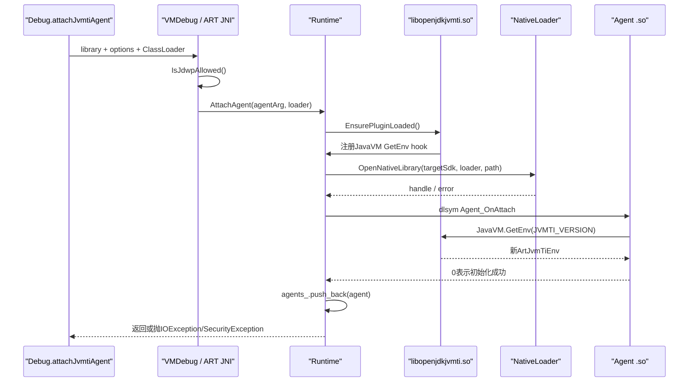
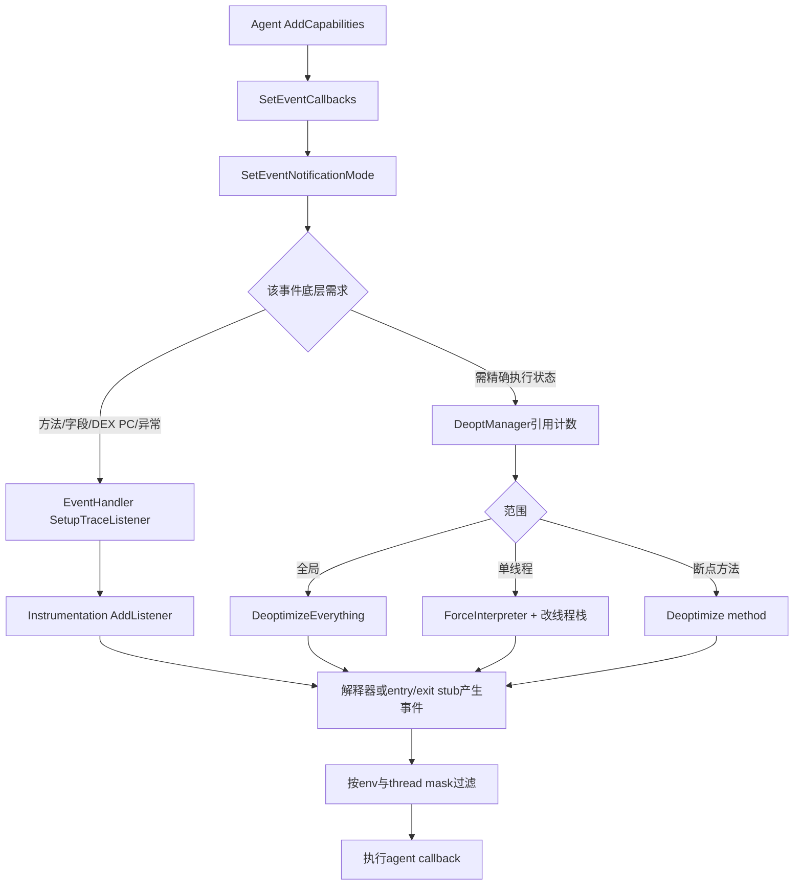
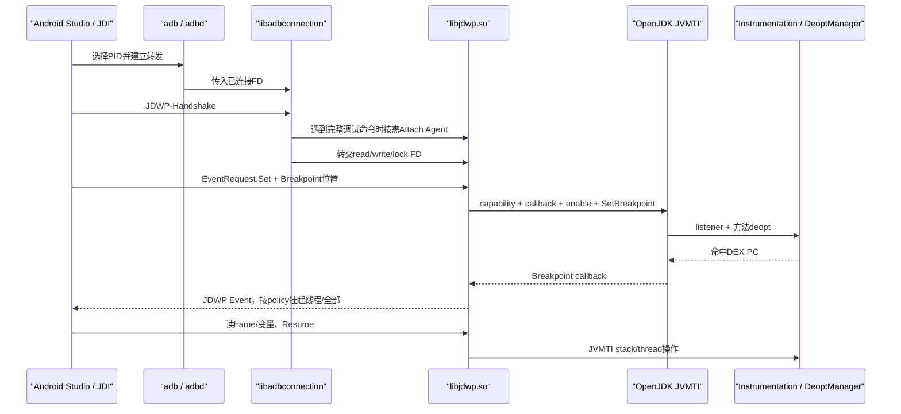

# 第560章 Android ART调试与可观测链：JVMTI Agent、Instrumentation、Method Trace、JDWP、Deoptimization、对象Tag与Heap Walk

> 源码基线：AOSP `android-11.0.0_r48`（Android 11 / API 30）  
> 学习目标：把“调试器连上了”拆成Agent装载、JVMTI环境、能力、回调、事件开关、ART内部Instrumentation、deoptimization、JDWP传输、method trace和heap walk等独立完成点，并理解观测行为为什么会改变被观测程序。  
> 阅读约定：继续在macOS只读源码，不实际编译、不连接设备；正文只对r48作确定结论，JVMTI规范概念与ART特有实现会明确分开。

## 1. 本章先拆掉一句最常见的误解

“Android Studio只是从旁边读取进程状态；打断点、Method Trace或Heap Walk不会改变应用的执行方式。”

实际上，JDWP agent会通过JVMTI申请能力、安装回调并开启事件；ART可能给方法换entrypoint、安装Instrumentation listener、让某个线程或全部方法转入解释器、暂停mutator、禁止moving GC，甚至开启逐次分配通知。调试得到的是“被观测条件下”的程序，而不是完全无扰动的原始程序。

## 2. 一句话主线

可调试进程先装入`libopenjdkjvmti.so`插件，使`JavaVM::GetEnv`能创建`jvmtiEnv`；普通agent通过`Agent_OnLoad`或`Agent_OnAttach`取得环境，申请capability、登记callbacks、按全局或线程开启event；事件需求被`EventHandler`翻译成ART的Instrumentation listener和deoptimization请求；Android调试链再由`libadbconnection`接收adbd转发的FD、按需attach `libjdwp.so`，把IDE的JDWP命令翻成这些JVMTI操作。

## 3. 与第559章怎样衔接

第559章解释JNI是native代码进入对象世界的受控边界。JVMTI agent同样是so，也从`JavaVM*`取得接口并需要正确attach线程；区别是JNI服务于业务调用，JVMTI服务于虚拟机观测和控制，能力更强，暂停、断点、重定义和堆遍历也更容易改变全局状态。

可以把JNI看成“调用协议”，把JVMTI看成“工具协议”。两者都不能把`jobject`当裸对象地址。

## 4. 先分清五层，不要都叫“调试器”

- IDE/JDI：开发者看到的断点、变量、单步界面；
- JDWP：IDE与目标VM交换命令、回复和事件的数据协议；
- `libjdwp.so`：把JDWP命令翻译为JVMTI调用的agent；
- OpenJDK JVMTI插件：ART内的JVMTI接口实现；
- ART Instrumentation/DeoptManager：真正安装事件钩子、改入口和解释执行的内部机制。

`libadbconnection.so`位于传输和agent生命周期之间：它向adbd登记进程、拿到连接FD，并在需要完整JDWP能力时加载agent。

## 5. 这条链的关键对象

`AgentSpec`拆library和options；`Agent`保存dlopen handle与三个回调地址；`ArtJvmTiEnv`保存能力、callbacks、事件mask、breakpoints和对象tag表；全局`EventHandler`汇总多个环境的事件需求；`DeoptManager`引用计数去优化请求；`Instrumentation`管理listener、entry/exit stub、interpreter stub和已deopt方法；`Trace`记录或采样方法栈；`AdbConnectionState`维护adbd与JDWP agent之间的FD。

它们不是一个巨大的singleton状态。尤其每个`jvmtiEnv`有自己的tag和事件选择，而Instrumentation是整个runtime共享的底层资源。

## 6. 一次“开启断点”至少有十个完成点

1. 进程被允许调试；2. JVMTI插件装入；3. agent so打开；4. `Agent_OnAttach`成功；5. agent取得环境；6. 请求的capability被授予；7. callback表登记；8. breakpoint event开启；9. breakpoint位置登记；10. 对应方法完成deopt并在目标DEX位置产生事件。

前一步成功从不自动证明后一步成功。r48测试也是先enable breakpoint event、建立DeoptManager requester，再调用`SetBreakpoint()`；后者内部对requester计数有debug断言。只登记位置而没有callback/enable既收不到有用回调，也不是该实现下可靠的调用顺序。

## 7. 第一幅图：动态Attach Agent的真实链路



图中ClassLoader不仅帮助找so，还参与Android native namespace选择；它不能绕开“进程必须允许调试”的安全门。

## 8. 第一段真实Java源码：公开入口怎样编码参数

```java
// frameworks/base/core/java/android/os/Debug.java
public static void attachJvmtiAgent(@NonNull String library, @Nullable String options,
        @Nullable ClassLoader classLoader) throws IOException {
    Preconditions.checkNotNull(library);
    Preconditions.checkArgument(!library.contains("="));

    if (options == null) {
        VMDebug.attachAgent(library, classLoader);
    } else {
        VMDebug.attachAgent(library + "=" + options, classLoader);
    }
}
```

r48用第一个`=`分隔library和options，所以Java入口禁止library本身含`=`。options内部以后再出现`=`仍属于参数字符串，不会继续切library名。

## 9. “仅可调试应用”落在native门上

Java文档声明非debuggable抛`SecurityException`；真正的native入口`VMDebug_nativeAttachAgent()`检查`Dbg::IsJdwpAllowed()`，失败就抛“process is not debuggable”。

该名字历史上叫JDWP allowed，但`Runtime::EnsureJvmtiPlugin()`旁的TODO也承认它实际控制更广义的调试能力。不要只凭函数名推断它只管JDWP协议。

## 10. `debuggable`不是agent自己声明的

Zygote fork后的`ZygoteHooks`从runtime flags取`DEBUG_ENABLE_JDWP`，调用`Dbg::SetJdwpAllowed()`；`Runtime`又要求Java debuggable与调试允许状态一致。

因此把agent so塞进APK，并不会自行赋予目标进程调试权。应用清单、启动策略和进程runtime flags才决定门是否打开。

## 11. 先装插件，再装agent

`Runtime::AttachAgent()`先确保`libopenjdkjvmti.so`（debug ART构建为带`d`后缀版本）已加载。这个插件不是用户agent：它向`JavaVMExt`登记GetEnv hook，并创建`EventHandler`、`DeoptManager`、`AllocationManager`等ART实现对象。

用户agent随后通过JavaVM的`GetEnv(JVMTI_VERSION_*)`才拿到真正的`jvmtiEnv`。

## 12. `AgentSpec`只按第一个等号切分

构造器先`find_first_of('=')`：没有等号时整个字符串是name、args为空；有等号时左边为name、右边所有内容原样成为args。

所以`libdemo.so=a=1,b=2`会把`a=1,b=2`完整交给agent，绝不是只保留`a`。

## 13. ClassLoader决定so搜索上下文

`AgentSpec::DoDlOpen()`通过`JavaVMExt::GetLibrarySearchPath()`取得loader路径，再把target SDK、library name、ClassLoader和path交给`OpenNativeLibrary()`。

这继承第559章的native namespace边界：路径存在不代表对当前loader可见，依赖so也必须在其namespace中可解析。

## 14. Native Bridge agent在r48明确不支持

NativeLoader若报告需要Native Bridge，ART立即关闭刚打开的handle并返回“Native-bridge agents unsupported”。

这与普通JNI库可能借助Native Bridge运行不同。agent会深度依赖当前ART/JVMTI ABI，r48不接受这种跨ISA桥接。

## 15. 启动加载与运行中附加使用不同入口

启动参数形式的agent走`AgentSpec::Load()`并寻找`Agent_OnLoad`；运行中的`Debug.attachJvmtiAgent()`走`Attach()`并寻找`Agent_OnAttach`。

两者签名相似，接收`JavaVM*`、可修改的options字符数组与null reserved，但生命周期阶段不同。只实现OnLoad的agent不能被运行中attach。

## 16. agent返回非零意味着初始化失败

ART先把`std::string`复制到可修改`char[]`，调用回调；返回0才把`Agent`放入`Runtime::agents_`。非零会形成初始化错误并由Java入口收到`IOException`。

这不是事务：agent在回调返回非零前已创建的线程、全局引用或外部文件不会被ART自动回滚。

## 17. `Agent_OnUnload`只发生在runtime收尾

`Agent::Unload()`若存在OnUnload就调用它，但源码刻意不执行`CloseNativeLibrary()`，因为有些agent假设永不真正卸载；随后只清handle和函数指针。

所以动态attach成功不是一个可以随时`dlclose`的插件会话。agent应把停采集与进程退出清理分开设计。

## 18. JVMTI环境不是进程唯一对象

每次匹配版本的GetEnv会创建一个`ArtJvmTiEnv`，登记到全局EventHandler，并为该环境创建独立`ObjectTagTable`。不同agent、甚至同agent的不同环境，可以有不同capability、callback、event mask和tag空间。

“某对象的JVMTI tag”必须补全为“某个jvmtiEnv中的tag”。另一个环境查询同对象，默认仍可能得到0。

## 19. 完整JVMTI与ART私有版本有边界

`IsFullJvmtiAvailable()`只在Instrumentation被强制全解释或runtime是Java debuggable时返回true。完整条件不满足时，标准JVMTI版本GetEnv会返回`JNI_EVERSION`，但ART私有`kArtTiVersion`仍可创建受限环境。

原因不是API表不存在，而是优化后的非debuggable执行不能保证全部JVMTI语义。

## 20. JVMTI phase是第一层时序约束

插件随runtime阶段把phase设为OnLoad或Live，之后再进入Start、Live、Dead等语义阶段。不同函数只允许在特定phase调用。

“函数指针存在”不表示任意时刻可调用；agent应检查返回的`jvmtiError`，不能把phase错误当无结果。

## 21. capability是权限票据，不是事件开关

agent先用`GetPotentialCapabilities()`看当前环境可申请什么，再用`AddCapabilities()`取得所需能力。断点、单步、字段访问/修改、挂起线程、tag对象、重定义、方法进入/退出、分配和GC事件都有对应能力。

没有能力时多数入口返回`JVMTI_ERROR_MUST_POSSESS_CAPABILITY`；能力已取得也不会自动产生事件。

## 22. 非debuggable环境的潜在能力会被裁剪

`GetPotentialCapabilities()`先复制完整常量表，再根据`kNonDebuggableUnsupportedCapabilities`逐位清掉不能可靠实现的能力。

因此“库能load”不等于“所有capabilities可加”；`AddCapabilities()`对不可用项返回`NOT_AVAILABLE`，其余可用项仍可能已经加上，不能把它想成全有或全无的原子事务。

## 23. callback表只是函数地址登记

`SetEventCallbacks()`按传入size对齐复制标准回调，保留扩展事件；callbacks为null则清表。它没有替agent申请能力，也没有开启任何event。

size小于完整结构时，尾部事件回调保持空；这允许旧版本结构兼容，却也容易让新增事件“已enable但无函数可调”。

## 24. event enable才决定投递范围

`SetEventNotificationMode()`验证enable/disable、事件类型、capability和是否支持per-thread，然后更新当前环境的全局mask或指定Thread mask。

同一个event可在A环境全局开启、B环境只对一个线程开启；EventHandler投递时逐环境过滤，不是一个进程级单布尔值。

## 25. 三个条件缺一不可

收到事件通常需要：拥有对应capability、callback表中该字段非null、event mask在全局或目标线程为enable。

排查“agent没有回调”应依次核三个返回值和范围；仅打印“SetEventNotificationMode成功”无法证明callback地址正确。

## 26. 全局union mask为什么存在

每个环境维护global event mask、若干thread mask及其union；全局EventHandler再把所有环境需求汇总为`global_mask`。

运行热点先看union便能知道“有没有任何环境关心”，无需求就快速跳过昂贵收集；需要时才复制匹配handler列表并执行各环境回调。

## 27. 回调通常运行在触发事件的线程

方法进入、异常、断点、分配等事件一般在产生事件的应用线程上回调；GC事件可能在执行GC的线程上；ObjectFree是弱表清扫后延迟发送，拿不到已死亡对象。

agent callback若阻塞、拿全局锁或执行复杂JNI，会直接改变被观测线程或GC暂停时间。

## 28. agent自己的native线程仍需Attach

JVMTI大多数函数先验证当前`art::Thread`存在，未attach返回`UNATTACHED_THREAD`；只有Allocate/Deallocate等不需要VM线程上下文的少数入口特意放宽。

这延续第559章：保存JavaVM、在线程入口Attach/GetEnv、退出Detach，不能把某次callback拿到的JNIEnv带到工作线程。

## 29. 事件种类按数据来源分组

生命周期有VM/Thread/Class事件；执行流有Breakpoint、SingleStep、MethodEntry/Exit、Exception、FramePop；字段与monitor有Access/Modification/Wait/Contended；编译有CompiledMethodLoad/Unload和DynamicCodeGenerated；内存有VMObjectAlloc、ObjectFree、GC Start/Finish、ResourceExhausted。

它们不都依赖同一种底层hook，开销和deopt范围也不同。

## 30. `ClassPrepare`仍不等于类初始化

第557章已经说明Class状态分层。JVMTI ClassLoad/Prepare表示类被加载并准备到相应阶段，不证明`<clinit>`成功完成。

agent若读取静态字段或调用方法，仍可能触发初始化、遇到初始化异常或改变应用时序。

## 31. ART Instrumentation是内部复用层

`Instrumentation`不是Android应用测试里的`android.app.Instrumentation`。这里是ART runtime组件，负责method entry/exit、DEX PC移动、字段访问、异常等listener，以及方法入口和栈return PC改写。

Method Trace、JVMTI、调试器会共享它，所以一个客户端关闭不代表底层一定恢复无插桩状态。

## 32. listener按事件类型分表

`AddListener()`把listener放入method entry、exit、unwind、branch、DexPcMoved、field read/write、exception、frame pop等列表，并更新快速布尔值与解释器handler table。

`RemoveListener()`为避免mutator正在遍历，不直接erase，而把对应槽设null；只有列表中无非null项才清快速布尔值。

## 33. 安装listener本身要求安全点

接口注释要求持有mutator lock独占，调用者通常先`ScopedSuspendAll`。运行线程尚在执行时直接改入口或监听表可能破坏栈与返回地址。

所以“开启一个事件”可能包含一次短暂停顿，不只是设置内存标志。

## 34. Instrumentation有三级执行强度

`kInstrumentNothing`不要求插桩；`kInstrumentWithInstrumentationStubs`使用entry/exit trampoline；`kInstrumentWithInterpreter`让非native方法经解释器。

强度按多个client的最大请求收敛，而不是最后调用者覆盖前一个调用者。

## 35. client用key登记需求

`ConfigureStubs(key, level)`在`requested_instrumentation_levels_`里写入或删除该key，然后遍历所有请求取最高level。Method Trace和JVMTI DeoptManager使用不同key。

因此停止Trace只移除Trace自己的key；若调试器仍要求解释器，ART不会错误恢复编译入口。

## 36. 第二幅图：JVMTI事件怎样落到ART执行路径



同一事件可能同时需要listener和deopt；`SetEvent()`先改mask/底层事件状态，再根据范围处理deopt，返回错误时agent仍应按接口返回值和自身状态做清理。

## 37. entry/exit stub并非简单函数前后加日志

当选择stub模式，已加载方法的quick entrypoint可改为`GetQuickInstrumentationEntryPoint()`；ART还遍历现有线程栈，把quick frame返回PC替换为instrumentation exit PC并保存InstrumentationStack信息。

这样新调用能观察enter，已有frame未来返回时也能观察exit，并为需要时转解释器建立桥梁。

## 38. interpreter stub是更强的保证

若`interpreter_stubs_installed_`，非native可调用方法进入quick-to-interpreter bridge。解释器每个DEX PC、字段和异常边界更可见，避免优化、内联或trampoline语义使事件丢失。

代价是性能和时序显著变化；“debug build慢”不只因为记录日志。

## 39. deoptimization不是删除编译代码

它的核心语义是强制后续执行、以及可转换的当前frame，改由解释器继续；JIT/OAT代码可能仍存在，以便需求解除后恢复entrypoint。

不要把deopt理解成擦掉OAT文件或永久禁JIT。它主要是进程内entrypoint、stack和执行策略变化。

## 40. 单方法deopt怎样做

`Instrumentation::Deoptimize(method)`先把ArtMethod放进`deoptimized_methods_`，若未全局安装解释器stub，就把其entrypoint换到instrumentation entry，并确保所有线程栈装好exit stub。

真正执行到该方法时，entry逻辑发现它在deopt集合，转解释器；已存在的frame可在适当返回/检查点经deopt机制转换。

## 41. 全局deopt怎样做

`DeoptimizeEverything(key)`通过`ConfigureStubs(key, kInstrumentWithInterpreter)`遍历类并安装解释入口，同时为现有线程栈安装Instrumentation frame。

这就是为什么全局MethodEntry、字段监听或某些单步需求可能让整个进程明显变慢。

## 42. 单线程deopt不是单方法deopt

DeoptManager给目标Thread增加`ForceInterpreterCount`，通过同步checkpoint请求它的栈被instrument；只要引用计数非零，该线程后续需要的frame用解释器语义。

这是per-thread事件尽量缩小影响面的手段，但仍需要安全协调和栈转换。

## 43. 去优化需求使用引用计数

`deopter_count_`统计有多少功能正在使用deoptimization；全局、线程和断点方法也各有计数/集合。只有最后一个请求解除时，才允许禁用整体deopt机制或恢复方法。

否则关闭一个watchpoint可能把另一个agent的single-step一起破坏。

## 44. 恢复也不是瞬间回到原样

`Undeoptimize(method)`根据类是否初始化、是否仍需debug版本选择resolution stub、interpreter bridge或OAT code；仅当没有其他deopt方法、没有entry/exit stub需求时才恢复所有线程栈。

已发生的JIT code GC禁用、缓存热度变化和时序扰动不会随按钮关闭而倒转。

## 45. Breakpoint位置是DEX code unit索引

`SetBreakpoint()`把`jmethodID`解码到canonical ArtMethod，要求location非负且小于`DexInstructions().InsnsSizeInCodeUnits()`。

它不是本地机器码地址，也不天然等于源码行号。IDE先通过line number table把源码行映射到method/location。

## 46. 断点登记与断点事件开启是两回事

`SetEventNotificationMode(BREAKPOINT)`先让DexPcMoved底层事件、回调投递和deoptimization requester生效；之后`SetBreakpoint()`把`Breakpoint{method, location}`放入该环境集合，并通知DeoptManager该方法有断点。r48自身测试遵循这个顺序。

重复位置返回`DUPLICATE`，清不存在的位置返回`NOT_FOUND`。

## 47. 普通断点通常只deopt目标方法

非default、非native、可调用方法第一次增加断点时走limited deoptimization；同方法多个断点只加计数。最后一个断点清除才尝试undeopt。

r48对default interface method更保守，会请求全局deopt，不能把“断点只影响一个方法”当绝对规则。

## 48. Single Step需要更宽的DEX PC可见性

Breakpoint和SingleStep共享Instrumentation的`kDexPcMoved` listener；EventHandler用对方是否已开启避免重复安装底层listener，但两个JVMTI事件仍有各自mask和deopt引用。

单步还依赖线程当前栈深、位置和step size/depth状态，因此比单个断点更容易扩大解释执行范围。

## 49. 字段watchpoint为什么昂贵

FieldAccess/FieldModification映射到Instrumentation的field read/write事件。全局开启时，r48的deopt规则要求全局解释；指定线程才可只deopt该线程。

它观察的是字段执行动作，不是定时扫描对象内存，优化代码若不去优化就可能没有逐字段边界可挂钩。

## 50. Exception事件也有两个时点

`JVMTI_EVENT_EXCEPTION`在抛出时，`EXCEPTION_CATCH`在处理点；前者在r48归为limited需求，后者需要全局或线程去优化，底层分别映射exception thrown/handled listener。

未捕获异常还会沿栈展开，MethodUnwind与FramePop是另外的事件语义，不能用一个“异常回调”概括。

## 51. MethodEntry/Exit的精确性很贵

MethodEntry在r48因为解释器与trampoline处理异常存在语义差异，被列为全局deopt；MethodExit全局开启也全局deopt，per-thread时只deopt目标线程。

这与Method Trace的策略相似，但不是同一套event mask或输出格式。

## 52. 编译事件不等于Java方法正在执行

CompiledMethodLoad/Unload描述JIT/AOT相关代码对象的发布或撤销；DynamicCodeGenerated还可描述非普通Java method的动态代码。

它们帮助profiler建立PC到方法映射，却不能替代MethodEntry/Exit的调用序列。

## 53. VMObjectAlloc是逐分配通知

开启该事件时EventHandler挂接allocation listener；每次符合条件的对象分配会构造JNI对象/类引用并回调agent。

它会把分配热路径变成工具热路径。用它测原始分配吞吐会产生明显observer effect。

## 54. GC Start/Finish来自pause listener

EventHandler按第一个环境开启/最后一个关闭的全局状态安装或移除GC pause listener，再投递GarbageCollectionStart/Finish。

事件说明JVMTI所定义的GC边界，不直接给出每个space释放量；要关联暂停原因和heap变化还需其他统计。

## 55. monitor事件与Java锁事件不同粒度

MonitorContendedEnter/Entered、MonitorWait/Waited来自ART monitor/park listener；它们描述进入竞争和wait生命周期，不等于采集到所有无竞争`synchronized`。

开启后callback本身若拿锁，可能制造新的竞争；分析时要排除agent自己的锁顺序。

## 56. Method Trace与JVMTI MethodEntry不是一件事

`android.os.Debug.startMethodTracing()`创建ART `Trace`对象，记录专用trace buffer/file；JVMTI事件则调用agent callback，由agent决定数据结构和输出。

二者可同时使用，底层Instrumentation会合并需求；同时开启常常让性能扰动叠加。

## 57. 第二段真实Java源码：插桩与采样只差一个参数吗

```java
// frameworks/base/core/java/android/os/Debug.java
public static void startMethodTracing(String tracePath, int bufferSize, int flags) {
    VMDebug.startMethodTracing(fixTracePath(tracePath), bufferSize, flags, false, 0);
}

public static void startMethodTracingSampling(String tracePath, int bufferSize,
        int intervalUs) {
    VMDebug.startMethodTracing(fixTracePath(tracePath), bufferSize, 0, true, intervalUs);
}
```

Java入口看似只传`samplingEnabled`，native内部却分叉为“安装逐方法listener/可能全解释”与“建立采样线程/周期性全线程栈快照”两种算法。

## 58. Method Trace启动先拒绝重入

`Trace::Start()`在`Locks::trace_lock_`下检查全局`the_trace_`；已有trace时只记录错误并忽略新请求，不创建嵌套会话。

因此库A开始trace后，库B的开始调用可能没有新trace，却仍可能在自己的逻辑中误以为拥有停止权。

## 59. sampling interval必须大于零

采样模式中`interval_us <= 0`会抛RuntimeException；插桩模式不使用interval。

间隔只是采样线程两轮之间的`usleep`参数，不保证硬实时等距：线程调度、全停顿、栈遍历和系统负载都会造成漂移。

## 60. Trace启动会永久关闭本进程JIT code GC

r48若存在JIT，`Trace::Start()`调用`SetGarbageCollectCode(false)`；注释说明为了跨暂停保持method entrypoint有效，而且即使反复开关也可能重现问题，所以不会在Stop时重新打开。

这是非常关键的残留副作用：trace结束不代表runtime所有性能状态恢复到开始前。

## 61. 插桩模式怎样启动

在GC critical section和`ScopedSuspendAll`内创建Trace，添加method entered/exited/unwind listener，再调用`EnableMethodTracing(kTracerInstrumentationKey, needs_interpreter)`。

非Java-debuggable runtime需要解释器；Java-debuggable runtime可用entry/exit trampoline，因为其优化约束使这种方式更可靠。

## 62. 采样模式怎样启动

它不添加逐方法Instrumentation listener，而是创建“Sampling Profiler”daemon pthread、attach到runtime，每轮睡眠后进入GC critical section并暂停全部mutator，遍历ThreadList的栈。

所以采样开销通常比逐调用插桩低，却仍会周期性stop-the-world；线程很多、栈很深时单轮成本会上升。

## 63. 采样不是简单保存整张栈

`GetSample()`包含inlined frames并过滤runtime method；`CompareAndUpdateStackTrace()`把新旧栈从底向上比较，把差异合成为enter和exit records。

输出因此能复用method trace格式，但“进入/退出时间”是采样推断，不是实际调用边界。

## 64. 采样会漏掉短方法

若方法的完整执行落在两次采样之间，它不会出现在任何栈快照；若采样恰好频繁命中阻塞方法，该方法占比会很高。

采样适合估计时间分布，不适合证明某次调用一定发生、精确计数或还原每个调用耗时。

## 65. 插桩会扭曲短方法

每次enter/exit/unwind都读时钟、原子保留buffer空间并写record；方法越短，固定记录成本占比越高。

`Debug`文档明确要求主要做相对比较，并提醒native method计时不会以同样方式变慢，不能据此直接比较解释Java与native实现。

## 66. trace记录三种动作

低两位编码method action：enter、exit和unroll。unroll表示方法因异常等非正常返回而退出，不应当合并成普通exit。

每条record还含线程tid、method指针编码和选定时钟差值；最终header再给出method/thread映射。

## 67. 时钟可选wall、thread CPU或dual

`Trace::default_clock_source_`决定记录wall、thread CPU或两者。wall包含阻塞/等待经过的真实时间；thread CPU更接近该线程实际占用CPU；dual同时保留便于区分。

两种数值回答不同问题，不能看到“self time小”就断定没有卡顿。

## 68. 非streaming buffer满后不覆盖旧记录

并发写者用atomic compare-exchange保留固定record区域；若新offset超过buffer size，设置`overflow_=true`并丢弃后续该条记录。

最终header写`data-file-overflow=true`。分析工具即使能打开文件，调用链尾部也已不完整。

## 69. streaming会边写边flush

streaming模式在锁下注册新method/thread，写特殊描述packet和trace record；主buffer将满时刷到文件，单个超大块还可直接写。

它降低固定内存溢出的风险，却增加运行期间文件I/O和锁竞争；“流式”也不表示零缓存。

## 70. DDMS模式在Stop时发送数据

没有backing file的非streaming输出在`FinishTracing()`把文本header与二进制buffer拼成MPSE DDM chunk。VMDebug注释明确：结束时DDMS未连接，数据会被丢弃。

开始成功不能证明最终已有文件或IDE已收到结果。

## 71. Stop先切断生产者，再读buffer

`StopTracing()`先在trace lock下把全局`the_trace_`置null；采样模式join线程，随后在GC critical section和全停顿内清每线程采样状态，或移除listener并DisableMethodTracing。

只有生产者停止且全停顿同步内存后，才调用`FinishTracing()`读取buffer、写header并flush/close。

## 72. 停止采样也可能等待一个interval

采样线程先`usleep(interval_us)`再检查`the_trace_`是否为空；Stop置空后执行pthread_join，可能等待睡眠结束。

把采样间隔设得很大，会让停止操作响应变慢，不只是样本变稀。

## 73. `TRACE_COUNT_ALLOCS`是附加全局统计

flags含`kTraceCountAllocs`时，Trace创建后调用`Runtime::SetStatsEnabled(true)`；结束header加入alloc-count、alloc-size、gc-count，再关闭stats。

源码注明开关未由锁完整保护、可能有竞态。它不是把每个对象逐项附在method trace中。

## 74. 第三段真实Java源码：buffer默认值与最小值

```java
// libcore/dalvik/src/main/java/dalvik/system/VMDebug.java
private static int checkBufferSize(int bufferSize) {
    if (bufferSize == 0) {
        // Default to 8MB per the documentation.
        bufferSize = 8 * 1024 * 1024;
    }
    if (bufferSize < 1024) {
        throw new IllegalArgumentException("buffer size < 1024: " + bufferSize);
    }
    return bufferSize;
}
```

0不是“无限制”，而是8MiB；小于1024直接抛异常。即使Java给更小值漏过，native `Trace`构造仍有内部最小buffer，但正常入口先做此校验。

## 75. trace文件是混合格式

非streaming结束时先写文本version、overflow、clock、elapsed、线程和方法表，再接二进制record buffer；streaming则把summary作为特殊packet写在数据尾。

不要用普通文本编辑器把后半段乱码当损坏，解析器必须按version和record size解释。

## 76. Method Trace与Perfetto不是替代同一个问题

Method Trace聚焦Java方法调用/采样栈；Perfetto更适合调度、CPU、binder、频率、graphics和系统级时间线。前者知道方法，后者更擅长跨进程时间关系。

定位卡顿常先用Perfetto确定“在哪段时间、哪个线程”，再用采样或局部trace缩小Java热点，避免一开始就全量插桩。

## 77. JDWP只是协议，不是ART内部执行器

JDWP定义命令集、对象/线程/类ID、事件请求和suspend policy；JDI是host Java API；真正暂停线程、读写frame、设断点的是agent经JVMTI请求ART。

把JDWP和JVMTI区分开，就能理解“传输连上但能力建立失败”与“事件已产生但IDE没收到”是不同故障层。

## 78. r48默认JDWP provider是adbconnection

`CanonicalizeJdwpProvider()`在target可调试进程默认选`kAdbConnection`，Runtime装入`libadbconnection.so`；host构建没有adbd，默认none。

旧式直接`-agentpath:libjdwp.so=...`仍被Runtime错误提示列为可选配置，但Android设备默认链多了一层按需连接管理。

## 79. adbconnection先向adbd登记PID

client连接抽象Unix socket `\0jdwp-control`，校验对端credential可信，写入本进程PID。adbd之后把host发起的JDWP连接作为FD传回进程。

这不是应用在公网或本机TCP端口上任意listen；ADB负责设备侧转发和进程发现。

## 80. DDM命令不一定立即加载JDWP agent

`AdbConnectionState`先自己完成`JDWP-Handshake`，可直接识别DDM command set 199的一类chunk并交给ART DDM callback。

只有收到它不能处理的JDWP packet、短header等情况，才调用`AttachJdwpAgent()`。这是为了避免仅DDMS监控时支付完整agent成本。

## 81. JDWP agent用运行中Attach加载

`AttachJdwpAgent()`调用`Runtime::AttachAgent(nullptr, MakeAgentArg(), nullptr)`，默认agent名`libjdwp.so`；参数强制`server=y,suspend=n`并使用`transport=dt_fd_forward`和控制socket FD。

因为此时runtime线程已经运行，r48明确拒绝adbconnection配置`suspend=y`，不能在晚加载阶段把启动前状态倒回去。

## 82. FD forward把adbd连接交给agent

adbconnection通过socketpair与agent transport控制通道通信，复制read/write/write-lock FD，用SCM_RIGHTS发送；agent监听和接受后，状态消息再告诉plugin谁持有socket。

这一层还序列化DDM与JDWP对同一ADB连接的写入，避免包交叉。

## 83. `isDebuggerConnected()`会被JDWP agent接管实现

ART原生注册的`VMDebug_isDebuggerConnected()`固定返回false，`isDebuggingEnabled()`才通过`RuntimeCallbacks::IsDebuggerConfigured()`查询是否配置了调试。`libjdwp`初始化时用`RegisterNatives`替换这三个VMDebug方法，并以transport已打开且至少见过一个非DDMS JDWP包作为connected；断开时清状态。

所以“配置了调试”“只有DDMS在通信”和“IDE已发来真实调试命令”是三个状态。`waitForDebugger()`先循环等connected，再根据`lastDebuggerActivity()`等待一段idle稳定窗口，让IDE有机会下发断点。

## 84. 第三幅图：IDE断点、协议、Agent与ART的往返



图中IDE的“一个按钮”跨越至少四种协议/接口；日志排障应先判断点是在ADB、JDWP handshake、agent、JVMTI返回值还是ART事件层。

## 85. suspend policy决定停一个还是停全部

JDWP事件请求可带NONE、EVENT_THREAD或ALL等挂起策略。它影响IDE收到事件前目标线程集合的状态，与JVMTI event本身是否per-thread enable不是同一个维度。

误用ALL会把binder、主线程和后台线程一起停住，外部系统仍继续计时，可能触发ANR、超时或连接断开。

## 86. 读取局部变量需要可解释的frame状态

优化编译可能消除、合并或寄存器化局部值；ART的debuggable编译约束、stack map和deopt把frame转换为可由JVMTI访问的vreg/shadow frame。

因此IDE显示“optimized out”或修改变量失败，不一定是协议坏了，而可能是当前方法/位置没有合法可写状态。

## 87. Debugger shadow frame保存修改后的vreg

ART的StackVisitor先查Thread上的debugger shadow frame；调试器写局部变量时可把新值放入对应shadow frame，后续deopt到解释器再继续使用。

这是“IDE改变量”比单纯读内存复杂的原因，也解释了Thread里专门存在frame ID映射与清理逻辑。

## 88. 条件断点和Evaluate会执行用户代码

IDE条件表达式、toString展示或method invocation可能让目标线程执行Java代码、触发类初始化、锁、分配和异常。

看到“停在断点后状态又变了”，先确认是否进行了自动求值，而不是假设暂停快照绝对静止。

## 89. 调试器断开要按引用计数撤需求

agent需要清event request、breakpoint、thread suspend、global refs和callback状态；DeoptManager只有在相应计数归零后才恢复。

异常断线若只关闭传输而未清VM侧状态，可能留下挂起线程或慢执行，故JDWP agent有独立的会话收尾路径。

## 90. 对象tag是什么

`SetTag(jobject, jlong)`在当前`ArtJvmTiEnv`的ObjectTagTable建立“对象弱键→64位值”映射；tag 0表示删除映射。

它不是Java字段、不是identityHashCode、不是对象地址，也不会随序列化进入另一个进程。

## 91. tag能力必须显式申请

GetTag、SetTag、GetObjectsWithTags、IterateThroughHeap、FollowReferences都要求`can_tag_objects`。这是因为tag表参与GC system weak处理和全堆遍历，绝非无成本元数据。

GetTag查不到映射时把输出写0；SetTag对null对象返回NULL_POINTER。

## 92. tag表为什么不能强持有对象

若tag映射本身是strong root，agent只要标记对象就会阻止其回收，泄漏分析将改变被分析对象的可达性。r48因此用`JvmtiWeakTable`作为SystemWeakHolder。

GC判对象死亡时键可清除；对象存活但搬家时表必须更新到新地址。

## 93. moving GC期间怎样查tag

weak table键用`GcRoot<Object>`保存；read barrier GC期间表可能暂存from-space指针，而调用者拿to-space对象查找。慢路径可对整表执行read barrier更新，再查一次。

这再次说明tag不是绑在稳定裸地址上，而是由GC协作维护的对象关联。

## 94. ObjectFree只携带tag

GC sweep检测弱键变成null时，若该环境开启ObjectFree，就把tag放入延迟队列；安全时再`DispatchEventOnEnv(ObjectFree, tag)`。

对象已经死亡，回调没有合法jobject可给。未打tag的对象也没有可用于识别的ObjectFree值。

## 95. ObjectFree的时间不是析构时刻

Java对象没有C++式确定析构；事件依赖某轮GC发现不可达、system weak sweep及延迟队列发送。对象失去最后一个strong reference到收到事件之间没有固定时长。

tag可用于统计生命周期，但不能作为及时释放native资源的唯一机制。

## 96. `GetObjectsWithTags()`不是全堆条件查询

它在当前环境weak tag表中寻找给定tag集合并返回仍存活对象与tag；没有tag的对象根本不在表里。

它适合找回已标记对象，不等价于“扫描所有类并筛字段”。

## 97. `IterateThroughHeap()`遍历活对象

接口按heap filter、可选精确class和callbacks访问对象，传入class tag、对象大小、可修改的`tag_ptr`、数组长度等；callback改变tag后ART写回tag表。

class过滤在r48比较对象的实际Class相等，不是`isAssignableFrom`子类匹配。

## 98. Heap filter同时看对象tag与class tag

`HeapFilter::ShouldReportByHeapFilter()`根据tagged/untagged等位判断对象与其Class的tag。tag 0被当作untagged。

过滤只减少callback报告，不保证底层无需走访对象；大堆上的成本仍不可忽略。

## 99. callback处于“不允许当前线程挂起”区域

`DoIterateThroughHeap()`在每个对象callback外建立`ScopedAssertNoThreadSuspension`。agent不应在回调里执行会阻塞、等待GC或任意可挂起的VM操作。

安全做法是只做常量时间统计/打tag，把复杂处理留到遍历返回之后。

## 100. `IterateThroughHeap()`并非所有模式都显式STW

它调用`Heap::VisitObjects()`：若当前是并发移动GC，先IncrementDisableMovingGC，再把当前线程转为等待、暂停全部mutator，访问Region及其他space；完成后恢复并允许moving GC。

若不是并发移动GC，r48保持mutator lock共享，禁止当前访问线程挂起并遍历稳定对象集合，没有在这一层无条件`ScopedSuspendAll`。这是一条必须按版本和collector描述的边界。

## 101. `FollowReferences()`更明确地全停顿

若heap并发且移动，它先禁moving GC；随后进入ScopedObjectAccess、允许暂停期间查询JNI ID，把当前线程转为WaitingForVisitObjects并`ScopedSuspendAll("FollowReferences")`。

因为它既访问roots又沿对象边遍历，需要一致的图与精确root信息，成本通常比简单heap iteration更大。

## 102. 从null起点与指定对象起点不同

`initial_object == null`时helper收集runtime roots和image roots再广度/工作列表遍历；指定对象时从该对象的引用子图开始。

后者能缩小范围，但若对象连接到巨大图，仍可能遍历大量对象。

## 103. root类型会翻译成JVMTI reference info

ART把JNI global/local、Java frame local、thread、monitor、system class、interned string、debugger等RootType映射为JVMTI heap reference kind，并补线程tag、stack depth、method/location等可用信息。

不同root并不都有相同附加字段，agent必须按reference kind解释union。

## 104. `tag_ptr`让遍历边走边建索引

heap iteration callback与follow reference callback可修改对象或referrer的tag指针；ART比较saved tag并更新weak table。

这允许一次遍历标记节点、下一次用GetObjectsWithTags找回，但大量tag会扩大weak table和GC sweep成本。

## 105. Heap Walk不覆盖全部native内存

它遍历ART managed heap对象、字段、数组和roots；C/C++ malloc、graphics buffer、ashmem、binder buffer及native library私有arena不自动成为Java对象节点。

Java对象size也不必等于其间接拥有的native资源总量。分析内存仍要结合native heap、maps、dumpsys和业务所有权。

## 106. Heap Walk与HPROF用途不同

JVMTI callback适合agent在线统计、选择性打tag和自定义图算法；HPROF heap dump把快照编码成可离线分析的文件/流。

两者都可能停顿、增加内存和I/O，不应把“只读分析”理解成无运行成本。

## 107. 类重定义会制造obsolete method

标准normal redefinition要求方法/字段集合和关键modifier/type不能非法改变；安装新DEX实现前ART停止JIT、准备数据并最终全停顿更新类。栈中正在执行旧实现的方法会复制为obsolete ArtMethod并继续保持其旧metadata。

所以重定义成功后，新调用可走新实现，已经在栈上的旧调用不一定瞬间跳进新代码。

## 108. r48还有结构化重定义扩展

源码包含`RedefinitionType::kStructural`与独立扩展事件，可允许增加字段/方法；r48会收集旧实例、预分配新实例并在安装阶段替换引用，同时禁止若干特殊类、初始化中的危险情形和活跃pointer JNI ID。头文件里仍残留“临时要求类无实例”的注释，但同版本实现已经有实例收集与重建流程，不能把那句孤立注释当成最终行为。

不能把这个ART扩展混成标准`RedefineClasses`的普遍能力；普通agent应按normal规则设计，除非明确调用并处理扩展限制。

## 109. agent内存必须用配对API管理

JVMTI返回的字符串、数组和表通常要求用`jvmtiEnv::Deallocate`释放；agent自行分配给VM回调的buffer则按对应接口所有权规则处理。

混用`free/delete/Deallocate`会形成泄漏或崩溃。Allocate/Deallocate是少数允许未attach线程调用的函数，也不代表其他JVMTI函数同样安全。

## 110. 安全边界比性能边界更先检查

动态agent attach要求进程允许调试；so仍受ClassLoader/native namespace和SELinux/文件访问限制；adbd控制socket校验peer UID；JDWP连接由ADB转发。

对生产应用暴露自定义attach通道，会把读内存、挂起线程、调用方法和重定义代码等高权限能力带入攻击面。

## 111. 一张操作前检查表

先问：目标是否Java debuggable；插件和agent分别是否已装；拿到哪个jvmtiEnv；phase是否允许；capability是否成功；callback是否非null；event是全局还是线程；底层要listener、分配钩子还是deopt；是否会STW/禁moving GC；停止时谁撤mask、断点、tag与线程挂起。

再问输出是否溢出、采样是否有偏、插桩是否改变时序、Heap Walk是否漏native内存。回答完这些再解释结果。

## 112. macOS只读练习一：追动态Agent加载与安全门

```bash
cd /Users/ninebot/androidSource
rg -n "attachJvmtiAgent|nativeAttachAgent|IsJdwpAllowed|EnsureJvmtiPlugin|AttachAgent|Agent_OnAttach|OpenNativeLibrary|Native-bridge agents unsupported" \
  frameworks/base/core/java/android/os/Debug.java \
  libcore/dalvik/src/main/java/dalvik/system/VMDebug.java \
  art/runtime/native/dalvik_system_VMDebug.cc art/runtime/runtime.cc art/runtime/ti/agent.cc
```

预期：看到Java用第一个`=`编码options、native检查调试权、Runtime先装OpenJDK JVMTI插件、NativeLoader按ClassLoader路径开库并调用OnAttach。只读，不加载任何so。

## 113. macOS只读练习二：核对能力、回调、事件与deopt四层

```bash
cd /Users/ninebot/androidSource
rg -n "GetPotentialCapabilities|AddCapabilities|SetEventCallbacks|SetEventNotificationMode|SetEvent\(|GetDeoptRequirement|AddDeoptimizationRequester|ConfigureStubs|requested_instrumentation_levels_" \
  art/openjdkjvmti/OpenjdkJvmTi.cc art/openjdkjvmti/events.cc \
  art/openjdkjvmti/deopt_manager.cc art/runtime/instrumentation.cc art/runtime/instrumentation.h
```

预期：能力、callback、event mask相互独立；不同事件选择limited/thread/full deopt；Instrumentation按所有key的最高level收敛，不由最后一个caller覆盖。

## 114. macOS只读练习三：比较插桩Trace与采样Trace

```bash
cd /Users/ninebot/androidSource
rg -n "startMethodTracingSampling|checkBufferSize|Trace::Start|RunSamplingThread|AddListener|EnableMethodTracing|data-file-overflow|Trace::StopTracing|SetGarbageCollectCode" \
  frameworks/base/core/java/android/os/Debug.java \
  libcore/dalvik/src/main/java/dalvik/system/VMDebug.java \
  art/runtime/trace.cc art/runtime/instrumentation.cc
```

预期：插桩安装method事件并可能解释执行；采样线程周期暂停所有mutator并比较栈；非streaming满后标overflow；Stop不重新开启JIT code GC。

## 115. macOS只读练习四：核对JDWP按需加载、tag与Heap Walk

```bash
cd /Users/ninebot/androidSource
rg -n "kDefaultJdwpAgentName|HandleDataWithoutAgent|AttachJdwpAgent|dt_fd_forward|ObjectTagTable|HandleNullSweep|IterateThroughHeap|FollowReferences|IncrementDisableMovingGC|ScopedSuspendAll" \
  art/adbconnection/adbconnection.cc art/adbconnection/adbconnection.h \
  art/openjdkjvmti/object_tagging.cc art/openjdkjvmti/jvmti_weak_table.h \
  art/openjdkjvmti/ti_heap.cc art/runtime/gc/heap-visit-objects-inl.h
```

预期：adbconnection能先处理DDM再按需attach libjdwp；tag是system weak映射；IterateThroughHeap仅在并发移动路径显式禁移动并STW，FollowReferences则明确全停顿遍历引用图。

## 116. 本章最容易写错的十五句话

“JDWP就是JVMTI”“agent能加载就能拿全部能力”“设callback会自动开启事件”“enable event会自动设callback”“断点位置是机器码地址”“断点永远只影响一个方法”“deopt会删除JIT代码”“停止trace恢复所有性能状态”“采样绝不暂停应用”“8MiB是无限buffer”“Object tag是对象字段”“tag会保活对象”“ObjectFree带jobject”“Heap Walk包含native heap”“IterateThroughHeap永远全停顿”——在r48都不准确。

正确说法必须带上环境、事件范围、collector、输出模式和完成点。

## 117. 一条实战诊断顺序

IDE连不上：先查进程debuggable/runtime flags，再查adb jdwp进程登记与FD、handshake、adbconnection是否attach libjdwp、agent OnAttach返回。断点不命中：核源码行到DEX location、capability、callback、event mask、SetBreakpoint返回和方法是否被替换/重定义。调试后极慢：查全局MethodEntry/field watch/single step、全局deopt、VMObjectAlloc和Method Trace是否叠加。

Heap分析卡住：区分Iterate与FollowReferences、heap大小/线程数、moving GC禁用、callback是否做了阻塞操作；trace数据怪：先看overflow、clock、sampling interval和是否为推断enter/exit。

## 118. 本章源码地图

- Agent入口：`frameworks/base/core/java/android/os/Debug.java`、`dalvik/system/VMDebug.java`
- Agent装载：`art/runtime/ti/agent.*`、`art/runtime/runtime.cc`
- JVMTI总表：`art/openjdkjvmti/OpenjdkJvmTi.cc`、`art_jvmti.h`
- 事件与能力：`art/openjdkjvmti/events*`、`deopt_manager.*`
- ART插桩：`art/runtime/instrumentation.*`
- Method Trace：`art/runtime/trace.*`
- JDWP/ADB：`art/adbconnection/*`、`system/core/adb/libs/adbconnection/*`、`external/oj-libjdwp/*`
- tag与堆：`object_tagging.*`、`jvmti_weak_table*`、`ti_heap.*`
- 重定义：`ti_redefine.*`、`transform.*`

第一遍按Agent→环境→事件→Instrumentation→JDWP读，第二遍再读tag/heap/redefine；不要一开始陷入external/oj-libjdwp的大量协议command handler。

## 119. 最终心智模型

ART可观测性是一套“把高层工具请求翻译为runtime不变量变更”的系统：Agent提供native生命周期，JVMTI环境把能力、回调和事件按工具隔离，EventHandler把多个工具需求合并，Instrumentation与DeoptManager让优化执行重新出现可观察边界，JDWP把远端命令和事件编码传输，Trace把方法边界或周期栈变成文件，tag/Heap Walk又与GC weak roots和暂停协议协作。

每次观察都要同时记录“看到了什么”和“为了看到它，runtime改变了什么”。这才是可信的调试结论。

## 120. 下一章预告

第561章进入ART线程与Java锁链：Thread attach状态、mutator lock、suspend check、thin/fat monitor、LockWord、`synchronized`、`wait/notify`、锁膨胀与线程dump怎样协作。

学完下一章，你会把“线程BLOCKED/WAITING”“对象头里的锁”“GC/Debugger暂停”和Java monitor等待拆成不同机制，并能沿源码解释死锁与长时间卡顿。
