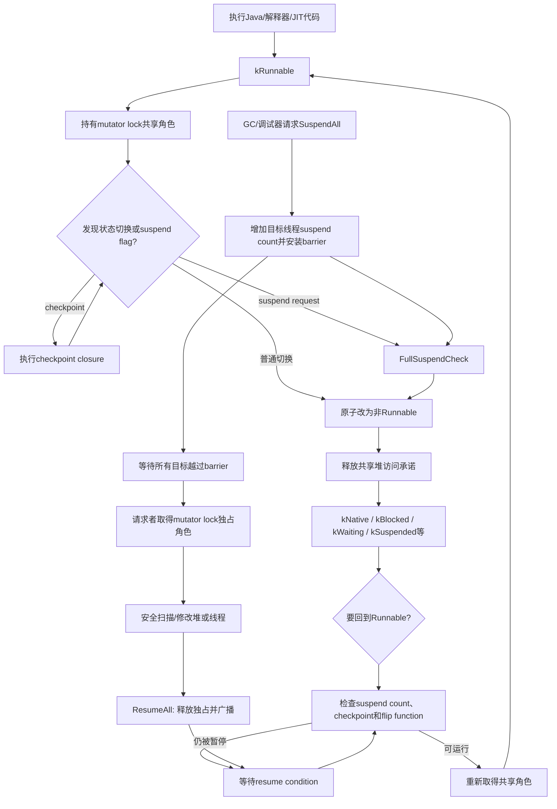
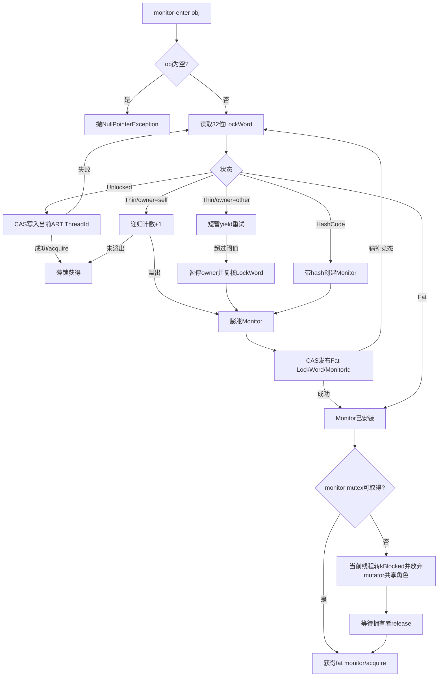
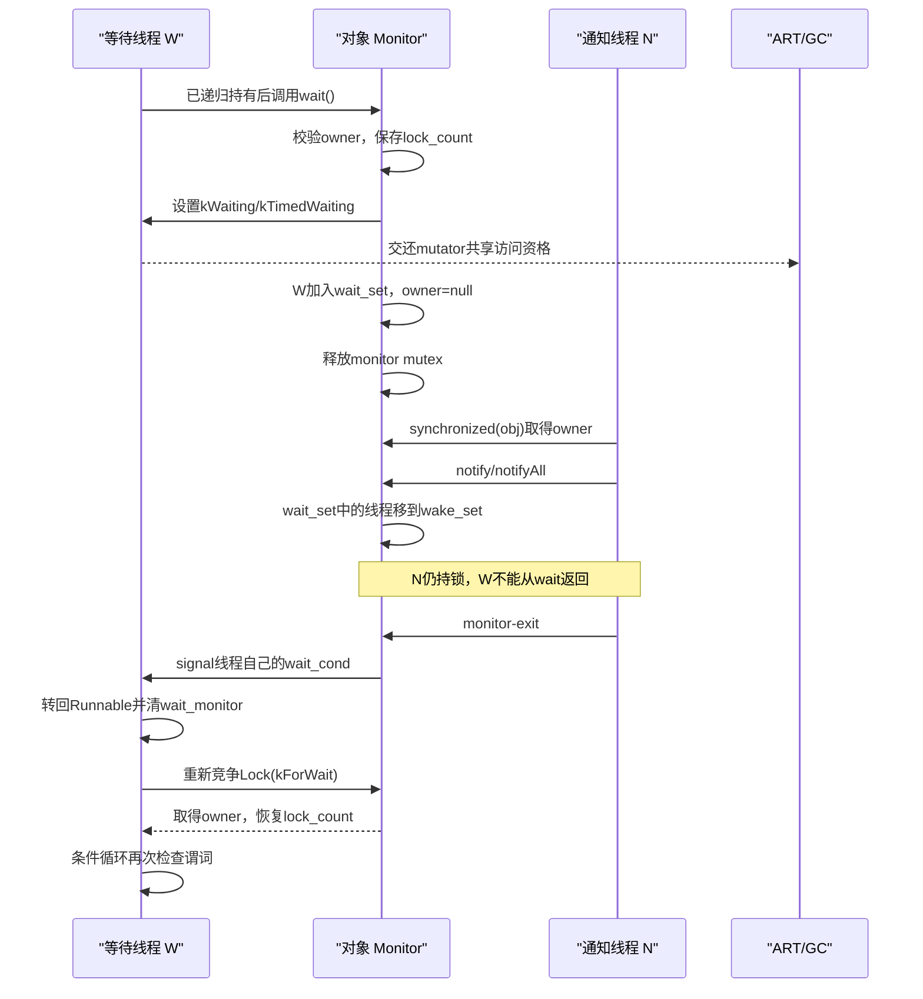

# 第561章 Android ART线程与Java锁链：Thread、Mutator Lock、Suspend Check、Monitor、LockWord、synchronized、wait/notify与锁膨胀

> 源码基线：AOSP `android-11.0.0_r48`（Android 11 / API 30）  
> 学习目标：理解ART怎样用线程状态和mutator lock保护堆，怎样让线程协作暂停；再从对象头的LockWord一路追到薄锁、Monitor膨胀、`synchronized`、`wait/notify`、中断、线程转储与锁回收。  
> 阅读约定：继续在macOS只读源码，不实际编译、不连接设备；正文只对r48作确定结论。Java语言语义、ART内部状态和Linux线程状态会明确分开。

## 1. 本章先拆掉一个最危险的混淆

“Java线程显示为`RUNNABLE`，就一定正在CPU上运行并且可以安全访问Java堆；显示为`WAITING`，就一定在等待某个Java对象的`notify()`。”

这两句都不成立。Java的`Thread.State`是面向应用的粗粒度投影；ART内部有更细的`ThreadState`。r48会把`kNative`和`kSuspended`都映射为Java `RUNNABLE`，而许多GC、调试器和运行时内部等待态又统一映射为Java `WAITING`。诊断锁问题时，必须先问“这是哪一层的状态”。

## 2. 一句话主线

ART中的`Thread`把Java线程、JNI环境和底层pthread联系起来；线程只有处于`kRunnable`时才持有mutator lock的共享访问权，离开Runnable就承诺不直接触碰Java堆；GC或调试器通过suspend count、flag、checkpoint和barrier让Runnable线程在检查点协作暂停；Java的`monitor-enter/exit`再用对象头LockWord实现无竞争薄锁，发生竞争、递归溢出、`wait()`或identity hash需要时膨胀为Monitor。

## 3. 与第558—560章怎样衔接

第558章的Concurrent Copying GC要扫描、转移并修正对象，第559章的JNI要在native边界保护对象，第560章的调试器要暂停线程、遍历堆或去优化。它们最终都会落到本章的共同基础：谁此刻能访问堆、如何请线程到达安全位置、怎样读取线程栈和对象锁。

因此本章不是孤立的“并发工具课”。mutator lock和suspend check是GC、JNI、JVMTI、栈遍历与Monitor能够共存的交通规则。

## 4. 先分清三个“线程”对象

- `java.lang.Thread`是Java堆中的用户可见对象，保存名称、优先级、daemon、内部`lock`等字段；
- `art::Thread`是ART的native线程控制块，保存`JNIEnvExt`、栈、异常、内部状态、suspend count、checkpoint队列和等待中的Monitor；
- pthread/Linux task是内核调度实体，拥有系统tid和真实运行/睡眠状态。

三者通常有关联，但不是同一个地址、同一种生命周期，也不共享同一套状态枚举。

## 5. `art::Thread`为什么是中枢

读`art/runtime/thread.h`时，不要把它只当pthread包装器。解释器、JIT代码、JNI、GC和调试器都要从当前`Thread*`取得线程局部数据；pending exception、managed stack、handle scope、suspend flag、thread-local allocation stack也都挂在这里。

所以很多ART入口第一件事是取得`Thread::Current()`，不是为了打印线程名，而是为了进入正确的运行时协议。

## 6. ART的线程状态定义在哪里

主枚举位于`art/runtime/thread_state.h`。源码对“suspended state”的定义很关键：任何不是`kRunnable`的状态，都保证线程不访问Java堆；这并不等于枚举值恰好是`kSuspended`。

因此本文把“小写的非Runnable/暂停态集合”和具体枚举`kSuspended`分开写。只看名称容易把集合与单一成员混成一件事。

## 7. 第一幅图：线程状态、mutator lock与全局暂停



这是一份控制关系图，不表示每次切换都发生内核上下文切换。ART状态、C++锁角色和OS调度状态是不同层次。

## 8. `kRunnable`的真正含义

在ART层，`kRunnable`表示线程可以执行会访问Java堆的代码，并拥有mutator lock共享访问权。它不承诺线程此刻占着CPU：线程可能已经被操作系统抢占，只是仍保留“恢复后可以继续碰堆”的资格。

因此GC不能因为某线程暂时没在CPU上就直接修改它可能观察到的对象图；GC必须走正式暂停或并发读屏障协议。

## 9. 非Runnable状态的共同承诺

`kNative`、`kBlocked`、`kWaiting`、`kTimedWaiting`、`kSleeping`、`kSuspended`以及多种运行时等待态都属于非Runnable集合。共同承诺是：线程在该状态期间不会未经协议直接访问Java堆。

native代码仍可能执行CPU指令，但若要读写Java对象，应先借助JNI句柄与相应Scoped访问对象回到允许的状态。

## 10. 为什么`kNative`会显示成Java RUNNABLE

`java_lang_Thread.cc`的`Thread_nativeGetStatus()`把`kNative`映射为`Thread.State.RUNNABLE`。Java枚举的RUNNABLE本来就可能表示“正在VM中执行，或等待OS资源”；它不是ART mutator访问权的镜像。

所以线程转储里的RUNNABLE线程可能阻塞在系统调用，也可能处于native代码。不要仅凭这一个词认定它在忙循环。

## 11. `kSuspended`也可能显示为Java RUNNABLE

r48同一个映射函数把具体`kSuspended`映射为Java RUNNABLE。暂停原因可能来自调试器或运行时内部请求，而Java六态并没有“被VM暂停”这一项。

这是一个很好的提醒：Java状态适合监控和展示，不是同步控制API。`Thread.getState()`的文档也明确说它用于监控，不用于同步控制。

## 12. Runnable转为非Runnable发生了什么

`Thread::TransitionFromRunnableToSuspended()`系列路径会原子更新状态，并处理等待中的checkpoint、empty checkpoint与suspend barrier，然后放弃mutator lock共享角色。更新顺序必须让暂停方看见一个一致事实：要么线程仍Runnable并将响应请求，要么它已不再访问堆。

不能用“先改一个普通boolean，再稍后停下来”替代这套协议，否则GC可能在空窗期误判线程已安全。

## 13. 非Runnable回到Runnable不是简单赋值

回程会检查thread flags与suspend count。没有阻塞条件时，线程切回`kRunnable`并恢复mutator共享访问；若仍有暂停请求，就在resume condition上等待；若安装了GC flip function，还要在真正返回Java堆访问之前执行它。

因此“native函数返回”不等于下一条Java指令立刻执行。恢复门上可能还有暂停、checkpoint和GC根翻转工作。

## 14. suspend count与thread flags各管什么

suspend count表达有多少个暂停请求尚未撤销；flags让目标线程快速发现“有checkpoint”“有suspend request”“有empty checkpoint”等待处理事件。计数允许多个请求者叠加，flag适合热路径轮询。

只清flag而不平衡计数会提前恢复，只减计数而不唤醒也会让线程滞留。阅读代码时应追成对的请求、撤销和condition broadcast。

## 15. `CheckSuspend()`的处理优先级

r48的检查循环先处理checkpoint，再处理suspend request，最后处理empty checkpoint，并持续循环直到相关flags清空。处理期间又可能收到新请求，所以一次检查不是固定只做一项。

这种顺序是实现选择，不应被应用代码依赖；但对读源码很重要，因为它解释了为什么checkpoint closure可能先于线程真正进入完整暂停。

## 16. `FullSuspendCheck()`做的不是忙等

完整暂停检查使用`ScopedThreadSuspension(kSuspended)`把当前线程切到非Runnable，释放堆的共享访问资格，并在恢复条件满足后重新进入Runnable。等待期间暂停方才有机会取得mutator lock独占角色。

把它理解为“在合作点交还堆访问权”，比“循环看一个暂停标志”更准确。

## 17. 什么叫suspend check位置

解释器分派、编译代码的特定检查点、运行时入口以及状态转换处都可以成为线程观察请求的位置。它们共同目标是让长时间执行的mutator最终到达可暂停位置，同时不在任意机器指令中间撕裂运行时不变量。

这不是说每条Java字节码都一定检查一次，也不是说暂停可以在任意native指令立刻生效。

## 18. checkpoint与完整暂停的区别

checkpoint是让目标Runnable线程自己执行一个`Closure`，适合扫描自身线程局部根、刷新线程局部状态等工作；完整暂停则让线程交出堆访问权，由请求方在稳定状态下观察或修改。

能在线程自身上下文完成的事优先用checkpoint，可以减少全局停顿；需要多个线程一致快照的事仍可能要SuspendAll。

## 19. `RequestCheckpoint()`为什么可能失败

r48只在目标当前为`kRunnable`时把closure排入其checkpoint队列并置flag。若目标已经非Runnable，它不会突然切回去替请求者执行函数，因此请求可能返回false。

调用方必须为失败分支设计安全替代路径，例如在锁保护下直接检查已暂停线程，而不能把“请求已发出”误当“closure必会运行”。

## 20. checkpoint closure在哪里运行

目标线程在自己的`CheckSuspend()`路径中，从队列取出函数、在suspend-count锁外执行，再继续检查新flag。锁外执行避免closure长时间占据全局协调锁，也意味着closure自身要遵守标注的锁与堆访问要求。

checkpoint完成点是closure已经返回，不是请求函数返回。

## 21. empty checkpoint为什么有用

empty checkpoint没有业务closure，它的意义是确认所有相关Runnable线程至少经过了一次检查边界。已经非Runnable的线程本就承诺不在堆访问中间，通常无须强迫它们执行空函数。

这类栅栏可用于等待先前并发动作在所有mutator上变得可观察。

## 22. 同步checkpoint如何等待完成

请求方会为成功安装的目标建立barrier或计数器，目标执行closure后递减；对已经非Runnable的线程，调用方可在所需锁保护下走直接处理分支。最后等待计数归零，才算整批工作完成。

所以“向所有线程遍历一遍”常是“能请求的让它自查，已安全暂停的由当前线程查”的混合算法。

## 23. `SuspendAll`的调用前提

发起全局暂停的线程不能还以Runnable身份持有mutator lock共享角色，否则它一边等待独占、一边自己占着共享锁，会形成自我阻塞。源码用线程安全标注和断言约束这一点。

因此常见调用会先进入`ScopedThreadSuspension`，再操作ThreadList。

## 24. 全局暂停的第一本账：新线程

`SuspendAllInternal()`增加全局`suspend_all_count_`，让正在attach或随后出现的线程知道全局暂停尚未结束。否则只给当前列表中的线程加计数，会漏掉暂停过程中加入的线程。

这说明全停不是一次静态数组遍历，而是需要封住线程集合变化的协议。

## 25. 第二本账：目标线程的suspend count

在相关锁保护下，请求方给目标线程增加suspend count并设置suspend request。每个线程必须在回到可访问堆之前看见该请求。

已有多个暂停来源时计数会叠加；一个`ResumeAll`只撤销自己建立的全局请求，不能抹掉调试器等其他来源。

## 26. 第三本账：active suspend barrier

全停为目标安装barrier计数。已经处于非Runnable的线程可由协调方确认并清除对应barrier；仍Runnable的线程要在状态转换或suspend check处越过barrier。

请求方等待barrier归零，证明没有遗漏仍能随意碰堆的线程，然后再争取mutator lock独占。

## 27. 为什么最后还要取得mutator lock独占

barrier确认目标响应了请求，独占锁则把“所有共享堆访问者已退出”变成可由锁系统验证的事实。此时GC、堆遍历或类重定义才可以执行要求stop-the-world的操作。

只有“线程看起来都睡了”而没有独占角色，并不是可靠的全局安全点。

## 28. `ResumeAll`不必等所有线程实际运行

恢复路径先释放mutator lock独占，平衡线程与全局suspend count，再广播resume condition。线程何时真正被OS调度、何时重新取得共享访问，属于后续过程。

所以`ResumeAll()`返回的完成点是“恢复许可已发布”，不是“每个线程都已经执行一条Java指令”。

## 29. RAII怎样避免忘记恢复

`ScopedSuspendAll`构造时暂停，析构时恢复；`ScopedThreadSuspension`则管理当前线程的Runnable/非Runnable转换。异常、早退或多个分支下，RAII比手写成对调用更不容易泄漏状态。

读ART C++时遇到`Scoped...`对象，要把它的生命周期纳入控制流，而不是只看显式函数调用。

## 30. `FlipThreadRoots`是混合协议

Concurrent Copying GC的thread-root flip不会简单把所有工作都塞进一次长STW。它先协调全停与独占阶段，在每个线程安装flip closure，并让部分已处理线程较早恢复，再完成其余线程。

这把第558章的“并发GC”与本章的checkpoint/suspend机制接起来：并发不是没有暂停，而是缩短和分拆全局独占区间。

## 31. 跨暂停保存对象为什么必须用Handle

线程进入非Runnable或让GC运行后，对象可能被移动。裸`mirror::Object*`若没有读屏障或根登记，恢复后可能指向旧地址；`Handle`、`GcRoot`和JNI引用会进入ART可更新的根协议。

这也是monitor膨胀等路径常先建立`StackHandleScope`的原因：它们可能暂停当前线程或暂停锁拥有者。

## 32. Java同步最终落到哪条DEX指令

显式`synchronized (obj)`通常编译为DEX `monitor-enter`与`monitor-exit`。编译器必须在正常返回和异常路径都安排退出；验证器还会检查monitor栈是否结构合法。

源码阅读时不要只搜Java关键字，还应搜`monitor-enter`、quick lock entrypoint和解释器对应opcode处理。

## 33. synchronized方法锁的是谁

实例`synchronized`方法隐式锁住接收者`this`；静态`synchronized`方法锁住声明类对应的`java.lang.Class`对象。它们与显式块复用同一Monitor语义，只是入口/退出由编译器或解释器隐式生成。

“锁住类的所有对象”是不准确的：静态方法竞争的是Class对象那一把锁，实例方法各自竞争接收者对象的锁。

## 34. quick入口是怎样接住编译代码的

编译后的monitor操作进入`artLockObjectFromCode()`或`artUnlockObjectFromCode()`。入口检查null，取得当前`Thread*`，再调用对象的`MonitorEnter/Exit`；插件monitor回调若在进入后抛异常，入口还会把刚取得的锁退出，避免泄漏。

这条回滚边界说明“底层已经拿到锁”和“Java层monitor-enter成功完成”仍是两个完成点。

## 35. 对null加锁的失败位置

`monitor-enter null`与`monitor-exit null`都会由quick入口抛`NullPointerException`并返回失败。真正进入`Monitor::MonitorEnter()`前，目标对象必须非null。

这与调用`null.wait()`表面上同为NPE，但后者甚至无法形成有效receiver；不要和“非owner调用wait抛IllegalMonitorStateException”混在一起。

## 36. 第二幅图：LockWord驱动的Monitor进入链



图中“暂停owner”不是为了替它解锁，而是为了在复制薄锁owner和递归计数时得到稳定快照。

## 37. LockWord放在对象哪里

`mirror::Object`包含32位`monitor_`字段，ART通过`GetLockWord()`、`SetLockWord()`和`CasLockWord()`解释它。名字叫monitor字段，但在未膨胀时并不指向一个C++ `Monitor`对象。

对象头这32位还承载GC状态，因此锁实现必须保留read-barrier与mark位。

## 38. LockWord的五种逻辑状态

`LockWord::LockState`列出`kUnlocked`、`kThinLocked`、`kFatLocked`、`kHashCode`与`kForwardingAddress`。最高状态位编码thin/fat/hash/forwarding；thin与unlocked共享内部状态值，再通过其余业务位是否为零区分。

同一时刻只能按一种布局解释剩余位。不能既把它当thin owner，又同时把同一批位当hash或MonitorId。

## 39. GC位为何和锁位共存

r48布局还保留read barrier state与mark bit。更新薄锁递归计数时，启用读屏障的构建会用CAS保留并发变化的GC位，而不是普通覆盖整个32位字。

因此比较LockWord不能随手比较原始值；源码提供忽略read-barrier或GC状态的比较/取值方法。

## 40. 薄锁owner不是Linux tid

薄锁owner占16位，写入的是ART分配的small `ThreadId`，不是`pthread_t`也不是Linux `gettid()`。ART可通过ThreadList按这个ID找到拥有者。

诊断日志里同时出现线程ID、系统tid和Java Thread对象时，必须看字段名称，不能直接拿数值互查。

## 41. 递归计数为什么从0开始

`kThinLockCountSize`在r48为12位。LockWord注释明确：count为0表示已经持有一次，第一次重入写成1，第二次重入写成2。

因此实际持有层数是`count + 1`。直接把count打印成层数会少一层。

## 42. 无锁快路径怎样获得薄锁

当前线程把自己的ThreadId、count 0和原GC状态组成新LockWord，对旧值执行弱CAS；成功使用`memory_order_acquire`，失败则重新读取状态重试。

弱CAS允许伪失败，所以循环是正确性的一部分，而不是性能上的可选重试。

## 43. 自己重入为什么不再阻塞

若thin owner等于当前ThreadId，只增加递归count。未启用读屏障时可直接写；启用读屏障时用relaxed CAS保留GC位。当前拥有者是唯一关心递归count的线程，无须再做一次跨线程acquire。

当count达到上限，ART不会溢出覆盖owner，而是膨胀为fat monitor保存更大的递归状态。

## 44. 碰到其他owner先做什么

r48先按`Runtime::GetMaxSpinsBeforeThinLockInflation()`给出的次数执行`sched_yield()`重试，希望短临界区很快释放。源码注释也承认yield成本与效果依平台而异。

这不是Java语义保证，不能依赖固定自旋次数或公平性；它只是设备端实现的竞争优化。

## 45. 为什么竞争线程要先变成非Runnable

真正等待另一个Monitor时，线程不能继续占着mutator lock共享角色，否则GC全停会被一个正在互斥量上睡眠的线程卡住。Monitor锁路径会把线程置为`kBlocked`，让出堆访问资格，再等待底层mutex。

恢复并取得Monitor后，它还要通过状态转换协议回到Runnable，才继续访问对象。

## 46. `monitor_enter_object_`是诊断线索

竞争或膨胀等待期间，ART把目标对象记入线程的`monitor_enter_object_`。线程转储可由它解释“waiting to lock <object>”，并追出当前owner。

获得锁或结束膨胀尝试后必须清除该字段；它是瞬时诊断状态，不是锁所有权账本。

## 47. 膨胀为什么需要暂停薄锁owner

如果当前线程就是owner，它能直接把自己的owner与递归count复制进新Monitor。若owner是另一个线程，竞争者进入`kWaitingForLockInflation`，按ART ThreadId请求暂停对方，避免对方同时递归或退出。

暂停成功后还要重读LockWord；只有它仍是同一个thin owner才安装。旧快照不能证明对象此刻仍由对方持有。

## 48. 膨胀竞态怎样收口

多个竞争者可能各自创建候选Monitor，但`Monitor::Install()`通过CAS发布fat LockWord。成功者加入MonitorList；失败者释放自己创建的Monitor并回到状态循环，读取赢家的结果。

所以“创建了Monitor”不等于“对象已经引用它”。发布CAS才是归属完成点。

## 49. fat LockWord里不是裸指针

fat状态剩余位保存`MonitorId`，`FatLockMonitor()`通过MonitorPool查回真实`Monitor*`。这样32位对象头能在64位进程中稳定表示Monitor，也便于池化管理。

把LockWord值直接强转指针，在64位ART中既不符合布局，也绕过MonitorPool。

## 50. `Monitor`内部保存哪些关键事实

fat Monitor包含关联对象根、owner线程、递归`lock_count_`、独占mutex、`num_waiters_`、wait set、wake set、可选identity hash、monitor id与诊断信息。它同时承担互斥、条件等待和可观测性角色。

但对象身份仍是Java对象；Monitor是运行时辅助结构，可能膨胀也可能在GC安全期回收。

## 51. fat锁进入的内存序

读到fat状态后，r48先执行acquire fence，保证新发布的Monitor结构可见，再调用`TryLock()`或`Lock()`。取得Monitor mutex同样形成后续读写的获取边界。

源码中的内存序不是装饰：没有发布/获取配对，线程可能看到fat标签却看不到完整初始化的Monitor字段。

## 52. 解锁薄锁怎样处理递归

`MonitorExit()`先核对owner。count非0时减一并仍保持thin owner；count为0时写回default LockWord，表示最后一层退出。启用读屏障时用release CAS保留GC位。

只有最后一层退出才真正允许其他线程获得对象；中间一次递归退出不能提前发布无锁状态。

## 53. 解锁fat monitor做什么

fat路径交给`Monitor::Unlock()`：核对owner、处理递归count；最后一层释放时清owner，并以release语义释放monitor mutex。它还会配合wake set选择等待线程发signal。

所以退出Monitor不只是`pthread_mutex_unlock`，还承担`notify()`延迟唤醒的交接工作。

## 54. 非owner解锁的错误

无锁、hash状态或owner不等于当前线程都会走`FailedUnlock()`并抛`IllegalMonitorStateException`。quick入口把`MonitorExit()`的false转换为失败返回，让已挂起异常沿Java路径传播。

这类异常说明所有权协议被破坏，不应靠捕获后继续来“修复”同步结构。

## 55. synchronized的happens-before落在哪里

Java内存模型规定同一Monitor的一次解锁happens-before后续成功加锁。ART的薄锁release写/CAS与acquire CAS，以及fat mutex的release/acquire，共同实现这条可见性边界。

它保证的是正确同步下的跨线程可见性，不保证公平，不保证先排队者先拿锁，也不把临界区变成不可抢占执行。

## 56. identity hash为何会影响锁形态

对象没有普通字段专门永久保存identity hash。未锁对象第一次需要身份hash时，可以把hash写进LockWord的`kHashCode`布局；但这会占用薄锁owner/count使用的位。

以后对hash状态对象加锁，ART要膨胀Monitor，把hash保存在Monitor中，再用对象头保存MonitorId。

## 57. 已有薄锁时怎样生成identity hash

若对象正被薄锁持有，ART不能覆盖owner与递归count。它先在安全协议下膨胀，复制锁状态，并把生成的hash放入Monitor。

因此调用`System.identityHashCode(obj)`可能改变后续锁实现成本，但不会改变hash稳定性或Java对象相等语义。

## 58. forwarding address为什么也在LockWord

moving GC复制对象时，可临时把旧对象头解释为转发地址，让读屏障或复制逻辑找到新位置。该状态与thin/fat/hash互斥，属于GC阶段的特殊解释。

普通mutator不应在缺少GC协议时把forwarding状态当锁状态处理；相关入口通常假设读屏障和对象访问约束已经把它带到有效对象。

## 59. 锁膨胀不是不可逆的

r48实现`Monitor::Deflate()`。只有mutator已暂停、对象当前fat、没有等待/竞争者、底层mutex可立即取得且owner为空时，才把对象头恢复为hash状态或default状态。

因此“对象一竞争就永远背着fat monitor直到进程结束”不符合这版实现。

## 60. deflate后的Monitor何时真正回收

deflate先更新对象LockWord，再把Monitor持有的对象根置null，作为已脱离对象的标记；MonitorList/MonitorPool会在后续GC相关清理中释放结构。

对象头恢复和C++内存回收是两个完成点，不能在刚写回LockWord时假设旧Monitor内存已立即销毁。

## 61. Monitor性能问题该怎样理解

无竞争薄锁主要是对象头CAS；fat锁会多一次id查找和mutex操作；竞争还会造成状态切换、调度、回调和可能的owner暂停膨胀。真正昂贵的通常是长临界区与竞争，而不是`synchronized`关键字本身。

优化前应先测量持锁时间、竞争频率和调用栈，避免为了躲关键字引入错误的无锁协议。

## 62. Monitor公平性没有Java保证

竞争进入者、被`notify()`移动到wake set的线程和新来的线程最终都可能竞争Monitor。Object文档明确说被唤醒线程没有可靠的优先或劣势。

因此不能用`notify()`实现“严格先来先服务”队列；若业务需要顺序，应建立显式队列和条件。

## 63. `wait()`的第一道门是owner

`Object.wait()`必须由当前Monitor owner调用。fat Monitor的`Wait()`首先比较`owner_`，不匹配立即抛`IllegalMonitorStateException`。

在Java里看到`obj.wait()`，先向外找是否真的有`synchronized (obj)`；锁住另一个对象不算。

## 64. 第一段真实Java源码：三个wait重载如何汇合

```java
// libcore/ojluni/src/main/java/java/lang/Object.java
public final void wait(long timeout) throws InterruptedException {
    wait(timeout, 0);
}

@FastNative
public final native void wait(long timeout, int nanos) throws InterruptedException;

public final void wait() throws InterruptedException {
    wait(0);
}
```

真正native注册位于`art/runtime/native/java_lang_Object.cc`：签名`(JI)V`进入`Object_waitJI()`，再调用`mirror::Object::Wait()`与`Monitor::Wait()`。Java包装层没有自己实现条件队列。

## 65. `wait(0, 0)`不是“立即超时”

`Monitor::Wait()`在原因是`kTimedWaiting`且毫秒、纳秒都为0时，把状态改为`kWaiting`，即无限等待，直到通知、中断或伪唤醒等条件发生。

因此把外部输入0直接当“非阻塞探测”传给`wait()`，会制造永久等待风险。

## 66. wait参数在哪里校验

r48 native路径检查`ms < 0`或`ns`不在0到999999，抛`IllegalArgumentException`。`Object.wait(long)`只是把nanos补0；最终仍由Monitor路径统一验证。

参数合法只代表可以开始协议，不代表一定等待到完整时长：通知、中断和伪唤醒都可提前结束等待。

## 67. `wait()`为什么必然触发fat monitor

wait set、wake set、每个等待者以及递归层数恢复都需要Monitor结构。若对象仍为当前线程拥有的thin锁，外层`Monitor::Wait(self,obj,...)`会先膨胀；若不是owner则抛异常。

所以即使从未发生多线程竞争，只要执行过`wait()`，对象也会在当时进入fat状态；以后仍可能满足条件后deflate。

## 68. wait怎样完整释放递归锁

Monitor先保存`lock_count_`，把它清0，清除owner，然后释放底层monitor mutex。等待结束重新取得Monitor后，再把保存值恢复。

注意保存的是“首次持有之外的递归count”；整体效果仍是释放该对象的全部持有层，并在返回或抛异常前恢复到调用wait之前的层数。

## 69. wait set与wake set不是同一集合

`wait_set_`保存尚未被notify选中的等待者；`notify()`把一个线程从wait set移到wake set，`notifyAll()`移动全部。移动集合本身不等于线程已经执行。

wake set让通知选择与实际condition-variable signal分开，配合Monitor释放顺序避免唤醒线程立即撞在仍被notifier持有的锁上。

## 70. 为什么每个Thread还有wait mutex和condition

r48不是给每个Monitor只放一个通用condvar，而是使用线程自己的wait mutex、wait condition和wait-next链接。等待线程先拿自己的wait mutex，再登记到Monitor集合并设置`wait_monitor_`。

通知或中断方据此找到目标线程并signal其condvar；锁顺序用来封住“刚释放Monitor、尚未真正睡下”时丢失唤醒的窗口。

## 71. wait时为何切到`kWaiting`或`kTimedWaiting`

线程清owner后以`ScopedThreadSuspension`进入非Runnable状态，释放mutator共享访问资格。无限wait用`kWaiting`，有超时用`kTimedWaiting`；特殊Thread.sleep使用`kSleeping`。

这些状态让GC知道该线程不会在condvar睡眠期间直接读写Java堆。

## 72. `wait_monitor_`为何在恢复Runnable后才清

线程转储需要在等待期间知道它正在等待哪个对象。r48注释明确：若太早清空，dump会声称线程在等待`null`。

恢复到Runnable后，线程拿自身wait mutex清字段。这个字段服务诊断和中断定位，不替代Monitor自身的owner/wait集合。

## 73. `notify()`实际做了什么

它先验证调用者仍是owner，然后从`wait_set_`头部取一个线程，挂到`wake_set_`。r48当前实现登记waiter时追加到尾部、单次notify从头部选择，但Java公开契约仍允许任意选择；应用不能把这段链表顺序当FIFO保证，也不能认为被选线程已经越过当前Monitor拥有者。

如果wait set为空，notify正常返回；通知不是可以积累供未来wait消费的“令牌”。

## 74. 薄锁上`notify()`为何可以是成功的空操作

若对象仍是当前线程拥有的thin锁，说明没有wait建立所需的fat Monitor与wait set。此时通知没有现存等待者，验证owner后即可成功返回，无须为了空通知强制膨胀。

这再次说明notify不保存历史信号。未来线程再调用wait，不能消费此前的notify。

## 75. `notifyAll()`也不等于所有线程立即返回

它把wait set中的所有节点并入wake set。每个线程仍要收到signal、恢复Runnable并重新竞争同一Monitor；任一时刻仍只有一个owner。

在大量等待者上，notifyAll可能造成“惊群”和重复条件检查，但当多个条件共享一把Monitor时，错误地notify一个也可能唤醒不满足条件的线程。

## 76. 真正signal为什么推迟到unlock

`SignalWaiterAndReleaseMonitorLock()`在释放Monitor时从wake set选择线程并signal。这样通知选择发生在notifier持锁期间，实际推进与锁交接绑定，减少无意义的提前唤醒。

即便已经收到signal，等待线程也必须重新`Lock<kForWait>()`成功，才能从`wait()`返回。

## 77. 第三幅图：wait、notify与重新竞争



如果W超时、中断或伪唤醒，后半段“恢复Runnable—重获Monitor—检查/抛出”仍然存在。

## 78. 为什么Java规范要求while而不是if

线程可能伪唤醒；notify选择也可能不是满足当前线程条件的那个；从signal到重获Monitor之间，条件还可能被其他线程再次改变。因此醒来只表示“现在值得重新检查”，不表示业务谓词成立。

正确模式是持锁检查共享状态，条件不成立就wait；醒来后仍在同一循环中重新检查。

## 79. timeout为什么只是上限近似

底层`TimedWait`返回后，线程还要等OS调度、恢复ART Runnable资格并重新获得Monitor，所以`wait(1000)`不承诺恰好1000毫秒返回，更不承诺最多1000毫秒完成整个Java调用。

超时只使等待条件有资格结束，不能替代业务deadline与重新计算剩余时间。

## 80. interrupt怎样唤醒wait线程

`Thread.interrupt0()`找到目标`art::Thread`并调用`Thread::Interrupt()`。目标若设置了`wait_monitor_`，中断路径在相应锁顺序下设置interrupt状态并signal线程wait condition，使其离开等待。

若目标不在可中断等待中，中断标志仍可保留，由后续`wait/sleep/join`或`Thread.interrupted()`观察。

## 81. `InterruptedException`为何先创建、后重获Monitor

r48离开condvar后若发现中断且应抛出，会先清interrupt状态并设置pending `InterruptedException`，这时尚未重新持有目标Monitor。源码解释：异常分配可能触发GC，若带着Monitor分配，GC清引用等路径可能造成死锁。

随后它仍执行`Lock<kForWait>()`并恢复递归count，最后native返回时Java才观察到异常。实现内部“设置异常”和Java语义“抛出异常”是两个时刻。

## 82. 异常也必须等锁恢复

Object文档保证中断异常不会在该对象锁状态恢复之前交给调用者。r48即使提前建立pending exception，也在返回前重新取得Monitor并恢复`lock_count_`。

所以catch块开始执行时，外围`synchronized(obj)`仍按正常控制流持有obj，直到退出同步块。

## 83. wait只释放哪一把锁

它只释放receiver对象的Monitor。当前线程同时持有的其他Monitor保持锁定，这可能阻塞负责产生条件或发通知的线程。

复杂嵌套锁里调用wait前应检查锁顺序；“wait会把线程所有锁都放掉”是危险误解。

## 84. notify与interrupt竞态怎样理解

目标可能刚被notify移到wake set，又收到interrupt；也可能先看到中断再进入等待检查。ART通过wait mutex、wait_monitor、集合移除和interrupt flag收敛这些交错。

应用层不应依赖哪一个事件“赢得返回原因”的精细时序；如果业务要区分，必须把业务状态与中断策略显式记录。

## 85. 第二段真实Java源码：Android的sleep为何循环等待

```java
// libcore/ojluni/src/main/java/java/lang/Thread.java
if (millis == 0 && nanos == 0) {
    if (Thread.interrupted()) {
      throw new InterruptedException();
    }
    return;
}

final int nanosPerMilli = 1000000;
long start = System.nanoTime();
long duration = (millis * nanosPerMilli) + nanos;
Object lock = currentThread().lock;

synchronized (lock) {
    while (true) {
        sleep(lock, millis, nanos);
        long now = System.nanoTime();
        long elapsed = now - start;
        if (elapsed >= duration) {
            break;
        }
        duration -= elapsed;
        start = now;
        millis = duration / nanosPerMilli;
        nanos = (int) (duration % nanosPerMilli);
    }
}
```

这段来自完整`sleep(long,int)`方法的核心。native `Thread_sleep()`实际调用`Monitor::Wait(..., kSleeping)`；Java用当前线程私有`lock`并循环计算剩余时间，抵抗底层提前返回。

## 86. sleep与普通Object.wait的关键区别

sleep使用当前Thread对象内部专用lock，Java层先`synchronized(lock)`，native才以`kSleeping`做特殊wait。它不会释放调用者此前持有的任意业务Monitor；只临时释放内部sleep lock。

因此“sleep会像wait一样释放当前同步块的锁”是错的。持业务锁sleep仍会让其他竞争者继续阻塞。

## 87. sleep(0,0)为何仍检查中断

JLS允许零时长sleep没有可观察调度效果，但中断语义仍要兑现。r48先调用清除式`Thread.interrupted()`，为true就抛`InterruptedException`，否则直接返回。

所以不能用`sleep(0)`保证yield；如果目的是让出调度，`yield()`本身也只有提示语义。

## 88. sleep为何用`nanoTime()`而不是墙上时钟

Java层用单调时间计算已经睡过多久，避免系统时间人工调整直接扭曲剩余时长。每次底层wait提前返回，就扣掉elapsed继续循环。

这仍受计时器精度和调度延迟影响，只是deadline计算不会被wall-clock跳变破坏。

## 89. 第三段真实Java源码：Android join等待的是专用lock

```java
// libcore/ojluni/src/main/java/java/lang/Thread.java
public final void join(long millis) throws InterruptedException {
    synchronized(lock) {
    long base = System.currentTimeMillis();
    long now = 0;

    if (millis < 0) {
        throw new IllegalArgumentException("timeout value is negative");
    }

    if (millis == 0) {
        while (isAlive()) {
            lock.wait(0);
        }
    } else {
        while (isAlive()) {
            long delay = millis - now;
            if (delay <= 0) {
                break;
            }
            lock.wait(delay);
            now = System.currentTimeMillis() - base;
        }
    }
    }
}
```

r48相对上游有Android改动：同步和wait都使用Thread内部`lock`，不是公开Thread对象本身。`Thread::Destroy()`先把Java字段`nativePeer`清0，使`isAlive()`变false，再取得这个内部lock并执行`NotifyAll()`。源码上方继承来的文档仍写“`this.notifyAll`”，那是Android改动后的漂移注释，不能盖过真实字段与native销毁路径。

## 90. join的完成点是什么

无超时join只有在`isAlive()`变false后返回；有超时版本也可能因为时间用尽而返回，此时目标线程仍活着。返回类型没有告诉你是哪一种，调用方若在意必须再次检查`isAlive()`。

中断join的是等待者，不是被等待的目标线程；等待者清中断状态并收到`InterruptedException`。另外r48的timed join用`System.currentTimeMillis()`累计已过时间，而前面的sleep用`System.nanoTime()`；墙上时钟被调整时，timed join的实际等待可能随之偏移，因此更不能把返回时刻当精确deadline。

## 91. park/unpark为什么不是wait/notify别名

`LockSupport.park()`走Unsafe与ART park机制，拥有最多一个permit语义，可以先unpark后park；`Object.notify()`不积累通知，且wait要求持有Monitor并释放/重获它。

两者在线程转储中都可能投影为WAITING，但协议、丢信号规则和锁要求不同，不能混用推理。

## 92. Java六态怎样投影ART状态

r48映射大意是：`kStarting`→NEW，`kTerminated`→TERMINATED，`kBlocked`→BLOCKED，`kWaiting`→WAITING，`kTimedWaiting/kSleeping`→TIMED_WAITING，`kRunnable/kNative/kSuspended`→RUNNABLE；许多内部等待态→WAITING。

这个switch没有default，便于新增ART状态时由编译器提醒维护映射。

## 93. BLOCKED和WAITING的根本区别

BLOCKED通常表示线程正在竞争进入某个Monitor，它还没有所有权；WAITING表示线程主动进入条件等待、join、park或ART内部等待。调用`wait()`的线程释放Monitor后是WAITING，被notify后重新竞争期间可能变为BLOCKED。

同一个线程在一次等待生命周期里出现两种状态并不矛盾。

## 94. 线程转储怎样找到“waiting to lock”

`Monitor::FetchState()`结合线程内部状态、`monitor_enter_object_`和`wait_monitor_`判断它是在进入锁、在对象wait，还是sleep。对于fat Monitor还能读取owner线程并输出对象类型与地址标识。

这是一张采样快照；owner可能在dump生成后立刻变化，不能把日志当持续不变的事实。

## 95. “locked”行说明什么

栈遍历会结合monitor记录和方法同步信息，在相应frame旁展示已持有对象。它帮助建立“线程A持有L1并等待L2”的等待图。

优化、native frame与抓取时序会限制可见信息；缺少一行不等于严格证明没有任何native mutex或运行时内部锁。

## 96. 怎样从dump推断Java死锁

把每个BLOCKED线程画成“线程→正在等的Monitor”，再把Monitor画成“Monitor→owner线程”。若出现A等B持有的锁、B又沿链等回A的闭环，就是候选Monitor死锁。

还要核对是否是同一时刻快照、对象标识是否一致，以及线程是否可能只是长临界区而非永久等待。

## 97. WAITING本身不是死锁证据

消费者在空队列上wait、join等待工作线程、线程池worker park，都是正常WAITING。死锁需要没有外部事件能打破的等待依赖闭环或协议丢失。

诊断时把业务谓词、谁负责修改它、谁负责通知一起检查，不能只数WAITING线程数量。

## 98. notify丢失最常见的源码形态

如果生产者修改条件和notify没有与消费者的“检查条件—进入wait”使用同一把Monitor，就可能在消费者真正入wait前发出不积累的通知。消费者随后睡下，再也没人唤醒。

正确性来自“共享谓词和wait/notify都受同一锁保护”，不是靠增加sleep或改成notifyAll碰运气。

## 99. 为什么不建议锁公开Thread对象

r48自己把sleep/join迁移到Thread内部`lock`，避免外部代码锁住Thread实例干扰生命周期通知。公开对象一旦兼作内部协议锁，未知调用者可能制造锁顺序反转或吞吐问题。

业务同步也应优先使用私有final锁对象，明确其所有权和保护字段。

## 100. JNI MonitorEnter走的是同一语义吗

JNI提供`MonitorEnter/MonitorExit`，最终仍要进入ART对象Monitor所有权协议，并与Java`synchronized`互相竞争。native代码在正常生命周期中必须成对退出，且异常/早退不能泄漏Monitor。r48的`Thread::Destroy()`确实会遍历该JNI环境登记的Monitor并自动退出，属于线程detach兜底，不是可以替代成对调用的日常控制流。

但JNI引用是句柄，不应把`jobject`直接当`mirror::Object*`；这一边界延续第559章。

## 101. JVMTI Monitor事件会带来什么

第560章的JVMTI环境可订阅MonitorContendedEnter、Entered、Wait、Waited等事件。r48 Monitor路径会调用runtime callbacks；agent回调本身可能增加持锁路径开销，甚至影响线程交错。

因此“打开锁追踪后问题消失”可能是观测扰动，不等于原问题虚构。

## 102. 调试器暂停与Java BLOCKED不是一回事

调试器把线程suspend后，Java投影仍可能是RUNNABLE；BLOCKED则专指等待Monitor进入。暂停在持锁代码行的线程可能让其他线程变BLOCKED，看起来像锁死，实际根因是owner被调试器冻结。

排查时同时检查断点、线程暂停标记和owner栈。

## 103. GC暂停与业务Monitor怎样互不死锁

线程在等待contended Monitor或Object.wait时先进入非Runnable，放弃mutator共享访问；GC因此无需等一个睡在业务mutex上的共享持有者。Monitor代码跨可能GC点又用Handle保护对象。

这就是线程状态协议与锁实现必须一起读的原因：单独看mutex代码看不到堆移动安全。

## 104. ART内部锁和Java Monitor不要混称

mutator lock、thread-list lock、suspend-count lock等是ART C++同步原语；Java Monitor绑定Java对象并受JMM约束。二者可能在同一路径协作，但owner标识、锁序、可见性和诊断接口不同。

说“ART拿了锁”信息不足，至少应写出锁名、共享/独占模式以及当前线程状态要求。

## 105. 锁顺序为什么比“少加一把锁”更重要

ART用线程安全注解、`Locks`集中定义和运行时断言约束内部锁级别。随意在持有Monitor时获取更高层运行时锁，可能与GC或线程挂起路径形成闭环。

读调用链时记录进入前要求`REQUIRES`、函数内Scoped锁和可能状态切换，才能看出隐藏锁边。

## 106. 优先级反转会怎样出现

低优先级线程持有Monitor，高优先级线程等待它，而中优先级线程持续占CPU，就可能延迟高优先级线程。Java Monitor语义不承诺通用优先级继承或严格按优先级唤醒。

Android实时敏感路径更应缩短临界区、避免持锁I/O/Binder调用，而不是依赖调度器自动修复所有反转。

## 107. 持锁Binder调用为何危险

同步Binder可进入另一个进程，服务端又可能回调或取得本进程其他锁。此时本地Monitor持有时间被跨进程调度放大，并可能形成A锁→Binder→B锁→回调→A锁的环。

能先复制必要状态再释放锁调用外部系统时，通常更容易证明锁顺序。

## 108. 读源码时怎样判断一次操作完成

至少区分：请求suspend、目标看到flag、目标越过barrier、请求方取得mutator独占；创建Monitor、CAS安装fat LockWord；notify移动集合、unlock发signal、等待者重获Monitor、业务谓词成立。

很多并发误判都来自把第一个动词当作最后一个完成点。

## 109. 一个可靠的锁问题排查顺序

先定位Java对象/内部锁；再看线程处于ART状态还是Java投影；找owner、等待对象和持锁栈；确认是否有调试器/GC暂停；核对谓词读写是否在同一锁内；最后检查超时、中断、notify与异常退出分支。

不要一开始就把所有WAITING解释成死锁，也不要用随机增加notifyAll掩盖协议错误。

## 110. 本章高频误解清单

- Java RUNNABLE不等于正在CPU运行，也不等于ART一定是`kRunnable`；
- `kSuspended`只是非Runnable状态之一；
- sleep不释放业务Monitor，wait只释放receiver Monitor；
- notify不积累许可，也不让等待者立即返回；
- LockWord的fat部分是MonitorId，不是裸指针；
- thin count 0表示持有一次；
- 膨胀在r48可以于安全期deflate；
- InterruptedException交给Java前，wait已恢复对象锁。

## 111. 开始练习前的只读检查表

下面四个练习只读取当前AOSP，不生成构建产物。请从`/Users/ninebot/androidSource`执行；成功标准是命令退出码为0并打印对应源码行。

练习不是让你记行号，而是训练“从语义词找到实现，再用相邻代码核对边界”。

## 112. 练习一：核对ART状态与Java状态不是一一对应

```bash
set -euo pipefail
SRC=/Users/ninebot/androidSource
test -f "$SRC/art/runtime/thread_state.h"
test -f "$SRC/art/runtime/native/java_lang_Thread.cc"
rg -n 'kRunnable|kNative|kSuspended|kBlocked|kWaiting' "$SRC/art/runtime/thread_state.h" | head -n 20
rg -n 'case kNative:|case kSuspended:|case kBlocked:|case kWaiting:' \
  "$SRC/art/runtime/native/java_lang_Thread.cc"
```

观察：`kNative`与`kSuspended`映射到Java Runnable，而`kBlocked`和`kWaiting`分别映射到Java Blocked/Waiting。不要把两个枚举当同一张表。

## 113. 练习二：核对LockWord位宽与五种逻辑状态

```bash
set -euo pipefail
SRC=/Users/ninebot/androidSource
FILE="$SRC/art/runtime/lock_word.h"
test -f "$FILE"
rg -n 'kThinLockOwnerSize = 16|kThinLockCountSize = 32|Zero means it is locked exactly once' "$FILE"
rg -n 'kUnlocked|kThinLocked|kFatLocked|kHashCode|kForwardingAddress' "$FILE" | head -n 12
rg -n 'Monitor\* FatLockMonitor|kMonitorIdSize' "$FILE"
```

观察：owner固定16位，count由总位宽扣除状态和GC位得到；`kUnlocked`是逻辑分支，不是另占一组顶层状态位。

## 114. 练习三：核对wait、notify与deflate的完成点

```bash
set -euo pipefail
SRC=/Users/ninebot/androidSource
FILE="$SRC/art/runtime/monitor.cc"
test -f "$FILE"
rg -n 'prev_lock_count|AppendToWaitSet|SetWaitMonitor|Lock<LockReason::kForWait>' "$FILE"
rg -n 'void Monitor::Notify\(|void Monitor::NotifyAll\(|SignalWaiterAndReleaseMonitorLock' "$FILE"
rg -n 'only deflate with mutators suspended|num_waiters_|ExclusiveTryLock|HasHashCode' "$FILE" | tail -n 16
```

观察：wait先保存递归层并登记集合，通知只移动集合，等待者还要重新Lock；deflate同时要求全局安全期、无人等待和Monitor未持有。

## 115. 练习四：核对Object.wait、Thread.sleep与join的Java外壳

```bash
set -euo pipefail
SRC=/Users/ninebot/androidSource
OBJ="$SRC/libcore/ojluni/src/main/java/java/lang/Object.java"
THR="$SRC/libcore/ojluni/src/main/java/java/lang/Thread.java"
test -f "$OBJ"
test -f "$THR"
rg -n 'native void wait\(long timeout, int nanos\)|void wait\(long timeout\)|void wait\(\)' "$OBJ"
rg -n 'Object lock = currentThread\(\)\.lock|sleep\(lock, millis, nanos\)|while \(isAlive\(\)\)|lock\.wait' "$THR"
```

观察：三个wait重载汇到native二参数入口；sleep与join都使用Thread内部lock，但sleep等待时保持调用者已有的其他Monitor。

## 116. 四个练习串起来说明了什么

练习一建立两层状态表；练习二确认对象头并非固定Monitor指针；练习三追native条件队列与回收条件；练习四再把公开Java API接回native入口。四步合起来，才是从应用语义到ART实现的闭环。

如果只读Java文档，会看不到mutator lock和膨胀；只读`monitor.cc`，又容易忘记Java对while、中断后重获锁和状态投影的承诺。

## 117. 遇到卡死时可直接套用的分析模板

先写“线程T在等待什么完成点”；若是Monitor，记录对象、owner与递归/等待状态；若是运行时暂停，记录suspend来源、barrier与mutator锁模式；再列出唯一能推进它的线程及那个线程此刻等待什么。

不断展开，直到找到可运行的推进者、外部事件，或闭环。模板比“看到BLOCKED就猜死锁”更稳。

## 118. 本章源码地图

- `art/runtime/thread_state.h`：ART内部状态及Java/JDWP投影基础；
- `art/runtime/thread.h`、`thread.cc`、`thread-inl.h`：状态转换、suspend flag、checkpoint、中断；
- `art/runtime/thread_list.cc`：SuspendAll/ResumeAll、barrier与线程集合；
- `art/runtime/lock_word.h`、`mirror/object*.h`：对象头与锁入口；
- `art/runtime/monitor.cc`、`monitor.h`、`monitor_pool.*`：进入、退出、膨胀、wait/notify、deflate；
- `art/runtime/entrypoints/quick/quick_lock_entrypoints.cc`：编译代码Monitor入口；
- `art/runtime/native/java_lang_Object.cc`、`java_lang_Thread.cc`：Java native注册；
- `libcore/ojluni/src/main/java/java/lang/Object.java`、`Thread.java`：公开API外壳与文档契约。

## 119. 用一段话重建完整心智模型

ART把能访问Java堆的线程标为`kRunnable`并赋予mutator lock共享角色；GC或调试器用flag、suspend count、checkpoint与barrier让这些线程在可控边界交还资格，再取得独占角色。Java同步进入对象头LockWord：无竞争时用ThreadId和递归count形成薄锁，竞争、hash、wait或count溢出时，经稳定owner快照与CAS发布MonitorId形成fat锁。wait完整释放该对象的递归所有权、进入集合和非Runnable状态；notify只把候选移到wake set，真正唤醒仍随unlock发生，线程最终必须重新获得Monitor并复查业务谓词。

如果能把“状态投影、堆访问权、锁所有权、条件等待、唤醒许可”五本账分开，你就不会再用一个`Thread.State`词解释所有卡顿。

## 120. 下一章预告与阅读问题

第562章进入ART栈与异常分发链：ManagedStack、ShadowFrame、QuickFrame、StackVisitor、StackMap、catch查找、异常投递、栈展开、deoptimization与调试器怎样共同观察一条线程栈。

阅读本章后先回答四问：为什么`kNative`可映射Java RUNNABLE却不持有mutator共享访问？为什么notify后等待者仍不能立即返回？为什么identity hash会触发锁膨胀？为什么wait被中断后仍要先重获Monitor再把异常交给Java？四问能顺畅解释，就可以继续第562章。
