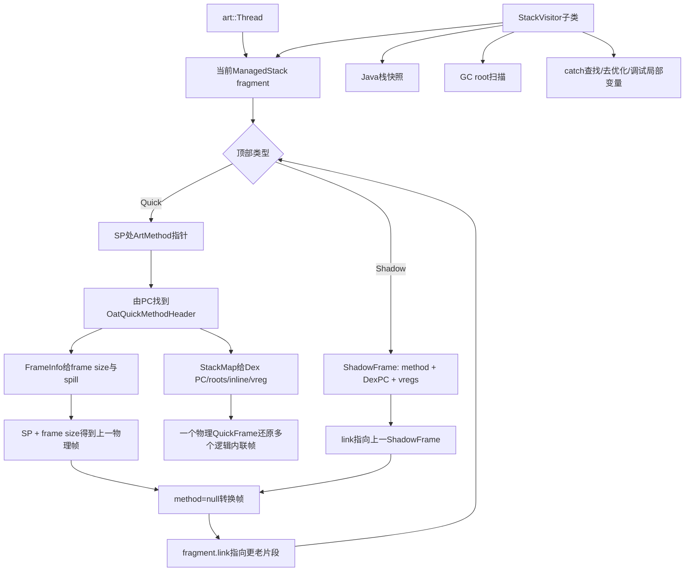
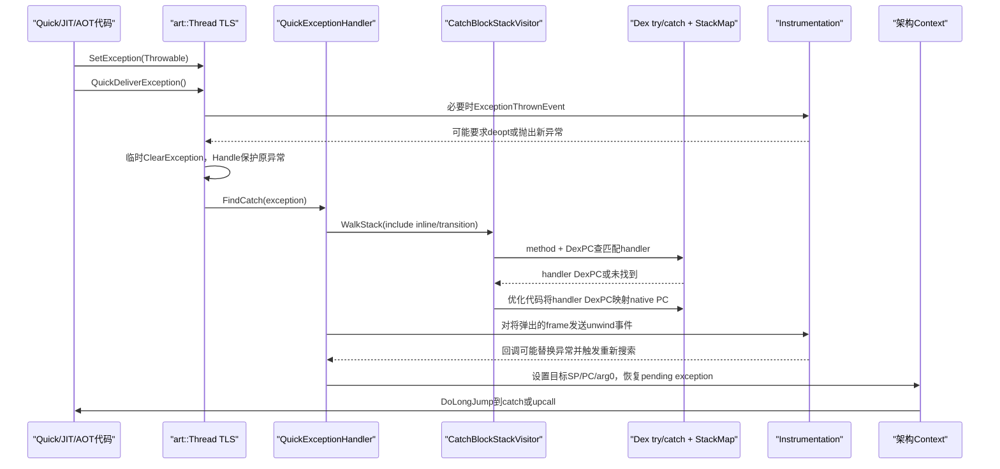
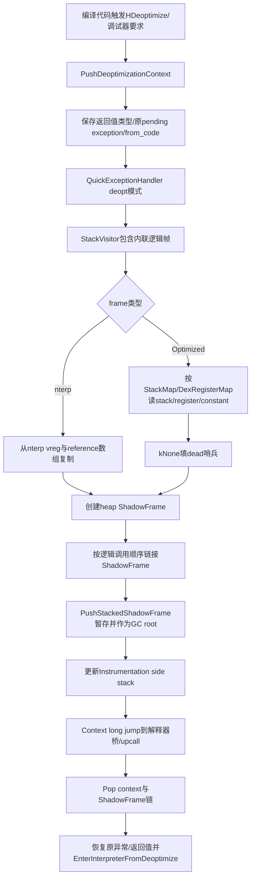

# 第562章 Android ART栈与异常分发链：ManagedStack、ShadowFrame、QuickFrame、StackVisitor、StackMap、异常投递、栈展开与Deoptimization

> 源码基线：AOSP `android-11.0.0_r48`（Android 11 / API 30）  
> 学习目标：分清Java逻辑栈、解释器ShadowFrame、编译QuickFrame、native栈与ManagedStack片段；理解ART怎样从native PC还原Dex PC、内联方法、GC roots和局部变量，再追完整的throw、catch搜索、栈展开、long jump、Throwable栈快照与deoptimization。  
> 阅读约定：继续在macOS只读源码，不实际编译；文中的“栈帧”会明确是物理机器帧还是逻辑Java帧，普通Java异常与ART用于去优化的特殊哨兵也会分开。

## 1. 本章先拆掉一句常见误解

“Java堆栈里显示一行方法，就一定对应native栈上的一个物理frame；异常从throw到catch，就是C++一层层return并执行析构。”

优化编译可把多个Java方法内联进一个QuickFrame，解释执行又使用显式ShadowFrame；ART的quick异常路径找到目标SP和PC后执行架构相关long jump，不是普通C++返回。能看到的Java逻辑栈，是ART结合物理帧、CodeInfo和内联元数据重建出来的视图。

## 2. 一句话主线

`Thread`中的`ManagedStack`把解释器ShadowFrame链、编译QuickFrame区间和Java/native转换边界串成多个片段；`StackVisitor`在目标线程自身或安全暂停后遍历片段，通过`OatQuickMethodHeader`与`StackMap`从return PC恢复方法、Dex PC、内联层、GC引用和vreg位置；异常则保存在当前线程TLS，解释器改ShadowFrame的Dex PC，quick代码搜索catch后重建机器Context并long jump，去优化则把QuickFrame的逻辑状态重建为可解释的ShadowFrame链。

## 3. 与第557、558、560、561章怎样衔接

第557章解释一个`ArtMethod`可走解释器、JIT或AOT入口；第558章要求GC找到所有栈上引用；第560章调试器要读写局部变量和做deopt；第561章保证读另一线程栈前先让它安全暂停。本章把这四条线汇到同一套栈元数据。

如果没有StackMap，优化代码里的对象引用无法可靠交给moving GC，native PC也难映射回断点Dex PC；如果没有暂停协议，另一线程的SP、PC和寄存器可能一边读一边变化。

## 4. 先区分五种“栈”

- Linux/pthread stack：真实虚拟内存区，保存机器调用帧；
- QuickFrame：ART编译代码、nterp和部分stub遵循的物理帧布局；
- ShadowFrame：解释器用C++对象显式保存方法、Dex PC和vreg；
- ManagedStack：挂在`art::Thread`上的片段目录，不是另一块完整栈内存；
- Java stack trace：方法名、文件与行号组成的逻辑快照。

这五者互有关联，却绝不能拿同一个指针或深度数字直接等同。

## 5. `ManagedStack`到底是什么

`art/runtime/managed_stack.h`的注释说，它记录managed code stack的片段。每个片段保存顶部quick frame指针或顶部shadow frame指针，再用`link_`连到更老片段。

它更像“如何解释当前native栈中各段managed帧”的索引，而不是把所有Java局部变量复制到一个容器。

## 6. 一个片段不能同时有两种顶部

`SetTopQuickFrame()`断言`top_shadow_frame_ == nullptr`；`SetTopShadowFrame()`又要求quick frame为空。StackVisitor也检查当前片段不能同时既有quick又有shadow顶部。

片段之间可以交替出现两种布局，单个片段内部则必须有明确解释方式。

## 7. 为什么需要多个ManagedStack fragment

managed代码进入runtime、JNI、反射或invoke stub，再回到managed代码时，物理帧布局会跨越转换边界。ART用`PushManagedStackFragment()`先把旧顶部复制到调用者提供的fragment，清空当前顶部并链接旧片段；返回时再`Pop`恢复。

因此fragment的生命周期常与native栈上的局部变量一致。漏pop会让后续walk从错误拓扑开始。

## 8. `ArtMethod::Invoke()`给出的真实例子

反射或运行时调用方法前，`ArtMethod::Invoke()`先检查栈溢出，再在native栈上创建`ManagedStack fragment`并push；随后进入解释器或quick invoke stub，返回后pop。

“push fragment”完成的只是登记转换边界，不代表目标Java方法已经建帧或开始执行。

## 9. 第一幅图：一条混合栈怎样被遍历



图中“上一帧”是调用时间上更早、栈展示上更靠下的帧；不同CPU栈增长方向已由ART的frame size计算封装。

## 10. quick frame顶部为何是`ArtMethod**`

QuickFrame约定SP位置可取得当前物理帧的`ArtMethod*`，所以ManagedStack保存`ArtMethod**`。StackVisitor解引用它得到外层编译方法，再按frame info找到return PC和下一帧。

它不是Java对象引用；`ArtMethod`属于ART方法元数据，声明类另需作为GC root保持可达和代码不被卸载。

## 11. quick frame的低位tag表示什么

`TaggedTopQuickFrame`利用至少4字节对齐的低位，为顶部quick frame附加Generic JNI标记。`GetTopQuickFrame()`会清掉tag再返回SP。

顶部native方法没有caller return PC可帮助区分Generic JNI与JIT JNI stub，tag正是StackVisitor处理这一歧义的额外事实。

## 12. tag不是“这个frame已被GC标记”

这里的tag只描述顶部是否是Generic JNI trampoline布局，与对象mark bit、read barrier或Java注解无关。名称相同不表示协议相同。

源码阅读中遇到tag，必须先看它编码在哪个字段、由谁解释。

## 13. ShadowFrame保存哪些核心字段

`art/runtime/interpreter/shadow_frame.h`保存前一frame链接、`ArtMethod*`、结果寄存器指针、Dex指令基址、vreg数量、当前Dex PC、hotness倒计时、锁计数数据和frame flags。

解释器不需要从机器return address猜Java位置，因为ShadowFrame直接保存Dex PC。

## 14. ShadowFrame为什么叫“影子”

它用显式数据结构模拟DEX抽象机看到的寄存器帧，而非完全依赖CPU ABI物理布局。解释器读取`v0...vN`、更新Dex PC，再沿`link_`找到调用者。

同一套结构还可承接从优化代码重建出的状态，所以deoptimization能把执行权交还解释器。

## 15. vreg不是Java局部变量的一一映射

DEX是寄存器机，vreg既可承载局部变量，也可承载参数、表达式临时值和wide值的一半。Java源变量经过javac/d8/R8后可能合并、删除或改位置。

调试器显示“局部变量”还需要debug local metadata；仅知道vreg数不能恢复Java源码里的所有变量名和生命周期。

## 16. primitive与reference为什么分两张数组

解释器布局先放每项4字节raw vreg，再放对应的`StackReference<Object>`数组。primitive写入时清同索引reference槽；reference写入时同步raw表示和reference槽。

moving GC只更新明确标记为引用的那张表，不会把一个恰好长得像地址的整数误认成对象。

## 17. wide值为何占相邻两个vreg

`long`和`double`由两个连续32位vreg承载，`Get/SetVRegLong`会检查`i + 1`仍在范围内，并清两个reference槽。

因此调试器或deopt重建wide值时必须保持高低半部与位置类型一致，不能只写一个槽。

## 18. reference槽不为null就一定是当前有效引用吗

ShadowFrame注释给了谨慎边界：在非moving collector下，reference数组里的非null值不必单独证明raw vreg当前仍是引用，调用方不确定时还要核对raw值。`CheckConsistentVRegs()`要求二者相同或reference为null。

这说明“GC保守保存用的影子信息”和“此Dex位置的精确类型”仍需元数据配合。

## 19. ShadowFrame有两种分配方式

普通解释调用常用宏在当前native栈上`alloca`一块连续内存；去优化则用`CreateDeoptimizedFrame()`在heap上分配，因为新ShadowFrame链要跨越long jump暂存。

heap这里指C++分配的native内存，不是Java managed heap。

## 20. 为什么普通ShadowFrame宏不能藏进内联函数

源码明确说明fresh alloca必须发生在调用者上下文，函数内联也不能可靠改变编译器回收alloca的边界，所以使用宏创建并配合自定义deleter只调用析构。

理解分配位置有助于解释：普通frame随native调用栈退出，deopt frame则必须显式删除。

## 21. ShadowFrame的Dex PC可能来自两种表示

`GetDexPC()`优先用`dex_pc_ptr_ - dex_instructions_`计算；指针为空时读保存的整数`dex_pc_`。解释器热循环可直接维护指令指针，在需要稳定状态时再导出位置。

不要同时假设两个字段都独立有效；setter会明确切换使用方式。

## 22. frame flags服务哪些非常规操作

r48包含notify-frame-pop、force-pop、force-retry-instruction、skip-method-exit-events和skip-next-exception-event等flag。它们让JVMTI/Instrumentation请求改变普通返回与异常路径。

这也解释第560章为什么调试动作可能迫使栈去优化：优化QuickFrame未必能直接表达“重试这条DEX指令”或可写局部状态。

## 23. QuickFrame没有统一C++结构体

它按目标ISA、编译结果和stub类型落在真实native栈内存中。固定入口约定给出ArtMethod位置，`QuickMethodFrameInfo`再给frame size、core/fp spill mask和return PC offset。

所以不能用一个固定`sizeof(QuickFrame)`跨方法步进；必须读取当前frame对应信息。

## 24. `OatQuickMethodHeader`位于哪里

每段ART编译代码前有`OatQuickMethodHeader`，保存vmap/CodeInfo相对偏移与code size。`FromEntryPoint()`从代码入口反推header，`Contains(pc)`判断PC是否位于该代码块。

JIT和AOT都可提供这种header；它不是只属于磁盘OAT文件。

## 25. `IsOptimized()`的r48判定

header的code size非0且`vmap_table_offset_`非0时视为optimized；nterp使用一个特制共享header并有单独`IsNterpMethodHeader()`判断。

不要把“有header”直接等同“Optimizing编译产物”，因为nterp也借同一接口向StackVisitor提供frame信息。

## 26. code size最高位还有另一层含义

`OatQuickMethodHeader`把最高位用作`should_deoptimize`标记，`GetCodeSize()`会屏蔽它。代码边界计算必须调用封装，不能直接把原始32位字段当长度。

这类位复用让header紧凑，也要求所有读取方遵守同一解释。

## 27. StackMap解决哪五个问题

源码注释列得很清楚：把native PC映射为Dex PC；指出哪些stack slots是对象；指出哪些寄存器是对象；保存内联信息；保存Dex registers的值位于哪里。

这五项分别服务异常/行号、GC、逻辑栈重建和调试/deopt，不是一张只给GC用的bitmap。

## 28. StackMap的四种Kind

r48有Default、Catch、OSR与Debug。普通safepoint使用Default，catch入口需要专门环境，OSR连接解释循环与优化代码，Debug可保存调试所需位置。

查同一Dex PC时必须按用途过滤；`GetCatchStackMapForDexPc()`甚至从尾部反向找catch项。

## 29. native PC为什么先转offset

ASLR、JIT code cache位置和不同加载地址会改变绝对PC。header用`pc - entrypoint`得到方法内offset，再按ISA指令对齐压缩到StackMap。

因此日志里的绝对PC需要同时知道所属代码块，单独一个数字不能永久映射源码。

## 30. 从PC回Dex PC并非任意位置都成功

优化代码只在编译器生成StackMap的可观察位置有可靠映射。`ToDexPc()`找不到时，按`abort_on_failure`选择fatal或返回`kDexNoIndex`。

调用方必须明确是否允许“不知道Dex PC”；诊断性dump常比异常分发更能容忍缺失。

## 31. 内联为什么制造“一个frame，多行栈”

InlineInfo保存每个内联深度的方法与Dex PC。StackVisitor选择`kIncludeInlinedFrames`时，会先逐个Visit内联逻辑帧，再Visit承载它们的外层QuickFrame。

这些逻辑帧共享一个物理SP；对它们调用会修改物理frame的方法指针之类操作通常被禁止。

## 32. 跳过内联帧有什么用途

GC扫描物理root时使用`kSkipInlinedFrames`，因为同一个QuickFrame的stack/register mask只需扫描一次。方法栈展示和catch查找则需要包含内联层，才能恢复Java语义。

“少显示了方法”和“少扫描了对象”不是同一问题，walk kind必须按消费者选择。

## 33. 方法entrypoint可能已经变化

某frame进入时执行的是AOT/JIT代码，之后Instrumentation或JIT状态可能改写`ArtMethod`当前entrypoint。StackVisitor不能总拿当前entrypoint解释旧frame，要结合frame PC、OAT/JIT查找与Generic JNI tag。

这与第557章“ArtMethod入口是可变路由”完全一致。

## 34. Instrumentation exit stub怎样影响return PC

方法追踪可把栈上的return PC替换为instrumentation exit PC，并把真实return PC保存在side stack。WalkStack遇到该哨兵时查`InstrumentationStackFrame`恢复原PC，再继续找调用者。

否则每个被插桩方法都会看起来返回同一个stub，栈无法继续正确展开。

## 35. runtime method为何常不显示给用户

callee-save、resolution或异常投递等ART内部frame也占物理栈。StackVisitor能看到它们，但`FetchStackTraceVisitor`跳过`IsRuntimeMethod()`，避免Java栈被实现细节淹没。

“栈trace没有runtime frame”不代表执行从未经过runtime stub。

## 36. transition frame是什么

一个fragment走到`ArtMethod* == nullptr`，表示到达Java/native布局转换边界。`WalkStack(include_transitions=true)`可把它作为method为null的一次Visit；默认用户栈不把它当普通Java方法。

异常quick walk则需要包含转换边界，若找不到Java catch就long jump到upcall继续更外层处理。

## 37. StackVisitor读另一线程的前提

构造器默认断言目标是当前线程，或目标已经处于suspended状态；walk还要求mutator lock共享访问。第561章的暂停协议先稳定目标栈，本章的visitor才负责解释它。

绕过`check_suspended`只适用于调用方已用别的协议证明安全的特殊路径，不是普通优化开关。

## 38. Context为何参与QuickFrame遍历

顶层CPU寄存器和各frame保存的callee-save共同决定较老frame的寄存器值。`Context::FillCalleeSaves()`随着向下walk，把当前frame保存的寄存器地址填入架构Context。

没有Context时可列方法，但无法可靠读取仍驻留机器寄存器的vreg；`GetVReg()`对此有断言。

## 39. Context是架构相关抽象

ARM、ARM64、x86和x86_64各自实现可访问GPR/FPR、设置SP/PC/arg0、填callee saves、破坏caller saves与long jump。上层异常算法不用硬编码每种ABI寄存器号。

所以异常分发虽然是通用C++算法，最后切换执行点仍依赖目标架构实现。

## 40. frame depth与frame ID不是地址

StackVisitor的depth随逻辑frame和可选transition推进；JDWP frame ID用`GetFrameHeight()+1`构造。它是某次稳定栈上的定位值，不是持久对象ID。

线程恢复、返回、内联状态变化或去优化后，旧frame ID不能无条件继续使用。

## 41. GC如何扫描ShadowFrame

`ReferenceMapVisitor`遍历每个reference槽，非null就交给RootVisitor；moving GC返回新地址时再写回ShadowFrame。它还扫描`LockCountData`里的Monitor引用并访问方法的声明类。

raw primitive vreg不会被保守地当对象，从而避免把随机整数固定在堆里。

## 42. GC如何扫描优化QuickFrame

visitor按当前native PC取得StackMap，stack mask标记物理栈slot，register mask标记callee-save GPR；Context提供寄存器实际地址。moving GC可原地改写这些root位置。

这要求线程停在有有效StackMap的位置。编译器生成safepoint与runtime入口协议就是正确性的组成部分。

## 43. 为什么声明类也是root

栈上`ArtMethod*`本身不是普通Java引用，但正在执行的方法不能失去其declaring class并导致关联代码/元数据被卸载。Root visitor会显式访问声明类。

这是一条“执行活跃性保护”，不是说类对象被放在每个DEX vreg中。

## 44. precise与non-precise root walk差别

两者都依stack/register mask找到真实对象；precise模式额外解DexRegisterMap，把物理位置反查为具体vreg编号。普通GC只要更新root可用non-precise，诊断需要来源时才付更多解码成本。

找不到对应vreg时precise visitor仍可用unknown标识报告对象，不会因此把真实root漏掉。

## 45. 线程TLS里还有哪些栈外root

`Thread::VisitRoots()`还访问Java peer、pending/async exception、正在竞争的Monitor对象、JNI locals/JNI monitors、HandleScope、去优化context、暂存ShadowFrame、debugger shadow frame与Instrumentation side stack中的`this`。

“扫描线程root”远大于“扫描Java方法vreg”。

## 46. pending exception放在哪里

每个`art::Thread`的TLS有`exception`指针。runtime helper发现错误时通常设置它并返回失败值；编译quick路径则可直接进入异常投递入口。

JNI里“函数返回null并有pending exception”的模式，底层就是这本线程局部异常账。

## 47. `throw null`怎样处理

编译代码调用`artDeliverExceptionFromCode(exception,self)`；参数为null时入口创建`NullPointerException`，否则把传入Throwable写入TLS，随后统一调用`QuickDeliverException()`。

所以Java的`throw null`不是把null当一种可捕获异常对象，而是转换为NPE。

## 48. 显式检查与隐式故障都能进同一投递链

数组越界、类型转换、显式null检查等quick helper创建对应异常后调用`QuickDeliverException()`；隐式null/stack overflow等还可能先由signal/fault handler识别故障PC，再转入quick throw入口。

来源不同，最终都要建立pending Throwable并恢复抛出位置。

## 49. 第二幅图：quick异常从throw到catch



这条路径没有从`QuickDeliverException()`正常return，所以函数与析构器用`NO_RETURN`/fatal保护错误回程。

## 50. `QuickDeliverException()`先识别一个特殊哨兵

若TLS exception等于`GetDeoptimizationException()`，它不做Java catch搜索，而直接进入`artDeoptimize()`。这个“异常”实际是对齐的假指针`0x100`，不是Java堆中的Throwable。

GC root扫描也显式排除该值。日志和工具不能尝试解引用它或打印普通异常字段。

## 51. 为什么用异常槽承载deopt控制信号

quick invoke stub返回后本来就会检查pending exception。ART复用这条跨汇编/C++边界的控制通道，让需要移除activation的场景回到统一去优化入口。

它是ART内部实现，不会被Java `catch(Throwable)`捕获。

## 52. ExceptionThrown事件为什么在catch搜索前

Instrumentation/JVMTI需要看到抛出点而非最后捕获点。r48还检查栈深与Throwable记录深度，避免在传播过程中对同一异常重复报告“刚抛出”。

回调可能触发GC，因此代码用Handle包装局部Throwable；回调还可能请求单步/断点，使后续路径改为deopt。

## 53. 调试需求怎样把异常路径改成解释执行

若debugger要求异常期间强制解释、frame-pop/retry flag存在或线程被force interpreter，QuickDeliverException先保存异常到deoptimization context，再进入`artDeoptimize()`。

这发生在ExceptionThrown回调之后，因为回调自身可能刚打开新的调试事件需求。

## 54. 为什么catch搜索前临时清pending exception

解析catch类型可能需要类解析并自己产生异常；若原异常一直挂在TLS，许多“要求当前无pending exception”的runtime操作会混淆。r48用Handle保存原Throwable，清TLS后搜索，最后按handler需要再装回。

“TLS为空”在这段内部窗口不等于程序已经吞掉原异常。

## 55. `ArtMethod::FindCatchBlock()`怎样匹配

它根据抛出Dex PC遍历覆盖该位置的catch handlers。无类型项是catch-all；有类型项就解析class，并用`handlerType.IsAssignableFrom(thrownType)`判断是否可接住。

找到第一个符合DEX编码顺序的handler就停止，不会为了找“更具体类型”再全表排序。

## 56. catch类型解析失败的r48特殊边界

若某handler声明的异常类无法解析，r48清掉由解析产生的`NoClassDefFoundError`，记录warning并继续找其他handler；源码明确说这不是参考实现行为。

最终原始异常由Handle恢复。不能把一般Java类解析失败规则从这里反推到所有VM。

## 57. `move-exception`承担什么职责

DEX handler通常以`move-exception vA`开头，把TLS pending Throwable写入目标vreg并清TLS。验证器禁止普通控制流跳到move-exception，保证它只作为异常handler首指令执行。

若handler首指令不是move-exception，`FindCatchBlock()`设置clear标记，投递前不再保留pending exception。

## 58. interpreter怎样转到同方法的catch

`MoveToExceptionHandler()`拿ShadowFrame当前Dex PC查handler；找到就把frame Dex PC改成handler地址。mterp返回“继续当前方法”，下一轮分派从新位置执行。

若没找到，它发送必要的MethodUnwind事件并返回“向调用者传播”，由解释器调用框架弹出当前ShadowFrame。

## 59. interpreter事件回调也能替换异常

ExceptionHandled listener执行前可能先清原异常；若回调抛出新异常，`MoveToExceptionHandler()`递归为新异常重新搜索handler，而不是继续把旧异常送进原catch。

调试插件因此能改变实际控制流，这也是开启观测会扰动程序的一个例子。

## 60. quick catch为何还要Dex PC转native PC

CPU不能跳到Dex指令编号。CatchBlockStackVisitor找到handler Dex PC后，通过当前`OatQuickMethodHeader::ToNativeQuickPc(..., is_for_catch_handler=true)`取得该优化代码的catch入口PC。

catch StackMap单独存放并从尾部查找，避免误选相同Dex PC的普通safepoint映射。

## 61. 内联方法的catch在哪里执行

Catch visitor包含inline frame，所以可先在逻辑内联方法里查try/catch。找到后仍使用承载它的外层QuickFrame header，把内联handler的Dex PC映射到真实native catch入口。

Java看见“内联方法捕获异常”，机器层不需要先构造一个独立物理frame。

## 62. 优化catch入口为何要修复环境

抛出点和catch入口对活跃vreg的物理位置约定可能不同。`SetCatchEnvironmentForOptimizedHandler()`取得throw StackMap与catch StackMap，把catch仍需存活的值从原寄存器/stack位置复制到catch要求的stack slot。

只改PC而不搬运phi/live值，handler会读到错误局部变量。

## 63. 被优化掉的局部变量能否凭空恢复

StackMap DexRegisterMap只为该位置需要的环境记录位置；`kNone`表示值在恢复语义上已死亡。调试器若要求任意位置完整可见，编译策略或deopt必须预先保留足够环境。

源码里“找不到vreg返回false”不是从Java堆或源码文本重新计算值。

## 64. Instrumentation unwind为什么可能反复搜索catch

异常将弹出的方法需要发送MethodUnwind事件；listener本身可能抛一个新异常，覆盖原异常。`FindCatch()`用`already_popped`和循环重新walk，直到安全弹到新异常的catch或栈顶。

所以一次throw不保证Instrumentation只执行一轮纯旁观回调。

## 65. instrumentation side stack何时删除

`InstrumentationStackPopper`记录已弹到的SP范围，析构时从side stack删除对应记录。真正物理long jump前，方法跟踪的影子return-PC账也必须同步收口。

否则以后stack walk会把旧记录误配给复用的native栈地址。

## 66. 找不到catch会走到哪里

walk遇到method为null的upcall/transition frame时，记录该SP和PC并停止。本片段没有Java handler，long jump回invoke stub或更外层native边界继续异常协议。

最后仍无处理者时，线程未捕获异常流程才调用Java Thread/ThreadGroup/RuntimeInit相关handler；那是异常投递后的另一阶段。

## 67. long jump前Context写入什么

`DoLongJump()`把目标quick frame设为SP、catch/upcall入口设为PC、必要的首参数写入arg0，并通常用已知坏值破坏caller-save寄存器，防止后续代码误用已经无效的值。

nterp handler还要把目标Dex指令指针写入架构约定寄存器。

## 68. 为什么long jump不是普通return

异常要一次越过多个物理frame，不能让每层C++ helper按正常返回地址继续执行。架构Context直接切SP/PC，旧frame从控制流上消失。

因此ART自身不能依赖被跨过的C++自动对象析构完成关键清理；必要状态要在jump前显式收口。

## 69. Java finally为何仍会执行

Java编译链把finally、synchronized退出等语义编码为正常/异常控制流与catch-all handler；ART查catch时会落到这些DEX/编译入口，再由代码执行清理并可能重新抛出。

这不是C++ long jump自动理解Java finally。正确性来自编译器生成的handler与ART异常表协作。

## 70. synchronized异常退出怎样保证解锁

Java编译产物必须在异常路径执行`monitor-exit`再传播。解释器并非对所有方法无条件维护额外列表；只有启用monitor counting且`ArtMethod::MustCountLocks()`成立的检查路径，才用`LockCountData`逐次记录enter/exit，并在frame退出仍有记录时尝试解锁、改抛`IllegalMonitorStateException`。

不要把QuickExceptionHandler想成“遍历frame时替应用释放每一把对象锁”；主要语义仍在生成代码和DEX handler中。

## 71. 异常对象的stack trace何时抓取

大多数Throwable构造器会调用`fillInStackTrace()`，捕获的是构造/显式刷新时的调用栈，不是每次`throw`指令都自动重新抓一份。重抛同一对象通常保留旧位置。

因此“最上面一行一定是当前throw语句”不是普遍保证。

## 72. 第一段真实Java源码：Throwable先保存native backtrace

```java
// libcore/ojluni/src/main/java/java/lang/Throwable.java
public synchronized Throwable fillInStackTrace() {
    if (stackTrace != null ||
        backtrace != null /* Out of protocol state */ ) {
        backtrace = nativeFillInStackTrace();
        stackTrace = libcore.util.EmptyArray.STACK_TRACE_ELEMENT;
    }
    return this;
}

@FastNative
private static native Object nativeFillInStackTrace();
```

native入口调用当前`Thread::CreateInternalStackTrace<false>()`。此时还没有逐项构造Java `StackTraceElement`；`backtrace`先保存ART内部快照对象。

## 73. 内部backtrace是什么布局

r48创建长度`depth + 1`的Object数组：第0项是长度`2 * depth`的PointerArray，前半放`ArtMethod*`，后半放Dex PC；其余项逐帧保存declaring Class，防止快照存活时类被卸载。

它是VM私有格式，应用不能把`Object backtrace`强转后依赖布局。

## 74. 为什么先数深度再建快照

`FetchStackTraceVisitor`先walk得到depth与要跳过的顶部Throwable frame数，并最多缓存256个method/DexPC对；随后分配恰当大小的内部数组。

深度小于256时直接复用缓存，无需第二次walk；恰好256因为条件是`depth < 256`仍会再walk一次，这是r48的精确边界，不影响语义但影响成本。

## 75. Throwable顶部frame怎样被跳过

visitor初始处于skipping状态；ART runtime frame直接跳过，普通frame只要声明类仍是Throwable或其子类也继续跳过，直到首个非Throwable声明类。注释写“跳过异常构造器”，实现条件实际上按声明类判断，不检查方法名是否`<init>`。

用户自定义Throwable子类若在顶部额外调用帮助方法，也可能一起被跳过；读实现比照抄注释更准确。

## 76. 第二段真实Java源码：StackTraceElement延迟物化

```java
// libcore/ojluni/src/main/java/java/lang/Throwable.java
public StackTraceElement[] getStackTrace() {
    return getOurStackTrace().clone();
}

private synchronized StackTraceElement[] getOurStackTrace() {
    if (stackTrace == libcore.util.EmptyArray.STACK_TRACE_ELEMENT ||
        (stackTrace == null && backtrace != null) /* Out of protocol state */) {
        stackTrace = nativeGetStackTrace(backtrace);
        backtrace = null;
        if (stackTrace == null) {
            return libcore.util.EmptyArray.STACK_TRACE_ELEMENT;
        }
    } else if (stackTrace == null) {
        return libcore.util.EmptyArray.STACK_TRACE_ELEMENT;
    }
    return stackTrace;
}
```

第一次读取才把method/Dex PC转换为类名、方法名、文件和行号并清`backtrace`；以后复用缓存。公开方法再clone，所以调用者改返回数组不会改Throwable内部记录。

## 77. 行号与文件名从哪里来

`CreateStackTraceElement()`用`ArtMethod::GetLineNumFromDexPC()`查DEX debug info，用声明类source file和方法名创建Java对象。优化内联frame已有自己的method/Dex PC，因此也能显示为独立Java行。

混淆、去除debug info或代理方法会降低信息质量；native PC本身不直接等于Java源码行号。

## 78. 栈快照为什么不是活视图

fill时保存方法与Dex PC；物化后保存`StackTraceElement[]`。线程继续执行、JIT入口变化或类中其他方法运行，都不会让旧Throwable自动刷新。

要抓新位置必须新建Throwable或显式再次`fillInStackTrace()`，前提是该Throwable允许可写stack trace。

## 79. 禁用writable stack trace会怎样

Throwable的四参数构造器可使stack trace不可写，内部用null状态表达；此时`fillInStackTrace()`不捕获，`getStackTrace()`返回空数组。

空数组不一定表示线程没有frame，也可能是异常对象策略、OOM或VM无法提供信息。

## 80. OOME为何可能没有完整栈

构建内部trace和`StackTraceElement`本身要分配内存。ART在递归OOME时使用预分配OutOfMemoryError，并可能只额外dump当前线程帮助诊断，不能继续依赖分配一份大栈。

诊断低内存问题时不要把“异常栈为空”误判为错误未发生。

## 81. 第三段真实Java源码：读取另一线程栈的公开入口

```java
// libcore/ojluni/src/main/java/java/lang/Thread.java
public StackTraceElement[] getStackTrace() {
    StackTraceElement ste[] = VMStack.getThreadStackTrace(this);
    return ste != null ? ste : EmptyArray.STACK_TRACE_ELEMENT;
}
```

`VMStack`是libcore隐藏native桥。返回null可能表示目标退出、拒绝暂停、特殊线程不能安全抓取等；公开API统一转换为空数组。

## 82. 抓当前线程与抓其他线程的差别

若peer就是当前线程，`GetThreadStack()`直接在自身上下文walk；否则调用者先转`kNative`，按peer暂停目标，进入可分配的ScopedObjectAccess构建trace，最后Resume目标。

所以读取其他线程栈会短暂改变它的调度，也不是完全无扰动采样。

## 83. 为什么明确跳过heap task thread

r48若发现目标是Heap Task Processor当前运行线程，就直接返回null，注释说明：抓栈需要分配，而暂停该堆任务线程可能造成分配依赖死锁。

Thread公开层于是给空数组。空不等于它真的没有执行栈。

## 84. 暂停目标也可能超时

`SuspendThreadByPeer()`失败并报告timed out时，native记录错误并返回null。原因可能是目标长时间未到安全检查点或运行时异常状态。

工具应把“抓取失败”与“成功抓到零帧”分开记录；Java这一便捷API本身会折叠为同样的空数组。

## 85. `getAllStackTraces()`是不是一个全局瞬时快照

不是。r48 Java实现先用ThreadGroup估算并枚举，再逐个调用`thread.getStackTrace()`。线程可在枚举和逐个暂停之间创建、退出或继续运行，各数组采样时刻不同。

用它画锁等待图时应承认时间偏差，必要时使用一次系统级thread dump的更强协调方式。

## 86. 栈trace为什么能显示被内联方法

创建内部trace使用`kIncludeInlinedFrames`。StackVisitor从InlineInfo取逻辑method与Dex PC，分别加入内部数组，所以优化没有必然让Java调用链消失。

但编译器只会输出它保留的元数据；VM规范也允许在某些情况下省略frame。

## 87. StackOverflowError怎样还能被抛出

线程栈初始化时在`stack_end`之外预留处理溢出的空间；ART可用显式边界检查，或通过受保护guard region触发fault handler。检测到溢出后临时调整边界/保护，留出构建和投递StackOverflowError的余量。

如果递归已经耗尽所有可用栈而没有预留，连异常投递自身都无法可靠运行。

## 88. 隐式栈溢出并非任意SIGSEGV都算SOE

fault handler检查故障地址、线程stack范围和PC/frame上下文，只有符合implicit stack check模式才转入StackOverflowError路径。其他非法访问仍应作为native fault处理。

这也是为什么崩溃日志需要同时看signal地址与当前栈区域。

## 89. 第三幅图：去优化如何把Quick状态变成Shadow状态



去优化不是把机器指令“反编译回DEX”，而是用编译时保存的环境表重建解释器在某个Dex PC继续所需的状态。

## 90. deoptimization context保存什么

`DeoptimizationContextRecord`保存返回`JValue`、它是否引用、触发前pending exception、是否来自编译代码以及method type，并以链支持嵌套deopt。

其中引用返回值与异常都被`Thread::VisitRoots()`访问，避免重建期间被moving GC漏掉。

## 91. 为什么deopt可能嵌套

thread.h注释指出去优化会调用verifier，可能触发类加载和Java代码，进而发生新的deopt。因此context和stacked shadow frame都不是单槽，而是链式record。

用一个全局“当前deopt对象”会被重入覆盖。

## 92. DeoptimizeStackVisitor怎样展开内联层

visitor选择include-inlined；一个物理优化frame里的每个inline逻辑方法都会创建一个ShadowFrame，最后再为outer方法创建一个。链顺序让解释器看到与Java调用语义一致的多层frame。

所以single-frame deopt所说“一帧”，指一个物理编译frame，可能包含多个ShadowFrame。

## 93. nterp frame怎样重建

r48的nterp frame已经有并行的int vreg数组和reference数组。deopt逐槽检查reference，非null就写新ShadowFrame引用，否则复制raw int；调试器已修改的槽保持其修改值。

它仍需复制，因为新ShadowFrame链要脱离即将被long jump抛弃的物理frame。

## 94. optimized frame怎样重建

根据native PC取StackMap与DexRegisterMap，每个vreg可能在stack slot、GPR、FPR、高半寄存器、常量或`kNone`。stack/register root mask再决定读出的32位是reference还是primitive。

这说明只有“位置”和“类型”两份元数据结合，才能安全调用`SetVRegReference()`。

## 95. dead vreg为什么填`0xEBADDE09`

位置是`kNone`时，r48给primitive槽留下`kDeadValue`哨兵。该vreg在恢复Dex PC的未来执行中应已死亡，不应被读取；若误读，醒目坏值比偶然合理的旧数据更易暴露元数据错误。

它不是Java可见的默认值，也不能当null引用。

## 96. debugger shadow frame怎样合并

调试器修改优化frame局部变量时，可先按frame ID建立ShadowFrame和updated-vreg flags。真正deopt时visitor复用它，只从机器状态补齐未修改槽，再删除frame-ID映射。

所以“SetLocal返回”与“运行代码已经使用新值”之间仍需要deopt完成点。

## 97. full与single-frame deopt差别

full尝试把当前ManagedStack fragment可去优化的所有编译frame重建到upcall或不可去优化边界；single-frame由编译代码显式触发，覆盖第一个物理frame及其所有inline层。

single-frame的HDeoptimize保证保存完整环境，所以即便一般`IsAsyncDeoptimizeable()`为false也允许执行。

## 98. 遇到不可异步deopt代码怎么办

full walk若遇到`IsAsyncDeoptimizeable(pc)`为false的frame，会记录warning并在该边界结束，形成partial-fragment deopt，而不是伪造缺失vreg继续。

随后修复return PC和arg0，从解释器桥接到剩余编译调用者；控制流比“整栈全部变解释器”更细。

## 99. single-frame deopt后编译代码怎样处理

启用JIT时，r48让code cache为该方法/header失效；没有JIT时，Instrumentation把方法入口更新到quick-to-interpreter bridge。当前activation靠ShadowFrame继续，未来调用也避免立即回到同一旧代码。

这不等于删除磁盘OAT文件，作用域仍是当前runtime的方法路由与JIT code。

## 100. stacked ShadowFrame为何不直接挂ManagedStack顶部

重建期间旧quick栈还没long jump离开。ART先把新链放进Thread的`stacked_shadow_frame_record`，既支持嵌套，又让GC可以扫描；到解释器桥再pop并设为top shadow stack。

这分开“状态已重建”和“执行权已切换”两个完成点。

## 101. 去优化的long jump怎样落到解释器

handler把Context目标设为quick-to-interpreter bridge或invoke upcall，必要时修复partial fragment的真实return PC。full fragment回到invoke边界时，ART先放回特殊deopt哨兵，`ArtMethod::Invoke()`看到它后调用`DeoptimizeWithDeoptimizationException()`；partial fragment则直接落到quick-to-interpreter桥。两条路最终都要取得暂存ShadowFrame与deopt context、恢复旧异常/返回值，再进入`EnterInterpreterFromDeoptimize()`一类的解释接管流程。

直到解释器入口取得链，deopt才真正开始以ShadowFrame执行。

## 102. 去优化会不会重跑已有副作用

恢复Dex PC与method type必须选择语义安全位置；编译器的deopt point保存环境，runtime helper还区分是否来自代码、返回值和是否应推进指令。随意在任意native PC重建会造成指令重复或遗漏。

这正是异步deopt只允许特定PC的原因。

## 103. 异常与deopt为何共用QuickExceptionHandler

两者都需要walk QuickFrame、更新Instrumentation side stack、设置目标SP/PC并long jump；差别是异常寻找catch，deopt构造ShadowFrame与解释器环境。共享机械层减少两套展开器漂移。

但调用时用`is_deoptimization_`分支并有断言，不能把Java Throwable搜索和控制哨兵混用。

## 104. 栈采样工具会遇到哪些不完整

目标可能未能暂停、正在特殊heap task、native PC无Dex映射、debug info被裁剪、局部变量被优化掉，或采样恰逢Instrumentation/deopt边界。方法列表可用不代表所有vreg、行号和锁信息都可用。

工具输出应保留unknown/omitted语义，避免用0或空字符串伪装精确结果。

## 105. 为什么频繁抓栈会影响性能

当前线程抓Throwable要walk、分配内部数组并最终物化字符串；其他线程抓栈还要请求暂停和恢复；包含内联与precise vreg时要解码更多CodeInfo。

性能采样应控制频率、深度和目标线程数，不能把每毫秒全线程`getStackTrace()`当零成本观测。

## 106. 一份Java栈能否证明真实执行耗时

单次快照只说明采样瞬间逻辑调用链，不能区分某frame刚进入还是已停留很久。多次独立采样的频率近似热点，还会受到安全点偏差和暂停成本影响。

需要精确时间线时应结合Perfetto、method tracing或CPU profiler，并理解第560章的观测扰动。

## 107. 读异常崩溃栈的正确顺序

先看异常类型与message，再看最初`Caused by`链和各Throwable自己的捕获位置；区分“构造异常的位置”“throw/rethrow的位置”和“未捕获处理位置”；最后结合优化内联、native frame与源码版本映射。

不要只盯第一行方法名就认定根因，尤其是缓存并反复抛出的异常对象。

## 108. 读ART栈代码的固定五问

当前是Shadow还是Quick？目标线程是否稳定？这个PC对应哪个header/StackMap？visitor是否包含inline和transition？消费者要的是方法列表、GC root、精确vreg还是可跳转catch环境？

五问答清，绝大多数“为什么这个frame看不见/值读不到”都能落到具体完成点。

## 109. 一个最小异常心智模型

throw先把Throwable放进当前Thread；解释器按Dex PC改ShadowFrame，quick按StackMap找到目标机器PC；找不到就向外层传播；Instrumentation可能在途中改变异常或要求deopt；最终执行Java handler或到达upcall交给未捕获流程。

异常对象、异常位置、pending状态与执行目标是四本账，不应合成“抛了一个对象”一句话。

## 110. 本章高频误解清单

- 一行Java栈不一定对应一个物理frame；
- ManagedStack不是第二块完整线程栈；
- ShadowFrame的vreg不等于源码局部变量；
- StackMap不只给GC，也服务Dex PC、inline、catch和deopt；
- 读另一线程栈通常要暂停它；
- Throwable常在构造/fill时抓栈，不在每次throw自动刷新；
- quick异常用long jump，不是普通C++逐层return；
- deoptimization exception是`0x100`假指针，不是Java Throwable；
- full deopt可能在不可去优化边界变成partial fragment。

## 111. 开始练习前的只读检查表

下面四个练习只做`test`、`rg`和`sed`，不编译、不写源码树。请在macOS终端运行；成功标准是退出码0并看到对应r48源码行。

练习目标不是背路径，而是把“表示—元数据—控制流—公开API”四层各自定位一次。

## 112. 练习一：核对ManagedStack与ShadowFrame布局

```bash
set -euo pipefail
SRC=/Users/ninebot/androidSource
MS="$SRC/art/runtime/managed_stack.h"
SF="$SRC/art/runtime/interpreter/shadow_frame.h"
test -f "$MS"
test -f "$SF"
rg -n 'PushManagedStackFragment|tagged_top_quick_frame_|top_shadow_frame_|SetTopQuickFrame' "$MS"
rg -n 'CreateDeoptimizedFrame|ComputeSize|number_of_vregs_|dex_pc_|vregs_\[0\]' "$SF"
```

观察：ManagedStack只保存顶部与link；ShadowFrame尾部才是raw vreg和reference影子数组，deopt frame使用native heap分配。

## 113. 练习二：核对StackMap的五类信息与inline walk

```bash
set -euo pipefail
SRC=/Users/ninebot/androidSource
MAP="$SRC/art/runtime/stack_map.h"
WALK="$SRC/art/runtime/stack.cc"
test -f "$MAP"
test -f "$WALK"
sed -n '115,170p' "$MAP"
rg -n 'kIncludeInlinedFrames|GetInlineInfosOf|GetCurrentStackMap|FillCalleeSaves|include_transitions' "$WALK"
rg -n 'instrumentation_frame.return_pc_|FrameSizeInBytes' "$WALK"
```

观察：StackMap同时记录PC、roots、inline与Dex registers；walk还要恢复Instrumentation真实return PC并按每帧size移动SP。

## 114. 练习三：核对quick异常搜索与long jump完成点

```bash
set -euo pipefail
SRC=/Users/ninebot/androidSource
THR="$SRC/art/runtime/thread.cc"
QEH="$SRC/art/runtime/quick_exception_handler.cc"
test -f "$THR"
test -f "$QEH"
rg -n 'void Thread::QuickDeliverException|GetDeoptimizationException|FindCatch\(exception\)|DoLongJump' "$THR"
rg -n 'FindCatchBlock|SetCatchEnvironmentForOptimizedHandler|PopFramesTo|SetSP|SetPC|DoLongJump' "$QEH"
```

观察：Thread先区分假deopt异常，再清pending做catch搜索；最终完成点是Context切换SP/PC，而不是`FindCatch()`返回。

## 115. 练习四：核对Throwable延迟物化与跨线程抓栈

```bash
set -euo pipefail
SRC=/Users/ninebot/androidSource
JAVA="$SRC/libcore/ojluni/src/main/java/java/lang/Throwable.java"
NATIVE="$SRC/art/runtime/native/dalvik_system_VMStack.cc"
THREAD="$SRC/art/runtime/thread.cc"
test -f "$JAVA"
test -f "$NATIVE"
rg -n 'backtrace = nativeFillInStackTrace|stackTrace = nativeGetStackTrace|return getOurStackTrace\(\)\.clone' "$JAVA"
rg -n 'SuspendThreadByPeer|heap_task_thread|GetThreadStack|Resume\(thread' "$NATIVE"
rg -n 'kMaxSavedFrames = 256|depth < kMaxSavedFrames|InternalStackTraceToStackTraceElementArray' "$THREAD"
```

观察：Throwable先存内部backtrace，读取时才物化并clone；跨线程抓取会暂停目标，且heap task thread有明确拒绝分支。

## 116. 四个练习串起来说明什么

练习一确定两种frame的真实存储；练习二确认优化代码为何可被解释；练习三把元数据转为异常控制流；练习四把内部walk接到开发者看到的Java数组。任何一层缺失，都不能从PC可靠得到可读且GC安全的Java栈。

建议把每个命中的函数上下各读30行，尤其留意注释与实际条件是否完全一致。

## 117. 本章复读后最容易卡住的三个点

第一，logical inline frame没有独立SP，却能有独立method/Dex PC；第二，ClearException可能只是为类解析腾出TLS，并不等于吞异常；第三，deopt的ShadowFrame已建好时，控制权仍可能尚未切入解释器。

每次困惑时写出“物理状态”和“Java可见状态”两栏，通常就能解开。

## 118. 本章源码地图

- `art/runtime/managed_stack*.h`：片段、quick/shadow顶部与Generic JNI tag；
- `art/runtime/interpreter/shadow_frame*.h`：vreg、reference影子、Dex PC和frame flags；
- `art/runtime/stack.*`、`arch/context.*`：统一walk、寄存器恢复与架构Context；
- `art/runtime/stack_map.*`、`oat_quick_method_header.*`：PC、frame info、roots、inline和Dex register位置；
- `art/runtime/thread.cc`：线程roots、内部栈快照、QuickDeliverException与deopt context；
- `art/runtime/art_method.cc`：invoke fragment和catch类型匹配；
- `art/runtime/quick_exception_handler.*`：quick catch、unwind、environment修复与long jump；
- `art/runtime/interpreter/interpreter_common.cc`：ShadowFrame异常处理；
- `art/runtime/native/java_lang_Throwable.cc`、`dalvik_system_VMStack.cc`：Java/native桥；
- `libcore/ojluni/.../Throwable.java`、`Thread.java`：公开栈API缓存与返回语义。

## 119. 用一段话重建完整心智模型

线程真正执行在pthread stack上，ManagedStack只把不同managed布局的片段串起来；解释器直接在ShadowFrame保存method、Dex PC和vreg，编译代码则靠QuickFrame、return PC、OatQuickMethodHeader和StackMap事后恢复逻辑状态。StackVisitor按消费者选择是否展开inline与transition，GC用root masks更新引用，Throwable保存method/Dex PC快照，异常用同一元数据搜索handler并long jump，deopt再把可恢复的Quick环境复制为ShadowFrame链后切进解释器。这里每一步都有独立完成点，不能把“能列出方法”误当“能恢复全部执行状态”。

掌握这条链后，栈trace、GC root、断点局部变量、异常catch与JIT deopt就不再是五套互不相干的魔法。

## 120. 下一章预告与阅读问题

第563章继续ART反射与动态调用链：`Class`/`Method`/`Constructor`、ArtMethod、访问检查、参数转换、反射invoke、MethodHandle、invoke-polymorphic、Proxy与异常包装。

读完本章请先回答四问：一个物理QuickFrame为什么能显示多个Java方法？为什么catch搜索时可以暂时ClearException？为什么另一线程的`getStackTrace()`可能返回空数组却不代表无线程栈？为什么deopt frame已经创建后仍要long jump和解释器接管？四问能讲清，再进入第563章。
