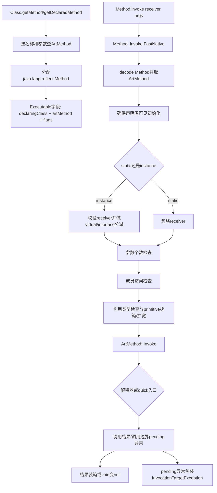
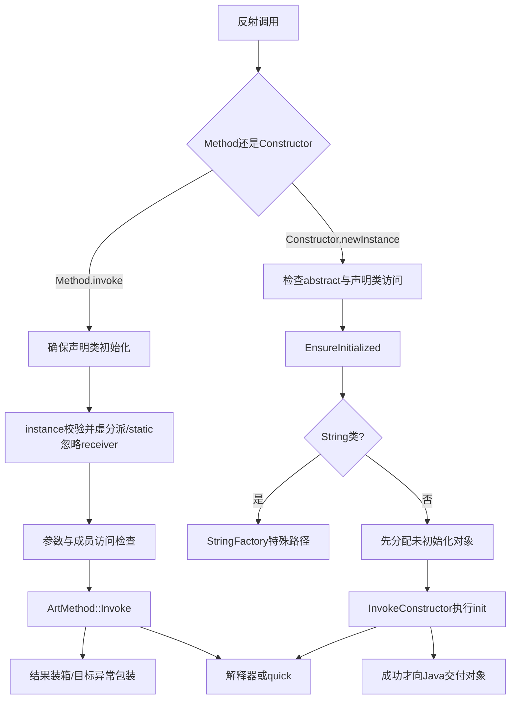
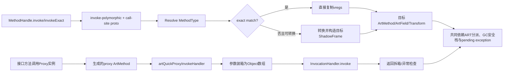

# 第563章 Android ART反射与动态调用链：Method、Constructor、ArtMethod、访问检查、参数转换、MethodHandle、invoke-polymorphic与Proxy

> 源码基线：AOSP `android-11.0.0_r48`（Android 11 / API 30）  
> 学习目标：把Java反射对象、ART内部方法元数据、反射参数转换、真实方法入口、MethodHandle的调用点类型和动态代理类分层；能够解释异常究竟在调用前产生、被`InvocationTargetException`包装、原样穿透，还是被`UndeclaredThrowableException`包装。  
> 阅读约定：继续在macOS只读源码，不实际编译；本文优先描述本工程r48代码的实际顺序，遇到Java文档、通用JVM知识与Android实现不完全一致时会明确标注。

## 1. 本章先拆掉一句常见误解

“反射就是把方法名字符串交给虚拟机，MethodHandle只是更快的反射，动态Proxy则是运行时生成一段Java源码。”

实际不是一条链：`Method`/`Constructor`是堆上的Java镜像，内部持有`ArtMethod*`；反射把`Object[]`检查、拆箱并包装目标异常；MethodHandle的类型来自DEX调用点的真实proto，目标异常不套`InvocationTargetException`；Android r48的Proxy由ART直接构造`Class`、`ArtMethod`和quick入口，并不先生成Java源码文件。

## 2. 一句话主线

`Class`查询先把可发现的`ArtMethod`包装为`Method`或`Constructor`，调用时ART从`Executable.artMethod`取回元数据，完成类初始化、接收者、参数与访问检查，再经`ArtMethod::Invoke()`进入解释器或quick代码；MethodHandle则由`Lookup`在创建期完成访问裁决，在`invoke-polymorphic`处用独立proto构造`MethodType`并做精确匹配或转换；Proxy把接口方法克隆成没有CodeItem的代理`ArtMethod`，统一落入quick trampoline，最终调用`InvocationHandler.invoke()`。

## 3. 与第557、559、561、562章怎样衔接

第557章已经看到`ArtMethod`的解释/JIT/AOT入口，第559章解释JNI局部引用与pending exception，第561章解释线程状态和锁，第562章解释`ManagedStack`、ShadowFrame与去优化。本章的反射native入口正好跨过这四条边界。

反射不是绕过ART执行模型：最终仍需方法分派、栈片段、GC安全引用、异常TLS和解释/quick入口，只是“编译期已知参数”改成了“运行期检查并组装参数”。

## 4. 先分清六层对象

- `java.lang.reflect.Method/Constructor`：App能持有的Java对象；
- `mirror::Executable/Method/Constructor`：ART用C++访问上述Java对象布局的镜像类型；
- `ArtMethod`：类链接后真正的运行时方法元数据；
- `java.lang.invoke.MethodHandle`：带调用行为、目标和`MethodType`的强类型句柄；
- DEX调用点：`invoke-polymorphic`还携带一个独立proto；
- Proxy生成类：真正可实例化的`Class`，其方法入口指向代理trampoline。

同样出现“method”一词，不表示它们是同一种对象或具有同一生命周期。

## 5. `Executable`为什么是共同底座

OpenJDK Java层让`Method`和`Constructor`都继承`Executable`，Android又在`Executable`末尾加入运行时字段。这样参数类型、注解、访问标志和ART指针可以共享布局及native实现。

`Field`也属于反射成员，但它不继承`Executable`，读写最终走`ArtField`与字段访问转换；本章集中研究“会建立调用帧”的方法和构造器链。

## 6. `Executable`里最关键的五本账

本地`Executable.java`包含`accessFlags`、`long artMethod`、`declaringClass`、`declaringClassOfOverriddenMethod`和`dexMethodIndex`。C++镜像`mirror/executable.h`用完全对应的字段顺序读取它们。

`artMethod`负责回到native元数据，`declaringClass`保持定义身份，代理方法还需额外记录被覆盖方法的声明类。它们不是可相互推导后随意删掉的冗余缓存。

## 7. `long artMethod`不是稳定的跨进程ID

它保存当前ART进程地址空间中的`ArtMethod*`位模式。这个值不能写进数据库、跨Binder发送后在另一进程解引用，也不能拿来和下次启动的地址比较。

Java把字段声明成`long`只是为了容纳32/64位native指针；`ArtMethod::FromReflectedMethod()`实际只把Java对象decode成`mirror::Executable`，再调用`GetArtMethod()`。

## 8. 为什么声明类必须一直活着

`Executable.java`的注释明确写着：class loader由声明类保持存活。`ArtMethod`又归属于其声明类的方法数组；若类与ClassLoader可被卸载，裸指针也随之失效。

因此反射对象同时保存`declaringClass`这一Java强引用。不要把`artMethod`误当成GC认识的Java引用；它是由ART按反射目标专门访问和更新的native目标。

## 9. 第一幅图：普通反射从Java镜像走到真实代码



图中的先后顺序很重要：r48的真实`InvokeMethod()`会先初始化声明类，再校验instance receiver、参数数量和访问权限；它不是把所有“调用前检查”一次性并行完成。

## 10. `CreateFromArtMethod()`做了什么

`mirror::Method::CreateFromArtMethod()`先从ClassRoot取得`java.lang.reflect.Method`类并分配普通Java对象，然后调用`Executable::CreateFromArtMethod()`写入目标指针、声明类、访问标志和dex方法索引。

构造器路径完全类似，只是分配`java.lang.reflect.Constructor`，并断言目标确实带constructor标志。创建反射对象不是创建或复制目标方法代码。

## 11. `getMethod`与`getDeclaredMethod`先决定“能找到谁”

`getMethod`面向public成员并包含继承搜索，`getDeclaredMethod`面向当前类声明成员且可返回非public成员。它们的发现规则与随后`invoke()`是否允许调用是两道门。

所以“拿到了Method对象”不等于“现在的调用者一定能调用它”；而查询失败通常是`NoSuchMethodException`，调用访问失败才是`IllegalAccessException`。

## 12. hidden API限制属于第三道门

`art/runtime/native/java_lang_Class.cc`在反射查询和枚举时调用`hiddenapi::ShouldDenyAccessToMember(..., kReflection)`，基于反射调用者上下文决定成员是否可发现。

`setAccessible(true)`只影响Java语言访问检查的override位，不能被理解成“白名单、灰名单和黑名单全部失效”。成员发现、语言可见性、平台hidden API策略必须分账。

## 13. `AccessibleObject.override`名字为何容易误导

公开API叫`setAccessible`，内部boolean却叫`override`。值为true的含义是覆盖通常的Java语言访问检查，不是“这个成员天生public”，更不是让目标对象类型、参数数量或返回类型检查消失。

本地`mirror::AccessibleObject::IsAccessible()`读取的正是这个位，`InvokeMethod()`把它保存到局部变量`accessible`后决定是否调用`VerifyAccess()`。

## 14. override不会跳过哪些检查

即使override为true，r48仍会确保声明类初始化、验证非static接收者、动态选择虚方法、核对参数个数、检查引用可赋值性、拆箱和primitive扩宽。

目标代码抛出的异常也仍会包装为`InvocationTargetException`。所以setAccessible是“访问控制开关”，不是“不安全地按任意ABI跳转”。

## 15. 第一段真实Java源码：`Method.invoke()`本身就是native入口

下面来自`libcore/ojluni/src/main/java/java/lang/reflect/Method.java`。Java签名看似接收`Object...`，ART注册表实际把它映射到`Method_invoke(JNIEnv*, jobject, jobject, jobjectArray)`。

```java
    @CallerSensitive
    // Android-changed: invoke(Object, Object...) implemented natively.
    @FastNative
    public native Object invoke(Object obj, Object... args)
            throws IllegalAccessException, IllegalArgumentException, InvocationTargetException;
```

`@FastNative`优化Java/native切换约定，不等于方法内部不能分配、不能抛异常或不能进入任意Java目标。

## 16. static方法为什么可以传任意receiver

`InvokeMethod()`只在`!m->IsStatic()`时decode和验证`javaReceiver`；static分支根本不使用它。因此传null最清楚，传其他对象也会被忽略。

这不代表static方法没有声明类：类初始化、访问检查、返回类型和目标入口仍从`ArtMethod`的声明信息取得。

## 17. r48何时初始化声明类

代码在区分static和instance之前调用`EnsureInitialized(..., can_init_fields=true, can_init_parents=true)`，条件是声明类尚未`IsVisiblyInitialized()`。

因此本地实现不仅static反射调用会触发这一步，instance反射调用也会先确保初始化；并且初始化失败发生在receiver、参数数目与成员访问检查之前。读Java API文字时必须用这里的实际顺序校准。

## 18. instance receiver有两项检查

receiver不得为null，而且必须是原始`declaring_class`的实例。`VerifyObjectIsClass()`分别产生空接收者的NPE或类型不匹配的`IllegalArgumentException`。

这里检查的是“能否作为该成员的this”，与每个普通参数是否匹配完全独立。

## 19. instance调用为何还要重新找方法

拿到的Method可能声明在父类或接口，receiver的运行时类可能覆盖它。ART调用`FindVirtualMethodForVirtualOrInterface()`找到真正进入的实现，这与普通`invokevirtual`/`invokeinterface`的动态分派一致。

private、static和构造器不按这套普通虚分派语义运行；不能把“反射”理解成强制调用Method对象声明类中的那段实现。

## 20. 代理方法为何总取`GetInterfaceMethodIfProxy()`

Proxy生成的`ArtMethod`没有自己的Dex CodeItem，它的数据指针保存原始接口prototype。参数shorty、类型列表和某些注解/异常信息必须回到non-proxy方法解释。

因此`InvokeMethod()`把动态分派后的`m`用于真正执行，却把`np_method`用于参数检查和shorty组装。这两根指针在普通方法上相同，在代理方法上故意不同。

## 21. 参数个数在哪里判定

`CheckArgsForInvokeMethod()`读取目标参数TypeList长度，再把null的`javaArgs`视为0个参数；只有数量完全相等才继续。

错误消息直接说明expected与got，并抛`IllegalArgumentException`。它发生在目标执行之前，不会再套`InvocationTargetException`。

## 22. 目标是varargs方法时会自动重新打包吗

不会。`Method.invoke(Object,Object...)`的varargs只方便Java调用者构造外层`Object[]`；反射runtime仍要求该数组长度等于目标的形式参数个数。

若目标签名是`f(String, int...)`，反射看到的是两个形式参数：`String`和`int[]`。第二个元素必须是一个`int[]`对象；把多个Integer平铺到外层数组不会由ART自动收拢。

## 23. `ArgArray`解决什么问题

Java反射传来的是引用数组，而quick/interpreter入口需要按DEX calling convention排列的32位vreg槽。`ArgArray`先放可选receiver，再按shorty把每个对象检查、拆箱并写到连续槽中。

小参数列表使用16个32位槽的栈内数组，超出后才分配更大数组；这是一项存储优化，不改变参数语义。

## 24. shorty为什么不能替代完整签名

shorty只保留返回类型和参数的大类字符，例如所有引用与数组都写成`L`，`J`/`D`表示wide类型。它足以决定槽宽、基础装箱函数和invoke stub ABI。

但`String`、`Runnable`和`int[]`都可能只显示`L`，所以引用可赋值检查仍需用完整TypeList解析目标`Class`。

## 25. 参数转换中为什么建立HandleScope

解析参数类型、装箱或触发类解析都可能发生线程挂起和moving GC。`BuildArgArrayFromObjectArray()`用Handle保护原始参数数组和当前参数，而不是长期拿裸`Object*`跨挂起点。

最后写给调用帧的引用还要按ART的`StackReference`约定被GC识别；这一点与第558、559章的root规则完全一致。

## 26. primitive反射参数不是任意`Number`

ART按具体包装类描述符读取第一个实例字段：Boolean、Byte、Character、Short、Integer、Long、Float、Double各有明确分支。

自定义`Number`子类即便能返回`intValue()`也不会被反射自动调用；不在允许矩阵内就抛`IllegalArgumentException`。

## 27. boolean与byte为什么最严格

目标boolean只接受`Boolean`，目标byte只接受`Byte`。boolean不参与数值转换，byte也不能由Short或Integer“确认值没越界后”缩窄。

反射检查的是类型允许的method invocation conversion，不根据某次运行值是否刚好可容纳决定。

## 28. r48的primitive扩宽矩阵

目标short接受Short或Byte；int接受Integer、Character、Short、Byte；long再接受Long；float再接受Float和所有上述整数；double再接受Double、Float及上述整数。

矩阵方向是“包装对象的源primitive能否扩宽到目标primitive”。例如Integer可给long，Long不能给int；Character可给int，Short不能给char。

## 29. 为什么没有自动缩窄

把Integer(1)传给byte参数仍失败，因为反射不会悄悄截断。若调用者确实想传byte，必须在装进`Object[]`前显式得到`Byte`。

同理Double不能给float，Float不能给long。这种严格性使反射和普通Java调用的基本转换边界保持可预测。

## 30. 引用参数怎样检查

非null引用要求`arg->InstanceOf(dst_class)`；子类对象可传给父类或接口参数，反向不行。数组也按真实数组Class做可赋值检查，而不是只看它们都是对象。

失败消息会同时打印目标参数类型和实际对象类型，定位时先核对ClassLoader身份；名字相同但由不同ClassLoader定义的Class依旧不可赋值。

## 31. null参数有哪些不同结果

目标引用参数可以接收null，目标primitive收到null则直接`IllegalArgumentException`。这是因为前者的vreg可保存空引用，后者没有可拆箱的包装对象。

不要把这一错误与instance receiver为null混为一谈：receiver为null抛NPE，primitive实参为null是参数转换失败。

## 32. long与double为何占两个槽

shorty中的`J`和`D`用`AppendWide()`写两个相邻32位单元，其他primitive及引用各占一个。`args_size`最终按字节交给invoke stub。

参数“个数”仍按Java形式参数计数，vreg“槽数”则因wide值增加；把这两个数字混用是读调用代码时常见的越界根源。

## 33. 真正执行前的最后一步

`InvokeMethodImpl()`组好`ArgArray`后调用`InvokeWithArgArray()`，后者在CheckJNI打开时再核查参数，然后执行`method->Invoke(self, args, numBytes, result, shorty)`。

到这里才进入目标方法。此前的类初始化、receiver、个数、访问与转换异常都属于反射框架自身，而不是目标方法抛出的异常。

## 34. `ArtMethod::Invoke()`为何push ManagedStack fragment

当前线程正从native反射实现重新进入managed目标，必须登记一个Java/native转换边界。它在native栈上创建`ManagedStack fragment`、push，调用结束后pop。

fragment只描述栈片段拓扑；目标是否解释执行、是否有quick frame以及是否随后deopt，是下一层决策。

## 35. 解释器与quick入口怎样选择

runtime尚未启动，或线程被强制解释且目标适合解释时，`ArtMethod::Invoke()`走`EnterInterpreterFromInvoke()`；正常情况若有quick entrypoint，则调用static或instance invoke stub。

quick entrypoint可能是AOT/JIT代码，也可能是resolution、JNI或Proxy trampoline。看到“quick”不能直接断言它就是优化后的Java机器码。

## 36. primitive返回值怎样回到`Object`

目标把结果写入`JValue`。反射根据shorty第一个字符调用对应包装类`valueOf`；这意味着int返回为Integer、boolean返回为Boolean，引用则原样成为JNI local reference。

数组即便元素是primitive，数组本身仍是引用，不会逐元素装成包装对象数组。

## 37. void返回值为何是null

`BoxPrimitive(kPrimVoid, result)`明确返回nullptr，所以`Method.invoke()`对void目标的Java返回值是null。

这不是目标方法返回了一个null对象，而是反射API需要统一使用`Object`承载不同返回类型所定义的投影。

## 38. 先把异常分成三类

第一类是进入通用invoke边界前的异常：外层栈检查、类初始化失败、receiver错误、参数数量、访问或转换失败；第二类是`InvokeWithArgArray()`/`ArtMethod::Invoke()`期间出现的pending Throwable，其中通常是目标代码抛出的异常，也可能是通用调用机械在真正进入目标前产生的栈溢出等异常；第三类是包装已有异常时又发生的分配失败等新异常。

按r48代码，第二类只要在`ArtMethod::Invoke()`返回时仍pending，就会尝试转换成`InvocationTargetException`。诊断反射失败时先确定异常产生于哪条边界，别把“被wrapper包住”反推成“目标方法体第一条指令一定已经执行”。

## 39. `InvocationTargetException`在哪里建立

`InvokeMethodImpl()`在`ArtMethod::Invoke()`返回后检查线程pending exception。若存在，它先取得Throwable局部引用、清TLS异常，再用该Throwable构造`InvocationTargetException`并重新throw。

这就是反射调用边界包装pending异常的准确完成点；它不是编译器为每个反射调用自动生成的catch块。大多数情况下cause来自目标方法体，但源码条件检查的是pending状态，而不是“已经进入方法体”标志。

## 40. 包装对象创建也可能失败

如果构造`InvocationTargetException`时发生OOM等异常，源码注释明确说使用新的异常，不再恢复原目标异常。此时调用者可能看不到期待的wrapper。

因此“Method.invoke只可能抛文档列出的三种受检异常”也不完整，Error与资源失败仍可沿Java异常机制传播。

## 41. 访问检查怎样知道调用者是谁

`VerifyAccess(Thread*, ..., num_frames)`创建`NthCallerVisitor`走当前线程栈，跳过指定反射native层数，取得真实调用者`ArtMethod`的声明类。

`@CallerSensitive`不是把Class对象作为显式参数传进来；ART在这里基于栈恢复调用上下文。

## 42. public成员的r48快路径

若方法access flags包含`kAccPublic`，`VerifyAccess()`直接返回true，不再走caller stack。对非public成员才真正取得calling class。

注意这段函数只展示成员标志快路径；成员“是否可被查询”、hidden API与声明类可见性还有各自入口，不能用这一行概括整个反射安全模型。

## 43. private、protected与package怎样裁决

同一calling class直接允许；private跨类拒绝；protected会结合调用者是否为声明类子类、receiver类型和是否同包；最后package-private依靠`IsInSamePackage()`。

运行时package身份还与ClassLoader有关，源码里的“同包”不应简化为类名字符串具有相同前缀。

## 44. attached native线程没有Java调用帧怎么办

若栈上找不到calling class，`VerifyAccess(Thread*)`返回false；普通反射Method调用会得到IllegalAccessException。它没有把“未知调用者”当成系统最高权限。

但某些JNI专用入口会明确选择不执行Java访问检查，所以必须先确认当前走的是反射API还是JNI CallMethod系列。

## 45. 访问检查为何在动态分派之后

r48先由receiver找到实际实现，再把当前`m->GetAccessFlags()`、原始声明类和receiver交给`VerifyAccess()`。大部分合法override访问级别只会放宽，因此结果符合普通动态调用直觉。

调试日志里同时记录原Method和实际ArtMethod，能避免把“查询到父类成员”误说成“最终一定进入父类代码”。

## 46. `setAccessible(true)`本身也有限制

本地`AccessibleObject.setAccessible0()`禁止让`Class`、`Method`和`Field`的特殊构造器变为accessible。Android r48还移除了多段SecurityManager检查，但这不等于没有平台策略。

生产代码依赖私有成员会受版本、hidden API和封装演进影响；源码学习可追它，业务兼容性不能只凭一次设备测试判断。

## 47. `setAccessible`与hidden API为什么不能互相替代

hidden API可能在`Class.getDeclaredMethod`阶段就让结果不可发现，而override位只有拿到反射对象后才设置。前门已经拒绝时，后门开关根本没有目标可作用。

反之，自家App类的private方法不属于平台hidden API，但仍需要语言访问override。两者治理对象和错误表象均不同。

## 48. `num_frames`为何不是永远等于1

普通`Method_invoke()`使用默认值1；构造器或String特殊桥多包了一层Java/native helper时会显式传2，使`GetCallingClass()`跳到真正用户调用者。

硬编码错层数可能把反射库自身当调用者，从而放过或误拒绝访问。CallerSensitive实现必须和包装层级同步维护。

## 49. 第二幅图：Method与Constructor在哪些步骤分叉



构造器必须多出“分配receiver”一步；普通Method只能调用已有receiver。目标构造器失败时native局部变量里虽已有对象引用，pending exception会使Java调用者得不到它。

## 50. `Constructor.newInstance()`的Java层分流

普通构造器调用`newInstance0(initargs)`；为反序列化准备的特殊Constructor若`serializationClass != null`，走`newInstanceFromSerialization(serializationCtor, serializationClass)`。

这说明反序列化能把“分配哪个类”和“执行哪个类的无参构造器”拆开，不能用普通`new C()`心智模型覆盖它。

## 51. native构造链从哪里开始

`Constructor_newInstance0()`decode Java Constructor，取其`ArtMethod`和声明Class，并在StackHandleScope中保护Class。它先做可实例化与访问相关判断，再初始化Class。

真正分配对象和执行`<init>`发生在同一个FastNative实现里，不需要先经普通`Method.invoke()`，String是例外。

## 52. abstract类为何在分配前失败

若声明类`IsAbstract()`，native直接抛`InstantiationException`，错误文本区分interface与abstract class。接口也通过abstract条件落入这里。

这样不会先产生一个无法正常构造的对象再回收，失败点清晰位于目标构造器执行之前。

## 53. r48构造器访问检查的源码边界

本地`Constructor_newInstance0()`显式条件是：override为false且声明类非public时，取两层外调用者并检查`caller->CanAccess(c)`；这段函数没有像`Method.invoke()`那样把构造器access flags传给`VerifyAccess()`。

这是“本工程代码实际写了什么”的结论，不应外推成所有Android版本或Java实现都允许private构造器。研究兼容行为时应再用对应版本CTS/设备验证，并把“类访问”与“构造器成员访问”分别记录。

## 54. 构造前为什么必须初始化类

通过访问和abstract检查后，`EnsureInitialized(self, c, true, true)`确保父类和static初始化完成。若`<clinit>`失败，函数带pending exception返回，不分配实例。

类已初始化与对象已执行`<init>`是两种状态；前者只准备类级语义，后者才建立每个实例的不变量。

## 55. 对象先分配还是先运行`<init>`

普通类先调用`AllocObject()`或`AllocNonMovableObject()`得到零初始化对象，再把它作为receiver交给`InvokeConstructor()`。Java语义之所以不暴露半成品，是因为成功返回之前引用只在受控运行时路径中。

是否movable的特殊分支主要涉及Class对象和构建配置；普通App实例通常由正常堆分配策略决定移动性。

## 56. 构造器参数仍复用反射转换

`InvokeConstructor()`同样做精确参数个数检查，然后以constructor对应non-proxy method的shorty调用`InvokeMethodImpl()`。所以拆箱、扩宽及目标异常包装与Method路径共享。

区别是receiver由ART刚分配，不由Java调用者传入，也不做普通虚方法override选择。

## 57. 构造器抛异常后为什么看不到半成品

native代码在`InvokeConstructor()`之后形式上仍`return javaReceiver`，但线程已经有`InvocationTargetException` pending。JNI返回转换会优先把异常交给Java，返回值不会成为正常表达式结果。

不要仅看C++最后一行就断言失败构造器把对象返回了；必须同时检查线程异常槽。

## 58. String构造为何特殊

ART内部把String构造映射到`StringFactory`，因为String的不可变布局与常规“先分配receiver再原地写字段”模型不同。构造路径发现String后调用`InvokeMethod(..., receiver=null, num_frames=2)`。

方法执行得到的StringFactory结果成为真正Java String；这是runtime特例，不能用来解释一般构造器。

## 59. 反序列化构造路径做了什么

`newInstanceFromSerialization`用`ctorClass`查无参`<init>`的jmethodID，却对`allocClass`执行`NewObject`。它表达“创建子类对象，但按序列化规则选择某个祖先构造器”。

这是受反射库内部字段控制的专用路径，不是公开API允许任意调用者自由组合两个Class。

## 60. 反射对象是否缓存目标代码

它缓存目标`ArtMethod*`，不缓存某次调用最终采用的JIT代码地址。`ArtMethod`的entrypoint可被instrumentation、JIT、deopt或类重定义调整。

因此长期缓存Method对象通常避免重复名称查询，却不能保证每次都进入同一机器码地址。

## 61. 反射性能成本主要在哪里

名称查询只在获得Method时发生；每次invoke仍有native边界、类/receiver/访问/参数检查、Object数组、拆装箱以及通用invoke stub。目标异常还需额外分配wrapper。

是否值得换MethodHandle要结合调用频率和类型稳定性测量，不能只用“反射一定慢几十倍”的固定数字。

## 62. 缓存Method时要把什么算进key

至少应包含声明Class身份、方法名和参数Class序列；只用字符串签名会把不同ClassLoader中的同名类型混在一起。static/instance与返回类型虽不都参与Java方法查找键，也影响调用语义。

缓存还可能强引用Class和ClassLoader，插件化环境需考虑卸载；弱缓存与生命周期所有者通常比全局Map更安全。

## 63. 两次查询到的Method对象必须是同一个实例吗

API主要保证`equals()`按声明类、名称、参数和返回类型等语义比较，不保证对象引用恒等。ART可重新分配镜像对象指向同一ArtMethod。

所以不要把`method1 == method2`当作成员相同的可靠判断，也不要把Java对象地址当持久身份。

## 64. 泛型信息是否参与实际调用ABI

不参与。运行时参数检查使用擦除后的Class和DEX prototype；`List<String>`与`List<Integer>`在方法调用层面通常都是`Ljava/util/List;`。

泛型签名、参数名和注解主要供反射元数据消费者使用。需要业务级泛型约束时，框架必须自行解析并验证。

## 65. MethodHandle解决的核心问题是什么

它把“要做哪种调用”和“完整参数/返回类型”封装为一等对象，可组合`asType`、bind、filter、collector等适配器，并让DEX调用点携带真实类型。

它不是取消类型检查，而是把类型检查从统一`Object[]`模型提升到`MethodType`与调用点proto模型。

## 66. `MethodType`包含什么

Java层和`mirror::MethodType`都保存返回Class `rtype`与参数Class数组`ptypes`。ART提供`IsExactMatch()`、`IsConvertible()`和`NumberOfVRegs()`。

返回类型也属于匹配的一部分。因此同一个handle在源码中是否对结果显式cast、赋给什么静态类型，可能改变编译出的调用点proto。

## 67. MethodHandle内部的四个关键字段

r48镜像保存`method_type_`、可选`nominal_type_`、`handle_kind_`和64位`art_field_or_method_`。最后一项按kind解释为`ArtMethod*`或`ArtField*`。

`cached_spread_invoker_`等辅助字段服务适配；它们说明一个handle不一定只是“目标指针+函数签名”的薄包装。

## 68. handle kind有哪些大类

调用类包括virtual、super、direct、static、interface、普通transform、call-site transform和VarHandle两类；字段类包括instance/static get/put。

kind定义“像哪条DEX语义那样分派”。同一个ArtMethod若用virtual和super语义调用，最终目标选择可能不同。

## 69. 访问检查移到了什么时候

`MethodHandles.Lookup.find*`或`unreflect*`创建handle时按lookup class与权限检查成员。`DoInvokePolymorphicMethod()`注释明确说调用期不再检查，因为创建期已经完成。

这也是Lookup对象不应被随意泄漏的原因：能力由创建上下文固化，后续调用者可使用已获授权的handle。

## 70. instance handle为何把receiver放进类型

例如虚方法`String.substring(int)`对应的handle类型包含前导receiver，大致是`(String,int)String`。它不是反射那种独立的`invoke(obj,args)`通道。

receiver因此和普通参数一起参与精确匹配、转换和vreg布局，同时kind仍决定虚分派还是direct/super。

## 71. `invokeExact`到底“精确”在哪里

调用点的参数Class序列与返回Class必须和handle的MethodType完全相同；不允许引用上转型、拆装箱或primitive扩宽。失败抛`WrongMethodTypeException`。

值本身仍可能是null；“类型精确”检查的是静态调用描述符，运行时引用cast/目标逻辑是下一层问题。

## 72. 普通`invoke`比`invokeExact`多做什么

若调用点类型恰好相同，它直接复用exact路径；否则先判断`callsite_type->IsConvertible(handle_type)`，再把参数复制并按规则适配到目标ShadowFrame。

概念上等价于先`asType(callSiteType)`再exact调用，但源码可直接完成转换，不保证真的分配一个新handle。

## 73. `nominalType`为何存在

Android的某些`asType`实现让handle对外声明类型变化，同时保留内部真实执行类型。exact路径因此先核对nominal type；若nominal与真实type不同，还得转到非exact内部路径完成适配。

只读取`type()`的表象而忽略real/nominal分层，会误判源码为何在`invokeExact`函数里仍可能执行转换。

## 74. 第二段真实Java源码：两个方法的声明是假外形

下面来自`MethodHandle.java`。源码表面都是`Object... -> Object`，`@PolymorphicSignature`要求编译器/DEX保留每个调用点自己的真实描述符。

```java
    public final native @PolymorphicSignature Object invokeExact(Object... args) throws Throwable;

    public final native @PolymorphicSignature Object invoke(Object... args) throws Throwable;
```

因此不能用普通Java反射签名`([Ljava/lang/Object;)Ljava/lang/Object;`推导一个实际`invokeExact(String,int)long`调用的寄存器布局。

## 75. 为什么不能用`Method.invoke()`调用这两个声明

`MethodHandle.java`文档明确规定：通过Core Reflection、JNI或`Lookup.unreflect`直接调用表面native方法会抛`UnsupportedOperationException`。

只有编译器生成的signature-polymorphic调用点带着真实proto，ART才知道应按什么静态类型解释寄存器与结果。

## 76. DEX `invoke-polymorphic`多带了什么

普通invoke主要给出目标method index和寄存器；45cc/4rcc形式的`invoke-polymorphic`还在`vRegH`保存call-site `proto_id`。receiver寄存器里放MethodHandle本身，其余寄存器才是目标参数。

非range形式最多使用指令编码允许的离散寄存器，range形式要求连续区间；两者进入共同的InstructionOperands抽象。

## 77. 调用点类型怎样解析并缓存

解释器从当前ArtMethod的DexFile和proto index调用`ClassLinker::ResolveMethodType()`，结果进入DexCache。首次可能解析Class并抛异常，之后通常直接复用。

这份MethodType来自调用指令，不来自Java源文件里那两个`Object...`表面声明。

## 78. MethodHandle receiver为null会怎样

`DoMethodHandleInvokeCommon()`先从指定vreg取MethodHandle；若为null，按virtual方法访问构造NPE并停止。

这里的“receiver”是被调用的MethodHandle对象。目标若又是instance method，它自己的业务receiver位于后续第一个目标参数槽，必须分开。

## 79. `invoke`还是`invokeExact`由谁区分

`invoke-polymorphic`中的method index先解析到MethodHandle类的signature-polymorphic方法，ART依据该方法的intrinsic ID分派到`DoMethodHandleInvoke`或`DoMethodHandleInvokeExact`。

最终目标并不是这个表面native方法；它只承担字节码语义入口和模式选择。

## 80. interpreter路径为何建立新ShadowFrame

选定实际called method后，ART根据目标CodeItem的registers/ins大小创建ShadowFrame；native或Proxy目标没有CodeItem时则从shorty计算输入vreg数。

参数转换可能分配并触发GC，所以新frame以`kShadowFrameUnderConstruction`临时压栈，使已写入引用在构建过程中也可被访问和修复。

## 81. exact路径怎样变快

类型完全相同时，`CopyArgumentsFromCallerFrame()`直接按vreg复制，不做逐项适配；普通invoke若发现完全匹配也主动转入exact内部实现。

但仍要精炼virtual/interface目标、建立调用帧和进入目标入口，exact不是裸函数指针call。

## 82. 非exact参数转换会改变槽数吗

会。源码特别指出boxing long到Long或把int扩宽到long会改变输入寄存器数量，因此非exact路径必须按callee方法的ins/register信息构造目标frame，不能照抄调用点槽数。

这正是MethodType和ShadowFrame协作的价值：转换同时更新值、类型与物理布局。

## 83. MethodHandle转换不等于反射拆箱矩阵

两者都支持部分引用cast、boxing/unboxing和primitive转换，但MethodHandle按`MethodType.asType`规则同时处理参数与返回值，还支持适配器与varargs collector。

排错时应看`IsConvertible`和`PerformConversions`，不要直接套用`BuildArgArrayFromObjectArray()`的包装类switch。

## 84. `RefineTargetMethod()`负责什么

它依据kind和实际receiver决定virtual/interface实现，direct/static保持目标，super则从调用者声明类的super vtable选项进入。receiver不合法或为null会设置异常。

MethodHandle保存的目标ArtMethod是分派起点，不一定是每次最终执行的ArtMethod。

## 85. 编译代码怎样进入同一语义

quick trampoline从调用者return PC恢复DEX PC和`invoke-polymorphic`指令，先用QuickArgumentVisitor把引用参数登记为GC安全，再构造连续参数ShadowFrame。

随后仍调用`MethodHandleInvoke`/`Exact`核心逻辑。编译路径和解释路径的参数采集方式不同，类型匹配、目标精炼和异常语义应保持一致。

## 86. 为什么quick trampoline先禁止线程挂起

刚进入时参数还只是寄存器或栈里的裸引用位置，GC尚不知道所有临时C++变量。代码先`StartAssertNoThreadSuspension`，由visitor把引用转成安全记录，之后才恢复可挂起。

这和Proxy trampoline的开头设计一致：跨通用runtime逻辑前，先把机器ABI里的对象引用纳入root体系。

## 87. transform handle是什么

Android没有采用OpenJDK LambdaForm运行时实现，而用`Transformers`与`dalvik.system.EmulatedStackFrame`承载多种组合器。transform目标可把一整个仿真帧作为单参数再读写其中值。

ART用`IsCallerTransformer()`识别只有一个EmulatedStackFrame参数的调用点，并在调用前后完成marshal/unmarshal。

## 88. varargs collector为何不是反射varargs

Lookup创建普通方法handle后，若原Method带varargs标志，会包成`Transformers.VarargsCollector`。它可以依据调用点arity收集尾部参数数组。

这属于MethodHandle适配器语义；前面`Method.invoke()`仍坚持形式参数数量精确且不会替目标方法收集尾参数。

## 89. 字段MethodHandle也走`invoke-polymorphic`

字段get/put handle的目标位解释为`ArtField*`，根据instance/static与get/put kind执行访问。非exact路径先确认callsite MethodType可转换，再做参数/返回转换。

所以MethodHandle并非只包装Method；“handle”表示一种可调用行为，其底层目标可能是方法、字段或transform。

## 90. MethodHandle目标异常为什么不包装

Java声明`throws Throwable`，文档明确目标抛出的任何Throwable原样传播。ART核心函数发现pending exception就返回false，没有构造`InvocationTargetException`。

这让组合器可以保持直接调用的异常语义；调用者若需要统一包装，必须自己catch并建立包装对象。

## 91. 返回值也要按调用点类型转换

非exact调用不只转换入参，目标结果还需从handle真实返回类型适配到callsite声明返回类型。void、primitive、包装类和引用cast都可能参与。

因此源代码里忽略结果、赋给Object或强转为String，不只是Java编译器表面动作，它们会形成不同的signature-polymorphic proto。

## 92. 何时会是`WrongMethodTypeException`

exact的完整MethodType不相同，或普通invoke无法从调用点类型转换到handle类型时抛它。转换规则允许但实际引用对象cast失败时更可能是`ClassCastException`。

区分“静态描述符不兼容”和“某个运行值不满足cast”可以迅速缩小排查范围。

## 93. 反射与MethodHandle的异常对照

反射参数统一装在Object数组，调用前不合法多为`IllegalArgumentException`，目标异常套`InvocationTargetException`；MethodHandle由调用点MethodType驱动，不兼容多为`WrongMethodTypeException`，目标异常直接穿透。

两者都有NPE、CCE、类初始化错误和目标自身Error等边界，不能只凭“都是动态调用”合并catch策略。

## 94. `invoke-custom`与CallSite放在哪里

`invoke-custom`先解析bootstrap method，得到`CallSite`及其target MethodHandle，再把当前参数交给handle；`invoke-polymorphic`则已有handle receiver。本章只建立接口，下一章专门追bootstrap参数、CallSite缓存和失败缓存。

两条指令最终共享MethodHandle执行能力，但链接时机和缓存键完全不同。

## 95. 第三幅图：MethodHandle与Proxy两条动态调用链在哪里汇合



Proxy业务回调本身是普通Java方法调用，不是MethodHandle；它们的汇合点是更底层的ArtMethod执行、参数ABI、GC root和线程异常槽。

## 96. 动态Proxy究竟生成了什么

`Proxy.getProxyClass0()`按ClassLoader和接口排列查弱缓存；未命中时`ProxyClassFactory`收集方法并调用native `generateProxy()`。native进入`ClassLinker::CreateProxyClass()`真正构造Class元数据。

它不是创建一个匿名InvocationHandler对象就结束，而是产生继承`java.lang.reflect.Proxy`、实现指定接口且带真实虚方法表的类。

## 97. Proxy缓存的key为何包含接口顺序

文档和代码都使用同一“permutation”；`[A,B]`和`[B,A]`可得到不同代理Class。接口顺序还影响重复签名时传给handler的Method来源。

缓存使用弱引用结构，目标是既复用类又避免永久锁死ClassLoader；持有代理实例本身仍会正常保持其Class和loader可达。

## 98. 创建前检查哪些接口条件

每个Class必须能被目标ClassLoader按名字解析回同一Class对象、必须真是interface、不得重复；数量不得超过65535。非public接口按Java代码检查必须位于同一package。

仅类名相同不够，`Class.forName(name,false,loader) == intf`这一身份检查正是防止ClassLoader混淆。

## 99. r48对代理类访问标志有何实现细节

`ProxyClassFactory`计算public/final或仅final的`accessFlags`，但Android改写后的`generateProxy` native签名并未传这个变量；本地`CreateProxyClass()`给临时类设置的是`kAccClassIsProxy | kAccPublic | kAccFinal`。

这是值得核对的r48实现细节，不应把OpenJDK文档“含非public接口则代理类非public”未经验证地写成本源码已按同一路径落地。

## 100. 代理方法列表怎样收集

Java先加入Object的`equals(Object)`、`hashCode()`、`toString()`，再递归加入每个接口及父接口的declared methods。列表可能含重复、private和static项。

排序、返回类型检查和异常集合去重后传native；ClassLinker再明确过滤private与static，只为非private虚方法建立代理ArtMethod。

## 101. 三个Object方法为何也进handler

代理实例调用equals/hashCode/toString时同样交给InvocationHandler；传入Method的declaring class是`java.lang.Object`，不是某个恰好重新声明同签名的接口。

handler若直接调用`method.invoke(proxy,args)`可能再次落回handler并递归，常见做法是自行定义这三个方法的语义。

## 102. 重复方法签名怎样选择返回类型

同名同参数的primitive/void返回必须一致；引用返回通常选择更具体、可赋给其他返回类型者。r48 `validateReturnTypes()`还有一个特殊分支：两个返回类型都是interface时直接视为兼容。

实际handler返回对象最终仍须满足代理ArtMethod的返回检查和调用处cast；“生成成功”不保证任意Object都能作为结果。

## 103. 重复方法的checked exceptions怎么算

`deduplicateAndGetExceptions()`对等价方法的throws集合取交集：一侧异常是另一侧子类时保留较具体子类。这样从任一接口视角调用都不会宣称一个不被共同允许的checked exception。

该数组与最终虚方法顺序一起保存进Proxy Class，运行时用于决定是否包装`UndeclaredThrowableException`。

## 104. 第三段真实Java源码：创建代理对象的最后几步

下面来自r48 `Proxy.newProxyInstance()`；它先复制接口数组、查/建代理Class，再反射调用统一的`(InvocationHandler)`构造器。

```java
        Objects.requireNonNull(h);

        final Class<?>[] intfs = interfaces.clone();

        Class<?> cl = getProxyClass0(loader, intfs);

        try {
            final Constructor<?> cons = cl.getConstructor(constructorParams);
            final InvocationHandler ih = h;
            if (!Modifier.isPublic(cl.getModifiers())) {
                cons.setAccessible(true);
            }
            return cons.newInstance(new Object[]{h});
        } catch (IllegalAccessException|InstantiationException e) {
            throw new InternalError(e.toString(), e);
        } catch (InvocationTargetException e) {
            Throwable t = e.getCause();
            if (t instanceof RuntimeException) {
                throw (RuntimeException) t;
            } else {
                throw new InternalError(t.toString(), t);
            }
        } catch (NoSuchMethodException e) {
            throw new InternalError(e.toString(), e);
        }
```

变量`ih`在Android移除SecurityManager分支后不再实际参与后续调用；这是上游结构保留，不是第二个handler副本。

## 105. ClassLinker如何无DEX生成代理Class

它分配临时Class，设置loader、名字、父类与两项static字段`interfaces`/`throws`，分配一项direct constructor和若干virtual ArtMethod，再走正常`LinkClass()`建立vtable/iftable。

临时Class在链接时会被正式Class替换并retire；因此调试器看到中间Class对象并不代表最终发布身份已经稳定。

## 106. 代理构造器和方法从哪里“借代码”

构造器复制`Proxy.<init>(InvocationHandler)`，改为public并把声明类换成新Proxy类；每个代理虚方法复制接口prototype，清abstract/default/conflict，设final、清CodeItem offset。

`SetDataPtrSize(prototype)`保留原接口方法映射，`SetEntryPointFromQuickCompiledCode(GetQuickProxyInvokeHandler())`让所有业务方法进入共同trampoline。default method也不会在这里直接优先于handler。

## 107. Proxy trampoline怎样保护参数

`artQuickProxyInvokeHandler()`刚收到的是寄存器/quick frame里的receiver与参数。它先禁止挂起，把receiver和所有引用参数加入JNI local reference状态，再解除禁止挂起。

之后创建代表接口方法的Java Method对象、处理Instrumentation enter/exit/unwind事件，最后调用通用`InvokeProxyInvocationHandler()`。

## 108. handler收到的`Object[] args`总是非null吗

不是。runtime将primitive逐个装箱、引用直接放入新Object数组；但参数为0且targetSdk大于Android L时不创建数组，handler收到null。为兼容旧Dalvik行为，targetSdk不高于L时零参数也创建空数组。

编写通用handler要同时接受null和空数组，不能无条件读取`args.length`。

## 109. handler究竟怎样被调用

native用缓存的`Proxy.invoke(Proxy,Method,Object[])`静态helper，helper读取`proxy.h`并执行`h.invoke(proxy,method,args)`。传入Method由代理方法追到所覆盖的接口方法后创建。

handler调用发生在原线程、原方法调用栈上；Proxy不会自动切后台线程，也不会自动跨Binder。

## 110. Proxy结果和异常怎样收口

void目标忽略handler返回对象；引用null直接允许；其他结果按接口方法真实返回Class调用`UnboxPrimitiveForResult()`，primitive null产生NPE，类型不匹配产生CCE。目标checked exception若不在保存的共同throws集合中，会包装为`UndeclaredThrowableException`；RuntimeException与Error等unchecked异常原样传播。

这里没有`InvocationTargetException`，因为它只属于“反射调用目标”的边界；代理业务调用对接口调用者表现得像普通方法。

## 111. 开始练习前的只读检查表

下面四个练习只做`test`、`rg`和`sed`，不编译、不改源码。成功标准是每条命令退出码0，并能把命中行对应到“镜像—参数—MethodHandle—Proxy”四层。

路径固定指向本机`/Users/ninebot/androidSource`，以后源码升级时应先替换基线再比较行为，不要把行号当永久API。

## 112. 练习一：核对反射镜像与普通invoke主链

```bash
set -euo pipefail
SRC=/Users/ninebot/androidSource
EXE="$SRC/libcore/ojluni/src/main/java/java/lang/reflect/Executable.java"
REF="$SRC/art/runtime/reflection.cc"
test -f "$EXE"
test -f "$REF"
rg -n 'private long artMethod|private Class<\?> declaringClass|getArtMethod\(\)' "$EXE"
rg -n 'jobject InvokeMethod\(|EnsureInitialized|FindVirtualMethodForVirtualOrInterface|VerifyAccess\(' "$REF"
```

观察：Method Java对象同时锚定声明Class与ArtMethod；执行顺序可从`InvokeMethod()`直接读出，不能只依赖API注释。

## 113. 练习二：核对参数转换和异常包装边界

```bash
set -euo pipefail
SRC=/Users/ninebot/androidSource
REF="$SRC/art/runtime/reflection.cc"
test -f "$REF"
rg -n 'CheckArgsForInvokeMethod|BuildArgArrayFromObjectArray|Ljava/lang/Integer|AppendWide' "$REF"
rg -n 'InvocationTargetException|BoxPrimitive|kPrimVoid' "$REF"
sed -n '250,345p' "$REF"
```

观察：switch明确给出扩宽方向；wrapper只在`ArtMethod::Invoke()`返回后检查到pending exception时创建，条件本身不追问异常来自目标方法体还是通用invoke机械。

## 114. 练习三：核对signature-polymorphic真实类型来源

```bash
set -euo pipefail
SRC=/Users/ninebot/androidSource
MHJ="$SRC/libcore/ojluni/src/main/java/java/lang/invoke/MethodHandle.java"
INT="$SRC/art/runtime/interpreter/interpreter_common.cc"
MHC="$SRC/art/runtime/method_handles.cc"
test -f "$MHJ"
test -f "$INT"
test -f "$MHC"
rg -n 'PolymorphicSignature Object invokeExact|PolymorphicSignature Object invoke\(' "$MHJ"
rg -n 'callsite_proto_id|ResolveMethodType|MethodHandleInvokeExact' "$INT"
rg -n 'IsExactMatch|IsConvertible|RefineTargetMethod|nominal_type' "$MHC"
```

观察：Java表面`Object...`不是实际ABI；每个DEX调用点的proto才构成exact/convertible判断依据。

## 115. 练习四：核对Proxy生成、trampoline与异常收口

```bash
set -euo pipefail
SRC=/Users/ninebot/androidSource
PJ="$SRC/libcore/ojluni/src/main/java/java/lang/reflect/Proxy.java"
CL="$SRC/art/runtime/class_linker.cc"
QT="$SRC/art/runtime/entrypoints/quick/quick_trampoline_entrypoints.cc"
EU="$SRC/art/runtime/entrypoints/entrypoint_utils.cc"
test -f "$PJ"
test -f "$CL"
test -f "$QT"
test -f "$EU"
rg -n 'proxyClassCache|getMethods\(|generateProxy|newProxyInstance' "$PJ"
rg -n 'CreateProxyClass|CreateProxyMethod|GetQuickProxyInvokeHandler' "$CL"
rg -n 'artQuickProxyInvokeHandler|CreateFromArtMethod|InvokeProxyInvocationHandler' "$QT"
rg -n 'target_sdk_version|BoxPrimitive|UndeclaredThrowableException' "$EU"
```

观察：Java完成接口规范化和缓存，ClassLinker创建方法元数据，quick入口保护ABI参数，entrypoint_utils才完成装箱、handler调用、返回拆箱与checked exception裁决。

## 116. 四个练习串起来说明什么

练习一确定反射对象不是字符串而是ArtMethod镜像；练习二确认`Object[]`如何变成vreg并划出包装异常边界；练习三证明MethodHandle类型来自DEX proto；练习四证明Proxy是一个真实链接Class及统一runtime入口。

建议对每组命中函数上下再读30行，并始终记录“当前持有Java引用还是裸native指针、此处是否可能挂起、异常是否已pending”。

## 117. 本章复读后最容易卡住的四个点

第一，Method对象指向分派起点，instance实际执行目标仍可因receiver改变；第二，`Method.invoke`的varargs外形不会替目标varargs重打包；第三，MethodHandle表面Java签名不是真实调用点签名；第四，Proxy零参数args在新target SDK上通常是null。

再加一条r48实现边界：构造器native函数的显式访问分支与普通Method的`VerifyAccess()`并不对称，学习时应如实记录，迁移版本时重新核对。

## 118. 本章源码地图

- `libcore/ojluni/.../reflect/Method.java`、`Constructor.java`、`Executable.java`、`AccessibleObject.java`：公开语义、Android字段和override；
- `art/runtime/mirror/executable.*`、`method.*`：反射Java对象与ArtMethod互转；
- `art/runtime/native/java_lang_reflect_Method.cc`、`Constructor.cc`：FastNative桥；
- `art/runtime/reflection.*`、`art_method.cc`：receiver、访问、参数、装箱、异常与真实invoke；
- `libcore/ojluni/.../invoke/MethodHandle.java`、`MethodType.java`、`MethodHandles.java`、`Transformers.java`：句柄公开模型与Android适配器；
- `art/runtime/mirror/method_handle_impl.*`、`method_type.*`、`method_handles.cc`、`interpreter_common.cc`：kind、callsite type、转换和分派；
- `libcore/ojluni/.../reflect/Proxy.java`、`InvocationHandler.java`：接口规范化、缓存和handler协议；
- `art/runtime/class_linker.cc`、`quick_trampoline_entrypoints.cc`、`entrypoint_utils.cc`：生成Proxy Class、quick入口及结果/异常收口。

## 119. 用一段话重建完整心智模型

普通反射先把`ArtMethod`包装进堆上的Executable镜像，调用时再从`Object[]`恢复receiver和typed vregs，做初始化、动态分派、语言访问与参数转换，经通用`ArtMethod::Invoke()`执行，最终把结果装箱并只包装目标阶段异常；MethodHandle则把目标、kind和MethodType固化，DEX `invoke-polymorphic`另带调用点proto，exact直接复制、普通invoke按规则适配，目标异常不包装；Proxy又是第三种机制——Java层规范化接口和异常集合，ART无DEX创建真实Class与代理ArtMethod，quick trampoline装箱参数调用handler，再按接口返回类型和throws规则收口。

三者都叫动态调用，但“类型从哪里来、访问何时检查、异常如何暴露、最终入口是什么”四个答案都不相同。

## 120. 下一章预告与阅读问题

第564章继续ART动态链接：DEX `invoke-custom`、bootstrap method、CallSite、MethodType/MethodHandle常量解析、调用点缓存、失败缓存与LambdaMetafactory衔接。

读完本章请先回答四问：为何`setAccessible(true)`不能绕过参数类型与hidden API？为何目标varargs方法仍要求外层数组中只有一个数组元素？为何`invokeExact`的返回类型也受源码上下文影响？为何Proxy handler抛出的异常既不总是原样传播，也不使用`InvocationTargetException`？四问能讲清，再进入第564章。
