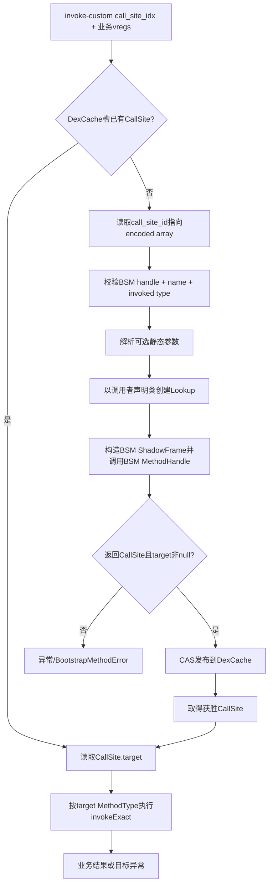
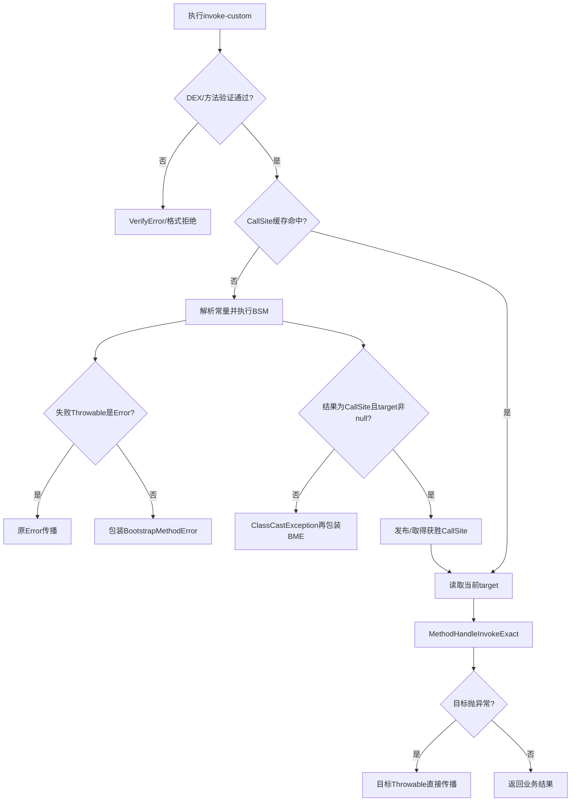
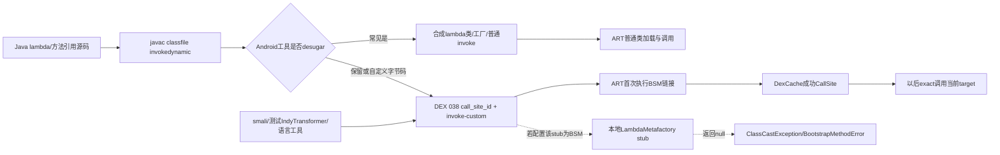

# 第564章 Android ART invoke-custom动态链接链：CallSite ID、Bootstrap Method、静态参数、DexCache、并发首胜、失败重试与LambdaMetafactory边界

> 源码基线：AOSP `android-11.0.0_r48`（Android 11 / API 30）  
> 学习目标：从DEX 038的`call_site_id_item`追到bootstrap method执行、CallSite校验、DexCache发布和目标MethodHandle精确调用；分清成功缓存、并发候选首胜、失败未缓存、CallSite换target与重新链接；最后理解为什么本工程虽然有`LambdaMetafactory`类，普通Android Java lambda仍不能直接套HotSpot的invokedynamic心智模型。  
> 阅读约定：继续在macOS只读源码，不实际编译；“链接”指第一次解析某个DEX CallSite ID并得到CallSite，“调用”指读取其当前target并执行，两者不是同一步。

## 1. 本章先拆掉一句常见误解

“每次执行`invoke-custom`都会调用一次bootstrap method；如果链接失败，虚拟机会永久缓存同一个失败；Android的Java lambda就是在这里调用`LambdaMetafactory`生成类。”

r48源码给出的答案恰好更复杂：成功CallSite按DexCache槽缓存，竞争时多个线程都可能执行BSM但只有一个候选CAS获胜；失败对象没有写入这个槽，后续执行可再次跑BSM；而本地`LambdaMetafactory.metafactory()`只是返回null的占位实现，普通lambda主要由构建工具desugar。

## 2. 一句话主线

解释器或quick trampoline从`invoke-custom`指令取`call_site_idx`，借调用者DexCache查已解析CallSite；未命中就读取该CallSite ID指向的encoded array，解析static BSM MethodHandle、name、invoked MethodType和可选静态参数，以调用者声明类创建Lookup并执行BSM；返回值必须是含非null target的CallSite，成功候选经CAS“首个发布者获胜”，随后每次都读取缓存CallSite的当前target并按其MethodType走`MethodHandleInvokeExact()`。

## 3. 与第557、562、563章怎样衔接

第557章讲DexCache、类解析和可变ArtMethod入口；第562章讲解释/quick栈与GC安全；第563章讲MethodHandle和`invoke-polymorphic`。本章把它们放到“一条指令第一次执行时先运行用户链接器”的场景。

`invoke-custom`没有固定Java方法目标，DEX只给CallSite配方；BSM返回的MethodHandle才成为执行目标，所以链接阶段本身也会执行Java代码、分配对象并抛异常。

## 4. 先分清五个容易同名的“类型”

- invoked type：CallSite希望以后接收/返回的业务签名；
- BSM MethodHandle type：bootstrap函数自己的签名；
- effective BSM call-site type：ART按Lookup和encoded静态参数临时构造的调用签名；
- CallSite target type：BSM返回对象内部MethodHandle的签名；
- DEX shorty/vreg count：机器调用布局的压缩描述。

它们通常经过校验后相容，但绝不是同一个`MethodType*`变量。

## 5. `invoke-custom`与`invoke-polymorphic`的根本区别

`invoke-polymorphic`的第一个运行时寄存器就是已有MethodHandle，指令还带独立proto；`invoke-custom`没有handle receiver，它引用一个CallSite ID，由CallSite encoded array保存链接配方。

前者每次从显式handle开始，后者第一次需要BSM产出CallSite；链接后两者最终都借MethodHandle核心执行。

## 6. DEX从哪个版本支持它

`standard_dex_file.cc`把DEX 038标注为Android O及以后；`dex_instruction_list.h`将0xFC/0xFD定义为`INVOKE_CUSTOM`与`INVOKE_CUSTOM_RANGE`。

旧DEX版本没有CallSite ID与MethodHandle表结构。看到Java 8源语法不代表产物必然包含这条指令，构建工具可提前desugar成普通类和普通invoke。

## 7. `call_site_id_item`本身有多大

`dex_file_structs.h`中的结构只有一个32位`data_off_`，指向data section里的encoded array。真正的BSM、名字、类型和静态参数都在该数组中。

CallSite ID表索引因此是“配方槽号”，不是CallSite Java对象指针，也不是目标method index。

## 8. encoded array前三项的固定协议

第0项必须是static bootstrap MethodHandle索引，第1项是传给BSM的目标名字String索引，第2项是invoked MethodType对应proto索引；第3项以后才是可选static arguments。

这三项都来自DEX常量，不是业务调用时放进寄存器的动态参数。业务参数只在成功链接后传给CallSite target。

## 9. 第一幅图：第一次`invoke-custom`怎样链接并调用



图里有两个调用：先调用BSM得到链接结果，再调用target完成业务。缓存命中时只剩第二个调用。

## 10. 文件级DexVerifier先检查什么

`CheckInterCallSiteIdItem()`确认`data_off_`确实指向encoded array section，再检查前三项类型与索引范围：MethodHandle、String、MethodType不可缺失或越界。

坏offset与坏常量索引属于DEX格式错误，理想情况下类还没执行就被拒绝，而不是等到BSM里变成业务异常。

## 11. MethodVerifier为何再检查一次

方法验证器确认指令引用的CallSite ID在表范围内、必要参数不少于3，并再次验证前三项类型；还要求第0项MethodHandle kind是`kInvokeStatic`。

一层面向文件结构完整性，一层面向方法指令及调用语义。重复不是浪费，而是各自保护不同输入边界。

## 12. invoked type怎样从CallSite中取出

`DexFile::GetProtoIndexForCallSite()`创建数组iterator，连续跳过BSM handle和name，断言第三项是MethodType，再返回其proto index。

quick入口据此取得shorty和参数vreg数；BSM随后也把同一常量解析成Java `MethodType`传入第二个固定业务信息位置。

## 13. 35c与3rc怎样组织业务参数

非range指令从最多五个离散寄存器构造`VarArgsInstructionOperands`，range指令从连续首寄存器与数量构造`RangeInstructionOperands`。

`DoInvokeCustom()`只看到统一operands接口。long/double占两个vreg，所以“Java参数个数”和`GetNumberOfOperands()`仍不能混用。

## 14. 正式解析前先做哪两项保护

函数先`ObserveAsyncException()`，避免忽略线程已经应处理的异步异常；随后`CHECK(!Runtime::Current()->IsActiveTransaction())`。

类链接事务只允许有限可回滚动作，而BSM能运行任意Java代码和创建任意类型，r48选择在事务中完全不支持invoke-custom，而非尝试记录所有副作用。

## 15. `DoResolveCallSite()`的第一个动作

它从当前ShadowFrame方法取得DexCache，按`call_site_idx`调用`GetResolvedCallSite()`。非null就直接返回，不再验证encoded array或执行BSM。

这意味着BSM链接的是“这个DexFile/DexCache里的这个槽”，不是全进程按名字共享一个全局结果。

## 16. DexCache怎样为CallSite预留空间

初始化DexCache arrays时按`NumCallSiteIds()`分配一段`GcRoot<CallSite>`数组，每项初始为null；数量为0时指针也可为空。

它与resolved strings、types、methods等缓存同属DexCache，但CallSite槽是一对一完整数组，不使用普通method/field的取模小缓存方式。

## 17. 为什么缓存项是`GcRoot<CallSite>`

CallSite和target MethodHandle都是Java堆对象，moving GC可能改变地址。DexCache数组必须作为root被访问和fixup，不能存一个无人更新的裸指针。

成功缓存也会让CallSite随DexCache保持可达；其target及target引用的类/方法能力因此继续存活。

## 18. 缓存未命中后发生什么

当前线程直接调用`InvokeBootstrapMethod()`生成候选，没有先拿一个“全CallSite链接锁”。这为并发首次执行留下多候选路径。

BSM可能做I/O、加锁、加载类或修改全局状态；源码只保证最终缓存首胜，不保证BSM副作用只出现一次。

## 19. BSM MethodHandle怎样解析

ART读取第0项的method-handle index，交给`ClassLinker::ResolveMethodHandle(self,index,referrer)`。它再根据DEX handle kind解析目标ArtMethod/ArtField、检查referrer访问权限并构造MethodType。

这里的访问身份来自包含`invoke-custom`的referrer，不是后来任意执行该CallSite的调用者。

## 20. 为什么r48只接受static BSM

验证器要求`kInvokeStatic`，runtime又防御性检查handle kind；否则抛“Unsupported bootstrap method invocation kind”的`BootstrapMethodError`。

注释提到规范也可考虑构造器，但ART当时用transform实现constructor handle，返回对象还必须是CallSite子类，r48没有完成这条路径。

## 21. static BSM还会做成员访问检查吗

会。`ResolveMethodHandleForMethod()`解析target后，用referrer declaring class调用`CanAccessMember(targetClass,accessFlags)`；失败是linkage层`IllegalAccessError`。

“static”只表示没有receiver，不等于公开或可信。BSM handle本身仍需满足类与成员访问规则及hidden API链接策略。

## 22. 第一个实际参数Lookup由谁创建

它不存放在DEX encoded array中。ART取得当前referrer方法的声明Class，调用`MethodHandlesLookup::Create()`，再把结果写入BSM ShadowFrame第一个参数槽。

因此BSM收到的Lookup代表调用点所属类的能力，这也是它能用`lookup.findStatic(lookup.lookupClass(),...)`定位私有目标的基础。

## 23. name参数究竟是什么

第二个encoded值解析为String并传给BSM。它通常表示动态调用点希望链接的逻辑名称，但ART不自行按该名字查询目标。

BSM完全可以忽略、拼接或用它选择不同handle；名字只是链接协议数据，不是虚拟机强制分派规则。

## 24. invoked `MethodType`承担什么职责

第三项proto解析出的MethodType描述以后每次业务调用的参数和返回类型。BSM通常据此构造完全匹配的target，例如`lookup.findStatic(callerClass,name,invokedType)`。

ART也用该proto在验证与quick参数搬运阶段解释业务vreg，所以返回错误类型target不是无害元数据错误。

## 25. static bootstrap arguments从哪里来

前三项之后的每个encoded value会在链接时物化并传给BSM。它们可以配置链接策略、携带常量MethodHandle/MethodType、Class或字符串，而不是每次业务调用重复传入。

静态参数是CallSite配方的一部分；修改业务vreg不会改变它们。

## 26. r48明确支持哪些静态参数类型

主执行分支支持int、long、float、double、String、Class（encoded type）、MethodType和MethodHandle。scalar直接写JValue，引用常量通过ClassLinker按referrer DexCache/ClassLoader解析。

这些引用解析可能加载类型、触发OOM或产生linkage异常，所以“常量参数”不等于零成本或绝不失败。

## 27. boolean、byte、char与short为何要谨慎

`GetClassForBootstrapArgument()`注释说JVMS不允许这些独立静态类型并把它们视作int以促成类型错误；真正pack函数又把相应ValueType列为前置检查后不可达。

结论不是“r48会稳定帮你转换”，而是工具链应生成规范允许的常量类型；手工畸形DEX可能在不同验证/运行分支遭硬拒绝或断言，不能作为公开行为依赖。

## 28. Class常量用哪个ClassLoader解析

`ResolveType(index, referrer)`沿referrer的DexCache与ClassLoader语境解析。相同描述符在不同loader里可以得到不同Class身份。

这会进一步影响BSM参数类型比较、Lookup权限和target可赋值性；不能把static Class参数简化成全局类名字符串。

## 29. MethodHandle常量解析时会缓存吗

`ResolveMethodHandle()`从DEX MethodHandleItem解析目标和类型，但本函数本身没有像CallSite那样展示按method_handle_idx写入专用DexCache数组；MethodHandle对象可在不同链接尝试中重新创建。

真正需要长期复用的是成功CallSite及其target。不要看到“Resolve”就自动假设所有常量类型都采用相同缓存结构。

## 30. ART怎样构造“调用BSM的MethodType”

`BuildCallSiteForBootstrapMethod()`把参数0固定为`MethodHandles.Lookup`，其余参数Class由encoded array从name开始逐项推导，返回类型固定为基础`java.lang.invoke.CallSite`。

这不是业务invoked type；它描述这一回“如何调用bootstrap MethodHandle”。

## 31. BSM可以声明返回CallSite子类吗

可以。参数/返回兼容检查允许适当引用类型转换，执行后还用`object->InstanceOf(CallSite.class)`验证实际对象。r48测试专门返回`TestersConstantCallSite`子类并成功。

因此“返回类型固定CallSite”指ART构造的期望调用形状与最终基类约束，不要求BSM Java声明只能精确写CallSite。

## 32. 非varargs BSM怎样核对参数数量

effective call-site type的参数数必须等于BSM handle MethodType参数数；多一个或少一个都抛`WrongMethodTypeException`，随后通常在外层包成BootstrapMethodError。

前三个协议参数也算在这个数量里。只写`(Lookup,String,MethodType)`意味着不能额外放静态参数。

## 33. BSM参数为何单独预扫转换机会

源码注释指出BSM调用的异常语义不同于普通`MethodHandle.invoke()`。ART逐项调用`IsParameterTypeConvertible(from,to)`，不可转时主动抛ClassCastException，避免底层handle只给出WrongMethodTypeException。

返回兼容也单独检查。测试因此能区分参数数量错误的WMTE cause与参数类型错误的CCE cause。

## 34. “可转换”是否等于一定成功

不是。类型层允许引用cast或拆装箱后，实际值仍可能为null或不是目标子类，从而在执行转换时失败。

静态参数通常来自受校验DEX常量，风险小于任意业务对象，但ClassLoader身份和BSM声明仍可制造不兼容。

## 35. varargs BSM的收集条件

ART检查BSM目标ArtMethod的varargs标志；最后一个形式参数必须是数组，前面固定参数必须足够。多出的静态参数才会被收进该数组。

这与第563章普通反射目标varargs不同：这里runtime确实专门实现了bootstrap varargs collector。

## 36. collector元素会自动做扩宽吗

r48先要求每个待收集参数Class与数组component Class指针精确相同，不是仅`IsConvertible`。例如收集到long[]时，int静态参数不会在这一步自动扩宽成long。

不相同直接抛ClassCastException；这比普通MethodHandle非exact参数适配更严格。

## 37. collector支持哪些数组

对应前述静态参数集合，代码有int/long/float/double primitive数组，以及MethodType、MethodHandle、String、Class引用数组。它逐项解析后写入新数组，再把数组引用放进BSM frame。

数组分配失败自然留下pending OOME，链接失败且不会发布CallSite。

## 38. BSM为什么用ShadowFrame承载参数

effective BSM type可能包含wide与引用，ART按`NumberOfVRegs()`在当前native栈创建ShadowFrame，用Setter顺序写Lookup、name、invoked type和静态参数。

这一frame的method字段仍设为referrer、Dex PC设为当前invoke-custom位置，便于栈与异常归因；它不是一个伪造的BSM Java调用者源码方法。

## 39. 构建中的frame怎样保持GC安全

`ScopedStackedShadowFramePusher`以`kShadowFrameUnderConstruction`登记frame。创建Lookup、解析常量和分配collector数组都可能触发GC，已经写入的引用不能留成无人扫描的裸值。

完成后用RangeInstructionOperands覆盖整个frame，并调用BSM MethodHandle。

## 40. BSM调用为什么用普通`MethodHandleInvoke`

effective BSM type与真实BSM handle type可能需要允许的引用/primitive转换，所以调用非exact核心。前面的预扫负责给出符合BSM语义的异常分类，底层再真正搬值。

BSM自己抛出的Throwable直接成为线程pending exception，下一层决定是否套BootstrapMethodError。

## 41. BSM返回null会怎样

执行成功但JValue引用为null时，ART主动抛ClassCastException，文本为“Bootstrap method returned null”。随后`DoResolveCallSite()`把这个非Error包装为BootstrapMethodError。

源码旁注明确说这通常会发生在“不受支持的LambdaMetafactory”场景，本地占位实现正是返回null。

## 42. 返回普通对象而非CallSite会怎样

ART以基础CallSite Class做`InstanceOf`；失败抛ClassCastException。返回CallSite子类则允许。

这个检查发生在缓存发布前，错误对象不会污染resolved-call-site槽。

## 43. CallSite target还必须满足什么

`mirror::CallSite::GetTarget()`读取已知字段；若为null，同样抛ClassCastException并拒绝缓存。blank CallSite构造器实际上会安装一个抛IllegalStateException的非null handle，所以它能通过此检查。

“非null”只保证有可调用对象，不保证调用一定正常返回。

## 44. r48是否显式比较target type与invoked type

在这段成功校验里只看到“对象是CallSite”和“target非null”，没有在发布前显式将`target->GetMethodType()`与第三项invoked MethodType比较。调用阶段用target自己的MethodType，并仅有debug `DCHECK`核对业务operand vreg数。

因此生成工具和BSM必须自行遵守target类型等于调用点类型的不变量；这也是源码审计中值得标记的r48边界，不能把上游规范要求误写成此处已有release硬检查。

## 45. 链接失败时原异常怎样处理

若`InvokeBootstrapMethod()`返回null，线程应有pending exception。`DoResolveCallSite()`读取该Throwable；若它不是`java.lang.Error`，就以它为cause建立BootstrapMethodError。

这和反射InvocationTargetException不是同一wrapper：一个表示动态调用点链接失败，一个表示反射invoke边界内出现异常。

## 46. 哪些异常不会再套BootstrapMethodError

任何Error子类都按源码原样保留，包括已经是BootstrapMethodError的对象以及其他LinkageError、OutOfMemoryError等。

所以调用者不能假设所有BSM失败最外层必定同一个类型；先检查实际Throwable和cause链。

## 47. BSM抛普通Exception会怎样

例如测试BSM抛InstantiationException，外层观察到BootstrapMethodError，cause才是InstantiationException。BSM方法签名虽可`throws Throwable`，动态链接协议仍收口成linkage错误。

这让调用处无需把BSM的任意checked exception加入业务方法throws。

## 48. target执行时抛异常也会变BootstrapMethodError吗

不会。成功解析和缓存CallSite后，`DoInvokeCustom()`才执行target；这时ArithmeticException等目标异常沿MethodHandle精确调用直接传播。

判断边界的方法是问：“异常发生在得到CallSite之前，还是已经取得target之后？”

## 49. 第二幅图：四种异常从哪里出来



成功缓存只缓存CallSite对象，不缓存某次业务异常；目标每次仍可根据输入正常返回或抛出。

## 50. 成功候选怎样发布

`SetResolvedCallSite()`把null与candidate包装成GcRoot，使用strong sequentially-consistent CAS。第一个把槽从null改成candidate的线程返回自己的对象。

失败者读取并返回槽中赢家，而不是继续使用自己刚创建的候选。

## 51. 为什么并发首次链接会运行多个BSM

缓存检查与BSM执行之间没有占位状态。多个线程可同时读到null，各自完整执行BSM，然后才在发布处竞争。

`art/test/952-invoke-custom`用16线程Barrier故意让所有BSM候选同时到达；测试期望创建16个候选，但只有一个target获得全部16次业务调用。

## 52. 输掉CAS的BSM副作用会回滚吗

不会。它创建的CallSite若无其他引用可被GC，但在BSM里打印、写全局计数、I/O或注册监听等外部副作用已经发生。

因此BSM最好幂等、无昂贵不可撤销副作用，或自行做并发去重；DexCache首胜只统一未来target，不统一历史副作用。

## 53. 缓存粒度为什么是CallSite ID而不是方法名

同一name、invoked type和BSM可在DEX里出现多个CallSite ID，各自拥有独立槽。反过来，同一ID被多次执行则复用一个CallSite。

源码位置和CallSite ID的关系由编译/变换工具决定，不能用Java目标方法名推断链接次数。

## 54. r48测试为何第一次计数是3

`TestDynamicBootstrapArguments.testCallSites()`源码写了三处`testDynamic(...)`调用，变换器为它们生成三个调用点。第一次执行三处各链接一次，所以`bsmCalls == 3`；再次执行同三处仍为3。

这恰好证明“调用同一逻辑目标三次”和“同一个CallSite ID执行三次”不是同一命题。

## 55. 失败会写入DexCache吗

不会。`SetResolvedCallSite()`只在`InvokeBootstrapMethod()`返回非null CallSite后调用；失败分支包装/保留异常并直接返回。

槽仍为null，源码中也没有另一个resolved-error数组记录失败Throwable。

## 56. 所以后续执行失败点会怎样

再次执行同一CallSite ID会重新进入BSM，可能重复副作用，也可能在环境变化后成功。这是本地r48代码可直接推出的行为。

不要把其他JVM“链接失败记忆”规则未经核对套到这里；本章标题写“失败重试”，正是为了记录源码与常见假设的差异。

## 57. 成功缓存会持续多久

只要对应DexCache存活，GcRoot槽就持有CallSite。类加载器可卸载时，DexCache、CallSite、target及相关Class整体可一起变得不可达。

它不是跨进程、跨安装或跨冷启动持久化缓存；每个runtime实例都会重新建立。

## 58. CallSite对象缓存后target能不能变

能否变化取决于CallSite子类。DexCache固定的是CallSite对象引用，不是把初始target复制到另一个永久槽。

每次`DoInvokeCustom()`都会从缓存CallSite重新`GetTarget()`，所以Mutable/Volatile CallSite改变字段后，后续调用有机会进入新handle，而无需重跑BSM。

## 59. quick编译路径怎样回到相同逻辑

`artInvokeCustom(call_site_idx,self,sp)`从quick栈恢复caller ArtMethod与Dex PC，按CallSite proto shorty访问参数，构造连续ShadowFrame，再调用解释器命名空间的同一个`DoInvokeCustom()`。

它不是在C++里复制一套独立BSM解析器，所以缓存、并发和异常规则与解释路径共享。

## 60. quick参数为何先进入安全区

entrypoint在参数仍位于ABI寄存器/栈时禁止线程挂起，用`BuildQuickShadowFrameVisitor`把它们写入可扫描ShadowFrame；完成后才解除禁止挂起。

BSM会任意分配和触发GC，这一步缺失会让业务引用在首次链接期间失去更新位置。

## 61. invoke-custom为何按static调用搬参数

quick源码写明它“effectively a static call”：指令没有MethodHandle或普通对象receiver，所有编码寄存器都是业务参数。

未来target可能内部绑定receiver，但那是MethodHandle自身结构，不占invoke-custom指令的隐式this槽。

## 62. 为什么还要push ManagedStack fragment

quick runtime entry构造ShadowFrame后，要从native runtime再进入BSM或target managed代码，于是push一个ManagedStack转换片段，完成后pop。

这让第562章的栈遍历和异常投递可以跨越invoke-custom trampoline，而不是把动态链接视为栈外魔法。

## 63. target最终为何走`MethodHandleInvokeExact`

链接协议要求CallSite target已经具有业务调用点类型，runtime不应在每次调用临时做宽松适配。因此取得target及其MethodType后直接调用exact核心。

BSM若需要适配，应在链接时用`asType`、collector、filter等构造正确target，把一次性成本留在首次链接。

## 64. exact调用用的是哪份MethodType

r48代码从当前target读取`GetMethodType()`并同时把它当callsite type传给`MethodHandleInvokeExact()`。这保证exact函数内部自洽，却也解释了第44节为何“发布前缺少与DEX invoked type显式比较”值得留意。

debug构建还断言业务operand vreg数等于target type的vreg数；release不能把DCHECK当安全门。

## 65. 每次读取target有什么性能含义

成功后不会再解析encoded array或BSM，但仍有CallSite root读取、target MethodType读取和MethodHandle exact分派。ConstantCallSite理论上有更强优化空间，r48通用C++路径仍展示动态读取。

JIT是否把特定调用点进一步内联，要看编译器证明与deopt保障，不能仅从Java子类名保证。

## 66. CallSite基类保存什么

Java `CallSite`只有一个runtime已知的package-private `MethodHandle target`核心字段；C++ `mirror::CallSite`按固定offset直接读取它。

基类构造器还初始化`GET_TARGET`组合器，支持`dynamicInvoker()`每次获取当前target后再exact调用。

## 67. target类型为什么永久不变

`CallSite.checkTargetChange(old,new)`先触发new的null检查，再比较两个MethodType；不相等抛WrongMethodTypeException。

对象可以换行为，不能换调用ABI。否则已经验证和编译的invoke-custom寄存器布局会失效。

## 68. blank CallSite的初始target是什么

以MethodType构造Mutable/Volatile CallSite时，Android用MethodHandle组合器创建一个相同类型、调用即抛`IllegalStateException("uninitialized call site")`的handle。

它不是null，所以BSM返回这种CallSite可通过runtime非null检查；真正业务调用才看到IllegalStateException。

## 69. 第一段真实Java源码：MutableCallSite只允许同类型换target

下面来自`MutableCallSite.java`，展示普通字段读取、类型检查和正常写入。它不会因setTarget自动再次执行bootstrap method。

```java
    @Override public final MethodHandle getTarget() {
        return target;
    }

    @Override public void setTarget(MethodHandle newTarget) {
        checkTargetChange(this.target, newTarget);
        setTargetNormal(newTarget);
    }

    @Override
    public final MethodHandle dynamicInvoker() {
        return makeDynamicInvoker();
    }
```

`setTargetNormal()`在本地CallSite类里只是`target = newTarget`，没有volatile语义。

## 70. ConstantCallSite如何冻结

构造器先调用super安装target，再设`isFrozen=true`；`getTarget()`在冻结前会抛IllegalStateException，`setTarget()`永远抛UnsupportedOperationException，`dynamicInvoker()`可直接返回永久target。

特殊hook构造器允许在半构造期生成绑定自身的target，但对外可见前仍必须冻结。

## 71. r48的`MutableCallSite.syncAll()`在哪里

整段API和实现被`Android-removed: syncAll() implementation is incomplete`注释包住，因此本地类没有可调用的syncAll方法。

不能照搬桌面JDK示例假设Android r48可用它建立全线程可见栅栏；需要的并发可见性应选VolatileCallSite或应用自己的同步协议。

## 72. VolatileCallSite怎样读写

Java override通过`UNSAFE.getObjectVolatile`与`putObjectVolatile`访问同一个target offset，并在写前检查类型。直接调用其`getTarget()`/`setTarget()`具有volatile语义。

这与Mutable的普通字段语义不同，尤其影响跨线程重链接何时可见。

## 73. invoke-custom的C++读取有何复读边界

`DoInvokeCustom()`不是虚调用Java `CallSite.getTarget()`，而是`mirror::CallSite::GetTarget()`直接`GetFieldObject`。从这段代码本身看不到针对VolatileCallSite的子类分支或显式volatile load。

因此不能仅凭VolatileCallSite Java文档断言这个native直读点的完整内存序实现；要证明跨线程可见性还需继续审计字段访问模板、编译器和目标架构。本文把它标为r48待验证边界，不伪造结论。

## 74. `dynamicInvoker()`与invoke-custom是什么关系

dynamicInvoker返回另一个MethodHandle，它组合“读取当前target”与exact invoker，供普通handle调用者使用。invoke-custom runtime已有CallSite对象，会直接读取target，不需要先创建dynamicInvoker。

两条路径目标语义相似，实际对象分配、组合器和内存读取实现不同。

## 75. 换target是不是原子切换整个业务状态

只保证一个MethodHandle引用字段的相应写语义，不会自动把handler的其他配置、缓存和外部资源一起原子更新。新target若依赖多项状态，发布协议要自行安排happens-before。

已经取得旧target并开始的调用也不会被撤回，换target只影响之后读取到新值的调用。

## 76. BSM适合做哪些一次性工作

解析名字、权限检查、选择目标、绑定常量、适配MethodType并构造CallSite都很合适。高频业务逻辑应落在target，而不是每次通过另一个全局表重新查找。

但并发首次链接可能重复BSM，所以“一次性”是成功缓存后的稳态，不是全局严格exactly-once承诺。

## 77. 普通Java编译器输入先产生什么

javac面对lambda和某些现代语言特性通常产生JVM classfile的`invokedynamic`与BootstrapMethods属性；Android工具再把classfile转为DEX。

最终是保留为DEX invoke-custom还是desugar成合成类/普通调用，由工具链、min SDK和特性支持决定，不能只看Java源代码。

## 78. Android为何长期大量使用desugar

desugar可把lambda变成实现函数接口的合成类，把默认接口方法或新库API改写成旧runtime也能执行的形式，从而覆盖早于DEX 038/MethodHandle支持的设备。

代价是生成额外类与桥方法，但换来跨API兼容和不依赖运行时LambdaMetafactory。

## 79. 本工程哪里能看到lambda改写器

`external/desugar/.../LambdaDesugaring.java`与`InvokeDynamicLambdaMethodCollector.java`识别classfile invokedynamic lambda并生成相应结构；预置R8/D8则位于`prebuilts/r8`。

源码树同时包含runtime invoke-custom测试和构建期lambda desugar并不矛盾，它们服务不同输入与兼容目标。

## 80. 本地`LambdaMetafactory`是否真的生成类

没有。`libcore/ojluni/src/lambda/.../LambdaMetafactory.java`只声明三个flag，`metafactory()`和`altMetafactory()`方法体都直接`return null`。

若把它作为真正BSM交给r48 invoke-custom，ART会在结果校验处对null抛ClassCastException，再包装BootstrapMethodError。

## 81. 第二段真实Java源码：LambdaMetafactory是占位实现

下面是本地文件的完整功能主体，不存在隐藏的native生成入口。

```java
public class LambdaMetafactory {

    public static final int FLAG_SERIALIZABLE = 1 << 0;

    public static final int FLAG_MARKERS = 1 << 1;

    public static final int FLAG_BRIDGES = 1 << 2;

    public static CallSite metafactory(MethodHandles.Lookup caller,
                                       String invokedName,
                                       MethodType invokedType,
                                       MethodType samMethodType,
                                       MethodHandle implMethod,
                                       MethodType instantiatedMethodType)
            throws LambdaConversionException { return null; }

    public static CallSite altMetafactory(MethodHandles.Lookup caller,
                                          String invokedName,
                                          MethodType invokedType,
                                          Object... args)
            throws LambdaConversionException { return null; }
}
```

“类存在”只满足API/编译依赖外形，不证明方法在当前平台具备桌面JDK实现能力。

## 82. 所以Android lambda运行时对象从哪里来

典型r48构建产物由D8/R8/desugar生成合成实现类、静态工厂或捕获字段；执行时走普通new-instance/invoke，而非首次lambda表达式必经本章BSM。

若研究某个APK，最可靠方法是反编译最终DEX检查是否真的有0xFC/0xFD，而不是从源码箭头直接画到LambdaMetafactory。

## 83. 自定义invoke-custom还能使用吗

runtime实现和ART测试证明机制本身可工作。测试通过注解描述BSM，再由`IndyTransformer`把占位方法调用改成invoke-custom；smali示例也能直接写CallSite语法。

这更像底层字节码工具、语言实现或实验性链接协议的能力，不等于普通App Java语法默认采用。

## 84. String拼接是否一定走自定义调用点

不能照搬Java 9 HotSpot的`StringConcatFactory`结论到r48 Android。最终Android DEX可能仍是StringBuilder或经R8优化后的普通调用，本地libcore也没有同等runtime工厂主链。

同样应检查最终DEX指令与CallSite表，而不是只根据javac版本猜测。

## 85. ART测试怎样制造CallSite

`@CalledByIndy`和`@BootstrapMethod`注解只作为测试变换器输入；原Java里被标记的方法体常写`assertNotReached()`，表明变换后调用应由invoke-custom接管。

注解本身不是Android公开运行时API，也不会被ART解释器自动识别。

## 86. 第三段真实Java源码：一个可工作的自定义BSM

下面来自`TestDynamicBootstrapArguments.java`。BSM使用Lookup、name、MethodType和两个静态参数拼出目标名，再返回精确类型ConstantCallSite。

```java
    static CallSite bsm(
            MethodHandles.Lookup lookup,
            String name,
            MethodType methodType,
            String otherNameComponent,
            long nameSuffix)
            throws Throwable {
        bsmCalls = bsmCalls + 1;
        Class<?> definingClass = TestDynamicBootstrapArguments.class;
        String methodName = name + otherNameComponent + nameSuffix;
        MethodHandle mh = lookup.findStatic(definingClass, methodName, methodType);
        System.out.println("bsm");
        return new ConstantCallSite(mh);
    }
```

这里的String与long来自encoded静态参数；`i, String, double`等业务参数不会传给BSM。

## 87. BSM如何找到private目标

测试把`definingClass`设为自己，并使用ART按referrer创建的Lookup。只要变换后的invoke-custom也位于该类权限语境，`lookup.findStatic`可找到相应目标。

把同一BSM配置搬到另一个声明类可能改变Lookup能力并抛IllegalAccess/NoSuchMethod相关链接错误。

## 88. 为什么测试第二轮不再打印`bsm`

第一次每个CallSite ID成功返回ConstantCallSite并CAS到DexCache；第二轮相同指令位置直接命中缓存，跳过整个encoded参数解析与BSM执行。

目标仍每次执行，所以业务输出和返回值照常发生。缓存的是链接结果，不是方法执行结果memoization。

## 89. 并发测试为什么使用Barrier

若BSM很快，第一个线程可能发布后其他线程才读缓存，看不到多候选。Barrier把16个线程都阻塞在BSM内部，强制验证“多BSM、一CallSite赢家”。

这种测试证明CAS收敛，却不证明生产中每次都有16次BSM；竞争窗口由调度和链接耗时决定。

## 90. 获胜CallSite如何让所有线程统一

每个线程在CAS后都使用`SetResolvedCallSite()`返回值：赢家得自己candidate，输家得target槽中对象。随后才从该对象读target并执行。

若输家错误地继续用自己的candidate，并发测试就会看到多个target计数增加。

## 91. CallSite换target与重新运行BSM有什么区别

换target是在已缓存的同一个CallSite对象里更新字段；重新BSM只会发生缓存槽仍null时，例如首次链接或此前失败未发布。

前者保留CallSite身份与DexCache绑定，后者会创建新的候选对象并再次经历CAS。

## 92. ConstantCallSite为何最容易优化

Java API保证target冻结，理论上编译器可把间接读取当稳定常量并在依赖失效协议支持下优化。Mutable/Volatile明确允许换target，必须保留相应观察点。

但r48通用runtime源码每次仍读字段；是否内联是另一份编译器实现事实，不能从“Constant”名称直接宣称零间接开销。

## 93. 失败重试会复用同一个异常对象吗

源码没有失败缓存，所以每轮可能重新创建cause和BootstrapMethodError，栈trace、消息甚至类型都可因运行环境变化而不同。

日志聚合不能仅按Throwable对象身份去重；应记录CallSite ID、referrer、BSM目标和尝试次数。

## 94. 如果第一次失败、第二次成功会怎样

第二次成功候选可以正常写入原null槽，从此进入缓存稳态。此前抛出的异常不会阻止发布，也不会自动附在新CallSite上。

这类可恢复行为也意味着带状态BSM要明确失败后是否适合重试，避免留下半完成外部资源。

## 95. 返回CallSite子类有哪些约束

实际对象只需`InstanceOf`基础CallSite且target非null即可通过当前结果检查；target字段布局由基类固定。

子类可自定义Java getTarget语义，但invoke-custom C++路径直接读基础字段，这一点限制了“覆写方法即可改变runtime读取”的想象。

## 96. 为什么active transaction直接CHECK而不是Java异常

这是ART内部不变量：正常执行不应在类链接事务里到达invoke-custom。CHECK失败表示runtime/编译期路径违反假设，不是App可catch的受支持错误。

读源码要区分`Throw...`与`CHECK`：前者建立Java异常，后者通常终止进程或调试构建。

## 97. 调试首次链接应抓哪些信息

至少记录referrer方法与Dex PC、call_site_idx、前三项常量、BSM handle kind/type、effective BSM type、returned CallSite类/target type、缓存是否命中及线程ID。

只打印最终目标名会遗漏是常量解析、权限、BSM参数、返回校验还是CAS竞争出了问题。

## 98. 首次慢、以后快通常意味着什么

首次可能包含类型/字符串/handle解析、Lookup分配、ShadowFrame构建、BSM任意逻辑、CallSite/组合器分配和CAS；命中后主要剩target读取与exact调用。

若每次都慢，先确认链接是否持续失败而未缓存、是否每次实际是不同CallSite ID，以及target自身是否昂贵。

## 99. BSM能否执行不可信任代码

BSM就是referrer授权可访问的Java方法，能做普通代码允许的副作用。runtime不会把它放入纯函数沙盒；这正是事务模式禁用的原因。

加载未知DEX等同允许其类初始化、BSM与target代码运行，安全边界仍是签名、ClassLoader、权限、hidden API和进程沙箱组合。

## 100. hidden API在哪个阶段可能介入

BSM MethodHandle或静态MethodHandle常量解析最终走ClassLinker成员解析，hidden API linking access context可能拒绝非SDK成员。之后Lookup查找也有自己的访问规则。

成功拿到CallSite不表示未来target内部所有反射访问都被永久放行；每种访问机制仍按自身入口裁决。

## 101. 不同ClassLoader会共享CallSite吗

通常不会。CallSite槽属于具体DexCache，解析常量与Lookup又绑定referrer loader；即使DEX字节相同，不同加载身份也可能有独立DexCache和不同Class对象。

插件框架排查链接问题时要同时打印loader，不能只比较call_site_idx数字。

## 102. OOME发生在哪些链接步骤

创建MethodType的Class数组、Lookup、ShadowFrame相关大数组、varargs collector数组、MethodHandle转换器、CallSite以及包装异常都可能分配。

OOME是Error，`DoResolveCallSite()`不会再包装为BootstrapMethodError；缓存槽保持null，内存恢复后理论上可重试。

## 103. 畸形CallSite为何可能在verify阶段失败

缺前三项、索引越界、BSM不是static或指令寄存器与proto不符都属于静态可判定事实。MethodVerifier把它们记为hard verification failure，避免运行时在不可达switch里继续。

因此手工smali实验必须同时满足文件结构、MethodHandle kind和调用vreg类型，而不是只让语法解析器通过。

## 104. runtime为何仍保留防御检查

运行时可能面对仅部分验证、测试构造、旧产物或编译器假设变化。它仍检查参数数、BSM kind、返回对象和target非null，并在关键位置DCHECK内部不变量。

verify与runtime共同形成纵深防御，但DCHECK不应被当作release可见异常保障。

## 105. 业务返回值在哪里解释

target exact调用把结果写入JValue；解释器随后按invoke-custom指令的move-result系列消费，quick入口则以64位raw bits返回给架构stub。

void没有move-result，primitive/reference必须匹配已验证的invoked type；错误target type会破坏这条假设，说明第44节边界为何重要。

## 106. wide业务参数如何传递

call-site shorty中的J/D令`ArtMethod::NumArgRegisters()`增加槽数，range operands覆盖连续两个vreg；非range编码也要列出wide值的两个寄存器。

BSM本身看到的是一个MethodType对象，不会把业务long/double值作为链接参数接收。

## 107. range形式是否改变缓存与BSM

不改变。35c与3rc只影响从当前frame选择哪些业务寄存器；两者使用同一个call_site_idx、DexCache槽、BSM协议和exact target函数。

参数多到非range装不下时由编译器选range，语义不是另一种CallSite。

## 108. 解释器与quick怎样保证结果一致

两者最终汇入同一`DoInvokeCustom()`；quick多出的工作是从机器frame恢复caller、Dex PC和GC安全参数，解释器已有ShadowFrame可直接提供。

如果只在JIT/AOT路径复现问题，优先审计trampoline参数搬运和栈元数据；如果两边都复现，优先看共同解析、BSM或target。

## 109. 第三幅图：源码输入、构建变换与运行时不要画成一条固定线



图中虚线是“刻意使用占位LambdaMetafactory”才发生的失败路径，不是普通Android lambda默认执行路径。

## 110. 本章高频误解清单

- 成功链接后不是每次都跑BSM；
- 并发首次链接不保证BSM只执行一次；
- CAS输家的BSM副作用不会回滚；
- r48只缓存成功CallSite，没有在该槽缓存失败；
- CallSite ID不是方法ID，缓存也不按name全局共享；
- 换Mutable target不等于重跑BSM；
- BSM失败常包BootstrapMethodError，target失败不包；
- 本地LambdaMetafactory存在但方法体返回null；
- Java lambda源码不证明最终DEX含invoke-custom。

## 111. 开始练习前的只读检查表

下面四个练习只运行`test`、`rg`和`sed`，不编译、不写源码。成功标准是退出码0，并能分别找到DEX协议、BSM执行、缓存并发与lambda占位边界。

输出较多时先看命中函数，再将关键函数上下各扩展30行；不要把测试注解误认成runtime公开API。

## 112. 练习一：核对CallSite encoded array与验证规则

```bash
set -euo pipefail
SRC=/Users/ninebot/androidSource
DF="$SRC/art/libdexfile/dex/dex_file_structs.h"
FV="$SRC/art/libdexfile/dex/dex_file_verifier.cc"
MV="$SRC/art/runtime/verifier/method_verifier.cc"
test -f "$DF"
test -f "$FV"
test -f "$MV"
rg -n 'struct CallSiteIdItem|data_off_' "$DF"
rg -n 'CheckInterCallSiteIdItem|missing method handle|missing target method name|missing method type' "$FV"
rg -n 'CheckCallSite|kRequiredArguments|kInvokeStatic' "$MV"
```

观察：一个ID只保存encoded array offset；文件与方法验证共同保证前三项和static BSM形状。

## 113. 练习二：核对BSM参数、结果和异常包装边界

```bash
set -euo pipefail
SRC=/Users/ninebot/androidSource
IC="$SRC/art/runtime/interpreter/interpreter_common.cc"
test -f "$IC"
rg -n 'BuildCallSiteForBootstrapMethod|MethodHandlesLookup::Create|PackCollectorArrayForBootstrapMethod' "$IC"
rg -n 'Bootstrap method returned null|CallSite with a null target|InstanceOf\(call_site_class\)' "$IC"
rg -n 'ThrowWrappedBootstrapMethodError|IsError\(\)|MethodHandleInvokeExact' "$IC"
```

观察：Lookup由runtime补，其他参数来自encoded array；BSM边界与target exact边界位于不同函数段。

## 114. 练习三：核对成功CAS、失败空槽与并发首胜测试

```bash
set -euo pipefail
SRC=/Users/ninebot/androidSource
DC="$SRC/art/runtime/mirror/dex_cache-inl.h"
IC="$SRC/art/runtime/interpreter/interpreter_common.cc"
TEST="$SRC/art/test/952-invoke-custom/src/TestInvokeCustomWithConcurrentThreads.java"
test -f "$DC"
test -f "$IC"
test -f "$TEST"
rg -n 'first assignment.*wins|CompareAndSetStrongSequentiallyConsistent|return target.Read' "$DC"
sed -n '1103,1130p' "$IC"
rg -n 'NUMBER_OF_THREADS|barrier.await|winners|votes' "$TEST"
```

观察：只有成功候选进入CAS；并发线程可全跑BSM，但后续都使用一个获胜CallSite。

## 115. 练习四：核对CallSite可变语义与LambdaMetafactory占位

```bash
set -euo pipefail
SRC=/Users/ninebot/androidSource
CS="$SRC/libcore/ojluni/src/main/java/java/lang/invoke/CallSite.java"
MC="$SRC/libcore/ojluni/src/main/java/java/lang/invoke/MutableCallSite.java"
VC="$SRC/libcore/ojluni/src/main/java/java/lang/invoke/VolatileCallSite.java"
LM="$SRC/libcore/ojluni/src/lambda/java/java/lang/invoke/LambdaMetafactory.java"
test -f "$CS"
test -f "$MC"
test -f "$VC"
test -f "$LM"
rg -n 'setTargetNormal|getTargetVolatile|setTargetVolatile' "$CS"
rg -n 'syncAll.*incomplete|return target|setTargetNormal' "$MC"
rg -n 'getTargetVolatile|setTargetVolatile' "$VC"
rg -n 'metafactory|altMetafactory|return null' "$LM"
```

观察：Mutable为普通字段写、Volatile用Unsafe volatile访问、syncAll被移除；LambdaMetafactory两个入口均直接返回null。

## 116. 四个练习串起来说明什么

练习一确定DEX静态配方，练习二看到runtime怎样把配方变为一次BSM调用，练习三证明成功缓存和并发收敛，练习四把缓存CallSite的可变target与Android lambda实现边界分开。

建议额外对照`TestDynamicBootstrapArguments`第一次/第二次计数，以及目标抛异常测试，亲手标出“链接次数”和“业务调用次数”两列。

## 117. 本章复读后最容易卡住的四个点

第一，BSM invocation type不是业务invoked type；第二，CallSite ID按DEX槽缓存而不是按name；第三，并发链接的“一个赢家”不等于“只执行一次BSM”；第四，失败没有写成功槽，所以后续可重新链接。

再记住两个r48边界：发布前未看到target type对DEX invoked type的release显式比较，C++ invoke-custom直读target处也未看到VolatileCallSite专门分支。这两点应标“继续审计”，不能靠规范文字替源码补实现。

## 118. 本章源码地图

- `art/libdexfile/dex/dex_file_structs.h`、`dex_file.*`：CallSite ID、encoded array和proto提取；
- `art/libdexfile/dex/dex_file_verifier.cc`、`art/runtime/verifier/method_verifier.cc`：格式、必要常量、BSM kind和业务vreg验证；
- `art/runtime/interpreter/interpreter_common.*`：静态参数物化、BSM frame、结果校验、异常包装、缓存与target调用；
- `art/runtime/mirror/dex_cache*`、`call_site*`：GcRoot数组、seq-cst CAS和target字段镜像；
- `art/runtime/class_linker.cc`：MethodType/MethodHandle常量解析、访问检查与handle kind；
- `art/runtime/entrypoints/quick/quick_trampoline_entrypoints.cc`：编译代码的argument-safe ShadowFrame与ManagedStack桥；
- `libcore/ojluni/.../CallSite.java`、`ConstantCallSite.java`、`MutableCallSite.java`、`VolatileCallSite.java`：Java可变性与类型不变量；
- `libcore/ojluni/src/lambda/.../LambdaMetafactory.java`、`external/desugar/.../LambdaDesugaring.java`：占位runtime API与构建期lambda改写；
- `art/test/952-invoke-custom`：静态参数、varargs、返回/异常、并发首胜与缓存实例证据。

## 119. 用一段话重建完整心智模型

DEX `invoke-custom`把业务签名放在CallSite encoded array第三项，把链接器handle、name和静态配置放在同一数组；首次执行时ART按referrer权限解析这些常量，补一个Lookup，构造BSM ShadowFrame并调用static BSM，非Error失败包装BootstrapMethodError，成功结果必须是含非null target的CallSite；并发线程可各建候选但DexCache以seq-cst CAS只发布一个，失败则不占槽。稳态每次重新读缓存CallSite当前target并exact调用，所以换target与重跑BSM是两回事。普通Android lambda又通常在构建期被desugar，本地返回null的LambdaMetafactory不能当实际生成器。

掌握“DEX配方—链接尝试—成功发布—当前target调用”四个阶段，就能准确解释首次慢、并发重复副作用、失败重试、mutable重链接与目标异常为何呈现不同结果。

## 120. 下一章预告与阅读问题

第565章继续ART JIT运行链：JitCodeCache、ProfilingInfo、inline cache、CHA依赖、编译任务、OSR、code cache GC、入口替换与deoptimization。

读完本章请先回答四问：为何三次相同名字调用可能执行三次BSM？为何16线程可创建16个CallSite却只调用一个target？为何BSM抛Exception会包装而target抛ArithmeticException不包装？为什么源码树里存在LambdaMetafactory仍不能证明普通lambda走invoke-custom？四问能讲清，再进入第565章。
