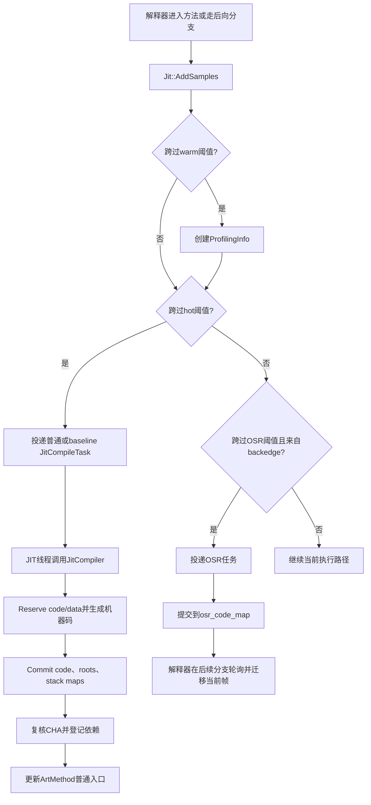
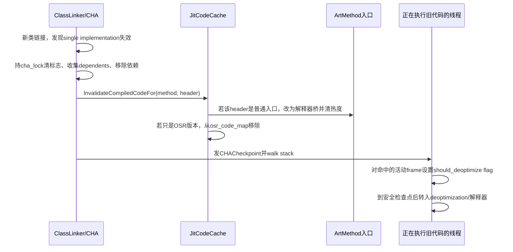
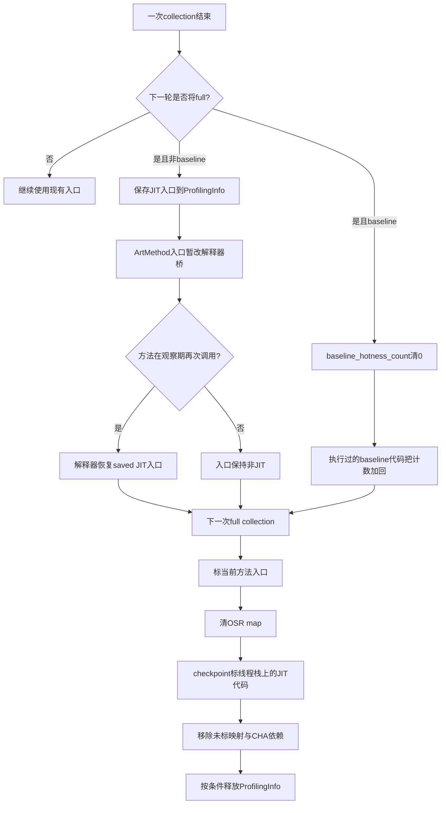

# 第565章 Android ART JIT运行时编译链：JitCodeCache、ProfilingInfo、Inline Cache、CHA、OSR、入口替换与代码回收

> 源码基线：Android 11 `android-11.0.0_r48`。本章只做macOS上的源码阅读与静态验证，不要求、也不会尝试编译AOSP。
>
> 本章的主问题：一个Java方法从“正在解释执行”变成“以后从机器码入口执行”，中间到底经过了哪些状态？当类型假设失效或Code Cache空间不足时，ART又怎样安全地退回解释器？

## 1. 先纠正最容易形成的错误印象

JIT不是“某方法调用到第N次，当前线程立刻把它编译完，然后跳进去”。在r48的常规路径里，执行线程主要负责累计样本、越过阈值和投递任务；只有JIT线程池里的编译线程完成编译、提交代码和发布入口之后，后续调用才可能直接进入新机器码。长循环还多出一套OSR代码和解释器帧迁移，所以“请求编译”“编译完成”“普通入口已替换”“当前这一帧已进入机器码”是四个不同完成点。

## 2. 一句话总览

解释器在方法调用和后向分支处给`ArtMethod::hotness_count_`加样本；warm阈值触发`ProfilingInfo`，hot阈值投递普通/基线编译，OSR阈值且确有后向分支时投递OSR编译；编译器读取inline cache和CHA信息生成带守卫的机器码，`JitCodeCache::Commit()`先提交代码与元数据、复核CHA假设、登记依赖，最后经Instrumentation更新`ArtMethod`入口；回收或假设失效时再撤掉入口、标记栈上活代码并按需去优化。

## 3. 本章对象地图

先分清七类对象，后文才不会把它们混成“JIT缓存”：

1. `ArtMethod`：方法的运行时身份，含16位hotness counter、ProfilingInfo指针和quick入口。
2. `ProfilingInfo`：每个已进入观察阶段的方法的一块JIT data-space数据。
3. `InlineCache`：ProfilingInfo中按DEX调用点保存的receiver Class样本，r48每点5槽。
4. `JitCompileTask`：异步任务，保存方法、任务类型以及必要时保活声明类的全局引用。
5. `JitCompiler`：从`libart-compiler.so`加载的编译器接口实现。
6. `JitMemoryRegion`：代码区、数据区及其可写/可执行映射。
7. `JitCodeCache`：编译去重、地址索引、OSR表、CHA依赖协作、回收和统计的总管。

## 4. 先把“热”拆成三层含义

“warm”表示值得开始收集调用点类型；“hot”表示值得提交常规编译任务；“OSR hot”表示一个仍在解释器中的循环累计了更多后向分支样本，值得生成可从循环中途切入的OSR版本。三者不是Java语言状态，也不是三份永久标签，而是`MaybeCompileMethod()`跨过不同阈值时采取的动作。

## 5. r48 release的默认阈值

`art/runtime/jit/jit.cc`定义`kJitSamplesBatchSize=512`，release默认compile threshold是`20 * 512 = 10240`，warm-up默认是其一半`5120`；若没有显式OSR参数，OSR默认是compile threshold的两倍，即`20480`。这些数会受debug/stress模式和启动参数影响，只能称为这份源码的默认配置，不能硬编码为“所有Android设备恒定阈值”。

## 6. 为什么阈值按512量化

逐次做完整阈值判断会让解释器热路径付出不必要成本。`Jit::AddSamples()`先把旧、新计数向下取整到512的批次边界，普通模式仅在批次变化时调用较贵的`MaybeCompileMethod()`；slow-debug模式才每次检查。因此阈值也向上对齐到512，保证跨越动作不会被批量检查漏掉。

## 7. 阈值顺序不是靠配置者自觉

只要不是compile threshold为0的“首次使用即JIT”测试模式，创建`JitOptions`时会强制夹紧为`OSR > compile > warm-up`。OSR至少为两个步长，compile至少一个步长且低于OSR一个步长，warm-up不高于compile减一个步长。这说明配置值进入运行时后还会归一化，阅读日志时应以最终`JitOptions`为准。

## 8. 样本不是严格的业务调用次数

解释器快速调用路径给callee加1，后向分支也会加样本；解释器/编译代码转换还可使用`invoke_transition_weight`，卡顿敏感线程在可感知进程状态下又可能乘`priority_thread_weight`。所以hotness counter是调度启发式的“热度样本”，不适合作为精确调用计数器。

## 9. 第一幅图：从解释执行到已发布机器码



## 10. `ArtMethod`里的计数器只有16位

`ArtMethod::GetCounter()`和`SetCounter()`直接读写`uint16_t hotness_count_`。编译生成代码若被要求继续统计，会在达到`MaxCounter()`时饱和；解释器侧阈值也被限制在16位范围内。它不是可长期累加的64位性能指标，达到目的后常常保持高位，遇到失效/回收又可能被清到0或1附近。

## 11. `AddSamples()`不是原子精确累加

r48的`AddSamples()`先普通读取旧值，计算新值，最后普通写回；源码在ProfilingInfo缺失的补救分支也直说counter不是atomic。因此多线程同时执行同一方法时可能丢样本或错过一次精确阈值边缘。正确性不依赖精确计数：失败时会清计数并让方法以后重新变热，JIT调度允许近似。

## 12. `with_backedges`为什么必须一路传递

同样跨过OSR阈值，只有报告里带`with_backedges=true`才应投递OSR任务；若只是大量进入一个无循环的方法，`MaybeCompileMethod()`在OSR分支返回false，让本次样本暂不写回，而不是假装它需要栈上替换。解释器的后向分支钩子正是这个语义来源。

## 13. 调用样本从哪里进来

switch解释器的快速invoke路径在建立callee ShadowFrame前调用`jit->AddSamples(..., called_method, 1, false)`；后向分支的`HotnessUpdate()`则对当前方法调用`AddSamples(..., 1, true)`。mterp为降低跨C++边界次数，会用ShadowFrame里的countdown批量回报，但最终仍落到同一AddSamples/MaybeCompileMethod决策。

## 14. Java表面确实暴露过JIT启停方法

下面是`libcore/libart/src/main/java/dalvik/system/VMRuntime.java`中的r48真实声明：

```java
/**
 * Tells the VM to enable the JIT compiler. If the VM does not have a JIT
 * implementation, calling this method should have no effect.
 */
@libcore.api.CorePlatformApi
public native void startJitCompilation();

/**
 * Tells the VM to disable the JIT compiler. If the VM does not have a JIT
 * implementation, calling this method should have no effect.
 */
@libcore.api.CorePlatformApi
public native void disableJitCompilation();
```

## 15. 但r48这两个native实现是空函数

`art/runtime/native/dalvik_system_VMRuntime.cc`中的`VMRuntime_startJitCompilation()`和`VMRuntime_disableJitCompilation()`函数体都为空。不能仅凭Java注释就断言应用调用它们会真正启动/停止当前r48 ART的JIT线程；真正用于运行时内部暂停/恢复的是C++ `Jit::Stop()`、`Jit::Start()`及`ScopedJitSuspend`等路径。

## 16. `Jit::Stop()`不是“丢弃所有机器码”

它先等待现有/排队编译结束，停止worker，再等一次，以处理停止边界上的任务；`Start()`只是重启线程池worker。这里没有自动清空Code Cache或把所有ArtMethod入口重置成解释器桥，所以“停编译”和“撤销已编译代码”要分开理解。

## 17. JIT线程池在r48只有一个worker

`CreateThreadPool()`构造`ThreadPool("Jit thread pool", 1, ...)`，并设置pthread优先级。一个worker让该线程池里排队的常规任务串行，但first-use测试路径还能在进入方法的线程同步运行task，部分pre-JIT入口也可直接调用编译；执行线程还会并发投递、生成ProfilingInfo或修改类型样本，GC、类加载、Instrumentation同样可与编译交错。因此不能由“一个worker”推导出整个JIT无并发问题。

## 18. warm阈值首先想获得什么

非native方法跨过warm阈值、尚无ProfilingInfo、Code Cache允许分配且不是tiered JIT时，执行线程尝试`ProfilingInfo::Create(..., retry_allocation=false)`。这个非阻塞式路径用`jit_lock_`的try-lock，宁可失败也不让前台Java线程为JIT锁长时间等待。

## 19. 前台分配失败后怎样补救

若try-lock或data-space分配失败，执行线程投递`kAllocateProfile`任务。JIT worker稍后用`retry_allocation=true`再创建；该路径可正常拿锁，首次分配失败还能触发Code Cache GC后重试。因此“warm阈值一到就一定已有Profile”不成立，真实系统允许延迟补建。

## 20. 为什么没有虚调用点也创建ProfilingInfo

`ProfilingInfo::Create()`会扫描DEX，仅把virtual/interface调用的Dex PC加入entries，但即使entries为空仍创建对象。原因不只是inline cache：JitCodeCache还借它记录普通/OSR编译中标志、baseline热度、saved entry point和编译器inline-use计数。

## 21. 扫描哪些DEX指令

r48列出`INVOKE_VIRTUAL`、`INVOKE_VIRTUAL_RANGE`、两个quick变体、`INVOKE_INTERFACE`和range变体。static/direct/super调用不依赖receiver动态类型，所以不会为它们创建此处的receiver inline cache槽。

## 22. `ProfilingInfo`的内存形态

对象尾部使用`InlineCache cache_[0]`的变长布局；分配大小是固定头加`entries.size() * sizeof(InlineCache)`再按指针对齐。构造函数把整段cache清零，再逐项写入对应Dex PC。它位于JIT private region的数据空间，不是Java堆对象。

## 23. 发布ProfilingInfo的可见性

`AddProfilingInfoInternal()`先分配并placement-new，随后执行release fence，才把指针写进ArtMethod并加入`profiling_infos_`。整个创建受`jit_lock_`协调，还会在锁内重新检查是否已有其他线程创建，所以并发候选最终复用已发布对象而不是保留两份活动Profile。

## 24. Inline Cache到底缓存什么

它不是“调用点对应目标方法的机器码地址”。r48的`InlineCache`保存一个`dex_pc_`和5个`GcRoot<mirror::Class>`，记录该virtual/interface调用点实际见过的receiver运行时Class。编译器随后结合解析出的method、vtable/interface分派和这些类型样本尝试去虚拟化或内联。

## 25. 为什么一个方法有多个Inline Cache

方法里每个virtual/interface invoke都可能看见完全不同的receiver分布。用Dex PC作为键可区分“第一个接口调用单态、第二个虚调用多态”；若只按方法聚合，类型样本会互相污染，优化器无法知道哪个调用点稳定。

## 26. 类型样本何时写入

运行时完成virtual/interface分派时调用`Jit::InvokeVirtualOrInterface(this_object, caller, dex_pc, callee)`；若caller已有ProfilingInfo，就把`this_object->GetClass()`加入相应Dex PC的cache。它记录的是实际receiver Class，不是声明类型，也不是传入的callee参数。

## 27. 五个槽怎样并发填充

`AddInvokeInfo()`依次读取槽，经read barrier标记地址后：若已有同一Class就返回；若为空，用强顺序一致CAS写入；CAS输给另一线程就从当前槽重试。五槽都没有可用位置便结束，源码称其为megamorphic。这里没有额外计数，也不记录各类型出现频率。

## 28. “五类”不等于Java语义上的无限多态

优化器的r48分类很机械：0个非空槽是uninitialized，1个是monomorphic，2—4个是polymorphic，5个是megamorphic。第5个receiver一写满就进入megamorphic分类，并不会等到第6类；GC清掉不可达Class后槽还可能重新为空，因此这是运行时样本结构的状态，而非永久数学属性。

## 29. Inline Cache与GC的关系

槽类型是`GcRoot<Class>`，但Code Cache在`SweepRootTables()`中使用`Runtime::ProcessWeakClass()`处理它们；不可达/卸载Class可以被清零。无read barrier配置下，还会用`is_weak_access_enabled_`和条件变量在GC弱处理窗口禁止编译器复制cache，避免观察正在清理的地址。

## 30. 编译器读取的是快照

`CopyInlineCacheInto()`等待弱访问可用，再把非空Class复制到Java堆ObjectArray holder；编译器对这个快照分类和决策。执行线程可以继续产生新类型，因此编译完成时现实可能已变化。正确性要靠生成的Class检查、慢路径/去优化以及CHA失效机制，不靠“样本永远稳定”。

## 31. Profile是证据，不是证明

单态cache只说明观察窗口内见过一种receiver，不证明未来永远只有这种类型。优化器可以借此把高概率路径变快，但必须保留类型守卫或可去优化点。把profile-guided优化理解为“带验证的猜测”最准确。

## 32. 编译器如何按cache状态处理

`HInliner::TryInlineFromInlineCache()`对no-data/uninitialized直接不内联；单态尝试monomorphic内联，多态尝试polymorphic内联，megamorphic和missing-types明确不内联。一次“不内联”不等于整个方法编译失败，只是该调用点保留更通用的分派。

## 33. `missing-types`主要是离线Profile概念

JIT内存cache只按0—5个槽分类；AOT读取持久化profile时，某些receiver类型可能无法被可靠编码/定位，便出现missing-types。`GetProfiledMethods()`还会因跨ClassLoader、找不到type index、不同APK等原因标记missing。不要把“第五槽已满”和“类型缺失”混为同一状态。

## 34. 为什么低于compile阈值不持久化inline cache

`GetProfiledMethods()`检查方法counter；若尚未达到JIT compile threshold，只保存方法身份而不保存inline caches，注释解释这些样本可能不完整并造成不必要去优化。内存里开始采样的warm方法，不代表其类型分布已经适合作为下次安装的AOT依据。

## 35. hot阈值触发哪种任务

普通模式投递`kCompile`；启用tiered JIT或baseline compiler时先投递`kCompileBaseline`。投递前只粗看当前入口是否落在Code Cache；真正防重复、验证ProfilingInfo与类初始化条件的关口在编译线程进入`NotifyCompilationOf()`之后。

## 36. 任务入队不等于已去重

多个执行线程可能在近似计数边界上各自投递任务。`NotifyCompilationOf()`先看同baseline属性的普通Code Cache入口是否已存在，再在`jit_lock_`下检查ProfilingInfo的`is_method_being_compiled_`或`is_osr_method_being_compiled_`。因此队列可有冗余任务，但实际编译由缓存层二次挡住。

## 37. 普通和OSR分别去重

ProfilingInfo有两个独立布尔位，所以同一方法的普通编译和OSR编译是不同维度；OSR还检查`osr_code_map_`是否已有结果。`DoneCompiling()`无论成功与否都清对应编译中标志，使失败后未来仍有重试机会。

## 38. `JitCompileTask`为什么持有全局引用

对非boot class path且非precompile的方法，构造任务时给声明Class建立JNI global ref，析构时删除。它不是在保护Java receiver，而是防止任务排队/编译期间ClassLoader卸载导致ArtMethod所属类消失。precompile受另一套生命周期约束，故不走这条保活。

## 39. 编译前还会拒绝哪些方法

`Jit::CompileMethod()`拒绝不安全的被调试/断点检查方法、已经变成不可编译的obsolete/proxy等情形、全局/逐方法deoptimized状态；OSR又不能提交到shared region。若调用路径上的proxy method仍通过前置条件，传给编译器前也会用`GetInterfaceMethodIfProxy()`映射到真实接口Java方法，优化器不直接把动态代理ArtMethod当普通方法处理。

## 40. ProfileSaver的Java注册入口

下面是r48 `VMRuntime.java`用于把profile文件与代码路径交给运行时的真实接口：

```java
/**
 * Register application info.
 * @param profileFile the path of the file where the profile information should be stored.
 * @param codePaths the code paths that should be profiled.
 */
@libcore.api.CorePlatformApi
public static native void registerAppInfo(String profileFile, String[] codePaths);
```

## 41. 注册应用信息不是立刻编译

native层只是把String数组转换为路径并调用`Runtime::RegisterAppInfo()`；后续才由JIT/ProfileSaver按配置收集与保存。它建立“哪些代码路径对应哪个profile文件”的关系，不等于立刻跑profman/dex2oat，也不代表当前JIT Code Cache已经变化。

## 42. JIT编译器怎样装入进程

`Jit::LoadCompilerLibrary()`用`dlopen()`装`libart-compiler.so`（debug为`libartd-compiler.so`），解析`jit_load`；`Jit::Create()`调用它取得`JitCompilerInterface`。加载失败时记录警告并不创建JIT对象，运行时仍可依赖解释器/AOT代码，不应把“应用能运行”当作“JIT一定存在”。

## 43. 编译器内部仍用Optimizing Compiler

`JitCompiler`创建`Compiler::kOptimizing`实现，`CompileMethod()`调用`compiler_->JitCompile(...)`，参数含目标method、region、baseline和osr。JIT/AOT会复用大量优化与代码生成基础设施，但输出所有权、入口发布和生命周期不同：JIT结果留在当前进程内存区域。

## 44. baseline与optimized是两级编译

baseline机器码更快生成，并在自身入口/后向分支继续增加`ProfilingInfo::baseline_hotness_count_`。16位计数发生溢出时调用quick entrypoint `artCompileOptimized()`，再投递`kCompile`优化版。这里的升级阈值是该baseline计数溢出，而不是前面ArtMethod warm/hot/OSR三个阈值的简单复用。

## 45. tiered模式为何warm阶段不同

`MaybeCompileMethod()`的warm分支明确排除`UseTieredJitCompilation()`；tiered路径在hot阈值投递baseline时，如缺ProfilingInfo，由`NotifyCompilationOf()`在JIT线程可重试地创建。这样避免前台线程先承担Profile分配，同时确保baseline继续采样所需的数据存在。

## 46. Reserve阶段先算两类空间

`JitCodeCache::Reserve()`为代码增加`OatQuickMethodHeader`并按指令对齐；data大小由root table、stack map和指针对齐组成。它分别从code/data mspace分配，任一失败会把已分配部分归还，触发一次Code Cache GC再重试，第二次仍失败才让编译失败。

## 47. Code Cache为什么分code与data

代码区需要CPU执行权限，数据区存GcRoot表、CodeInfo/stack maps和ProfilingInfo等不可执行元数据。r48 `JitMemoryRegion`把总容量约一半给data、一半给code；某一半先耗尽就可能触发回收，即使另一半还有余量，所以只看总占用无法诊断所有分配失败。

## 48. W^X与双映射

支持memfd时，同一代码物理页可有“不可执行的写视图”和“只读可执行RX视图”，生成器从写视图提交，CPU从执行视图运行；数据也可有只读/可写双视图。这样常态避免同一虚拟映射同时W和X。旧内核且策略允许时才退到单映射，更新期间临时切RWX再回RX。

## 49. 初始容量不是最大容量

r48常量中release初始总容量是64 KiB，最大默认64 MiB，reserved capacity为初始值4倍；debug初始值是8 KiB。Region初始化会按两页对齐并可逐步IncreaseCodeCacheCapacity。64 KiB并不表示应用JIT最多只能存64 KiB代码。

## 50. 为什么最大值限制在1 GiB以内

method header到data cache内容使用32位偏移，若多个映射距离过远会破坏寻址假设。`JitCodeCache::Create()`主动拒绝超过1 GiB的最大容量，错误消息虽有拼写问题，但边界是明确的实现约束。

## 51. Commit的第一个关键顺序

在`jit_lock_`下先等待潜在Code Cache collection结束，再`CommitCode()`，然后`CommitData()`写入roots和stack maps。源码明确要求roots/stack maps在更新方法入口前提交；否则其他线程若先进入机器码，GC或去优化看到的元数据还未完整，正确性会破坏。

## 52. 为什么“机器码已复制”仍可能被丢弃

编译期间采用的CHA single-implementation假设可能已因并发类加载失效。Commit在拿`cha_lock_`后逐个复核；任一失效就清目标方法counter、返回false，不把代码作为可见入口。保留一段尚未发布/随后释放的分配成本，可以换取不执行错误假设代码。

## 53. CHA是什么优化证据

Class Hierarchy Analysis维护virtual方法“当前只有一个实现”的状态。若一个类尚无子类，或虽有子类但特定方法未被override，编译器可把virtual调用变成direct调用并进一步内联。它依赖当前动态已加载类层次，而不是证明未来不会加载新类。

## 54. 哪些场景不使用这类CHA去虚拟化

`HInliner::TryCHADevirtualization()`在AOT compiler、Zygote JIT和OSR图上直接放弃；single implementation为空、proxy方法等也不能走。特别是OSR不支持所需的`HDeoptimize`方案，因此不能把普通JIT的全部推测优化照搬给OSR版本。

## 55. 登记依赖与发布入口必须原子地协作

Commit持`jit_lock_`后再持`cha_lock_`，复核每个single-implementation标志、调用`AddDependency(single_impl, compiled_method, header)`，随后才把代码加入映射并更新入口。类链接失效同样以`cha_lock_`串行化；否则会出现“类加载已判假，但晚到编译仍把旧假设代码发布”的竞态。

## 56. 第二幅图：新子类如何撤销旧CHA假设



## 57. 失效时先处理未来调用

`InvalidateCompiledCodeFor()`若header正是方法普通入口（或Instrumentation保存的真实入口），就把入口更新为quick-to-interpreter bridge，并清counter让它以后重新变热。这样新的调用不会再进入失效版本。

## 58. OSR版本失效走另一张表

若header不是当前普通入口，代码检查`osr_code_map_`；匹配则删掉该方法的OSR映射，阻止后续解释器循环跳进去。普通入口和OSR入口并非同一个ArtMethod字段，因此必须分别撤销。

## 59. 已在栈上的旧代码不能只改入口

入口只影响未来调用。CHA收集所有依赖header后运行`CHACheckpoint`，遍历线程栈，对仍在执行且header支持should-deoptimize flag的frame把隐藏字节设为1；生成代码到相应检查点发现标志后触发去优化。这是“入口撤销+活动帧去优化”的两阶段正确性闭环。

## 60. 为什么称为混合同步/异步去优化

类加载线程同步完成依赖状态更新和入口失效；其他线程通过checkpoint被要求检查栈并设置frame局部标志，实际离开机器码发生在该线程随后执行生成的去优化检查时。它不是粗暴释放线程仍在跑的内存，也不是必须一次全局STW后瞬间重建所有帧。

## 61. 普通JIT代码怎样成为方法入口

非OSR、无需延迟类初始化的Java方法在Commit末尾调用`Instrumentation::UpdateMethodsCode(method, new_entry)`。Instrumentation会依据当前是否安装entry/exit或interpreter stubs决定ArtMethod实际入口是机器码、instrumentation trampoline还是解释器桥。

## 62. 因此ArtMethod入口不总等于真实JIT地址

开启method tracing等Instrumentation后，ArtMethod可能指向instrumentation entrypoint，而真实JIT地址保存在ProfilingInfo的`saved_entry_point_`。回收、CHA失效和入口查询都必须认识这层重定向，否则可能漏判机器码仍活着或留下悬空指针。

## 63. OSR提交为什么不更新普通入口

OSR代码只放入`osr_code_map_[method]`。它包含从特定Dex PC进入所需的OSR stack map，不是标准方法调用ABI入口；把它写进ArtMethod普通quick入口会让从方法开头调用的线程落到错误状态。

## 64. 什么是OSR

On-Stack Replacement意为：方法已在解释器栈上执行，尤其一个长循环可能很久不返回；等专用机器码生成后，ART把当前ShadowFrame中的live vregs按OSR stack map搬成quick frame布局，从某个循环位置继续执行，而不必等下一次重新调用方法。

## 65. 为什么仅普通JIT不够

若方法只调用一次，却在内部循环十亿次，普通hot编译即便很快发布，也只让“下一次方法调用”受益；当前解释器帧仍会跑完。OSR专门解决这种长驻栈热点。

## 66. OSR阈值只在后向分支有意义

switch解释器识别`offset<=0`的后向branch并更新热度；mterp也在回跳处批量加样本和轮询。只有`with_backedges=true`跨阈值才投递`kCompileOsr`，避免为“被调用很多但没有循环”的方法生成无法中途切入的版本。

## 67. 达阈值与真正跳转之间仍有延迟

OSR编译异步进行。mterp达到轮询状态后用质数101作为重新检查间隔，持续给可能丢失的请求补热度；每次检查`MaybeDoOnStackReplacement()`，没找到OSR header或当前Dex PC没有OSR stack map就继续解释执行。

## 68. `PrepareForOsr()`的廉价前置检查

r48先要求方法普通入口已经位于Code Cache，源码把这当作“应该尝试OSR”的便宜指标；随后才在禁止线程暂停的窗口查`osr_code_map_`。因此存在OSR任务/甚至历史结果，不代表任意时刻都能直接跳入。

## 69. 为什么拿到OSR header后禁止暂停

Code Cache GC可能删除仅存在于OSR表、又不在任何栈上的代码。如果线程在查到header后可暂停，回收线程可能释放它，再恢复时便使用悬空地址。`ScopedAssertNoThreadSuspension`把“查header、读CodeInfo、构造迁移数据”放在不可暂停窗口。

## 70. OSR stack map保存什么

它把目标Dex PC对应到native PC，并为每个DEX虚拟寄存器给出编译帧中的位置。dead/uninitialized值可标`kNone`，常量无需复制，r48此处期望其余live值位于stack slot；ART按映射把ShadowFrame vreg值写入临时native frame内存。

## 71. 引用为什么也可按32位槽搬运

这份r48 Android运行时使用压缩堆引用，ShadowFrame的vreg槽是32位；OSR搬运代码逐vreg取`int32_t`写目标slot。不能把这段实现泛化成“所有64位引用直接截断”；它成立依赖ART当前的reference表示和编译器生成的DexRegisterMap约定。

## 72. r48测试怎样制造“只调用一次但循环很热”

下面摘自`art/test/721-osr/src/Main.java`，它保留循环前的float局部变量，并用长循环促使OSR，再检查迁移后值没有丢：

```java
float testFloat;
switch (type) {
    case ONE: testFloat = 1000.0f; break;
    default: testFloat = 5f; break;
}

// Loop enough to potentially trigger OSR.
List<Integer> dummyObjects = new ArrayList<Integer>(200_000);
for (int i = 0; i < 200_000; i++) {
    dummyObjects.add(1024);
}

if (testFloat != 1000.0f) {
  throw new Error("Expected 1000.0f, got " + testFloat);
}
```

## 73. 真正切换由quick OSR stub完成

`MaybeDoOnStackReplacement()`先弹出解释器ShadowFrame，压入新的ManagedStack fragment，调用`art_quick_osr_stub(memory, frame_size, native_pc, result, shorty, thread)`；OSR机器码返回后再弹fragment、释放临时内存并把原ShadowFrame压回。第562章讲过的ManagedStack片段在此真正参与执行模式切换。

## 74. OSR执行中仍可能去优化

stub返回时若pending exception恰是内部DeoptimizationException，ART调用`DeoptimizeWithDeoptimizationException(result)`恢复解释执行语义。OSR不是从解释器单向进入“永不返回”的机器码；调试、守卫失败等仍可把状态重建回来。

## 75. 调试为什么会阻止OSR

`MaybeDoOnStackReplacement()`发现runtime callbacks正在inspect该方法就返回false，避免单步期间从解释器突然跳到OSR机器码。`CompileMethod()`也会拒绝含断点且不安全JIT的方法。可调试环境性能与release不同，是主动正确性选择，不是JIT随机失效。

## 76. 编译完成后怎样保证CPU看到新指令

创建会为生成代码注册`MEMBARRIER_CMD_PRIVATE_EXPEDITED_SYNC_CORE`能力；JitMemoryRegion提交还处理指令cache/权限映射。入口发布不是普通把byte数组地址塞入字段，必须满足数据元信息先就绪、指令可见和架构同步要求。

## 77. 为什么Code Cache需要自己的GC

JIT代码与Java对象生命周期不同：优化版本可替代baseline，CHA/重定义会废弃版本，OSR版本可能只短暂需要，而总容量有上限。如果只增长不回收，长进程最终无法继续编译；但直接按“最近没调用”释放又会杀掉栈上正在跑的代码。

## 78. 触发回收的主要路径

Reserve的code/data任一分配失败，或ProfilingInfo data分配在可重试路径失败，都会调用`GarbageCollectCache()`。若代码回收被禁用，则不mark-sweep，尝试扩大private region；若已有collection，后来者等待它完成并直接返回，避免并发两次回收互相破坏。

## 79. 哪些条件会禁用Code Cache GC

JIT创建时若编译器生成debug info，或Instrumentation已安装exit stubs，会关闭code GC；注释说明perf需要地址与方法一一对应，instrumentation栈又难以可靠保活method pointer。Zygote shared region也不回收，以便对子进程共享。禁回收不等于禁编译，只是空间策略改为增长直到上限。

## 80. partial与full collection如何选择

达到最大容量一定full；当前容量小于reserved capacity一定partial；否则若上次partial刚扩过容则本次full，反之partial。partial完成后扩大容量并标记“上次扩容”，full不扩容并清标记。这是容量阶段策略，不是Java Heap GC的young/full概念。

## 81. 下一轮full前为什么先“试探活性”

非baseline模式下，回收器把当前JIT入口暂存进ProfilingInfo.saved_entry_point，再把ArtMethod入口改为解释器桥。若方法随后再次被调用，解释器的JIT入口钩子会恢复saved入口；没有被重新调用的代码在下一轮更可能不被入口标活。它是一段跨回收周期的活性采样。

## 82. 试探不是立刻删除机器码

改入口只阻止未来直接进入，同时保留saved pointer；当前正在运行的frame仍可安全返回。到真正collection时，saved pointer会被清，counter重置，代码是否释放还要经过入口与线程栈标记。把试探阶段称为“删除”会误导诊断时序。

## 83. baseline模式采用另一种试探

若运行时可编译baseline，下一次full前把每个ProfilingInfo的`baseline_hotness_count_`清0；真正collection时，仍为0且当前入口是baseline的method先被改回解释器。期间执行过的baseline代码自己会增加该计数，因此活跃baseline入口可保留。

## 84. native JIT stub也需单独试探

在准备full时，已编译JNI stub对应的方法入口改回Generic JNI，并把method counter设为hot threshold减1，使下一次JNI调用能快速触发恢复/重新编译。native stub栈布局不同，源码明确防止在不安全的条件下随意切换。

## 85. 真正mark阶段先看方法入口

`DoCollection()`遍历JNI stub map和method code map：若某header entrypoint仍等于ArtMethod当前quick入口，就在live bitmap标记该代码。OSR code通常不是ArtMethod普通入口，因此不会仅凭osr map身份永久存活。

## 86. 然后清空OSR查找表

回收一开始就清`osr_code_map_`，注释说OSR代码除非位于线程栈，否则将被删除。这意味着即使OSR机器码当前正由线程执行，新的解释器循环也不会再跳入；活动版本只靠后续stack checkpoint标活，等活动frame离开后未来可释放。

## 87. 线程栈标活是核心安全线

`MarkCompiledCodeOnThreadStacks()`对所有线程发checkpoint；`MarkCodeClosure`用StackVisitor找当前OatQuickMethodHeader，凡code地址属于private JIT exec space就原子置live bitmap。发起线程进入suspended并等待其余线程通过barrier，确保没有遗漏仍执行旧代码的线程。

## 88. 回收不需要把所有mutator全程停住

栈checkpoint之后mutator仍可运行。源码论证入口可以变化，但不会变化到一段未标记的Code Cache代码；Commit若撞上collection会等待，特殊并发提交又会主动标live。因此清除未标记映射仍安全。这是锁、入口发布规则和bitmap协议共同保证的并发mark/sweep。

## 89. 新提交代码如何避免被正在进行的GC删掉

Commit末尾若发现`collection_in_progress_`，会把新code allocation原子标进live bitmap。按此函数的常规锁序，它在提交前已经等待collection并持有`jit_lock_`，通常不会撞到新回收；但源码仍保留这条补标保护。阅读并发回收时应把“提交前等待”和“提交后若有回收则补标”作为同一协议，而不要只看mark扫描。

## 90. sweep前先解除CHA依赖

`FreeAllMethodHeaders()`持`jit_lock_`再持`cha_lock_`，从CHA dependency map中移除待释放headers，然后才删mini-debug info并释放code/data。如果先释放内存，地址可能被新编译复用，而旧依赖表仍把同一header地址误认成旧版本。

## 91. 只有full传入Profile回收请求，baseline路径仍是例外

`DoCollection(self, collect_profiling_info=do_full_collection)`；非baseline分支在full时清掉无编译入口、未被编译器使用且不在zygote data space的ArtMethod Profile指针，sweep末尾再释放已脱钩对象。若`CanCompileBaseline()`为真，r48这部分仍留着`TODO: collect profiling info`，即使full也没有走同一释放逻辑。partial主要回收代码并扩容，更不会每次都销毁类型样本。

## 92. 编译器使用计数保护被内联方法Profile

当编译器读取某方法ProfilingInfo以做内联时，`NotifyCompilerUse()`增加16位`current_inline_uses_`，析构式scope调用`DoneCompilerUse()`减回；`IsInUseByCompiler()`还合并普通/OSR编译中标志。full collection据此避免释放编译器正在读取的cache。

## 93. 编译中标志的作用不止去重

它同时构成ProfilingInfo的生命周期保护。一个Profile即使ArtMethod暂时没有Code Cache入口，只要正在普通/OSR编译或被别的编译当作inline资料，就不能回收。将该位只理解为“任务去重锁”会漏掉内存安全含义。

## 94. full回收后的counter为何设为0或1附近

`ClearMethodCounter()`若方法曾warm先设置previously-warm标记，然后通常把counter设1，warm阈值为1时设0。注释说1保留“至少执行过一次”的profile布局信息，同时必须保证未来还能重新跨warm阈值。它不是一律清零。

## 95. 代码被回收后仍可再编译

撤入口、清/降低counter和释放旧机器码后，方法继续解释执行又会重新累计样本，重新创建Profile并投递编译。这使JIT GC是可恢复的缓存淘汰，不是永久把方法加入“禁止编译名单”。

## 96. AOT、JIT与解释器是入口竞争者，不是三种APK

方法初始quick入口可能来自OAT、resolution/interpreter桥或stub；JIT提交可覆盖到进程内Code Cache，Instrumentation又可插入trampoline，失效/回收再退回解释器。代码来源会随运行时状态变化，但Java方法身份仍由ArtMethod维系。

## 97. “JIT成功”至少要问哪三个成功点

编译器返回success只表示生成/提交流程完成；普通版本还要确认Instrumentation最终允许其成为有效执行入口；OSR版本只进入osr map，还要解释器在某次后向分支找到匹配stack map并完成迁移。`number_of_compilations_`甚至在CommitData之后、CHA最终复核之前就递增，所以一份刚复制完又因CHA失效而拒绝发布的候选也可能计入；该统计绝不能直接等价成实际入口命中次数。

## 98. 类初始化检查会推迟入口发布

需要call前clinit check的方法，若声明类尚未visibly initialized，非prejit通常拒绝编译、请求可见初始化并清counter重试。zygote/precompiled特殊路径可先保存code而不立刻作为入口。JIT不能绕过Java类初始化语义只为抢性能。

## 99. Java debuggable对CHA与入口的影响

Commit断言带CHA依赖的代码不应出现在Java debuggable运行中；Instrumentation也可把已编译地址放进saved entry或直接选择解释器桥。调试版“看起来没有内联/频繁回解释器”可能是设计行为，不能直接以release假设诊断。

## 100. SIGQUIT可看到哪些JIT统计

`Jit::DumpForSigQuit()`会输出Code Cache与累计编译时序、ProfileSaver信息；CodeCache dump含当前code/data已用与resident大小、容量、JNI stub条目、普通代码条目、总编译数、OSR编译数和collection次数。它适合判断是否频繁回收或根本未编译，但不直接给每个调用点命中率。

## 101. 不要把Java Heap GC与JIT Code GC混成一次

Java Heap GC负责对象图；JIT GC管理native code/data区域。两者会协作处理GcRoot、Class卸载和弱访问窗口，但触发条件、bitmap和回收对象不同。日志里的“code cache collection”不是又做了一遍Java对象mark-sweep。

## 102. Inline Cache不会直接保证正确分派

cache满、缺失或样本过时最多影响优化选择。通用virtual/interface分派本来就能按对象真实Class找目标；若编译器采用样本，会生成类型守卫和fallback/deopt。删掉Profile应让代码变慢或少优化，而不是让Java调用错方法。

## 103. CHA与Inline Cache的差别

Inline Cache是“这个具体Dex调用点过去见过哪些receiver”；CHA是“当前已加载类层次里某virtual方法是否只有一个实现”。前者局部、经验性，后者全局、结构性但可被未来类加载推翻。优化器可单独或结合使用，两者的失效与保活机制也不同。

## 104. OSR与普通入口的差别

普通JIT版本从方法入口接收参数，存于ArtMethod quick entry；OSR版本从特定Dex PC接收重建的live vregs，存于`osr_code_map_`。同一方法可同时有两种header；Code Cache统计、去重、回收和失效都必须带`osr`维度。

## 105. 一个完整时序例子

设`render()`首次进入后长循环：调用入口加1，回边不断加样本；到warm创建Profile并开始记录`shape.draw()`receiver；到hot投递普通baseline/optimized任务；到OSR阈值再投递OSR任务。普通版本先发布只改善下一次`render()`，OSR版本提交并在某个loop header匹配后才接管当前帧。后来加载新`Shape`实现，CHA撤入口并给活动frame设去优化标志；空间紧张时旧OSR/废弃版本又可能被Code GC回收。

## 106. 常见误解一：阈值等于调用次数

错。后向分支、invoke transition和优先线程权重都会贡献样本，mterp还批量回报；多线程非原子计数可丢样本。正确说法是“跨过热度启发式阈值”。

## 107. 常见误解二：ProfilingInfo只存Inline Cache

错。即使没有virtual/interface调用也创建；它还存编译中状态、baseline计数、saved entry、inline-use计数，并被JIT GC用于活性协议。

## 108. 常见误解三：OSR就是修改ArtMethod入口

错。OSR header进入专用map，解释器在后向分支借stack map搬运当前ShadowFrame；ArtMethod普通入口负责以后从方法开头的调用。

## 109. 第三幅图：Code Cache两阶段活性探测与回收



## 110. 常见误解四：回收先停世界再删除所有非入口代码

错。它先在锁内标入口并清OSR map，再用线程checkpoint标活动栈；mutator之后仍可运行，发布协议确保不会新进入未标代码，最后才移除未标映射。OSR代码若正在栈上仍会被保活。

## 111. macOS练习说明

下面四个练习都只读取`/Users/ninebot/androidSource`，不调用`m`、`ninja`、`dex2oat`或任何交叉编译器。可把源码根目录作为第一个参数传入；输出是锚点与一致性检查，目的是训练“先找调度点，再找所有权与失效点”的读法。

## 112. 练习一：核对三阈值和样本批次

```bash
set -eu
SRC_ROOT="${1:-/Users/ninebot/androidSource}"
cd "$SRC_ROOT"
rg -n 'kJitSamplesBatchSize|kJitDefaultCompileThreshold|kJitDefaultWarmUpThreshold|osr_threshold_ = jit_options->compile_threshold_ \* 2' \
  art/runtime/jit/jit.h art/runtime/jit/jit.cc
rg -n 'old_batch|new_batch|MaybeCompileMethod' art/runtime/jit/jit-inl.h
```

读输出时自己算一次：release compile默认`20×512`，warm为一半，OSR缺省再乘2；再确认`AddSamples()`只在批次边界变化时做完整检查。

## 113. 练习二：从DEX调用点追到五槽类型样本

```bash
set -eu
SRC_ROOT="${1:-/Users/ninebot/androidSource}"
cd "$SRC_ROOT"
rg -n 'INVOKE_VIRTUAL|INVOKE_INTERFACE|entries.push_back' art/runtime/jit/profiling_info.cc
rg -n 'kIndividualCacheSize|classes_\[' art/runtime/jit/profiling_info.h
rg -n 'AddInvokeInfo|CompareAndSetStrongSequentiallyConsistent' art/runtime/jit/profiling_info.cc
rg -n 'kInlineCacheMonomorphic|kInlineCachePolymorphic|kInlineCacheMegamorphic' art/compiler/optimizing/inliner.cc
```

期望建立四跳：筛Dex PC → 每点5个Class槽 → CAS写实际receiver → 编译器按0/1/2—4/5分类。

## 114. 练习三：核对OSR不是普通入口替换

```bash
set -eu
SRC_ROOT="${1:-/Users/ninebot/androidSource}"
cd "$SRC_ROOT"
rg -n 'kCompileOsr|IsOsrCompiled|osr_code_map_' art/runtime/jit/jit.cc art/runtime/jit/jit_code_cache.cc
rg -n 'PrepareForOsr|LookupOsrMethodHeader|GetOsrStackMapForDexPc|art_quick_osr_stub' art/runtime/jit/jit.cc
rg -n 'Loop enough to potentially trigger OSR|200_000' art/test/721-osr/src/Main.java
```

若理解正确，你会看到普通Commit更新Instrumentation入口，而OSR Commit只写map；解释器之后另查header、stack map并调用stub。

## 115. 练习四：复原Code Cache GC与CHA失效顺序

```bash
set -eu
SRC_ROOT="${1:-/Users/ninebot/androidSource}"
cd "$SRC_ROOT"
rg -n 'ShouldDoFullCollection|GarbageCollectCache|DoCollection|MarkCompiledCodeOnThreadStacks|RemoveUnmarkedCode' \
  art/runtime/jit/jit_code_cache.cc
rg -n 'single_impl_still_valid|AddDependency|InvalidateCompiledCodeFor' \
  art/runtime/jit/jit_code_cache.cc art/runtime/cha.cc
rg -n 'CHACheckpoint|SetShouldDeoptimizeFlag' art/runtime/cha.cc
```

请按输出口述两条链：空间回收是入口标活→栈标活→sweep；CHA失效是清假设/依赖→撤未来入口或OSR map→checkpoint处理活动帧。

## 116. 故障排查的最小问题集

遇到“某热点没JIT”先问：进程是否创建JIT和thread pool；最终阈值/权重是什么；方法是否compilable、正被inspect/deoptimized或等待visible initialization；是否成功创建ProfilingInfo；任务是否因已有同类版本/being-compiled去重；Reserve是否反复因code或data空间失败；Commit时CHA是否已失效；Instrumentation是否让实际入口留在桥上。遇到“JIT后仍卡”再区分普通版本已发布但当前长循环尚未OSR，还是cache多态导致关键调用点未内联。

## 117. 复读后专门补强的难点

本章复读时重点修正六种含混表达：hotness不是精确调用次数；warm不保证同步得到Profile；五槽写满即r48 megamorphic而非等第六类；机器码复制完仍须CHA复核和入口发布；OSR map与普通ArtMethod入口是两条路径；Code GC的“未作为入口”不等于“不活”，栈上header仍由checkpoint标活。还特别保留r48边界：Java `startJitCompilation/disableJitCompilation` native体为空，不能照Java注释推断实际效果。

## 118. 源码阅读地图

- 热度、任务、OSR迁移：`art/runtime/jit/jit.cc`、`jit.h`、`jit-inl.h`。
- Profile与五槽cache：`art/runtime/jit/profiling_info.cc/.h`。
- 空间、提交、去重、入口、GC：`art/runtime/jit/jit_code_cache.cc/.h`、`jit_memory_region.cc/.h`。
- 编译器与cache分类：`art/compiler/jit/jit_compiler.cc`、`art/compiler/optimizing/inliner.cc`及各架构code generator。
- CHA依赖/失效/活动帧：`art/runtime/cha.cc/.h`。
- Instrumentation入口仲裁：`art/runtime/instrumentation.cc`。
- 解释器回边钩子：`art/runtime/interpreter/interpreter_switch_impl-inl.h`、`mterp/mterp.cc`。
- Java API与OSR测试：`libcore/libart/src/main/java/dalvik/system/VMRuntime.java`、`art/test/721-osr/src/Main.java`。

## 119. 最终心智模型

把JIT看成一条可撤销的推测流水线：近似热度负责“何时值得观察/编译”，ProfilingInfo与CHA负责“依据什么猜”，编译线程和JitMemoryRegion负责“在哪里生成”，Commit锁序和Instrumentation负责“何时可见”，OSR负责“怎样接管已经在栈上的循环”，入口撤销、checkpoint去优化与Code Cache GC负责“猜错或空间不足时怎样安全退出”。其中任何中间对象都不是永久真相。

## 120. 下一章

第566章继续追`ART方法入口、quick resolution/interpreter/instrumentation bridge、trampoline、IMT冲突、inline cache miss与调用分派闭环`：把本章“更新一个entrypoint”继续向下拆成CPU真正如何从invoke指令到目标机器码，以及解析、JNI、代理、调试和去优化为何会选择不同桥。
