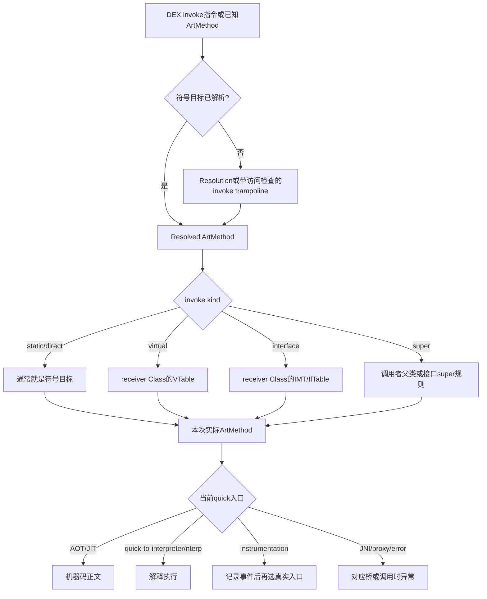
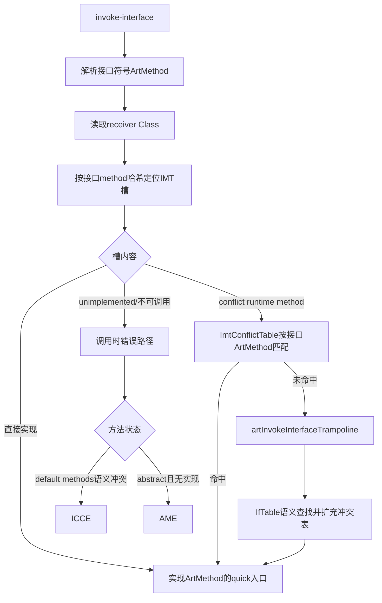
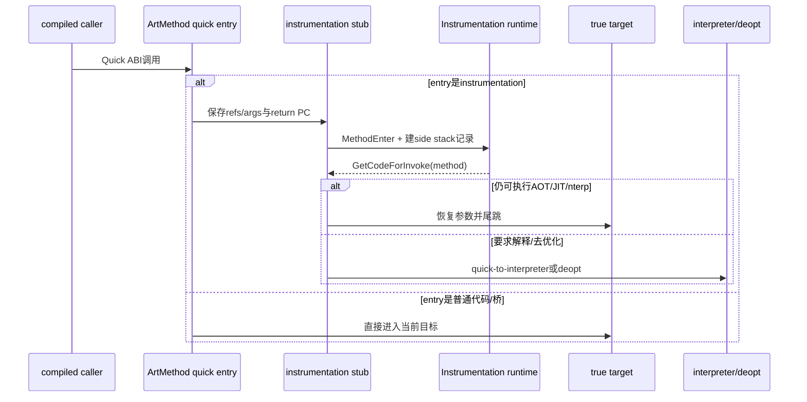

# 第566章 Android ART方法调用分派链：ArtMethod入口、Resolution、Interpreter、Instrumentation Bridge、VTable与IMT冲突

> 源码基线：Android 11 `android-11.0.0_r48`。本章只在macOS上阅读与静态验证源码，不要求、也不会尝试编译AOSP。
>
> 本章主问题：一条DEX `invoke-*` 指令已经知道“要调用哪个名字的方法”之后，ART为什么仍可能经过解析、类初始化、VTable/IMT动态分派、解释器桥、Instrumentation桥或冲突跳板，最后才真正进入方法体？

## 1. 先纠正“调用就是跳到函数地址”

Java调用不能简单等同于C函数调用。调用点最初拿到的可能只是DEX method index；即使已经解析为`ArtMethod*`，`invoke-virtual`和`invoke-interface`还要根据receiver的真实Class选择实现；即使实现方法也已确定，其quick入口又可能指向AOT/JIT机器码、解释器桥、nterp、类初始化守门的resolution stub、Instrumentation入口、JNI桥或错误入口。因此，“解析方法”“动态分派”“选择执行引擎”“进入方法体”是四个可分离步骤。

## 2. 一句话总览

调用点先把DEX符号解析成有语言语义的`ArtMethod`，virtual/interface/super再把符号目标细化为本次实际实现；编译代码通常通过VTable、IMT、OAT `.bss`或`ArtMethod`入口取得目标，解释器则通过`DoInvoke()`完成同类工作；最终quick入口充当可变路由槽，必要时由resolution、quick-to-interpreter、Instrumentation、IMT conflict、generic JNI等桥接代码保留参数、处理GC/异常/类初始化，再尾跳到真实执行体。

## 3. 先建立六层心智模型

1. DEX层：调用指令、method index、invoke kind和参数寄存器。
2. 符号解析层：在调用者的DexCache/ClassLoader语境里得到resolved method。
3. 动态分派层：根据receiver、VTable、IMT或super规则得到实际callee。
4. 入口路由层：读取`ArtMethod::entry_point_from_quick_compiled_code_`或编译期已选的其他代码位置。
5. ABI桥接层：在QuickFrame、ShadowFrame、JNI frame之间搬参数并维护GC可见性。
6. 执行层：AOT/JIT代码、switch/mterp/nterp解释器、native函数或抛错逻辑。

只要回答问题时漏掉其中一层，就容易把“已解析”误说成“已进入实现”，或把“入口已替换”误说成“所有调用点都会重新读入口”。

## 4. `ArtMethod`是什么，不是什么

`ArtMethod`是ART对一个方法的运行时描述，包含声明类、访问标志、DEX索引、方法索引、hotness/Profile信息以及入口点。它不是Java层`java.lang.reflect.Method`对象，也不是机器码本体。多个调用点可以共享同一个`ArtMethod`；同一`ArtMethod`的入口又能随类初始化、JIT、Instrumentation、去优化或重定义而改变。

## 5. quick入口是“路由槽”

字段名`entry_point_from_quick_compiled_code_`很容易令人误以为里面只能放编译代码。r48实际允许它指向AOT/JIT正文，也允许指向quick-to-interpreter、nterp、resolution、Instrumentation、generic JNI、proxy handler、obsolete method等入口。更准确的叫法是“从quick调用约定进入该方法时的当前路由地址”。

## 6. 为什么叫quick调用约定

Quick是ART内部managed code ABI：方法指针、整数/引用参数、浮点参数和溢出参数按目标架构约定放在寄存器与栈上，栈帧还要满足栈遍历和GC需要。它不等于Java字节码，也不等于JNI ABI。各种quick trampoline的核心职责之一，就是在不丢失这套现场的前提下做慢工作。

## 7. 修改入口会清掉一个快路径标志

`ArtMethod::SetEntryPointFromQuickCompiledCodePtrSize()`设置新入口时，还会清除`kAccFastInterpreterToInterpreterInvoke`。原因是解释器此前可能认为callee可直接在解释器内部调用；一旦入口变成编译代码或某种桥，继续绕过入口就可能跳过JIT/Instrumentation等新状态。这说明入口更新不仅是写一个指针，还会使相关快路径失效。

## 8. 第一幅图：一次调用的分层决策



## 9. 类链接时怎样挑初始入口

`class_linker.cc`里的`LinkCode()`为刚链接的方法选择入口。不可调用的方法设成quick-to-interpreter，让真正调用发生时走统一抛错；没有OAT quick code的native方法使用generic JNI，普通Java方法使用解释入口；若策略要求解释，也改为解释入口；有编译代码但static方法仍需类初始化检查时，先安装resolution stub；只有无需这些守门动作时才直接使用quick code。

## 10. `GetQuickOatCodeFor()`名字也不能照字面读

这个函数先查proxy handler，再取OAT quick code，再找JIT Code Cache保存的预编译入口；仍无结果时，native返回generic JNI，满足条件的Java方法返回nterp，否则返回quick-to-interpreter bridge。因此它返回的是“当前可作为底层调用目标的最佳quick入口”，并不保证结果来自`.oat`。

## 11. 为什么static编译代码仍要resolution stub

首次主动使用static方法前必须完成声明类初始化。如果某线程正处于`<clinit>`内，它自己可能调用该类方法，但其他线程不能绕过初始化等待直接执行。于是即便AOT/JIT代码已经存在，入口也可能暂时保留resolution stub；只有类达到对其他线程可见的initialized状态，入口才适合永久换成机器码。

## 12. “初始化中”与“已初始化”不是同一发布条件

resolution路径允许初始化线程在`IsInitializing()`时取得真实代码继续执行，但只在`IsInitialized()`时调用Instrumentation更新方法入口。前者解决同一初始化线程的递归/内部调用，后者保证其他线程仍被守门。把两者都概括成“类初始化过了”会漏掉并发安全的关键点。

## 13. r48真实测试怎样守住这个边界

`art/test/694-clinit-jit/src/Main.java`专门让一个static方法在`<clinit>`期间变热并可能被JIT编译，同时让另一线程尝试调用它。测试注释明确要求入口在类初始化完成前继续保持resolution入口：

```java
public static class InnerInitialized {
  static int staticValue1 = 0;
  static int staticValue2 = 1;

  static int $noinline$runHotMethod(boolean doComputation) {
    if (doComputation) {
      for (int i = 0; i < 100000; i++) {
        staticValue1 += staticValue2;
      }
    }
    return staticValue1;
  }

  static {
    // Make $noinline$runHotMethod hot so it gets compiled. The
    // regression used to be that the JIT would incorrectly update the
    // resolution entrypoint of the method. The entrypoint needs to stay
    // the resolution entrypoint otherwise other threads may incorrectly
    // execute static methods of the class while the class is still being
    // initialized.
    for (int i = 0; i < 10; i++) {
      $noinline$runHotMethod(true);
    }

    // Start another thread that will invoke a static method of InnerInitialized.
    new Thread(new Runnable() {
      public void run() {
        for (int i = 0; i < 100000; i++) {
          $noinline$runInternalHotMethod(false);
        }
        // Give some time for the JIT compiler to compile $noinline$runInternalHotMethod.
        // Only compiled code invoke the entrypoint of an ArtMethod.
        try {
          Thread.sleep(1000);
        } catch (Exception e) {
        }
        int value = $noinline$runInternalHotMethod(true);
        if (value != 42) {
          throw new Error("Expected 42, got " + value);
        }
      }
      public int $noinline$runInternalHotMethod(boolean invokeStaticMethod) {
        if (invokeStaticMethod) {
          // The bug used to be here: the compiled code of $noinline$runInternalHotMethod
          // would invoke the entrypoint of $noinline$runHotMethod, which was incorrectly
          // updated to the JIT entrypoint and therefore not hitting the resolution
          // trampoline which would have waited for the class to be initialized.
          return $noinline$runHotMethod(false);
        }
        return 0;
      }

    }).start();
    // Give some time for the JIT compiler to compile runHotMethod, and also for the
    // other thread to invoke $noinline$runHotMethod.
    // This wait should be longer than the other thread's wait to make sure the other
    // thread hits the $noinline$runHotMethod call before the initialization of
    // InnerInitialized is finished.
    try {
      Thread.sleep(5000);
    } catch (Exception e) {
    }
    staticValue1 = 42;
  }
}
```

上面从测试中逐字摘录了`InnerInitialized`；外层`Main`和最终打印语句未展示。两个不同长度的sleep不是普通业务同步写法，而是在run-test环境里扩大竞态窗口。它验证的不是“JIT能否编译”，而是“已经有JIT代码也不能提前撤掉类初始化守门入口”。

## 14. Resolution trampoline其实有两种进入语义

`artQuickResolutionTrampoline(called, receiver, self, sp)`先检查`called->IsRuntimeMethod()`。若`called`不是runtime method，真实方法在进入时已经已知，这条路径按static处理，主要承担类初始化守门；若`called`是runtime resolution method，它只是占位符，trampoline必须从调用栈和调用指令恢复真正的目标。

## 15. runtime method是哨兵，不是业务方法

ART创建若干特殊`ArtMethod`作为callee-save、resolution、IMT conflict/unimplemented等运行时哨兵。它们没有普通Java方法完整语义，入口让汇编和C++知道当前需要做哪种慢工作。看到`ArtMethod*`不能立刻断言它对应某个DEX方法。

## 16. 未知调用如何找回调用者

ARM64 `art_quick_resolution_trampoline`先建立save-refs-and-args帧，再调用C++。C++通过`QuickArgumentVisitor::GetCallingMethod(sp)`找到caller，通过返回PC、OatQuickMethodHeader和stack map/PC映射恢复caller的Dex PC。优化代码存在内联时，它还要读最内层inline info，而不是粗暴使用外层方法的某个固定Dex PC。

## 17. Dex PC为什么是恢复语义的钥匙

有了caller和Dex PC，运行时才能读出当前位置的DEX指令，区分`INVOKE_DIRECT/STATIC/SUPER/VIRTUAL/INTERFACE`及range变体，并从`VRegB_35c()`或`VRegB_3rc()`取method index。仅凭参数和receiver无法可靠恢复invoke kind，也无法执行正确的访问/类型检查。

## 18. range与非range只改变参数编码

`invoke-virtual {v1,v3,v7}`一类35c格式显式编码最多若干参数寄存器；`invoke-virtual/range {v10..v20}`一类3rc格式编码连续起点和数量。resolution必须按指令格式取method index，后续参数访问器也按shorty与Quick ABI遍历，而不是假定Java参数都连续位于C栈。

## 19. slow path为什么先保护引用参数

解析类、解析方法或触发类初始化都可能分配并发生GC。receiver和其他引用参数此时仍散落在quick寄存器保存区/栈参数区，不能只靠普通C++局部变量保活。`RememberForGcArgumentVisitor`把引用转入JNI local reference状态，慢操作后再`FixupReferences()`，处理移动GC可能改变对象地址的问题。

## 20. `ResolveMethod()`解决的是符号问题

`ClassLinker::ResolveMethod<kCheckICCEAndIAE>()`在caller的DexFile、DexCache和ClassLoader语境里查找method id对应的语言方法，并检查invoke kind不兼容和非法访问等问题。结果是resolved symbolic method；对virtual/interface而言，它还不必是本次receiver最终执行的override。

## 21. DexCache按调用者DEX分账

method index只在某个DexFile内部有意义，所以解析缓存挂在对应DexCache上，而不是全进程建立一个“编号→方法”数组。两个DEX里的index 123可以指向完全不同的方法。排查缓存时必须同时记录caller DexFile、index和invoke kind，不能只打印一个数字。

## 22. r48方法缓存不是完整method-id大数组

`mirror::DexCache::kDexCacheMethodCacheSize`固定为1024，slot用`method_idx % 1024`计算。槽中同时保存`ArtMethod*`与原始method index；读取时索引不相等就视为miss。这样用有界缓存换空间，碰撞只造成重新解析，不应把另一个index的结果误当命中。

## 23. ARM64为什么能直接取低10位

1024是2的幂，因此模运算等价于取低10位。ARM64 conflict trampoline用`ubfx`结合`METHOD_DEX_CACHE_HASH_BITS`取得槽号，并原子读出“方法指针+索引”二元组。位提取是当前常量与生成配置的实现细节，语义仍是带tag校验的有界哈希缓存。

## 24. OAT `.bss`方法槽是第二种缓存

resolution成功后，如果当前DexFile有OAT BSS method mapping，运行时找到对应`.bss`槽并以release store写入resolved `ArtMethod*`。以后某些编译调用点可从BSS加载方法，省去再次进入解析；DexCache和OAT BSS用途相近但不是同一块内存，也没有跨文件事务式同步。

## 25. 为什么发布使用release store

调用线程看到非空BSS方法指针时，必须同时看到该`ArtMethod`及相关类链接状态已经就绪。release发布与读取侧约定建立先行关系。这里不是为了让“指针写入原子”这么简单，而是为了约束写入前初始化结果对后续线程的可见顺序。

## 26. virtual解析后还要按receiver细化

resolution先得到声明/符号方法，随后`receiver->GetClass()->FindVirtualMethodForVirtual()`通过vtable index取得override。假设`Base.f()`已解析，而receiver实际是`Child`，缓存里保留Base层符号目标仍然合理，本次实际callee却可以是`Child.f()`。

## 27. interface解析后还要做接口实现查找

对`invoke-interface`，符号目标属于某个interface，实际receiver Class需要通过IMT快查或IfTable语义查找实现。默认方法、Miranda/copied method、冲突方法和类实现优先级都由链接与查找规则处理。DexCache命中接口`ArtMethod`不等于已经拿到实现代码。

## 28. invoke-super依赖caller身份

super调用不是按receiver真实Class继续向下分派，而是从caller声明类的父类VTable，或接口super的专用规则中取目标。因此resolution trampoline必须保留caller；只拿receiver与resolved method无法还原正确的`invoke-super`语义。

## 29. 动态分派完成后才读取入口

得到本次实际`called`后，运行时检查static类初始化，再根据force-interpreter与入口状态选择code。若入口仍是resolution stub，就从OAT/JIT/nterp/interpreter路径取得底层入口；类完全initialized时才更新方法入口。最后把实际`ArtMethod*`写回`*sp`，汇编恢复参数后把它放到Quick ABI要求的位置再跳转。

## 30. 返回null不是“没有代码所以解释”

`artQuickResolutionTrampoline()`结尾强校验：`code == nullptr`当且仅当线程已有pending exception。正常无编译代码时会明确返回quick-to-interpreter或nterp，而不是用null表达解释执行。汇编看到null应进入异常投递，不应继续调用。

## 31. Resolution成功不保证调用成功

解析过程中仍可抛`NoSuchMethodError`、`IllegalAccessError`或`IncompatibleClassChangeError`；类初始化可抛初始化异常；dynamic refinement若语言结构非法也会落到调用时错误。分清“缓存已有method”“已找到实际实现”“入口非空”和“方法正常返回”四个完成点，日志才不会误判。

## 32. Resolution不会把receiver特化写入DexCache

若把`Child.f()`作为某次receiver结果永久写进method index槽，下次Base的另一个子类调用就可能错误。DexCache缓存符号解析结果，receiver特化由VTable/IMT或带守卫的JIT inline cache完成；这两种cache的键与正确性条件完全不同。

## 33. 还有一族“带访问检查的invoke trampoline”

Optimizing Compiler的`HInvokeUnresolved`会调用线程quick entrypoint表里的`InvokeStatic/Direct/Super/Virtual/InterfaceTrampolineWithAccessCheck`。它们走`artInvokeCommon`模板，而不是必须先把callee入口设成`art_quick_resolution_trampoline`。所以“所有首次invoke都经过同一个resolution函数”不准确。

## 34. 为什么编译器需要独立unresolved调用族

编译代码已经知道调用点的method index和invoke kind，可按专门ABI把index作为隐藏信息传给runtime。runtime先尝试无挂起的`FindMethodFast`；只有快查失败才保护参数并进入可挂起的`FindMethodFromCode`。专用入口避免每次都做栈回溯和DEX指令解码。

## 35. `FindMethodFast`的能力边界

它要求非static调用receiver非空，先从DexCache取得与invoke kind兼容的resolved method，再按类型做分派：static/direct直接返回resolved method，virtual按receiver VTable，interface走接口实现查找，super按resolved class与caller父类规则。任何条件不满足便返回null给慢路径，而不是在“fast”函数里冒险触发可挂起解析。

## 36. null receiver何时抛NPE

慢路径的`FindMethodToCall`负责精确调用时机与错误语义。编译后的virtual/interface快路径常在读取`receiver->klass_`时使用implicit null check，由fault与PC info转成Java NPE；unresolved runtime路径则显式判断。实现形式不同，但都必须把异常归因到正确DEX调用点。

## 37. `TwoWordReturn`装的是什么

带访问检查的C++ trampoline返回两个机器字：一个是本次实际`ArtMethod*`，另一个是要跳转的code pointer。汇编恢复原参数，布置callee method寄存器后跳到code；有异常时走pending-exception入口。它并不是Java方法的业务返回值。

## 38. 方法解析与字段解析不要混用术语

DEX中method、field、type、string各有自己的解析缓存和quick entrypoint。本文的`artQuickResolutionTrampoline`针对方法调用入口；`iget/sget/new-instance/check-cast`等即使也会“resolve”，路径、返回值和异常条件均不同。看到日志中的resolution要先确认对象种类。

## 39. Java源码如何对应多种invoke

`art/test/003-omnibus-opcodes/src/MethodCall.java`把构造、private direct、super、virtual、static与大量参数放在一个真实测试中。下面几行尤其适合反编译后对照invoke kind：

```java
public class MethodCall extends MethodCallBase {
    MethodCall() {
        super();
        System.out.println("  MethodCall ctor");
    }

    int tryThing() {
        int val = super.tryThing();
        Main.assertTrue(val == 7);
        return val;
    }

    private void directly() {}

    /*
     * Function with many arguments.
     */
    static void manyArgs(int a0, long a1, int a2, long a3, int a4, long a5,
        int a6, int a7, double a8, float a9, double a10, short a11, int a12,
        char a13, int a14, int a15, byte a16, boolean a17, int a18, int a19,
        long a20, long a21, int a22, int a23, int a24, int a25, int a26,
        String[][] a27, String[] a28, String a29)
    {
        System.out.println("MethodCalls.manyArgs");
        Main.assertTrue(a0 == 0);
        Main.assertTrue(a9 > 8.99 && a9 < 9.01);
        Main.assertTrue(a16 == -16);
        Main.assertTrue(a25 == 25);
        Main.assertTrue(a29.equals("twenty nine"));
    }

    public static void run() {
        MethodCall inst = new MethodCall();

        MethodCallBase base = inst;
        base.tryThing();
        inst.tryThing();

        inst = null;
        try {
            inst.directly();
            Main.assertTrue(false);
        } catch (NullPointerException npe) {
            // good
        }

        manyArgs(0, 1L, 2, 3L, 4, 5L, 6, 7, 8.0, 9.0f, 10.0, (short)11, 12,
            (char)13, 14, 15, (byte)-16, true, 18, 19, 20L, 21L, 22, 23, 24,
            25, 26, null, null, "twenty nine");
    }
}
```

`super()`/`super.tryThing()`体现direct/super语义，`base.tryThing()`需要virtual分派，private `directly()`不允许子类override。具体DEX生成仍受编译器与DEX转换器影响，所以应以反编译结果验证，而不是仅凭Java语法猜opcode。

## 40. direct/static调用不一定每次读`ArtMethod`入口

ARM64代码生成的static/direct有多种MethodLoadKind和CodePtrLocation：递归自调用可直接`bl`本方法入口标签，boot image目标可PC-relative，OAT BSS可间接加载，JIT direct address可从literal pool取，runtime call甚至由runtime完成；只有`kCallArtMethod`明确从callee method的quick入口加载后`blr`。

## 41. 入口可变不等于所有旧调用自动跟随

若调用点直接嵌入机器码地址，后来只改`ArtMethod`入口未必影响该点。ART需通过编译策略、JIT依赖、去优化、Instrumentation安装、类层次分析失效等机制保证需要拦截的调用不会逃逸。调试“入口已经换了但某路径仍跑旧代码”时，要先确认调用点的CodePtrLocation。

## 42. virtual快路径的真实形状

r48 ARM64 `GenerateVirtualCall()`从receiver读Class并记录implicit null check，baseline模式可更新JIT inline cache；随后按编译期已知vtable index加载`Class`内嵌VTable的`ArtMethod*`，再从该方法读取quick入口并`blr`。这里没有先查DexCache，因为验证/编译已经确定符号方法与vtable index。

## 43. VTable为什么适合virtual

子类链接时把override放到继承槽位，调用点只需携带稳定slot index。`Base.f()`与`Child.f()`在各自Class的同一语义槽上指向不同`ArtMethod`，receiver Class自然完成多态。VTable解决“类继承的虚调用”，不负责任意接口method到实现的稠密映射。

## 44. VTable项保存方法而非裸代码

虚调用加载到的是`ArtMethod*`，然后再读quick入口。这样同一个分派槽可受JIT、解释器、Instrumentation等入口变化影响，也能把callee method传入ABI供栈遍历/反射/异常处理使用。如果VTable直接存裸代码，方法身份与动态入口更新都会更难协调。

## 45. baseline inline cache不参与语言正确性

`MaybeGenerateInlineCacheCheck()`在baseline JIT中记录receiver Class，用于后续优化版编译。即使Profile为空、多态或被GC清理，VTable/IMT通用路径仍给出正确结果。Inline cache是性能证据，不是virtual/interface语义的唯一真相。

## 46. interface为什么不能简单复用VTable index

不同接口各自定义method集合，同一实现类可实现许多接口；接口method没有跨所有类统一且紧凑的VTable槽。ART给每个具体Class建立固定大小IMT作为快速哈希入口，碰撞时再落到冲突表/IfTable慢查，在空间和平均调用成本之间折中。

## 47. r48的IMT默认大小是43

`art/build/art.go`从`ART_IMT_SIZE`读取配置，默认字符串是`43`，并生成`-DIMT_SIZE=43`；`imtable.h`把它变成`ImTable::kSize`。43是这份基线的构建默认，不应写成Android API保证，设备构建可覆盖它。

## 48. IMT哈希用了哪些语义信息

`imtable-inl.h`根据声明接口descriptor、方法名和完整proto计算三个哈希分量，再用固定系数组合并对IMT大小取模。方法重载的proto不同，slot可能不同；无关接口方法仍可能落入同一slot。哈希不要求无碰撞，只要求相同接口方法在链接和调用两侧得到相同位置。

## 49. IMT槽有三种常见状态

1. 未实现哨兵：该slot没有可调用实现。
2. 直接实现`ArtMethod*`：此slot对应的方法可直接分派。
3. conflict runtime method：多个接口方法哈希到同一slot，需查看其`ImtConflictTable`。

第三种是哈希结构冲突，不代表Java语言定义本身有冲突。

## 50. 第二幅图：interface调用与两种“冲突”



## 51. 编译后的ARM64 interface快路径

`VisitInvokeInterface()`先读receiver Class并设置implicit NPE位置，baseline可记录receiver类型；随后把调用点DEX method index放入隐藏寄存器`xIP1`，从Class加载IMT指针，按编译期哈希slot取`ArtMethod*`，加载其quick入口并`blr`。隐藏index主要供冲突慢路径找回接口method。

这一函数开头还保留`TODO: b/18116999, our IMTs can miss an IncompatibleClassChangeError`。因此本文描述的是正常已验证程序的主链；遇到畸形/不兼容DEX边界时，不能把这条r48快路径拔高为“已覆盖所有ICCE检查”的证明。

## 52. 直接IMT命中为什么很快

当slot只对应一个接口method，链接器可直接填实现`ArtMethod*`。热路径只需Class、IMT slot、入口三次关键间接读取，无需线性遍历所有接口。它仍比被优化成单态直接调用多一些间接访问，但保持通用正确性。

## 53. conflict method怎样携带表

ClassLinker为需要的Class创建特殊runtime conflict `ArtMethod`，其quick入口指向`art_quick_imt_conflict_trampoline`，并借用方法数据/JNI offset位置保存`ImtConflictTable*`。表是一串`{interface_method, implementation_method}`对，最后以null接口指针结束。

## 54. 为什么表的key是接口方法对象

同一个IMT slot可混入不同接口、不同名字或不同proto的方法，slot号本身不足以区分调用。调用点的method index先经caller DexCache得到resolved interface `ArtMethod*`，冲突表再以这个稳定身份逐对比较，从而选择对应implementation。

## 55. conflict汇编先尝试DexCache

ARM64 trampoline从栈取referrer，若caller不是obsolete，便用隐藏method index计算1024槽并原子读取DexCache二元组；index匹配时得到接口method。若caller obsolete或缓存miss，转去`artLookupResolvedMethod()`，且汇编自己保存全部参数与返回地址，因为该辅助函数明确不能依赖普通runtime frame做栈遍历。

## 56. 表命中后直接尾跳

汇编线性扫描冲突对，找到接口method相等项，就加载implementation `ArtMethod*`及其quick入口并`br`，不再回到原call site做第二次调用。尾跳既保留原Java参数，又避免多一层业务栈帧；栈遍历看到的仍应是合法quick frame关系。

## 57. 表未命中为什么还可能正常

类链接时的表不是永远覆盖未来所有情况：动态类加载、接口方法解析时机等可能使某调用首次到来才需要补项。汇编miss会调用C++ `artInvokeInterfaceTrampoline()`，它按IfTable执行完整接口实现查找，成功后返回实际方法和入口。

## 58. 冲突表怎样扩容

`AddMethodToConflictTable()`分配一张更大的表，复制旧pair并追加新pair；若当前slot还是共享的默认conflict method，或调用方要求新method，就创建ClassLoader/类专属runtime method再指向新表。发布前有release fence，避免读者先看到新表指针却看不到已填内容。

## 59. 为什么旧表会被保留

r48注释承认后续冲突可能让旧LinearAlloc表泄漏，并发线程还可能各自构建候选。LinearAlloc生命周期通常随ClassLoader，冲突扩容频率也低，设计选择了简单的只增不就地修改，换取无锁读路径和读者内存安全。不能把它宣传成完全无泄漏的copy-on-write容器。

## 60. 类链接阶段已经尽量预建IMT

`LinkInterfaceMethods()`和`FillIMTAndConflictTables()`遍历IfTable/虚方法，先用unimplemented哨兵填槽，再放直接实现或构造冲突表；若与父类IMT语义相同还能共享。运行时追加是兜底，不表示每次interface调用都动态建表。

## 61. hash collision不抛ICCE

两个完全合法、都有明确实现的接口方法也可哈希到同一slot。conflict table精确区分后应分别正常调用，性能上只是多一次扫描。若看到`art_quick_imt_conflict_trampoline`，最多证明IMT slot不唯一，不能据此诊断Java默认方法冲突。

## 62. default-method conflict才是语言语义冲突

若一个类继承两个互不更具体的默认实现而没有合法选择，ClassLinker可生成/标记default-conflicting方法。该`ArtMethod`不可调用，真正执行时`ThrowInvocationTimeError()`先检查`IsDefaultConflicting()`并抛`IncompatibleClassChangeError`；否则不可调用且abstract时抛`AbstractMethodError`。

## 63. r48测试如何制造默认方法冲突

`art/test/966-default-conflict`把`Iface`与`src2/Iface2`放入不同输入，让二者都声明`sayHi()`默认实现，再让`Main`同时实现它们。测试在调用处明确区分AME与预期ICCE：

```java
// 以下三条“文件”注释由本文添加，代码体逐字摘录。
// 文件：src/Iface.java
public interface Iface {
  public default String sayHi() {
    return "Hi";
  }
  public default String charge() {
    return "CHARGE";
  }
}

// 文件：src2/Iface2.java
public interface Iface2 {
  public default String sayHi() {
    return "hello";
  }
}

// 文件：src/Main.java（只摘录类声明和callIface）
class Main implements Iface, Iface2 {
  public static void callIface(Iface m) {
    System.out.println("Calling non-conflicting function on Iface");
    System.out.println(m.charge());
    System.out.println("Calling conflicting function on Iface");
    try {
      System.out.println(m.sayHi());
      System.out.println("Unexpected no error Thrown on Iface");
    } catch (AbstractMethodError e) {
      System.out.println("Unexpected AME Thrown on Iface");
    } catch (IncompatibleClassChangeError e) {
      System.out.println("Expected ICCE Thrown on Iface");
    }
    System.out.println("Calling non-conflicting function on Iface");
    System.out.println(m.charge());
    return;
  }
}
```

这段测试源码刻意跨输入构造javac平常会拒绝的最终组合，所以不能照抄成普通单模块应用示例；它用于验证ART面对已有DEX时的运行时语义。

## 64. AME与ICCE的分界

`AbstractMethodError`表达调用最终落到abstract且没有可执行实现；`IncompatibleClassChangeError`表达调用指令类型与类/接口结构不兼容，或默认方法存在不可选择冲突。二者都可能通过不可调用`ArtMethod`的解释器桥统一抛出，但错误类型由method flags与上下文决定。

## 65. unimplemented IMT槽不是普通null

ART使用全局IMT unimplemented runtime method作为哨兵，使compiled interface call仍可按统一的“load ArtMethod→load entrypoint→branch”形式进入慢/错误路径。哨兵减少热路径分支，却要求调试器识别runtime method；把它按普通DEX method打印会得到无意义索引。

## 66. IfTable是语义后盾

IMT只做有损哈希加速，IfTable保存类实现的接口及其方法数组关系。`FindVirtualMethodForInterface()`在冲突miss等慢路径依据IfTable寻找准确实现。即使关闭某些快路径，语言结果也应由这套完整关系维持；性能退化不应改变语义。

## 67. 解释器也先做解析再做实际目标选择

`interpreter_common.h`的`DoInvoke()`先尝试InterpreterCache或ClassLinker解析called method，再调用`FindMethodToCall()`按invoke kind和receiver得到实际callee。随后才记录JIT receiver信息、选择fast interpreter-to-interpreter或通用`DoCall()`。这与编译代码的层次对应，只是数据所在位置和快路径不同。

## 68. InterpreterCache与DexCache不是一回事

InterpreterCache以DEX指令地址等作为快速键，减少解释器反复跨层查询；DexCache是DexFile级解析缓存，也被编译/runtime路径使用。nterp是否可用还会影响某些InterpreterCache更新。两者可互相借结果，但生命周期、key和消费者不同。

## 69. 解释器的`FindMethodToCall()`仍负责错误语义

即使called method来自缓存，也要确认receiver非null、invoke kind兼容，并按virtual/interface/super规则选择实际方法。缓存只能省查询，不能永久跳过会随receiver或调用语境变化的判断。r48历史测试专门覆盖“同一DexCache槽被不同invoke kind误用”的问题。

## 70. 解释器怎样给JIT喂receiver样本

virtual/interface调用确定callee后，解释器会通知JIT调用者、Dex PC、receiver Class等信息，使上一章的`ProfilingInfo::InlineCache`收集真实类型。记录发生在正确分派附近，但样本只用于优化；即使记录失败、槽满或Class被GC清除，本次调用仍继续走通用正确路径。

## 71. fast interpreter-to-interpreter是什么

当callee满足条件且入口状态允许时，解释器可直接新建ShadowFrame并继续switch/mterp执行，避免先转成Quick ABI再从quick-to-interpreter桥转回来。这个优化依赖`kAccFastInterpreterToInterpreterInvoke`；设置新quick入口会清标志，保证JIT/Instrumentation等新路由不被绕过。

## 72. 解释器调用编译代码需要反向桥

`ArtInterpreterToCompiledCodeBridge()`从callee ShadowFrame高位输入vreg取得参数，通过`ArtMethod::Invoke()`进入quick invoke stub；static方法若未visibly initialized会先`EnsureInitialized()`，JIT存在时还可通知interpreter-to-compiled transition。它是ShadowFrame→Quick ABI方向，与quick-to-interpreter正好相反。

## 73. `ArtMethod::Invoke()`不是所有调用的总入口

反射、解释器转编译和部分runtime路径会调用它；已经生成的compiled virtual/interface调用通常直接走汇编间接分派，不会先进入这个C++函数。阅读调用图若把`ArtMethod::Invoke()`画成所有Java调用必经节点，会夸大其覆盖面。

## 74. quick-to-interpreter桥做了什么

ARM64汇编保存refs-and-args现场后调用`artQuickToInterpreterBridge()`。C++读取shorty与CodeItem，按Quick ABI访问寄存器/栈参数，创建callee ShadowFrame，把引用放进GC可见槽，压入ManagedStack fragment和线程ShadowFrame链，再进入`EnterInterpreterFromEntryPoint()`；返回时弹栈并把JValue转回quick返回寄存器。

## 75. 它不是一条普通`jmp`

QuickFrame和ShadowFrame的参数布局、GC根表示、Dex PC、异常处理和栈遍历需求不同。桥必须在禁止挂起的窗口内先把引用安全搬入ShadowFrame，再允许可能触发GC的工作；还要处理static类初始化、proxy接口shorty、返回值和异常。将其称作“切到解释器的跳转”会漏掉最重要的ABI与根管理。

## 76. quick-to-interpreter也承接不可调用方法

入口开头若`!method->IsInvokable()`，直接`ThrowInvocationTimeError()`并返回0。这样abstract/default-conflicting method不用各自拥有一套完整quick ABI抛错汇编。`LinkCode()`把不可调用方法放到该入口，是“延迟到真正调用时抛错”的设计。

## 77. 已去优化帧也会从这里进入

桥会先尝试弹出`StackedShadowFrameType::kDeoptimizationShadowFrame`。若存在，它不是从quick参数重建全新帧，而是交给deoptimization解释路径恢复优化帧的逻辑状态。这解释了同一个入口为何同时出现在“没有编译代码”和“有代码但必须退回解释器”两类场景。

## 78. 返回时还可能要求调用者去优化

解释执行结束后，若Instrumentation frame-pop、force interpreter或其他deopt条件要求，桥不能简单返回原compiled caller继续跑；它会设置相应去优化信号，让异常/返回投递链恢复调用者ShadowFrame。执行引擎转换因此同时涉及callee入口与caller续执行点。

## 79. nterp不是quick-to-interpreter的别名

nterp是汇编解释器实现，`GetNterpEntryPoint()`直接返回`ExecuteNterpImpl`，合适的`ArtMethod`入口可以直接指向它。quick-to-interpreter bridge则是通用Quick→ShadowFrame入口，内部最终可能进入switch/mterp等解释执行。日志里看到nterp地址时不应强行命名为bridge。

## 80. r48什么条件允许nterp

runtime需要`!kPoisonHeapReferences && kUseReadBarrier`并满足`CanUseMterp()`；method还要`SkipAccessChecks()`、非native、来自standard dex，且`NterpGetFrameSize(method) < kMaxNterpFrame`。这是源码基线的实现约束，不是所有Android 11构建都必然启用。

## 81. 验证完成后入口还能从bridge换成nterp

方法通过验证并可跳过访问检查后，ClassLinker可把原quick-to-interpreter入口更新为nterp；但需要类初始化守门的static方法仍先保留resolution stub。验证状态、类初始化状态和执行引擎选择彼此交织，却不能合并成一个布尔“方法已准备好”。

## 82. Instrumentation入口又加了一层路由

启用方法进入/退出事件、trace或需要解释执行的调试功能时，`Instrumentation::UpdateMethodsCodeImpl()`可能把普通方法入口设为quick instrumentation entry。真正调用先进入该stub，记录事件/side stack，再由`GetCodeForInvoke()`取得AOT/JIT/nterp/解释器目标。

## 83. 第三幅图：Instrumentation与解释/编译转换



## 84. Instrumentation为什么要保存“真实入口”

入口槽被Instrumentation占用后，仍需知道原本应执行什么。AOT可由ClassLinker重新查，JIT代码可能由ProfilingInfo保存或Code Cache的`FindCompiledCodeForInstrumentation()`定位。否则安装事件stub等于永久丢掉JIT目标，只能无条件退解释器。

## 85. `GetCodeForInvoke()`的决策顺序

若所有Instrumentation stub均已撤销，优先返回method当前非Instrumentation入口；native走ClassLinker底层入口；若要求全解释，返回quick-to-interpreter；仅有Instrumentation事件且方法不需要debug版本时先问ClassLinker的OAT/nterp入口；仍是解释桥时再尝试JIT Code Cache。最终至少有解释器兜底。

## 86. Instrumentation入口也要保护参数

方法进入事件可能调用监听器、分配对象并触发GC，原quick参数中的引用需要先转成可追踪状态，事件结束后修复移动地址。stub还要把原return PC与“从解释器还是compiled进入”等信息压入Instrumentation side stack，供method-exit、unwind和deopt配对。

## 87. Method tracing不是简单在Java方法头插代码

ART可以通过统一Instrumentation入口与返回stub收集method enter/exit，而不修改每份Java源码；已编译代码还要兼顾inline frame、异常展开和现有栈帧。不同Instrumentation level决定仅装事件stub还是强制解释，性能和可见粒度也不同。

## 88. 调试断点为何会改变执行入口

某方法被deoptimized、单步或需要精确局部变量时，运行时可能要求解释执行。resolution与Instrumentation代码都检查force/deoptimized状态，返回quick-to-interpreter，而不是盲目进入AOT/JIT。停用调试后还需按当前代码状态恢复入口，不只是清一个全局开关。

## 89. JIT与Instrumentation必须协商

JIT Commit生成新代码后不能直接覆盖Instrumentation入口，否则会丢失事件；它通过Instrumentation更新方法代码，让Instrumentation决定入口槽继续指向stub，还是可以发布JIT地址，并保存底层目标。上一章的“入口发布”到这里才获得完整语义。

## 90. direct call与Instrumentation的风险点

若编译器把某调用做成不可拦截的直接地址，而后续又要观察method entry，事件就可能被绕过。因此编译/Instrumentation设计必须保证可deopt、可patch或在启用Instrumentation时选择可拦截调用形态。源码阅读时不能只检查callee入口，还要检查caller生成了何种调用。

## 91. native方法入口走另一套桥

没有专用native quick代码时，`GetQuickOatCodeFor()`返回generic JNI stub。它按shorty重排Quick ABI参数为JNI ABI，构造HandleScope/local refs，切线程状态，调用已注册或dlsym解析出的native地址，再检查异常并恢复。native不是quick-to-interpreter的特殊分支。

## 92. 首次JNI符号查找还有dlsym入口

native method的JNI data/entry可先指向dlsym lookup stub；首次调用按声明ClassLoader的native namespace寻找符号，成功后更新实际native入口。quick侧仍可能先经过generic JNI框架。区分“quick入口”和“native函数入口”可避免把两级指针混为一处。

## 93. Proxy也有专用入口

动态Proxy方法由ClassLinker选择quick proxy invoke handler。它保存参数，取得proxy receiver与接口方法信息，调用`InvocationHandler`，再做返回值转换与异常约束。Proxy `ArtMethod`不按普通Java CodeItem解释，也不应送入普通JIT正文路径。

## 94. obsolete method是重定义后的历史身份

JVMTI重定义可让旧栈仍引用obsolete `ArtMethod`。非native obsolete方法可改到专用invoke-obsolete stub，从保存的obsolete DexCache/CodeItem执行；native入口不能随意按同样方式改，因为quick frame size与栈遍历依赖native/managed入口类型。入口替换受帧布局正确性约束。

## 95. 返回地址也是运行时元数据的索引

resolution、异常、GC和deopt需要从native PC映射回Dex PC/stack map。编译器在call后记录`RecordPcInfo()`；trampoline保存return PC，runtime再借OatQuickMethodHeader解析。若汇编手工改调用布局却不更新frame info/PC info，可能业务结果偶尔正确但GC或异常时崩溃。

## 96. implicit NPE依赖精确PC记录

virtual/interface快路径故意直接解引用receiver Class，把空指针fault作为快速null check；`MaybeRecordImplicitNullCheck()`必须紧邻该指令并与Dex PC关联。运行时捕获fault后才能构造定位正确的Java NPE。不要把它误判成“源码漏了receiver判空”。

## 97. read barrier在分派代码里也有现实折中

ARM64读取receiver Class后，r48注释说明这里只做可能的unpoison，没有完整read barrier；依据当时Concurrent Copying在标记结束前保持from-space可访问。注释同时承认未来collector变化可能需要barrier。它是特定GC不变量下的实现，不是“Class引用永远无需读屏障”。

## 98. quick entrypoint table与方法入口不同

Thread持有一张quick entrypoint函数表，包含解析、分配、抛异常、inline cache更新等runtime helper；每个`ArtMethod`又有自身quick入口槽。`HInvokeUnresolved`调用的是线程表里的特定helper，而普通virtual调用最终读的是callee方法入口。两种“entrypoint”必须带所有者说明。

## 99. runtime stub地址可能有两份表示

`ClassLinker::IsQuickResolutionStub()`同时比较runtime直接stub地址与从OAT加载的resolution trampoline地址；quick-to-interpreter和generic JNI也类似。只和一个函数符号做裸地址比较可能漏判来自boot image/OAT trampoline的等价入口。

## 100. 架构汇编不同，语义契约相同

本章用ARM64展示x寄存器、`blr/br`和save-refs-and-args布局；ARM、x86、x86_64的寄存器与汇编宏不同。跨架构应抓住四个契约：参数现场可恢复、callee `ArtMethod`正确布置、GC/栈遍历能识别frame、异常时不跳入空code。

## 101. 一次普通virtual调用的完整推演

假设编译代码执行`base.f()`且receiver是Child：编译器已把符号方法映射为vtable index；机器码读receiver Class并完成implicit NPE，再从Child VTable该slot取`Child.f`的`ArtMethod*`；读取其入口。如果入口是JIT地址便直接执行；若被Instrumentation占用，先记录enter再转JIT；若方法被去优化，则从解释器桥建立ShadowFrame执行。

## 102. 一次首次unresolved interface调用的推演

调用点携method index进入带访问检查runtime helper；ClassLinker在caller语境解析接口method，检查访问与invoke kind；按receiver IfTable/IMT找到实现。后续compiled通用调用把method index藏进`xIP1`，按IMT slot快查；若slot冲突，conflict trampoline先从DexCache找回接口method，再从pair表挑实现并跳到其当前入口。

## 103. 一次static类初始化竞态的推演

线程A进入`<clinit>`并把`S.work()`跑热，JIT可能已经提交代码；线程B同时调用`S.work()`。只要S未完成初始化，方法入口仍是resolution stub。A作为初始化线程可在`IsInitializing()`状态得到真实代码继续；B在`EnsureInitialized()`等待或观察失败。S完全initialized后才把入口发布为JIT/AOT。

## 104. 一次Method Trace下调用的推演

原来`Child.f`入口是JIT代码。开启trace后Instrumentation把入口改为instrumentation stub并保存/可重新找到JIT目标；下一次virtual分派仍由VTable选中`Child.f`，但读取入口后先进入stub；stub建立side stack并发enter事件，再尾跳JIT；return stub发exit事件后回caller。关闭trace后恢复合适入口。

## 105. 为什么“方法调用慢”不能只看method body

冷调用可能付解析、类加载/初始化、访问检查；interface可能付冲突表扫描；解释/编译边界要搬参数；Instrumentation会发事件；JNI要建HandleScope和切状态；首次native还会dlsym。性能分析应先用调用栈/trace确认时间花在正文还是入口前后。

## 106. 解析风暴的诊断思路

若同一method index反复miss，检查DexCache 1024槽是否因大量index碰撞被覆盖、caller是否obsolete、是否跨多个DexFile/ClassLoader、OAT BSS是否有mapping、解析是否每次抛异常。哈希缓存miss只影响性能；若结果随miss变化，往往是invoke kind检查或ClassLoader语境处理有bug。

## 107. IMT conflict热点怎样判断

先确认采样栈是否反复落在`art_quick_imt_conflict_trampoline`，再计算相关接口方法slot并检查Class的冲突表长度。不要把receiver类型多态直接等价为IMT collision：多个receiver可能各自slot直达；同一receiver也可能因多个接口method哈希相同而冲突。

## 108. Instrumentation导致延迟怎样判断

检查当前Instrumentation level、方法是否单独deoptimized、入口是否等于instrumentation stub、`GetCodeForInvoke()`最后选JIT/AOT还是解释器。仅看到“JIT code存在”不能证明调用正在直接进入它；事件stub和force interpreter可能仍在前面。

## 109. 四类常见入口的判读表

| 当前入口 | 说明 | 下一步可能去向 |
|---|---|---|
| resolution stub | 符号未知或static类初始化守门 | resolve/EnsureInitialized后到代码或异常 |
| quick-to-interpreter | 无可用代码、强制解释、不可调用或去优化 | 建ShadowFrame、解释或抛调用时错误 |
| instrumentation entry | 需要方法事件/调试路由 | 记录后再选AOT/JIT/nterp/解释 |
| IMT conflict entry | interface哈希slot不唯一 | pair表命中或IfTable慢查 |

它们都可被口语叫“跳板”，但触发条件、输入和副作用完全不同。

## 110. 最容易犯的八个错误

1. 把resolved method当实际override。
2. 把quick入口当机器码正文。
3. 把所有首次调用都归到同一个resolution trampoline。
4. 把IMT哈希碰撞当默认方法语义冲突。
5. 把nterp当quick-to-interpreter bridge的别名。
6. 认为改`ArtMethod`入口会拦截所有已生成direct call。
7. 认为JIT代码存在即可绕过static类初始化。
8. 认为trampoline不建业务Java栈帧就与GC/异常无关。

## 111. macOS只读练习说明

下面四个练习只用`test`、`rg`、`sed`、`awk`等读取`/Users/ninebot/androidSource`，不生成AOSP产物、不调用构建系统。可整段复制到Terminal；每段最后打印`PASS`且退出码为0才算完成。若源码不在该绝对路径，请只改`SRC`变量。

## 112. 练习一：确认方法入口可指向多种路由

```bash
set -eu
SRC=/Users/ninebot/androidSource
test -f "$SRC/art/runtime/class_linker.cc"
test -f "$SRC/art/runtime/art_method.h"
rg -n "GetQuickOatCodeFor|GetQuickToInterpreterBridge|GetNterpEntryPoint|GetQuickGenericJniStub" \
  "$SRC/art/runtime/class_linker.cc" | sed -n '1,28p'
rg -n "GetEntryPointFromQuickCompiledCode|SetEntryPointFromQuickCompiledCode" \
  "$SRC/art/runtime/art_method.h" | sed -n '1,20p'
echo "PASS: quick入口是可变路由槽，不只是机器码地址"
```

预期能在`GetQuickOatCodeFor()`附近同时看到OAT/JIT、generic JNI、nterp和quick-to-interpreter候选；若只搜到字段声明而没读选择函数，练习还没完成。

## 113. 练习二：区分resolution的两个进入模式

```bash
set -eu
SRC=/Users/ninebot/androidSource
FILE="$SRC/art/runtime/entrypoints/quick/quick_trampoline_entrypoints.cc"
test -f "$FILE"
rg -n "artQuickResolutionTrampoline|called_method_known_on_entry|GetCallingDexPc|ResolveMethod<|IsQuickResolutionStub|IsInitialized\(\)" \
  "$FILE" | sed -n '1,55p'
COUNT=$(rg -c "called_method_known_on_entry" "$FILE")
test "$COUNT" -ge 3
echo "PASS: 已知static方法守门与未知invoke解析共享函数，但语义不同"
```

重点不是记住行号，而是找到`!called->IsRuntimeMethod()`这个分叉，并确认未知模式会恢复caller/Dex PC，已知模式则直接把invoke kind设为static。

## 114. 练习三：核对IMT大小、哈希和冲突表

```bash
set -eu
SRC=/Users/ninebot/androidSource
test -f "$SRC/art/build/art.go"
test -f "$SRC/art/runtime/imtable-inl.h"
test -f "$SRC/art/runtime/arch/arm64/quick_entrypoints_arm64.S"
rg -n 'ART_IMT_SIZE.*43|IMT_SIZE' "$SRC/art/build/art.go" "$SRC/art/runtime/imtable.h"
rg -n "GetHash|GetImtIndex" "$SRC/art/runtime/imtable-inl.h" | sed -n '1,28p'
rg -n "art_quick_imt_conflict_trampoline|ImtConflictTable|artInvokeInterfaceTrampoline" \
  "$SRC/art/runtime/arch/arm64/quick_entrypoints_arm64.S" | sed -n '1,30p'
echo "PASS: IMT是固定大小哈希快表，碰撞由精确pair表消解"
```

练习结果只能证明r48默认构建配置与ARM64实现，不能推出所有厂商构建、所有架构都固定使用相同行号或寄存器。

## 115. 练习四：对照两个方向的解释器桥和Instrumentation

```bash
set -eu
SRC=/Users/ninebot/androidSource
Q="$SRC/art/runtime/entrypoints/quick/quick_trampoline_entrypoints.cc"
I="$SRC/art/runtime/interpreter/interpreter_common.cc"
N="$SRC/art/runtime/interpreter/mterp/nterp.cc"
T="$SRC/art/runtime/instrumentation.cc"
test -f "$Q" && test -f "$I" && test -f "$N" && test -f "$T"
rg -n "artQuickToInterpreterBridge|BuildQuickShadowFrameVisitor" "$Q" | sed -n '1,22p'
rg -n "ArtInterpreterToCompiledCodeBridge|method->Invoke" "$I" | sed -n '1,22p'
rg -n "CanRuntimeUseNterp|CanMethodUseNterp|GetNterpEntryPoint" "$N" | sed -n '1,22p'
rg -n "UpdateMethodsCodeImpl|GetCodeForInvoke" "$T" | sed -n '1,30p'
echo "PASS: Quick到ShadowFrame、ShadowFrame到Quick、nterp与Instrumentation已分账"
```

如果把前两组结果合成一个“interpreter bridge”，请重新画出参数方向：`artQuickToInterpreterBridge`是Quick→解释器，`ArtInterpreterToCompiledCodeBridge`是解释器ShadowFrame→Quick。

## 116. 调试时的十步检查单

1. 记录caller、DexFile、Dex PC、method index与invoke kind。
2. 判断调用点来自解释器、AOT、JIT还是runtime helper。
3. 区分resolved symbolic method与actual callee。
4. virtual看vtable index，interface看IMT index与receiver Class。
5. 检查receiver null与异常归因PC。
6. 打印callee是否runtime/native/proxy/obsolete/invokable。
7. 识别quick入口是哪种stub或代码区地址。
8. static确认声明类是initializing还是initialized以及当前线程身份。
9. 检查Instrumentation/deopt/force interpreter状态。
10. 异常时读取pending exception，勿把null code当普通fallback。

## 117. 复读后专门修正的难点

本章初稿复读时重点做了七处收紧：第一，明确resolution trampoline既可处理未知调用，也可为已知static方法守类初始化；第二，补出unresolved compiler invoke还有独立带访问检查入口族；第三，把DexCache符号缓存与JIT receiver inline cache拆开；第四，把IMT哈希冲突与默认方法语义冲突拆开；第五，强调nterp可直接成为方法入口，并非quick-to-interpreter同义词；第六，补充direct call可能不重读`ArtMethod`入口，避免把入口替换效果说得过宽；第七，保留ARM64 interface代码生成器关于ICCE漏检的r48 TODO，不把正常主链描述成所有畸形DEX边界的完备证明。

## 118. 建议按这个顺序回到源码

1. `art/runtime/art_method.h`、`art_method-inl.h`、`art_method.cc`：入口、runtime method与调用时错误。
2. `art/runtime/class_linker.cc`：`LinkCode()`、`GetQuickOatCodeFor()`、IMT构建。
3. `art/runtime/entrypoints/quick/quick_trampoline_entrypoints.cc`：resolution、interface、quick/interpreter、Instrumentation C++主体。
4. `art/runtime/arch/arm64/quick_entrypoints_arm64.S`：保存参数、隐藏index、恢复与尾跳。
5. `art/compiler/optimizing/code_generator_arm64.cc`：direct、virtual、interface调用点机器码形状。
6. `art/runtime/interpreter/interpreter_common.h/.cc`：解释器解析、DoCall与反向桥。
7. `art/runtime/instrumentation.cc`：入口安装与真实目标恢复。

## 119. 本章最终心智模型

看到一次方法调用，先问“符号是谁”，再问“这次receiver/caller选择谁”，然后问“这个实际`ArtMethod`当前入口是什么”，最后问“桥接代码怎样保存参数、GC根、PC和异常”。DexCache回答符号解析，VTable/IMT回答动态实现，quick入口回答当前执行路由，trampoline回答慢路径与ABI转换；四者协作但不能互相替代。

## 120. 下一章预告

第567章继续进入ART方法执行前的安全门：ClassVerifier怎样用RegisterLine与类型格逐条解释DEX，如何验证分支、异常边、构造器未初始化引用、monitor与invoke参数；验证失败怎样区分hard/soft failure，怎样影响`SkipAccessChecks`、nterp、解释器和编译资格。这样可解释本章为什么某些方法能走fast path，另一些必须持续做访问检查或退回解释器。
