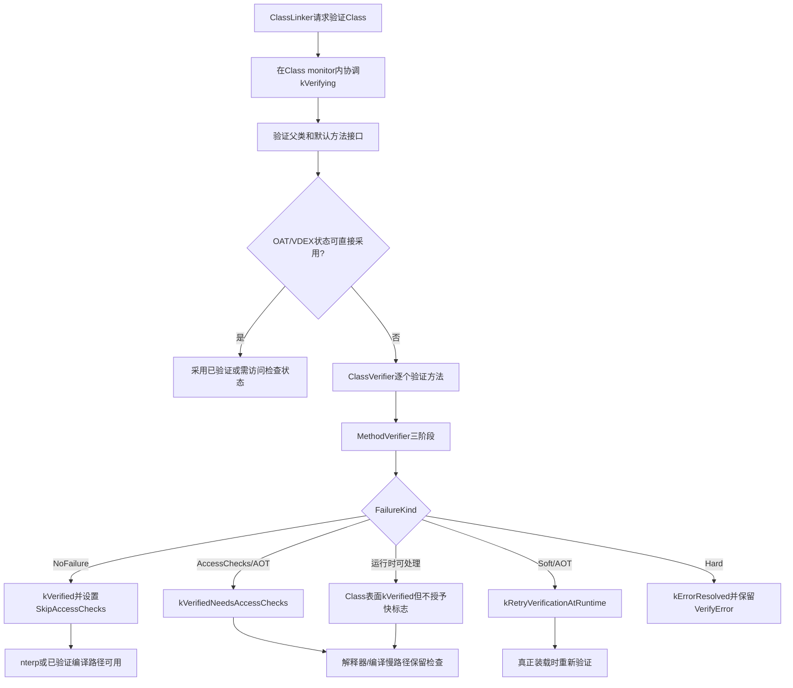
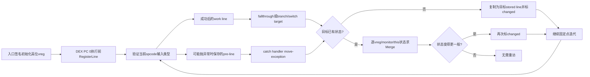
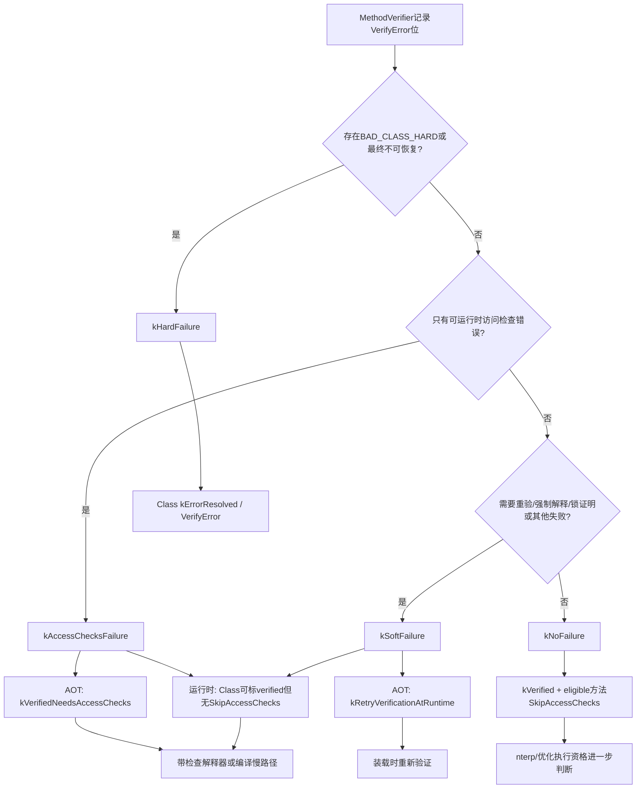

# 第567章 Android ART字节码验证链：ClassVerifier、RegisterLine类型格、控制流、构造器、Monitor、Invoke与失败分级

> 源码基线：Android 11 `android-11.0.0_r48`。本章只在macOS上阅读和静态验证源码，不要求、也不会尝试编译AOSP。
>
> 本章主问题：ART在执行一个DEX方法之前，怎样证明每条可达路径上的虚拟寄存器类型、构造器状态、异常边、锁栈和调用参数都自洽；当它无法完成这份证明时，为什么有的类直接得到`VerifyError`，有的留到运行时抛错，有的继续解释执行但失去快路径？

## 1. 先纠正“Verifier只是检查DEX文件没损坏”

DEX容器结构、索引和指令编码确实要检查，但这只是入口。方法验证器还会沿控制流模拟每条指令，把每个DEX PC之前的虚拟寄存器类型、未初始化对象身份和monitor状态传播到后继节点；在分支汇合处求共同状态，直到不再变化。它实际上是在“不运行用户代码”的前提下，对方法做一次抽象解释。

## 2. 一句话总览

`ClassLinker`先协调一个Class只由一个线程验证，`ClassVerifier`逐个交给`MethodVerifier`；后者依次完成指令边界扫描、静态operand检查和控制流类型推演，使用`RegisterLine`在分支/异常入口合并状态，最后把验证结果转换成Class状态、`ArtMethod`访问标志、解释器模式和编译资格。

## 3. 先建立五本账

1. 结构账：CodeItem、寄存器数量、指令宽度、索引、分支和try/catch布局是否合法。
2. 类型账：每个可达DEX PC之前，每个vreg可能是什么`RegType`。
3. 对象生命周期账：`new-instance`产生的对象是否已成功调用构造器，构造方法的`this`是否已初始化。
4. 锁账：进入了哪些monitor、哪些寄存器仍是同一锁对象的别名、异常路径能否释放锁。
5. 结果账：类是否验证、方法能否跳过访问检查、能否使用nterp或编译代码、错误是在装载时还是执行到具体指令时出现。

把这五本账混为“verified=true/false”，会解释不了大量看似矛盾的现象。

## 4. 主要源码地图

类级入口在`art/runtime/class_linker.cc`与`art/runtime/verifier/class_verifier.cc`；方法三阶段和指令语义在`method_verifier.cc`；状态容器在`register_line.*`；类型格在`reg_type.*`与`reg_type_cache.*`；需要追踪哪些DEX PC由`instruction_flags.*`决定；最终失败分类在`verifier_enums.h`、`verifier_compiler_binding.h`和`class_linker.cc`闭合。

## 5. 为什么验证由`ClassLinker`协调

验证结果要改变`mirror::Class`状态，还可能读取父类、接口、DexCache与OAT/VDEX信息，所以它不是一个与类生命周期无关的独立扫描器。`ClassLinker::VerifyClass()`在Class monitor上检查状态；若另一个线程正处于`kVerifying`，当前线程等待，而不是对同一Class重复发布相互冲突的结果。

## 6. Class状态是并发协议

r48的相关顺序包含`kVerifying`、`kRetryVerificationAtRuntime`、`kVerifiedNeedsAccessChecks`和`kVerified`。状态数值递增让“至少到达某阶段”的比较可用，但每个名称仍有专门语义：`kRetryVerificationAtRuntime`不是已完成，`kVerifiedNeedsAccessChecks`也不等于所有快路径可开启。

## 7. 先验证父类与默认方法接口

子类的可验证性依赖继承层次。`VerifyClass()`先尝试验证superclass以及与默认方法相关的superinterface；父层出现不可恢复的hard failure时，子类立即失败，父层soft failure则会让当前类继承“运行时再验证”的约束。这里验证的是依赖图，不只是当前ClassDef中那一组方法。

## 8. 第一幅图：从Class到执行资格



## 9. OAT里的状态不是无条件可信缓存

`VerifyClassUsingOatFile()`只有在DexFile确实有对应OatDexFile、当前编译情境允许采用其状态时才返回成功。OAT class status至少为`kVerified`可直接视作已验证；`kVerifiedNeedsAccessChecks`也可采用，但调用者必须保留“需要访问检查”的含义。`kResolved`、`kNotReady`或不可接受的编译环境仍回到当前运行时验证。

## 10. `VerifierDeps`解决“当时成立，现在还成立吗”

AOT验证会解析外部类、字段、方法并判断类型可赋值性；这些结论取决于当时的classpath。`VerifierDeps`记录可能随环境改变的解析结果、访问标志、声明类、assignability和已验证Class位图，写入VDEX；采用产物前可用当前ClassLoader/classpath重新验证依赖。它保存的是验证所依赖的事实，不是整份`RegisterLine`过程录像。

## 11. ClassVerifier怎样汇总多个方法

一个Class可能有数十个方法。每个`MethodVerifier`返回失败种类和失败位，Class层取严重度较高者并合并错误集合；因此一个方法的hard failure足以让整个Class进入错误状态，而某个方法的locking或runtime throw问题还会额外落到该`ArtMethod`自身标志上。

## 12. 方法验证不是单遍循环

`method_verifier.h`的注释明确把工作分成三遍：第一遍找出合法指令位置、宽度和特征；第二遍检查寄存器/索引/分支等静态operand；第三遍才迭代控制流并检查类型安全。后两遍依赖第一遍建立的“这里确实是一条指令开头”，不能倒过来猜边界。

## 13. 没有CodeItem不一定错误

native与abstract方法本来就没有DEX指令体。验证器先结合访问标志判断缺少CodeItem是否合理；普通可执行Java方法没有代码才是结构问题。反过来，不能因为方法有CodeItem，就忽略它与native/abstract标志是否矛盾。

## 14. `registers_size`、`ins_size`与`outs_size`

`registers_size`是本方法全部vreg槽数，`ins_size`是从调用者传入的参数word数，必须不大于前者；输入参数放在寄存器区高端，即起点为`registers_size - ins_size`。`outs_size`则约束本方法发起invoke时最多需要的参数word，验证调用参数时会核对，三者不是同一个“参数个数”。

## 15. 第一遍为什么必须安全地计算宽度

DEX是16位code unit序列，不同opcode宽度不同，还可能带packed/sparse switch和array-data payload。`ComputeWidthsAndCountOps()`使用安全迭代，逐个标记opcode起点并拒绝截断或越界指令。若分支跳进一条多word指令中间，即使目标数字落在数组范围内也不合法。

## 16. `InstructionFlags`是控制流索引

每个code unit对应一组标志，例如是否是opcode、是否为分支目标、是否可抛异常、是否已访问、是否需要寄存器状态、状态是否改变。它不是Java字节码flags，也不保存具体`RegType`；它更像验证器工作队列和稀疏状态表的路标。

## 17. try/catch扫描先于类型传播

`ScanTryCatchBlocks()`验证try区间起止位置、范围、handler地址和类型索引，并把相关指令/handler标成控制流兴趣点。这样第三遍处理一条可能抛异常的指令时，才知道要把哪份寄存器状态送到哪些catch入口。

## 18. 第二遍的静态检查做什么

`VerifyInstructions()`不需要知道v3运行时究竟是String还是Object，也能检查寄存器编号未越界、field/method/type/string/call-site index存在、分支目标对齐到opcode、switch payload形状正确、invoke编码的寄存器数量合理，以及当前AOT阶段能否接受runtime-only/quickened opcode。

## 19. 静态合法不等于类型合法

例如`iget v0, v1, field@12`可能在编码上完全合法：v0、v1和field index都在范围内；但第三遍才会发现v1沿某条路径是int而不是引用，或引用类并非字段声明类的实例。两遍回答的问题不同，所以诊断日志也应区分“operand越界”与“register has type … but expected …”。

## 20. runtime-only与quickened指令的边界

运行时验证可允许某些仅由运行时识别的快速指令；AOT普通验证倾向拒绝它们，除非处于专门dump/恢复情境。quickened指令中的小索引未必还是原始DEX成员索引，验证器可借`ArtMethod`携带的quickening info恢复。不能拿磁盘原始DEX的解释直接套到已quickened内存视图。

## 21. 第三遍是一轮抽象执行

`VerifyCodeFlow()`先建立入口`RegisterLine`，再从DEX PC 0开始处理。每条指令读取“执行前”的work line，验证输入类型，写出执行后的状态，并把结果送到fallthrough、branch/switch或异常handler。遇到return/throw则没有普通fallthrough。

## 22. `RegisterLine`表示哪个时间点

存到某个DEX PC的`RegisterLine`表示“即将执行该指令之前”的状态，而不是执行后快照。这个约定尤其影响异常边：若当前指令可能在产生结果前抛异常，catch看到的应是指令前状态。

## 23. DEX没有Java操作数栈

Java源码或传统JVM字节码的“栈顶”直觉不适合DEX。DEX指令直接读写vreg，`RegisterLine`因此按编号保存每个虚拟寄存器的类型；另外维护不可见的result伪寄存器，让invoke/filled-new-array与紧随其后的`move-result*`传递返回类型。

## 24. 为什么不是每个DEX PC都永久存一整行

给巨型方法的每条指令保存全部vreg与锁别名可能耗费数MB。`PcToRegisterLineTable`只为“interesting”位置分配状态：运行时基础模式关心分支合流，AOT还关心编译器兴趣点；调试/dump才可能追踪全部位置。work line负责顺序向前走，存储行负责合流和重访。

## 25. 参数从高位vreg开始

`SetTypesFromSignature()`从`registers_size - ins_size`写入输入。非static方法先放receiver；随后按签名参数逐个占槽。long/double占两个连续word，所以Java参数个数与`ins_size`可能不同。前面的低位寄存器作为locals，初始通常是undefined，使用前必须先被某条可达定义覆盖。

## 26. receiver在构造器里有特殊类型

普通实例方法的receiver是声明类引用；实例构造器的receiver则是`UninitializedThis`，但`java.lang.Object`构造器是特殊根边界。这个类型阻止方法在调用合法父/本类构造器前，把半初始化的`this`当普通对象任意使用。

## 27. 签名解析也会拒绝结构异常

验证器检查返回描述符和每个参数描述符，给boolean/byte/char/short/int/float分配category-1类型，给long/double分配正确low/high pair，给数组/对象创建引用类型。最终消耗的word数必须与`ins_size`一致，否则不是“调用时再看看”，而是当前方法布局已自相矛盾。

## 28. `RegType`不是简单的Java Class

它既包含resolved reference、precise reference和unresolved reference，也包含常量范围、零/null、primitive category、long/double上下半部、uninitialized allocation-site引用、Undefined与Conflict等抽象状态。类型验证器需要表达“尚未赋值”“只知道是常量0”“两条路径共同父类”等Java Class无法单独表达的信息。

## 29. Undefined与Conflict不要混用

Undefined表示此路径上尚无可读取的值；Conflict表示状态无法作为合法值继续使用，源码注释甚至称其为bottom type。两者都不是普通`java.lang.Object`，也不能因为分支合并后“不知道具体类型”就一律叫Conflict：两个引用往往可以合成共同父类，而不是立刻失败。

## 30. 常量类型帮助精确验证

DEX的`const`可产生精确或范围化常量类型；0还可在引用语境表示null。验证器据此区分boolean/窄整型赋值与null接收者语义，同时在真正需要float/reference时检查category。它是有限抽象，不等于执行完整常量传播优化，更不会在验证阶段求出任意数组的运行时长度。

## 31. wide值必须成对

long/double占相邻两个vreg，分别使用low-half与high-half类型。读取wide值时不仅看低槽“像long”，还用`CheckWidePair()`确认高槽匹配；对任一槽的32位写入都可能破坏原pair。由此可抓住手写smali中常见的半个long被覆盖问题。

## 32. 引用类型有精确与非精确之分

刚`new-instance`得到的具体对象、某些final类或精确解析结果可比“某Class或其子类”更精确。合流、字段读取、check-cast会改变精度。编译器可利用精度，但验证器首要目标仍是证明赋值与调用安全，不会把所有潜在优化都当作验证条件。

## 33. unresolved引用为什么仍要存在

AOT时classpath不完整、可选依赖缺失或解析失败，并不总能立刻判定DEX结构错误。验证器用unresolved类型继续传播，在真正需要可赋值性/成员解析时记录`NO_CLASS`等失败；运行时classpath更完整时可能重新验证或在执行到该指令时抛对应错误。

## 34. Merge是控制流合流的核心

当同一DEX PC收到新状态，`RegisterLine::MergeRegisters()`逐槽求join：相同类型不变，整数常量可能扩大，引用找共同父类/抽象共同类型，无法相容的状态变为Conflict；vreg类型或`this_initialized_`变得更一般时目标重新标为changed。monitor栈/别名不兼容主要记录locking failure，仍有其他别名可证明安全时则允许丢掉那一个冲突别名，不能把它简单当成普通类型join。

## 35. 引用合并不是集合的无限增长

两条路径分别得到ArrayList与LinkedList，合流通常上升到共同父类型，而不是保存无限候选集合。有限类型格加上只向更一般状态变化，使固定点算法能终止。接口判断存在为兼容运行时检查而保守/宽松的分支，不能把所有接口合并都想成精确求“最小接口集合”。

## 36. 固定点为什么要反复走

循环回边可能把更一般的新状态送回较早指令。`CodeFlowVerifyMethod()`从changed位置开始，装入对应stored line，顺序处理并合并后继；只要合并改变状态，就再次访问。直到没有changed标志，才表示所有可达边对每个兴趣点的约束都已收敛。

## 37. `visited`与`changed`含义不同

visited这个布尔标志说明某条指令至少被抽象执行过；changed说明它收到的新入口状态尚未重新传播。一个循环头可被处理多轮，并多次重新标成changed，但visited本身不是次数计数器。调试“为什么某行没验证”时先看可达/visited，调试“为什么重复处理”则看合流是否不断推广类型。

## 38. 普通后继如何枚举

普通指令通常只有下一条fallthrough；条件分支同时有fallthrough和target；goto只有target；switch有多个case与default；return和无条件throw没有普通后继。验证器还会给可能抛异常的指令添加handler边。所谓控制流图并非单独预建一个巨大对象，而是借指令flags和逐条语义更新完成。

## 39. 第一段r48真实Java：结构错误与运行时错误是两类预期

`art/test/800-smali/src/Main.java`的测试表把畸形smali与期望异常对应起来。以下逐字摘取几条并按讲解主题重排，未改动行内内容；真正异常来自同目录生成/汇编的测试Class，不是这段Java本身：

```java
testCases.add(new TestCase("PackedSwitch key overflow", "b_24399945",
        "packedSwitch_overflow", new Object[]{123}, new VerifyError(), null));

testCases.add(new TestCase("MoveExc", "MoveExc", "run", null, new ArithmeticException(),
        null));
testCases.add(new TestCase("MoveExceptionOnEntry", "MoveExceptionOnEntry",
    "moveExceptionOnEntry", new Object[]{0}, new VerifyError(), null));

testCases.add(new TestCase("b/18380491", "B18380491ConcreteClass", "foo",
        new Object[]{42}, null, 42));
testCases.add(new TestCase("invoke-super abstract", "B18380491ConcreteClass", "foo",
        new Object[]{0}, new AbstractMethodError(), null));
```

同一个测试框架同时期待`VerifyError`、算术异常和`AbstractMethodError`，正好提醒我们：验证器发现的问题未必都在类装载时以同一异常形式暴露。

## 40. 线程挂起检查不会改变验证数学

巨型方法固定点迭代可能运行较久，验证器周期性调用允许线程挂起的逻辑，避免长期阻塞GC/调试暂停。它只是运行时协作点；恢复后仍沿相同changed工作继续，不应把suspend point误解成“验证阶段被分成多次不一致提交”。

## 41. 异常边使用指令前状态

处理位于try内且可能抛异常的指令前，`CodeFlowVerifyInstruction()`把当前work line复制到`saved_line_`。成功执行后产生的寄存器修改走普通后继，而catch handler合并`saved_line_`。因为异常可能在写回结果之前发生，handler不能凭空看见成功路径的结果。

## 42. `check-cast`最能说明这条规则

假设v0在try入口只是Object，`check-cast v0, String`成功后普通路径可把v0收窄成String；但cast失败抛`ClassCastException`时，catch里的v0仍只保证是原来的Object。若错误地把执行后line送给handler，验证器会允许catch调用String专属方法，形成不安全证明。

## 43. catch入口不是普通跳转目标

若handler需要取得异常对象，`move-exception`只能位于异常处理入口；handler也可以完全不用异常对象而省略它。`move-exception`不能出现在方法入口，普通分支/fallthrough也不能跳到它。验证器根据try/catch表汇总进入该handler的捕获类型，并检查这些位置约束。

## 44. 多个catch类型怎样合并

同一handler可能由多个try项或多个类型边到达。`HandleMoveException()`把这些异常类合成共同可赋值类型；catch-all按Throwable语义处理。若某捕获类无法解析，验证器记录失败并可能禁止编译，不能虚构一个比源码事实更精确的异常类型。

## 45. dead code并非一概“完全验证过”

控制流第三遍从入口沿可达边传播，真正不可达的指令不会获得普通RegisterLine状态；debug日志可报告dead code。结构/静态遍已扫过它，但类型流不必像可达代码一样完成。因此编译器若会重新把某段视为可达，就必须尊重`VERIFY_ERROR_SKIP_COMPILER`等防线。

## 46. 运行时必抛失败会截断fallthrough

运行时遇到某些可定位到当前指令的解析、访问或类变化错误，`Fail()`会设置`have_pending_runtime_throw_failure_`。验证器把当前指令提升为会抛异常，成功fallthrough不再可达，只传播异常边。这模拟的是“执行到这里由带检查解释器抛错”，不是假装指令成功。

## 47. 为什么这会影响AOT与JIT

若AOT因缺失符号把某指令视为必抛，后续普通路径可能未做完整类型验证；应用运行时class path改变后，该符号也许可解析，后续代码重新可达。r48会对相关非boot应用类使用soft failure/运行时重验或设置不编译标志，避免优化器建立在旧的dead-code假设上。

## 48. `new-instance`产生“分配点身份”

执行`NEW_INSTANCE`时，验证器不是立即把目标vreg标为普通Class引用，而是创建与当前`work_insn_idx_`关联的uninitialized类型。来自两个不同new-instance DEX PC的同类对象因此不是同一抽象身份；只有对应构造器成功后才能转成初始化引用。

## 49. 同一分配点循环的陷阱

若循环再次执行同一个new-instance，而某寄存器还保存上一次该分配点产生、尚未初始化的对象，仅靠“类型都是uninitialized C@pc”会把两个真实对象混为一个。r48在新分配前用`MarkUninitRefsAsInvalid()`把旧同源未初始化引用标成无效，从而允许代码重排，又阻止只初始化其中一个对象的漏洞。

## 50. 这与“禁止所有携带未初始化对象的回边”不同

源码注释说明规范曾用禁止backward branch的办法规避问题，ART实现选择更精确的同分配点失效规则。结论不是“构造前绝不能有循环”，而是不能让同一抽象分配点同时代表多个真实未初始化实例并继续被合法使用。

## 51. 调构造器只能走特定invoke语义

`<init>`必须作为constructor被解析，并通过`invoke-direct`类语义调用；不能显式调用`<clinit>`。通用参数验证会检查receiver相对目标声明类的可赋值性，构造器分支再拒绝null并要求uninitialized类型；普通virtual/interface方法不能接收未初始化receiver。尤其要注意，r48这里关于“目标必须恰为对象本类，或在本构造器中恰为super”的更严格附加检查被注释并留有`TODO: re-enable constructor type verification`，所以不能声称该版本完整执行了这条额外约束。

## 52. 初始化会替换所有别名

一次`move-object`可能让v1、v4都指向同一个未初始化对象。构造器成功后，`RegisterLine::MarkRefsAsInitialized()`遍历全部vreg，把与该uninitialized RegType完全相等的槽都换为initialized类型；只改invoke所用receiver会让其他别名永久残留为半初始化假象。

## 53. 构造器自己的`this_initialized_`

当被初始化的是构造方法的`UninitializedThis`，`RegisterLine`还把`this_initialized_`置为true。每条正常return前`CheckConstructorReturn()`确认该标志；若构造器存在一条未调用本类/父类构造器就返回的路径，验证失败。

## 54. `this_initialized_`也参与路径合并

一条分支调用了父构造器，另一条没调用，合流后不能因为“至少一条路径成功”就标成已初始化。合并逻辑在现有true但incoming false时回退为false，迫使所有到达正常return的路径都完成初始化。它表达的是must属性，而不是may属性。

## 55. 构造器中字段访问并非一句话规则

Java语言层常说“super前不能用this”，但DEX验证要逐opcode区分：某些对当前对象的实例字段初始化存在专门处理，而把uninitialized receiver传给普通调用、返回、抛出或写到不允许位置会失败。阅读时应跟具体case和`VerifyRegisterType()`，不要从Java编译器语法限制反推所有DEX规则。

## 56. 第二段r48真实Java：编译时软失败可在运行时转硬失败

`art/test/471-uninitialized-locals/src/Main.java`刻意通过反射触发另一个smali类。以下是完整测试主体的关键段：

```java
public static void main(String args[]) throws Exception {
  try {
    Class<?> c = Class.forName("Test");
    Method m = c.getMethod("ThrowException");
    m.invoke(null);
  } catch (VerifyError e) {
     // Compilation should go fine but we expect the runtime verification to fail.
    return;
  }

  throw new Error("Failed to preset verification error!");
}
```

注释直接区分“编译阶段能继续”与“运行时重验最终失败”。它并不证明所有soft failure都会成功执行，恰恰说明soft的含义是结果可能依赖运行时环境，需要再判，而非宽恕无效字节码。

## 57. invoke验证先看调用种类

`ResolveMethodAndCheckAccess()`结合opcode确定direct/static/virtual/super/interface/polymorphic语义，再解析目标。constructor只允许direct；private方法与virtual/super组合、class方法与interface invoke不匹配、静态/实例不匹配都会产生相应hard或class-change失败。只比较method name和descriptor远远不够。

## 58. resolved method与DEX签名各有用途

目标成功解析时，验证器可检查真实声明类、访问权限与方法属性；解析失败时仍会按DEX中的proto验证参数word和类型，尽量发现与classpath无关的hard错误。不能因为`NoSuchMethodError`已注定，就跳过畸形寄存器布局并让后续编译器接收坏输入。

## 59. 第二幅图：RegisterLine怎样穿过控制流



## 60. invoke的word数不等于源码参数数

35c/3rc指令编码给出参数word数。实例调用的receiver先占一个word，每个long/double再占两个；最终消耗值既不能超过`outs_size`，也必须与目标签名计算出的word数完全一致。源码里“两个参数”的`(long, double)`静态方法需要四个word。

## 61. receiver必须先是引用

非static invoke的第一个参数是receiver。验证器拒绝primitive/undefined/conflict；除constructor特殊情形外也拒绝uninitialized引用。随后检查receiver能否赋给目标声明类。null虽然类型上可作为引用，但实际执行会在调用点产生NPE，不等于类型验证失败。

## 62. interface receiver为何可能推迟精确检查

接口赋值与动态实现关系在解析不完整、数组/代理等场景下更复杂，r48有把部分接口可赋值性留给运行时检查的路径。验证器仍保证receiver是引用，并记录必要依赖；不能将此表述成“invoke-interface完全不验receiver”。

## 63. primitive实参按类别兼容

boolean、byte、char、short、int在DEX category-1整数体系内有特定兼容规则，float则是另一种解释；long/double必须成对。验证器依据目标shorty/descriptor核对寄存器类型，而不是看Java源码里变量曾经叫什么类型。

## 64. 非range wide参数必须连续

35c把有限个寄存器逐个编码，但一个wide参数仍需由相邻寄存器组成；验证器检查后一word编号与前一word连续并且low/high类型匹配。range调用天然从起点连续取word，但仍要核对总长度、边界和每个参数类型。

## 65. 方法访问失败不是都变成Class VerifyError

目标存在但调用者无权访问时，验证器可记录`VERIFY_ERROR_ACCESS_METHOD`。AOT阶段这可能归入`kAccessChecksFailure`，让类采用“已验证但仍需访问检查”的状态；运行到该指令时由检查路径抛`IllegalAccessError`。只有把它误归成`BAD_CLASS_HARD`，才会错误地认为整个类必定无法装载。

## 66. result是瞬时伪寄存器

invoke、filled-new-array等指令把抽象返回类型写入不可见result槽；紧随的`move-result`、`move-result-wide`或`move-result-object`按类别取走。若当前指令没有刚设置result，验证器会把旧result清为unknown，所以隔一条指令再move-result不可能偷用早先返回值。

## 67. return验证方法声明

`return-void`只适合void；普通return按声明返回类型检查primitive/reference；return-wide检查pair。引用返回值不能是undefined、conflict或尚未初始化对象。构造器在任何正常return前还必须通过`CheckConstructorReturn()`。

## 68. move-exception也使用特殊来源

它不从普通vreg或result槽读取，而是接收当前handler对应的异常类型。放在非handler入口会缺少这个语义来源，因此是结构/验证错误。类似地，`move-result*`的位置约束也不是普通数据流能自动推导出的，需要显式检查前一opcode。

## 69. monitor验证追踪的是结构化锁

每个`monitor-enter`需要引用类型，成功后把该指令DEX PC压入monitor栈；`monitor-exit`必须能证明操作数是当前栈顶锁对象的某个别名。验证器不仅数“进几次出几次”，还要区分嵌套顺序和对象身份。

## 70. 最深只跟踪32层

`RegisterLine::RegisterStackMask`是32位，每个寄存器用bit表示它别名于monitor栈哪些深度，最大嵌套深度等于该mask的bit数。超过32层触发`VERIFY_ERROR_LOCKING`并转慢路径；这不代表Java规范规定应用永远不能更深，而是r48静态证明器的跟踪上限。

## 71. 非嵌套32次不是同一限制

顺序执行enter/exit再进入下一把锁，栈深不断回到0，可以超过32次；限制的是同时嵌套深度。`art/test/088-monitor-verification`分别测试32层嵌套和34次非嵌套，就是为了避免把“指令总数”误当“栈深”。

## 72. 为什么要保存寄存器到锁深的别名图

进入monitor后，锁对象可能从v1复制到v7，再用v7退出。只存enter时寄存器编号会错判；别名map让两个仍指向同一引用的vreg共享对应深度bit。覆盖一个寄存器时，`LockOp::kClear`清它的别名信息；仅收窄类型而对象没变时可用`kKeep`保留。

## 73. null锁的抽象处理

`monitor-enter null`运行时会抛NPE，验证器仍需维持控制流/别名结构的一致表示。源码对零/null可使用`UINT32_MAX`一类虚拟登记方式，避免把它错误绑定到某个真实vreg。不要把“被锁栈记录”误说成null真的能成功持锁。

## 74. monitor-exit必须匹配栈顶

结构化锁要求后进先出。`PopMonitor()`检查当前栈非空，操作数别名mask包含顶层depth；不满足就记录locking failure。即使最终enter/exit数量相等，先退外层再退内层仍不能由静态证明器视为平衡。

## 75. 分支合流也要合并锁状态

两条路径到同一PC时，monitor栈深、每层enter位置和可用别名需要兼容。若一条持锁、一条未持锁，或锁身份无法安全合并，验证器不能继续承诺编译代码的结构化解锁正确性，于是记录`VERIFY_ERROR_LOCKING`，让运行时计数路径接管。

## 76. 持锁区域为什么需要catch-all

一条可能抛异常的指令若在持锁期间执行，异常路径必须最终释放monitor。Java编译器通常生成catch-all清理块。验证器检查相关handler覆盖，防止普通异常边绕过exit；`monitor-enter`自身在获取失败前尚未持有新锁，有特殊边界处理。

## 77. `monitor-exit`的异常语义有历史特殊性

r48验证代码会在特定分析中移除monitor-exit的kThrow影响，以匹配结构化锁验证和历史异步异常语义。它不表示真正执行`monitor-exit`永远不可能产生异常；例如错误对象/未持有仍可能导致`IllegalMonitorStateException`，只是验证器的异常边建模有专门约束。

## 78. locking失败怎样落到方法

出现`VERIFY_ERROR_LOCKING`时，`ClassVerifier`不会简单宣称所有字节码结构都hard invalid，而是在`ArtMethod`设置`MustCountLocks`一类标志，并清掉不能共存的skip-access-check快路径。解释器随后维护锁计数，保证异常展开时能正确处理monitor，代价是更慢。

## 79. 第三段r48真实Java：别名合流为何让锁证明变难

`art/test/088-monitor-verification/src/TwoPath.java`保留了一个专门例子。以下方法逐字摘录：

```java
public static void twoPath(Object obj1, Object obj2, int x) {
    Main.assertIsManaged();

    Object localObj;

    synchronized (obj1) {
        synchronized(obj2) {
            if (x == 0) {
                localObj = obj2;
            } else {
                localObj = obj1;
            }
        }
    }

    doNothing(localObj);
}
```

源码文件注释说，合流点把一个寄存器合成为两种锁对象选项，当前验证器无法证明；测试又避免把它放入`Main`，免得整个测试类都因此按解释路径运行。这不是说Java同步语义错误，而是静态锁别名证明的精度边界。

## 80. 锁验证成功能给编译器什么

成功证明结构化monitor后，编译代码可依赖正常异常表和生成的exit路径；失败时`MustCountLocks`要求解释器保留额外运行时账。由此，“字节码能运行”与“适合无需锁计数地编译”是两个结论，Verifier也承担编译安全门角色。

## 81. `FailureKind`实际有四档

`verifier_enums.h`依次定义`kNoFailure`、`kAccessChecksFailure`、`kSoftFailure`与`kHardFailure`。常见“三档：成功/软/硬”说法漏掉了访问检查档。这个独立档对AOT产物很重要：类的主体数据流可以成立，但某些访问结论必须在运行时继续检查。

## 82. `VerifyError`位与`FailureKind`不是同一枚举

方法内部会累积`VERIFY_ERROR_BAD_CLASS_HARD/SOFT`、`NO_CLASS/FIELD/METHOD`、`ACCESS_CLASS/FIELD/METHOD`、`CLASS_CHANGE`、`INSTANTIATION`、`FORCE_INTERPRETER`、`LOCKING`和`SKIP_COMPILER`等位；结束时再依据组合、当前是AOT还是运行时以及能否运行时处理，折叠成Class级`FailureKind`。不要用一个位名直接替代最终结果。

## 83. hard failure表示环境变化也救不了

非法opcode边界、错误寄存器类型、构造器未初始化就return、move-exception位置非法等结构/类型矛盾，通常产生`BAD_CLASS_HARD`。它们不是缺一个可选类库就能修复，运行时最终让Class进入错误状态并保留`VerifyError`作为失败原因。

## 84. soft failure表示需要在运行时重判

`BAD_CLASS_SOFT`用于当前阶段无法可靠完成、但运行时环境可能改变的验证。AOT时Class状态设为`kRetryVerificationAtRuntime`；真正装载时再次验证。若运行时仍失败且`allow_soft_failures_`不允许再推迟，它可以升级为hard，而不是无限循环重试。

## 85. access-check failure为何单列

若失败集合仅包含Class/Field/Method访问检查类别，`CanRuntimeHandleVerificationFailure()`认为检查解释器能在具体指令处处理，ClassVerifier可返回`kAccessChecksFailure`。AOT记录`kVerifiedNeedsAccessChecks`，既保留主体验证成果，也禁止把访问权限当成已静态证明。

## 86. “运行时能处理”不等于“错误消失”

访问失败到运行时仍会抛`IllegalAccessError`。方法内逐指令的runtime-throw处理范围还可覆盖缺字段对应的`NoSuchFieldError`、class-change对应的`IncompatibleClassChangeError`等；但最终只有纯访问错误集合能由名为`CanRuntimeHandleVerificationFailure()`的函数归成独立`kAccessChecksFailure`。所谓处理，是在原指令位置产生正确异常并保持VM安全，不是替应用绕开权限或补出成员。

## 87. AOT与运行时对同一失败的动作不同

AOT的任务是决定能否保存和采用预验证/编译结论，classpath可能不完整，所以更愿意记录soft或access-check状态。运行时装载面对当前真实ClassLoader；能定位到指令的失败可由检查解释器抛出，真正结构错误则必须拒绝Class。读`Fail()`时一定同时看`Runtime::IsAotCompiler()`及`can_load_classes_`分支。

## 88. `NO_CLASS`在两张能力表中的位置不同

`CanRuntimeHandleVerificationFailure()`允许的核心是访问类/字段/方法错误；而`CanCompilerHandleVerificationFailure()`还包含`NO_CLASS`。这表示优化编译器可能为某些未解析类相关操作保留慢路径，但Class级运行时处理分类并不因此等同。用一句“运行时能处理的编译器都能处理”会掩盖掩码差异。

## 89. 第三幅图：失败怎样流向四个执行结果



## 90. 运行时“表面verified”要单独理解

对于运行时可处理的soft/access-check情况，`ClassLinker`可把Class推进到`kVerified`以结束类状态机，但调用`SetVerificationAttempted()`阻止随后授予skip-access-check标志。这里的`kVerified`表示类生命周期可继续，并不自动等于每个方法获得全部验证快路径。

## 91. `kVerifiedNeedsAccessChecks`主要是AOT持久状态

AOT不能直接把它写成普通`kVerified`，否则下次加载会错误假定访问检查已经静态证明。`VerifyClassUsingOatFile()`看到该状态会返回“可采用”，但上层明确检查status并保持访问检查。它是“验证成果可复用”和“检查可跳过”之间的桥。

## 92. `kRetryVerificationAtRuntime`不能写进可采用OAT状态

`VerifyClassUsingOatFile()`甚至断言不应从`.oat`看到`kRetryVerificationAtRuntime`作为正常采用状态。soft failure的正确语义是运行时再做工作，而不是把“待重试”伪装成可直接复用的最终预验证结论。

## 93. `EnsureSkipAccessChecksMethods()`的门槛

只有Class未留下“验证曾以退化方式尝试”的标记时，该函数才为合适方法设置`kAccSkipAccessChecks`，然后记录verification attempted。它是Class级成功结论向每个`ArtMethod`快路径的发布点，不是MethodVerifier发现第一条合法指令就设置。

## 94. `SkipAccessChecks`具体改变解释器

解释器`Execute()`会根据方法是否有`SkipAccessChecks`选择`ExecuteSwitchImpl<false>`或`ExecuteSwitchImpl<true>`。模板参数控制是否执行访问/类型等慢检查；因此同一DEX方法即便都由switch interpreter执行，也可能处于不同检查模式。

## 95. nterp要求更强前提

r48在`EnsureSkipAccessChecksMethods()`附近只为满足`CanMethodUseNterp()`等条件的方法把quick-to-interpreter入口换成nterp；nterp依赖方法已经获得skip-access-check保证。故“都是解释执行”不能推出都能用nterp，验证退化往往把方法留在带检查的switch路径。

## 96. `MustCountLocks`与快标志不能随意共存

锁结构无法静态证明的方法需要解释器维护运行时锁计数，以便异常/退出时正确处理。r48会清理不兼容的skip标志，并在解释路径启用LockCountData。它不是每个synchronized方法都有的固定开销，而是验证器无法保证平衡时的保守接管。

## 97. `DontCompile`怎样产生

若失败位超出`CanCompilerHandleVerificationFailure()`允许集合，方法会设置`kAccCompileDontBother`；有“执行到这里必抛”的验证结论也会阻止编译。`ArtMethod::IsCompilable()`通常据此返回false，但intrinsic/预编译等有专门边界，分析时以实际函数分支为准。

## 98. soft failure不等于“一律不能JIT”

Class soft failure可能触发运行时重验；重验成功后方法仍可获得正常资格。另一方面，`NO_CLASS`与三类访问失败位在编译器能力掩码内，优化编译器可继续构图并为无法静态完成的操作保留运行时解析/检查路径。真正判断要同时看Class最终状态、方法failure bits、runtime-throw标志和`IsCompilable()`，不能从“soft”二字直接下结论。

## 99. access-check failure也不等于“一律解释”

优化编译器允许处理部分access错误，可能把检查保留在生成代码或慢路径；但nterp又要求SkipAccessChecks。于是同一Class可出现“不能走nterp快解释器、却仍有受约束编译可能”的情况。执行引擎资格不是单一从快到慢的直线等级。

## 100. runtime throw位置为何要记住

编译器若拿到VerifiedMethod，还会查询方法是否有运行时必抛失败；这会影响可达性、环境构建和是否编译。错误必须归因到原DEX PC，解释器才能在执行到该指令时抛正确异常，而不是在方法入口统一抛一个模糊`VerifyError`。

## 101. `StandardVerifyCallback`与延迟callback为什么分开

验证过程中不会由每个opcode直接改`ArtMethod`标志。普通首次验证使用`StandardVerifyCallback`，只在结论为true时立即、单向设置DontCompile或MustCountLocks；它不负责收集，也不会清旧标志。只有`ReverifyClass()`的`DelayedVerifyCallback`才把true/false结果成批保存，稍后在停世界区间统一设置或清除。

## 102. 重新验证为什么可能需要停世界

`ReverifyClass()`可能清除或重新设置影响执行路径的ArtMethod flags。其他线程若同时根据旧flags进入代码，就会看到不一致资格，因此r48的延迟callback在安全的stop-the-world区间应用变更。普通首次验证与已运行Class的再验证，发布风险不同。

## 103. 关闭验证模式也要发布一致标志

`VerifyMode::kNone`会假定内容已验证，把Class推进到verified并调用`EnsureSkipAccessChecksMethods()`。这是一种运行配置选择，不是MethodVerifier真的逐条证明了安全；生产安全结论不能用“状态看起来相同”倒推出扫描曾执行。

## 104. `VerifyMode::kSoftFail`是强制退化测试/策略

softfail模式可故意把验证结果导向解释器带检查路径，用于特定配置与测试。它说明最终执行资格还受运行模式控制，即使字节码本身没有明显hard错误，也不能只看DEX内容预测一定拿到skip标志。

## 105. target SDK会影响少量兼容检查

MethodVerifier接收Runtime targetSdkVersion，0按最新语义处理；部分历史兼容边界会根据P/R等版本调整检查。主类型安全规则不会因旧target完全关闭，但诊断边缘行为必须同时记录源码基线和应用target，不能拿Android 11单一结果泛化到所有版本。

## 106. VerifierDeps记录哪些可变事实

验证期间对Class、Field、Method的解析，以及源类型到目标类型是否assignable，都可通过`MaybeRecord*`写入每线程VerifierDeps，最后合并到主对象。它还记录内部Class验证位图。只记录可能跨classpath改变的必要事实，避免把整个运行时对象地址直接持久化。

## 107. VDEX依赖校验失败意味着什么

`ValidateDependencies()`按DexFile检查assignability、Class解析、Field和Method解析是否仍与记录一致；任一不一致返回false和错误信息，使旧预验证结论不能直接采用。它保护的是“在旧classpath上做出的证明”，不是自动修复新的依赖冲突。

## 108. 日志出现“will run slower”怎样定位

先找ClassVerifier关于lock verification或soft failure的日志，再查目标`ArtMethod`是否MustCountLocks/DontCompile/SkipAccessChecks；随后回到最早的MethodVerifier失败DEX PC。只看最终“解释执行”现象无法区分是访问检查、锁合流、未解析类还是Instrumentation等别的原因。

## 109. 遇到`VerifyError`的八步排查

1. 确认错误发生于Class加载/初始化、反射取方法，还是执行具体invoke时。
2. 记录完整descriptor、method name、signature和Dex PC。
3. 用dexdump/baksmali概念视图确认opcode边界与寄存器数，但本章不要求安装工具。
4. 检查分支是否跳到opcode中间，switch/handler地址是否有效。
5. 沿所有前驱写出目标vreg类型，而非只看源码最直路径。
6. 构造器检查每条return路径的uninitialized-this。
7. try块检查异常边使用指令前状态及move-exception位置。
8. monitor检查嵌套顺序、别名与catch-all，再区分hard、soft和运行时具体错误。

## 110. 最容易混淆的十组概念

DEX文件结构验证不等于方法类型验证；Class status不等于Method flags；resolved不等于accessible；verified不必然等于SkipAccessChecks；soft不等于忽略错误；runtime-handle不等于不抛异常；nterp不等于所有解释器；参数个数不等于parameter words；引用共同父类不等于Conflict；锁次数相等不等于结构化LIFO可证明。

## 111. 四个练习的使用方式

下面命令只读`/Users/ninebot/androidSource`，使用macOS已有的`rg`、`sed`、`test`与shell算术；不生成AOSP产物、不运行构建系统。行号随源码版本变化，所以用符号与关键语句交叉定位。每段末尾的PASS只是证明本章所述r48结构仍能从本地树找到。

## 112. 练习一：核对方法验证三阶段

```bash
set -eu
SRC=/Users/ninebot/androidSource
H="$SRC/art/runtime/verifier/method_verifier.h"
C="$SRC/art/runtime/verifier/method_verifier.cc"
test -f "$H" && test -f "$C"
rg -n "three passes|ComputeWidthsAndCountOps|ScanTryCatchBlocks|VerifyInstructions|VerifyCodeFlow" \
  "$H" "$C" | sed -n '1,45p'
test "$(rg -c 'ComputeWidthsAndCountOps' "$C")" -ge 2
test "$(rg -c 'VerifyCodeFlow' "$C")" -ge 2
echo "PASS: 指令边界、静态operand与控制流类型验证是依次建立的三层"
```

如果只找到`VerifyCodeFlow()`，请向前读`Verify()`：第三遍可信的前提是前两遍已证明每个分支目标确实落在合法指令边界。

## 113. 练习二：核对RegisterLine、类型合并和构造器别名

```bash
set -eu
SRC=/Users/ninebot/androidSource
R="$SRC/art/runtime/verifier/register_line.cc"
M="$SRC/art/runtime/verifier/method_verifier.cc"
T="$SRC/art/runtime/verifier/reg_type.cc"
test -f "$R" && test -f "$M" && test -f "$T"
rg -n "MergeRegisters|MarkRefsAsInitialized|this_initialized_|CheckConstructorReturn" \
  "$R" | sed -n '1,42p'
rg -n "NEW_INSTANCE|Uninitialized\(|MarkUninitRefsAsInvalid|Expected initialization" \
  "$M" | sed -n '1,38p'
rg -n "RegType::Merge|ClassJoin" "$T" | sed -n '1,24p'
echo "PASS: 固定点合流、分配点身份与构造器成功后的全别名替换已定位"
```

这里最值得手画的是：`new-instance v0`、`move-object v1,v0`、`invoke-direct v1,<init>`之后，v0与v1必须一起从同一个uninitialized类型变成initialized类型。

## 114. 练习三：核对四档失败与Class状态

```bash
set -eu
SRC=/Users/ninebot/androidSource
E="$SRC/art/runtime/verifier/verifier_enums.h"
L="$SRC/art/runtime/class_linker.cc"
S="$SRC/art/runtime/class_status.h"
test -f "$E" && test -f "$L" && test -f "$S"
rg -n "kNoFailure|kAccessChecksFailure|kSoftFailure|kHardFailure" "$E"
rg -n "kRetryVerificationAtRuntime|kVerifiedNeedsAccessChecks|SetVerificationAttempted|EnsureSkipAccessChecksMethods" \
  "$L" | sed -n '1,55p'
rg -n "kVerifying|kRetryVerificationAtRuntime|kVerifiedNeedsAccessChecks|kVerified" \
  "$S" | sed -n '1,30p'
echo "PASS: FailureKind四档、AOT中间状态和运行时快标志发布没有被压成布尔值"
```

观察`kVerifiedNeedsAccessChecks`与`kRetryVerificationAtRuntime`是两个相邻但不同状态：前者已有可复用验证成果但保留访问检查，后者要求运行时重新验证。

## 115. 练习四：核对monitor、invoke与执行资格

```bash
set -eu
SRC=/Users/ninebot/androidSource
R="$SRC/art/runtime/verifier/register_line.cc"
M="$SRC/art/runtime/verifier/method_verifier.cc"
A="$SRC/art/runtime/art_method.h"
I="$SRC/art/runtime/interpreter/interpreter.cc"
test -f "$R" && test -f "$M" && test -f "$A" && test -f "$I"
rg -n "PushMonitor|PopMonitor|kMaxMonitorStackDepth|VERIFY_ERROR_LOCKING" \
  "$R" "$SRC/art/runtime/verifier/register_line.h" | sed -n '1,45p'
rg -n "VerifyInvocationArgs|CanRuntimeHandleVerificationFailure|CanCompilerHandleVerificationFailure|SetDontCompile|SetMustCountLocks" \
  "$M" "$SRC/art/runtime/verifier/class_verifier.cc" | sed -n '1,60p'
rg -n "IsCompilable|SkipAccessChecks|MustCountLocks" "$A" "$I" | sed -n '1,42p'
echo "PASS: 锁证明、调用参数、运行时处理能力与编译/解释器资格已分别核对"
```

若某个方法“不JIT”，不要停在`FailureKind`；继续找DontCompile、runtime throw和MustCountLocks。若它只是不走nterp，则重点看SkipAccessChecks。

## 116. 推荐的源码阅读顺序

1. `verifier_enums.h`与`class_status.h`：先认识结果词汇。
2. `class_linker.cc::VerifyClass()`：看并发状态、父依赖和结果发布。
3. `class_verifier.cc::VerifyClass()`：看逐方法汇总及ArtMethod flags。
4. `method_verifier.h/.cc`：按`Verify()`三遍，再进`CodeFlowVerifyMethod()`。
5. `instruction_flags.*`与`register_line.*`：理解工作队列、稀疏行和monitor别名。
6. `reg_type.*`：只沿当前遇到的类型与Merge分支读，避免一次吞完整文件。
7. `verifier_compiler_binding.h`、optimizing compiler和interpreter：闭合执行资格。
8. `verifier_deps.*`与VDEX/OAT调用点：最后看预验证结论怎样跨运行保存。

## 117. 复读后专门修正的难点

本章成稿后重新从第1节读到第116节，做了十一项收紧：把失败从三档修为含access-check的四档；把Class状态与ArtMethod flags分账；明确异常handler拿指令前line且可省略未使用的move-exception；把Conflict与“未知共同父类”分开；把规范式禁止回边改成r48同分配点旧uninitialized引用失效；强调constructor成功替换全部别名，同时标出更严格本类/super检查仍为TODO；把32解释为同时嵌套深度；区分逐指令runtime throw、runtime-handle与compiler-handle三层集合；区分Standard callback立即单向设置与Reverify延迟批量更新；删除“soft一定解释、access failure一定不编译”的过强结论。

## 118. 读完应能回答的十二个问题

为什么分支目标必须先做opcode边界扫描？为什么RegisterLine属于指令前？为什么catch不能获得check-cast成功后的收窄类型？为什么输入参数位于高位vreg？wide参数为何算两个word？同一new-instance在循环里怎样防止身份混淆？构造器为什么更新所有别名？move-result为何必须紧邻invoke？monitor为什么既追栈又追别名？access-check为何不是普通soft？Class已显示verified为何仍可能没有SkipAccessChecks？一个方法为何可能不能nterp却仍有受约束编译机会？

## 119. 本章最终心智模型

把Verifier想成一台只运行“类型与状态”的DEX解释器：前两遍先证明指令地图可信，第三遍用RegisterLine在控制流图上求固定点；普通边传成功后的状态，异常边传执行前状态；构造器维护未初始化对象身份，monitor维护锁栈与别名，invoke维护调用种类、word数和可赋值性。最终它不是只产出一个成功位，而是把证明强度分别发布给Class状态、运行时抛错路径、解释器检查模式、nterp资格和编译器。

## 120. 下一章预告

第568章继续追验证结果怎样进入持久产物与再次装载：DEX quickening如何把成员索引改成运行时快速形式，VDEX怎样保存quickening info、verified class位图与VerifierDeps，OAT class status怎样被`OatFileAssistant`/`OatFileManager`接受或拒绝，以及dequickening为什么不能被简单描述成“把odex还原成原DEX”。
