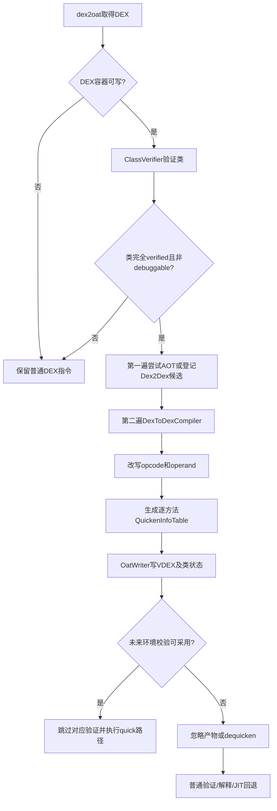
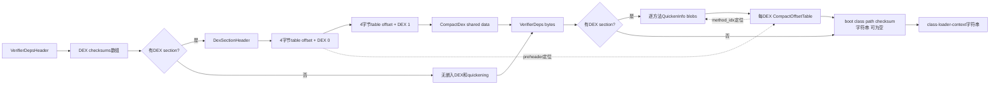
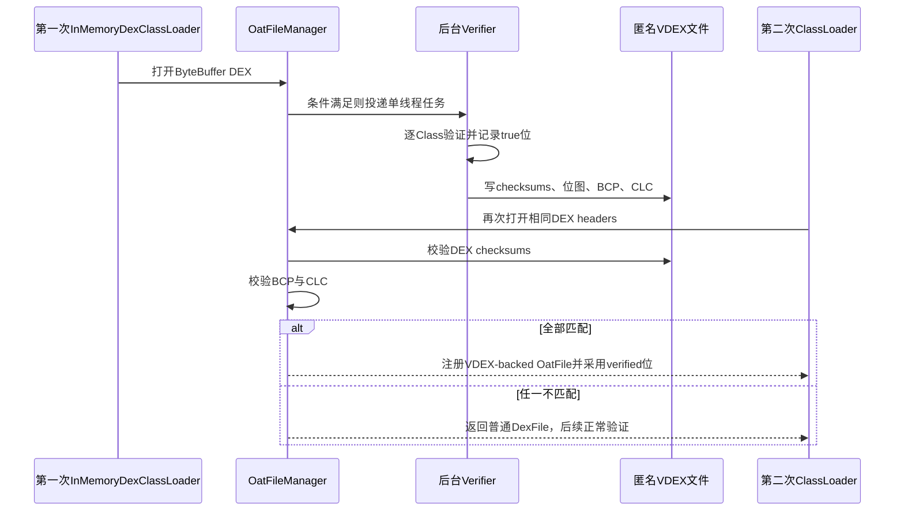

# 第568章 Android ART DEX Quickening与VDEX采用链：VerifierDeps、OAT类状态、Dequickening及运行时回退

> 源码基线：Android 11 `android-11.0.0_r48`。本章只在macOS上阅读和静态验证源码，不要求、也不会尝试编译AOSP。
>
> 本章主问题：ART为什么会把已经验证过的DEX指令改成携带字段偏移或vtable槽位的quick指令；原始符号索引被覆盖后，VDEX怎样保存恢复信息与验证依赖；装载器何时可以采用这些结果，何时必须dequicken、重新验证或退回普通DEX路径？

## 1. 先纠正“quickening就是把DEX编译成机器码”

不是。r48中的quickening由`DexToDexCompiler`完成，输入和输出仍然都是DEX指令；它把部分需要符号解析的operand替换为更接近运行时布局的数值，例如把instance field index换成对象内字段偏移，把virtual method index换成vtable槽位。AOT机器码由另一条编译链产生，二者可以同一次dex2oat任务中出现，也可以只有quickening而没有Java方法机器码。

## 2. 一句话总览

dex2oat先验证类并取得`VerifiedMethod`，再对可写的DEX副本做DEX-to-DEX quickening；`OatWriter`把变异后的DEX、逐方法原始索引表和`VerifierDeps`写进VDEX，并把类状态写进OAT；未来加载时只有DEX、boot class path和class-loader环境仍匹配，ART才采用相应结果，否则就忽略产物、重新验证，或借quickening info把opcode及operand恢复后再走安全路径。

## 3. 先建立六本账

1. DEX指令账：当前CodeItem里是普通opcode还是`*-quick`，operand现在代表符号索引、字段偏移还是vtable槽位。
2. 逆变换账：每个可恢复位置原来的field/method/type index是什么，存在哪个逐方法`QuickenInfoTable`中。
3. 验证依赖账：当时解析到的类、字段、方法、访问标志和assignability等事实是否仍成立。
4. 类状态账：某个ClassDef当时是完全verified、需运行时重试，还是根本没有可采用结论。
5. 容器账：DEX位于APK只读映射、VDEX可写副本、匿名内存DEX，还是调试器使用的private mapping。
6. 执行账：解释器、optimizing compiler、异常消息生成和调试/去优化分别怎样消费quickening结果。

只说“这个VDEX有效”仍然太粗，因为校验DEX checksum、采用verified位、使用quick operand和执行机器码是不同层次的决定。

## 4. 主要源码地图

quickening策略和变异在`art/dex2oat/dex/dex_to_dex_compiler.cc`，两遍调度在`art/dex2oat/driver/compiler_driver.cc`；逐方法逆映射格式在`art/runtime/quicken_info.h`，反变换在`dex_to_dex_decompiler.cc`；VDEX布局和读取在`vdex_file.*`，写入在`dex2oat/linker/oat_writer.cc`；采用路径在`oat_file_manager.cc`、`oat_file.cc`与`oat_file_assistant.cc`；依赖复用在`verifier/verifier_deps.*`；解释器执行和精确异常信息分别在`interpreter_switch_impl-inl.h`与`common_throws.cc`。

## 5. `quicken`编译过滤器到底开启什么

`CompilerFilter::kQuicken`开启verification、JNI compilation与quickening，却让`IsAotCompilationEnabled()`返回false。因此“过滤器叫quicken”时，普通Java方法并不会因此拥有AOT机器码；native方法仍可生成JNI stub，DEX方法则可被验证和quickened。`space`、`speed`、`everything`及其profile变体也都启用quickening，只是它们还可能编译Java方法。

## 6. quickening为什么必须晚于验证

字段是否可以换成固定offset、cast是否必然安全、构造器return是否需要发布屏障，都依赖已解析Class布局和验证器结论。更重要的是，quick opcode的operand已经不再是DEX符号索引，普通验证器无法把它当原始指令重新证明。因此r48只允许完全verified的类进入`kOptimize`级别，先证明，再覆盖operand。

## 7. 这里的优化级别只有两档

`DexToDexCompiler::CompilationLevel`在本版本只有`kDontDexToDexCompile`与`kOptimize`。它不是AOT的speed/space层级，也不是“优化强度百分比”；前者完全不改CodeItem，后者才允许本章列出的return、check-cast、instance field和virtual invoke变换。

## 8. 第一幅图：从验证到quick指令执行



## 9. 可写性是第一个硬门槛

`GetDexToDexCompilationLevel()`先检查`dex_file.GetContainer()->IsReadOnly()`。APK中未压缩DEX可能被直接只读映射，dex2oat也不一定在VDEX中复制一份；没有可写副本就直接返回`kDontDexToDexCompile`。所以“过滤器支持quicken”只是能力，绝不保证每个输入DEX都会发生字节修改。

## 10. debuggable构建为何禁用quickening

debuggable情境允许调试器改变类定义，也要求观察更接近原始DEX的行为。固定字段offset或vtable index可能被重定义后的布局推翻，去掉constructor fence或check-cast也会降低调试可见性。因此r48在`GetDebuggable()`为真时把最大DEX-to-DEX级别降为不编译，而不是先quicken再期待所有调试动作理解旧布局。

## 11. 类能否解析也是门槛

编译驱动用当前ClassLoader按descriptor找Class；找不到时清掉这一尝试留下的异常并拒绝quickening。找到的类还必须`klass->IsVerified()`。这说明quickening是依赖实际链接环境的布局特化，不是脱离ClassLoader、只看四字节指令就能完成的文本替换。

## 12. `VerifiedMethod`是方法级证据

即使类级别允许`kOptimize`，`CompileMethodDex2Dex()`仍从`VerificationResults`查当前`MethodReference`的`VerifiedMethod`。不存在就把该方法级别强制改成`kDontDexToDexCompile`。安全cast消除等判断正依赖这份方法验证结果；不能拿“同一个类的别的方法通过了”替代。

## 13. 为什么实际有两遍方法遍历

`CompilerDriver::Compile()`先用`CompileMethodQuick`遍历：可AOT编译的方法尝试生成机器码，没生成机器码且允许DEX-to-DEX的CodeItem被登记；源码同时用`DCHECK(!Runtime::Current()->UseJitCompilation())`约束这条登记路径。只有`NumCodeItemsToQuicken()`大于零，才再以`CompileMethodDex2Dex`遍历所有DEX并真正变异候选。这样同一方法不会一边写机器码、一边无必要地修改其DEX体。

## 14. “没生成AOT”不等于“编译彻底失败”

profile未命中、过滤器本来不启用AOT、编译器拒绝某方法，都可能使第一遍没有`CompiledMethod`机器码。若类和方法仍符合quickening条件，第二遍会生成一种特殊`CompiledMethod`作为quickening数据载体。它是把结果交给`OatWriter`的内部包装，不代表其中装了native code。

## 15. `RETURN_VOID_NO_BARRIER`做了什么

解释器处理普通`RETURN_VOID`时会执行`QuasiAtomic::ThreadFenceForConstructor()`后返回；`RETURN_VOID_NO_BARRIER`直接返回。DEX-to-DEX编译器对无需constructor publication fence的方法替换opcode。对实例构造器，只有`RequiresConstructorBarrier()`为false才替换；普通void方法以及合适的其他构造场景也可使用无屏障版本。

## 16. 为什么constructor fence不能随便删

构造器中对final字段等写入需要在对象被其他线程观察前满足Java内存模型的发布约束。验证通过只说明类型安全，并不自动说明fence多余。r48把“是否需要构造器屏障”作为独立属性检查，所以不要把`RETURN_VOID_NO_BARRIER`解释成“所有构造器return都更快”。

## 17. 安全`check-cast`怎样被消掉

当`driver_.IsSafeCast(unit, dex_pc)`证明cast不会失败，编译器把一个占两个code unit的`CHECK_CAST`替换为两个各占一个code unit的NOP，以保持后续指令地址不移动。quickening info顺序保存原vreg号和type index，decompiler以后才能把这两个NOP拼回一条`CHECK_CAST`。

## 18. 普通NOP为什么也占逆映射槽

反变换扫描到NOP时，必须判断它原本就是NOP，还是被消掉的check-cast一半。`NeedsIndexForInstruction()`因此把所有NOP都算作一个表项：原生NOP写入`kDexNoIndex16`哨兵；cast产生的两个NOP分别写vreg与type index。表不是“只存被优化指令”，而是存所有可能影响同步扫描的位置。

## 19. instance field quickening替换了什么

`IGET*`和`IPUT*`原来的C operand是field index，需要解析DexCache/声明类后才能找到内存布局。quickening把opcode换成对应`IGET_*_QUICK`或`IPUT_*_QUICK`，并把operand改为`MemberOffset`的16位值。解释器随后可直接按receiver加offset访问字段，同时VDEX保存被覆盖的原field index。

## 20. 字段快速路径有三道具体限制

`ComputeInstanceFieldInfo()`必须报告fast path；字段不能是volatile；offset必须能装进16位。volatile访问还有内存顺序语义，不能按普通字段处理。若任一条件不满足，源码直接保留原opcode，不会为了“尽量quick”截断offset或偷偷降低volatile语义。

## 21. 为什么这里只是instance field

r48的这个DEX-to-DEX实现枚举`IGET/IPUT`家族，没有把`sget/sput`改成同类quick opcode。静态字段还涉及声明类初始化和静态存储位置，不能把instance offset模型照搬。阅读时应以switch中明确列出的opcode为准，而非从“field quickening”四个字推断所有字段操作。

## 22. virtual invoke quickening替换了什么

`INVOKE_VIRTUAL`及range变体先解析目标方法，再读取`resolved_method->GetMethodIndex()`作为vtable index；opcode改为`INVOKE_VIRTUAL_QUICK`，B operand由DEX method index变成16位vtable槽。实际receiver的Class仍在运行时决定具体实现，只是省掉了从符号引用到槽位的那一步。

## 23. 它不是把虚调用变成静态直调

vtable index只确定“去receiver类的哪个槽取callee”，多态仍然存在。子类可在同一槽放override方法。quickening既没有把callee机器码地址焊进DEX，也没有保证调用不会进入解释器、JIT或instrumentation bridge；第566章讲的动态入口层仍然有效。

## 24. interface、static和direct调用为何不能类推

本实现没有将`invoke-interface`、`invoke-static`、`invoke-direct`改成这里的virtual quick形式。interface使用IMT/冲突解析，static涉及类初始化，direct又有不同分派语义。即便其他版本或内部opcode存在相似优化，本章对r48的结论只覆盖源码switch真正处理的virtual家族。

## 25. vtable index宽度的细节

源码以`DCHECK(IsUint<16>(vtable_idx))`检查槽位可放入现有operand。这是debug构建断言，不应写成release路径上一个可恢复的“超宽则放弃”分支；r48实现建立在可编码的布局不变量上。字段offset则使用普通条件显式拒绝超出16位的情形，两者错误处理强度不同。

## 26. `already_quickened_`不是再次覆盖

输入DEX可能已经quickened。`CompilationState`带旧`QuickenInfoTable`时，`GetIndexForInstruction()`按顺序取回原始member index，用它重新判断并生成一致的新表；对于已经变异的指令不再重复把offset当作field index覆盖。它是“消费旧映射并规范化结果”，不是二次quickening叠加。

## 27. quickening信息为什么不直接按DEX PC存

`QuickenInfoTable`先用ULEB128编码元素个数，随后每项用两个little-endian字节保存16位原索引；它没有保存dex pc。生产者和消费者都按CodeItem的指令顺序扫描，对每个quick opcode或NOP递增同一个`quicken_index`。省空间的代价是两侧必须与同一份指令布局严格同步。

## 28. 一个只有无屏障return的方法也有表

`RETURN_VOID_NO_BARRIER`不占原索引表项，因为恢复它不需要member index；但编译器即使发现零个索引，也会写出ULEB128的元素数0。这个非空的“空表”用于表明方法确实经过quickening，decompiler才能在需要时扫描并恢复return。不能用`NumIndices()==0`直接断言“该方法未改过”。

## 29. quickening `CompiledMethod`到底装在哪里

DEX-to-DEX路径构造的`CompiledMethod`没有code bytes，把quickening数据放在通常承载vmap table的区域，也没有CFI或linker patch。`OatWriter`按这种形态识别它是方法quickening info而非AOT代码。这个复用是编译管线内部传递手段，最终磁盘VDEX仍有专门quickening section。

## 30. 第一段r48真实Java：一小段代码会触发四类候选

`art/test/628-vdex/src/Main.java`刻意放了constructor return、instance field、virtual call与安全cast。下面逐字摘取核心部分；注释说明的是测试预期，不代表每次构建都无条件改写，真实结果还受本章前述门槛控制：

```java
public class Main {
  Main() {
    // Will be quickened with RETURN_VOID_NO_BARRIER.
  }

  public static void main(String[] args) {
    Main m = new Main();
    Object o = m;
    // The call and field accesses will be quickened.
    m.foo(m.a);

    // The checkcast will be quickened.
    m.foo(((Main)o).a);
  }

  int a;
  void foo(int a) {
    System.out.println("In foo");
  }
}
```

## 31. 共享CodeItem为什么棘手

畸形或特殊DEX可以让多个encoded method共享同一个CodeItem。若一个method引用环境允许把其中field改成offset，另一个method却得到不同结论，物理上只有一份字节无法同时满足两张逆映射。r48保留了加锁、比较quickening map、标记conflict并unquicken的旧处理框架。

## 32. 但r48正常路径先直接跳过共享CodeItem

`kAvoidQuickeningSharedCodeItems`在该实现中是`true`。一旦CodeItem出现在共享集合，`CompileMethod()`立即返回null，后面的冲突检测/回滚逻辑当前不可达。讲源码时必须区分“文件里保留的机制”与“这个常量下真正运行的机制”，不能把旧回滚描述成每次构建都会发生。

## 33. 重复method index又是另一件事

`CompileDexFile`遍历encoded methods时，如果相邻条目的method index与前一个相同就跳过，源码注释指向smali可以制造的重复项。这与多个method id共享一个CodeItem并非同一结构异常：一个按method index去重，一个按CodeItem指针判断共享。

## 34. quickened DEX为何不能直接重跑普通Verifier

普通`iget`的operand应索引field_ids表，quickened `iget`的相同位宽却装对象offset；普通`invoke-virtual`期待method_ids索引，quick版本装vtable index。若验证器把后者当符号索引，轻则越界，重则解析到无关成员。因此编译时把verified状态与checksum保存下来，加载时通过产物契约跳过不合适的重复验证。

## 35. 编译“逐DEX进行”时也要防重验

dex2oat在`ShouldCompileDexFilesIndividually()`为真时，把driver放进compiler callback并声明存在class unloading，以查询先前类状态。源码注释明确说这既节省时间，也防止重新验证quickened bytecode导致失败。这个保护发生在同一次构建流程内部，不等于跨任意安装版本永久信任旧状态。

## 36. 解释器怎样执行quick field

`interpreter_switch_impl-inl.h`为各`IGET_*_QUICK`和`IPUT_*_QUICK`注册handler。handler从指令读取field offset，经过空receiver检查、instrumentation/transaction等相应路径后直接访问对象字段。原field index不在正常成功执行的热路径上，但在生成精确异常和恢复DEX时仍有价值。

## 37. 解释器怎样执行quick virtual invoke

`INVOKE_VIRTUAL_QUICK` handler按operand取得vtable槽，再结合receiver实际Class找`ArtMethod`并进入统一invoke机制。这里仍会处理null、参数、线程挂起和可能的解释器/quick桥。quick只缩短方法解析与槽位查找的一部分，不绕过ART方法入口体系。

## 38. 无屏障return的运行时差异非常窄

普通return handler额外调用constructor fence后再`HandleReturn()`，no-barrier版本直接`HandleReturn()`。它没有改变返回值、异常展开或调用栈协议，也不意味着整个方法无内存屏障；方法体中的volatile、monitor和其他同步操作仍按自身语义执行。

## 39. `ArtMethod::GetQuickenedInfo()`怎样找到逐方法表

运行时从`ArtMethod`取得所属DexFile，再取DexFile关联的`OatDexFile`；没有OatDexFile就返回空。存在时以`GetDexMethodIndex()`交给`OatDexFile::GetQuickenedInfoOf()`，最终查VDEX中该DEX对应的method-offset compact table，切出恰好一个`QuickenInfoTable`。

## 40. 精确NPE为什么仍需要原符号索引

quick field/invoke执行时operand已无法直接告诉错误消息“访问的是哪个字段/方法”。`common_throws.cc`在抛null异常时调用`ArtMethod::GetIndexFromQuickening(dex_pc)`恢复原index，再解析成员生成精确消息。virtual invoke找不到映射时可退成泛化消息；quick field路径则用`CHECK_NE`要求索引存在，体现其元数据不变量更强。

## 41. `GetIndexFromQuickening()`也靠同步扫描

它遍历`DexInstructions()`，遇到quick opcode或NOP时递增表下标；抵达目标dex pc便读取当前下标。此函数没有“dex pc到索引”的哈希表。若CodeItem被另一个工具改了NOP数量或指令顺序但仍配旧表，得到的将不是温和降速，而可能是错误映射或不变量失败。

## 42. optimizing compiler也能读quickening信息

JIT/AOT的`HInstructionBuilder`遇到quickened field或invoke时，先用`CanDecodeQuickenedInfo()`判断是否具备映射，再通过`LookupQuickenedInfo()`恢复符号成员索引以构建IR。quickened DEX并不强迫后续编译器永远只接受offset；元数据把它重新连接到高层符号语义。

## 43. quickening不是可独立复制的补丁

一份quickened CodeItem必须与同方法的quickening table、产生它的Class布局和对应DEX checksum配套。只复制VDEX中的DEX字节而丢掉尾部映射，可能还能执行部分成功路径，却会破坏dequickening、编译和异常诊断。把quickened DEX视为“自解释的新DEX格式”是不安全的。

## 44. VDEX在这里承担三类载荷

带DEX section的普通VDEX可包含变异后的DEX/CompactDex数据、quickening metadata和VerifierDeps；无DEX section的匿名VDEX主要保存checksums、verified-class位图及环境字符串。VDEX与OAT也分工：VDEX保留验证/DEX相关数据，OAT保存类状态、方法编译类型和可能的机器码关联。

## 45. r48 VDEX版本字段必须精确

`VerifierDepsHeader` magic为`vdex`，verifier deps version是`021\0`。有DEX section时dex section version是`002\0`，没有DEX/quickening section时写`000\0`。版本不是Android API级别，也不能仅比较文件扩展名；解析器先用magic与两个format version判定是否理解布局。

## 46. 顶层header中有什么

版本字段后依次是DEX文件数量、VerifierDeps字节数、boot class path checksum字符串长度、class-loader-context字符串长度；header后紧跟每个DEX的location checksum数组。`GetComputedFileSize()`把这些字段、可选DEX section、quickening、deps与两个字符串全部计入，不能把尾部环境数据漏掉。

## 47. `DexSectionHeader`只有三个大小

它记录`dex_size_`、`dex_shared_data_size_`和`quickening_info_size_`。前两者允许VDEX容纳StandardDex或CompactDex自有/共享数据，第三者覆盖逐方法quickening blobs和每DEX compact offset tables。它没有逐方法目录；逐方法定位由DEX前的preheader与compact table再完成。

## 48. 为什么每个嵌入DEX前多四字节

`VdexFile::QuickeningTableOffsetType`位于该DEX起始地址之前，保存“这个DEX的method-offset table位于quickening section何处”。读取端以`reinterpret_cast<...>(source_dex_begin)[-1]`取得。它不是DEX header字段，所以用普通DEX解析工具只看`dex->Begin()`时不会把这四字节当DEX内容。

## 49. 一个方法怎样定位到自己的blob

先用DEX前preheader找到该DEX的`CompactOffsetTable`，再以`dex_method_idx`查offset。offset为0代表未quickened；非零值先减1才是quickening section中的真实byte offset，因为写入端给实际位置加1以保留零哨兵。最后按ULEB128元素数计算table精确长度。

## 50. compact table为什么按method index而非ClassDef

quickening数据属于CodeItem/方法，调用者已持有`ArtMethod::GetDexMethodIndex()`，所以method_ids维度可以直接定位。ClassDef verified位则回答类级验证结论，两张表服务不同问题。把verified class bit当成“它的每个方法blob都存在”是错误的，很多verified方法根本没有可quickening指令。

## 51. 重复quickening blob会被去重

`OatWriter`在写逐方法数据时可让多个方法offset指向同一份相同数据，避免重复存储；随后为每个DEX构建完整offset向量的compact表示。共享blob只是内容去重，不改变每个method index拥有独立查表项的逻辑，也不等于共享CodeItem已经被允许quickening。

## 52. writer的物理写入顺序不是概念顺序

构建VDEX时会预留/定位header和DEX区域，写VerifierDeps、quickening blobs、对齐后的offset tables，再回到每个DEX前写table offset，最后seek回文件头补checksum与header并flush。源码中的多个offset是绝对文件位置或相对quickening section位置，阅读时必须看构造函数传入的`start_offset_`，不能混用。

## 53. header为什么最后才能定稿

quickening blob有去重和ULEB128变长，compact offset table大小也要等全部method offset已知后才能计算；VerifierDeps序列化长度同样不是编译开始就固定。`OatWriter`先累加真实写入大小，最终用区段差值构造`DexSectionHeader`与`VerifierDepsHeader`，这才是磁盘消费者可信的边界。

## 54. 第二幅图：VDEX逻辑布局与两级索引



## 55. 图中的顺序要理解为r48访问视图

VDEX访问器根据header size、checksum count和各section size推导地址；OatWriter在生成过程中可能先seek到后段写数据再回填前段。上图表达最终逻辑布局和引用关系，而不是每次`write()`系统调用的时间线。把写入时间线等同文件地址顺序，容易误读`vdex_size_`的更新。

## 56. `VerifierDeps`保存的不是验证日志

它记录类解析、字段/方法解析、访问flags、assignability、类重定义等会影响验证结论的依赖事实，还保存每DEX的verified-class位图。它不保存每条指令的`RegisterLine`、控制流工作队列或所有失败文本；未来复用是重新检查“前提仍成立”，不是逐步重放第567章的抽象解释。

## 57. verified-class位什么时候置true

`MaybeRecordVerificationStatus()`只在`FailureKind::kNoFailure`时调用`RecordClassVerified()`；位图初始化为false。`kAccessChecksFailure`、soft、hard都不会置位。因此这里的true比“Class最后还能以某种方式运行”更严格，表示当次验证完全成功，不包含`kVerifiedNeedsAccessChecks`。

## 58. false不能反推类一定损坏

位图false也可能表示类未被处理、描述符被更早ClassLoader定义遮蔽、解析环境不全、soft failure、需访问检查，或匿名后台验证时没有找到本DEX对应Class。它只说“没有可复用的完全verified结论”，不携带一个完备失败枚举。加载器通常把它留给运行时正常验证。

## 59. 并行验证怎样写VerifierDeps

普通AOT全量验证可让工作线程各自记录thread-local deps，结束后merge到主对象，verified bits用OR合并；`force_determinism`情境会选择单线程以稳定结果。不能笼统说VerifierDeps要求所有构建永远单线程，r48明确支持每线程记录后汇总。

## 60. unresolved Class为何通常不会得到true

验证visitor找不到当前Class时仍可能完成结构检查，但会把结果强制成soft failure，因为Deps已经记录了unresolved前提，不能把“不完整环境下没撞到问题”发布为完全verified。重复descriptor解析到更早DEX时则记录class redefinition并跳过当前定义。

## 61. 第二段r48真实Java：quickened方法仍要支持栈和锁诊断

`art/test/678-quickening/src-art/Main.java`曾复现SIGQUIT在quickened同步方法上查锁时的不变量问题。以下是核心方法；它说明quickening信息还会被诊断链消费，并非只服务正常执行：

```java
public static synchronized void runTest(Object m) throws Exception {
  if (m != null) {
    // We used to crash while trying to resolve NotLoaded and beint interrupted
    // by the SIGQUIT.
    if (m instanceof NotLoaded) {
      ((NotLoaded)m).foo();
    }
  }
  SigQuit.doKill();
  // Sleep some time to get the kill while executing this method.
  Thread.sleep(2);
  System.out.println("Done");
}
```

## 62. `FastVerify()`采用的第一步是验证依赖

CompilerDriver只有拿到“来自旧VDEX、且不是仅用于输出”的VerifierDeps才尝试fast verify。它用当前ClassLoader与classpath DEX集合调用`ValidateDependencies()`；任何已记录解析/访问/assignability事实对不上就返回false，随后进入正常完整验证并重建依赖，而不是勉强采用一半。

## 63. 依赖通过后也只更新true位对应Class

对每个ClassDef，true位可更新`compiled_classes_`或加载Class并设为`kVerified`。false位不会顺手重新验证，源码解释这是为了避免损害verification time；在需要Class对象的编译情境中，它们被标成运行时再验证。fast verify的“fast”正来自只复用已证明集合。

## 64. fast verify创建的是空壳`VerifiedMethod`

若后续还要编译或quicken，CompilerDriver为true位Class的每个方法创建`VerifiedMethod`，满足编译管线接口；但没有重新跑方法数据流，因此注释明确说quickening不会获得check-cast elision。字段/virtual等只依赖可重建布局的优化仍可能进行，不能把空壳等同完整方法验证记录。

## 65. 这解释了“verified却没消掉cast”

类状态来自可信Deps复用时，安全性结论足以跳过验证，但旧VDEX没有保存每个dex pc的safe-cast集合。若为了消cast再完整验证，就失去了fast verify的主要收益。r48选择保守地留下check-cast；性能机会缺失不是验证失败。

## 66. checksum只回答“DEX内容是否对应”

`MatchesDexFileChecksums()`先核对DEX数量，再按顺序比较每个header checksum。它防止把A版本的method table套到B版本DEX，却不证明boot class path、父ClassLoader或解析优先级没变。采用验证结论还需另外的环境账，checksum不是“所有依赖的总哈希”。

## 67. boot class path checksum回答什么

VDEX保存生成时的boot class path checksum字符串；运行时重新计算并要求字符串相同。它覆盖核心类来源变化对解析/布局的影响。r48实现特别按boot image component与DEX checksum构造，注释说明VDEX不直接引用image space，因此boot image extension的处理与OAT机器码新鲜度并不完全相同。

## 68. class-loader-context回答什么

CLC编码父子ClassLoader及classpath结构，保证同一个符号仍按兼容顺序解析。`MatchesClassLoaderContext()`只在verification result明确为`kMismatch`时返回false，其他非mismatch结果可接受；不能简化成“比较两个普通字符串必须逐字相等”。日志才打印期望与当前编码帮助诊断。

## 69. OAT类状态与VDEX位图不要合并成一张表

普通dex2oat产物可在OAT的OatClass记录`ClassStatus`以及none/some/all compiled等类型，VDEX则保存Deps和quickening。匿名VDEX没有真正OAT文件时，ART会临时构造`OatFileBackedByVdex`，把true位映射成`kVerified`、false映射成`kNotReady`，且所有类都是`kOatClassNoneCompiled`。

## 70. `kOatClassNoneCompiled`不表示Class没验证

OatClass的status轴和method compilation type轴是正交的：verified类可以没有任何AOT方法；某些编译状态也不应越权替代依赖校验。匿名VDEX正是最清楚的例子——它能让Class预验证，却根本不含Java机器码。

## 71. OatFileAssistant怎样看只有VDEX的普通sidecar

对常规路径，若OAT不可用但VDEX和原DEX checksum匹配，`OatFileInfo::Status()`仍可能报告`kOatBootImageOutOfDate`，因为仅凭这个sidecar不足以判断boot image新鲜度。这不等于“任何没有OAT的VDEX都毫无用处”；匿名内存DEX有专门的VDEX-backed采用路径。

## 72. 编译时消费输入VDEX的顺序

dex2oat若有input VDEX且不需要eager unquickening，先用其VerifierDeps构造compiler callback的数据，再对目标DEX执行`input_vdex_file_->Unquicken()`。这样普通验证/重新quickening面对的是可解释的symbolic operand，同时能先利用旧依赖尝试fast verify。

## 73. 为什么这里不恢复`RETURN_VOID`

这条输入VDEX路径传`decompile_return_instruction=false`。源码解释constructor barrier优化只取决于App类本身是否有final字段，不因boot image变化；字段/method quick值却依赖外部布局，需要先恢复。于是dequickening不是全或无开关，各类变换有不同失效条件。

## 74. DexLayout会迫使更早dequicken

`DoEagerUnquickeningOfVdex()`在DexLayout可能改变ClassDef顺序、从而使VDEX元数据失效，并且当前`dm_file_ == nullptr`时返回true。必须在layout改写索引关系前恢复，不能先重排再用旧method/ClassDef索引查表；dm文件输入走其专门处理边界。这里保护的是metadata对齐，不只是opcode是否可执行。

## 75. dequickening的精确定义

`DexDecompiler`把quick field的offset换回原field index，把quick virtual的vtable槽换回method index，把成对NOP恢复成check-cast，并可选把no-barrier return恢复成普通return。它恢复的是被quickening覆盖的opcode/operand，不承诺逆转DexLayout排序、CompactDex编码、debug info变化或生成过程的其他优化。

## 76. 为什么反变换必须遍历CodeItem

return优化没有索引表项，普通NOP和cast NOP又要按当前位置消费哨兵/原值。decompiler因此逐指令switch，而不是只迭代quickening table。到末尾必须恰好消费全部索引；消费0项但仍有数据只警告潜在duplicate method，消费一部分却剩余则`LOG(FATAL)`，表明布局已严重错位。

## 77. 第三段r48真实Java：匿名VDEX是“第一次生产、第二次采用”

`art/test/692-vdex-inmem-loader/src/Main.java`先在未设置数据目录时确认不会写，再设置目录并以新ClassLoader重复加载。下面逐字摘取关键序列，`featureEnabled`还明确排除了debuggable模式：

```java
// Feature only enabled for target SDK version Q and later.
setTargetSdkVersion(/* Q */ 29);

// Feature is disabled in debuggable mode because runtime threads are not
// allowed to load classes.
boolean featureEnabled = !isDebuggable();

// Data directory not set. Background verification job should not have run
// and vdex should not have been created.
test(singleLoader(), /*hasVdex*/ false, /*backedByOat*/ false, /*invokeMethod*/ true);

// Set data directory for this process.
setProcessDataDir(DEX_LOCATION);

// Data directory is now set. Background verification job should have run,
// should have verified classes and written results to a vdex.
test(singleLoader(), /*hasVdex*/ featureEnabled, /*backedByOat*/ false, /*invokeMethod*/ true);
test(singleLoader(), /*hasVdex*/ featureEnabled, /*backedByOat*/ featureEnabled,
    /*invokeMethod*/ true);
```

## 78. private unquickening不会改磁盘文件

`VdexFile::OpenAtAddress()`初始以读写保护映射，`writable=false`时使用`MAP_PRIVATE`。若`unquicken=true`，它在private页上恢复指令、把内存view的`quickening_info_size_`设0，再mprotect回只读。写时复制保证磁盘VDEX不因这次加载被覆盖。

## 79. 为什么禁止`writable && unquicken`

`writable=true`使用`MAP_SHARED`，变更可能写回文件；源码以`CHECK(!(writable && unquicken))`明确拒绝“边共享写、边反变换”，注释直说不想把unquickened文件写回磁盘。允许写入VDEX的维护路径与只为当前进程建立安全视图的路径必须分开。

## 80. `UnquickenInPlace()`的“in place”仍要看映射类型

该函数要求当前mapping有`PROT_WRITE`，打开嵌入DEX、逐个恢复，并把当前header视图的quickening size清零。若mapping最初是private，in place只是对当前进程页；若某内部持有的映射策略不同，调用方必须保证不会违反磁盘持久化约束。函数名本身不等于“修改原文件”。

## 81. Java debuggable加载为何触发反变换

`OatFileBase::ShouldUnquickenVDex()`要求Runtime存在、Java debuggable为true、OAT header有效，并且OAT本身由非debuggable构建产生。旧产物可能含不适合调试/重定义的quick opcode，于是加载时对private VDEX view做完整unquickening；若当前OAT本来就是debuggable，按设计不该有这些quick优化。

## 82. 这是带版本保护的过渡机制

该函数在OatFile完整`Setup()`之前调用，所以先检查OatHeader版本有效，避免用错误版本解析key-value store。源码TODO称这是workaround，并注明quickening已被deprecate、计划移除。我们学习r48必须理解现有实现，但不能把它当未来Android永远稳定的格式契约。

## 83. 运行中切换debuggable怎么办

`Runtime::DeoptimizeBootImage()`先调整非debuggable编译代码入口/JIT code cache，再遍历所有已知DexFile，收集关联非debuggable OAT的VDEX集合。每份映射临时`AllowWriting(true)`，执行`UnquickenInPlace(true)`，随后恢复只读。集合去重防止同一VDEX被多个DexFile反复处理。

## 84. deopt与dequicken不是同一动作

deoptimization让线程/方法不再执行不适合调试的优化机器码，dequickening则恢复DEX opcode与symbolic operand。只做前者可能让解释器接手一份仍quickened的DEX；只做后者也不能撤销当前栈上的optimized frame。因此运行时调试切换要把两条账一起收敛。

## 85. 相同CodeItem只反变换一次

`VdexFile::UnquickenDexFile()`维护`unordered_set<const CodeItem*>`。遍历所有Class与method时，只有首次插入该CodeItem才查表和反变换，避免共享物理指令被二次恢复后把原field index再次解释成quick operand。这个保护和编译端跳过共享CodeItem相互独立。

## 86. 恢复check-cast的消费协议

看到第一个NOP，decompiler取一项：若是`kDexNoIndex16`就认定原生NOP；否则它把该值当vreg，再取下一项当type index，把当前位置两code unit重建为`CHECK_CAST`。如果旧表与NOP序列错一位，后续所有quick成员索引都会整体错位，这说明校验/配套存储不是可选优化。

## 87. 恢复return为何是可选参数

恢复字段和invoke是为了摆脱旧Class布局；return-no-barrier是否安全只依赖App类自身结构，某些重编译路径可保留。调试加载则传true，希望恢复更原始、带fence的语义。参数表达的是调用场景，不应由decompiler自行猜测“当前是否调试”。

## 88. “可逆”不等于得到APK原始DEX的逐字副本

若VDEX内DEX此前经过dexlayout、CompactDex转换、校验和/header重写等处理，dequickening只逆转本章列出的指令级变换。测试可以在受控输入上比较恢复结果，但工程诊断中应说“恢复symbolic opcode/operand”，而非承诺任意产物都能还原安装包字节。

## 89. 匿名内存DEX为什么需要另一种VDEX

`InMemoryDexClassLoader`的DEX来自ByteBuffer，没有稳定APK路径让常规dexopt产物绑定。r48根据一组DEX headers和ISA计算匿名VDEX位置，在应用数据目录缓存后台验证结果。它主要解决“相同内存DEX下次又要从头验证”的开销，不生成持久AOT机器码。

## 90. 匿名VDEX的启动条件

`RunBackgroundVerification()`要求运行时非Java debuggable、target SDK至少Q、进程未shutdown，并且能从DEX headers与process data directory解析合法匿名VDEX路径。任一条件不满足就安静返回。功能是否启用不是由`InMemoryDexClassLoader`类名单独决定。

## 91. 为什么只有一个后台worker

OatFileManager懒创建名为`Verification thread pool`、线程数1的池，并把任务排入。Class加载/验证可能持锁、解析父类且对资源敏感；这里追求后台复用收益，不是最大化并行吞吐。多个请求可排队，但不应据此想象每个DEX都开一条线程。

## 92. 后台任务怎样避免验证错Class

它用目标ClassLoader按本DEX descriptor找Class；找不到便清异常并跳过。若找到Class的`GetDexFile()`不是当前DEX，说明父加载器或classpath已有同名定义，也跳过。只有resolved且确实由当前DEX定义的Class才调用`VerifyClass()`并可能记录bit。

## 93. 错误Class不会阻断整个缓存任务

`VerifyClass()`使Class erroneous时会留下pending exception，后台任务清掉它继续其他Class。最终仅为`h_class->IsVerified()`者设置bit。匿名VDEX因此能表示“这一批里哪些类成功”，而不是因为一个坏类就把整文件写成全失败或拒绝输出。

## 94. 匿名VDEX不嵌入DEX也没有quickening

`VdexFile::WriteToDisk()`为这条路径构造`has_dex_section=false`的header，写checksums、VerifierDeps、boot checksum和CLC。dex section version为`000`，自然没有CodeItem、quickening blob或method-offset table。它是验证缓存，不能拿来执行“里面的DEX”。

## 95. 为什么匿名Deps不够完整

后台任务直接调用`RecordClassVerified()`写位图，没有像AOT全量verification callback那样收集所有解析、访问和assignability细节。`OpenDexFilesFromOat_Impl()`的注释因此要求boot class path和CLC直接匹配；若环境变化，不能靠细粒度Deps重新证明哪些结论仍安全，只能不采用。

## 96. 第一次加载发生了什么

先按正常内存DEX路径创建DexFile并运行需要的验证；若符合后台条件，任务再次/继续确保类已验证并写匿名VDEX。写文件完成并不让最初那组DexFile突然拥有一个VDEX-backed OatFile；测试把“文件存在、类由这次验证完成、当前loader未backed”作为独立观察。

## 97. 第二次等价加载怎样采用

新的ClassLoader带同一组DEX headers进入`OpenDexFilesFromOat_Impl()`，先打开匿名VDEX并核对DEX checksum。加载内存DexFile时可跳过结构DEX验证；随后创建CLC，核对boot checksum与context，构造只由VDEX支撑的OatFile，注册后让ClassLinker看到每个ClassDef的预验证状态。

## 98. 跳过结构验证不等于已经采用类验证

源码在checksum匹配后就用`verify=false`打开内存DexFile，这发生在CLC/boot checks之前；后续环境不匹配时函数仍返回这些普通DexFile，只是不创建VDEX-backed OatFile。容器结构检查与ClassVerifier结果复用是两个完成点，日志分析不能只看前者。

## 99. 采用失败为何不让ClassLoader加载失败

匿名VDEX只是缓存。打不开、checksum不符、class_loader为空、DEX加载有error、CLC创建失败或环境不匹配时，函数大多返回已经正常打开的DexFiles，让后续走常规验证。缓存失效应损失性能而非改变App正确性；真正DEX本身打不开才进入错误列表。

## 100. 为什么无需class-loader collision check

采用普通AOT机器码时，解析到不同Class可能让编译时内联/布局假设失效，所以要严查碰撞。匿名VDEX-backed OatFile没有compiled code，源码明确注明不需要collision check；但仍要CLC和boot checksum匹配，因为verified位本身依赖当时的解析环境。

## 101. dummy OatHeader为何存在

`OatFileBackedByVdex`创建一个非executable的OatFileBase，并用当前ISA features构造dummy OatHeader，只在key-value store写compiler filter=`verify`。它帮助统一ClassLinker/OatDexFile接口和调试输出，不代表磁盘上凭空生成了常规ELF/OAT机器码文件。

## 102. verified位如何变成OatClass

初始化时`ParseVerifiedClasses()`只解码各DEX的bit vector；`OatDexFile::GetOatClass()`若发现是VDEX-only，就按DEX顺序和class_def_index查位。true返回status `kVerified`，false返回`kNotReady`，两者的type都是`kOatClassNoneCompiled`，method bitmap和methods pointer均为空。

## 103. 匿名VDEX缓存如何淘汰

r48最多保留8个匿名VDEX。写新路径且文件尚不存在时，代码扫描同目录符合匿名命名的普通文件，按`stat().st_atime`从旧到新排序；若数量已达8，就从索引7开始删除，使新文件写入后总量回到上限。它是近似LRU，依赖文件系统atime语义。

## 104. 第三幅图：匿名VDEX生产、采用与失效



## 105. boot class path改变的测试意义

692测试调用`appendToBootClassLoader()`后再次加载，预期旧匿名VDEX不再立即back当前loader，并产生适配新环境的验证结果；再下一轮可采用新缓存。这证明“DEX bytes完全相同”仍不足以复用类验证，因为父环境中的类型解析结果已经可能变化。

## 106. 常见误解一：VDEX有效就一定有OAT代码

匿名VDEX可被包装成OatFile接口却始终`NoneCompiled`；`quicken`过滤器也不启用Java AOT。判断机器码必须继续看OAT method compilation type、entrypoint和文件映射，不能从“isBackedByOatFile”测试辅助名称或`.vdex`存在直接推断。

## 107. 常见误解二：quick operand越小越安全

16位offset/vtable index的意义完全取决于生成时Class布局。数值在范围内只说明可编码，不说明当前ClassLoader下仍指向正确成员。安全来自verified前提、产物checksum/环境校验和必要时的dequickening，而不是operand本身看起来合理。

## 108. 常见误解三：dequickening一定会永久清缓存

debuggable加载的典型路径使用`MAP_PRIVATE`，清的是当前内存view中的opcode和header size；磁盘VDEX仍保留quickening，供其他非debuggable进程按正常校验使用。只有明确的产物重写/新dex2oat输出才改变持久文件，不能用进程内dump反推磁盘已改。

## 109. 五个完成点要分开观察

1. 类验证完成：Class状态/FailureKind已发布。
2. quickening完成：CodeItem被改且逐方法table已生成。
3. 产物持久化完成：VDEX/OAT header、sections与checksums已flush。
4. 加载校验完成：DEX、BCP、CLC或完整VerifierDeps条件通过。
5. 运行时采用完成：OatClass状态/quick指令或恢复后的普通路径真正进入执行。

任何日志只覆盖其中一步时，都不要把它写成“ART优化全部完成”。

## 110. 排障时推荐的检查顺序

先确认Android tag与VDEX版本；再看compiler filter是否启用verification/quickening；确认DEX是否有可写VDEX副本、类是否完全verified且非debuggable；检查method是否有`VerifiedMethod`及是否真的没AOT code；随后核对DEX checksum、boot checksum与CLC；最后才检查quickening table offset、method offset、指令扫描计数和运行时是否主动unquicken。

## 111. macOS只读练习说明

下面四个练习都只使用系统常见的`bash`、`rg`、`sed`、`awk`和`find`读取源码，不写AOSP、不运行dex2oat、更不编译。默认源码根目录是`/Users/ninebot/androidSource`；每段脚本均包含存在性和关键事实断言，退出码0表示本机r48源码与本章观察一致。

## 112. 练习一：核对过滤器与四类quickening入口

```bash
#!/bin/bash
set -eu
src=/Users/ninebot/androidSource
filter="$src/art/runtime/compiler_filter.cc"
quick="$src/art/dex2oat/dex/dex_to_dex_compiler.cc"
test -f "$filter"
test -f "$quick"
rg -n 'IsAotCompilationEnabled|IsJniCompilationEnabled|IsQuickeningCompilationEnabled' "$filter" | sed -n '1,30p'
rg -n 'CompileReturnVoid|CompileCheckCast|CompileInstanceFieldAccess|CompileInvokeVirtual' "$quick" | sed -n '1,60p'
rg -q 'kAvoidQuickeningSharedCodeItems = true' "$quick"
echo 'OK: filter能力、四类变换与共享CodeItem开关均已定位'
```

先观察`kQuicken`分别落在哪个switch分支，再看四个Compile函数。练习故意断言共享CodeItem常量为true，防止读者把后面的冲突恢复代码误当r48正常活动路径。

## 113. 练习二：核对VDEX两层索引和版本

```bash
#!/bin/bash
set -eu
src=/Users/ninebot/androidSource
hdr="$src/art/runtime/vdex_file.h"
impl="$src/art/runtime/vdex_file.cc"
writer="$src/art/dex2oat/linker/oat_writer.cc"
test -f "$hdr"
rg -n 'kVerifierDepsVersion|kDexSectionVersion|kDexSectionVersionEmpty|quickening_info_size_' "$hdr" | sed -n '1,40p'
rg -n 'GetQuickeningInfoTableOffset|GetQuickenInfoOffsetTable|GetQuickenedInfoOf' "$impl" | sed -n '1,50p'
rg -n 'CompactOffsetTable::Build|Store the offset table offset as a preheader' "$writer" | sed -n '1,40p'
rg -q "'0', '2', '1'" "$hdr"
rg -q "'0', '0', '2'" "$hdr"
echo 'OK: 021/002版本与DEX-preheader到method-offset-table链已核对'
```

这里不要只数header字段；要顺着preheader、每DEX compact table、method index、非零offset减1、逐方法ULEB表走完两级定位。

## 114. 练习三：核对dequickening与调试态映射边界

```bash
#!/bin/bash
set -eu
src=/Users/ninebot/androidSource
dec="$src/art/runtime/dex_to_dex_decompiler.cc"
vdex="$src/art/runtime/vdex_file.cc"
oat="$src/art/runtime/oat_file.cc"
runtime="$src/art/runtime/runtime.cc"
rg -n 'RETURN_VOID_NO_BARRIER|IGET_QUICK|IPUT_QUICK|INVOKE_VIRTUAL_QUICK' "$dec" | sed -n '1,80p'
rg -n 'MAP_SHARED : MAP_PRIVATE|writable && unquicken|quickening_info_size_ = 0' "$vdex" | sed -n '1,50p'
rg -n 'ShouldUnquickenVDex|quickening is deprecated' "$oat" | sed -n '1,30p'
rg -n 'UnquickenInPlace' "$runtime" | sed -n '1,20p'
rg -q 'Failed to use all values in quickening info' "$dec"
echo 'OK: opcode恢复、表消费不变量与private调试视图均已定位'
```

重点回答三个问题：哪些opcode可恢复、return为何受参数控制、`MAP_PRIVATE`如何使当前进程的反变换不等于磁盘重写。

## 115. 练习四：核对匿名VDEX的生产与采用门槛

```bash
#!/bin/bash
set -eu
src=/Users/ninebot/androidSource
mgr="$src/art/runtime/oat_file_manager.cc"
oat="$src/art/runtime/oat_file.cc"
deps="$src/art/runtime/verifier/verifier_deps.cc"
testsrc="$src/art/test/692-vdex-inmem-loader/src/Main.java"
rg -n 'RunBackgroundVerification|kAnonymousVdexCacheSize|MatchesBootClassPathChecksums|MatchesClassLoaderContext' "$mgr" "$src/art/runtime/oat_file_manager.h" | sed -n '1,70p'
rg -n 'OatFileBackedByVdex|kOatClassNoneCompiled|ParseVerifiedClasses' "$oat" | sed -n '1,60p'
rg -n 'MaybeRecordVerificationStatus|kNoFailure|RecordClassVerified' "$deps" | sed -n '1,40p'
rg -n 'featureEnabled|appendToBootClassLoader|backedByOat' "$testsrc" | sed -n '1,70p'
rg -q 'kAnonymousVdexCacheSize = 8u' "$src/art/runtime/oat_file_manager.h"
echo 'OK: 匿名VDEX的第一次生产、第二次采用和环境失效路径已核对'
```

若只看到`OpenFromVdex`就停下，会漏掉最关键的checksum、BCP、CLC、无compiled code和fallback条件；请把四组输出连成一条采用链。

## 116. 推荐的源码阅读顺序

先读`compiler_filter.cc`明确能力，再读`compiler_driver.cc`的两遍调度与`GetDexToDexCompilationLevel()`；随后读`dex_to_dex_compiler.cc`和`quicken_info.h`理解变异/逆映射；再按`oat_writer.cc`→`vdex_file.*`理解磁盘；最后读`verifier_deps.cc`→`oat_file_manager.cc`→`oat_file.cc`→解释器/异常路径，观察保存的证据怎样真正被采用。

## 117. 复读后专门修正的易混点

本章初稿复读时重点拆开了六组概念：quickening不等于AOT；verified位只含`kNoFailure`；普通sidecar VDEX与匿名VDEX采用规则不同；dequickening通常修改private内存view而非磁盘；fast verify的空`VerifiedMethod`不能支持cast消除；r48共享CodeItem冲突代码存在却被常量前置跳过。以后复习先检查这六句。

## 118. 自测题

1. 为什么`kQuicken`可以生成JNI stub，却不生成普通Java AOT代码？
2. 一个`IGET_QUICK`的16位operand和其VDEX表项分别表示什么？
3. 为什么普通NOP也必须在`QuickenInfoTable`中占位？
4. false verified bit至少可能代表哪些非hard-failure情况？
5. 为什么匿名VDEX checksum匹配后，仍要检查BCP与CLC？
6. `MAP_PRIVATE`上的`UnquickenInPlace()`是否改变磁盘，为什么？
7. fast verify后为何可能保留原`check-cast`？
8. 当前r48为何不应把共享CodeItem冲突回滚说成常规活跃路径？

## 119. 最小心智模型

把quickening想成“带撤销凭证的布局特化”：验证器先证明原DEX，编译器把symbolic operand改成当前布局的捷径，VDEX同时保管原索引与成立前提；加载器核对DEX和环境，匹配才承认verified状态并走捷径，不匹配就丢弃缓存或用凭证恢复。真正的安全边界不是某个quick opcode，而是这整条配套契约。

## 120. 下一章预告

第569章将继续追`CompactDex`、DexLayout与OAT/VDEX之间的布局链：StandardDex怎样变为CompactDex、owned/shared data怎样分离，OAT ELF如何映射，`OatQuickMethodHeader`、`CodeInfo`与StackMap怎样把native PC重新连接到Dex PC、GC roots和inline frames。届时会把“文件布局优化”与本章“指令operand quickening”严格分开。
