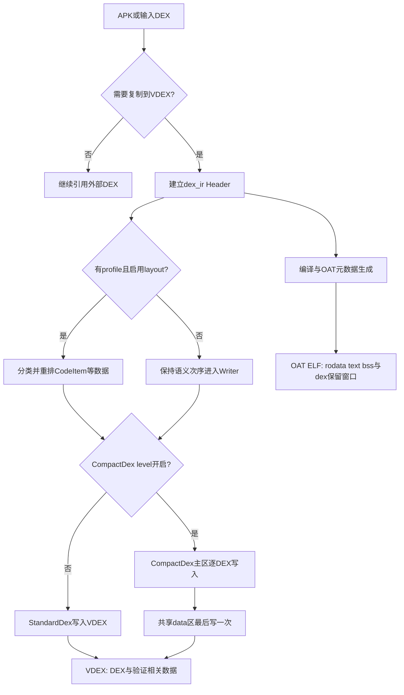
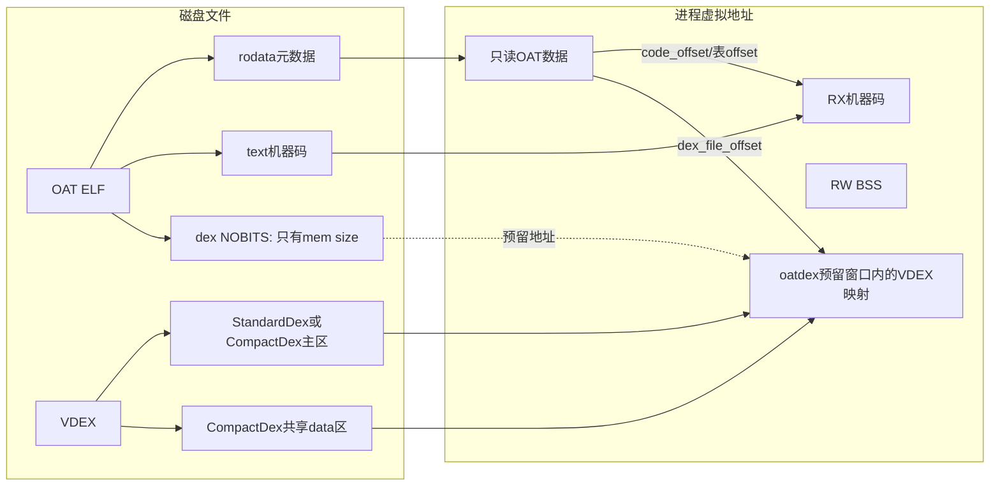
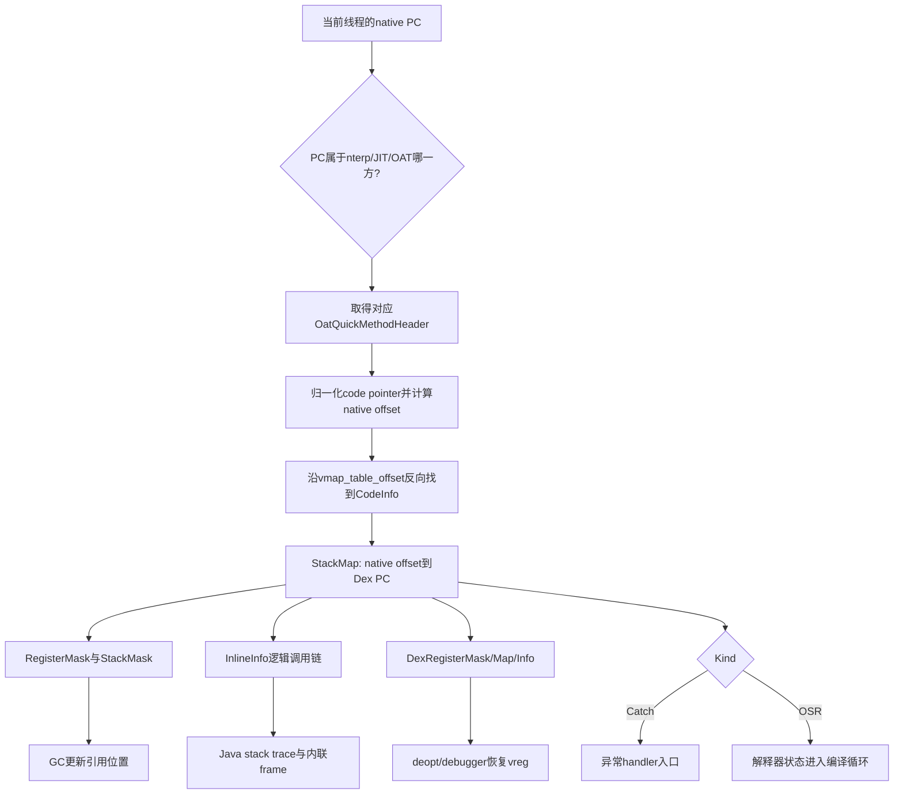

# 第569章 Android ART CompactDex与机器码定位链：DexLayout、OAT ELF、OatQuickMethodHeader、CodeInfo和StackMap

> 源码基线：Android 11 `android-11.0.0_r48`。本章只在macOS上阅读、检索和静态验证源码，不要求、也不会尝试编译AOSP。
>
> 本章主问题：CompactDex怎样在仍保留DEX语义的前提下压缩和重排数据；VDEX与OAT ELF怎样配合映射DEX、元数据和机器码；运行时拿到一个native PC后，又怎样借`OatQuickMethodHeader`、`CodeInfo`与`StackMap`找回Dex PC、GC引用和内联方法环境？

## 1. 先纠正三个最常见的误解

`CompactDex`不是APK压缩算法，也不是机器码；它仍然保存DEX指令和类型、字段、方法等数据，只是使用ART内部格式重新组织部分结构。OAT也不是“把整个DEX替换成一坨机器码”：它是一个ELF共享对象，里面既有OAT元数据，也可能有AOT代码。最后，StackMap不是Java调用栈快照，而是编译器在特定native PC处留下的紧凑恢复说明。

## 2. 一句话总览

安装或预编译时，`DexLayout`把输入DEX解析成IR，依据profile给CodeItem等数据分类和重排，并可由`CompactDexWriter`写成主区与共享数据区；DEX字节进入VDEX，OAT Writer另把类/方法索引、CodeInfo和机器码组织进ELF；运行时映射ELF和VDEX后，从`OatClass`找到方法的code offset，从代码前方取`OatQuickMethodHeader`，再沿反向偏移读`CodeInfo`，最终完成native PC与Dex PC、根集合和虚拟寄存器状态之间的连接。

## 3. 建立七本账再读源码

1. 格式账：当前是StandardDex还是CompactDex，magic、header和CodeItem编码分别是什么。
2. 布局账：一个数据项物理写在哪，profile只改变次序还是也改变格式。
3. 容器账：DEX主区、CompactDex共享data区、VDEX、OAT文件分别拥有哪些字节。
4. 虚拟地址账：ELF的文件偏移、加载地址、`.dex`保留窗口和VDEX实际映射如何对应。
5. 方法定位账：ClassDef、OatClass、method index、bitmap rank和`code_offset_`如何逐级缩小范围。
6. PC账：入口地址、指令地址、方法头、native PC offset与Dex PC分别以什么为基准。
7. 恢复账：GC root mask、DexRegisterMap、InlineInfo、catch/OSR map各解决哪一种恢复需求。

## 4. 主要源码地图

CompactDex定义在`art/libdexfile/dex/compact_dex_file.*`，生成器在`art/dexlayout/compact_dex_writer.*`；profile重排在`art/dexlayout/dexlayout.*`，双区容器在`dex_container.h`。VDEX/OAT写入主线位于`art/dex2oat/linker/oat_writer.*`，ELF构造在`elf_writer_quick.cc`和`art/libelffile/elf/elf_builder.h`。运行时映射与解析看`runtime/oat_file.*`、`elf_file.*`；方法头与PC转换看`oat_quick_method_header.*`，表格式看`stack_map.*`，编译端生产看`compiler/optimizing/stack_map_stream.*`和`code_generator.cc`。

## 5. `DexLayout`和`CompactDex`不是同一概念

`DexLayout`回答“各数据项按什么次序摆放”，可以输出StandardDex，也可以输出CompactDex；`CompactDexWriter`回答“用哪一种磁盘编码写这些IR对象”。因此“做了profile layout”不必然得到cdex，“得到cdex”也不证明真的按热度完成了profile重排。阅读日志要分别记录layout开关、profile是否可用、compact level以及最终写入是否成功。

## 6. CompactDex为什么是ART内部格式

r48的`CompactDexFile`使用`cdex` magic与版本`001`，继承`DexFile`并继续提供ClassDef、CodeItem和指令访问接口。它针对运行时映射和VDEX共享数据做取舍，不是应用开发者应打包进APK并交给任意DEX消费者的公共交换格式。普通工具只认识标准DEX时，不能因为两者都有bytecode就假设可直接互换。

## 7. compact level在r48只有两档

`CompactDexLevel`只有`kCompactDexLevelNone`与`kCompactDexLevelFast`；默认级别由构建宏`ART_DEFAULT_COMPACT_DEX_LEVEL`决定。这里的`Fast`是转换策略名，不是运行时执行速度等级，更不是compiler filter的`speed`。若有profile且调用方没显式要求compact，`OatWriter`还可能把none提升为默认compact level，因为源码认为这种转换不比普通dexlayout更昂贵。

## 8. 第一幅图：从输入DEX到VDEX/OAT两类产物



## 9. 第一道门是“DEX是否需要进入VDEX”

`OatWriter::WriteDexFiles()`会依据输入是否压缩、是否对齐以及copy-dex-files策略决定提取或复制。若最终继续直接使用APK里的未压缩对齐DEX，就没有一份VDEX内可重写的DEX副本，CompactDex转换与物理重排自然无处落地。因此命令行选择compact或layout只是请求，容器决策仍可能让某个DEX保持外部形式。

## 10. 先解析成IR，再重新写出

`DexLayout`不是在原字节数组上交换几段内存，而是用`DexIrBuilder`把header、ID表、ClassData、CodeItem、StringData等解析为`dex_ir`对象，再由Writer按新offset串行输出。好处是所有引用offset都可统一重算；代价是必须证明重写后语义等价，不能只比较文件长度或checksum。

## 11. profile何时真正参与布局

在`ProcessDexFile()`中，是否调用布局逻辑取决于是否拥有对应的`ProfileCompilationInfo`条目；没有`info_`时仍可做格式转换，却不会凭空获得冷热信息。换句话说，“cdex”描述编码，“profile-guided layout”描述排序证据。两者经常一起出现，但源码的条件分支明确允许只发生前者。

## 12. r48没有真正重排ClassDef表

`DexLayout::kChangeClassDefOrder`在本版本是`false`。实现会计算profile优先的类次序并用它影响ClassData等布局，却不提交ClassDef数组本身的重排；源码说明先前尝试会破坏“父类先于子类”的DEX约束。文档若写成“热门ClassDef被移动到表头”就是过度概括。

## 13. CodeItem怎样分成五类

`LayoutCodeItems()`将CodeItem标成`Hot`、`SometimesUsed`、`StartupOnly`、`UsedOnce`或`Unused`。profile热方法进入Hot；profile中出现的类之`<clinit>`，或hotness flags精确只有startup位的方法进入StartupOnly；其他`<clinit>`作为UsedOnce；profile中但不满足前述条件的进入SometimesUsed；剩余为Unused。分类描述的是布局用途，不等于方法最终是否被AOT编译。

## 14. 共享CodeItem怎样合并分类

多个encoded method可以引用同一个CodeItem。Writer不能把同一物理对象同时摆到两个区域，所以实现对同一CodeItem合并LayoutType，取枚举优先级更高的一方；本版本次序从Hot、SometimesUsed、StartupOnly、UsedOnce到Unused。随后使用稳定排序，让同类别内部尽量维持原有相对顺序。

## 15. StringData不要简单说成“热字符串一定在最前”

`LayoutStringData()`会找出被profile类与方法引用的字符串，再按“是否被热路径引用、是否shorty、原index”排序。r48比较器对前两个bool都使用`false < true`，所以相应false组实际排在true组之前；它绝不能被简化为“所有hot string都移到文件开头”。这里的关键收益是形成明确分区和连续offset范围，物理前后必须以当前比较器为准。

## 16. `DexLayoutSections`不是另一份DEX目录

布局完成后，`DexLayoutSections`为code和string等section记录各个LayoutType的连续offset区间。它供运行时做内存建议：加载时对StartupOnly和Hot的完整页调用`MADV_WILLNEED`；启动结束后对StartupOnly调用`MADV_DONTNEED`；trim结束后再丢SometimesUsed与UsedOnce页。范围不足一整页时不会硬凑建议。

## 17. layout数据只在合适设备路径消费

OAT中保存布局区间，不代表所有设备每次加载都会执行全部madvise。`OatDexFile`会结合low-RAM等运行条件决定是否使用这些提示；而`madvise`本身也是内核缓存建议，不是同步预读完成回执。看到`MADV_WILLNEED`后应说“请求内核倾向预取”，不能说“这段DEX已经常驻物理内存”。

## 18. 重写失败会怎样

`LayoutAndWriteDexFile()`内部调用`DexLayout::ProcessDexFile()`；若这一步因无法转换等原因返回false，Writer记录warning并复制输入DEX，所以一个VDEX中可能混有未按请求转换的DEX。但提取输入、打开DEX或最终写流失败时，外层函数仍会返回false并使写产物失败，不能把所有I/O错误也说成安全回退。诊断时应读取最终magic和header，不要只凭启动参数宣布“全部已经CompactDex化”。

## 19. 输出验证有两层而且能力不同

标准DEX输出可交给常规`DexFileVerifier`做结构验证；源码明确指出该verifier不能处理CompactDex，所以compact输出打开时关闭这一层。调试或`verify_output`路径仍可把输出重新解析成IR，与输入做忽略offset的内容比较。关闭StandardDex verifier不等于完全不检查，也不等于CompactDex已被同一套字节级规则验证。

## 20. CompactDex把文件拆成main与data两段

`DexContainer`提供main section与data section。main保存header、ID表、ClassDef等每个DEX自己的骨架；StringData、TypeList、CodeItem、DebugInfo等可进入逻辑data区。两个区的offset仍按DexFile接口解释，但它们不必在生成过程中紧邻，也不必由同一个DEX独占。

## 21. 为什么共享data区最后才写

`OatWriter`在多个DEX之间复用一个`dex_container_`：每写完一个DEX就清main区，却保留data区。所有CompactDex主区先依次写入VDEX，积累的共享data区最后只写一次。这样不同DEX的相同数据项可以复用同一份字节，而每个header通过`data_off_`找到这块共享区。

## 22. `data_off_`在最后会被回填

写每个CompactDex main时，共享data区最终文件位置尚未确定。等所有主区长度已知，`OatWriter`将每个header的`data_off_`改成“共享data绝对VDEX偏移减去本DEX起点”。所以header里的值是相对该DEX base的定位结果，不是data区在独立容器中的临时offset。

## 23. `data_size_`和“我拥有多少”不是一回事

CompactDex header既有可访问data范围，又有`owned_data_begin_`与`owned_data_end_`。共享区可能包含前一个DEX产生、当前DEX复用的数据，因而“当前DEX能访问的总data”不等于“本次新写入的data”。owned范围用于checksum和所有权等逻辑，把它误当整个data section会重复计数或越界。

## 24. data item怎样跨DEX去重

`data_item_dedupe_`跨多个DEX保留：Writer按候选字节内容和长度查重，还要求目标offset满足当前项的对齐要求；命中后把IR对象offset指向旧数据，并撤回本次新写字节。它是完全相同数据的物理复用，不是按Java语义把两个不同常量“智能合并”。

## 25. CodeItem为什么不做跨DEX去重

每个DEX写完后，`code_item_dedupe_`会清空。源码注释指出跨DEX共享CodeItem会妨碍独立class unloading，也会与quickened opcode等处理发生问题。同一个DEX内部仍可按选项去重CodeItem；“data可跨DEX复用”和“方法体不可跨DEX共用”是两个刻意不同的生命周期边界。

## 26. checksum为什么要排除可搬动地址

`CompactDexFile::CalculateChecksum()`先把临时header中的checksum、`data_off_`和`data_size_`清零，再对main及调用方传入的整个可访问data范围计算；Writer逐DEX生成时传入的是当时已经累积的data section，而不只是`owned_data_begin/end`。这样位置/长度字段本身不重复参与hash，但真实data字节仍会参与。owned范围用于标出本DEX新贡献的连续区间，不能拿它替代checksum输入。

## 27. StandardDex CodeItem头的成本

标准DEX的CodeItem在指令前有`registers_size`、`ins_size`、`outs_size`、`tries_size`、`debug_info_off`与`insns_size`，合计16字节。大量小方法都支付固定头成本，而多数计数很小。CompactDex正是利用“小值居多、极端值少”的分布，把常见字段塞进更短的编码。

## 28. CompactDex CodeItem的四字节常规头

Compact CodeItem把register差值、ins、outs、tries各放入4 bit，并把指令数低11 bit与“哪些字段溢出”的flag组合。register项保存的是`registers_size - ins_size`，解码后再把ins加回，因此常见实例方法参数不会白占更多位。这个差值编码是格式规则，不是说参数寄存器从总寄存器数中消失。

## 29. 大值放在CodeItem前面的preheader

某字段超出nibble或11 bit时，额外的16位word写在CodeItem前方，flag指明应向前取哪些值；指令数可占两个word，最多形成六个uint16 preheader word。普通路径直接读四字节，稀有大方法才走向前解码。源码注释将这种情况视为约1%的慢路径，但它仍是合法格式的一部分。

## 30. 第一段r48真实Java：引用图最终要落到机器位置

`art/test/004-ReferenceMap/src/Main.java`故意让`x`、`y`和异常路径跨越调用点。无论外层是StandardDex还是CompactDex，编译后的GC元数据都必须在`refmap(0)`附近准确说明哪些机器寄存器或栈槽仍保存引用：

```java
  Object f() {
    Object x[] = new Object[2];
    Object y = null;
    try {
      y = new Object();
      x[2] = y;  // out-of-bound exception
    } catch(Exception ex) {
      if (y == null) {
        x[1] = new Object();
      }
    } finally {
      x[1] = y;
      refmap(0);
    };
    return y;
  }
  native int refmap(int x);
```

## 31. 指令payload还有独立对齐要求

Compact CodeItem自身只要求2字节对齐，但packed/sparse switch与fill-array-data payload按DEX规则需要4字节对齐。Writer扫描指令并在必要时为整个CodeItem调整2字节padding，使payload落到正确地址。不能只检查CodeItem起点对齐就宣布其中所有子结构合法。

## 32. `debug_info_off`为什么从CodeItem中移走

多数方法不需要每个CodeItem固定支付4字节debug offset。CompactDex按method index收集debug info offset，0表示没有，再使用`CompactOffsetTable`压缩保存。方法体和调试信息仍能关联，只是关联键从“CodeItem头内字段”改成“method index查旁表”。

## 33. 相同method id的冲突是转换硬边界

`CanGenerateCompactDex()`检查同一个method_id被多处引用时是否指向一致CodeItem和DebugInfo；若同一method id给出冲突内容，method-index旁表无法表达两种答案，转换便失败并走上一节所述回退。这个检查也解释了为什么CompactDex不是对任意畸形DEX都能无损套壳。

## 34. feature flag也必须保留语义环境

转换安装期DEX时，Writer会保留DefaultMethods等feature flag，使未来验证器按产生文件时允许的DEX语义解释接口默认方法。格式压缩不能偷偷改变语言能力；header里的feature集合属于“怎样验证这份字节码”的契约，而不只是空间优化统计。

## 35. `GetDequickenedSize()`的64MB不是精确答案

r48 CompactDex实现直接返回一个估计的64MB，并留有TODO。它不能用于推导某个具体cdex反变换后的真实大小，也不能当作文件上限。源码阅读中看到常量返回值，要先判断它是协议上界、经验预估还是占位实现；这里属于预估。

## 36. CompactDex与上一章quickening的关系

CompactDex改变数据编码与布局；quickening改变部分DEX opcode的operand语义。二者可同时出现在VDEX，但互不等价：cdex可以包含未quickened指令，StandardDex也可以有quickening。一个回答“字节怎样摆”，另一个回答“某些指令是否采用已解析布局捷径”。

## 37. VDEX和OAT先做一次职责分离

r48中被复制或转换的DEX主/data字节放在VDEX；OAT保存OatHeader、OatDexFile/Class/Method元数据、CodeInfo以及可能的AOT机器码。VerifierDeps和quickening表也属于VDEX侧相关区域。看到运行时同时打开`.odex/.oat`与`.vdex`不是重复，而是把易校验/共享的字节码与可执行映像分开管理。

## 38. OAT磁盘文件本身是ELF

Quick ELF writer生成`ET_DYN`、little-endian、与目标ISA匹配ELF class/machine的文件。这样系统动态加载器或ART自己的ELF loader可按program header映射权限与虚拟地址。OAT专有header不是文件第一个结构，它位于ELF可加载的`.rodata`内容中。

## 39. 关键ELF section分别装什么

`.rodata`保存OAT header、DEX/Class/Method表、CodeInfo等只读元数据；`.text`保存可执行机器码和相邻方法头；`.bss`为运行时方法/类型/string/root缓存预留零初始化内存；`.data.bimg.rel.ro`等区域先可写以完成修复，之后趋向只读。debug section可选且不是运行时正确执行的必要输入。

## 40. OAT ELF里的`.dex`是`SHT_NOBITS`

这是本章最重要的反直觉点：`.dex` section不携带DEX文件字节，类型是`NOBITS`，只在ELF虚拟地址空间预留一段只读范围。后续把独立VDEX中的DEX区域映射到这个地址窗口。于是ELF的memory size会包含它，file size却不包含相同数量的字节。

## 41. 为什么需要这个虚拟地址窗口

OAT元数据与编译代码可以按预定相对地址引用DEX区域，同时DEX仍放在独立VDEX中便于共享、校验和更新。ELF loader先保留连续地址布局，再由`OatFile`把VDEX映射进去。若把`.dex NOBITS`误读成“空DEX”，就无法理解后面的`oatdex`动态符号和预留地址校验。

## 42. 运行时主要依赖动态符号而非section header

ART从`oatdata`、`oatexec`、`oatlastword`、可选的`oatbss*`与`oatdex*`符号计算区间。源码注释说明运行时不能依赖section header；加载映射由program header指挥，关键边界通过动态段可发现。剥离非必要section header后，产物仍应能运行。

## 43. `lastword`为什么要再加4

`oatlastword`和`oatdexlastword`指向区间最后一个32位word，而C++常用半开区间`[begin,end)`。`ComputeFields()`取得lastword地址后加4得到非包含式end。若直接把symbol值当end，最后四字节会被错误排除，范围验证也会出现假越界。

## 44. `oatexec`是边界符号而不一定有size

builder把`oatdata`放在rodata起点，把`oatexec`放在text起点，后者size可以是0；执行区真实末尾仍由`oatlastword`确定。如果没有text，lastword可退到rodata末尾。判断“是否有编译代码”不能只检查`oatexec`符号是否存在。

## 45. PT_LOAD才是mmap指令表

ELF program header描述每段文件offset、目标虚拟地址、file size、memory size及R/W/X权限。相邻且兼容的file-backed section可合并为一个segment；`.bss`与`.dex`等NOBITS区域体现为memory size超过file size。运行时故障应先看segment范围/权限，而不是只看同名section是否漂亮。

## 46. W^X边界怎样体现

rodata目标是只读，text是可读可执行，bss是读写；需要重定位或boot image修复的relro区域可能先写后收紧。方法机器码不是永久以RWX映射供随意修改。JIT code cache有另一套双映射策略，本章OAT ELF不应拿第565章JIT内存模型直接套用。

## 47. OatHeader的r48版本

本源码`OatHeader` magic为`oat\n`，版本为`183\0`。它记录checksum、instruction set/features、DEX数量、OatDexFiles offset、executable offset、trampoline offset与key-value store等。版本改变通常意味着解释这些字段或附属表的合同改变；仅magic正确仍不足以采用。

## 48. `executable_offset`为何页对齐

Writer在rodata结束后把可执行区起点提升到页边界，让加载器能给text单独设置执行权限而不把同一页上的普通数据也变为可执行。方法头虽紧邻code，却位于相应代码布局中并受同段边界约束。对齐padding是权限分区成本，不是某个Java方法的code size。

## 49. OAT rodata内部仍有多层索引

OatHeader后面还有OatDexFile记录、Class offset表、TypeLookupTable、OatClass与OatMethodOffsets、layout sections、CodeInfo等。`oatdata`只给出总基址；每层offset都必须先验证落在映射范围内，再转指针。任何一级都不是可盲信的宿主地址。

## 50. `.bss`为什么没有磁盘内容

BSS为运行时解析缓存预留空间，加载时由匿名零页提供，故ELF文件无需保存一大段零。`oatbssmethods`、`oatbssroots`等符号再划分逻辑子区。缓存项在进程内被填充不等于OAT文件被修改，重启后这些槽重新从零开始。

## 51. VDEX映射地址由谁约束

内部loader先按ELF program header为`.dex` NOBITS区保留地址；`OatFile`的PreSetup/Setup阶段再打开对应VDEX，把DEX数据映射到`oatdex`与`oatdexlastword`描述的范围。若大小、预留地址或文件布局不一致，不能把VDEX任意映射到别处后继续假设相对引用有效。

## 52. `OatFile::Open()`有两条加载器路径

它优先尝试`DlOpenOatFile`，因为native debuggability等场景需要系统动态加载器语义；失败后可退到ART内部`ElfOatFile`。内部路径可按reservation、low-4GB与executable请求精细映射PT_LOAD。两条路径最终都要建立相同的OAT字段与VDEX关联，并非一条“完整”、一条“只读一半”。

## 53. macOS源码阅读不要误执行平台分支

r48在Apple平台相关loader分支中可能直接fatal，因为Android OAT装载目标不是macOS宿主运行环境。用户已经要求不真正编译，本章练习只检索源码；我们研究的是Android目标运行时合同，不尝试在Mac上`dlopen`目标OAT，也不把host分支限制误报成Android设备行为。

## 54. 第二幅图：OAT ELF与VDEX的文件/虚拟地址关系



## 55. 打开顺序为什么不能颠倒

总体顺序是构造对象、PreLoad、装载ELF、用动态符号`ComputeFields()`、PreSetup、在预留范围装VDEX、最后Setup解析OAT记录。先有ELF地址布局，才能知道VDEX应放哪；先有VDEX内容，Setup才可为每个OatDexFile关联真实DexFile。单独成功mmap一个文件不等于整个artifact已可采用。

## 56. Setup阶段重点验证什么

它检查OatHeader magic/version、key-value store长度、DEX数量、offset对齐与范围，再逐项解析location、checksum、dex offset、class offsets、lookup table和layout section。所有来自文件的加法与指针转换都要防溢出、越界。解析成功是结构层完成点，不保证APK checksum或class-loader context仍与当前安装环境匹配。

## 57. 新鲜度判断在更外层

`OatFileAssistant`等组件负责比较DEX checksum、boot class path与class-loader context并决定产物是否up-to-date。`OatFile::Setup()`主要证明“这份OAT内部能安全解析”。因此不要看到Setup成功就说“系统一定执行其中AOT代码”；采用策略和可执行开关仍可让它只提供元数据或完全被替代。

## 58. external DEX模式及其边界

当VDEX中的某个dex offset为0时，运行时可从原APK打开未嵌入DEX；但r48拒绝同一产物把embedded与external模式随意混用。外部DEX还要满足location/checksum等匹配。这个0是“去外部找”的协议值，不是“该应用没有classes.dex”。

## 59. CompactDex的TypeLookupTable基址不同

StandardDex相关数据通常相对DexFile begin解释；CompactDex的lookup data位于分离data区时，运行时需要在cdex header的`data_off_`基础上定位。统一`DexFile`接口屏蔽了一部分差异，却不表示底层所有offset都有相同base。审查指针公式时必须确认字段定义。

## 60. 从ClassDef进入`OatClass`

每个OatDexFile持有按class_def_index定位的OatClass offset。OatClass先保存验证状态与编译类型：`kOatClassAllCompiled`、`kOatClassSomeCompiled`或`kOatClassNoneCompiled`。这里的“Class compiled”是在这份OAT里哪些方法拥有OatMethodOffsets，不是Java Class已经完成`<clinit>`。

## 61. 方法序号不是Dex method index

OatClass内部的方法序号按ClassData中的direct methods后接virtual methods枚举。它不是全DEX的method_id index，也不包含运行时额外合成的miranda方法。用错编号会在结构上仍落入某个合法数组元素，却把另一方法的code offset误配给当前ArtMethod。

## 62. `SomeCompiled`为什么需要bitmap rank

若某类只有部分方法有代码，先检查bitmap中该方法序号的bit；0直接表示无OatMethod，1则统计它之前有多少个1，把这个rank作为紧凑`OatMethodOffsets`数组下标。位号负责回答“是否存在”，rank负责回答“存在项排第几”，不能直接把原方法序号当紧凑数组下标。

## 63. r48的`OatMethodOffsets`只有一个字段

结构体实际只有一个uint32 `code_offset_`。附近旧注释可能还写过多个32位字段，那是代码演化留下的漂移，不能胜过当前结构定义和`sizeof`使用。CodeInfo不再靠这里的多个offset逐项定位，而由代码前方的`OatQuickMethodHeader`反向关联。

## 64. 有offset也可能不给运行时执行

`OatFile::OatMethod::GetQuickCode()`只在OatFile可执行，或当前没有Runtime（例如oatdump），或Runtime本身是AOT compiler时返回真实code；普通运行时打开non-executable OAT时会得到null。磁盘存在代码和当前进程允许跳入代码是两件事。

## 65. `code_offset_`以谁为基准

它是相对OAT映射`Begin()`的32位offset，不是相对`.text`起点，也不是文件offset。运行时相加后还要经`EntryPointToCodePointer()`处理ISA入口标记。做手算时应画出`oat_begin + code_offset → entry point → normalized code pointer`三步。

## 66. ARM Thumb最低位不能拿来算头地址

某些ISA用入口地址最低位表达执行模式，实际指令字节地址需先清除CodeDelta。`OatMethod::GetOatQuickMethodHeader()`使用ISA感知的入口归一化，再从code pointer减一个header。若直接从带tag入口减`sizeof(header)`，结果会错一个字节并破坏对齐。

## 67. 方法头为什么紧邻机器码

`OatQuickMethodHeader`以packed结构放在`code_` flexible array之前；`FromCodePointer()`可通过减`offsetof(code_)`定位。它只需两个32位信息：CodeInfo反向距离和带状态位的code size。运行时持有任意本方法code pointer时，无需先回到大索引表就能取得帧元数据。

## 68. CodeInfo本身通常在rodata一侧

优化编译器生成的CodeInfo/vmap数据写在可执行区之前的只读数据区域，而header的`vmap_table_offset_`表示从`code_`向后回退多少字节到该数据。名字保留了历史“vmap table”，但优化方法应使用`GetOptimizedCodeInfoPtr()`；`GetVmapTable()`反而检查方法不是optimized。

## 69. `code_size_`的最高位不是长度

r48把最高位复用为`ShouldDeoptimize`，`GetCodeSize()`必须屏蔽该位；`0xffffffff`还被当作stub写完前的哨兵并受检查。直接打印原uint32会把状态位算进长度，导致`Contains()`范围巨大，或把未完成header误当合法方法。

## 70. 怎样判断是不是optimized方法

`IsOptimized()`要求code size非0且vmap offset非0。native stub、某些非optimizing产物或无CodeInfo代码不能强行按优化表解码。`OatQuickMethodHeader`存在只说明代码有统一前缀，不说明后面一定带八张BitTable。

## 71. `Contains(pc)`的r48细节

实现先处理HWASan tag和ISA入口差异，再判断`code_start <= pc && pc <= code_start + code_size`；结束位置使用包含比较，这是本版本源码事实。通常半开区间更常见，所以阅读者尤其容易按经验改写成`< end`。本章记录事实，不从这一比较额外推导end PC必然可解码StackMap。

## 72. 机器码布局可以按profile排序

OatWriter会依据profile对编译方法布局做稳定排序，使hot代码更接近；来自同一类的方法不保证在`.text`中相邻。`OatClass`索引只保存各自offset，因此逻辑方法顺序与物理code顺序可分离。排障时从相邻地址猜声明类很不可靠。

## 73. 机器码去重会让两个方法共享地址

非debuggable输出可按code、method header相关数据、patch等内容去重，使不同方法的`code_offset_`指向同一段header/code；debuggable构建通常禁用这种普通去重，以保留一方法一地址的调试预期，但重复定义共享同一method offset等情况仍有例外。地址相同不必然说明索引损坏。

## 74. relative patcher还会插入thunk与padding

目标ISA的分支范围、调用patch与对齐可能要求在方法间插入thunk或空洞。Writer先预留并布局，再应用relative patch。因而后一方法地址不等于前一方法`code_start + code_size`，也不能只把所有Java方法长度相加预测text大小。

## 75. 从当前入口找header不能只做一次减法

`ArtMethod::GetOatQuickMethodHeader(pc)`先检查当前quick entrypoint是否为真实代码而非resolution/interpreter/instrumentation stub；可能识别nterp专用header，也可能向JIT code cache查询，最后才回到原OAT method。因为入口可被JIT、instrumentation或deopt改写，“ArtMethod入口前八字节永远是OAT头”是危险结论。

## 76. JIT与AOT使用同一类查询问题

两者都要回答给定PC属于哪个编译方法、frame多大、Dex PC是什么，但存储所有者不同：AOT元数据来自OAT映射，JIT元数据在JitCodeCache。`ArtMethod`层把来源分流后，上层StackVisitor才可用统一header/CodeInfo概念继续。先确认owner，再解析offset。

## 77. CodeInfo的六个开头字段

r48以interleaved varint编码flags、按`kStackAlignment`压缩的frame size、core spill mask、FP spill mask、方法DEX寄存器数以及bit-table flags。它们不是固定六个uint32。解码器先逐个读varint，再根据bit-table flags决定后续哪些表真正存在。

## 78. frame alignment与vreg stack slot单位不同

frame size按架构的`kStackAlignment`压缩；DexRegisterLocation中的栈offset按4字节`kFrameSlotSize`编码。前者描述整帧对齐，后者描述逻辑vreg所在槽位。把二者当同一单位会在64位平台尤其容易算错。

## 79. 后面最多有八张BitTable

依次包括StackMap、RegisterMask、StackMask、InlineInfo、MethodInfo、DexRegisterMask、DexRegisterMapInfo与DexRegisterInfo目录。空表通过bit-table flags省略；OAT级Deduper还可让一份CodeInfo复用此前相同BitTable，并以相对bit offset指回。表存在、表非空和表被去重是三个状态。

## 80. StackMap每行的八列

一行含Kind、压缩native PC、Dex PC、register mask index、stack mask index、inline info index、dex register mask index和dex register map index。后五项多为指向其他BitTable的索引或no-value，避免每个safepoint重复完整集合。StackMap是目录行，不是把所有恢复数据都内嵌在一行。

## 81. 四种Kind各自服务什么

`Default`用于普通safepoint/调用/deopt点，`Catch`标记异常处理入口，`OSR`描述从解释器循环状态进入编译代码的位置，`Debug`为native debugging增加精细PC信息。Default内部使用特殊无值编码，而Catch/OSR/Debug有明确枚举值；不要把数值大小当优先级。

## 82. native PC为什么可以压缩

编译器只记录满足目标ISA指令对齐的offset，序列化时除以instruction alignment，读取时再乘回。表中存的是相对方法code start的offset，不是进程绝对PC。给定绝对PC应先归一化ISA入口并减code start，再去查表。

## 83. StackMap并不覆盖每一条机器指令

GC、去优化和异常恢复只需要在允许暂停、调用runtime、显式deopt、catch/OSR等位置拥有精确环境。任意采样PC可能落在两张map之间；调用“精确native offset查表”失败不代表CodeInfo损坏。调用者需根据返回地址/暂停合同选正确PC，不能随便向下取整。

## 84. 普通map和catch map的排序边界

`StackMapStream`要求非Catch项按native PC递增；一旦开始追加Catch，后面仍应是Catch，但catch项自身按Dex PC使用且不要求native PC全局排序。运行时native-PC查询只在前一分区查Default或OSR；catch查询从尾部按Dex PC扫描。把整张表统一二分会查错分区。

## 85. native PC转Dex PC的主路径

`OatQuickMethodHeader::ToDexPc()`对native方法返回无Dex PC，对nterp使用专用函数；optimized方法计算native offset，调用只解码所需InlineInfo的CodeInfo，再找对应Default/OSR StackMap并取Dex PC。允许失败时返回`kDexNoIndex`，不允许失败则触发诊断终止。

## 86. Dex PC转native PC要区分普通与catch

`ToNativeQuickPc()`对catch请求调用`GetCatchStackMapForDexPc()`，普通请求调用`GetStackMapForDexPc()`；找到行后把native offset加到code entry。找不到时可返回`UINTPTR_MAX`或按参数终止。相同Dex PC可能有不同用途的map，调用者必须提前说清是否在找异常处理入口。

## 87. GC只需要解码两张mask账

RegisterMask表示此暂停点哪些核心机器寄存器装着对象引用，StackMask表示frame的哪些栈槽装着引用。`DecodeGcMasksOnly()`可跳过InlineInfo与DexRegisterMap等无关表，降低GC遍历成本。它追的是“移动对象后必须更新的机器位置”，不是所有Java局部变量。

## 88. DexRegisterMap解决的是另一类问题

去优化、调试器和部分异常/OSR路径需要把逻辑vreg恢复为值，故记录每个vreg当前在core/FPU寄存器、栈槽、常量还是不可用。一个int局部变量不属于GC root，却仍可能需要DexRegisterMap；一个reference同时可能出现在vreg位置账和GC mask账。两张表不能相互替代。

## 89. wide值为什么会占两个Dex寄存器项

DEX的long/double跨两个32位vreg。编译后它可能在一对寄存器、double stack slot或64位单寄存器中，编码通过`kInRegisterHigh`、`kInFpuRegisterHigh`或相邻stack entry表达高半部。恢复时必须结合kind和相邻vreg，不能把高32位当另一个独立Java变量。

## 90. 第二段r48真实Java：vreg值跨普通/native调用

`art/test/454-get-vreg/src/Main.java`让多种窄/宽参数与局部值跨越Java和JNI调用，用来检查运行时从编译frame取vreg的能力。核心方法如下：

```java
  int testSimpleVReg(int a, float f, short s, boolean z, byte b, char c) {
    int e = doCall();
    int g = doNativeCall();
    return e + g;
  }

  long testPairVReg(long a, long b, long c, double e) {
    long f = doCall();
    long g = doNativeCall();
    return f + g;
  }

  native int doNativeCall();

  int doCall() {
    return 42;
  }
```

## 91. 为什么DexRegisterMap采用增量编码

相邻safepoint的大部分vreg位置不变，若每行重复完整数组会很大。每张StackMap只用DexRegisterMask指出发生变化的vreg，再让DexRegisterMapInfo指向变化项，具体kind/value复用DexRegisterInfo目录。读取某vreg时可向前寻找最近一次定义。

## 92. 向前寻找被限制为最多32张map

`kMaxDexRegisterMapSearchDistance`为32。Encoder发现某vreg自上次明确记录后距离超过32，即使位置未变也会强制重写；Decoder因此可以有界回扫。这个常量限制的是解码搜索距离，不是一个方法最多32个safepoint，也不是最多32个vreg。

## 93. 编译器记录的是寄存器分配后的现实

`CodeGenerator::EmitVRegInfo()`读取`HEnvironment`和`Location`：常量直接编码，stack slot记录offset，core/FPU register记录编号；若slow path已把caller-save压栈，则改记保存后的stack位置。它不是Java LocalVariableTable，也不是按源码变量名生成，而是暂停点真实机器状态。

## 94. 为什么不是每个StackMap都有vreg信息

`NeedsVregInfo()`只在deopt、debuggable、monitor操作、OSR或可抛入catch等场景要求完整环境；纯GC safepoint可能只有root masks。这样普通调用点无需为所有非引用局部变量付出空间。读取者必须先检查map是否有DexRegisterMap，不能把“无表”解释成“所有vreg值都是0”。

## 95. 内联方法怎样进入一张物理frame

优化器内联callee后，机器栈只有外层方法的一帧，但异常栈、调试与deopt仍需看到逻辑调用链。`InlineInfo`逐层保存内联Dex PC、方法身份和累计DEX寄存器数；同一StackMap的vreg序列先放外层环境，再按父到子顺序追加内联环境。

## 96. `MethodInfo`为什么另做一张表

内联方法的dex method index若直接重复放进InlineInfo，会降低整行去重效果，所以正常可表达情形先在MethodInfo去重，再由InlineInfo引用其index。某些无法安全相对外层DEX表达的方法可改存实际`ArtMethod*`的高/低部分；这是专门编码分支，不应笼统说所有AOT InlineInfo都固化进程指针。

## 97. 累计vreg数怎样切分各层环境

每个InlineInfo行保存“到这一层为止总共有多少DexRegisters”。当前层起点是前一层累计值，终点是本层值；外层方法的数量来自CodeInfo header。这样所有层可以共享一条紧凑位置流，解码器仍能准确切出每个逻辑frame的vreg区间。

## 98. `RecordPcInfo()`怎样汇合编译现场

`CodeGenerator`从当前instruction取得native code position、Dex PC、register mask与stack mask，判断Default/OSR/Debug kind，再从`HEnvironment`最外层得到outer Dex PC。随后递归先发父environment、再发内联层，将真实Location写入`StackMapStream`。这一步发生在代码生成阶段，而不是运行时扫描机器指令猜回来的。

## 99. slow path为何要修正register mask

若调用只发生在slow path，caller-save寄存器中的引用可能已被压入frame，callee会覆盖原寄存器。`RecordPcInfo()`从register mask移除这些已spill的caller-save位，而`EmitVRegInfo()`把对应值记到保存后的stack offset。否则GC会更新已失效寄存器副本，却漏掉真正活着的栈副本。

## 100. deoptimization怎样消费这些表

当守卫失效、调试或instrumentation要求回到解释执行时，运行时先从header取得frame info和CodeInfo，按StackMap找到当前Dex PC与内联链，再用DexRegisterMap把常量、寄存器和栈槽值写入一个或多个ShadowFrame。完成点不是“找到Dex PC”，而是所有逻辑frame与pending result/exception语义都已可由解释器继续。

## 101. stack trace为什么也离不开InlineInfo

若只按物理quick frame输出，一个被内联的方法会从Java堆栈消失。运行时用native PC定位StackMap，读取InlineInfo，把一个物理frame展开成外层方法加多层内联方法，并为各层选择对应Dex PC。是否有完整vreg map不影响基本方法名展开，所以trace解码可只取InlineInfo子集。

## 102. 第三段r48真实Java：OSR必须保住跨跳转局部值

`art/test/570-checker-osr-locals/src/Main.java`先让多个类型的局部值保持live，再调用会进入OSR代码的方法；返回后逐项检查caller值没有被破坏。这里摘取`runTests()`的关键部分：

```java
  public static boolean runTests(boolean warmup) {
    if (warmup) {
      return isInInterpreter("runTests");
    }

    // Several local variables which live across calls below,
    // thus they are likely to be saved in callee save registers.
    int i = $noinline$magicValue();
    long l = $noinline$magicValue();
    float f = $noinline$magicValue();
    double d = $noinline$magicValue();

    // The calls below will OSR.  We pass the expected value in
    // argument, which should be saved in callee save register.
    if ($noinline$returnInt(53) != 53) {
      throw new Error("Unexpected return value");
    }
    if ($noinline$returnFloat(42.2f) != 42.2f) {
      throw new Error("Unexpected return value");
    }
    if ($noinline$returnDouble(Double.longBitsToDouble(0xF000000000001111L)) !=
        Double.longBitsToDouble(0xF000000000001111L)) {
      throw new Error("Unexpected return value ");
    }
    if ($noinline$returnLong(0xFFFF000000001111L) != 0xFFFF000000001111L) {
      throw new Error("Unexpected return value");
    }

    // Check that the register used in callee did not clober our value.
    if (i != $noinline$magicValue()) {
      throw new Error("Corrupted int local variable in caller");
    }
    if (l != $noinline$magicValue()) {
      throw new Error("Corrupted long local variable in caller");
    }
    if (f != $noinline$magicValue()) {
      throw new Error("Corrupted float local variable in caller");
    }
    if (d != $noinline$magicValue()) {
      throw new Error("Corrupted double local variable in caller");
    }
    return true;
  }
```

## 103. OSR map与普通入口map的差别

OSR从解释器的循环中间直接进入编译方法内部，需要一张Kind=OSR的map说明目标native PC以及怎样把当前DEX环境铺入编译frame；它不是把ArtMethod普通quick入口改到循环中间。编译器还倾向让OSR现场使用易搬运的stack位置并处理callee-save，使直接跳转后的机器状态满足代码生成假设。

## 104. 第三幅图：从native PC找回Java语义



## 105. Catch StackMap为何放在末尾

编译器在主代码生成后遍历catch block，按handler Dex PC和其native地址追加Kind=Catch项；catch phi被要求落在stack slot，逐vreg写入恢复位置。将catch集中在尾部，让普通按native PC排序的区域保持可快速查询，同时异常投递可从尾部按Dex PC找到handler现场。

## 106. Debug StackMap为何不能混进普通查询结果

native-debuggable构建可能为基本块或额外位置生成Kind=Debug map，甚至为避免与前一指令同PC而插入NOP。普通执行路径的native-PC查询明确只接受Default/OSR，不把Debug行当GC/deopt语义替代品。Debug map提高源码调试位置密度，但不改变正常safepoint合同。

## 107. 哪些完成点必须分开

至少区分：CompactDex成功写出、VDEX共享data回填完成、OAT ELF链接完成、ELF/VDEX映射完成、OatFile Setup解析完成、artifact新鲜度/CLC采用完成、某方法获得可执行入口、某native PC命中StackMap、GC或deopt真正消费恢复数据。前一层成功只能为后一层提供候选，不能替代后一层回执。

## 108. 文件损坏会在哪些层暴露

cdex magic/header/owned range错误可在DexFile打开或checksum阶段发现；共享data offset错误可能在OatWriter重开校验或运行时范围检查发现；ELF segment/symbol错误在loader或ComputeFields暴露；OatClass bitmap/offset与CodeInfo varint/BitTable损坏则在Setup、方法查询或解码检查暴露。错误离真正访问点越晚，诊断越需要保留完整文件与地址证据。

## 109. 调试section不是运行时真相来源

ELF可带`.debug_info`、`.debug_line`、符号表等帮助native debugger，但ART自身的GC、deopt、Dex PC转换依赖OAT header、方法头与CodeInfo。strip debug section通常不应让Java执行失效；反过来，DWARF能显示函数名也不证明StackMap完整可用于移动GC。

## 110. 用oatdump类工具时要问清观察层

工具可能在没有Runtime时允许`OatMethod::GetQuickCode()`返回地址，也可读取non-executable OAT用于展示。这与应用进程实际允许执行代码不同。输出中同时看到Dex instructions、disassembly、OatClass status和stack maps时，应逐项注明来自VDEX、OAT rodata还是text，避免把工具聚合视图误当单一物理section。

## 111. macOS只读练习说明

下面四个练习只使用`rg`、`sed`、`test`和shell算术读取本地r48源码，不生成构建产物。目标不是背文件名，而是亲手验证四条链：cdex双区与回退、profile布局与madvise、OAT ELF地址窗口、CodeInfo/StackMap生产消费。每个脚本最后只有在关键锚点存在时才打印`OK`。

## 112. 练习一：核对CompactDex编码、双区与失败回退

```bash
#!/bin/bash
set -eu
src=/Users/ninebot/androidSource
cdex="$src/art/libdexfile/dex/compact_dex_file.h"
writer="$src/art/dexlayout/compact_dex_writer.cc"
oat="$src/art/dex2oat/linker/oat_writer.cc"
rg -n "kDexMagic|kDexVersion|GetDequickenedSize|owned_data_begin_" "$cdex" | sed -n '1,60p'
rg -n "CanGenerateCompactDex|preheader|debug_info_offsets_|data_item_dedupe_" "$writer" | sed -n '1,80p'
rg -n "Shared data section|data_off_|LayoutAndWriteDexFile" "$oat" | sed -n '1,80p'
rg -q "return 64 \* MB" "$cdex"
rg -q "CanGenerateCompactDex" "$writer"
rg -q "header.data_off_ = vdex_dex_shared_data_offset_" "$oat"
echo 'OK: CompactDex常规头、共享data回填与回退锚点已核对'
```

先回答：64MB是否真实大小；main/data如何共享；同method id内容冲突为何不能由method-index debug旁表表达。

## 113. 练习二：核对DexLayout分类与运行时madvise

```bash
#!/bin/bash
set -eu
src=/Users/ninebot/androidSource
layout="$src/art/dexlayout/dexlayout.cc"
header="$src/art/dexlayout/dexlayout.h"
advice="$src/art/libdexfile/dex/dex_file_layout.cc"
rg -n "LayoutStringData|LayoutCodeItems|kLayoutTypeHot|kLayoutTypeStartupOnly" "$layout" | sed -n '1,100p'
rg -n "kChangeClassDefOrder" "$header"
rg -n "MADV_WILLNEED|MADV_DONTNEED|FinishedLaunch|FinishedTrim" "$advice" | sed -n '1,80p'
rg -q "kChangeClassDefOrder = false" "$header"
rg -q "LayoutType::kLayoutTypeUsedOnce" "$layout"
rg -q "LayoutType::kLayoutTypeSometimesUsed" "$advice"
echo 'OK: 五类布局、ClassDef禁重排与三阶段madvise已核对'
```

阅读输出时不要把`WILLNEED`当同步加载完成，也不要从ClassData重排推导ClassDef表已重排。

## 114. 练习三：核对OAT ELF动态符号与`.dex NOBITS`

```bash
#!/bin/bash
set -eu
src=/Users/ninebot/androidSource
elf="$src/art/libelffile/elf/elf_builder.h"
oat="$src/art/runtime/oat_file.cc"
rg -n "\.rodata|\.text|\.bss|\.dex|SHT_NOBITS" "$elf" | sed -n '1,100p'
rg -n "oatdata|oatexec|oatlastword|oatdex|oatdexlastword" "$elf" | sed -n '1,100p'
rg -n "ComputeFields|oatlastword|oatdexlastword" "$oat" | sed -n '1,100p'
rg -q '\.dex.*SHT_NOBITS' "$elf"
rg -q 'oatdexlastword' "$elf"
rg -q 'ComputeFields' "$oat"
echo 'OK: OAT动态符号、lastword半开区间与VDEX预留窗口已核对'
```

把section、segment、dynamic symbol三层分别画出来；尤其说明为什么`.dex`有memory size却不在OAT文件中重复存DEX字节。

## 115. 练习四：核对方法头、StackMap列与vreg有界回扫

```bash
#!/bin/bash
set -eu
src=/Users/ninebot/androidSource
method="$src/art/runtime/oat_quick_method_header.h"
maps="$src/art/runtime/stack_map.h"
stream="$src/art/compiler/optimizing/stack_map_stream.cc"
codegen="$src/art/compiler/optimizing/code_generator.cc"
rg -n "vmap_table_offset_|code_size_|FromCodePointer|ToDexPc|ToNativeQuickPc" "$method" | sed -n '1,120p'
rg -n "kMaxDexRegisterMapSearchDistance|BIT_TABLE_HEADER|BIT_TABLE_COLUMN|GetCatchStackMapForDexPc" "$maps" | sed -n '1,140p'
rg -n "distance > kMaxDexRegisterMapSearchDistance|BeginInlineInfoEntry" "$stream" | sed -n '1,80p'
rg -n "NeedsVregInfo|RecordPcInfo|RecordCatchBlockInfo|EmitVRegInfo" "$codegen" | sed -n '1,100p'
rg -q "kMaxDexRegisterMapSearchDistance = 32" "$maps"
rg -q "StackMap::Kind::Catch" "$codegen"
echo 'OK: header反向定位、八列StackMap与32张map有界回扫已核对'
```

尝试用一句话分别解释root mask、DexRegisterMap、InlineInfo与Catch map；如果四句能互换，说明四本恢复账还没分开。

## 116. 推荐的源码阅读顺序

先读`compact_dex_file.h`建立格式，再按`dex_container.h`→`compact_dex_writer.cc`→`dexlayout.cc`→`oat_writer.cc`理解生成；随后读`elf_builder.h`→`elf_writer_quick.cc`→`oat_file.cc`理解文件和虚拟地址；最后从`oat.h`/`oat_file.inl`的OatClass查找进入`oat_quick_method_header.*`、`stack_map.*`、`stack_map_stream.*`与`code_generator.cc`，把消费端和生产端对照阅读。

## 117. 复读后专门修正的易混点

本章复读时重点修正了十处：cdex不是机器码；layout与格式转换不是一个开关；r48不重排ClassDef；StringData不武断概括为“热项全在前”；StandardDex verifier不支持cdex但仍有IR比较；共享data可跨DEX而CodeItem dedupe会清账；`.dex`是NOBITS窗口；section header不是运行时主要定位依据；`OatMethodOffsets`实际只有一个字段；StackMap不覆盖每条native指令。阅读时先用这十句自查。

## 118. 自测题

1. 有profile、compact level和copy-dex-files三个条件时，哪一个分别控制冷热证据、编码格式和是否有可重写副本？
2. 为什么`owned_data_begin/end`不能替代`data_off/data_size`？
3. Compact CodeItem的register nibble实际保存什么，溢出值放在哪里？
4. OAT ELF的`.dex`为什么是NOBITS，DEX真实字节在哪里？
5. `SomeCompiled`怎样从方法序号得到紧凑OatMethodOffsets下标？
6. 为什么带Thumb标记的entrypoint不能直接减header大小？
7. GC root mask与DexRegisterMap的消费者和信息范围各是什么？
8. Catch/Debug map为什么不能混入普通native-PC查找？
9. 32限制的是vreg、safepoint总数还是增量位置回扫距离？
10. Setup成功与实际执行AOT代码之间还隔着哪些门？

## 119. 最小心智模型

把整条链想成“两次压缩、两次还原”：第一次把标准DEX对象压成CompactDex主区加共享data，运行时借header offset还原DexFile视图；第二次把每个暂停点的Java语义压成方法头加若干BitTable，运行时借native PC还原Dex PC、引用位置和逻辑frame。OAT ELF提供稳定虚拟地址骨架，VDEX提供DEX字节，二者必须共同通过结构与环境校验。

## 120. 下一章预告

第570章将追ART Boot Image与App Image：`ImageHeader`如何描述对象区、bitmap、roots和OAT位置，`ImageSpace`怎样保留/映射地址，boot class path多组件怎样拼接，跨进程共享与ASLR怎样共存，以及加载时哪些对象指针、ArtMethod入口和native root必须重定位或修复。
