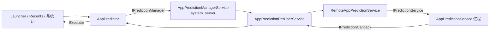
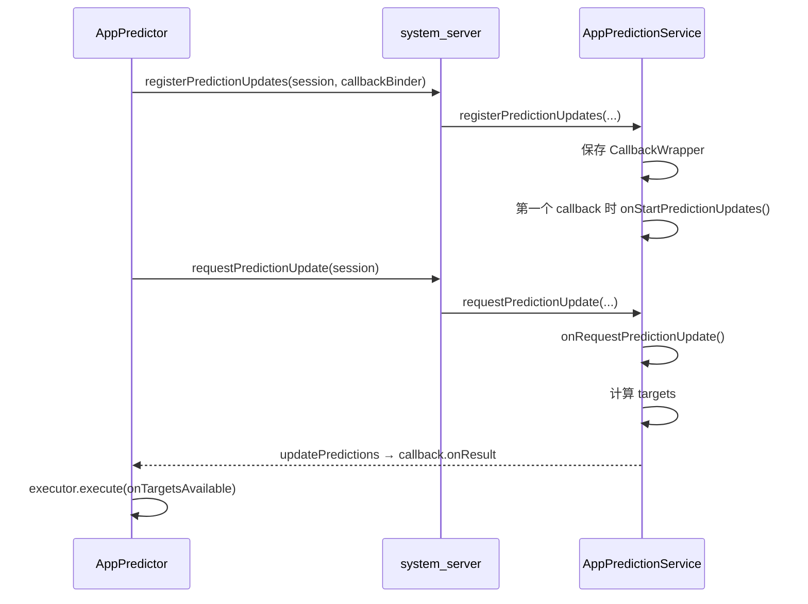
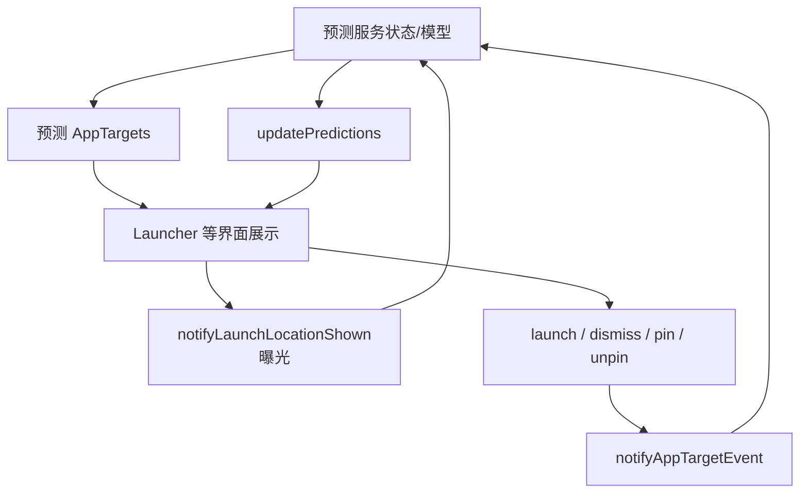
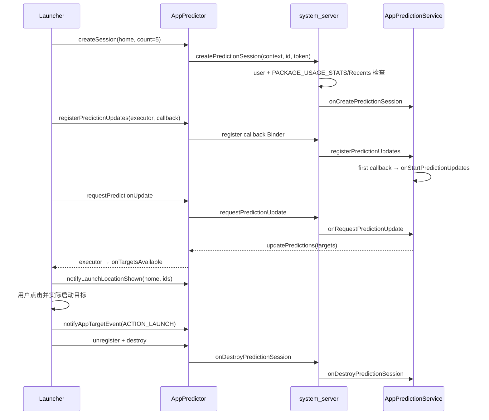

# 57 AppPredictionManagerService、AppPredictionService 与应用预测

> 源码版本：Android 11 / API 30 / `android-11.0.0_r48`  
> 学习方式：macOS 只读源码，不要求编译。  
> 本章目标：理解 Launcher、Recents 或其他系统级界面如何建立预测会话，取得应用/快捷方式预测，要求服务对候选项排序，并通过启动、忽略、固定等事件形成反馈闭环。

---

## 1. 从 Launcher 场景理解应用预测

用户打开桌面抽屉时，顶部可能展示几项“你现在可能想打开的应用”。预测结果可能受以下信息影响：

- 当前是桌面、分享面板还是其他 UI surface；
- 时间、地点和近期使用模式；
- 用户最近启动、忽略、固定或取消固定的目标；
- 当前允许展示的应用和快捷方式；
- 期望展示多少个目标。

Framework 不规定模型必须怎么计算，而是定义一个受控协议：

```text
调用方描述预测场景
→ 创建 session
→ 注册结果回调
→ 请求/接收预测列表
→ UI 展示结果
→ 上报展示位置与用户行为
→ 服务更新内部状态
→ 主动或按请求返回新预测
→ session 销毁
```

一句话理解：**App Prediction Framework 管理的是“场景化预测会话和反馈协议”，不是 Framework 自己写死一套应用推荐算法。**

---

## 2. 四条数据流必须先分开

| 数据流 | 方向 | API | 含义 |
|---|---|---|---|
| 连续预测 | 服务 → 调用方 | `registerPredictionUpdates()` / `updatePredictions()` | 服务产生一组推荐目标 |
| 主动刷新 | 调用方 → 服务 | `requestPredictionUpdate()` | 请求服务现在推送一组新结果 |
| 候选排序 | 调用方 → 服务 → 调用方 | `sortTargets()` | 对调用方给定的候选列表重排 |
| 行为反馈 | 调用方 → 服务 | `notifyAppTargetEvent()` / `notifyLaunchLocationShown()` | 告知展示曝光和用户动作 |

特别注意：

- “预测”由服务选择目标；
- “排序”只能对调用方传入的候选重新排列；
- “请求更新”不直接返回值，结果仍通过已注册 callback；
- “上报事件”是输入反馈，不保证立刻产生新列表。

---

## 3. 整体架构



职责：

- `AppPredictor`：客户端 session、回调包装、关闭状态；
- master service：权限与跨用户检查；
- per-user service：远端选择、session/callback 记录、死亡恢复；
- remote service：服务绑定、请求排队和超时基础设施；
- `AppPredictionService`：真正实现预测、排序和反馈处理。

---

## 4. 核心源码地图

### 客户端与数据对象

```text
frameworks/base/core/java/android/app/prediction/AppPredictionManager.java
frameworks/base/core/java/android/app/prediction/AppPredictor.java
frameworks/base/core/java/android/app/prediction/AppPredictionContext.java
frameworks/base/core/java/android/app/prediction/AppPredictionSessionId.java
frameworks/base/core/java/android/app/prediction/AppTarget.java
frameworks/base/core/java/android/app/prediction/AppTargetId.java
frameworks/base/core/java/android/app/prediction/AppTargetEvent.java
frameworks/base/core/java/android/app/prediction/IPredictionManager.aidl
frameworks/base/core/java/android/app/prediction/IPredictionCallback.aidl
```

### system_server

```text
frameworks/base/services/appprediction/java/com/android/server/appprediction/
    AppPredictionManagerService.java
    AppPredictionPerUserService.java
    RemoteAppPredictionService.java
```

### 远端服务

```text
frameworks/base/core/java/android/service/appprediction/AppPredictionService.java
frameworks/base/core/java/android/service/appprediction/IPredictionService.aidl
```

### 相关但不要直接混为一体

```text
frameworks/base/core/java/com/android/internal/app/
    AppPredictionServiceResolverComparator.java
```

Resolver/Chooser 可以使用预测服务为分享目标排序，但它是具体消费者和适配逻辑，不等于整个 App Prediction Framework。

---

## 5. AppPredictionContext 描述什么

创建 session 前，调用方构建 `AppPredictionContext`：

```java
AppPredictionContext context = new AppPredictionContext.Builder(uiContext)
        .setUiSurface("home")
        .setPredictedTargetCount(5)
        .setExtras(extras)
        .build();
```

核心字段：

| 字段 | 含义 |
|---|---|
| `packageName` | 哪个调用方创建了预测场景 |
| `uiSurface` | 预测结果将展示在哪种界面 |
| `predictedTargetCount` | 期望目标数量提示 |
| `extras` | surface/实现约定的附加信息 |

`predictedTargetCount` 是 hint，不应理解为安全边界或必然返回数量。服务可能因为候选不足、策略过滤或无可用数据返回更少目标。

`uiSurface` 也不是用于绘制 UI 的 View id，而是服务理解场景和选择预测路径的逻辑字符串。

---

## 6. AppTarget 是什么

`AppTarget` 表示一个可启动目标。它可能是：

- 某个包/Activity；
- 某个 `ShortcutInfo`，例如对话快捷方式；
- 属于特定 `UserHandle` 的跨 profile 目标。

核心字段：

```text
AppTargetId id
packageName
className（可空）
UserHandle user
ShortcutInfo（可空）
rank
```

### 6.1 id、组件和 shortcut 的区别

- `AppTargetId`：预测协议内稳定识别目标的逻辑 id；
- package/class：应用组件身份；
- `ShortcutInfo`：更细粒度的动态/固定快捷方式；
- user：目标属于哪个 Android 用户或 profile。

同一个包可以产生多个 target，例如主 Activity、不同 conversation shortcuts。不能只用 packageName 去重所有目标。

### 6.2 rank 的方向

源码明确：rank 是非负整数，**数值越小，重要性越高**。

```text
rank 0 → 优先级最高
rank 1 → 次高
rank 2 → 再次
```

不要把 rank 当成“分数越大越好”。模型内部可用浮点分数，但输出对象的 rank 语义是顺序位置。

---

## 7. AppTargetEvent 是反馈，不是启动命令

Android 11 定义四种 action：

```text
ACTION_LAUNCH
ACTION_DISMISS
ACTION_PIN
ACTION_UNPIN
```

事件携带：

```text
AppTarget target
launchLocation
action
```

例如用户点击桌面顶部预测项后：

1. Launcher 自己通过正常 Intent/LauncherApps 路径启动目标；
2. 再用 `ACTION_LAUNCH` 告知预测服务发生了什么。

`notifyAppTargetEvent()` 不会替 Launcher 启动应用。它是行为反馈接口。

`launchLocation` 用于说明事件发生在哪里，例如 hotseat、home、overview 或 share location。它是服务和调用方约定的语义标签，并不是物理坐标。

---

## 8. AppTargetEvent 与 LaunchLocationShown 的差异

```text
notifyAppTargetEvent(target, action, location)
    回答：用户对某个目标做了什么？

notifyLaunchLocationShown(location, targetIds)
    回答：这一批目标曾在某个位置展示给用户吗？
```

只有点击数据而没有曝光数据会产生选择偏差：目标没被点击，可能是用户不喜欢，也可能根本没展示。`notifyLaunchLocationShown()` 提供曝光语境，让服务区分这两种情况。

但 Framework 只是传输协议，并不保证具体服务一定用这些事件在线训练模型。

---

## 9. 创建 AppPredictor 时发生什么

`AppPredictionManager.createAppPredictionSession(context)` 返回 `AppPredictor`。构造器做三件关键事：

```java
mPredictionManager = IPredictionManager.Stub.asInterface(
        ServiceManager.getService(Context.APP_PREDICTION_SERVICE));
mSessionId = new AppPredictionSessionId(
        packageName + ":" + UUID.randomUUID(), userId);
mPredictionManager.createPredictionSession(predictionContext, mSessionId, mToken);
```

其中：

- session id 包含调用包前缀、随机 UUID 与 user id；
- `mToken = new Binder()` 是客户端存活 token；
- session id 负责标识协议会话；
- token 用于 Binder death，客户端进程死亡时系统可回收会话。

二者不是重复字段。

---

## 10. 谁可以调用预测服务

`AppPredictionManagerService.runForUserLocked()` 是安全入口。它先通过 `ActivityManagerInternal.handleIncomingUser()` 解析并验证目标 user，然后要求调用方至少满足一种条件：

```text
持有 PACKAGE_USAGE_STATS
OR 当前 user 使用临时测试服务
OR 调用 UID 是 Recents
```

否则抛出 `SecurityException`。

为什么限制严格？预测目标和反馈可能暴露用户应用使用习惯、近期交互和 profile 信息。如果普通 App 可以自由建立系统级预测 session，就可能把接口当作使用历史侧信道。

因此它是 `@SystemApi` / 系统基础设施，不是面向普通三方 App 的通用推荐 SDK。

---

## 11. 跨用户检查与 Binder 身份

`AppPredictionSessionId` 自带 user id，但客户端传入一个数字不代表系统会相信它。

```java
int userId = am.handleIncomingUser(
        Binder.getCallingPid(), Binder.getCallingUid(),
        sessionId.getUserId(), ...);
```

权限检查完成后，master service 清除 calling identity，在系统身份下进入 per-user service；finally 中恢复身份。

```text
真实 Binder UID → 权限与 user 检查
→ clearCallingIdentity
→ system_server 内部服务访问/绑定
→ restoreCallingIdentity
```

顺序不能倒置。若先 clear identity 再检查，看到的就可能是 system_server 自己的身份。

---

## 12. per-user session 记录

`AppPredictionPerUserService` 用 map 保存 `AppPredictionSessionInfo`。每条记录包含：

```text
AppPredictionSessionId
AppPredictionContext
usesPeopleService
client Binder token
token DeathRecipient
RemoteCallbackList<IPredictionCallback>
```

创建流程：

```text
resolveService(... onCreatePredictionSession ...)
→ 远端服务存在且 map 中没有同 id
→ 创建 AppPredictionSessionInfo
→ token.linkToDeath()
→ 成功后放入 mSessionInfos
→ 若客户端已经死亡，立即 destroy
```

这里先通知远端、再保存本地 record 的顺序意味着源码阅读要关注失败和重复 session 的细节，不能只看 happy path。

---

## 13. 服务选择：默认 AppPredictionService 与 People Service

Android 11 的 per-user 层在创建 session 时读取 DeviceConfig：

```java
boolean usesPeopleService = DeviceConfig.getBoolean(
        NAMESPACE_SYSTEMUI,
        PREDICT_USING_PEOPLE_SERVICE_PREFIX + context.getUiSurface(),
        false);
```

也就是说，不同 `uiSurface` 可以选择不同后端路径。例如某类对话/分享预测可能由 People Service 提供，而其他 surface 走配置的远端 AppPredictionService。

关键理解：

- 选择结果在 session 创建时保存进 `mUsesPeopleService`；
- 后续事件、排序、注册、刷新、销毁必须沿同一路径；
- DeviceConfig 后来改变，不应让同一 session 中途随机切换后端；
- People Service 是 Android 11 的特定实现路径，不是 `AppPredictionService` API 的永恒唯一架构。

---

## 14. RemoteAppPredictionService 做什么

它继承 Android system_server 的 remote-service 基础设施，负责：

- 按 per-user 组件绑定 `AppPredictionService`；
- 把 Framework 请求转换为 `IPredictionService` 调用；
- 在未连接时排队请求；
- 处理超时、连接死亡和重新连接；
- 通知 per-user service 恢复已有 session。

它不执行预测模型。类似前几章的 `RemoteFillService`、`RemoteContentCaptureService`，名字里的 Remote 表示远端 Binder 代理和生命周期包装。

---

## 15. 服务声明与线程入口

预测服务以规定 action 和绑定权限声明。概念结构：

```xml
<service
    android:name=".MyPredictionService"
    android:permission="android.permission.BIND_APP_PREDICTION_SERVICE"
    android:exported="true">
    <intent-filter>
        <action android:name="android.service.appprediction.AppPredictionService" />
    </intent-filter>
</service>
```

`AppPredictionService.onBind()` 只接受 `SERVICE_INTERFACE`，否则返回 null。

其 AIDL Stub 收到 Binder 调用后，不直接在 Binder 线程执行应用覆写的方法，而是向主线程 Handler 投递消息。公开回调标注 `@MainThread`：

```text
Binder thread
→ mHandler message
→ service main thread
→ onAppTargetEvent / onSortAppTargets / onRequestPredictionUpdate ...
```

服务实现不应在这些主线程回调里进行长时间数据库或模型计算，应把耗时任务转到后台，再安全回传结果。

---

## 16. 连续预测：注册与主动更新

客户端调用：

```java
predictor.registerPredictionUpdates(executor, callback);
predictor.requestPredictionUpdate();
```

服务侧流程：



### 16.1 request 不直接携带返回 callback

`requestPredictionUpdate()` 只告诉现有 session 需要刷新。服务通过已注册的 callbacks 推送结果。因此如果没有注册 callback，服务端 `doRequestPredictionUpdate()` 会直接忽略这个优化性请求。

正确顺序：

```text
register callback
→ request update
→ callback 收结果
```

而不是先 request，再等待一个方法返回值。

---

## 17. AppPredictor 如何切换回调用方 Executor

客户端为每个公开 callback 创建 `CallbackWrapper`。远端结果从 Binder 到达时，wrapper 并不直接在 Binder 线程调用 UI：

```text
IPredictionCallback.onResult(ParceledListSlice)
→ 清除 Binder calling identity
→ callbackExecutor.execute(...)
→ Callback.onTargetsAvailable(List<AppTarget>)
→ 恢复 calling identity
```

这样调用方可以明确指定主线程 Executor 或后台 Executor。

为什么清除 Binder identity？避免回调代码意外继承远端 Binder 调用身份，造成权限判断混乱。回调应该以本地应用自己的执行语境运行。

---

## 18. 服务端 callback 生命周期

`AppPredictionService` 为每个 session 保存 `ArrayList<CallbackWrapper>`：

- 注册第一个 callback 时调用 `onStartPredictionUpdates()`；
- 重复 Binder callback 不重复加入；
- callback Binder death 时自动移除；
- 最后一个 callback 移除时调用 `onStopPredictionUpdates()`；
- session destroy 时删除 callback 列表。

这允许服务按是否有人监听决定是否持续计算。

不过 Android 11 这里的 `onStartPredictionUpdates()` / `onStopPredictionUpdates()` 没有 session 参数，是服务级启停提示；服务若并行管理多个 session，必须结合内部 session/callback 状态谨慎设计，不能简单认为一次 stop 就代表所有 session 都无人监听。

---

## 19. updatePredictions 如何广播结果

服务实现计算完成后调用：

```java
updatePredictions(sessionId, targets);
```

Framework 找到该 session 的 callback wrappers，依次调用 `IPredictionCallback.onResult(new ParceledListSlice(targets))`。

注意：

- 它是推送，不是 `onRequestPredictionUpdate()` 的 Java 返回值；
- 服务可响应 request 后调用，也可以预测变化时主动调用；
- session 不存在时没有 callback 可接收；
- 一个 session 可有多个 callbacks；
- 结果列表的顺序和 rank 应保持一致语义；
- 回调失败不会让其他 callback 必然失败。

---

## 20. sortTargets 是另一种请求-响应

调用方已经拥有候选列表，只想让服务排序时调用：

```java
predictor.sortTargets(candidates, executor, sorted -> { ... });
```

完整链路：

```text
AppPredictor.sortTargets(list, one-shot callback)
→ IPredictionManager.sortAppTargets()
→ AppPredictionPerUserService.sortAppTargetsLocked()
→ IPredictionService.sortAppTargets()
→ AppPredictionService.onSortAppTargets(list, CancellationSignal, Consumer)
→ service 调用 consumer.accept(sortedList)
→ IPredictionCallback.onResult()
→ client executor
```

### 与连续预测的关键差异

| 连续预测 | 排序 |
|---|---|
| 服务决定返回哪些目标 | 调用方给定候选集合 |
| callback 需要注册并持续存在 | 本次请求带 one-shot callback |
| `requestPredictionUpdate()` 触发 | `sortTargets()` 直接触发 |
| 可由服务主动更新 | 通常只返回本次排序结果 |

服务不应借排序接口凭空加入调用方未给的目标，否则破坏候选边界和调用方过滤结果。

---

## 21. CancellationSignal 的边界

`AppPredictionService.onSortAppTargets()` 收到 `CancellationSignal`，表示排序可能是耗时异步工作，应支持取消。

但要注意版本实现细节：客户端 `AppPredictor.sortTargets()` 本身在 Android 11 API 中没有返回一个让调用方直接操作的 CancellationSignal。Framework/remote-service 仍可因超时、断连等管理请求取消。

所以文档中不能简单写成“调用方随时调用 cancel”。要沿本版本实际 API 看取消信号由哪层创建、何时触发。

---

## 22. 反馈闭环



Framework 只保证事件被路由，不规定：

- 是否立即更新模型；
- 是否持久化；
- 使用何种机器学习算法；
- 多久衰减历史；
- 是否在设备本地训练。

这些属于具体服务实现与产品隐私策略。阅读 Framework 时应把“协议能力”与“模型行为”分开。

---

## 23. session token 与 callback Binder 的两层死亡管理

### 客户端 token 死亡

每个 `AppPredictor` 创建 `mToken = new Binder()`。per-user service 对它 `linkToDeath()`。调用进程死亡后：

```text
token DeathRecipient
→ onDestroyPredictionSessionLocked(sessionId)
→ 通知远端服务 destroy
→ 删除 session info
→ kill callbacks
```

### 单个 callback 死亡

`RemoteCallbackList` 和服务侧 `CallbackWrapper` 都会监听 callback Binder。某个 UI 订阅者死亡时可以只清理该 callback，不必立即误杀整个仍有其他订阅者的 session。

```text
token：拥有整个 session 的客户端生命线
callback Binder：某个结果订阅者的生命线
```

---

## 24. 客户端 destroy 为什么必须显式调用

`AppPredictor.destroy()`：

```java
if (!mIsClosed.getAndSet(true)) {
    mCloseGuard.close();
    mPredictionManager.onDestroyPredictionSession(mSessionId);
    mRegisteredCallbacks.clear();
} else {
    throw new IllegalStateException(...);
}
```

销毁后任何业务方法都会抛 `IllegalStateException`，重复 destroy 也会抛异常。

虽然 `finalize()` 和 Binder death 提供兜底，但不能依赖 GC：

- GC 时间不可预测；
- system_server 仍保留 session record；
- 远端服务可能继续计算；
- callback 和 Binder 资源不能及时释放。

推荐将 predictor 生命周期绑定到拥有它的 UI/系统组件，并显式 unregister、destroy。

---

## 25. 远端服务死亡与 session 恢复

远端 AppPredictionService 进程可能因崩溃、更新或系统回收断开。per-user service 保留 `AppPredictionSessionInfo`，重新连接后可调用 `resurrectSessionLocked()`：

```text
重新 onCreatePredictionSession(context, sessionId)
→ 遍历 RemoteCallbackList
→ 重新 registerPredictionUpdates(sessionId, callback)
```

这就是为什么 session info 必须保存 prediction context、usesPeopleService 和 callbacks。

但恢复不代表模型内存状态自动保留。远端服务收到同一逻辑 session 的重建，应能从持久状态或上下文恢复；短暂期间的尚未处理事件可能丢失，调用方也不能把预测列表当强一致数据。

---

## 26. 多用户与工作资料

`AppTarget` 自带 `UserHandle`，session id 也带 user id。这是两个不同维度：

- session user：谁的预测服务和使用历史被访问；
- target user：某个推荐目标属于哪个用户/profile。

Launcher 展示工作资料目标时仍要遵循 profile 是否开启、包可见性、跨 profile 启动和策略限制。预测服务返回一个 `UserHandle` 不会绕过 `LauncherApps`、Intent 或 DevicePolicy 的执行检查。

预测只是候选/顺序，真正启动仍进入正常组件与跨用户安全链。

---

## 27. PACKAGE_USAGE_STATS 为什么与预测相关

准确预测常依赖应用使用历史，而使用历史本身是敏感数据。master service 将调用权限限制到：

- 获得 usage stats 权限的受信任组件；
- 系统 Recents；
- 测试用临时服务场景。

但“有调用 API 的权限”不等于“可以把所有预测数据无限期外传”。具体服务仍应遵守最小化、用户隔离、保留期限和设备政策。

---

## 28. 预测结果不等于启动许可

服务返回：

```text
packageName + className + user
或 ShortcutInfo
```

调用方展示/启动前仍需：

- 验证目标仍已安装且对当前用户可用；
- 检查 Activity 是否 enabled/exported；
- 检查 Shortcut 是否仍有效；
- 应用包可见性与 profile 状态；
- 设备策略和用户限制；
- 处理应用卸载/更新后的迟到结果。

预测服务不是 PackageManager 的替代品，AppTarget 也不是一个保证永远可启动的 capability token。

---

## 29. 排序结果的正确性检查

对 `sortTargets()` 结果，调用方最好检查：

```text
结果是否只包含输入候选？
是否出现重复 id？
是否遗漏不允许遗漏的目标？
目标 user/package/shortcut 是否被篡改？
结果是否属于最新请求？
```

特别是快速输入分享目标搜索词或候选集合变化时，旧排序结果可能晚到。客户端 wrapper 负责线程切换，不自动知道 UI 的“请求世代”。调用方仍需用 request generation 或候选快照拒绝过期结果。

---

## 30. 线程与并发模型

### AppPredictor 客户端

- 公开方法可通过 Binder 进入 system_server；
- `AtomicBoolean mIsClosed` 防止关闭后继续调用；
- `ArrayMap` 管理 callback → wrapper，对并发调用应遵守 API 使用约束；
- 结果在指定 Executor 上交付。

### system_server

- Binder Stub 做 user/权限检查；
- master lock 保护 per-user service 与 session map；
- 清除调用身份后路由远端服务；
- remote-service 基础设施管理连接和异步请求。

### AppPredictionService

- Binder 调用投递到主线程 Handler；
- session callback 列表主要在主线程维护；
- 模型/数据库计算应移到工作线程；
- 完成后调用 `updatePredictions()` 或排序 Consumer 返回。

服务异步计算时要为 session destroy、callback death 和新请求覆盖旧请求做好检查。

---

## 31. 常见误解纠正

### 误解 1：AppPredictionService 负责启动预测到的 App

错误。它返回目标/排序并接收反馈；Launcher 自己按正常组件安全链启动。

### 误解 2：requestPredictionUpdate 会同步返回列表

错误。它没有返回值；结果通过先前注册的 callback 到达。没有 callback 时服务端会跳过请求。

### 误解 3：sortTargets 和预测是同一个方法

错误。排序限定在输入候选；连续预测由服务产生目标集合。

### 误解 4：rank 越大越优先

错误。本对象中数值越小越重要。

### 误解 5：AppTargetId 就是 packageName

错误。一个包可有多个 Activity/Shortcut 目标，逻辑 id 必须区分它们。

### 误解 6：普通 App 都能读取系统预测

错误。入口要求 usage stats 权限、Recents 身份或临时测试场景，并执行跨用户检查。

### 误解 7：notifyAppTargetEvent 会触发启动

错误。它只是把已发生的 launch/dismiss/pin/unpin 告知服务。

### 误解 8：只上报点击就能准确判断推荐质量

不充分。还需要 location shown 曝光，区分“展示但未点”和“根本未展示”。

### 误解 9：服务死亡后 session 必须由客户端全部重建

不一定。per-user service 会保存 session context/callback 并尝试 resurrect，但业务状态可能仍需重新加载。

### 误解 10：返回跨 profile target 就能直接启动

错误。实际启动仍受 profile、LauncherApps、包状态和设备策略约束。

### 误解 11：callback Executor 解决了所有竞态

错误。它只决定回调运行线程，不判断结果是否属于最新 UI 请求。

### 误解 12：Framework 规定了模型算法

错误。Framework 定义会话、数据对象、安全路由和反馈协议，具体算法由后端服务实现。

---

## 32. 一次 Launcher 预测的完整时序



这条链上“收到预测”“显示预测”“用户点击”“真正启动”“上报反馈”是五个不同完成点。

---

## 33. 只读源码练习

### 练习 1：追创建 session

按顺序阅读：

```text
AppPredictionManager.createAppPredictionSession()
AppPredictor 构造器
AppPredictionManagerService.createPredictionSession()
AppPredictionPerUserService.onCreatePredictionSessionLocked()
AppPredictionService.doCreatePredictionSession()
```

记录 session id、token、context 各在哪里创建和保存。

### 练习 2：验证调用权限

阅读 `runForUserLocked()`，解释：

- `handleIncomingUser()` 解决什么问题；
- 三种允许调用者条件；
- 为什么 permission check 在 `clearCallingIdentity()` 之前；
- finally 为什么必须恢复 identity。

### 练习 3：对比数据对象

为以下对象各写一句定义：

```text
AppPredictionContext
AppPredictionSessionId
AppTargetId
AppTarget
AppTargetEvent
```

然后解释 target id、package、shortcut、user 和 rank 的关系。

### 练习 4：追连续预测

从客户端 `registerPredictionUpdates()` 追到服务 `mSessionCallbacks`，再从 `updatePredictions()` 反向追到客户端 Executor。标出两次 Binder 边界。

### 练习 5：解释无 callback 的刷新

阅读 `AppPredictionService.doRequestPredictionUpdate()`，回答为什么 callbacks 为空时不调用 `onRequestPredictionUpdate()`，并说明正确调用顺序。

### 练习 6：对比预测与排序

分别追踪 `requestPredictionUpdate()` 和 `sortTargets()`。比较候选来源、callback 生命周期、返回方式与 CancellationSignal。

### 练习 7：追两种死亡

阅读 `AppPredictionSessionInfo.linkToDeath()`、`RemoteCallbackList.onCallbackDied()` 和服务侧 `CallbackWrapper.binderDied()`，区分 token death 与 callback death 的清理范围。

### 练习 8：追服务重连

阅读 `resurrectSessionLocked()`，解释为什么需要保存 context、usesPeopleService 和 callbacks，以及远端服务恢复后按什么顺序重建。

---

## 34. 分层排错路线

### 症状 A：创建 AppPredictor 抛 SecurityException

检查：

1. 调用方是否为 Recents；
2. 是否持有并获准 `PACKAGE_USAGE_STATS`；
3. session user 是否允许访问；
4. 是否误把 SystemApi 当普通应用 API；
5. 测试环境是否真的设置临时服务。

### 症状 B：注册后始终没有预测结果

检查：

- session 是否成功记录；
- uiSurface 是否选择了预期后端；
- 远端服务组件是否解析并绑定；
- callback 是否先注册；
- 是否调用 `requestPredictionUpdate()`；
- 服务是否执行 `onRequestPredictionUpdate()`；
- 服务最终是否调用 `updatePredictions(sessionId, list)`；
- session id 是否一致；
- callback Binder 是否已经死亡；
- Executor 是否执行任务。

### 症状 C：sortTargets 没有回调

检查 session 是否存在、远端服务是否支持排序、one-shot callback 是否保存到请求完成、CancellationSignal 是否已取消、服务是否调用 Consumer、请求是否超时。

### 症状 D：结果顺序偶尔回跳

检查多个刷新/排序是否并发、旧请求是否晚到、候选集合是否已变化、客户端是否缺少 generation 校验、服务返回 rank 与列表顺序是否矛盾。

### 症状 E：服务重启后不再更新

检查 remote-service 重连、session info 是否仍存在、token 是否活着、`resurrectSessionLocked()` 是否重建 session、callbacks 是否重新注册、服务内部模型状态是否重新加载。

### 症状 F：目标展示了却无法启动

这通常已经不在预测计算层。检查目标 user/profile、包/Activity/Shortcut 当前状态、LauncherApps/Intent 解析、DevicePolicy 和迟到预测缓存。

---

## 35. 本章自检问题

1. 连续预测、主动刷新、候选排序、行为反馈分别是什么？
2. `AppPredictionContext.uiSurface` 和 predicted count 有什么作用？
3. `AppTargetId`、package、ShortcutInfo、UserHandle 为什么都需要？
4. rank 的数值方向是什么？
5. session id 与 Binder token 的职责有什么不同？
6. 哪些调用者能通过 master service 权限检查？
7. 为什么权限检查必须早于 clearCallingIdentity？
8. `requestPredictionUpdate()` 为什么需要先注册 callback？
9. `sortTargets()` 与 `updatePredictions()` 的候选来源有何不同？
10. callback Executor 解决什么问题，又不解决什么竞态？
11. token death 与 callback death 分别清理什么？
12. 服务重连时如何恢复 session 和 subscriptions？
13. 为什么 `notifyAppTargetEvent(ACTION_LAUNCH)` 不会真正启动应用？
14. 为什么曝光事件对反馈闭环很重要？

---

## 36. 最终主链

```text
Launcher/Recents 构造 AppPredictionContext(uiSurface, count, extras)
→ AppPredictionManager 创建 AppPredictor
→ AppPredictor 生成 package:UUID sessionId + client Binder token
→ IPredictionManager.createPredictionSession
→ AppPredictionManagerService 校验 incoming user
→ 校验 PACKAGE_USAGE_STATS / Recents / temporary service
→ clearCallingIdentity 后进入对应 AppPredictionPerUserService
→ 按 uiSurface DeviceConfig 决定 People Service 或 AppPredictionService 路径
→ RemoteAppPredictionService 解析、绑定并调用远端服务
→ AppPredictionService 在主线程创建 session callback 容器
→ system_server 保存 AppPredictionSessionInfo 并 link token death
→ 客户端 registerPredictionUpdates(callback Binder)
→ system_server RemoteCallbackList 保存 callback
→ 远端服务保存 CallbackWrapper，第一个订阅触发 start updates
→ 客户端 requestPredictionUpdate
→ 服务后台计算 AppTargets
→ updatePredictions(sessionId, ordered targets)
→ IPredictionCallback 返回客户端
→ AppPredictor 在指定 Executor 调用 onTargetsAvailable
→ UI 验证目标状态并展示
→ notifyLaunchLocationShown 上报曝光
→ 用户实际通过 LauncherApps/Intent 启动或 dismiss/pin/unpin
→ notifyAppTargetEvent 上报反馈
→ 服务可据此更新状态并再次推送
→ 客户端 unregister callback + destroy
→ system_server 清理 session/token/callback
→ 远端服务 onDestroyPredictionSession
```

掌握这条链后，你会看到 App Prediction 的核心并不是一个“返回最常用 App 的函数”，而是一套按用户授权、按 UI 场景隔离、支持连续订阅与一次性排序、带曝光和动作反馈、能处理 Binder 死亡与远端恢复的系统级会话协议。
