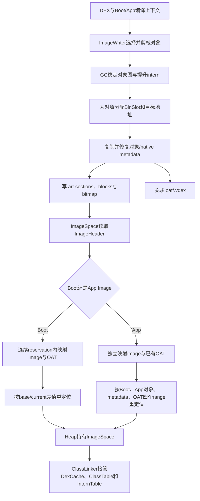
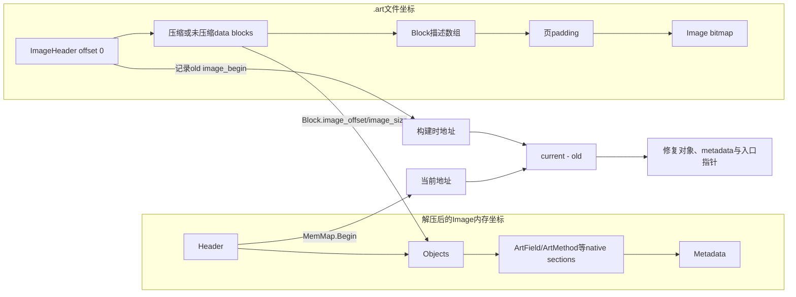
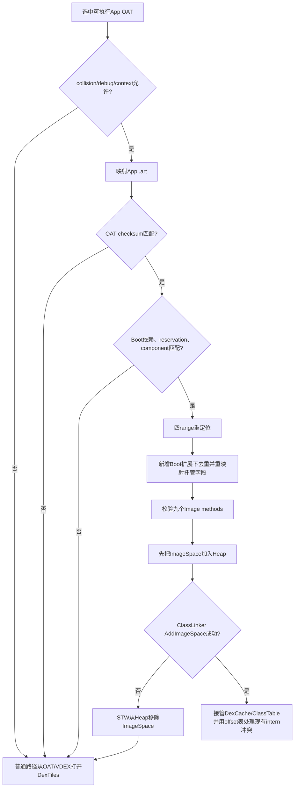

# 第570章 Android ART Boot Image与App Image：ImageHeader、ImageSpace映射、Boot Class Path组件、重定位与对象指针修复链

> 源码基线：Android 11 `android-11.0.0_r48`。本章只在macOS上阅读、检索和静态验证源码，不要求、也不会尝试编译AOSP。
>
> 本章主问题：ART为什么要把已经创建、链接甚至初始化过的对象保存成Image；`.art`、`.oat`与`.vdex`怎样协作；Boot Image、Boot Image Extension与App Image怎样表达依赖；映射地址变化后，运行时又怎样把堆对象引用、ArtField、ArtMethod、DexCache数组、intern表和机器码入口修到当前进程真正可用的地址？

## 1. 先纠正四个最常见的误解

ART Image不是手机屏幕图片，也不只是“编译后的机器码文件”；它主要是一份能直接映射进进程的对象与ART原生元数据快照。Boot Image也不等于整个Boot Class Path：一个Image文件可能代表多个BCP组件，一个组件也可能属于后续扩展chunk。App Image不是APK必有的缓存；它只有通过新鲜度、运行模式、依赖、地址修复和ClassLinker接管等门禁后才会被采用。最后，“mmap成功”只说明字节获得虚拟地址，绝不等于其中所有旧指针已经对当前进程有效。

## 2. 一句话总览

`dex2oat`中的`ImageWriter`从编译期Runtime堆选择对象，剪除不应进入Image的类，建立roots和各section，把对象及ArtField、ArtMethod等复制到目标布局，并在`.art`头中记录目标地址、OAT地址与Boot Image依赖；运行时由`ImageSpace`读取和映射文件，Boot Image优先保留一段连续地址空间，App Image则与其OAT分别映射，再按地址差值修复对象、元数据和代码指针；最后`ClassLinker::AddImageSpace()`才把DexCache、ClassTable、InternTable和ClassLoader关系接入当前Runtime。

## 3. 建立八本账再读源码

第一本是文件账：`.art`保存什么，`.oat`和`.vdex`保存什么。第二本是组件账：BCP component、image chunk、ImageSpace三者不能混称。第三本是地址账：写入时预期地址、当前映射地址、OAT地址各自独立。第四本是对象账：Java堆对象、native metadata、compiled code使用不同forwarder。第五本是依赖账：extension/App Image到底依赖前面多少Boot组件。第六本是校验账：头部结构、checksum、OAT匹配、ClassLinker一致性分属不同阶段。第七本是生命周期账：map、relocate、AddSpace、AddImageSpace分别何时完成。第八本是共享账：只读页可共享，运行期修改会怎样触发私有COW。

## 4. 主要源码地图

格式定义在`art/runtime/image.h`与`image.cc`；内联root读取在`image-inl.h`。文件映射、Boot布局、加载和重定位主线位于`art/runtime/gc/space/image_space.cc`及`.h`。生成端看`art/dex2oat/linker/image_writer.cc`与`.h`。App Image是否尝试加载由`runtime/oat_file_manager.cc`组织，真正接入由`runtime/class_linker.cc::AddImageSpace()`完成。Heap启动入口在`runtime/gc/heap.cc`，测试可看`art/test/596-app-images`与`1001-app-image-regions`。

## 5. Image解决的核心问题是“少做一次启动工作”

若每个Java进程都从原始DEX重新创建`Class`、`String`、`DexCache`，解析字段方法并初始化一批核心类，启动成本和内存重复都很高。Image把一批已经具有稳定布局的对象保存下来，运行时能把它们直接映射为non-moving ImageSpace。Zygote还会在fork后让多个应用共享未修改的物理页。它不是免除所有链接和验证，而是把可提前完成且可复用的那一部分固化。

## 6. `.art`、`.oat`、`.vdex`分工

`.art`以对象图、Image roots、ArtField/ArtMethod等原生结构和序列化表为主；`.oat`是ELF容器，承载OAT元数据与可能存在的AOT机器码；`.vdex`承载DEX字节、VerifierDeps及quickening相关数据。Image中的ArtMethod入口可能指向OAT代码，因此`.art`与`.oat`必须相互匹配。只检查其中一个文件存在，无法证明这套artifact可采用。

## 7. Boot Image、Extension与App Image的边界

Primary Boot Image通常覆盖Boot Class Path最前面的一组核心组件。后续Boot Image Extension覆盖BCP的连续后缀，并在Header中声明自己依赖的已有Boot组件数量、组合checksum和地址跨度。App Image属于某个应用ClassLoader，保存应用类及相关对象，同时引用它构建时所见的Boot Image。三者都使用`ImageHeader`和`ImageSpace`框架，但roots语义、reservation方式与接管路径不同。

## 8. 第一幅图：生成、落盘、映射与接管全链



## 9. `ImageWriter`工作在什么进程

它主要运行在`dex2oat`的AOT编译进程及其专用Runtime中，不是在最终应用已经并发运行的业务堆上做快照。这个区别很重要：Writer可以要求待写对象没有thin/fat lock，可以借用LockWord暂存forwarding信息，还可以在复制期间关闭某些验证。把这些动作套到在线应用堆，会误以为它能安全覆盖任意正在竞争的对象头。

## 10. 生成前为什么先剪枝

编译期堆里并非所有已加载Class都应该进入目标Image。`PruneNonImageClasses()`根据目标Dex、ClassLoader、Boot依赖和类状态移除不合适的Class，并清理相应ClassTable引用。剪枝避免App Image偷偷带入BootClassLoader类，也避免uses-library中不属于目标artifact的DexCache成为强root。Image需要形成对允许集合闭合的对象图，而不是把当前编译器堆原样打包。

## 11. `DexCache`为什么先清再按需重装

解析缓存里保存Class、Field、Method、String及调用点等引用，其中一部分来自不应随Image持久化的Dex。Writer先清DexCache，随后根据配置和确定性需求重新加载可保留内容，可以缩小闭包并减少机器或执行时序带来的差异。对App Image，`dalvik.system.DexFile.cookie`还会被清空，因为其中native指针在不同编译进程间不具可重复性。

## 12. 生成前的GC不是普通“腾内存”

剪枝改变了root集合，Writer随后触发GC，让已不可达对象真正退出候选图，并稳定要复制的对象集合。这个GC路径不以清SoftReference为目标；它服务于Image闭包和布局。若只剪ClassTable而不收集，仍可能从临时引用保留大量无关对象，最终让Image膨胀或包含不该有的依赖。

## 13. intern弱引用为什么要提升

字符串intern表可能含弱intern。Image写出期间若仍把它们当可随GC消失的弱项，对象选择、root和serialized intern section之间会不一致。Writer将需要持久化的弱intern提升为强intern，使快照闭包稳定。加载后Runtime再以自己的InternTable规则接管，生成期提升不等于所有字符串从此永不回收。

## 14. 确定性预加载解决什么

Image若希望可重复构建，不能让DexCache内容取决于一次运行中恰好先解析了什么。可选的deterministic预加载按受控顺序填充部分DexCache，使相同输入更容易得到相同布局。它解决的是artifact稳定性，不是“把所有类型提前解析完”。仍需用实际配置和ImageWriter分支判断哪些cache entry被保留。

## 15. 选入一个对象不只是复制一个对象

对象头中的klass、实例引用字段、Class的super/vtable/iftable、DexCache数组、String引用及反射对象里的ArtMethod指针都可能继续指向其他实体。Writer必须保证引用目标位于已有Boot Image、当前Image、允许的OAT/native区域，或把引用清空/排除。所谓Image closure就是沿允许边追完仍保持自洽，而非简单枚举Class列表。

## 16. App Image的ClassLoader也是数据

App Image的特殊root不是Boot live objects，而是构建它时使用的ClassLoader。加载时ClassLinker拿当前调用方ClassLoader，与Image内保存的loader对象及ClassTable建立关系。这个loader不能是BootClassLoader；否则应用类命名空间、类身份和卸载边界都会错误。App Image因此天然绑定类加载上下文，而不只是绑定APK路径。

## 17. Boot Image必须额外保活哪些对象

`kBootImageLiveObjects`数组先保存三种预分配`OutOfMemoryError`、预分配`NoClassDefFoundError`和cleared JNI weak sentinel，再接内建intrinsic需要的对象，例如Integer cache。它们可能缺少普通Java强引用，却必须在异常低内存或JNI弱引用路径可用。将它们作为特殊root比依赖反射可见字段可靠。

## 18. `ImageRoot`只有三个槽但语义很重

r48定义`kDexCaches`、`kClassRoots`和`kSpecialRoots`。前两项分别把已纳入的DexCache集合与Runtime核心Class roots带入快照；第三项在Boot Image中别名为`kBootImageLiveObjects`，在App Image中别名为`kAppImageClassLoader`。槽位数相同不代表Boot/App特殊root类型相同，读取者必须先知道Image种类。

## 19. Root读取为什么默认带read barrier

`GetImageRoots()`与`GetImageRoot()`模板默认使用read barrier，因为返回的是托管对象引用，调用点应服从当前GC读屏障合同。不过Image roots数组本身位于non-moving ImageSpace，源码会断言它没有被read barrier转发到别处。这里应区分“容器对象不移动”与“通过它读出的引用完全不需屏障”。

## 20. 对象怎样分Bin

Writer不是按发现顺序随意排对象，而是按预计脏化特征分到多个Bin，例如known dirty、不同状态的Class、String、regular和misc dirty。目标是把容易在进程启动后被写的对象聚在某些页，把稳定对象聚在另外的页。这样fork后的私有写更少污染本来可跨进程共享的页。

## 21. Bin优化的是COW，不改变Java语义

一个String排在Class前后不应改变equals、类初始化或方法分派结果。Bin排序只影响地址局部性、页共享与dirty page数量。阅读Image大小或PSS时它很重要；解释程序正确性时却不能把“known dirty bin”说成对象已经脏，也不能从物理相邻推断Java引用关系。

## 22. Writer为什么借用LockWord

在计算布局后，Writer需要从源对象快速查到目标Image offset。r48把编码后的`BinSlot`作为forwarding address暂存在源对象LockWord中，并另行保存identity hash code，复制完再使用这些信息。这个技巧避免为每个对象维护更昂贵的外部map，但要求对象当时不能处于thin-locked或fat-locked状态。

## 23. 遇到锁住对象为什么是fatal

锁状态本身包含owner、递归或Monitor信息，不能被当成普通可持久化对象状态写进静态Image。若Writer看到thin/fat lock，说明编译期环境没有达到它所要求的静止条件，直接继续可能同时破坏锁和forwarding。这里的fatal是构建期不变量保护，不表示最终应用运行时禁止Image对象参与锁；加载后它们当然仍可被同步，写对象头则会发生私有COW。

## 24. identity hash怎样保留

对象identity hash有时编码在LockWord中。Writer在覆盖LockWord作forwarding前保存hash，并在目标对象构造时恢复等价状态，保证`System.identityHashCode()`的对象级约束不因快照而丢失。它并不承诺不同构建产物产生相同hash；重点是同一个快照对象内部状态保持自洽。

## 25. Java对象与native metadata分开布局

Image开头的Objects section是真正由GC理解的mirror对象。ArtField、ArtMethod、RuntimeMethod、IMTable、IMT conflict table和DexCache native arrays随后位于专用section，它们不是普通Java对象，遍历和指针宽度规则也不同。Metadata section再放其他序列化元数据。不能拿Java对象的`SizeOf()`循环遍历整个Image。

## 26. 十二个Image section完整清单

顺序是Objects、ArtFields、ArtMethods、RuntimeMethods、ImTables、IMTConflictTables、DexCacheArrays、InternedStrings、ClassTable、StringReferenceOffsets、Metadata、ImageBitmap。这个顺序由`ImageHeader::ImageSections`固定，Writer创建布局与Loader消费必须一致。新增或重排section是格式变更，不能只改一端枚举。

## 27. Objects section的边界有一个易错点

第一对象紧跟按8字节对齐的`ImageHeader`；`VisitObjects()`从`RoundUp(sizeof(ImageHeader), kObjectAlignment)`开始，用每个对象`SizeOf()`的8字节round-up推进。Objects section的`Size()`是相对section起点的结束界，不是“纯对象字节数而不含header空位”。手写遍历若从0把Header当对象，第一步就会错。

## 28. `ImageSpace::End()`不等于整个映射末尾

对GC而言，space的对象区域结束在Objects section末尾；ArtField等native section不属于可分配对象空间。`GetImageEnd()`或底层MemMap范围还可能覆盖后续native sections，甚至文件布局还在页对齐后放bitmap。调试地址时应先问“对象space end”“解压后Image数据end”还是“文件/mapping end”。

## 29. Bitmap只标记Objects

Image bitmap描述Objects section中哪些对齐位置是真对象，覆盖范围按card size等规则round-up。ImageSpace的live bitmap与mark bitmap是同一份，因为Image对象作为永久保留集合，不参与普通sweep回收。ArtMethod或ClassTable不在GC bitmap中，它们有自己的section访问器。

## 30. 第一段r48真实Java：Image中的类状态可被直接观察

`art/test/596-app-images/src/Main.java`先确认App Image确实加载、包含目标Class，并检查多个Class已经初始化。下面逐字摘录一小段；它说明测试关心的不只是文件存在，而是对象确已进入Image并携带预期类状态：

```java
    if (!checkAppImageLoaded()) {
      System.out.println("App image is not loaded!");
    } else if (!checkAppImageContains(Inner.class)) {
      System.out.println("App image does not contain Inner!");
    }

    if (!checkInitialized(Inner.class))
      System.out.println("Inner class is not initialized!");

    if (!checkInitialized(Nested.class))
      System.out.println("Nested class is not initialized!");
```

## 31. `ImageHeader`为什么按8字节打包

源码用`PACKED(8)`并静态断言对象对齐为8，因为第一个mirror对象直接跟在Header后。Header大小若破坏对象对齐，所有对象访问都会错。这里的8是ART对象布局约束，不代表文件中每个section都只需8字节；页映射、ArtMethod指针宽度和bitmap另有对齐规则。

## 32. magic和version只回答格式代际

r48的Image magic是`art\n`，version为`085\0`。`ImageHeader::IsValid()`先比较这两个固定字段，拒绝其他格式代际。它不负责证明文件来自当前APK、Boot依赖匹配或OAT未过期；那些是更外层的采用门禁。

## 33. `IsValid()`到底检查了什么

除magic/version外，它检查reservation按page对齐，`image_begin + image_size`不回绕且size非零，OAT file begin不晚于file end，OAT data begin不晚于data end，并要求file begin严格早于data begin。这属于Header内部数值的基本结构检查。通过它只能说“头看起来可解析”，不能说对象、bitmap、checksum和依赖全正确。

## 34. `image_begin_`是写入时的目标地址

Header内的`image_begin_`不是文件偏移，而是Writer为Image对象图编码引用时假定的虚拟地址基准。若Loader恰好映射到这个地址，很多指针无需变化；若当前地址不同，就必须以delta修复。把它打印成十六进制地址比当作`.art`内offset更容易看出其作用。

## 35. `image_size_`不是reservation大小

`image_size_`是未按页补齐的Image数据大小，覆盖Header、Objects和后续native sections的内存形态，但不等于文件总长，也不含独立bitmap文件尾布局。`image_reservation_size_`是为地址布局预留的页对齐跨度。Boot chunk还要把关联OAT等地址安排纳入reservation；App Image的reservation则恰好是image size向上按页对齐。

## 36. App Image没有显式类型位

`ImageHeader::IsAppImage()`依据`image_reservation_size_ == RoundUp(image_size_, kPageSize)`推断。也就是说，“App”来自布局不变量，而不是Header中的`bool app_image`。若文档说Loader读到类型标志再选择逻辑，就与r48源码不符。

## 37. `component_count_`数的是什么

它表示这一chunk覆盖多少个Boot Class Path组件，而不是文件内对象数、DEX数或必然的ImageSpace数。App Image要求component count为1。Primary Boot chunk可以代表多个BCP jar；single-image模式甚至用一个ImageSpace覆盖多个component，因此component与space必须分账。

## 38. `GetImageSpaceCount()`为何有特判

对于App Image返回1。对于Boot primary header，若`image_begin + reservation_size == oat_file_end`，说明single-image布局只需要一个space；否则返回`component_count_`，对应multi-image中每个组件的ImageSpace。非primary的附属Image header常把component count和reservation设为0，不能独立当chunk入口读取。

## 39. OAT地址字段是契约而非所有权

Header记录`oat_file_begin`、`oat_data_begin/end`和`oat_file_end`，表示构建时预期的OAT地址布局。Boot Loader通常在连续reservation中按预期关系映射OAT；App OAT可以实际落在别处，所以重定位需单独建立App OAT range。ImageSpace持有的OatFile指针还可能是non-owned，所有权随后交给更上层管理。

## 40. 九个Image methods是什么

Header保存resolution method、IMT conflict与unimplemented method，以及多种callee-save runtime method，包括save-all、refs-only、refs-and-args、clinit与suspend-check等变体。它们是Runtime共享的特殊ArtMethod入口，不是某应用的九个普通Java方法。App Image加载完成后会逐项检查它们与Primary Boot Image中的指针完全相同。

## 41. 为什么Header还记录Boot依赖四元组

`boot_image_begin`给出构建时Boot基址，`boot_image_size`给出所依赖Boot Image chunk的reservation总跨度，`boot_image_component_count`界定依赖的BCP组件数，`boot_image_checksum`保存这些chunk的组合校验。Extension和App Image据此判断当前Boot环境是否与构建环境兼容。只比较Boot文件名无法覆盖内容与chunk边界变化。

## 42. 组合checksum如何计算

Boot layout按连续chunk累加component count与reservation size，并把每个chunk的Image checksum做异或，直到达到依赖的component count。若依赖数落在某chunk中间、组件不连续、checksum不等或size不等，验证失败。异或不是密码学签名；这里它是快速一致性标识，仍要与信任来源、OAT验证和路径策略一起理解。

## 43. Image checksum覆盖范围要精确说

Writer先对当时的Header内存快照做Adler-32；此刻`image_checksum_`仍为0，而且压缩block位置、最终`data_size_`与实际bitmap文件offset尚未回填。随后累计实际写出的data block字节：压缩模式算压缩后字节，未压缩模式算原字节；最后再累计bitmap。压缩时写出的`Block`描述数组、对齐padding以及后来改写的Header字段并未再次加入这次Adler计算。最终Header带着checksum重写到offset 0，所以这个值是Writer定义的artifact身份量，不能笼统叫“最终整个`.art`文件逐字节checksum”。

## 44. secondary checksum为什么折入primary

multi-image写出时，各secondary Image先产生自己的checksum，再异或进primary checksum。Primary Header最后写，使它能代表整组组件的组合状态。加载布局只需从chunk入口Header取得组合值，而不必把一组文件误当完全独立的Image。

## 45. Primary Header为什么最后写

若primary先成为有效Header，后续secondary写失败，磁盘上会留下一个看似可采用却缺组件的组。r48让secondary先完成，primary最后落下并在失败guard中擦除/关闭不完整输出。这个设计缩小了“有效入口指向残缺组”的窗口，但不能等同于跨多个文件的原子rename事务。

## 46. 三种storage mode

`kStorageModeUncompressed`直接保存未压缩Image字节，`kStorageModeLZ4`和`kStorageModeLZ4HC`分别表示普通或更高压缩强度的LZ4生成方式。两种LZ4在读取端都按LZ4数据解压，差别主要在写时压缩代价与结果。枚举字段定义在`Block`内，但r48未压缩落盘路径不保存Block描述数组，Header的block count保持0并直接映射；只有压缩文件靠持久化Block逐段恢复。

## 47. `Block`同时维护两套坐标

`data_offset/data_size`描述Block在文件中实际存储数据的位置与长度；`image_offset/image_size`描述解压或复制后它在内存Image中的位置与长度。未压缩时两套长度常相同，压缩时不同。Loader据此把多个物理块拼回一个连续的目标Image内存形态。

## 48. 文件布局与内存布局并不相同

Header始终位于文件offset 0且不压缩。其后是未压缩Image字节，或多个压缩data block；只有压缩形式才紧接着保存Block描述数组。文件再按页对齐并在末尾放Image bitmap。映射/解压后的内存Image只恢复Header到Metadata的逻辑section布局，bitmap另行映射或装载。因而section offset不能无条件当作压缩文件中的物理offset。

## 49. Bitmap section为何需要特殊改写offset

前十一个section描述未压缩内存Image中的相对位置，而bitmap真正放在可能已经压缩变长/变短的数据尾部并按页对齐。Writer写文件时会把bitmap section offset改成实际文件位置。用同一种“base + section offset”解释所有section时，必须先确认base是内存Image还是文件映射。

## 50. `data_size_`也不是文件总长

它表示Header后保存的Image data范围；压缩模式下包括压缩块数据和Block描述数组，不包括Header本身，也不包括尾部Image bitmap与页padding。文件长度校验还要结合bitmap offset/size。把`sizeof(Header)+data_size`当完整文件长会漏掉尾部。

## 51. 未压缩Image怎样映射

Loader可用`MAP_PRIVATE`、可读写保护把文件相应区间直接映入低4GB目标地址。`PRIVATE`意味着运行时修指针或修改对象页时形成进程私有COW，而不会回写磁盘文件。可写权限是重定位与运行期对象状态所需，绝不表示多个进程共同改同一物理页。

## 52. 压缩Image怎样加载

压缩数据不能直接呈现为对象地址空间，Loader先分配匿名、读写且满足low-4GB要求的目标MemMap，再依Block把数据解压或复制到各自image range。块数足够且有线程池时可并行处理，因为输出范围互不重叠。解压完成只恢复字节布局，地址相关指针仍要看delta决定是否修复。

## 53. 为什么即使64位进程也强调low 4GB

r48 ImageHeader和许多Image地址字段以32位值存储，Image对象引用布局也依赖其可表示范围。Loader因此对Boot/App Image映射使用low-4GB约束。这里不是说64位ART只会使用4GB堆，而是这类预构建Image及其编码地址必须落在所支持的低地址范围。

## 54. direct mapping与anonymous mapping的诊断差异

未压缩direct map在`/proc/maps`常能看到`.art`文件路径，压缩Image的对象区域可能显示匿名映射；两者都可成为ImageSpace。看到匿名区不能直接断言App Image没加载，看到文件映射也不能断言没有发生COW。应结合ImageSpace列表、Header begin、MemMap begin与bitmap共同判断。

## 55. 第二幅图：文件坐标、内存坐标与地址差值



## 56. Loader先验证长度再相信Block

读取Header后，Loader会结合文件长度、`data_size_`、Block数量、各Block范围和bitmap section检查边界。否则伪造offset可让解压写出目标Image范围或让bitmap映射越过文件。`IsValid()`只是第一层，真正文件布局验证在`ImageSpace::Loader::Init()`一带继续完成。

## 57. Bitmap为什么可以同时当live和mark

Image对象在Runtime生命周期中不被普通collector搬走或清扫，它们是永久live集合，因此ImageSpace返回同一bitmap承担live/mark视图，`Sweep()`为空操作。这不表示GC完全忽略Image：collector仍需扫描Image到可移动空间的引用、处理card/mod-union等跨space关系。只是“Image内对象是否存活”无需每轮重新决定。

## 58. Image对象可写但不可移动

Class状态、DexCache槽或锁字等可能在运行期变化，所以Image映射通常是进程内可写的；`MAP_PRIVATE`把变化隔离成COW页。不可移动表示对象地址稳定，不表示内容永久只读。将“read-only shared image”当严格内存保护描述，会解释不了Class初始化或对象锁操作。

## 59. Boot Loader先建立`BootImageLayout`

它根据image location、Boot Class Path及其逻辑locations寻找system与dalvik-cache候选，读取每个chunk入口Header，检查component连续性、依赖和reservation累计。Layout阶段回答“需要哪些chunk、每个覆盖哪些BCP组件、总共预留多少地址”，尚未把所有对象接入Heap。

## 60. Image location语法可以描述多个chunk

r48允许以冒号分隔Image位置，位置还可带命名component/extension含义；Loader把它们与Boot Class Path逻辑位置匹配。某些扩展还可关联profile并在允许条件下内存编译。学习时不必先背所有字符串语法，但一定要知道一个`image_location`不必只代表一个`.art`文件。

## 61. BCP component、chunk、space用一个例子分清

假设BCP有`core-oj.jar`、`core-libart.jar`和`framework.jar`三个component。Primary chunk可能用single-image把前两个装进一个ImageSpace，Extension chunk再为`framework.jar`建立一个space；此时component数是3、chunk数是2、space数是2。若primary用multi-image拆开前两个，component仍是3、chunk仍是2，但space变成3。任何监控数字都必须标注单位。

## 62. 为什么component依赖不能落在chunk中间

一个chunk的primary checksum代表这一组文件，reservation和地址关系也整体建立。若Extension声称只依赖前一chunk的一半component，Loader无法用完整chunk作为稳定依赖单元，也无法构造正确组合checksum。`ValidateBootImageChecksum()`因此在依赖计数落到chunk中间时直接失败，而不是猜测可以取部分。

## 63. Boot reservation总量有1GB上限

r48把`kMaxTotalImageReservationSize`设为1GB。每读入一个chunk，`ValidateHeader()`都用剩余额度检查其reservation，防止32位地址算术与异常文件造成过大预留。这个上限是Image组地址规划约束，不等于Java堆最大值，也不等于设备必须真实提交1GB物理内存。

## 64. reservation只占虚拟地址，不立即等量耗RAM

`ReserveBootImageMemory()`先圈定连续虚拟地址范围，随后各Image和OAT映射逐段消耗它。保留地址的目的是防止其他mapping插入，维持Writer假定的相对关系。尚未访问的文件页由内核按需调页，reservation size不能直接当PSS或RSS。

## 65. 为什么Boot Image倾向连续映射

Boot组件之间大量指针直接引用前面Class、String和ArtMethod。若Image与关联OAT按构建布局落入一个连续reservation，通常只需要统一或分段delta，而不必给每个引用保存重定位表。连续性也是`boot_image_size`和extension依赖能用一个边界描述的基础。

## 66. Loader怎样选system还是dalvik-cache

`LoadBootImage()`按`ImageSpaceLoadingOrder`尝试system-first或cache-first。system-first时系统artifact可基于系统完整性假设跳过部分OAT输入验证；若先看data/cache，即便随后用system候选也会要求验证。dalvik-cache候选始终验证，因为它是可变数据分区产物。顺序不仅影响性能，还影响验证策略。

## 67. system有文件不代表一定采用

Header无效、BCP组件对不上、依赖checksum不匹配、OAT映射不在预期地址或输入验证失败，都可能让候选被拒。Loader收集各候选错误，再尝试另一路径。最终日志里的“using image”比目录里“有image”更接近采用事实。

## 68. 何时可能生成cache Image

若system没有可用Image、dalvik-cache存在、磁盘空间和Runtime策略允许，Loader可调用dex2oat生成Image或extension后重试。Zygote还会在低空间时先清理cache，并禁止本轮再次填满它。macOS阅读练习只核对这些分支，不执行生成，更不会假装本机能产出Android目标Image。

## 69. ASLR地址差从哪里来

生成cache Image时可由`ChooseRelocationOffsetDelta()`在ART允许范围内选页对齐随机delta；加载时启用relocate也会为reservation选择随机化基址。Header仍保留构建时地址，实际MemMap begin可能不同。真正修复量必须由当前地址减旧地址计算，不能从“开启ASLR”直接猜一个常量。

## 70. `relocate=false`的含义更严格

若不允许重定位，Boot Image必须在预期base成功保留和映射，Loader随后断言base delta为0。它不是“先随便映射但不检查指针”；那会留下全部悬空地址。地址被占用时正确结果是加载失败，而非带着旧指针继续。

## 71. 每个chunk加载失败的后果不同

Primary chunk失败意味着没有Boot基础，整个加载失败。后续Extension失败时，Loader可以缩回尚未使用的reservation、必要时重新保留被局部unmap的范围，记录错误后保留已成功的前缀。于是Boot Image扩展是可选加速层，但依赖计数和App Image采用仍必须以实际加载前缀为准。

## 72. `extra_reservation_size`服务谁

调用方可要求Boot组后再留一段额外连续空间，例如为zygote后续布局计划使用。Loader在Image reservation总量后一起预留，组件加载完成后用`RemapExtraReservation()`把剩余部分单独交回。它不自动变成另一个ImageSpace，也不计入某个Header的component count。

## 73. Boot OAT为什么也要验证地址

Boot Image的ArtMethod等指针按预期OAT位置写入。加载每个component时不仅比较OAT checksum，还检查实际OatFile begin和Header声明的data begin等关系。若OAT落到意外地址却未进入相应重定位模型，方法入口和metadata指针会失效。文件内容匹配与地址布局匹配是两个条件。

## 74. OAT输入验证与Image checksum不是同一层

Header中保存的Image checksum参与标识Image组，OAT header checksum连接`.art`与`.oat`；本章看到的ImageSpace路径主要比较这些已保存的身份值，并不是每次加载都重新散列整个最终`.art`文件。OatFileAssistant一类逻辑还会核对DEX checksum、Boot Class Path与ClassLoaderContext等输入新鲜度。旧APK可能保留结构正常、内部身份值彼此匹配的Image/OAT，却仍因输入变化不可采用，缓存正确性必须逐层闭合。

## 75. Boot重定位先算base与current两种delta

Primary Boot Image通常只有一个统一base差。Extension既可能引用之前已经加载的Boot范围，也可能引用自己构建时的当前chunk范围，所以Loader还计算current delta。两种源地址区间不能用一个“见指针就加base”规则处理，否则extension内部指针或指向旧Boot的指针至少会错一类。

## 76. `SimpleRelocateVisitor`做什么

对一个已知source range内的指针，它按固定delta得到dest指针；range外保持原样或按访问器合同检查。Primary Boot relocation可主要使用这种visitor，因为整个基础Image按统一差值移动。名字里的Simple描述地址变换，不表示它只修Java对象。

## 77. `SplitRangeRelocateVisitor`为何用于Extension

它用boundary区分两段：指向更早Boot依赖区的地址加base delta，指向当前extension源区的地址加current delta。一个Class的super可能落在前者，自己的vtable/ArtMethod可能落在后者。分段visitor把“指针的原值属于哪个range”编码成明确规则，避免按对象所属space粗暴判断。

## 78. 重定位不是扫内存把所有整数加delta

对象里既有真正引用，也有primitive int、hash、flags和offset；native结构里还有代码指针、DeclaringClass GcRoot与普通长度。Loader必须用对象类型、字段offset和section visitor准确找到指针槽。无类型地修改所有看似地址的32/64位数会立即破坏对象内容。

## 79. Header本身也要修

`RelocateImageReferences(delta)`调整`image_begin`、image roots和OAT地址字段；`RelocateBootImageReferences(delta)`调整非零boot begin以及九个Image method指针。Header修好后，后续消费者再读roots或methods才能拿到当前地址。只修对象字段而留下Header旧基址，会在ClassLinker阶段重新引入错误指针。

## 80. 为什么Class与ClassTable先修

遍历普通对象必须读取它的klass，进一步用Class元数据决定对象大小和引用字段。若klass、super、vtable或iftable仍是旧地址，遍历器自己都无法可靠解释后续对象。因此Boot和App重定位都先处理ClassTable里的Class及其辅助PointerArray，再走其余Objects。

## 81. visited bitmap防什么

Class的非嵌入vtable、iftable method arrays也会作为普通对象出现在Objects遍历中。若Class优先阶段已经修过，第二遍再加一次delta就会把正确地址推走。临时visited bitmap标记已处理对象，保证每个pointer array与Class只forward一次。

## 82. ArtField需要修哪些内容

ArtField主要持有DeclaringClass root以及访问标志、field index、offset等数值。重定位visitor只修DeclaringClass这类地址槽，不改变字段在对象中的Java offset。字段offset是布局语义，不是虚拟地址；两者恰好都可表现为整数，所以更需要类型化访问器。

## 83. ArtMethod为什么更复杂

ArtMethod包含DeclaringClass root、data指针和quick compiled code entrypoint等。data可能指向DexCache、JNI数据或runtime结构，quick入口可能指向OAT代码、trampoline或Boot runtime method。Loader用对象/metadata/code range判断各自是否转换，不能统一按Image object delta处理。

## 84. IMTable与conflict table也有方法指针

接口快速分派表保存ArtMethod地址，哈希冲突表还保存接口方法到实现方法的配对。它们位于非heap section，不会被GC对象字段扫描自然覆盖。`VisitPackedImTables()`与`VisitPackedImtConflictTables()`专门逐项forward，漏掉后可能只在某次interface调用时崩溃。

## 85. DexCache native arrays为何单独修

DexCache对象本身在Objects中，但resolved methods/fields/types/strings等数组可能位于`kSectionDexCacheArrays`的native布局。对象字段只保存这些数组的基址；数组元素又分别是GcRoot、ArtField或ArtMethod指针。`VisitDexCacheArrays()`要同时修基址与条目，普通`VisitReferences()`不足以完成。

## 86. 反射对象还有隐藏的native指针

`java.lang.reflect.Method`、`Constructor`等mirror Executable对象含对应`ArtMethod*`。这个指针不是普通Java reference，GC字段访问器不会当GcRoot处理。Boot relocation遍历Objects时识别Method/Constructor Class，并显式读取、forward再写回ArtMethod地址。

## 87. InternTable和ClassTable是序列化容器

这两个section不是Java数组，而是ART哈希集合的持久化数据。Loader可用`make_copy_of_data=false`在映射上建立临时set视图，逐slot修GcRoot，使改动直接落到当前private mapping。之后ClassLinker/InternTable接管它们，才成为Runtime查询路径的一部分。

## 88. Boot重定位何时可以完全跳过

当base delta和current delta都为0时，Writer编码地址与实际映射完全一致，visitor可直接返回。跳过不是因为Image“天然位置无关”，而是位置恰好命中。OAT代码本身可能采用相对寻址，但Image中大量绝对对象/native指针仍依赖这一判断。

## 89. 第二段r48真实Java：intern身份跨Image验证

`596-app-images`动态构造与字面量相同的字符串，随后比较boot/app intern身份。下面的逐字片段说明测试使用引用相等验证intern去重，而不是只比较字符串内容：

```java
    String tmp = sb.toString();
    String intern = tmp.intern();

    assertNotEqual(tmp, intern, "Dynamically constructed String, not interned.");
    assertEqual(intern, StaticInternString.intent, "Static encoded literal String not interned.");
    assertEqual(BootInternedString.boot, BootInternedString.boot.intern(),
        "Static encoded literal String not moved back to runtime intern table.");
```

## 90. App Image由谁发起尝试

`OatFileManager`选定可执行OatFile后，先用`ShouldLoadAppImage()`检查collision、debuggable/编译模式与ClassLoaderContext等条件，再让`OatFileAssistant`打开配套ImageSpace。App Image是优化路径；拒绝后通常仍可从OAT/VDEX打开DexFile继续运行。不要把“App Image未加载”直接等同于应用启动失败。

## 91. debuggable为什么可能拒绝Image

若当前Runtime要求debuggable，而artifact并非相容方式生成，Image里Class与编译代码可能包含内联等不适合当前调试语义的状态。`OatFileManager`会丢弃这一候选，回到普通Dex加载路径。这里保护的是运行模式一致性，不是说所有debuggable应用永久禁用任何App Image。

## 92. App Image先独立映射

`Loader::InitAppImage()`调用通用`Init()`时不传Boot reservation，Image可在任意满足low-4GB的可用地址映射；其OatFile也已由外层打开，实际地址未必是Header预期地址。因此App重定位天生需要同时考虑Image对象、Image native metadata和OAT代码三类当前位置。

## 93. App采用第一道硬门是OAT checksum

Loader读取当前OatFile header checksum，与ImageHeader中的`oat_checksum`比较。不等立即返回空ImageSpace并带错误消息。它防止`.art`与另一版本`.oat`拼错，但还没有证明Boot依赖、pointer size、Class roots或DEX数量正确。

## 94. Boot依赖怎样允许“当前Boot更多”

App Image Header记录构建时所依赖的Boot component count。当前Runtime可以加载更多后续Boot extensions，只要原依赖前缀的组合checksum和size匹配。Loader返回依赖了多少个space；若当前space更多，稍后要处理新增Boot intern string与App intern string的重复，而不是机械拒绝整个App Image。

## 95. App reservation和component门禁

App Loader要求reservation等于`RoundUp(image_size, page)`，并要求component count恰好为1。这再次验证了`IsAppImage()`所依赖的布局不变量，也防止把Boot chunk误交给App路径。Header基本有效但这两项不符，仍不会进入重定位。

## 96. App重定位要画四个range

第一段是构建时Boot Image范围到当前Boot范围；第二段是App Image Objects旧地址到当前对象区；第三段是App native metadata旧地址到当前metadata区；第四段是App OAT预期地址到当前OatFile映射。heap reference用object forwarder，ArtField/ArtMethod数据用metadata或组合forwarder，quick code入口用code forwarder。只有先分类，delta才有意义。

## 97. 为什么App也必须先修Class

App Class的klass通常指向Boot中的`java.lang.Class`，super可能指向Boot或App，vtable方法又可跨Boot/App/OAT。Loader从ClassTable先取slot，修Class与非嵌入pointer arrays，并用visited bitmap标记。第二遍再由live bitmap访问其余对象，和Boot重定位遵循同一个“先让类型系统可解释”的原则。

## 98. App对象修复阶段为何不用write barrier

此时新ImageSpace尚未完整接入Heap/ClassLinker，Loader直接在私有映射中把旧引用改为当前地址；不存在需要让并发collector追踪的正常mutator写入。相应访问还常明确选择`kWithoutReadBarrier`，因为它正在修复尚未发布的图。发布后业务代码修改Image对象则必须回到正常barrier合同。

## 99. 修完对象后还要修Header与DexCache

Objects pass结束，Loader调用两个Header relocate函数，使image roots、Boot begin和runtime methods指向当前地址，再从新roots取DexCache数组并修其native arrays。这个顺序避免从旧roots出发访问错误对象。随后还要遍历ArtMethod、ArtField、IMT、conflict table和intern table，不能把bitmap结束当作整次relocation结束。

## 100. Image methods相等检查是共享Runtime约束

App Header里的九个特殊ArtMethod构建时来自Boot Image。重定位完成后，Loader逐项`CHECK_EQ`它们与当前Primary Boot Header中的指针。如果依赖校验或forwarding逻辑漏掉不一致，这个检查会阻止App Image带着另一套runtime method继续。

## 101. 新Boot Extension为什么会制造intern重复

App Image构建时只看见较短的Boot前缀，可能把某个字面量作为自己的intern对象写入。运行时若多加载了一个扩展，而扩展恰好已含相同字符串，Runtime必须选择唯一canonical对象。`InitAppImage()`只拿“超出构建依赖前缀的当前Boot spaces”与App serialized intern set比较，从App set移除重复项，并记录`app String* -> boot String*`映射；它不会重复检查本来已由Header依赖覆盖的Boot前缀。

## 102. Loader阶段先重映射托管字符串字段

只从serialized set删项并不够：App对象字段或静态字段仍可能指向被移除的App String。`Loader::RemapInternedStringDuplicates()`从Header后逐对象调用`VisitReferences<kVisitNativeRoots=false>`，把命中map的托管字段改成Boot canonical String，而且不做write barrier，因为Image尚未发布。要特别注意：这个函数明确不访问DexCache native roots，也不读取StringReferenceOffsets；把两个阶段合成一次是本章复读时修掉的一处错误。

## 103. `StringReferenceOffsets`怎样编码两类位置

每条`AppImageReferenceOffsetInfo`是一对32位数。普通条目表示“App Image对象相对base offset + 成员字段offset”；DexCache的resolved strings与pre-resolved strings是native array，不是对象字段，因此r48在第一项低位设置不同tag，第二项改作数组索引。消费端先识别并清tag，再定位DexCache；这些tag依赖对象地址至少2字节对齐，而Image对象实际满足更强的8字节对齐。

## 104. ClassLinker阶段才消费StringReferenceOffsets

`ClassLinker::AddImageSpace()`中的`HandleAppImageStrings()`把App serialized intern set加入当前InternTable，并先与已经存在的非Boot strong/weak interns求交；冲突项形成另一张remap。只有这张map非空时，`VisitInternedStringReferences()`才消费StringReferenceOffsets，分别更新普通托管字段、DexCache string数组和可选的pre-resolved string数组；native数组分支还会手工card mark。若Runtime关闭App Image startup cache，pre-resolved strings会先清空，相应tag条目不再修。这是与第102节“新增Boot extension的早期托管字段重映射”相互独立的第二阶段。

## 105. 第三幅图：App Image采用成功与回退



## 106. `Heap::AddSpace`为什么早于`ClassLinker::AddImageSpace`

ClassLinker接管时会操作Image对象与GC可见结构，因此注释要求space先加入Heap。`OatFileManager`暂停线程、进入GC critical section并SuspendAll后调用`Heap::AddSpace()`，随后恢复到ClassLinker逻辑。若ClassLinker失败，再用同样的STW保护从Heap移除。两个动作构成显式回滚边界，而不是一个原子API。

## 107. `ClassLinker::AddImageSpace()`还检查什么

它比较Image pointer size与Runtime，检查roots数组长度和ClassRoots长度，并要求Image里的每个核心Class root与当前Runtime对应root指针相等。它还要求OAT声明的DexFile数等于DexCache数，逐个从OAT打开DexFile并为App DexCache覆盖构建期无效的DexFile指针。通过Loader relocation仍可能在这里因Runtime语义不一致被拒。

## 108. ClassTable与ClassLoader如何真正接上

App Image的ClassTable随后与当前ClassLoader关联，Image内Class被加入ClassLinker可查结构；serialized intern set也交给Runtime InternTable。若只是映射并修完地址却没完成这一步，`loadClass()`与`String.intern()`不会自然发现Image内容。采用完成点应以`AddImageSpace()`成功和DexFile注册为准。

## 109. App Image失败为何通常非致命

优化artifact可能因Boot扩展差异、debug模式或ClassLoaderContext变化失效，但原始DEX语义仍应可执行。OatFileManager在Image接管失败后清空临时DexFile结果、移除Heap space，然后从source OAT/VDEX普通打开DexFiles。回退可能更慢、更耗内存，却维护正确性；日志应区分“优化没采用”和“DEX也无法打开”。

## 110. 第三段r48真实Java：对象区可能跨GC region

`art/test/1001-app-image-regions/src/Main.java`取App Image Objects section大小与RegionSpace region size比较。逐字片段提醒我们：Objects section可超过一个GC region，不能假设“一张App Image等于一个region”：

```java
    System.out.println("App image loaded " + checkAppImageLoaded());
    int regionSize = getRegionSize();
    int objectsSectionSize = checkAppImageSectionSize(Main.class);
    System.out.println("Region size " + regionSize);
    System.out.println("App image section size large enough " + (objectsSectionSize > regionSize));
    if (objectsSectionSize <= regionSize) {
      System.out.println("Section size " + objectsSectionSize);
    }
```

## 111. macOS只读练习说明

下面四个练习只用`rg`、`sed`、`test`和shell算术读取本地r48源码，不生成Image、不运行dex2oat，也不修改AOSP。四条验证链依次是Header/sections、Writer与文件布局、Boot reservation/relocation、App采用/修复/intern去重。每个脚本只有在关键锚点全部存在时才打印`OK`。

## 112. 练习一：核对Header、roots、sections与App判定

```bash
#!/bin/bash
set -eu
src=/Users/ninebot/androidSource
h="$src/art/runtime/image.h"
c="$src/art/runtime/image.cc"
rg -n "enum ImageRoot|enum BootImageLiveObjects|enum ImageSections|enum ImageMethod" "$h" | sed -n '1,80p'
rg -n "IsValid|IsAppImage|GetImageSpaceCount|RelocateImageReferences" "$c" | sed -n '1,100p'
rg -q "kSectionStringReferenceOffsets" "$h"
rg -q "kBootImageLiveObjects = kSpecialRoots" "$h"
rg -q "RoundUp\(image_size_, kPageSize\)" "$c"
echo 'OK: Header基本校验、三类root、十二section与App布局判定已核对'
```

读完回答：`IsValid()`为何不等于artifact可采用；special root在Boot/App里分别是什么；component count为何不必等于space count。

## 113. 练习二：核对ImageWriter剪枝、BinSlot与文件落盘

```bash
#!/bin/bash
set -eu
src=/Users/ninebot/androidSource
w="$src/art/dex2oat/linker/image_writer.cc"
h="$src/art/runtime/image.h"
rg -n "PruneNonImageClasses|PromoteWeakInterns|BinSlot|LockWord|CreateImageRoots" "$w" | sed -n '1,120p'
rg -n "kStorageModeUncompressed|kStorageModeLZ4|class PACKED.*Block|GetDataSize" "$h" | sed -n '1,100p'
rg -n "WriteHeader|image_checksum|GetImageBitmapSection|blocks" "$w" | sed -n '1,140p'
rg -q "PruneNonImageClasses" "$w"
rg -q "kStorageModeLZ4HC" "$h"
rg -q "kSectionImageBitmap" "$h"
echo 'OK: 对象闭包、LockWord forwarding、block存储与bitmap落盘已核对'
```

读输出时把生成期源对象与目标Image对象分开；再说明为什么Header最后写只能缩小残缺窗口，不能被称作多文件原子提交。

## 114. 练习三：核对Boot chunk、连续reservation与双delta重定位

```bash
#!/bin/bash
set -eu
src=/Users/ninebot/androidSource
s="$src/art/runtime/gc/space/image_space.cc"
rg -n "kMaxTotalImageReservationSize|class ImageSpace::BootImageLayout|ValidateBootImageChecksum" "$s" | sed -n '1,100p'
rg -n "ReserveBootImageMemory|LoadComponents|MaybeRelocateSpaces|extra_reservation" "$s" | sed -n '1,140p'
rg -n "SimpleRelocateVisitor|SplitRangeRelocateVisitor|base_diff64|current_diff64" "$s" | sed -n '1,160p'
rg -q "1 \* GB" "$s"
rg -q "SplitRangeRelocateVisitor" "$s"
rg -q "RelocateBootImageReferences" "$s"
echo 'OK: Boot组件依赖、1GB上限、连续reservation与extension分段重定位已核对'
```

尝试为一个“primary两组件single-image + extension一组件”的例子分别写出component、chunk、space数量，并标出extension指向旧Boot和自身时分别使用哪个delta。

## 115. 练习四：核对App Image四range、两遍修复与接管回退

```bash
#!/bin/bash
set -eu
src=/Users/ninebot/androidSource
s="$src/art/runtime/gc/space/image_space.cc"
o="$src/art/runtime/oat_file_manager.cc"
l="$src/art/runtime/class_linker.cc"
rg -n "InitAppImage|app_image_objects|app_image_metadata|app_oat|Fixup classes" "$s" | sed -n '1,180p'
rg -n "DeduplicateInternedStrings|RemapInternedStringDuplicates" "$s" | sed -n '1,140p'
rg -n "ShouldLoadAppImage|AddSpace|RemoveSpace|AddImageSpace" "$o" | sed -n '1,140p'
rg -n "ClassLinker::AddImageSpace|HandleAppImageStrings|VisitInternedStringReferences|StringReferenceOffsets" "$l" | sed -n '1,180p'
rg -q "Fixup classes" "$s"
rg -q "RemapInternedStringDuplicates" "$s"
rg -q "RemoveSpace\(image_space.get\(\)\)" "$o"
rg -q "GetImageStringReferenceOffsetsSection" "$l"
echo 'OK: App采用门禁、四range修复、intern重映射与失败回退已核对'
```

最后按顺序复述：OAT checksum、Boot依赖、relocation、intern处理、Heap AddSpace、ClassLinker AddImageSpace；解释为什么其中任一步成功都不能提前代表整个App Image已采用。

## 116. 推荐的源码阅读顺序

先读`image.h/.cc`建立字段、root和section词典；再读`ImageWriter::PrepareImageAddressSpace()`、布局与Write路径，弄清旧地址如何被写入。第三步读`ImageSpace::Loader::Init()`看文件到MemMap；第四步读`BootImageLayout/BootImageLoader`理解component、chunk、reservation与重定位；第五步读`InitAppImage/RelocateInPlace`；最后沿`OatFileManager`到`ClassLinker::AddImageSpace()`确认采用完成点。按这个顺序不会一上来就被大型visitor淹没。

## 117. 本章复读后主动修正的易混表述

第一，Image不是OAT机器码本身，而是对象图与native metadata快照。第二，`IsValid()`只做Header结构检查，未验证所有checksum与依赖。第三，App Image没有显式类型位，而由reservation等布局不变量识别。第四，component、chunk与space数量可以不同。第五，Image可写但以`MAP_PRIVATE`产生COW，不是共享回写文件。第六，bitmap只覆盖Objects，不负责ArtMethod等section。第七，App Image map/relocate成功仍不等于ClassLinker接管成功。第八，checksum覆盖不能粗说成整个文件所有字节。第九，Loader针对新增Boot extension只遍历托管字符串字段，StringReferenceOffsets是在ClassLinker处理现有非Boot intern冲突时另行消费。

## 118. 自测题

为什么App OAT实际地址需要独立range？为什么先修Class再扫普通对象？Boot extension为什么需要两个delta？App Image依赖较短Boot前缀而Runtime加载更多extension时，为何可以继续尝试却必须重做intern去重？`Heap::AddSpace()`成功但`ClassLinker::AddImageSpace()`失败时为什么还可回退？若能分别回答“地址分类、类型解释、依赖前缀、字符串canonical identity、接管回滚”，就已经抓住本章主线。

## 119. 一张可长期复用的心智模型

把Image想成“带旧地址的、分section的、可私有修改的对象快照”。Header给出格式、目标地址、依赖和定位表；Writer保证快照闭包并把不同种类实体排好；Loader把文件字节变成当前地址空间；relocator按source range把旧指针翻译为新指针；Heap让GC认识space；ClassLinker让类、DexCache与intern查询真正认识内容。每层只对下一层提供候选，不代替下一层验收。

## 120. 下一章预告与进度锚点

下一章进入“Image被采用以后怎样成为Runtime的活数据”：重点阅读ClassLoader卸载条件、`LinearAlloc`与ClassLoaderAllocator、Class/DexCache弱root、JIT/OAT引用清理、ClassTable/InternTable移除以及unloading GC的完成边界。恢复学习时先看`00-学习进度.md`的当前章和下一章字段；本章完成标志是120节、三幅Mermaid、三段逐字r48 Java源码、四个macOS只读练习全部复核通过。
