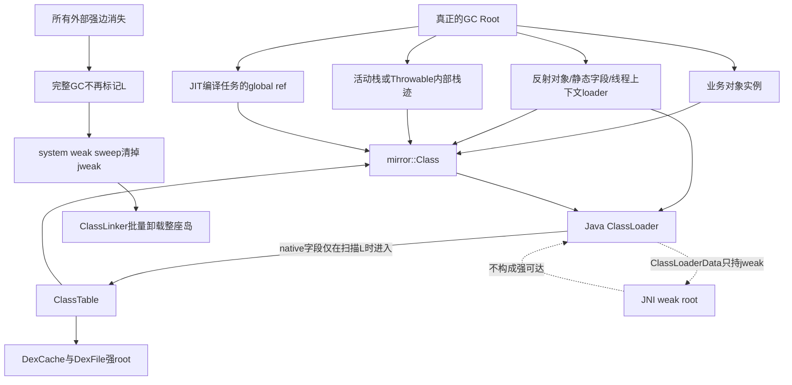
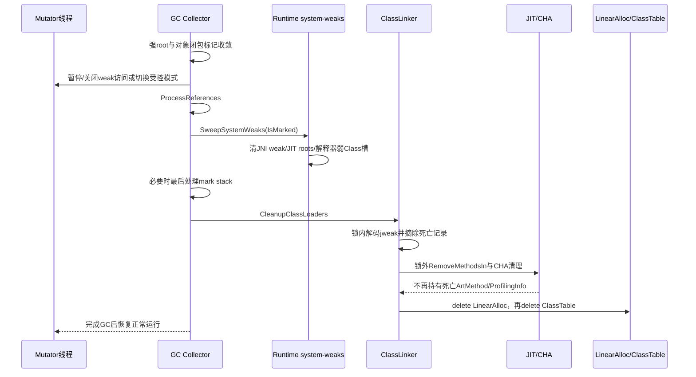
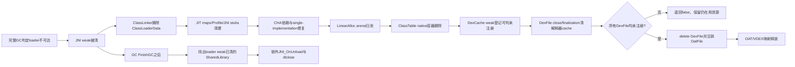

# 第571章 Android ART ClassLoader卸载链：LinearAlloc、ClassLoaderAllocator、弱Root、JIT/CHA/OAT与native库清理

> 源码基线：Android 11 `android-11.0.0_r48`。本章只在macOS上阅读、检索和静态验证源码，不运行ART测试、不编译AOSP。
>
> 本章主问题：一个应用ClassLoader什么时候才算真的不可达；ClassTable为什么既能强保活Class/DexCache又不会反过来永久保活loader；GC如何清掉`jweak`后通知ClassLinker；为何必须先清JIT、CHA和解释器中的裸指针再释放LinearAlloc；DEX/OAT/VDEX映射和JNI动态库又为什么不是在同一个函数中立即消失？

## 1. 先纠正五个最常见的误解

Class卸载的基本单位不是单个`Class`，而是定义它的一整座ClassLoader可达性孤岛。把Java局部变量设为`null`不等于loader已不可达，因为对象实例、静态字段、反射对象、活动栈、Throwable栈迹、JIT任务或JNI global都可能保活它。`System.gc()`只是请求，不保证某一次调用必然完成类卸载。`CleanupClassLoaders()`释放的是ClassTable与LinearAlloc等native元数据，不会在同一行代码里自动关闭所有DEX/OAT/VDEX和`.so`。最后，LinearAlloc被销毁也不等于RSS立即等量下降：arena通常先回到ART的ArenaPool等待复用。

## 2. 一句话总览

每个非Boot ClassLoader注册时获得一个JNI weak global、一个ClassTable和一个LinearAlloc；GC只从真正可达的Java ClassLoader对象进入其ClassTable，因而可达loader会把Class、DexCache等整座闭包标活，不可达loader则不会因native表里的循环自保。完整标记和Java引用处理结束后，ART暂停新的system-weak访问，清扫JNI weak、JIT root table与解释器弱缓存；weak loader被清成sentinel后，ClassLinker把对应记录摘链，在释放LinearAlloc前删除JIT代码、ProfilingInfo与CHA裸指针，随后才由DexFile关闭/终结收掉OAT映射，并在GC完全结束后执行`JNI_OnUnload`和`dlclose`。

## 3. 建立七本账再读源码

第一本是Java可达性账：谁仍能走到ClassLoader。第二本是托管闭包账：Class、实例、DexCache和ClassTable roots如何互相保活。第三本是native所有权账：ClassLoaderData、LinearAlloc、ClassTable和OatFile各由谁删除。第四本是弱引用账：Java WeakReference、JNI weak global、JIT弱Class槽不能混成一种结构。第五本是裸指针账：ArtMethod、ArtField、ProfilingInfo、CHA依赖和解释器cache何时失效。第六本是文件映射账：DEX、VDEX、OAT和native library有不同关闭者。第七本是完成点账：loader不可达、weak已清、metadata已删、文件已unmap、RSS下降分别是五件事。

## 4. 主要源码地图

注册、root访问和卸载主线在`art/runtime/class_linker.h/.cc`；Java ClassLoader访问native ClassTable的特殊GC逻辑在`runtime/mirror/class_loader.h`与`class_loader-inl.h`；ClassTable看`runtime/class_table.*`，LinearAlloc看`runtime/linear_alloc.*`、`libartbase/base/arena_allocator.*`和`runtime/base/mem_map_arena_pool.*`。GC时序看`gc/collector/mark_sweep.cc`、`concurrent_copying.cc`与`sticky_mark_sweep.cc`。JIT/CHA看`jit/jit_code_cache.*`、`jit/profiling_info.*`和`cha.*`；DEX/OAT收尾看`native/dalvik_system_DexFile.cc`与`oat_file_manager.*`；native库收尾看`jni/java_vm_ext.cc`。测试入口是`art/test/141-class-unload`、`616-cha-unloading`与`661-classloader-allocator`。

## 5. r48里的卸载单位为什么是ClassLoader

两个名字完全相同的Class只要定义loader不同，就具有不同的Java类型身份；同一loader定义的Class又共享ClassTable、LinearAlloc、DEX注册和大量解析元数据。若只单独删除一只Class，其他Class的super、interface、vtable、ArtMethod和DexCache可能仍指向它，清理代价与正确性都很难控制。ART因此等整只非Boot loader不可达，再批量销毁这座loader拥有的类元数据。

## 6. Boot ClassLoader为什么是例外

在ART内部，Boot ClassLoader常以`null`托管引用表示；它使用`boot_class_table_`和Runtime全局LinearAlloc，核心Class/Image对象也是全进程基础。`RegisterClassLoader()`只给非Boot Java loader创建独立的表与分配器。后文说“loader的weak root被清后卸载”，默认都指PathClassLoader、DexClassLoader等非Boot loader，不能套到Boot Class Path。

## 7. “类加载孤岛”比“一个loader对象”更准确

把一个非Boot loader想成岛门：门后是ClassTable中的Class和strong roots，每个Class又连接ArtMethod、ArtField、DexCache、静态字段及实例的klass边。岛内可以有大量环，但环本身不是GC root。只要岛外还有一条强边进入任意关键对象，最终通常能沿Class或其定义关系回到loader，整座岛继续活；所有外部强边都断开，岛内环才可整体消失。

## 8. 第一幅图：存活闭包与卸载边界



## 9. `ClassLoaderData`只有三项但承担三种角色

`ClassLinker::ClassLoaderData`保存`jweak weak_root`、`ClassTable* class_table`和`LinearAlloc* allocator`。weak root用于向GC询问Java loader是否仍活；ClassTable是该loader的类与DEX强root索引；LinearAlloc是其ArtMethod、ArtField等native metadata的批量分配域。三项都在C++对象里，但只有第一项参与弱可达性协议，后两项不能被误当作GC root。

## 10. 注册为什么使用JNI weak global

`RegisterClassLoader()`调用`AddWeakGlobalRef(self, class_loader)`，不是`AddGlobalRef`。若ClassLinker持有强global，每个曾经注册的loader都会被Runtime自己永久保活，卸载永远无法发生。weak global允许ClassLinker跨GC持有一个稳定句柄槽，同时让GC在loader不再可达时把槽内容改成cleared sentinel。

## 11. 注册还把两个native指针写回Java loader

注册流程新建`ClassTable`并调用`class_loader->SetClassTable()`，再由`Runtime::CreateLinearAlloc()`创建分配器并调用`SetAllocator()`，最后把三项记录压入`class_loaders_`。这些Java对象中的字段在mirror实现里是native-sized pointer，不是普通Java强引用。原始指针能让类链接快路径直接找表与分配器，却要求卸载时严格解决悬垂引用问题。

## 12. `class_loaders_`列表本身不会把loader标活

列表由`classlinker_classes_lock_`保护，元素中的`jweak`可被解码为loader或null。GC普通root访问不会无条件把所有元素提升成强root；否则第10节的weak设计就失去意义。只有特定root flag、tracing等特殊场景才会把这些loader显式标活。读“ClassLinker记住所有loader”时，一定要接着问它记住的是强root还是weak handle。

## 13. 每个loader为什么需要独立ClassTable

ClassTable以descriptor/hash组织该命名空间已定义的Class，还维护DexCache/DexFile相关strong roots和OAT BSS roots。独立表保证同名类按定义loader隔离，并让整个命名空间在loader死亡时一次删除。Boot使用全局表，普通loader使用自己的表；查ClassTable时`class_loader == nullptr`会走`boot_class_table_`。

## 14. ClassTable里的Class是强root吗

在“已经开始扫描一个活着的ClassLoader对象”这一前提下，是。`ClassTable::VisitRoots()`会访问类集合和strong roots，所以活loader不会只保住外壳却丢失它定义的Class。然而ClassTable的raw pointer不被ClassLinker当无条件GC root扫描；若loader本身未被标记，GC根本不会从这个raw pointer进入表。缺少这个前提，就会错误推导成“ClassTable永远自保”。

## 15. mirror ClassLoader有一条特殊的GC访问路径

`mirror::ClassLoader::VisitReferences<kVisitClasses>()`先访问普通实例字段；当模板参数允许访问native roots时，再取`GetClassTable()`并调用`VisitRoots(visitor)`。GC扫描普通对象时使用`Object::VisitReferences<kVisitNativeRoots=true>`，ClassLoader的特殊class flags会把这一意图转换为“同时扫描类表”。所以ClassTable的强闭包附着在Java loader的可达性上。

## 16. 为什么`ClassLoader ↔ ClassTable ↔ Class`环不会泄漏

GC只从root出发，不会因为native内存里存在一个raw pointer就自动开始遍历。若loader由外部root到达，扫描loader后进入ClassTable，整环被标活；若loader不可达，ClassLinker列表只剩jweak，GC不会从表开始，环中的Class和DexCache也不会获得标记。这里的关键不是“没有环”，而是“环没有独立的强root入口”。

## 17. 一个活实例为什么能阻止其定义loader卸载

每个Java对象头都能确定其`mirror::Class`；这个Class保存定义ClassLoader。于是业务对象实例可沿“instance → klass → classLoader”回到loader。即使代码从未显式保存ClassLoader变量，只要保留该loader所定义类的一个实例，loader就不应卸载，否则对象头中的klass和方法元数据会立刻成为悬垂指针。

## 18. Class对象本身也会保活loader

缓存`SomePluginClass.class`、反射API返回的`Class<?>`，或把Class放进静态Map，都直接保留mirror Class；Class再保留它的定义loader。排查插件卸载失败时，不能只搜索`ClassLoader`类型字段，还要搜索Class、Constructor、Method、Field、MethodHandle、Proxy Class及以Class为key的缓存。

## 19. 静态字段要区分“谁的静态字段”

loader定义类自己的静态字段位于这座孤岛内部，若没有外部root进入，并不会凭空保活自己；但Boot或长期存活loader中的静态集合若保存插件对象、插件Class或插件loader，就形成岛外强边。常见泄漏不是“插件类有static”四个字，而是生命周期更长的对象把短生命周期孤岛挂住。

## 20. Thread context ClassLoader是常见的外部入口

线程对象可能比一次插件任务活得久，其contextClassLoader若仍指向插件loader，会由线程相关root保活它。线程池、HandlerThread、Timer和自建native线程尤其容易产生这种寿命倒挂。类卸载测试通常使用短小局部作用域，并避免把loader写进全局线程设施，就是为了真正切断这些入口。

## 21. DexCache为什么被称为loader闭包中的strong root

ClassLinker注册DexFile时，会把对应DexCache加入该loader ClassTable的`strong_roots_`，并在非Boot loader上做写屏障。DexCache保存已解析String、Type、Field、Method和CallSite数组，还保存ClassLoader引用。它在loader活着时必须稳定；但它的强性依赖ClassTable只随活loader被访问，不是全Runtime永久root。

## 22. DexCache与ClassLoader互指也不构成外部root

DexCache指回ClassLoader，ClassLoader通过native表又能到DexCache，看起来是闭环；可达性规则仍与第16节相同。GC不会因“能从A走回A”就把A判活，必须先有root进入。理解这一点后，WeakReference<ClassLoader>被清与内部仍有复杂互指并不矛盾。

## 23. `DexCacheData`为什么同时缓存weak和raw信息

ClassLinker的DEX登记表使用DexCache的JNI weak引用，同时缓存`DexFile*`和`ClassTable*`等native信息。注释明确说明，若只是为了判断卸载状态而频繁解码weak root，read barrier可能意外参与标记、扰动类卸载；缓存raw键能在受控时机做查询。raw pointer提高效率，也意味着删除顺序必须由统一协议约束。

## 24. 清掉loader后DexCache登记不会总在同一刻物理擦除

ClassTable销毁使该loader的强roots消失，JNI weak DexCache随后可被清；`dex_caches_`中的已清条目可在后续注册/查询路径中惰性清理。不能把“ClassLoaderData已删除”说成每个全局容器已在同一指令完成压缩。判断资源能否关闭，应使用`IsDexFileRegistered()`等语义检查，而不是仅看某个vector大小。

## 25. 普通Class root与Boot Class root不能混称

`ClassLinker::VisitClassRoots()`无条件访问`boot_class_table_`的roots，因为Boot类是Runtime基础。非Boot loader的ClassTable则由活ClassLoader对象的特殊扫描进入。文档若笼统说“ClassLinker把所有ClassTable都当root”，会直接抹掉类卸载得以成立的设计边界。

## 26. 特殊`kVisitRootFlagClassLoader`会阻止卸载

当root访问flags包含`kVisitRootFlagClassLoader`时，ClassLinker遍历`class_loaders_`，解码每个weak root并把它作为VM internal root交给visitor。这个模式有明确用途：某些不具备完整新对象klass写屏障信息的收集阶段，需要保守保活loader。它不是普通完整GC的永久行为。

## 27. tracing开启时也会保活所有loader

r48在`VisitClassRoots()`中判断root flag之外还判断`tracing_enabled`；开启相应追踪时会标记所有ClassLoader，避免正在被跟踪的类/方法元数据在观察期间卸载。实验时若一边开启某些trace/debug能力，一边期待WeakReference立即清空，结果可能与无追踪环境不同。

## 28. array class查找缓存为什么选择丢弃而非标记

`ClassLinker::VisitRoots()`调用`DropFindArrayClassCache()`，源码注释说明不访问`find_array_class_cache_`，以免它阻止类卸载。这类cache应是可重建加速结构，不能因为曾查过某个数组Class就永久延长整只loader寿命。设计可卸载缓存时，“miss后重算”通常比“强保留所有命中”更安全。

## 29. Sticky Mark Sweep为何反而保活ClassLoader

Sticky GC只追踪最近分配对象与dirty card，不做完整堆闭包重建。对象分配时写入klass并不会为每次分配做card mark；若Sticky仅按dirty card扫描，可能看不到一个新对象通过klass保活loader，从而误卸载。r48的`StickyMarkSweep::MarkConcurrentRoots()`因此额外加入`kVisitRootFlagClassLoader`，宁可本轮不卸载，也不能错误释放。

## 30. 第一段r48真实Java：测试为何连续请求五次GC

`art/test/141-class-unload/src/Main.java`没有把一次`Runtime.gc()`当作强制完成协议，而是用多次请求降低其他线程短暂保活loader造成的测试偶发性。下面是逐字片段：

```java
    private static void doUnloading() {
      // Do multiple GCs to prevent rare flakiness if some other thread is keeping the
      // classloader live.
      for (int i = 0; i < 5; ++i) {
         Runtime.getRuntime().gc();
      }
    }
```

## 31. `System.gc()`为什么不是类卸载API

Java调用表达“希望进行GC”，具体选哪种collector、是否被策略抑制、当时是否仍有短暂root、是否完成finalization，都受Runtime状态影响。即使本次发生GC，Sticky路径也可能故意保活所有loader。正确表述是“完整且允许卸载的GC可以发现不可达loader”，不是“调用一次`System.gc()`就卸载Class”。

## 32. 先完成闭包标记才能处理weak

GC必须先从所有强root遍历对象图，处理card/mod-union、线程栈和Reference语义，才能知道loader究竟未标记还是暂时未扫描。过早读取jweak为null会把尚未访问到的活loader误删。MarkSweep和ConcurrentCopying虽然算法不同，但都把ClassLoader清理放在存活性收敛与system weak sweep之后。

## 33. system weak不是只有JNI weak global

ART把不应强保活对象、但内部保存对象地址的native容器统称为system-weak持有者。`Runtime::SweepSystemWeaks()`会清扫weak intern、MonitorList、JNI weak globals、allocation records、JIT root tables、各线程interpreter cache以及注册的其他system weak holder。Java `WeakReference`由ReferenceProcessor处理，概念相近但不是同一张表。

## 34. 为什么清扫时要限制新的system weak访问

如果mutator在GC判断“未标记”与容器更新之间还能无限读/注册weak项，可能把旧地址重新暴露或把新root漏在已收敛的mark stack之外。MarkSweep在暂停阶段调用`DisallowNewSystemWeaks()`，ConcurrentCopying则切换共享mark-stack模式并关闭每线程weak访问。协议目标是让“判断、更新、最后一次处理mark stack”形成闭合窗口。

## 35. Java Reference处理排在system weak之前

Soft/Weak/Finalizer/Phantom等Java Reference可能在处理时产生新的可达边或待入队状态，所以collector先`ProcessReferences(self)`，再清扫ART内部system weak。若倒序，某个内部槽可能依据不完整存活性被清。读GC代码应沿实际调用顺序，不要按名字把所有weak清理想成一次哈希表遍历。

## 36. JNI weak root何时真正变成“已清”

`SweepJniWeakGlobals(visitor)`用collector提供的`IsMarked`结果更新IndirectReferenceTable：活对象若移动则更新地址，死对象替换为cleared sentinel。之后`Thread::DecodeJObject(data.weak_root)`对已清weak返回null，`CleanupClassLoaders()`才据此判断loader死亡。ClassLinker不是自己重新跑一遍reachability算法。

## 37. `ProcessWeakClass()`为何看loader而不只看Class mark bit

JIT/解释器中的Class槽属于类卸载弱语义：它先取Class的定义loader。Boot Class的loader为null，或定义loader仍被标记时，槽保持并在Class移动后更新；定义loader未标记时，槽改成null或weak-class sentinel。这样整座loader闭包以同一生死边界处理，不会把某个偶然已标记Class和死亡loader拆开。

## 38. null与weak-class sentinel各有什么用途

ProfilingInfo inline cache可用null表示一个receiver Class槽失效；编译代码的root table和解释器cache则常写入`Runtime::GetWeakClassSentinel()`，区分“从未有值/其他语义”与“曾有Class但已因卸载清掉”。调用方必须识别sentinel，绝不能把它当真实mirror Class解引用。

## 39. JIT机器码中的Class常量不能强保活插件

优化代码root table可能嵌入Class或String。String在这里要求是strong intern，GC只在移动时更新；Class则通过`ProcessWeakClass()`按定义loader存活性更新或替换sentinel。若把JIT literal table当普通强root，任何曾被JIT编译代码引用的插件类都可能永久无法卸载。

## 40. ProfilingInfo inline cache也要清死亡Class

每个invoke点可记录有限个receiver Class，用于后续优化。`JitCodeCache::SweepRootTables()`遍历`profiling_infos_`的inline cache，对每个Class槽调用`ProcessWeakClass(..., update=nullptr)`。这一步只清托管Class值；ProfilingInfo本体是否属于将卸载ArtMethod，要在后面的`RemoveMethodsIn()`中另行删除。

## 41. 并发写inline cache为什么还需要时序约束

执行线程可能正在CAS写入新receiver Class，GC又要判断旧值是否活。r48的ProfilingInfo用原子操作并与suspend point/weak访问协议配合；源码注释提醒，刚看到的未标记值可能来自尚未经过暂停点的线程，真正清理要等线程进入受控状态。不能只看一个CAS就宣称并发竞态完全由容器锁解决。

## 42. 解释器cache只在GC时部分清扫

每线程InterpreterCache是按DEX指令地址索引的小型native cache。GC的`SweepInterpreterCache()`只识别`NEW_INSTANCE`、`CHECK_CAST`、`INSTANCE_OF`、`NEW_ARRAY`、`CONST_CLASS`等Class值，按weak-class规则处理；`CONST_STRING`只更新移动地址。ArtField、ArtMethod等其他opcode值与作为key的Instruction地址并未在这里全部清空。

## 43. ConcurrentCopying为何weak sweep后还处理一次mark stack

弱intern表的erase/hash操作可能触发对仍应存活String的标记，因而`SweepSystemWeaks()`之后mark stack可能重新出现元素。CC再调用一次`ProcessMarkStack()`并断言为空，才重新允许weak访问和清理ClassLoader。这个细节说明“扫完weak”仍不一定是标记收敛的最后一条语句。

## 44. 第二幅图：GC到ClassLinker删除的严格顺序



## 45. MarkSweep中的实际完成点

`MarkSweep::ReclaimPhase()`依次执行`ProcessReferences`、`SweepSystemWeaks`、`AllowNewSystemWeaks`，随后注释明确说system weaks已扫完，才能`CleanupClassLoaders()`；之后才进入heap bitmap锁清扫未标记对象并交换bitmap。这里允许新的system weak访问早于native metadata删除，但死亡loader的weak槽已先被稳定清空。

## 46. ConcurrentCopying中的实际完成点

CC先让mark stack收敛，禁用weak访问，再处理Java Reference与system weak，额外清空最后mark stack，重新允许weak访问，然后调用`CleanupClassLoaders()`，最后`DisableMarking()`。移动collector还要更新活对象新地址，所以weak槽“保留”不等于原指针原样不动；visitor会把它改到to-space地址。

## 47. SemiSpace也遵守同一语义边界

非并发SemiSpace的实现细节更短，但同样在引用/weak处理之后调用ClassLinker清理。由此可提炼跨collector不变量：先完成强存活性与weak槽更新，再以cleared ClassLoader jweak作为卸载信号。不要把某一collector的锁细节硬套到所有collector，却可以复用这个语义顺序。

## 48. `CleanupClassLoaders()`为什么先建`to_delete`

函数持有`classlinker_classes_lock_`时遍历`class_loaders_`，活weak继续保留，解码为null的记录复制到`to_delete`并从列表erase。真正`DeleteClassLoader()`在离开锁域后执行。源码注释直接说明这是为了避免JIT code cache的锁顺序违规；把复杂删除放在列表锁内可能与jit/cha锁形成死锁。

## 49. 摘链与销毁必须分成两个动作

摘链后，新查询不再把死亡loader当注册成员；但其LinearAlloc/ClassTable暂时还存在，供后续清理用来判断某个ArtMethod是否属于该分配域。销毁阶段可能遍历JIT map、CHA依赖和类表，耗时且需要其他锁。`to_delete`既保存必要指针，也把共享容器锁的临界区压到最小。

## 50. `DeleteClassLoader()`第一步删除哪个弱句柄

它先调用`DeleteWeakGlobalRef(self, data.weak_root)`释放JNI weak表中的句柄槽。注意对象此前已经因GC判死并清成sentinel；这里删除的是native handle资源，不是此刻才让Java loader变不可达。把这两步反过来说，会误解GC与ClassLinker的责任分界。

## 51. LinearAlloc到底存什么

LinearAlloc是每loader的native arena分配器，典型内容包括ArtMethod、ArtField、IMT、IMT conflict table及类链接所需的其他native metadata。它不在Java heap里，不由对象bitmap逐块sweep，也不是存放普通Java实例的malloc替代品。ArtMethod指针能被JIT、CHA、解释器或native调试结构缓存，因此释放前必须先清所有外部裸指针。

## 52. 为什么叫Linear

arena中的分配大体按指针向前推进，常见操作是`Alloc`、16字节对齐分配和`Realloc`；没有面向单个ArtMethod的通用`Free`。这种批量生命周期非常适合“所有类随loader一起生、一起死”。代价是loader存活期间个别废弃小块通常不能单独归还。

## 53. `Realloc`不能按libc realloc理解

LinearAlloc的`Realloc`可能为新尺寸重新分配并复制旧内容，旧arena片段并不会逐项free。调用者应把它视作arena内扩展/搬移辅助，而不是依赖原块即时回收。类链接阶段这种浪费可接受，因为最终以loader为单位回收整条arena chain。

## 54. `Contains()`与`ContainsUnsafe()`区别

`Contains()`会取得LinearAlloc自己的锁检查地址是否属于arena；`ContainsUnsafe()`省锁，只能在外层已保证没有并发修改、通常分配器即将删除时使用。`JitCodeCache::RemoveMethodsIn()`用它识别map里的ArtMethod/ProfilingInfo归属，因为ClassLoader已经摘链并处于受控GC清理阶段。

## 55. Boot和应用LinearAlloc的寿命不同

Boot loader元数据放在Runtime全局LinearAlloc，伴随Runtime；每个普通ClassLoader注册时调用`CreateLinearAlloc()`获得独立实例。因而判断一个ArtMethod是否属于将卸载loader，可以用allocator地址范围，而无需反复解码可能已清的loader weak root。JavaVM native library查找也利用allocator身份比较loader命名空间。

## 56. 删除LinearAlloc实际如何归还内存

LinearAlloc内部的ArenaAllocator析构时调用`pool_->FreeArenaChain(arena_head_)`。常规`MemMapArenaPool`不会逐块立即`munmap`，而是把整条arena链挂到`free_arenas_`，供下一次分配复用；只有precise tracking等特殊模式会直接delete各arena。因此卸载的直接保证是“旧metadata地址不再合法且内存归池”，不是“进程RSS立刻按同样字节数降低”。

## 57. `TrimMaps()`与`ReclaimMemory()`是后续层次

Arena进入free list后，`TrimMaps()`可对空闲arena执行`Release()`，通常借助madvise让物理页可回收；`ReclaimMemory()`则可删除free arenas。虚拟地址保留、物理页驻留与allocator可复用是不同指标。观察内存时至少区分Java heap、native allocated、PSS/RSS和映射列表。

## 58. arena复用为什么是安全性测试利器

若JIT或CHA遗漏了一个指向死亡ArtMethod的裸指针，而LinearAlloc内存从不复用，bug可能长期潜伏；一旦新loader在同一arena地址创建不同ArtMethod，旧指针会“看似有效”却指向错误内容。`616-cha-unloading`故意复用包含旧method的arena，再触发危险JIT条件，就是把潜在use-after-free变成稳定可见的错误。

## 59. 第二段r48真实Java：活实例必须保住loader

`art/test/141-class-unload/src/Main.java`通过另一个loader创建`IntHolder`实例并把它返回到长寿命调用方。逐字片段很短，却验证了第17节的核心边：实例不能在其Class/loader先被卸载后继续存在。

```java
    private static Object testNoUnloadHelper(ClassLoader loader) throws Exception {
        Class<?> intHolder = loader.loadClass("IntHolder");
        return intHolder.newInstance();
    }
```

## 60. 为什么必须先通知JIT再释放LinearAlloc

JIT的`method_code_map_`、`osr_code_map_`和`profiling_infos_`都可能以`ArtMethod*`为键或值；共享JNI stub也保存方法列表。若先delete allocator，这些容器下一次查询就会解引用已释放或已复用地址。`DeleteClassLoader()`因此先调用`JitCodeCache::RemoveMethodsIn(self, *allocator)`，确认外部代码缓存脱钩后才删除allocator。

## 61. 共享JNI stub为何需要逐方法移除

多个native ArtMethod可能因相同shorty等条件共享一段JNI stub。卸载某loader时，`RemoveMethodsIn`只从stub的方法列表中移除属于该LinearAlloc的项；若列表空，才把stub method header列入待释放集合；若仍有其他loader的方法，更新key中的shorty依据并保留代码。不能一看到一个死亡method就整段无条件free。

## 62. 普通JIT code map怎样识别死亡方法

`method_code_map_`从code pointer关联ArtMethod。清理遍历各项，对`alloc.ContainsUnsafe(it->second)`为真的项收集`OatQuickMethodHeader`并erase map entry。先从索引移除再释放底层code，避免新查找继续发现即将无效的代码。

## 63. OSR map为什么也必须删

OSR映射以ArtMethod为key，指向循环中途进入优化代码的入口。即使普通方法entrypoint已不再使用JIT代码，OSR map中的死亡ArtMethod key仍是悬垂指针。源码注释说明相应code header已由普通map循环收集，所以OSR循环主要erase索引，不重复加入free集合。

## 64. ProfilingInfo删除前为何先清ArtMethod回指

`ProfilingInfo`位于JIT writable data区，ArtMethod中又保存指向它的指针。对属于死亡allocator的方法，代码先`SetProfilingInfo(nullptr)`，再释放ProfilingInfo并从集合erase。虽然ArtMethod很快也要被删，先断开回指能维持清理期间的不变量，并防止诊断遍历读到已释放profile。

## 65. 为什么不等待一次code-cache GC来代劳

`RemoveMethodsIn()`不会等待正在进行的code-cache GC，而是同步、定向移除这个LinearAlloc拥有的方法，避免在类卸载清理中引入可能挂起线程的等待。这里还藏着一个r48源码漂移：函数内注释声称调用时持有`classlinker_classes_lock_`，但`CleanupClassLoaders()`的实际代码和头文件注解都要求先离开该锁再调用`DeleteClassLoader()`。因此可相信的不变量是“调用者未持jit锁、删除不等待未来JIT GC、ClassLinker列表锁外执行”，不能照抄那句旧注释推导当前锁状态。

## 66. method header释放前先清CHA依赖

`FreeAllMethodHeaders()`先在jit锁和cha锁下调用`RemoveDependentsWithMethodHeaders()`，随后移除native debug symbols，最后`FreeCodeAndData()`。源码强调code内存可能马上复用，同一header地址可能代表另一段编译代码；若CHA依赖还以旧header地址存在，会把新代码错认成旧依赖。

## 67. native debug信息也属于代码生命周期

JIT为调试/采样注册的mini-debug符号按code地址关联。释放机器码前批量`RemoveNativeDebugInfoForJit()`，否则unwinder或符号查询可能给复用地址返回旧方法名。类卸载正确性不仅是执行入口不崩，还包括诊断视图不引用死亡方法。

## 68. CHA的single implementation状态为何会受卸载影响

Class Hierarchy Analysis可能记录某虚方法在当前层次中只有一个实现，并据此允许JIT内联/去虚化。死亡Class的ArtMethod地址若仍挂在其他活Class的hierarchy状态里，arena复用后会指向任意新内容。卸载不是简单“类少了，假设更安全”；还必须消除指向被删实现的具体裸指针，并重新建立层次状态。

## 69. 正常卸载会遍历死亡loader的ClassTable

`DeleteClassLoader(..., cleanup_cha=true)`构造`CHAOnDeleteUpdateClassVisitor`，访问该ClassTable中所有Class，并调用`ResetSingleImplementationInHierarchy(klass, allocator, pointer_size)`。visitor知道死亡allocator范围，能清理层次中指向其中ArtMethod的状态。ClassLinker析构时所有loader一起删除，才传`cleanup_cha=false`跳过这项正常运行期维护。

## 70. 没有JIT时CHA依赖也不能漏

若Runtime没有JIT但仍有CHA，`DeleteClassLoader()`显式调用`RemoveDependenciesForLinearAlloc(data.allocator)`。有JIT时，`RemoveMethodsIn()`已负责移除编译code header相关依赖；无JIT时必须走手动分支。文档若只写“卸载通知JIT”，会漏掉解释/AOT配置下CHA自身的清理责任。

## 71. ClassTable为什么最后才delete

CHA的正常卸载visitor需要遍历ClassTable中的Class；因此表必须活到JIT/CHA清理完成。随后先delete LinearAlloc，再delete ClassTable，是r48的明确顺序。这里不是说ClassTable中的托管对象此刻由`delete`逐只释放——Java对象仍由GC回收；delete释放的是native表容器。

## 72. 活动ShadowFrame如何保活声明Class

GC线程栈root访问中，`ReferenceMapVisitor::VisitShadowFrame()`先取得方法并调用`VisitDeclaringClass(m)`，再遍历vreg引用。即使某解释方法当前没有任何局部变量直接指向自身ClassLoader，执行中的ArtMethod也要求其声明Class存活，否则方法元数据和DEX/code映射会在执行中途失效。

## 73. QuickFrame同样不能只依赖普通对象root map

编译帧的stack map主要描述对象寄存器/栈槽，但ArtMethod和code header属于native元数据。ReferenceMapVisitor也对QuickFrame对应方法访问声明Class，源码注释直接写明这是为了避免执行方法所属Class被卸载并保证code保持映射。类卸载安全因此是栈walk合同的一部分。

## 74. Throwable为什么能让旧Class长期存活

ART构建内部stack trace时，第一个数组元素保存ArtMethod指针与dex PC；其余元素逐帧保存ArtMethod的声明Class，注释明确说用于确保栈迹存活期间Class不被卸载。这样以后调用`getStackTrace()`或读取异常信息时，raw ArtMethod仍有托管Class保活锚点。

## 75. 只保存ArtMethod裸指针为什么不够

GC不知道PointerArray里的整数槽是ArtMethod，也不会由它自动追到ClassLoader；而ClassLinker判断loader生死只看Java可达性。若Throwable只保存raw method，loader可能被判死，LinearAlloc释放后栈迹再物化就发生use-after-free。额外的Class对象数组把native依赖转换成GC可见强边。

## 76. JIT任务为何临时创建global ref

`JitCompileTask`对非Boot、非precompile方法调用`AddGlobalRef`保存声明Class，任务析构再删除。编译队列可能异步执行，调用方早已丢掉loader局部变量；没有这条global ref，GC可能在编译器仍读取ArtMethod/Dex信息时卸载它。也因此排查“为何暂时卸不掉”要考虑JIT队列。

## 77. 测试为何会stop JIT或预先等待编译

`141-class-unload`测试OAT映射卸载前停止JIT，注释说避免JIT线程与工作队列人为保活Class；`616`则预先ensure JIT compiled，避免延迟任务阻挡loader卸载。多次GC并不能绕过一个合法global ref，只有任务完成并析构后强边才断开。

## 78. 反射对象的风险不止Class

`Method`、`Constructor`和`Field`镜像会关联声明Class及native成员标识；MethodHandle、CallSite、Proxy元数据也可能穿过Class边保活loader。一个长寿命框架若以方法签名或注解结果缓存这些对象，即使把原始loader字段清空，孤岛仍可能有入口。诊断应从GC root path而不是字段名猜测开始。

## 79. App Image在r48是一个重要限制

r48测试注释明确提到“app images will keep classes live (for now)”。App Image位于non-moving、immune的ImageSpace，其中对象不按普通可卸载loader对象那样被sweep；若该Image对象图保留应用Class/loader关系，就会让相应Class持续存活。因此不能把无App Image测试的卸载结论无条件外推到已采用App Image的类集合。

## 80. Class已卸载不等于磁盘DEX立即删除

到目前为止，ClassLinker已移除类命名空间和native metadata，但打开DEX/OAT的所有权还可能在`dalvik.system.DexFile` cookie、OatFileManager或Java finalization路径里。卸载是允许后续资源关闭的重要条件，不是对磁盘文件执行unlink。缓存文件是否存在与进程是否仍mmap它也完全不同。

## 81. 第三段r48真实Java：故意复用死亡ArtMethod的arena

`art/test/616-cha-unloading/src-art/Main.java`在确认WeakReference<ClassLoader>已清后，复用旧ArtMethod所在arena，再触发JIT。逐字片段用于暴露遗漏的CHA/JIT裸指针：

```java
    // Reuse the linear alloc used by the unloaded class loader.
    reuseArenaOfMethod(methodPtr);

    // Try to JIT-compile under dangerous conditions.
    ensureJitCompiled(Main.class, "targetMethodForJit");
    System.out.println("Done");
```

## 82. `DexFile.closeDexFile()`为何先清所有解释器cache

native close入口先调用`Thread::ClearAllInterpreterCaches()`，通过checkpoint让每线程执行`InterpreterCache::Clear`。原因写在源码里：cache可能保存DEX instruction地址，未来另一个DEX可能碰巧映射到同一地址。第42节的GC weak sweep只清Class/String值，无法覆盖所有key、ArtField和ArtMethod值；真正可能unmap DEX前必须整表清空。

## 83. 关闭一个cookie为何仍可能返回false

close遍历cookie中的多个native DexFile，仅当`ClassLinker::IsDexFileRegistered()`为false时才从long array清槽并delete DexFile；只要某DexCache仍登记，`all_deleted=false`，避免运行中代码继续使用已删DEX导致崩溃。Java层发出close请求不是无条件资源销毁命令，Runtime存活性检查拥有否决权。

## 84. OAT/VDEX何时真正unmap

只有cookie内所有DexFile都成功删除且`oat_file != nullptr`时，close才调用`OatFileManager::UnRegisterAndDeleteOatFile()`。OatFileManager的集合以`unique_ptr`持有注册OatFile，erase会触发对象析构并释放映射；关联VDEX映射也随拥有关系清理。这个动作不发生在`CleanupClassLoaders()`内部。

## 85. 为什么需要Java close/finalization收尾

ClassLoader不可达会使其持有的DexFile相关Java对象也可能不可达，但native cookie资源通常通过CloseGuard/finalizer或显式close路径释放。`141-class-unload`多次GC后还调用`System.runFinalization()`，再检查进程maps。于是测试链至少包含“卸载条件成立”和“资源拥有者执行关闭”两阶段。

## 86. `/proc/<pid>/maps`观察到的是什么

测试在Android/Linux读取maps，搜索`141-class-unload-ex.odex`与`.vdex`映射数量；它验证进程虚拟映射是否消失，不直接证明Java Class对象哪一刻变不可达。macOS没有同样的`/proc/<pid>/maps`接口，本章练习只读源码，不伪造这项运行结果。

## 87. 第三幅图：从类孤岛死亡到外部资源收尾



## 88. OatFile为何可能为同一文件建立多个映射实例

OAT加载代码允许在类卸载场景下强制重新映射同一artifact，因为每个ClassLoader实例可能需要独立的`.bss` DexCache数组与地址状态。不能仅按路径字符串推导“一个文件全进程只有一个OatFile对象”。卸载时应删除对应拥有实例，而不是误伤另一只活loader使用的映射。

## 89. native library也绑定ClassLoader命名空间

JavaVMExt的SharedLibrary保存加载它的ClassLoader `jweak`及`class_loader_allocator_`。动态native方法查找用声明ClassLoader的allocator地址比较，只搜索相同命名空间的库；这样避免为了相等判断反复解码weak root，也防止一个loader错误解析到另一个loader加载的同名JNI库。

## 90. Boot loader加载的native库为什么不在普通GC后卸载

SharedLibrary中的`class_loader`若是null jobject表示Boot ClassLoader。`UnloadNativeLibraries()`只处理“weak句柄非null且已清”的库，Boot库被明确跳过；它们在Runtime关闭的专门路径处理。null在这里代表Boot身份，不代表“一只普通loader已经死亡”。

## 91. `JNI_OnUnload`为什么不能拿着library锁调用

JavaVMExt先在`jni_libraries_lock_`内找出死亡loader对应库并从map erase，保存到本地vector；离开锁后将线程切到native状态，才调用每个库的`JNI_OnUnload`并delete SharedLibrary。第三方回调可能执行JNI、加载其他库或取得内部锁，锁内回调会带来重入和死锁风险。

## 92. native库卸载为何晚于ClassLinker清理

Heap在GC完成`FinishGC`、释放GC相关锁并处理必要引用队列后，才以ScopedObjectAccess调用`UnloadNativeLibraries()`。`JNI_OnUnload`可能分配对象或进入Runtime，不能在collector仍持关键锁、marking协议未结束时运行。因此weak已清只是候选信号，外部回调必须等安全完成点。

## 93. `dlclose`也不保证物理页立刻完全消失

删除SharedLibrary最终释放其handle，但系统动态链接器可能因其他引用、依赖库共享或平台策略保留映射/页缓存。ART保证的是自己这条loader所有权记录被清理并调用卸载协议，不能把任意RSS变化写成语言层承诺。验证应结合JNI_OnUnload日志、maps和引用计数背景。

## 94. 一个可操作的“不能卸载”排查顺序

先用WeakReference<ClassLoader>确认现象；再找Java GC root path，重点看线程、context loader、静态集合、Class/反射对象、实例和Throwable；随后排除JIT任务、debug/tracing、App Image及native global ref；确认发生的是允许卸载的完整GC；最后才检查ClassLinker、DexCache登记和资源close。反过来先盯RSS，往往把正常arena复用误判为泄漏。

## 95. Java WeakReference<ClassLoader>清空说明什么

它强烈说明Java可达性层已判loader死亡；也意味着ClassLinker自己的JNI weak通常会在相应system weak sweep中清。但它不单独证明LinearAlloc删除、OAT unmap、finalizer执行、JNI_OnUnload完成或OS已回收物理页。每个结论都需要对应层证据。

## 96. WeakReference<Class>清空与loader清空的关系

r48按loader孤岛卸载，非Boot Class通常随定义loader失去可达性；测试会分别持有WeakReference<Class>和WeakReference<ClassLoader>观察。但某个Class仍被外部强引用时，会通过定义关系保活loader，所以常规情况下不会出现“Class继续可用、其定义loader却安全删除”的状态。

## 97. global JNI引用是最强的隐藏入口之一

native代码若对插件对象、Class或ClassLoader创建global ref而不删除，Java heap dump中可能只显示JNI global root，看不到普通Java字段来源。weak global不会强保活，但读取weak时也必须遵守ART weak访问协议。排查第三方JNI时应审计`NewGlobalRef/DeleteGlobalRef`配对，而非只看`JNI_OnUnload`是否存在。

## 98. 执行中的方法为什么必然构成保活证据

无论解释、JIT还是AOT，当前frame仍需要ArtMethod、声明Class、DEX PC映射或code header。线程root walk显式访问声明Class，正是把这种native执行依赖呈现给GC。若采样恰好发现插件线程还在执行，loader未清是正确结果，不是collector保守过头。

## 99. 锁顺序是本章隐藏的主线

ClassLinker先锁内摘链、锁外进JIT；JIT释放header时按jit锁再cha锁；JavaVMExt锁内摘库、锁外调用第三方；DexFile close通过checkpoint先让线程清cache。每一步都在把“共享索引更新”和“复杂/可重入销毁”分离。理解锁边界比只背函数名更能解释为什么代码分散在多个阶段。

## 100. use-after-free比内存泄漏更危险

若清理太保守，代价通常是loader和内存暂时保留；若清理太激进或漏清一个裸指针，arena/code地址复用后可能执行错误方法、读取错误Class甚至产生难复现崩溃。ART在Sticky GC、tracing、运行中frame和DexFile注册检查上选择保守，优先保证不会过早卸载。

## 101. “卸载成功”的五级证据

第一级：业务已断开预期强引用。第二级：WeakReference<ClassLoader>为null。第三级：ClassLinker记录、JIT/CHA与LinearAlloc已清理。第四级：DexFile/OAT/VDEX和native library拥有者已关闭。第五级：maps或内存指标观察到映射/物理页变化。上一级通常是下一级前提，但它们不是同一时刻，也不是一条日志能全部证明。

## 102. 重复创建loader为何是好压力测试

单次卸载可能因地址未复用而掩盖悬垂指针，也看不出ClassLoaderData、ProfilingInfo或OatFile集合是否线性增长。循环创建、使用、丢弃loader，再周期性完整GC并触发JIT/反射/DEX关闭，能同时暴露泄漏和错误复用。r48的`141`做100轮stress，`661`在卸载后遍历profiles验证旧copied methods不会让它崩溃。

## 103. `661-classloader-allocator`验证什么

测试由PathClassLoader加载`p1.OtherClass`并JIT编译`foo`，随后停止JIT、多次GC、重新启动JIT，再调用native `fetchProfiles()`遍历ProfilingInfo。历史错误会留下属于已卸载copied method的profile指针；测试关注的不是WeakReference输出本身，而是后续native遍历仍安全。

## 104. `141-class-unload`覆盖的边界比名字更广

它检查Class与ClassLoader weak清空、活实例阻止卸载、JNI_OnLoad/OnUnload、Throwable栈迹保活、反复加载压力、OAT/VDEX maps消失以及Sticky GC对象通过klass保活loader。阅读测试能看到设计不变量如何组合，比孤立阅读`CleanupClassLoaders()`更接近真实行为。

## 105. 为什么测试要让类初始化重新执行

新ClassLoader再次加载同名`IntHolder`会得到新的Class身份，其静态字段与`<clinit>`属于新孤岛。测试先修改旧类静态值，再创建新loader观察初始值，可验证旧Class未被错误复用。类名和DEX位置相同也不能跨loader复用mirror Class。

## 106. 内存分析时不要只看Java heap

Class卸载释放的重点包括LinearAlloc arena、JIT code/data、ClassTable native容器、DEX/OAT映射和`.so`handle，其中大量不计入普通Java object heap。Java heap下降不明显不能否认native元数据已清；RSS不降也可能只是arena进入free pool。应按第3节的不同账分别取证。

## 107. 本章对业务插件框架的直接启示

要让动态模块可卸载，应让ClassLoader、其Class/反射对象和实例都服从同一短生命周期；停止模块线程，清context loader和ThreadLocal，注销回调/监听器，清理长寿命静态缓存与JNI globals，关闭显式DexFile/资源句柄，并避免把异常对象无限期留在全局日志队列。仅调用`close()`或设loader变量为null都不足够。

## 108. 不应在产品逻辑中依赖强制类卸载

Java/Android没有面向应用的“现在卸载这个ClassLoader”确定性API；GC策略、JIT任务、App Image、系统root与finalization都可能推迟它。业务正确性必须在loader未卸载时仍成立，卸载只用于资源回收。若必须确定释放外部资源，应提供显式生命周期方法，而不是等待GC触发JNI_OnUnload。

## 109. 推荐的源码单步阅读链

先读`RegisterClassLoader()`和ClassLoader mirror访问，回答表为何既强又不自保；再读collector的Reference/system weak/Cleanup顺序；接着读`CleanupClassLoaders()`与`DeleteClassLoader()`；然后沿`JitCodeCache::RemoveMethodsIn()`、CHA和ArenaAllocator析构追裸指针；最后读`DexFile_closeDexFile()`、OatFileManager和JavaVMExt native库卸载。每一步都写下“谁拥有、谁只引用、何时可删”。

## 110. 一条完整案例：短命插件正常卸载

应用创建PathClassLoader，定义Plugin并JIT执行；注册阶段获得ClassTable/LinearAlloc，JIT任务结束后删除临时global ref。应用停止线程、移除回调和实例，Throwable也不再保存插件帧；一次允许卸载的完整GC不再标记loader，system weak清其jweak，ClassLinker先清JIT/CHA再归还arena。DexFile终结/close清线程cache并注销OAT，GC结束后JavaVMExt锁外调用插件库`JNI_OnUnload`。任何一步仍有合法强边，链都会安全停在更早位置。

## 111. macOS只读练习说明

下面四个练习只用`rg`、`sed`、`test`和shell逻辑读取本地r48源码；不触发GC、不运行ART test、不读取Linux `/proc`，也不编译AOSP。四条链依次验证ClassLoader闭包、collector弱引用顺序、LinearAlloc/JIT/CHA删除、DEX/OAT/native库收尾。每个脚本只有关键锚点全部存在才打印`OK`。

## 112. 练习一：核对weak注册与ClassTable闭包

```bash
#!/bin/bash
set -eu
src=/Users/ninebot/androidSource
cl="$src/art/runtime/class_linker.cc"
mi="$src/art/runtime/mirror/class_loader-inl.h"
rg -n "RegisterClassLoader|AddWeakGlobalRef|SetClassTable|SetAllocator" "$cl" | sed -n '1,100p'
rg -n "VisitReferences|VisitInstanceFieldsReferences|VisitRoots" "$mi" | sed -n '1,80p'
rg -n "kVisitRootFlagClassLoader|tracing_enabled|DropFindArrayClassCache" "$cl" | sed -n '1,120p'
rg -q "AddWeakGlobalRef" "$cl"
rg -q "class_table->VisitRoots" "$mi"
rg -q "DropFindArrayClassCache" "$cl"
echo 'OK: loader弱注册、活loader的ClassTable强闭包与特殊保活分支已核对'
```

读完回答：ClassTable里的Class何时是强root；为何`class_loaders_`保存raw表指针却不让loader永久存活；Sticky/tracing为何可能推迟卸载。

## 113. 练习二：核对GC、system weak与Cleanup先后关系

```bash
#!/bin/bash
set -eu
src=/Users/ninebot/androidSource
ms="$src/art/runtime/gc/collector/mark_sweep.cc"
cc="$src/art/runtime/gc/collector/concurrent_copying.cc"
rt="$src/art/runtime/runtime.cc"
rg -n "ProcessReferences|SweepSystemWeaks|AllowNewSystemWeaks|CleanupClassLoaders" "$ms" | sed -n '1,140p'
rg -n "ProcessReferences|SweepSystemWeaks|ProcessMarkStack|CleanupClassLoaders" "$cc" | sed -n '1,180p'
rg -n "Runtime::SweepSystemWeaks|SweepJniWeakGlobals|SweepRootTables|SweepInterpreterCaches|ProcessWeakClass" "$rt" | sed -n '1,160p'
rg -q "Clean up class loaders after system weaks" "$ms"
rg -q "CleanupClassLoaders" "$cc"
rg -q "SweepRootTables" "$rt"
echo 'OK: 强闭包、Java Reference、system weak和ClassLoader删除的顺序已核对'
```

把MarkSweep和ConcurrentCopying各写成一行时序；特别标出CC为何在weak sweep后还要最后处理mark stack，以及`ProcessWeakClass`为何检查定义loader。

## 114. 练习三：核对JIT/CHA先清与arena归池

```bash
#!/bin/bash
set -eu
src=/Users/ninebot/androidSource
cl="$src/art/runtime/class_linker.cc"
jit="$src/art/runtime/jit/jit_code_cache.cc"
arena="$src/art/libartbase/base/arena_allocator.cc"
pool="$src/art/runtime/base/mem_map_arena_pool.cc"
rg -n "CleanupClassLoaders|to_delete|DeleteClassLoader|RemoveMethodsIn|cleanup_cha" "$cl" | sed -n '1,180p'
rg -n "JitCodeCache::RemoveMethodsIn|method_code_map_|osr_code_map_|profiling_infos_|FreeAllMethodHeaders" "$jit" | sed -n '1,200p'
rg -n "ArenaAllocator::~ArenaAllocator|FreeArenaChain" "$arena" "$pool" | sed -n '1,120p'
rg -q "Do the delete outside the lock" "$cl"
rg -q "RemoveDependentsWithMethodHeaders" "$jit"
rg -q "free_arenas_ = first" "$pool"
echo 'OK: 锁外删除、JIT/CHA脱钩、LinearAlloc析构与arena复用已核对'
```

解释为什么不能先delete LinearAlloc再遍历JIT map；再说明arena进入`free_arenas_`与RSS立即下降有何区别。

## 115. 练习四：核对DEX/OAT与native库的后续收尾

```bash
#!/bin/bash
set -eu
src=/Users/ninebot/androidSource
dex="$src/art/runtime/native/dalvik_system_DexFile.cc"
vm="$src/art/runtime/jni/java_vm_ext.cc"
heap="$src/art/runtime/gc/heap.cc"
rg -n "DexFile_closeDexFile|ClearAllInterpreterCaches|IsDexFileRegistered|UnRegisterAndDeleteOatFile" "$dex" | sed -n '1,160p'
rg -n "UnloadNativeLibraries|IsJWeakCleared|JNI_OnUnload|ScopedThreadSuspension" "$vm" | sed -n '1,200p'
rg -n "FinishGC|UnloadNativeLibraries" "$heap" | sed -n '1,140p'
rg -q "Only delete the dex file if the dex cache is not found" "$dex"
rg -q "Do this without holding the jni libraries lock" "$vm"
rg -q "UnloadNativeLibraries" "$heap"
echo 'OK: 解释器cache清空、DEX注册门禁、OAT注销和锁外JNI_OnUnload已核对'
```

最后分别指出：ClassLoader weak已清、LinearAlloc已删、OAT已unmap、`JNI_OnUnload`已执行由哪个阶段证明；不要把四个完成点合并。

## 116. 推荐阅读顺序与停靠点

第一次只读第9—29节，画出loader闭包；第二次读第31—50节，手写collector时序；第三次读第51—71节，追每个ArtMethod裸指针如何退出；第四次读第72—93节，补齐栈、Throwable、JIT任务、DEX/OAT和native库。若中途暂停，恢复时先看`00-学习进度.md`，再从尚未回答的“谁保活、谁拥有、谁清理、何时完成”继续。

## 117. 本章复读后主动修正的易混表述

第一，ClassTable对Class的强保活只在活ClassLoader被扫描时成立，不是全局永久root。第二，Sticky GC会保守保活loader，不能说每次GC都可卸载。第三，JIT root table按loader生死处理Class，而String因strong intern只更新移动地址。第四，GC只部分清解释器cache，DEX可能unmap前才全量checkpoint清空。第五，LinearAlloc析构把arena归池，不保证即时RSS下降。第六，ClassLinker清理不直接unmap OAT/VDEX。第七，native库卸载在`FinishGC`后且锁外调用JNI_OnUnload。第八，App Image在r48可能持续保活相应Class。第九，`RemoveMethodsIn()`内部“持有classlinker锁”的注释与同版本调用代码、锁注解不一致，本章采用后两者并明确记录这个源码漂移。

## 118. 自测题

为什么`ClassLoader → ClassTable → Class → ClassLoader`没有自动泄漏？为何活实例、活动方法和Throwable都能阻止loader卸载？为什么JIT root table里的Class不是普通强root？`RemoveMethodsIn`为何必须早于arena释放？GC weak sweep与DexFile close分别清解释器cache的哪些内容？WeakReference已null而OAT maps仍存在是否矛盾？能按“托管可达性、system weak、裸指针、资源所有权”四层回答，就抓住了主线。

## 119. 一张可长期复用的心智模型

把非Boot ClassLoader看成一座带批量native仓库的可达性孤岛。Java loader是岛门，只有GC从外部root走到岛门时，才通过特殊扫描进入ClassTable并保活全岛；ClassLinker手里的只是门牌号式jweak。门消失后，GC先擦掉所有观察这座岛的weak槽，ClassLinker再按“索引 → JIT/CHA裸指针 → LinearAlloc → ClassTable”顺序拆岛；DEX/OAT和`.so`由各自拥有者在更晚的安全点撤场。任何内存指标都只是某一层的观测，不是整条链的唯一真相。

## 120. 下一章预告与进度锚点

下一章转到ART Runtime自身的启动分阶段：`Runtime::Create/Init/Start`怎样建立线程、Heap、ClassLinker与JIT，WellKnownClasses和JNI native注册何时可用，Zygote fork前后哪些状态必须切换，以及“Runtime已创建”“Java世界可执行”“Zygote子进程已完成初始化”分别由什么完成点证明。恢复时以`00-学习进度.md`为准；本章完成标志是120节、三幅Mermaid、三段逐字r48 Java源码、四个macOS只读练习及复读校验全部通过。
