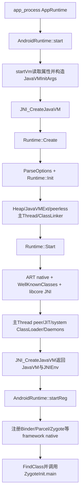
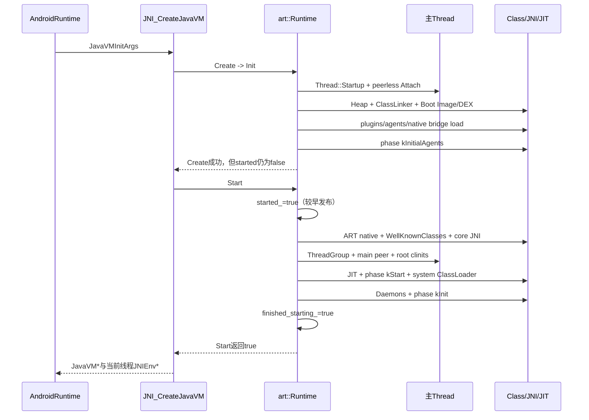
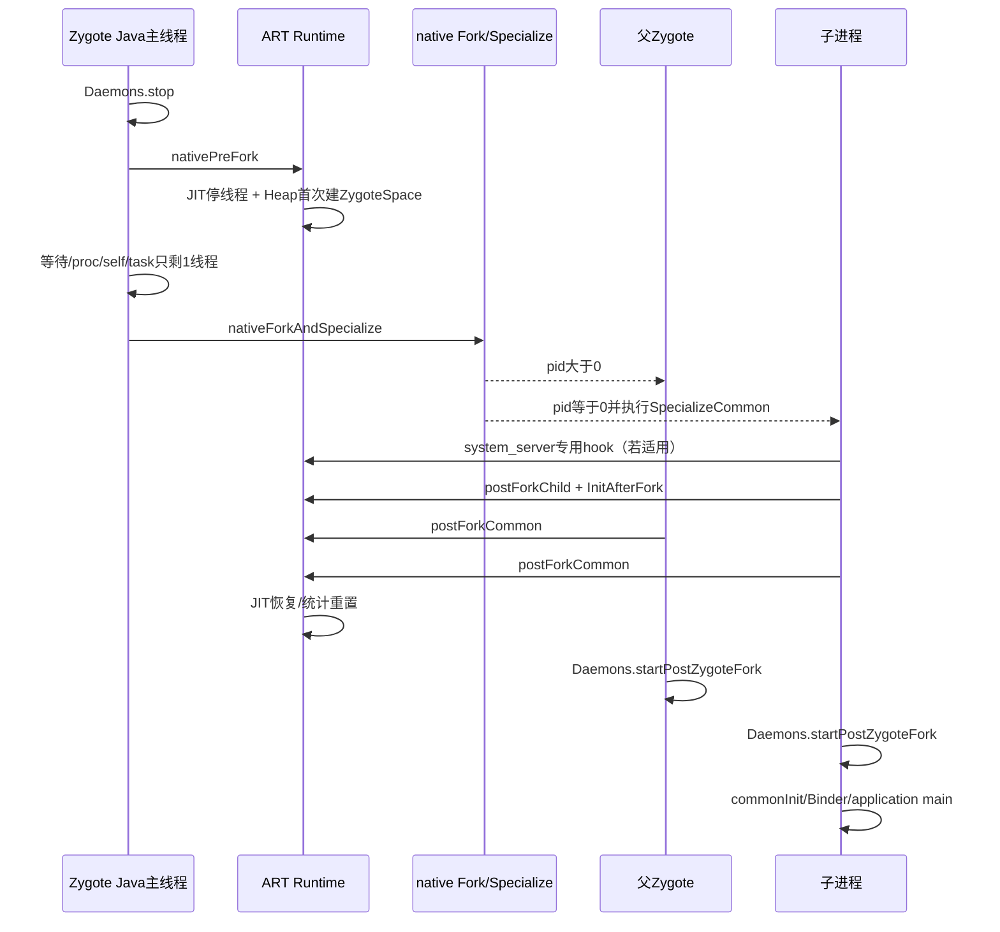

# 第572章 Android ART Runtime启动链：Create、Init、Start、WellKnownClasses、JNI注册与Zygote fork前后

> 源码基线：Android 11 `android-11.0.0_r48`。本章在macOS上只读源码和运行检索脚本，不启动Android Runtime、不执行Zygote fork，也不编译AOSP。
>
> 本章主问题：`app_process`怎样从系统属性拼出VM参数，经`JNI_CreateJavaVM`创建ART单例；`Runtime::Init()`和`Start()`各建立哪些设施；为什么ART runtime native、libcore JNI和framework JNI必须分批注册；WellKnownClasses为何还分Init与LateInit；Zygote为何先允许Runtime启动线程、预加载时禁止新线程、每次fork前再停Daemon；父子进程又如何分别恢复JIT、GC、SignalCatcher、Debugger、Binder和Java入口？

## 1. 先纠正六个最常见的误解

`Runtime::Create()`不等于Java `main()`已经开始，它只建立单例并调用`Init()`；通常是`JNI_CreateJavaVM()`随后调用`Start()`。`Runtime::Init()`不是Framework的`RuntimeInit.commonInit()`，两者目录、语言和时机都不同。`started_ = true`出现在`Start()`前段，不表示Daemon、system ClassLoader和初始化phase都已完成。`ZygoteInit.nativeZygoteInit()`也不是“初始化Zygote里的ART”，在`app_process`实现中它转到`AppRuntime::onZygoteInit()`启动Binder线程池。最后，Zygote不是从启动到退出都单线程：Runtime先启动Java Daemon，每次fork前停掉并等待OS线程收敛，fork后父子再恢复。

## 2. 一句话总览

`app_process`的`AndroidRuntime::startVm()`把系统属性、命令行与回调组织成JNI options，`JNI_CreateJavaVM()`先`Runtime::Create()`完成MemMap、Heap、JavaVMExt、peerless主Thread、ClassLinker/Boot Image、预分配异常、插件和agent等Init阶段，再`Runtime::Start()`提前发布`started_`，注册ART native、缓存WellKnownClasses、加载三组libcore JNI、初始化线程组/主线程peer、创建JIT与system ClassLoader并启动Daemons。之后`AndroidRuntime::startReg()`才注册Binder/Parcel/Zygote等framework native并进入`ZygoteInit.main()`；每次fork由`ZygoteHooks.preFork()`停Daemon/JIT线程，Heap只在第一次pre-fork时把预加载对象整理为共享ZygoteSpace，子进程先执行postForkChild差异化初始化，父子再由postForkCommon重建公共线程设施。

## 3. 建立八本账再读源码

第一本是入口账：`app_process`、JNI Invocation、ART Runtime、Java main谁调用谁。第二本是状态账：instance存在、Init返回、`started_`、`finished_starting_`、JNI Create返回与更晚的`startup_completed_`并非同一时刻。第三本是对象账：Heap、JavaVMExt、Thread、ClassLinker和Java peer的创建依赖。第四本是注册账：ART native、libcore JNI_OnLoad、framework native三批不能混。第五本是缓存账：WellKnown class global、method/field ID与LateInit。第六本是线程账：main thread、Java Daemons、JIT/GC池、SignalCatcher、Debugger、Binder线程池。第七本是fork账：一次性preload前、每次preFork、child hook、common hook。第八本是进程角色账：Zygote、普通app、system_server、child zygote、独立dalvikvm路径不同。

## 4. 主要源码地图

外层入口看`frameworks/base/cmds/app_process/app_main.cpp`和`frameworks/base/core/jni/AndroidRuntime.cpp`；JNI Invocation桥看`art/runtime/jni/java_vm_ext.cc`。ART主线是`art/runtime/runtime.cc/.h`，线程bootstrap看`runtime/thread.cc`，类缓存看`well_known_classes.cc/.h`，ART native注册看`runtime/native/*`。Java Zygote时序在`frameworks/base/core/java/com/android/internal/os/ZygoteInit.java`、`Zygote.java`、`RuntimeInit.java`与`libcore/dalvik/.../ZygoteHooks.java`；对应native fork和ART post-fork分别在`frameworks/base/core/jni/com_android_internal_os_Zygote.cpp`与`art/runtime/native/dalvik_system_ZygoteHooks.cc`。

## 5. 最外层为什么从`app_process`开始

Android系统的Zygote由native可执行程序`app_process`进入。其`AppRuntime`继承`AndroidRuntime`，重写`onZygoteInit()`、`onStarted()`等平台钩子。`AndroidRuntime::start()`负责创建VM、注册framework JNI、构造Java参数数组并反射调用指定类的`main()`；Zygote配置下这个类是`com.android.internal.os.ZygoteInit`。

## 6. `AndroidRuntime`和`art::Runtime`不是同一个对象

`android::AndroidRuntime`位于framework native层，关心系统属性、framework JNI及调用Java入口；`art::Runtime`是虚拟机核心单例，拥有Heap、ClassLinker、线程列表、JIT和JavaVMExt。前者通过标准`JNI_CreateJavaVM()`进入后者。遇到`Runtime`字样先看命名空间和文件路径，否则很容易把framework回调当成ART内部状态机。

## 7. `startVm()`的参数来自哪里

它读取`dalvik.vm.*`、`ro.*`、server configurable flags、设备ABI、low-RAM、debuggable、native bridge等配置，并追加`-Xms/-Xmx`、GC、JIT、JDWP、CheckJNI、Boot Image与compiler options。还把`exit`、`vfprintf`和sensitive-thread回调作为`extraInfo`传入。参数顺序有覆盖语义，源码特意把`dalvik.vm.extra-opts`放在较后位置。

## 8. 第一幅图：从app_process到可调用Java main



## 9. `JniInvocation`解决的是实现库选择

`AndroidRuntime::start()`先创建`JniInvocation`并`Init(NULL)`，由它装载并解析当前设备选择的JNI实现，随后调用的`JNI_CreateJavaVM`落到ART导出符号。它不是JavaVM本身，也不创建Heap；它是framework与具体VM实现之间的动态调用门面。

## 10. JNI Invocation接口怎样转成ART参数

`art/runtime/jni/java_vm_ext.cc`中的`JNI_CreateJavaVM()`先校验JNI版本，把`JavaVMInitArgs.options`逐项转换成`RuntimeOptions`，保留optionString与extraInfo，然后调用`Runtime::Create(options, ignore_unrecognized)`。因此AndroidRuntime拼参数与ART解析参数是两个不同责任层。

## 11. 一个进程为什么只能创建一只ART Runtime

`Runtime::Create(RuntimeArgumentMap&&)`先检查静态`Runtime::instance_`；非null直接返回false。随后`new Runtime`并把它发布到`instance_`，再调用成员`Init()`。JNI的`JNI_GetCreatedJavaVMs()`也只返回0或1只VM。Android应用不是每个ClassLoader一台虚拟机，而是每进程共享一只Runtime。

## 12. `ParseOptions()`为什么先初始化Locks和Logging

Raw options重载先调用`Runtime::ParseOptions()`；它执行`Locks::Init()`与`InitLogging()`，再交给`ParsedOptions::Parse()`。许多后续错误路径、线程和容器构造都会记录日志或使用全局锁，所以这一步必须早于Runtime主体。`AndroidRuntime::startVm()`传来的`ignoreUnrecognized`在r48设置为false，未知参数可令创建失败。

## 13. 单例先发布再Init有什么含义

`instance_ = new Runtime`发生在`Init()`之前，因为初始化中的大量静态函数会调用`Runtime::Current()`取回正在构造的Runtime。这意味着“`Current()!=nullptr`”只证明对象地址已发布，不证明Heap/ClassLinker/JavaVM可用。源码中的安全检查往往还要求`IsStarted()`且未shutdown。

## 14. r48的Init失败路径并不完整析构

若`Init()`返回false，`Create()`把`instance_`重置为null，但注释说明当前直接delete会在析构中abort，因此选择泄漏并留下TODO。学习时不能写成“失败自动完全回滚所有已构造资源”。这是启动失败路径的已知工程折中，不影响正常成功路径的状态顺序。

## 15. `Runtime::Init()`和`Runtime::Start()`的根本区别

Init搭建能加载类、分配对象和继续bootstrap的底座，过程中主线程可临时进入Runnable，但还没有把Runtime标为started，也没有完成核心JNI、Java peer、JIT和Daemon。Start允许执行更多Java初始化与JNI_OnLoad，建立对外可工作的运行态。`Runtime::Create()`只包Init；`JNI_CreateJavaVM()`明确在其后再调用Start。

## 16. 环境快照为何是Init第一步

`env_snapshot_.TakeSnapshot()`保存Runtime创建时环境，供后续Exec等路径使用，避免子进程运行期间`LD_LIBRARY_PATH`等变量被修改后污染预期。它不等于Zygote fork的内存快照；只是字符串环境账，时机在大量Runtime组件创建之前。

## 17. MemMap与sentinel fault page为什么很早

Init先`MemMap::Init()`，并尝试在`Context::kBadGprBase`附近映射一页`PROT_NONE`的保护页，用于被破坏寄存器和sentinel地址触发明确fault。若无法映到期望地址只记录warning并reset，不一定导致Runtime创建失败。它是故障诊断设施，不是Java heap第一页。

## 18. Boot Class Path为空时还能从哪里恢复

若options未直接给BCP，Init要求至少有image location，再从系统Boot Image对应OAT Header的`kBootClassPathKey`提取路径。image与BCP都不足时返回false。路径解析成功也还没有加载全部Class；真正ImageSpace/DEX和ClassLinker接管发生在Heap/ClassLinker阶段。

## 19. Zygote身份在Init时就固定

`is_zygote_`来自`-Xzygote` option，primary zygote另有`-Xprimaryzygote`。这两个标志影响JDWP默认、native bridge、Heap布局、Start中是否立即执行non-zygote初始化，以及fork hook断言。应用子进程继承Runtime对象后再由post-fork设置为Zygote child/system_server等角色，不是重新解析一份完整VM参数。

## 20. 基础native容器的构造顺序

Init创建OatFileManager、JniIdManager、MonitorList/MonitorPool、ThreadList与InternTable，并解析验证、hidden API、core-platform API、JIT及调试策略。它们互相有依赖：Heap需要BCP与collector策略，ClassLinker需要InternTable和已attach线程，JavaVMExt又要在Thread的JNIEnv构造前存在。

## 21. Heap构造已经做了很多事但Java世界仍未完成

`new gc::Heap(...)`消费内存上下限、collector、LOS、TLAB、并行线程数、Boot Image位置等几十项参数，并尝试建立Boot Image/space。此时可以检查`HasBootImageSpace()`，但没有ClassLinker就还不能完成Class查询；更没有WellKnownClasses与Java Daemon。Heap存在只是一个阶段性底座。

## 22. 没有Boot Image是否必然启动失败

不一定。若`allow_dex_file_fallback_`为true，可从Boot DEX建立ClassLinker；若显式禁用fallback且Heap没有Boot Image，Init才返回false。无Image路径会更慢并需要自行创建class roots、callee-save methods和预分配异常，语义目标仍是可运行Runtime。

## 23. Init解析JIT选项却尚未创建JIT

`JitOptions::CreateFromRuntimeArguments()`在Init中生成策略对象；dex2oat Runtime会强制关闭JIT编译和profile保存。真正`CreateJitCodeCache()`与`CreateJit()`在Start后段，必须等ThreadGroup和主线程peer准备好。看到`jit_options_`非null不能推断编译线程已经启动。

## 24. ArenaPool为什么按compiler与Runtime分流

AOT compiler使用较快的MallocArenaPool，普通Runtime使用可trim的MemMapArenaPool，并为JIT metadata另建命名pool；64位AOT还可能建low-4GB pool。随后创建Runtime全局LinearAlloc。它先于ClassLinker存在，因为ClassLinker装载Boot元数据时会需要这些native分配域。

## 25. signal handler与SignalCatcher不是同一件事

Init会`BlockSignals()`、安装平台signal handlers和FaultManager中的suspend、stack-overflow、null-check等handler。`SignalCatcher`对象则在`InitNonZygoteOrPostFork()`中为非Zygote角色创建，用来处理SIGQUIT等请求。Zygote父进程不应在fork前保有这条常驻线程。

## 26. JavaVMExt何时出现

在attach主线程之前，Init通过`JavaVMExt::Create(this, runtime_options, &error_msg)`建立JavaVM及全局/弱全局引用表、JNI函数表和CheckJNI配置，并注册JNIEnv environment hook。它是`JavaVM*`的ART实现拥有者；每线程`JNIEnvExt`随后随Thread attach创建。

## 27. `Thread::Startup()`只初始化线程子系统

它设置静态started标志、创建resume condition和pthread TLS key，并检查新TLS槽为空。此时还没有当前`art::Thread`对象。随后`Thread::Attach("main", false, nullptr, false)`才为当前pthread建立主Thread和JNIEnv。

## 28. 为什么主线程最初没有Java peer

ClassLinker需要一个已attach线程才能创建/访问对象，但Java Thread与ThreadGroup类尚未完全可用，形成bootstrap环。Init因此把main attach为没有thread group、没有Java peer的特殊线程，并断言ID为`ThreadList::kMainThreadId`。peer会在Start的`Thread::FinishStartup()`补建。

## 29. Init中主线程为何临时进入Runnable

attach后主线程从suspended转为Runnable，使ClassLinker初始化可以分配Java对象、执行GC并持有mutator lock语义。`Runtime::Start()`开头又把它从Runnable切回`kNative`，因为接下来要按JNI调用合同运行InitNativeMethods。线程状态切换不能用“Java main开始/结束”简单解释。

## 30. 第一段r48真实Java：Framework的preFork初始化并不是ART Init

`frameworks/base/core/java/com/android/internal/os/RuntimeInit.java`中的`preForkInit()`发生在Zygote Java入口，远晚于`Runtime::Init()`；它安装Java线程优先级setter、启用DDMS并替换MimeMap supplier。下面逐字摘录核心方法：

```java
    public static void preForkInit() {
        if (DEBUG) Slog.d(TAG, "Entered preForkInit.");
        RuntimeHooks.setThreadPrioritySetter(new RuntimeThreadPrioritySetter());
        RuntimeInit.enableDdms();
        // TODO(b/142019040#comment13): Decide whether to load the default instance eagerly, i.e.
        // MimeMap.setDefault(DefaultMimeMapFactory.create());
        /*
         * Replace libcore's minimal default mapping between MIME types and file
         * extensions with a mapping that's suitable for Android. Android's mapping
         * contains many more entries that are derived from IANA registrations but
         * with several customizations (extensions, overrides).
         */
        MimeMap.setDefaultSupplier(DefaultMimeMapFactory::create);
    }
```

## 31. ClassLinker为何必须排在主Thread attach之后

ClassLinker加载Class roots、DexCache、String intern并可能分配对象或触发异常，需要可参与GC的当前Thread与JNIEnv。Init根据AOT compiler身份创建`AotClassLinker`或普通`ClassLinker`。这也解释了bootstrap顺序为何不是“先把全部Class加载完，再创建Thread”。

## 32. 有Boot Image时ClassLinker接管什么

`InitFromBootImage()`验证Image中的Class roots、ArtMethod trampoline和指针宽度，Runtime再把各Boot Image的serialized strings加入InternTable。若Image spaces少于BCP components，还打开剩余Boot DEX并`AddExtraBootDexFiles()`。Image映射成功和完整BCP可用仍是两个阶段。

## 33. 无Boot Image路径额外承担什么

Init打开全部Boot DEX并调用`InitWithoutImage()`建立核心Class体系；随后确保instruction set与所有callee-save runtime methods存在。之后两条路径在`ClassVerifier::Init(class_linker_)`汇合。无Image不是跳过类链接，而是现场构造原本由Image预制的大量结构。

## 34. debuggable为何可能立即deoptimize Boot Image

Boot Image code可能按非debuggable假设编译。若Java debuggable或要profile Boot Class Path，Init在SuspendAll下调用`DeoptimizeBootImage()`，让方法入口遵循可调试/采样需求。采用Image不意味着永远执行其原始AOT入口。

## 35. ClassVerifier静态初始化依赖ClassLinker

`verifier::ClassVerifier::Init(class_linker_)`在两种ClassLinker路径汇合后执行，建立Verifier要用的类与类型基础。它不是对所有Boot Class立刻逐个完整验证；只是让后续验证流程有可用的Runtime依赖。

## 36. 预分配异常为何属于Init

低内存或栈溢出时，临时分配Throwable本身可能失败。若有Boot Image，Runtime从`kBootImageLiveObjects`取三只OOME和一只NCDFE；无Image则现场创建带固定消息、无普通栈迹的异常。它们随后作为VM internal roots被访问。

## 37. JniIdManager为何等Class roots建立后再Init

jmethodID/jfieldID的编码与ArtMethod/ArtField、Class roots和指针模式相关。源码在预分配异常之后明确注释“Class-roots are setup”，才`GetJniIdManager()->Init(self)`。前面的JavaVMExt存在不代表所有opaque JNI ID功能已最终就绪。

## 38. plugin为什么在agent之前加载

Init注释说明plugin可能轻微修改Runtime状态，因此先在主线程`kNative`状态加载全部plugin；失败是fatal。agent随后按spec启动，成功对象加入`agents_`，加载错误可记录后继续，而初始化错误会fatal。二者都发生在`Runtime::Start()`之前。

## 39. native bridge在Zygote只先load不一定initialize

Init读取NativeBridge option并`LoadNativeBridge()`，主要完成库装载。Zygote到子进程post-fork才根据目标instruction set选择unload或initialize；独立非Zygote Runtime则在Start中执行`PreInitializeNativeBridge`与`InitNonZygoteOrPostFork`。load、pre-initialize和initialize是不同完成点。

## 40. `kInitialAgents` phase何时发送

plugin、startup agent与native bridge load完成后，Init以ScopedObjectAccess发送`RuntimePhase::kInitialAgents`。这时`started_`仍为false，ART native和WellKnownClasses还未由Start初始化。phase名字是回调观察点，不是“整个Runtime已初始化”的最终事件。

## 41. Perfetto HPROF为何在Zygote可提前dlopen

若Zygote且功能开启，Init提前`dlopen`对应plugin，目的是让子进程后续dlopen成为no-op并改善启动；真正是否允许使用还取决于debug/profileable等条件，后续non-zygote初始化才`EnsurePerfettoPlugin()`。预装共享页不等于功能已启动。

## 42. `Runtime::Init()`返回true究竟证明什么

它证明底层Runtime单例、Heap、JavaVMExt、peerless main Thread、ClassLinker/BCP、Verifier、异常roots、插件/agent基础和native bridge load已建立，并在最后才应用OnlyUseSystemOatFiles策略。它不证明`started_`、WellKnownClasses、核心JNI库、JIT、system ClassLoader、Java Daemon或framework JNI已经完成。

## 43. `Runtime::Create()`成功也不是JNI可全面使用

Create只包装Init并返回true。标准入口不会把这个中间状态交给AndroidRuntime，而是`JNI_CreateJavaVM()`继续初始化NativeLoader并调用Start。若文档把Create返回当成`JNI_CreateJavaVM`返回，会把中间数百行关键启动逻辑全部抹掉。

## 44. 第二幅图：Init、Start与三个phase的时间轴



## 45. NativeLoader为什么放在Create与Start之间

`JNI_CreateJavaVM()`在Create成功后调用`android::InitializeNativeLoader()`，注释说在开始使用JNI前准备native loader。随后Start的`InitNativeMethods()`会加载libicu_jni、libjavacore和libopenjdk，所以namespace/native loader基础必须先可用。它不是由Java `System.loadLibrary()`触发的普通首次初始化。

## 46. Start为何先把主线程切回`kNative`

Init末尾主线程仍是Runnable。Start用`TransitionFromRunnableToSuspended(kNative)`恢复native代码预期状态；`InitNativeMethods()`还会断言当前线程为`kNative`，因为它将调用JNI注册和JNI_OnLoad。需要访问托管对象的局部区段再用ScopedObjectAccess短暂进入Runnable。

## 47. `started_`为什么在Start早期就置true

`DoAndMaybeSwitchInterpreter([=](){ started_ = true; })`发生在核心native注册之前。后续类初始化、方法链接与Thread peer创建需要Runtime按“已启动”规则运行；Thread::FinishStartup也显式CHECK它。这个字段是允许下一阶段行为的门闩，不是用户可见启动完成时间。

## 48. 无可用Image时为何额外初始化Class/String/Field

若禁用Image dex2oat或Heap没有Boot Image，Start显式`EnsureInitialized`核心Class、String与Field。注释指出Field是libcore注册InetAddress native所需。Boot Image通常已固化相应状态；fallback路径不能假设这些clinit已经执行。

## 49. `InitNativeMethods()`的四段顺序

第一段注册ART Runtime自身native；第二段`WellKnownClasses::Init()`缓存常用Class/field/method；第三段依次加载libicu_jni、libjavacore、libopenjdk；第四段`WellKnownClasses::LateInit()`。顺序由互相依赖决定，不是把所有`.so`循环一遍即可。

## 50. ART runtime native包括哪些类别

`RegisterRuntimeNativeMethods()`注册DexFile、BaseDexClassLoader、VMDebug、VMRuntime、VMStack、ZygoteHooks、Class/Object/String/Thread/Throwable、反射、Reference、Unsafe、CharsetUtils与DDM等ART/核心桥。每个文件用`REGISTER_NATIVE_METHODS`查Class并`RegisterNatives`，失败直接CHECK或fatal。

## 51. 为什么先注册native再缓存WellKnownClasses

缓存field/method可能触发目标Class初始化，而某些clinit会调用Runtime native。若先初始化这些Class，Java可能执行到尚未绑定的native方法。`InitNativeMethods()`注释因此明确把Runtime native注册放在WellKnownClasses之前。

## 52. WellKnownClasses缓存的Class是什么引用

`CacheClass()`先`FindClass`获得local ref，再`NewGlobalRef`保存为静态`jclass`。它们必须跨调用长期可用且被GC更新，不能缓存裸mirror地址。Runtime析构末尾`WellKnownClasses::Clear()`把静态槽置null，以便同进程测试再次创建Runtime；JavaVM引用表本身随VM清理。

## 53. method ID与field ID怎样缓存

`CacheMethod/CacheField`先按当前JNI ID模式找到ArtMethod/ArtField，再编码成`jmethodID/jfieldID`；查找失败会打印pending exception与Class详细结构并fatal。它们是内部热路径的预解析句柄，不表示目标方法已执行，也不表示所属Class都完成clinit。

## 54. 缓存时为什么临时关闭hidden API enforcement

WellKnownClasses的Init和field/method缓存使用`ScopedHiddenApiEnforcementPolicySetting(kDisabled)`，因为Runtime自身必须访问Java实现细节字段，例如Thread nativePeer、Throwable backtrace与DexFile cookie。这是VM内部可信bootstrap豁免，不授予普通应用相同反射权限。

## 55. `LateInit()`为什么不能合并进第一次缓存

LateInit注释指出，其中Class的clinit会调用JNI方法；必须等ART native和三组core JNI库都可用后再缓存触发。它包括`Runtime.nativeLoad`与Proxy相关方法。所谓“well known”只说明Runtime频繁依赖，不代表所有条目都能在同一初始化深度安全解析。

## 56. 三个core JNI库为何固定顺序

先加载`libicu_jni.so`，再`libjavacore.so`，最后debug/release对应的`libopenjdkd.so`或`libopenjdk.so`。源码明确说明libopenjdk对Icu4cMetadata native有运行时依赖，所以ICU必须先。它们以Boot loader的null class_loader和Object caller走常规JNI_OnLoad路径。

## 57. Intrinsics为何等WellKnownClasses以后

`InitializeIntrinsics()`要检查intrinsic方法的invoke type，而`ArtMethod::GetInvokeType()`依赖WellKnownClasses中SignaturePolymorphic annotation Class。Start注释把这个先后关系写得很清楚。接着hidden API核心私有字段表也要等well-known初始化完成。

## 58. ThreadGroup为何先于主Thread peer

`InitThreadGroups()`从`java.lang.ThreadGroup`静态字段取得main/system group并建立global ref。随后`Thread::FinishStartup()`才能用main group为早期peerless主Thread创建Java peer。普通新线程由Java `Thread.start()`加入group，bootstrap主线程需要这条补建路径。

## 59. `Thread::FinishStartup()`实际完成三件事

它CHECK Runtime已started，在ScopedObjectAccess中为main创建名为`main`的Java Thread peer；调用`Runtime::RunRootClinits()`初始化Class roots及预分配异常所属Class；再`NotifyThreadGroup()`把main登记进main ThreadGroup。它不是“启动所有线程”，JIT与Daemon仍在后面。

## 60. 第二段r48真实Java：每次fork前如何真正收敛线程

`libcore/dalvik/src/main/java/dalvik/system/ZygoteHooks.java`的`preFork()`先停止Java Daemons，再进入ART native pre-fork并保存当前Thread token，最后轮询等待OS线程数降为1。下面逐字摘录：

```java
    public static void preFork() {
        Daemons.stop();
        token = nativePreFork();
        waitUntilAllThreadsStopped();
    }
```

## 61. Root clinits与普通应用Class初始化不同

`ClassLinker::RunRootClinits()`遍历Runtime ClassRoot，非数组/primitive项执行`EnsureInitialized`；Runtime还初始化预分配OOME/NCDFE的Class。它保证VM基础类型可执行，不等于预先运行所有Boot Class或应用Class的`<clinit>`。

## 62. JIT为何等主Thread peer以后创建

JIT thread pool需要Java Thread peers，而创建peer又依赖main ThreadGroup；源码因此在`Thread::FinishStartup()`后才加载compiler library、创建JitCodeCache和Jit。即使只保存profiling info、不启用机器码编译，也可能创建这套JIT对象作为profile基础。

## 63. JIT compiler library加载失败一定终止吗

`Jit::LoadCompilerLibrary()`失败只打印warning；Start仍会调用`CreateJitCodeCache()`和`CreateJit()`，但`Jit::Create()`发现`jit_load_ == nullptr`会返回null，Runtime随后释放刚建的code cache。Start本身不会因此返回false。这与core JNI库加载失败的fatal不同，也不能写成“仍得到一个降级但存在的Jit对象”。

## 64. `kStart` phase并不在Start函数入口

Runtime等到main Thread peer已生成、重要root clinits已运行、JNI完整可用且JIT已尝试创建后，才发送`RuntimePhase::kStart`。注释专门解释这个观察点。它早于system ClassLoader创建与Java Daemons启动，所以也不是整个Start返回点。

## 65. system ClassLoader怎样创建

`CreateSystemClassLoader()`先确保`java.lang.ClassLoader`初始化，调用其静态`getSystemClassLoader()`，把结果保存为global ref，并设置当前Thread的class-loader override。AOT compiler非Boot Image场景可返回null。这里调用的是Java方法，不是C++直接new PathClassLoader。

## 66. main线程contextClassLoader为何显式写入

早期main peer创建时尚无system loader。创建成功后，Runtime找到Thread的`contextClassLoader`字段，把system loader写入main peer；这一步还注明不能在transaction中运行。class-loader override影响native/类查找上下文，Java字段则为后续框架代码提供常规上下文loader。

## 67. 非Zygote Runtime为何在Start立即走post-fork式初始化

独立dalvikvm并不会先成为Zygote再fork，因此Start在`!is_zygote_`分支根据native bridge策略直接调用`InitNonZygoteOrPostFork()`。这个函数名表达“普通直接启动或Zygote子进程共用收尾”，不说明当前一定发生过fork。

## 68. Java Daemons何时第一次启动

`StartDaemonThreads()`要求main处于`kNative`，通过缓存的`java.lang.Daemons.start()`静态method ID调用Java。若抛异常会Describe并fatal。ReferenceQueue、Finalizer、HeapTask等Daemon的内部职责留到下一章；本章只记住它们在所有成功Start路径中于system ClassLoader之后启动。

## 69. `kInit` phase为何晚于Daemon

Runtime先启动Daemons并检查JNI local refs为空，再发送`RuntimePhase::kInit`。注释说这样agent不能无限拖延Daemon启动。phase订阅者在kInit被调用时可以假定Daemons已开始，但Start函数仍有后续`finished_starting_`、trace和profile注册。

## 70. `finished_starting_`也不是函数返回的同义词

Start在kInit callback和第二次local-ref检查后设置`finished_starting_ = true`，随后仍可能启动配置的method trace，并为dalvikvm profile path注册classpath。最终return true才让`JNI_CreateJavaVM()`交付VM/Env。状态位主要供shutdown等内部判断，不应替代调用返回作为最外层完成点；它也不是稍后由`NotifyStartupCompleted()`置位的`startup_completed_`。

## 71. `JNI_CreateJavaVM()`成功的最准确定义

它说明Runtime Create与Start均返回成功，当前pthread已有可用JNIEnv，输出`JavaVM*`已赋值。它不说明framework native已注册，也不说明Zygote preload、socket select loop、app specialization、Binder thread pool或目标应用main已经开始；那些都发生在AndroidRuntime拿到Env之后。它同样不意味着`startup_completed_`为true：后者描述应用启动窗口结束后的资源收尾，不是JavaVM构造成功。

## 72. AndroidRuntime的`onVmCreated()`在r48做什么

基类实现为空，`AndroidRuntime::start()`仍在startVm成功后调用它，为派生实现保留hook。不能从调用名推断有额外ART初始化。真正紧随其后的重要动作是`startReg(env)`注册Android framework native。

## 73. framework JNI为什么不放进ART Runtime

ART可被dex2oat、测试、dalvikvm和不同宿主复用，不应硬依赖Binder、Surface、Media等Framework实现。`AndroidRuntime.cpp`的`gRegJNI`属于平台framework，覆盖RuntimeInit/Zygote、Binder/Parcel、资源、图形、数据库、媒体等。分层让libart保持更通用，也明确故障归属。

## 74. `startReg()`怎样控制local reference

它先安装native线程创建hook，使后续framework创建的线程会attach到JavaVM；再`PushLocalFrame(200)`，依次执行`gRegJNI`函数，任一返回负值即Pop并失败，最后正常Pop。源码注释称“还没真正started VM”是历史/语义性说法；此时ART的`Runtime::Start()`实际已经返回，准确理解应是“还未进入目标Java main”。

## 75. ART native与framework native如何辨认

`dalvik.system.ZygoteHooks.nativePreFork`由ART的`RegisterRuntimeNativeMethods()`注册；`com.android.internal.os.Zygote.nativeForkAndSpecialize`和`ZygoteInit.nativeZygoteInit`由AndroidRuntime的`startReg()`注册。名字都含Zygote却位于libcore/framework不同Class，分别负责VM状态与Linux进程特化/Binder回调。

## 76. Java main是怎样被调用的

AndroidRuntime把className和options构造成String数组，用slash class name查Class，取`public static main(String[])`并`CallStaticVoidMethod`。对Zygote，进入`ZygoteInit.main()`；该方法通常长期运行select loop，fork出的child则取得Runnable，退出建进程栈后再执行目标main。

## 77. Zygote Java入口为何先禁止新线程

`ZygoteInit.main()`一开始调用`ZygoteHooks.startZygoteNoThreadCreation()`，ART把`zygote_no_threads_`置true；之后Java `Thread.nativeCreate`若在Zygote尝试创建新线程，会抛InternalError。Runtime Start已有的基础Daemon仍存在，但preload代码不能随意新增难以在fork前收敛的线程。

## 78. `RuntimeInit.preForkInit()`只调用一次还是每次fork

它在`ZygoteInit.main()`解析参数前调用，属于Zygote Java环境的一次性预加载准备。真正每次fork都调用的是`ZygoteHooks.preFork()`。两个方法名字相似，却分别处理DDMS/MimeMap等framework配置与停止Daemon/ART pre-fork/single-thread收敛。

## 79. preload为何既为速度也为共享

Zygote预加载常用Class、资源、共享库和ICU数据，让子进程继承已建立的页与Java对象。`ZygoteHooks.onBeginPreload()`暂时把ICU CacheValue变强并主动填充常用locale/time zone，`onEndPreload()`恢复SOFT并为stdin/out/err克隆fork描述符。预加载并非简单逐个`Class.forName`。

## 80. preload结束为何主动GC与finalize

`ZygoteHooks.gcAndFinalize()`执行GC、同步finalization、再GC；`ZygoteInit`在正式accept前也做PostZygoteInitGC。目标是清理预加载临时对象并减少fork后无用COW页面，不是为应用提供“以后不需GC”的干净堆。

## 81. 何时重新允许Zygote创建线程

初次preload和GC结束后，Zygote初始化native state，再调用`stopZygoteNoThreadCreation()`清除禁令，然后创建ZygoteServer与socket select loop。这个开关只约束Thread创建请求，不自动证明当前恰好单线程；每次实际fork前仍要执行第60节协议。

## 82. system_server为什么在select loop之前fork

Primary Zygote若带`start-system-server`，完成preload后先`forkSystemServer()`；child取得非null Runnable立即运行并return，parent继续记录并进入accept loop。system_server与普通应用共享Zygote基础，但有专门post-fork hook、JIT code cache窗口、UID/capability与Java入口。

## 83. `ZygoteHooks.preFork()`的三步为何不能换序

先`Daemons.stop()`让Java后台服务退出，再`nativePreFork()`停止/整理ART JIT与Heap并返回当前Thread指针token，最后检查`/proc/self/task`只剩一个OS线程。若先保存/整理后仍让Daemon继续工作，它可能修改堆、spawn任务或在fork瞬间持锁。

## 84. token为何是`Thread*`而不是Java对象

nativePreFork在fork前从JNIEnv取得当前`art::Thread*`并以jlong返回。fork后pthread TLS key等状态可能需要重建，child hook用这个继承地址调用`thread->InitAfterFork()`。它只在同一fork协议内使用，不是应用可持久化或跨进程传输的通用句柄。

## 85. Runtime pre-fork先处理JIT还是Heap

`Runtime::PreZygoteFork()`先调用`Jit::PreZygoteFork()`，再`Heap::PreZygoteFork()`。JIT删除compiler thread pool threads并处理native debug info；Heap第一次调用会full GC、trim，并把当前preloaded对象整理成ZygoteSpace。减少并发写入后再冻结共享堆边界更安全。

## 86. Heap pre-fork为什么大部分工作只做第一次

若尚无ZygoteSpace，它先完整GC和trim；在`zygote_creation_lock_`下再次检查，添加InternTable新表、把ClassTable移到pre-zygote分区，可能压缩对象，然后把旧non-moving space切成ZygoteSpace和新的post-zygote non-moving space，并建立mod-union/remembered结构。已有ZygoteSpace时后续调用早退，不重复切分。

## 87. 第三幅图：一次fork的父子分岔与恢复



## 88. `ForkCommon()`在fork前还保护什么

native层安装signal handler、临时block SIGCHLD、关闭日志相关FD、建立或复核open-FD白名单、保存fdsan级别并purge malloc。注释强调此时Zygote已单线程。fork后child清理/重开FD与USAP状态，parent记录pid，二者最后unblock SIGCHLD。

## 89. 子进程为何先Specialize再回Java普通路径

fork返回0后native `SpecializeCommon()`完成mount、UID/GID、capability、rlimit、SELinux context、进程名和signal等不可随意延后的安全特化，随后调用Java静态post-fork hooks。只有这些完成后native方法才返回到`Zygote.forkAndSpecialize()`，避免应用Java代码在Zygote高权限身份下运行。

## 90. 第三段r48真实Java：应用子进程Java入口的四步

`frameworks/base/core/java/com/android/internal/os/ZygoteInit.java`中的`zygoteInit()`发生在child特化和post-fork恢复之后。它重定向日志、做每进程commonInit、通过nativeZygoteInit启动Binder线程池，再返回目标application main的Runnable：

```java
    public static final Runnable zygoteInit(int targetSdkVersion, long[] disabledCompatChanges,
            String[] argv, ClassLoader classLoader) {
        if (RuntimeInit.DEBUG) {
            Slog.d(RuntimeInit.TAG, "RuntimeInit: Starting application from zygote");
        }

        Trace.traceBegin(Trace.TRACE_TAG_ACTIVITY_MANAGER, "ZygoteInit");
        RuntimeInit.redirectLogStreams();

        RuntimeInit.commonInit();
        ZygoteInit.nativeZygoteInit();
        return RuntimeInit.applicationInit(targetSdkVersion, disabledCompatChanges, argv,
                classLoader);
    }
```

## 91. system_server hook为何早于普通child hook

SpecializeCommon对system_server先调用`postForkSystemServer(runtimeFlags)`：第一件事设置Runtime system-server身份，并在仍单线程、仍允许建立可执行映射的窗口调整JIT code cache；profile flag也在加载system_server OAT前设置。随后才走通用`postForkChild`。

## 92. child hook第一步为何更新Runtime角色

`ZygoteHooks_nativePostForkChild()`先`SetAsZygoteChild(is_system_server, is_zygote)`，注释说明JIT等服务可能立刻查询身份。之后用pre-fork token执行`Thread::InitAfterFork()`，刷新改变了的系统tid、pthread/TLS等线程状态。先使用旧线程状态启动其他服务会传播错误身份。

## 93. runtimeFlags在child里控制什么

native child hook解析debuggable/native-debuggable、mini/full debug info、verifier、only-system-oat、hidden/test API enforcement、profileable、system-server profile和App Image startup cache等位；消费后若仍有未知bits就记录error。它把父进程传来的策略转成子进程Runtime字段，不重新跑Init。

## 94. Heap/JIT的child action为何排在debug flags之后

Heap先`PostForkChildAction(thread)`调整进程私有GC状态；JIT code cache区分system_server、普通app与child zygote，Jit自身的post child action又必须在`EnableDebugFeatures`后解析最终compiler options。继承Zygote的JIT对象不等于直接沿用父进程所有代码缓存策略。

## 95. hidden API采样随机种子为何fork后重置

若父Zygote在fork前初始化同一随机序列，所有子进程会产生相同采样模式。child在启用hidden API event sampling时用NanoTime重新`srand`，并设置每进程enforcement与warning去重。fork复制内存正是必须重种子的原因。

## 96. native bridge怎样按目标ISA选择

非system_server child若给出的instruction set与当前Runtime ISA不同，postForkChild选择`NativeBridgeAction::kInitialize`；相同或无需求则`kUnload`。随后调用`InitNonZygoteOrPostFork()`执行。native bridge库可能在Zygote Init阶段已load，此处才决定某个child实际初始化还是卸掉。

## 97. `InitNonZygoteOrPostFork()`为何有child-zygote早退

child zygote只完成必要native bridge动作后立即return，注释明确避免启动Binder/JDWP相关线程；Java侧将调用父进程指定的静态main继续建立自己的zygote环境。把普通app的SignalCatcher、Debugger和runtime worker原样启动，会破坏它继续安全fork的要求。

## 98. 普通app和system_server怎样创建Runtime worker

非child-zygote路径创建Heap thread pool；普通app再创建最多4个worker的Runtime ThreadPool，system_server因不会使用而跳过这只pool以节省内存。随后重置Zygote时期GC性能统计，避免父进程预加载GC计入应用指标。

## 99. SignalCatcher为何只在子进程/非Zygote启动

`StartSignalCatcher()`内部再次检查`!is_zygote_`才new SignalCatcher。Zygote要在每次fork前收敛线程，常驻signal线程不合适；普通app和system_server不再作为fork源，可以启动SIGQUIT诊断处理。角色标志必须先在child hook更新。

## 100. opaque JNI ID为何在fork后按debuggable决定

若配置为自动选择且仍允许改变，Java debuggable child切到index IDs，非debuggable切到pointer IDs；`SetJniIdType()`会重置JNIEnv函数表，并让WellKnownClasses重新缓存field/method IDs与LateInit项。Class global refs不需重找，ID表示却必须与新模式一致。

## 101. Debugger为什么放在post-fork收尾最后

`GetRuntimeCallbacks()->StartDebugger()`可能因JDWP `suspend=y`暂停Runtime，所以放在Heap/JIT pools、SignalCatcher、Perfetto和JNI ID模式之后。若过早阻塞，子进程会停在内部设施半初始化状态，调试器自身也可能依赖尚未创建的线程服务。

## 102. postForkCommon为什么父子都要调用

Java `Zygote.forkAndSpecialize()`在native返回后，无论pid为0还是大于0都重置Java线程priority并调用`ZygoteHooks.postForkCommon()`。父进程需要恢复下一次服务请求，child也需要把继承的公共Runtime设施恢复；child在此之前已额外执行postForkChild。

## 103. `Runtime::PostZygoteFork()`实际只做哪两类事

它调用`Jit::PostZygoteFork()`，随后`ResetStats(0xFFFFFFFF)`。JIT在父/子重新create compiler threads，或在child-zygote共享JIT-Zygote映射场景处理boot methods；ResetStats清掉继承的统计。Java Daemon重启不在这个C++函数里，而在紧随其后的Java方法。

## 104. `Daemons.startPostZygoteFork()`与第一次start不同

ZygoteHooks.postForkCommon先nativePostZygoteFork，再调用Java Daemons专用的post-fork启动入口。它发生在父和child；前者恢复可继续accept/fork的Zygote后台服务，后者为新进程建立自己的Daemon线程。不能认为fork会复制父线程——POSIX fork只保留调用线程，其他线程必须重建。

## 105. `RuntimeInit.commonInit()`做的不是VM结构初始化

它为每个运行Java入口的进程设置uncaught exception pre/default handler、时区supplier、java.util.logging AndroidConfig、HTTP User-Agent、socket tagging和可选emulator trace，最后置Java静态`initialized=true`。Heap、ClassLinker和JIT早已从Zygote继承/恢复；这里是framework/libcore进程行为配置。

## 106. `nativeZygoteInit()`为什么名字最容易误导

ZygoteInit Java native方法由AndroidRuntime startReg绑定到`gCurRuntime->onZygoteInit()`；`AppRuntime`重写后只取得Binder `ProcessState`并`startThreadPool()`。它发生在已经fork出的应用/system_server Java入口，不创建ART Runtime，也不执行`Runtime::Init()`。名字表达“从Zygote来的进程初始化”，不是“初始化Zygote VM”。

## 107. `applicationInit()`为何先设置exit策略与target SDK

它调用`nativeSetExitWithoutCleanup(true)`，避免Android应用`System.exit()`走完整Runtime shutdown导致Binder/残留线程异常；再设置VM targetSdk与disabled compat changes，解析目标Class/args并结束trace。然后只返回`findStaticMain()`得到的Runnable，不在此栈中直接调用main。

这里还不能把“返回应用Runnable”叫作ART的`startup_completed_`。稍后Java层可经`VMRuntime.notifyStartupCompleted()`进入`Runtime::NotifyStartupCompleted()`，ProfileSaver超时路径也可能通知，所以native端用CAS保证只执行第一次。第一次通知把`NotifyStartupCompletedTask`投入HeapTask处理器：禁用app image的pre-resolved strings、通过empty checkpoint避开并发访问、释放app image metadata，再删除仅供app image加载使用的Runtime线程池；同时唤醒ProfileSaver。这个异步资源收尾既不是`Runtime::Start()`，也不是`finished_starting_`。

## 108. Runnable为什么要等Zygote设置栈退出后再运行

ZygoteInit.main或连接处理逻辑拿到`MethodAndArgsCaller`后，先关闭child不再需要的socket/FD并退出select/请求处理栈，再`caller.run()`反射目标静态main。这样业务栈更干净，也不会让Zygote请求对象长期挂在应用调用栈上。

## 109. r48这里还有一处陈旧注释

`RuntimeInit.findStaticMain()`上方注释仍说“这个throw在ZygoteInit.main中被catch，再调用run”，但r48实际代码是`return new MethodAndArgsCaller(...)`，ZygoteInit也按Runnable处理。阅读演进多年的启动代码时，应以当前控制流、签名和调用点为准，并把明显旧注释记录为源码漂移。

## 110. child zygote为何走`childZygoteInit()`

它直接解析参数并返回目标main Runnable，注释明确说跳过会启动Binder线程池的常规zygoteInit初始化。child zygote接下来仍要充当fork源，不能把自己变成普通app式多线程进程。是否使用Binder不是“所有Zygote child”统一答案，要看它的最终角色。

## 111. macOS只读练习说明

下面四个练习只用`rg`、`sed`和shell判断读取r48源码，不调用`app_process`、不创建JavaVM、不fork、不读取Android `/proc`。四条验证链依次覆盖JNI Create/ART Init、Start/WellKnownClasses、framework注册/Java入口、fork前后父子恢复。每个脚本仅在关键源码锚点存在时打印`OK`。

## 112. 练习一：核对JNI Create、Runtime Init与早期bootstrap

```bash
#!/bin/bash
set -eu
src=/Users/ninebot/androidSource
jni="$src/art/runtime/jni/java_vm_ext.cc"
rt="$src/art/runtime/runtime.cc"
rg -n "JNI_CreateJavaVM|Runtime::Create|InitializeNativeLoader|runtime->Start" "$jni" | sed -n '1,120p'
rg -n "Runtime::Create|Runtime::Init|JavaVMExt::Create|Thread::Startup|Thread::Attach|InitFromBootImage|InitWithoutImage" "$rt" | sed -n '1,200p'
rg -Fq "Runtime::Create(options, ignore_unrecognized)" "$jni"
rg -Fq "Thread::Attach(\"main\"" "$rt"
rg -Fq "Class-roots are setup" "$rt"
echo 'OK: JNI入口、Runtime单例、peerless主线程与ClassLinker bootstrap已核对'
```

读完把`Runtime::Current()!=null`、Create返回true、`started_`和JNI_CreateJavaVM返回四个完成点排序，并说明Init失败为何不能写成完整析构回滚。

## 113. 练习二：核对Start、WellKnownClasses与三层JNI

```bash
#!/bin/bash
set -eu
src=/Users/ninebot/androidSource
rt="$src/art/runtime/runtime.cc"
wkc="$src/art/runtime/well_known_classes.cc"
native="$src/art/runtime/native/native_util.h"
rg -n "Runtime::Start|started_ = true|InitNativeMethods|InitializeIntrinsics|FinishStartup|CreateJit|kStart|kInit|finished_starting_|NotifyStartupCompleted" "$rt" | sed -n '1,280p'
rg -n "WellKnownClasses::Init|InitFieldsAndMethodsOnly|WellKnownClasses::LateInit|CacheClass|CacheMethod|CacheField" "$wkc" | sed -n '1,220p'
rg -n "RegisterNativeMethodsInternal|RegisterNatives" "$native" | sed -n '1,80p'
rg -q "libicu_jni.so" "$rt"
rg -q "libjavacore.so" "$rt"
rg -q "libopenjdk" "$rt"
echo 'OK: started门闩、ART native、WellKnownClasses、core JNI与phase顺序已核对'
```

指出WellKnownClasses为何先Init后LateInit；再解释kStart、kInit、`finished_starting_`和Start返回为何仍是四个不同观察点。最后说明`startup_completed_`为何比它们都晚，以及通知后的HeapTask为何不能算作Start的同步步骤。

## 114. 练习三：核对AndroidRuntime framework注册与Java入口

```bash
#!/bin/bash
set -eu
src=/Users/ninebot/androidSource
ar="$src/frameworks/base/core/jni/AndroidRuntime.cpp"
zi="$src/frameworks/base/core/java/com/android/internal/os/ZygoteInit.java"
ri="$src/frameworks/base/core/java/com/android/internal/os/RuntimeInit.java"
app="$src/frameworks/base/cmds/app_process/app_main.cpp"
rg -n "AndroidRuntime::start|startVm|startReg|CallStaticVoidMethod" "$ar" | sed -n '1,200p'
rg -n "nativeZygoteInit|zygoteInit|applicationInit" "$zi" | sed -n '1,140p'
rg -n "preForkInit|commonInit|findStaticMain|MethodAndArgsCaller" "$ri" | sed -n '1,180p'
rg -n "onZygoteInit|startThreadPool" "$app" | sed -n '1,80p'
rg -q "register_com_android_internal_os_ZygoteInit_nativeZygoteInit" "$ar"
rg -q "proc->startThreadPool" "$app"
rg -q "return new MethodAndArgsCaller" "$ri"
echo 'OK: ART启动之后的framework JNI、Binder hook与Runnable Java入口已核对'
```

解释`Runtime::Init`、`RuntimeInit.commonInit`和`nativeZygoteInit`三者各做什么；再找出findStaticMain旧“throw”注释与当前return控制流的差异。

## 115. 练习四：核对每次fork前停止与父子post-fork恢复

```bash
#!/bin/bash
set -eu
src=/Users/ninebot/androidSource
hooks="$src/libcore/dalvik/src/main/java/dalvik/system/ZygoteHooks.java"
art="$src/art/runtime/native/dalvik_system_ZygoteHooks.cc"
rt="$src/art/runtime/runtime.cc"
zyg="$src/frameworks/base/core/jni/com_android_internal_os_Zygote.cpp"
rg -n "preFork|Daemons.stop|waitUntilAllThreadsStopped|postForkChild|postForkCommon|startPostZygoteFork" "$hooks" | sed -n '1,180p'
rg -n "nativePreFork|InitAfterFork|SetAsZygoteChild|PostForkChildAction|InitNonZygoteOrPostFork" "$art" | sed -n '1,220p'
rg -n "PreZygoteFork|PostZygoteFork|InitNonZygoteOrPostFork|StartSignalCatcher|StartDebugger" "$rt" | sed -n '1,200p'
rg -n "ForkCommon|SpecializeCommon|gCallPostForkSystemServerHooks|gCallPostForkChildHooks" "$zyg" | sed -n '1,220p'
rg -Fq "GetJit()->PreZygoteFork" "$rt"
rg -Fq "heap_->PreZygoteFork" "$rt"
rg -Fq "Daemons.startPostZygoteFork" "$hooks"
echo 'OK: 单线程fork门禁、child差异化hook与父子公共恢复已核对'
```

最后分别画普通app、system_server和child zygote三条post-fork分支，标出谁创建Runtime worker、谁启动Debugger、谁启动Binder线程池、谁为了继续fork而提前return。

## 116. 推荐阅读顺序与恢复停靠点

先沿`AndroidRuntime::start → startVm → JNI_CreateJavaVM → Runtime::Create/Init`建立入口；第二遍只读Start和WellKnownClasses，写出依赖顺序；第三遍比较ART `RegisterRuntimeNativeMethods`与AndroidRuntime `startReg`；第四遍从ZygoteInit.main追`preFork → ForkCommon/SpecializeCommon → postForkChild → postForkCommon → zygoteInit`。中断恢复时先看`00-学习进度.md`，再从尚未闭合的一本账继续。

## 117. 本章复读后主动修正的易混表述

第一，Runtime单例已发布不等于Init成功；Init成功也不等于started。第二，`started_`在核心JNI注册前提前置位，`finished_starting_`后仍有trace/profile工作；更晚的`startup_completed_`是幂等通知和异步资源收尾，三者不能合并。第三，ART native、core JNI_OnLoad和framework JNI分三批。第四，WellKnownClasses的Class是global ref，field/method ID还可能在fork后因JNI ID模式改变而重缓存。第五，RuntimeInit.preForkInit只在Zygote Java启动时做一次，ZygoteHooks.preFork才每次fork执行；共享ZygoteSpace也只在尚不存在时创建。第六，nativeZygoteInit实际启动Binder pool，不重建ART。第七，findStaticMain的旧throw注释与r48 Runnable返回不一致。第八，child zygote会跳过普通app post-fork线程设施。

## 118. 自测题

为什么ClassLinker必须晚于主Thread attach却早于Java peer？为何`started_`要早于InitNativeMethods？WellKnownClasses为什么不能一次缓存完？`finished_starting_`与`startup_completed_`分别标记什么？JNI_CreateJavaVM返回时哪些framework设施仍不存在？Zygote初次no-thread section和每次preFork有何区别？为什么postForkChild只在child而postForkCommon父子都运行？`nativeZygoteInit`究竟启动什么？若能按入口、状态、注册、线程、fork五条线回答，就抓住了本章。

## 119. 一张可长期复用的心智模型

把启动看成一座分层搭桥工程：AndroidRuntime先收集政策参数；ART Init铺内存、线程、类加载与JNI底座；ART Start暂时发布运行许可，再按依赖安装native、Class缓存、Java peer、JIT和Daemon；AndroidRuntime随后铺Framework JNI并进入Java入口。Zygote不是重做这座桥，而是冻结可共享部分后复制：fork前拆掉不能复制的线程，child先改身份和私有策略，父子再重建公共后台设施，最后普通child才启动Binder并运行目标main。

## 120. 下一章预告与进度锚点

下一章深入本章多次出现却尚未展开的`java.lang.Daemons`：HeapTaskDaemon、ReferenceQueueDaemon、FinalizerDaemon、FinalizerWatchdogDaemon如何启动、睡眠、唤醒和退出；ReferenceQueue、Cleaner/Finalizer与Heap task怎样跨Java/ART协作；Zygote fork前stop与父子startPostZygoteFork为何安全；Runtime shutdown又怎样等待它们。恢复时以`00-学习进度.md`为准；本章完成标志是120节、三幅Mermaid、三段逐字r48 Java源码、四个macOS只读练习和复读校验全部通过。
