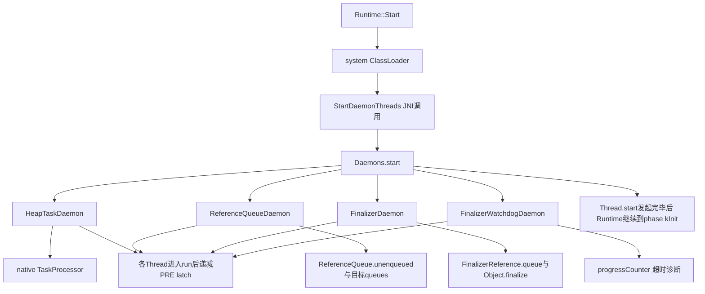
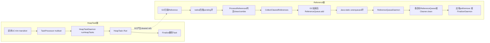
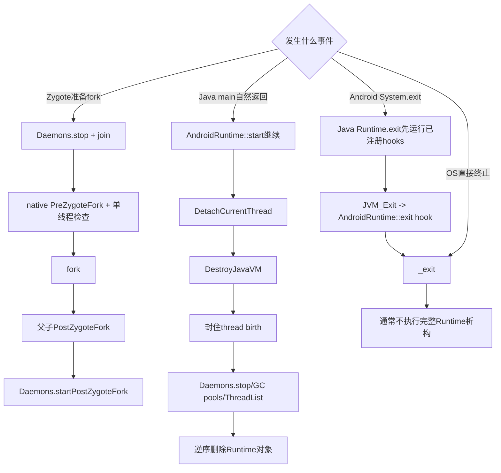

# 第573章 Android ART Daemons：HeapTask、ReferenceQueue、Finalizer、Watchdog、Zygote启停与Runtime退出链

> 源码基线：Android 11 `android-11.0.0_r48`。本章只在macOS上阅读与检索源码，不创建JavaVM、不执行GC/fork、不运行Android二进制，也不编译AOSP。
>
> 本章主问题：`Runtime::Start()`为何要启动四个Java系统Daemon；HeapTask如何把延迟GC/trim排进native队列；GC发现的Reference怎样跨native与Java队列；finalize为何需要独立线程和Watchdog；Zygote为何反复停止并重建这些线程；真正的`DestroyJavaVM`又如何关闭Daemon、线程池、GC与Runtime对象？

## 1. 先纠正八个常见误解

r48的`java.lang.Daemons`管理的是四个worker，不是五个：HeapTaskDaemon、ReferenceQueueDaemon、FinalizerDaemon、FinalizerWatchdogDaemon。HeapTaskDaemon不是GC线程本身，而是执行`TaskProcessor`中的GC、trim等任务。ReferenceQueueDaemon也不负责判活，判活发生在GC reference processing；它只完成Java队列交接并可能直接运行Cleaner。`System.runFinalization()`不会主动把所有不可达对象找出来。Watchdog超时也不是源码层面无条件`abort()`：它先诊断，再走uncaught-exception链。Zygote停止Daemon是为了fork，不是Runtime退出。最后，普通Android应用退出通常直接结束进程，并不逐项执行完整的Runtime析构。

## 2. 一句话总览

ART在`Runtime::Start()`末段调用Java `Daemons.start()`，四个singleton各创建system ThreadGroup中的daemon/system-daemon线程。HeapTaskDaemon通过VMRuntime JNI驱动native `TaskProcessor`；GC处理Reference后，把环形pending链交给Java `ReferenceQueue.unenqueued`，ReferenceQueueDaemon再按目标队列入队；FinalizerDaemon从专用queue取FinalizerReference并调用对象`finalize()`，Watchdog用progress counter与超时复核检测卡死。Zygote每次fork前同步stop并join四线程，fork后父子各自start；完整JavaVM销毁则先封住新线程出生，再停系统Daemon和内部池，最后按依赖逆序拆Runtime。

## 3. 建立七本账再读

第一本是线程账：四个Java Daemon、GC/JIT/runtime native worker和用户daemon不能混。第二本是队列账：native TaskProcessor、GC pending Reference环、Java unenqueued环、每个ReferenceQueue、Finalizer queue各是什么。第三本是所有权账：谁创建Thread、谁持有Task、谁负责`Finalize()`删除。第四本是门闩账：PRE/POST CountDownLatch只表示线程已进入run，不是业务循环已完全准备。第五本是停止账：普通interrupt、HeapTask专用Stop、join、排空任务的含义不同。第六本是fork账：停止后复制，父子各自恢复。第七本是退出账：`System.exit`、Java main自然返回、`DestroyJavaVM`与OS杀进程不是同一路径。

## 4. 主要源码地图

Java总控在`libcore/libart/src/main/java/java/lang/Daemons.java`；Reference字段与目标队列在`libcore/ojluni/src/main/java/java/lang/ref/Reference.java`、`ReferenceQueue.java`，Finalizer特殊包装在`libcore/luni/src/main/java/java/lang/ref/FinalizerReference.java`，Cleaner在`libcore/ojluni/src/main/java/sun/misc/Cleaner.java`。JNI桥看`art/runtime/native/dalvik_system_VMRuntime.cc`，native任务队列看`art/runtime/gc/task_processor.*`，Reference判活看`reference_processor.cc`和`reference_queue.cc`。启动/析构看`runtime.cc`、`java_vm_ext.cc`、`thread_list.cc`，Zygote启停看`libcore/dalvik/.../ZygoteHooks.java`。

## 5. `Daemons`是管理器还是线程

`Daemons`本身是不可实例化的final类，真正运行的是`DAEMONS`数组里的四个singleton。公共抽象类`Daemon`封装Thread字段、名字、start/stop、post-fork标记和run入口，具体子类只实现`runInternal()`或覆盖interrupt。读日志中的“Daemons”时要分清是管理器的批量动作，还是某个具体线程的循环。

## 6. 为什么这四项放在Java层

ReferenceQueue、FinalizerReference、Object.finalize和Thread/UncaughtExceptionHandler本来就是Java对象协议；用Java循环可直接调用队列与回调。HeapTask实际工作仍在ART native，但Java Thread提供统一生命周期，让Zygote可用同一套`Daemons.stop/startPostZygoteFork`收敛和重建线程。它不是“ART全部用Java实现”，而是Java控制面加native执行面。

## 7. 第一次启动从哪里发生

`Runtime::Start()`创建system ClassLoader并处理非Zygote post-fork式初始化后调用`StartDaemonThreads()`。C++要求当前main Thread处于`kNative`，通过已缓存的`java_lang_Daemons_start` method ID调用Java；若Java抛异常，ART打印异常并fatal。随后才发送Runtime phase `kInit`并设置`finished_starting_`，所以Daemon创建属于Start的一部分。

## 8. 第一幅图：四个Daemon如何挂到Runtime启动链



图中的latch不是`Runtime::Start()`主动等待；它主要给JVMTI线程数据缓存路径确认系统Daemon线程已进入run。Start的直接保证是四次`Thread.start()`已经成功发起，不能把它写成四个内部循环都完成首轮工作。

## 9. 数组顺序有什么实际影响

数组固定为HeapTask、ReferenceQueue、Finalizer、Watchdog。start按此顺序发起，但OS调度不保证实际run顺序；stop则逐个调用且每次join完成后才处理下一个，因此停止顺序是强的。HeapTask先停止并排空native任务，然后Reference交接停止，再停Finalizer，最后停Watchdog。

## 10. 为什么每类只有一个`INSTANCE`

四个内部类都以static singleton存在，Thread对象却可以反复替换。singleton保存的是生命周期状态和共享协作字段：例如FinalizerDaemon的queue、progressCounter和finalizingObject，以及Watchdog的needToWork。fork后内存复制出父子各自的singleton副本，绝不是父子共享同一个Java对象。

## 11. 新线程为什么放进system ThreadGroup

`startInternal()`用`new Thread(ThreadGroup.systemThreadGroup, this, name)`显式归组，便于运行时和诊断工具识别平台基础线程。它不是应用创建的普通ThreadGroup，也不代表线程在system_server进程；任意ART进程里的这四个线程都可属于system ThreadGroup。

## 12. `daemon`与`systemDaemon`是两个标志

创建后先`setDaemon(true)`，表示它不属于阻止JavaVM退出的非daemon线程；再`setSystemDaemon(true)`，这是Android添加的内部标志，要求线程尚未alive且已经是daemon。`systemDaemon`说明它由`java.lang.Daemons`管理，不等价于Linux内核线程，也不把进程UID变成system。

## 13. `start()`为何是synchronized

每个Daemon用自身monitor保护`thread`字段，防止并发start、stop或post-fork start看到半更新状态。若`thread != null`，`startInternal()`抛`IllegalStateException("already running")`，而不是悄悄复用旧线程。Thread终止后也不能再次start，所以重启必须new一个Thread。

## 14. `Thread.start()`返回说明了什么

它说明native pthread创建已被发起，不说明新线程已经执行`run()`。Daemon的`thread`字段在调用start前就非null，因此此时`isRunning()`返回true只是生命周期意图，不是心跳探测。真正进入`Daemon.run()`后才设置post-fork优先级、递减latch并进入具体循环。

## 15. 为什么有PRE和POST两只CountDownLatch

初始Zygote/独立Runtime首次启动使用`PRE_ZYGOTE_START_LATCH`；发生fork后的重启把全局及每个Daemon的`postZygoteFork`置true，使用`POST_ZYGOTE_START_LATCH`。两只初始count都是4，分别避免JVMTI在关键系统Thread尚未进入run时继续缓存线程相关数据。

## 16. latch不是每次重启都重建

CountDownLatch是static final且一次归零后不会复位。PRE只覆盖最初启动，POST只在当前进程副本第一次post-fork启动时真正等待；父Zygote后续stop/start时POST已经为零。它是“一次性到达门闩”，不是每次fork都验证四个线程的新barrier。

## 17. `run()`为何先改native priority

只有post-fork线程调用`VMRuntime.setSystemDaemonThreadPriority()`，native端在Android目标上把当前tid的nice设为4，以减轻GC等后台工作与UI线程争CPU造成的卡顿。不能在`Thread.start()`前设，因为Thread启动时自己的native priority设置会覆盖它；也不能从Java优先级数值推算出这个native nice。

## 18. countDown为何放在`runInternal()`之前

系统需要确认四个Thread已经真正获得执行机会，才让JVMTI继续枚举/缓存；具体runInternal常常立即阻塞等待工作，若等“业务完成”就永远无法放行。不过这也意味着latch归零时HeapTaskDaemon可能尚未调用native `TaskProcessor::Start()`，所以门闩不提供业务队列ready的严格保证。

## 19. 普通停止的线性化点在哪里

`Daemon.stop()`先在monitor内把当前Thread保存到`threadToStop`，再把共享`thread=null`。从这一刻起，循环下一次`isRunning()`会看到false；若有未遵守上层协议的并发start，它从字段角度甚至可在旧线程join完成前创建替代线程。Zygote/Runtime调用方靠顺序调用避免这种交叉；interrupt与join放在monitor外，则避免旧线程退出或其他同步动作反过来等待同一monitor。

## 20. 为什么一定要interrupt后join

四个线程多数时间阻塞在wait、ReferenceQueue.remove、Thread.sleep或native condition上。仅把flag改为false无法唤醒它们；interrupt/专用Stop负责破坏阻塞，join则证明旧Java线程已经退出。Zygote只有等join完成，才有资格进一步检查`/proc/self/task`是否只剩fork调用线程。

## 21. stop为何吞掉调用者的InterruptedException

join循环捕获InterruptedException后继续等，也捕获可能因构造InterruptedException失败而出现的OutOfMemoryError。这里优先保证系统Daemon确实停止，不保留调用者的interrupt状态；这是平台内部的强停止语义，不应照搬到一般应用线程管理代码。

## 22. `isRunning()`不是检查`Thread.isAlive()`

它只在monitor内判断字段是否非null。stop先清字段，再唤醒旧Thread，因此旧Thread可能仍alive但循环已经被要求退出；反过来，线程若意外退出而字段仍非null，isRunning仍会报告true，下一次start会报already running。该设计依赖runInternal正常只因stop返回。

## 23. 第一段r48真实Java：stop如何让旧Thread退出

下面逐字摘自`libcore/libart/src/main/java/java/lang/Daemons.java`第169—188行：

```java
        public void stop() {
            Thread threadToStop;
            synchronized (this) {
                threadToStop = thread;
                thread = null;
            }
            if (threadToStop == null) {
                throw new IllegalStateException("not running");
            }
            interrupt(threadToStop);
            while (true) {
                try {
                    threadToStop.join();
                    return;
                } catch (InterruptedException ignored) {
                } catch (OutOfMemoryError ignored) {
                    // An OOME may be thrown if allocating the InterruptedException failed.
                }
            }
        }
```

关键不是“发一次interrupt”，而是清共享状态、唤醒旧线程、不可中断地join三步组合。也因此`Daemons.stop()`是同步操作，某个runInternal若不能响应停止，整个Zygote fork会卡在这里。

## 24. 四个stop是批量原子操作吗

不是。管理器按数组逐项stop，前一个已退出而后一个尚运行的中间状态真实存在；只是调用线程不会在四项完成前从`Daemons.stop()`返回。源码没有失败回滚，如果某项因“不在运行”抛异常，后续项不会自动执行。

## 25. 为什么HeapTaskDaemon不能用普通Thread.interrupt

它通常阻塞在native TaskProcessor的ConditionVariable，而不是Java可中断wait；Java interrupt未必能唤醒native队列。因此它覆盖`interrupt(Thread)`，忽略Thread参数，直接通过VMRuntime调用`TaskProcessor::Stop()`，把is_running设false并broadcast native cond。

## 26. HeapTaskDaemon不是另一个GC

它是承载任务的单一Java Thread，具体Task的`Run()`才调用`Heap::ConcurrentGC`、`Trim`、collector transition或其他资源收尾。GC自身仍可能使用collector worker pool并暂停/协作mutator。把线程名读成“所有GC都在此线程完成”会遗漏显式同步GC和collector内部并行工作。

## 27. Java到native的三步桥

启动时调用`VMRuntime.startHeapTaskProcessor()`，把当前ART Thread记为TaskProcessor running_thread并置running；随后`runHeapTasks()`进入`RunAllTasks`循环。停止时另一个线程调用`stopHeapTaskProcessor()`，native Stop广播等待条件，Java HeapTaskDaemon从循环返回后结束。

## 28. `TaskProcessor`保存什么状态

它有mutex、condition、`is_running_`、按目标时间排序的`multiset<HeapTask*>`和`running_thread_`。HeapTask只保存纳秒级target_run_time并继承SelfDeletingTask。队列拥有尚未执行的Task指针，Run后调用`Finalize()`通常自删除；析构时若还有未处理项也逐个Finalize并打印warning。

## 29. 为什么是按目标时间排序的multiset

同一队列既放“立即运行”的ConcurrentGCTask，也放延迟heap trim和collector transition。`GetTask()`只看最早目标；未到时间就按差值TimedWait，新增更早任务或更新时间会Signal重算。multiset允许多个任务目标时间相同，不要求业务上去重。

## 30. AddTask为什么会唤醒处理线程

它先把调用ART Thread切到`kWaitingForTaskProcessor`状态，再加锁insert并Signal。线程状态切换让挂起/诊断知道它正等内部锁。Signal不是“立即执行”承诺：若新任务仍在未来，消费者醒来后会继续TimedWait。

## 31. `GetTask()`如何处理空队列

队列空且running为true时Cond.Wait；空且running为false时返回null。队列非空时，running为true且未到target就定时等；若已到期则取出。这里把停止状态也纳入选择，构成下一节最容易忽略的语义。

## 32. Stop不是丢弃任务而是加速排空

Stop把running设false、running_thread清空并Broadcast。此后`GetTask()`看到非空队列会无视未来target时间，立刻逐个返回执行；直到队列空才返回null，RunAllTasks才退出。源码注释明确是“finish up the remaining tasks as soon as possible”，所以Zygote pre-fork停HeapTaskDaemon可能同步承担尚未到期的trim/transition工作。

## 33. 为什么Stop先把`running_thread_`清空

该字段表达“处理器当前接受常规运行”的owner，而不是旧pthread是否已经join。Stop后旧Daemon仍可能在排空任务，但对外GetRunningThread会得到null。分析采样、VMStack或GC特殊分支时，不能用这个字段证明旧线程物理消失。

## 34. `RunAllTasks()`为何每项都调用Finalize

Task::Run只做业务，Finalize负责生命周期；SelfDeletingTask的默认实现删除自身。将删除放在统一循环可让不同Task只实现Run，也允许测试或特殊Task覆盖Finalize。异常不能跨C++边界随意冒泡，因此Task实现通常自行满足不抛的Runtime约束。

## 35. HeapTask启动/停止竞态怎样避免死锁

`HeapTaskDaemon.runInternal()`先锁自身，只有`isRunning()`为true才native Start，然后释放锁进入RunAllTasks。stop清thread也需要同一锁：若stop先赢，runInternal看到false，不会把已Stop的processor重新Start；若runInternal先赢，stop随后调用native Stop唤醒它。这正是源码注释所说的竞态保护。

## 36. 第二幅图：HeapTask与Reference交接是两条队列链



两条链会相遇，但不是一只队列：TaskProcessor调度“要做的native工作”，Reference pending/unenqueued传递“GC已经判定需处理的Java Reference”。r48中`kAsyncReferenceQueueAdd=false`，GC结束后的add默认由当前GC调用链直接执行，而不是再排成HeapTask。

## 37. ConcurrentGCTask怎样防重复

`RequestConcurrentGC()`先经过CanAddHeapTask，再用`concurrent_gc_pending_`的原子CAS从false置true，只有赢家入队。Task执行`ConcurrentGC`后清pending。它是“同时最多一个待处理请求”的合并，不保证每个请求都对应一次GC，也不阻止别的同步GC先发生。

## 38. HeapTrimTask为什么延迟执行

trim会扫描space、持锁并向内核归还页，收益不稳定且可能造成jank，所以`RequestTrim`以`NanoTime()+kHeapTrimWait`入队。`pending_heap_trim_`非null时忽略重复请求，Task执行Trim后才ClearPendingTrim。Stop加速排空意味着退出/fork边界可能提前执行原本延迟的trim。

## 39. CollectorTransitionTask为何可以更新时间

前后台状态变化可能反复请求collector模式转换。已有pending transition时不再new，而是在TaskProcessor锁下移除、更新target、重新插入；如果它变成队首就Signal。这里是“保留一个任务并重排时间”，与ConcurrentGC的原子bool合并机制不同。

## 40. 哪些条件禁止新增HeapTask

`CanAddHeapTask()`要求Runtime存在、`finished_starting_`为true、未shutting_down且当前Thread不在处理stack overflow。它避免启动未完成或拆除中的异步工作访问半成品；但不检查TaskProcessor当前running，因此短暂停止期间仍可能有任务留到恢复后处理，不能把Stop解释成全局拒收门禁。

## 41. `NotifyStartupCompletedTask`为什么也借这条队列

第572章提到的启动完成资源收尾继承HeapTask并以当前NanoTime立即调度：它需要与GC互斥，却不想阻塞通知者。任务禁用app image预解析字符串、做empty checkpoint、释放metadata并删Runtime app-image加载线程池。HeapTaskDaemon承载的不只是GC本身，而是“需要堆协调的后台任务”。

## 42. requestHeapTrim/requestGC两个Java方法为何还保留

`Daemons.requestHeapTrim()`与`requestGC()`只转发VMRuntime，源码注释说不再由Java调用、为反射兼容保留。阅读名字不能推断调用者仍在Daemons内部；应以rg调用点和native注册表为准。真正触发策略主要在ART Heap与framework进程状态路径。

## 43. ReferenceQueueDaemon之前GC做了什么

GC扫描到Reference对象且referent未标记时，先按Class类型放入native soft、weak、finalizer或phantom ReferenceQueue环。ProcessReferences依次决定保留soft、清soft/weak、把finalizable白对象黑化并移到zombie、再清由finalizer对象可达的soft/weak，最后清phantom。Daemon不参与这些可达性决定。

## 44. `referent`为什么由ART特殊对待

`Reference.referent`是volatile，但ClassLinker与GC知道它是特殊字段；并发reference processing期间，普通get可能走native slow path等待或只返回安全的marked对象，防止mutator把即将sweep的白对象重新传播。Java字段看起来普通，语义却由collector、read barrier和reference_processor_lock共同实现。

## 45. `pendingNext`和`queueNext`不能混

pendingNext是GC到ReferenceQueueDaemon交接前使用的环形单链；queueNext是进入某个Java ReferenceQueue后的FIFO链。前者为null表示尚未处理，环/自环表示正在或已经pending；后者null表示尚未入目标queue，self或特殊sentinel标记队尾/已移除。用同一“next指针”概括会破坏状态判断。

## 46. FinalizerReference为何还有`zombie`

普通weak/phantom的白referent会被clear；带finalize的对象必须先保活到回调执行。ART把更新后的referent Mark为活对象，写入FinalizerReference.zombie，再清referent并把reference交给cleared链。FinalizerReference重写get()返回zombie，于是FinalizerDaemon仍能取得对象，而下次GC不会再次把原referent按未处理状态处理。

## 47. `CollectClearedReferences()`何时离开GC锁

它把native cleared环做成JNI global ref并创建ClearedReferenceTask，随后清native列表。Heap在`FinishGC`之后才调用task Run，使其进入Java `ReferenceQueue.add`，避免仍处GC正式阶段时因Java monitor/JNI引发死锁。任务执行后删除global ref并自删除。

## 48. r48为什么不是异步add

`kAsyncReferenceQueueAdd`在r48被编译为false，所以ClearedReferenceTask直接返回给当前GC调用链，在FinishGC后同步Run；只有常量为true的分支才投TaskProcessor。名称带Task不等于一定由HeapTaskDaemon执行，这是本章一个典型“按类型名误判线程”的陷阱。

## 49. `ReferenceQueue.add()`怎样唤醒Daemon

它锁`ReferenceQueue.class`，若static `unenqueued`为空就接入新环，否则找到两个环的尾部并拼接，最后notifyAll。ReferenceQueueDaemon也在同一Class monitor上等待，醒来后一次性取走整个unenqueued并置null，让GC后续可继续发布新批次。

## 50. 为什么pending列表是环而不是null结尾

环让GC在O(1)插入时只保存一个list指针，并用pendingNext非null表示reference已进入处理状态。Java enqueuePending保存start并do/while直到回到起点。单元素用self-loop，既是合法环，也避免用null同时表达“队尾”和“从未处理”。

## 51. 第二段r48真实Java：ReferenceQueueDaemon的交接循环

下面逐字摘自`libcore/libart/src/main/java/java/lang/Daemons.java`第211—229行：

```java
        @Override public void runInternal() {
            while (isRunning()) {
                Reference<?> list;
                try {
                    synchronized (ReferenceQueue.class) {
                        while (ReferenceQueue.unenqueued == null) {
                            ReferenceQueue.class.wait();
                        }
                        list = ReferenceQueue.unenqueued;
                        ReferenceQueue.unenqueued = null;
                    }
                } catch (InterruptedException e) {
                    continue;
                } catch (OutOfMemoryError e) {
                    continue;
                }
                ReferenceQueue.enqueuePending(list);
            }
        }
```

interrupt后不是直接return，而是continue回while顶部，再通过已经清空的`thread`字段退出。若在取走list之后stop，当前批次仍会执行enqueuePending，然后下一轮才停；所以stop保证线程终止，却不等价于丢弃已领取批次。

## 52. enqueuePending怎样减少锁切换

它遍历pending环，连续元素若指向同一个目标queue，就在一次`queue.lock`临界区中批量enqueue，处理完统一notifyAll。遇到另一个queue才换锁。这保留每个ReferenceQueue的FIFO实现，同时减少大批cleared refs逐个抢锁的成本。

## 53. Reference没有目标queue怎么办

若`list.queue == null`，enqueuePending不入任何Java队列，只把pendingNext改为self-loop并继续。这表示GC处理完成但无消费者queue，并非数据仍卡在unenqueued。调用`Reference.enqueue()`也会因queue为null返回false。

## 54. Cleaner为何是ReferenceQueue里的特殊分支

`ReferenceQueue.enqueueLocked()`发现Reference是`sun.misc.Cleaner`时，不把它放到dummy queue，而在ReferenceQueueDaemon线程直接调用`clean()`，再把queueNext设为“已入队又移除”的sentinel。Cleaner用全局双链保活自身，remove确保thunk最多执行一次。

## 55. Cleaner代码为什么必须很短

Cleaner thunk运行在唯一ReferenceQueueDaemon上，而且发生在目标queue锁内；长时间阻塞会延迟其他weak/phantom/finalizer reference进入队列。它不受FinalizerWatchdog监控。若thunk抛Throwable，Cleaner捕获后打印Error并`System.exit(1)`，不是简单记录后继续。

## 56. Java ReferenceQueue为什么在Android是FIFO

r48注释明确Android实现是FIFO，而对应OpenJDK实现曾是LIFO。head/tail入队，poll从head移除；批次环本身的GC发现顺序仍未承诺为业务顺序。因此只能说某个目标queue的Java链接操作是FIFO，不能把它升级成对象不可达时间的全局排序保证。

## 57. `queueNext`的self与sentinel分别是什么

队尾在queue内时`tail.queueNext=tail`；poll移除后改指向静态`sQueueNextUnenqueued` phantom sentinel。`isEnqueued()`只有queueNext既非null又非sentinel时返回true，所以历史行为是在poll后变false，源码甚至注明这与文档文字曾不一致。

## 58. 应用`remove()`如何与Daemon配合

目标ReferenceQueue有自己的lock。应用remove先poll，没有元素就wait；ReferenceQueueDaemon批量enqueue完成后对该lock notifyAll。应用等待的不是`ReferenceQueue.class`全局锁，GC发布者也不会直接唤醒每个消费者；Daemon完成了全局pending到各queue局部条件的扇出。

## 59. FinalizerReference的全局链保存什么

每个带finalize对象创建时，ART通过WellKnownClasses缓存的方法调用`FinalizerReference.add()`，构造包装并挂到受LIST_LOCK保护的双链head。该链包含所有尚未完成finalize的包装，不等同于“已经可终结队列”；直到GC判定不可达，包装才经zombie与ReferenceQueue链进入FinalizerDaemon queue。

## 60. FinalizerDaemon为什么先poll再remove

热路径先非阻塞poll，队列有积压时避免每个对象都与Watchdog做sleep/wake同步。为空才走慢路径：清finalizingObject、推进counter，让Watchdog goToSleep，然后阻塞queue.remove；取到对象后设置finalizingObject、用强set推进counter，再wake Watchdog。

## 61. progressCounter到底表示什么

它不是“成功finalize数量”，而是FinalizerDaemon跨关键进度点的心跳。快路径取到reference并写好finalizingObject后递增；准备阻塞时也递增；慢路径真正从remove取到对象后再递增。Watchdog只要看到计数变化或needToWork转false，就认为线程有进展，不把一次长睡眠误判为单个finalize卡死。

## 62. `lazySet`为何只用于热路径

快路径希望减少每个对象的完整内存栅栏成本，所以用release语义lazySet；慢路径从blocking remove回来后用set并唤醒Watchdog。finalizingObject本身故意非volatile且允许race，正确性依赖counter观察和二次复核来降低误报，而不是提供业务可见性的严格快照。

## 63. `finalizingObject`为什么仍要保存

Watchdog需要知道超时对象的Class并报告FinalizerDaemon真实栈；字段也在doFinalize完成前保持一个显式Java引用。源码注释坦白访问可能竞态，因此它只用于诊断和临时保活，不能被外部逻辑当成精确的“当前任务API”。

## 64. doFinalize先从链删除有什么好处

它先`FinalizerReference.remove(reference)`，避免长时间finalize期间包装仍挂在全局待处理双链；然后把zombie取到局部object，clear包装，再调用回调。即使对象在finalize中复活，这个FinalizerReference也已退出体系，VM不会因再次不可达而自动第二次调用同一对象的finalize。

## 65. 第三段r48真实Java：真正调用`Object.finalize()`的位置

下面逐字摘自`libcore/libart/src/main/java/java/lang/Daemons.java`第285—299行：

```java
        @FindBugsSuppressWarnings("FI_EXPLICIT_INVOCATION")
        private void doFinalize(FinalizerReference<?> reference) {
            FinalizerReference.remove(reference);
            Object object = reference.get();
            reference.clear();
            try {
                object.finalize();
            } catch (Throwable ex) {
                // The RI silently swallows these, but Android has always logged.
                System.logE("Uncaught exception thrown by finalizer", ex);
            } finally {
                // Done finalizing, stop holding the object as live.
                finalizingObject = null;
            }
        }
```

普通finalize抛Throwable只记录，不经应用uncaught handler，也不会阻止Daemon继续处理下一项；这与Watchdog检测到“超时”后主动派发TimeoutException是两条不同故障路径。

## 66. clear发生在回调前会不会让对象消失

不会。局部变量`object`以及执行期间的栈root保持它可达，finalizingObject字段也暂时指向它。clear清的是FinalizerReference.zombie，切断包装的长期保活关系；GC不能回收正在Java栈上执行方法的receiver。

## 67. finalize为什么不能做重要业务

触发时间取决于GC与队列积压，线程只有一个，异常被吞并记录，进程退出也不保证排空；长阻塞还会触发Watchdog终止流程。它适合解释遗留资源兜底，不适合保存用户数据、提交事务或承担必须发生的close。显式AutoCloseable/try-with-resources才有确定调用边界。

## 68. `System.runFinalization()`实际等待谁

Runtime.runFinalization调用`VMRuntime.runFinalization(0)`，后者执行`FinalizerReference.finalizeAllEnqueued`。它创建一个带finalize的Sentinel，找到对应FinalizerReference，把它安全接到全局unenqueued链，等待sentinel.finalize通知；这样只保证排在sentinel之前、已经进入相关交接顺序的finalizer被处理。

## 69. 为什么要把sentinel先放unenqueued而非直接finalizer queue

若GC刚产生的finalizer refs仍在ReferenceQueue.unenqueued，直接把sentinel塞最终queue可能让sentinel越过它们，过早宣告完成。源码先把sentinel变成合法单元素pending环，再调用ReferenceQueue.add，保持与近期GC批次的拼接顺序。

## 70. runFinalization不会隐式执行GC

它等待已被发现并排入处理链的对象，不负责发现新的不可达对象。Zygote的`gcAndFinalize()`因此显式写成`System.gc() → runFinalizationSync() → System.gc()`：第一次发现/终结，第二次回收finalize后未复活的对象。把单独runFinalization当成“清空所有垃圾”是不准确的。

## 71. `runFinalizationSync()`名字还有多少特殊语义

r48的VMRuntime实现只是调用`System.runFinalization()`。ZygoteHooks注释提到没有HeapWorker的历史背景，但当前代码不能据此推断存在另一套同步finalizer执行器；真正等待仍走Sentinel、ReferenceQueueDaemon和FinalizerDaemon链。名字应按当前方法体解释。

## 72. Watchdog为何空闲时不周期唤醒

FinalizerDaemon准备阻塞队列前调用`goToSleep()`把needToWork=false；Watchdog在`sleepUntilNeeded()`里wait，避免设备空闲时每个timeout周期唤醒CPU。FinalizerDaemon拿到新对象后再wakeUp并notify，Watchdog才开始一次超时观察。

## 73. timeout从哪里配置

Watchdog第一次工作时通过`VMRuntime.getFinalizerTimeoutMs()`读取ART Runtime字段，默认来自`runtime_options.def`的10000ms，也可由`-XX:FinalizerTimeoutMs=`覆盖。它转为纳秒缓存，同时更新已经标注“不要使用、将移除”的`MAX_FINALIZE_NANOS`兼容字段；直接读那个Java字段不能控制真实超时。

## 74. 为什么使用`System.nanoTime()`

源码要求按单调时间测量，并说明处理器不运行时不计，避免用户修改墙上时钟导致误报。`sleepForNanos`循环计算剩余时间并向上取整到毫秒，处理虚假提前唤醒和interrupt；只有总elapsed达到目标才返回true。

## 75. 超时判断为什么要同时看两个条件

睡满timeout后，只有needToWork仍true且progressCounter等于起点，才怀疑一次doFinalize占满窗口。若FinalizerDaemon已去空闲、取到下一项或推进任何关键点，都会排除。它检测的是“没有可见进度”，不是简单测某个Thread总运行时长。

## 76. 为什么还多等500ms复核

第一次怀疑后先抓取finalizingObject，再睡500ms并再次检查needToWork和同一counter。这样减少finalize恰好在阈值边缘结束、Watchdog却报告错误对象的概率。若进度恢复就返回null，下一轮重新观察；500ms是抗竞态缓冲，不算配置的正式timeout。

## 77. 连着处理很多短finalizer会误报吗

通常不会，因为每取一项都会推进counter。即使队列持续非空、Watchdog一直needToWork=true，只要counter变化就说明不是同一个调用卡住。极端counter整数回绕理论上存在，但需要在一个超时窗口内完成2^32次进度，源码选择了实用而非形式化无限计数。

## 78. 连接Debugger为何抑制终止

`waitForFinalization()`返回对象后，runInternal还检查`!VMDebug.isDebuggerConnected()`；调试时暂停在finalizer断点不应被Watchdog杀掉。它不会停止Watchdog线程，只是本轮不调用finalizerTimedOut，循环继续观察。

## 79. 超时诊断为什么先发SIGQUIT

finalizerTimedOut构造TimeoutException，把栈替换为FinalizerDaemon当前栈，然后向自身进程发送SIGQUIT以请求native/Java线程栈，等待5秒让trace输出。这样崩溃报告既有超时对象Class，也有真正卡住位置，而不是只有检测者Watchdog的睡眠栈。

## 80. 超时真的直接`abort()`吗

没有handler的host/dalvikvm路径会手工log并`System.exit(2)`；有handler时，Watchdog对自己调用`dispatchUncaughtException(syntheticException)`。Zygote派生进程通常安装RuntimeInit pre/default handler，默认最终向AMS报告并kill进程。应用若替换handler，实际结局可能变化，因此类注释里的“abort VM”是行为概述，不是对某个native abort调用的逐字描述。

## 81. ordinary finalizer异常与timeout为何不同

普通Throwable可能是单个资源清理bug，Android记录后继续，避免整条Finalizer queue停摆；超时会堵住唯一FinalizerDaemon，使所有后续对象永久积压，所以升级为进程级故障诊断。两者都说明finalize不适合不可失败的业务操作。

## 82. Zygote最初何时允许这四个线程存在

ART Runtime::Start先启动Daemons，随后Java进入ZygoteInit.main并调用`startZygoteNoThreadCreation()`，在预加载敏感段禁止新建Java Thread。已有Daemon并不会因此自动消失；该flag主要让`Thread_nativeCreate`在Zygote no-thread section抛InternalError。真正fork前还要显式Daemons.stop。

## 83. `stopZygoteNoThreadCreation()`是否重启Daemon

它只把Runtime的zygote_no_threads flag设false，表示预加载结束后理论上可再创建线程；没有调用Daemons.start，因为四个初始Daemon本来仍在运行。不要把“一次性禁止创建新线程”与“每次fork前停止已有线程”合并成同一开关。

## 84. 每次preFork为什么先`Daemons.stop()`

ZygoteHooks.preFork顺序是停四个Java Daemon、nativePreFork停JIT/整理Heap、最后轮询`/proc/self/task`。先join受控Java线程，能让HeapTask排空、Reference/Finalizer结束，再让ART冻结共享状态；若先fork，子进程只复制调用线程而遗留锁owner和队列状态会难以恢复。

## 85. join完成后为何还查`/proc/self/task`

ART/JIT/GC或native库线程不全由`java.lang.Daemons`管理，pthread退出的内核可见状态也可能稍晚。waitUntilAllThreadsStopped持续yield直到task目录只剩一个tid，给fork提供OS层证明。它是Android设备运行时检查，本章macOS练习只核对源码，不实际访问该路径。

## 86. postForkCommon为什么先native再Java start

父子都先`Runtime::PostZygoteFork()`恢复JIT post-fork状态并清Runtime统计，再`Daemons.startPostZygoteFork()`创建会进入ART/Heap的Java线程。注释明确要求通知Runtime在创建新线程之前完成，避免Daemon看到尚未复原的native锁、池或统计状态。

## 87. 父进程与子进程会共享新Daemon吗

不会。fork时只有调用线程存在，父子各有独立堆和Daemon singleton快照；随后两边各执行postForkCommon，分别new四个Thread。相同名字只方便诊断，tid、队列锁、progressCounter和任务消费都从此属于各自进程。

## 88. child zygote也会启动Daemon吗

会。child专用native post-fork初始化会跳过Binder/JDWP/runtime worker等普通app设施，但Java公共hook仍执行`Daemons.startPostZygoteFork()`。它在下一次充当fork源前再次Daemons.stop；“child zygote保持永远单线程”不准确，准确说法是每个实际fork瞬间必须收敛成单线程。

## 89. post-fork priority发生在父还是子

两边新Daemon进入run时都会走postZygoteFork分支并设置native nice。父Zygote重启的线程也属于post-fork线程，不只是应用child。首次fork以后全局postZygoteFork一直true，后续重启沿同一路径。

## 90. fork停止与Runtime shutdown停止有何共同点

两者都调用Java `Daemons.stop()`并等待四线程退出，因此HeapTask都会排空当前TaskProcessor；区别是fork随后保留整个Runtime对象并post-fork重建，shutdown则封住thread birth并继续销毁GC、ThreadList、ClassLinker、Heap和MemMap。相同方法不代表相同终点。

## 91. 完整Runtime退出从哪个JNI入口开始

`JavaVM::DestroyJavaVM`映射到`JII::DestroyJavaVM`。它先等待除调用者外所有非daemon线程退出，随后`delete Runtime`触发析构，最后ResetNativeLoader并返回JNI_OK。Java daemon不阻止第一道等待，但系统与用户daemon必须在后续拆除中分别处理。

## 92. AndroidRuntime为何先Detach再Destroy

`AndroidRuntime::start()`中的目标Java main若自然返回，它先`mJavaVM->DetachCurrentThread()`，再DestroyJavaVM。Runtime析构发现当前pthread未附着时会临时Attach一个“Shutdown thread”，Runtime已经Started就尽量创建Java peer；若内存紧张失败，再以无peer方式附着保证拆除继续。

## 93. 为什么销毁前先等各种worker真正创建

Runtime pool、JIT pool和OatFileManager可能正处pthread已发起但Thread尚未完全注册的窗口。析构先WaitForWorkersToBeCreated，再停ProfileSaver、删除JIT pool并等OAT worker，避免ThreadList已经销毁后迟到的worker继续Attach。这里是在关闭门之前消除异步出生窗口。

## 94. `shutting_down_started_`与`shutting_down_`不同

持runtime_shutdown_lock先把started置true，然后等待`threads_being_born_`归零；EndThreadBirth在最后一个结束时broadcast。观察到零的同一临界区里再置`shutting_down_=true`，此后Thread::CreateNativeThread/Attach拒绝新出生。started表示析构正等待，真正birth gate读的是shutting_down。

## 95. 为什么Daemon stop要等`finished_starting_`

只有Start走到finished，WellKnownClasses中的Daemons Class和stop method、JavaVM/JNIEnv及四线程生命周期才可安全假定完整。部分初始化失败的Runtime析构不能无条件CallStaticVoidMethod；因此源码只在IsFinishedStarting时清当前异常并调用Daemons.stop。

## 96. Stop后为什么还要处理Trace和`kDeath`

四个系统Daemon停止后，Runtime关闭method trace，再在仍有可用工作Thread、GC结构尚存时发送Runtime phase `kDeath`，让agent/plugin客户端完成死亡通知。若析构临时附着了Shutdown thread，此后将它Detach；顺序保证callback还能安全访问有限的managed状态。

## 97. GC线程池何时真正删除

析构在Daemon stop之后等待任何正在进行的GC，删除Heap pool、OAT pool与Runtime pool，再停Debugger并删SignalCatcher。先等待再删避免worker访问释放后的Heap；JIT pool更早已删除，JIT对象本身则要晚到ThreadList之后才释放。

## 98. ThreadList为何又等待一次非daemon线程

DestroyJavaVM入口的第一次等待允许daemon在间隙创建新非daemon线程，析构阶段也经历多项回调；ThreadList::ShutDown再次等待并检查unregistering_count，确保没有Thread正在Destroy/Unregister时删除list。源码注释明确这是防守性重复，不是无意义重复。

## 99. 用户daemon为什么不能像四个系统Daemon一样join

Runtime只知道它们标记为daemon，没有通用协议要求业务循环响应某个stop。ThreadList最终禁用GC、等当前GC结束，再给剩余daemon增加suspend count，把每个JNIEnv切换到shutdown函数表，等待其悬停/静默；源码承认没有干净机制杀线程并回收栈，因此会泄漏这些线程资源直到进程结束。

## 100. `SuspendAllDaemonThreadsForShutdown()`是严格证明吗

不是。它最多约2秒观察是否仍Runnable，超时会warning；之后等待200ms静默，设置JNIEnv runtime-deleted标记，再等200ms。代码明确称“best we can with timeouts”。这是进程即将结束背景下的防UAF折中，不能当成通用安全线程终止算法。

## 101. 为什么先删ThreadList再删JIT对象

JIT instrumentation/code cache可能仍被Thread或栈信息访问，必须先让线程退出/静默并删除ThreadList，再reset JIT与code cache。随后才关闭fault manager并删除MonitorList/Pool、ClassLinker、Heap、InternTable、OatFileManager等依赖对象。

## 102. 最后的全局设施按什么顺序拆

`java_vm_`、LinearAlloc和arena pools要在MemMap::Shutdown之前释放，因为allocator可能使用MemMap；Thread、QuasiAtomic、ClassVerifier静态设施也在前面shutdown。最后把Runtime::instance_置null并`WellKnownClasses::Clear()`，否则同进程测试再次创建Runtime会看到旧global缓存。

## 103. 普通Android应用会走这条完整析构吗

通常不会。ActivityThread/Looper一般不让Java main自然返回，系统回收进程也直接终止。`RuntimeInit.applicationInit()`还把AndroidRuntime的exitWithoutCleanup设true；`System.exit`最终经JVM_Exit调用exit hook，而AndroidRuntime::exit无论flag如何都以`_exit`结束，无法再返回start中的Detach/DestroyJavaVM。

## 104. `exitWithoutCleanup`究竟跳过什么

从r48当前native代码看，它只决定AndroidRuntime::exit是否调用虚函数`onExit(code)`；AppRuntime的onExit会在Zygote角色下停止Binder IPC进程。随后两支都执行`::_exit(code)`。它不直接切换ART Runtime析构，也不能据名字推断所有Java `Runtime.exit` shutdownHooks都被绕过。

## 105. Java shutdown hook还会不会运行

r48 `java.lang.Runtime.exit()`在调用nativeExit之前会复制已注册hooks、并发start并逐个join；之后nativeExit才进JVM_Exit与AndroidRuntime exit hook。因此RuntimeInit注释中的“without running any shutdown hooks”应结合上下文理解为Android native cleanup意图，不能覆盖当前Java方法体的明确控制流。

## 106. OS kill与`System.exit`又有何区别

SIGKILL或系统直接结束进程不会给Java hooks、Daemon stop或Runtime析构机会；System.exit至少先走Java Runtime.exit控制流，再到`_exit`。两者都依赖OS回收地址空间和线程，但应用可观察回调不同。源码学习时必须先确定退出入口，不能只看最终进程消失。

## 107. 第三幅图：三种退出/暂停路径不要混线



fork路径是“暂停并恢复”，DestroyJavaVM是“有序拆除”，进程直接结束是“交给OS回收”。观察到Daemon线程消失无法单独证明走了哪条路径，必须结合入口、是否重启和Runtime对象是否仍存在判断。

## 108. 遇到卡在Zygote fork先看哪里

先区分卡在某个Daemon.stop的join、HeapTask Stop排空未来任务、native JIT/Heap pre-fork，还是`/proc/self/task`仍有其他pthread。若最后一条，四个Java Daemon堆栈可能都已消失；只抓Java trace不足以定位native线程来源。

## 109. 遇到Reference积压先画哪几层

依次核对GC是否把Reference放入native pending、CollectClearedReferences是否在FinishGC后调用Java add、static unenqueued是否被ReferenceQueueDaemon取走、目标queue是否有消费者。Finalizer还要多查zombie、FinalizerReference全局链和FinalizerDaemon；Cleaner则在ReferenceQueueDaemon内直接运行。不要一看到queue空就归因GC没发现对象。

## 110. 遇到finalizer超时应读哪些证据

超时异常Class告诉你对象类型，synthetic stack已替换成FinalizerDaemon卡住位置，SIGQUIT应提供全线程/native栈；同时检查是否连接Debugger、timeout配置和队列积压。Watchdog自身栈通常只显示检测/派发，不是资源锁的真正owner。

## 111. macOS只读练习说明

下面四个脚本只用`rg`、`sed`与shell断言读取r48文件，不启动Runtime、不触发GC、不执行finalize、不访问Android `/proc`。它们分别验证Daemon生命周期、HeapTask native队列、Reference/Finalizer/Watchdog和Zygote/Runtime退出顺序；每条仅在关键锚点都存在时打印OK。

## 112. 练习一：核对四个Daemon、latch与stop/join

```bash
#!/bin/bash
set -eu
src=/Users/ninebot/androidSource
d="$src/libcore/libart/src/main/java/java/lang/Daemons.java"
rg -n "DAEMONS|POST_ZYGOTE_START_LATCH|PRE_ZYGOTE_START_LATCH|startPostZygoteFork|setSystemDaemon|setSystemDaemonThreadPriority|threadToStop|join" "$d" | sed -n '1,220p'
test "$(rg -c '^[[:space:]]+[A-Za-z]+Daemon\.INSTANCE,' "$d")" -eq 4
rg -Fq 'thread = null;' "$d"
rg -Fq 'threadToStop.join();' "$d"
rg -Fq 'POST_ZYGOTE_START_LATCH.countDown();' "$d"
echo 'OK: 四个Daemon、一次性门闩、system-daemon标记与同步stop已核对'
```

读完解释为什么`thread=null`早于interrupt/join，以及latch归零为什么不证明HeapTask native processor已经Start完成。

## 113. 练习二：核对HeapTask JNI桥、定时队列与Stop排空

```bash
#!/bin/bash
set -eu
src=/Users/ninebot/androidSource
d="$src/libcore/libart/src/main/java/java/lang/Daemons.java"
vm="$src/art/runtime/native/dalvik_system_VMRuntime.cc"
tp="$src/art/runtime/gc/task_processor.cc"
heap="$src/art/runtime/gc/heap.cc"
rg -n "HeapTaskDaemon|startHeapTaskProcessor|stopHeapTaskProcessor|runHeapTasks" "$d" "$vm" | sed -n '1,180p'
rg -n "AddTask|GetTask|is_running_|target_time|RunAllTasks|Finalize" "$tp" | sed -n '1,220p'
rg -n "ConcurrentGCTask|CollectorTransitionTask|HeapTrimTask|CanAddHeapTask" "$heap" | sed -n '1,220p'
rg -Fq 'if (!is_running_ || target_time <= current_time)' "$tp"
rg -Fq 'cond_.Broadcast(self);' "$tp"
echo 'OK: HeapTask Java/native桥、定时排序、唤醒和Stop立即排空语义已核对'
```

指出Stop后未来target为何立即执行；再比较ConcurrentGC、trim、collector transition三种请求各自如何合并重复任务。

## 114. 练习三：核对GC Reference交接、finalize与Watchdog

```bash
#!/bin/bash
set -eu
src=/Users/ninebot/androidSource
d="$src/libcore/libart/src/main/java/java/lang/Daemons.java"
rp="$src/art/runtime/gc/reference_processor.cc"
rq="$src/libcore/ojluni/src/main/java/java/lang/ref/ReferenceQueue.java"
fr="$src/libcore/luni/src/main/java/java/lang/ref/FinalizerReference.java"
rg -n "ProcessReferences|CollectClearedReferences|kAsyncReferenceQueueAdd|ClearedReferenceTask" "$rp" | sed -n '1,180p'
rg -n "unenqueued|enqueuePending|enqueueLocked|Cleaner|pendingNext|queueNext" "$rq" | sed -n '1,240p'
rg -n "progressCounter|finalizingObject|doFinalize|waitForFinalization|finalizerTimedOut" "$d" | sed -n '1,240p'
rg -n "finalizeAllEnqueued|Sentinel|zombie" "$fr" | sed -n '1,180p'
rg -Fq 'static constexpr bool kAsyncReferenceQueueAdd = false;' "$rp"
rg -Fq 'object.finalize();' "$d"
echo 'OK: native判活、Java pending交接、zombie finalization与Watchdog复核已核对'
```

画出一个FinalizerReference从referent到zombie、unenqueued、finalizer queue、doFinalize的字段变化，并说明Cleaner为何不走FinalizerDaemon。

## 115. 练习四：核对Zygote暂停恢复与完整Runtime析构

```bash
#!/bin/bash
set -eu
src=/Users/ninebot/androidSource
zh="$src/libcore/dalvik/src/main/java/dalvik/system/ZygoteHooks.java"
rt="$src/art/runtime/runtime.cc"
jvm="$src/art/runtime/jni/java_vm_ext.cc"
tl="$src/art/runtime/thread_list.cc"
ar="$src/frameworks/base/core/jni/AndroidRuntime.cpp"
rg -n "preFork|Daemons.stop|postForkCommon|nativePostZygoteFork|startPostZygoteFork|waitUntilAllThreadsStopped" "$zh" | sed -n '1,180p'
rg -n "Runtime::~Runtime|shutting_down_started_|shutting_down_|Waiting for Daemons|kDeath|Delete thread list" "$rt" | sed -n '1,260p'
rg -n "DestroyJavaVM|WaitForOtherNonDaemonThreadsToExit" "$jvm" "$tl" | sed -n '1,220p'
rg -n "DetachCurrentThread|DestroyJavaVM|mExitWithoutCleanup|::_exit" "$ar" | sed -n '1,160p'
rg -Fq 'Daemons.stop();' "$zh"
rg -Fq 'delete raw_vm->GetRuntime();' "$jvm"
rg -Fq 'thread_list_->ShutDown();' "$rt"
echo 'OK: fork前同步停、父子恢复、DestroyJavaVM与Runtime逆序拆除已核对'
```

最后分别说明Zygote pre-fork、Java main自然返回、Android应用System.exit/OS kill三条路径是否重启Daemon、是否调用DestroyJavaVM、谁回收剩余线程和内存。

## 116. 推荐阅读顺序与恢复停靠点

第一遍只读Daemons.java，把四个Thread的start/stop和阻塞点画出；第二遍从HeapTaskDaemon跨JNI到TaskProcessor，专门验证Stop排空；第三遍从GC ProcessReferences追到Java unenqueued、目标queue和Finalizer；第四遍从ZygoteHooks比较暂停恢复，再从DestroyJavaVM追Runtime析构。中断恢复时先看`00-学习进度.md`，再按线程账、队列账、退出账定位未闭合处。

## 117. 本章复读后主动修正的易混表述

第一，r48是四个受管Daemon，不另有第五个Java HeapWorker。第二，latch只证明Thread进入run，且PRE/POST各是一次性门闩。第三，TaskProcessor Stop不是丢任务，而是忽略未来target立即排空。第四，r48 cleared Reference默认在FinishGC后同步执行Java add，ClearedReferenceTask不一定由HeapTaskDaemon跑。第五，ReferenceQueueDaemon负责交接并直接运行Cleaner，不决定可达性，也没有Cleaner watchdog。第六，FinalizerReference以zombie保活，普通finalize异常只log，超时才走诊断和uncaught链。第七，runFinalization用sentinel等待已入链对象，不主动GC。第八，Zygote no-thread flag、每次preFork stop和Runtime shutdown是三层机制。第九，普通Android进程结束通常不走完整Runtime析构；exitWithoutCleanup从当前native代码看只控制onExit，不应扩大解释成跳过当前Java Runtime.exit中的全部hooks。

## 118. 自测题

为什么HeapTaskDaemon的interrupt不调用Thread.interrupt？Stop时未来trim为何提前执行？GC的native pending环、static unenqueued环和目标ReferenceQueue分别由谁持锁？finalizable对象为何从referent移到zombie？Cleaner在哪个线程运行？progressCounter变化能排除哪类误报？PRE/POST latch为何不能每次fork重新计数？DestroyJavaVM为什么两次等非daemon？若能沿线程、任务、Reference、finalize、fork、退出六条线回答，就掌握了本章。

## 119. 一张可长期复用的心智模型

把Daemons想成四个“后台搬运工”：HeapTask搬运按时间排序的native堆任务；ReferenceQueue把GC已经裁决的Reference从全局中转环分发到各queue；Finalizer串行消费需要遗留回调的对象；Watchdog只监督这条单通道是否失去进度。Zygote fork前让搬运工交班并离场，父子再各雇一组；Runtime真正拆楼时则先封住新人员入场，停受管工人和机器，最后处理无法命令退出的用户daemon并逆序拆基础设施。

## 120. 下一章预告与进度锚点

下一章进入这四个Daemon共同依赖的ART Thread底座：Java Thread.start怎样跨JNI创建pthread，Thread::Attach如何建立TLS/JNIEnv与Java peer，ThreadList注册/注销和thread birth门禁怎样工作，Runnable/Native/Waiting状态如何转换，suspend flag、safepoint、checkpoint与SuspendAll如何让GC和调试器安全观察线程。恢复以`00-学习进度.md`为准；本章完成标志是120节连续、三幅Mermaid、三段逐字r48 Java源码、第112—115节四个macOS只读练习和复读校验全部通过。
