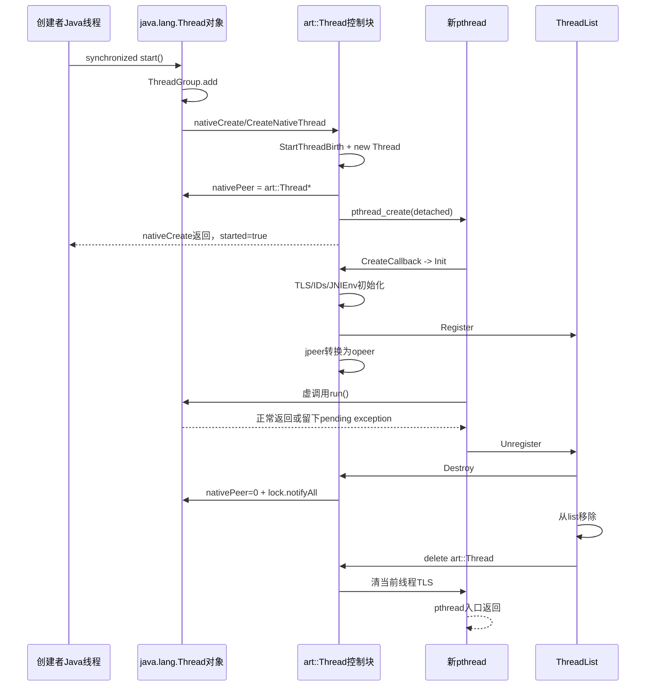
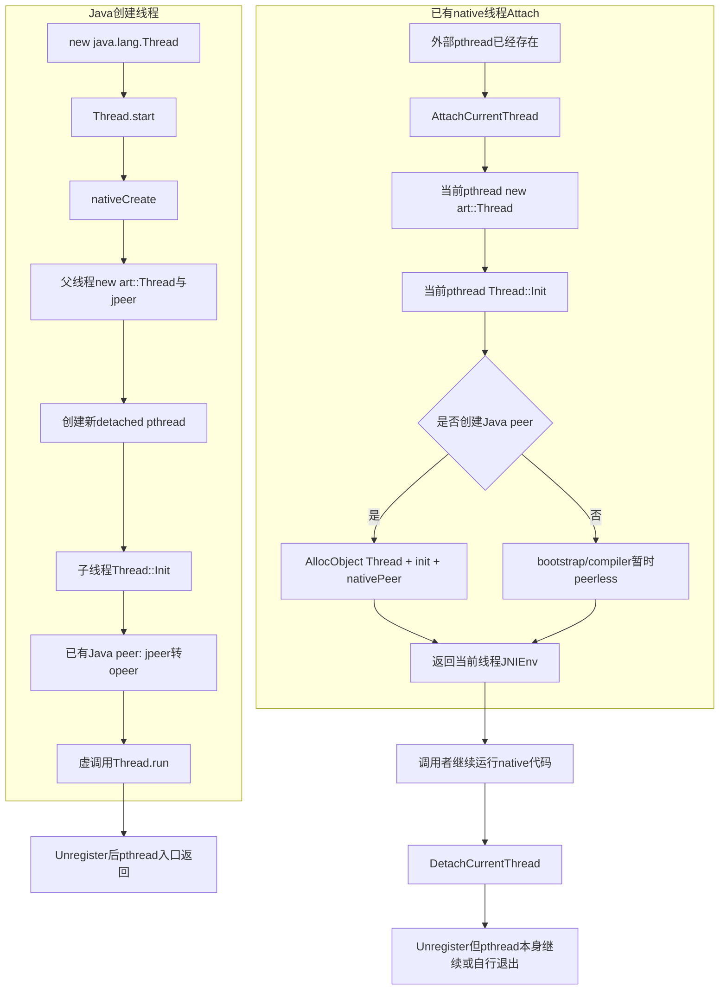
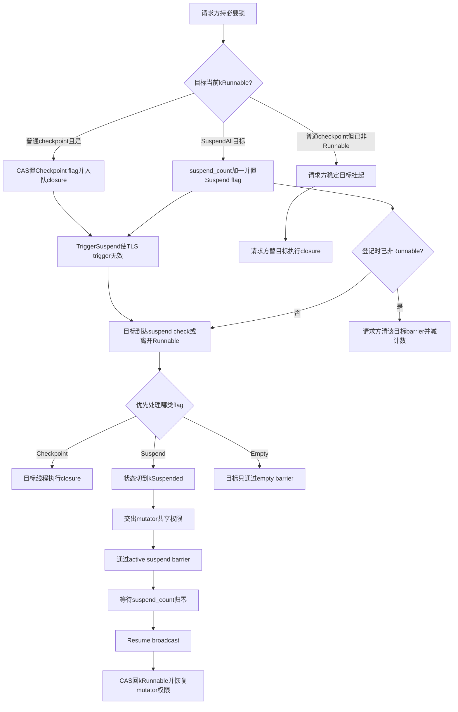

# 第574章 Android ART Thread：创建、Attach、TLS/JNIEnv、Java Peer、ThreadList、Safepoint、Checkpoint与SuspendAll链

> 源码基线：Android 11 `android-11.0.0_r48`。本章只在macOS上阅读和检索源码，不创建JavaVM、不启动Android Runtime、不执行GC/调试器挂起，也不编译AOSP。
>
> 本章主问题：一个`java.lang.Thread`怎样变成pthread与`art::Thread`；已有native线程为什么要Attach；`Thread::Current()`、JNIEnv、Java peer和ThreadList如何互相连接；Java状态、ART内部状态、挂起请求、suspend point、checkpoint和SuspendAll又怎样协作，使GC能够安全观察所有mutator？

## 1. 先纠正十个常见误解

`Thread.start()`不是直接调用`run()`，而是跨JNI创建一个detached pthread；`Thread.join()`也不是`pthread_join`。`java.lang.Thread`、`art::Thread`和pthread是三层不同对象。`nativePeer`只是Java对象里保存的native指针，不是所有权智能指针。`Thread::Current()`从native TLS取值，不是查Java Thread对象。`AttachCurrentThread`不是`Thread.start()`的另一个名字，而是把一个已经存在的native线程登记进ART。ART所谓“suspended state”泛指任何非`kRunnable`状态，不只`kSuspended`。Java `RUNNABLE`也不等于Linux当前正在CPU上运行。设置`suspend request`不代表目标已经停稳。checkpoint不一定在目标线程物理执行：目标若已非runnable，请求线程可以替它执行closure。SuspendAll也不是发完请求就结束，它还要过barrier并取得mutator lock独占权。

## 2. 一句话总览

Java `start()`先把Thread加入ThreadGroup，再由`nativeCreate`进入`Thread::CreateNativeThread`；父线程创建`art::Thread`、global JNI peer、JNIEnv并写入`nativePeer`，随后启动detached pthread。子pthread在`CreateCallback`里运行`Thread::Init`，把自身写入TLS、创建多种线程ID、安装JNIEnv、注册ThreadList，再把临时global peer换成可由GC访问的`opeer`，最后调用Java `run()`。退出时Unregister先Destroy：派发未捕获异常、通知ThreadGroup、清零`nativePeer`并唤醒join者，然后移出ThreadList、删除`art::Thread`并清TLS。运行期间，state与flags共同决定线程能否访问Java堆；checkpoint、suspend count、suspend trigger、barrier和mutator lock把“发请求”推进成“所有目标已到安全观察状态”。

## 3. 本章要建立的八本账

第一本是对象账：Java Thread、`art::Thread`、pthread、JNIEnv各是谁。第二本是身份账：Java tid、Linux tid、pthread_t、thin-lock ID不能混。第三本是出生账：ThreadGroup、thread birth计数、nativePeer、pthread_create各在哪一步变化。第四本是TLS账：当前native线程怎样O(1)找到自己的`art::Thread`。第五本是登记账：ThreadList何时拥有指针，退出怎样防并发删除。第六本是状态账：Java六态、ART内部多态和OS调度态分别回答什么问题。第七本是协作账：flag、suspend_count、checkpoint closure、barrier各承诺什么。第八本是堆访问账：`kRunnable`、mutator lock与可移动对象引用为什么必须一起理解。

## 4. 主要源码地图

Java入口看`libcore/ojluni/src/main/java/java/lang/Thread.java`。JNI桥和Java状态映射看`art/runtime/native/java_lang_Thread.cc`。线程创建、Attach、TLS初始化、checkpoint与销毁看`art/runtime/thread.cc`、`thread.h`、`thread-inl.h`、`thread-current-inl.h`。状态枚举在`thread_state.h`，RAII状态切换在`scoped_thread_state_change-inl.h`。全局登记、checkpoint遍历与SuspendAll在`thread_list.cc/.h`。mutator lock的特殊语义在`art/runtime/base/mutex.h`和`mutex-inl.h`。编译代码和解释器的具体suspend check散布在quick entrypoints、架构fault handler与interpreter目录，本章只追到共同的Thread协议。第561章曾横向串起Thread与Java Monitor；本章是其纵向加深版，重点补齐创建/Attach/退出所有权和checkpoint两种执行方，不把旧结论简单重复一遍。

## 5. 三层线程对象分别是什么

`java.lang.Thread`是应用能持有的堆对象，保存名字、优先级、daemon、Runnable target、ThreadLocal等Java语义。`art::Thread`是ART的native线程控制块，保存state/flags、JNIEnv、managed stack、pending exception、TLS allocation buffer、peer、checkpoint等运行时数据。pthread是操作系统执行实体，拥有native栈和调度身份。一个正常已启动Java线程同时关联三者，但它们创建与销毁的时刻并不相同。

## 6. 为什么不能把`nativePeer`当成第四个对象

`nativePeer`是Java Thread里的`long`字段，值为`art::Thread*`的位模式；它是桥，不是独立资源。字段为0表示当前没有可用native peer，但还要结合`started`才能区分从未成功启动与已经终止。读取到非0也不能无锁长期使用，因为目标线程可能正在Unregister并删除该指针；ART的native方法通常持`thread_list_lock_`，或先把目标可靠挂起。

## 7. Java Thread中最重要的Android字段

`started`记录是否至少成功启动过，即使线程后来终止仍保持true。`nativePeer`在创建前和销毁后为0。Android另加`lock`，供join、sleep与park相关协议使用，避免应用在Thread对象自身monitor上干扰内部等待。`unparkedBeforeStart`保存启动前收到的permit。`daemon`决定JavaVM退出等待语义，`systemDaemon`则标记由`java.lang.Daemons`管理的Android系统daemon；二者不是同一层属性。

## 8. 先画四条时间轴而不是只看一条

Java对象通常在构造函数返回时已存在，但native对象尚无。调用start后，父线程先创建`art::Thread`并写`nativePeer`，再尝试pthread_create；子pthread随后才设置自己的TLS并进入ThreadList。Java `start()`返回时子线程可能还没执行`run()`。退出又反过来：`run()`先返回，`art::Thread`仍要执行Destroy/Unregister；`nativePeer`在Destroy中清零并通知join者，之后native控制块才删除，最后pthread入口返回。

## 9. 第一幅图：Java start到退出的完整对象链



图里`started=true`发生在父线程的nativeCreate成功返回之后，不等待子线程完成Init。join真正依赖的是Destroy清零`nativePeer`并通知，而不是等待图中最后一行的POSIX join。

## 10. `Thread`构造函数有没有创建native线程

没有。Java构造只初始化Java字段、选择ThreadGroup、继承上下文、分配Java tid等。此时`nativePeer=0`、`started=false`，状态被解释为NEW。把“new Thread”说成“新建了一个系统线程”会早一大步；真正请求pthread是在`start()`里的nativeCreate。

## 11. `start()`为什么是`synchronized`

它需要把“检查是否启动过”和“发起native创建”串成一次动作，避免两个调用者同时为同一个Java对象创建两条pthread。native侧也明确依赖这个保证，注释说因此知道`nativePeer`应为0且写入不会与另一次start竞争。不过`synchronized(this)`只保护start协议，不替代ThreadList对nativePeer生命周期的锁。

## 12. `started`为何在try前被写回false

字段初始就是false，这次赋值主要服务于finally判断：只有nativeCreate正常返回才置true；若JNIEnv分配或pthread_create抛出OOME，finally看到false就通知ThreadGroup回滚。成功后字段永久为true，所以已终止Thread再次start会立即抛`IllegalThreadStateException`。

## 13. ThreadGroup为什么先`add`再创建pthread

ThreadGroup要在新线程可能开始运行前登记它，并把unstarted计数转成active成员。否则子线程可能极快完成，终止通知却找不到对应成员。失败路径再调用`threadStartFailed`撤销这次登记，因此这是一种“先预登记、失败补偿”的协议，并非pthread成功后才加入组。

## 14. 第一段r48真实Java：`start()`的成功与回滚边界

下面逐字摘自`libcore/ojluni/src/main/java/java/lang/Thread.java`第861—899行：

```java
    public synchronized void start() {
        /**
         * This method is not invoked for the main method thread or "system"
         * group threads created/set up by the VM. Any new functionality added
         * to this method in the future may have to also be added to the VM.
         *
         * A zero status value corresponds to state "NEW".
         */
        // Android-changed: Replace unused threadStatus field with started field.
        // The threadStatus field is unused on Android.
        if (started)
            throw new IllegalThreadStateException();

        /* Notify the group that this thread is about to be started
         * so that it can be added to the group's list of threads
         * and the group's unstarted count can be decremented. */
        group.add(this);

        // Android-changed: Use field instead of local variable.
        // It is necessary to remember the state of this across calls to this method so that it
        // can throw an IllegalThreadStateException if this method is called on an already
        // started thread.
        started = false;
        try {
            // Android-changed: Use Android specific nativeCreate() method to create/start thread.
            // start0();
            nativeCreate(this, stackSize, daemon);
            started = true;
        } finally {
            try {
                if (!started) {
                    group.threadStartFailed(this);
                }
            } catch (Throwable ignore) {
                /* do nothing. If start0 threw a Throwable then
                  it will be passed up the call stack */
            }
        }
    }
```

注意“启动过”的线性化边界是nativeCreate正常返回后写`started=true`。源码允许一次未真正创建pthread的失败尝试回滚后再次调用start；“永远只能调用一次”更准确地说是“一旦成功启动过就不能再次启动”。

## 15. nativeCreate先检查什么

`Thread_nativeCreate`先检查Runtime是否处于Zygote禁止创建线程的区段；若是就抛`InternalError("Cannot create threads in zygote")`。这不是一般的进程级“Zygote永远不能有线程”，而是fork准备协议设置的一段临界状态。通过检查后才调用`Thread::CreateNativeThread`。

## 16. thread birth计数解决什么竞态

CreateNativeThread在`runtime_shutdown_lock_`下检查Runtime是否已经shutting down；未关闭才调用`StartThreadBirth()`增加正在出生的线程数。Runtime销毁会先封住新出生并等待该计数归零。这样不会出现析构ThreadList/JavaVM的同时，另一条父线程刚通过检查并准备注册新child的情况。

## 17. 为什么检查与计数必须在同一把锁内

若先无锁读“未关闭”，再稍后加出生计数，shutdown可能插入两步之间：它看到计数为0便拆资源，而创建者仍继续。`runtime_shutdown_lock_`把“是否允许出生”与“宣告我正在出生”合成不可分割的门禁。失败路径和子线程Init成功路径都必须对应`EndThreadBirth()`。

## 18. `art::Thread`为什么由父线程先分配

父线程需要在pthread真正运行前准备跨线程握手资料：daemon属性、Java peer global引用、临时JNIEnv和nativePeer。尤其是JNIEnvExt的分配失败能在调用`start()`的Java线程上转成带原因的OOME，而不是让刚出生且尚未有完整JNI环境的子pthread处理这项可恢复失败；C++控制块自身的分配不应笼统套用这条结论。

## 19. `jpeer`为何必须是GlobalRef

传入nativeCreate的`jobject`只保证在本次JNI调用期间有效，父线程返回后局部引用会失效；新pthread何时运行不可预测。ART把Java Thread保存为global JNI引用`jpeer`，确保GC不会在子线程建立正式root前回收它。子线程完成注册并可安全保存heap pointer后，再把它转换成`opeer`并删除global引用。

## 20. 为什么源码强调`jpeer`与`opeer`不能同时可见

两者代表启动阶段不同的root方式：`jpeer`由JNI全局表追踪，`opeer`是`art::Thread`自己的managed root。CreateCallback先取得对象指针并写opeer，再通过`DeleteJPeer`把jpeer置null、删除GlobalRef；清理失败路径也反向保证不会留下双重来源。这个不变量让root扫描和析构不必猜同一peer是否被重复持有。

## 21. stackSize不是原样交给pthread

`FixStackSize`会把0替换为Runtime默认值，兼容Dalvik习惯额外增加1MB，满足`PTHREAD_STACK_MIN`，为显式或隐式栈溢出检查预留空间，并向页大小对齐。因而Java构造参数表达请求，不是最终pthread stack的精确字节数。

## 22. `nativePeer`为何在pthread_create之前写入

父线程已经拥有新建的`art::Thread`，于是先把指针写入Java字段，再创建pthread；源码说start已同步，所以这次写不会与另一start竞争。这样子线程启动后能立即与既有Java peer互相定位。代价是创建尝试期间字段会短暂非0；若后续失败，native路径必须在抛OOME前重新清零。

## 23. `isAlive()`到底测量哪个边界

Android实现只是判断`nativePeer != 0`。因此它测量的是native peer当前是否存在，而不是“pthread此刻占CPU”、也不是“run已经开始”。成功创建期间，start调用者仍在nativeCreate里时nativePeer已经写入；终止期间，run已返回但Destroy尚未清零时仍为alive。

## 24. 为什么在父线程预创建JNIEnvExt

每条attached ART线程都需要自己的JNIEnvExt。CreateNativeThread在父侧先调用`JNIEnvExt::Create(child_thread, JavaVM, &error_msg)`，因为父侧已有完整JNI环境，分配失败能自然转成调用者的OOME。成功pthread取得其所有权；失败则unique_ptr在父侧回收。

## 25. JNIEnv能否在线程之间随意传递

不能。这里父线程“创建”child的JNIEnvExt，不等于用它调用JNI；对象内部已绑定child `art::Thread`，只通过`tmp_jni_env`交给目标pthread的Init安装。JNIEnv是线程关联句柄，应用native代码也不应缓存一个线程的JNIEnv给另一线程使用；跨线程应缓存JavaVM，再由目标线程GetEnv或Attach。

## 26. pthread为什么设置为detached

CreateNativeThread把attr设为`PTHREAD_CREATE_DETACHED`，所以系统资源由pthread运行库在线程返回后自行回收，ART不会对它调用pthread_join。Java层join另有协议：等待Java Thread的`lock`，检查nativePeer是否清零。把两种join混在一起，会误判native teardown顺序。

## 27. pthread_create成功以后父线程还保证什么

只保证OS已接受并启动新执行实体，且JNIEnv所有权已交给child；它不等待Thread::Init、ThreadList::Register或Java run开始。随后nativeCreate返回，Java写`started=true`，start即可返回。调用者若需要等待业务ready，必须自己用CountDownLatch等同步，不能把start返回当ready信号。

## 28. pthread_create失败怎样完整回滚

父线程在shutdown lock下`EndThreadBirth()`，删除global jpeer，删除尚未Init的`art::Thread`，把Java `nativePeer`清零，然后抛OOME并带上JNIEnv分配或pthread_create错误。异常回到Java start，finally再调用ThreadGroup.threadStartFailed。native资源回滚与Java组成员回滚是两层互补动作。

## 29. CreateCallback何时开始运行

它是pthread入口，参数就是父线程分配的`art::Thread*`。它先取得Runtime并在shutdown lock下确认出生期间Runtime没有开始销毁，然后在“本线程自身”调用Init。这里不能把父线程准备的控制块理解为已完成Attach：直到Init写TLS并Register，这条pthread才正式成为ART可管理线程。

## 30. `Thread::Init`为什么要求`Thread::Current()==nullptr`

Init只应用于尚未attach的当前native线程。若TLS已经能返回一个Thread，再次Init会覆盖身份、重复分配JNIEnv和ThreadList成员。检查也强调Init必须由目标pthread执行：父线程不能替child设置`pthread_self()`、native tid或目标TLS。

## 31. pthread_t与Linux tid何时写入

Init先把`pthread_self()`存入`tlsPtr_.pthread_self`，随后`InitTid()`用ART的GetTid读取系统线程ID。pthread_t是pthread库句柄，Linux tid是内核为当前线程分配的数值，二者用途与类型都不同。在macOS阅读源码时还能看到GetCpuMicroTime的Apple分支未实现，这不影响Android设备上的Linux线程模型。

## 32. `Thread::Current()`怎样做到快速定位

Android/Bionic直接读取保留的`TLS_SLOT_ART_THREAD_SELF`；非Bionic构建读取C++ `thread_local Thread::self_tls_`。Init把当前`this`写进去，再立即断言Current等于this。它不遍历ThreadList，也不调用Java `Thread.currentThread()`，因此热路径可以低成本取得当前runtime控制块。

## 33. 为什么非Bionic还调用`pthread_setspecific`

源码同时把指针放入pthread key和C++ thread_local：快速Current走`self_tls_`，pthread key则带析构回调`ThreadExitCallback`，用来发现native线程退出时忘记DetachCurrentThread。两者目的不同，一个服务快速取值，一个服务生命周期检查。

## 34. thin-lock ID是什么

Init从ThreadList分配一个小整数`thin_lock_thread_id`，供对象轻量锁在有限位数中记录owner。它会复用，既不是Linux tid，也不是pthread_t，更不是Java `Thread.getId()`。Unregister要到`art::Thread`删除后才释放它，避免短暂出现两个活控制块拥有同一thin-lock ID。

## 35. JNIEnv在Init如何安装

若CreateNativeThread已传入预创建的JNIEnvExt，Init校验其JavaVM和self后直接保存；Attach路径没有预创建对象，就在当前线程创建。之后`GetJniEnv()`返回的是`tlsPtr_.jni_env`。从JNIEnv反找Thread则通过JNIEnvExt的self，因此“Thread、JNIEnv、当前TLS”构成互相一致的一组绑定。

## 36. ThreadList::Register是出生链的完成点吗

它是“进入ART全局线程集合”的关键点，但还不是Java run开始。Init先完成栈边界、signal stack、entrypoints、suspend trigger、card table、tid、解释器TLS、当前TLS、thin-lock ID和JNIEnv，然后Register。Register返回后CreateCallback还要建立peer、线程名、优先级与callback，最后才虚调用run。

## 37. Register为何同时持两把锁

它依次持`thread_list_lock_`和`thread_suspend_count_lock_`，要原子地完成两件事：把新Thread加入list，以及让它的suspend_count反映正在进行的所有SuspendAll。否则新线程可能在SuspendAll已经枚举完旧list之后加入，并在GC持有全局安全假设时进入Java堆。

## 38. 新线程怎样继承正在进行的SuspendAll

ThreadList维护`suspend_all_count_`。Register在两把锁内，按次数给新Thread逐次`ModifySuspendCount(+1)`，再放入list。新线程初始处于非runnable的`kNative`，将来想转成kRunnable时看到suspend flag就等待resume_cond，不能逃过现有SuspendAll。

## 39. Register还初始化哪些GC相关状态

启用read barrier时，它根据ConcurrentCopying collector当前状态设置线程的is_gc_marking、read-barrier entrypoints与weak-ref access开关。新Thread不能只加入容器而沿用默认值，否则会与并发GC的全局阶段不一致。最后`NotifyInTheadList()`通知该线程已在list中，允许依赖这一条件的解释器状态生效；源码函数名确实拼成了`Thead`。

## 40. CreateCallback怎样完成peer交接

进入`ScopedObjectAccess`后，线程已是runnable并能安全访问堆。它把jpeer解码成`mirror::Object*`写入opeer，然后删除GlobalRef；接着从Java对象读取名字和priority设置到native。这样Java对象是语义主体，native Thread只缓存运行时需要的视图。

## 41. `unparkedBeforeStart`解决什么竞态

若别的线程在目标尚未alive时调用unpark，尚无native park event可接收permit，于是Java字段记录这次事实。CreateCallback在`thread_list_lock_`下读取该字段，必要时对自己Unpark，防止“先unpark、后start”丢失许可。它和LockSupport的一位permit语义一致，不是累计多次信号。

## 42. Java `run()`在哪里真正被调用

CreateCallback通过缓存的`WellKnownClasses::java_lang_Thread_run`执行虚调用，因此子类覆盖的run会被正确分派；Thread默认run才转调构造时的Runnable target。调用发生在新pthread上，而不是start调用者上。直接调用`t.run()`只是一条普通Java方法调用，不会经过这条创建链。

## 43. `run()`抛出未捕获异常后pthread会怎样

反射式调用返回时pending exception仍挂在当前`art::Thread`。CreateCallback不会让C++异常跨pthread边界，而是继续Unregister；Destroy中的`HandleUncaughtExceptions`调用Java `dispatchUncaughtException`，并处理handler自身再抛异常的情况。无论业务正常返回还是未捕获异常，资源收尾都走同一出口。

## 44. Unregister为什么要求当前线程自己调用

它会执行可能进入managed code的Destroy、删除自己的JNIEnv、清当前TLS并最终让pthread返回，这些操作依赖self等于Thread::Current。外部线程不能直接delete一个仍在执行的Thread。想操作目标必须在ThreadList锁和挂起协议下取得稳定性，而最终注销仍由目标自己完成。

## 45. Destroy为什么发生在移出ThreadList之前

Destroy可能派发Java未捕获异常、通知ThreadGroup、取得mutator access、退出JNI MonitorEnter留下的monitor、释放GC线程本地buffer，耗时且可能发生suspend。ThreadList先增加`unregistering_count_`，然后仍保留self可被Runtime等待，再执行这些工作；若先从list删除或清TLS，回调中的当前线程与GC root关系都会失真。

## 46. Android是否调用Java私有`Thread.exit()`

r48当前ART退出链不调用它。`Thread::Destroy`直接执行`RemoveFromThreadGroup`，而Java源码的`getThreadGroup()`还有“Work around exit() not being called”注释：线程TERMINATED时假装返回null。因而不能依据上游JDK的私有exit推断Android会主动清空target、ThreadLocal等Java字段；只有当终止的Thread及这些字段不再从其他root可达时，GC才能回收它们，应用长期强持有Thread对象也可能连带保留这些引用。

## 47. nativePeer清零为何早于删除`art::Thread`

Destroy仍持有opeer并处于可访问堆的scope，它先把Java字段设为0，再获取Java Thread的`lock`并NotifyAll。join等待者醒来后重新检查`isAlive()`，看到false即可返回。之后Unregister才从list删除、delete self。对Java语义来说线程已终止；native尾部仍有少量内部清理。

## 48. 第二段r48真实Java：Android的join在等什么

下面逐字摘自`Thread.java`第1426—1451行：

```java
    public final void join(long millis)
    throws InterruptedException {
        synchronized(lock) {
        long base = System.currentTimeMillis();
        long now = 0;

        if (millis < 0) {
            throw new IllegalArgumentException("timeout value is negative");
        }

        if (millis == 0) {
            while (isAlive()) {
                lock.wait(0);
            }
        } else {
            while (isAlive()) {
                long delay = millis - now;
                if (delay <= 0) {
                    break;
                }
                lock.wait(delay);
                now = System.currentTimeMillis() - base;
            }
        }
        }
    }
```

循环是必要的：wait可能虚假唤醒，也可能被无关通知唤醒；真正条件始终是`nativePeer==0`。Destroy在同一lock monitor下notifyAll，形成条件变量式协议。源码JavaDoc仍提`this.wait/notifyAll`是上游描述，Android实际代码已经改成独立lock。

## 49. Unregister删除顺序为什么很讲究

Destroy之后，它在ThreadList里循环，只有目标没有尚待满足的suspend request时才移出list，防止请求者持有悬空指针。然后delete self，再释放thin-lock ID，再清pthread TLS，最后减少unregistering_count并广播thread_exit_cond。清TLS放在delete后，是为了析构期间`Thread::Current()`仍能返回有效self；但delete后绝不能再把self传给锁检查。

## 50. 第二幅图：普通Java创建与native Attach是两条入口



最关键区别：Java start创造新的pthread，Attach接管当前已经存在的pthread。Detach只解除ART关系，不负责终止外部pthread；CreateCallback的Unregister则正好位于新pthread入口的末尾。

## 51. `AttachCurrentThread`适用于什么场景

native库自己创建的pthread、VM启动主线程等需要调用JNI或进入managed code时，必须先附着到JavaVM。JavaVM的Attach入口最终调用`Thread::Attach`，为当前pthread创建`art::Thread`、TLS和JNIEnv。若同一线程已经attached，JNI规范层通常直接返回既有JNIEnv，不应重复创建控制块。

## 52. Attach为何不调用pthread_create

执行Attach函数的就是要被附着的pthread，所以它直接`new Thread`并在当前栈上运行Init。也正因此Attach返回后调用者还在原生入口继续工作；它必须在退出pthread前DetachCurrentThread。把Attach理解成“让ART启动一个后台线程”会把执行身份完全画反。

## 53. Attach也要走thread birth门禁吗

要。Attach在runtime_shutdown_lock下检查shutting down，调用StartThreadBirth，构造并Init，随后EndThreadBirth。虽然没有创建OS线程，但它正在创建一个会进入ThreadList的ART成员，对Runtime销毁构成同样的竞态，因此必须计入“出生中”。

## 54. Attach与start共用哪些初始化

两者最终都运行`Thread::Init`：建立pthread_self、栈边界、TLS entrypoints、suspend trigger、card table、tid、解释器TLS、Thread::Current、thin-lock ID、JNIEnv以及ThreadList注册。差异主要在谁预创建JNIEnv、Java peer从哪里来，以及谁负责pthread生命。

## 55. Attach如何创建Java peer

Runtime已启动且要求create_peer时，`CreatePeer`用JNI `AllocObject(Thread)`分配对象，再非虚调用内部Thread.init，传入ThreadGroup、名字、native priority和daemon；之后把opeer与Java nativePeer互相连接。`Thread::Attach`成功返回到`Runtime::AttachCurrentThread`后，后者还会调用`NotifyThreadGroup`完成“已启动”登记。它不能调用普通公开构造再start，因为pthread早已存在，不能再创建第二个执行实体。

## 56. supplied peer路径是什么

另一个Attach重载接收已有`jobject thread_peer`，在当前线程的ScopedObjectAccess里把它写成opeer，并把其nativePeer指向self。它用于运行时已经准备好Java对象的场景。无论创建peer还是安装peer，都发生在Init/Register之后，Thread可以短暂作为已登记但尚无managed peer的对象存在。

## 57. 为什么主线程需要两阶段Attach

Runtime::Init早期ClassLinker和核心Java类还未准备好，无法立即构造`java.lang.Thread`对象，于是先peerless Attach，让native主线程拥有ART TLS/JNIEnv并可参与启动。后续`Thread::FinishStartup`再创建peer、加入main ThreadGroup。这个启动特例也解释了Java `start()`注释：main和VM内部system线程不一定走公开start方法。

## 58. peerless Thread是不是不在ThreadList

不是。Init已经Register，它照样受SuspendAll、GC和Runtime shutdown管理，只是暂时没有Java Thread对象可返回。读Thread dump或callback代码时要容许`opeer==nullptr`，不能把“无peer”等价为“unattached”。attached的核心判据是当前TLS/ThreadList/JNIEnv关系。

## 59. DetachCurrentThread检查什么

JavaVM detach要求当前线程确实attached，且没有正在执行的managed frames；随后调用ThreadList::Unregister。Detach不会强行弹掉Java栈，因为那会破坏异常、monitor与GC root。外部native线程若忘记Detach就直接退出，pthread TLS析构器会发出严重诊断。

## 60. ThreadExitCallback为什么给一次“补救机会”

当`ThreadExitCallback`被pthread TLS析构机制调用时（r48中非Bionic Init明确把self写入该pthread key），若仍有Thread，它会警告未Detach并再次把key设回self，让POSIX在下一轮析构迭代再检查。它不是自动安全Detach，因为pthread退出阶段任意managed回调和锁协议可能已不可靠；第二次仍触发就fatal。Android/Bionic的Current主要走保留TLS槽，阅读时不要把host侧pthread-key细节反推成所有目标都走同一取值路径。

## 61. ThreadList拥有的究竟是什么

`list_`保存注册中的`art::Thread*`，并在Unregister中负责移除和delete。Java Thread对象由GC管理，pthread由pthread库/创建者管理，JNIEnv归对应art::Thread析构。将这几种所有权分开，就能理解为什么Java对象可能早于pthread构造、又晚于native控制块被GC回收。

## 62. thread_list_lock保护哪些观察

它保护list成员关系，也让从Java `nativePeer`解码出的Thread在检查期间不会被Unregister删除。比如`nativeGetStatus`、interrupt、getNativeTid会在锁内调用`FromManagedThread`。仅仅把64位字段原子读出，并不足以保证指针解引用时仍有效。

## 63. `unregistering_count_`为何不能只看list大小

线程在Destroy阶段仍可能执行managed回调和长耗时GC buffer回收，它还没从list移除但已经进入退出流程；Runtime shutdown必须等这些注销动作完整结束。Unregister先增加count，尾部清TLS后再减少并broadcast，形成比“list里还有几个元素”更精确的进行中屏障。

## 64. 四种线程ID一张口头对照表

Java `Thread.tid`是面向managed API的递增long，通常不复用；Linux tid标识内核线程，可用于调度、信号、`/proc/self/task`；pthread_t是pthread库句柄；thin-lock ID是ART小位宽、可复用的monitor owner编码。日志里的`tid`要结合字段来源，不要见到数字相同就认为同一种身份。

## 65. `Thread.currentThread()`和`Thread::Current()`有何关系

Java native方法`Thread_currentThread`先从JNIEnv取得当前`art::Thread`，再返回其opeer的local JNI引用。底层起点仍是当前JNIEnv/TLS；只有拥有peer后才能返回Java对象。前者面向Java调用者，后者面向ART C++热路径，不能递归地说它们互相查找。

## 66. JNIEnv怎样反向证明“我是谁”

`ThreadForEnv`把JNIEnv向下转为JNIEnvExt并调用GetSelf。ART用这个绑定验证JNI调用发生在哪条attached线程上，也使ScopedObjectAccess能从env定位state与mutator权限。若把JNIEnv跨线程传递，GetSelf仍指向原线程，所有锁、local reference和exception状态都会错位。

## 67. Java Thread对象何时不再能定位native Thread

CreateNativeThread失败时nativePeer回滚为0；正常退出时Destroy清零；两者之后`FromManagedThread`返回null。Java对象仍可能被应用强引用，名字、tid等字段也仍可读，但已不能向native执行实体发interrupt或取native tid。TERMINATED不是“Java对象被销毁”。

## 68. `Thread::Destroy`还回收哪些线程局部资源

它自动退出该线程通过JNI MonitorEnter持有的monitor，删除jpeer或class-loader override global ref，处理异常与ThreadGroup，回收线程本地allocation buffer，最后撤销ConcurrentCopying mark stack。析构再删除JNIEnv、检查无未处理checkpoint/flip/deoptimization并释放等待设施。将复杂操作放Destroy、简单内存释放放析构，是有意的两阶段销毁。

## 69. 为什么join返回不表示所有native指令都执行完

join条件在Destroy中nativePeer清零，后面仍会撤销buffer、从ThreadList移除、delete self、清TLS，然后CreateCallback返回。Java规范关心Thread执行结束及happens-before，而不是暴露ART内部最后几条清理指令。因此诊断极短窗口时，应区分Java TERMINATED可见点和pthread函数真正return。

## 70. 到这里应怎样复述生命周期

一句可检验的复述是：Java先有对象；start的父线程预登记组、建立native控制块与global peer、写nativePeer、创建detached pthread；child自建TLS/JNIEnv并进ThreadList，再运行Java；退出由child Destroy清Java关系和唤醒join，ThreadList删native控制块，最后pthread返回。任何省略“父/子线程是谁”的讲法都容易在JNIEnv和TLS处出错。

## 71. ART的ThreadState回答什么问题

它主要回答“线程当前能否访问Java堆、正在等待哪类Runtime事件”，不是Linux scheduler状态。r48枚举从kTerminated、kRunnable到多种waiting、kStarting、kNative和kSuspended。细分状态帮助GC、debugger与thread dump诊断，但Java API最终只暴露六种粗粒度Thread.State。

## 72. 源码中的“a suspended state”到底是什么

`thread_state.h`明确规定：函数名里的ToSuspended/FromSuspended和文字“a suspended state”，表示任何非`kRunnable`状态，也就是保证不会访问Java堆的状态；枚举`kSuspended`只是其中一个。于是处于kNative、kWaiting或kBlocked的线程在ART堆访问意义上都属于suspended state，却不一定是“被GC暂停”。

## 73. `Thread::IsSuspended()`又是同一个意思吗

还要更谨慎：r48的helper会同时看“state非kRunnable”和`kSuspendRequest` flag，用于确认某个显式挂起请求已经被目标兑现。它并不等同于单纯`GetState()!=kRunnable`。源码同一词根覆盖“非runnable类别”“kSuspended枚举值”“请求已兑现谓词”三层语义，阅读时最好把条件展开写。

## 74. Java `RUNNABLE`为什么可能并未在运行

Java Thread.State把“正在JVM执行”和“可运行但等CPU”等都归RUNNABLE；Android还把ART kNative、kSuspended、kWaitingWeakGcRootRead映射为Java RUNNABLE。它是监控分类，不是调度事实，更不能证明线程正持有CPU或正访问堆。

## 75. `kNative`为什么属于Java RUNNABLE却不能访问堆

普通JNI调用从managed进入native时会把ART线程从kRunnable切到kNative并放弃mutator共享权限；此时native代码若要操作对象必须通过JNI handle，不能长期持有未经保护的raw heap pointer。Java监控仍把“在native方法中执行”显示为RUNNABLE，两套状态回答的是不同问题。

## 76. `kSuspended`为什么也映射Java RUNNABLE

它表示线程因GC、debugger等ART内部原因停住，不是Java语言定义的Object.wait、sleep或monitor阻塞。Java六态没有“VM内部暂停”这一项，因此nativeGetStatus映为RUNNABLE。用`getState()`轮询等待GC suspend既不可靠，也不是同步API。

## 77. 多种内部waiting为何压缩成Java WAITING

kWaitingForGcToComplete、kWaitingForCheckPointsToRun、kWaitingForDebuggerSend、kWaitingForJniOnLoad等在ART诊断上原因不同，但nativeGetStatus大多返回Java WAITING。Java层想知道细因需结合stack trace、thread dump与Runtime日志，单看枚举会丢信息。

## 78. NEW与TERMINATED为什么需要`started`

两者都可能`nativePeer==0`。nativeGetStatus先以`has_been_started ? kTerminated : kStarting`作为默认，再在thread_list_lock内尝试从nativePeer取得真实Thread；有peer就用内部状态。于是`started=false`表示NEW，成功启动后即使peer已销毁，`started=true`仍能返回TERMINATED。

## 79. 第三段r48真实Java：`getState()`不是同步屏障

下面逐字摘自`Thread.java`第2013—2020行：

```java
    public State getState() {
        // get current thread state
        // Android-changed: Replace unused threadStatus field with started field.
        // Use Android specific nativeGetStatus() method. See comment on started field for more
        // information.
        // return sun.misc.VM.toThreadState(threadStatus);
        return State.values()[nativeGetStatus(started)];
    }
```

其JavaDoc明确说用于监控而非同步控制。返回值只是锁内采样后映射的瞬间状态；函数返回时目标可能已经变化。若业务需要等待完成用join，需要等待条件用锁/condition/latch，而不是循环猜状态。

## 80. state与flags为何压在同一个32位值中

`StateAndFlags`把16位flags与16位state放进一个`AtomicInteger`同尺寸union。关键转换可以用一次CAS同时判断旧状态与挂起/checkpoint标志，避免“刚检查无请求，另一线程立刻置flag，而本线程又切状态”造成漏响应。不能把state字段当普通独立enum随意赋值。

## 81. r48有哪四个ThreadFlag

`kSuspendRequest`表示suspend_count大于0、线程应进入safepoint handler；`kCheckpointRequest`要求执行普通closure后继续；`kEmptyCheckpointRequest`只要求证明跨过下一个安全点并过barrier；`kActiveSuspendBarrier`说明至少一个SuspendAll等待该线程报告已停稳。它们可以并存，所以处理顺序和循环都重要。

## 82. suspend_count为何不是boolean

GC、debugger、instrumentation等多个请求可以嵌套要求同一线程保持挂起。每个+1必须由对应-1抵消；只有降到0才清`kSuspendRequest`。若用boolean，一个调用方Resume可能提前放走仍被另一调用方需要保持的线程。另有user_code_suspend_count只统计用户/调试类来源的子集。

## 83. `ModifySuspendCount(+1)`是不是目标已经停止

不是。它在锁内增加计数、置flag，必要时登记active suspend barrier，再调用`TriggerSuspend()`；此时只是请求已发布。目标可能仍执行kRunnable代码，直到经过suspend check，或主动转换到非runnable状态。需要确定性等待的调用方必须再等barrier或轮询目标兑现请求。

## 84. `TriggerSuspend()`为何只是把指针设为null

正常时`suspend_trigger`指向它自身的有效地址；触发时设null。编译生成的隐式suspend check从该地址加载，null会引发SIGSEGV，再由ART架构fault handler把控制流导向suspend处理入口。它不是请求线程向目标发送POSIX信号，也不意味着设置瞬间立刻抢占目标。

## 85. suspend point与safepoint在本章如何用词

r48注释两种词都出现：ThreadFlag说进入safepoint handler，更多Runtime代码说suspend point/check。最稳妥的理解是“线程在受控位置检查flags、可安全交出堆访问权的位置/协议”，不是一个全局Safepoint对象。解释器回边、编译代码poll、JNI边界和显式AllowThreadSuspension都可能响应，具体机器码因架构而异。

## 86. 为什么不能在任意指令强停线程

任意时刻可能正持有Runtime内部锁、更新对象引用的一半、使用未登记raw pointer或处在无可解析stack map的位置。协作式suspend让编译器和Runtime只在已知栈与root可解释、锁约束允许的位置进入处理器。代价是请求与到达之间有延迟，所以ART还需要trigger、超时与诊断。

## 87. `AllowThreadSuspension()`做了什么

当前线程先检查是否存在任何flag，有就进入CheckSuspend循环；之后PoisonObjectPointers，用debug机制使跨suspend point错误保留的ObjPtr更容易暴露。它表达“从这里起允许发生移动GC/挂起”，调用者必须把需要跨点存活的对象放在Handle/JNI reference等可更新root里。

## 88. CheckSuspend为什么按checkpoint、suspend、empty排序

源码先处理普通checkpoint，再处理suspend request，最后empty checkpoint，并循环直到相关flag清空。普通checkpoint可能携带必须由runnable目标执行的工作；进入非runnable前需要先跑。若有suspend，FullSuspendCheck会停住直到所有计数释放；恢复后循环才能继续处理后来或仍在的empty request。

## 89. 普通checkpoint承诺什么

请求方提交一个`Closure*`，希望针对每条Thread执行短小检查或状态更新，而不必把所有mutator一起Stop-The-World。对runnable目标，RequestCheckpoint用CAS置flag、排入单个slot或overflow队列、触发suspend check；目标在RunCheckpointFunction中取出一个closure、更新flag，再在suspend-count锁外执行。

## 90. checkpoint为何允许overflow队列

同一线程在响应前可能收到多个请求。首个放`checkpoint_function`，后续放`checkpoint_overflow_`；每次执行后若队列仍有项就把下一项移入主slot，只有完全空才清flag。这样不会因单一bit只记录“有请求”而丢掉不同closure。

## 91. empty checkpoint为什么没有业务closure

它只要求当时仍runnable的线程跨过一个能够响应的点，并给全局barrier减计数；已经非runnable的线程不会处于并发Java heap access中，调用方可直接视为满足。常见用途是同步read barrier/weak reference这类状态，不需要逐线程运行任意业务函数。

## 92. 第三幅图：从置flag到真正安全观察



图中“执行closure”有两种物理线程：runnable目标自行执行；已稳定非runnable时，请求方可用目标Thread作为参数执行。closure设计必须遵守checkpoint契约，不能假设`Thread::Current()`就是传入的target。

## 93. 从kRunnable转到非runnable为何不能直接SetState

`TransitionFromRunnableToSuspended`先验证当前点允许挂起，清理debug ObjPtr；`TransitionToSuspendedAndRunCheckpoints`在CAS改state前先跑完普通与empty checkpoint；CAS成功后才登记放弃mutator共享权限并通过active barriers。直接写state会漏checkpoint、漏barrier或让GC误以为堆访问已停止。

## 94. 从非runnable回kRunnable为何也不能直接SetState

它循环读取state+flags：无flag才CAS成kRunnable并登记取得mutator共享权限；有active barrier先通过；出现checkpoint flag被视为协议错误，因为对非runnable目标应该由请求者处理；有suspend request就在resume_cond等待。只有所有阻止条件清除才能重新访问堆。

## 95. `SetState()`什么时候才允许用

只允许当前Thread在两个非runnable状态之间切换，例如kNative转某个waiting再恢复。它明确拒绝新旧任一方为kRunnable，因为进入/离开runnable需要上述CAS、checkpoint、barrier与mutator权限协议。看到SetState调用时，可先确认两边都属于“不访问Java堆”。

## 96. ScopedThreadStateChange为何重要

RAII构造记录旧状态并切到目标：目标kRunnable走FromSuspendedToRunnable，旧态kRunnable走ToSuspended，两个非runnable间才SetState；析构按相反规则恢复。异常/早返回也不会漏恢复。ScopedObjectAccess是常见封装，它进入kRunnable并保证共享mutator权限；ScopedThreadSuspension则离开kRunnable并在析构恢复。

## 97. mutator lock真的是每条runnable线程都读锁一次吗

不是普通ReaderWriterMutex计数方式。`MutatorMutex`注释明确：mutator线程不会真正逐个持有底层共享锁，而是“处于kRunnable”被逻辑视为共享owner，状态转换只更新线程锁登记。想取exclusive的一方必须先使所有线程进入非runnable，然后真正ExclusiveLock；这让热路径状态切换不必每次争用全局读锁。

## 98. 为什么SuspendAll等完barrier还要ExclusiveLock

SuspendAll源码说barrier结束后所有目标已知挂起，但某线程仍可能处在释放mutator权限的极短过渡；取得exclusive lock提供最终全局内存/锁边界，也保护mutator_lock覆盖的数据。只有这一步完成，调用方才拥有完整Stop-The-World临界区。

## 99. FullSuspendCheck内部为何看起来只有一行RAII

它构造`ScopedThreadSuspension(this, kSuspended)`：构造时从kRunnable切出、处理checkpoint、释放mutator权限、过barrier；对象存在期间恢复路径因`suspend request`仍在会睡在resume_cond；计数归零并broadcast后，析构转换回kRunnable。复杂性被封装在状态转换而非FullSuspendCheck函数体。

## 100. active suspend barrier解决哪个“看见状态”的竞态

请求方先把barrier指针安装到目标并置flag，再判断目标是否已经非runnable；目标从另一侧CAS离开runnable后会提取并递减barrier。无论谁先观察，pending计数只应减少一次。若先查状态再装barrier，目标可能恰好在两步之间停下且永远不会看见新barrier，SuspendAll就会一直等。

## 101. SuspendAllInternal第一阶段做什么

它确认调用方未持mutator exclusive和两个线程管理锁，建立`pending_threads`原子计数；在thread_list_lock与suspend_count lock内增加全局`suspend_all_count_`，遍历除ignore线程外的list，为每个目标`ModifySuspendCount(+1, &pending_threads)`。这既阻止旧线程继续/重新进入Java，也让后来Register者继承挂起计数。

## 102. 已经非runnable的目标还要等它过barrier吗

不必。请求方在安装barrier后若确认`thread->IsSuspended()`，会清除属于本次pending counter的barrier并自己减一，因为目标已经兑现显式请求且不会访问堆。仍runnable的目标则必须在转换路径调用PassActiveSuspendBarriers，由目标减计数。

## 103. SuspendAll怎样等待慢线程

Android配置通常用futex等待`pending_threads`降到0，并带线程挂起超时。超时时在锁内列出仍未suspended的Thread，debug构建可能fatal，release记录error；其他futex错误fatal。它不是无限静默自旋，卡住通常说明目标长期未到suspend point、锁协议损坏或native fast路径异常。

## 104. 新Attach线程为何不会穿过正在进行的STW

SuspendAll在两把锁内先增加`suspend_all_count_`；Register也持同样锁序，读取count并给自己增加对应suspend计数后才加入list。新线程初始kNative，想进入ScopedObjectAccess/kRunnable时会看到flag并等待。ResumeAll减少全局count及list里线程计数，再broadcast放行。

## 105. SuspendAll外层与Internal有何区别

Internal负责发布请求并等所有目标响应barrier；公开SuspendAll随后取得mutator_lock exclusive、记录耗时与long_suspend状态，并开始trace。GC等调用者在这之后访问受保护全局堆结构。两层分开说明“线程都报告了”与“调用方已取得全局独占权限”是两个连续条件。

## 106. ResumeAll为何先释放mutator exclusive

它先结束STW保护，让恢复线程未来能够合法取得逻辑共享权限；随后在list和suspend-count锁内减少`suspend_all_count_`，逐个给非self线程`ModifySuspendCount(-1)`，最后broadcast resume_cond。broadcast只让等待者重试；若还有其他来源的suspend_count，它仍会继续睡。

## 107. `ThreadList::RunCheckpoint`怎样遍历runnable线程

它持list和suspend-count锁尝试给每个非self目标RequestCheckpoint。若成功，目标未来在自己的suspend check执行closure；self由调用线程直接执行。函数返回线程总数，调用方若需要所有异步目标完成，要让closure带barrier并等待，不能把Request成功当执行完成。

## 108. 已非runnable线程的checkpoint由谁执行

RequestCheckpoint会返回false。RunCheckpoint先临时给目标加suspend_count，确认它稳定非runnable，然后在释放全局锁后由当前请求线程调用`checkpoint_function->Run(thread)`，参数是目标Thread。完成后减少计数并broadcast。这不是让沉睡目标醒来跑代码，而是安全地由观察者处理目标状态。

## 109. runnable与非runnable竞态怎样收敛

若RequestCheckpoint因并发状态变化失败，但目标又看起来kRunnable，循环重试；若先加了suspend请求，目标又抢先回runnable，则再次尝试安装checkpoint。最终要么flag成功交给目标自行执行，要么目标在请求约束下稳定非runnable，由请求者执行，不留下“既没装请求也没稳定观察”的缝隙。

## 110. synchronous checkpoint是什么包装

`RequestSynchronousCheckpoint`若目标就是self，释放thread_list_lock后直接执行；远端runnable目标安装一个BarrierClosure，调用方释放list锁并等待barrier；非runnable目标则临时保持挂起并替它运行。它统一给调用者“返回时该目标closure已完成”的语义，但会释放thread_list_lock，调用者不能假设此前取得的目标指针之外的list观察仍不变。

## 111. empty checkpoint为何还要唤醒弱引用和mutex等待者

少数线程可能逻辑保持kRunnable，却阻塞在weak-root访问或Runtime mutex的futex上；仅把TLS trigger设null，它们没有机会执行编译poll。RunEmptyCheckpoint会广播reference processor/system weak条件，并周期唤醒标记为需要响应empty checkpoint的mutex waiter，使其调用CheckEmptyCheckpointFromMutex，避免barrier罕见永久等待。

## 112. 练习一：核对Java start、detached pthread、run与join通知

```bash
#!/bin/bash
set -eu
src=/Users/ninebot/androidSource
j="$src/libcore/ojluni/src/main/java/java/lang/Thread.java"
n="$src/art/runtime/native/java_lang_Thread.cc"
t="$src/art/runtime/thread.cc"
rg -n "started|nativePeer|nativeCreate|void start\(|isAlive\(|join\(long" "$j" | sed -n '1,180p'
rg -n "Thread_nativeCreate|CreateNativeThread|PTHREAD_CREATE_DETACHED|CreateCallback|java_lang_Thread_run" "$n" "$t" | sed -n '1,200p'
rg -n "nativePeer.*0|java_lang_Thread_lock|NotifyAll|Unregister" "$t" | sed -n '1,160p'
rg -Fq 'nativeCreate(this, stackSize, daemon);' "$j"
rg -Fq 'PTHREAD_CREATE_DETACHED' "$t"
rg -Fq 'locker.NotifyAll();' "$t"
echo 'OK: start创建detached pthread，run在child执行，join由nativePeer清零与Thread.lock通知完成'
```

运行后按父线程与子线程分别列出动作，解释为什么start返回不代表run已进入，也解释为什么源码找不到与Java join一一对应的pthread_join。

## 113. 练习二：核对Attach、TLS、JNIEnv、peer与ThreadList登记

```bash
#!/bin/bash
set -eu
src=/Users/ninebot/androidSource
t="$src/art/runtime/thread.cc"
c="$src/art/runtime/thread-current-inl.h"
tl="$src/art/runtime/thread_list.cc"
jvm="$src/art/runtime/jni/java_vm_ext.cc"
rg -n "AttachCurrentThread|DetachCurrentThread|Thread::Attach" "$jvm" "$t" | sed -n '1,220p'
rg -n "TLS_SLOT_ART_THREAD_SELF|self_tls_|pthread_setspecific|Thread::Current" "$t" "$c" | sed -n '1,180p'
rg -n "JNIEnvExt::Create|thin_lock_thread_id|thread_list->Register|CreatePeer|nativePeer" "$t" | sed -n '1,240p'
rg -n "ThreadList::Register|suspend_all_count_|NotifyInTheadList|ThreadList::Unregister|ReleaseThreadId" "$tl" | sed -n '1,240p'
rg -Fq 'thread_list->Register(this);' "$t"
rg -Fq 'Thread::self_tls_ = this;' "$t"
rg -Fq 'for (int delta = suspend_all_count_; delta > 0; delta--)' "$tl"
echo 'OK: 既有pthread的Attach、当前TLS、专属JNIEnv、peer创建和ThreadList门禁已核对'
```

运行后对比CreateNativeThread与Attach：前者由父线程创建新pthread并把预分配JNIEnv交给child，后者在当前既有pthread上直接Init；再说明为什么Register必须在同一临界区继承`suspend_all_count_`。

## 114. 练习三：核对三套状态、flags与checkpoint执行方

```bash
#!/bin/bash
set -eu
src=/Users/ninebot/androidSource
s="$src/art/runtime/thread_state.h"
i="$src/art/runtime/thread-inl.h"
t="$src/art/runtime/thread.cc"
n="$src/art/runtime/native/java_lang_Thread.cc"
tl="$src/art/runtime/thread_list.cc"
sed -n '24,62p' "$s"
rg -n "CheckSuspend|TransitionToSuspendedAndRunCheckpoints|TransitionFromRunnableToSuspended|TransitionFromSuspendedToRunnable" "$i" | sed -n '1,180p'
rg -n "RunCheckpointFunction|RequestCheckpoint|RequestEmptyCheckpoint|FullSuspendCheck" "$t" | sed -n '1,220p'
rg -n "RunCheckpoint\(|checkpoint_function->Run\(thread\)" "$tl" | sed -n '1,140p'
rg -Fq 'case kNative:                         return kJavaRunnable;' "$n"
rg -Fq 'else if (ReadFlag(kSuspendRequest))' "$i"
rg -Fq 'checkpoint_function->Run(thread);' "$tl"
echo 'OK: Java六态、ART堆访问态、flag优先级及非runnable目标由请求方执行checkpoint已核对'
```

回答三个问题：kNative为何映射Java RUNNABLE却不允许raw堆访问；CheckSuspend为何先普通checkpoint；closure收到target参数时为何不能假定当前物理线程就是target。

## 115. 练习四：核对SuspendAll barrier、新线程门禁与ResumeAll

```bash
#!/bin/bash
set -eu
src=/Users/ninebot/androidSource
tl="$src/art/runtime/thread_list.cc"
t="$src/art/runtime/thread.cc"
h="$src/art/runtime/thread.h"
m="$src/art/runtime/base/mutex.h"
rg -n "SuspendAllInternal|pending_threads|suspend_all_count_|ModifySuspendCount|ExclusiveLock|ResumeAll" "$tl" | sed -n '1,280p'
rg -n "PassActiveSuspendBarriers|TriggerSuspend|FullSuspendCheck" "$t" "$h" | sed -n '1,220p'
sed -n '405,418p' "$m"
rg -Fq '++suspend_all_count_;' "$tl"
rg -Fq 'thread->ModifySuspendCount(self, +1, &pending_threads, reason);' "$tl"
rg -Fq 'Locks::mutator_lock_->ExclusiveLock(self);' "$tl"
rg -Fq 'Thread::resume_cond_->Broadcast(self);' "$tl"
echo 'OK: 请求发布、barrier兑现、Register继承、mutator独占与Resume广播五步已核对'
```

画一个目标恰好从kRunnable切到kNative的竞态，说明为何必须先安装barrier再检查IsSuspended；再解释嵌套SuspendAll时一次Resume为何不能提前放行线程。

## 116. 推荐阅读顺序与恢复停靠点

第一遍只追`Thread.java start -> nativeCreate -> CreateNativeThread -> CreateCallback -> run -> Unregister`，标出父线程与child。第二遍追Attach与两阶段main peer，画TLS/JNIEnv/opeer关系。第三遍只读thread_state与状态RAII，强制把“非runnable”“kSuspended”“Java RUNNABLE”分栏。第四遍追RequestCheckpoint和RunCheckpoint的两种执行方。第五遍追SuspendAll的pending barrier、Register继承、mutator exclusive与Resume。中断恢复时以`00-学习进度.md`为锚，先判断自己停在哪本账。

## 117. 本章复读后主动修正的易混表述

第一，Java Thread、art::Thread与pthread创建/销毁时刻不同。第二，start成功返回只说明pthread_create成功，不证明run已开始。第三，nativePeer非0只是可定位入口，使用指针仍需ThreadList稳定性协议。第四，Android join等独立Thread.lock，native pthread是detached。第五，Thread::Attach接管当前既有pthread，不创建新pthread。第六，Thread::Current来自TLS，JNIEnv也绑定Thread。第七，ART“suspended state”是任意非kRunnable，而kSuspended只是一个枚举。第八，Java RUNNABLE会包含kNative与kSuspended。第九，置suspend flag不是停稳，barrier才确认目标响应。第十，普通checkpoint针对非runnable目标可由请求线程执行。第十一，SuspendAll等待barrier后仍需mutator exclusive。第十二，新Register线程通过suspend_all_count继承现有STW。

## 118. 自测题

为什么CreateNativeThread要在父侧预创建JNIEnv并持global jpeer？pthread_create失败后Java与native分别回滚什么？Thread::Init中四类ID如何区分？opeer和jpeer为何不应长期同时存在？Java join在哪个条件上循环？Attach与start谁创建pthread？kNative在Java和ART两层分别是什么含义？普通checkpoint何时由目标执行、何时由请求方执行？active barrier消除哪条竞态？SuspendAll为何还要取得mutator exclusive？能沿对象、出生、TLS、登记、状态、checkpoint、全挂起七条线回答，就掌握了本章。

## 119. 一张可长期复用的心智模型

把Java Thread想成“身份证与业务说明”，pthread是“真正干活的人”，art::Thread是“ART发给这人的工作证和随身档案”，nativePeer是身份证上的工作证编号，TLS是本人衣袋里直取工作证的槽位，JNIEnv是只发给本人的办事窗口，ThreadList是单位花名册。checkpoint是让每个人在下一个检查点完成一张短任务单；SuspendAll则给所有人挂停工牌、等每人交回执，再锁住整个车间。只发停工牌不等于人都停了，看到Java状态RUNNABLE也不等于他正在碰车间里的堆对象。

## 120. 下一章预告与进度锚点

下一章进入Thread最常见的同步落点：对象头LockWord怎样编码thin lock owner与递归计数，竞争时怎样inflate成Monitor，MonitorEnter/Exit、Object.wait/notify、interrupt、线程状态与wait set如何联动，以及锁竞争/死锁诊断怎样从Thread与Monitor还原。恢复以`00-学习进度.md`为准；本章完成标志是120节连续、三幅Mermaid、三段逐字r48 Java源码、第112—115节四个真实可运行的macOS只读练习和复读校验全部通过。
