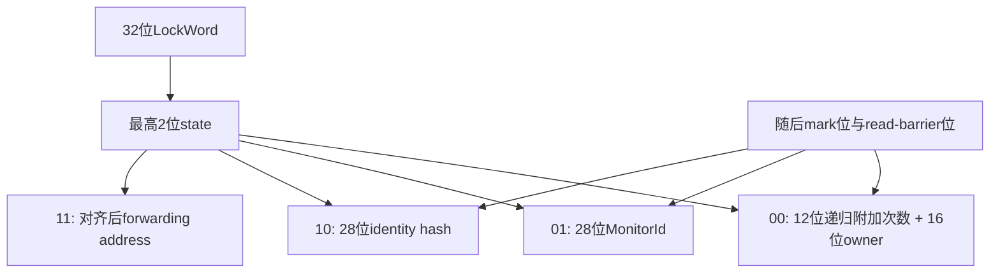
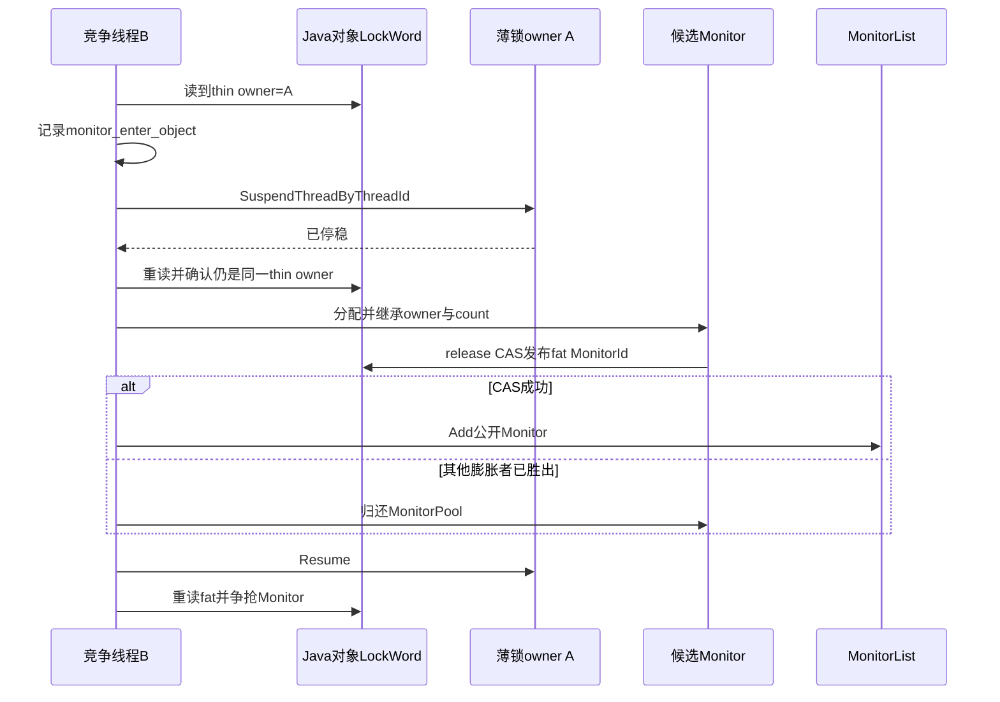
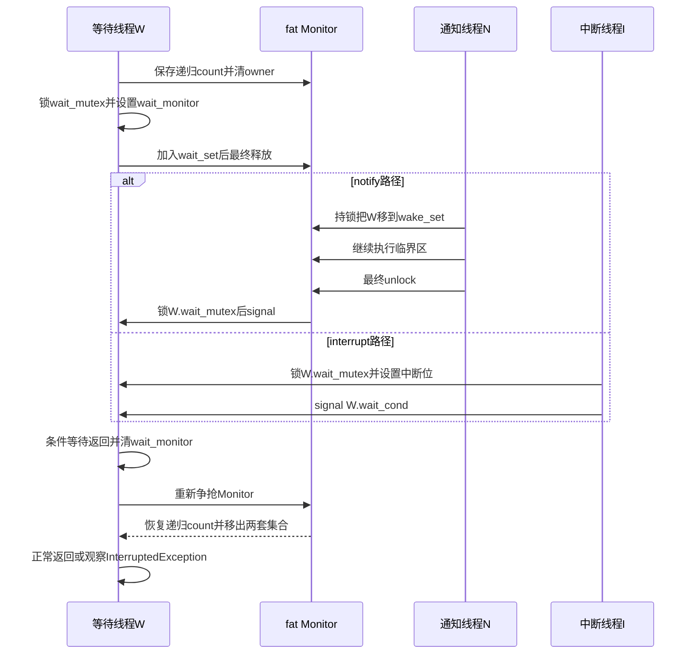

# 第575章 Android ART Object Monitor：LockWord薄锁/胖锁、wait/notify、interrupt、锁膨胀/收缩与死锁诊断链

> 源码基线：Android 11 `android-11.0.0_r48`。本章只在macOS上阅读和检索源码，不启动ART、不制造真实线程竞争、不执行GC，也不编译AOSP。
>
> 本章主问题：Java对象的32位LockWord怎样同时容纳锁、identity hash和GC状态；无竞争薄锁怎样进入与退出；竞争、`wait()`或hash为何触发胖锁；`wait_set_`、`wake_set_`、每线程条件变量和interrupt怎样避免丢唤醒；GC又怎样安全收缩并回收Monitor？

## 1. 本章不是第561章的重复版

第561章横向串过Thread状态、Monitor、`synchronized`、`wait/notify`与线程转储，目标是先建立完整主链。本章改为纵向解剖五个实现难点：LockWord每一位怎样复用；竞争膨胀为什么要暂停薄锁owner；通知为何只“搬队列”而不马上signal；等待者为何先完全释放递归锁、醒后再恢复层数；64位地址为何不能直接塞进28位MonitorId。已经理解Java语义的读者，应把注意力放在状态迁移、线性化点、锁顺序和诊断边界上。

## 2. 先纠正十二个常见误解

对象从出生起就有32位LockWord，但不一定有独立Monitor。薄锁计数0不是“没加锁”，而是“恰好持有一次”。胖锁不是永不退化，只是不会在每次unlock时立即退化。调用`hashCode()`不一定膨胀：未锁对象可直接进入hash状态，已薄锁对象才需要Monitor同时保存hash与锁。`notify()`不释放锁，也不保证被选线程下一刻运行。ART的`Notify()`只把一个线程从wait set搬到wake set，真正signal延迟到最终unlock。`wait()`会释放全部递归层，不是只退一层。醒来、超时或被中断也不等于已经返回Java，它必须重新获得同一Monitor。interrupt不是向目标pthread发送一个“异常信号”，而是设置中断位并signal该线程自己的等待条件变量。`num_waiters_`不只统计`Object.wait()`者，也包括争抢胖锁的线程。MonitorInfo看到的waiters不是所有竞争者。最后，r48没有一段自动求环并抛“死锁异常”的通用Monitor代码；死锁主要靠线程状态、contended object、owner和栈上持锁信息诊断。

## 3. 一句话总览

对象头`monitor_`由`LockWord`解释：无锁时仅保留GC位；无竞争加锁时低16位写thin owner、接着12位写递归附加次数；需要同时承载等待队列、竞争阻塞或identity hash时，ART分配`Monitor`并用release CAS把LockWord发布成fat状态。胖Monitor用一把native mutex实现线程间互斥，再由`owner_`与`lock_count_`单独表达Java重入；`wait_set_`保存尚未通知者，`wake_set_`保存已通知但尚未signal者，每个Thread自己的wait mutex/condition则响应notify、timeout和interrupt。GC在mutator全部暂停时，只对无人持有且`num_waiters_==0`的Monitor收缩，把hash或空状态写回对象头，再从MonitorList摘除并归还MonitorPool。

## 4. 本章要建立的七本账

第一本是位账：state、mark、read-barrier、owner/count、hash/MonitorId分别占哪里。第二本是对象账：Java对象、LockWord、Monitor、Thread四者不是一个对象。第三本是所有权账：thin owner ID、fat `owner_`、native mutex owner和递归计数必须一致。第四本是队列账：wait set、wake set与普通锁竞争者不是同一集合。第五本是时点账：notify、signal、从条件变量返回、重新夺锁、Java方法返回是五个时点。第六本是生命周期账：allocate、Install、MonitorList、Deflate、Sweep、pool reuse。第七本是诊断账：运行时为dump保留了什么，又明确漏了什么。

## 5. 主要源码地图

位布局和状态构造看`art/runtime/lock_word.h`与`lock_word-inl.h`；Java对象里的字段和便捷入口看`art/runtime/mirror/object.h`、`object-inl.h`、`object.cc`。主算法集中在`art/runtime/monitor.cc/.h`，池化编码在`monitor_pool.cc/.h`，线程自己的等待互斥量、条件变量与中断位在`thread.cc/.h`。Java API看`libcore/ojluni/src/main/java/java/lang/Object.java`和`Thread.java`，JNI桥看`art/runtime/native/java_lang_Object.cc`、`java_lang_Thread.cc`。解释器、quick编译代码与JNI最终都汇入Object/Monitor入口；栈上持锁恢复则还会进入`verifier/MethodVerifier`。

## 6. `monitor_`是字段名，不等于里面总装Monitor指针

`mirror::Object`的对象头含一个32位`monitor_`字段，Java层为了快速读identity hash把它映射成`shadow$_monitor_`。字段的解释由最高两位决定，所以同一组32位有时是thin owner/count，有时是hash，有时是MonitorId，有时是GC搬迁forwarding address。把字段名直译成“Monitor指针字段”会同时误解无锁、薄锁、hash和64位进程。

## 7. 四种物理状态为何对应五种逻辑状态

最高两位只有四种组合：`00` thin-or-unlocked、`01` fat、`10` hash、`11` forwarding。`LockWord::GetState()`还会先检查除GC位外其余位是否全0：全0解释成逻辑`kUnlocked`，否则`00`解释成`kThinLocked`。因此枚举有unlocked、thin、fat、hash、forwarding五项，但编码仍只花两位；unlocked是thin物理格式中的特殊零值。

## 8. 第一幅图：32位LockWord怎样分时复用



图里“随后”按位号从高到低描述。普通thin/fat/hash格式中，state之下是1位mark、1位read-barrier，再下方是28位payload；thin再把这28位切成12位count与16位owner。forwarding格式为GC搬迁专用，不能机械套普通GC位布局。

## 9. 薄锁的16位owner到底是哪一种线程ID

低16位保存`Thread::GetThreadId()`得到的ART内部thin-lock ID，不是Java `Thread.getId()`、Linux tid，也不是`pthread_t`。第574章已区分过这四类身份。`kThinLockMaxOwner`是16位全1；无锁的owner为0，有效薄锁owner必须非0，诊断代码也用这一点做基本合法性检查。

## 10. count为0为什么代表持有一次

薄锁把“第一次持有”编码在非零owner里，count只记额外递归次数。因此第一次进入是`owner=T,count=0`，同一线程第二次进入才是count 1；总进入层数恒为`1 + ThinLockCount()`。这样无竞争的常见第一次加锁无需另存一个1，但阅读递归退出代码时必须记住这个偏移。

## 11. 薄锁递归计数为何正好12位

总宽32位，减去2位state、1位read-barrier、1位mark和16位owner，剩下12位。最大附加递归次数是4095，总持有层数可到4096；再递归会溢出薄锁编码，于是`MonitorEnter`触发膨胀，用Monitor里的普通无符号`lock_count_`继续表示递归深度。

## 12. GC状态为什么不能在加锁时随手覆盖

mark与read-barrier位属于GC协议，不属于Java锁本身。构造新thin、fat、hash或default LockWord时，代码都从旧值取`GCState()`并带入新值；启用read barrier时，递归计数变化甚至用CAS，以免和并发GC修改read-barrier位互相覆盖。锁算法只改自己的payload，不拥有整个32位字的所有位。

## 13. forwarding状态为何要单独理解

`kForwardingAddress`用于对象移动时保存新地址，地址按对象对齐位右移后塞入LockWord。该布局不是“state+mark+read-barrier+28位payload”的普通模式；源码也禁止对forwarding状态调用普通read-barrier/mark位修改。应用线程正常monitor-enter不应看到它作为稳定锁状态，遇到默认分支会视为运行时不变量破坏。

## 14. `Equal()`为何要求调用者显式选择GC位

`LockWord`删除了普通`operator==`，只允许`Equal<true/false>`。原因是两个锁字“锁语义相同但read-barrier位不同”究竟算不算相等，取决于调用处。CAS安装必须比较完整旧值；某些逻辑判断只关心去掉GC位后的状态。API强迫读代码的人先回答这个问题，而不是无意识比较整个整数。

## 15. fat状态的28位payload不是地址本身

fat LockWord保存`MonitorId`，再由`MonitorPool::MonitorFromMonitorId()`还原Monitor。32位构建中可利用Monitor至少16字节对齐，丢掉低4个零位后把指针压进28位；64位地址无法这样装下，必须查池。因而日志中的Monitor地址、对象地址、MonitorId都不是稳定Java身份。

## 16. hash状态保存的是identity hash而非任意`hashCode()`结果

`Object.hashCode()`在Android 11的Object默认实现最终走identity hash，但子类可以覆盖`hashCode()`且完全不碰对象头。只有`System.identityHashCode(obj)`或未覆盖的Object实现需要这套稳定对象身份值。hash payload只有28位，生成函数还避免返回0；0在Monitor里被当成“尚无hash”。

## 17. 第一段r48真实Java：对象头中的hash快速路径

下面逐字摘自`libcore/ojluni/src/main/java/java/lang/Object.java`第114—130行：

```java
    public int hashCode() {
        return identityHashCode(this);
    }

    // Package-private to be used by j.l.System. We do the implementation here
    // to avoid Object.hashCode doing a clinit check on j.l.System, and also
    // to avoid leaking shadow$_monitor_ outside of this class.
    /* package-private */ static int identityHashCode(Object obj) {
        int lockWord = obj.shadow$_monitor_;
        final int lockWordStateMask = 0xC0000000;  // Top 2 bits.
        final int lockWordStateHash = 0x80000000;  // Top 2 bits are value 2 (kStateHash).
        final int lockWordHashMask = 0x0FFFFFFF;  // Low 28 bits.
        if ((lockWord & lockWordStateMask) == lockWordStateHash) {
            return lockWord & lockWordHashMask;
        }
        return identityHashCodeNative(obj);
    }
```

这段Java只在LockWord已是hash状态时直接取低28位；其他状态统一交给native。它没有在Java层解释thin/fat，因为thin求hash会改变锁形态，fat求hash要访问Monitor，二者都需要ART不变量和并发控制。

## 18. identity hash的四条native分支

`mirror::Object::IdentityHashCode()`循环读取LockWord：unlocked时生成hash并用strong CAS写成hash状态；thin时调用`InflateThinLocked()`，把新hash带进Monitor；fat时从Monitor惰性读取或生成；hash时直接返回。CAS失败说明并发者先改了状态，不代表hash丢失，循环重读即可。

## 19. 为什么无锁对象求hash后再加锁也会膨胀

一个32位LockWord不能同时保存28位hash和16位owner/12位count。对象处于hash状态后，下一次`MonitorEnter`进入`kHashCode`分支，创建Monitor，把既有hash复制到`hash_code_`，然后发布fat LockWord。这里膨胀不是“发生竞争”，而是为同时保存两种互斥的对象头信息。

## 20. hash稳定性与Monitor收缩怎样兼容

Monitor的`hash_code_`一旦生成，在该Monitor生命周期内不变。收缩时若Monitor持有hash，ART把对象头恢复为hash状态；以后再次加锁又会把同一值搬入新的Monitor。因此Monitor本身可回收和复用，Java对象的identity hash仍稳定。稳定的是值，不是承载它的物理位置。

## 21. Monitor到底保存什么

一个fat `Monitor`至少包含native `monitor_lock_`、原子`num_waiters_`、原子owner指针、递归附加计数、弱对象根、wait/wake两条Thread链、惰性hash、竞争采样元数据和MonitorId。它不是Java对象，也不在Java堆内；对象头只以ID指向它，GC通过MonitorList把它当作带弱对象引用的native结构处理。尤其要注意，r48这里构造的是非递归`Mutex`；Java重入由下一节的owner/count快路径实现。

## 22. native mutex与`owner_`为什么两份所有权信息都要有

`monitor_lock_`真正阻塞和唤醒native线程，底层主要记系统tid；`owner_`保存`art::Thread*`，方便检查Java重入、非法退出和诊断。owner只在持有monitor lock时写，但无锁读者可能为了调试做relaxed读取，因此源码明确说非锁定读取只宜比较self或用于debug，不可把一次读取当永久有效引用。

## 23. fat `lock_count_`仍然是附加递归次数

与thin格式一致，fat的`lock_count_==0`且owner非空表示恰好持有一次。同线程`TryLock()`再次进入时只增加`lock_count_`，不会再次取得底层Mutex；因此底层物理mutex保持一层，Java递归附加层数保存在count里。源码中的`FakeUnlockMonitorLock()`及相关注解是给clang线程安全分析建立逻辑获取/释放关系，不是一次真实pthread/futex解锁。

## 24. `num_waiters_`名字为何容易误导

它统计两类线程：已经在Monitor条件等待协议中的线程，以及正在阻塞式争抢`monitor_lock_`的线程。后者在放弃mutator lock之前先`fetch_add(1)`，拿到锁并恢复runnable后再减；`wait()`者在清owner前加、重新夺锁后减。其核心用途不是展示队列长度，而是告诉deflation“仍有人持有或即将使用这个Monitor”。

## 25. `obj_`为什么是弱根

Monitor不应仅凭自己的存在让Java对象永生，所以`obj_`是`GcRoot<Object>`但按弱根生命周期处理。普通读取必须走`GetObject()`以应用read barrier；GC sweep可用without-read-barrier版本检查对象是否已标记、是否搬迁。对象死亡或Monitor已收缩时，引用可变成null，随后native Monitor才能释放。

## 26. wait set与wake set的语义边界

`wait_set_`存已经执行`wait()`、尚未被notify选中的线程；`wake_set_`存已由notify/notifyAll选中，但尚未由最终unlock实际signal的线程。两条都是通过`Thread::wait_next_`串起来的单链表。普通`monitor-enter`竞争者阻塞在native mutex，不在这两条Java等待链中。

## 27. 每个Thread为何还要自己的wait mutex与condition

ART不是让所有等待者共享Monitor内的一只条件变量，而是每个`art::Thread`拥有`wait_mutex_`和`wait_cond_`。Monitor队列负责“谁在等哪个对象、谁已被选中”，线程条件变量负责“具体唤醒这一条线程”。interrupt也锁目标线程的wait mutex并signal同一个wait condition，于是notify、timeout与interrupt能在一处收敛。

## 28. 竞争诊断字段不是正确性状态

`lock_owner_method_`、dex pc、owner指针、checksum和request主要服务systrace与contention logging。源码承认元数据允许缺失，Thread地址甚至可能在旧线程死亡后被新线程复用；checksum把混读概率降得很低，却不是逻辑所有权证明。正确性由monitor mutex、owner、LockWord和队列协议保证，采样字段只是观察面。

## 29. 哪些情况会触发膨胀

典型触发点有四类：薄锁被其他线程持续竞争；薄锁递归count将溢出；持有薄锁时调用`wait()`；薄锁对象需要identity hash。已经处于hash状态再加锁也必须膨胀。它们共同原因不是“慢”，而是32位thin/hash布局已无法表达所需状态。

## 30. 当前线程拥有薄锁时，膨胀为什么简单

当前线程可稳定维护自己的递归计数，不会和自己并发unlock。`InflateThinLocked()`看到owner ID等于self，就直接创建Monitor并Install；Install把thin count复制进`lock_count_`，让底层Mutex由同一owner物理持有一次，再用release CAS把fat LockWord公布出去。

## 31. 竞争者为何不能直接读取owner后替它安装Monitor

假设线程B读到A拥有薄锁，A可能紧接着递归、退出或把对象头改成别的状态。B若据旧快照创建并发布Monitor，可能凭空复活已释放的锁或丢掉新计数。r48设备路径先让B进入`kWaitingForLockInflation`并记录`monitor_enter_object`，再按thin ID挂起A，使A的对象头修改暂时稳定。

## 32. 挂起owner后为什么仍要重读LockWord

“请求挂起”和“A已经停稳”之间存在时间窗，A可能已完成unlock；也可能另一个竞争者已先完成膨胀。因此B在成功Suspend后重新读取，只有仍为thin且owner ID仍是原A才Install。否则放弃本次尝试，Resume A，回到外层循环基于新状态重判。

## 33. Install怎样继承递归深度

Install从对象重新读取当前LockWord，校验thin owner与传入owner一致，将`ThinLockCount()`复制给`lock_count_`。在futex构建中，`ExclusiveLockUncontendedFor(owner)`把刚建的非递归Mutex物理持有一次，并把系统tid owner设为已暂停的原线程；额外Java递归层只在`lock_count_`中。发布后A恢复执行，后续退出会走fat Monitor并看到原来的递归层数。

## 34. 哪一步是膨胀的线性化点

创建Monitor、填字段、取得native mutex都还只是私有准备；真正让全局线程承认它的是对象LockWord从旧thin/hash到fat的release CAS成功。多个膨胀者可各自分配候选Monitor，但只有一个CAS胜者成为对象的Monitor；失败者撤销私有锁状态并把候选归还MonitorPool。

## 35. 为什么发布使用release，读取fat后要acquire

release CAS保证其他线程先看到Monitor构造和所有权字段，再看到对象头中的MonitorId。`MonitorEnter`最初为快路径用relaxed读；当它发现fat时补一个acquire fence，再解码Monitor。MonitorPool的无锁Lookup也依赖这条发布—获取关系，保证ID所需chunk元数据已完成且不再移动。

## 36. Monitor什么时候进入全局MonitorList

`Inflate()`只有在Install成功后才调用`Runtime::GetMonitorList()->Add(m)`；失败候选从不公开到列表。对象头已经先发布fat，随后再Add，因此列表不是查锁快路径的权威索引，LockWord才是；MonitorList主要给GC sweep、合法性诊断和统一释放使用。

## 37. Add为什么有“暂时禁止新Monitor”机制

无read-barrier的并发标记清扫方案中，新Monitor里的弱对象根可能与并发reference处理竞态，所以MonitorList可把`allow_new_monitors_`置false，让Add等待并先处理empty checkpoint。Concurrent Copying使用to-space invariant，不走该门禁。这个细节说明Monitor生命周期也要服从具体GC算法，并非独立的锁子系统。

## 38. 第二幅图：薄锁竞争膨胀与重新进入



图中暂停A只为把thin状态复制成Monitor时获得稳定快照，不等于B已经获得Java锁。膨胀结束后，owner仍是A；B必须按fat竞争路径等待A最终退出。

## 39. 编译代码、解释器和JNI怎样汇入同一入口

quick入口`artLockObjectFromCode()`先对null抛NPE，再调用`obj->MonitorEnter(self)`；解释器`DoMonitorEnter()`也建立Handle后调用同一对象入口；JNI `MonitorEnter`解码jobject后仍汇入它。优化快路径可能在生成代码中完成部分thin操作，但慢路径和复杂状态最终服从`Monitor::MonitorEnter/Exit`的不变量。

## 40. 为什么MonitorEnter一开始要建立Handle

竞争、膨胀和回调都可能让线程暂停并允许移动GC发生，原始`Object*`可能失效。`StackHandleScope`里的Handle由GC更新，循环每次从`h_obj`重新取得对象。identity hash在thin膨胀路径也采用同样方式；凡是源码注释“may suspend”的对象指针都应检查是否先被handle保护。

## 41. 无锁快路径的CAS做了什么

线程以relaxed方式读LockWord，构造`owner=self,count=0,GCState=旧值`的thin值，再做weak CAS并使用acquire成功序。CAS既验证对象仍无锁，也建立Java monitor-enter所需的获取语义；weak失败可能是伪失败或真实竞争，统一回到循环重读。

## 42. 同一线程递归进入为何通常只要relaxed写

当前owner是唯一关心thin递归count的线程，递归进入并不需要再次从另一个线程接收临界区可见性，所以count增量可relaxed。未启用read barrier时甚至直接SetLockWord；启用时仍用CAS，只为不覆盖GC并发更新的read-barrier位，而不是因为另一Java线程可合法改owner的递归count。

## 43. 竞争时为什么先yield若干次

其他owner持有thin锁时，r48默认最多经过`kDefaultMaxSpinsBeforeThinLockInflation=50`轮，实际动作是`sched_yield()`而非CPU空转。源码自己指出yield可能昂贵或至少等若干微秒，这不是严格公平策略。阈值可由运行时`-XX:MaxSpinsBeforeThinLockInflation`配置；超过后设备futex构建尝试强制膨胀。

## 44. host与device的竞争路径为什么不同

`ART_USE_FUTEXES`设备路径能把新native mutex逻辑归给已暂停的其他owner，因此可由B膨胀A的thin锁。非futex host实现注释说不能从非owner线程完成这一步，于是标记稍后膨胀并短暂sleep，等自己先获得thin锁后再膨胀。我们在macOS只读源码时不能把host退让实现误当Android设备主路径。

## 45. fat TryLock如何处理重入

若relaxed读取`owner_==self`，直接增加`lock_count_`，底层非递归Mutex仍由self物理持有一次，Java逻辑上多一层；否则调用native mutex的trylock，成功后确认旧owner为空，再写owner=self。`trylock`失败只返回null，不进入阻塞、膨胀或Java异常路径。

## 46. fat阻塞前为何必须先增加`num_waiters_`

争抢线程即将用`ScopedThreadSuspension(kBlocked)`放弃mutator lock，GC可能取得独占权并扫描Monitor。如果它先暂停、后计数，GC会误以为Monitor无人使用而deflate。代码在仍持mutator shared lock时先原子加一，相当于给本次未来使用立一枚pin；拿到monitor mutex、恢复runnable并完成字段更新后才减。

## 47. `monitor_enter_object`为什么是诊断协议的一部分

阻塞前线程把目标对象写入`Thread::monitor_enter_object_`，拿到锁后清空。线程转储看到`kBlocked`或`kWaitingForLockInflation`时，便能读出正在争抢哪个对象，再查owner ID。这不是队列节点，也不授予对象可达性之外的新权限；它是将“线程状态”补成可解释等待边的诊断字段。

## 48. 阻塞期间为什么不能继续碰Monitor字段

线程切到`kBlocked`后不再持mutator shared lock，GC可能运行并改变对象引用。源码把真正可能阻塞的`monitor_lock_.ExclusiveLock()`包在ScopedThreadSuspension中，醒后先恢复runnable，再写`owner_`、清诊断字段和减计数。此顺序让非runnable线程遵守“不可随意访问移动Java引用”的ART规则。

## 49. Monitor竞争回调为什么区分两种LockReason

普通`synchronized`争抢使用`kForLock`，可触发`MonitorContendedLocking/Locked`回调；`wait()`醒来重新夺锁使用`kForWait`，不应再次被报告为一次新的源码monitor-enter竞争事件。二者底层都可能阻塞，但观测语义不同，否则性能工具会把一次wait恢复误算成新的业务加锁。

## 50. 竞争采样阈值如何工作

只有`lock_profiling_threshold_`非0才记录等待起点。获得锁后按等待时长相对阈值计算0—100%的抽样概率：达到阈值即100%，较短等待按比例抽样。超过stack dump阈值时还可向原owner请求同步checkpoint，收集owner与contender Java栈；这是昂贵诊断，所以不在每次争抢执行。

## 51. owner方法信息为何采用“请求—退出时填写”

竞争者先把观察到的owner写入`lock_owner_request_`；真正owner在Unlock的`CheckLockOwnerRequest()`里持Monitor锁抓取自己方法和dex pc。这样避免竞争者任意时刻直接走另一个运行线程的栈。不过owner可能在请求前后变化，故代码接受缺失或近似信息，并用Thread指针与checksum尽量防止字段撕裂。

## 52. 成功获得fat锁的完成顺序

阻塞式native mutex返回后，线程已恢复runnable；随后写`owner_=self`，必要时保存trace方法，结束等待trace，清`monitor_enter_object`，减`num_waiters_`，最后发`MonitorContendedLocked`。对Java语义而言真正互斥获取发生在native mutex获得处；后续字段让运行时状态与诊断面收敛。

## 53. thin unlock的两条分支

owner匹配且count非0时，只把附加递归次数减一，仍保持thin owner；count为0时才构造default LockWord，表示最终释放。两者都保留GCState。启用read barrier时用weak CAS release防覆盖GC位；未启用时通过volatile SetLockWord实现所需发布语义。

## 54. release为什么是monitor-exit的关键语义

临界区里的普通写必须在另一个线程成功monitor-enter之后可见。最终unlock的release与下一个成功enter的acquire建立happens-before；递归中间退出不会把所有权交给别人，但实现仍按LockWord/native mutex协议维护层数。读代码时应把“互斥对象状态变化”和“内存可见性边界”同时检查。

## 55. fat unlock为何只在最后一层释放native mutex

`lock_count_>0`时递减并保持owner与底层非递归Mutex，`FakeUnlockMonitorLock()`只安抚静态线程安全注解，不执行真实释放。只有count为0时才把owner清null，调用`SignalWaiterAndReleaseMonitorLock()`真正解锁。这也解释为何notify发生在递归临界区内时，被通知线程必须等最外层退出。

## 56. 非owner退出为什么需要竞态感知的错误信息

thin路径可从LockWord拿owner ID；fat路径先读owner，再在`thread_list_lock_`下重读并把ID解析成Thread描述。owner可能恰在诊断期间改变，因此`FailedUnlock()`区分“原来看见、现在消失”“原来没有、现在出现”“owner已换人”等消息。无论消息多精细，结果都是`IllegalMonitorStateException`，日志不能反过来证明旧快照仍有效。

## 57. notify并不等于signal

fat `Monitor::Notify()`在持锁检查成功后，只从`wait_set_`头取一个Thread并压到`wake_set_`头，不调用条件变量。真正signal由最终unlock执行。这样被选线程不会在通知者仍持Monitor时立刻醒来又争同一锁，也使队列移动与Monitor所有权由同一把`monitor_lock_`串行化。

## 58. 最终unlock为什么最多signal一个

`SignalWaiterAndReleaseMonitorLock()`从wake set逐个检查候选，找到仍有非null `wait_monitor_`者时，先释放Monitor mutex，再signal其线程条件变量，然后返回。若候选已因timeout/interrupt离开，便跳过继续找；如果没有有效候选，只释放mutex。即使notifyAll搬入多人，一次unlock也只点醒一个，随后醒者释放Monitor时会接力点醒下一个。

## 59. 为什么signal前要锁目标线程的wait mutex

等待者用自己的wait mutex把“登记wait_monitor、释放Monitor、进入condition wait”组织成近似原子过渡。通知者或interrupt者也必须持同一mutex检查`wait_monitor_`并signal，避免信号落在登记前或清理后的窗口。条件变量从不单独解决丢唤醒，关键是共享谓词`wait_monitor_`与互斥锁的配合。

## 60. 锁顺序怎样避免两个等待者互锁

唤醒代码可能在持当前线程wait mutex和Monitor mutex时，再取另一个等待者的wait mutex。源码证明只有位于wake set的线程才会成为目标，而进入wake set必须先由持Monitor的Notify完成；选择并取得目标wait mutex之前又不释放Monitor，所以两条醒来线程不可能同时各持自己的wait mutex、交叉索取对方。这里靠队列状态与Monitor串行性证明，而不是“规定一个全局Thread ID顺序”。

## 61. 第二段r48真实Java：单参数wait只是转发

下面逐字摘自`libcore/ojluni/src/main/java/java/lang/Object.java`第441—443行：

```java
    public final void wait(long timeout) throws InterruptedException {
        wait(timeout, 0);
    }
```

真正的Android r48入口是`@FastNative public final native void wait(long timeout, int nanos)`。所以参数合法性、0时长语义、所有权检查、释放与重夺锁，都不能只看这三行Java；它们在ART Monitor中实现。

## 62. static Wait入口为什么先触发回调和异常观察

`Monitor::Wait(self,obj,...)`先发`ObjectWaitStart`，再观察async/pending exception；若已经有异常便返回，不继续改锁。随后它检查LockWord。未持有、hash或unlocked会抛IllegalMonitorState；self拥有thin时循环膨胀，因为等待队列只能存在于Monitor中；已fat才进入实例`mon->Wait()`。

## 63. 为什么薄锁上的wait必然膨胀

thin布局只有owner与count，没有位置保存等待线程、目标条件变量、hash或诊断元数据。`wait()`还要暂时把owner让给别人，并在未来恢复原递归深度；仅凭对象头无法维持这些状态。因此即便永远没人notify，第一次合法wait也会把锁转为fat。

## 64. `wait(0,0)`不是立即超时

实例Wait若收到`why==kTimedWaiting`且毫秒、纳秒都为0，会把状态改成`kWaiting`，进入无限等待。Java规范里的0表示无期限，不是“等待零纳秒”。只有正时长才走TimedWait；Thread.sleep的0语义由其调用入口和`why=kSleeping`共同决定，不可机械类推。

## 65. 参数范围在哪里最终检查

ART实例Wait拒绝毫秒负数，以及纳秒小于0或大于999999，并抛IllegalArgumentException。r48 Java两参数方法本身是native声明，旧OpenJDK Java实现被注释保留；因此不能说“Java先把nanos向上取整成1ms”。当前Android实现把ms与ns原样传给native条件等待。

## 66. wait怎样释放全部递归层

进入Wait时先保存`prev_lock_count=lock_count_`，再把`lock_count_`设0；随后owner清null，并通过最终释放函数真正解开那一层底层Mutex。醒后`Lock<kForWait>`重新取得Mutex、设置owner，再把保存的Java递归附加计数写回。对调用者而言，wait前进入N层，成功重新获取后仍是N层。

## 67. owner清空与`num_waiters_`增加为什么在挂起前完成

线程即将离开runnable并释放Monitor，必须先让竞争者看到“当前无owner”，同时用`num_waiters_`阻止GC收缩这个即将等待/重夺的Monitor。两者在仍可安全访问Monitor时完成。若只清owner而不加计数，GC可能把fat对象改回空/hash，等待线程手中的Monitor指针就失去生命周期保护。

## 68. 为什么先拿自己的wait mutex，再加入wait set

如果先入队并释放Monitor，Notify可能立刻把该线程搬到wake set并尝试signal，而等待线程尚未锁自己的wait mutex/建立等待谓词，形成丢通知窗口。r48在持Monitor的同时先取得自己的wait mutex，然后Append、设置wait_monitor，最后释放Monitor；通知方要取同一wait mutex，因此不能越过这段登记。

## 69. `wait_monitor_`既是谓词也是诊断信息

非null表示该Thread当前仍应由某个Monitor等待协议唤醒，interrupt和notify signal前都会检查它。线程从ScopedThreadSuspension恢复runnable后才在自身wait mutex下清null，这个延迟是故意的：线程转储在WAITING/TIMED_WAITING/SLEEPING时可可靠显示所等对象，避免报告“waiting on null”。

## 70. 释放当前Monitor时为何还可能唤醒别人

wait线程调用`SignalWaiterAndReleaseMonitorLock()`而非简单unlock。当前owner在进入等待前也许已执行过notify，把旧等待者放入wake set；直到这次最终释放才适合signal那位旧等待者。因此“我开始wait”这一步同时可能把先前已通知者送上重新夺锁之路。

## 71. 入睡前怎样处理已发生的interrupt

释放Monitor后、真正调用condition wait前，代码在自身wait mutex保护下先读`IsInterrupted()`。若已为true，就不睡，直接记`was_interrupted`；否则才Wait/TimedWait，返回后再读一次。这覆盖interrupt发生在调用wait之前、登记期间和睡眠期间的窗口。

## 72. Thread::Interrupt具体做什么

native `Thread::Interrupt(self)`取得目标Thread的wait mutex；若中断位已true直接返回，否则以seq_cst写true，并在`wait_monitor_`非null时signal目标wait condition，随后还调用`Unpark()`覆盖park协议。它不会取得目标Java对象Monitor，也不会把目标从wait/wake链直接删除；清理由等待线程重夺Monitor后完成。

## 73. 第三段r48真实Java：interrupt还要照顾I/O blocker

下面逐字摘自`libcore/ojluni/src/main/java/java/lang/Thread.java`第1051—1064行：

```java
    public void interrupt() {
        if (this != Thread.currentThread())
            checkAccess();

        synchronized (blockerLock) {
            Interruptible b = blocker;
            if (b != null) {
                interrupt0();           // Just to set the interrupt flag
                b.interrupt(this);
                return;
            }
        }
        interrupt0();
    }
```

Java层先做访问检查，并在存在NIO Interruptible blocker时同时设置线程中断位和通知blocker。普通Object.wait最终依赖`interrupt0 -> Thread::Interrupt`设置标志、signal wait condition；不能把整个Java interrupt语义缩成Monitor内部一次signal。

## 74. InterruptedException为何在未持Monitor时分配

条件等待返回并清`wait_monitor_`后，如果确认中断且`interruptShouldThrow`为true，ART先清中断位，再创建pending InterruptedException。此时尚未重新获得Monitor，特意避免异常分配触发GC；源码指出某些GC在入队cleared references时可能要取得Monitor，若此处仍持锁便可能死锁。异常对象先成为pending，但Java代码还没获得执行权。

## 75. 被中断后为什么仍必须重新夺锁

Java `Object.wait()`的返回或抛异常都必须发生在调用线程重新拥有对象Monitor之后。ART创建pending异常后仍执行`Lock<kForWait>`，恢复递归count，减少`num_waiters_`并从wait/wake set移除自己，随后native返回才让Java观察异常。因此“中断唤醒”绝不是绕过锁直接跳出同步块。

## 76. `interruptShouldThrow=false`用于什么

ART内部`ObjectLock::WaitIgnoringInterrupts()`调用Wait时传false，例如运行时内部同步不希望Java中断协议打断。它仍会因signal从条件变量返回，也会读取中断状态，但不会清标志或创建InterruptedException。这个选项是runtime内部接口，不能据此宣称公开`Object.wait()`可选择忽略中断；公开入口传true。

## 77. `timed_out`为什么只是回调信息

TimedWait返回布尔值供`MonitorWaitFinished(this,timed_out)`使用，但Wait正确性不依赖“这次到底由谁唤醒”。notify、interrupt、timeout甚至条件变量伪唤醒可能竞合；最终线程都会清谓词、重新夺Monitor并自行在Java条件循环里验证业务条件。运行时不替应用保存“通知许可证”。

## 78. 为什么Java总要求把wait写进while循环

Monitor只承诺等待协议与锁重获，不承诺醒来时业务谓词为真。notify选中的可能不是条件对应的线程；notifyAll会制造竞争；超时、中断和spurious wakeup也都可能返回。正确结构是在持同一锁时反复检查共享条件，不满足就wait；条件修改与notify也要在同一锁内完成。

## 79. Wait收尾为何要从两条集合都尝试删除

线程可能尚未notify，仍在wait set；也可能已被notify搬进wake set，却被interrupt或timeout先唤醒。`RemoveFromWaitSet()`先查wait set，再查wake set，并断开`wait_next_`。它在重新获得Monitor后执行，因此与Notify搬队列串行，不会一边遍历一边被另一个owner修改。

## 80. 第三幅图：wait、notify、unlock、interrupt的真实时点



图中特意把notify与最终unlock拆开，也把condition返回与Monitor重获拆开。这两个间隔正是大量错误解释、假死判断和业务竞态产生的地方。

## 81. `DoNotify()`如何检查所有权

unlocked或hash状态直接抛IllegalMonitorState；thin状态校验owner ID，若self确实拥有便成功返回，因为没有Monitor就不可能已有wait者；fat状态再调用Monitor::Notify/NotifyAll并复查`owner_==self`。所以“thin notify什么都没做”不是漏唤醒，而是由“合法wait一定先膨胀”推出的安全结论。

## 82. wait set是不是FIFO

`AppendToWaitSet()`走到链尾追加，`Notify()`从链头取，因此单看wait set选择是先进先出。但它随后把被选者压到wake set头；同一owner在一次临界区连续调用多次notify时，较后选中的线程位于更前，最终unlock先signal它。再加上native mutex调度没有公平承诺，绝不能向应用承诺严格FIFO。

## 83. notifyAll怎样合并两套集合

NotifyAll把整条wait set摘下；若wake set为空就直接成为wake set，若已有已通知者，则走到旧wake set尾再挂新链。这样旧的已通知者保持在前，新批次等待者整体保留原wait set顺序。真正signal仍是一名一名在后续最终unlock中接力，不是一次Broadcast全部冲向mutex。

## 84. 为什么notify后等待线程仍可能长期BLOCKED

它先要等通知者退出最外层同步块，才会得到condition signal；被signal后还需与普通monitor-enter竞争者及其他醒来线程争native mutex。调度器没有承诺它优先。线程dump可能先显示WAITING，之后显示BLOCKED on同一对象，这不是notify失效，而是协议进入“已醒、正在重夺锁”阶段。

## 85. interrupt与notify同时发生会不会“抛两次”

二者只提供不同唤醒原因，没有两个Java返回。interrupt在wait mutex下把位设true并signal；notify在Monitor下搬队列，最终unlock再检查wait_monitor并signal。等待线程最终只走一遍收尾，以中断位决定是否创建异常，并从任一集合删除自己；多余signal可被谓词和清理状态吸收。

## 86. timeout与notify竞争会不会残留wake_set节点

超时线程从TimedWait返回后先清wait_monitor，再重夺Monitor。若它已被notify搬到wake set，最终`RemoveFromWaitSet()`会从wake set摘除；若unlock先处理该节点，看到wait_monitor已null就跳过它继续找有效候选。两条路径都在各自所需锁下验证当前状态，而不相信旧的“已通知”快照。

## 87. 条件变量伪唤醒为何不破坏队列

伪唤醒只是让线程提前离开condition wait，之后它仍按统一流程清wait_monitor、重新获得Monitor、减少计数并移除队列节点。应用必须while复查条件，因此业务不会凭一次返回直接成立。运行时队列清理也不要求signal次数与返回次数一一对应。

## 88. sleep与Object.wait共享了什么、又没共享什么

Java `Thread.sleep`先取得当前Thread私有`lock`对象并进入`synchronized(lock)`，native `Thread_sleep`再对这个已持有的内部对象调用`Monitor::Wait(...,true,kSleeping)`，因此复用中断位、每线程wait condition和部分Monitor等待机制；但sleep不要求调用者持有任意业务对象锁，也不会释放调用者已持的其他Monitor。零时长还会在Java层单独检查并返回，`why=kSleeping`主要决定非零睡眠的Thread状态与诊断含义。

## 89. join为什么也能被notify唤醒

Android Thread.join围绕Thread内部`lock`检查`nativePeer`，未终止就wait；目标Thread销毁时清peer并对同一lock执行notifyAll。它复用Java Monitor条件等待，却不是pthread_join，因为pthread创建为detached。第574章已讲生命周期，本章只需记住join的“条件”是peer清零，notify只是促使等待者回去复查。

## 90. `ObjectLock`怎样服务ART内部代码

`ObjectLock<T>`构造时MonitorEnter、析构时MonitorExit，是native RAII包装；`WaitIgnoringInterrupts()`传`interruptShouldThrow=false`，Notify/NotifyAll转发给对象。`ObjectTryLock`只在构造时尝试获取并记录结果，析构仅在成功时退出。它们约束C++异常/早退路径，却不会创造另一种Java锁语义。

## 91. 为什么胖锁最终释放后仍可能保持fat

Unlock只清owner并释放monitor mutex，不把对象头立即改回thin/default。此后对象可以是“fat但当前无人拥有”，下一次进入直接复用Monitor。立即收缩需要证明没有等待者/竞争者并安全回收native结构，逐次unlock做这些检查会增加热路径成本和并发复杂度，所以交给GC时机。

## 92. Deflate为何要求mutator全部暂停

`MonitorList::DeflateMonitors()`断言当前持mutator lock独占权。所有mutator停稳后，代码可non-volatile读取对象LockWord并直接SetLockWord，不必与新的enter、hash或read-barrier变化竞争。这里的stop-the-world不是说GC所有阶段都停世界，而是这个具体收缩遍历要求独占观察窗口。

## 93. 收缩的第一个门槛：`num_waiters_==0`

只要有人在condition wait、wait醒后准备重夺，或在阻塞争抢fat mutex，计数就非0，Deflate直接返回false。owner是否null不能替代这个条件：对象可能暂时无人持有，却仍有线程保存Monitor使用权。计数是跨出mutator lock阻塞区时维持生命周期的关键pin。

## 94. 收缩的第二个门槛：native mutex可立即取得

即使计数为0，Monitor可能仍被owner持有，因此Deflate用`ExclusiveTryLock(self)`；失败就不收缩，不等待。成功后断言`lock_count_==0`且owner为null。trylock既是占用检查，也在改对象头和清`obj_`期间排除其他Monitor内部访问。

## 95. 收缩后对象头恢复成什么

Monitor有hash时构造`FromHashCode(hash,旧GCState)`；无hash则构造`FromDefault(旧GCState)`。它不会恢复成thin，因为此刻没有owner可以写入。写回后释放monitor mutex，把Monitor的`obj_`清null，标记这个native结构不再属于该对象。

## 96. “下次GC删除”注释与当前调用链怎样统一

`Monitor::Deflate()`注释说清null后在next GC删除；但r48常规`DeflateMonitors()`本身就是通过`SweepMonitorList(visitor)`调用它，visitor在成功后立刻返回null，于是同一次Sweep随即从list摘除并`ReleaseMonitor`。应以具体调用链为准：独立语义是“null后可由sweep回收”，当前DeflateMonitors路径通常就在本轮完成摘链归池。

## 97. 对象未标记时Monitor如何回收

一般GC SweepMonitorList读取Monitor弱`obj_`，把对象交给`IsMarkedVisitor`。若对象未标记或已null，释放Monitor并从list删除；若对象搬迁且仍活，visitor返回新地址，`SetObject(new_obj)`更新弱根。Monitor因此不会因持有obj_阻止对象死亡，也不会永远留着旧地址。

## 98. 收缩成功为何不等于释放内存给操作系统

32位构建的Monitor可能直接delete；64位构建析构Monitor对象后，把那块对齐槽位压回MonitorPool free list，并保留预计算MonitorId供下次placement new复用。整个page chunk通常仍归进程池，直到Runtime关闭才统一deallocate。因而deflate主要减少活Monitor与对象关联，不承诺RSS立即下降。

## 99. 32位MonitorId怎样压缩指针

LockWord给fat/hash payload 28位，因此`kMonitorIdAlignmentShift=32-28=4`。32位Monitor按16字节对齐，真实指针低4位恒0；编码右移4位，解码左移4位。这个技巧依赖32位地址宽度，不能照搬到64位。

## 100. 64位MonitorPool为何用8字节单位

64位池把Monitor放进页大小chunk，槽位按8字节对齐，合成“整个逻辑池中的字节偏移”，再右移3位成为28位ID。Lookup把ID左移3位，还原逻辑偏移并分解出chunk-list索引、list内chunk索引与页内偏移，最后用chunk真实base加页内偏移得到64位地址。

## 101. 28位ID具体怎样切分

r48注释把它分为：高3位选择最多8个chunk-list；中间16位选择该list中的chunk；低9位表示4KB页内、以8字节为单位的offset。`monitor_chunks_`各级list容量按倍数增长，初始release构建通常256个chunk指针，debug构建更小以暴露增长错误。

## 102. 为什么Lookup无需每次持pool锁

分配新chunk和free list受`allocated_monitor_ids_lock_`保护，但一旦某个MonitorId随fat LockWord release发布，Lookup所需的chunk/list指针不再移动或改写。fat读取路径的acquire保证先看到元数据初始化。Monitor槽位未来可复用，但只有旧对象头先解除关联、GC安全摘链后才归free list，因此不会合法地用旧fat ID访问新对象Monitor。

## 103. MonitorPool分配为何预先给每个槽位算ID

AllocateChunk从页末到页首串起未初始化槽位的free list，并按逻辑offset为每格写`monitor_id_`。Create只弹出首槽，保存其ID，再placement new构造Monitor；Release先保存ID、显式析构、压回free list，最后重写ID。这样热分配不必每次扫描chunk寻找所属页。

## 104. ID复用为何不提供稳定调试身份

deflate/对象死亡后，槽位和MonitorId都可给另一个对象。systrace源码也明确说MonitorId不稳定：thin对象本就没有Monitor，fat又可能收缩。因此跨时间关联对象不能只记MonitorId；identity hash也不保证全局唯一，只在单个对象生命周期内稳定。

## 105. `MonitorInfo`能看到哪些信息

它要求所有线程已暂停。thin状态可找owner并算`entry_count=1+count`，没有waiters；fat读取owner，若非null同样算递归层数，并遍历`wait_set_`放入waiters。fat无owner是允许的，因为对象可能尚未等到GC收缩。此快照适合调试，不是应用可并发读取的锁API。

## 106. `MonitorInfo`看不到哪些信息

r48构造函数只遍历`wait_set_`，没有把`wake_set_`加入waiters，也不枚举阻塞在native mutex上的普通contenders。因此“waiters列表为空”不能证明无人等锁，“某线程已notify”也可能使其从可见wait set消失。必须结合各Thread状态和`monitor_enter_object`重建完整等待边。

## 107. `FetchState()`怎样把线程状态接到对象

对WAITING/TIMED_WAITING/SLEEPING，它锁目标Thread的wait mutex，从`wait_monitor_`拿对象；对BLOCKED与WAITING_FOR_LOCK_INFLATION，它读`monitor_enter_object`，必要时用read barrier转发对象，再调用`GetLockOwnerThreadId()`。所以一份有用thread dump至少包含“线程在什么状态、等哪个对象、当前owner是谁”。

## 108. `GetContendedMonitor()`的“contended”为什么反直觉

它服务JDWP的`ThreadReference.CurrentContendedMonitor`，源码直说定义bizarre：先返回线程正在enter的对象；没有时又把正在Object.wait的对象也算contended。后者其实已经主动释放了所有权。这是调试协议兼容定义，不应拿来严格推导Java锁竞争队列。

## 109. `VisitLocks()`怎样找出某个栈帧持有的对象

native synchronized方法可从JNI handle scope的第0引用取锁对象；普通DEX方法先由MethodVerifier的`FindLocksAtDexPc()`根据当前dex pc回溯对应monitor-enter，再从仍live的dex寄存器读对象。优化代码必须保留相应DexRegisterMap。它不是扫描LockWord全堆，而是从控制流与栈寄存器重建该帧持锁集合。

## 110. 为什么它仍不能完整列出所有锁

源码有TODO：JNI显式`MonitorEnter`表尚未纳入VisitLocks。代理方法按不应synchronized处理；无法取dex pc或vreg时可只告警。方法没有try区域时直接认为无monitor，因为正确编译的monitor-enter需要catch-all确保异常退出释放。诊断是多源拼图，任一路径都可能存在定义边界。

## 111. ART会自动检测并解除Java Monitor死锁吗

本章r48路径没有维护全局wait-for graph、求环后任选受害者并抛异常的通用算法，也不会抢占性释放某线程的Monitor。Watchdog/ANR、SIGQUIT线程转储、JDWP和锁竞争日志提供owner、contended object、held locks与栈；人或上层工具据此识别环。真正处理通常是修代码、超时/取消上层协议或终止进程，而不是ART替应用破坏互斥不变量。

## 112. macOS只读练习一：核对LockWord位预算

下面命令只读`lock_word.h`，验证thin owner为16位、state/RB/mark各自位宽，以及count由公式计算；最后打印物理状态常量。成功退出表示当前源码仍符合本章位账，不代表执行过锁竞争。

```bash
#!/bin/bash
set -euo pipefail
AOSP_ROOT=/Users/ninebot/androidSource
LOCK_WORD="$AOSP_ROOT/art/runtime/lock_word.h"
test -f "$LOCK_WORD"
rg -q 'kStateSize = 2' "$LOCK_WORD"
rg -q 'kReadBarrierStateSize = 1' "$LOCK_WORD"
rg -q 'kMarkBitStateSize = 1' "$LOCK_WORD"
rg -q 'kThinLockOwnerSize = 16' "$LOCK_WORD"
rg -q 'kThinLockCountSize = 32 - kThinLockOwnerSize' "$LOCK_WORD"
rg -n 'kStateThinOrUnlocked =|kStateFat =|kStateHash =|kStateForwardingAddress =' "$LOCK_WORD"
```

## 113. macOS只读练习二：追四个膨胀入口与发布点

练习把竞争、wait、hash和递归溢出会到达的函数名放在一张只读索引里，并确认Install的release CAS与fat读取的acquire fence同时存在。输出行号后，按`InflateThinLocked -> Inflate -> Install -> Add`顺序人工阅读。

```bash
#!/bin/bash
set -euo pipefail
AOSP_ROOT=/Users/ninebot/androidSource
MONITOR_CC="$AOSP_ROOT/art/runtime/monitor.cc"
OBJECT_CC="$AOSP_ROOT/art/runtime/mirror/object.cc"
rg -q 'CasLockWord\(lw, fat, CASMode::kWeak, std::memory_order_release\)' "$MONITOR_CC"
rg -q 'std::atomic_thread_fence\(std::memory_order_acquire\)' "$MONITOR_CC"
rg -n 'Monitor::Install|Monitor::Inflate\(|Monitor::InflateThinLocked|kThinLockMaxCount' "$MONITOR_CC"
rg -n 'IdentityHashCode\(|InflateThinLocked' "$OBJECT_CC"
```

## 114. macOS只读练习三：验证wait/notify并非一条共享条件队列

此练习同时检查Monitor的两套Thread链和Thread自己的wait mutex/condition，并列出搬队列、释放与signal位置。重点观察`Notify()`附近没有直接Signal，而`SignalWaiterAndReleaseMonitorLock()`里先Unlock再Signal。

```bash
#!/bin/bash
set -euo pipefail
AOSP_ROOT=/Users/ninebot/androidSource
MONITOR_H="$AOSP_ROOT/art/runtime/monitor.h"
MONITOR_CC="$AOSP_ROOT/art/runtime/monitor.cc"
THREAD_H="$AOSP_ROOT/art/runtime/thread.h"
rg -q 'Thread\* wait_set_' "$MONITOR_H"
rg -q 'Thread\* wake_set_' "$MONITOR_H"
rg -q 'GetWaitConditionVariable' "$THREAD_H"
rg -n 'AppendToWaitSet|SetWaitMonitor|Monitor::Notify\(|Monitor::NotifyAll\(|SignalWaiterAndReleaseMonitorLock|Signal\(self\)' "$MONITOR_CC"
```

## 115. macOS只读练习四：核对收缩与64位MonitorId映射

命令验证Deflate需要mutator独占调用方、会检查waiter与trylock，也验证64位池按3位对齐偏移转换并声明28位ID的3/16/9拆分。全部只是文本不变量检查，不会触发GC或释放Monitor。

```bash
#!/bin/bash
set -euo pipefail
AOSP_ROOT=/Users/ninebot/androidSource
MONITOR_CC="$AOSP_ROOT/art/runtime/monitor.cc"
POOL_H="$AOSP_ROOT/art/runtime/monitor_pool.h"
rg -q 'AssertExclusiveHeld\(visitor.self_\)' "$MONITOR_CC"
rg -q 'num_waiters_\.load\(std::memory_order_relaxed\) > 0' "$MONITOR_CC"
rg -q 'monitor_lock_\.ExclusiveTryLock\(self\)' "$MONITOR_CC"
rg -q 'return id << 3' "$POOL_H"
rg -q 'offset >> 3' "$POOL_H"
rg -q 'Top 3 bits \(of 28\)' "$POOL_H"
rg -q 'Next 16 bits' "$POOL_H"
rg -q 'Last 9 bits' "$POOL_H"
rg -n 'MonitorIdToOffset|OffsetToMonitorId|LookupMonitor|DeflateMonitors' "$POOL_H" "$MONITOR_CC"
```

## 116. 推荐的源码阅读顺序

先读`lock_word.h`位图与GetState，再读Object.java的hash/wait入口和`mirror/object.cc::IdentityHashCode`；随后读`monitor.h`字段，按Install/Inflate、MonitorEnter、Unlock、Wait、Notify、Deflate顺序进入`monitor.cc`。理解生命周期后再读MonitorPool，最后读FetchState、VisitLocks、MonitorInfo。不要一上来从Thread dump倒推所有并发不变量，那会把诊断近似值错当真相。

## 117. 复读后专门修正的七处表述

第一，最初若说“fat的28位是压缩指针”不完整，64位是合成池offset ID。第二，不能把`num_waiters_`译成wait set长度，它还含锁竞争者。第三，`monitor_lock_`是非递归Mutex，Java重入由owner/count模拟，不能把两种深度混为一谈。第四，Notify并不signal，最终unlock才signal至多一人；连续notify压wake头也改变实际signal次序，不能承诺FIFO。第五，中断异常虽在重夺锁前分配，Java观察仍在重夺后。第六，Deflate注释提next GC，但当前DeflateMonitors的同一Sweep会立即归池。第七，MonitorInfo只列wait set，不能据空列表排除wake或enter竞争。

## 118. 本章自测题

请不看正文回答：为什么逻辑五态只用最高两位？薄锁count 0代表什么？已薄锁对象求identity hash为什么膨胀？B替A膨胀前为什么必须暂停并重读A的LockWord？发布fat的线性化点在哪里？notify为什么不立刻Signal？wait为何先拿自己的wait mutex？interrupt后为何仍要重夺Monitor？`num_waiters_`为何能保护deflation？64位MonitorId怎样还原地址？MonitorInfo漏掉哪两类等待者？ART为何不能被描述为自动解除Java死锁？若其中三题说不清，建议回看第8、31—35、57—60、66—79、92—110节。

## 119. 最终心智模型

把LockWord想成对象头里的“紧凑状态索引”，把Monitor想成状态装不下时才挂上的“扩展控制块”。薄锁优化无竞争路径；膨胀把旧owner/count或hash无损搬入扩展块；fat mutex负责互斥，wait/wake链决定等待阶段，每线程condition承接具体唤醒；`num_waiters_`给跨挂起使用者保活；GC独占窗口负责把空闲扩展块拆掉。所有复杂性都围绕一个目标：对象头紧凑、快路径便宜，同时不能丢所有权、内存可见性、通知、中断、GC引用或诊断线索中的任何一本账。

## 120. 下一章

第576章进入ART JNI引用与IndirectReferenceTable：local/global/weak global引用、LocalReferenceTable/IRT编码、HandleScope、JNIEnv线程归属、CheckJNI、弱引用清理和`DecodeJObject`链。阅读时会继续沿用本章的关键边界：native裸指针不自动受移动GC保护，Thread与JNIEnv有归属关系，而“弱引用已清除”也需要运行时约定的特殊null表示。
