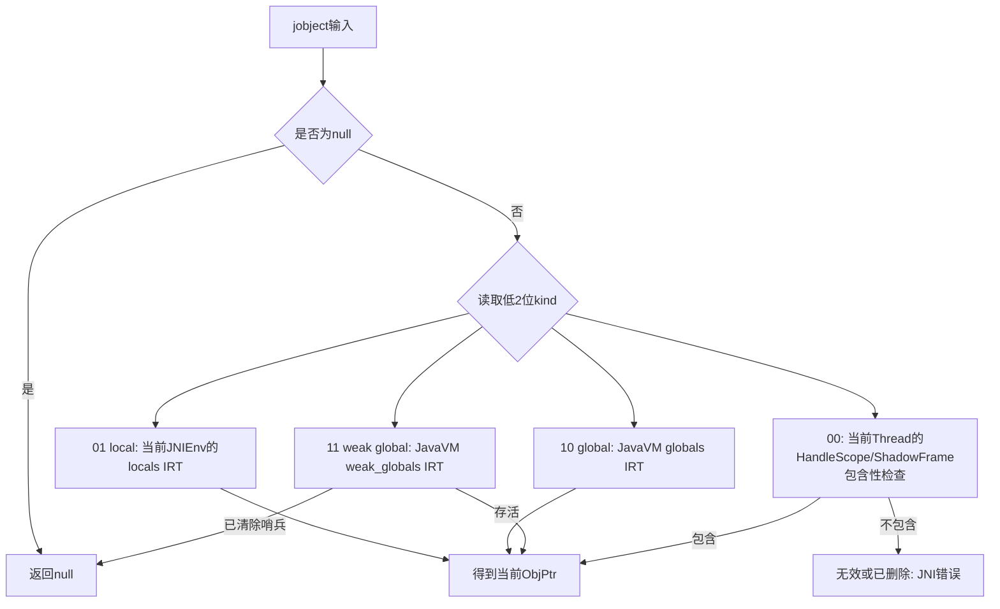
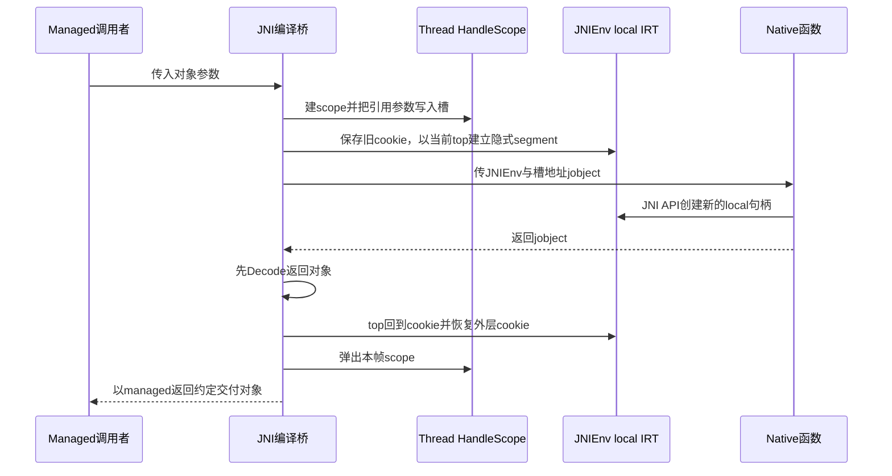
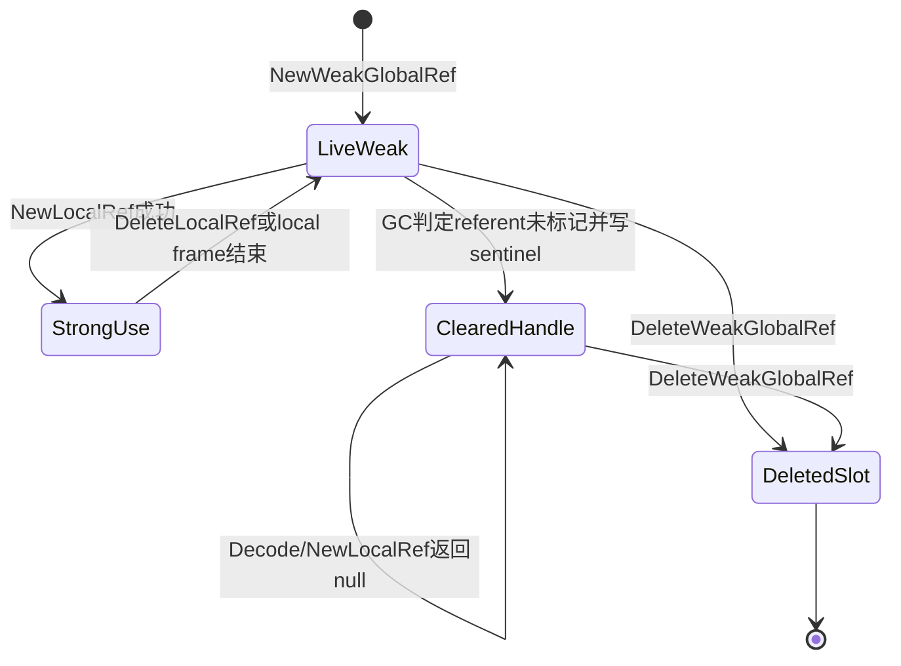

# 第576章 Android ART JNI引用：IndirectReferenceTable、HandleScope、JNIEnv线程归属、CheckJNI与弱引用清理链

> 源码基线：Android 11 `android-11.0.0_r48`。本章只在macOS上阅读、检索和比对源码，不加载ART、不调用JNI、不触发GC，也不编译AOSP。
>
> 本章主问题：`jobject`为什么不能当稳定对象指针；local/global/weak global分别由谁保存、能活多久；IRT怎样编码kind/index/serial并用segment批量回收local；编译器HandleScope与JNI local table为什么同时存在；弱全局引用被GC清除后为何不是简单写null；CheckJNI又能查出哪些错误、不能保证什么？

## 1. 本章先解决什么困惑

写JNI时最危险的误解，是把`jobject`看成“Java对象在堆里的C++地址”。在ART r48里，同一个C类型可能是IRT编码值、native栈上HandleScope槽位的地址、null，甚至已经删除的陈旧值。只有经过当前线程和JavaVM对应的解码路径，才能得到受当下GC协议约束的`ObjPtr<mirror::Object>`；得到它也不代表可以跨挂起点永久保存。本章把句柄表示、生命周期、GC根、线程归属和错误检查五件事分开。

## 2. 先纠正十四个常见误解

`jobject`不是裸`Object*`；低两位为0也不必然非法，它可能是HandleScope槽位。local ref不是“当前C++花括号内有效”，它属于当前JNI local frame/调用段。`DeleteLocalRef`不能删除外层local frame的引用。`PushLocalFrame`不是新建一张表，而是在同一IRT上推进segment边界。`PopLocalFrame(result)`必须先解码result，再弹段并在父段重建local。global ref不是对象本身，它是VM级强表里的一个槽。两次`NewGlobalRef`可得到两个独立句柄。weak global清除后句柄仍可被删除，只是解码成null。JNI weak global不是Java `WeakReference`对象，也没有Java `ReferenceQueue`。`JNIEnv*`不可跨线程缓存使用；`JavaVM*`才是跨线程定位VM的入口。`GetEnv`不会自动Attach。`GetObjectRefType`返回local也不证明kind 0值有效。CheckJNI能提前给出好错误，但不是内存安全证明。最后，IRT serial只能提高陈旧引用检出率，不能提供永不重复的世代编号。

## 3. 一句话总览

ART把当前线程JNI创建的local放进`JNIEnvExt::locals_`可扩容IRT，以cookie划分嵌套segment；把global和weak global放进`JavaVMExt`的两张VM级IRT。普通JNI桥另在native栈帧建立HandleScope，把传入的Java引用参数变成指向GC可更新槽位的kind-0句柄。`Thread::DecodeJObject()`先看低两位，再分别查当前线程local表、当前线程HandleScope链、VM global表或weak表；GC扫描强根并专门清扫weak槽，CheckJNI则借包装函数表检查线程、参数、临界区和引用合法性。

## 4. 本章要同时维护的七本账

第一本是表示账：null、IRT编码、HandleScope槽地址、裸对象指针不是一回事。第二本是所有者账：local和HandleScope属于Thread/JNIEnv，global和weak属于JavaVM。第三本是生命周期账：native调用段、显式local frame、Attach周期、VM周期各不相同。第四本是强弱账：谁让对象保持可达，谁允许GC清除。第五本是移动账：GC移动对象时更新哪一个root槽。第六本是并发账：线程私有local、带锁global、带清扫门禁weak。第七本是诊断账：kind、index、serial、table top、CheckJNI错误分别能证明什么。

## 5. 主要源码地图

句柄编码与表算法看`art/runtime/indirect_reference_table.h/.cc/-inl.h`；线程JNI环境与local frame看`art/runtime/jni/jni_env_ext.h/.cc/-inl.h`和`jni_internal.cc`；VM级global/weak表看`java_vm_ext.h/.cc`；统一解码看`art/runtime/thread.cc`。Handle与HandleScope看`handle.h`、`handle_scope.h/-inl.h`和`stack_reference.h`。编译JNI桥看`art/compiler/jni/quick/jni_compiler.cc`，调用进出看`runtime/entrypoints/quick/quick_jni_entrypoints.cc`，检查包装看`jni/check_jni.cc`，JNI ABI定义看`libnativehelper/include_jni/jni.h`。

## 6. 先把六种名字放到正确层次

Java源码里的对象引用是语言级引用；`jobject`是native接口句柄类型；`IndirectRef`在r48中是可与`jobject`互换的`void*`编码载体；`GcRoot<T>`或`StackReference<T>`是GC会访问并可能改写的root槽；`Handle<T>`是指向StackReference槽的类型化视图；`ObjPtr<T>`和`mirror::Object*`是ART C++在持有mutator lock、没有越过危险挂起点时访问堆对象的形式。只看名字里的“ref/pointer”很容易跨层。

## 7. `jobject`为什么故意做成不透明句柄

移动GC可能把对象从旧地址搬到新地址。如果native永久保存旧`Object*`，下一次使用就可能读到失效地址。句柄把“native拿到的值”与“当前对象地址”隔开：对象移动时GC改root槽，句柄仍定位同一个槽，下一次解码得到新地址。它还为local/global/weak生命周期、删除检查和类型识别提供了落点，所以不透明不是语法麻烦，而是内存模型的一部分。

## 8. 第一幅图：一个`jobject`可能走哪条解码支路



这里的kind 0不是一张IRT的合法kind。它把“对齐的HandleScope槽地址”与“其余非法值”放在同一分支，必须由当前Thread的scope链继续判定；仅凭低两位无法下结论。

## 9. 两个低位怎样表达四类情况

`IndirectRefKind`与JNI的`jobjectRefType`刻意对齐：0是`kHandleScopeOrInvalid`，1是local，2是global，3是weak global。IRT产生的句柄把kind直接放最低两位；HandleScope槽位按结构对齐，地址低位自然为0。这个设计让常见分类只是掩码操作，但代价是kind 0必须再做范围验证，不能把任意四字节对齐地址当local。

## 10. IRT编码的三段布局

从高到低可记成`index | serial | kind`。kind占2位；serial位数由`kIRTPrevCount`决定；剩余高位保存table index。`EncodeIndex()`先左移kind位数再左移serial位数，`EncodeSerial()`只左移kind位数，最后按位或kind。句柄因此不是槽地址，也不含对象地址；它只是“去哪张表、哪个槽、当前槽是哪一代”的紧凑票据。

## 11. debug与release的serial预算不同

r48中`kIRTPrevCount`在debug build为7，在release build为3，`IrtEntry`也分别保留7或3个`GcRoot`位置但只有一个active。serial所需位数相应为3或2。每次槽被重新Add，`serial_`加一并在达到count时回到0，然后写新的active root。debug多留历史位置主要强化诊断，不应把构建差异误当JNI语义差异。

## 12. serial能抓住什么陈旧引用

假设槽5的旧句柄带serial 1，删除后槽5复用为serial 2。旧句柄的index仍指5，但`CheckEntry()`重新编码当前槽并发现值不同，于是报告stale。若只编码index，旧值会错误地指向新对象。serial是低成本use-after-delete探针，特别适合local/global表的槽复用。

## 13. serial不能承诺什么

serial只有有限状态，槽反复复用3次或7次后会回绕，极旧句柄可能再次与当前编码相同。因此它不是加密nonce、无限世代号，也不让错误代码变合法。JNI程序仍必须按生命周期使用和删除引用；ART只是尽量更早、更明确地把常见错误变成诊断，而不是为任意未定义行为兜底。

## 14. 为什么不用“指向IRT槽的指针”

槽地址查对象确实更快，但表扩容搬家后所有已有句柄都会失效；判断它属于local/global/weak哪张表也要做地址范围搜索，删除时同样要定位表。index编码让`Resize()`可新建MemMap、复制旧表并替换`table_`，已有句柄继续有效；kind分类和serial检查也都能常数时间完成。这是一次用少量位运算换可扩容与诊断性的选择。

## 15. `IrtEntry`为什么保留多个root而只激活一个

`IrtEntry`含`serial_`和`references_[kIRTPrevCount]`，`GetReference()`只返回当前serial对应的位置。Add旋转到下一个位置再写新对象，旧位置不参与当前表遍历。结构大小在debug为32字节、release为16字节，都是2的幂，有利于index寻址；这些旧位置不是同时存活的多个JNI引用，也不能从旧句柄直接读取。

## 16. `GetChecked()`的验证顺序

IRT查找先拒绝null和kind 0，再验证index小于当前top，接着确认active槽非null，最后以`ToIndirectRef(index)`核对serial与kind。通过后才从`GcRoot`读取并`VerifyObject`。这几层分别区分无值、错类、越界陈旧、已删除洞和槽已复用；日志里“stale”“deleted”“invalid”来自不同不变量，不宜统称空指针。

## 17. CheckJNI关闭时IRT错误反而可能直接致命

`AbortIfNoCheckJNI()`的注释很反直觉：未开启CheckJNI时，底层IRT发现坏引用会`LOG(FATAL)`，不能把坏对象交回；开启后这里只记error，因为外层CheckJNI包装本应先给出更完整的“JNI DETECTED ERROR IN APPLICATION”上下文并终止。含义不是“CheckJNI更宽松”，而是避免底层先抢走诊断现场。

## 18. 一张IRT为什么还要segment

local引用最常见的清理不是逐个Delete，而是native方法返回时把本次调用创建的所有local一次性失效。若每次都遍历删除，调用边界成本随引用数增长。IRT用`IRTSegmentState{top_index}`记边界：进入时保存旧bottom并把当前top设为新bottom，退出时直接把top恢复到该bottom，逻辑上O(1)丢弃整段。

## 19. cookie、bottom与top的准确关系

表对象自己的`segment_state_.top_index`是当前总top；调用Add/Remove时传入的`previous_state`或`local_ref_cookie_`是当前segment的bottom。有效当前段是半开区间`[bottom, top)`。进入一个新的隐式native段或显式PushLocalFrame时，旧top成为新bottom；弹出时新bottom成为要恢复的top，外层保存的cookie再成为bottom。

## 20. `kIRTFirstSegment`不是特殊表项

`kIRTFirstSegment`只是`top_index=0`的初始cookie。global和weak global没有JNI调用帧式的嵌套段，总以这个cookie执行Add/Remove，所以其整个已用区都相当于一个segment；local则不断改变bottom。不要把first segment想象成index 0保留槽，更不要因此漏算第一条引用。

## 21. 中间删除为什么会制造hole

删除当前段中非top元素时，ART把该槽的active root写null并增加`current_num_holes_`，top不变。下一次Add若知道当前段有洞，会从末端向前扫描填洞。null必须留在槽中，让GC扫描跳过，也让第二次删除被识别；表没有额外free-list，以空间和常见“洞靠近末尾”假设换简单布局。

## 22. 删除top为什么会顺便吞掉连续hole

若删除的是`top-1`，ART先清该槽，再向下折叠紧邻的已有洞，直到遇到非null或当前segment bottom。top可能一次下降多个位置，但绝不跨过bottom去吞外层段的洞。这既保持当前段紧凑，也保护外层local frame，使内层操作不能重写调用者的引用布局。

## 23. 新增为什么不能填外层segment的洞

JNI local frame要求内层弹出时只消灭内层创建的引用。若内层Add借用了外层洞，Pop仅恢复top就无法区分它，可能留下本该失效的引用或覆盖外层生命周期。Add扫描时用`previous_state.top_index`作为下界，只填当前段洞；多段并存时整张表可能未物理填满就需要扩容，这是语义换来的碎片边界。

## 24. hole计数为何不是cookie的一部分

旧实现若把top与hole数都塞入32位segment state，会把可表示引用数压到16位。r48 cookie只保留top，表内部缓存当前段hole数，并以`last_known_previous_state_`检测segment改变后按需扫描恢复。这样生成的JNI进出代码只需存取top，不做洞扫描，复杂工作延迟到下一次Add/Remove。

## 25. `RecoverHoles()`为什么是保守检测

隐式JNI调用段由编译代码直接改cookie，显式Push/Pop也可能在空段中来回，IRT本身未收到“segment changed”回调。`last_known_previous_state_`与当前bottom/top的关系只能保守判断缓存是否仍对应本段；需要时就数`[bottom,top)`中的null。可能多扫一次，但不能沿用另一段的hole数去填错区域。

## 26. Capacity不是活引用个数

`Capacity()`直接返回top index，包含中间hole，所以SIGQUIT里`globals=N`或表dump周边的容量值不能直接当泄漏对象数。真实live count要扫描非null active槽。相反，`FreeCapacity()`只算`max_entries-top`，故意忽略可复用hole，是保守的尾部空间估计；这两个名字都要结合实现阅读。

## 27. local表为何可扩容

`JNIEnvExt`以`kLocalsInitial=512`构造local IRT，并把`ResizableCapacity`设为Yes。Add到物理末尾时通常按两倍扩容；`EnsureFreeCapacity(n)`则至少扩到`top+n`。扩容用新匿名映射复制旧`IrtEntry`，index句柄不变。最终还有128MB表映射上限与地址位预算，不等于local可无限增长。

## 28. global表为什么固定上限

`JavaVMExt`用51200分别构造global与weak global IRT，二者均不可扩容；源码称这是arbitrary sanity check且需适合16位历史约束。溢出会被视为应用JNI bug并fatal，而不是自动让GC回收global。global泄漏由native生命周期错误造成，GC看见强root也不能替程序决定删除。

## 29. `Trim()`不是删除引用

IRT Trim只从当前top所在页向映射末尾执行`madvise(..., MADV_DONTNEED)`，让此前扩张而现在未用的尾页有机会归还物理内存。它不改变top、hole、serial或任何活root。把“trim globals/locals”理解成自动清理JNI引用，会掩盖真正的Delete与segment pop责任。

## 30. GC怎样扫描IRT

`VisitRoots()`顺序遍历0到Capacity，跳过null槽，把非null active `GcRoot`交给BufferedRootVisitor。iterator特意不走普通read barrier，因为root visitor本身需要看并更新root槽；对象移动后写回的仍是新地址。global以`kRootJNIGlobal`身份扫描，local由Thread根扫描进入，weak则走专门清扫而不是强根VisitRoots。

## 31. JNIEnvExt到底是什么

ART为每个已Attach的`art::Thread`创建一个`JNIEnvExt`。它包含指向所属Thread的`self_`、所属`JavaVMExt`的`vm_`、当前local cookie、local IRT、显式frame cookie栈、JNI Monitor记录、critical计数和CheckJNI状态。对native代码暴露的`JNIEnv*`首部仍符合JNI函数表ABI，但内部对象承载了明确的线程私有状态。

## 32. `JNIEnv*`为什么绝不能跨线程使用

它不只是函数指针表，还隐含“当前线程的local IRT、HandleScope链、pending exception、线程状态”等上下文。线程A把env传给B，B创建的local会污染A的表，解码kind-0参数也会在错误scope链查找。CheckJNI的`CheckThread()`从TLS取得B自己的env，与传入env比较，不同就报告`thread ... using JNIEnv* from thread ...`。

## 33. `JavaVM*`与`JNIEnv*`的角色要分开

`JavaVM*`代表进程中的VM调用接口，可作为跨线程保存的定位点；线程先用它查询或Attach，得到只属于自己的`JNIEnv*`。`JNIEnv*`是线程会话，不是VM单例。常见安全设计是组件长期缓存`JavaVM*`，每条native线程在需要时Attach/取env，并按归属约定Detach，而不是全局缓存首次回调拿到的env。

## 34. `GetEnv()`不会偷偷Attach

`JavaVMExt::GetEnv`先查`Thread::Current()`；为null时把输出env置null并返回`JNI_EDETACHED`。只有`AttachCurrentThread`/`AttachCurrentThreadAsDaemon`进入Attach流程；已Attach线程再次Attach则直接返回当前env。把GetEnv当懒Attach会造成错误处理缺失，也可能把Detach责任搞乱。

## 35. Detach以后哪些东西失效

Thread从Runtime注销并销毁其`JNIEnvExt`时，线程私有local表、local frame cookie与HandleScope上下文都结束。global和weak global属于JavaVM，不因这条线程Detach自动删除；它们必须显式Delete。反过来，Detach不是“清理所有JNI资源”的万能操作，native内存、文件描述符、注册回调和VM级句柄仍按各自所有权释放。

## 36. 第一段r48真实Java：为什么需要假的native起点帧

下面逐字摘自`libcore/dalvik/src/main/java/dalvik/system/NativeStart.java`的类体：

```java
class NativeStart {
    private NativeStart() {}

    private static native void main(String[] dummy);

    private static native void run();
}
```

文件注释解释了用途：从C `main()`初始化JNI、或已有native线程Attach后开始创建对象时，没有普通Java调用帧可挂local引用，Runtime便用这个dummy类伪造入口语境。它说明“local依附一次受管理的native调用/线程环境”，不是说这两个Java native声明自己实现引用表。

## 37. 普通JNI方法进入前编译器做了什么

`ArtJniCompileMethodInternal()`为非CriticalNative构建transition frame，在其中写HandleScope的引用数、链接当前Thread旧top scope，并把新scope地址写入Thread。随后把static方法的declaring class及每个引用参数复制到scope的`StackReference`槽。这样进入native之前，传入对象已经是GC可见根，不依赖调用者寄存器里的临时裸地址。

## 38. JNI引用参数为什么常是kind 0

生成代码传给native的不是local IRT新编码，而是HandleScope entry的地址；null参数例外，必须直接传null而不是空槽地址。槽地址对齐后低两位为0，所以`Thread::DecodeJObject()`走HandleScope分支。这样参数无需逐个Add进local IRT，方法返回时弹整块scope即可，且GC仍能更新每个槽。

## 39. HandleScope与local IRT为什么不是二选一

HandleScope主要承载编译桥输入参数和ART内部C++临时root，生命周期与栈/词法scope绑定；local IRT承载JNI函数返回或`NewLocalRef`创建、可由`DeleteLocalRef`单删并受PushLocalFrame控制的句柄。二者都表现为`jobject`且都是local语义，但存储、编码和删除规则不同。把HandleScope叫“另一张local IRT”会误读kind 0与segment算法。

## 40. `Handle<T>`不是对象指针副本

`Handle<T>`内部字段是`StackReference<mirror::Object>* reference_`。`Get()`每次从槽读当前mirror地址，`ToJObject()`对非null对象返回槽地址；`MutableHandle`的Assign写槽。GC若搬对象，更新的是槽，后续Handle读取自然得到新地址。Handle自身只保证槽在scope生命周期内存在，离开scope后保存Handle同样悬空。

## 41. StackHandleScope怎样形成链

构造时它以`self->GetTopHandleScope()`作为link，检查self就是当前Thread，然后`PushHandleScope(this)`；析构时`PopHandleScope()`并断言弹出的就是自己。Thread只存链头，形成严格LIFO。GC通过`HandleScopeVisitRoots()`沿link遍历每个scope并访问槽，所以scope必须在对象可被GC看到前入链，销毁也必须后进先出。

## 42. 固定与可变HandleScope的差别

`StackHandleScope<N>`在栈上内嵌N个StackReference和位置计数，适合编译期可知数量；`VariableSizedHandleScope`先内嵌一个12槽fixed scope，满后在native heap新建下一组12槽，整体只作为一个BaseHandleScope挂到Thread。析构逐组删除额外scope。可变不是无限生命周期，只是数量动态。

## 43. `HandleScopeContains()`为什么还查ShadowFrame

它先沿当前Thread的top HandleScope链检查地址是否落在合法槽范围；随后还查managed stack的ShadowFrames。源码注释说portable/interpreter路径调用JNI时可用shadow frame而非普通handle scope。于是kind 0有效性的权威条件是“当前线程当前受管栈上下文包含该槽”，而不是进程任意栈地址看起来对齐。

## 44. 在错误线程使用kind-0句柄会怎样

线程B的`DecodeJObject()`只查B自己的scope链与shadow frames，线程A栈上的槽不在其中，最终`JniAbortF("use of invalid jobject")`。即使A尚未返回、槽内对象仍活着，也不构成B合法访问权。这再次说明句柄身份同时含存储位置和所有者上下文，不能靠延长A的栈时间实现跨线程共享。

## 45. `DeleteLocalRef()`删除参数句柄时为何是no-op

传入JNI的非null对象参数通常是HandleScope kind 0，不在local IRT。IRT `Remove()`识别kind 0后，若当前Thread确实包含该槽，CheckJNI模式会警告“Attempt to remove non-JNI local reference”，然后返回true但不改scope。参数根会在native frame结束时统一弹出；DeleteLocalRef没有能力缩短编译器scope槽的结构生命周期。

## 46. `NewLocalRef()`并非复制Java对象

JNI实现先用当前线程解码输入，得到当前对象；若输入是已清除weak global，解码结果为null并直接返回null。非null对象才在当前local segment新增IRT槽，返回一个新的local句柄。新旧句柄可指同一对象但生命周期独立，删除其中一个不删除对象，也不自动使另一个失效。

## 47. `DeleteLocalRef()`的segment限制

普通IRT local只有index落在当前`[cookie,top)`且serial匹配才可删除。index小于bottom表示外层frame引用，Remove警告并返回false，JNI入口把它视为no-op；返回类型又是void，调用者不能靠异常恢复。设计保护外层段不被内层任意挖洞，也意味着错误删除不会帮你缩短那个外层引用的生命。

## 48. 自动native调用段怎样建立

`JniMethodStart()`保存当前`local_ref_cookie_`，再把cookie设置为local IRT当前top，于是本次调用新建一个隐式段；普通JNI随后从Runnable转为Native并释放mutator lock，FastNative则保持Runnable但仍做segment动作。保存值由结束入口带回，保证嵌套JNI/回调能恢复外层bottom。

## 49. 返回时怎样一次清空本次local

结束入口先回到Runnable，`PopLocalReferences()`把IRT top设置为当前cookie，也就是丢弃本次段；随后恢复进入前保存的外层cookie，最后弹出编译桥HandleScope。它没有逐个旋转serial或调用Remove，因此“段内所有句柄失效”来自top边界整体回退；以后槽复用时serial再推进。

## 50. 返回`jobject`为什么必须先解码再pop

native返回值可能就是本次段中新建的local或本帧HandleScope参数。若先把IRT段和scope弹掉，再解码就成use-after-pop。`JniMethodEndWithReferenceHandleResult()`在无pending exception时先`DecodeJObject(result)`保存为`ObjPtr`，再PopLocalReferences，必要时用临时StackHandleScope支持CheckJNI返回类型检查，最终把对象交回managed调用约定。

## 51. pending exception时为何不解码返回引用

JNI native已留下异常时，引用返回值不再是正常结果，甚至可能是未定义垃圾值。结束入口只在`!IsExceptionPending()`时解码；异常路径让结果保持null，再清本次local。若机械地先验证返回句柄，真正的Java异常可能被一次无意义的“坏返回值”诊断覆盖。

## 52. synchronized JNI为何还要先解锁

隐式锁对象本身可能以HandleScope jobject保存。结束时`UnlockJniSynchronizedMethod()`必须在pop之前解码并MonitorExit；它还暂存pending exception，避免解锁过程破坏原异常。若把统一清local/scope提前，连“该解哪一个对象锁”都无法安全恢复。

## 53. FastNative与CriticalNative不要混写

FastNative仍有JNIEnv、HandleScope、引用参数和local segment，只是不做普通Runnable↔Native状态切换，退出仍检查suspend。CriticalNative不接JNIEnv，限制为static、非synchronized且参数/返回不能有引用，编译器不建HandleScope，结束也不pop local。二者都追求降低边界成本，但CriticalNative的能力约束更强。

## 54. 第二幅图：一次普通JNI调用的两套local存储



图中的两条清理线必须都完成：IRT segment负责native中新建local，HandleScope负责输入参数/桥接根。返回引用在两条线失效前先解码，是整个时序最重要的边界。

## 55. `PushLocalFrame(capacity)`实际做三件事

入口先调用`EnsureLocalCapacityInternal`验证capacity非负并保证尾部空间；成功后把旧`local_ref_cookie_`压入`stacked_local_ref_cookies_`，再把当前IRT top设为新cookie。它不复制外层引用、不新建另一张IRT，也不会提前创建capacity个槽。capacity只是本帧至少可新增的空间承诺。

## 56. capacity错误与OOM怎样返回

负capacity会记录错误并返回`JNI_ERR`；扩容或保留空间失败时构造调用者信息，向当前线程抛`OutOfMemoryError`并返回`JNI_ERR`。成功返回`JNI_OK`。调用者既要看返回码，也不能假设失败后无pending exception；这条API是资源保证，不是普通容器reserve的纯布尔函数。

## 57. `EnsureLocalCapacity()`不建立frame

它只调用同一内部保证逻辑，不压cookie、不改变bottom。因此后续local仍属于当前段，并在当前native调用或当前显式frame弹出时一起失效。若需要一批临时local用完后整体释放，应Push/Pop；若只担心接下来n个local是否能创建，才用Ensure。两者都不替代及时Delete循环内临时local。

## 58. `PopLocalFrame(result)`的幸存者协议

实现先在旧frame仍有效时把`java_survivor`解码为ObjPtr，然后`PopFrame()`把top退到内层bottom并恢复外层cookie，最后在父segment重新Add一个local并返回。返回句柄通常不是原来的bits；传null或已清除weak所得null则返回null。把原句柄直接带出会违反index/top生命周期。

## 59. 显式frame嵌套时哪一个边界先恢复

每次Push把“此前bottom”放进vector，再以当前top为新bottom；Pop先将top设置成当前bottom，清掉内层，再从vector取回此前bottom。外层已有的top以下引用保持不变。vector只记显式Push层，隐式native调用的外层cookie由entrypoint参数保存，两套栈配合而非互相替代。

## 60. 源码里的“超过16个local警告”在r48并未启用

`jni_env_ext-inl.h`确有一段CheckJNI下超过16个local就dump的代码，但外层写死`if (false)`，TODO是先正确理解PushLocalFrame再开启。因此不能根据这段源码宣称r48实际会在第17个local自动告警。规范保证的最低容量、实现初始512槽和该禁用诊断是三个不同事实。

## 61. global引用属于哪一个对象

`JavaVMExt`持有`globals_`，所有已Attach线程共享。同一个global句柄可在不同线程通过各自JNIEnv使用，因为解码最终回到同一VM表；但创建/删除仍要通过合法当前线程环境，且并发Delete与使用同一句柄没有自动生命周期仲裁。跨线程可见不等于无须所有权协议。

## 62. `NewGlobalRef()`怎样从任意合法引用建立强根

JNI入口先在当前线程解码输入，不管它原来是HandleScope local、IRT local、global还是尚未清除的weak；非null对象在`jni_globals_lock_`写锁下Add进global IRT。已清除weak解码成null，所以结果也是null。它不是把原句柄“升级原地”，而是新增一条独立VM级强root。

## 63. 两个global句柄指同一对象也要各自Delete

每次Add占一个槽并得到自己的index/serial编码。对象身份相同不合并引用计数，`DeleteGlobalRef(g1)`只清g1的槽，g2仍保活对象。不要用`g1 == g2`推断对象身份；相同bits当然是同一句柄，但不同bits仍可能经`IsSameObject`解码为同一对象。

## 64. `IsSameObject()`为什么先比句柄再解码

若两个jobject bits相同，可立即返回true，包括两个null；否则建立ScopedObjectAccess并分别解码，比较当前mirror对象。这样支持local与global、两个global、HandleScope与IRT等跨表示身份判断，也正确处理已清除weak与null。直接在C++比较两个jobject只比较票据，不是Java对象identity。

## 65. global并发读写的准确边界

Add/Delete持`jni_globals_lock_`写锁，GC VisitRoots持读锁。`DecodeGlobal()`调用名为`SynchronizedGet()`的方法，但r48该模板内联体只是转调`Get()`，没有自行加锁；头文件也注明“Only SynchronizedGet is synchronized”，命名与实现存在历史/注解语境，不能凭名字声称每次解码都获取mutex。程序仍不得让同一global在Delete后并发继续使用。

## 66. global为何是强GC根

`JavaVMExt::VisitRoots()`在global读锁下调用表的VisitRoots，并标记root类型`kRootJNIGlobal`。只要槽未Delete，对象就从GC root可达，即使Java世界没有任何路径。所谓global泄漏通常不是IRT内存本身，而是这些强root让整个对象图无法回收。

## 67. 接近global容量时ART怎样帮助诊断

当简单FreeCapacity低于配置delta，`CheckGlobalRefAllocationTracking()`可能临时开启堆分配跟踪，并警告存储接近耗尽，以便最终abort dump包含更好来源信息；容量恢复后再还原原跟踪状态。这会带来性能成本，也不是自动扩表或自动删除。是否启用还受`enable_allocation_tracking_delta_`配置影响。

## 68. SIGQUIT数字为何可能高估泄漏量

`DumpForSigQuit()`输出`globals_.Capacity()`以及weak的Capacity，而Capacity是top、包含中间hole。若频繁创建/删除非尾部global，数字可能大于live槽数；后续Add会复用洞。诊断时应结合完整reference table dump、对象类型聚合、增量趋势和创建路径，而不是把单个capacity值直接当强根数。

## 69. weak global的“弱”究竟弱在哪里

weak global表本身保存句柄槽且跨线程/调用长期存在，但该槽不作为普通强root保活referent。GC清扫时若对象未标记，就把槽改成ART专用cleared sentinel；之后解码给JNI调用者的是null。弱的是对目标对象的可达性影响，不是句柄结构会自动消失。

## 70. 为什么清除weak槽时不能直接写null

IRT用null active slot表示“已Delete/洞”，查它应报告deleted，并允许Add复用。已被GC清除的jweak却仍是一个合法句柄，native应能得到null并稍后`DeleteWeakGlobalRef`。因此ART写一个非移动的特殊Java对象作为cleared sentinel：槽仍占用、serial仍匹配，解码时再映射成外部null。

## 71. cleared与deleted是两种状态

cleared：index仍小于top、槽非null、serial合法、内部值是sentinel，Decode返回null，Delete可正常移除。deleted：槽为null或已复用，旧句柄再解码触发错误。把二者都画成null会解释不了“为什么清除后的jweak还必须Delete”和“为什么访问已Delete句柄不是普通null”。

## 72. weak清扫怎样处理移动与死亡

`SweepJniWeakGlobals()`持weak表锁遍历非null槽，用without-read-barrier读当前对象并调用GC提供的`IsMarked` visitor。若返回null，写cleared sentinel；若对象存活但已移动，visitor返回新地址并写回槽。它既完成弱可达判定，也修复移动后的root，不是只做一次布尔清空。

## 73. weak表为什么不走普通VisitRoots

普通root visitor会把引用当强根标活，破坏weak语义。JavaVM的`VisitRoots()`只扫描globals，并明确说weak表由GC自己访问，因为GC要修改表。weak必须等标记结果已知后再决定保留新地址还是写sentinel；把它和global一起提前Visit，就永远不会被清除。

## 74. weak读取为什么需要访问门禁

并发GC正处于weak/reference处理时，native线程若随意解码并把对象带回强使用，可能与“尚未标记即将清除”竞态。`DecodeWeakGlobal()`先检查当前收集器的访问条件；不允许时进入weak锁循环、执行empty checkpoint并等待condition，直到GC重新开放。门禁保护清扫阶段，而不是一把永久包住所有weak使用的全局锁。

## 75. CMS与Concurrent Copying的门禁不同

无read barrier的CMS用VM级原子`allow_accessing_weak_globals_`；在pause且独占mutator lock时Disallow，完成后Allow并Broadcast。启用read barrier的Concurrent Copying依赖每线程`GetWeakRefAccessEnabled()`和to-space invariant，由checkpoint协调，不走同一全局false开关。文档只说“weak读取可能阻塞”还不够，要看到GC算法分支。

## 76. 为什么等待前要跑empty checkpoint

线程若持weak表锁直接在condition上阻塞，GC或ThreadList发出的empty checkpoint可能等它响应，而它又在等GC开放weak访问，形成协作死锁。代码在WaitHoldingLocks前调用`CheckEmptyCheckpointFromWeakRefAccess()`，让无需目标线程执行closure的barrier型请求先完成，再睡眠。这与第574章的empty checkpoint机制衔接。

## 77. `IsWeakGlobalCleared()`为什么刻意禁用read barrier

它只想判断槽是否等于非移动cleared sentinel。若用普通Decode/read barrier，在某些并发收集器中可能触发标记或转发处理，反而让目标被意外保活。实现持weak锁并等待访问许可后，用`Get<kWithoutReadBarrier>`读取，再与Runtime sentinel比较；这是“观察清除状态”和“取得可用对象”两条不同路径。

## 78. 从weak创建local/global时仍有竞态边界

JNI入口在受ART弱访问协议保护的解码时点拿到对象；若已经cleared，返回null；若仍存活，随后新增local/global强root，便从那一刻保活。应用不能先用`IsSameObject(w,null)`判断非null，再隔一段时间无条件使用w，GC可在两次操作间清除。正确模式是一次`NewLocalRef(w)`取得强local，再检查结果。



这幅图特意不画“先检查非null、稍后再使用”的边，因为两步之间没有强根；`StrongUse`从local成功建立开始，到该local失效为止。cleared handle仍能Delete，deleted slot才是不可再使用的陈旧句柄。

## 79. JNI weak global与Java WeakReference不是同一结构

Java WeakReference是堆上的`Reference`子类，有`referent`字段、可选`ReferenceQueue`、pending/enqueued链并由ReferenceProcessor/Daemon协作；JNI jweak是native weak IRT句柄，没有Java Reference对象和queue回调。它们都不强保活目标，但清除承载、可观察API和生命周期责任不同，不能用Java队列规则推断jweak。

## 80. 第二段r48真实Java：Java Reference走自己的慢路径

下面逐字摘自`libcore/ojluni/src/main/java/java/lang/ref/Reference.java`：

```java
    public T get() {
        return getReferent();
    }

    @FastNative
    private final native T getReferent();
```

这段展示Java Reference对象通过自身native入口读取`referent`；紧随其后的`clear()`/`clearReferent()`以及文件里的queue/pending字段也属于这套Java Reference协议，它不是`NewWeakGlobalRef`的包装。这里用它作反例，是为了防止看到“weak、native、GC”三个词就把两套机制合并。

## 81. `Thread::DecodeJObject()`为何把local放第一支

源码按预期频率排序，local最常见，因此先判断kind 1并查当前`JNIEnvExt::locals_`。HandleScope kind 0次之，global再后，剩余断言为weak。顺序是性能选择，不代表root强度排序；global与local都是强引用，HandleScope同样作为native stack root，weak才允许清除。

## 82. local读取“不需要read barrier”应怎样表述

r48在local分支明确调用`locals.Get<kWithoutReadBarrier>`并注释local references不需要read barrier；HandleScope槽也直接`AsMirrorPtr()`。安全性来自Thread根/HandleScope在GC线程翻转与根更新协议中的专门处理，不应扩张成“所有线程私有根永远不需要屏障”或“ObjPtr可跨suspend”。这里只陈述这条实现路径的既定屏障选择。

## 83. weak sentinel怎样在统一解码末尾避免误报

weak分支若发现Runtime的cleared sentinel，就设置`expect_null=true`并把result改为null。统一尾部只在`!expect_null && result==nullptr`时报`use of deleted <kind>`。因此合法null、合法已清除weak和非法deleted槽走三条可区分路径；若少了expect标志，清除weak会被误判成程序删除后使用。

## 84. ScopedObjectAccess在JNI入口扮演什么角色

许多JNI函数先构造`ScopedObjectAccess`，让当前Thread处于可安全访问Java堆的Runnable语境并持有共享mutator lock，然后解码、访问Class/Object或增删root。函数结束再恢复先前线程状态。它不是给local表加一把独占mutex，而是把JNI调用从Native状态带回ART对象访问协议。

## 85. 删除local也要进入ScopedObjectAccess的原因

注释指出DeleteLocalRef需要让“GC正在标记root”与“把root清null”互斥，避免GC恰好尝试标一个刚删除的null root。即使操作看似只是表槽置空，它仍参与根集并发协议。JNI引用表不是普通`std::vector<void*>`，Add/Get/Remove上的mutator lock注解就是这一点的静态提醒。

## 86. `GetObjectRefType()`普通实现的局限

null返回`JNIInvalidRefType`；kind 1/2/3直接映射local/global/weak；kind 0则注释“Assume value is in a handle scope”并返回local。它没有在该函数里调用`HandleScopeContains`，也不核对index、top、serial或槽非null。因此返回类型只是快速分类，不是完整引用有效性证明，坏的对齐值仍可能被标成local。

## 87. 为什么CheckJNI的引用验证更有价值

CheckJNI位于函数表包装层，在调用真实JNI实现前按签名检查JNIEnv线程归属、参数是否可为null、引用有效性与对象类型、method/field ID、数组类型、字符串编码和critical状态等。它能把“稍后随机崩溃”提前成带JNI函数名、线程和参数上下文的错误，尤其适合开发测试和定位第三方native库错误。

## 88. CheckJNI是怎样插入而不改每个native调用点的

`JNIEnv` ABI的首字段是`JNINativeInterface* functions`。`JNIEnvExt`创建时根据VM开关选择普通或CheckJNI函数表；启停时遍历线程并替换各env的functions。native源码仍调用`env->NewLocalRef()`等同一入口，C/C++封装经函数表落到不同实现。检查是分派层替换，而不是重写应用so。

## 89. 函数表override与CheckJNI的顺序陷阱

ART还支持`table_override_`用于工具/测试拦截。`GetFunctionTable()`在override存在时优先返回它；源码明确警告先override后再开启CheckJNI并不functional。诊断时若开关看似已打开却没有预期检查，应核对是否有表override，而不是立刻断言CheckJNI实现漏检。

## 90. CheckJNI会检查pending exception吗

包装器按每个JNI函数的flags判断在已有pending exception时是否允许调用。大多数对象操作在异常未清时被限制，少数如异常查询/清除属于允许集合。它还检查critical get/release配对：进入critical区后调用不被允许的其他JNI会报错。具体允许矩阵由包装函数flags决定，不能简化为“有异常后任何JNI都禁止”。

## 91. critical数组/字符串访问为何单独追踪

`GetPrimitiveArrayCritical`等可能钉住或直接暴露内存，长时间停留会阻碍GC；JNIEnvExt用`critical_`计嵌套次数并记录开始CPU时间。CheckJNI确保release配对、限制期间其他调用并可提示持有过久。它与`@CriticalNative`是两个容易同名混淆的概念：前者是JNI API临界获取，后者是native方法调用约定。

## 92. CheckJNI不能替你证明哪些事

它不能证明业务所有权正确、global在另一个线程稍后不会被Delete、native缓存的C指针仍有效、对象图没有泄漏，也不能覆盖绕开JNI函数表的任意C++内存破坏。某些错误只有在引用真正解码时出现，有限serial还会回绕。应把CheckJNI当动态协议检查器，与ASan/HWASan、日志、所有权设计和压力测试互补。

## 93. ReferenceTable与IndirectReferenceTable不要混名

`ReferenceTable`是另一种以vector保存GcRoot并能按对象类型dump的辅助表；JNIEnvExt的`monitors_`用它记录显式JNI MonitorEnter，以便Detach批量退出和诊断。IRT则返回带kind/index/serial的jobject并支持segment/hole。两者都含“reference table”，但查找、句柄编码和生命周期完全不同。

## 94. JNI Monitor记录为什么也是root

native通过JNI MonitorEnter拿到对象锁后，JNIEnvExt记录对应jobject/对象，使线程Detach或CheckJNI能处理未释放monitor；`VisitMonitorRoots()`把表交给root visitor。锁的对象不能在native仍持锁时凭空消失。第575章讲Monitor内部，本节只强调这是JNI资源账，不属于locals IRT。

## 95. Detach时未释放Monitor与local的差别

local表随线程环境结束即可整体消亡，不要求逐个Delete；显式JNI MonitorEnter却代表真实锁所有权，Runtime需要批量退出，避免对象永久被已消失线程占有。global/weak仍归VM级所有权。由此可见“线程退出会清所有引用”是错的：只自动终结明确绑定Thread的那几类状态。

## 96. 第三段r48真实Java：引用表诊断入口

下面逐字摘自`libcore/dalvik/src/main/java/dalvik/system/VMDebug.java`：

```java
    /**
     * Dumps the contents of the VM reference tables (e.g. JNI locals and
     * globals) to the log file.
     */
    @UnsupportedAppUsage
    @libcore.api.CorePlatformApi
    public static native void dumpReferenceTables();
```

它证明ART为引用表提供显式dump观察面，但方法输出是诊断快照，不是事务一致性证明；而且前文所述Capacity含hole，仍需结合具体表dump解释。

## 97. local泄漏最常见的循环形态

长native函数在循环中调用会返回local的JNI API，却直到函数结束才统一pop；若数据量很大，local表不断扩张并强保活对象。安全做法是每轮Delete不再需要的local，或按批PushLocalFrame/PopLocalFrame。短小函数依赖返回时自动清理完全合理，不需要为了形式把每个local都Delete。

## 98. “把local缓存到全局C变量”为什么危险

保存的只是当前线程当前frame里的句柄。native返回后top回退或HandleScope弹出，该bits即陈旧；另一个线程使用还会叠加JNIEnv/scope归属错误。若确需跨调用持有对象，必须在有效期内`NewGlobalRef`，明确所有者与Delete时点；若不想保活则用jweak，并把每次使用升级为临时local后检查null。

## 99. 保存`ObjPtr`跨JNI调用为何同样危险

JNI函数内部可能分配、触发GC或切换线程状态，移动GC可改变对象地址。只有放在Handle/HandleScope或JNI root表中的槽能被更新；局部裸`mirror::Object*`/ObjPtr是否可跨某个调用，要由该调用的no-suspend/lock契约证明。经验规则是越过未知runtime调用前先handle化，不凭“它只是个C++函数”假设安全。

## 100. double delete通常会出现哪类信号

第一次删除把槽置null或降低top；第二次可能看到deleted、invalid index、wrong segment或serial mismatch，具体取决于它原在top还是中间、期间是否复用。CheckJNI通常给更清楚上下文，底层IRT也拒绝返回坏对象。不要依赖某一固定错误字符串写业务逻辑，这些都是违反JNI生命周期后的诊断表现。

## 101. local句柄bits相同能说明什么

同一有效句柄复制变量当然bits相同；删除并快速复用后，index相同但serial通常不同；多次回绕后理论上又可能相同。不同local/global句柄也可指同一对象。因此bits既不是Java identity hash，也不是稳定对象ID。需要当前时点对象身份时用`IsSameObject`，需要跨时持有时靠正确ref类型和所有权。

## 102. `NewLocalRef(global)`有什么实际意义

它把VM级长期强root在当前frame建立一个短期强句柄。随后若所有权协议允许，可删除原global，而当前操作仍由local保活；跨线程消费global时也常先转local，缩小后续代码对共享句柄生命周期的依赖。关键是必须协调Delete，不能一边无同步删除，一边期待NewLocalRef自动原子接管。

## 103. weak安全使用模板的线性化理解

`NewLocalRef(weak)`完成时若返回非null，local IRT已建立强root，之后weak被清除不影响这次操作；若返回null，说明在受弱访问协议保护的解码时点目标不可取得。不要先`IsSameObject(weak,null)`再调用别的JNI，因为两步间没有保活。判断与升级要合成一次操作。

## 104. global安全释放需要什么应用层协议

ART锁保证表结构不被并发Add/Delete破坏，不替应用保证“没有线程还在用这个句柄”。常见方案是单一owner线程释放、native互斥量保护句柄交换、引用计数/关闭状态确保最后使用者后Delete，或在锁内先NewLocalRef再允许global清空。表锁解决容器并发，生命周期锁解决业务并发，两者不能混为一把锁。

## 105. JNI边界上的null有四种来源

Java实参原本为null；native显式传null；weak global已清除后解码为null；带pending exception的引用返回路径被忽略而最终为null。另有“deleted引用查表得到null”绝不是合法第五种，它会触发JNI错误。排查null时先看来源语义，而不是只在native末尾加一次空判断。

## 106. 引用表与GC root类型总表

HandleScope槽是native stack root，local IRT由Thread扫描为JNI local类根，global IRT是`kRootJNIGlobal`强根，JNI Monitor记录也被Thread扫描；weak global不作为普通强根，而在弱处理阶段更新或写sentinel。它们都可能包含可移动对象地址，但“GC会访问槽”不等于“都保活对象”。

## 107. r48里local/global/weak的锁策略

local只由所属Thread/JNIEnv使用，操作要求共享mutator lock，不另设跨线程table mutex。global Add/Delete用reader-writer `jni_globals_lock_`写锁，GC Visit用读锁。weak Add/Delete/Sweep和慢速Decode用`jni_weak_globals_lock_`与condition；快速Decode在访问许可成立时直读。锁形态来自所有者与GC语义，不是三张同构表机械复制。

## 108. `SynchronizedGet`这个名字应如何审计

r48头文件声称只有SynchronizedGet同步，但其内联实现仅`return Get(...)`。最稳妥的源码笔记应同时记录“调用点选择了SynchronizedGet接口”和“此版本函数体没有显式锁”，再查看GcRoot原子/屏障与调用方生命周期约束；不能仅凭命名补出不存在的mutex，也不能据此鼓励Delete/use竞态。

## 109. 性能快路径都建立在哪些不变量上

低两位直接分kind；index常数时间寻址；local按频率优先且无普通read barrier；native参数走栈HandleScope免IRT Add；整段pop为O(1)；无hole时Add直接尾插；weak访问允许时免锁快读。这些优化都依赖当前Thread正确、cookie正确、root visitor能更新槽、调用者不越生命周期。绕过不变量换不到“更快”，只会把错误推迟。

## 110. 阅读引用类崩溃日志的顺序

先定位JNI函数名与线程，确认env是否属于当前线程；再按低两位判断local/global/weak/kind0；对IRT看index是否越top、槽是否null、serial是否匹配；对kind0看当前scope包含性；对weak区分cleared sentinel与deleted；最后查句柄创建、转全局、Delete、frame pop和Detach时序。按这条顺序比直接猜“GC把对象回收了”更可靠。

## 111. 本章的只读边界

以下练习只用`rg`、`sed`、`awk`读取当前AOSP r48工作树，验证编码、segment、HandleScope桥、weak清扫和CheckJNI关键行；不会运行target二进制、不会启动模拟器、不会修改源码，也不要求macOS编译ART。命令里的行号只是本工作树导航，真正结论以匹配到的符号和函数体为准。

## 112. macOS只读练习一：核对kind/index/serial与segment布局

```bash
cd /Users/ninebot/androidSource || exit 1
rg -n "kHandleScopeOrInvalid|kLocal[[:space:]]*=|kGlobal[[:space:]]*=|kWeakGlobal[[:space:]]*=|kIRTPrevCount|EncodeIndex|EncodeSerial|IRTSegmentState|kIRTFirstSegment" \
  art/runtime/indirect_reference_table.h
rg -n "IrtEntry::Add|GetChecked|CheckEntry|RecoverHoles|current_num_holes_|SetSegmentState" \
  art/runtime/indirect_reference_table-inl.h art/runtime/indirect_reference_table.cc
```

预期先看到kind为0/1/2/3，index在高位、serial居中、kind在低2位；再看到Add轮转serial，GetChecked验证top/null/serial，以及segment改变后恢复hole。若只搜`jobject`定义，看不到这张票据如何防陈旧使用。

## 113. macOS只读练习二：追HandleScope参数与local段的进出顺序

```bash
cd /Users/ninebot/androidSource || exit 1
rg -n "Build the frame|Set up the HandleScope|Place incoming reference|CreateHandleScopeEntry|CriticalNative" \
  art/compiler/jni/quick/jni_compiler.cc
rg -n "JniMethodStart|saved_local_ref_cookie|PopLocalReferences|Must decode before pop|PopHandleScope" \
  art/runtime/entrypoints/quick/quick_jni_entrypoints.cc
rg -n "HandleScopeContains|DecodeJObject|Local references do not need a read barrier" \
  art/runtime/thread.cc
```

预期得到“建帧→链接scope→写引用参数→保存/推进cookie→native→先解码返回引用→恢复top/cookie→弹scope”的链；同时确认CriticalNative没有HandleScope和引用参数。练习目标是把两套local存储按时序对齐。

## 114. macOS只读练习三：验证Push/Pop与global/weak强弱差别

```bash
cd /Users/ninebot/androidSource || exit 1
rg -n "PushLocalFrame|PopLocalFrame|EnsureLocalCapacityInternal|NewGlobalRef|NewWeakGlobalRef|DeleteLocalRef" \
  art/runtime/jni/jni_internal.cc
rg -n "AddGlobalRef|AddWeakGlobalRef|DeleteGlobalRef|DecodeWeakGlobal|IsWeakGlobalCleared|SweepJniWeakGlobals|VisitRoots" \
  art/runtime/jni/java_vm_ext.cc
rg -n "GetClearedJniWeakGlobal|IsClearedJniWeakGlobal|weak_globals_add_condition" \
  art/runtime/runtime.h art/runtime/jni/java_vm_ext.cc
```

预期确认Pop先解码survivor、弹frame后在父段新增local；global进入普通VisitRoots，weak由Sweep单独处理，死亡对象写cleared sentinel，并在禁止访问时等待condition。注意NewGlobalRef与NewWeakGlobalRef都先解码输入，清除weak会得到null。

## 115. macOS只读练习四：核对JNIEnv线程归属与CheckJNI观察面

```bash
cd /Users/ninebot/androidSource || exit 1
rg -n "JNI_EDETACHED|GetEnv\(|AttachCurrentThread|thread.*using JNIEnv\*|CheckThread" \
  art/runtime/jni/java_vm_ext.cc art/runtime/jni/check_jni.cc libnativehelper/include_jni/jni.h
rg -n "SetCheckJniEnabled|table_override_|GetObjectRefType|dumpReferenceTables" \
  art/runtime/jni/jni_env_ext.cc art/runtime/jni/jni_internal.cc \
  libcore/dalvik/src/main/java/dalvik/system/VMDebug.java
```

预期看到未Attach时GetEnv返回`JNI_EDETACHED`，CheckJNI比较TLS env与传入env；还会看到函数表切换、override警告及普通GetObjectRefType对kind0仅作假定。最后的VMDebug入口提供表dump，但不替代生命周期分析。

## 116. 推荐的源码阅读顺序

先读`indirect_reference_table.h/-inl.h`掌握编码和验证，再读`.cc`的hole/segment算法；接着读`JNIEnvExt`和`jni_internal`的local/global API；然后从`jni_compiler.cc`到`quick_jni_entrypoints.cc`对齐HandleScope与隐式segment；再读`Thread::DecodeJObject`统一四路；最后读JavaVM weak清扫和CheckJNI。先有表示地图，再看并发细节，最不容易迷路。

## 117. 复读后专门修正的九处表述

第一，kind 0改为“HandleScope或非法”，不说成非法保留值。第二，参数local与IRT local分开。第三，serial明确会回绕。第四，Capacity明确包含hole。第五，普通`SynchronizedGet`不虚构显式加锁。第六，r48超过16 local警告明确被`if(false)`禁用。第七，cleared weak与deleted槽分开。第八，GetObjectRefType明确不是有效性验证。第九，FastNative仍有HandleScope/local段，只有CriticalNative无引用桥。

## 118. 本章自测题

为什么`jobject`不能跨越native返回后继续缓存？为何同一个C类型既可能是IRT编码又可能是scope槽地址？segment bottom和top分别是谁保存？为什么内层Delete不能删外层local？PopLocalFrame为何要重建survivor？weak槽为何写sentinel而非null？为什么从jweak安全取对象应直接NewLocalRef？JNIEnv为什么线程私有？CheckJNI返回ref type为何仍不能证明句柄有效？能逐项回答，才算真正掌握引用链。

## 119. 最终心智模型

把JNI引用想成“带作用域的取件票”，不要想成包裹地址。local票由当前线程的IRT segment或native帧HandleScope承载；global票由VM强表长期承载；weak票由VM弱表承载但允许GC把包裹换成cleared标记。GC移动包裹时更新票背后的root槽，解码器按kind和当前上下文取最新地址，serial与CheckJNI负责尽量抓住过期票。票的存储、有效期、强弱与线程归属必须同时正确。

## 120. 下一章

第577章继续读ART JNI方法调用与解析链：native方法怎样经`RegisterNatives`或动态符号查找绑定，`jmethodID/jfieldID`在r48怎样编码和校验，Call<Type>Method如何选择virtual/nonvirtual/static目标、打包参数并进入quick/interpreter/JNI桥，异常与返回值又如何跨边界。仍坚持120节、3幅Mermaid、3段逐字r48 Java源码和第112—115节四个macOS只读练习，生成后整章复读修正。
