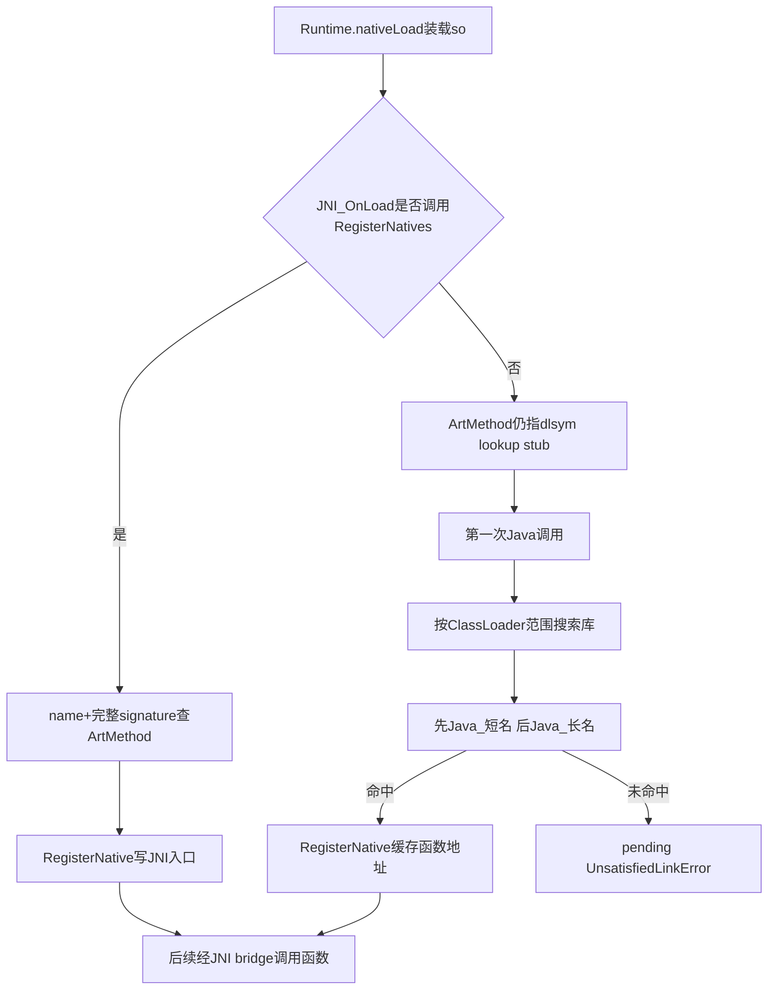
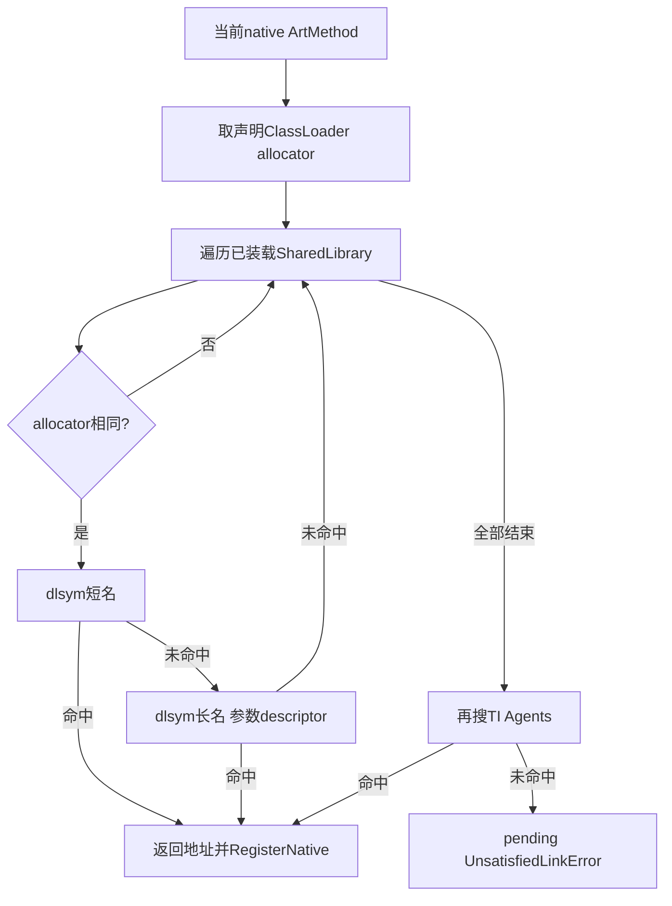
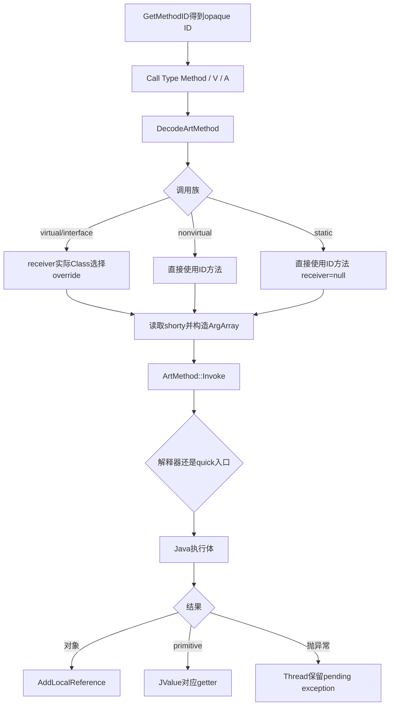

# 第577章 Android ART JNI方法绑定与反调：RegisterNatives、动态符号查找、JniIdType、CallMethod参数封送与异常返回链

> 源码基线：Android 11 `android-11.0.0_r48`。本章只在macOS上阅读、检索和比对源码，不加载native库、不执行JNI、不启动Android运行时，也不编译AOSP。
>
> 本章主问题：Java声明的`native`方法怎样得到真正函数地址；`RegisterNatives`与按符号名懒查找有何差别；`jmethodID/jfieldID`究竟是指针还是索引；native怎样借`Call<Type>Method`反调Java；virtual、nonvirtual、static如何选目标；`...`、`va_list`、`jvalue[]`怎样封送；Java异常和返回值又怎样越过JNI边界？

## 1. 先把两个相反方向分开

“JNI调用”至少有两条方向相反的链。Java调用`native`方法时，ART要给这个`ArtMethod`找到C/C++函数地址，这是**native绑定**；native代码调用`GetMethodID`与`CallObjectMethod`时，ART要从ID恢复Java方法、封送参数再进入解释器或quick入口，这是**native反调Java**。两条链都出现方法、签名和入口，却不能合并：前者产出native函数地址，后者产出并消费`jmethodID`。

## 2. 先纠正十四个常见误解

`System.loadLibrary`只负责装载库，不等于每个native方法已经绑定。`RegisterNatives`不要求导出`Java_...`符号；懒查找才按短名、长名做`dlsym`。首次查找失败抛`UnsatisfiedLinkError`，不是`NoSuchMethodError`。注册表中某一项失败不会回滚此前成功项。`UnregisterNatives`不是卸载so，也不会让方法永远不可调用。`jmethodID`不是`jobject`，不能`DeleteLocalRef`。r48既可把ID做对齐指针，也可做低位为1的索引。ID指出方法元数据，不代表`CallVirtual`已经选出最终override。`CallNonvirtual`才绕开override。`CallStatic*`和`CallNonvirtual*`中的`jclass`在普通实现里甚至未参与实际调用，但传错仍违反JNI契约，CheckJNI会检查。`...`中的小整数与float受C默认提升。`jvalue[]`不做这种提升。对象返回值会新建local ref。Java抛出的异常不会被`CallMethod`自动清除，也不会像Java反射那样自动包成`InvocationTargetException`。

## 3. 一句话总览

native方法可以由`RegisterNatives`把“类内方法名+完整descriptor”直接映射到函数指针，也可以让方法入口先指向dlsym trampoline，第一次调用时按声明类的ClassLoader范围搜索`Java_...`短/长符号并把结果写回`ArtMethod`。反向调用时，`GetMethodID`先解析并编码`ArtMethod`，`Call*MethodV/A`再解码ID、按virtual/nonvirtual/static规则确定目标，用shorty把参数装进32位vreg数组，最后进入`ArtMethod::Invoke`；对象结果转成local ref，异常保留在当前Thread上。

## 4. 本章要同时维护的八本账

第一是装载账：so何时进入进程、归哪个ClassLoader。第二是绑定账：哪个Java native声明映射到哪个函数地址。第三是符号账：短名/长名、mangle和重载。第四是ID账：外部token怎样映回`ArtMethod/ArtField`。第五是分派账：声明方法与实际callee是否相同。第六是ABI账：参数如何变成vreg words。第七是返回账：primitive bits与object local ref不同。第八是异常账：解析失败、符号失败和被调Java抛异常各自停在哪里。

## 5. 主要源码地图

JNI函数表实现看`art/runtime/jni/jni_internal.cc`，ID模式与映射看`jni_id_type.h`、`jni_id_manager.h/.cc`和`jni_internal.h`；native库、ClassLoader隔离和符号查找看`java_vm_ext.h/.cc`。首次调用trampoline看`entrypoints/jni/jni_entrypoints.cc`和各架构`jni_entrypoints_*.S`；参数封送与反调看`reflection.h/.cc`，最终执行入口看`art_method.cc/.h`。签名mangle看`libdexfile/dex/descriptors_names.cc`；检查层看`jni/check_jni.cc`；ABI声明看`libnativehelper/include_jni/jni.h`。

## 6. 三种“地址”不要混为一谈

已装载so的映射地址表示代码已经在进程虚拟地址空间；`ArtMethod::data_`一类JNI入口槽保存“下一次native调用去哪里”；`jmethodID`则是给native长期识别Java方法的opaque token。一个so已经映射，不代表方法入口已解析；一个ID已取得，也不代表对应方法是native；一个入口指向lookup stub，也不代表符号不存在，只代表尚未成功缓存。

## 7. `JNINativeMethod`表真正提供什么

JNI ABI把一项显式注册描述为`name`、`signature`和`fnPtr`三元组。`name`只是方法名，`signature`是包含参数和返回值的完整JNI descriptor，二者共同定位类中的声明；`fnPtr`才是实现地址。类由`RegisterNatives(env, clazz, table, count)`的`clazz`提供，所以表里不重复类名。ART不会从函数的C++类型系统自动证明descriptor与真实函数原型一致，写错仍可能在调用时破坏ABI。

## 8. 第一幅图：装载、显式注册与懒绑定是三个完成点



图中`nativeLoad`解决“库是否装进来”，注册/查符号解决“某个Java声明调用哪段native代码”，JNI bridge解决“Java与native ABI、线程状态和引用根怎样转换”。三者相邻但完成条件不同。

## 9. `RegisterNatives`入口先检查什么

r48的`JNI::RegisterNatives`先拒绝负数`method_count`，这走`JniAbortF`；再要求`java_class`非空。计数为0时只打印warning并返回`JNI_OK`，此时无需读取`methods`；计数大于0才要求表指针非空。每项的name、signature、fnPtr任何一个为null，都会报告索引、留下`NoSuchMethodError`并返回`JNI_ERR`。

## 10. 为什么descriptor不可省略

Java允许同名重载，仅方法名不能唯一定位。`(J)V`表示接收一个long并返回void，`(I)V`是另一个方法；对象、数组和返回类型也都属于descriptor。显式注册因此不会靠C函数名猜重载，也不会从`fnPtr`反射出参数。阅读注册表时应把name和signature连读，例如`registerNativeAllocation`与`(J)V`是一把完整钥匙。

## 11. 查找顺序是“本类优先，再向父类”

ART从传入类开始，逐层沿`GetSuperClass()`向上。在每一层先以`FindMethod<true>`找native方法，再以`FindMethod<false>`找同名同descriptor的任意方法；当前层都没有才上父类。CheckJNI开启时，第一次需要上溯会提示“method not in given class”且这样较慢。这里不是对整个继承树先找native再找普通方法，而是每层两遍。

## 12. 非native同名声明为什么会挡住父类

假设子类自己声明了同名同descriptor但不是native，父类才有native版本。第二遍会在子类命中普通方法，循环立即停止，随后因`!m->IsNative()`抛`NoSuchMethodError`。ART不会为了“找一个能注册的”跳过子类继续向父类。这遵守Java方法遮蔽/覆盖所形成的类层次事实，也防止表悄悄绑到调用者没想到的声明。

## 13. 找不到与找到非native的错误不同

完全找不到时，r48会详细dump类，日志写出类descriptor、方法和dex位置，再用kind“static or non-static”抛`NoSuchMethodError`。命中普通方法时则记录“register non-native method as native”，也抛`NoSuchMethodError`但kind为native。两者都返回`JNI_ERR`；调用方不能只看返回码而忽略已经pending的Java异常。

## 14. 注册循环不是事务

每项找到后立刻调用`m->RegisterNative(fnPtr)`，然后才处理下一项；源码没有先验证整表、统一提交或失败回滚。如果第0、1项成功，第2项signature写错，前两项已经生效，第2项返回错误。这是很实用的恢复边界：不要以为看到`JNI_ERR`就能安全重试整表而不考虑已改入口，最好在开发期保证表由静态检查和测试覆盖。

## 15. `RegisterNative`不一定原样保存fnPtr

`ArtMethod::RegisterNative`会先通知RuntimeCallbacks，回调可通过out参数替换目标地址，之后才`SetEntryPointFromJni`。因此入口最终值应看其返回的`final_function_ptr`或方法槽，而不应断言必等于调用表的原始fnPtr。这个钩子为instrumentation/agent等运行时观察留了位置，普通应用通常感觉不到。

## 16. `!`前缀不是r48的FastNative开关

旧“bang JNI”允许signature以`!`开头；r48会暂时去掉`!`再查方法，但随后明确warning其已废弃，并把局部`is_fast`重新置false。真正的快速约定来自Java声明的`@FastNative`及链接/调用入口元数据。把表里的`!(I)V`当作启用快速JNI，会与r48实际代码相反。

## 17. 显式注册的优势和代价

优势是函数可以叫任意C/C++名字，不必导出庞大的`Java_package_Class_method`符号；表显式列出descriptor，对重载、混淆和静态链接更可控。代价是初始化代码必须在正确类和ClassLoader上下文执行，并正确处理部分失败；链接器无法仅凭导出符号替你发现表项漏注册。它是确定性更高的绑定协议，不是自动类型安全。

## 18. `UnregisterNatives`实际遍历多大范围

r48只遍历传入类自身`GetMethods(pointer_size)`返回的方法，不上溯父类；对其中每个`IsNative()`的方法都调用`UnregisterNative()`，并不记录“这一项是不是此前由本次表注册”。类中没有native方法只warning，函数仍返回`JNI_OK`。因此它是按类批量重置native入口，不是某张注册表的逆操作。

## 19. 注销后为何仍可能再次成功调用

`ArtMethod::UnregisterNative`把JNI入口恢复成普通或CriticalNative对应的dlsym lookup stub。so仍在进程中，导出符号也仍可能存在；下一次调用可以重新走懒解析并再次缓存。所以“unregister”应理解为解除当前直接绑定，不能当`dlclose`、安全隔离或永久禁用API。

## 20. 装载库与注册方法的真实关系

`Runtime.nativeLoad`进入VM装载so，并可能执行库的`JNI_OnLoad`。库常在`JNI_OnLoad`中找类并调用`RegisterNatives`，但这是约定而非装载动作内建的“自动注册所有表”。另一种库不注册，靠导出标准JNI符号让首次调用查找。先问“so是否属于正确ClassLoader并已装载”，再问“方法选了哪种绑定方式”。

## 21. 未绑定native方法的初始入口

类链接为native方法准备代码时，若没有现成native实现，`ArtMethod`的JNI入口可指向dlsym lookup stub；普通native与CriticalNative有不同lookup入口。Java一侧进入编译生成的JNI bridge或generic JNI trampoline，最终命中这个占位地址。它不是空指针，因为还承担首次解析工作。

## 22. 汇编lookup stub为何先保存参数

首次调用到架构stub时，Java已经把本次native参数放进寄存器/栈。查符号本身要调用C++ runtime，会覆盖调用者易失寄存器，因此如ARM64 stub先spill参数与LR，调用`artFindNativeMethod`，再恢复参数并跳到返回地址。这个设计让第一次和后续调用面对同一native函数ABI；解析逻辑不能吞掉原始实参。

## 23. `artFindNativeMethod`为何分两个版本

普通入口开始时线程处于Native、不持有mutator lock，`artFindNativeMethod`用`ScopedObjectAccess`切回Runnable后再调用Runnable版本；Fast/Critical相关路径可直接用`artFindNativeMethodRunnable`。后者从当前线程栈顶恢复正在调用的`ArtMethod`，让JavaVM查地址，命中后调用`RegisterNative`写回缓存。名字相近，前置线程状态却不同。

## 24. 当前方法从哪里来

lookup stub没有由Java额外传一个“方法对象”参数；ART用`self->GetCurrentMethod(nullptr)`从受控调用栈取得当前native `ArtMethod`。这依赖JNI bridge/quick frame布局已正确建立。若把stub孤立看成普通C函数，会误以为它无法知道要查哪个Java声明。

## 25. 为什么声明类只要求处于initializing

`JavaVMExt::FindCodeForNativeMethod`检查方法是native，并检查声明类`IsInitializing()`。源码注释指出static native可能在类初始化完成前被调用，例如`<clinit>`中的路径，所以不能强求`IsInitialized()`；但类必须至少已进入初始化阶段。这是“可在初始化中调用”而非“无需类初始化”。

## 26. native库搜索不是全进程盲扫

`Libraries::FindNativeMethod`先取方法声明类的ClassLoader，再取得对应ClassLoader allocator地址。持`jni_libraries_lock_`遍历已加载库时，只搜索`SharedLibrary::GetClassLoaderAllocator()`相同的项。so在进程里出现，并不保证另一个ClassLoader定义的同名类能看到它；这解释了插件、动态加载场景中常见的“明明已加载却找不到符号”。

## 27. 为什么dlsym期间切到Native

构造短名、长名和读取类元数据需要共享mutator lock；真正搜索前用`ScopedThreadSuspension(..., kNative)`离开Runnable，因为`dlsym`可能被并发`dlopen`长时间阻塞。进入`FindNativeMethodInternal`时也声明不持mutator lock，再拿native库锁。线程状态转换是在保护GC停顿响应，不是改变Java方法语义。

## 28. 短名和长名的结构

短名形如`Java_<mangled-class>_<mangled-method>`；长名在短名后加双下划线和**参数descriptor**的mangle，返回类型不进入后缀。例如`String.charAt(I)C`可产生短名`Java_java_lang_String_charAt`与长名`Java_java_lang_String_charAt__I`。r48对每个可见库总是先短名、再长名。

## 29. mangle不是简单把斜杠换下划线

JNI名称编码中`/`变`_`，原始下划线编码为`_1`，分号为`_2`，数组左方括号为`_3`，其他非ASCII/特殊字符还有Unicode编码规则。因此对象参数`Ljava/lang/String;`会形成类似`Ljava_lang_String_2`，`char[]`参数开头会出现`_3C`。手写导出名时应依标准或工具生成，肉眼替换极易碰撞。

## 30. 重载方法为什么应提供长名

ART仍先试短名；若一个重载族错误地导出了共享短名，多个descriptor的调用都可能命中它，runtime无法从函数地址判断原型，结果可能是ABI错配。JNI约定允许无重载时用短名，重载则靠带参数descriptor的长名区分。显式`RegisterNatives`因为用完整signature定位，没有这个符号歧义。

## 31. NativeBridge为什么还需要shorty

普通本地链接器只按符号字符串查地址；若库经NativeBridge运行，`FindSymbol`还接收方法shorty，帮助跨ISA桥理解参数/返回的大类布局。shorty把全部对象/数组折叠为`L`，不是完整descriptor，也不参与选择Java重载；重载选择仍由长符号参数descriptor完成。

## 32. Agent库的搜索优先级

正常JNI libraries全部未命中后，`FindCodeForNativeMethodInAgents`才遍历TI Agent，依次试同一短名与长名。Agent不是和应用库随机竞争的同级搜索源。诊断同名实现时要先看正常库是否已命中，再看agent，不能只因为agent导出符号就认为会覆盖应用库。

## 33. 懒查找失败留下什么

所有正常库和agent都未命中时，detail包含PrettyMethod以及试过的两个符号名，ART日志记录后在当前Thread抛`UnsatisfiedLinkError`，查找函数返回null。汇编stub观察到null会沿异常路径返回；它不会制造一个假函数地址，也不会把错误转换成`NoSuchMethodError`。后者主要属于方法元数据查找/注册表匹配失败。

## 34. 首次查找缓存不等于业务层once

命中地址后`artFindNativeMethodRunnable`调用`method->RegisterNative(native_code)`，后续通常直接去该函数。但不要把这写成应用可见的严格“一生只查一次”：并发首调、instrumentation回调、显式重新注册和`UnregisterNatives`都可能改变观察到的过程。可以依赖最终方法入口被缓存优化，不能拿它代替自己的初始化同步。

## 35. 第二幅图：短名/长名查找的判定树



这棵树同时解释两类问题：错误ClassLoader使库在`Q`处被跳过；重载符号写错使长名在`G`处失败。日志中的“tried short and long”只能证明名称搜索结束，不能证明目标so属于本类的搜索域。

## 36. 第一段r48真实Java：`nativeLoad`显式携带ClassLoader

下面逐字摘自`libcore/ojluni/src/main/java/java/lang/Runtime.java`：

```java
    private static String nativeLoad(String filename, ClassLoader loader) {
        return nativeLoad(filename, loader, null);
    }

    private static native String nativeLoad(String filename, ClassLoader loader, Class<?> caller);
```

这个Java声明说明“装载哪个文件”之外还携带loader上下文。ART的`GetClassLoader()`甚至专门识别当前方法是否为`Runtime.nativeLoad`，在这条路径使用Thread上的ClassLoader override。以后遇到“同一个绝对路径为什么在不同loader行为不同”，应回到库所有权和JNI_OnLoad状态，而不是把native库视为无条件进程全局命名空间。

## 37. `jmethodID/jfieldID`在C层为何是不透明指针类型

`jni.h`把它们声明为指向不完整结构的指针类型，native代码可以保存、比较、传回JNI函数，却不能解引用字段。opaque语法不承诺内部一定是地址；r48可把奇数值编码成索引。它们也不是Java对象引用，不进入local/global IRT，不受`NewGlobalRef/DeleteLocalRef`管理。

## 38. r48的三种`JniIdType`

`kPointer`直接把`ArtMethod*`或`ArtField*`作为ID；`kIndices`让后续可间接化的成员使用JniIdManager索引；`kSwapablePointer`是启动期过渡模式，先返回指针并为稍后选择做标记。运行时是否采用indices不能仅凭“debug build”推断：r48在自动选择开启且仍可切换时，Java-debuggable进程选indices，否则选pointer。先在过渡期暴露过pointer的成员切到indices后仍可能保持偶数pointer，所以解码器容许两种表示共存。

## 39. 奇偶位怎样区分索引与指针

JniIdManager用`IndexToId(index)=(index<<1)+1`生成奇数ID，用`IdToIndex(id)=id>>1`还原位置。对齐的`ArtMethod/ArtField`指针低位为0，因此可用最低位无分支分类。方法与字段的next id都从1开始、每次加2，但各有独立vector；相同数值不能跨`jmethodID/jfieldID`类型混用。

## 40. 奇数只说明“像索引”，不说明有效

`IsIndexId`把null也纳入快速分类条件，真正解码仍要结合当前模式、拿`jni_id_lock_`并查相应map。随手伪造一个奇数、把field ID传给CallMethod或使用越界旧值都不因此合法。低位是表示标签，不是完整校验码；这和上一章IRT的kind/index/serial票据也不是同一种编码。

## 41. pointer模式为什么更直接

在`kPointer`模式，Encode通常把内部元数据地址直接暴露成opaque ID，Decode做对齐/模式断言后转回指针，少一次全局表查找。代价是运行时若结构重定义导致目标地址变化，需要更强的不变性；索引模式则可保持外部token不变、更新map目标。JNI用户无权依赖两者位模式或性能差异。

## 42. swapable模式的“pointer marker”是什么

过渡模式需要创建ID存储时，`ClassExt::EnsureJniIdsArrayPresent`不会分配真正数组，而是放入一个非数组marker；`ShouldReturnPointer`看到marker便返回pointer。最终选为indices后，已标记的成员仍须继续返回pointer以保护native缓存，新遇到且能分配真实数组的成员才使用奇数索引。这解释了indices模式的Decode为何仍接受偶数ID；marker不是Java可见对象，也不是每次GetMethodID随机选表示。

## 43. 模式切换为什么近似单向

`Runtime::CanSetJniIdType()`只在当前类型为`kSwapablePointer`时允许设置；`SetJniIdType`要求所有线程已挂起，改成pointer或indices后不再允许普通切回。原因是native可能长期缓存旧ID，随意重解释同一个bits会灾难性地映到另一目标。启动过渡期结束就是表示契约落定点。

## 44. 切换时为何重置JNI函数表和已缓存ID

设置最终类型后，Runtime让每个`JNIEnvExt`重置函数表，使`GetMethodID`等走匹配的新模板实例；同时重新缓存WellKnownClasses中的字段/方法ID。启动期well-known缓存刻意可用禁索引路径取得pointer，切换后必须刷新。只改全局enum而不改函数表/缓存，会让编码与解码规则分裂。

## 45. JniIdManager的两层映射

全局`method_id_map_`与`field_id_map_`支持index→target，受`jni_id_lock_`保护；ClassExt中的method、static-field、instance-field ID数组支持target在类内位置→已有ID，避免每次全局线性搜索。方法和两类字段分开，是因为它们在Class布局中的序号空间不同。obsolete/全线程挂起等特殊状态可依赖全局表线性搜索；普通数组分配若OOM则返回0并保留异常，并不是悄悄成功回退。

## 46. copied与obsolete方法为什么特殊

接口默认方法等场景可能产生copied `ArtMethod`，编码时需归一到canonical方法，避免同一逻辑声明无谓地产生多份ID。JVMTI obsolete方法则不使用普通ClassExt method-id数组，可能从记录起点线性搜索全局列表。源码优化围绕“常规方法快定位、特殊方法仍正确”，不能推导所有ID查找都是O(1)。

## 47. 为什么全局ID向量从不删除

r48注释明确这些ID list不会移除元素，这让已经发给native的索引不会因压缩/复用映射到另一方法；代价是进程生命周期内映射只增不减，并需要锁。类卸载仍是JNI ID有效期的语义边界，应用不能把“vector不删”理解成ID跨ClassLoader卸载仍可安全调用。

## 48. 全线程挂起时的defer机制

heap walk或用户回调期间可能需要生成ID，却不能像普通路径那样分配ClassExt数组。`ScopedEnableSuspendAllJniIdQueries`增加deferred计数，允许先把映射加入全局vector，并记录可能未回填类内数组的最小ID；scope结束再修补。它是受“所有线程挂起”等前提保护的内部逃生通道，不是native API可请求的模式。

## 49. 结构重定义时索引怎样保住外部token

JniIdManager实现`VisitReflectiveTargets`，让reflective visitor访问并更新ID表中的`ArtMethod*`/`ArtField*`目标。JVMTI结构重定义可能替换内部元数据地址，索引ID本身保持不变而映射被重定向。这正是indices的价值之一；pointer模式需要其自身的可用边界，native仍不得假设ID就是永久可解引用的地址。

## 50. ID生命周期与缓存策略

JNI允许在类未卸载期间缓存method/field ID，常见做法是在`JNI_OnLoad`或一次性初始化中取得并保存，同时持有能保证类/ClassLoader生命周期的引用。不要每次调用都重新Get，也不要只存ID却放任动态ClassLoader卸载。ID无需Delete；真正需要Delete的是你为类、对象或ClassLoader额外建立的global/weak global引用。

## 51. `GetMethodID`可能触发类初始化

`FindMethodJNI`先对传入`jclass`执行`EnsureInitialized`，失败就返回null并保留异常。因此它不是纯字典查询，也可能执行`<clinit>`、阻塞或观察到初始化失败。把ID缓存初始化放在持锁/低延迟路径前，要意识到这层副作用；仅判断返回null、不检查异常会丢失真实原因。

## 52. 类与接口的方法查找分支

若目标`jclass`是接口，r48走`FindInterfaceMethod`；否则走`FindClassMethod`。它们接收name、signature和pointer size，返回解析后的`ArtMethod`。随后还会核对方法`IsStatic()`是否与GetMethodID/GetStaticMethodID入口要求一致，所以同名descriptor存在也不代表用错API能侥幸得到ID。

## 53. hidden API也参与JNI查找

找到方法后，ART用JNI访问上下文做hidden API检查；若策略拒绝，会把结果当不可访问而走失败。JNI并不是绕过hidden API的万能后门。不同进程目标SDK、豁免和runtime配置可能改变观察结果，排查“源码里明明有方法但GetMethodID失败”时要把访问策略列入证据链。

## 54. `GetMethodID`失败应怎样读

name/signature为空等非法入参可被CheckJNI或基础检查捕捉；类初始化失败可能留下初始化相关异常；查找、staticness或访问失败通常留下`NoSuchMethodError`并返回null。因此正确模式是“若ID为null，立即检查/传播pending exception”，而不是统一自己抛一个找不到方法，覆盖原始诊断。

## 55. `GetFieldID`为什么也可能初始化类

`FindFieldJNI`同样先`EnsureInitialized`。它还要按signature解析字段类型：primitive走基本类型类，对象/数组结合声明类ClassLoader解析。类型解析失败时会把原因与最终`NoSuchFieldError`组织起来。字段查找不是只比较字符串，也包含类加载、访问控制与static/instance分类。

## 56. static field与instance field是两套查找

`GetStaticFieldID`走`Class::FindStaticField`，`GetFieldID`走`FindInstanceField`；找到后也经过hidden API策略。`jfieldID`随后编码`ArtField`，访问器从field元数据取得偏移和类型。把instance ID交给Static getter，或用错误的primitive getter读取，都是JNI契约错误；CheckJNI能更早报告，普通快实现不提供C++类型安全。

## 57. ID与Java反射对象可以互转但不是同一物

`FromReflectedMethod/Field`从Java反射对象取内部Art元数据并编码成ID；`ToReflectedMethod/Field`反向创建新的Java反射对象并作为local ref返回。ID本身不受Java GC移动，反射对象是普通Java对象、受引用表生命周期管理。转换不是C指针强转，也不保证反向得到与输入同一个Java reflection实例。

## 58. 普通实现为何看起来忽略`clazz/isStatic`

r48的某些`ToReflected*`基础实现形参未命名，直接依据ID内ArtField/ArtMethod建对象；一些CallStatic/CallNonvirtual和字段访问同样由ID携带的目标完成。JNI规范仍要求调用者传正确参数，CheckJNI wrapper会检查类、staticness、receiver和返回类型。关闭CheckJNI后“参数没被使用”不等于可以故意传错。

## 59. 缓存ID时应连同descriptor写清楚

建议在native初始化处把Java类全名、方法名、完整descriptor、static/instance和预期Call family放在一起审计。例如ID来自`GetMethodID("f", "(J)Ljava/lang/String;")`，调用必须提供long参数并用`CallObjectMethod*`取引用。只给缓存变量起名`gMethod`，几个月后极易在重载变化或返回类型调整时错用。

## 60. 方法ID并不等于最终调用目标

对static和nonvirtual调用，ID内方法基本就是实际callee；对virtual/interface调用，ID首先代表声明/解析到的方法，ART还要结合receiver实际Class做VTable/IMT意义上的选择。这个区别与第566章的调用分派一致：resolution回答“调用点声明谁”，dynamic dispatch回答“这次对象最终执行谁”。

## 61. 第二段r48真实Java：`@FastNative`仍是一个普通native声明

下面逐字摘自`libcore/ojluni/src/main/java/java/lang/System.java`：

```java
    @FastNative
    public static native void arraycopy(Object src,  int  srcPos,
                                        Object dest, int destPos,
                                        int length);
```

这个descriptor可写作`(Ljava/lang/Object;ILjava/lang/Object;II)V`，shorty则是压紧后的`VLILII`。注解改变JNI进入时的线程状态/桥约定，不改变name+descriptor定位规则，也不把对象参数变成裸指针。若用显式注册，表项signature仍必须是完整descriptor。

## 62. `Call<Type>Method`为何形成庞大家族

维度一是返回类型：Object、Boolean、Byte、Char、Short、Int、Long、Float、Double、Void；维度二是分派：普通virtual、Nonvirtual、Static；维度三是实参形式：省略号、`V`接`va_list`、`A`接`jvalue[]`。它们不是重复装饰名，每个维度都决定ABI解释或目标选择，必须与取得ID时的声明严格一致。

## 63. virtual调用怎样选择override

`CallObjectMethod`等普通族进入`InvokeVirtualOrInterfaceWithVarArgs/JValues`，先解码receiver，再用ID还原interface/declaration method，调用`FindVirtualMethod(receiver, interface_method)`。后者从receiver实际Class执行virtual/interface分派，得到真正`ArtMethod`。所以从父类取得ID，再给子类对象调用，仍可命中子类override。

## 64. nonvirtual调用到底绕过什么

`CallNonvirtual<Type>Method`直接把解码后的ID交给`InvokeWithVarArgs/JValues`，不会先按receiver实际Class找override。它类似Java里的`super`/指定声明实现语义，但前提是clazz、receiver和method ID关系合法。普通r48实现中的`jclass`形参未使用，CheckJNI会补做契约检查；不能利用这个实现细节调用任意不兼容对象。

## 65. static调用为何没有receiver word

`CallStatic<Type>Method`同样直接`InvokeWith*`，但obj传null。参数数组不会插入receiver，实际目标由static method ID决定。基础实现的`jclass`常未使用，然而GetStaticMethodID取得ID、类初始化和CheckJNI的static/class验证仍构成规范路径。static不是“以Class对象作receiver”。

## 66. 三类调用的最小判定表

普通`Call<Type>Method`需要非null receiver并允许override；Nonvirtual需要receiver、clazz、非static ID但绕过override；Static需要clazz与static ID且没有receiver。返回后，Object族建立local ref，primitive族按对应JValue getter读bits，Void族忽略结果。任何一列错配都不应靠“在这台机器看起来能跑”判断正确性。

## 67. CheckJNI具体补了哪些方法检查

wrapper中的`CheckMethodAndSig`会核对ID可解码、预期返回shorty、staticness、声明类关系和receiver类型；`CheckCallArgs`还检查env、引用和varargs中可能是堆引用的值。基础快路径保留较少检查是为了性能，CheckJNI是开发期把JNI契约变成带函数名上下文诊断的工具。

## 68. CheckJNI也不是万能ID防伪器

`CheckMethodID/CheckFieldID`最终仍依赖ART解码，其注释/实现只做有限的声明类堆地址等检查；错误bits、已卸载类相关ID或native内存破坏不一定都能优雅转成Java异常。它能显著提升定位效率，却不能把未定义JNI使用变成安全输入验证层，更不能替代所有权和签名审计。

## 69. 第三幅图：native反调Java的完整路径



图中的ID解码与virtual选callee是两个步骤；参数descriptor查方法与shorty封送ABI也是两个步骤。错误排查若只说“CallMethod失败”，至少还要定位失败发生在ID、receiver分派、封送、执行体还是异常返回。

## 70. 无后缀版本怎样处理省略号

`CallIntMethod(env,obj,mid,...)`内部执行`va_start`，用RAII在结束时`va_end`，再把`va_list`交给`Invoke...WithVarArgs`。它适合调用点直接列实参。若你在自己的可变参数函数中转发，必须使用`V`版本并遵守`va_list`平台规则，不能把一个`va_list`当普通`...`再塞进去。

## 71. C默认参数提升是常见错位根源

经过`...`/`va_list`时，`jboolean/jbyte/jchar/jshort/jint`按`jint`读取，`jfloat`因默认提升按`jdouble`读取；`jlong`和`jdouble`保持宽值，对象按`jobject`读取。ART的`ArgArray::BuildArgArrayFromVarArgs`正按shorty执行这些`va_arg`。调用方若硬传未匹配的C类型，后面所有寄存器/栈读取都可能错位。

## 72. `jvalue[]`为什么更适合程序化构造

`A`版本每个参数占一个`jvalue` union元素：boolean用`.z`、byte用`.b`、char用`.c`、short用`.s`、int用`.i`、long用`.j`、float用`.f`、double用`.d`、引用用`.l`。没有varargs默认提升，数组下标与Java参数一一对应，便于桥接器循环填充。代价是union member写错时编译器也无法知道descriptor。

## 73. 引用参数为什么必须在封送时解码

`ArgArray`不能把`jobject`票据bits当Java堆地址塞入vreg。构造器遇到shorty `L`时通过`ScopedObjectAccess`解码，写入当前对象引用；receiver也先解码并放在instance调用的第一个word。后续可能挂起/GC的安全性由受控Invoke路径和栈图/根协议保证，不意味着native可保存这个内部raw pointer。

## 74. shorty与完整descriptor各司什么职

完整descriptor区分`String`、`Object`、各种数组和精确返回类，用于方法/字段解析与类型检查；shorty只保留返回类别和各参数大类，所有引用统一为`L`，用于调用ABI布局。例如`(Ljava/lang/String;[IJ)Ljava/lang/Object;`的shorty是`LLLJ`：首位为返回，后三位为参数。shorty不能唯一标识重载。

## 75. instance receiver为什么不在descriptor参数里

Java method descriptor只列显式形参，`this`是隐式接收者。构造`ArgArray`时，非static调用先写receiver，再按shorty从索引1开始写形参；static从第一个显式参数开始。计算vreg words、读崩溃现场参数或手写桥时若忘记receiver，所有槽都会整体偏移。

## 76. long/double为何占两个32位word

ART这条通用反调路径用`uint32_t`数组表达DEX vreg式参数。`J`和`D`保存64位bits，需要两个相邻word；其他primitive和引用各一个word。`ArgArray::GetNumBytes()`把实际word数交给`ArtMethod::Invoke`。这不是说64位CPU寄存器只有32位，而是runtime通用参数缓冲采用DEX宽值布局。

## 77. 小参数与大参数的存储策略

`ArgArray`内置一个小型固定`uint32_t`缓冲，常见短签名无需堆分配；需要更多word时才用更大存储。阅读具体阈值要以r48的`kSmallArgArraySize`为准，不应把“参数个数”与“word个数”等同，因为receiver和J/D都会改变大小。

## 78. proxy为什么要回到interface method取shorty

调用路径常使用`method->GetInterfaceMethodIfProxy(kRuntimePointerSize)->GetShorty()`。代理方法内部形态可能不同，真正接口声明才提供调用契约的shorty。目标分派可以落到proxy实现，但ABI解释仍须对应原接口签名；这是“callee元数据”和“调用点签名”不能随意混用的又一例。

## 79. 为什么封送前先检查native栈余量

`InvokeWithVarArgs/JValues`比较当前frame地址与Thread stack end；若已太接近保护区，先抛`StackOverflowError`并返回零初始化`JValue`。注释说明后续可能进入省略自身栈检查的leaf函数，所以必须在通用入口保留安全余量。看到返回0/null时仍要先查pending exception。

## 80. CheckJNI下的参数类型复核

`InvokeWithArgArray`若env启用CheckJNI，会调用`CheckMethodArguments`按完整parameter types验证构造出的word数组；通过后才`method->Invoke`。这能发现把错误对象类型填进`.l`等问题。普通模式省掉这轮昂贵检查，所以同样的bug可能只在CheckJNI立即报错，关闭后晚些崩溃。

## 81. `CheckMethodArguments`自己的r48边界

源码有TODO：检查过程中解析参数类型可能挂起，而临时参数数组里保存的是raw `Object*`风格word，compact GC带来风险；注释要求未来用HandleScope保护。这提醒我们不要把“检查函数存在”写成绝对无风险。笔记应同时记录它验证了什么，以及r48代码自己承认的并发/移动边界。

## 82. `ArtMethod::Invoke`先建立什么

它先在Thread的ManagedStack上push一个新的fragment，把native runtime调用与即将进入的managed执行连接起来；结束后pop。这样栈遍历、异常展开和GC知道当前转换边界。`CallMethod`不是普通C++直接调用Java函数指针，它必须建立ART可观察的managed栈结构。

## 83. 何时走解释器

若Runtime尚未启动，或instrumentation/调试等条件要求对合适的非native方法强制解释执行，`ArtMethod::Invoke`进入interpreter路径；否则走quick invoke stub。具体方法还受是否native、是否可解释和当前instrumentation状态影响，不能把“反调Java”固定等同于解释器，也不能固定等同于JIT代码。

## 84. quick invoke stub做什么

根据方法是否static选择相应`art_quick_invoke_stub`，把method、参数word数组、字节数、Thread、JValue result和shorty交给架构桥。方法quick entry随后可能是AOT/JIT代码、quick-to-interpreter bridge、instrumentation entry、generic JNI等第566章讨论的入口。JNI反调只负责到达统一方法执行协议。

## 85. 去优化异常为什么要特殊处理

被调代码可能触发deoptimization，ART以特殊异常/上下文请求转回解释器。`ArtMethod::Invoke`在quick返回后识别并完成这条runtime控制流，而不是把它当应用Java异常直接暴露给JNI。真正业务异常才保留为pending exception。调试时不要把所有“exception标志”都归为Java方法主动throw。

## 86. 被反调的Java方法还可以再次是native

`CallStaticVoidMethod`拿到的ID完全可能指向一个Java声明的native方法。`ArtMethod::Invoke`进入它的quick/generic JNI入口，随后又走本章前半的显式绑定或dlsym链。于是一次native→Java API调用可实际形成native A→ART Invoke→native B；方法元数据与桥仍不可省略。

## 87. 对象返回为什么要再建立local ref

执行体把对象放入内部`JValue::GetL()`，JNI的`CallObjectMethod*`随后调用`soa.AddLocalReference<jobject>`，把它转换成当前JNI frame拥有的local句柄。native拿到的不是内部对象地址；返回null时建立过程安全地产生null。该local的生命周期仍遵守上一章的frame/segment规则。

## 88. primitive返回怎样读取

Boolean/Byte/Char/Short/Int/Long/Float/Double族分别调用JValue对应getter，按方法实际返回bits解释。调用了错误家族，例如Java返回long却用`CallIntMethod`，CheckJNI可因shorty不匹配阻止；普通实现可能只读低位或错误解释bits。返回C类型相同大小也不能替代JNI签名一致性。

## 89. Void调用仍可能失败

`CallVoidMethod*`只是丢弃JValue，并不丢弃异常。栈溢出、类初始化、被调代码throw、被调native符号缺失等都可让Thread带pending exception返回。没有返回值绝不等于没有结果状态；JNI调用后的控制流必须按“异常优先”理解。

## 90. Java异常跨JNI边界的核心规则

被调Java方法抛异常时，ART把Throwable保存在当前Thread pending exception槽，Call family返回默认/未供业务使用的值。JNI不会自动打印、清除或转成C++ exception。native应立即用`ExceptionCheck`或`ExceptionOccurred`判断，选择清除并处理，或停止普通JNI工作并返回，让异常继续传播到Java。

## 91. 为什么不会自动包`InvocationTargetException`

`reflection.cc`里的Java反射`InvokeMethodImpl`明确在目标抛异常后取出Throwable、清除原pending，再创建`InvocationTargetException`包装；JNI的`Call*Method`路径直接`InvokeWithArgArray`，没有这段包装。文件相同容易造成误读，但函数路径不同。native看到的是原始Java异常处于pending状态。

## 92. `ExceptionOccurred`与`ExceptionCheck`的差别

`ExceptionCheck`只给布尔值，适合分支；`ExceptionOccurred`返回表示当前Throwable的local ref，便于检查、记录或重新抛。`ExceptionClear`才清空Thread异常槽。取得Throwable local不自动clear，clear也不自动Delete local；每步所有权和语义都应显式决定。

## 93. 有pending exception时为什么应尽快返回

JNI规范只允许少数异常相关、引用清理等函数在pending状态下调用；CheckJNI把其允许集合标为异常可用类别，其他调用可能直接报错。继续FindClass、CallMethod或分配对象容易覆盖现场或触发二次失败。稳妥模板是调用后立刻检查，失败路径只做允许的清理/传播。

## 94. 三类失败异常不要混写

`GetMethodID`找不到/类型不符通常是`NoSuchMethodError`；懒native符号查找失败是`UnsatisfiedLinkError`；`CallMethod`成功进入Java后由业务代码抛什么就pending什么。显式`RegisterNatives`表项无效也常用`NoSuchMethodError`。异常类型告诉你失败位于元数据、native链接还是执行体层。

## 95. 返回值与pending异常必须联合判定

对象null可能是Java合法返回，也可能伴随异常；int 0既可能是合法值，也可能是出错路径的默认JValue。唯一可靠判定是看pending exception。反过来，非null/非零也不应在pending异常时继续当成功消费，因为JNI对异常后的返回不承诺业务语义。

## 96. 第三段r48真实Java：重载必须连descriptor一起看

下面逐字摘自`libcore/libart/src/main/java/dalvik/system/VMRuntime.java`：

```java
    @UnsupportedAppUsage
    @libcore.api.CorePlatformApi
    public native void registerNativeAllocation(long bytes);

    /**
     * Backward compatibility version of registerNativeAllocation. We used to pass an int instead
     * of a long. The RenderScript support library looks it up via reflection.
     * @deprecated Use long argument instead.
     */
    @UnsupportedAppUsage
    @Deprecated
    @libcore.api.CorePlatformApi
    public void registerNativeAllocation(int bytes) {
        registerNativeAllocation((long) bytes);
    }
```

这里同名`(J)V`才是native，`(I)V`是Java兼容包装。显式注册若写`(I)V`会命中非native方法并失败；动态符号若需要区分重载，应使用long descriptor生成的长名。它也展示“源码里同名”不等于“两个native实现”。

## 97. `NewObject`不是简单的Alloc加任意Call

unchecked基础路径先确保clazz初始化，再由`Class::AllocObject`分配对象，随后用给定构造器ID执行`CallNonvirtualVoidMethodV/A`；CheckJNI包装层会在此前验证clazz可实例化且不是数组，并验证ID确为constructor。构造器作用于刚分配对象且不做virtual override。分配成功仍不代表构造成功。

## 98. String构造为何是特殊路径

ART中的`String`不可按普通“先分配可变空对象，再原地执行init”语义实现。`NewObjectV/A`遇到String类时直接把constructor ID映射到WellKnownClasses中的StringFactory，并返回`CallStaticObjectMethodV/A`结果；一般`InvokeWith*`若遇到已有String receiver的constructor路径，才会用`UpdateReference`把factory结果写回原句柄。两种都只是String内部表示的特例。

## 99. 构造器抛异常后对象去哪了

构造前建立的local ref在当前frame仍按local生命周期存在，但`NewObject`检测pending exception并向调用者返回null。对象若没有其他可达引用，frame退出后可被GC；JNI不能把“内存已经分配”当成可用实例。业务上必须以返回值加异常状态判定构造完成。

## 100. field访问与CallMethod共用哪些ID原则

`Get/Set<Type>Field`解码`jfieldID`得到ArtField，再按instance/static、primitive/object访问。Object结果建立local ref，Object写入走ART字段写协议与GC barrier；CheckJNI核对receiver/class、staticness与字段类型。ID可缓存、不用Delete、不可跨类型乱用，这些原则与method ID一致；字段访问却没有virtual方法分派。

## 101. 为什么static/nonvirtual的clazz仍应传对

在r48普通实现里，这个形参可能被省略命名，实际地址完全来自ID；但JNI API把clazz作为调用契约的一部分，CheckJNI用它验证ID属于兼容声明上下文。依赖“release版忽略它”会让代码在CheckJNI、其他ART版本或另一VM失败，也掩盖拿错缓存ID的真正bug。

## 102. null receiver与null ID不是普通Java NPE等价物

JNI入口宏会检查必须非null的obj/mid；CheckJNI往往直接给出JNI detected error。它不保证像执行一条Java invoke那样总产生可捕获`NullPointerException`。native传入非法JNI参数属于接口契约错误，与被调Java方法内部解引用null是两个层级。

## 103. 显式注册与动态查找怎样选

Framework/运行时内部常用集中注册表，便于隐藏C++符号、审核descriptor和在启动时尽早失败；简单NDK库也可用标准导出名减少注册代码。选择不是性能口号：要看重载数量、混淆策略、ClassLoader、可见性、初始化失败处理和团队工具链。两种方式最终都把函数地址放进同一个`ArtMethod` JNI入口协议。

## 104. ProGuard/R8场景要保护哪一侧

动态短/长名把Java类名和方法名编码进导出符号，重命名会断开约定，通常需keep规则；显式注册虽不依赖C符号名，但表里的Java name/signature仍须与混淆后的声明匹配，常见做法仍保护native声明。不要把“RegisterNatives支持混淆”简化为零配置，它只是让映射可在代码生成/初始化中明确控制。

## 105. ID缓存的线程安全分两层

ART的JniIdManager锁保证内部映射并发一致，不替native保证自己的全局缓存初始化。多个线程首次写`g_mid`仍需`std::call_once`、受控`JNI_OnLoad`或其他发布协议；缓存相关Class global ref也需相同所有权设计。内部表安全和应用缓存数据竞争是两件事。

## 106. 注册函数指针的ABI怎么审计

普通实例native第一个参数是`JNIEnv*`、第二个是`jobject`；static第二个是`jclass`，后面才按descriptor排列Java参数。`@FastNative`仍保留这套JNI函数原型，只优化状态转换；`@CriticalNative`则没有`JNIEnv*`和`jclass/jobject`隐式参数、只允许primitive形参/返回，ABI必须另行核对。`JNINativeMethod.fnPtr`被擦成`void*`，编译器通常不会替表校验。

## 107. 诊断“已注册却仍报找不到”

先确认`RegisterNatives`返回值和pending异常，并检查是否部分注册；再确认传入的clazz由哪个ClassLoader定义、name/signature是否精确、命中的是否非native shadow；然后查是否后来调用`UnregisterNatives`或回调改了入口。若日志是`UnsatisfiedLinkError`且列出tried symbols，说明执行时仍走lookup stub，应查注册是否作用于另一份同名Class。

## 108. 诊断“CallMethod调用了错误实现”

先记录ID由GetMethodID还是GetStaticMethodID、在哪个clazz取得；再核对调用族。普通Call会按receiver实际类override，Nonvirtual才固定ID方法，Static无receiver。然后核对descriptor、返回族与A/V参数；最后打开CheckJNI验证类和签名。很多所谓“methodID失效”其实是选错virtual语义或C varargs错位。

## 109. 诊断native崩溃为何先看最后成功边界

若崩在首次调用，检查dlsym符号、ClassLoader域和真实函数原型；若已多次成功后崩，优先检查引用生命周期、参数数据、并发重新注册/卸载和native内存，而不是重复怀疑mangle。日志中是否出现`artFindNativeMethod`、generic JNI bridge、目标符号或`ArtMethod::Invoke`可帮助判断崩溃发生在绑定还是执行。

## 110. 把三种“缓存”分别命名

库管理器缓存“路径/ClassLoader→SharedLibrary”；ArtMethod JNI入口缓存“方法→native函数地址”；native全局变量缓存“业务代码拿到的jmethodID/jfieldID”。三者失效和所有权不同。再加上DexCache的方法解析缓存后至少有四层；统称“JNI缓存”会让重载、卸载和重新注册问题无法定位。

## 111. 本章的只读边界

以下四个练习只用`rg`、`sed`和`awk`读取当前Android 11源码树，核对注册、符号命名、ID模式和CallMethod封送；不会编译ART、不会装载so、不会执行JNI、不会修改AOSP。命令的输出是导航证据，结论仍要回到命中的函数体上下文。

## 112. macOS只读练习一：核对显式注册的部分提交与注销范围

```bash
cd /Users/ninebot/androidSource || exit 1
rg -n "static jint RegisterNatives|method_count < 0|method_count == 0|ReportInvalidJNINativeMethod|FindMethod<true>|FindMethod<false>|RegisterNative\(fnPtr\)" \
  art/runtime/jni/jni_internal.cc
rg -n "static jint UnregisterNatives|GetMethods\(pointer_size\)|IsNative\(\)|UnregisterNative\(\)" \
  art/runtime/jni/jni_internal.cc
```

预期看到循环内逐项`RegisterNative`，证明后项失败前的成功项没有统一回滚；再看到Unregister只遍历传入类自身方法并重置所有native入口。练习不应得出“注销会卸载库”的结论。

## 113. macOS只读练习二：追首次dlsym、ClassLoader过滤和异常

```bash
cd /Users/ninebot/androidSource || exit 1
rg -n "artFindNativeMethod|FindCodeForNativeMethod|RegisterNative\(native_code\)" \
  art/runtime/entrypoints/jni/jni_entrypoints.cc art/runtime/jni/java_vm_ext.cc
rg -n "JniShortName|JniLongName|GetClassLoaderAllocator|GetClassLoaderAllocator\(\) !=|FindSymbol\(jni_short_name|FindSymbol\(jni_long_name|UnsatisfiedLinkError" \
  art/runtime/jni/java_vm_ext.cc
```

预期得到“从当前栈取ArtMethod→只看同ClassLoader allocator的库→短名后长名→agent兜底→命中即写回、失败抛UnsatisfiedLinkError”的链。若只有符号名正确而allocator不同，仍不会命中。

## 114. macOS只读练习三：验证ID的奇偶编码、模式切换和查找副作用

```bash
cd /Users/ninebot/androidSource || exit 1
rg -n "enum class JniIdType|kPointer|kIndices|kSwapablePointer|IsIndexId|IndexToId|IdToIndex|next_method_id_|next_field_id_" \
  art/runtime/jni_id_type.h art/runtime/jni/jni_id_manager.h art/runtime/jni/jni_id_manager.cc
rg -n "CanSetJniIdType|SetJniIdType|ResetJniFunctionTable|RecacheFields|RecacheMethods" \
  art/runtime/runtime.cc art/runtime/runtime.h
rg -n "FindMethodJNI|EnsureInitialized|FindInterfaceMethod|FindClassMethod|FindFieldJNI|FindStaticField|FindInstanceField" \
  art/runtime/jni/jni_internal.cc
```

预期看到奇数索引公式、method/field两张独立map、swapable到最终模式的受限切换，以及GetMethodID/GetFieldID先初始化类再查找。不要从opaque指针typedef推导ID一定可解引用。

## 115. macOS只读练习四：核对virtual/nonvirtual/static、V/A与异常返回

```bash
cd /Users/ninebot/androidSource || exit 1
rg -n "CallObjectMethod\(|CallNonvirtualObjectMethod\(|CallStaticObjectMethod\(|InvokeVirtualOrInterfaceWith|InvokeWithVarArgs|InvokeWithJValues|AddLocalReference" \
  art/runtime/jni/jni_internal.cc art/runtime/reflection.cc
rg -n "BuildArgArrayFromVarArgs|BuildArgArrayFromJValues|GetInterfaceMethodIfProxy|CheckMethodArguments|method->Invoke" \
  art/runtime/reflection.cc
rg -n "InvocationTargetException|ExceptionOccurred|ExceptionCheck|ExceptionClear" \
  art/runtime/reflection.cc art/runtime/jni/jni_internal.cc
```

预期看到普通Call先按receiver找virtual目标，Nonvirtual/Static直接Invoke；省略号与`jvalue[]`走不同构造器，对象结果新建local。`InvocationTargetException`只出现在反射包装函数，不能归到直接JNI Call family。

## 116. 推荐的源码阅读顺序

先读`jni.h`认清opaque ID与Call family，再读`jni_internal.cc`的Find/Register/Call三组入口；接着读`jni_id_manager`理解pointer/index只是内部表示；然后从`jni_entrypoints.cc`进入`java_vm_ext.cc`追懒查找；最后读`reflection.cc`的ArgArray和`ArtMethod::Invoke`。先画方向，再钻函数，否则很容易从一个同名Invoke跳到Java反射支线。

## 117. 复读后专门修正的十处表述

第一，load与bind分开。第二，RegisterNatives后项失败不回滚前项。第三，`!`只被兼容解析并警告，不会启用FastNative。第四，Unregister重置lookup入口而非卸载so。第五，短名始终先试，重载导出短名会有歧义风险。第六，库搜索受ClassLoader allocator过滤。第七，ID可为pointer或奇数index且两类map分离。第八，GetMethodID会初始化类。第九，Nonvirtual/Static基础实现忽略clazz不代表契约允许传错。第十，直接JNI反调保留原异常，不做反射包装。

## 118. 本章自测题

为什么so已加载仍可能报UnsatisfiedLinkError？RegisterNatives第3项失败时前两项怎样？注销为何还能再次懒绑定？短名与长名谁先、长名包含返回类型吗？为什么ID的C类型像指针却可能是奇数？GetMethodID为何可能执行用户代码？父类ID配子类receiver用普通Call会执行谁？Nonvirtual的clazz在release实现没用为什么仍必须正确？float经`...`按什么读取？对象返回为何是local？被调Java抛异常会不会包InvocationTargetException？能逐项回答才算闭环。

## 119. 最终心智模型

把native方法想成一张“Java声明→函数入口”路由表：显式注册按类内name+descriptor填表，懒绑定按ClassLoader搜索域和JNI符号填表，ArtMethod缓存最终入口。把ID想成“Java成员的opaque门牌”：可能直指元数据，也可能经奇数索引表间接定位。native反调时门牌先找声明，virtual再由receiver选实际callee，ArgArray按shorty铺设ABI，ArtMethod::Invoke接入统一执行入口；结果按primitive bits或local ref返回，异常则留在Thread上优先处理。

## 120. 下一章

第578章继续读ART JNI字符串、数组和native内存访问链：Modified UTF-8与UTF-16如何转换，`GetStringChars/GetStringUTFChars`何时复制，primitive array elements怎样选择copy/pin，`Release`的0/`JNI_COMMIT`/`JNI_ABORT`如何影响回写与释放，Critical API、GC移动/停顿、DirectByteBuffer和CheckJNI guarded copy又有哪些边界。仍坚持120节、3幅Mermaid、3段逐字r48 Java源码和第112—115节四个macOS只读练习，生成后整章复读修正。
