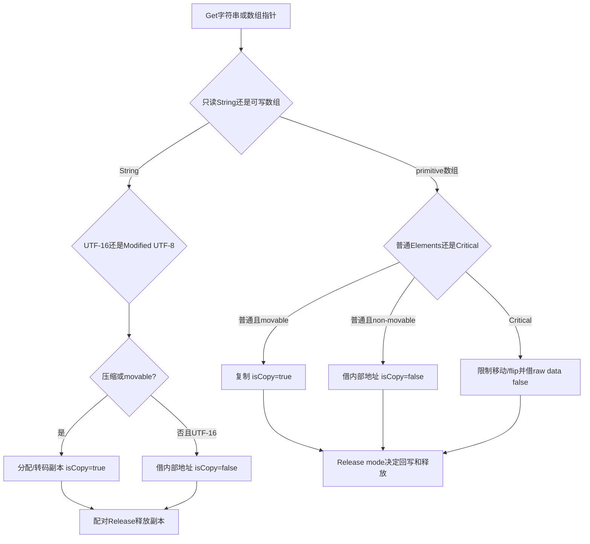
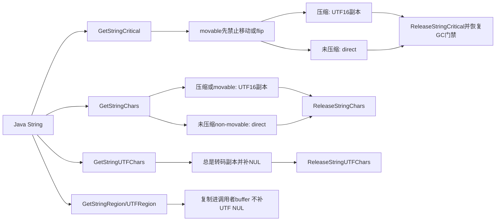
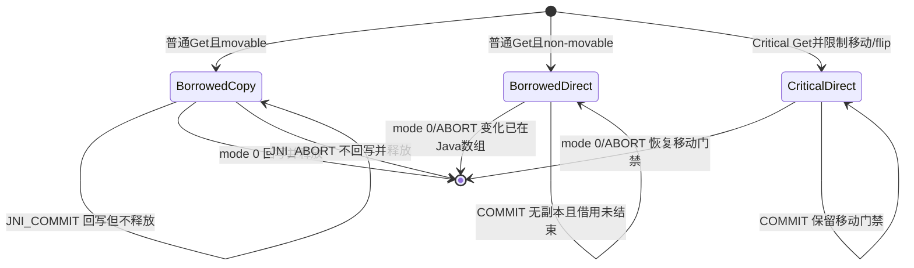

# 第578章 Android ART JNI字符串与数组：Modified UTF-8、copy/pin、Release模式、Critical、DirectByteBuffer与GuardedCopy链

> 源码基线：Android 11 `android-11.0.0_r48`。本章只在macOS上阅读、检索和比对源码，不运行JNI、不加载native库、不触发GC，也不编译AOSP。
>
> 本章主问题：Java String在ART内部可能压缩成单字节，JNI为何仍向外提供UTF-16或Modified UTF-8；`Get*Chars/Get*ArrayElements`何时复制、何时直接返回内部存储；`isCopy`究竟说明什么；Release的0、`JNI_COMMIT`、`JNI_ABORT`怎样组合“回写”和“释放”；Critical API怎样阻止对象移动；DirectByteBuffer又由谁拥有并释放native内存？

## 1. 先抓住这一章真正危险的地方

JNI返回的`jchar*`、`jint*`或`void*`看起来像普通C指针，最容易让人忘记它们是一次Get操作借出的临时访问权。指针可能指向native副本，也可能直指Java堆对象；只有对应Release才知道是否要回写、释放副本或恢复GC移动能力。`isCopy`是这次实现选择的报告，不是生命周期许可证。把所有结果都当malloc内存，或把所有结果都当堆内地址，都会出错。

## 2. 先纠正十六个常见误解

`GetStringLength`返回UTF-16 code unit数，不是Unicode code point数。`GetStringUTFLength`返回r48 Modified UTF-8字节数，不含结尾NUL。Android r48会把合法surrogate pair输出成4字节UTF-8序列，不总是经典MUTF-8的6字节形式。Java的U+0000必须编码为`C0 80`，C字符串中的`00`只表示终止。`GetStringUTFChars`总分配副本并补NUL；`GetStringUTFRegion`不补NUL。压缩String也不能直接作为`jchar*`返回。普通primitive `GetArrayElements`对movable数组复制，对non-movable数组直接借址。`isCopy=false`不代表可以跨Release保存。`JNI_ABORT`只能丢弃尚未回写的副本，直指Java数组时已经发生的写入无法撤销。`JNI_COMMIT`不释放副本，之后还需最终Release。Critical不保证“零复制字符串”，压缩String仍需展开。r48 primitive Critical基础实现总返回堆内raw data并报false，但会限制移动GC/thread flip。Critical区不能阻塞或任意调用JNI。Region API总由调用者给缓冲区且无需Release。DirectByteBuffer不自动取得native内存所有权。CheckJNI guarded copy可以抓越界，但不是通用内存安全器。

## 3. 一句话总览

ART String本体内联保存压缩8位或未压缩16位数据：UTF-16 API在“压缩或对象可移动”时复制，UTF API总转码复制；Critical先限制对象移动，再对压缩串复制、对未压缩串借址。primitive数组普通Elements在movable时复制、non-movable时借址，Critical则限制移动并总借raw data。共同Release函数依据`elements != array_data`判断副本，再按mode决定回写/释放；DirectByteBuffer只是用Java对象包装native地址与int容量，不替调用者验证或释放底层内存。

## 4. 本章要同时维护的九本账

第一是逻辑长度账：UTF-16 units、code points、UTF字节数。第二是内部布局账：String压缩/未压缩、数组element size。第三是来源账：native副本还是Java堆内data。第四是移动账：对象可否被GC搬迁。第五是修改账：只读String与可写primitive array。第六是回写账：何时copy back。第七是释放账：何时delete副本或解除移动限制。第八是临界区账：期间允许哪些动作。第九是native所有权账：DirectByteBuffer对象活着是否等于地址仍有效。

## 5. 主要源码地图

JNI实现看`art/runtime/jni/jni_internal.cc`，String布局与压缩看`art/runtime/mirror/string.h`、`string-inl.h`和`string.cc`，Modified UTF-8转换看`art/libdexfile/dex/utf.h/.cc/-inl.h`。移动限制看`art/runtime/gc/heap.h/.cc`；CheckJNI临界计数、ForceCopy与GuardedCopy看`art/runtime/jni/check_jni.cc`、`jni_env_ext.h/.cc`和`java_vm_ext.h/.cc`。DirectByteBuffer字段缓存看`well_known_classes.cc`，Java对象实现看`libcore/ojluni/src/main/java/java/nio/DirectByteBuffer.java`与`Buffer.java`。

## 6. 先给所有Get指针写统一合同

调用者提供Java引用与可选`isCopy`地址，Get返回只在匹配Release前有效的指针；读取/写入权限由具体API决定。必须把原Java对象、原指针、对应Release函数和mode配对保存。不能`free/delete`、不能给另一种Release、不能用另一个数组代替，也不能先Release再访问。JNI规范允许VM每次选择copy或direct，所以业务逻辑不能依赖上一次结果。

## 7. 指针与`jobject`的生命周期是两条线

保留数组的global ref只能保证Java对象不因可达性消失，不自动延长此前Elements指针的借用期；反过来，持有Elements指针也不能当成持有普通`jarray`引用。Critical路径内部会限制移动，但仅持续到Release。需要长期跨线程共享时，应建立明确native副本或DirectByteBuffer所有权，而不是偷留一次JNI借址。

## 8. 第一幅图：所有Get/Release先问哪五个问题



这幅图只是r48基础实现，不是所有JVM永久不变的性能承诺。应用真正可依赖的是“尊重isCopy、不要越过Release、mode按规范使用”，而不是预测某个对象一定落在哪个分支。

## 9. ART String为什么有两种物理布局

r48的`mirror::String`把字符数据内联在对象尾部，`kUseStringCompression=true`。全部ASCII的字符串可用每字符一个`uint8_t`保存；含不能压缩字符时用每字符一个`uint16_t`保存。`count_`同时编码逻辑长度和compression flag，`GetLength()`先移除标志。Java层String语义仍是UTF-16序列，物理压缩只是运行时实现。

## 10. 压缩条件不是“任意Latin-1”

`String::AllASCII`决定常见分配是否可压缩，范围比完整ISO-8859-1窄。压缩数据用`GetValueCompressed()`读，未压缩用`GetValue()`读；`CharAt()`统一返回`uint16_t`，调用方不用知道布局。不能看到一字节存储就把String宣称为UTF-8，它只是ASCII code unit的紧凑表示。

## 11. String不可变为何仍需要Release

`GetStringChars`返回`const jchar*`，native不应修改；Release不执行copy back。但VM仍可能为压缩/可移动对象分配native数组，需要Release决定delete；Critical还可能暂停moving/flip，需要Release恢复。只读解决“内容不能改”，没有解决“资源无需归还”。

## 12. `NewString`接收的是哪一种长度

`NewString(env, chars, char_count)`把`jchar`数组视为UTF-16 code units，长度单位是16位元素，不检查surrogate是否成对。负长度或非零长度配null地址会JniAbort；`chars=null`且`char_count=0`在r48合法，会分配空String。成功结果通过local reference返回，分配失败则跟随pending OOME语义。

## 13. UTF-16长度不等于用户看到的字符数

BMP code point通常占一个jchar，supplementary code point由high/low surrogate两个jchar组成。`GetStringLength`直接返回`String::GetLength()`，所以一个🏠可能返回2。组合字符、emoji序列和grapheme cluster又可能包含多个code point；JNI这里不做用户感知字符切分。

## 14. `NewStringUTF`的输入为什么必须NUL终止

函数没有显式字节长度，先`strlen(utf)`，所以第一个0字节就是输入结束。Java String中的U+0000不能作为裸0放在中间，而需两字节`C0 80`。若native数据来自网络并可能含0或没有可靠终止，应先验证长度并转换到UTF-16后用`NewString`，不要让`strlen`越界扫描。

## 15. r48所称Modified UTF-8与教科书版本的差异

它保留“U+0000用二字节避免内部NUL”和未配对surrogate用三字节编码；但`ConvertUtf16ToModifiedUtf8`遇到合法surrogate pair时输出标准UTF-8的4字节code point。`CheckUtfBytes`也明确接受4字节序列，`NewStringUTF`还接受传统两个三字节surrogate输入，并在以后输出时规范化成4字节。读本章必须以r48代码为准。

## 16. 为什么同一个String的输入和输出字节数会变

r48测试把六字节`𐐀` surrogate编码交给`NewStringUTF`，内部得到两个UTF-16 units；`GetStringUTFLength`却返回4，`GetStringUTFChars`输出对应code point的4字节序列。Java String按UTF-16内容相等，JNI UTF字节表示不保证逐字节复现原输入。协议若要求保留原始字节，不能中途转成String。

## 17. `NewStringUTF`基础实现怎样处理坏输入

r48先用`VisitModifiedUtf8Chars`做“足以避免越过终止符和破坏压缩不变量”的部分验证，不宣称完整校验。发现截断或会错误压成ASCII等坏序列时，记录SafetyNet事件并限频写日志，再重走输入，把坏单元替换为ASCII问号`?`。不是U+FFFD，也不是对所有非法UTF都抛异常。

## 18. CheckJNI为何表现得更严格

CheckJNI的`CheckUtfString`调用`CheckUtfBytes`检查起始/continuation byte并在错误处JniAbort，同时仍接受4字节UTF序列。于是同一坏输入在unchecked基础实现可能被`?`替换，开启CheckJNI可能直接报“not valid Modified UTF-8”。这不是业务可依赖的宽松恢复协议；生产native应在进入JNI前验证自己的编码。

## 19. 2GiB边界发生在哪里

`NewStringUTF`先取得`strlen`结果；若超过`int32_t`最大值，r48主动抛OOME，避免向内部int长度转换溢出，也避免为了坏字符替换先尝试巨额分配。这个检查不能保护未终止指针：`strlen`本身已经需要安全可读的终止符。

## 20. `GetStringUTFLength`返回什么

压缩ASCII String直接返回UTF-16长度，因为每个unit输出一字节；未压缩则`CountUtf8Bytes`扫描UTF-16，按r48规则计算字节数。结果不含`GetStringUTFChars`额外写入的结尾`\0`。分配目标C字符串时至少需要`length+1`，但还应处理`jsize`/`size_t`转换与分配失败。

## 21. `GetStringChars`的三种情况

压缩String必须展开为新`jchar[length]`；未压缩但对象在movable space也复制，避免native持有会因GC移动失效的内地址；只有未压缩且non-movable才直接返回`String::GetValue()`。前两种置`isCopy=JNI_TRUE`，最后一种置false。可选参数为null时行为不变，只是不报告。

## 22. `ReleaseStringChars`怎样识别副本

它重新解码String；若String压缩，Get必然返回展开副本，直接`delete[] chars`。未压缩时比较`chars`与当前`GetValue()`，不同即删除副本，相同则什么也不做。由于直接借址只给non-movable对象，正常配对时不会因对象搬迁导致误判。函数不回写，因为String不可变。

## 23. 为什么不能修改`GetStringChars`结果

即使`isCopy=true`，API类型仍是`const jchar*`，Release也不会把修改写回String。CheckJNI ForceCopy甚至为String内容保存checksum，把修改视为错误。若需要可写字符数组，应自己复制到native容器，或创建Java `char[]`并使用数组API；不要通过去const破坏String不变量。

## 24. `GetStringUTFChars`为何在r48总是copy

Java对象内部不是NUL终止的r48 UTF字节串：压缩布局没有额外终止位，未压缩布局还需转码。因此函数总计算byte count、分配`byte_count+1`、填充数据、末尾写0，并在提供`isCopy`时置true。即使纯ASCII non-movable String也不会直接返回内部地址。

## 25. `ReleaseStringUTFChars`为什么参数看似没用

r48基础实现忽略env与jstring，只对chars执行`delete[]`。对象参数仍属于JNI配对合同，CheckJNI会验证String引用和指针包装；其他VM也不承诺同样实现。不能因此拿一个任意`new[]`指针调用Release，更不能用`free`替代对应Release。

## 26. Region API适合什么场景

`GetStringRegion`直接把指定UTF-16区间写入调用者缓冲；压缩串逐个`CharAt`展开，未压缩串用memcpy。`GetStringUTFRegion`把同一区间转成r48 Modified UTF-8写入调用者char缓冲。它们不分配返回指针、没有isCopy，也无需Release，适合调用方已经有明确容量的短期复制。

## 27. Region的start/length单位要注意

两个String Region的start和length都按UTF-16 units，而UTF版本的输出容量却按编码后的字节数。必须先为目标区间计算最坏或精确字节空间，不能只分配`length`字节。r48的越界判断拒绝负值及`length > total-start`，用减法形式避免`start+length`有符号溢出。

## 28. `GetStringUTFRegion`不会补NUL

源码只转换请求区间，不在尾部写0；压缩ASCII分支也只写length个字节。若随后交给`printf("%s")`，必须自己额外分配一字节并写终止符。它与`GetStringUTFChars`的“总是NUL终止”合同不同，函数名只差Region却不能互换。

## 29. 长度为0时null buffer的精确边界

r48宏允许memcpy类操作在length为0时buffer为null，但仍先验证区间；测试明确`start=2,length=0`合法，而`start=123,length=0`对长度5的String仍抛`StringIndexOutOfBoundsException`。零长度只免除内存读写，不免除索引合同。

## 30. String API的异常与abort要分开

Region索引越界走Java `StringIndexOutOfBoundsException`；分配失败可pending OOME；严重JNI参数错误常走JniAbort，CheckJNI提供更详细上下文。不能假设所有错误都以null+exception返回。native边界先验证指针、长度和范围，既为正确性也避免诊断直接终止进程。

## 31. “UTF”变量命名为何必须标清方言

业务常同时出现标准UTF-8、CESU-8、经典Modified UTF-8和ART r48接受/输出的扩展形式。变量只叫`utf8`会掩盖NUL、surrogate与4字节规则。建议在协议边界标注`standard_utf8_bytes`，在JNI `NewStringUTF/GetStringUTFChars`附近标注`jni_modified_utf8`，必要时显式走可靠转换库。

## 32. 不要用`GetStringUTFLength`做网络编码长度

它计算的是JNI这套转换规则，不保证等于某个服务端要求的标准、CESU-8或规范化UTF-8长度，也不做Unicode normalization。网络、文件和数据库协议应使用其指定charset编码；JNI UTF API只解决C接口与Java String之间的约定。

## 33. 空String也必须Release

`GetStringUTFChars`对空串仍分配一字节来放终止0；`GetStringChars`对压缩空串可执行`new jchar[0]`并返回实现定义的非null地址。只因length为0而跳过Release仍可能泄漏或破坏配对。唯一可跳过的是Get本身返回null且有相应失败处理。

## 34. `GetStringCritical`先做哪件事

它解码String后先问Heap该对象是否movable；若是，非read-barrier配置调用`IncrementDisableMovingGC`，CC/read-barrier配置调用`IncrementDisableThreadFlip`。这一步可能等待正在进行的GC/flip，因此随后用原jstring重新解码对象。之后才按压缩状态决定copy还是直接地址。

## 35. 为什么CC只需阻止thread flip

Concurrent Copying依赖to-space invariant和每线程read barrier状态；源码注释认为等待/禁止当前线程flip即可安全暴露满足不变量的地址，不必等待整个GC完全结束。其他配置则用全局disable-moving计数阻止会搬对象的GC阶段。两者都是Heap内部协议，native只应遵守尽快Release，不能自行调用计数器。

## 36. 第一段r48真实Java：String的Java方法仍通过char数组表达语义

下面逐字摘自`libcore/ojluni/src/main/java/java/lang/String.java`：

```java
    // BEGIN Android-added: Native method to access char storage managed by runtime.
    /**
     * getChars without bounds checks, for use by other classes
     * within the java.lang package only.  The caller is responsible for
     * ensuring that start >= 0 && start <= end && end <= count.
     */
    @FastNative
    native void getCharsNoCheck(int start, int end, char[] buffer, int index);
    // END Android-added: Native method to access char storage managed by runtime.
```

这段真实声明提醒两点：String内部存储由runtime管理且可能压缩，Java调用方看到的输出仍是`char[]`；`NoCheck`只是让包内调用者承担范围前置条件，不代表native能把String内部地址永久交给Java。

## 37. String Critical为何仍可能copy

若String压缩成8位数据，JNI承诺返回`jchar*`，必须新建UTF-16展开数组并置isCopy true。未压缩时则直接返回`GetValue()`并置false，即便对象原本movable也因前面已限制移动而可暂借。Critical优化的是“允许直接借址”，不是“强制零复制”。

## 38. compressed且movable为何既copy又限制移动

r48先按movable建立disable-moving/disable-flip，再判断compressed并复制，所以这条路径看似副本已独立却仍占用临界资源。ReleaseStringCritical会再次解码String、先对movable对象递减相同计数，再删除压缩副本。笔记不能因为`isCopy=true`就说“Critical没有影响GC”。

## 39. `ReleaseStringCritical`的对称要求

Get若对movable对象增加哪种Heap计数，Release就按同一`kUseReadBarrier`分支递减；若压缩或chars不等于未压缩value，再delete副本。传错String、传错指针、重复Release或漏Release会分别破坏对象判断、内存释放或GC门禁。正确性依赖严格一一配对。

## 40. 第二幅图：四种String指针API的真实差异



选择API时先看需要的编码和所有权，再谈性能。已经有调用者缓冲时Region最直白；需要NUL终止C串时UTFChars合适；Critical只应留给极短、不阻塞且不做其他JNI工作的直接扫描。

## 41. Critical期间为何限制动作

VM可能为了维持指针稳定而延迟moving GC或线程flip；native若阻塞、I/O、等待锁、长循环或再做可能分配/挂起的JNI调用，会把短暂门禁扩大成系统级停顿风险。JNI合同要求临界段尽量短，不应调用任意JNI或阻塞。先准备好所有输入，Get后只做纯native紧凑工作，然后立即Release。

## 42. CheckJNI怎样记录临界嵌套

`JNIEnvExt`保存`critical_`计数和首次进入的CPU时间。带`kFlag_CritGet`的GetStringCritical/GetPrimitiveArrayCritical允许嵌套并递增；Release标志递减，过多Release会JniAbort。native方法准备返回Java时，若计数仍大于0也会报告“Critical lock held”。这套计数是诊断层，Heap的移动门禁另有自己的计数。

## 43. 并非所有JNI函数都一刀切禁止

CheckJNI给少量函数标`kFlag_CritOkay`，例如长度/部分Region查询和异常检查等可在其规则下调用；普通默认函数在`critical_>0`时报“using JNI after critical get”。不要据此逆推规范鼓励在临界区构建复杂调用链。可移植、低停顿的设计仍是只做必要native内存访问。

## 44. 16ms warning为什么不是精确墙钟

r48离开最外层critical时用`Thread::GetCpuMicroTime()`减进入值，超过16ms打印warning。因此睡眠/阻塞消耗的大量wall time未必等量计入CPU时间，诊断阈值不是严格停顿预算。代码审查仍应主动禁止阻塞，不能以“没看到16ms警告”证明安全。

## 45. 嵌套Get要求怎样Release

每次critical Get都增加诊断计数，并可能增加各自对象的Heap移动限制；必须为每次Get执行匹配Release。最好按严格栈式结构释放，避免异常/早退漏掉某个指针。C++可用局部RAII封装对应JNI Release，但析构必须发生在JNIEnv仍属于当前线程且Java引用仍有效时。

## 46. `isCopy=true`不放宽Critical纪律

规范允许VM给Critical返回副本，但调用者在Get前不知道选择；r48 String压缩路径确实是副本却仍可能已经禁止移动，CheckJNI也已经进入critical计数。因此不能运行时看到true就决定“现在可以阻塞/调JNI”。临界纪律从调用API时就生效，直到配对Release。

## 47. 临界Get失败后的清理如何判断

只有Get成功返回非null指针，调用者才拥有需要Release的借用。返回null时先检查pending exception/诊断，不要用null调用Release。若在取得多个critical指针后后续一步失败，必须逆序释放已经成功取得的那些；不要只依赖函数末尾的快乐路径。

## 48. 普通String API为何通常更稳妥

`GetStringChars`对movable对象直接复制，不需要跨native工作段阻止GC移动；`GetStringUTFChars`本来就复制。对大多数业务，短副本成本比扩大GC限制更可预测。Critical应由实测热点和极短循环证明价值，而不是因名字看起来“更快”默认替换。

## 49. CheckJNI ForceCopy是什么

VM选项`-Xjniopts:forcecopy`让CheckJNI包装在基础Get结果外再建一层GuardedCopy，并把isCopy改true。primitive array允许修改并在Release按mode写回基础指针；String guarded buffer按不可修改检查。它故意改变copy行为以暴露依赖direct pointer、越界或错误Release的bug，不代表生产默认布局。

## 50. GuardedCopy内存布局

它用mmap分配“头部+前red zone+用户buffer+后red zone”的区域，总额比数据多512字节。头部记录magic、原始基础指针、原长度和可选Adler checksum；前后区填`JNI BUFFER RED ZONE`循环字样。返回值指向中间用户区，Release通过向前偏移找到头部。

## 51. red zone能抓什么、抓不到什么

小范围下溢/上溢会破坏canary，Release检查时JniAbort并报告偏移；错指针可能使magic不匹配。但源码也承认若指针完全乱指，检查头部本身可能崩溃。写得足够远、并发use-after-release和任意native corruption不保证被优雅发现，它是针对JNI缓冲区的调试护栏。

## 52. String checksum为何单独存在

为String建guard时`mod_okay=false`，除red zones外还保存内容Adler32；Release重新算checksum，发现用户修改就报错。primitive array用`mod_okay=true`，允许用户区变化，只检查边界。这样能区分“合法数组写入”和“非法String修改”，而不是所有变化都视为越界。

## 53. ForceCopy为什么可能形成两层副本

基础`GetStringUTFChars`已分配转码数组，或普通Elements因movable数组已复制；CheckJNI随后又把它复制进guarded buffer。Release先把guard层还原/写回基础指针，再调用基础Release完成Java回写和基础副本释放。性能会显著不同，所以ForceCopy只适合诊断，不能用其benchmark代表生产。

## 54. guard pointer必须原样归还

Release通过固定偏移寻找GuardedCopy头部，传`ptr+1`、另一个Get的指针或已经释放的地址会破坏magic/映射访问。native可以用临时游标遍历，但必须保留最初base pointer给Release。这个规则即使未开ForceCopy也成立，只是错误可能更晚暴露。

## 55. String与array Release函数不可互换

它们可能分别执行`delete[] jchar`、`delete[] char`、`delete[] uint64_t`、copy back、Heap门禁递减或GuardedCopy解包。C指针类型强转并不会携带来源信息。安全封装应把“获取函数、Java owner、原指针、release函数、mode”绑定在同一对象，避免裸`void*`穿过多层代码。

## 56. String部分的小结

先用UTF-16 units理解Java String，再明确JNI“UTF”是r48扩展Modified UTF-8；Chars可能copy/direct，UTFChars总copy，Region写调用者buffer，Critical可能copy也可能direct但总按临界纪律。任何Get都以Release结束，任何null/零值都结合异常判断。

## 57. primitive array与object array为何不能共用指针API

primitive元素是固定宽度无引用数据，可以安全memcpy并在受控条件下暴露连续raw storage；object array元素是GC引用，移动和write barrier要求更复杂，JNI只提供逐项Get/Set，不提供`jobject* GetObjectArrayElements`。绕过逐项接口会让GC看不到或无法修正native持有的引用槽。

## 58. 八种primitive数组映射

r48为boolean、byte、char、short、int、long、float、double实例化同一模板，`sizeof(ElementT)`必须等于Class component size。类型检查要求实际数组Class精确等于对应root class，不接受把`byte[]`伪装为`boolean[]`，即便两者元素都一字节。

## 59. `NewPrimitiveArray`的边界

负length会JniAbort；合法长度调用相应`mirror::*Array::Alloc`，再返回local ref。Java数组由GC拥有并按Java规则零初始化，不是native `malloc`。创建数组本身不提供元素指针；仍需Region或Elements API访问。

## 60. object array创建多做了哪些工作

`NewObjectArray`拒绝负长度、要求element class非primitive，借ClassLinker找到相应array class并分配。initial element非null时验证其Class可赋给component type，再逐槽初始化；不兼容会JniAbort，而后续`SetObjectArrayElement`的不兼容store通常走Java ArrayStoreException。初始化结果也是local ref。

## 61. 第二段r48真实Java：native批量内存API仍显式接收Java数组

下面逐字摘自`libcore/luni/src/main/java/libcore/io/Memory.java`：

```java
    @UnsupportedAppUsage
    public static native void peekByteArray(long address, byte[] dst, int dstOffset, int byteCount);
    public static native void peekCharArray(long address, char[] dst, int dstOffset, int charCount, boolean swap);
    public static native void peekDoubleArray(long address, double[] dst, int dstOffset, int doubleCount, boolean swap);
    public static native void peekFloatArray(long address, float[] dst, int dstOffset, int floatCount, boolean swap);
    public static native void peekIntArray(long address, int[] dst, int dstOffset, int intCount, boolean swap);
    public static native void peekLongArray(long address, long[] dst, int dstOffset, int longCount, boolean swap);
    public static native void peekShortArray(long address, short[] dst, int dstOffset, int shortCount, boolean swap);
```

这些声明把native地址、Java数组、元素偏移/数量和endianness变换显式分开。它们是libcore自己的native方法，不等于JNI自动替所有数组完成安全边界；实现仍要验证范围并选择Region、Elements或受控内部访问。

## 62. `GetObjectArrayElement`返回的是local ref

r48解码object array，按index取GC引用，再用`AddLocalReference`包装返回。即使同一槽反复读取，也可能创建多个local句柄；循环应及时Delete或Push/Pop frame。越界由数组访问路径产生ArrayIndexOutOfBoundsException，不是返回一个特殊空对象。

## 63. `SetObjectArrayElement`为什么不能memcpy

它解码输入jobject，调用ObjectArray的`Set`，由数组逻辑做bounds、assignability与引用写入协议，包括GC write barrier。写null合法，错误类型产生ArrayStoreException。native手工写堆内引用地址会绕过屏障并破坏移动GC，所以没有object array raw pointer API。

## 64. Region API总是一次显式复制

`Get<Type>ArrayRegion`从Java数组区间memcpy到调用者buffer；`Set<Type>ArrayRegion`反向memcpy。它们没有isCopy和Release，因为缓冲区归调用者，JNI只在调用期间访问。明确区间的小批量读写通常比GetElements更不易漏资源。

## 65. Region的范围检查与零长度

r48验证`start<0`、`length<0`或`length > arrayLength-start`，失败抛ArrayIndexOutOfBoundsException；合法零长度允许buf为null。和String Region一样，无效start不会因为length为0被忽略。ElementT决定字节数`length*sizeof(ElementT)`，调用者buffer必须真的足够。

## 66. primitive Region写为何不需要GC barrier

元素不是对象引用，memcpy不会改变Java堆的对象图；因此无需卡表/write barrier。它仍受线程状态、对象移动和ScopedObjectAccess保护：复制发生在JNI调用内部，runtime持有正确访问状态，而不是把堆内地址交给native长期保存。

## 67. `GetArrayLength`也会验证真实对象类型

基础实现解码jarray后调用`IsArrayInstance()`检查真实对象，非数组会JniAbort；正常对象返回Array length。C typedef只提供编译期外观，native强转任意jobject不会改变Java对象Class。CheckJNI还能在入口给出更明确函数名。

## 68. Elements适合什么场景

需要在native连续遍历或修改较大primitive数组，且希望VM选择copy/direct时使用`Get<Type>ArrayElements`。它给整数组起点，不接start/length；只操作小区间时Region通常更清楚。Elements获取后到Release之间应短，且要考虑copy路径的整数组复制与最终回写成本。

## 69. 第三幅图：primitive数组的Get、修改与Release状态机



这张图按r48基础实现画。最关键的反直觉点是direct路径没有“待回写副本”，所以ABORT不是undo；COMMIT的“do not free”意味着借用还没结束，而不是提前完成。

## 70. 普通`Get<Type>ArrayElements`先验证什么

宏进入类型模板后要求array非null，解码并检查实际Class精确匹配对应primitive array root，再断言C ElementT大小等于component size。类型错会JniAbort而非执行按字节兼容。验证通过才决定copy/direct。

## 71. movable数组为什么选择copy

若`Heap::IsMovableObject(array)`为true，r48按总字节数分配以`uint64_t[]`为底的对齐缓冲，memcpy整个数组，置isCopy true。这样普通native工作期间无需禁止moving GC，对象即使搬迁也不影响副本。Release时重新解码当前数组地址再决定回写。

## 72. non-movable数组为什么可direct

对象不在会移动的空间时，r48直接返回`array->GetData()`并置isCopy false，不新增Heap移动门禁。native写入立即作用于Java数组，Release主要结束借用合同。non-movable是此次runtime判断，不应由应用根据数组来源猜测。

## 73. `isCopy`是输出，不是请求参数

调用者可传null表示不关心；非null时VM写true/false。先把`*isCopy`设成某值不会影响选择，且不同对象/GC/VM版本可能不同。代码必须在两条路径都正确：修改语义由Release mode表达，资源释放无论true/false都必须调用。

## 74. 为什么副本用`uint64_t[]`而非ElementT数组

r48把总字节数向8对齐，以`new uint64_t[...]`获得足够对齐，再reinterpret为具体ElementT；Release也按`uint64_t*`delete。这样一套模板可服务八种primitive，不必为每种类型复制分配逻辑。调用者绝不能自行用错误delete类型释放。

## 75. 借到指针后Java数组还能被谁改

JNI API本身不建立业务互斥。copy路径中Java线程可同时改原数组，最终native整数组copy back可能覆盖期间变化；direct路径则形成native与Java对同一存储的并发访问。需要同步的共享数据仍要由应用锁、线程封闭或协议解决，`GetArrayElements`不是事务。

## 76. 共用Release函数先怎样判断copy

它重新取得当前`array_data`，用`array_data != elements`判定is_copy。若不同，先用`IsNonDiscontinuousSpaceHeapAddress`排除落在常规连续heap space中的可疑指针，避免把另一堆对象内部地址当副本；这不是覆盖所有地址空间的完整证明。随后才依据mode copy back与delete。若相同，则没有native副本可处理，只可能需要解除Critical建立的移动限制。

## 77. mode 0的完整语义

副本路径执行`memcpy(array_data,elements,bytes)`再delete副本，相当于“提交并结束”；direct路径内容早已在数组中，函数结束借用，Critical direct还递减移动/flip计数。绝大多数修改后一次性结束的代码应使用0，控制流最简单。

## 78. `JNI_COMMIT`只完成一半

副本路径先回写，但不delete，调用者可继续使用同一buffer，之后必须再次Release（通常mode 0）最终释放；direct/Critical路径同样不结束底层借用，r48在mode为COMMIT时不递减移动门禁。把COMMIT当“release完成”会泄漏副本或永久拖住GC。

## 79. `JNI_ABORT`准确丢弃什么

只有is_copy路径能跳过copy back并delete副本，所以未提交的native修改被丢弃。direct路径写入早已落在Java数组，源码没有旧快照可恢复；ABORT只结束借用/可能恢复移动门禁。名字表示“不要从副本复制回去”，不是通用数据库rollback。

## 80. r48为何会警告可疑ABORT

副本路径传ABORT时，代码保留了一条`kWarnJniAbort`诊断：若开关开启且副本与原数组不同，打印“Possible incorrect JNI_ABORT”并dump Java stack，因为开发者常误把0写成ABORT而丢修改。但r48把该constexpr设为false，正常不会出现；即使未来开启，它也只是启发式，确实想丢弃临时改动时差异完全合理。

## 81. 无效mode在哪里被拦

CheckJNI的`CheckReleaseMode`只接受0、JNI_COMMIT、JNI_ABORT，其他值JniAbort。unchecked基础Release没有同样显式switch：非ABORT会回写，非COMMIT会释放，某些无效值可能表现得像0。不能依赖这种宽松组合；传无效mode本身违反JNI合同。

## 82. Release必须使用原数组

copy buffer本身不携带公开owner身份；基础Release会把它复制到本次传入array。若传另一个同类型同长度数组，可能把数据错误写入它，类型检查也未必发现。CheckJNI guarded头部记录original pointer而非完整Java owner，仍不是业务配对证明。封装时必须同时保存原jarray引用。

## 83. Release期间原local引用必须仍有效

如果把Get放在一个local frame里，先Pop frame导致jarray失效，再尝试Release，解码就违反引用生命周期。指针并不替jarray保活/续期。要跨frame或异步边界必须重新设计：通常在同一native调用内完成，必要时建立global ref和自有native copy，而不是只保存裸pointer。

## 84. 普通direct路径为什么不需要pin

r48只有在数组本来non-movable时普通Elements才direct，所以GC无需额外限制。movable对象一律copy。这个选择避免普通JNI长时间阻塞moving collector，也说明“GetArrayElements就是pin数组”在r48并不准确。

## 85. `GetPrimitiveArrayCritical`做了不同取舍

它只接受任意primitive array，取得component size；若对象movable，增加disable-moving或disable-thread-flip，等待后重新decode；随后无条件返回`GetRawData(component_size,0)`并置isCopy false。它不按八种C函数分别选择，实现以jarray+void*统一表达。

## 86. Critical返回false不等于没有系统成本

false只报告不是copy；为了保证raw pointer稳定，runtime可能暂停/延迟移动相关工作。native省掉memcpy，却把时间约束转化为GC协作约束。数组越大不自动意味着Critical更优，临界段时长和collector行为才是关键成本。

## 87. 为什么movable Critical要重新decode

`IncrementDisableMovingGC/ThreadFlip`可能等待当前GC到达安全状态，在等待期间对象已被搬迁，进入前解码的`ObjPtr`可能旧。源码注释明确随后从原jarray重新解码，再取raw data。这是移动GC下“先建立稳定条件，再读取地址”的标准顺序。

## 88. Critical Release复用了普通mode算法

`ReleasePrimitiveArrayCritical`验证primitive array、取component size，然后调用共同`ReleasePrimitiveArray`。因为elements等于当前raw data，is_copy通常false；mode非COMMIT时对movable array递减进入时的Heap计数。共同实现也使ABORT在direct路径无法撤销写入。

## 89. Critical配`JNI_COMMIT`的r48诊断缺口

基础实现看到COMMIT会保留moving/flip禁用计数，期待以后最终Release；但CheckJNI的`kFlag_CritRelease`在检查入口不看mode就先递减自己的`critical_`诊断计数。之后第二次最终Release可能被CheckJNI报“too many critical releases”。这是r48两本账不一致的边界，稳妥做法是Critical一次完成后直接mode 0，不用COMMIT维持长临界段。

## 90. Critical的ABORT也不是只读声明

有些代码用ABORT表达“我只读了”，这在direct路径可以结束借用，但runtime无法验证你没写；若确实写了，Java数组已变化。可读性更好的封装应区分const视图与可写视图，并在只读路径不暴露可修改API，而不是依赖ABORT提供保护。

## 91. 为什么没有ObjectArrayCritical

对象数组data中每个槽都是GC引用，collector可能需要读屏障、更新引用、记卡和验证类型；给native一个裸`jobject*`既不等于给句柄数组，也无法安全随GC改写。逐项Get/Set才把引用解码、local ref和write barrier放在正确位置。

## 92. 数组副本回写不是增量合并

r48 Elements副本Release时memcpy整个数组字节数，而不是只回写native实际修改的区间。即便只改一个元素，也可能覆盖Java并发写入的其他元素。若只需小范围修改，`Set<Type>ArrayRegion(start,length)`更能表达边界并减少冲突窗口。

## 93. 异常路径的推荐结构

每次Get后立刻检查null；成功后把owner、pointer和是否已释放放进单出口/RAII；任何后续JNI失败先按规则清理已借资源，再传播pending exception。Critical区中又不能任意调用JNI，因此应在Get前完成会失败的查找、分配和引用准备，减少临界区内分支。

## 94. 数组部分的小结

Region是显式区间copy且无Release；普通Elements让VM在whole-array copy与non-movable direct中选；Critical以GC门禁换raw direct。0=提交并结束，COMMIT=提交但继续借，ABORT=不从副本回写并结束。direct没有旧副本，因此所有写入即时可见且不可撤销。

## 95. DirectByteBuffer解决的是另一类需求

如果数据天然由native库、mmap、设备或共享内存拥有，反复Java array↔native copy可能不合适。`NewDirectByteBuffer(address,capacity)`建立Java NIO视图，让Java按Buffer API访问这段地址。它不是一次临时Elements借用，但也不自动管理底层内存的分配、边界和释放。

## 96. 第三段r48真实Java：JNI构造的DirectByteBuffer没有Cleaner

下面逐字摘自`libcore/ojluni/src/main/java/java/nio/DirectByteBuffer.java`：

```java
    // Invoked only by JNI: NewDirectByteBuffer(void*, long)
    @SuppressWarnings("unused")
    private DirectByteBuffer(long addr, int cap) {
        super(-1, 0, cap, cap);
        memoryRef = new MemoryRef(addr, this);
        address = addr;
        cleaner = null;
    }
```

构造器把地址和容量写进Java对象，`cleaner=null`明确表示这条JNI路径不会自动运行unmapper/free。`MemoryRef(addr,this)`用于让slice/duplicate共享生命周期标识，不代表它拥有native地址的释放函数。

## 97. `NewDirectByteBuffer`先做三项边界检查

r48拒绝负capacity；address为null但capacity非0也拒绝；capacity超过`INT_MAX`拒绝，因为当前Java DirectByteBuffer容量字段是signed int。null+0允许创建空buffer。通过后把pointer转jlong、capacity转jint，调用缓存的`DirectByteBuffer(long,int)`构造器，若pending异常则返回null。

## 98. ART不会验证任意native地址是否真的可读写

基础实现能检查null/容量数值，却无法通用证明`[address,address+capacity)`已映射、权限正确、对齐合适、未越界或未来不会释放。错误地址通常在Java读写Buffer时导致native fault。地址验证和实际分配大小属于native owner责任。

## 99. 谁负责释放JNI传入的内存

JNI创建的DirectByteBuffer构造器没有Cleaner，也没有保存free回调；GC只回收Java包装对象。native组件必须定义何时释放地址，并确保直到所有Java buffer、slice、duplicate和并发使用者都结束前地址有效。最安全的协议通常有显式close、refcount或PhantomReference通知，而不是猜GC时间。

## 100. `MemoryRef.originalBufferObject`解决什么

JNI路径的MemoryRef保存原始DirectByteBuffer对象；所有slice/duplicate共享这个MemoryRef。这样只要任一派生buffer还活着，MemoryRef就活着，并通过字段让原始buffer也保持可达；native若给原始buffer建立PhantomReference，要等所有共享视图都消失后才收到入队机会。它协调Java wrapper生命周期，不释放native内存。

## 101. 为什么Java普通allocateDirect看起来不同

r48普通DirectByteBuffer的MemoryRef可用`VMRuntime.newNonMovableArray(byte.class,capacity+7)`得到Java byte[] backing并做8字节对齐，这部分内存由GC拥有；文件映射构造器则可创建Cleaner调用unmapper。JNI address构造器第三种路径`buffer=null`、cleaner=null。不能从“都是DirectByteBuffer”推导底层owner相同。

## 102. `GetDirectBufferAddress`实际读取哪个字段

WellKnownClasses名叫`effectiveDirectAddress`，r48缓存时实际查的是继承自`java.nio.Buffer`的`address:J`字段；JNI实现用`GetLongField`返回并转成void*。对slice，Java构造器已经把address设为`allocatedAddress+off`，所以返回该view的capacity起点，不再额外加当前position。

## 103. address与position为什么不能混

Buffer的position是相对游标，`GetDirectBufferAddress`返回buffer基址；native若要对应当前位置，需按元素大小和position自行计算，且防溢出、尊重limit。typed view还有`_elementSizeShift`帮助Framework native代码理解元素大小，但标准JNI GetDirectBufferAddress只给void*。

## 104. `GetDirectBufferCapacity`为何只能到INT_MAX

基础实现读缓存的`capacity:I`字段再扩为jlong返回，所以New时提前拒绝大于INT_MAX。JNI API签名虽返回jlong，r48 Java Buffer实现仍把容量存int；返回类型更宽不代表这个VM能创建超2GiB direct buffer视图。

## 105. r48对non-direct Buffer的特别边界

这两个基础函数只是读继承字段，没有显式调用`isDirect()`：heap ByteBuffer的`address`默认0，而其`capacity`仍是正int。于是不要用`GetDirectBufferCapacity>=0`作为可移植direct性测试；应由API设计保证传入DirectBuffer，并结合address、Java `isDirect()`或上层类型检查。其他VM行为也可能不同。

## 106. Java对象存活仍不保证外部资源存活

DirectByteBuffer强引用只能保住wrapper/MemoryRef，不能阻止独立native线程提前`free`、`munmap`或复用地址。native owner必须把Java视图纳入同一生命周期协议。反过来，Java对象不可达也不代表可以立即free，PhantomReference/Cleaner回调有异步时机且不保证进程退出前运行。

## 107. DirectByteBuffer不是GC pin

JNI传入的地址本来就在Java moving heap之外，runtime无需pin Java对象；wrapper自身可被GC移动，因为address是数值字段，jobject通过句柄更新。若把普通Java数组内部地址塞进NewDirectByteBuffer，数组随后移动会使address陈旧，除非有另一个正式不移动协议；这是危险的跨机制拼接。

## 108. Direct与Elements怎样选择

Java数组是GC所有、需要一次native算法时用Region/Elements；native资源要被Java长期访问时用DirectByteBuffer并设计owner；Critical只用于极短的零复制窗口。三者解决的生命周期不同，不应只按“哪个少一次copy”选择。

## 109. CheckJNI对DirectBuffer能检查到哪里

它检查线程、引用、返回类型，并借普通GetField验证对象与字段兼容；New的null/capacity检查仍在基础实现。它无法探测pointer后整段内存是否有效、是否已free、是否与capacity相符。AddressSanitizer、owner测试和显式关闭状态才覆盖native生命周期错误。

## 110. 一条实用的代码审查清单

看到String/array指针就问：编码和长度单位是什么；是否NUL终止；Get可能copy还是direct；Java owner是否保持有效；是否允许修改；所有早退是否Release；mode是0/COMMIT/ABORT哪一个；ABORT能否真的丢修改；Critical期间是否阻塞/调JNI；Direct地址谁分配、谁释放、派生view怎样计数。十问答全才算边界闭合。

## 111. 本章的只读边界

下面四个练习只用`rg`、`sed`和`awk`读取当前AOSP r48源码，验证String转换、array copy/release、Critical门禁与DirectByteBuffer/GuardedCopy；不会运行gtest、不会调用JNI、不会分配目标端内存，也不会编译。匹配行是阅读入口，结论必须结合完整函数体。

## 112. macOS只读练习一：核对String压缩、UTF长度与四种访问API

```bash
cd /Users/ninebot/androidSource || exit 1
rg -n "kUseStringCompression|IsCompressed|GetLengthFromCount|GetUtfLength|CountUtf8Bytes|ConvertUtf16ToModifiedUtf8" \
  art/runtime/mirror/string.h art/runtime/mirror/string.cc art/libdexfile/dex/utf.cc
rg -n "NewStringUTF|GetStringChars|ReleaseStringChars|GetStringCritical|ReleaseStringCritical|GetStringUTFChars|GetStringUTFRegion" \
  art/runtime/jni/jni_internal.cc
```

预期看到String的8/16位布局、UTF-16长度与UTF字节长度分离；再确认UTFChars总分配并补NUL、UTFRegion不补NUL、普通Chars对movable/压缩复制，而Critical先限制移动再决定压缩副本或未压缩direct。

## 113. macOS只读练习二：手算Elements的copy/direct与三种Release模式

```bash
cd /Users/ninebot/androidSource || exit 1
rg -n "GetPrimitiveArray\(|IsMovableObject|JNI_TRUE|JNI_FALSE|new uint64_t|array->GetData" \
  art/runtime/jni/jni_internal.cc
rg -n "ReleasePrimitiveArray\(|array_data != elements|mode != JNI_ABORT|mode != JNI_COMMIT|Possible incorrect JNI_ABORT" \
  art/runtime/jni/jni_internal.cc
rg -n "#define JNI_COMMIT|#define JNI_ABORT" libnativehelper/include_jni/jni.h
```

预期可从两个`mode !=`条件推出：0回写并释放，COMMIT回写不释放，ABORT不回写但释放；再结合`is_copy`分支确认direct修改早已进入Java数组，ABORT不能回滚。

## 114. macOS只读练习三：验证Critical的Heap门禁与CheckJNI两本账

```bash
cd /Users/ninebot/androidSource || exit 1
rg -n "GetPrimitiveArrayCritical|IncrementDisableMovingGC|IncrementDisableThreadFlip|Re-decode|ReleasePrimitiveArrayCritical" \
  art/runtime/jni/jni_internal.cc
rg -n "kCriticalWarnTimeUs|kFlag_CritGet|kFlag_CritRelease|GetCritical\(\)|SetCritical|too many critical releases|using JNI after critical get" \
  art/runtime/jni/check_jni.cc art/runtime/jni/jni_env_ext.h
```

预期得到“movable先建立门禁→等待后重新decode→raw data/isCopy false→非COMMIT时恢复”的基础链，同时看到CheckJNI独立计数、允许嵌套、16ms CPU时间warning及普通JNI禁用。对照COMMIT可发现r48诊断计数与Heap门禁的边界不完全一致。

## 115. macOS只读练习四：核对DirectByteBuffer所有权与GuardedCopy

```bash
cd /Users/ninebot/androidSource || exit 1
rg -n "NewDirectByteBuffer|negative buffer capacity|nullptr pointer|INT_MAX|GetDirectBufferAddress|GetDirectBufferCapacity" \
  art/runtime/jni/jni_internal.cc
rg -n "Invoked only by JNI|MemoryRef\(addr, this\)|cleaner = null|originalBufferObject|address = addr" \
  libcore/ojluni/src/main/java/java/nio/DirectByteBuffer.java
rg -n "class GuardedCopy|kRedZoneSize|CreateGuardedPACopy|ReleaseGuardedPACopy|CheckRedZones|ForceCopy" \
  art/runtime/jni/check_jni.cc art/runtime/jni/java_vm_ext.h
```

预期确认JNI只包装address+int capacity，构造器没有Cleaner；再看到ForceCopy外包512字节red zones、保存原指针并在Release按mode回写。两者都不能替native owner证明地址有效或自动释放底层资源。

## 116. 推荐的源码阅读顺序

先读`mirror/string.h/.cc`认识真实8/16位布局，再读`jni_internal.cc`的String API；随后读`utf.cc`和String测试核对U+0000、surrogate与4字节输出。数组部分先看Get/Release模板再看Critical；最后读CheckJNI GuardedCopy和DirectByteBuffer Java构造器。先掌握基础实现，再叠加调试包装，最不容易把两层copy写反。

## 117. 复读后专门修正的十处表述

第一，r48 supplementary pair输出4字节，不照搬“经典MUTF-8必6字节”。第二，坏输入替换字符是ASCII问号，不是U+FFFD。第三，UTF length不含终止NUL。第四，UTFRegion不补NUL。第五，String Critical压缩路径即使copy也可能已限制移动。第六，普通Elements的movable路径是copy而非pin。第七，ABORT只禁止副本回写，direct不可撤销，且r48相关warning默认关闭。第八，COMMIT后必须再Release。第九，Critical COMMIT在r48有CheckJNI/Heap两账不一致边界。第十，JNI DirectByteBuffer没有Cleaner且capacity只是int。

## 118. 本章自测题

一个emoji的GetStringLength和UTFLength为何可能是2与4？Java NUL怎样通过NewStringUTF？为何同一六字节surrogate输入会输出四字节？GetStringChars何时false？UTFChars为何总true？UTFRegion是否补NUL？isCopy由谁决定？ABORT何时能丢修改、何时不能？COMMIT后还要做什么？Critical返回copy能否阻塞？为何获取moving对象地址后要重新decode？object array为何没有Elements？DirectByteBuffer的native内存谁释放？能逐项回答才算真正掌握。

## 119. 最终心智模型

把JNI字符串/数组指针想成“带归还条款的临时窗口”。窗口背后可能是副本，也可能是Java真实存储；String只读、primitive array可写；movable对象要么copy，要么Critical暂时限制移动。Release同时处理三件事：是否回写、是否释放native副本、是否恢复GC门禁。DirectByteBuffer则是另一种长期地址视图，Java对象只保存地址/容量与view生命周期，底层native内存始终由外部owner负责。

## 120. 下一章

第579章继续读ART JNI调用桥：normal、FastNative、CriticalNative和synchronized native怎样选择compiler/generic stub，`JniMethodStart/End`如何切线程状态、推进local segment、处理suspend/GC、锁住receiver/class并传播异常，引用返回如何在HandleScope与IRT清理之间安全交接。仍坚持120节、3幅Mermaid、3段逐字r48 Java源码和第112—115节四个macOS只读练习，生成后整章复读修正。
