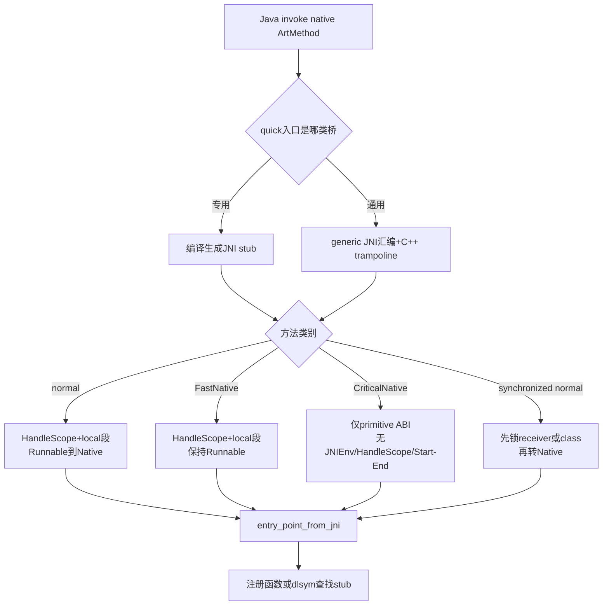
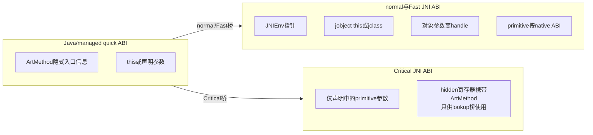
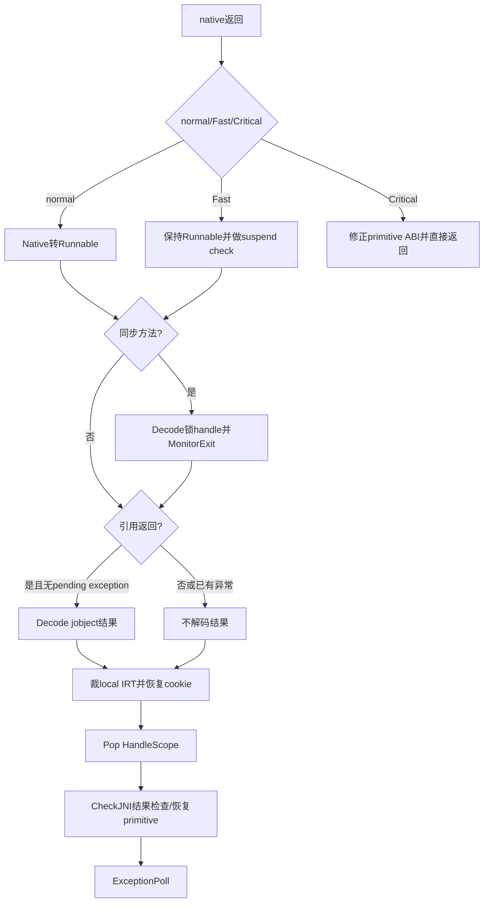

# 第579章 Android ART JNI调用桥：Normal、FastNative、CriticalNative、Synchronized、JniMethodStart/End与返回清理链

> 源码基线：Android 11 `android-11.0.0_r48`。本章只在macOS上阅读、检索、截取和比对源码，不生成目标机器码、不加载native库，也不实际编译AOSP。
>
> 本章主问题：一条Java `native`调用怎样从managed ABI换成平台C ABI；normal、`@FastNative`、`@CriticalNative`和`synchronized native`究竟在哪些位置分叉；HandleScope、JNI local segment、线程状态、monitor和返回值为何必须按严格顺序建立与清理？

## 1. 先抓住本章核心

Java调用native函数不是“跳到一个C地址”这么简单。调用前，ART必须保存可展开的managed frame，把Java引用变成GC可更新的handle，按目标CPU的native ABI重排参数，建立一段新的JNI local-reference作用域，必要时锁monitor，并把普通JNI线程从Runnable切到Native。调用后又要先恢复可安全访问对象的状态，在相关handle失效前完成同步解锁和引用结果解码，再删除本次local refs、恢复返回寄存器，最后才把pending exception交回Java。

## 2. 先纠正十六个常见误解

normal JNI与FastNative的C函数签名相同。CriticalNative才删除`JNIEnv*`以及static方法的`jclass`隐藏参数。FastNative仍有HandleScope和local segment。FastNative不等于永不检查挂起，它在退出时检查线程flags。CriticalNative没有引用参数、引用返回、实例receiver和同步monitor。`synchronized native`锁的是receiver或声明类对象，不是native函数地址。local cookie不是一个引用，而是IRT段边界快照。对象结果必须在pop前Decode。pending exception存在时对象返回值被忽略。primitive结果为调用End函数会先spill再reload。普通JNI在native期间不持mutator shared lock。JNI函数内部可临时回到Runnable。专用compiled stub与generic trampoline是两种桥，不是两种JNI语义。首次dlsym查找与参数桥是两层。`@FastNative`不是给任意阻塞I/O的性能开关。CriticalNative底层有懒查找stub不等于应用应依赖它。异常检查不只发生在native函数里面。

## 3. 一句话总览

normal路径执行“建frame/HandleScope/local段→Runnable转Native→调用→Native转Runnable→清引用”；FastNative保留同样的引用与`JNIEnv*`设施，桥本身不做Runnable↔Native切换并在退出做suspend check；CriticalNative只允许static primitive签名，去掉`JNIEnv*`、`jclass`、HandleScope、local段和Start/End，尽量接近直接C调用；synchronized normal则在进入native前锁receiver/class，回来后在handle仍有效时解锁。

## 4. 本章要分开的八本账

第一是Java声明账，记录static、synchronized和注解。第二是`ArtMethod`标志账。第三是quick managed ABI账。第四是平台native ABI账。第五是GC root/HandleScope账。第六是JNI local IRT segment账。第七是线程状态与mutator lock账。第八是monitor、返回值与pending exception清理账。混掉任意两本，都会产生“明明有指针为什么还要handle”一类误解。

## 5. 主要源码地图

编译期专用桥看`art/compiler/jni/quick/jni_compiler.cc`与`calling_convention.*`；运行时Start/End看`art/runtime/entrypoints/quick/quick_jni_entrypoints.cc`；通用桥看`quick_trampoline_entrypoints.cc`及各架构`quick_entrypoints_*.S`；懒绑定看各架构`jni_entrypoints_*.S`与`entrypoints/jni/jni_entrypoints.cc`。标志来源看`class_linker.cc`、`dex/dex_file_annotations.cc`和`art_method.h`，真实Java声明看libcore的两个注解及`NativeTestTarget.java`。

## 6. 四种路径先用合同区分

normal可以static或instance、可以有引用、持有`JNIEnv*`，native主体期间线程状态为Native。FastNative也可有引用且持有`JNIEnv*`，但线程保持Runnable，所以native必须很短并能及时响应挂起。CriticalNative必须是static且签名全为primitive/void，native实现只接收声明中的primitive参数。synchronized native是在normal合同上增加隐式monitor；r48不把它与Critical组合，也不应与Fast组合。

## 7. “桥”和“目标函数”不是同一个入口

`ArtMethod`至少涉及quick compiled-code入口和`entry_point_from_jni_`两类地址。前者决定从Java调用时先进入专用JNI stub还是generic JNI trampoline；后者最终指向注册后的C函数，未绑定时可能先指向dlsym lookup stub。第577章讲的是后者怎样绑定，本章讲的是前者怎样安全地包住后者。

## 8. 第一幅图：四条调用路径在哪里分叉



图中“专用/通用”和“normal/Fast/Critical”是两个正交维度。不能把generic叫作slow JNI、把compiled叫作FastNative；normal方法也能有专用stub，FastNative也能走generic trampoline。

## 9. 注解怎样变成`ArtMethod`标志

DEX里`FastNative`与`CriticalNative`使用build visibility。`ClassLinker::LoadMethod()`发现`kAccNative`后调用`annotations::GetNativeMethodAnnotationAccessFlags()`，按注解descriptor加入运行时`kAccFastNative`或`kAccCriticalNative`。dex2oat生成专用stub前也做同样查询，所以运行时加载与AOT编译看到一致分类。

## 10. 为什么Retention是CLASS而不是RUNTIME

两个注解都声明`RetentionPolicy.CLASS`，ART直接读DEX annotation item，不需要Java反射实例化注解对象。`IsMethodBuildAnnotationPresent()`只接受兼容`kDexVisibilityBuild`的条目，再比较完整descriptor。于是“Java反射拿不到注解”不等于ART没有识别它。

## 11. 标志位必须与native位一起判断

`ArtMethod::IsFastNative()`检查`kAccFastNative | kAccNative`两个bit同时存在，Critical同理。因为这些高位对非native方法可复用作别的运行时含义，单测某一bit会误判。两个注解同时出现时，注解解析末尾用`CHECK_NE`拒绝这种组合。

## 12. 注解不改变非native方法

Java注解文档明确写着用于非native方法没有效果；ART也只有在方法本来具有`kAccNative`时才查询并形成fast/critical语义。不能给普通Java方法加`@FastNative`，期待它变成本地调用或绕过safepoint。

## 13. CriticalNative的合法签名

`jni_compiler.cc`的debug检查要求它是static、不是synchronized，并遍历shorty，拒绝任何`Primitive::kPrimNot`，也就是引用参数或引用返回。实例方法隐含`this`本身就是引用，因此必然不合法。Java注解Javadoc把违规意图描述成加载验证错误，源码文字写的是`VerifierError`，不宜把这个拼写当成某个公开异常类的精确保证；工程代码更不能只依赖debug版编译器断言，应从声明层遵守合同。

## 14. shorty在这里解决什么

shorty首字符是返回类型，后续每个声明参数用一个字符表示；所有对象和数组都折叠成`L`。桥只需shorty就能决定参数宽度、寄存器类别、引用槽数量和返回清理家族，不需要在每次搬运时解析完整descriptor。需要做精确类型检查时，仍不能用shorty代替完整签名。

## 15. 第一段r48真实Java：同一测试类摆出四类声明

下面逐字摘自`libcore/dalvik/src/main/java/org/apache/harmony/dalvik/NativeTestTarget.java`：

```java
    // Synchronized methods. Test normal JNI only.
    @libcore.api.CorePlatformApi
    public static native synchronized void emptyJniStaticSynchronizedMethod0();
    @libcore.api.CorePlatformApi
    public native synchronized void emptyJniSynchronizedMethod0();

    // Static methods without object parameters. Test all optimization combinations.

    // Normal native.
    @libcore.api.CorePlatformApi
    public static native void emptyJniStaticMethod0();
    // Normal native.
    @libcore.api.CorePlatformApi
    public static native void emptyJniStaticMethod6(int a, int b, int c, int d, int e, int f);

    @libcore.api.CorePlatformApi
    @FastNative
    public static native void emptyJniStaticMethod0_Fast();
    @libcore.api.CorePlatformApi
    @FastNative
    public static native void emptyJniStaticMethod6_Fast(int a, int b, int c, int d, int e, int f);

    @libcore.api.CorePlatformApi
    @CriticalNative
    public static native void emptyJniStaticMethod0_Critical();
    @libcore.api.CorePlatformApi
    @CriticalNative
    public static native void emptyJniStaticMethod6_Critical(int a, int b, int c, int d, int e, int f);
```

这里的注释“synchronized只测normal”非常重要。它反映支持合同，而不只是语法能否写出来。

## 16. normal instance函数的真实C形状

若Java声明为实例`native int f(Object x, long y)`，native实现逻辑形状是`(JNIEnv*, jobject thiz, jobject x, jlong y)`；receiver既是Java调用参数，也是第二个JNI参数。桥把`thiz`和`x`都放入HandleScope，再把指向槽的handle交给C，不能直接把可移动堆对象地址当`jobject`。

## 17. normal static函数的真实C形状

static声明没有receiver，JNI ABI却在`JNIEnv*`后添加声明类的`jclass`。编译stub从传入的`ArtMethod`读取declaring class，把它放进HandleScope，并在并发移动读屏障启用时对这个class handle补一次`ReadBarrierJni`。这也是static native没有Java receiver却仍至少有一个引用root的原因。

## 18. FastNative的C签名没有瘦身

FastNative仍按normal JNI ABI接收`JNIEnv*`以及`jobject`/`jclass`，也支持对象参数与对象返回。它优化的主要是整段调用不做Runnable↔Native切换，并不是删除JNI设施。把CriticalNative的无`JNIEnv*`签名错配给FastNative，会让所有参数寄存器错位。

## 19. CriticalNative的C签名才是真正不同

若Java声明`@CriticalNative static native int add(int a, int b)`，C函数只接收两个平台ABI整数并返回整数；没有`JNIEnv*`，也没有`jclass`。因此同一C symbol不能在不加适配的情况下同时作为normal与Critical实现。它也不能通过JNIEnv分配对象、抛Java异常或发起Java upcall。

## 20. synchronized关键字由桥实现

native函数本身不需要手写`MonitorEnter/Exit`来实现Java方法级synchronized。instance方法锁`this`，static方法锁declaring `Class`对象。桥在native函数执行前拿锁，对正常返回以及用pending Java exception表达的返回执行隐式解锁；进程崩溃、abort或未定义行为不在此保证内。native若再锁同一Java monitor，遵循Java monitor递归语义，但不要混淆为C++ mutex。

## 21. 专用JNI stub从哪里来

dex2oat或JIT需要为native方法生成桥时，调用`ArtJniCompileMethodInternal()`。它不编译native C函数，而是按目标ISA、方法shorty与标志生成一小段机器码。返回的`JniCompiledMethod`包含code、managed frame size、core/fp spill mask和CFI数据，供运行时栈展开与异常处理识别。

## 22. 编译器为何同时构造两套calling convention

`ManagedRuntimeCallingConvention`描述Java quick调用进入stub时参数在哪里；`JniCallingConvention`描述调用C函数时参数应放在哪个寄存器或native stack slot。桥的核心工作就是在两者间搬运，同时插入引用handle。返回时也可能要从native返回寄存器变换到managed返回寄存器。

## 23. 17步注释是一张很好的阅读路线

`jni_compiler.cc`把过程编号为建frame、建HandleScope、保存引用参数、发布top managed stack、扩out args、调用Start、shuffle参数、放`JNIEnv*`、调用native、修小类型、保存结果、调用End、恢复结果、收out args、exception poll、拆frame、finalize。读代码应沿编号走，不要一开始陷进ARM64寄存器细节。

## 24. 第一步为什么保存所有callee-save

native调用、GC、异常投递或runtime helper都可能经过复杂路径。stub建立可展开frame并保存约定寄存器，让上层managed frame在异常或GC后仍能恢复。源码最后`RemoveFrame(..., may_suspend)`还明确区分CriticalNative不应在主体中被挂起的路径。

## 25. normal/Fast的frame里有哪些关键区域

概念上从managed frame向下依次包括返回地址与callee saves、primitive返回spill、saved local-ref cookie、HandleScope头与引用槽、`ArtMethod*`锚点、outgoing native stack args。实际偏移和padding由ISA实现决定，不能把示意图数值硬编码到诊断工具。

## 26. HandleScope引用槽数怎样算

`ReferenceCount()`等于Java参数中的引用数；实例方法把隐含`this`计入，static方法另加一个declaring class槽。返回引用不提前占参数槽，它在返回寄存器里以`jobject`出现，End helper会先Decode。这个scope保护的是传入native的引用，不是本次native新建的所有local refs。

## 27. HandleScope先连到线程链表

stub写入scope的引用数和旧`Thread::top_handle_scope`链接，再把当前frame内scope地址设为新的top。GC扫描线程时就能沿链找到这些槽；搬动对象后更新槽内容，C端持有的`jobject`handle仍间接指向新地址。

## 28. null引用也占槽但对外仍是null

编译器会把null写入对应HandleScope entry，却要求传给native的boxed handle仍编码成null，而不是“指向一个值为null的槽”。这样JNI的`obj == nullptr`合同保持成立，同时scope布局仍由签名固定。

## 29. 参数倒序搬运不是Java求值倒序

专用stub做一次从后向前的参数shuffle，目的是避免类似“先覆盖R2再需要旧R2”的寄存器冲突。Java参数早已求值并进入managed ABI位置；这里仅移动已有位模式，不改变表达式求值顺序。源码还注明当前各架构建frame时已spill参数，所以这项倒序优化暂时作用有限。

## 30. top-of-managed-stack为何在native前发布

非Critical路径把当前stub锚点写入`Thread::TopOfManagedStack`。普通JNI切到Native后，GC可把线程视为不在运行Java，但仍需要从已发布的边界扫描managed frame和HandleScope。发布位置错误会让栈遍历看见半成品frame或漏掉roots。

## 31. Critical为何不建普通managed frame

专用Critical路径可以只为out args建极小frame，甚至在允许条件下tail-call native。它没有需要扫描的引用或local refs，主体又不经过普通挂起协议，因此源码明确跳过HandleScope和top stack发布，并注明Critical执行期间GC被禁用。若首次dlsym查找需要进runtime，架构专用lookup stub会临时伪造GenericJNI样式frame。

## 32. static class为何还要读屏障

专用stub直接从`ArtMethod::DeclaringClassOffset()`装载class引用并先存入handle槽。启用read barrier且线程看到GC正在marking时，代码调用`ReadBarrierJni`修正这个handle；在Baker模式中，helper还可凭对象mark bit提前返回。不能把“ArtMethod里的class引用”自动视为永远无需屏障的裸地址。

## 33. out args是为下一次C ABI调用准备的

寄存器能容纳的参数不占native stack args空间，溢出的参数、某些对齐要求和runtime Start/End调用需要out area。专用stub可能在调用End前发现End的out area更大，再扩frame并同步修正cookie、lock handle和return spill偏移。

## 34. Start入口由三个布尔量选择

非Critical方法进入时：synchronized优先选择`pJniMethodStartSynchronized`；否则Fast选择`pJniMethodFastStart`；剩余走`pJniMethodStart`。reference-return不影响Start。Critical完全跳过Start，所以不存在`pJniMethodCriticalStart`。

## 35. Start先处理的是local segment

normal与Fast都从`JNIEnvExt`读取旧`LocalRefCookie`保存为32位值，再把cookie设成当前locals table的segment state。之后native中新建的local refs属于这一隐式调用段；End用保存值把段弹回。cookie标记边界，不保存HandleScope对象。

## 36. 为什么需要“旧cookie”和“当前top”两个值

`LocalRefCookie`可能来自外层native调用或显式LocalFrame；`GetLocalsSegmentState()`则表示此刻IRT top/hole边界。进入新native调用要先记住外层cookie，再把当前top定为本层起点。退出时先把locals裁到本层起点，再恢复外层cookie，嵌套upcall/downcall才不会互相删除local refs。

## 37. normal Start的状态切换

`JniMethodStart()`设置local段后读取top quick frame的`ArtMethod`。若不是FastNative，就调用`TransitionFromRunnableToSuspended(kNative)`：线程不再持mutator shared lock，GC无需等待它执行Java safepoint，native阻塞不会阻止一次全局挂起完成。

## 38. `kNative`为何属于非Runnable集合

名字“Native”容易被理解成CPU仍在运行所以也是Runnable；ART状态关注的是能否直接触碰可移动Java对象、是否持mutator lock，而不是OS调度状态。处于kNative的pthread当然仍可执行C代码，但从ART堆协议看它是suspended state，必须通过JNI helper临时回Runnable才能解码对象。

## 39. normal JNI函数怎样安全访问堆

大多数`jni_internal.cc`函数内部创建`ScopedObjectAccess`。它用`ScopedThreadStateChange(..., kRunnable)`把调用线程从Native切回Runnable并取得mutator shared lock，完成解码、分配或字段访问后析构，恢复旧Native状态。因此normal native主体是Native，单次JNI API内部却可短暂Runnable。

## 40. 不能在kNative保存裸`mirror::Object*`

normal JNI应该保存`jobject`handle或global ref，而不是从一次JNI helper偷出raw object pointer后在native主体继续使用。helper退出时线程回到Native，GC可能移动对象。HandleScope/IRT让GC更新间接引用，裸指针没有这种保证。

## 41. Fast Start只建立local段

`JniMethodFastStart()`做与normal相同的cookie保存和新段设置，并在debug版确认top方法确为FastNative，但不改变线程状态。进入C函数时线程继续是Runnable、继续持mutator shared lock，这正是省下transition成本的来源。

## 42. FastNative为何会拖住全局挂起

一个Runnable线程必须响应suspend request才能让GC或debugger取得全局独占条件。Fast native若在不懂ART的C锁、阻塞syscall或长计算中停太久，没有普通managed safepoint，其他线程请求的停顿就只能等它返回。它不是“GC忽略此线程”，恰恰是GC还必须等待它。

## 43. Fast End仍会做suspend check

`GoToRunnableFast()`确认线程本来就是Runnable；若`TestAllFlags()`发现挂起、checkpoint等请求，就在仍持mutator shared lock的前提下调用`CheckSuspend()`。因此准确说法是“Fast主体不做进入/退出状态转换，返回边界补一次flag检查”，不是“Fast永远不检查GC”。

## 44. FastNative能调用JNI API吗

能，因为它仍收到`JNIEnv*`。普通JNI helper内部的`ScopedObjectAccess`发现旧状态已经是Runnable时不会重复切换；ART内部实现还可用`ScopedFastNativeObjectAccess`显式断言这一前提。不过每次分配、Java upcall、锁与可能等待的操作仍必须遵守挂起协议，应用native不要把“API可调用”误读成“任意阻塞都安全”。

## 45. 第二段r48真实Java：连sleep也标FastNative为何不矛盾

下面逐字摘自`libcore/ojluni/src/main/java/java/lang/Thread.java`：

```java
    // BEGIN Android-changed: Implement sleep() methods using a shared native implementation.
    public static void sleep(long millis) throws InterruptedException {
        sleep(millis, 0);
    }

    @FastNative
    private static native void sleep(Object lock, long millis, int nanos)
        throws InterruptedException;
    // END Android-changed: Implement sleep() methods using a shared native implementation.
```

它不是在鼓励FastNative直接阻塞。对应`Thread_sleep()`使用`ScopedFastNativeObjectAccess`后调用`Monitor::Wait(..., kSleeping)`，把等待状态明确交给ART monitor协议管理。第三方JNI不知道这些内部不变量时，应使用normal JNI。

## 46. FastNative允许引用不等于引用可裸用

Fast stub仍将receiver/class及对象参数写入HandleScope并传handle。虽然线程保持Runnable使当前时刻持有mutator lock，C代码仍应按JNI规则通过`jobject`和JNI API访问对象；应用不能把handle数值reinterpret成对象地址。

## 47. FastNative仍会删除本次local refs

它调用FastStart推进cookie，FastEnd调用`PopLocalReferences()`，所以在Fast函数中创建的local refs仍以调用为作用域。第576章“FastNative没有HandleScope/local段”的常见误解在这里可以直接由源码否定。

## 48. FastNative的死锁模式

若Fast方法A拿住native mutex返回Java，另一个Fast方法B为释放或取得同一mutex而阻塞，同时GC已请求暂停持锁线程，就可能形成“GC等B响应、B等mutex、持锁线程已因GC暂停”的环。注解Javadoc因此要求native锁最好在同一次Fast调用内取得并释放，且调用时长有严格上界。

## 49. “很快”不能靠平均值判断

网络、磁盘、Binder、驱动ioctl、条件变量和未知第三方库即使通常微秒返回，也有无界尾延迟。是否选FastNative应看最坏阻塞、能否进入ART受控suspended state、是否经过严谨profile，而不是只看benchmark均值。

## 50. normal的transition成本换来了什么

它让GC知道native线程当前不持mutator lock，长阻塞不会占住全局suspend；每次真正调用JNI API时再局部进入Runnable。对绝大多数应用native，这个安全与可诊断性价值高于设备、ISA和版本相关的那部分桥开销。

## 51. Critical路径删掉哪些设施

专用stub不建HandleScope、不保存local cookie、不调用Start/End、不materialize `JNIEnv*`/`jclass`，也不做普通exception poll。它只按平台native ABI搬primitive参数、调用或tail-call目标、修正小整数/浮点返回差异，再拆最小frame。

## 52. “无引用”是Critical优化成立的根

没有receiver、class、对象参数和对象返回，GC无需在桥frame里寻找会移动的Java对象；没有JNIEnv则不能创建local refs。于是HandleScope、IRT段和引用Decode整个消失。只删除JNIEnv却允许jobject会失去GC更新位置，不是合法折中。

## 53. hidden method argument做什么

Critical的业务C签名没有`ArtMethod*`，但未绑定时lookup stub仍需知道正在解析哪个方法。生成stub把method pointer放进架构约定的hidden register；正常目标函数忽略它，critical dlsym stub消费它。generic路径还给低位加tag，表示managed frame已经存在。

## 54. 第二幅图：参数在三种ABI中的变化



hidden register不是Critical C源码应声明的正式参数。它是ART stub与lookup stub之间的私有协议；注册后的目标只写Java声明对应的primitive形参。

## 55. Critical与显式注册的准确边界

`CriticalNative.java`要求通过`RegisterNatives`显式注册，不依赖内建动态JNI链接，这是应用应遵守的公开合同。r48各架构确实实现`art_jni_dlsym_lookup_critical_stub`，能临时保存参数、伪造frame并调用Runnable查找函数；但generic trampoline旁还有Critical lookup“broken”的FIXME。不能以内部fallback存在为理由违背显式注册要求。

## 56. Critical的tail call不是必然

是否tail-call取决于ISA、是否有stack args、callee-save约定和返回值调整需求。例如ARM64允许在没有stack args且条件满足时直接Jump；否则仍Call并在返回后修正结果/拆frame。`@CriticalNative`提供的是可优化条件，不承诺每个签名都生成一条jump。

## 57. 小整数返回为何需要扩展

Java byte/short是有符号，boolean/char按无符号语义扩到managed返回宽度。某些native ABI不保证高位形式正好符合managed ABI，stub对byte/short sign-extend，对boolean/char zero-extend。这个步骤既适用于普通JNI，也可能限制Critical tail-call。

## 58. 浮点返回为何另有通道

generic汇编同时把通用返回寄存器和浮点返回寄存器传给`artQuickGenericJniEndTrampoline()`。`GenericJniMethodEnd()`按shorty首字符选择`result`或`result_f`；x86 float还把native侧double形式转回float位模式。不能只看C++返回类型`uint64_t`就说所有Java结果都走整数寄存器。

## 59. Critical没有End不代表可以设置pending exception

没有JNIEnv就没有标准JNI `Throw/ThrowNew`入口，stub也明确不做normal exception poll。若native代码通过私有ART接口、错误的longjmp或未定义行为制造异常状态，已经越过Critical合同。C++异常也不得穿越JNI C ABI边界；应在native内部捕获并用可表达的primitive结果报告失败，或改用normal JNI。

## 60. 第三段r48真实Java：Math展示理想Critical签名

下面逐字摘自`libcore/ojluni/src/main/java/java/lang/Math.java`：

```java
    @CriticalNative
    public static native double sin(double a);

    /**
     * Returns the trigonometric cosine of an angle. Special cases:
     * <ul><li>If the argument is NaN or an infinity, then the
     * result is NaN.</ul>
     *
     * <p>The computed result must be within 1 ulp of the exact result.
     * Results must be semi-monotonic.
     *
     * @param   a   an angle, in radians.
     * @return  the cosine of the argument.
     */
    @CriticalNative
    public static native double cos(double a);
```

这类纯primitive、无分配、无锁、耗时有界的数学函数最符合Critical模型。性能注解不是“native函数越重要越该加”，而是调用合同越简单才越可裁剪。

## 61. synchronized进入时先拿哪一个对象

编译stub根据JNI参数迭代器定位第一个引用槽：instance时是receiver，static时是专门建立的declaring class。它把该槽包装成jobject传给`JniMethodStartSynchronized()`，同时保存槽偏移，供返回阶段再次构造同一个lock handle。

## 62. monitor enter发生在状态切换前

`JniMethodStartSynchronized(to_lock,self)`先在Runnable状态解码handle并`MonitorEnter(self)`，随后调用普通`JniMethodStart()`推进local段并切到Native。这样拿Java monitor时仍安全访问对象，也让native主体在已经持锁的情况下处于Native。

## 63. monitor enter也可能失败

专用stub调用synchronized Start后立即`ExceptionPoll`，注释明确检查monitor enter产生的异常。generic trampoline也在Start后看pending exception，失败则弹HandleScope并返回null给汇编异常路径。不要把“receiver/class必非null”推导成MonitorEnter绝无资源或运行时失败。

## 64. synchronized返回必须在pop前解锁

End阶段先恢复Runnable，再调用`UnlockJniSynchronizedMethod(locked,self)`；该函数先Decode lock handle并MonitorExit，之后才允许`PopLocalReferences()`连同top HandleScope失效。若先pop，`locked`可能已指向被删除的scope槽。

## 65. pending exception为何在解锁时暂存

native可能已经设置Java异常。helper先保存旧Throwable、清除它，再执行MonitorExit；若退出产生新的pending exception，r48把它视为同步桥不变量破坏并fatal，原先已有异常时日志会同时展示两者；若没有新异常，则恢复原异常。这样原业务异常不会被正常解锁吞掉。

## 66. synchronized FastNative是怎样的r48灰区

专用stub选择synchronized Start/End时优先于Fast分支，而`JniMethodStart()`/`GoToRunnable()`内部又识别Fast，代码上保留部分兼容；但generic路径有“Fast/Critical与synchronize不支持”的DCHECK，JNI编译器测试也明确只对normal测试synchronized。结论不是“有时可用”，而是不要声明这种非合同组合；内部实现细节不能当API保证。

## 67. Critical synchronized为何连灰区都没有

Critical禁止引用，而Java monitor必然依附receiver或declaring Class引用；它也没有HandleScope保存锁对象，更没有End helper执行MonitorExit。因此static并不能让Critical synchronized合理：static只把锁从this换成Class，仍然是引用。

## 68. 调用目标从哪里取

专用stub通过当前`ArtMethod`的`EntryPointFromJniOffset`间接Call。若已`RegisterNatives`，槽里是runtime callback处理后的目标；若未绑定，则是normal或critical lookup stub。查找成功会`RegisterNative()`回写槽，lookup stub恢复原参数并tail-call真正目标，后续调用绕过查找。

## 69. native调用返回后先处理宽度

小整数按第57节扩展。非引用、非void的normal/Fast结果还要先保存到frame，因为接下来调用`JniMethodEnd*`是另一场C调用，会破坏caller-save返回寄存器。Critical若无需End，只需在native与managed返回寄存器不同的架构上Move。

## 70. End入口选择比Start多一个维度

返回类型为引用时选`EndWithReference`家族；再按synchronized、Fast、normal分成三个入口。primitive/void则选普通End家族，同样有sync/Fast/normal三种。Critical全部跳过。源码用独立`end_jni_shorty`构造调用约定，以便向helper传result、cookie、locked对象和Thread。

## 71. normal End第一步是重新Runnable

`JniMethodEnd(saved,self)`先`GoToRunnable()`。普通方法从kNative调用`TransitionFromSuspendedToRunnable()`，在GC可能移动对象的窗口结束后重新取得mutator shared lock；随后才能碰JNI locals、HandleScope或返回jobject。顺序不能反过来。

## 72. Fast End不需要“回到”Runnable

`JniMethodFastEnd()`调用`GoToRunnableFast()`，做必要的退出suspend check，然后与normal共用`PopLocalReferences()`。复用清理函数再次证明Fast区别集中在线程状态，而不是另一套引用系统。

## 73. `PopLocalReferences()`的三步

若CheckJNI启用，先`CheckNoHeldMonitors()`诊断native手工MonitorEnter却未退出；再把local table裁到当前cookie记录的本层起点，并把cookie恢复为Start保存的外层值；最后`Thread::PopHandleScope()`移除参数roots。先清IRT、后弹scope是r48当前实现顺序。

## 74. `CheckNoHeldMonitors`不替代synchronized解锁

方法级synchronized的monitor由桥在调用`PopLocalReferences()`前显式退出；CheckJNI的检查面向JNI `MonitorEnter`等留下的额外monitor记录。关闭CheckJNI时这项诊断不运行，不能把它当生产自动解锁机制。

## 75. primitive结果怎样穿过End调用

stub在native返回后把primitive位模式存入`ReturnValueSaveLocation()`，调用End完成状态/引用/monitor清理，再加载到managed return register。若pending exception存在，随后ExceptionPoll转异常路径，Java不会把这个暂存值当正常结果消费。

## 76. 引用结果为什么不先spill成裸对象

native返回的是`jobject`handle，不是稳定`mirror::Object*`。EndWithReference必须在local段和参数HandleScope仍有效时Decode；若对象已被GC搬动，handle槽包含更新后的引用。提前弹locals再Decode会把返回handle变成悬空票据。

## 77. pending exception时引用结果被忽略

`JniMethodEndWithReferenceHandleResult()`先检查`IsExceptionPending()`；只有没有异常才Decode result，否则让局部`o`保持null，继续清理locals/scope。JNI合同要求异常路径的返回值不被使用，这也避免解码一个native在异常时留下的无意义或无效jobject。

## 78. CheckJNI怎样复核引用返回类型

清理本次scope后，如果CheckJNI开启，helper临时建一个单槽StackHandleScope包装已解码的`o`，调用`CheckReferenceResult()`，因为类型解析自身可能触发运行时操作。随后`VerifyObject(o)`并返回raw pointer给managed ABI。检查发生在已恢复Runnable、且对象被新handle保护的环境里。

## 79. synchronized引用返回的精确顺序

`JniMethodEndWithReferenceSynchronized()`执行：GoToRunnable→解锁（lock handle仍有效）→EndWithReference helper Decode result→pop locals/scope→可选类型检查→返回对象。锁先退出而返回handle后解码是安全的，因为两者在pop前完成；不要把“引用必须先Decode”泛化成一定早于解锁。

## 80. exception poll为何放在frame拆除前

专用非Critical路径在End、恢复primitive和缩回out area后调用`ExceptionPoll(..., stack_adjust=0)`，当前JNI frame仍完整，异常投递可以用保存的callee saves和栈信息展开。通过后才RemoveFrame返回调用者。

## 81. normal完整进入时间线

调用者传quick ABI参数→stub保存frame→建立HandleScope并填receiver/class/对象参数→发布top stack→准备out args→Start建立local段并切kNative→materialize `JNIEnv*`和handles→间接调用`entry_point_from_jni_`。其中只有Start之后、JNI helper之外的native主体不持mutator shared lock。

## 82. normal完整退出时间线

目标返回jobject或primitive→必要时spill→End先Native转Runnable→若同步则解锁→对象结果在pop前Decode→裁本层locals并恢复cookie→弹HandleScope→恢复primitive或取得raw对象返回→ExceptionPoll→拆frame。任何提前返回路径都必须等价完成其已建立资源的反向清理。

## 83. Fast完整时间线

建frame/HandleScope和top stack与normal基本一致→FastStart只建local段→仍Runnable进入C→通过JNIEnv访问对象→返回→FastEnd在flags非零时CheckSuspend→清local段与HandleScope→异常检查→返回。性能收益来自少两次主状态切换，不来自免GC root或免exception处理。

## 84. Critical完整时间线

验证static primitive签名→建立最小out args/frame→把method放hidden register→按native ABI直接搬primitive→Call/Jump JNI entry→修返回位宽或寄存器→必要时拆frame→直接回managed。没有local段、HandleScope、monitor、JNIEnv与normal End；因此功能限制和性能收益是同一设计的两面。

## 85. generic trampoline为何存在

当没有方法专用JNI code，`ArtMethod` quick入口可指向`art_quick_generic_jni_trampoline`。架构汇编先保存refs-and-args frame并预留scratch，再调用C++ `artQuickGenericJniTrampoline()`动态读取shorty、计算布局、填充寄存器/stack args，返回native code地址；汇编实际call目标，回来再进generic End。

## 86. generic不是解释执行native函数

C++ trampoline只动态完成桥接与运行时检查，最终仍由CPU直接调用C函数地址。它“generic”在于一份汇编/C++代码服务许多签名，而不是用循环解释native机器码。

## 87. generic frame先算尺寸再填值

`ComputeGenericJniFrameSize`用同一native-call state machine先以占位值Walk shorty，统计handle数量和stack entries；随后在reserved area内创建HandleScope、布局stack args。`BuildGenericJniFrameVisitor`第二遍遍历真实quick参数，分别推进GPR、FPR、stack或handle。

## 88. generic如何处理instance receiver

构造器对非Critical先手工加入JNIEnv；static再手工加入declaring class handle。instance的this不手工添加，因为`QuickArgumentVisitor`已把隐含receiver作为第一个managed参数访问，`Visit()`看到reference后通过`AdvanceHandleScope()`填入第一个scope槽。

## 89. generic也会清空padding槽

若计算出的HandleScope仍有尚未写入的槽（源码称为padding entries），`FinalizeHandleScope()`会用`ResetRemainingScopeSlots()`把它们置null，再仅对非Critical执行`PushHandleScope()`。GC不能扫描未初始化槽中的随机位模式。

## 90. generic先发布可遍历栈再做复杂工作

visitor完成、且非Critical路径安装scope后，trampoline调用`SetTopOfStackTagged(managed_sp)`并`VerifyStack()`。此后JIT `MethodEntered()`、类初始化等路径都可能需要走栈或GC，所以frame必须先达到完整状态。

## 91. static类初始化检查为何在generic里可见

normal/Fast static native的quick入口可能在declaring class尚未visibly initialized时已设置成generic stub。trampoline用`NeedsClinitCheckBeforeCall()`守门，必要时Handle住class并`EnsureInitialized()`；失败会清理已安装的HandleScope并返回null，让汇编进入异常路径。不能假设“调用到native入口时static类一定初始化完成”；Critical generic还有第98节所述的特殊边界，不把这句清理结论外推给它。

## 92. generic Start怎样选择

非Critical时，synchronized走`JniMethodStartSynchronized(first handle,self)`并检查异常；非同步Fast走FastStart；剩余normal走Start。cookie被写在`managed_sp`前的固定32位槽。Critical既不写cookie也不Push HandleScope。

## 93. generic返回的nativeCode可能还是stub

它读取`called->GetEntryPointFromJni()`并返回给汇编；注释明确地址可能是lookup stub或trampoline。generic桥不负责在C++这一步强制完成dlsym。若是normal lookup，后者按当前线程状态选择`artFindNativeMethod()`；Fast/Critical保持Runnable，走Runnable版本。

## 94. 汇编为何必须参与generic桥

C++可以计算参数应在何处，却无法用普通函数返回任意组合的GPR/FPR/stack ABI现场。架构汇编从reserved area恢复目标参数寄存器，切换到计算出的out-args SP，`call *nativeCode`，再捕获整数和浮点返回寄存器交给C++ End。

## 95. x86_64的5KiB scratch不是语言合同

r48 x86_64 generic汇编直接预留5120字节，并留有参数数量/handle overhead的TODO；其他ISA布局不同。它是当前实现的保守工作区，不是JNI规范承诺的最大参数区，也不应成为应用栈大小计算依据。

## 96. generic End怎样合并多类返回

`artQuickGenericJniEndTrampoline()`从tagged top quick frame取called、cookie和两个返回通道，交给`GenericJniMethodEnd()`。normal先GoToRunnable，Fast/Critical不转换；同步normal取HandleScope第0槽解锁；引用共用reference helper，primitive按shorty选择union字段；非Critical最后pop local refs。

## 97. generic Critical cookie为何看似未初始化却安全

Critical入口不写`sp-1` cookie，但End仍从该位置读取并作为实参传下去。`GenericJniMethodEnd()`在Critical primitive路径不会调用`PopLocalReferences()`，所以不会消费cookie；合法Critical又不可能走引用分支。这里靠方法分类保证“传了但不读”，不能照搬到一般代码。

## 98. generic Critical与懒绑定的FIXME

trampoline注释称Critical下`art_jni_dlsym_lookup_stub`不处理该情况，并写“compiled stubs也broken”的FIXME；与此同时r48架构目录已经有专门critical lookup stub和tag协议，呈现版本演化中的注释/实现张力。稳妥结论仍是遵从注解Javadoc显式RegisterNatives，而不是断言每个ISA、generic/compiled组合都能懒绑定。

## 99. 专用与generic必须保持哪些语义一致

两者都要按同一native ABI传参，都为非Critical建立HandleScope/local段，都区分normal/Fast状态，都在static调用前满足初始化，都在同步返回时先解锁再pop，都先Decode引用结果再使handle失效，并把pending exception交回managed。实现结构不同不能改变Java可观察语义。

## 100. 两者可以不同的地方

专用stub把shorty决策、偏移和大部分搬运预先固化，frame紧凑且可能给Critical做tail-call；generic运行时两遍Walk并用大reserved area，便于没有专用code时兜底。性能、CFI形状、临时区域和首次lookup细节可以不同。

## 101. JIT编译JNI stub不会编译C++主体

JIT可把方法quick入口从generic替换为方法专用JNI stub，减少每次动态参数布局；`entry_point_from_jni_`仍单独指向注册C函数。看profile时要区分“generic bridge成本高”和“native实现本身慢”，不能看到JIT code cache里有该method就说C库被ART JIT编译了。

## 102. 第三幅图：返回清理的不可交换顺序



图的关键不是记住函数名，而是识别三个“不能太早失效”的对象：lock handle、返回jobject和本层local segment。它们都依赖恢复Runnable及尚未pop的引用结构。

## 103. pending exception与primitive返回怎样竞争

JNI C函数即使返回了一个整数，也可能同时留下pending exception。stub会完成End和结果reload，但随后ExceptionPoll转入异常投递，正常Java结果不生效。native应在设置异常后尽快返回占位值，不要指望Java同时获得异常和业务值。

## 104. native崩溃不走正常End

SIGSEGV、abort、越界写或C++异常越过ABI时，进程可能直接终止或走信号诊断，而不是自动调用JniMethodEnd。HandleScope/local段的结构用于GC和正常异常展开，不是C资源的万能RAII。native内部文件描述符、malloc和mutex仍要由C/C++自己的清理策略负责。

## 105. JNI upcall形成嵌套状态链

normal native处于kNative，调用`Call<type>Method`时JNI helper进入Runnable，随后执行Java；Java又可调用另一个native，建立新的HandleScope和local segment。内层返回只裁内层cookie，外层helper退出又恢复kNative。第36节的cookie嵌套正是为这种链准备。

## 106. FastNative里的Java upcall为何更敏感

它本来就Runnable，upcall类似Java→Java调用，运行时仍能在managed边界处理safepoint；但如果Fast函数在upcall前后持有native锁，Java代码可能分配、阻塞或再次进入相关native，锁序更复杂。允许upcall不代表推荐在Fast路径堆叠任意业务逻辑。

## 107. 如何判断一个候选函数应选哪类

需要对象、异常或JNI API且可能阻塞：normal。需要对象/JNIEnv、极短、有界且明确无外部阻塞：经过profile后才考虑Fast。纯static primitive、无分配/锁/upcall、极短且已显式注册：才考虑Critical。需要方法级Java monitor：使用normal synchronized，通常更应先评估能否缩小Java层临界区。

## 108. 性能优化先量哪几段

至少分别量Java callsite、bridge、首次binding、C主体、JNI API回调、锁等待和返回清理。首次dlsym与类初始化只发生在特定时机，混进平均值会误判；Fast/Critical节省的是transition/封送的一部分，若主体是毫秒级I/O，改注解几乎没有意义且风险更高。

## 109. 代码审查的危险信号

Fast/Critical里出现文件/网络/Binder I/O、条件变量、未知mutex、无限循环或第三方回调；Critical声明含对象/数组、非static、synchronized或native实现仍写JNIEnv/jclass；normal函数长期保存raw对象地址；设置异常后继续使用返回jobject；手工MonitorEnter无所有出口的MonitorExit；这些都应优先阻断。

## 110. 调试时怎样识别卡在桥还是主体

栈中`art_quick_generic_jni_trampoline`表示使用generic下调桥；`artQuickGenericJniTrampoline`是其C++准备阶段；`art_jni_dlsym_lookup_*`表示正在首次解析；真正so symbol帧表示已进入主体；`JniMethodEnd*`表示返回清理。只有一帧名字不足以下结论，要连同线程state、pending exception、monitor和上下一帧一起看。

## 111. 四个macOS练习的使用方式

下面命令只读本地r48源码，不运行生成代码。每段都显式检查关键锚点；看到最后的`PASS`才算完成。可从任意目录执行，变量固定指向`/Users/ninebot/androidSource`。

## 112. 练习一：核对Start/End入口选择矩阵

```bash
set -euo pipefail
src_root=/Users/ninebot/androidSource
file="$src_root/art/compiler/jni/quick/jni_compiler.cc"
test -f "$file"
for needle in pJniMethodStartSynchronized pJniMethodFastStart pJniMethodStart \
              pJniMethodEndWithReferenceSynchronized pJniMethodFastEndWithReference \
              pJniMethodEndWithReference pJniMethodEndSynchronized pJniMethodFastEnd pJniMethodEnd; do
  rg -q "$needle" "$file"
done
rg -n 'GetJniEntrypointThreadOffset|Skip this for @CriticalNative methods' "$file" | head -20
echo 'PASS: Start/End矩阵与Critical跳过点均存在'
```

阅读答案：synchronized选择优先于Fast，引用返回选择单独EndWithReference家族；Critical在调用选择函数之前就整体跳过Start/End。

## 113. 练习二：对比normal与Fast的线程状态

```bash
set -euo pipefail
src_root=/Users/ninebot/androidSource
file="$src_root/art/runtime/entrypoints/quick/quick_jni_entrypoints.cc"
test -f "$file"
rg -q 'TransitionFromRunnableToSuspended\(kNative\)' "$file"
rg -q 'Only do a suspend check on the way out of JNI' "$file"
rg -q 'self->CheckSuspend\(\)' "$file"
rg -q 'JniMethodFastStart' "$file"
rg -n 'JniMethodFastStart|JniMethodStart\(|TransitionFromRunnableToSuspended|GoToRunnableFast|CheckSuspend' "$file" | head -35
echo 'PASS: normal会转kNative，Fast保持Runnable并在退出检查挂起'
```

阅读答案：两者都会推进local cookie；差异不是“有没有JNIEnv”，而是normal释放mutator shared lock进入kNative，Fast不切状态并把suspend检查留在返回边界。

## 114. 练习三：证明Critical删掉引用桥设施

```bash
set -euo pipefail
src_root=/Users/ninebot/androidSource
compiler="$src_root/art/compiler/jni/quick/jni_compiler.cc"
conv="$src_root/art/compiler/jni/quick/calling_convention.h"
test -f "$compiler"
test -f "$conv"
rg -q "@CriticalNative methods don't have a HandleScope" "$compiler"
rg -q "They do not call JniMethodStart" "$compiler"
rg -q 'exclude both JNIEnv\* and the jclass/jobject parameters' "$conv"
rg -q 'CHECK\(is_static\)' "$compiler"
rg -q 'CHECK\(!is_synchronized\)' "$compiler"
rg -n "don't have a HandleScope|do not call JniMethodStart|cannot be virtual|cannot be synchronized" "$compiler" | head -20
echo 'PASS: Critical的static/primitive限制与删减项已定位'
```

阅读答案：Critical的性能来自签名限制带来的整段裁剪；没有引用才可以没有HandleScope，没有JNIEnv才不会产生local refs，没有monitor才可以没有同步End。

## 115. 练习四：核对引用返回、同步解锁与pop顺序

```bash
set -euo pipefail
src_root=/Users/ninebot/androidSource
file="$src_root/art/runtime/entrypoints/quick/quick_jni_entrypoints.cc"
test -f "$file"
rg -q "Must decode before pop" "$file"
rg -q 'UnlockJniSynchronizedMethod\(locked, self\)' "$file"
rg -q 'PopLocalReferences\(saved_local_ref_cookie, self\)' "$file"
rg -q 'if \(!self->IsExceptionPending\(\)\)' "$file"
start_line=$(rg -n 'JniMethodEndWithReferenceSynchronized' "$file" | head -1 | cut -d: -f1)
sed -n "${start_line},$((start_line + 12))p" "$file"
echo 'PASS: GoToRunnable、解锁、Decode结果和pop的依赖关系可从源码复核'
```

阅读答案：同步引用返回函数先GoToRunnable并解锁，再进入引用helper；helper仅在无pending exception时Decode结果，之后才pop本层locals与HandleScope。

## 116. 四个练习应该形成的证据链

练习一证明编译选择矩阵，练习二证明状态差异，练习三证明Critical裁剪条件，练习四证明返回清理顺序。若只做一个grep就下结论，很容易把编译器意图、runtime helper和架构汇编混在一起；四项相互印证才是完整阅读。

## 117. 遇到一个真实native方法时的追法

先读Java声明和完整descriptor；确认DEX build annotation变成哪种`ArtMethod` flag；查该方法quick入口当前是generic还是专用stub；再查`entry_point_from_jni_`是注册目标还是lookup stub；按shorty手写native ABI参数；最后沿对应Start/End验证线程状态、HandleScope/local段、monitor、返回与异常。

## 118. 复读后重点修正的表述

初稿最容易把Fast说成“没有引用桥”、把Critical说成“绝对不能懒查找”、把synchronized Fast说成“底层支持所以可用”、把对象结果说成“一回来立刻Decode”。按r48复核后改为：Fast保留HandleScope/local段和JNIEnv；Critical公开合同要求显式注册但架构有内部lookup机制且generic旁有FIXME；sync Fast只是部分代码兼容而整体不受支持；同步引用返回先解锁、但两者都严格早于pop。

## 119. 本章最终记忆模型

把JNI桥记成一座收费站：normal先把对象换成可移动时更新的handle，登记本车次local段，再离开Runnable车道；Fast同样登记对象与local段，只是不离开Runnable车道，所以必须迅速通过并在出口看暂停信号；Critical只允许primitive轻载车辆，连收费窗口JNIEnv都拆掉；synchronized normal还要领一把receiver/class的锁，出口必须在票据失效前归还。

## 120. 下一章

第580章继续学习ART CheckJNI诊断链：`-Xcheck:jni`如何切换JNIEnv/JavaVM函数表，`ScopedCheck`怎样解析参数格式、验证线程归属、引用、方法/字段ID、pending exception与critical区，JniAbort、AbortHook、warnonly和ForceCopy又怎样把native误用变成可定位证据。
