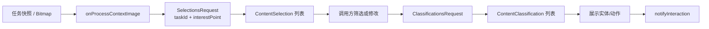
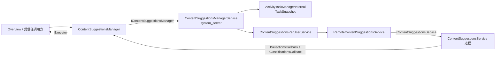
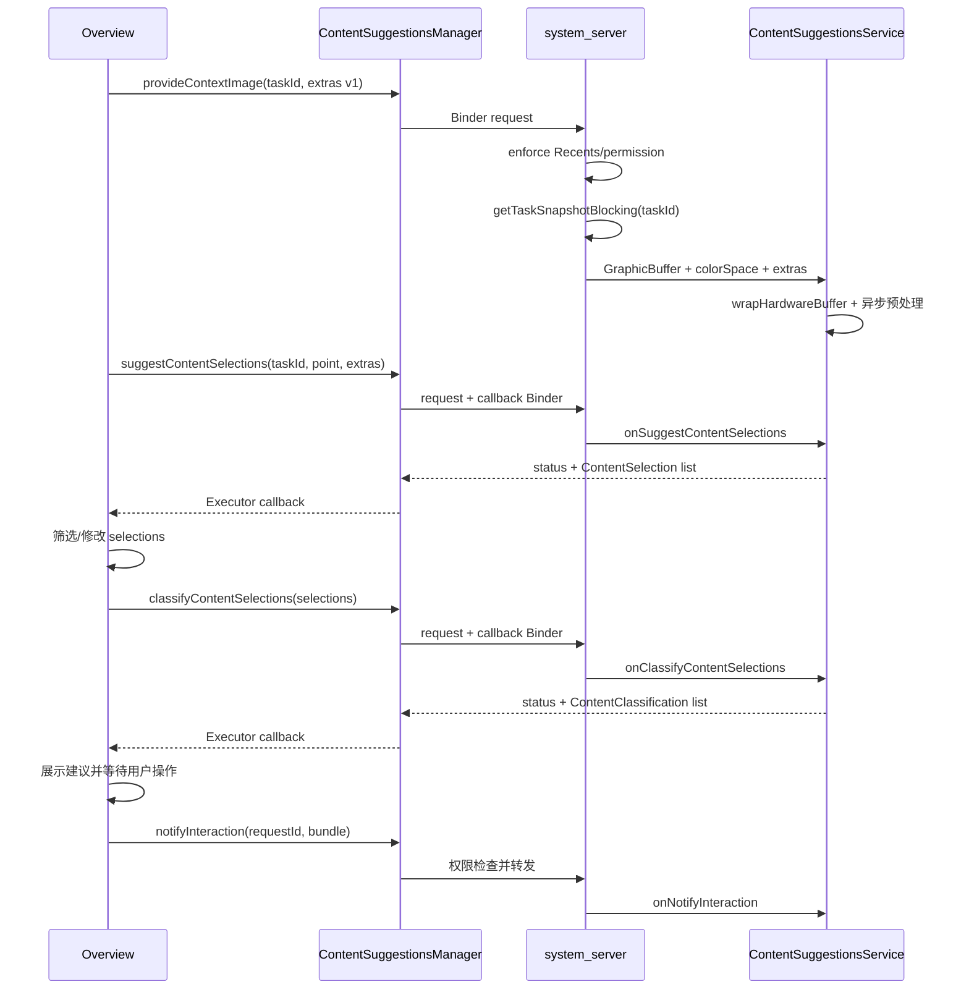

# 58 ContentSuggestionsManagerService、ContentSuggestionsService 与内容建议

> 源码版本：Android 11 / API 30 / `android-11.0.0_r48`  
> 学习方式：macOS 只读源码，不要求编译。  
> 本章目标：理解 Overview/Recents 等受信任组件如何把任务快照交给内容建议服务，先请求“选出值得处理的区域”，再请求“识别这些区域并给出实体/动作”，以及 system_server 如何控制调用者、用户、任务快照和远端服务绑定。

---

## 1. 从最近任务界面的图片选取场景理解

用户打开 Overview，看到某个 App 的任务快照。系统可能允许用户：

- 选中截图中的一段文字；
- 识别图片中的电话号码、地址或商品；
- 对选中区域复制、分享或执行其他建议动作；
- 记录用户是否采用了建议。

这条能力不是 TextView 的文本分类，因为目标内容可能只是任务截图中的像素，甚至原 App 已不在前台。

典型协议：

```text
提供 task snapshot / hardware Bitmap
→ suggestContentSelections：在内容中找候选区域
→ 调用方可修改/筛选 selections
→ classifyContentSelections：识别候选并产生分类数据
→ UI 展示建议
→ 用户交互
→ notifyInteraction：上报交互反馈
```

一句话理解：**Content Suggestions 是面向屏幕内容的“两阶段建议协议”：先定位什么值得选，再判断选中的东西是什么。**

---

## 2. 与相似能力的区别

| 机制 | 输入来源 | 核心输出 | 典型场景 |
|---|---|---|---|
| Content Suggestions | task snapshot / hardware Bitmap | selection + classification | Overview 截图文字/图片建议 |
| TextClassifier | CharSequence + 字符下标 | TextSelection/TextClassification/TextLinks | TextView 长按文字 |
| Content Capture | ViewNode 增量语义事件 | 服务持续接收页面变化 | 页面上下文理解 |
| Autofill | AssistStructure + 字段值 | Dataset/FillResponse | 表单填充与保存 |
| Accessibility | 节点树和事件 | 查询/动作能力 | 辅助用户操作 UI |
| MediaProjection | 屏幕像素流 | 图像 Buffer | 用户授权录屏/投屏 |

Content Suggestions 接触的是某个时刻的视觉内容，但它不是持续录屏；它通常由受信任 Overview/Recents 组件针对 task 发起。

---

## 3. 两阶段模型：Selection 与 Classification



### Selection 回答

“画面中哪些区域值得成为一个可交互对象？”

例如：

- 一段 OCR 文本的边界；
- 一张人物/商品图片区域；
- 用户点击点附近最相关的块。

### Classification 回答

“这个 selection 是什么，可以提供哪些能力？”

例如服务私有协议可能描述：

- 文本、电话号码、地址；
- 图像类别；
- 置信度；
- 候选动作或 UI metadata。

Framework 没有为这些 extras 定义统一公开 schema，具体含义由系统调用方和服务实现约定。

---

## 4. 整体架构



system_server 主要负责：

- 检查调用者是 Recents、持有管理权限或测试临时服务；
- 选择对应 user 的服务；
- 通过 ATMS 取得 task snapshot；
- 验证服务绑定权限；
- 路由异步请求和管理服务死亡。

它不执行 OCR、视觉模型或实体分类。

---

## 5. 核心源码地图

### 客户端 API 与数据对象

```text
frameworks/base/core/java/android/app/contentsuggestions/
    ContentSuggestionsManager.java
    SelectionsRequest.java
    ClassificationsRequest.java
    ContentSelection.java
    ContentClassification.java
    IContentSuggestionsManager.aidl
    ISelectionsCallback.aidl
    IClassificationsCallback.aidl
```

### system_server

```text
frameworks/base/services/contentsuggestions/java/com/android/server/contentsuggestions/
    ContentSuggestionsManagerService.java
    ContentSuggestionsPerUserService.java
    RemoteContentSuggestionsService.java
    ContentSuggestionsManagerServiceShellCommand.java
```

### 远端服务

```text
frameworks/base/core/java/android/service/contentsuggestions/
    ContentSuggestionsService.java
    IContentSuggestionsService.aidl
```

### 任务快照相关入口

```text
frameworks/base/services/core/java/com/android/server/wm/ActivityTaskManagerInternal.java
frameworks/base/services/core/java/com/android/server/wm/ActivityTaskManagerService.java
frameworks/base/services/core/java/com/android/server/wm/TaskSnapshotController.java
```

不同分支的 WMS/ATMS 文件组织可能变化，本章以 Android 11 当前源码实际引用为准。

---

## 6. ContentSuggestionsManager 是谁使用的

类注释写得很直接：只对 blessed components（例如 Overview）开放。它是 `@SystemApi`，并不是普通 App 可用来读取其他任务截图的 API。

客户端保存：

```text
IContentSuggestionsManager mService
int mUser
```

主要方法：

```java
provideContextImage(taskId, extras);
provideContextImage(hardwareBitmap, extras);
suggestContentSelections(request, executor, callback);
classifyContentSelections(request, executor, callback);
notifyInteraction(requestId, bundle);
isEnabled();
```

这些方法不是一个 Java 对象内部完成的本地计算，都要经 system_server 和远端 provider。

---

## 7. 调用权限：为什么普通 App 不能请求任务截图

`ContentSuggestionsManagerService.enforceCaller()` 允许三类调用方：

```text
持有 MANAGE_CONTENT_SUGGESTIONS
OR 当前 user 使用临时测试服务
OR Binder calling UID 是 Recents
```

否则抛 `SecurityException`。

这道检查保护的不只是模型结果。`provideContextImage(taskId)` 会让 system_server 从 ATMS 获取该任务的快照，可能包含聊天、订单、照片等敏感信息。

### 7.1 参数 userId 与真实 calling user

源码调用：

```java
enforceCaller(UserHandle.getCallingUserId(), "provideContextImage");
```

这里检查临时服务/Recents 时使用真实 Binder caller 的 user，而后续根据方法参数 `userId` 取得 per-user service。受信任调用方还应遵守跨用户权限和上层创建 manager 的约束，不能因为 API 有 userId 参数就认为普通调用者能自由指定其他用户。

---

## 8. 提供上下文图像的两种入口

### 8.1 通过 taskId 请求系统快照

```java
provideContextImage(int taskId, Bundle extras)
```

客户端只提供 task id。system_server 调用：

```java
ActivityManager.TaskSnapshot snapshot =
        mActivityTaskManagerInternal.getTaskSnapshotBlocking(taskId, false);
```

然后取出：

```text
GraphicBuffer snapshotBuffer
ColorSpace → colorSpaceId
```

再转给 per-user service。

### 8.2 调用方直接提供硬件 Bitmap

```java
provideContextImage(Bitmap bitmap, Bundle extras)
```

文档要求 Bitmap 使用 `Bitmap.Config.HARDWARE`。system_server 暂时把它放进 extras 的固定 key：

```text
android.contentsuggestions.extra.BITMAP
```

再调用 `provideContextImageFromBitmapLocked()`，内部使用 taskId `-1`、空 GraphicBuffer。

这是 Android 11 源码中的过渡实现，注释还带有 TODO。不要把“Bitmap 永远放 Bundle”当成跨版本不变协议。

---

## 9. 为什么截图要在拿全局锁前获取

源码明确：

```java
// Can block, so call before acquiring the lock.
getTaskSnapshotBlocking(...)

synchronized (mLock) {
    getServiceForUserLocked(...)
    provideContextImageLocked(...)
}
```

原因：TaskSnapshot 可能涉及 ATMS/WMS 状态、锁和图形资源。若持有 Content Suggestions master lock 再做阻塞调用：

- 其他用户/请求无法进入；
- 更容易形成跨服务锁顺序问题；
- 快照卡顿会放大为 system_server 全局争用；
- 远端绑定和配置更新也会被拖住。

这是阅读 system_server 源码的重要模式：**先在锁外做可能阻塞的外部调用，再进入锁内更新受保护状态。**

---

## 10. taskId 不等于图像本身

`taskId` 只是系统任务标识。完整关联链通常是：

```text
taskId
→ ATMS 找到 Task/快照记录
→ TaskSnapshot
→ GraphicBuffer + ColorSpace
→ 远端服务先 process image
→ SelectionsRequest 再引用相同 taskId
```

服务实现需要把 `onProcessContextImage(taskId, bitmap, extras)` 得到的图像上下文与之后 `SelectionsRequest.getTaskId()` 关联起来。

这不是 Framework 为每个请求返回一个强类型 image handle。若多个 task 请求并发，服务必须自己按 taskId/request extras 管理缓存、覆盖和过期。

---

## 11. GraphicBuffer 如何变回 Bitmap

system_server 不把整张图复制为普通像素数组，而是传递 `GraphicBuffer` 句柄与 colorSpaceId。服务端 Binder Stub 做：

```java
ColorSpace colorSpace = ...;
Bitmap wrappedBuffer = Bitmap.wrapHardwareBuffer(contextImage, colorSpace);
```

然后在主线程回调：

```java
onProcessContextImage(taskId, wrappedBuffer, extras);
```

### 11.1 为什么需要 ColorSpace

相同像素数值在不同色彩空间下显示含义可能不同。视觉模型和坐标 UI 若忽略色彩解释，可能出现颜色失真或错误预处理。

### 11.2 wrap 不是普通深拷贝

硬件 Bitmap 是对图形缓冲的包装，通常只读且生命周期/使用方式受限。服务不能假设它等价于可随意修改的 `ARGB_8888` 软件 Bitmap。

### 11.3 两份图像必须互斥

若 extras 已含 `EXTRA_BITMAP`，同时 Binder 参数又有非空 GraphicBuffer，服务端直接抛：

```text
Two bitmaps provided; expected one.
```

协议要求每次上下文图像只有一个来源。

---

## 12. 没有快照时会怎样

`getTaskSnapshotBlocking()` 可能返回 null，例如：

- task 不存在或已被移除；
- 快照尚未生成；
- 安全策略阻止有效内容；
- 快照缓存/图形资源不可用；
- taskId 已过期。

源码仍可能把 `snapshotBuffer = null` 传给远端服务。服务的 `onProcessContextImage()` 明确允许 `@Nullable Bitmap`。

因此：

```text
provideContextImage() 调用成功
≠ 一定取得非空像素
≠ 图像模型一定已经处理完成
```

服务需要用 extras/taskId 处理无图情况；调用方也不能因为 Binder 没抛异常就立即假设 selection 已准备好。

---

## 13. SelectionsRequest 的字段

```text
int taskId
Point interestPoint（可空）
Bundle extras（可空，getter 返回非空空 Bundle）
```

构建示例：

```java
SelectionsRequest request = new SelectionsRequest.Builder(taskId)
        .setInterestPoint(new Point(x, y))
        .setExtras(extras)
        .build();
```

`interestPoint` 表示屏幕上最值得关注的点，例如用户点击位置。它不是完整矩形 selection，也不是 View 坐标 id。

坐标解释必须由调用方和服务统一：快照是否缩放、旋转、裁剪，是否包含 system bars，点属于屏幕坐标还是快照坐标。Framework 的 `Point` 本身不会解决坐标变换。

---

## 14. ContentSelection 为什么只有 id 和 extras

公开对象非常薄：

```text
String selectionId
Bundle extras
```

Framework 没有规定 selection 一定使用：

- `Rect`；
- OCR 字符下标；
- mask；
- polygon；
- image crop。

具体表示都可放进 extras。这样方便系统组件与 provider 迭代协议，但代价是类型安全弱、双方必须使用完全一致的 key 和 Parcelable 类型。

`selectionId` 用于后续分类、反馈和结果关联。它应在一次交互链中稳定，不能把列表位置当唯一身份，因为调用方可以修改或重排 selections。

---

## 15. 调用方可以修改 Selection

`ContentSuggestionsManager` 注释明确：suggest 返回的 selections 可以被调用方修改，再送去 classification。

例如调用方可以：

- 只保留用户点击附近候选；
- 调整 OCR 文本范围；
- 删除被 UI/策略禁止的区域；
- 合并或重排结果；
- 在 extras 增加下阶段所需上下文。

所以 classify 输入不必与 suggest 输出逐字节相同。服务不能仅依赖 Java 对象引用或列表下标关联，应该依赖 selectionId 和协议 extras。

安全上，服务仍需把 classifications 限定在当前调用方传来的 selections，而不是借机返回无关屏幕区域。

---

## 16. ClassificationsRequest 与 ContentClassification

请求：

```text
List<ContentSelection> selections
Bundle extras
```

结果对象同样很薄：

```text
String classificationId
Bundle extras
```

可能的 extras 由实现约定，概念上可包括实体、动作、置信度、显示文字或图标信息。但 Android 11 Framework 本身没有像 `TextClassification` 那样定义统一的 `RemoteAction` 列表。

因此不能写出通用代码：

```java
classification.getEntityType(); // 并不存在
```

必须阅读具体系统服务与调用方共同使用的 extras schema。

---

## 17. 先 provide image 再 suggest 是协议顺序

`suggestContentSelections()` 请求本身只有 taskId、点和 extras，不携带 Bitmap。服务要先收到：

```text
onProcessContextImage(taskId, bitmap, extras)
```

再收到：

```text
onSuggestContentSelections(request, callback)
```

这是两个异步 Binder 调用。虽然 remote-service 会按调度队列发送，但具体服务处理图像时还可能启动后台任务。服务实现必须保证 suggest 不会在图像预处理未完成时错误读取半成品状态。

可选策略：

- per-task future/state machine；
- suggest 等待对应 image preprocessing 完成；
- 返回明确的 implementation status code；
- 用 request id/版本避免旧图覆盖新图。

Framework 不自动为这两个调用提供事务性原子绑定。

---

## 18. 回调链与 Executor

selection 链：

```text
ContentSuggestionsService 实现
→ SelectionsCallback.onContentSelectionsAvailable(status, list)
→ ISelectionsCallback Binder
→ ContentSuggestionsManager.SelectionsCallbackWrapper
→ Binder.clearCallingIdentity()
→ caller-provided Executor
→ UI callback
```

classification 链相同，只是使用 `IClassificationsCallback`。

清除 Binder identity 的原因与上一章相同：客户端回调不应带着远端服务的 Binder 身份运行。

Executor 只控制执行线程。它不会自动：

- 取消过期请求；
- 保证 selection 和当前 task snapshot 匹配；
- 校验 implementation-specific extras；
- 处理调用方 UI 已销毁。

调用方仍需保存请求 generation、taskId 和 UI 生命周期。

---

## 19. statusCode 为什么不是统一枚举

selection/classification callback 都返回：

```text
int statusCode
非 null 但可为空的 List
```

注释说明 status code 由 ContentSuggestionsService 实现定义。Framework 没有统一 SUCCESS/ERROR 常量。

因此：

- 不应跨不同 provider 硬编码同一个 status 数值含义；
- 空列表和失败不一定等价；
- 状态码与 extras schema 必须版本协商；
- provider 切换或 OEM 实现变化时要同步协议。

这再次说明 API 是受控系统组件间的扩展通道，而不是稳定的第三方通用数据标准。

---

## 20. system_server 的 per-user 路由

每个 Binder 入口在权限检查后：

```java
synchronized (mLock) {
    ContentSuggestionsPerUserService service =
            getServiceForUserLocked(userId);
    if (service != null) {
        service.xxxLocked(...);
    }
}
```

per-user service 懒加载 `RemoteContentSuggestionsService`：

```text
读取该 user 配置的组件
→ ComponentName.unflattenFromString
→ 创建 remote-service wrapper
→ 指定 userId 绑定
→ 转发 provide/suggest/classify/interaction
```

服务死亡时 callback 调用 `updateRemoteServiceLocked()`，销毁旧 wrapper 并置空，下次请求再重建。

本系统没有像 App Prediction 那样持久 session map，因此服务死亡后不会自动恢复一整套 selection/classification 上下文；调用方通常需要重新 provide image 和发请求。

---

## 21. 服务绑定权限的强制验证

`ContentSuggestionsPerUserService.newServiceInfoLocked()` 解析 ServiceInfo 后检查：

```java
Manifest.permission.BIND_CONTENT_SUGGESTIONS_SERVICE.equals(si.permission)
```

不满足就抛 `SecurityException`。

为什么 service manifest 必须要求这个权限？如果 provider 暴露一个没有受保护绑定权限的 exported service，其他 App 可能绕过 manager service，直接绑定 `IContentSuggestionsService`，提交图像/探测协议或滥用回调。

安全是双向的：

- manager 入口保护任务快照不被非 Recents 调用者获取；
- service 绑定权限保护 provider 不被任意进程直接驱动。

---

## 22. RemoteContentSuggestionsService

它继承 `AbstractMultiplePendingRequestsRemoteService`，负责：

- 绑定正确 user 的 provider；
- 服务未连接时排队多个异步请求；
- 将 Binder 转换为 `IContentSuggestionsService`；
- 调度 provide/suggest/classify/interaction；
- 处理服务死亡；
- 使用 2 秒 remote request timeout 配置；
- 保持永久 idle binding timeout。

这里的 2 秒是 remote-service 请求基础设施的超时配置，不应简单理解为“模型超过 2 秒客户端一定收到统一超时错误”。源码 callback interface 备注指出，目前 manager 并不会把请求成功、失败或超时统一通知回客户端。

所以某些失败表现可能是“没有回调”，调用方必须有自己的 UI 超时和降级策略。

---

## 23. ContentSuggestionsService 的主线程模型

服务 Binder Stub 收到调用后统一投递 Handler：

```text
provideContextImage → onProcessContextImage
suggestContentSelections → onSuggestContentSelections
classifyContentSelections → onClassifyContentSelections
notifyInteraction → onNotifyInteraction
```

Handler 绑定 `Looper.getMainLooper()`，并使用 async Handler。

因此服务实现应：

1. 在主线程快速验证参数、登记 request；
2. 把图像预处理/OCR/模型推理/数据库写入放工作线程；
3. 完成后调用 callback；
4. 在回调前确认 request 未过期、服务状态仍有效；
5. 捕获模型异常并返回约定 status，而不是阻塞主线程。

如果直接在 `onProcessContextImage()` 做数秒推理，后续 suggest/classify 消息也会排队，甚至破坏“先图后选择”的时序预期。

---

## 24. notifyInteraction 的边界

```java
notifyInteraction(String requestId, Bundle interaction)
```

它用于报告与建议/分类结果相关的遥测，例如概念上的：

- 建议被展示；
- selection 被接受或修改；
- 某个 action 被点击；
- 用户取消交互。

但 Framework 不定义 Bundle keys 和事件类型，仍由实现协商。

`requestId` 是关联交互链的关键，不能只用 taskId：同一 task snapshot 上可以发起多轮请求。也不要在 interaction Bundle 中无必要地重复完整截图、OCR 文本或敏感数据。

`notifyInteraction()` 只上报已经发生的交互，不会自动执行复制、分享或启动 Activity。

---

## 25. isEnabled 的同步等待

大多数 API 是异步 fire-and-callback，`isEnabled()` 例外。客户端创建 `SyncResultReceiver`，等待最多 5 秒：

```java
mService.isEnabled(mUser, receiver);
return receiver.getIntResult() != 0;
```

system_server 判断对应 user 是否被 master service 禁用并回结果。

注意：

```text
isEnabled == true
```

只说明存在实现且未被设备管理禁用的总体状态，不保证：

- task snapshot 可取得；
- 当前请求一定有结果；
- provider 模型已加载；
- 回调一定在 UI 期限内返回。

同步调用也不适合无必要地放在 UI 热路径反复执行。

---

## 26. 快照的安全与隐私边界

任务快照可能包含敏感视觉信息，所以至少有这些防线：

1. 调用方：Recents 或 `MANAGE_CONTENT_SUGGESTIONS`；
2. 系统获取：由 ATMS 根据 task 和快照策略提供，而不是调用方任意读取进程内 Surface；
3. per-user：按 user 选择 provider；
4. provider：必须要求 `BIND_CONTENT_SUGGESTIONS_SERVICE`；
5. 窗口安全：FLAG_SECURE 等策略会影响系统可获得的快照内容；
6. 数据最小化：只针对本次交互提供所需 snapshot/extras；
7. 结果执行：建议动作仍应经过正常 Intent、权限和用户交互。

不要把“系统有 TaskSnapshot”误解为“模型一定能看到安全窗口的真实内容”。安全策略可能产生空白/替代快照或没有 snapshot。

---

## 27. 坐标系统是最常见的实现坑

SelectionsRequest 只有一个 `Point`，而截图可能经历：

- 设备旋转；
- Overview 缩放；
- task letterbox；
- 状态栏/导航栏 inset；
- snapshot crop；
- 分屏或自由窗口；
- 不同物理/逻辑像素密度。


Framework 不替 provider 统一定义 extras 坐标 schema。调用方与服务必须约定：原点、单位、旋转、crop 和 image dimensions，并把版本信息带入 extras。

“模型区域识别正确但 UI 框错位”通常是坐标变换问题，不一定是模型问题。

---

## 28. 并发与过期上下文

典型竞态：

```text
task 42 snapshot A → provide
task 42 页面更新，snapshot B → provide
A 的预处理较慢
B 的 suggest 先到
A 最后写入 taskId=42 缓存
服务用旧 A 回答新 B
```

仅用 taskId 不能区分同一任务的多个快照世代。实现应在 extras 中加入 request/image version 或时间标识，并维护：

```text
(taskId, contextVersion) → image state
requestId → selection/classification pipeline
```

回调到客户端时也要校验当前 Overview 仍展示同一 task、同一 snapshot、同一交互请求。

---

## 29. Bundle 协议的风险

大量业务数据放在 `Bundle extras`，优点是可扩展；风险包括：

- key 拼写不一致；
- Parcelable class loader 问题；
- provider 版本与调用方版本不匹配；
- 类型转换异常；
- Binder transaction 太大；
- 意外携带敏感或不可序列化对象；
- 缺少必填字段时含义不明确。

受控实现应定义：

```text
schemaVersion
稳定 key 常量
每个 key 的类型/必填性
坐标空间
最大尺寸
未知字段兼容策略
错误 statusCode
隐私与日志规则
```

不要在日志中直接 dump 整个 extras；它可能含 OCR 内容、URI 或视觉上下文。

---

## 30. 结果不会自动执行动作

ContentClassification 的 extras 可能表达动作，但 Framework 本身只把结果交给调用方。真正执行还需要：

```text
调用方解析受信任 schema
→ 校验目标和当前 UI 状态
→ 展示给用户
→ 用户点击
→ PendingIntent/Intent/复制等正常执行链
→ notifyInteraction 上报
```

和 TextClassifier 一样，“识别出电话号码”与“拨号”是两个阶段；和 App Prediction 一样，“推荐目标”与“启动目标”也是两个阶段。

---

## 31. 一次完整请求时序



图中每一个箭头都可能异步、失败或晚到。只有 Binder 调用成功不代表下一阶段已准备完成。

---

## 32. 常见误解纠正

### 误解 1：Content Suggestions 就是 TextClassifier 的图片版

不准确。它以 task snapshot 和实现私有 extras 为核心，有独立权限、per-user provider 和两阶段协议。

### 误解 2：Selection 已经包含最终动作

不一定。Selection 主要描述候选区域，之后还可修改并交给 classification。

### 误解 3：Classification 有统一 entity API

错误。Android 11 的 `ContentClassification` 只有 id 和 extras，schema 由实现约定。

### 误解 4：taskId 就是截图句柄

错误。system_server 需要通过 ATMS 查询 TaskSnapshot，再把 GraphicBuffer 交给服务。

### 误解 5：provideContextImage 返回后图像一定处理完成

错误。它没有完成回调，服务还可能异步预处理；后续 suggest 必须处理时序。

### 误解 6：普通 App 可以为任意 task 请求建议

错误。入口只允许管理权限、Recents 或临时测试服务场景。

### 误解 7：硬件 Bitmap 与普通可写 Bitmap 一样

错误。它包装图形缓冲，通常只读，需正确处理 ColorSpace 和生命周期。

### 误解 8：2 秒超时一定会返回统一错误 callback

错误。remote wrapper 配有超时，但 manager 当前不会把所有 failure/timeout 统一通知客户端。

### 误解 9：Executor 会自动丢弃旧结果

错误。Executor 只选择执行线程，调用方必须校验 task/snapshot/request generation。

### 误解 10：notifyInteraction 会执行建议动作

错误。它只是实现私有遥测反馈。

### 误解 11：isEnabled 为 true 就保证有有效截图和结果

错误。它只说明总体实现存在且未被禁用。

### 误解 12：坐标错误一定是视觉模型错误

错误。Overview 与 snapshot 之间的缩放、裁剪、旋转和 Insets 更常导致框错位。

---

## 33. 只读源码练习

### 练习 1：追 task 快照入口

按顺序阅读：

```text
ContentSuggestionsManager.provideContextImage(taskId, extras)
ContentSuggestionsManagerService.provideContextImage()
ActivityTaskManagerInternal.getTaskSnapshotBlocking()
ContentSuggestionsPerUserService.provideContextImageLocked()
RemoteContentSuggestionsService.provideContextImage()
```

画出调用进程、system_server、服务进程和图形缓冲边界。

### 练习 2：解释锁外截图

在 manager service 中找到 `getTaskSnapshotBlocking()` 与 `synchronized (mLock)` 的先后顺序，列出如果反过来可能造成的三类风险。

### 练习 3：比较两种图像入口

比较 taskId snapshot 与 hardware Bitmap：图像在哪里取得、如何传输、taskId 值、extras key 和服务端互斥检查。

### 练习 4：追两阶段回调

从 `suggestContentSelections()` 追到 service callback，再从 `classifyContentSelections()` 重复一次。标出 system_server 只是转发、callback Binder 直接回客户端的部分。

### 练习 5：理解薄数据对象

阅读 `ContentSelection`、`ContentClassification`，说明为什么只有 id/extras，并为一个假想协议设计 schemaVersion、bounds、entity、confidence、action 五类 key。

### 练习 6：验证权限双向保护

阅读 `enforceCaller()` 和 `newServiceInfoLocked()`：前者保护什么，后者为何要求 `BIND_CONTENT_SUGGESTIONS_SERVICE`？

### 练习 7：分析过期快照竞态

设计两次同 taskId 不同版本图像交错到达的时间线，说明只用 taskId 缓存会出什么错，并提出 version/requestId 方案。

### 练习 8：追服务死亡

阅读 `RemoteContentSuggestionsService.Callbacks.onServiceDied()` 与 `updateRemoteServiceLocked()`，解释为何下一次请求会重建连接，以及为何调用方仍应重新 provide image。

---

## 34. 分层排错路线

### 症状 A：调用直接抛 SecurityException

检查：

1. 调用 UID 是否为 Recents；
2. 是否持有 `MANAGE_CONTENT_SUGGESTIONS`；
3. 是否误把 SystemApi 当普通 App API；
4. 临时测试 service 是否对正确 user 生效；
5. 跨用户 manager/context 是否正确。

### 症状 B：服务收到 taskId，但 Bitmap 为 null

检查 task 是否仍存在、snapshot 是否生成、FLAG_SECURE/快照策略、缓存是否被清除、GraphicBuffer 是否有效、是否错误同时传了 EXTRA_BITMAP。

### 症状 C：suggest 一直无结果

检查：

- provider 组件是否配置；
- service manifest 是否要求正确绑定权限；
- remote service 是否绑定；
- image 是否先提供并完成预处理；
- request taskId/version 是否匹配；
- 服务是否调用 callback；
- remote request 是否超时；
- 客户端 Executor 是否运行；
- UI 是否已销毁并忽略结果。

### 症状 D：selection 框位置错误

检查 snapshot dimensions、Overview scale/translation、rotation、crop、Insets、letterbox、坐标原点以及 extras schemaVersion，不要先修改模型。

### 症状 E：classification 与 selection 对不上

检查 selectionId 是否稳定、调用方修改 selection 后是否保留正确关联、是否混入旧 request、服务是否错误用列表下标关联、同 taskId 新快照是否覆盖旧缓存。

### 症状 F：服务重启后首次请求失败

检查旧 image context 是否只在服务内存中；重连 wrapper 只恢复 Binder，不会恢复 provider 图像缓存。重新 provide image 后再 suggest/classify。

---

## 35. 本章自检问题

1. 为什么 Content Suggestions 分 selection 与 classification 两阶段？
2. 它与 TextClassifier、Content Capture 的输入和输出有何不同？
3. 哪三类调用者可以通过 `enforceCaller()`？
4. taskId 如何转换为 TaskSnapshot 和 GraphicBuffer？
5. 为什么截图调用必须发生在 master lock 之外？
6. hardware Bitmap 与 GraphicBuffer 两种入口如何互斥？
7. `SelectionsRequest.interestPoint` 有哪些坐标陷阱？
8. 为什么 ContentSelection/Classification 只有 id 与 extras？
9. provide image 与 suggest 为什么存在异步竞态？
10. callback wrapper 为什么清除 Binder identity 并使用 Executor？
11. 2 秒 remote timeout 为什么不等于统一客户端错误？
12. provider manifest 为什么必须要求绑定权限？
13. isEnabled 为 true 不保证哪些事情？
14. 为什么服务重连后通常需要重新提供图片？

---

## 36. 最终主链

```text
Overview/受信任系统组件取得 taskId
→ ContentSuggestionsManager.provideContextImage(taskId, extras)
→ IContentSuggestionsManager Binder
→ ContentSuggestionsManagerService 检查 Recents / MANAGE_CONTENT_SUGGESTIONS / 临时服务
→ 锁外调用 ActivityTaskManagerInternal.getTaskSnapshotBlocking
→ TaskSnapshot 提取 GraphicBuffer + ColorSpace id
→ 锁内取得对应 user 的 ContentSuggestionsPerUserService
→ 校验 provider 要求 BIND_CONTENT_SUGGESTIONS_SERVICE
→ RemoteContentSuggestionsService 绑定并异步转发
→ ContentSuggestionsService 将 GraphicBuffer wrap 为 hardware Bitmap
→ 主线程 onProcessContextImage，服务转后台预处理并按 task/version 保存
→ 调用方构造 SelectionsRequest(taskId, interestPoint, extras)
→ suggestContentSelections 经相同权限与 per-user 路由
→ 服务 onSuggestContentSelections
→ ISelectionsCallback 返回 status + ContentSelection(id, extras)
→ 客户端清除 Binder identity，在指定 Executor 处理
→ 调用方按 UI/策略筛选或修改 selections
→ ClassificationsRequest(selections, extras)
→ 服务 onClassifyContentSelections
→ IClassificationsCallback 返回 status + ContentClassification(id, extras)
→ 调用方校验 task/snapshot/request 世代并展示
→ 用户通过正常系统能力执行复制/分享/跳转
→ notifyInteraction(requestId, Bundle) 上报反馈
```

掌握这条链后，你会发现 Content Suggestions 的关键并不只是图像识别，而是：**谁能取得任务快照、图形缓冲怎样跨进程、两阶段结果如何用 id/extras 关联、异步上下文怎样防止过期，以及实现私有协议怎样在缺少强类型 schema 时保持安全和兼容。**
