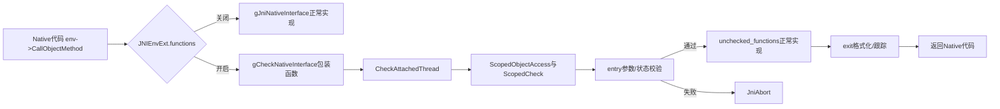
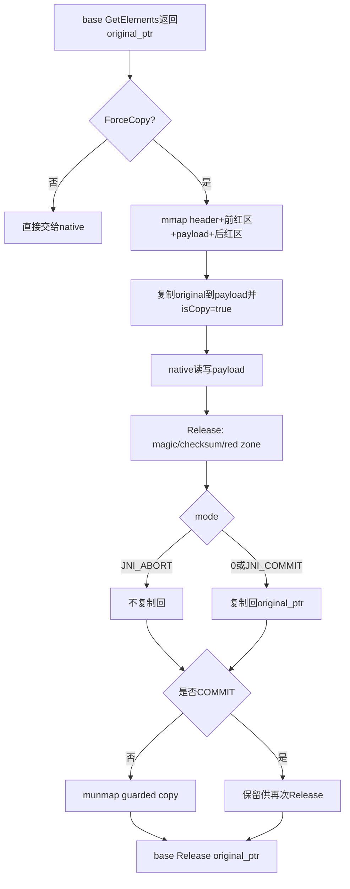

# 第580章 Android ART CheckJNI诊断链：函数表切换、ScopedCheck、pending exception、critical区、JniAbort、AbortHook与ForceCopy

> 源码基线：Android 11 / API 30 / `android-11.0.0_r48`。本章只做 macOS 源码阅读，不编译。阅读目标不是背错误日志，而是回答：一次 JNI 调用怎样先进入检查表、哪些状态和参数会被验证、错误为何通常终止进程，以及 ForceCopy 能发现什么、不能发现什么。

## 1. 先给出本章结论

CheckJNI 不是另一套 JNI，也不是解释执行器。ART 保留正常的 `JNINativeInterface`/`JNIInvokeInterface` 函数表，再准备一套同 ABI 的检查函数表；启用后，`JNIEnv*` 或 `JavaVM*` 的表指针改指向检查包装函数。包装函数先用 `ScopedCheck` 验证线程、异常、引用、ID、参数类型和 critical 状态，再通过缓存的 unchecked 表调用正常实现。

## 2. 为什么 JNI 错误特别难查

JNI 把 Java 对象、方法和数组投影为 C/C++ 句柄与裸指针。写错线程、传错 `jmethodID`、在 pending exception 下继续调用、数组越界写，可能直到很远处的 GC 或下一次 JNI 调用才崩溃。CheckJNI 的价值，是尽量把“延迟故障”提前到违规调用现场。

## 3. 三层对象不要混为一谈

第一层是 C/C++ 看见的 `JNIEnv*`/`JavaVM*`；第二层是 ART 扩展对象 `JNIEnvExt`/`JavaVMExt`；第三层是它们首字段所指向的函数表。开关 CheckJNI 主要改变第三层，不会为每次调用创建新虚拟机，也不会替换 Java 方法本身。

## 4. 调用主链总图



## 5. 本章源码地图

核心检查在 `art/runtime/jni/check_jni.cc`；声明在 `check_jni.h`；表的安装与 VM 状态在 `java_vm_ext.cc/.h`、`jni_env_ext.cc/.h`；启动参数在 `parsed_options.cc`；Zygote 后期开关在 `native/dalvik_system_ZygoteHooks.cc`；真正工作的基础 JNI 实现在 `jni_internal.cc`。

## 6. 两张表，而不是一个大 if

`gJniNativeInterface` 是正常 `JNIEnv` 表，`gCheckNativeInterface` 是检查表；`gJniInvokeInterface` 与 checked invoke table 则服务于 `JavaVM` 的 attach、detach、GetEnv 等调用。函数表布局必须完全匹配 JNI ABI，调用方无需知道当前选中了哪张表。

## 7. `-Xcheck:jni` 的解析位置

`parsed_options.cc` 用 `.Define("-Xcheck:jni").IntoKey(M::CheckJni)` 记录开关。`JavaVMExt` 构造时查询 `RuntimeArgumentMap::CheckJni`，随后调用 `SetCheckJniEnabled`。因此它是 Runtime 启动选项，不是某个 native library 自己解释的参数。

## 8. `warnonly` 在 r48 中不可用

这是本章最容易被旧资料带偏的地方。r48 只为 `-Xjniopts:forcecopy` 建立解析项；帮助文字里的 `-Xjniopts:{warnonly,forcecopy}` 位于“previously supported Dalvik options are ignored”列表。也就是说，`warnonly` 是被忽略的旧 Dalvik 选项，不是“记录警告后继续”的工作模式。

## 9. ForceCopy 是独立布尔量

`JavaVMExt` 的 `force_copy_` 来自 `JniOptsForceCopy`，构造后保持不变；CheckJNI 开关则可以切换。两者概念不同：CheckJNI 决定是否经过包装表，ForceCopy 决定包装数组/字符串元素时是否再造带红区的副本。

## 10. JavaVMExt 初始化时做了什么

构造器先保存 `unchecked_functions_ = &gJniInvokeInterface`，并令公开 `functions` 指向正常表；构造末尾再按运行参数调用 `SetCheckJniEnabled`。所以切换时总有一条稳定的“回到基础实现”路径，不必靠递归调用公开表。

## 11. JNIEnvExt 是按线程创建的

每个已附着线程拥有自己的 `JNIEnvExt`。构造时它读取 `vm_in->IsCheckJniEnabled()`，令 `functions = GetFunctionTable(check_jni_)`，同时把 `unchecked_functions_` 固定为 `GetJniNativeInterface()`。新线程因此继承 VM 当前的检查状态。

## 12. 开关为何要遍历现有线程

`JavaVMExt::SetCheckJniEnabled` 不只切 JavaVM 的 invoke 表，还在持有 thread-list 锁时遍历所有线程，对各自 `JNIEnvExt` 调用 `SetCheckJniEnabled`。否则老线程仍走旧表，而新线程走新表，同一进程会出现不可预测的诊断差异。

## 13. 返回值是旧状态

`JavaVMExt::SetCheckJniEnabled(bool)` 返回之前的 `check_jni_`。单元测试可先保存旧值、临时开启、再恢复。不要把返回值理解成“切换是否成功”；成功状态应读 `IsCheckJniEnabled()`。

## 14. JNIEnv 的切换受一把专用锁保护

`JNIEnvExt::SetCheckJniEnabled` 更新布尔值后，持有 `jni_function_table_lock_` 再改 `functions`。锁保护的是函数表指针/override 的一致性，并不意味着 native 调用期间所有业务数据都被这把锁串行化。

## 15. Zygote 可以后期开启

`ZygoteHooks::EnableDebugFeatures` 遇到 `DEBUG_ENABLE_CHECKJNI` 时先开启 VM，再显式开启当前线程的 JNIEnv。源码注释指出这一阶段只有一个线程；第二次显式设置是在早期 Zygote 时序下补齐当前 env，不应推广成普通多线程代码的固定模板。

## 16. 表切换图

```mermaid
sequenceDiagram
    participant Opt as parsed_options
    participant VM as JavaVMExt
    participant TL as ThreadList
    participant Env as JNIEnvExt
    participant Tbl as FunctionTable
    Opt->>VM: CheckJni=true
    VM->>VM: JavaVM.functions=checked invoke table
    VM->>TL: ForEach(ThreadEnableCheckJni)
    TL->>Env: SetCheckJniEnabled(true)
    Env->>Tbl: functions=checked native table
    Note over Env,Tbl: 新建JNIEnv也从VM继承当前状态
```

## 17. table override 是更高优先级

`JNIEnvExt::GetFunctionTable` 先看静态 `table_override_`，非空就直接返回 override；只有没有 override 才在 checked/unchecked 表之间选择。因此安装 override 后再开启 CheckJNI，源码会警告“not functional”。这不是偶发现象，而是明确的优先级规则。

## 18. override 还会影响隐藏 API 策略

`SetTableOverride` 在 thread-list 锁和 function-table 锁下重置所有线程表，并把 Core Platform API enforcement 设为 disabled。原因是该检查依赖栈回溯和调用者分类，而任意代理表改变了语义。它多用于 instrumentation/测试，不是普通应用应操作的接口。

## 19. checked 表覆盖整套 JNI 槽位

`check_jni.cc` 末尾初始化完整 `gCheckNativeInterface`：从 `GetVersion`、引用、类/方法/字段、调用、字符串、数组到 monitor、critical、direct buffer 都映射到 `CheckJNI::*`。这解释了为什么 native 代码源码不用改，只要表指针变了就会被拦截。

## 20. `baseEnv` 如何避免无限递归

检查包装不能再执行 `env->functions->GetVersion`，否则又回到自己。`baseEnv(env)` 把 env 转成 `JNIEnvExt*`，取 `GetUncheckedFunctions()`；包装器由此直接调用正常实现。它是“检查层包住执行层”的关键逃生口。

## 21. Java 侧不需要知道 CheckJNI

以下是 `art/test/004-JniTest/src/Main.java` 的原文。Java 只加载库并调用测试；检查发生在 native 代码使用 `JNIEnv*` 的时刻，Java 声明不会因开关改变。

```java
    static class ABC { public static int XYZ = 12; }
    static class DEF extends ABC {}
    public static void testFieldSubclass() {
      try {
        System.out.println("ABC.XYZ = " + ABC.XYZ + ", GetStaticIntField(DEF.class, 'XYZ') = " +
            getFieldSubclass(ABC.class.getDeclaredField("XYZ"), DEF.class));
      } catch (Exception e) {
        throw new RuntimeException("Failed to test get static field on a subclass", e);
      }
    }

    public static native int getFieldSubclass(Field f, Class sub);
```

这段还提示一个细节：静态字段 ID 可由父类声明，再以兼容的子类对象参与调用；CheckJNI 检查的是可赋值关系，不能粗暴要求 declaring class 与传入 class 指针完全相等。

## 22. 包装器的固定骨架

典型函数依次做：检查线程已附着；构造 `ScopedObjectAccess`；用函数名和 flags 构造 `ScopedCheck`；把参数放入 `JniValueType[]`；按格式串做 entry 检查；调用 `baseEnv`；最后按结果格式做 exit 调用并返回。特殊函数会在中间加入更强的专用检查。

## 23. 为什么先检查“是否附着”

`ScopedObjectAccess` 需要 ART 的当前 `Thread` 和 mutator 状态。未 attach 的 pthread 根本没有可用的 ART `Thread`，若先构造作用域，诊断自身就会失败。因此宏 `CHECK_ATTACHED_THREAD` 必须位于多数 checked JNI 入口最前面。

## 24. 未附着线程的临时 attach

`CheckAttachedThread` 发现 `Thread::Current()==nullptr` 时，会暂时 `AttachCurrentThread`，生成包含 tid 的错误并调用 `JniAbort`，随后 detach 并返回 false。临时 attach 是为了得到合理 ART 栈和错误环境，不表示这次非法调用被合法化。

## 25. 正常情况下 JniAbort 不会回来

默认路径最终 `LOG(FATAL)`，进程终止。源码仍在 abort 后写 return/cleanup，是因为测试可能安装 AbortHook，使 `JniAbort` 返回。阅读这些分支时必须同时考虑“生产 fatal”和“测试 hook 继续”两种控制流。

## 26. `ScopedCheck` 持有哪些上下文

对象保存 JNI 函数名、trace 缩进、flags，以及是否能关联当前 Java 方法。函数名用于错误前缀；flags 决定 pending exception/critical/release 等许可；`has_method_` 避免某些 invocation 接口错误地假设存在 Java 调用帧。

## 27. 格式串不是 JNI 方法签名

它是 CheckJNI 内部的小型参数描述语言。例如 `"EcpI"` 表示 JNIEnv、jclass、裸指针、jint；不是 dex/JNI 签名 `(Ljava/lang/Class;...)I`。混淆二者会无法理解包装器里的 `JniValueType args[]`。

## 28. Java primitive 格式字符

大写 `B C D F I J S Z V` 分别表示 jbyte、jchar、jdouble、jfloat、jint、jlong、jshort、Java boolean 与 void。这里 `Z` 打印为 true/false；它与下节的小写 `b` 有意区分。

## 29. Java reference 格式字符

`L` 是任意 jobject，`a` 是 jarray，`c` 是 jclass，`s` 是 jstring，`t` 是 jthrowable。检查不仅打印地址，还会按预期类型解码引用；例如把普通对象当 jclass 传入会被识别。

## 30. JNI 专用格式字符

`b` 是严格 JNI_TRUE/JNI_FALSE，`f/m` 是 field/method ID，`i` 是 JNI 状态值，`p` 是裸指针，`r` 是 release mode，`u` 是 MUTF-8，`z` 是非负 jsize，`v/E/w` 是 JavaVM/JNIEnv/ref type，`.` 表示 varargs。

## 31. `JniValueType` 是有标记约定的 union

union 本身不记录当前成员，真正的“类型标签”来自同位置格式字符。包装器必须把参数写入匹配成员并传匹配格式，否则检查代码会按错误位模式解释它。这个协议由 ART 自己维护，不暴露给应用。

## 32. 通用深检查只发生在 entry

`ScopedCheck::Check` 的源码注释明确说 thorough checks always on entry, never on exit。exit 调用仍会格式化返回值并打印 trace，但通用 `CheckPossibleHeapValue` 不会再次验证结果。某些包装器可另写显式后置检查，不能据此概括为“所有返回对象均做完整合法性验证”。

## 33. 线程归属检查

格式 `E` 会验证传入 env 与当前线程 `Thread::Current()->GetJniEnv()` 是否相同。把线程 A 缓存的 `JNIEnv*` 给线程 B 使用，即使两个线程都已 attach，也会报“thread ... using JNIEnv* from thread ...”。正确做法是每线程获取自己的 env。

## 34. JavaVM 与 JNIEnv 的线程属性不同

`JavaVM*` 代表进程级 VM，可跨线程保存并用于 attach/GetEnv；`JNIEnv*` 是线程关联对象，不可跨线程共享。CheckJNI 检查的正是这个常被 C++ 全局变量掩盖的区别。

## 35. pending exception 规则

如果当前线程已经有待处理 Java 异常，默认 flags 的 JNI 调用会被拒绝。原因是许多 JNI API 不允许在异常挂起时继续做普通工作；native 代码应立刻检查、清除或返回，让异常沿 JNI 返回链传播。

## 36. `kFlag_ExcepOkay` 是白名单

异常查询、描述、清除、删除引用、释放资源、monitor exit 等特定入口会带 `ExcepOkay`。它不是“忽略异常”的总开关，而是每个 wrapper 根据 JNI 规则明确标注的许可。

## 37. 一个常见错误时序

`FindClass` 返回 null 并留下 `ClassNotFoundException` 后，native 代码若不检查异常，继续 `GetMethodID`，CheckJNI 会在后一个调用处终止。真正根因仍是前一个失败；看日志时要向前寻找第一个产生异常的 JNI 调用。

## 38. 引用检查先解码句柄

局部、全局与弱全局引用不是普通堆地址。CheckJNI 通过 ART 的 indirect reference 机制解码，再检查 nullability、引用种类、目标堆地址和期望 Java 类型。已经删除或属于错误表的句柄往往能在这里被识别。

## 39. null 是否允许由具体 API 决定

`jobject` 类型不天然意味着非空。有些 API 允许 null，比如创建新引用可接收 null；另一些 API 在专用检查中调用 `CheckNonNull`。因此不能只看格式字符 `L` 判断空值合同，必须看 wrapper 的 flags 与额外代码。

## 40. jclass 也是引用

`jclass` 指向 `java.lang.Class` 对象的 JNI 引用，而不是 C++ 的 `mirror::Class*` 裸地址。`ScopedObjectAccess` 解码后才能安全读取元数据。把 internal ART pointer 强转为 jclass 是未定义用法。

## 41. field ID 的检查强度

专用逻辑会确认 ID 非空、能解码成 `ArtField`，再验证静态字段 declaring class 的 assignable 关系，或实例对象的类确实具有对应字段。这样可发现拿 A 类字段 ID 操作无关 B 类对象的错误。

## 42. method ID 的检查强度

调用包装器验证返回 primitive 类型、static/instance 属性、virtual/nonvirtual/static 调用种类、接收者实例关系与 class 兼容性。`CallIntMethod` 配 void 方法、以 static API 调实例方法等会在真正分派前暴露。

## 43. ID 检查也不是内存安全证明

`CheckMethodID`/`CheckFieldID` 对 null 和解码结果做检查，但源码仍留有“TODO Better check here”一类限制。完全伪造且指向不可读内存的值仍可能使诊断代码崩溃。CheckJNI 是尽力诊断工具，不是对敌意指针的安全边界。

## 44. varargs 为什么需要 `Clone`

读取 C `va_list` 会推进游标。`VarArgs` 同时支持 `va_list` 与 `jvalue*`，在校验方法 shorty 时先克隆自有游标，避免检查过程改变真正传给调用实现的参数位置。小整数还要遵循 C varargs 的整型提升。

## 45. primitive 范围检查的细节

非法 jboolean 始终是致命错误；超出 jbyte/jchar/jshort 位宽的值，在 debug build 通过 `kBrokenPrimitivesAreFatal` 可为 fatal，在非 debug build 可能只警告。这条兼容性处理不等于所有 CheckJNI 错误都会降级为 warning。

## 46. Java 测试展示小整数边界

下面仍是 `art/test/004-JniTest/src/Main.java` 原文，它验证 byte 在 JNI 入口/返回链中的符号扩展。CheckJNI 的 primitive 检查与实际调用桥是两件事：前者诊断值域，后者完成 ABI 搬运。

```java
    static native byte byteMethod(byte b1, byte b2, byte b3, byte b4, byte b5, byte b6, byte b7,
        byte b8, byte b9, byte b10);

    private static void testByteMethod() {
      byte returns[] = { 0, 1, 2, 127, -1, -2, -128 };
      for (int i = 0; i < returns.length; i++) {
        byte result = byteMethod((byte)i, (byte)2, (byte)(-3), (byte)4, (byte)(-5), (byte)6,
            (byte)(-7), (byte)8, (byte)(-9), (byte)10);
        if (returns[i] != result) {
          System.out.println("Run " + i + " with " + returns[i] + " vs " + result);
          throw new AssertionError();
        }
      }
    }
```

## 47. `jsize` 与普通 jint 的区别

格式 `z` 要求值非负，适合数组长度或区域长度；如果某 API 合法接受负 jint，就用 `i/I` 而不是 `z`。CheckJNI 的格式选择表达了 API 语义，而不只是 C typedef 大小。

## 48. release mode 只允许三个值

`r` 验证 mode 是 0、`JNI_COMMIT` 或 `JNI_ABORT`。0 表示复制回并释放，COMMIT 表示复制回但保留缓冲区供后续 release，ABORT 表示丢弃本地修改并释放。具体底层是否原本就是 direct pointer，仍由正常 JNI 实现决定。

## 49. MUTF-8 检查关注字节结构

格式 `u` 会扫描起始字节和 continuation 字节，能指出非法 start/continuation。它检查的是 JNI Modified UTF-8 输入，不等于标准 UTF-8 文本验证器；Android 实现还接受四字节序列，相关 Unicode 语义需结合第578章理解。

## 50. `NullableUtf` 不是全局空值放宽

只有带 `kFlag_NullableUtf` 的函数，其 `u` 参数才可为 null。该 flag 只作用于 UTF 参数，不会自动允许同一调用里的 class、array 或输出指针为空。

## 51. 裸指针校验能力有限

格式 `p` 当前主要用于打印和部分非空判断，源码明确留有“是否可读”的困难。CheckJNI 不能可靠证明任意 native 地址的长度、生命周期、对齐与权限；错误 `JNINativeMethod*`、direct buffer 地址仍可能在基础实现或 native 代码中崩溃。

## 52. `RegisterNatives` 能检查什么

包装器先检查 env、class、methods 指针和数量，再由基础实现逐项解析 name/signature/fnPtr 并绑定。CheckJNI 不会从一个裸数组指针推导实际分配长度，所以 `nMethods` 与真实 C 数组不匹配仍是危险内存错误。

## 53. `NewDirectByteBuffer` 的分工

checked wrapper 对 env、address、capacity 做通用描述，源码注释说明 address 与 capacity 的有效性由 base implementation 检查。这里体现一个重要阅读法：CheckJNI 文件没有写出的校验，不代表整条 JNI 实现一定没有；还要继续追 `jni_internal.cc`。

## 54. MonitorEnter 的双层行为

对象非空时，checked wrapper 先让 `JNIEnvExt::RecordMonitorEnter` 记录本次 JNI 会话持有的 monitor，再调用基础 `MonitorEnter` 真正加锁。记录表用于诊断，真正的 Java monitor 语义仍由 ART monitor 实现负责。

## 55. MonitorExit 为什么允许 pending exception

清理路径必须能在异常挂起时释放 monitor，所以 wrapper 带 `kFlag_ExcepOkay`。它先用 `CheckMonitorRelease` 检查当前 JNI 会话是否持有该对象，再调用基础 `MonitorExit`。异常存在不等于可以释放任意未持有 monitor。

## 56. “当前 JNI 会话”比线程更细

`JNIEnvExt` 用 `JavaCallFrame` 与 jobject 记录 monitor。native 方法 A 调回 Java，再进入 native 方法 B 时，即使仍在同一 OS 线程，也可能是不同 JNI 会话；B 不应擅自释放 A 的 monitor。

## 57. 返回 Java 前的泄漏检查

`CheckNoHeldMonitors` 会在 JNI 方法结束时发现仍由当前 session 持有的 monitor；同一收口还确认 `critical_` 计数归零。这样“忘记 release”不会等到不可解释的死锁才暴露。

## 58. AbortHook 下为何还要修记录

测试 hook 使 fatal 路径继续执行。某些 monitor 诊断会移除对应 reference-table 根，避免已失效 local reference 留在记录中并干扰 GC。此类清理服务于测试继续跑，不意味着生产错误可恢复。

## 59. critical 区是状态机

默认 JNI 函数带 `CritBad`；Get*Critical 带 `CritGet`；Release*Critical 带 `CritRelease`；少量允许在 critical 区调用的函数带 `CritOkay`。`ScopedCheck::CheckThread` 根据 flag 与 `JNIEnvExt::critical_` 计数判断是否合法。

## 60. 进入 critical 时做什么

`CritGet` 增加嵌套计数；从 0 变 1 时记录 `GetCpuMicroTime()`。注意它记录 CPU 时间而不是墙钟时间，所以“被调度挂起很久”与“持续占用 CPU 很久”的表现不同。

## 61. 退出 critical 时做什么

`CritRelease` 要求计数大于 0，否则报 release without matching get；最终一层释放时，如果 CPU 时间超过 16,000 微秒就警告，然后递减计数。16ms 是诊断阈值，不是自动解锁或硬实时期限。

## 62. 为什么 critical 区限制调用

`GetPrimitiveArrayCritical`/`GetStringCritical` 可能让 GC 受限，或返回与移动对象管理相关的敏感存储。在持有期间做阻塞、回调 Java 或大量 JNI 工作会扩大 GC 停顿风险，所以规范只允许很窄的操作集合。

## 63. 嵌套 critical 必须逐层配对

计数而非布尔值意味着两次 get 需要两次 release。拿错 env、漏一次 release、额外 release 都可被状态机发现。它不按具体数组指针建立完整配对图，因此错误指针仍需 GuardedCopy/base implementation 辅助发现。

## 64. Java 测试展示并行 GC 与 critical

以下是 `art/test/004-JniTest/src/Main.java` 原文。Java 侧只制造并行压力；真正的 critical get/release 位于对应 native 实现。测试“能跑过”只说明该实现组合工作，不代表 critical 区可以执行任意 JNI API。

```java
    // Exercise GC and JNI critical sections in parallel.
    private static void testJniCriticalSectionAndGc() {
        Thread runGcThread = new Thread(new Runnable() {
            @Override
            public void run() {
                for (int i = 0; i < 10; ++i) {
                    Runtime.getRuntime().gc();
                }
            }
        });
        Thread jniCriticalThread = new Thread(new Runnable() {
            @Override
            public void run() {
                final int arraySize = 32;
                byte[] array0 = new byte[arraySize];
                byte[] array1 = new byte[arraySize];
                enterJniCriticalSection(arraySize, array0, array1);
            }
        });
        jniCriticalThread.start();
        runGcThread.start();
        try {
            jniCriticalThread.join();
            runGcThread.join();
        } catch (InterruptedException ignored) {}
    }

    private static native void enterJniCriticalSection(int arraySize, byte[] array0, byte[] array);
```

## 65. GetPrimitiveArrayCritical 的包装顺序

wrapper 先以 `CritGet` 做 entry 检查，再调用基础 Get；若返回非空且 `ForceCopy()` 为真，用 `GuardedCopy::CreateGuardedPACopy` 包一层；最后把地址用于 exit trace。critical 计数在调用基础实现前已经增加。

## 66. ReleasePrimitiveArrayCritical 的包装顺序

wrapper 以 `CritRelease|ExcepOkay` 检查 env、array、非空地址与 mode；ForceCopy 时先验证/拆解 guarded copy，得到原始基础指针；再把原始指针交给 base release。诊断副本不能直接传给正常实现。

## 67. `JNI_COMMIT` 暴露“两本账”的边界

guarded 层在 COMMIT 时复制回原始指针但不 munmap，基础层也收到 COMMIT 并可能保留其存储；然而 `CheckThread` 只看见一次 `CritRelease`，不区分 mode，已经把 `critical_` 减一。若 native 随后再用 mode 0 做最终释放，CheckJNI 又可能报“too many critical releases”。所以 r48 的 Critical+COMMIT 存在“缓冲区仍待释放、诊断计数已退出”的版本边界，不能把 COMMIT 当成干净的半释放流程；普通 Elements 的 COMMIT 不使用这本 critical 计数。

## 68. ForceCopy 实际依赖 checked wrapper

`force_copy_` 虽是 VM 独立字段，但创建 `GuardedCopy` 的代码位于 CheckJNI wrappers。若 `JNIEnv.functions` 直接走基础表，就不会经过这些 create/release 分支。因此在 r48 的实际路径上，仅给出 forcecopy 而没有让 checked 表生效，不能假设红区一定工作。

## 69. GuardedCopy 内存布局

它额外分配 `payload + 512` 字节。前 256 字节包含 `GuardedCopy` header 和剩余前红区，payload 从整体偏移 256 开始，后面再留 256 字节红区。前后不是各 512 字节；512 是两侧合计额外大小。

## 70. 红区使用周期 canary

前后区域循环写入字符串 `JNI BUFFER RED ZONE`。release 时逐字比较；payload 前写越界会破坏 start red zone，尾部越界会破坏 end red zone，错误信息给出相对位置。

## 71. header magic 检查错误指针

header 保存固定 magic、原始指针、长度和可选 checksum。release 接收 interior payload pointer，再向前 256 字节寻找 header；magic 不符时会提示 incorrect data pointer。不过若传入完全不可读地址，连 `memcmp` 都可能直接 fault，源码明确承认无法轻易避免。

## 72. checksum 用于“不应修改”的缓冲区

创建时若 `mod_okay=false`，代码计算 Adler-32；释放时重新计算以发现修改。例如某些字符串字符副本按合同不应被 native 修改。checksum 是误用检测，不是密码学完整性保护。

## 73. primitive array 允许修改 payload

`CreateGuardedPACopy` 调 `Create(..., true)`，所以不会以 checksum 拒绝数组内容变化。只要 mode 不是 JNI_ABORT，release 把 payload 复制回基础指针；ABORT 则丢弃变化。红区无论哪种 mode 都应保持完整。

## 74. `isCopy` 被强制写 true

即使基础实现返回 direct pointer，一旦 ForceCopy 再包了一层，交给 native 的确实是副本，因此非空 `is_copy` 会被写成 JNI_TRUE。这是对最终可见缓冲区的描述，不是对更内层 base pointer 的描述。

## 75. ForceCopy 数据链图



## 76. 字符串与数组不能一概而论

数组元素可按 release mode 写回；字符串字符 API 返回 `const` 指针，native 修改本来就违约。ForceCopy 对二者可使用相同 red-zone 基础设施，但 checksum/mod_okay 和 release 规则不同。

## 77. 零长度缓冲区也有意义

`GuardedCopy::Create` 明确允许 len 为 0，仍建立 header 与红区。这样对零长度结果错误写一个字节，也可能立刻破坏后红区，而不是因为 payload 为零就完全失去诊断。

## 78. mmap/munmap 说明它有明显开销

每个 guarded buffer 都可能触发虚拟内存映射、复制、填充、校验与解除映射；checked wrapper 还做引用解码、类型检查和日志构造。CheckJNI/ForceCopy 适合 debug 定位，不应把其性能当正常 JNI 性能。

## 79. JniAbort 如何构造错误

`JavaVMExt::JniAbortV` 结合函数名、当前方法和 reason 生成以 `JNI DETECTED ERROR IN APPLICATION` 为核心的诊断。当前线程可用时会通过 `ScopedObjectAccess` 获取 Java 调用方法，让日志回答“哪个 native 方法调用了哪个 JNI API”。

## 80. 默认 fatal 前为何转成 native 状态

没有 hook 时，JniAbort 在最终 `LOG(FATAL)` 前使用 `ScopedThreadSuspension(..., kNative)`。这样 fatal 日志/本地栈生成不继续假装线程处于 Runnable 且持有 mutator access，符合 ART 线程状态协议。

## 81. AbortHook 的真实用途

`SetCheckJniAbortHook` 安装回调和 data；若存在，JniAbort 调 hook 后返回。`CheckJniAbortCatcher` 测试类用它捕获错误文本并继续断言。它是 runtime 内部测试入口，不是 app 侧可依赖的容错 API。

## 82. AbortHook 不等于 warn-only

hook 会改变控制流，许多调用点因此在 AbortF 后显式返回失败值；这与“所有错误只打印 warning、继续正常执行”完全不同。尤其错误句柄可能已不安全，通用 warn-only 语义无法保证后续执行正确。

## 83. 为什么源码反复写 `return false`

在默认生产路径上它看似不可达，但在 hook 测试路径上是必须的。若 `AbortF` 后继续解码坏引用，测试进程也会崩溃，无法校验错误消息。理解这点可避免把 return 误判为“线上会优雅恢复”。

## 84. `-Xjnitrace` 还需要 CheckJNI 表

`JavaVMExt` 独立保存 `tracing_enabled_` 和 trace 匹配串，但构造器只依据 `CheckJni` 调 `SetCheckJniEnabled`；头文件注释也明确写的是同时启用 `-Xcheck:jni` 与 `-Xjnitrace:` 才打印匹配 native 方法的 JNI 调用。原因是日志代码位于 `ScopedCheck::Check`，基础函数表没有这层 entry/exit 包装。单独出现 tracing 布尔值不等于调用已经改走 checked 表。

## 85. trace 如何选方法

有当前 Java 方法且 `ShouldTrace` 匹配时，entry 打印 `JavaMethod -> JniFunction(args)`，exit 打印返回方向与值。Invocation 接口可能运行在未 attach 线程，代码先判断是否存在 `Thread::Current()`，避免为了 trace 本身解引用空线程。

## 86. `ForceTrace` 与过滤 trace

某些 wrapper flags 带 `kFlag_ForceTrace`，无论普通匹配条件都记录；常规路径则依据 class descriptor/配置串。ForceTrace 仍只是可观测性，不会让一个未被检查的危险裸指针自动变安全。

## 87. third-party JNI 过滤是启发式

`ShouldTrace` 可对第三方 JNI 做分类并排除一组 Android 平台前缀。类名字符串匹配是诊断便利，不是权限或信任判断；重命名包、代理调用或类加载器边界都不应据此形成安全结论。

## 88. `FindClass` 检查类名形式

`CheckClassName` 要求类似 `java/lang/Thread`、`[Ljava/lang/Object;` 或 `[[B`。点号形式 `java.lang.Thread` 某些 ClassLoader 路径可能被容忍，但 JNI 合同仍要求斜杠；CheckJNI 会把侥幸可运行的错误写法暴露出来。

## 89. 数组 region 会检查范围

Get/SetArrayRegion wrappers 检查 array 类型、start、len 与缓冲区参数，并由专用逻辑确认范围不越界。`jsize` 非负只是第一层，`start+len` 是否超过数组还需结合真实数组长度。

## 90. `SetObjectArrayElement` 还涉及元素类型

SetObjectArrayElement 时，基础实现必须维护数组协变与 ArrayStoreException 语义；checked 层先验证 array/reference。不能把“CheckJNI 接管类型安全”理解成跳过 JVM 正常的数组存储检查。

## 91. NewStringUTF 的边界

传入指针需要合法 MUTF-8 和正确 NUL 终止；CheckJNI 可以扫描字节格式，但无法证明任意坏指针后面一定存在可读 NUL。native 内存自身的分配长度仍应由 ASan/HWASan、审计和正确 C++ 所有权保证。

## 92. 全局引用与局部引用生命周期

CheckJNI 可识别许多 deleted local/global reference；但它不能替 native 代码设计所有权。跨异步回调保存对象应建 GlobalRef，用完删除；local ref 只在当前 JNI frame/session 有效，并受 local table 容量管理。

## 93. weak global 的读取竞态

弱全局可能被 GC 清成 null。即使检查时可解码，稍后也不能把其存活视为永久事实；常见做法是先 `NewLocalRef(weak)` 获得本次使用的强局部引用，并检查是否为 null。

## 94. ExceptionCheck 不是 ExceptionClear

检测到 pending exception 后，native 通常要么立即 return 让异常传播，要么在确有恢复策略时读取并 clear。仅调用 `ExceptionCheck` 得到 true，却继续大量普通 JNI 操作，仍会触发 CheckJNI。

## 95. attach/detach 走 JavaVM 检查表

`AttachCurrentThread`、`AttachCurrentThreadAsDaemon`、`DetachCurrentThread`、`GetEnv` 属于 `JNIInvokeInterface`，不在 `JNINativeInterface`。CheckJNI 为它们提供另一张 checked invoke table，并使用 `CheckNonHeap` 处理不需要解码堆引用的参数。

## 96. Detach 的调用边界

线程必须先 attach，且不应在仍有活跃 Java/JNI frame 时任意 detach。checked invocation wrapper 可提前报告部分非法状态；线程本地资源与 `JNIEnvExt` 的最终清理由正常 runtime 路径完成。

## 97. CheckJNI 不是 AddressSanitizer

它理解 JNI 语义：引用种类、method/field ID、异常状态、critical、monitor、MUTF-8。ASan/HWASan 理解 native 地址越界/UAF。两者覆盖面相交但不替代；最有效的 JNI 排障常把语义检查和 native 内存工具结合。

## 98. CheckJNI 也不是线程竞态检测器

它能发现跨线程使用 JNIEnv，却不能普遍发现 native 全局变量数据竞争、无锁引用发布、业务对象竞态。此类问题仍需锁设计、TSan 可用环境、trace 与代码审查。

## 99. 它不能证明 C ABI 完全正确

若导出函数声明的参数/返回 ABI 与 Java native 声明不匹配，错误可能在进入任何 `env->...` 调用前已经发生。第579章的 JNI stub/入口桥知识仍适用；CheckJNI 主要检查“进入 JNI API 后”的使用。

## 100. 它不是安全沙箱

native 代码与进程同权限运行，可直接读写地址和发系统调用。CheckJNI 的 Abort 是开发期 fail-fast，不是隔离恶意 native library 的权限边界，也不保证错误输入不会导致诊断器自身 fault。

## 101. 开启后的正确预期

预期是更早、更明确地失败，并带 JNI function、调用方法和原因；不是“自动修复错误”。如果开启后应用更容易崩溃，往往说明原先未定义行为被提前揭示，而不是 CheckJNI 无缘无故制造了 bug。

## 102. 日志阅读顺序

先找 `JNI DETECTED ERROR IN APPLICATION`；再读 `in call to ...` 确认具体 JNI API；接着读 `from ...`/当前方法；然后看 reason 是线程、异常、引用、ID、critical 还是 red zone；最后回到第一次产生异常或获取指针的位置，而不是只修最后一行。

## 103. pending exception 案例推演

若 native 调 `GetMethodID` 失败，ART 留下 NoSuchMethodError；随后 `CallVoidMethod` 被 CheckJNI 拒绝。修复应核对方法名/签名并在失败点返回，而不是在 CallVoidMethod 前无条件 `ExceptionClear`，后者会掩盖真正的 Java 语义错误。

## 104. wrong-thread 案例推演

若把 `JNIEnv*` 存入单例并在 worker pthread 使用，日志指出两个线程。修复是持久保存 `JavaVM*`，worker 中 `GetEnv`，必要时 attach，并按所有权在退出前 detach；不能用 mutex 把错误 env “保护起来”。

## 105. red-zone 案例推演

若长度为 N 的 byte 数组副本写入 `buf[N]`，数据本身之外的后红区被破坏，release 时报告 after buffer disturbed。定位时要检查 native 使用的元素数、字节数与 component size，尤其不要把元素数量当字节数。

## 106. critical 案例推演

拿到 critical pointer 后调用 FindClass，默认 `CritBad` 会被拒绝；修复是先 release，再做类查找。若必须长期处理数据，应改用普通 GetArrayElements/region copy，把 critical 区缩到纯本地、短时、无阻塞的循环。

## 107. monitor 案例推演

Native A `MonitorEnter` 后回调 Java，Java 又进入 Native B，B 试图退出同对象；线程相同但 JavaCallFrame 不同，CheckMonitorRelease 会指出 JNI session 不匹配。正确配对必须留在获取 monitor 的同一 native 会话。

## 108. 建议的只读定位流程

从 `parsed_options.cc` 确认开关，再看 `JavaVMExt::SetCheckJniEnabled` 与 `JNIEnvExt::GetFunctionTable`；接着在 `gCheckNativeInterface` 找目标槽位，进入对应 wrapper；最后追 `baseEnv` 到 `jni_internal.cc`。这一顺序能把“选择、检查、执行”三层分开。

## 109. 如何判断一句资料是否可信

遇到“CheckJNI 支持 warnonly”“ForceCopy 单独就生效”“所有返回值也完整检查”这类说法，分别去查 option Define、GuardedCopy 调用点和 `ScopedCheck::Check(entry)`。以分支和调用点为证据，不以旧 Dalvik 文档或名称直觉代替版本源码。

## 110. 本章源码事实清单

已确认：r48 解析 check:jni/forcecopy；warnonly 位于 ignored 列表；VM 切换现存线程 env；override 优先；checked wrapper 通过 unchecked table 下沉；通用深检查只在 entry；critical 用嵌套计数和 CPU 微秒；默认 abort fatal；hook 为测试；GuardedCopy 总红区 512 字节。

## 111. 练习说明

以下四题只读源码，不编译、不改 AOSP。每个命令都先验证目录/文件存在，再输出有限范围；在本工程根目录 `/Users/ninebot/androidSource` 执行即可。

## 112. 练习一：确认可用与被忽略的选项

```bash
set -eu
cd /Users/ninebot/androidSource
test -f art/runtime/parsed_options.cc
rg -n -- '-Xcheck:jni|-Xjniopts:forcecopy|warnonly|previously supported Dalvik options' art/runtime/parsed_options.cc
```

应看到 check:jni 与 forcecopy 的 `.Define`，而 warnonly 只在旧 Dalvik 选项说明附近。若只搜索到单词却不读上下文，很容易得出相反结论。

## 113. 练习二：追函数表切换

```bash
set -eu
cd /Users/ninebot/androidSource
test -f art/runtime/jni/java_vm_ext.cc
test -f art/runtime/jni/jni_env_ext.cc
rg -n 'SetCheckJniEnabled|GetFunctionTable|table_override_|unchecked_functions_' \
  art/runtime/jni/java_vm_ext.cc art/runtime/jni/jni_env_ext.cc
```

回答：谁切 JavaVM 表、谁遍历线程、谁切每线程 JNIEnv 表，以及 override 为何能压过 checked/unchecked 选择。

## 114. 练习三：读取 critical 与 AbortHook

```bash
set -eu
cd /Users/ninebot/androidSource
test -f art/runtime/jni/check_jni.cc
test -f art/runtime/jni/java_vm_ext.cc
rg -n 'kFlag_Crit|critical_|kCriticalWarnTimeUs|JniAbortV|abort_hook_' \
  art/runtime/jni/check_jni.cc art/runtime/jni/java_vm_ext.cc art/runtime/jni/java_vm_ext.h
```

区分 fatal 默认路径与 hook 路径，并确认阈值使用的时间函数。不要把 hook 的“可返回”推广为生产可恢复。

## 115. 练习四：追 ForceCopy 红区

```bash
set -eu
cd /Users/ninebot/androidSource
test -f art/runtime/jni/check_jni.cc
rg -n 'class GuardedCopy|kRedZoneSize|CreateGuardedPACopy|ReleaseGuardedPACopy|ForceCopy' \
  art/runtime/jni/check_jni.cc art/runtime/scoped_thread_state_change.h
```

画出 original pointer、guarded payload 与 base release 的关系，并核对 512 是两侧总额外大小。命令不执行任何二进制或构建动作。

## 116. 四题答案如何串成一条链

练习一证明开关语义；练习二证明开关怎样落到函数表；练习三证明 wrapper 的线程/critical/fatal规则；练习四证明特殊缓冲区诊断。四段合起来正是“配置 → 选表 → 检查 → 下沉 → 返回/终止”的完整 CheckJNI 主链。

## 117. 复读时发现并修正的易混点

第一，`warnonly` 在本版本被忽略；第二，通用深检查只在 entry，exit 主要服务 trace；第三，512 字节是前后红区合计；第四，critical 超时使用 CPU 时间；第五，AbortHook 是测试钩子；第六，ForceCopy 的 guarded 路径位于 checked wrappers。以上均已按 r48 调用点重写。

## 118. 仍需保留的边界

表 override、完全伪造裸指针、C ABI 声明错误、native UAF/竞态、恶意代码都超出或部分超出 CheckJNI。它能显著改善常见 JNI 违规的可诊断性，但“打开后没报错”绝不等价于 native 代码内存安全。

## 119. 本章记忆锚点

记住一句话：CheckJNI 是“同 ABI 的诊断包装函数表”。再记五个检查轴：线程归属、异常状态、引用/ID/参数、critical/monitor 配对、ForceCopy 缓冲区；以及一个控制流事实：默认 `JniAbort` 是 fatal。

## 120. 下一章预告

第581章转向 Java 与 native 内存共同施压时的记账：`VMRuntime.registerNativeAllocation/registerNativeFree`、`NativeAllocationRegistry`、Cleaner、ART Heap 的 native allocation watermark 与触发 GC 链。它会回答“对象很少但 native 内存很大时，ART 怎样得到压力信号”。
