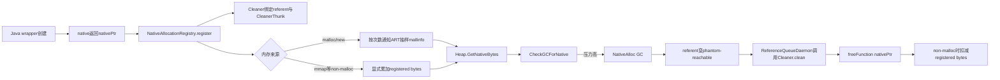
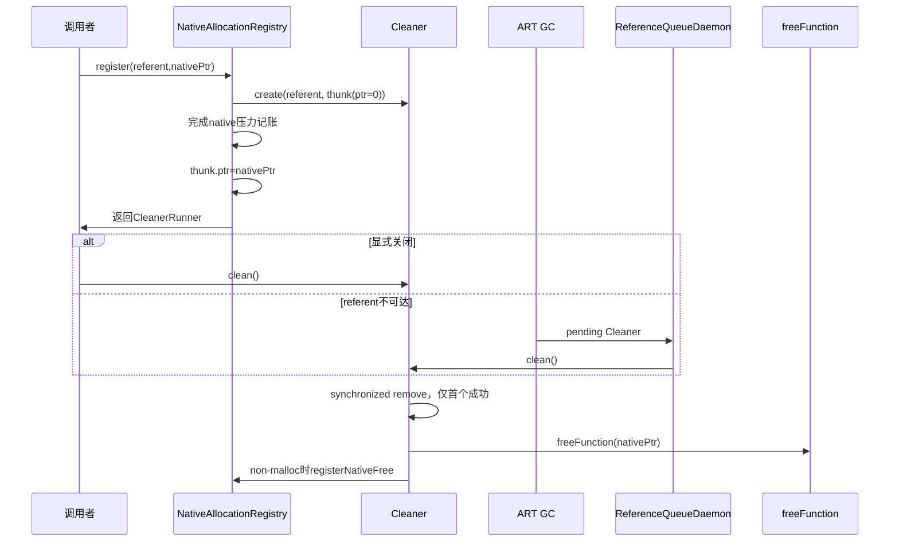
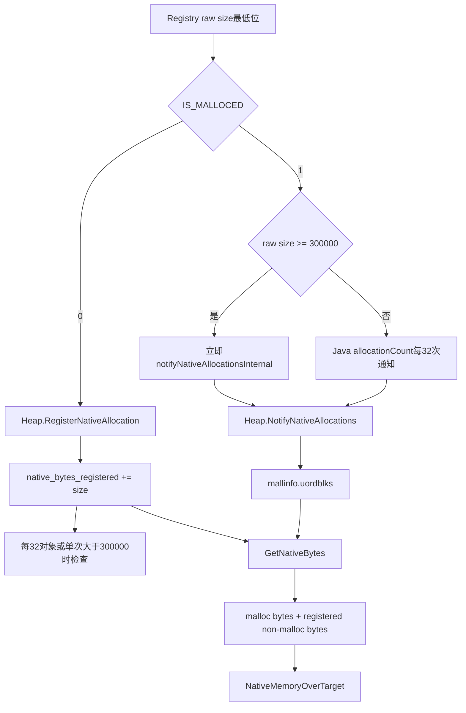

# 第581章 Android ART Native 内存记账链：NativeAllocationRegistry、Cleaner、VMRuntime、mallinfo、Watermark 与 NativeAlloc GC

> 源码基线：Android 11 / API 30 / `android-11.0.0_r48`。本章只在 macOS 阅读源码，不编译。它是第558章“对象分配与 GC”和第573章“ReferenceQueueDaemon”的纵向加深：只研究 Java 对象背后带着 native 内存时，谁拥有、谁记账、谁触发 GC、谁真正释放。

## 1. 先给出总答案

`NativeAllocationRegistry` 把 Java referent、native 指针、释放函数和估算大小关联起来；Cleaner 在 referent 变成 phantom-reachable 后调用释放函数。对于 `malloc/new` 内存，ART 通过抽样 `mallinfo()`观察；对于 `mmap` 等非 malloc 内存，调用者显式增减 `native_bytes_registered_`。两路汇总后只影响 GC 调度，不代表 ART 直接拥有或释放那块 native 内存。

## 2. 为什么只看 Java Heap 会误判

一个 `Path` Java 对象可能只有几十字节，背后的 SkPath、字体、图片像素或 Binder native state 却大得多。若 GC 只看 Java 分配速度，许多轻量 wrapper 仍可达或尚未回收时，进程 native 内存已经快速上涨。

## 3. 四本账先拆开

第一本是 Java heap 已分配字节；第二本是 allocator 可见的 malloc 在用字节；第三本是显式登记的 non-malloc native 字节；第四本是 Cleaner 的资源所有权。GC 启发式会组合前面三本，但只有第四本知道该对哪个指针调用哪个 free function。

## 4. 全链总图



## 5. 本章源码地图

Java API 在 `libcore/libart/src/main/java/dalvik/system/VMRuntime.java`；所有权封装在 `libcore/luni/src/main/java/libcore/util/NativeAllocationRegistry.java`；Cleaner 在 `libcore/ojluni/src/main/java/sun/misc/Cleaner.java`；队列消费在 `java/lang/ref/ReferenceQueue.java` 与 `java/lang/Daemons.java`；ART 记账和 GC 决策在 `art/runtime/gc/heap.cc/.h`。

## 6. JNI 中转层很薄

`art/runtime/native/dalvik_system_VMRuntime.cc` 的三个入口分别调用 `Heap::RegisterNativeAllocation`、`RegisterNativeFree`、`NotifyNativeAllocations`。它检查负数并把 `jlong` 安全夹到 `size_t`，但不保存 native pointer，也不调用资源的析构函数。

## 7. `applyFreeFunction` 在哪里落地

`libcore_util_NativeAllocationRegistry.cpp` 把两个 `jlong` 转为 `uintptr_t`，再转为 `void (*)(void*)` 和 `void*`，直接执行 `nativeFreeFunction(nativePtr)`。这是一条原生函数指针调用，没有虚拟类型检查或统一 allocator 选择。

## 8. 谁才是资源所有者

注册成功后，Registry/Cleaner 接管 `nativePtr` 的释放责任；ART Heap 只持有总量统计。把 `registerNativeAllocation` 理解成“把内存交给 GC 管”不准确：GC 管的是 referent 可达性和回收时机，free function 才管理具体 native 对象。

## 9. 一个真实使用者：Path

以下逐字来自 `frameworks/base/graphics/java/android/graphics/Path.java`。`Path` 保存 native 地址，静态 Registry 保存该资源类型的释放策略，构造后立即把 `this` 与地址绑定。

```java
    private static final NativeAllocationRegistry sRegistry =
            NativeAllocationRegistry.createMalloced(
                Path.class.getClassLoader(), nGetFinalizer());

    /**
     * @hide
     */
    public final long mNativePath;

    /**
     * @hide
     */
    @UnsupportedAppUsage
    public boolean isSimplePath = true;
    /**
     * @hide
     */
    @UnsupportedAppUsage
    public Region rects;
    private Direction mLastDirection = null;

    /**
     * Create an empty path
     */
    public Path() {
        mNativePath = nInit();
        sRegistry.registerNativeAllocation(this, mNativePath);
    }
```

## 10. 为什么一个 Registry 可注册很多对象

Registry 描述的是“一类资源”：同一个 class loader、同一个 free function、同一个估算 size/来源类别。每次注册再创建 Cleaner 和 thunk，保存各自 nativePtr。这样 Path 不必为每个实例重复保存释放函数元数据。

## 11. classLoader 字段不是摆设

`classLoader` 在注册方法中没有显式读取，但 Registry 强引用它；非静态 `CleanerThunk` 又强引用外部 Registry。只要 Cleaner 仍活着，定义 free function 的 native library 所属 ClassLoader 就不会过早卸载，避免清理时跳到已卸载代码。

## 12. freeFunction 的函数类型合同

调用者必须提供 `void f(void* nativePtr)` 的地址，而且必须与分配方式匹配：new 对应合适 delete，malloc 对应 free，自定义池对应自定义析构。Registry 无法从地址推断 ABI；函数地址错、签名错或 allocator 不匹配都可能直接 native crash。

## 13. freeFunction 没有非零校验

构造器只拒绝负 size，注册只拒绝 null referent 和 0 nativePtr；它没有检查 `freeFunction==0`。因此创建一个释放函数为 0 的 Registry 可能直到自动或手工清理时才跳转空地址。API 面向受信任平台代码，不是防御恶意地址的沙箱。

## 14. nativePtr 为什么必须非零

`CleanerThunk.nativePtr` 用 0 表示“尚未启用”。若合法资源地址也可为 0，就无法区分未初始化与待释放状态，所以注册入口直接抛 `IllegalArgumentException("nativePtr is null")`。

## 15. referent 为什么必须非空

Cleaner 依赖 referent 的可达性决定何时运行；null 没有生命周期可观察。传 null 是编程错误，在接管 nativePtr 之前就抛异常，因此此分支不会替调用者释放指针。

## 16. malloced 与 non-malloced 的定义

`createMalloced` 适合主要由系统 allocator 的 malloc/new 分配、能被 `mallinfo` 近似观察的内存；`createNonmalloced` 适合直接 mmap、驱动/共享区或 allocator 统计看不到的部分。分类说的是主要来源，不是 Java 对象是否由 malloc 创建。

## 17. Bitmap 展示为何需要分类

`Bitmap` 构造器按 `fromMalloc` 选择 `createMalloced` 或 `createNonmalloced`，并传 `getAllocationByteCount()`。同一种 Java wrapper 的 native backing 可能来自不同分配器，所以分类应由实际 native 分配路径决定，不能按类名硬编码直觉。

## 18. size 可以是估算值

源码注释允许 approximate。它用于决定 GC 压力和调试展示，不要求精确到 allocator metadata；但系统性低估会延后 GC，系统性高估或把 malloc 同时算入 non-malloc 会增加 GC 频率。

## 19. 最低位同时编码类别

Registry 用 `size` 的最低位保存 `IS_MALLOCED`：malloced 执行 `size | 1`，non-malloced 执行 `size & ~1`。因此字段仍像一个大小，旧工具只会有最多一字节的近似偏差，同时新代码可用最低位分流。

## 20. 奇偶编码的实际代价

non-malloced 的奇数 size 会向下偶数化一字节；malloced 的偶数 size 会向上变奇数。源码本来就接受估算，因此这点不是精确计费 bug；但阅读比较阈值和 heap dump 时要先去掉类别位，不能把 raw field 当精确字节数。

## 21. 新工厂与旧构造器语义不同

推荐工厂显式写 `createMalloced/createNonmalloced`。兼容构造器 `new NativeAllocationRegistry(loader, fn, size)` 用 `size==0` 推断 malloced、非零推断 non-malloced；旧调用点若只看到 size 很容易误判来源。

## 22. 无大小 malloced 工厂

`createMalloced(loader, fn)` 传 size 0，再编码成 raw size 1。适合小型、数量多、单体大小不值得估算的 malloc 对象，例如 Path；它仍会按对象次数通知采样，而不是登记 1 字节 native 内存。

## 23. 注册方法的原子意图

注册必须同时解决两类失败：Java 为 Cleaner/thunk 分配对象可能 OOME；GC 可能在方法还没结束时认定 referent 不可达。源码通过“先建 disabled thunk、再完成记账、最后写 nativePtr、最后 reachabilityFence”控制窗口。

## 24. 注册核心源码

以下逐字来自 `NativeAllocationRegistry.java`。注意 try/catch 与 `setNativePtr` 的相对顺序。

```java
    public Runnable registerNativeAllocation(Object referent, long nativePtr) {
        if (referent == null) {
            throw new IllegalArgumentException("referent is null");
        }
        if (nativePtr == 0) {
            throw new IllegalArgumentException("nativePtr is null");
        }

        CleanerThunk thunk;
        CleanerRunner result;
        try {
            thunk = new CleanerThunk();
            Cleaner cleaner = Cleaner.create(referent, thunk);
            result = new CleanerRunner(cleaner);
            registerNativeAllocation(this.size);
        } catch (VirtualMachineError vme /* probably OutOfMemoryError */) {
            applyFreeFunction(freeFunction, nativePtr);
            throw vme;
        } // Other exceptions are impossible.
        // Enable the cleaner only after we can no longer throw anything, including OOME.
        thunk.setNativePtr(nativePtr);
        // Ensure that cleaner doesn't get invoked before we enable it.
        Reference.reachabilityFence(referent);
        return result;
    }
```

## 25. “注册即接管”从哪个时点开始

null referent/zero ptr 是先验编程错误，不接管；进入可能分配的 try 后，若发生 `VirtualMachineError`，catch 立即调用 free function 再重抛。调用者因此不能在捕获 OOME 后再次 free 同一 nativePtr，否则会 double free。

## 26. 为什么 thunk 初始指针为 0

Cleaner 创建成功后就可能被 GC/ReferenceQueueDaemon观察，但后面的 `CleanerRunner` 创建或记账还可能失败。初始 0 让过早执行的 thunk 什么都不做；失败 catch 则负责直接释放真实 pointer。

## 27. 为什么在最后才 `setNativePtr`

写入后 cleaner 就具备真实释放能力，所以必须等所有可能抛 OOME 的 Java 分配完成。源码注释称此后“不再可能抛任何东西”；一旦启用，就由 Cleaner 的 at-most-once 协议承担责任。

## 28. `reachabilityFence` 防的是什么

JIT 可能发现 referent 在逻辑上最后一次使用早于方法返回，使它提前变 phantom-reachable。把 fence 放在 `setNativePtr` 后，保证 referent 至少强可达到启用完成，避免 cleaner 以 pointer=0 提前运行并永久移除自己造成泄漏。

## 29. fence 不会延长整个对象寿命

它只保证到本次调用中 fence 的位置；方法返回后，若没有其他强引用，referent 仍可马上进入引用处理。fence 也不发起 GC、不等待 cleaner，更不把 nativePtr 变成 Java 强引用。

## 30. 返回 Runnable 的用途

`CleanerRunner` 持有 Cleaner，其 `run()` 调 `cleaner.clean()`，允许 close/dispose 主动释放。即使调用者不保存 Runnable，Cleaner 仍在自己的 live list 中等待自动清理；保存 Runnable 也不会通过 PhantomReference 强持有 referent。

## 31. Cleaner 为什么最多执行一次

`Cleaner.clean()` 先同步地从全局双向 live list 移除自己；`remove` 若看到 `next==this` 就返回 false。手工 run 与 ReferenceQueueDaemon 竞态时只有一个线程移除成功，另一个立即返回。

## 32. CleanerThunk 自己没有清零

`CleanerThunk.run()` 调 free 后并未把 nativePtr 设回 0。幂等性来自外层 Cleaner 的 remove-once，而不是 free function 或 thunk 字段。不要绕过返回的 `CleanerRunner` 直接重复执行内部 thunk。

## 33. 自动与手工清理时序图



## 34. Cleaner 不是 Finalizer

`sun.misc.Cleaner` 继承 `PhantomReference<Object>`，不是覆写 `Object.finalize()`。r48 的 `ReferenceQueue.enqueueLocked` 识别 Cleaner 后直接 `clean()`；执行线程是 `ReferenceQueueDaemon`，不是 `FinalizerDaemon`。

## 35. 为什么 free function 必须很轻

ReferenceQueueDaemon 串行处理 pending reference。耗时 I/O、等待锁或回调复杂 Java 代码会阻塞后续 Cleaner/ReferenceQueue 处理。Cleaner 源码也明确要求 thunk 简单直接；重工作应由显式生命周期或另一个执行器安排。

## 36. Cleaner 异常不是普通吞掉

`Cleaner.clean()` 捕获 Throwable 后打印 `Cleaner terminated abnormally`，随后 `System.exit(1)`。这比 FinalizerDaemon 记录异常后继续更严厉。native free 函数应遵守不抛 Java 异常、不长时间阻塞的合同。

## 37. native crash 也无法被 Java catch

错误函数地址、double free、free 内部 SIGSEGV 不会变成普通 Throwable 供 Cleaner 捕获。Registry 的 Java 结构只能保证调度至多一次，不能保证 C/C++ 释放函数正确或内存仍有效。

## 38. free 与扣账的先后顺序

`CleanerThunk.run()` 先 `applyFreeFunction`，再 `registerNativeFree(size)`。这样只有真实释放返回后才扣 non-malloc 账；若 free 崩溃或抛异常，进程失败/清理异常路径也不会虚假声称已释放。

## 39. malloced free 为何不扣显式账

malloced 注册从未把 size 加到 `native_bytes_registered_`，所以 `registerNativeFree` 对带 `IS_MALLOCED` 的 size 什么都不做。allocator 自身在下一次 `mallinfo()`采样中反映下降，避免同一字节既由 allocator 统计又手工扣账。

## 40. non-malloc free 如何防下溢

Heap 读取当前 registered，取 `min(allocated, bytes)`，用弱 CAS 扣减。debug 构建以 DCHECK 指出“free 多于 register”；非 debug 则把结果最多扣到 0，不让无符号数回绕成天文值。

## 41. 饱和到 0 不代表调用正确

release 构建继续运行只是保持 GC 账可用，不能掩盖重复 free 或 size 不配对。native 对象是否已 double free 由 free function 行为决定；registered counter 的饱和不会修复资源所有权错误。

## 42. VMRuntime 的显式 size API

`registerNativeAllocation(long)` 文档明确要求用于不由 system malloc 统计的内存，并要求未来 free 使用同一近似值。旧 int overload 只为反射兼容，转成长整型；新代码不应因为存在 int 版本而截断大对象。

## 43. 负数在哪里拒绝

Registry 构造器拒绝负 size；直接调用 VMRuntime 的 JNI 层也拒绝负 jlong并抛 RuntimeException。`clamp_to_size_t` 处理的是非负值在小位宽平台超出 size_t 的情形，不是把负数静默变 0。

## 44. 显式登记先加账再判断 GC

`Heap::RegisterNativeAllocation` 先 `fetch_add(bytes)`，再增加对象通知计数，满足抽样周期或单次 bytes 大于 300000 时调用 `CheckGCForNative`。所以触发判断看得到刚加入的分配。

## 45. “大对象立即检查”是严格大于

C++ 条件是 `bytes > kCheckImmediatelyThreshold`，常量为 300000；恰好 300000 仍可能等抽样周期。Java malloced 路径使用自己的 `size >= 300000` 判断，且 raw size 含类别位，两处边界不要合并成同一规则。

## 46. 为什么仍保留对象次数抽样

许多小 non-malloc 对象单次不足阈值，但累计可能很大。`native_objects_notified_` 每注册一次加 1，每隔 interval 做一次较昂贵的 native pressure 检查，平衡及时性与 `mallinfo()`开销。

## 47. Android 与 host 的 interval 不同

`heap.h` 在 `__ANDROID__` 下设 32，非 Android host 设 512；注释说明一些 host 的 mallinfo 较慢且内存压力较小。本章在 macOS 不运行 ART，练习只能核对条件编译，不能把 host 常量当设备行为。

## 48. malloced 路径的 Java 抽样

以下逐字来自 `VMRuntime.java`。AtomicInteger 在多线程间汇总次数，只有整除 interval 才进入 JNI。

```java
    public void notifyNativeAllocation() {
        // Minimize JNI calls by notifying once every notifyNativeInterval allocations.
        // The native code cannot do anything without calling mallinfo(), which is too
        // expensive to perform on every allocation. To avoid the JNI overhead on every
        // allocation, we do the sampling here, rather than in native code.
        // Initialize notifyNativeInterval carefully. Multiple initializations may race.
        int myNotifyNativeInterval = notifyNativeInterval;
        if (myNotifyNativeInterval == 0) {
            // This can race. By Java rules, that's OK.
            myNotifyNativeInterval = notifyNativeInterval = getNotifyNativeInterval();
        }
        // myNotifyNativeInterval is correct here. If another thread won the initial race,
        // notifyNativeInterval may not be.
        if (allocationCount.addAndGet(1) % myNotifyNativeInterval == 0) {
            notifyNativeAllocationsInternal();
        }
    }
```

## 49. interval 初始化允许竞态

`notifyNativeInterval` 不是 volatile，多个线程可重复调用 native getter；每个线程把返回值保存在局部 `myNotifyNativeInterval` 后使用。常量对所有线程相同，因此源码明确接受这场初始化竞态，避免为一次性设置加锁。

## 50. AtomicInteger 只统计对象通知

`allocationCount` 不保存字节。无大小 `createMalloced` 与小型有大小 malloced 都是“一次注册加一”；真正大小由 allocator 全局状态采样。大于阈值时 Registry 直接调用 internal 通知，绕过 Java 32 次节流。

## 51. malloced 的 size 到底有何作用

它用于选择“大对象立即采样”还是“小对象按次数采样”，并供 ahat 等工具查看；不会按该 size 增加 Heap 的 registered bytes。写成“createMalloced 每次把估算字节加入 ART”是错误的。

## 52. non-malloced 的 size 到底有何作用

去掉类别位后的偶数值实际累加到 `native_bytes_registered_`；释放时同值扣减。它参与每次 `GetNativeBytes()`，所以累计值能补上 mallinfo 看不到的 mmap/外部 native backing。

## 53. 两条路径汇合图



## 54. `mallinfo` 看的是 allocator，不是 RSS

在 Bionic/GLIBC 路径，`GetNativeBytes` 读取 `mallinfo().uordblks`；GLIBC 还在 hblkhd 更大时取其值作修正。RSS 会受页驻留、共享与回收影响，源码注释认为用 `/proc/self/statm` 触发 GC 风险更大。

## 55. mallinfo 包含的不只 Registry 对象

它观察进程 allocator 的整体在用量，包括未通过 NativeAllocationRegistry 登记、甚至与 Java referent 无关的 malloc。NativeAlloc GC 只能清理由不可达 Java wrapper 控制的资源；若增长来自永久 native cache，GC 可能无法降低它。

## 56. 为什么 non-malloc 不能等 mallinfo

直接 mmap、硬件 buffer 映射或其他 allocator 可能不计入 uordblks。若它们随 Java wrapper 生命周期可释放，显式登记能让 ART 更早收集 wrapper，进而运行 Cleaner；不登记时 Java heap 很小可能长期没有 GC 动机。

## 57. 重复统计会怎样

把本已包含在 malloc 的字节又作为 non-malloc 登记，会在 `malloc_bytes + registered` 中双算，通常导致更多 GC。源码文档称这主要是 GC 频率偏高，而不是把进程硬性限制在一个精确 native quota。

## 58. GetNativeBytes 的 host 退化

既非 Bionic 也非 GLIBC 的构建把 malloc_bytes 设为 1000，注释称这些环境不依赖 native 触发精度。macOS 阅读者不应在本机用系统 malloc 指标推断 Android 设备上同一算法的数值。

## 59. Watermark 不是固定常量

`NativeAllocationGcWatermark()` 返回 `target_footprint/8 + max_free`。Java heap target 变大时，允许的 native 增量也提高；再乘 `HeapGrowthMultiplier()`，前后台/堆增长策略会间接改变 native GC 的触发尺度。

## 60. 为什么区分 old 与 new native bytes

`old_native_bytes_allocated_` 是上次 GC 后的 `GetNativeBytes()`快照；当前减去它得到本轮新增长。目标是对新增长敏感，同时避免每次都因长期存活的大 native cache 重复触发无效 GC。

## 61. 两个 discount factor

r48 用 `new/2 + old/65536` 作为 weighted native bytes。新增长只按一半折算，旧存量几乎忽略。源码明确说当前基本不限制旧 native heap；若要认真限制，还需重设阈值并处理 native OOM。

## 62. 这不是“native 内存不得超过 watermark”

算法把 Java allocated 与 weighted native 相加，再除以调整后的 Java/Native target；只有比值达到 1 才请求 GC。Watermark 是公式的一部分，不是硬上限，也不会在超过后拒绝 malloc。

## 63. 并发 GC 与非并发 GC 的分母不同

并发 collector 使用 `concurrent_start_bytes_` 作为 Java 起点，期望提前完成；非并发 collector 用 `target_footprint_`。两者再加 native allowed 的折算值，所以相同 native 增长在不同 collector 下可能得到不同 urgency。

## 64. 当前 native 下降时先重置基线

若 old snapshot 大于当前值，说明 net decrease；函数把 old 更新为当前并返回 0，不触发 GC。这防止无符号减法回绕，也让已释放资源形成新的较低基线。

## 65. urgency 达到 1 后做什么

并发 GC 模式调用 `RequestConcurrentGC(..., kGcCauseForNativeAlloc, force_full=true)`；非并发模式直接 `CollectGarbageInternal(NonStickyGcType(), NativeAlloc, false)`。日志中的 GC cause 显示为 `NativeAlloc`。

## 66. `force_full=true` 不等于所有 collector 都有 full

请求参数希望采用更强回收，但实际 collector 能力、空间与 Heap 的 GC 类型规则仍决定执行形式。第558章已经看到 Concurrent Copying 的 full/partial 术语边界，不能仅凭布尔名断言回收整个 ART 世界。

## 67. 什么时候分配线程会等待

仅并发模式下，若 urgency 严格大于 4，并且 current native bytes 大于 `stop_for_native_allocs_`，请求 GC 后还调用 `WaitForGcToComplete`。这是追不上高速 native 增长时的背压，不是每次 register 都同步停顿。

## 68. 默认 stop 阈值

`runtime_options.def` 的 `StopForNativeAllocs` 默认 1GB，可由 `-XX:StopForNativeAllocs=` 配置。还要同时满足 urgency>4 才等待，所以“native 到 1GB 必停”同样不准确。

## 69. GC 后怎样更新 old 基线

`CollectGarbageInternal` 先 `FinishGC`，再把 cleared-reference 列表交给 Java pending 队列，随后把 `old_native_bytes_allocated_` 写为新的 `GetNativeBytes()`。这一步不等待 ReferenceQueueDaemon 清完所有 Cleaner；daemon 可能已并发释放一部分，也可能尚未处理，所以快照仍可能包含待释放 native 资源。

## 70. GC 与 Cleaner 不是同一个完成点

GC 发现 phantom-reachable Cleaner并形成 pending reference；GC 结束后把清除列表交给 Java；`ReferenceQueueDaemon` 再调用 `enqueuePending`，Cleaner 才执行 free。看到 NativeAlloc GC finished 不等于所有 native backing 已释放。

## 71. ReferenceQueueDaemon 怎样识别 Cleaner

`ReferenceQueue.enqueueLocked` 遇到 `r instanceof Cleaner` 不把它放入 dummy queue，而是直接调用 `cl.clean()`，再把 `queueNext` 标为已处理。Cleaner 自己的 dummyQueue 从来无人 poll。

## 72. 为什么不是 FinalizerWatchdog 保护

Cleaner 运行在 ReferenceQueueDaemon，不走 FinalizerDaemon 的逐对象 finalize/watchdog 协议。长时间阻塞的 native free 会拖住 reference queue，不能期待 finalizer watchdog 按普通 finalize 超时路径替它收口。

## 73. `System.gc()` 也不保证立刻 free

显式 GC 只是请求/执行一次收集；referent 可能仍可达，pending reference 可能尚未被 daemon 处理，系统也可调整显式 GC 行为。因此正确 API 应提供显式 close，并把 Cleaner 当遗漏 close 的兜底。

## 74. NativeAlloc GC 也不保证释放足够多

如果 Java wrapper 仍被集合、listener、静态字段或 native GlobalRef 强持有，GC 不会让它 phantom-reachable。内存压力算法只能再次请求收集，不能越过可达性合同强制 free 活对象。

## 75. 跨 Java/native 环的泄漏

若 native 对象持有指向 referent 的强 JNI GlobalRef，而 referent 的 Cleaner 又负责释放 native 对象，二者形成跨堆保活环：referent 永不不可达，Cleaner 永不运行，native free 也无法删除 GlobalRef。设计时必须明确打破环。

## 76. 外部 nativePtr 副本会变悬空

Registry 文档明确警告：referent 不可达后，保存在别处的 pointer 可能已经被 Cleaner 释放。裸 long 不是所有权证明；需要用同一 Java owner 的可达性、锁或显式 close 状态保护每次使用。

## 77. owner 可能比字段最后一次读取更早不可达

JIT 依据数据流而不是词法作用域判断可达性。某方法读出 `mNativePtr` 后进行长 native 操作，Java owner 可能被判定不再需要；平台代码可用 `@ReachabilitySensitive` 或在合适位置 `Reference.reachabilityFence(this)` 保证使用完成。

## 78. 注册时 fence 不能保护未来调用

Registry 内的 fence 只解决“注册尚未启用”窗口。每个后续 native 方法若存在提前清理风险，仍需自己的 receiver-liveness 设计；不能因为构造时注册过，就认为 pointer 在任意异步任务中永久安全。

## 79. Path 为何不保存返回 Runnable

Path 采用自动回收兜底，没有在该构造器保存 early-clean handle；其 native pointer 是 final，普通 API 也没有 close。代价是具体释放时间依赖 GC/daemon，适合资源较小且 API 历史上没有显式生命周期的场景。

## 80. 有 close 的类应怎样用返回值

保存 `Runnable cleaner`，在幂等 close 中调用 `run()`，同时将业务状态标为 closed，阻止后续 native 使用。Cleaner 的 at-most-once 避免自动/手工双调 free，但业务层仍要避免 close 与正在进行的 native call 竞态。

## 81. 注册顺序中的 OOME 所有权

native 分配已经成功，却在创建 thunk/Cleaner/runner 时 OOME，catch 会立即 free pointer，再把原 VME 抛给调用者。调用点注释“registry now owns nativeData, even if registration threw”正是提醒不要补偿性再释放。

## 82. catch 只捕获 VirtualMachineError

null/zero 参数异常发生在 try 前，被定义为编程错误；try 内源码注释认为其他异常不可能。若未来修改引入别的 RuntimeException而不扩展协议，所有权语义需重新审计，不能机械假设所有 Throwable 都自动释放。

## 83. Cleaner create 的 live list

Cleaner 静态 `first` 双向链强持有所有尚未 clean 的 Cleaner，防止 Cleaner 自己先被 GC；但 PhantomReference 的 referent 字段由 GC 特殊处理，不构成普通强引用。thunk 也必须避免捕获 referent。

## 84. 非静态 CleanerThunk 捕获了什么

它隐式持有外部 Registry，从而能访问 freeFunction、size、classLoader；它只保存 nativePtr，不保存 referent。若自定义清理 Runnable 闭包直接捕获 referent，可能让 referent 永远达不到 phantom 状态。

## 85. Heap 只保存聚合计数

`native_bytes_registered_` 没有 per-pointer map，`native_objects_notified_` 也只是模 2^32 的总次数。ART 无法凭这些字段列出哪个对象漏 free；对象关联信息在 Cleaner/heap dump 结构中，native 泄漏诊断仍需 heapprofd、malloc debug、ASan 等工具。

## 86. ahat 为什么读取 Registry.size

源码注释说明 size 字段被 ahat 等工具检查，所以用最低位编码类别以兼容旧读者。heap dump 可从 CleanerThunk 反向关联 Registry 和估算 size，但这仍是逻辑归因，不等于 allocator 的逐块真值。

## 87. Dump 中的 native 统计

Heap dump 文本会分别打印 native bytes total、registered 和上次 GC 快照。total 来自当前 malloc sample 加 registered；它们适合判断压力趋势，不应直接等同于进程 PSS/RSS 或所有 graphics/driver memory。

## 88. 直接 VMRuntime 调用的责任更大

如果代码手工 `registerNativeAllocation(bytes)`，必须在真实释放时精确配对 `registerNativeFree(bytes)`；它没有 Cleaner 自动调用。重复注册、漏 free、用不同近似值都会污染全进程启发式。

## 89. Registry 把两件事绑在一起

它同时建立自动释放与 GC 压力通知，因而比手工 VMRuntime 更不易漏配对。malloced 分支只通知，non-malloced 分支由 thunk 自动扣账；但 native free function 的正确性仍由调用者提供。

## 90. 不是所有 native 分配都该绑定 Java 对象

进程级永久 cache、native service 独立生命周期或不随某 Java wrapper 可达性释放的内存，不应伪造 referent 关系。错误绑定可能过早释放活资源，或不停触发无法回收的 GC。

## 91. 一个对象背后有混合分配怎么办

工厂注释用“mostly”表述。可以按主要来源选择路径，并把 non-malloc 部分估入 size；若不同实例差异很大，应使用不同 Registry，或重新设计更准确的 accounting，而不是让一个共享 Registry 以固定 size 覆盖所有情况。

## 92. size 变化为何可能需要新 Registry

Registry.size 是 final、每次注册复用。若 native 对象从 1KB 到 100MB 差异巨大，共用固定 1KB 会严重低估；源码建议不同估算大小使用不同 Registry，即使 free function 相同。

## 93. native 对象运行中扩容的缺口

一次注册只按初始估算通知。如果 backing store 后续显著增长，Registry 没有 per-instance resize API；调用者需额外记账差额、使用能由 malloc sample 捕获的路径，或重建资源所有权方案。不能假设 Cleaner 自动知道 native 对象内部容量。

## 94. malloc 释放后何时反映

Cleaner free 返回后没有显式 decrement；下一次 `GetNativeBytes()` 调 mallinfo 才观察 allocator 数值。allocator 可能保留 arena/page 而不马上降低 uordblks/RSS，两者也不是同一指标，所以图表下降可能延迟或幅度不同。

## 95. non-malloc 释放后何时反映

Cleaner 随后同步调用 VMRuntime.registerNativeFree，CAS 立刻降低 registered counter；实际 mmap 是否已经 munmap取决于 free function。若函数只是放回自建池而页面仍占用，账下降与物理内存下降也可能不一致。

## 96. `native_objects_notified_` 的共享节拍

malloced 的 internal notification 每次给 C++ 计数加 `kNotifyNativeInterval`；显式 non-malloc registration 每次加 1。加整 interval 不改变 modulo，因此不会打乱“每 32 个显式对象检查一次”的相位，但两路都汇合执行 pressure check。

## 97. 原子操作保护什么

AtomicInteger/Atomic counters 让多线程增减总量不丢更新；它们不把“分配 native → 注册 → 发布 Java wrapper”变成一个事务。对象构造、容器发布、close 与业务调用仍要各自同步。

## 98. pressure check 也允许竞态近似

mallinfo、Java byte count、old snapshot 和 registered counter并非一张全局锁下的瞬时快照；源码使用 relaxed atomics并接受近似。GC 启发式追求方向正确与低开销，不是财务账本式强一致。

## 99. 为什么 old native 几乎不计权

大量长期 native 内存可能并不由不可达 Java wrapper释放；若每次都全额计入，GC 会持续空转。r48 选择旧存量除 65536，只重点响应本轮增量。这也意味着“稳定但很大的 native heap”主要依赖系统内存压力/allocator OOM，而非此算法硬限制。

## 100. NativeAlloc GC 不清 soft reference

普通应用的非并发分支调用 `CollectGarbageInternal(..., false)`，最后一个参数不要求清 SoftReference；该函数内部对 Zygote 另有 `clear_soft_references || runtime->IsZygote()` 的覆盖。发生真正 Java allocation OOME 时还可能有更强阶梯，不能把一般 native pressure GC 等同于“为活命清尽一切缓存”。

## 101. `force_full` 与 reference daemon 的关系

无论 GC 强度怎样，Cleaner 必须先被判定 phantom-reachable，再经过 pending list 到 ReferenceQueueDaemon。更强 GC 可能发现更多不可达对象，但不会在 collector C++ 栈里直接执行任意 user-supplied free function，以免锁序和停顿失控。

## 102. 测试如何证明会触发 GC

`art/test/004-NativeAllocations` 建 PhantomReference，循环登记较大 native bytes，等待 referent 入队；还高速登记以覆盖“请求并发 GC 后等待完成”的路径。它证明测试配置下最终触发，不证明每次 register 都 GC。

## 103. 测试中的 blocked finalizer 想验证什么

测试故意让 Finalizer 卡在锁上，再触发 native allocation GC，确认 register 路径不会与被阻塞的 finalizer 形成永久死锁。循环主动在 finalizer watchdog 超时前停止，只是防止测试进程被 watchdog 杀死；这不表示 `registerNativeAllocation` 会亲自执行或等待那个 finalizer。

## 104. Registry 单测覆盖 early free

`NativeAllocationRegistryTest.testEarlyFree` 取返回 Runnable，运行一次后检查 native bytes减少，再运行一次确认无变化，最后丢 referent并 GC。它直接验证 Cleaner.remove 的 at-most-once 行为。

## 105. r48 单测里一个覆盖缺口

`TestConfig` 构造器接收 `treatAsMalloced`，却只赋值 `shareRegistry`，没有写 `this.treatAsMalloced = treatAsMalloced`。字段默认 false，所以名字为 Malloc 的两项循环测试实际上仍走 non-malloc 分支；阅读测试名不能替代检查 fixture 赋值。

## 106. 常见误解一：GC 会 free 所有 native 内存

GC 只发现 Java 可达性；只有注册过 Cleaner、referent 已不可达、daemon 得到执行机会且 free function 正确，相关 native 资源才释放。没有 Java owner 或仍可达的 malloc 不会被 GC 凭空 free。

## 107. 常见误解二：malloced size 就是精确计数

malloced size 主要控制立即/批量采样并供工具展示，Heap 的实际数值来自 mallinfo。把每个 size 相加与 dumpsys total 对比，会忽略 allocator 全局统计、类别位和 arena 行为。

## 108. 常见误解三：Cleaner 可代替 close

Cleaner 的时机由 GC 和 ReferenceQueueDaemon 决定，无法给文件描述符、GPU buffer、事务句柄等稀缺资源提供及时释放保证。优先显式 close，Cleaner只做泄漏兜底。

## 109. 常见误解四：持有 nativePtr 就能保活

long 字段或 C++ 地址不会让 Java referent强可达。使用期间必须保持 owner 可达；反过来，native GlobalRef 会强行保活 referent，若要靠 Cleaner 释放它就可能形成环。

## 110. 本章核准的十个事实

r48 用 LSB 编类别；Path走无大小 malloced；malloc 由 mallinfo抽样；non-malloc显式加减；Android interval是32；单次 non-malloc 严格大于300000立即检查；新/旧 native权重为1/2与1/65536；NativeAlloc不是硬配额；Cleaner在ReferenceQueueDaemon执行；freeFunction才释放具体指针。

## 111. 练习说明

下面四题仅在 `/Users/ninebot/androidSource` 查源码，不编译、不生成产物。每段先检查文件存在，再用 `rg/sed` 输出有限内容，适合 macOS 直接执行。

## 112. 练习一：比较两类 Registry

```bash
set -eu
cd /Users/ninebot/androidSource
test -f libcore/luni/src/main/java/libcore/util/NativeAllocationRegistry.java
rg -n 'IS_MALLOCED|createMalloced|createNonmalloced|registerNativeAllocation\(long size\)|registerNativeFree\(long size\)' \
  libcore/luni/src/main/java/libcore/util/NativeAllocationRegistry.java
```

回答：最低位如何编码，malloced 为什么不调用 registerNativeFree，non-malloced 为什么必须提供近似 size。

## 113. 练习二：追 Java 到 Heap 的 JNI 中转

```bash
set -eu
cd /Users/ninebot/androidSource
test -f art/runtime/native/dalvik_system_VMRuntime.cc
test -f art/runtime/gc/heap.cc
rg -n 'VMRuntime_(registerNativeAllocation|registerNativeFree|notifyNativeAllocationsInternal)|Heap::(RegisterNativeAllocation|RegisterNativeFree|NotifyNativeAllocations)' \
  art/runtime/native/dalvik_system_VMRuntime.cc art/runtime/gc/heap.cc
```

确认 JNI 层不接收 pointer/freeFunction，只把聚合压力交给 Heap；具体释放走另一条 `applyFreeFunction` 链。

## 114. 练习三：还原 GC 触发公式

```bash
set -eu
cd /Users/ninebot/androidSource
test -f art/runtime/gc/heap.cc
test -f art/runtime/gc/heap.h
rg -n 'kOldNativeDiscountFactor|kNewNativeDiscountFactor|NativeMemoryOverTarget|NativeAllocationGcWatermark|kStopForNativeFactor|stop_for_native_allocs_' \
  art/runtime/gc/heap.cc art/runtime/gc/heap.h
```

用自己的话解释 old/new 为什么权重不同，以及 urgency 达到1与大于4分别发生什么。

## 115. 练习四：追 Cleaner 的实际执行线程

```bash
set -eu
cd /Users/ninebot/androidSource
test -f libcore/ojluni/src/main/java/java/lang/ref/ReferenceQueue.java
test -f libcore/libart/src/main/java/java/lang/Daemons.java
rg -n 'instanceof Cleaner|cl\.clean\(\)|class ReferenceQueueDaemon|enqueuePending' \
  libcore/ojluni/src/main/java/java/lang/ref/ReferenceQueue.java \
  libcore/libart/src/main/java/java/lang/Daemons.java
```

确认 Cleaner 不进入 FinalizerDaemon；再思考为何 free function 不应等待锁、做网络 I/O 或复杂回调。

## 116. 四题怎样闭合主链

练习一建立来源分类和所有权；练习二连接 Java 与 C++ 聚合账；练习三解释为何、何时发起 NativeAlloc GC；练习四解释 GC 发现不可达之后谁真正执行 free。四段缺一都无法解释 native 内存何时下降。

## 117. 复读后修正的易混点

已将“malloced也按size显式累加”“Watermark是native硬上限”“GC结束即free完成”“Cleaner运行在FinalizerDaemon”“fence一次保护终身”“free过量会无符号下溢”等说法改正；同时补出 C++ `>300000` 与 Java `>=300000`、LSB编码、old/new折扣和测试 fixture 漏赋值。

## 118. 仍然不能由本机制证明的事

它不能证明 pointer/函数地址有效、free ABI匹配、真实 RSS 精确下降、native 代码无 UAF/竞态、所有资源都有 Java referent，也不能给自动清理提供时间上界。需要结合显式生命周期、malloc/heapprofd、内存映射和 native sanitizer。

## 119. 本章记忆锚点

记住一句话：Registry 管“谁死后调用哪个 free”，Heap 管“native 增长是否值得催一次 Java GC”。再记两路：malloced→次数采样 mallinfo；non-malloced→显式 registered bytes。它们汇合于压力判断，却在释放记账上保持不同。

## 120. 下一章预告

第582章继续深入 ART 分配失败与 OOME 慢路径：`TryToAllocate`、等待并发 GC、GC-for-alloc、Heap growth、SoftReference 清理、HomogeneousSpaceCompact、非移动分配与最终 OutOfMemoryError 构造，重点分清“触发 GC”“扩大 heap target”和“真正返回对象”三个完成点。
