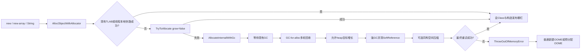
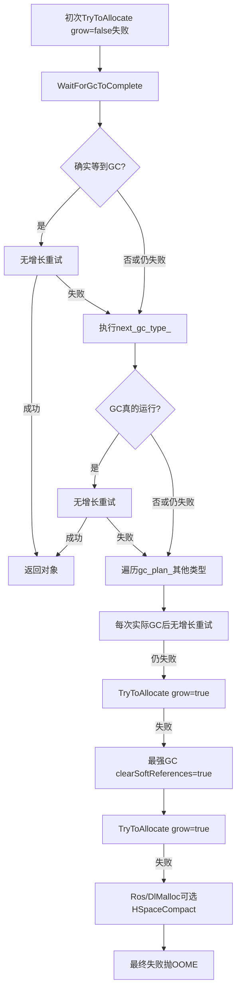
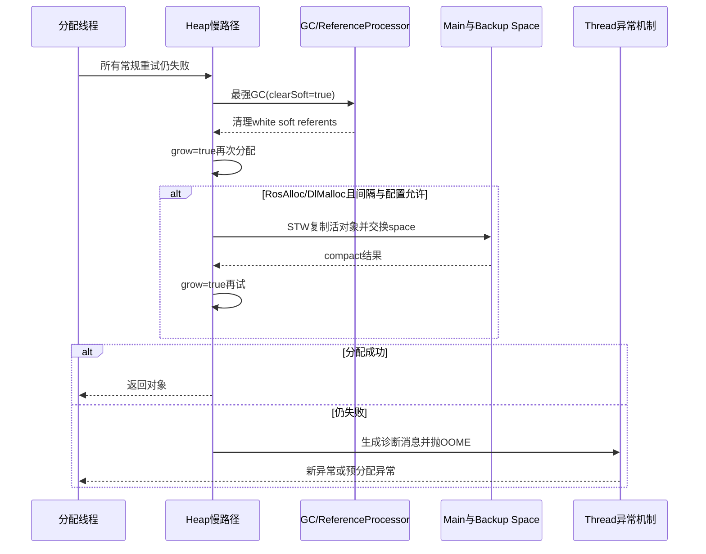

# 第582章 Android ART 对象分配失败与 OOME 慢路径：TryToAllocate、GC-for-alloc、Heap Growth、SoftReference 与同构压缩

> 源码基线：Android 11 / API 30 / `android-11.0.0_r48`。本章只在 macOS 阅读源码，不实际编译。阅读前最好先掌握第558章的对象分配总览、第573章的引用处理和第581章的 native 内存记账；本章只回答一个更窄的问题：一次普通 Java 对象分配返回空指针后，ART 到底按什么顺序自救，又如何在连异常对象都可能分配不出来时交付 `OutOfMemoryError`。

## 1. 先给结论：第一次分配失败不等于立刻 OOME

普通慢路径大致依次执行：等待正在运行的 GC 并重试、按 `next_gc_type_` 做一次 GC-for-alloc 并重试、遍历尚未尝试的 GC 类型并逐次重试、允许 `target_footprint_` 向 `growth_limit_` 增长后重试、用最强 GC 清理可清理的 SoftReference 后重试；malloc space 还可尝试一次受条件限制的同构空间压缩。所有办法都失败后，才构造并设置 OOME。

## 2. 本章先拆开五个容易混淆的“失败”

第一，当前 TLAB 不够，不代表 heap 不够；第二，超过当前目标 `target_footprint_`，不代表超过硬的 `growth_limit_`；第三，分配器返回 null 可能是碎片，而非总空闲字节不足；第四，GC 请求可能因为运行时状态没有真正执行；第五，慢路径返回 null 但没有 pending exception，可能只是 allocator 或 instrumentation 在暂停期间改变，需要从入口重来。

## 3. 参与者总图



## 4. 本章源码地图

入口和无 GC 尝试在 `art/runtime/gc/heap-inl.h`；完整失败阶梯、heap 目标、GC 等待、同构压缩和消息构造在 `art/runtime/gc/heap.cc`；声明与结果枚举在 `heap.h`；SoftReference 策略在 `art/runtime/gc/reference_processor.cc`；OOME 的线程级递归保护在 `art/runtime/thread.cc`；预分配异常在 `art/runtime/runtime.cc`；Java 异常类和回归测试分别在 `libcore/ojluni/.../OutOfMemoryError.java` 与 `art/test/080-oom-*`。

## 5. 从 `new` 到 heap 入口时已经知道什么

解释器、quick entrypoint 或反射最终会得到待分配的 `Class`、按对象布局计算出的 `byte_count` 和当前 allocator 类型。此处讨论的不是操作系统任意 `malloc`，而是 ART 管理 Java 对象空间的一次分配。不同入口在前面做过类初始化、数组长度或大小溢出检查，进入 heap 后才共享本章的核心策略。

## 6. `AllocObjectWithAllocator` 是协调者，不是单一分配器

它先处理 instrumentation 的 pre-allocation 回调，再判断大对象路径和线程本地快路；普通快路失败才调用 `TryToAllocate`，再失败才进入 `AllocateInternalWithGc`。所以在性能分析里看到一个 Java `new`，背后可能只是移动 TLAB 指针，也可能已经经历多轮 stop-the-world 或并发 GC。

## 7. 调试构建先检查分配前提

r48 在 debug build 中确认类和字节数合法、线程处于 `kRunnable`、当前允许 suspension 且没有 pending exception。还用 `StackHandleScope` 包住 `klass`，因为后续 GC 可能移动类对象。release 构建不一定保留这些昂贵检查，但调用约定仍必须成立。

## 8. PreObjectAllocated 甚至可以改大小

若启用 instrumentation 且 listener 提供 pre-alloc 回调，`byte_count` 以指针传入，因此监听器可能调整它。回调以后到实际分配前必须禁止线程暂停；一旦慢路径中发生允许暂停的操作，代码会重新发送 pre-alloc 事件，不能假设一次 Java 分配只收到一次该回调。

## 9. 已有 TLAB 的快路为何“不会失败”

如果请求大小不超过线程当前剩余 TLAB，`Thread::AllocTlab` 只是从已预留区域切下一段；这块区域在补充 TLAB 时已经整体向 heap 记账，因此对象级操作不再竞争全局 allocator。源码以 `DCHECK(obj != nullptr)` 表达这个局部不变量。

## 10. “TLAB 不够”只表示要换路

当前 TLAB 剩余空间小于对象大小时，`TryToAllocate` 会走 `AllocWithNewTLAB`，可能申请新 buffer，也可能对 RegionTLAB 退回非 TLAB 分配。旧 TLAB 的尾部浪费、申请新 TLAB 失败和全 heap 达到上限是不同问题，不能只凭一次 TLAB miss 宣判 OOME。

## 11. RosAlloc 还有一层线程本地快路

未 instrumented 且当前 allocator 为 RosAlloc 时，入口先试 `rosalloc_space_->AllocThreadLocal`。它与 TLAB 思路相似：优先消费线程本地可用块，减少锁和全局记账。只有这条路也拿不到对象，才进入统一的 `TryToAllocate`。

## 12. `TryToAllocate<..., false>` 的 false 到底是什么

第二个模板参数 `kGrow=false` 表示本轮不主动把非并发分配器的 `target_footprint_` 提高到新请求大小。它不等于“绝不分配”、也不等于“达到 growth limit”；若仍在当前目标内，或者并发 GC 配置允许跨过软目标，真实 allocator 仍会被调用。

## 13. `TryToAllocate` 自己绝不发起 GC

这个函数只做近似上限判断和 allocator 分派：BumpPointer、RosAlloc、DlMalloc、NonMoving、LOS、Region、TLAB 或 RegionTLAB。它返回 null 后，由上层决定是否等待或启动 GC。这种拆分让无 GC 的重试动作清晰，也避免 allocator 底层偷偷产生复杂暂停。

## 14. 一次失败可能发生在“调用分配器之前”

对多数 allocator，`IsOutOfMemoryOnAllocation` 若判断新 footprint 不被允许，`TryToAllocate` 会直接返回 null，根本没向空间索要连续块。RosAlloc 还按一次可能批量领取的最大字节检查，因此请求对象很小，也可能因补充 thread-local run 的批量成本先被软目标挡住。

## 15. 也可能是“调用分配器以后”失败

即使限制检查通过，空间内部仍可能找不到合适 block、run、region 或连续页。此时总空闲量也许不少，但形状不匹配；这正是后面 compact 和 fragmentation 日志存在的理由。容量判断与连续性判断是两层不同证据。

## 16. 三个 heap 数量必须分账

`num_bytes_allocated_` 近似表示当前计入的 Java 分配量；`target_footprint_` 是 GC 调度与是否允许继续长大的软目标；`growth_limit_` 是当前应用 heap 的增长上限。底层 reservation/capacity 还可能更大，不能把它们都翻译成“最大内存”。

## 17. `new_footprint <= target` 时直接允许

`IsOutOfMemoryOnAllocation` 读取当前 allocated 和 target，相加后若仍不越过 target 就返回 false，表示“不是因 footprint 策略而 OOM”。它仍不保证后续 allocator 成功，因为碎片或空间自身限制可能继续让分配返回 null。

## 18. `new_footprint > growth_limit` 才是明确越硬线

超过 growth limit 时，无论本轮 `grow` 是 true 还是 false，检查都返回 true。这只说明按近似记账不能再为请求扩张，不说明所有可回收对象都已处理；因此慢路径仍会尝试 GC、清软引用和可能的压缩。

## 19. 处于 target 与 growth limit 之间时分两类

若 allocator 可能配合并发 GC 且运行时使用并发 GC，r48 允许本次分配继续，期待并发回收追上增长；否则 `grow=false` 拒绝，`grow=true` 才通过 CAS 把 target 提到 `new_footprint`。所以同一字节数在不同 collector/allocator 下可能走不同路径。

## 20. 这个上限判断天生是近似的

源码明确指出多个线程会竞态，而且检查与真实分配不是一个原子事务。两个线程可能都依据旧数字通过，然后实际 footprint 略超；也可能一个线程 GC 后让另一个线程的旧判断失效。这里的量适合调度和保护，不是逐字节会计证明。

## 21. 大对象先走单独路径

当 `byte_count >= large_object_threshold_`，且类是 primitive array 或 `String`，`ShouldAllocLargeObject` 才选择 LOS。普通对象数组不进 LOS，因为 large object 可能不在 card table 范围内，而含引用对象需要写屏障/卡表正确覆盖。

## 22. 旧注释不能代替当前布尔表达式

r48 注释说需要 zygote space，但函数实际 return 表达式没有 `HasZygoteSpace()` 条件。学习源码时应把注释作为意图线索，再以可执行条件为版本事实；不能为了让文字顺眼，给当前代码补一个不存在的门槛。

## 23. LOS 失败后为什么清掉一次 OOME

`AllocLargeObject` 失败时已经设置异常，外层却清除它并回到 normal spaces 再试。原因是 LOS 的虚拟地址空间可能碎片化，而 main/non-moving space 恰好能放下对象；第一次 OOME 在此只是分支失败信号，不是最终对应用可见的结论。

## 24. LOS 回退意味着一次 `new` 可能跑两套昂贵慢路

先在 LOS 内经历回收并失败，清异常后又在普通 allocator 重试，最坏情况下会再次走 GC-for-alloc 阶梯。诊断大数组卡顿时，只数最终一次 OOME 会低估前面的工作；不过 primitive 大数组允许这种回退正是为了提高碎片场景下的成功率。

## 25. 进入 `AllocateInternalWithGc` 前的合同

调用线程必须没有 pending exception，`klass` 不能为空；函数记录原 allocator 是否等于当时的 current allocator，并用 handle 保护 class。它还保留“本次是否 instrumented”，因为后面的暂停点可能让全局分配入口发生变化。

## 26. 为什么暂停后要重新发送 pre-alloc 回调

宏 `PERFORM_SUSPENDING_OPERATION` 临时允许 thread suspension，执行等待、GC 或 compact，恢复后调用 `send_object_pre_alloc()`。暂停期间监听器可能被换掉，或者对象大小被新的 listener 调整；恢复后不能拿暂停前的回调状态直接继续。

## 27. 第一步只是等待“已经存在”的 GC

慢路径先调用 `WaitForGcToComplete(kGcCauseForAlloc)`。若另一个线程或 HeapTaskDaemon 正在收集，本线程进入 `kWaitingForGcToComplete` 并等待条件变量；若根本没有 collector running，while 循环不执行，调用可以几乎立即返回。

## 28. “先等待 GC”不等于每次失败都会阻塞

返回的 `last_gc` 初始为 `kGcTypeNone`。只有确实等过一轮收集并读到完成类型，代码才立即用 `grow=false` 重试。这避免一个刚完成的 GC 之后，本线程又无条件重复发起相同回收。

## 29. 等待为何会把现有收集标成 blocking

如果等待者不是 heap task 的工作线程，r48 把 `running_collection_is_blocking_` 设为 true。收集本身可能按“并发 GC”启动，但只要前台分配线程因它缺内存而等住，从应用体验角度这次收集已经造成 blocking allocation。

## 30. 超长等待如何留下诊断线索

`WaitForGcToCompleteLocked` 记录纳秒时长，累加 `total_wait_time_`；超过 `long_pause_log_threshold_` 时打印本次 cause、阻塞它的上一 GC cause 和时长。日志里的 “WaitForGcToComplete blocked” 是确实等待的证据，不应仅凭 “Alloc” GC 日志猜测。

## 31. 失败重试主阶梯



## 32. 第一轮主动 GC 用的是 `next_gc_type_`

等待现有 GC 仍未成功后，函数读取 `next_gc_type_` 到 `tried_type`，以 `kGcCauseForAlloc` 调 `CollectGarbageInternal`。它不是写死 full GC；该字段会根据 collector、上一轮结果、吞吐和当前目标动态变化。

## 33. `gc_plan_` 是候选序列，不是一套全局固定答案

MarkSweep/ConcurrentMarkSweep 配置通常是 sticky、partial、full；SemiSpace 使用 full；Concurrent Copying 可根据 generational 配置包含 sticky 与 full，并使用 Region/RegionTLAB allocator。实际 plan 在 `ChangeCollector` 里随 collector 配置建立，所以讲顺序时必须带版本和配置前提。

## 34. 为什么先试 `next_gc_type_`

最近的 GC 统计可能表明年轻/粘性回收成本低且足够，先用它有机会快速腾出空间；如果吞吐差、回收后仍超阈值，`GrowForUtilization` 又可把下一轮指向 non-sticky 类型。它是一种启发式，不是对象分配者知道哪批垃圾可回收。

## 35. 一次 GC 请求也可能没有运行

`CollectGarbageInternal` 能返回 `kGcTypeNone`：例如 partial GC 没有 zygote space、当前处理 stack overflow 且栈不足、moving GC 被 JNI critical 等机制禁用，或者 Runtime 正在 shutdown。调用点检查“返回值是否非 None”，不要把函数名出现等价成 GC 已执行。

## 36. 只有 GC 真运行后才立即重试该分支

首个 `tried_type` 以及后续 plan 中的每一类，均在返回 `gc_ran != kGcTypeNone` 后执行一次 `TryToAllocate<true,false>`。被跳过的 GC 没有改变 heap，马上做同样无增长尝试意义不大；代码因此继续向下一候选推进。

## 37. 为什么还要遍历其余 GC 类型

Sticky 只关注自上次 GC 后的分配区域，可能漏掉老区域垃圾；partial/full 覆盖范围更大，代价也更高。慢路径先跳过已经试过的 `tried_type`，再遍历 `gc_plan_`，让便宜尝试失败后仍有更强回收机会。

## 38. “多轮 GC”不是保证每种都执行一次

plan 可能只有一种类型；某类型也可能因前述运行条件返回 None；`next_gc_type_` 可能本就在 plan 中并被跳过。准确说法是“按候选调用并对实际运行者重试”，而非固定执行 sticky→partial→full 三连。

## 39. 前几轮为何不立即清 SoftReference

普通 GC 调用把 `clear_soft_references` 设为 false，希望在常规压力下保留一部分软可达缓存。SoftReference 的合同允许 GC 在内存压力下清理，但不要求平时尽量清空；先回收普通不可达对象通常更符合缓存价值和性能。

## 40. GC 都试过后，先给 heap 一个增长机会

慢路径调用 `TryToAllocate<true,true>`。这里的 `grow=true` 允许非并发策略在 target 与 growth limit 之间用 CAS 把 target 推到请求后的 footprint，然后调用 allocator。它仍然不能跨过 growth limit，也不能神奇修复碎片。

## 41. Heap Growth 不是向内核立刻申请一整块物理内存

`GrowForUtilization` 的源码注释直说：“doesn't actually resize any memory; it just lets the heap grow more”。target 增长主要改变下一次分配/GC 决策；真正的页提交、allocator 扩展和 RSS 变化取决于空间实现与后续访问。

## 42. `grow=true` 的 CAS 为什么需要循环

其他分配线程可能同时改变 `target_footprint_`。`compare_exchange_weak` 失败后会把观察值写回 `old_target`，while 重新读取 allocated、计算 footprint 并判断。它保证更新不会盲目覆盖别人的新目标，却仍保留近似并发记账语义。

## 43. Java 的 OOME 类本身很薄

以下逐字来自 `libcore/ojluni/src/main/java/java/lang/OutOfMemoryError.java`。它只是 `VirtualMachineError` 的一个异常类型；真正的回收阶梯和预分配兜底都在 ART native runtime 中。

```java
public class OutOfMemoryError extends VirtualMachineError {
    private static final long serialVersionUID = 8228564086184010517L;

    /**
     * Constructs an {@code OutOfMemoryError} with no detail message.
     */
    public OutOfMemoryError() {
        super();
    }

    /**
     * Constructs an {@code OutOfMemoryError} with the specified
     * detail message.
     *
     * @param   s   the detail message.
     */
    public OutOfMemoryError(String s) {
        super(s);
    }
}
```

## 44. 强 GC 清软引用是倒数第二层通用自救

增长仍失败后，r48 选择 `gc_plan_.back()`，以 `clear_soft_references=true` 再收集。通常 plan 尾部代表最强覆盖范围，但严谨表述应是“当前 plan 的最后一种 GC”，不要脱离配置硬说一定叫 full。

## 45. “清 SoftReference”清的不是所有 SoftReference 对象

ReferenceProcessor 在普通模式会先 `ForwardSoftReferences`，把要保留的 white referent 重新标记；强制清理模式跳过这一步。之后清除的仍是 referent 为 white 的软引用：强可达的 referent 不会因为它同时被 SoftReference 指向就被抹掉，SoftReference 包装对象也不等同于被全部销毁。

## 46. white 是可达性判定，不是对象颜色的永久属性

在本轮 tracing 中未被标记的对象称 white。清除动作把 Reference 的 referent 置空并进入 cleared-reference 后续链；它只描述这一轮 collector 的 mark 状态。下轮 GC 会重新建立相应状态，不能把 white 当 Java 对象长期字段。

## 47. 清软引用后为什么还要再 `grow=true` 重试

回收可能降低 `num_bytes_allocated_`，也可能让 allocator 得到更合适的空闲块；同时请求仍可能位于 target 和 growth limit 之间。因此重试既允许使用新释放空间，也允许重新提升软目标，但仍由硬上限与真实连续性共同裁决。

## 48. 这一步没有显式 `System.runFinalization()`

源代码在清 SoftReference 的强 GC 附近留有“TODO: Run finalization?”。GC 会识别带 finalizer 的 white 对象并将其安排到 finalization 队列，但分配线程不会在此等待任意用户 finalizer 全部运行后再保证重试。把 OOM 自救写成“GC→finalize→再分配”不符合 r48。

## 49. Finalizer 为什么不能轻易放在同步救援链

用户 finalizer 可能阻塞、加锁、再次分配甚至复活对象；让任意分配线程同步等待它会引入不可控延迟和死锁风险。ART 的 FinalizerDaemon 是异步消费者，所以“对象已安排 finalization”和“其资源已释放”是两个完成点。

## 50. 同构空间压缩只服务特定 malloc-space 场景

清软引用后仍失败，代码只对 `kAllocatorTypeRosAlloc` 或 `kAllocatorTypeDlMalloc` 考虑 `PerformHomogeneousSpaceCompact`。LOS、Region、NonMoving 和已有 TLAB 的问题不走这段；名称中的 homogeneous 指相同类型 malloc space 之间复制压缩，不是任意 heap 全部压成一块。

## 51. r48 的 OOM 同构压缩默认开关与间隔

内部选项 `EnableHSpaceCompactForOOM` 默认启用；命令行参数 `-XX:HspaceCompactForOOMMinIntervalMs=` 对应内部键 `HSpaceCompactForOOMMinIntervalsMs`，默认 100000ms，即 100 秒。它还受 heap 构造和 collector 配置约束；“默认 true”不等于所有设备、所有收集器、每次 OOM 都会执行。

## 52. Concurrent Copying 配置会关闭该 OOM 策略

Heap 构造中若 foreground collector 为 CC，会把 `use_homogeneous_space_compaction_for_oom_` 设为 false。CC 自身以 region/复制回收为核心，malloc-space 同构压缩路径不是它的标准 OOM 兜底。

## 53. 100 秒门槛使用严格大于

调用点计算当前时间减 `last_time_homogeneous_space_compaction_by_oom_`，只有严格大于最小间隔才尝试。等于 100000ms 仍不满足 `>`。阅读边界条件时，一个字符就可能解释线上偶发差异。

## 54. 被拒绝的尝试也会限流后续尝试

调用代码在进入 `PerformHomogeneousSpaceCompact` 之前就更新 last-time。即便因 moving GC 禁止计数、空间不可移动或 shutdown 被拒绝，接下来的 100 秒内也通常不会为 OOM 再尝试。这避免高压下每次分配都重复昂贵资格检查。

## 55. 同构压缩的先决条件

运行时需支持 collector transition/同构压缩，main space 与 backup space 必须满足配置，当前 main space 可移动，不能已有 moving-GC 禁止请求，且当前 collector 不能已是 moving collector。任一前提不成立都不能把普通 malloc heap 随意搬家。

## 56. 它开始前仍会等待已有 GC

`PerformHomogeneousSpaceCompact` 在 `gc_complete_lock_` 下调用 `WaitForGcToCompleteLocked`，串行化收集活动。随后设定 `collector_type_running_`，让其他 GC/分配等待者看见这次工作；这不是绕过全局 GC 协议的私有 memcpy。

## 57. 真正搬对象时需要 Stop-The-World

该路径使用 `ScopedSuspendAll`，选择 backup malloc space 为 to-space、当前 main space 为 from-space，再用 SemiSpace collector 复制活对象。对象地址会变化，所有 roots/引用必须在受控停顿中修复，所以它可能造成明显卡顿。

## 58. 为什么叫“同构”压缩

from-space 与 to-space 都是 malloc space，完成后交换 main/backup 的角色和所有权；这与把世代 young region 复制到另一类空间不同。目标是把分散活对象密排到新空间，留下可重新使用的大块连续区域。

## 59. OOM 救援不看前台 pause 偏好

后台计划的同构压缩会考虑 `CareAboutPauseTimes()`，但分配失败直接进入的 OOM 救援分支没有同样的 jank 门槛。此时运行时在“长暂停但可能活下来”和“立即 OOME”之间选择前者；日志分析应允许一次罕见长停顿。

## 60. 压缩后的收尾不只是交换指针

成功后还处理 references、调用 `GrowForUtilization`、记录 GC、`FinishGC` 并把待入队引用交给后续机制。只有整个 GC 协议结束，调用者才用 `grow=true` 再试原分配。不能在空间刚 swap 时就认为应用线程已安全恢复。

## 61. `count_delayed_oom_` 的名字容易误读

只有同构压缩成功且随后的分配也成功，计数才加一。它统计的是“这次压缩避免或推迟了 OOME”的次数，不是 OOME 被延迟了多少毫秒，更不是所有 compact 的执行次数。

## 62. 同构压缩和 OOME 交付图



## 63. 暂停期间 allocator 可能发生变化

collector transition 会改变 `GetCurrentAllocator()`。若进入慢路径时使用默认 allocator，暂停回来发现默认 allocator 已变，继续拿旧 allocator 分配会把对象放进不再匹配当前 entrypoint 的空间。因此函数返回 null 且不设置异常，请上层从 `AllocObject` 重新选择。

## 64. instrumentation 也可能在暂停期间打开

若原调用是 uninstrumented，而恢复后 heap 的 allocation entrypoints 已 instrumented，继续旧路径会漏事件。慢路径同样用“null + 无 pending exception”请求外层以安全默认 `AllocObject<true>` 重启，pre-alloc 事件也会按新状态发送。

## 65. null 不总是失败给 Java

外层收到 slow-path null 后先看 `self->IsExceptionPending()`：有异常才把 null 返回调用桥；没有异常则是上述状态切换信号，允许 suspension 后递归从新入口分配。这条分支非常关键，否则会把一次 collector 切换误报成 OOME。

## 66. 只有最终失败才调用 Heap 的异常构造

所有重试耗尽且 allocator/instrumentation 没要求重启时，`AllocateInternalWithGc` 调 `ThrowOutOfMemoryError(self, alloc_size, allocator)`。正常返回约定是 null 加 pending OOME；上层不会得到一个“类还没设好”的半成品对象。

## 67. OOME 消息中的第一组数字

消息格式以 “Failed to allocate a X byte allocation with Y free bytes and Z until OOM” 开头。X 是当前内部 `alloc_size`；Y 来自 `GetFreeMemory()`；Z 来自 `GetFreeMemoryUntilOOME()`。它们不是 Linux 全机可用内存，也不直接等于进程 RSS 余量。

## 68. `free bytes` 为什么可能大于请求仍失败

`GetFreeMemory()` 基于 heap 的总量记账，不能保证存在一个满足 alignment、space 类型和连续性的块。若 Y 大于等于 X，Heap 会让对应 AllocSpace 追加 fragmentation 诊断；典型结论是“总空闲够，但摆放不了这个形状”。

## 69. `until OOM` 与 target 余量也不是一回事

`GetFreeMemoryUntilOOME()` 以 growth limit 减 allocated；`GetFreeMemoryUntilGC()` 则以 target footprint 减 allocated。前者接近还能长到硬线的空间，后者接近当前调度目标余量。日志同时打印 target footprint 与 growth limit，正是让两条边界可区分。

## 70. 哪些 allocator 会追加碎片说明

r48 为 NonMoving 选 non-moving space；RosAlloc/DlMalloc 选 main space；BumpPointer/TLAB 选 bump-pointer space；Region/RegionTLAB 选 region space。LOS 在这段 switch 中没有映射到 `AllocSpace`，所以不能期待所有 LOS OOME 都带相同格式的 largest-contiguous 诊断。

## 71. Heap 最后把消息交给 `Thread`

`Heap::ThrowOutOfMemoryError` 只负责 heap 语境与消息；`Thread::ThrowOutOfMemoryError` 打印 warning 和进程 VmSize，再决定正常构造异常还是用预分配实例。这一分层也说明 OOME 类型不只服务 Java heap，其他资源失败也能直接调用线程异常机制。

## 72. 正常构造 OOME 本身也需要内存

第一次进入时，线程设置 TLS 标志 `throwing_OutOfMemoryError=true`，调用 `ThrowNewException` 解析/初始化类、分配异常对象与 message String、运行构造器并建立栈迹。这些步骤都可能再次分配，于是产生“为了报告没内存，还需要内存”的递归困境。

## 73. TLS 递归标志解决 double-OOME

若构造 OOME 期间再次调用同一函数，标志已为 true；代码不再递归构造，而是 dump 当前线程帮助诊断，然后直接设置 `GetPreAllocatedOutOfMemoryErrorWhenThrowingOOME()`。预分配实例没有现场栈迹，所以额外日志尤其重要。

## 74. Runtime 准备了三种 OOME 储备

一份用于“抛其他异常时内存不足”，一份用于“抛 OOME 时再次 OOM”，一份用于“处理 stack overflow 时不能安全跑构造器”。有 boot image 时从 image roots 读取；没有时在 Runtime 初始化早期创建。三者用途和固定消息不同，不能统称一个全局单例。

## 75. 预分配异常为什么绕开普通构造器

`CreatePreAllocatedException` 先找系统类，用 `klass->Alloc` 在不初始化该类的方式下拿对象，再直接写 `Throwable.detailMessage`。源码明确说这是为了允许 Throwable 有非平凡 `<clinit>`；在兜底阶段不依赖完整 Java 构造链更可靠。

## 76. 预分配 OOME 为什么通常没有现场 stack trace

它们在 Runtime 初始化或 boot image 生成阶段就存在，不是在真实失败现场创建；固定 detail message 也注明 “no stack trace available”。所以看到无栈 OOME 不能断言 ART 丢日志，应结合前面的 Thread dump/warning 与失败上下文。

## 77. stack overflow 中的 OOME 是另一条特别短的路

Heap 发现线程正在处理 stack overflow 时，直接设置专用预分配 OOME，不尝试运行异常构造器，因为当前栈已经不足。这里的 OOME 可能是“处理栈溢出时又无法分配”，不要仅凭异常类把根因归结为 Java heap 泄漏。

## 78. 回归测试如何在 OOME 后继续执行

以下逐字来自 `art/test/080-oom-throw/src/Main.java`。它从大数组开始，捕获 OOME 后把请求减半，因此可在有限 heap 中逐步填充并保留一个结果数组；这是一种 runtime 测试策略，不是业务缓存的推荐算法。

```java
    public static Object eatAllMemory() {
        Object[] result = null;
        int size = 1000000;
        while (result == null && size != 0) {
            try {
                result = new Object[size];
            } catch (OutOfMemoryError oome) {
                size /= 2;
            }
        }
        if (result != null) {
            int index = 0;
            while (index != result.length && size != 0) {
                try {
                    result[index] = new byte[size];
                    ++index;
                } catch (OutOfMemoryError oome) {
                    size /= 2;
                }
            }
        }
        return result;
    }
```

## 79. 捕获 OOME 后为什么偶尔还能分配小对象

失败的是特定大小、特定 allocator、特定连续性需求下的请求。缩小请求后可能适配零散 free block；异常处理和前一轮 GC 也可能改变 live set。一次大对象 OOME 不逻辑蕴含下一次所有小对象都必失败。

## 80. 但业务代码不应把 OOME 当正常流控

捕获动作、日志拼接、栈迹和恢复逻辑都可能继续分配；heap 也可能处于严重抖动。测试能刻意控制根集合与请求大小，生产业务通常无法证明系统恢复到安全状态。更可靠的策略是提前设预算、流式处理、限制缓存并在边界处降级。

## 81. 碎片测试刻意制造“有空页但缺大块”

以下逐字来自 `art/test/080-oom-fragmentation/src/Main.java`。先分配略大于一页的对象数组填满 heap，再释放这些引用，最后申请更大的对象数组；测试目标是验证 allocator 能正确合并空闲页，而不是验证 LOS，因为对象数组本身不符合 r48 的 LOS 类型条件。

```java
    public static void main(String[] args) {
        // Reserve around 1/4 of the RAM for keeping objects live.
        long maxMem = Runtime.getRuntime().maxMemory();
        Object[] holder = new Object[(int)maxMem / 16];
        int count = 0;
        try {
            while (true) {
                holder[count++] = new Object[1025];  // A bit over one page.
            }
        } catch (OutOfMemoryError e) {}
        for (int i = 0; i < count; ++i) {
            holder[i] = null;
        }
        // Make sure the heap can handle allocating large object array. This makes sure that free
        // pages are correctly coalesced together by the allocator.
        holder[0] = new Object[(int)maxMem / 8];
    }
```

## 82. 测试注释里的 large object 不等于 ART LOS object

这里 “large object array” 是自然语言里的“大数组”；元素是对象引用，`Class::IsPrimitiveArray()` 为 false，所以 `ShouldAllocLargeObject` 不会因此选择 LOS。这是阅读测试时非常典型的词义陷阱：测试意图、Java 类型和 allocator 名称必须分别核实。

## 83. `Runtime.maxMemory()` 在 ART 中对应什么

Java Runtime 的最大 heap 语义最终接近 `Heap::GetMaxMemory()`，r48 返回 allocated 与 growth limit 的较大者。正常情况下是 growth limit；若近似并发分配造成罕见 overshoot，则不能向 Java 报一个小于已经分配量的“最大值”。

## 84. 数组大小溢出可以在进入本章慢路径前抛 OOME

32 位目标上，数组长度乘组件大小再加 header 可能溢出 `size_t`/可表示对象大小。`ComputeArraySize` 返回 0 时，array alloc 入口直接用包含 length 的消息抛 OOME。此时根因是对象尺寸不可表示，不是先跑遍 GC-for-alloc。

## 85. 负数组长度不是 OOME

负数 length 属于 Java 语义错误，入口抛 `NegativeArraySizeException`。正的超大长度可能因大小计算溢出或超 heap 限制成为 OOME。诊断时先看异常类型与消息，别把所有 `new T[n]` 失败并成一个分支。

## 86. String 也有独立的尺寸溢出检查

String 分配根据压缩状态、字符数和 header 计算对象大小；若运算溢出，同样可以直接调用线程 OOME。它与“String 达到 large object threshold 后优先 LOS”是先后两个判断：不可表示的大小没有必要进入空间选择。

## 87. 并非所有 OOME 都来自 Java heap

创建 native thread stack 失败、某些 Unsafe/native 资源分配失败，也可用 OOME 表达资源耗尽。`art/test/202-thread-oome` 就测试线程创建/栈资源场景。看到 OOME 后应先读取 detail message、日志与调用点，而不是直接启动 Java heap 泄漏结论。

## 88. `System.gc()` 也不等于本章 GC-for-alloc

显式 GC 使用不同 `GcCause`，调度、日志和是否阻塞的语境不同。本章分配线程因拿不到对象而触发 `kGcCauseForAlloc`，优先级是尽快满足当前请求；它还会继续走 grow、soft clear 和 compact 等失败阶梯。

## 89. `GrowForUtilization` 如何为下一轮设置 target

非 sticky GC 后，它按 live bytes 与目标利用率计算 delta，再夹在 `min_free_` 和 `max_free_` 之间，乘前台增长系数后得到 target，并把 `next_gc_type_` 先设为 sticky。目标是让应用获得一段分配余量，又避免 heap 无限保留空闲。

## 90. 前台增长系数的意义

`HeapGrowthMultiplier()` 在不关心 pause time 的后台状态返回 1.0；前台返回 `foreground_heap_growth_multiplier_`。前台可允许更多 free headroom，从而减少用户可感知的 GC 频率；这不是把硬的 growth limit 同倍扩大。

## 91. sticky GC 后不一定继续 sticky

代码比较当前 sticky 的估计吞吐与 non-sticky collector 的历史均值，还检查 allocated 是否未越过相关 target。若 sticky 足够高效且能控制堆，就继续 sticky；否则选 non-sticky。`next_gc_type_` 是反馈结果，不是固定轮询指针。

## 92. GC 后 target 也可能收缩

若 live bytes 加调整后的 max-free 仍小于旧 target，代码把 target 降到 live+headroom；否则至少保留当前 allocated 或旧 target。Heap growth policy 同时包含“允许增长”和“回收后收缩目标”，名字不能只按单向增长理解。

## 93. 并发 GC 的启动线与 target 相关但不同

成功分配后 `CheckConcurrentGCForJava` 比较 `new_num_bytes_allocated` 与 `concurrent_start_bytes_`。`GrowForUtilization` 会根据预计回收期间分配量预留提前量，设置下一次并发启动位置。目标是让 GC 在撞 growth limit 前完成，而非等真正 OOM 才开始。

## 94. 为什么已有 TLAB 内每个对象不更新全局字节

线程领取 TLAB 时已把整块 `bytes_tl_bulk_allocated` 计入全局；块内每次切对象若再累加会重复记账。因此对象成功不一定让 global counter 当场增加，触发并发 GC 的精确时点可能落在领取新 TLAB，而不是每条 `new`。

## 95. 成功后还要先安装 Class

allocator 给出的只是原始对象内存。入口随后 `SetClass(klass)`；non-moving 特例在特定 collector 配置下还需为 class field 做写屏障。GC 识别对象布局依赖 class，未完成这一步的内存不能作为正常 Java 对象发布。

## 96. pre-fence visitor 与构造器发布栅栏

pre-fence visitor 在禁止 suspension 的区域运行，随后 `QuasiAtomic::ThreadFenceForConstructor()` 建立发布顺序。这里的 constructor fence 不是调用 Java 构造函数本身，而是确保初始化/元数据写入在对象对其他线程可见前具有正确内存顺序。

## 97. OOME 前不会把半初始化对象交给 Java

所有失败返回都发生在对象有效发布前；最终 null 携带 pending exception。若拿到 raw block 后后处理成功，才进行统计、对象跟踪、allocation listener、allocation stack 记录与并发 GC 检查。调用者不会收到一个 class 未设或 fence 未完成的引用。

## 98. GC 日志里 `Alloc` 应怎样读

它表示 cause 是 allocation failure/pressure，不自动说明最终 OOME，也不说明第一个请求等到整轮 GC。要结合 “freed ...”、pause/total、collector 类型、是否出现 wait 日志、随后是否有 OOME warning，以及目标/上限数字还原链路。

## 99. 一次 Java `new` 的耗时可能来自别人启动的 GC

第一步等待已有 collection 时，本线程没有成为 GC 发起者，却要承担尾部等待延迟。性能 trace 中应沿条件变量等待与 running collector 对齐；只查“本线程是否调用 CollectGarbageInternal”会漏掉这种关联。

## 100. moving GC 被禁止的常见原因

JNI critical 区、显式 disable moving GC 计数或运行时内部临界状态会阻止对象搬迁。此时请求 moving collector 可返回 None，同构压缩也会被拒绝。长时间持有 critical 指针可能间接削弱 OOM 自救能力，但不能仅凭一次失败就断言具体 JNI 调用有错。

## 101. stack overflow 会让 GC 请求也可能跳过

若线程正处理 stack overflow 且当前栈空间不足，进入复杂 collector 代码可能继续溢出，`CollectGarbageInternal` 有保护分支返回 None。后面异常交付也使用专门预分配 OOME，这体现“资源不足时少做事”的一致原则。

## 102. Runtime shutdown 时为何不再强行 GC

虚拟机退出过程中线程、daemon、类链接器或 heap 组件正在拆除，再启动完整 GC 可能与销毁顺序冲突。返回 None 是生命周期保护，不是 collector 报告“没有垃圾”。调用者必须以函数结果区分“没回收到”和“压根没运行”。

## 103. SoftReference 不是可靠的业务缓存预算器

清理策略由 VM 和内存压力决定，r48 普通模式甚至有 TODO 希望未来更聪明。应用不能依赖某个精确阈值、LRU 顺序或清理时间；需要可预测命中率和上限时，应自己维护有明确 byte budget 的强引用缓存。

## 104. 同构压缩也不是内存泄漏修复器

它能改善 free block 的形状，却不能删除仍被 roots 强引用的对象。若 live set 已逼近 growth limit，复制后依然没有足够总量，重试马上失败；这类问题应查支配树、泄漏引用链和对象保留量，而非反复要求 compact。

## 105. “还有 free bytes”为何也可能无解

除碎片外，请求还受 allocator 类型、alignment、large-object 地址范围、non-moving 限制、region 状态和批量 TLAB 成本影响。日志中的单个 aggregate 数字不能替代空间级统计。最小可行诊断至少要同时看请求大小、allocator/collector、target、growth limit 与连续块信息。

## 106. 读 OOME 消息的建议顺序

先判资源类别：Java object、array overflow、thread creation 还是 native；再读 requested bytes；然后比较 free bytes 与 requested 判断碎片可能性；比较 until OOM、target footprint、growth limit 判断软目标还是硬线；最后结合 GC 前后 live bytes 判断泄漏、突发峰值或连续性问题。

## 107. 常见误解一：第一次 null 就是 OOME

错误。第一次 null 只是当前无增长尝试或 allocator 失败；后面可能等现有 GC、多种 GC、增长目标、清软引用和压缩。甚至慢路径最终 null 且无异常时，也只是要求因 allocator/instrumentation 改变而重启。

## 108. 常见误解二：full GC 一定让所有 SoftReference 变 null

错误。是否清 soft 由单独布尔参数控制，普通 full GC 也可先 preserve 部分 white soft referent；强可达 referent 仍会存活。OOM 阶梯明确使用 `clear_soft_references=true` 的最后 plan GC，才跳过 preserve 阶段。

## 109. 常见误解三：growth limit 是一块已经提交的连续内存

错误。它是 heap policy 上限；target 是当前软目标；空间的映射、页提交、free lists/regions 再决定真实能否摆下对象。把 policy byte count 当成连续地址范围，会错误解释碎片 OOME。

## 110. 常见误解四：OOME 对象总能带完整消息和栈

错误。正常路径会努力新建异常，但 double-OOME、抛其他异常时 OOM、处理 stack overflow 都可能使用预分配实例；它们带固定消息且无现场栈。Thread 会在 double-OOME 分支主动 dump，诊断时应同时收集 native/runtime 日志。

## 111. 四个只读练习说明

下面练习只使用 `rg`、`sed`、`awk`、`cmp` 等 macOS 常见命令读取 `/Users/ninebot/androidSource`，临时文件仅放在 `mktemp -d` 创建的目录并由 trap 清理；不编译、不改源码。每段可独立复制执行，退出码 0 表示断言成立。

## 112. 练习一：定位快路、无 GC 尝试与慢路径连接点

```bash
set -eu
REPO=/Users/ninebot/androidSource
FILE="$REPO/art/runtime/gc/heap-inl.h"
test -f "$FILE"
rg -n 'AllocObjectWithAllocator|TryToAllocate<kInstrumented, false>|AllocateInternalWithGc' "$FILE"
rg -q 'AllocTlab can.t fail' "$FILE"
rg -q 'allocator or instrumentation changed' "$FILE"
```

先观察三类调用所在行，再验证已有 TLAB 的局部不变量和“状态改变后重启”注释。这里故意不把行号写死，以免同一 r48 工作树的空白补丁影响练习；文件内容关键词才是证据。

## 113. 练习二：恢复 GC-for-alloc 的关键顺序

```bash
set -eu
REPO=/Users/ninebot/androidSource
FILE="$REPO/art/runtime/gc/heap.cc"
START=$(rg -n '^mirror::Object\* Heap::AllocateInternalWithGc' "$FILE" | cut -d: -f1)
END=$((START + 180))
sed -n "${START},${END}p" "$FILE" | rg 'WaitForGcToComplete|CollectGarbageInternal|TryToAllocate<true, true>|PerformHomogeneousSpaceCompact|ThrowOutOfMemoryError'
for MARK in 'WaitForGcToComplete' 'CollectGarbageInternal\(gc_plan_\.back\(\), kGcCauseForAlloc, true\)' 'ThrowOutOfMemoryError'; do
  sed -n "${START},${END}p" "$FILE" | rg -q "$MARK"
done
```

输出从等待、主动收集、允许增长、清软引用、可选压缩到最终异常。断言采用关键锚点，不宣称每个 collector 配置都会真正执行所有分支。

## 114. 练习三：区分普通 SoftReference 保留与 OOM 清理

```bash
set -eu
REPO=/Users/ninebot/androidSource
REF="$REPO/art/runtime/gc/reference_processor.cc"
HEAP="$REPO/art/runtime/gc/heap.cc"
rg -n 'if \(!clear_soft_references\)|ForwardSoftReferences|ClearWhiteReferences' "$REF"
rg -n 'clear_soft_references=.true|gc_plan_\.back\(\)' "$HEAP"
test "$(rg -c 'ForwardSoftReferences\(collector\)' "$REF")" -eq 1
test "$(rg -c 'soft_reference_queue_\.ClearWhiteReferences' "$REF")" -ge 2
```

第一组显示 preserve 只在 `!clear_soft_references` 下发生；后面的 clear 仍针对 white referent。两次 soft clear 分别位于 finalizer 处理前后，提醒我们引用处理不是一个单行“清缓存”动作。

## 115. 练习四：逐字核对本章三段 Java 源码

```bash
set -eu
REPO=/Users/ninebot/androidSource
TMP_DIR=$(mktemp -d)
trap 'rm -rf "$TMP_DIR"' EXIT
OOME="$REPO/libcore/ojluni/src/main/java/java/lang/OutOfMemoryError.java"
EAT="$REPO/art/test/080-oom-throw/src/Main.java"
FRAG="$REPO/art/test/080-oom-fragmentation/src/Main.java"
sed -n '/^public class OutOfMemoryError/,/^}$/p' "$OOME" > "$TMP_DIR/oome.java"
sed -n '/^    public static Object eatAllMemory()/,/^    }$/p' "$EAT" > "$TMP_DIR/eat.java"
sed -n '/^    public static void main(String\[\] args)/,/^    }$/p' "$FRAG" > "$TMP_DIR/frag.java"
test "$(wc -l < "$TMP_DIR/oome.java" | tr -d ' ')" -eq 20
test "$(wc -l < "$TMP_DIR/eat.java" | tr -d ' ')" -eq 23
test "$(wc -l < "$TMP_DIR/frag.java" | tr -d ' ')" -eq 17
rg -q 'extends VirtualMachineError' "$TMP_DIR/oome.java"
rg -q 'size /= 2' "$TMP_DIR/eat.java"
rg -q 'new Object\[1025\]' "$TMP_DIR/frag.java"
```

该练习用源码的结构边界重新提取三个连续片段，并核对行数和关键语句。本章代码块若被排版工具误删一行，行数或关键词断言会立即暴露差异。

## 116. 练习预期与阅读问题

四段命令都应以 0 退出；第112—114节会打印带源码行号的锚点，第115节成功时保持安静。做完请口头回答：为什么第一次 wait 可能不阻塞？为什么 `grow=true` 仍可能失败？为什么清 soft 不等于删除所有 SoftReference？为什么慢路径 null 有时不能转成 OOME？

## 117. 生成后复读：本章已主动修正的歧义

复读时已把“先等并发 GC”改成“等待任意正在运行的 GC”，因为函数不限定 collector 是否并发；把“执行所有 GC 类型”改成“按 plan 调用，可能返回 None”；把“扩大 heap”改成“提高软 target”；把“清空 SoftReference”改成“跳过 preserve 并清 white referent”；把“压缩失败后抛 OOME”补成“仅 malloc allocator、配置和时间条件满足时才尝试”。

## 118. 本章仍需保留的版本边界

本文只承诺 Android 11 r48：collector plan、默认 allocator、并发/分代策略、OOME 文案和压缩选项都可能在新版本改变。尤其不能把 r48 的 RosAlloc/DlMalloc 同构压缩、100 秒默认间隔或三份预分配异常直接外推到任意 Android 版本和厂商 Runtime。

## 119. 一页记忆卡

记住三条线：allocated 是近似当前量，target 是软目标，growth limit 是硬上限。记住五级救援：等现有 GC、跑计划 GC、允许 target 增长、强 GC 清 white soft referent、特定 malloc space 压缩。记住最后一个反直觉：null 加无异常是重启信号；null 加 pending OOME 才是对 Java 的失败交付。

## 120. 下一章预告

第583章继续纵向进入 Concurrent Copying：RegionSpace 怎样区分 from-space/to-space、Baker read barrier 怎样在并发搬迁时把旧引用导向新对象、flip 如何切换线程根与分配区、evacuation/fallback 又如何处理 region 失败。这样可解释本章为何 CC 不依赖 malloc-space 的同构压缩兜底。
