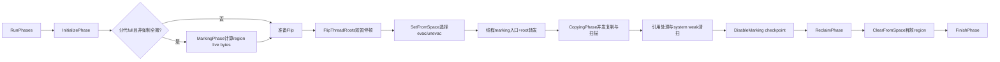
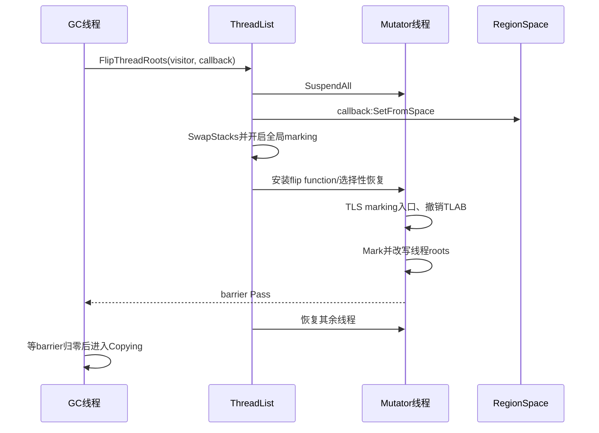
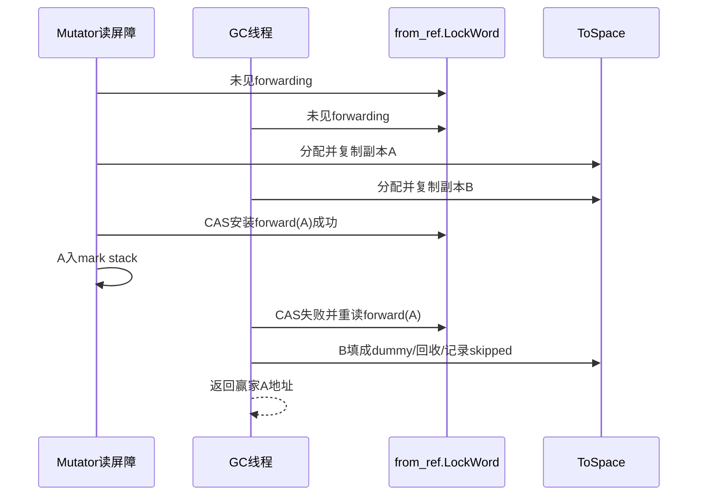

# 第583章 Android ART Concurrent Copying：RegionSpace、Baker Read Barrier、Flip、对象转发、Evacuation 与 Fallback

> 源码基线：Android 11 / API 30 / `android-11.0.0_r48`。本章只在 macOS 阅读源码，不实际编译。第582章解释了普通对象分配失败后为什么会选择不同 GC；本章继续进入 CC 收集器内部，回答“应用线程还在读对象时，GC 怎样搬对象而不把旧地址交给应用”。

## 1. 先给出整章答案

Concurrent Copying（CC）先按配置进行并发标记或直接进入 flip，在一次短暂停顿中把 RegionSpace 的旧 region 分类为要搬的 from-space 与原地保留的 unevacuated from-space，同时让各线程进入 GC-marking 模式并转发线程 roots。暂停结束后，GC 线程和 mutator 都可通过读屏障协助把 from-space 对象复制到 to-space；旧对象的 LockWord 保存唯一 forwarding address。最终所有可见引用都指向 to-space/原地存活对象，再回收 evacuated region。

## 2. “Concurrent” 不等于完全没有 Stop-The-World

CC 的大量扫描与复制能和 mutator 并行，但 `FlipThreadRoots` 中仍要 suspend all，以原子地切换 region 角色、marking 状态与 root 处理协议；可选的 no-from-space 验证也会暂停。正确理解是“缩短并集中必要暂停”，不是“应用线程永不停止”。

## 3. 先分清四组概念

region 的 `RegionState` 描述 free、普通 allocated、large 首 region、large tail；`RegionType` 描述本轮 GC 中的 from、unevac-from、to 或 none。对象的 Baker read-barrier state 描述 gray/non-gray；bitmap 又记录标记事实。它们维度不同，不能把“gray 对象”等同于“from-space 对象”。

## 4. CC 全阶段总图



## 5. 本章源码地图

主流程位于 `art/runtime/gc/collector/concurrent_copying.cc`，高频 `Mark`/读屏障慢路在 `concurrent_copying-inl.h`；region 状态、分配和回收在 `art/runtime/gc/space/region_space.h/.cc/-inl.h`；通用读屏障在 `art/runtime/read_barrier-inl.h`；对象字段读取在 `art/runtime/mirror/object-inl.h`；flip 调度在 `art/runtime/thread_list.cc`；Java 压测在 `art/test/160-read-barrier-stress`。

## 6. CC 与 RegionSpace 是配套关系

`Heap::ChangeCollector(kCollectorTypeCC)` 把普通分配器切到 Region 或 RegionTLAB；若启用分代 CC，`gc_plan_` 可包含 sticky 和 full，否则只有 full。CC 的复制目标不是第582章 RosAlloc 的 backup malloc space，而是同一个 RegionSpace 中当前标为 to-space 的空闲 region。

## 7. r48 代码支持不止一种读屏障形态

`read_barrier_config.h` 根据构建宏选择 Baker、Brooks 或 table lookup，其中 Brooks 分支仍标为未实现；`ConcurrentCopying::RunPhases` 要求 Baker 或 table lookup。本文重点讲 Baker，因为它直接利用对象 LockWord 中的 read-barrier bit；不要把编译期支持误写成任意运行时动态切换。

## 8. `RunPhases` 是阅读主轴

函数依次设置 collector active，执行 Initialize；特定分代 full GC 先做 Marking；必要时启用 read-barrier entrypoints 并 gray immune objects；然后 Flip、Copying、可选验证、Reclaim、Finish。最后才清 active 和 `thread_running_gc_`。

## 9. active 与 marking 不是同一开关

`is_active_` 覆盖本次 CC 从开始到结束；`is_marking_` 在 flip callback 中开启，在 copying 尾部通过 checkpoint 关闭。读屏障是否需要真正 Mark 还检查线程本地 `GetIsGcMarking()`。因此 collector 已 active 时，线程也不一定正处于可产生 mark work 的阶段。

## 10. Initialize 先清理上一轮临时状态

它记录 GC 前 allocated bytes，确认 mark stack 为空，重置 read-barrier 慢路测量、moved 计数、immune spaces、skipped-block 状态相关标志，并根据 cause 计算 `force_evacuate_all_`。这些是一次 collection 的会话状态，不是长期 heap 属性。

## 11. 哪些空间不会被 CC 搬动

retention policy 为 never/full-collect 的 ImageSpace 和 ZygoteSpace 被加入 `immune_spaces_`。它们不参与 RegionSpace evacuation，但其内部字段仍可能指向会移动的对象，所以需要 mod-union/card 与 gray immune object 协议更新出边。

## 12. NonMovingSpace 与 LOS 也不等于 immune

non-moving 对象地址不变，但仍需 bitmap 标活、扫描字段和处理其指向的移动对象；LOS 在 CC 中也通过 large-object bitmap 管理。immune 的含义是本轮无需普通 tracing/sweeping 的特定只读/共享空间，不是“所有不搬地址的对象”。

## 13. RegionSpace 的固定粒度

r48 `RegionSpace::kRegionSize` 为 256 KiB，创建映射时额外申请一个 region 以便把起止地址对齐。一个普通 region 可容纳多个对象；超过 region size 的 RegionSpace large allocation 占连续多个 region，首块与 tail 用不同 state 记录。

## 14. RegionState 回答“物理占用形态”

`kRegionStateFree` 表示可分配；`Allocated` 是普通 bump/TLAB 区；`Large` 是跨 region 对象的首块；`LargeTail` 是后续块。large tail 没有独立对象起点，遍历、回收和 evacuation 决策必须跟随首块，不能当普通 region 单独处理。

## 15. RegionType 回答“本轮 GC 角色”

`ToSpace` 可被应用新分配或接收复制对象；`FromSpace` 要把活对象搬走并在尾部整体清除；`UnevacFromSpace` 让活对象原地保留但仍需标记/扫描；free region 对应 `None`。同一 allocated state 可在一轮内从 to 变成 from，再在回收后变 free。

## 16. 正常分配为什么最多先用一半 region

`AllocateRegion(for_evac=false)` 在 `(num_non_free_regions_ + 1) * 2 > num_regions_` 时拒绝给 mutator 新 region，尽量为 GC evacuation 预留另一半。它不是精确保证所有 live bytes 都能复制成功，但能显著减少 to-space 被应用分配吃光的风险。

## 17. evacuation 分配不受“一半”门槛约束

`for_evac=true` 会继续搜索任意 free region，并增加 `num_evac_regions_`；它不把新 region 标成 `newly_allocated`。这样 GC 复制目的地不会在下一次 region 选择中被误当成 mutator 刚产生、预计垃圾率较高的年轻区域。

## 18. `current_region_` 与 `evac_region_` 分开

前者服务普通 mutator bump allocation，后者服务 GC/读屏障复制。`SetFromSpace` 完成分类时把两者都指向 `full_region_` 哨兵，迫使后续分别重新领取符合新角色的 region，避免在已变成 from-space 的旧尾部继续写对象。

## 19. TLAB 在 flip 时必须撤销

每线程 TLAB 可能只用了一部分，而其所在 region 即将成为 from-space。`ThreadFlipVisitor` 调 `RevokeThreadLocalBuffers(thread, reuse=false)`，明确不复用剩余部分；否则应用恢复后会继续往旧 from-space 分配，破坏“新对象都在 to-space”的核心不变量。

## 20. 普通新 region 为什么标为 newly allocated

非 evacuation 领取成功会 `SetNewlyAllocated()`。这给下次 GC 一个简单的 generational 信号：新 region 往往死亡率高，优先 evacuation 更划算。它记录的是“从上轮 GC 开始之后分配”，不是 Java 对象年龄字段。

## 21. CC 有一阶段和两阶段路径

`RunPhases` 只在“启用 generational CC、当前不是 young collection、并且没有 force-evacuate-all”时，先执行独立 `MarkingPhase` 计算 region live bytes，然后再 flip；其他路径直接 flip 后边复制边发现可达对象。两阶段是特定优化，不是所有 CC 的固定模板。

## 22. 什么会强制全部 evacuation

`force_evacuate_all_` 只有在“未启用 generational CC，或当前不是 young collection”这一外层条件成立，并且 cause 又是 explicit、collector transition 或当前要求 clear soft references之一时，才设为 true。也就是说，普通非分代 GC 不会仅因“非分代”自动全搬，分代 young GC 也不会进入强制全搬。

## 23. 两阶段 MarkingPhase 先算什么

它把非新 region 的 live bytes 清零，扫描 immune spaces、concurrent/non-thread roots，再用 checkpoint 捕获 thread roots，处理 mark stack；遇到 RegionSpace 对象时给其 region 累加对齐后的 live bytes。这些统计随后决定哪些旧 region 值得搬。

## 24. 标记阶段不会先复制对象

两阶段 marking 使用 bitmap 和扫描栈建立 live 信息，region 在 flip 前仍统一是当时的 to-space 角色。只有 flip 决定某 region 是 evacuated from-space 后，后续 `Mark` 才会对其中对象执行 `Copy`。把 pre-marking 叫“预复制”是错误的。

## 25. thread roots 为什么用 checkpoint 捕获

每个线程最清楚自己的栈、寄存器和 TLS roots。`CaptureThreadRootsForMarking` 发 checkpoint，让目标线程运行或由 GC 代表已挂起线程访问其 roots，再撤销线程本地 mark stack。barrier 确认所有目标完成后，GC 才能相信 live-byte 统计覆盖了根集合。

## 26. inter-region bitmap 记录什么

分代两阶段扫描对象时，只要 holder 指向不同 RegionSpace region，就在 region-space inter-region bitmap 记 holder；non-moving holder 指向 RegionSpace 时也有对应 bitmap。它辅助 young/full 的跨区引用扫描，不能替代对象存活 bitmap。

## 27. Card table 解决并发写造成的遗漏

marking 期间 mutator 可能给已扫描对象写入尚未标记的 referent。写屏障把对应 card 置脏；copying phase 再扫描 dirty card，维持“不存在 black-clean 指向 white”的不变量。读屏障负责读取时修正，card/write barrier 负责让 GC 不漏掉并发更新，两者互补。

## 28. flip 前如何选择 evacuation mode

young GC 使用 `kEvacModeNewlyAllocated`；full 且 force-all 使用 `kEvacModeForceAll`；其余使用 `kEvacModeLivePercentNewlyAllocated`。这个 mode 由 `FlipCallback` 在 mutator lock 独占、所有线程暂停的窗口里选择。

## 29. 新分配的普通 region 总是优先搬

`ShouldBeEvacuated` 对 newly allocated 且 state 为普通 Allocated 的 region 返回 true，体现“新对象更可能早死”的朴素分代假设。源码也留 TODO，希望以统计验证这个假设；它是启发式，不是 Java 规范保证。

## 30. 75% 阈值使用严格小于

非新 region 在 live-percent 模式下，若 `live_bytes * 100 < 75 * rounded_allocated_bytes` 才 evacuation。恰好 75% 不搬。allocated bytes 按 region size 向上取整，因此注释提醒 live-percent 为 0 也可能因整数/取整仍存在少量活对象。

## 31. large region 的策略更保守

新 large region 因尚无有效 live-byte 信息通常不搬；有有效统计时，只有 `live_bytes==0` 才在 live-percent 模式选择 evacuation，force-all 才无条件搬。跨多个 region 复制巨大对象成本高，而且其占用形态本就连续，所以不能套普通 75% 规则。

## 32. `SetFromSpace` 做的是角色重标记

它递增 region-space collection time，清 partial TLAB 列表，逐 region 调 evacuation policy：要搬的设 `FromSpace`，不搬的设 `UnevacFromSpace`，large tails 跟随首 region。处理完保证没有 newly-allocated region 仍带 from-space 角色。

## 33. table-lookup 与 Baker 在这里分叉

table lookup 模式在 `SetFromSpace` 先把 read-barrier table 全置位，再为 free/to-space region 清相应范围；Baker 不查外部 region 表，而查 holder 对象 LockWord 中的 gray bit。二者目的相同但快路成本、粒度和状态载体不同。

## 34. FlipThreadRoots 的真正暂停边界

`ThreadList::FlipThreadRoots` 先用 `ThreadFlipBegin` 和 JNI critical 同步，再 `SuspendAllInternal`；持 mutator lock 独占运行 collector 的 `FlipCallback` 后就结束记录的 pause，并先恢复可尽快运行的线程。其余 suspended thread 的 root visitor 可由 GC 逐个代跑后再恢复。

## 35. 为什么 callback 必须在独占锁内

region 分类、allocation/live stack 交换、全局 `is_marking_` 切换和特殊 roots 处理必须形成一致截面。若某 mutator 能在一半 region 已翻转、一半未翻转时读写，就无法判断地址角色；独占 mutator lock 把全局相变集中在线性化窗口。

## 36. `SwapStacks` 冻结哪条时间线

Heap 的 live/allocation stack 在 flip 中交换：flip 前已分配对象成为本轮需追踪的旧集合，flip 后的新对象进入新的 allocation stack并按 to-space 规则处理。它避免 GC 把并发新对象当成本轮旧垃圾，也为后续 accounting 提供 freeze size。

## 37. flip callback 何时开启全局 marking

在 `SetFromSpace`、stack swap 与统计快照之后，`cc->is_marking_ = true`。但每个线程的 TLS flag 由 `ThreadFlipVisitor::Run` 单独开启，所以全局状态和每线程入口的切换通过 flip barrier 配合，不是假设一条普通 store 瞬间改完所有 CPU。

## 38. 每线程 flip 首先切换 quick entrypoints

`SetIsGcMarkingAndUpdateEntrypoints(true)` 写线程本地 flag，更新 read-barrier quick entrypoints，并重置 allocation entrypoints。编译代码需要 slow path 时会从当前线程 TLS 找入口；逐线程切换避免运行中的代码读到尚未安装的函数地址。

## 39. 线程本地 allocation stack 也被撤销

若启用 thread-local allocation stack，visitor 会把它归还到共享管理，防止 GC 漏看某线程尚未汇总的新对象记录。TLAB 与 allocation stack 是两个结构：前者是字节分配区，后者是对象引用记账，不要混为一谈。

## 40. thread roots 在 visitor 中立即 Mark

每个普通或 compressed root 都调用 `ConcurrentCopying::Mark`；若返回地址与旧地址不同，就原位写回 to-space 地址。完成后线程通过 GC barrier。应用线程恢复前，其栈/寄存器 roots 已符合新一轮访问协议。

## 41. 为什么有些 runnable 线程可以较早恢复

ThreadList 为全部线程安装 flip function 后，特定即将回到 runnable 或只为本次 flip 挂起的线程可以自行执行 visitor，再通过 barrier；其他线程由 GC 在 shared mutator lock 下代跑。并发恢复不是“没处理 roots 就放行”，而是改变由谁、何时执行同一个 closure。

## 42. GC 为什么仍要等待 barrier

`FlipThreadRoots` 返回需要完成的总数，collector 在 `kWaitingForCheckPointsToRun` 中等待 barrier 归零。只有每个线程的 marking flag、TLAB/stack 撤销和 roots 转发都完成，CC 才设置 to-space invariant 并进入 CopyingPhase。

## 43. Flip 的时序图



## 44. Baker 屏障检查的是 holder 是否 gray

读取 `obj.field` 时，`ReadBarrier::Barrier` 先读取 holder `obj` 的 read-barrier state，再读取字段 referent。holder 为 gray 说明其字段还可能未经扫描/转发，此时把 referent 交给 `Mark`；holder 非 gray 时按 invariant 允许直接返回字段值。

## 45. non-gray 同时可能表示 white 或 black

LockWord 只有一个 gray bit：0 既可能是未标记 white，也可能是已经扫描完的 black；二者要结合 bitmap、mark stack、phase 与 region type区分。把 bit=0 翻译成“对象是白色且会死”会直接读错算法。

## 46. fake address dependency 在解决什么

Baker 快路让 gray-bit load 对随后 field-reference load 建立人工地址依赖，减少特定架构上额外 load-load barrier 的成本。代码要求依赖值最终为 0，再与字段地址按位或；它不是把 holder 地址加到 referent，也不是 Java 可见的偏移技巧。

## 47. slow path 返回值必须是新引用

`ReadBarrier::Mark(old_ref)` 可能返回原地址、to-space copy 或 non-moving fallback。若模板参数要求总是更新 field，屏障用 release CAS 尝试把 old_ref 替换为新引用；即使 CAS 因 mutator 已写新值失败，本次读取仍返回经过 Mark 的有效引用。

## 48. root read barrier 不依赖 holder gray bit

root 没有普通 Java holder，因此 Baker 的 `BarrierForRoot` 检查当前线程 `GetIsGcMarking()`，活动时直接 `Mark(ref)`。是否原位更新 root 取决于 overload/调用方，但返回值必须是更新后的引用。

## 49. `Mark` 先按 region type 分派

null 原样返回；CC 未 active 的特殊 Baker 防护也原样返回。RegionSpace 内：to-space 直接存活，from-space 查 forwarding 或复制，unevac-from 原地标记；空间外：immune 原地址处理，其他走 non-moving/LOS bitmap 与 gray 协议。

## 50. to-space 对象为何无需再次复制

它已经在本轮安全目标区，`Mark` 直接返回自身。新分配对象也进入 to-space，因此应用可以继续分配而不把新对象二次搬迁。后续是否扫描其引用由 allocation stack、gray/mark stack 和具体路径保证。

## 51. from-space 先查 forwarding address

`GetFwdPtr` 读取旧对象 LockWord；状态为 `kForwardingAddress` 时解析出唯一新地址，否则返回 null 并调用 `Copy`。旧地址只是搬迁期间的查找入口，mutator 不应把它长期缓存后绕过读屏障使用。

## 52. unevacuated from-space 为什么能原地返回

该 region 已被策略选为“不搬”，所以对象地址本身可以成为本轮最终地址；仍需用 bitmap/gray 标记并扫描其引用。名称保留 from-space 是为了本轮 tracing 与回收统计，尾部有 live object 的 unevac region 会转回 to-space。

## 53. young GC 对 unevac 的特殊假设

分代 young collection 只 evacuation newly allocated 普通 region；旧 region 多为 unevac。card scan 未完成前，mark bitmap 可能保留上一轮内容而不可靠，Baker 路径优先用 gray state 作为即时标记，并在 mark stack 中补扫描。

## 54. immune object 为什么有时也要 gray

immune object 自己不搬，但它可能指向 from-space。mutator 在 GC 尚未更新完 immune fields 时读到它，holder 必须 gray 才触发读屏障；全部 immune objects 更新完成后，`updated_all_immune_objects_` 允许不再 gray，减少只读共享页变脏。

## 55. non-moving 与 LOS 的 Mark 不复制

它们地址保持不变，通过各自 mark bitmap 或 Baker gray state判活并入栈扫描。LOS 只承载大 String/primitive array 等引用结构简单的对象，但 class reference 仍需满足安全条件；不是“地址不动就完全不参与 GC”。

## 56. `Copy` 首先在无读屏障模式读取 class 与 size

from-space 元数据本身是旧地址，若普通访问再次触发 read barrier 可能递归违反 to-space invariant。代码用 `kWithoutReadBarrier` 读 class，并据此算 `SizeOf`；class 为 null 被当成悬空引用/heap corruption，解除保护并打印诊断。

## 57. 复制大小有两种对齐

对象不超过 256 KiB 时按 RegionSpace alignment 向上；超过时按整个 region size 向上。后者保证跨 region 的 large copy 占完整连续 region，便于 state/tail 管理，但统计的 bytes allocated 可能大于 Java 对象逻辑大小。

## 58. 第一目标是 evacuation region

`AllocNonvirtual<kForEvac=true>` 从 `evac_region_` 或新 free region 切目的空间。成功后得到 to_ref；这部分空间会计入 evacuation peak，但不是 mutator 新对象，因此不设 newly-allocated 标志。

## 59. to-space 不够先复用 lost-race block

并发复制同一对象时，输家曾经申请的目的块不会立刻都能退回 bump pointer。小块被装成合法 dummy object 并放入 `skipped_blocks_map_`；后续 `AllocateInSkippedBlock` 用 lower_bound 找够大的块，必要时把余量再填成 dummy 并回表。

## 60. 最后才 fallback 到 NonMovingSpace

evac region 与 skipped block 都失败后，CC 用原始 `obj_size` 向 non-moving space 分配。成功则对象本轮不再移动；若连这条内部保命路径也失败，r48 记录 FATAL，而不是像普通 Java `new` 那样从此处返回 OOME。

## 61. fallback 的“失败即 fatal”为什么合理

CC 已经把旧 region 标为将回收，并承诺任何暴露给 mutator 的 from-space 引用都能转成安全地址。中途无法为一个已判 live 的对象提供任何目标空间会破坏 collector 正确性，已经不是一个可局部忽略的应用分配失败。

## 62. 复制对象时先排除 LockWord

代码先给 to_ref 设置 class，再从 `sizeof(mirror::Object)` 之后 memcpy payload。Object header 由 class reference 与 LockWord 组成；LockWord 需要在 CAS 循环里单独读取和复制，因为它可能同时受 monitor、identity hash 或其他搬迁线程修改。

## 63. 为什么源码敢 memcpy 其余字段

注释依赖一个关键约束：from-space copy 除 LockWord 外视为 immutable，mutator 的可见更新要通过 to-space invariant/屏障落到正确对象。普通并发字段写与 collector field CAS 的协议共同维护一致性，不能把这段 memcpy 独立移植到没有屏障的对象模型。

## 64. 发布 forwarding 前必须有 release fence

to_ref 的 class、payload、旧 LockWord 和 gray bit准备好后，`atomic_thread_fence(memory_order_release)` 防止后面的 field CAS/forwarding 发布跑到对象内容复制之前。看到 forwarding 的其他线程随后使用新对象时，不能读到尚未初始化的 payload。

## 65. forwarding address 借用旧对象 LockWord

代码用 `LockWord::FromForwardingAddress(to_ref)` 构造特殊状态，再对 from_ref 的 LockWord 做 weak CAS。搬迁期间旧对象的 monitor/hash 状态已复制到新对象；旧 LockWord 临时变成导航牌。GC 结束后旧 region 整体清理，不需恢复旧 header。

## 66. 两个线程同时 Copy 时谁赢

GC 线程和 mutator read-barrier slow path 都可能先看见“无 forwarding”，各自分配并复制。最先 CAS 成功者发布唯一地址并把新对象压入 mark stack；另一方重读到 forwarding 后放弃自己的 copy，返回赢家地址。对象身份由 CAS 线性化，而非“GC 线程天然优先”。

## 67. CAS 失败不一定已经输掉

LockWord 也可能因 monitor/hashcode 操作变化，weak CAS 还允许伪失败。循环重读：若已是 forwarding 才判输；否则把更新后的旧 LockWord 复制到 to_ref，再试发布。这样不会覆盖刚产生的锁/哈希状态。

## 68. 输家为什么不能留下任意字节洞

RegionSpace 的线性 walk 需要每段内存看起来像合法对象边界。小的 lost copy 被 `FillWithDummyObject` 改造成 `int[]` 或最小 `java.lang.Object`，让遍历可以跨过；直接留未初始化洞会让下一次 SizeOf/VisitReferences 解读垃圾。

## 69. large lost copy 可以直接释放

若 lost copy 大于一个 region，`FreeLarge<kForEvac=true>` 可以归还整组连续 region；小 bump block 无法简单回退 top，才进入 skipped map。fallback 到 non-moving 的 lost copy则调用该 space 的 `Free`，不需要 dummy 留在 RegionSpace。

## 70. 新副本为什么一开始是 gray

Baker 模式下发布前把 to_ref 的 read-barrier state 设 gray，并在胜出后 `PushOntoMarkStack`。gray 表示对象已发现但字段尚未全部 marked-through；mutator 若抢先读取其字段，会协助 Mark referent，直到 GC 扫描后用 release 语义变回 non-gray black。

## 71. 并发 Copy 竞态图



## 72. GC 扫字段也会修正引用

`ConcurrentCopying::Process` 以 `kWithoutReadBarrier` 读取字段，显式调用 `Mark(ref)`；若地址变化，用 release CAS 尝试把 holder 字段从旧 ref 换成 to_ref。这样 field-healing 与 mutator 写入并发，不会盲目覆盖更新后的新字段。

## 73. field CAS 失败为什么仍然安全

失败前代码再次比较字段是否还是 expected_ref；若 mutator 已写别的引用就停止，新的写屏障/后续读屏障负责新值。collector 不应把较旧观察强行写回，否则会丢失 Java 程序的并发写。

## 74. 读屏障不是写屏障的替代品

read barrier 保证“读取到的引用可用”；write barrier/card 保证“GC 知道并发产生的新边”。若只修读不记录写，某个 mutator 写入但从未再读的新 referent 仍可能被 GC 漏标。CC 正确性来自两套协议和 phase invariant 的组合。

## 75. gray、mark stack 与 bitmap 的关系

r48 注释把 gray 定义为已标记且存在 mark stack；Baker 实现中 gray bit还承担某些 bitmap 暂时不可依赖时的即时状态。对象 pop 后扫描，通常从 gray 变 non-gray；bitmap记录其存活。必须按具体 region/phase阅读，不能只背传统三色定义。

## 76. mark stack 为什么有三种模式

前期 `ThreadLocal` 允许 mutator 读屏障把工作压进自己的本地栈，降低锁争用；收敛时切 `Shared`，所有新 work 进受锁共享栈；引用处理阶段切 `GcExclusive`，不再允许 mutator 产生普通标记工作，由 GC 独占消费。

## 77. GC 自己在 ThreadLocal 模式用哪条栈

即使模式名叫 ThreadLocal，`thread_running_gc_` 不使用自己的线程本地 mark stack，而直接压 `gc_mark_stack_`；其他 mutator 从 pool 领取 local stack。checkpoint 会撤销并汇总这些 local stacks，随后 GC 统一处理。

## 78. local mark stack pool 是性能结构

构造器预建若干固定容量的 `AtomicStack`；线程需要时领取，撤销后重置归池，池满则删除。它不代表多条独立 reachability 结果，所有栈最终汇入同一标记闭包。

## 79. shared 模式为何先发 empty checkpoint

某 mutator 可能已读到 gray、准备 push，却恰在 push 前被抢占。仅看共享栈为空会过早宣告收敛；empty checkpoint 保证所有运行线程跨过一个 safepoint，使那段 in-flight read barrier 完成或变得可观察。

## 80. 为什么连续两次 empty 才停止

`ProcessMarkStack` 要看到两轮 `ProcessMarkStackOnce` 都没有处理对象才退出。第一轮清空过程中扫描新对象还可能产生 work；第二次空结果才说明没有新的传递闭包。shared 模式中还叠加 empty checkpoint 解决 push 前抢占竞态。

## 81. 弱引用阶段为什么切 GC exclusive

CC 先禁用 weak-ref access、处理共享 mark work至收敛，再切 GC-exclusive；随后 ReferenceProcessor 可以依据稳定的强可达集合处理 Soft/Weak/Finalizer/Phantom。处理动作可能再标活对象，所以 GC 仍继续消费 mark stack，直到再次为空。

## 82. `java.lang.ref.Reference` 有额外 gray 规则

普通字段扫描不能把 referent 当强引用无条件跟进。若 referent 非 null 且尚未安全进入 to-space，Reference holder 保持 gray，让 `GetReferent()` 触发 read barrier；引用队列处理完成后才禁用该对象的特殊读屏障状态。

## 83. system weak sweep 之后还要再扫一次栈

InternTable 等 weak table 删除元素时，哈希操作可能意外标记字符串。源码因此在 `SweepSystemWeaks` 后再次 `ProcessMarkStack`，再确认 empty。看似“清 weak”也可能产生新的 live work，流程不能在前一次收敛后立刻结束。

## 84. marking 如何安全关闭

`IssueDisableMarkingCheckpoint` 对所有线程执行 `SetIsGcMarkingAndUpdateEntrypoints(false)`，callback 再关闭全局标志；checkpoint 还保证没有线程卡在持有 from-space local 的 read barrier 中。之后禁止新 mark-stack push，mode 设 Off。

## 85. table lookup 模式还需清整张表

DisableMarking 在 table-lookup 配置下调用 `rb_table_->ClearAll()` 并断言全清。Baker 则通过线程 flags/entrypoints 与对象 gray bit收尾；两种实现共享 CC 主算法，不共享所有状态清除细节。

## 86. quick read-barrier entrypoints 是线程本地的

各架构 `UpdateReadBarrierEntrypoints` 把 TLS 中一组寄存器专用 mark stub 指针设为真实函数或 null。ARM64 还使用 introspection entrypoint。编译器插入的 fast/slow path依赖当前线程表，所以 flip 与 disable 都要逐线程更新。

## 87. 新线程如何避免漏掉当前 GC 状态

checkpoint/callback 与 thread-list lock 协作，避免线程恰在切换时注册却没收到状态；新线程初始化也读取全局 collector 状态设置入口。不能用“遍历当时线程列表一次”简单替代，因为线程创建与 GC 并发本身就是正确性边界。

## 88. to-space invariant 是应用可见安全线

flip 后，mutator 读取的引用必须被解释为 to-space、unevac live、immune/non-moving live，不能把将清除的 evacuated from-space 地址继续传播。debug 选项能在许多返回点检查 invariant；它比“每个 heap 字段立刻被重写”为新地址更准确。

## 89. 字段里可以短暂保留旧地址吗

可以，搬迁并发时某字段物理值可能仍是 from_ref，但通过 holder gray slow path或 table lookup，读取返回 forwarding 后的新引用，并可能顺手 CAS healing。Copying 结束前 GC 会继续扫描/修正；安全合同约束的是观察结果与最终清除前收敛。

## 90. dirty immune object 为什么提前并发变 gray

当 `kGrayDirtyImmuneObjects` 启用，CC 先激活 read-barrier entrypoints，再并发 gray dirty immune objects；flip pause 中补处理 newly dirty。顺序不能反：mutator 若看见 gray holder 却没有可调用的 slow entrypoint，会落入无效状态。

## 91. activate entrypoints 也需要 checkpoint barrier

`ActivateReadBarrierEntrypoints` 对每线程调用 `SetReadBarrierEntrypoints`，并在 thread-list-lock callback 中设置全局 `is_using_read_barrier_entrypoints_`。若目标线程自行执行 checkpoint，就 Pass barrier；GC 等待全部完成后才能依赖 gray 访问协议。

## 92. CopyingPhase 先处理哪些老引用

分代模式扫描 RegionSpace、NonMovingSpace 的 dirty cards，找 unevac/旧对象指向 from-space 的边；Image/Zygote 已由 immune gray/mod-union 协议处理。LOS 仅有 String/primitive array 与 class 引用，class 预期在 immune/non-moving，故无需普通字段 card scan。

## 93. full 两阶段为什么需要 live bytes 与 dirty cards

marking phase 得到静态近似 live ratio以选择 region，但 mutator 随后仍可能改字段。dirty card保留这些变化，copying phase重新扫描 black-dirty对象；只有清理完这些边，预标记的 evacuation 决策才能与当前 reachability 安全衔接。

## 94. `done_scanning_` 是分代并发判定门槛

card scan 未完成时，旧 bitmap 可能含上一轮标记，不能据它认定 unevac/non-moving 对象已本轮扫描；Baker gray state承担临时真相。GC 以 release store发布 done，mutator用 acquire读取，之后才可安全结合 bitmap。

## 95. Reclaim 前为何再发 empty checkpoint

CC 先关闭 to-space invariant assertion，发空 checkpoint，确保没有线程还停在早先 read-barrier 临界片段；再允许内部清理相关状态并确认 mark stack空。只有所有潜在旧引用使用者都跨过界线，from-space 页面才可释放。

## 96. 为什么先 sweep malloc spaces

Reclaim 在清 RegionSpace from-space 前先 sweep non-moving/LOS 等 bitmap 空间。源码说明 memory-tool 模式清理 dead object 时可能访问其 class，而 class 还可能位于 from-space；先清 from-space 会让这类诊断访问碰到已释放页面。

## 97. evacuated 收益怎样计算

from-space old bytes/objects减去成功复制到 to/non-moving 的 bytes/objects，得到 freed；若 fallback non-moving 的 allocator padding 更大，`freed_bytes` 理论上甚至可能为负，所以使用有符号整数。对象数仍满足 copied 不超过 from-space 对象数。

## 98. `ClearFromSpace` 分两遍再清 region

第一遍在 region lock 下合并相邻待清范围；解锁后批量 zero/release pages，减少持锁执行 madvise 及 mmap semaphore 争用；随后重新加锁，把 region metadata 清成 Free。页面操作与元数据转态刻意拆开。

## 99. 所有 FromSpace region 都会整体回收

其活对象已复制并所有可见引用已转发，所以原 region 的 allocated bytes/objects全计入 cleared，metadata归零，type变 None。这里无需逐个 dead object free；region copying 的优势之一就是批量回收。

## 100. Unevac region 不一定永远保留

若 live bytes 为 0，ClearFromSpace 同样清掉它和关联 large tails；若仍有活对象，就把角色从 UnevacFromSpace 变回 ToSpace。只部分存活的普通 unevac region仍保留内部碎片，等待未来低 live-ratio evacuation。

## 101. fully-live unevac region 有 bitmap 优化

非 generational full CC 下，若 region 的 allocated bytes 全 live，可用连续 object layout遍历，不必长期保留逐对象 live bit，于是清相应 bitmap pages。Generational CC 必须为可能到来的 young cycle保留上一轮 bits，因此不做这项优化。

## 102. `num_evac_regions_` 何时并入正式占用

回收尾部把本轮复制期间申请的 evacuation regions计入 `num_non_free_regions_`，再把计数归零。GC 期间把二者分开有助于守住 mutator 半区预算和 peak accounting；GC 后这些 region 就是正常 to-space 存活区。

## 103. FinishPhase 清理什么

它清 skipped-block map；按 generational/full 配置处理 RegionSpace cards或 inter-region bitmaps；持 mutator/bitmap lock调用 Heap 清 marked objects，并做可选 immune card过滤与 RSS 统计。此时对象搬迁已经完成，主要是为下一轮恢复干净 bookkeeping。

## 104. read barrier 的性能成本在哪里

每次引用读取至少多一个可被编译器优化的状态判断/依赖；gray 时进入 slow stub，可能 Mark、Copy、CAS 字段和 push mark stack。CC 用并发降低长暂停，代价是把一部分 GC 工作与分支成本分散到 mutator 读取上。

## 105. r48 的 Java 压测入口

以下逐字来自 `art/test/160-read-barrier-stress/src/Main.java`。它覆盖普通字段、常量/变量数组下标、GC roots 与 Unsafe get/CAS；同目录 `run` 把 heap 限为 16MiB，迫使 64MiB 级累计分配触发多轮 GC。

```java
    public static void main(String[] args) throws Exception {
        testFieldReads();
        testArrayReadsWithConstIndex();
        testArrayReadsWithNonConstIndex();
        testGcRoots();
        testUnsafeGet();
        testUnsafeCas();
        testUnsafeCasRegression();
    }
```

## 106. 字段读压测如何保持比较基准

以下仍是同一源码中的连续方法。它先把四个引用保存为局部基准，再反复制造分配压力并从 volatile `manyFields` 每轮重读 holder；若 read barrier返回旧副本、错转发或对象身份不一致，`==`/`!=` 断言会暴露问题。

```java
    public static void testFieldReads() {
        // Initialize local variables for comparison.
        Object f0000 = manyFields.testField0000;
        Object f1024 = manyFields.testField1024;
        Object f4444 = manyFields.testField4444;
        Object f4999 = manyFields.testField4999;

        // Continually check reads from `manyFields` while allocating
        // over 64MiB memory (with heap size limited to 16MiB), ensuring we run GC and
        // stress the read barrier implementation if concurrent collector is enabled.
        for (int i = 0; i != 64 * 1024; ++i) {
            allocateAtLeast1KiB();
            ManyFields mf = manyFields;  // Load the volatile `manyFields` once on each iteration.
            // Test reference field access.
            assertSameObject(f0000, mf.testField0000);
            assertDifferentObject(f0000, mf.testField0001);
            assertSameObject(f1024, mf.testField1024);
            assertSameObject(f4444, mf.testField4444);
            assertDifferentObject(f4999, mf.testField4998);
            assertSameObject(f4999, mf.testField4999);
        }
    }
```

## 107. 分配压力为何使用循环覆盖数组

以下逐字来自同一测试。`memory` 环形槽保留一批最近分配的对象数组，又持续让旧槽失去引用；这同时产生存活对象和垃圾，能反复触发 copying，而不是一次性把所有对象永久保活到 OOME。

```java
    public static void allocateAtLeast1KiB() {
        // Give GC more work by allocating Object arrays.
        memory[allocationIndex] = new Object[1024 / 4];
        ++allocationIndex;
        if (allocationIndex == memory.length) {
            allocationIndex = 0;
        }
    }
```

## 108. 常见误解一：CC 每轮复制所有存活对象

错误。evacuation policy 可保留 live-ratio 高、旧的或 newly allocated large region为 unevac；young collection主要搬 newly allocated 普通 region。只有 force-all 模式才要求全部符合条件 region evacuation。

## 109. 常见误解二：gray 表示对象位于 from-space

错误。复制后的 to_ref先设 gray，immune/non-moving holder也可 gray；unevac 对象也用 gray表示尚待扫描。gray 讲的是 mark-through 状态，from/to讲的是 region角色，二者不能互换。

## 110. 常见误解三：读屏障立即重写 heap 中所有旧引用

错误。读屏障保证本次返回值更新，并只在特定模板/实现下尝试 field healing；CAS 还可能因并发写失败。GC 扫描与后续访问共同修正，最终回收前才要求不再有危险的 evacuated-from 引用。

## 111. 四个 macOS 只读练习说明

以下练习只读 `/Users/ninebot/androidSource`，使用系统 shell、`rg`、`sed`、`awk`、`cmp`；不编译、不修改源码。临时提取只写 `mktemp -d` 目录并用 trap 删除。每段均可独立执行，退出码 0 代表断言通过。

## 112. 练习一：从 `RunPhases` 恢复真实阶段顺序

```bash
set -eu
REPO=/Users/ninebot/androidSource
FILE="$REPO/art/runtime/gc/collector/concurrent_copying.cc"
START=$(rg -n '^void ConcurrentCopying::RunPhases' "$FILE" | cut -d: -f1)
END=$((START + 70))
BLOCK=$(sed -n "${START},${END}p" "$FILE")
printf '%s\n' "$BLOCK" | rg 'InitializePhase|MarkingPhase|FlipThreadRoots|CopyingPhase|ReclaimPhase|FinishPhase'
for NAME in InitializePhase FlipThreadRoots CopyingPhase ReclaimPhase FinishPhase; do
  printf '%s\n' "$BLOCK" | rg -q "$NAME"
done
```

输出顺序就是主轴；`MarkingPhase` 外面还有配置条件，不能只看调用名字就断言每轮执行。练习特意保留上下文，便于观察可选验证插在 Copying 与 Reclaim 之间。

## 113. 练习二：核对 region 大小、半区预算与 75% 策略

```bash
set -eu
REPO=/Users/ninebot/androidSource
HDR="$REPO/art/runtime/gc/space/region_space.h"
SRC="$REPO/art/runtime/gc/space/region_space.cc"
rg -n 'kRegionSize = 256 \* KB|kRegionTypeFromSpace|kRegionTypeUnevacFromSpace|kRegionTypeToSpace' "$HDR"
rg -n 'kEvacuateLivePercentThreshold = 75U|ShouldBeEvacuated|num_non_free_regions_ \+ 1.*\* 2' "$SRC"
rg -q 'kRegionSize = 256 \* KB' "$HDR"
rg -q 'live_bytes_ \* 100U < kEvacuateLivePercentThreshold' "$SRC"
rg -q '\(num_non_free_regions_ \+ 1\) \* 2 > num_regions_' "$SRC"
```

三个断言分别证明固定 region 粒度、阈值是严格小于、普通 mutator领取 region受半区预算限制；这比记住“CC 会留点空间”更具体。

## 114. 练习三：确认 Baker 检查 holder gray 再 Mark referent

```bash
set -eu
REPO=/Users/ninebot/androidSource
RB="$REPO/art/runtime/read_barrier-inl.h"
OBJ="$REPO/art/runtime/mirror/object-inl.h"
START=$(rg -n '^inline MirrorType\* ReadBarrier::Barrier\(' "$RB" | head -1 | cut -d: -f1)
END=$((START + 75))
sed -n "${START},${END}p" "$RB" | rg 'IsGray\(obj|fake_address_dependency|Mark\(ref\)|CasFieldObjectWithoutWriteBarrier'
rg -n 'ReadBarrier::Barrier<T, kIsVolatile, kReadBarrierOption>' "$OBJ"
sed -n "${START},${END}p" "$RB" | rg -q 'bool is_gray = IsGray\(obj'
sed -n "${START},${END}p" "$RB" | rg -q 'ref = reinterpret_cast<MirrorType\*>\(Mark\(ref\)\)'
```

先看到 `obj` 被检查，再看到从 `ref_addr` 载入的 `ref` 进入 Mark；这能防止把“holder 的 gray bit”和“referent 所在 region”混成一个判断。

## 115. 练习四：逐字核对三段 Java 压测源码

```bash
set -eu
REPO=/Users/ninebot/androidSource
SRC="$REPO/art/test/160-read-barrier-stress/src/Main.java"
TMP_DIR=$(mktemp -d)
trap 'rm -rf "$TMP_DIR"' EXIT
sed -n '/^    public static void main(String\[\] args)/,/^    }$/p' "$SRC" > "$TMP_DIR/main.java"
sed -n '/^    public static void testFieldReads()/,/^    }$/p' "$SRC" > "$TMP_DIR/fields.java"
sed -n '/^    public static void allocateAtLeast1KiB()/,/^    }$/p' "$SRC" > "$TMP_DIR/alloc.java"
test "$(wc -l < "$TMP_DIR/main.java" | tr -d ' ')" -eq 9
test "$(wc -l < "$TMP_DIR/fields.java" | tr -d ' ')" -eq 22
test "$(wc -l < "$TMP_DIR/alloc.java" | tr -d ' ')" -eq 8
rg -q 'testUnsafeCasRegression' "$TMP_DIR/main.java"
rg -q '64 \* 1024' "$TMP_DIR/fields.java"
rg -q 'allocationIndex = 0' "$TMP_DIR/alloc.java"
```

三个片段都按方法边界从 r48 源码重新提取；行数断言可以发现文档代码块是否被排版工具漏行。测试只制造压力和检查对象身份，不要求在 Mac 上运行 Android Runtime。

## 116. 练习预期与自测问题

四段命令应全部以 0 退出；第112—114节打印源码行号，第115节成功时无输出。请回答：为什么 flip 仍需短暂停顿？为什么 from-space 和 gray 不是同义词？两个线程同时复制怎样只发布一个地址？to-space 不够时为什么先复用 skipped block、再进 non-moving？

## 117. 生成后复读修正记录

复读时已把“flip 时所有线程一直暂停到 roots 全处理完”修正为“全局 callback 在 pause 内，部分 runnable 线程可恢复后自行执行 visitor，GC 用 barrier 等齐”；把“CC 全搬”改为 evacuation/unevac选择；把“读屏障看 referent gray”改为 Baker field barrier先看 holder gray；把“CAS 输家直接释放”细分为 large free、小块 dummy+skipped map、non-moving free三种。

## 118. 必须保留的实现边界

本文聚焦 r48 的 RegionSpace CC 与 Baker路径。table-lookup 共享主收集流程但状态载体不同；Brooks 在该版本未实现。分代 CC 是否启用、debug invariant、card过滤、慢路测量和具体架构 entrypoint都受构建/运行配置影响，不能把一个设备观察外推成所有 Android 11 设备的固定时序。

## 119. 一页记忆卡

记住角色链：旧 ToSpace在 flip 被分为 FromSpace 与 UnevacFromSpace，新分配/复制进入新 ToSpace。记住读链：holder gray→读取 ref→Mark→from-ref 查/建 forwarding→返回唯一 to-ref。记住回收线：mark stack与 weak/system weak收敛→逐线程关闭 marking→empty checkpoint→先 sweep non-moving/LOS→批量清 from regions。

## 120. 下一章预告

第584章继续研究 ART GC Roots 与根访问协议：thread/JNI/VM/ClassLinker/InternTable roots 怎样枚举，`VisitRootFlags`、new roots、concurrent roots 与 checkpoint怎样分工，moving collector如何更新 compressed roots，并把 root logging 与 heap verification 串起来。
