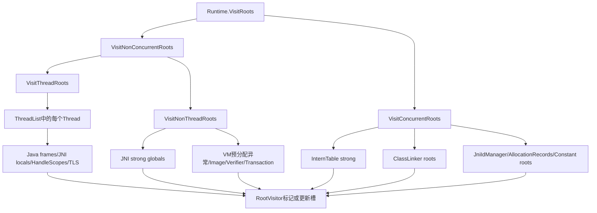
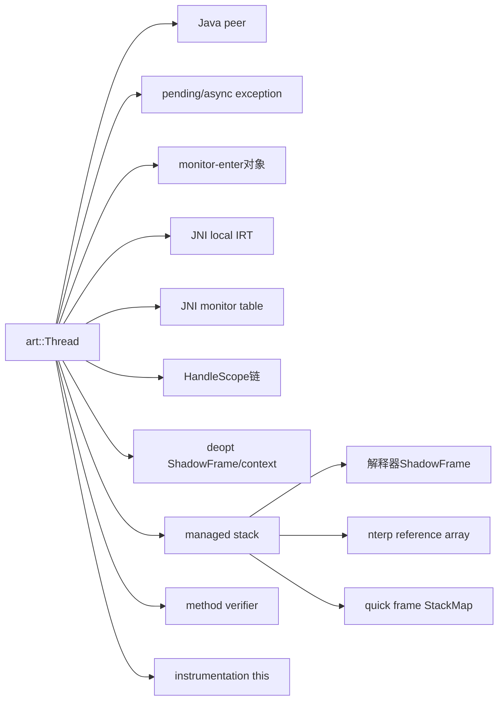
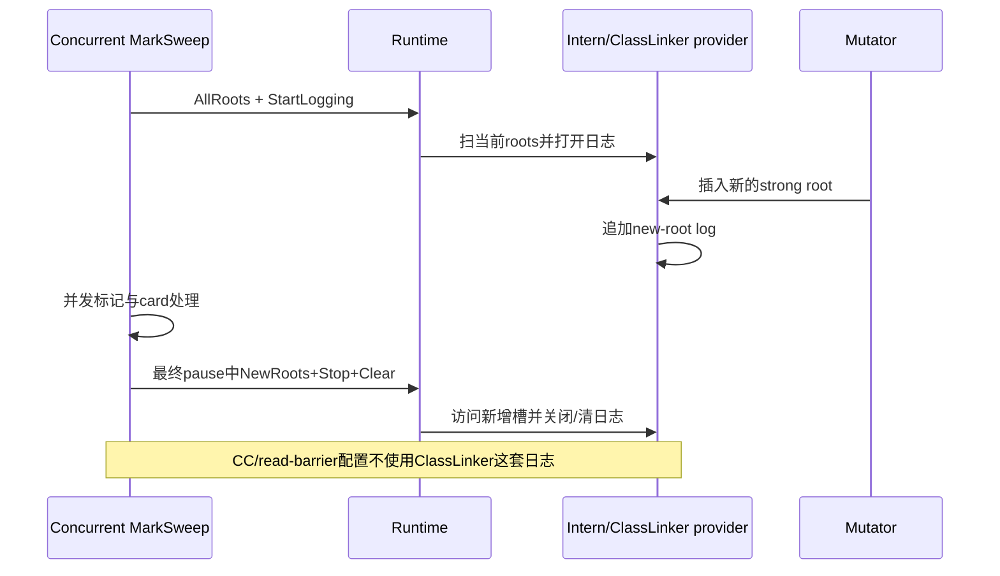

# 第584章 Android ART GC Roots 枚举链：Thread、JNI、ClassLinker、InternTable、VisitRootFlags、New Roots 与 Moving 更新

> 源码基线：Android 11 / API 30 / `android-11.0.0_r48`。本章只在 macOS 阅读源码，不实际编译。第583章展示 CC 如何搬对象；本章把其中反复出现的“扫描 roots”展开：root 究竟存放在哪个槽、谁枚举、谁标记、谁在对象移动后把槽更新成新地址。

## 1. 先给整章结论

ART 的 GC root 不是某一种对象，而是“位于普通 heap 引用图之外、仍保存 Java 对象引用的可更新槽”。`Runtime` 把线程 roots、JNI strong globals、ClassLinker/InternTable、VM 内部对象等入口汇总给 `RootVisitor`；非移动 collector只标记槽中的对象，moving collector还会把槽改写为新地址。JNI weak globals、weak interns等不作为强 root，而在强可达闭包稳定后单独清扫。

## 2. root 是边，不是对象的永久身份

同一个 `String` 可同时被 Java 栈、JNI global 和 intern table指向，于是出现多条 root edge；对象离开这些槽后就不再因它们存活。heap dump把 root type附在边的来源上，不能据此说对象本身“属于 JNI root 类型”。

## 3. GC 为什么必须从 roots 开始

Java heap 内对象互相成环并不等于活；只有从运行中的线程、VM全局状态、JNI所有权等外部起点可达，才构成执行仍可能观察到的对象。collector先把 roots 标活/转发，再递归扫描普通字段，最终未进入闭包的对象才可回收。

## 4. Runtime 根枚举总图



## 5. 本章源码地图

根类型、flags 与 visitor接口在 `art/runtime/gc_root.h`；总调度在 `art/runtime/runtime.cc/.h`；线程枚举在 `thread_list.cc` 与 `thread.cc`；stack map解释在 `thread.cc` 的 `ReferenceMapVisitor`；JNI表在 `jni/java_vm_ext.cc`、`jni_env_ext.h` 和 `indirect_reference_table.cc`；类/字符串根在 `class_linker.cc`、`intern_table.cc`；collector visitor在 `mark_sweep.cc`、`semi_space.cc`、`concurrent_copying.cc`。

## 6. r48 定义了哪些 RootType

枚举包括 Unknown、JNI Global/Local、Java Frame、Native Stack、Sticky Class、Thread Block、Monitor Used、Thread Object、Interned String、Finalizing、Debugger、Reference Cleanup、VM Internal、JNI Monitor。名称主要用于 heap dump分类，并不表示每种都有一个独立容器。

## 7. `RootInfo` 不参与可达性裁决

源码注释明确说 `RootInfo` 只被 hprof 使用，基础字段是 type 与 thread_id；`JavaFrameRootInfo` 还可附方法位置和 vreg。collector 的 `VisitRoots` 大多把 info 标成 unused：一个槽是否让对象存活取决于被访问，不取决于标签叫什么。

## 8. `RootVisitor` 为什么接收槽地址

普通 overload收到 `mirror::Object*** roots`：数组每项是 `Object**`，指向真正保存引用的槽；压缩 overload收到 `CompressedReference<Object>**`。visitor可读出旧对象，也能把同一槽写回 to-space地址，这正是 moving GC 必需的能力。

## 9. 三层指针并不是“对象的对象”

单个 native root槽类型是 `Object**`，批量调用需要传多个槽地址，于是参数成为 `Object***`。循环中 `roots[i]` 才是可写槽，`*roots[i]` 才是 Java 对象地址。少解引用或多解引用都会把容器内存误当对象。

## 10. 为什么还有 CompressedReference 版本

许多长期 root 用 `GcRoot<T>` 包装 32 位压缩引用以适配 Android heap指针模型；线程寄存器/TLS等位置常以机器指针槽出现。visitor提供两个虚函数，让 collector按存储表示正确解码和更新，而不是把 32 位槽当 64 位 pointer覆盖。

## 11. `GcRoot` 不是“永远存活”的魔法类型

它只是保存 `CompressedReference` 并提供带 read barrier的 `Read` 与 `VisitRoot`。是否被某轮枚举仍取决于拥有者是否调用 visitor；weak table也能用 `GcRoot` 存条目，却刻意不走强 roots访问。类型名表达“可被 GC 管理/搬迁”，不是强度承诺。

## 12. `SingleRootVisitor` 为什么不能用于 moving 更新

它把批量槽解引用后，只把对象值传给抽象 `VisitRoot(Object*, info)`，源码注释明确说“不处理 updating roots”。它适合验证、统计、HPROF一类只读访问；若用它做 copying，visitor没有原槽地址可写回。

## 13. BufferedRootVisitor 优化什么

大量 `GcRoot` 逐个虚调用成本高，buffered visitor先收集槽地址，达到默认约 1024字节/指针大小的条目数再批量调用，析构时 Flush剩余项。缓冲的是“地址”，所以被缓冲槽在 Flush前必须一直有效。

## 14. 为什么 ClassTable 使用 UnbufferedRootVisitor

ClassTable遍历时会用栈上临时 `GcRoot` 解码 table slot；若把该临时槽地址缓冲到函数后再访问，它早已失效。ClassLinker注释因此明确使用 unbuffered visitor。性能优化不能跨过地址生命周期。

## 15. Runtime 的默认总顺序

`Runtime::VisitRoots` 先 `VisitNonConcurrentRoots`，其中先 thread、再 non-thread；最后 `VisitConcurrentRoots`。这个源码顺序方便理解默认 STW访问，但具体 concurrent collector可拆开调用，例如用 checkpoint标 thread roots，再单独访问 concurrent roots。

## 16. `NonThreadRoots` 和 `ConcurrentRoots` 不是互斥同义分类

NonThreadRoots当然不是线程栈，但不代表都可安全与 mutator并发访问；`VisitConcurrentRoots` 才是由各自锁/协议保护、可在并发 marking阶段访问的那组 provider。命名分别回答“是不是线程根”和“能否按并发根协议访问”，维度不同。

## 17. `VisitNonConcurrentRoots` 包含哪些组

它先遍历 `thread_list_`，再调用 `VisitNonThreadRoots`。MarkSweep若持 mutator lock独占可直接走完整 `Runtime::VisitRoots`；并发模式通常用线程 checkpoint，随后访问 non-thread 和 concurrent providers，避免一次长全停顿。

## 18. ThreadList 为什么持 thread-list lock遍历

线程可能并发 attach、start 或 unregister。`ThreadList::VisitRoots` 加 `thread_list_lock_` 后迭代当前 `list_`，防止 Thread结构在枚举期间消失。但持列表锁并不自动让目标线程栈静止；调用方仍需 suspend-all、checkpoint或 collector专用 flip协议。

## 19. “调用 Thread::VisitRoots”不代表当前线程自己执行

checkpoint closure可在目标 runnable线程上执行，也可由 GC代表已经 suspended的目标执行；代码注释多次提醒 `self` 不一定等于 `thread`。安全条件是目标线程状态与 barrier协议，不是 C++ 调用栈名字。

## 20. CC 的 thread-root 访问为何不直接用总入口

第583章的 `ThreadFlipVisitor` 必须同时开启每线程 GC-marking入口、撤销 TLAB/allocation stack并转发 roots，因此 ThreadList使用专门 `FlipThreadRoots`。它不是漏掉 Runtime总入口，而是把根更新嵌入 collector 的相变协议。

## 21. Thread 根集合总览

`Thread::VisitRoots` 访问 Java peer、pending/async exception、正在 monitor-enter 的对象、JNI locals、JNI monitor记录、HandleScopes、deoptimization shadow/context、method verifier roots、所有 managed stack frames，以及 instrumentation stack里的 `this_object_`。

## 22. Java peer 为什么是 root

native `art::Thread` 的 `opeer` 指向 `java.lang.Thread`。只要 native线程仍注册并可由 Runtime操作，peer不能被当普通不可达对象回收；标签使用 `kRootThreadObject` 并带 ART thread id，便于 heap dump关联线程。

## 23. pending exception 也必须保活

异常已写入 TLS 但尚未被 Java handler读取时，可能没有其他 heap引用；`tlsPtr_.exception` 和 `async_exception`因此以 NativeStack标签访问。特殊 deoptimization exception哨兵被排除，因为它不是普通待抛 Java对象合同。

## 24. `monitor_enter_object` 表示一个危险窗口

线程正在获取某对象 monitor 时，需要在阻塞/状态切换期间保存对象。即便 Java局部寄存器暂时不再暴露这个引用，TLS槽也必须作为 root并在 moving GC后更新，否则线程恢复后会对旧地址加锁。

## 25. JNI local roots 从哪里枚举

每线程 `JNIEnvExt` 持有 local `IndirectReferenceTable`，`VisitJniLocalRoots`把所有非 null entry批量交给 visitor，标签为 `kRootJNILocal` 并带 thread id。JNI local的有效期/segment规则决定何时从表移除，GC只相信当前表内容。

## 26. JNI monitor roots 与 Java monitor不是一回事

CheckJNI/环境记录的 `MonitorEnter`对象在 `monitors_` 表中单独访问，标签 `kRootJNIMonitor`。这是确保 native代码持有的 monitor对象存活和可更新的所有权记录；它与对象 LockWord/MonitorPool内部状态及 Java frame里的 synchronized root是不同层。

## 27. HandleScope 是 native 栈的可移动引用槽

ART C++代码在可能 suspension/GC的区间用 handle保存对象。线程沿 linked HandleScope链访问槽，使用 `kRootNativeStack`。局部裸 `ObjPtr` 若跨 suspend point却没进入 handle scope，就不在这条枚举链中，moving GC后可能成为旧地址。

## 28. deoptimization 为什么有额外 roots

优化帧转换成 ShadowFrame时，临时记录、返回值和 pending exception可能同时存在于 native结构；`stacked_shadow_frame_record`、`deoptimization_context_stack` 和 frame-id映射因此单独访问。它们不是永久重复根，而是状态迁移窗口的保活槽。

## 29. method verifier 运行时也能持对象

当前线程的 verifier链可能持类、方法相关对象，在验证尚未完成时这些引用不一定已发布进稳定全局表。Thread遍历每个 verifier的 roots，并以 NativeStack标签交给 visitor，确保并发类加载/验证与 GC兼容。

## 30. instrumentation stack中的 receiver

方法进入/退出 instrumentation会保存原 frame信息和 `this_object_`。即使实际 quick frame已被改写，工具事件仍可能需要 receiver；线程遍历这些 entry并以 VMInternal标签访问非 null槽。

## 31. 单线程 root 来源图



## 32. ShadowFrame 如何知道哪些 vreg是引用

解释器 ShadowFrame为每个 dex register维护 reference槽；遍历 `NumberOfVRegs()`，非 null者交 visitor，返回新地址后写回 `SetVRegReference`。还访问 lock-count data中的 monitor引用，并访问当前方法 declaring class。

## 33. nterp 为什么有两份寄存器数组

nterp frame有普通 dex register array与只保存引用的 shadow reference array；非引用位置在后者为 null。moving visitor更新引用时同时写 reference slot和对应普通 slot，保证解释执行继续读取时两份表示一致。

## 34. quick frame不扫描每个机器字

优化代码的 `CodeInfo/StackMap`按当前 native PC给出 stack mask与register mask；只有置位槽才按对象引用访问。GC不会把看起来像 heap地址的任意整数保活，这就是精确 root map区别于保守扫描的核心。

## 35. 当前执行方法的 declaring class也是 root

线程可能正在执行一个类的方法，即使没有普通对象引用直接指向该 Class，方法代码和元数据仍需保持映射。`VisitDeclaringClass`读取 ArtMethod的 class，visitor移动后用 CAS更新 declaring class，防止类/代码在活动栈上被卸载。

## 36. stack mask覆盖什么

它按 quick frame slot指示哪些栈位置保存引用；visitor取得 `StackReference<Object>*`，解码后访问，地址变化则 Assign回槽。frame布局和 alignment由编译器、OAT header与架构ABI共同定义，不能用 Java局部变量序号直接当物理slot。

## 37. register mask为何也可更新

GC发生在 safepoint，callee-save寄存器已保存到可寻址 context；`GetGPRAddress(i)`给 visitor真实槽地址。moving collector写回新对象，使线程恢复时寄存器状态不再携带 from-space地址。找不到被mask声明的保存槽在 debug中是 fatal。

## 38. proxy 与 runtime/native frame有特例

普通非 native、非 runtime优化帧使用 stack map；proxy非构造方法从调用约定提取 reference arguments；runtime method没有普通 declaring class/DEX map。不能把所有 quick frame都按同一 DexRegisterMap解释。

## 39. `kVisitRootFlagPrecise` 不决定 GC 是否精确

Thread两条路径都使用 stack/register GC masks找真实引用槽；Precise只让 `JavaFrameRootInfo`进一步尝试把物理位置映射回具体 dex vreg。非 precise仍是精确存活扫描，只是 HPROF元数据标成 imprecise/unknown，不能把 flag关掉解释成保守 GC。

## 40. JavaFrameRootInfo 提供哪些附加信息

它固定 type为 JavaFrame，保存 thread id、StackVisitor和vreg；特殊负值表示 Unknown、Imprecise、method declaring class或 proxy argument。`Describe`可输出方法位置与vreg，帮助 heap dump指出“哪个线程的哪一帧保活对象”。

## 41. JNI strong global是真正 VM root

`JavaVMExt::VisitRoots`在 `jni_globals_lock_`读锁下访问 `globals_` IRT，标签 `kRootJNIGlobal`。只要 native库没 `DeleteGlobalRef`，对象就从 VM根可达；Java层把字段清空也无法解除这条 native所有权。

## 42. JNI weak global为何不在同一函数访问

源码注释明确：weak_globals由 GC 自己访问，因为会修改表。`SweepJniWeakGlobals`用 `IsMarked`查询强闭包；对象存活则更新成移动后地址，不存活则写入专用 cleared weak-global哨兵。把 jweak当强根会使它永远清不掉。

## 43. weak global访问还需要门禁

并发弱引用清扫期间，mutator解码/新增 jweak可能与表更新竞态。JavaVMExt有 `allow_accessing_weak_globals_`、lock、condition与线程 weak-access状态协调；“不作为强root”并不等于可无锁随时读。

## 44. JNI local的生命周期为何通常较短

native方法进入时建立 local segment，返回时弹出；显式 Push/PopLocalFrame又增加边界。局部引用只在其 entry仍位于当前 IRT segment时成为 root。native代码把 jobject数值偷偷保存到段外，GC既不能保活也不能可靠更新它。

## 45. global ref泄漏为何常表现为 Java heap泄漏

global IRT entry一直是根，引用链在 heap dump通常从 JNI global直接进入业务对象图。泄漏源可能是 native库忘记 DeleteGlobalRef，而不是 Java static字段；排查时必须保留 root type，不能只看被保活对象的类。

## 46. Runtime 的 VMInternal roots有哪些代表

`VisitNonThreadRoots`访问 sentinel、三份预分配 OOME、一份预分配 NoClassDefFoundError等；这些对象必须在极端异常路径仍可用。第582章的 OOME兜底能成立，正因为这里每轮把储备异常保持为可移动、可更新的 root。

## 47. Image roots 如何处理

Runtime遍历每个 ImageSpace的 `ImageHeader::GetImageRoots()`数组，非 null值以 StickyClass标签访问；随后 `CHECK_EQ(after_obj,obj)`，要求 visitor不能把 image root移到另一地址。ImageSpace在正常运行时是 immune/固定映射，这条检查体现其地址稳定合同。

## 48. verifier static roots 与 transaction roots

`ClassVerifier::VisitStaticRoots`保活验证器的静态对象；AOT/preinitialization transaction保存回滚所需引用，Runtime逐 transaction访问。它们规模可能很小，却同样位于普通 Java字段图之外，遗漏就会产生罕见启动/编译期悬空引用。

## 49. `VisitImageRoots` 标签为何看起来不完全精确

所有 image root都用 `kRootStickyClass`，其中数组条目不必字面都是 Class。RootType主要为 HPROF兼容分类，不是 C++类型系统；判断真实对象要读 ImageRoot枚举和数组内容，不能仅凭标签名称。

## 50. ClassLinker 的 `class_roots_`

`class_roots_`是包含基础运行时类的对象数组，若非 null以 VMInternal访问；它与 boot class table是两套结构。前者供快速索引 Object/Class/String等核心类，后者按 descriptor/loader组织已定义的 boot classes。

## 51. boot class table为什么是强根

BootClassLoader生命周期等同 Runtime，已装载 boot class不能像应用 loader那样卸载，因此 `VisitClassRoots(AllRoots)`无条件遍历 boot class table，标签 StickyClass。它也访问 OAT `.bss` GC roots等被表管理的条目。

## 52. 应用 ClassTable为什么不能全局强扫

每个应用 ClassLoader的 ClassTable由其 native allocator关联，若 ClassLinker把所有表都作为全局 root扫描，loader永远无法卸载。正常路径从仍可达的 ClassLoader对象进入其特殊 ClassTable闭包；不可达 loader对应类才有机会在 full GC后清理。

## 53. `kVisitRootFlagClassLoader` 做什么

ClassLinker内部保存 class loader的 JNI weak root。AllRoots访问时，只有 flags包含 ClassLoader，或 method tracing已启用，才临时Decode并以 VMInternal强访问这些 loader。StickyMarkSweep追加该 flag，避免它不扫描全部对象class edge时错误卸载仍被对象class引用的 loader。

## 54. tracing 为什么保活所有 class loaders

method tracing可能仍需要类/方法元数据解释已记录事件；卸载 loader会让元数据失效。因此 `Trace::IsTracingEnabled()`与显式 flag一样提升这些 weak loader roots。这是诊断功能改变对象寿命的真实例子。

## 55. ClassLinker 为何主动丢 array-class cache

`VisitRoots`最后调用 `DropFindArrayClassCache()`，避免这个查找优化缓存阻止 class unloading。缓存不是语义所有者，宁可 GC后重建；这也是“容器里有引用”不必都定义成强 root的设计选择。

## 56. InternTable 只强扫 strong interns

AllRoots分支调用 `strong_interns_.VisitRoots`，标签 InternedString；源码特意不访问 weak interns和immutable image roots。`String.intern()`返回的 canonical string若位于 strong table，会被表保活，弱表则必须走 system-weak sweep。

## 57. weak intern不是普通 Java WeakReference

它是 Runtime内部 hash table中的弱槽，没有 Java `Reference`对象和 ReferenceQueue合同。GC通过 `SweepInternTableWeaks(IsMarkedVisitor)`删除或更新条目；概念上同为弱可达，数据结构和通知机制不同。

## 58. new strong intern日志为何需要搬迁更新

concurrent mark期间新插入 strong intern可能不在初次快照。`new_strong_intern_roots_`保存新槽；Visit NewRoots时若 moving visitor把 root从 old_ref改为 new_ref，InternTable还要从 strong hash set移除旧地址、插入新地址，否则哈希容器内部仍保留 stale key。

## 59. ClassLinker 的 new-class日志有版本条件

r48 在启用 read barrier时断言 ClassLinker不接收 New/Clear/Start/Stop logging flags，CC靠 read barrier/to-space invariant处理并发新类；没有 read barrier的 concurrent MarkSweep才维护 `new_class_roots_`与新 boot OAT bss roots。不能把两套协议叠加描述。

## 60. JniIdManager为何也是 concurrent roots provider

method/field ID管理可能保存可移动的反射/类相关 roots；Runtime在 InternTable与ClassLinker后调用其 `VisitRoots`。JNI ID本身有 pointer/index/swapable表示，但背后所有 Java对象槽仍需纳入 GC更新。

## 61. allocation records同时包含强槽与弱槽

开启 allocation tracking后，Heap记录被分配对象、其类和分配栈。这里必须拆开看：`EntryPair`里的被分配对象是 weak root，不会仅因记录存在而存活；`VisitAllocationRecords`只把最近若干记录的 `klass_`以及所有栈帧 `ArtMethod`内的 roots作为强根访问，以免报告所需的类/方法先被卸载。其余对象槽和较旧的类槽由 `SweepAllocationRecords`按 `IsMarked`删除或更新。诊断功能可能延长类加载器/元数据链的寿命，但不能笼统说它强保活每个被记录对象。

## 62. constant roots来自 Runtime ArtMethods

resolution、IMT conflict/unimplemented、callee-save runtime methods会访问其中的 GcRoots；当前注释说这些 ArtMethod里的 GcRoots都为 null，但仍保留统一 visitor。它们在 NewRoots模式被跳过，因为合同保证不会动态新增。

## 63. 为什么“没有内容”仍保留访问代码

runtime method布局或未来版本可能增加 root，统一 `ArtMethod::VisitRoots`能避免每个 collector知道内部字段。注释表达 r48现状，不是删除接口的证明；这类空路径也常用于 debug校验结构一致性。

## 64. VisitRootFlags 的七个位

AllRoots、NewRoots、StartLoggingNewRoots、StopLoggingNewRoots、ClearRootLog、ClassLoader、Precise分别占 bit0—5和bit7，bit6空缺。flags是位集合，但头文件明确说并非所有组合有效，例如 All与New没有逻辑理由同时请求。

## 65. flags由 provider分别解释

Thread只读取 Precise；InternTable解释 All/New/日志控制；ClassLinker还解释 ClassLoader并按 read-barrier配置限制New flags；Runtime对 NewRoots决定是否跳过 constant roots。不要期待一个中央 switch替所有组件实现完全相同语义。

## 66. concurrent MarkSweep怎样开始日志窗口

初次并发 root marking调用 `VisitConcurrentRoots(AllRoots | StartLoggingNewRoots)`：先扫当时全部 strong intern/class roots，同时让 provider开始记录此后新增项。线程 roots用 checkpoint捕获，non-thread roots另行访问。

## 67. 并发期间为什么只补 new roots不够

线程栈、JNI locals和普通 VM slots会变化，它们有暂停/checkpoint/锁协议；只有支持增量日志的 concurrent providers可用 new-root list补差。NewRoots不是全 Runtime任意写入的通用写屏障。

## 68. ReMarkRoots 如何关闭窗口

MarkSweep最终 pause中调用 `Runtime::VisitRoots(NewRoots | StopLoggingNewRoots | ClearRootLog)`。Thread和non-thread组仍按自身实现重访；Intern/ClassLinker只处理日志中的新增项、停止继续记录并清表。暂停保证关闭点之后没有漏进本轮的并发根写入。

## 69. CC 为何反复访问 AllRoots

CC在 pre-mark/copying等位置对 concurrent roots使用 AllRoots，ClassLinker甚至在 read barrier配置下禁止 new-root logging flags。新对象和新引用由 to-space invariant、read barrier、card/checkpoint处理；这是另一套正确性证明，不是“忘了优化”。

## 70. new-root 日志时序图



## 71. root slot在并发中也可能被改写

CC访问 raw root时读取 ref、Mark得到 to_ref，再用 CAS尝试更新；如果 mutator已改槽则停止覆盖。collector保活自己观察到的旧对象不一定有害，但不能把旧值写回破坏更新；新值由并发协议另行保证被发现。

## 72. MarkSweep visitor为何不改槽

非 moving MarkSweep只对 `*root`或compressed root解码结果调用 `MarkObjectNonNull`，对象地址不变，无需写回。相同枚举接口因此同时服务 mark-only和copying collectors，更新能力由 visitor实现选择。

## 73. SemiSpace 如何直接更新 root

它把 raw root转成临时 `StackReference`，`MarkObjectIfNotInToSpace`复制/转发后，地址变化就写回原槽；compressed root可直接传给 mark helper更新。SemiSpace通常在独占/受控窗口，不需要 CC同样的并发 CAS逻辑。

## 74. CC 更新 raw root的 CAS细节

它把 `Object**`重解释为 `Atomic<Object*>*`，先确认槽仍等于 expected，再做 weak CompareAndSet。weak CAS可能伪失败，所以循环；一旦观察到槽已不是旧值就退出，避免覆盖 mutator或另一 visitor的新地址。

## 75. compressed root也用原子比较更新

CC先把 old/new对象编码成 `CompressedReference`，对真实压缩槽做 CAS。更新宽度与存储表示匹配，不能先解码成机器指针再按8字节写回32位 root；这也是 RootVisitor分两个 overload的必要性。

## 76. `GcRoot::VisitRoot` 为何方法本身是 const

其内部 `root_`声明 mutable；const表示拥有者逻辑结构不变，但 GC仍可更新对象地址。移动不是业务语义上的修改，允许 const容器在 visitor过程中修复内部引用。

## 77. image root为何禁止 visitor改值

Image对象按固定映射/relocation合同管理，不属于本轮普通 moving space。Runtime把局部 `after_obj`交 visitor后要求等于原值；若 collector试图移动它，说明 space分类或 root策略严重错误，而非正常“更新成功”。

## 78. `GcRoot::Read` 与 root枚举不同

普通业务/Runtime读取一个 GcRoot时可通过 `ReadBarrier::BarrierForRoot`得到当前地址；GC批量枚举则把槽地址交 collector统一标记/更新。前者服务单次安全访问，后者建立整轮 reachability闭包，两者不能互相替代。

## 79. GcRootSource能附加什么

单次 root read可附 `ArtField`或 `ArtMethod`来源，帮助 read-barrier invariant诊断指出哪个 native metadata槽产生引用。它不是 RootInfo，也不改变 root强度；一个描述读取来源，一个描述GC/HPROF分类。

## 80. system weak为何不在 VisitRoots里

Runtime的 `SweepSystemWeaks`依次处理 weak interns、MonitorList、JNI weak globals、allocation record弱部分、JIT literal tables、解释器cache与其他 holders。它们先查询 `IsMarked`，只更新已存活对象地址，未标记者删除/写哨兵；若提前作为强 roots访问，就永远无法判死。

## 81. MonitorList 也可能是 system weak

胖锁Monitor需要能关联对象做诊断/同步，但空闲或对象已死的监视器不应永久保活对象。root分类里的 MonitorUsed与 system-weak monitor清扫是不同场景：正在使用的锁需强保活，管理表中的其余关联可弱清理。

## 82. JIT root table为何在 weak sweep

JIT机器码/inline cache可能引用 Class或String；类卸载时要使相关代码和字面量失效，而不是让代码缓存反过来永久保活所有类。源码注释指出 String因 strong intern总活，Class则受 unloading影响。

## 83. root类型 `Finalizing` 与 `ReferenceCleanup`

头文件注释说明这两个枚举用于 HPROF heap tag转换。它们帮助工具显示对象由 finalizer/reference cleanup链暂时保活，不意味着存在名为 FinalizingRootTable的统一容器；实际引用可能来自 daemon/队列运行状态。

## 84. thread id为0表示什么

`RootInfo`默认 thread_id=0表示非线程 root；Thread构造标签时传 ART thread id。它不是 Linux tid有效性证明，也不是对象地址的一部分，只是 HPROF关联信息。

## 85. root条目数不等于存活对象数

同一对象可被多个槽重复访问，buffered visitor也不会自动全局去重；collector bitmap/forwarding负责让对象只首次入 mark work或只复制一次。heap dump显示十条 root edge，可能仍只对应一个对象。

## 86. root可以指向 heap内部任意层级

JNI global可能直接指向 Activity，线程local可能指向小 String，ClassLinker指向 Class；从该对象继续扫描字段才得到整棵 retained graph。root容器不需要直接保存每个后代。

## 87. 任何当前强 root指向的对象都必须活

即使业务认为对象“应该没用了”，只要合法 root槽尚未清除，GC就不能回收。GC leak分析的核心是判断哪条 root edge不该存在，而不是要求 collector猜测程序意图。

## 88. stale机器栈字节不应成为 root

精确 stack map只枚举当前 PC声明为引用的槽；已经结束生命周期但残留旧地址的普通机器字不会被扫描。否则局部变量离开作用域后仍可能随机保活大图，且移动 GC无法安全分辨整数与对象地址。

## 89. r48 的 precise-GC回归测试入口

以下逐字来自 `art/test/072-precise-gc/src/Main.java`。数组只保存 WeakReference；`populate`返回后其局部强引用应失效，`check`触发 GC验证旧栈内容没有被当作强 roots。

```java
    public static void staleStackTest() {
        WeakReference wrefs[] = new WeakReference[10];

        populate(wrefs);

        check(wrefs);
    }
```

## 90. 测试怎样制造很多旧寄存器值

以下是同文件连续源码。十个非常量 String先进入局部变量/寄存器，再只被包装进 WeakReference；方法返回后旧物理栈或寄存器可能仍残留地址，但已不再属于活跃 frame stack map。

```java
    static void populate(WeakReference[] wrefs) {
        /*
         * Get a bunch of non-constant String objects into registers.  These
         * should be the first locals declared.
         */
        String str0 = generateString("String", 0);
        String str1 = generateString("String", 1);
        String str2 = generateString("String", 2);
        String str3 = generateString("String", 3);
        String str4 = generateString("String", 4);
        String str5 = generateString("String", 5);
        String str6 = generateString("String", 6);
        String str7 = generateString("String", 7);
        String str8 = generateString("String", 8);
        String str9 = generateString("String", 9);

        /* stuff them into the weak references array */
        wrefs[0] = new WeakReference(str0);
        wrefs[1] = new WeakReference(str1);
        wrefs[2] = new WeakReference(str2);
        wrefs[3] = new WeakReference(str3);
        wrefs[4] = new WeakReference(str4);
        wrefs[5] = new WeakReference(str5);
        wrefs[6] = new WeakReference(str6);
        wrefs[7] = new WeakReference(str7);
        wrefs[8] = new WeakReference(str8);
        wrefs[9] = new WeakReference(str9);
    }
```

## 91. 旧测试注释里的“conservative GC”要按时代读

测试用是否残留保活来展示精确扫描效果，但当前 r48 quick/nterp/interpreter各自有引用槽或mask。不要据测试年代推断现在仍有一个运行时开关在 conservative与precise heap GC之间切换；`kVisitRootFlagPrecise`也只是额外报告vreg。

## 92. Java局部变量何时不再是 root

不一定等到花括号结束或方法返回；优化器可在最后一次语义使用后让slot不再出现在 stack map。反过来，debug/解释器模式也可能让生命周期更长。若必须把对象保活到某一点，应使用 `Reference.reachabilityFence`而不是依赖源码文本范围。

## 93. static字段如何进入可达图

Java static reference字段存放在对应 `Class`对象/类存储中；GC先从 boot table、可达 ClassLoader的 ClassTable、运行帧declaring class等让 Class存活，再扫描其 static fields。不是每个应用 static字段都由 Runtime维护一条独立 `kRootVMInternal`槽。

## 94. ClassLoader与类之间为何是特殊闭包

应用 ClassLoader Java对象可达时，collector识别其 native ClassTable并访问所定义类；类又保活 static字段和方法元数据。loader不可达时不能先由表反向强保活loader，否则类卸载闭环永远打不开。

## 95. root枚举与 read barrier共同处理移动

STW moving collector能一次性更新所有 roots；CC则用 flip/checkpoint更新线程roots，同时 concurrent providers和后续单次读取通过 CAS/read barrier维持新地址。root枚举仍是初始闭包来源，read barrier解决枚举后并发访问窗口。

## 96. CC 的 Java root压测

以下逐字来自 `art/test/160-read-barrier-stress/src/Main.java`。字符串局部变量与重复 const-string都可能形成 frame/compiled roots；在持续分配触发 CC时，比较对象身份验证 root读取返回的是转发后的 canonical对象。

```java
    public static void testGcRoots() {
        // Initialize strings, hide this under a condition based on a volatile field.
        String testString0 = null;
        String testString1 = null;
        String testString2 = null;
        String testString3 = null;
        if (index0 != 12345678) {
            // By having this in the const-string instructions in an if-block, we avoid
            // GVN eliminating identical const-string instructions in the loop below.
            testString0 = "testString0";
            testString1 = "testString1";
            testString2 = "testString2";
            testString3 = "testString3";
        }

        // Continually check reads from `manyFields` and `largeArray` while allocating
        // over 64MiB memory (with heap size limited to 16MiB), ensuring we run GC and
        // stress the read barrier implementation if concurrent collector is enabled.
        for (int i = 0; i != 64 * 1024; ++i) {
            allocateAtLeast1KiB();
            // Test GC roots.
            if (index0 != 12345678) {
              assertSameObject(testString0, "testString0");
              assertSameObject(testString1, "testString1");
              assertSameObject(testString2, "testString2");
              assertSameObject(testString3, "testString3");
            }
            // TODO: Stress GC roots (const-class, kBssEntry/kReferrersClass).
        }
    }
```

## 97. const-string为什么还牵涉 InternTable

DEX字符串解析结果通常进入 DexCache/strong intern相关结构；活动 frame又保存本次使用的引用。测试同时覆盖 compiled root加载与 canonical string身份，不能把成功只归因于某一种 root provider。

## 98. `System.gc()` 只是请求，不定义具体 roots布局

测试调用 Runtime GC制造观察点，但 root枚举规则由当前执行模式、collector和Runtime结构决定。换解释器/JIT/AOT会改变 frame表示，却不改变仍被程序语义使用的对象必须存活这一合同。

## 99. heap dump里的 root并非完整所有权语义

RootInfo类型可能为兼容HPROF而粗粒度，image root甚至统一标 StickyClass；某些 native关联通过 VMInternal显示。要定位泄漏，需从root槽追到创建/删除API和生命周期，不能只按标签名称猜负责模块。

## 100. root verification 检查什么

`gc/verification.cc`可用 `Runtime::VisitRoots(AllRoots)`确认每个root是合法 heap对象；MarkSweep还有 VerifyRootMarked确保 root已进入mark集合。验证能发现悬空槽/漏标，但只在相应debug选项或构建中启用，生产未崩不等于root管理必然正确。

## 101. suspended-thread专用验证为何单独存在

MarkSweep可调用 `VisitRootsForSuspendedThreads`验证被挂起线程而不把普通运行线程栈当静止快照。ThreadList临时调整suspend counts、在锁外访问 roots再恢复，避免锁顺序问题。它服务诊断，不是正常每轮唯一root扫描路径。

## 102. root枚举时的锁顺序很重要

InternTable、ClassLinker、JNI globals各自加锁；ThreadList还要避免在持列表/suspend锁时进入可能获取其他锁的深层访问。源码常先复制线程集合或用 checkpoint/barrier，就是为了既稳定生命周期又不形成全局锁环。

## 103. visitor为何常忽略 RootInfo

GC只需对象槽完成 mark/copy，分类信息不影响算法，给每个对象做字符串描述会很贵。HPROF/诊断visitor才读取 type、thread id、frame/vreg；统一接口让性能路径不必另造枚举器。

## 104. 诊断工具会改变部分可达性，但不能一概而论

allocation tracking不会把记录中的业务对象升级成强root，不过它会强保活近期记录的 `klass_`和分配栈方法涉及的roots；method tracing还可能保活全部class loaders。因此工具确实有观察效应，但对象仍活时不能直接怪罪allocation record的对象槽。关闭工具后复测，并区分“被记录对象”“记录里的类/方法”与“tracing提升的loader”，结论才可靠。

## 105. JNI root问题的最小诊断闭环

先按 heap dump root type找 JNIGlobal/JNILocal/JNIMonitor；再对照 native New/Delete API和线程/segment；检查异常返回是否遗漏删除；若是 jweak则确认展示工具没有把 cleared哨兵误当对象。只搜 Java字段通常找不到global ref持有者。

## 106. Java frame root问题的最小诊断闭环

记录线程id、方法与vreg/位置；确认线程是否长期阻塞、局部对象是否还会语义使用；区分解释器/nterp/quick；若源码看似不用但仍保活，考虑调试模式、优化差异、monitor/deopt/instrumentation额外槽，而非立即判 stack map错误。

## 107. ClassLoader root问题的最小诊断闭环

检查 loader是否被 thread context class loader、JNI global、tracing、活动方法declaring class或其他 Java对象保活；再看其 ClassTable闭包。类多不是根因，未释放 loader root edge才是；第571章的卸载流程可与本章交叉阅读。

## 108. 常见误解一：所有 static字段都是独立 GC Root

错误。工具常把 static引用展示在 root路径附近，但 ART主要先保活/访问 Class，再扫描其 static字段。应用 Class能否存活还依赖 loader与活动元数据，不能把每个 static slot都等同 Runtime顶层root。

## 109. 常见误解二：JNI weak global也会保活对象

错误。它存于独立 weak table，不由 `JavaVMExt::VisitRoots`强扫；强闭包结束后只更新仍marked条目，未marked写 cleared哨兵。若对象仍活，应寻找其他强edge。

## 110. 常见误解三：Precise flag关闭就会误把整数当引用

错误。quick frame仍按GC stack/register masks枚举准确槽；flag只控制是否进一步恢复Dex vreg用于RootInfo。r48不靠扫描所有机器字来保守猜对象。

## 111. 四个 macOS 只读练习说明

以下练习只读 `/Users/ninebot/androidSource`，不编译、不修改源码；仅第115节使用 `mktemp -d`暂存提取片段并由 trap删除。每段可独立运行，退出码0表示断言通过。

## 112. 练习一：恢复 Runtime 的三层根调度

```bash
set -eu
REPO=/Users/ninebot/androidSource
FILE="$REPO/art/runtime/runtime.cc"
START=$(rg -n '^void Runtime::VisitConcurrentRoots' "$FILE" | cut -d: -f1)
END=$((START + 55))
sed -n "${START},${END}p" "$FILE" | rg 'intern_table_|class_linker_|java_vm_|VisitThreadRoots|VisitNonThreadRoots|VisitConcurrentRoots'
rg -q 'VisitNonConcurrentRoots\(visitor, flags\);' "$FILE"
rg -q 'VisitConcurrentRoots\(visitor, flags\);' "$FILE"
```

先看provider，再看 `VisitRoots`总入口确实先 non-concurrent、后 concurrent。注意练习证明源码调用关系，不声称每个 collector都只调用这一个总入口。

## 113. 练习二：核对单线程 roots清单与 precise分支

```bash
set -eu
REPO=/Users/ninebot/androidSource
FILE="$REPO/art/runtime/thread.cc"
START=$(rg -n '^void Thread::VisitRoots\(RootVisitor\* visitor\)' "$FILE" | cut -d: -f1)
END=$((START + 105))
sed -n "${START},${END}p" "$FILE" | rg 'opeer|exception|monitor_enter_object|VisitJniLocalRoots|VisitMonitorRoots|HandleScopeVisitRoots|WalkStack|InstrumentationStack'
rg -q 'kVisitRootFlagPrecise' "$FILE"
rg -q 'VisitRoots</\* kPrecise= \*/ true>' "$FILE"
```

输出把TLS、JNI、handle、managed frame和instrumentation槽放在同一视图中；最后两条只证明flag选择附加精确元数据路径，不代表false分支保守扫描任意机器字。

## 114. 练习三：区分 strong roots、new-root日志与 system weak

```bash
set -eu
REPO=/Users/ninebot/androidSource
ROOT="$REPO/art/runtime/gc_root.h"
INTERN="$REPO/art/runtime/intern_table.cc"
VM="$REPO/art/runtime/jni/java_vm_ext.cc"
rg -n 'kVisitRootFlagAllRoots|kVisitRootFlagNewRoots|kVisitRootFlagStartLoggingNewRoots|kVisitRootFlagPrecise' "$ROOT"
rg -n 'strong_interns_\.VisitRoots|new_strong_intern_roots_|deliberately don.t visit the weak_interns_' "$INTERN"
rg -n 'globals_\.VisitRoots|weak_globals table is visited by the GC itself|SweepJniWeakGlobals' "$VM"
rg -q 'strong_interns_\.VisitRoots' "$INTERN"
rg -q 'The weak_globals table is visited by the GC itself' "$VM"
```

这里直接得到两条反证：strong表走RootVisitor，而weak表刻意留给GC sweep。new-root log只是并发新增强根的补差机制，不会把weak表升级成强根。

## 115. 练习四：逐字核对三段 Java root压测

```bash
set -eu
REPO=/Users/ninebot/androidSource
A="$REPO/art/test/072-precise-gc/src/Main.java"
B="$REPO/art/test/160-read-barrier-stress/src/Main.java"
TMP_DIR=$(mktemp -d)
trap 'rm -rf "$TMP_DIR"' EXIT
sed -n '/^    public static void staleStackTest()/,/^    }$/p' "$A" > "$TMP_DIR/stale.java"
sed -n '/^    static void populate(WeakReference\[\] wrefs)/,/^    }$/p' "$A" > "$TMP_DIR/populate.java"
sed -n '/^    public static void testGcRoots()/,/^    }$/p' "$B" > "$TMP_DIR/roots.java"
test "$(wc -l < "$TMP_DIR/stale.java" | tr -d ' ')" -eq 7
test "$(wc -l < "$TMP_DIR/populate.java" | tr -d ' ')" -eq 28
test "$(wc -l < "$TMP_DIR/roots.java" | tr -d ' ')" -eq 30
rg -q 'WeakReference wrefs' "$TMP_DIR/stale.java"
rg -q 'String str9' "$TMP_DIR/populate.java"
rg -q 'Test GC roots' "$TMP_DIR/roots.java"
```

三个方法按源码边界提取，行数与关键词同时防止文档代码块漏行。练习不运行 Android GC，只核对作为阅读证据的r48 Java测试。

## 116. 练习预期与自测题

四段命令应全部以0退出；第112—114节会输出带行号锚点，第115节成功时无输出。请回答：为什么visitor必须拿槽地址？为什么weak global不能走强root访问？Precise flag究竟增加什么？应用static对象从哪条Class/ClassLoader路径进入可达图？

## 117. 生成后复读修正记录

复读已把“RootInfo决定root强度”修正为“主要供HPROF分类”；把“Precise=false就是保守GC”修正为“两支都用GC masks，只差vreg元数据”；把“NonThreadRoots都可并发”与ConcurrentRoots拆开；把“所有ClassTable全局强扫”修正为boot强root、应用loader特殊闭包；把“JNI weak也在VisitRoots”修正为独立sweep。

## 118. 必须保留的版本与工具边界

本文描述r48。root provider、JIT/JNI ID结构、nterp frame布局、new-root logging策略与HPROF标签可能演进；厂商Runtime也可能增加system weak holder。heap dump工具还可能把多步链路折叠成“GC Root”，最终判断应回到本版本枚举源码和槽生命周期。

## 119. 一页记忆卡

记住三句话：root是heap图外的可更新引用槽；强root用RootVisitor建立闭包，system weak用IsMarked在闭包后清扫；moving collector不仅Mark对象，还必须修正raw/compressed槽。线程看stack maps与JNI locals，VM看JNI globals和异常储备，Class/Intern只强扫明确的强表。

## 120. 下一章预告

第585章继续研究写入侧：`HeapReference`字段写、CardTable biased address、dirty/aged/clean状态、WriteBarrier、ModUnionTable与RememberedSet如何记录 old/immune→young或moving-space引用，并与本章 roots、上章 Baker read barrier共同闭合并发GC三色不变量。
