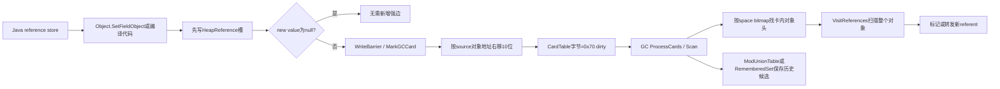
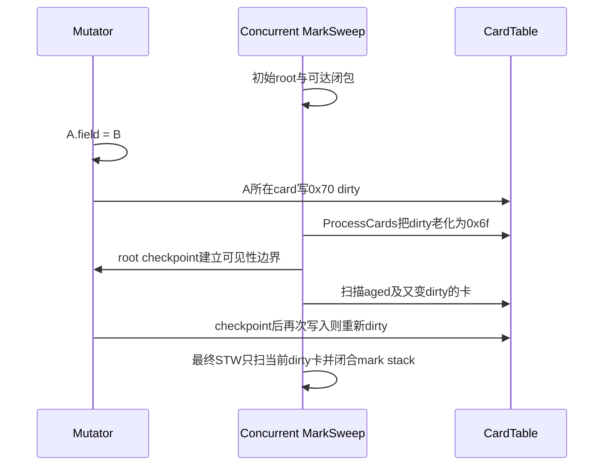
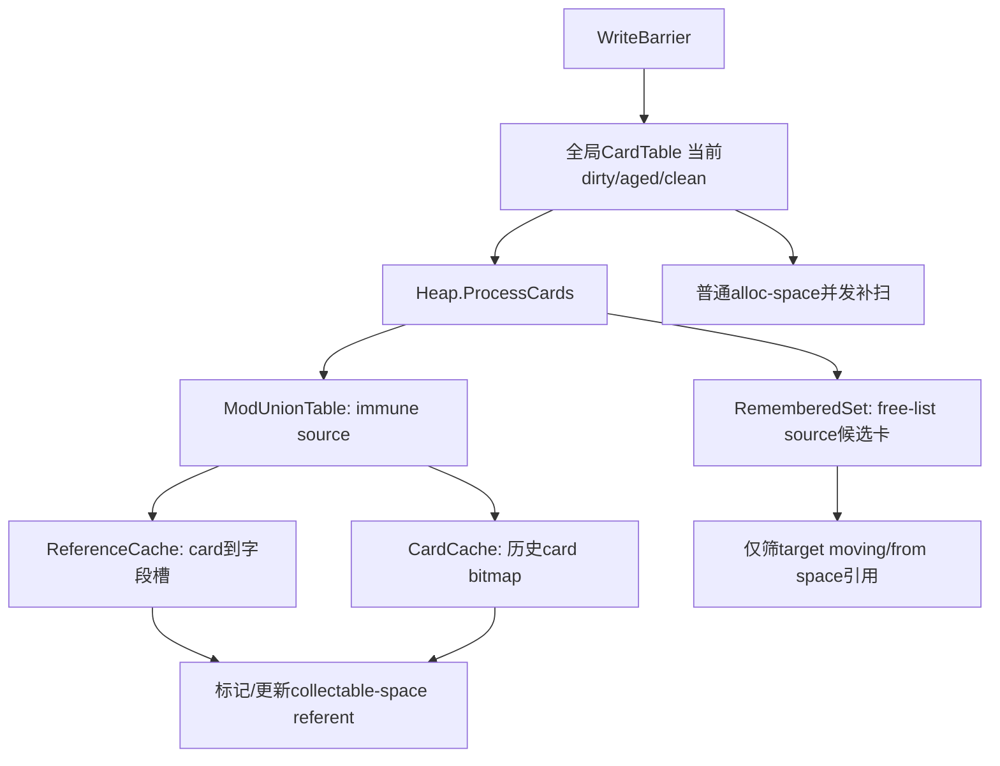

# 第585章 Android ART Write Barrier 与 CardTable：ModUnionTable、RememberedSet、卡老化和跨空间引用链

> 源码基线：Android 11 / API 30 / `android-11.0.0_r48`。本章只在 macOS 阅读源码，不实际编译。第584章回答“GC从哪些根出发”；本章回答“并发或局部回收期间，Java字段被改写后，GC怎样知道旧对象里出现了一条必须补扫的新边”。

## 1. 先给整章结论

ART r48 的常规 reference write barrier不是在每次写入时直接标记新对象，而是在非null引用写入heap对象后，把“目标容器对象所在的1KiB card”写成dirty。GC随后结合space bitmap扫描这张卡上的对象。CardTable保存当前脏状态；ModUnionTable把image/zygote等immune space的历史脏卡或跨空间引用长期汇总；RememberedSet实现free-list space到目标moving space的候选卡集合，但在本版本可见调用链里应谨慎视为保留机制，而非默认活跃主路。

## 2. Write barrier解决哪一种漏标

并发标记时，GC可能已经把对象A扫描成black；mutator随后把尚未标记的对象B写进A.field。若GC不再看A，B虽然已被活对象引用仍会保持white并被回收。写屏障把A所在card置dirty，最终补扫A就能发现A→B。

## 3. 它与Baker read barrier不是同一种屏障

write barrier发生在“引用写入”之后，记录source容器需要重扫；Baker read barrier发生在“引用读取”时，保证mutator不继续使用from-space旧地址并参与gray/to-space协议。二者可同时存在，各自修复不同时间方向上的并发风险。

## 4. 从字段写到补扫的总图



## 5. 本章源码地图

写入入口在`art/runtime/mirror/object-inl.h`、`object_array-inl.h`和`object.cc`；屏障封装在`write_barrier.h/-inl.h`；CardTable在`gc/accounting/card_table.h/.cc/-inl.h`；Heap调度在`gc/heap.cc`；ModUnionTable和RememberedSet位于`gc/accounting/`；collector消费路径在`mark_sweep.cc`、`sticky_mark_sweep.cc`、`semi_space.cc`和`concurrent_copying.cc`；ARM64生成代码在`compiler/optimizing/code_generator_arm64.cc`。

## 6. `SetFieldObject`的真实顺序

它先调用`SetFieldObjectWithoutWriteBarrier`把压缩引用写入字段；若new_value非null，再调用`WriteBarrier::ForFieldWrite<kWithoutNullCheck>`，随后做debug字段赋值检查。这里是post-write barrier，不是写前保存旧值的SATB barrier。

## 7. 只有reference store需要这条卡屏障

int、long、float等primitive字段不形成对象可达边，不需卡标记。编译器的`StoreNeedsWriteBarrier`明确要求数据类型为reference且不是编译期null常量；C++镜像对象setter也只在对象引用版本接入。

## 8. 为什么写null通常可以跳过

把字段改成null只删除一条边，不会使一个原本不可达对象突然变得可达，所以不会产生“漏掉新白对象”的正确性风险。`WriteBarrier::ForFieldWrite`默认带null check，头文件也写明null store无需调用。

## 9. 被标脏的是destination容器，不是new value

`ForFieldWrite(dst, offset, new_value)`最终只做`MarkCard(dst.Ptr())`。GC要重扫的是产生新出边的source对象dst；若按B的地址标卡，就只能再次扫描B，仍找不到A.field这条入口。

## 10. 为什么field offset在屏障里未使用

r48的卡表粒度按“对象起始地址”归类，扫描命中后会访问整个对象的所有reference fields，因此无需精确记录哪一个字段变了。offset仍保留在API中，便于接口表达语义和未来更细粒度实现，但当前标为`ATTRIBUTE_UNUSED`。

## 11. 数组start/length为什么也未使用

`ForArrayWrite(dst,start,length)`同样只标dst对象头对应的一张card。即使Object[]跨越多个物理1KiB区间，GC从对象头所在card发现数组后会扫描完整引用数组；range参数没有转换成多张卡。

## 12. `ForEveryFieldWrite`适合批量原生改写

对象复制、DexCache批量修补或ClassLinker直接更新多个reference slots后，不必逐字段重复mark；调用`ForEveryFieldWrite(obj)`把对象头card置dirty，表达“该对象任意引用字段都可能变了”。

## 13. 屏障必须在下一个GC safepoint之前完成

头文件的合同是reference field改变后、任何GC safe-point之前调用。C++ setter先store再mark并不矛盾：线程不能在两者之间允许GC安全地观察一个已发布却未记账的状态。若自定义native路径跨suspension后才补mark，窗口已不合法。

## 14. CAS只有成功写入才标卡

`CasFieldObject`先执行压缩引用CAS；只有success才调用barrier。失败时字段没有新边，无需dirty。把屏障放在CAS之前虽通常只造成额外扫描，但不能证明这次写入真正发生。

## 15. Exchange路径对null采取保守调用

`ExchangeFieldObject`无条件调用默认`ForFieldWrite`，屏障内部再检查new_value是否null并返回。这与普通setter在外层先判断效果一致，只是null判断位于另一层。

## 16. `WithoutWriteBarrier`不是普通业务捷径

这类函数供调用者自己保证随后屏障、处于不需要屏障的初始化窗口或执行特殊GC协议。随意使用会留下真实field却没有dirty card，是最危险的silent corruption来源之一；名字不是性能优化许可。

## 17. transaction日志不能替代GC write barrier

AOT预初始化transaction记录旧字段值以便回滚，解决的是事务语义；card mark记录新跨对象边供GC发现，解决的是可达性。`SetFieldObjectWithoutWriteBarrier`可做transaction记录，但外层仍负责GC屏障。

## 18. constructor fence也不能替代卡标记

`QuasiAtomic::ThreadFenceForConstructor`负责构造完成前的发布可见性；card table负责collector工作集合。内存fence不会自动把卡字节写成dirty，dirty store也不等于完整对象安全发布。

## 19. 新对象class字段有一个特殊补屏障

常规分配的`SetClass()`没有write barrier；Heap fast path在SemiSpace remembered-set支持且分配器为non-moving时显式`ForFieldWrite(obj,ClassOffset,klass)`，防止non-moving新对象指向近期moving Class而漏记。该条件会在多数快路径常量折叠掉。

## 20. 解释器/C++与优化机器码走向同一CardTable

Runtime C++ setter调用`WriteBarrier`，优化编译代码直接内联`MarkGCCard`，不必回到C++函数；两条路径最终都按同一biased base和`kCardShift`定位同一card byte。

## 21. 编译器何时能消除null检查

`StoreNeedsWriteBarrier`先排除编译期null；对可能为null的运行时值，`MarkGCCard`生成条件分支。若优化器已证明value non-null，`value_can_be_null=false`，机器码可省掉分支，但不能省card store。

## 22. ARM64 `MarkGCCard`只需几条指令

它可先`Cbz`跳过null，随后从Thread TLS加载biased card table，令temp=object>>10，最后`Strb(card,[card+temp])`。这里把card基址寄存器的低8位同时当0x70数据写入，省去单独加载dirty立即数。

## 23. 为什么每个Thread缓存card table指针

`Thread::InitCardTable()`把`Heap::GetCardTable()->GetBiasedBegin()`写进TLS。编译代码通过固定ThreadOffset加载，避免每次reference store沿Runtime→Heap追指针；表本身仍是进程内共享的一张。

## 24. biased base到底“偏”在哪里

理论公式是`card=table_begin+((addr-heap_begin)>>10)`；实现预先把heap地址偏移吸收到`biased_begin_`，于是热路径直接`biased_begin+(addr>>10)`。它还在额外256字节窗口内调整，使指针数值最低字节恰为0x70。

## 25. 逆映射如何成立

`CardFromAddr(addr)`做biased base加右移；`AddrFromCard(card)`做`(card-biased_begin)<<10`，得到该card覆盖heap区间的首地址。card指针本身位于独立mmap，不可误当Java heap地址。

## 26. r48为什么覆盖几乎整个low-4GiB

Heap初始化没有只按当前spaces容量建表，而是从4KiB到4GiB建立映射，因为app image在low-4GiB的具体位置事先未知，CardTable又不支持AddSpace时动态扩容。1KiB一字节意味着主体约4MiB，再加256字节对齐余量。

## 27. 一张card覆盖多少heap

`kCardShift=10`，所以`kCardSize=1<<10=1024`字节；每1KiB heap只占1字节card metadata，比例约1/1024。它比逐对象bit更粗，换来极低写入成本。

## 28. dirty card不等于“里面一定有old→young引用”

屏障热路径不查询source space、target space、对象年龄或字段位置，只要向heap对象写非null reference就dirty。因此同代引用、写回同一值、随后又清null都可能留下dirty；false positive只增加扫描成本，不破坏正确性。

## 29. card按对象头归属而非字段物理地址

标记使用dst对象地址，不是`dst+offset`。CardTable扫描时用space bitmap找“对象头位于该card”的对象，再对命中对象调用VisitReferences；所以大Object[]后部元素写入仍靠数组头card代表整个数组。

## 30. large object为何常不进入普通跨卡扫描

r48许多large objects被限制为String或primitive array，除class外没有普通对象引用；CC源码据此跳过LargeObjectSpace card扫描。若对象模型允许大型reference array进入另一space，必须由对应space/bitmap协议覆盖，不能从这条注释外推所有版本。

## 31. primitive array写入不应dirty

byte[]、int[]元素不含heap reference；Object[]、String[]等reference array的Set/Memcpy/arraycopy路径才需要`ForArrayWrite`。只看“数组发生写入”会把两类成本混在一起。

## 32. native root改写为什么不走CardTable

JNI global、thread local、GcRoot等槽不位于普通heap对象中，没有source对象card可标；它们由第584章的RootVisitor、new-root log、checkpoint或weak sweep更新。CardTable只追heap object fields。

## 33. 写屏障不会当场递归扫描对象

热路径只是一个byte store，既不获取heap bitmap lock，也不把referent直接推mark stack。昂贵工作延迟到collector批量ProcessCards/Scan，这正是卡表能承受每次引用写入的原因。

## 34. 它对应三色不变量的“延迟修复”

严格Dijkstra屏障可在black→white写入时立刻shade；ART卡屏障允许该边暂时存在，但保证source所在卡可被重扫。最终重新扫描dirty black source并mark target，恢复“不再遗失white”的闭包。

## 35. 经典lost-object时序

GC先扫描A，再由mutator把仅被C持有的B移到A.field，同时C不再保留B；如果A不重扫，B会漏标。关键不是Java赋值是否原子，而是GC的扫描时间与图变化时间错开。

## 36. 并发MarkSweep的dirty/aged时序



## 37. CardTable的三个关键数值

clean=`0x00`、dirty=`0x70`、aged=`0x6f`。头部旧注释仍说字节是clean或dirty，但实现和collector明确使用aged；阅读时应以常量和调用参数为准。

## 38. 为什么dirty选0x70而不是1

正确性只需可区分状态；0x70的特殊价值是能让biased base最低字节等于dirty，使ARM/ARM64/x86机器码直接把基址寄存器的低字节写入card，少装一个常量。

## 39. `AgeCardVisitor`的精确转换

输入恰为dirty时返回`dirty-1`即aged；其他任何值返回0。一次老化会把dirty变aged，也会把上一轮aged变clean。它不是每轮无限递减的“年龄计数器”。

## 40. `minimum_age`怎样选择扫描集合

`CardTable::Scan`用`*card>=minimum_age`：传0x70只扫当前dirty；传0x6f同时扫aged与dirty。数值比较是为了快速覆盖两态，不代表0x70对象比0x6f对象“年龄更大”。

## 41. aged为何能区分两个写入窗口

GC把已有dirty降为aged后，mutator的新写入会把同一byte重新写成dirty。于是并发预清扫可处理aged历史，最终pause只处理checkpoint之后/预清扫之后重新dirty的卡，缩短停顿。

## 42. 多线程重复`MarkCard`为何可以接受

多个mutator只会向同一byte写相同0x70，操作幂等；无需记录写入次数或最后写者。collector老化则可能与dirty store竞争，所以批量状态转换使用CAS并配合checkpoint/最终重扫证明不漏边。

## 43. `ModifyCardsAtomic`不只是循环逐字节

它先处理未按机器字对齐的头尾，中段以uintptr_t整字加载、逐byte计算new value，再对整字做relaxed weak CAS；修改成功后才对变化byte调用modified callback，把dirty卡加入额外结构。

## 44. 非x86的`byte_cas`为何更复杂

x86直接对Atomic<uint8_t>做CAS；其他架构先对齐到机器字，保留相邻bytes，只替换目标byte后CAS整个word。代码明确按little-endian计算shift，整字批处理旁还留有“not big endian safe”TODO，这是r48平台假设边界。

## 45. 清整表为何使用madvise

clean必须为0，匿名mmap初始也为0。`ClearCardTable()`调用`MadviseDontNeedAndZero`，不仅逻辑清零，也尽量把card pages交还内核；非生成式CC结束时同样可清RegionSpace对应范围节省RAM。

## 46. CardTable扫描离不开space bitmap

card只告诉GC“这1KiB里某个对象可能改过”，不知道对象边界。`Scan`接收ContinuousSpaceBitmap，用`VisitMarkedRange`枚举对象头，避免从任意字节猜对象。

## 47. 用live bitmap还是mark bitmap取决于阶段

immune/既有space常用live或mark bitmap定位稳定对象；collector传哪张bitmap决定哪些对象可被枚举。card table本身不存活性，不能独立替代mark bitmap。

## 48. 命中card后会扫描整个对象

visitor通常进入`ScanObject`或`VisitReferences`，因此一张卡里对象越多、对象本身越大，补扫工作越多。CardTable是候选区索引，不是精确边集合。

## 49. 起止地址要处理card对齐

`Scan`把scan_end向上对齐后求card_end；`ClearCardRange`则要求start/end本身按1KiB对齐。ImageSpace的End不一定card对齐，Heap清理时会显式AlignUp；调用方若忽略约束会触发CHECK。

## 50. `kClearCard`不是任何场景都可开启

Scan模板可在扫描后清range，但并发mutator仍可能写入时，粗暴清零会覆盖刚产生的dirty mark。调用者必须处于STW或有额外协议；许多CC扫描明确使用`Scan<false>`。

## 51. `VisitClear`只看当前dirty

这个辅助函数逐byte把恰为0x70的卡先清0再回调visitor，不处理aged，也不提供并发CAS。它的适用条件比名字看起来窄，不应和ProcessCards的原子老化混用。

## 52. false negative与false positive的代价完全不同

多标一张card只是多扫描；漏标一张可能让活对象被回收或moving后留下from-space指针。屏障实现因此倾向保守dirty，优化器只有在能证明null/primitive/写入未发生时才消除。

## 53. card记录不需要去重容器

同一byte无论写十次还是一万次仍是0x70，天然压缩重复写。后续CardSet/CardBitmap再存card地址时也按set/bit去重，成本随脏区域而非写次数增长。

## 54. `Heap::ProcessCards`是按space分发器

它遍历continuous spaces：有ModUnionTable就先让table处理；否则在`use_rem_sets`为真且有RememberedSet时ClearCards；再否则若允许处理普通alloc-space cards，就按参数清零或老化。分支有优先级，不会同一space同时走三套。

## 55. ModUnionTable优先于RememberedSet

image/zygote这类space一旦注册mod-union，ProcessCards先命中table；源码还用DCHECK要求SemiSpace更新mod-union的space没有remembered set。两者都是卡历史，却针对不同source-space合同。

## 56. ordinary alloc space为何可选择clear或age

non-sticky full mark会扫描整个collectable alloc space，可在标记开始前清历史卡，只捕获本轮并发新写；sticky只从roots与dirty区域扩展，必须保留上一轮候选，所以老化而非直接丢弃。

## 57. full concurrent MarkSweep清历史卡仍然安全

源码解释：ProcessCards之后才开始root和全alloc-space tracing；此前的旧边会被全扫描发现，此后的新写重新dirty，并在最终pause补扫。这里的安全来自“全空间trace+时序”，不是clear动作本身。

## 58. Sticky MarkSweep为什么扫描aged和dirty

它不能重扫整个alloc space，只能相信roots和卡历史；`RecursiveMarkDirtyObjects(false,kCardDirty-1)`同时覆盖0x6f/0x70。若只扫当前dirty，上一阶段被降为aged但仍含跨活性边的对象会遗漏。

## 59. PreCleanCards怎样缩短最终pause

并发MarkSweep先ProcessCards老化，再做thread checkpoint、重访non-thread/new concurrent roots，接着在并发阶段扫描aged及dirty卡。大量工作提前完成，最终STW只需扫描当时仍为0x70的重新脏卡。

## 60. checkpoint为何是老化竞态的一部分

源码列出竞态：mutator先dirty，GC把卡age并扫对象，mutator随后才真正写field。checkpoint带来的锁获取/释放使card mark与reference store在GC扫描前可见；之后发生的新写则保持dirty供pause处理。

## 61. PausePhase为何只传`kCardDirty`

aged卡已在preclean阶段处理；停住mutator后，再扫0x70即可捕获后来重新脏的对象，然后递归清空mark stack。这里若仍扫aged通常只是重复工作。

## 62. Sticky与并发full不能套同一阈值

Sticky依赖跨轮dirty/aged候选，full会重建整个collectable闭包；相同CardTable API由不同collector传不同minimum_age和clear策略。背函数名不如先问“这一轮是否全扫space”。

## 63. STW SemiSpace为何能清整张CardTable

mutator已暂停，不会在清理同时产生新dirty；SemiSpace先让mod-union接走immune-space变化，再`ClearCardTable()`释放卡表页，之后通过roots、mod-union和必要的space扫描建立搬迁闭包。并发collector不能照搬此顺序。

## 64. ModUnionTable名字里的union是什么

它保存多次ProcessCards观察到的modified cards并集，使全局CardTable可在GC阶段之间被老化/清理，而immune space里曾改变且仍可能指向collectable space的区域不会遗忘。

## 65. 为什么重点服务image与zygote space

这些space本轮通常immune，不会像alloc space那样全量trace；但其对象字段可能在运行时被修补并指向新分配对象。只因为source不回收就跳过扫描，会丢失从老/固定对象进入可回收space的边。

## 66. 它不是另一张全局CardTable

CardTable是一字节/1KiB的即时写入目标；ModUnionTable按某个source space维护CardSet/CardBitmap或精确reference地址缓存，更新频率低、信息寿命长。mutator不直接写ModUnionTable。

## 67. `ProcessCards`只接走dirty历史，不立即完整更新缓存

ModUnionTable接口注释强调它可只把dirty卡老化并记入`cleared_cards_`或bitmap；昂贵的找对象、筛跨space引用留到`UpdateAndMarkReferences`。连续sticky GC可多次ProcessCards后再统一更新。

## 68. ReferenceCache保存什么

它有`cleared_cards_`和`references_`：前者是待重算card集合；后者把card映射到满足ShouldAddReference的`HeapReference<Object>*`字段槽地址。缓存槽而非仅对象值，moving collector可直接改写引用。

## 69. 更新一个ReferenceCache card的步骤

由card逆映射heap范围，用space live bitmap找对象，VisitReferences筛出跨space字段；空列表删除旧entry，非空覆盖；随后遍历全部缓存槽，非null者交`MarkHeapReference`标记/转发。

## 70. 为什么每次仍检查缓存槽是否为null

写null不触发card mark，所以旧缓存可能仍保存那个field地址。UpdateAndMark时必须重新读；若一张卡缓存的字段全null就删entry。这个设计正好与“null store无需写屏障”配套。

## 71. GcRoot为什么不直接缓存槽地址

ClassLoader等容器里的GcRoot可能因hash set扩容/修改而换地址；ReferenceCache遇到符合条件的GcRoot会当场mark，并把`has_target_reference`置真，让card保留在下一次待扫集合，而不保存可能悬空的地址。

## 72. CardCache保存的信息更粗

它用按1KiB对齐的MemoryRangeBitmap记历史cards，不保存字段槽。更新时每个set bit都重新扫描该card内全部对象和references；若确认没有指向其他相关space的引用，就清bit。

## 73. `FilterCards`只是空标记visitor的复用

基类构造一个不改变对象的EmptyMarkObjectVisitor，再调用UpdateAndMarkReferences；更新逻辑照常重算并删掉不再需要的card。它是压缩历史集合，不是清全表。

## 74. 三种卡历史结构对比



## 75. boot image使用哪种ModUnion实现

Heap为每个boot ImageSpace创建`ModUnionTableToZygoteAllocspace`，继承ReferenceCache；其`ShouldAddReference(ref)`就是“ref不在本image space”。名字是历史描述，实际筛选条件以源码为准。

## 76. zygote space为何使用CardCache

创建ZygoteSpace后注册`ModUnionTableCardCache`。它保留曾脏card并重扫整卡，避免为大量固定对象保存每个字段地址；更新visitor跳过source zygote自身和一个immune image space，源码也留有multi-image支持TODO。

## 77. `SetCards()`是保守初始化

CardCache把space从Begin到End的全部card bit置上；ReferenceCache把全部card地址放进cleared set。非CC创建zygote space时会这样做，因为当时不能确信哪些对象指向large/alloc objects，先全扫最安全。

## 78. CC创建zygote space时为何反而清表

r48注释说明CC不收集zygote large objects，刚压缩后的脏卡也不必作为后续跨space证据；它先ProcessCards再ClearTable，并清已有boot image mod-union tables。这个优化依赖CC具体space合同，不能移植到任意collector。

## 79. App Image没有mod-union时怎么办

MarkSweep/SemiSpace可回退为扫描app image live bitmap；CC在immune-space路径对无table的space保留aged card并用CardTable扫描。缺少table不等于完全跳过，代价是更粗或更全的扫描。

## 80. MarkSweep何时消费ModUnionTable

`MarkReachableObjects()`先`UpdateAndMarkModUnion()`，遍历immune image/zygote spaces；有table就更新并标跨space引用，没有table的app image则扫全部live bits，然后再处理普通mark stack/空间。

## 81. SemiSpace为何需要更新跨space槽

referent若位于from-space，MarkObject会复制到to-space，ModUnion visitor除标记外还把immune对象字段写成新地址。只保活不更新会让固定space继续指向即将清空的from-space。

## 82. RememberedSet的目标更具体

头文件定义它追踪“free list spaces到bump pointer spaces”的cards。它不是所有老年代边的抽象总称；实例关联一个source continuous space，Update时另传一个target space，只处理指向target的引用。

## 83. source与target不要看反

`RememberedSet(space_)`中的space_是保存字段的free-list/non-moving source；`UpdateAndMarkReferences(target_space)`里的target是即将搬迁的from-space。遍历source脏卡，发现slot值落在target才mark并写回。

## 84. `ClearCards()`其实是老化加收集

它对source range调用`ModifyCardsAtomic(AgeCardVisitor)`；modified callback只把原值恰为dirty的card插入`dirty_cards_`。所以函数名“Clear”并非把所有卡直接置0，而是dirty→aged并保留历史。

## 85. Update怎样处理普通field与Reference.referent

普通slot指向target就调用collector `MarkHeapReference`，moving后断言不再落在target；java.lang.ref.Reference的referent则走`DelayReferenceReferent`，保持弱/软/虚引用处理语义。

## 86. 没有target引用的card会被移出set

RememberedSet每轮扫描dirty_cards_；某卡不再含任何指向target的槽，就放入remove set，遍历结束后删除。仍含target引用的card留下，直到目标/字段变化后再次证明可删。

## 87. ModUnionTable与RememberedSet不能只按“是否精确”区分

ModUnion既有精确ReferenceCache也有粗CardCache；RememberedSet也是card set，但每轮按特定target过滤。真正差异是source-space生命周期、跨GC保留合同和筛选目标，而不是简单“一个存卡、一个存引用”。

## 88. r48并发GC回归测试怎样制造lost object

以下37行逐字来自`art/test/102-concurrent-gc/src/Main.java`。它在请求GC后不断交换已有ByteContainer的reference fields；注释直接说明若黑对象接收白对象却没有card dirty/final rescan，可能发生heap corruption。

```java
    public static void main(String[] args) throws Exception {
        ByteContainer[] l = new ByteContainer[buckets];

        for (int i = 0; i < buckets; ++i) {
            l[i] = new ByteContainer();
        }

        Random rnd = new Random(123456);
        for (int i = 0; i < buckets / 256; ++i) {
            int index = rnd.nextInt(buckets);
            l[index].bytes = new byte[bufferSize];

            // Try to get GC to run if we can
            Runtime.getRuntime().gc();

            // Shuffle the array to try cause the lost object problem:
            // This problem occurs when an object is white, it may be
            // only referenced from a white or grey object. If the white
            // object is moved during a CMS to be a black object's field, it
            // causes the moved object to not get marked. This can result in
            // heap corruption. A typical way to address this issue is by
            // having a card table.
            // This aspect of the test is meant to ensure that card
            // dirtying works and that we check the marked cards after
            // marking.
            // If these operations are not done, a segfault / failed assert
            // should occur.
            for (int j = 0; j < l.length; ++j) {
                int a = l.length - i - 1;
                int b = rnd.nextInt(a);
                byte[] temp = l[a].bytes;
                l[a].bytes = l[b].bytes;
                l[b].bytes = temp;
            }
        }
        System.out.println("Test complete");
    }
```

## 89. 最小的old-object field写测试

以下3行逐字来自`art/test/401-optimizing-compiler/src/Main.java`；调用者随后连续分配以诱发GC，测试优化编译后的instance field store确实带write barrier。

```java
  public static void $opt$SetFieldInOldObject(Main m) {
    m.o = new Main();
  }
```

## 90. 这三行为什么足以验证很多层

`new Main()`产生可能位于young/new region的referent，m可能已跨过一次GC成为old/unevac对象；`iput-object`最终既要正确store compressed reference，也要按m的地址dirty。后续分配只负责提高GC发生概率，不是屏障本身。

## 91. reference array store同样必须标source数组

`aput-object`写的是数组元素槽，compiled path在类型/边界检查和store后调用MarkGCCard(array,value,nullable)。ForArrayWrite则覆盖runtime bulk copy；两者仍标数组头地址，而非元素地址。

## 92. non-null证明优化的价值

若写屏障对每个store都先比较value==0，循环数组写会多一条branch。优化器可根据前序隐式null check或类型事实把`value_can_be_null`降为false，保留card mark同时删掉冗余判断。

## 93. Checker测试验证的是机器码性质

测试注释先期望ArraySet的`value_can_be_null:true`，instruction simplifier后变成false，并在x86 disassembly中要求Card marking附近没有`test`。它没有说屏障被删除，而是说null guard被删除。

## 94. r48的nonnull array-set源码

以下6行逐字来自`art/test/532-checker-nonnull-arrayset/src/Main.java`。`nonNull.getClass()`提供隐式null check事实，最后array store仍是reference write。

```java
  public static void test() {
    Object[] array = sArray;
    Object nonNull = array[0];
    nonNull.getClass(); // Ensure nonNull has an implicit null check.
    array[1] = nonNull;
  }
```

## 95. `System.arraycopy`为何通常只标一次card

ObjectArray可先逐元素用带read barrier的Get和无write-barrier Set完成复制，最后统一`ForArrayWrite(this,dst_pos,count)`；当前实现忽略range，只dirty一次数组头card。逐元素重复dirty同一byte没有收益。

## 96. `Object::CopyObject`也要补屏障

原始字节复制后，若是reference array就ForArrayWrite；普通对象就ForEveryFieldWrite。启用read barrier时还会逐reference重新复制，确保目的对象不含from-space refs；read与write两种屏障在同一操作中承担不同责任。

## 97. generational CC怎样使用card历史

`use_generational_cc_`还受Baker配置和`-Xgc:[no]generational_cc`/构建宏控制。young cycle只收新代，但old/unevac RegionSpace或NonMovingSpace可能指向young from-space，因此要靠此前card marks定位这些反向入口。

## 98. young cycle开始为何先Age cards

CC `BindBitmaps`在generational且young_gen时，对region和相关non-moving continuous spaces调用AgeCardVisitor；此前dirty变aged，GC随后能扫描跨上一代际窗口积累的cards，同时新写再次变dirty。

## 99. generational CC扫描哪些普通space cards

CopyingPhase对非image/zygote continuous spaces调用CardTable Scan，minimum为Aged，因而同时看aged与dirty；young模式对命中对象执行`ScanDirtyObject<kNoUnEvac=true>`，寻找指向被收集young/from regions的引用。

## 100. full generational CC为何可以清卡

full-heap cycle在BindBitmaps清region/non-moving cards，只需捕获本轮marking期间的新写；注释进一步规定下一轮young generation从本轮thread flip之后才开始填充，因此旧跨代历史可重建。

## 101. non-generational CC并不依赖RegionSpace卡表

FinishPhase源码明确写道当前完全不使用region-space cards，并在非generational模式下madvise清该范围以省RAM；但immune image/zygote的mod-union/card协议仍有用途。不能把“CC有CardTable”简化成“所有CC都用它做代际扫描”。

## 102. CC如何处理dirty immune对象

Baker配置下先把dirty immune对象gray，使mutator读取其字段时继续走barrier；并发更新/扫描后，pause再扫newly dirty cards，最后发布`updated_all_immune_objects_`并做empty checkpoint后un-gray。卡记录与对象头gray状态共同闭合协议。

## 103. card barrier和read barrier缺一项会怎样

card barrier能提示“哪个source对象改过”，但不自动把已读from-space地址转成to-space；read barrier能转发读取，却不能凭空知道从未被再次读取的black对象刚写了新white边。具体collector可强化其中一套，但概念职责不能混同。

## 104. r48 RememberedSet存在一个必须注明的采用边界

Heap确实会为non-moving/malloc spaces创建RememberedSet，类实现也完整；但本地r48所有`Heap::ProcessCards`可见调用都传`use_rem_sets=false`，而`SemiSpace::MarkReachableObjects`中取得rem_set的分支被`space->IsImageSpace()`条件包住，随后又断言image没有rem_set。基于这些源码，可判断这条机制在当前路径至少不是可直接证明的活跃默认主路；本文介绍其实现，不虚构它已被实际调用。

## 105. `VerifyHeapReferences`怎样查漏卡

debug验证会遍历对象reference field：若referent在live stack、source既不在live stack/bitmap且card不dirty，就报告可能缺少card mark，并打印字段。它还提醒class reference没有普通card marks，不能机械要求所有class edge都dirty。

## 106. missing barrier常见症状为何像随机GC崩溃

赋值当下读写完全正常，只有GC恰好在特定三色/代际窗口且referent无其他路径时才暴露；结果可能是对象提前回收、from-space pointer、类型损坏或稍后崩溃。问题点往往早于crash现场很多毫秒甚至多个阶段。

## 107. 多余barrier通常表现为性能问题

错误地对primitive/null/未成功CAS或重复批量元素逐个mark，通常不会破坏存活性，却会扩大dirty区域、增加card扫描和cache-line争用。优化应先证明可消除，不能用“看起来对象还在”验证正确性。

## 108. 审计native字段写的固定方法

先找所有`SetFieldObjectWithoutWriteBarrier`、直接`HeapReference::Assign`、memcpy/原子交换；再检查同一不可挂起窗口内是否有ForField/Array/EveryFieldWrite，或调用方是否处在GC专用STW/对象未发布合同。只搜Java `iput-object`会漏掉Runtime批量修补。

## 109. static reference写最终标哪一个对象

ART的static fields存放在对应mirror::Class对象中，因此source是Class对象，card也按Class地址标；static并不意味着不存在heap source。第584章先从Class/ClassLoader路径保活Class，本章再记录Class内部static边的变化。

## 110. null写不标卡为何不会让旧缓存永久错误

CardTable只需保证新边不漏；ModUnion ReferenceCache消费时会重新读缓存slot，全部null的card entry被移除。若随后写入新的non-null，屏障再次dirty并让ProcessCards重算，形成闭环。

## 111. 四个macOS只读练习说明

以下命令只读取`/Users/ninebot/androidSource`，不编译、不修改AOSP；第115节用`mktemp -d`临时提取Java片段并由trap删除。每段可独立运行，退出码0表示关键断言成立。

## 112. 练习一：核对field store与barrier落点

```bash
set -eu
REPO=/Users/ninebot/androidSource
OBJ="$REPO/art/runtime/mirror/object-inl.h"
WB="$REPO/art/runtime/write_barrier-inl.h"
START=$(rg -n '^inline void Object::SetFieldObject\(' "$OBJ" | cut -d: -f1)
END=$((START + 18))
sed -n "${START},${END}p" "$OBJ" | rg 'SetFieldObjectWithoutWriteBarrier|new_value != nullptr|ForFieldWrite'
rg -n 'MarkCard\(dst\.Ptr\(\)\)|ForArrayWrite|ForEveryFieldWrite' "$WB"
rg -q 'GetCardTable\(\)->MarkCard\(dst\.Ptr\(\)\);' "$WB"
```

输出应显示先写field、非null才走barrier，而三种API最终都只按destination object标card；不要把offset或new_value误当card定位地址。

## 113. 练习二：恢复card常量、biased映射与ARM64写法

```bash
set -eu
REPO=/Users/ninebot/androidSource
HDR="$REPO/art/runtime/gc/accounting/card_table.h"
IMPL="$REPO/art/runtime/gc/accounting/card_table.cc"
ARM="$REPO/art/compiler/optimizing/code_generator_arm64.cc"
rg -n 'kCardShift = 10|kCardSize = 1 << kCardShift|kCardClean = 0x0|kCardDirty = 0x70|kCardAged' "$HDR"
rg -n 'biased_byte|low.*byte|capacity \+ 256' "$IMPL"
START=$(rg -n '^void CodeGeneratorARM64::MarkGCCard' "$ARM" | cut -d: -f1)
END=$((START + 35))
sed -n "${START},${END}p" "$ARM" | rg 'CardTableOffset|Lsr|kCardShift|Strb|least-significant byte'
rg -q '__ Strb\(card, MemOperand\(card, temp\.X\(\)\)\);' "$ARM"
```

这组证据把1KiB映射、0x70状态和biased-base低字节复用连起来；它解释性能技巧，不意味着card table存放在Java heap中。

## 114. 练习三：比较ModUnion与RememberedSet的真实采用边界

```bash
set -eu
REPO=/Users/ninebot/androidSource
MU="$REPO/art/runtime/gc/accounting/mod_union_table.h"
RS="$REPO/art/runtime/gc/accounting/remembered_set.h"
HEAP="$REPO/art/runtime/gc/heap.cc"
SS="$REPO/art/runtime/gc/collector/semi_space.cc"
rg -n 'union of modified cards|Reference caching implementation|Card caching implementation' "$MU"
rg -n 'free list spaces to the bump pointer spaces|ClearCards|UpdateAndMarkReferences' "$RS"
rg -n 'use_rem_sets=|use_rem_sets,|rem_set->ClearCards' "$HEAP" "$SS"
rg -q 'ProcessCards\(GetTimings\(\), /\*use_rem_sets=\*/false' "$SS"
rg -q 'else if \(space->IsImageSpace\(\) && space->GetLiveBitmap\(\) != nullptr\)' "$SS"
```

前两组展示设计职责；最后两条固定r48当前SemiSpace调用和分支，提醒我们不能因类存在就宣称RememberedSet必在默认回收中被消费。

## 115. 练习四：逐字核对三段Java写屏障测试

```bash
set -eu
REPO=/Users/ninebot/androidSource
A="$REPO/art/test/102-concurrent-gc/src/Main.java"
B="$REPO/art/test/401-optimizing-compiler/src/Main.java"
C="$REPO/art/test/532-checker-nonnull-arrayset/src/Main.java"
TMP_DIR=$(mktemp -d)
trap 'rm -rf "$TMP_DIR"' EXIT
sed -n '/^    public static void main(String\[\] args) throws Exception {/,/^    }$/p' "$A" > "$TMP_DIR/concurrent.java"
sed -n '/^  public static void \$opt\$SetFieldInOldObject/,/^  }$/p' "$B" > "$TMP_DIR/field.java"
sed -n '/^  public static void test()/,/^  }$/p' "$C" > "$TMP_DIR/array.java"
test "$(wc -l < "$TMP_DIR/concurrent.java" | tr -d ' ')" -eq 37
test "$(wc -l < "$TMP_DIR/field.java" | tr -d ' ')" -eq 3
test "$(wc -l < "$TMP_DIR/array.java" | tr -d ' ')" -eq 6
rg -q 'having a card table' "$TMP_DIR/concurrent.java"
rg -q 'm.o = new Main' "$TMP_DIR/field.java"
rg -q 'array\[1\] = nonNull' "$TMP_DIR/array.java"
```

行数与关键词同时校验文档三段代码没有漏行。练习只核对r48源码证据，不运行GC压力测试。

## 116. 练习预期与自测题

四段命令应全部以0退出。请回答：为什么标dst而不是new value？aged如何区分两个写入窗口？ModUnionTable与RememberedSet的source/target合同有何不同？为何存在RememberedSet类仍不足以证明当前主路实际使用它？

## 117. 生成后复读修正记录

复读已把“写屏障直接mark新对象”修正为“dirty source card后延迟重扫”；把“字段在哪张卡就标哪张”修正为“按对象头card代表完整对象”；把aged从无限年龄计数修正为dirty→aged、其他→clean；把ModUnion/RememberedSet从粗/精二分改为space合同差异；并根据r48实际调用补上RememberedSet路径不可直接证明活跃的版本边界。

## 118. 必须保留的版本边界

本文描述r48：card为1KiB、dirty=0x70、generational CC受构建宏与runtime option影响；不同Android版本可更换collector、代际策略、barrier形式或RememberedSet调用。厂商还可能修改space布局。任何“默认启用”判断都要同时看产品编译宏、启动参数和本版源码。

## 119. 一页记忆卡

记住五句：reference nonnull store后标source对象头card；CardTable只存粗候选，不存精确edge；dirty 0x70老化一次成aged 0x6f，再老化变clean；ModUnionTable为immune source保存跨阶段并集；class存在不等于路径活跃，RememberedSet在r48必须结合call site判断。

## 120. 下一章预告

第586章继续进入ART对象字段访问：`HeapReference`压缩布局、read/write/volatile/CAS内存序、read barrier插入点、reference poisoning、field offset与Unsafe/VarHandle如何最终落到同一对象槽读写语义。
