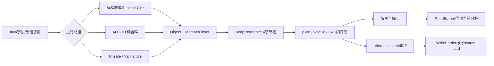
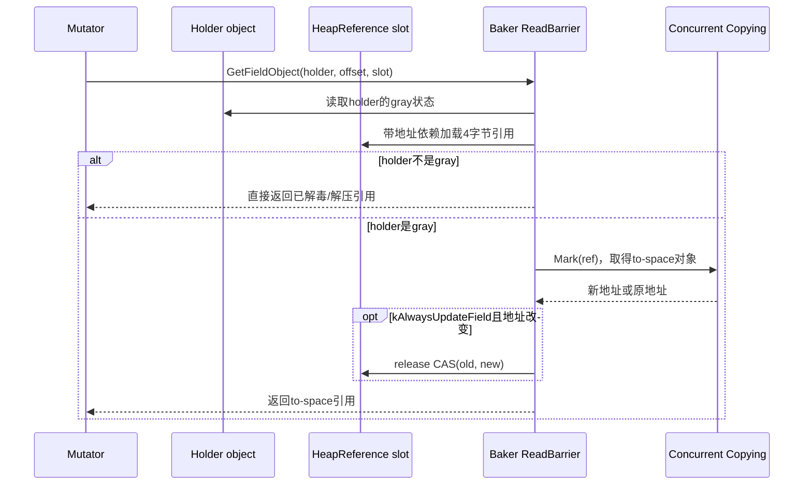
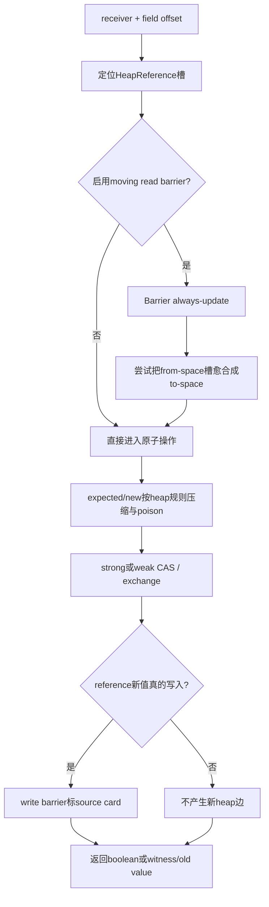

# 第586章 Android ART HeapReference 与对象字段访问链：压缩引用、Volatile/CAS、Read Barrier、Poisoning、Unsafe 与 VarHandle

> 源码基线：Android 11 / API 30 / `android-11.0.0_r48`。本章只在 macOS 阅读源码，不实际编译。第585章解释“引用写入后，GC怎样通过卡表补扫”；本章继续回答更靠近字段槽的问题：Java对象引用究竟怎样压成4字节，普通/volatile/CAS访问怎样落到内存序，移动GC为什么让一次看似普通的读取或CAS必须先经过read barrier。

## 1. 先给整章结论

在ART r48中，Java heap里的对象引用字段由固定4字节的`HeapReference<T>`承载，即使native进程是64位也不把每个字段扩成8字节。普通读取/写入使用“ordinary Java data”语义，volatile使用顺序一致的原子访问；引用读取还可能经过Baker或table-lookup read barrier，把from-space身份转换为to-space身份。Unsafe和VarHandle并没有获得绕过GC协议的特权：访问heap reference时仍要压缩/解压、read barrier和write barrier，CAS前还必须解决“槽里是旧地址、expected却是新地址”的移动GC假失败。

## 2. 本章先分清四个东西

第一是Java语言里的“对象引用”；第二是heap对象字段里保存的4字节编码；第三是ART C++暂时使用的`ObjPtr<T>`或`T*`；第四是JNI `jobject`句柄。它们可指向同一逻辑对象，却不是同一种位模式，也不允许互相直接强转后长期保存。

## 3. 为什么从字段槽开始读最清楚

普通赋值、反射、JNI、Unsafe、VarHandle和编译器内联最终都要读写对象中的某个槽。只要抓住“如何定位槽、如何编码值、以什么内存序访问、何时补GC屏障”四问，就不会被众多API名字带偏。

## 4. 从Java访问到底层槽的总图



图里`ReadBarrier`主要保护“读到的对象身份”，`WriteBarrier`主要保护“GC之后还会补扫新写入的边”。两者不是一对可互相替代的读写内存栅栏。

## 5. 本章源码地图

核心表示在`art/runtime/mirror/object_reference.h`与`object_reference-inl.h`；对象字段封装在`mirror/object.h`与`object-inl.h`；普通Java数据原子包装在`art/libartbase/base/atomic.h`；移动读取协议在`read_barrier.h/-inl.h`；poison开关在`heap_poisoning.h`；Unsafe native入口在`runtime/native/sun_misc_Unsafe.cc`；VarHandle解释器实现位于`mirror/var_handle.h/.cc`；ARM64内联路径在`compiler/optimizing/intrinsics_arm64.cc`。

## 6. heap reference固定为4字节

`object_reference.h`末尾用`static_assert(sizeof(HeapReference<Object>) == kHeapReferenceSize)`锁住布局，而`kHeapReferenceSize`为`sizeof(uint32_t)`。因此64位ART进程中的Java对象字段仍可保持紧凑；native指针宽度与managed heap reference宽度必须分账。

## 7. 4字节能表示对象的前提

`PtrCompression::Compress()`先把指针转成`uintptr_t`，再截为`uint32_t`；这要求可被这种reference表示的heap对象位于low 4GiB可编码范围。它不是把任意64位地址做通用压缩，也没有保存丢掉的高32位。

## 8. “压缩”不是位移编码

r48这里没有把地址减heap base、右移对齐位或存对象编号；未开启poison时，编码就是地址低32位。阅读其他VM或新版ART的compressed pointer设计时，不应把它们的base+offset模型倒灌到本章。

## 9. null为什么仍是0

null指针转成整数是0；不开poison时保持0，开启poison后做负号仍是0。于是`Clear()`可以直接写0，`IsNull()`也只需比较编码是否为0，不必先解压。

## 10. `ObjectReference`是值类型

`ObjectReference<kPoisonReferences,T>`只有普通`uint32_t reference_`，`Assign()`直接赋值，没有声明原子字段访问。它适合作为一个压缩引用值的包装，不代表“位于heap对象内且可能被并发原子更新”的槽。

## 11. `HeapReference`为什么单独存在

heap对象中的引用字段可能被mutator、GC转发更新、CAS或volatile访问，所以`HeapReference<T>`内部是`Atomic<uint32_t>`。它与`ObjectReference`接口相似，但注释明确说“not a value type”并支持atomic access。

## 12. `CompressedReference`故意不poison

`CompressedReference<T>`继承`ObjectReference<false,T>`，模板参数固定为false。它用于`StackReference`与GC roots；因此“构建启用heap poisoning”不等于进程里所有4字节引用值都被取负。

## 13. 三种引用表示的速查

`HeapReference`：heap内部字段、4字节、原子包装、可poison；`CompressedReference`：栈槽/GC root、4字节、明确不poison；`ObjPtr`：C++受mutator-lock与生命周期约束的临时对象指针包装。看见“压缩引用”四字还不足以判断是哪一种。

## 14. `MANAGED PACKED(4)`约束什么

这些类与managed对象布局共享，需要避免平台相关的额外padding，所以使用4字节packing。它约束C++镜像布局能与Java对象内存对齐，不表示所有字段都天然满足任意宽度原子操作要求。

## 15. heap poisoning的真实算法

`PtrCompression<true,T>`编码时对地址整数取负，解码时再取负恢复。该变换可逆且便宜；若native代码错误地把槽内编码直接当指针解引用，通常会更快暴露，而不是悄悄访问一个看似有效的对象。

## 16. poisoning不是安全加密

它没有密钥、随机数、权限隔离或完整性校验，任何知道规则的代码都能还原。它是调试/加固错误路径的表示变换，不能防止攻击者理解地址，也不能代替内存安全机制。

## 17. 编译期开关决定heap是否poison

`ART_HEAP_POISONING`定义后导出`USE_HEAP_POISONING`，再令`kPoisonHeapReferences=true`；否则为false。这是构建期常量，模板和编译器可消除不用的分支，不是每次字段访问读取一个运行时设置。

## 18. `ObjPtr` poisoning是另一回事

`ObjPtr`在debug build中还有自己的thread-cookie poisoning/校验，用来发现跨错误线程或不合规生命周期使用。它与“heap slot中的32位值取负”目标、表示和开关都不同，不能因名字相同就合并解释。

## 19. `ObjPtr`不是跨线程所有权容器

`ObjPtr`适合持有mutator-lock期间的临时对象地址；移动、suspension和线程边界都可能破坏裸地址假设。需要跨safepoint保活时应使用Handle/GcRoot/JNI引用等受GC访问的槽，而不是把`ObjPtr`复制到全局变量。

## 20. `MemberOffset`是对象内字节偏移

`Object::GetField...`用`reinterpret_cast<uint8_t*>(this) + field_offset.Int32Value()`定位字段，因此offset以对象起始地址为基准、单位为byte。它不是字段序号，也不是一个可脱离receiver单独解引用的native地址。

## 21. offset不能当稳定ABI常量

字段布局受类定义、父类、ART布局规则和版本影响。Unsafe通过运行时API取得offset，VarHandle的`FieldVarHandle`保存`ArtField*`并在访问时取`ArtField::GetOffset()`；把一次运行取得的数字硬编码到另一版本或另一类并不安全。

## 22. `jfieldID`与offset不是同一概念

JNI field ID在ART中可解码成`ArtField*`，而VarHandle辅助函数再从该field取offset。Unsafe的`objectFieldOffset()`对Java暴露的是数值offset。两者都可最终定位槽，但一个是字段元数据身份，一个是当前布局中的字节位置。

## 23. primitive普通读取的语义

`Atomic<T>::LoadJavaData()`用`memory_order_relaxed`，注释将其定义为ordinary Java data：不排序其他内存访问、允许数据竞争；同一位置的load甚至没有额外“cache coherence”承诺。这里的`Atomic`包装不等于Java `volatile`。

## 24. primitive普通写入的语义

`StoreJavaData()`同样用relaxed store。这样做是为了在C++中承载Java允许的racy ordinary field行为，而不是宣称存在数据竞争的Java程序具有开发者期待的跨线程发布关系。

## 25. long/double的特殊注释

`LoadJavaData/StoreJavaData`合同明确允许long和double按两个32位部分访问。不能从C++模板名`Atomic<int64_t>`直接推导普通Java 64位字段在所有目标架构都享有volatile同等级的原子性与排序。

## 26. Object/HeapReference的volatile C++路径使用`seq_cst`

`HeapReference::AsMirrorPtr<true>()`调用`reference_.load(memory_order_seq_cst)`，`Assign<true>()`调用seq_cst store；Object层primitive volatile setter/getter也走对应强原子访问。这是本版本C++路径的实现选择，足以满足Java volatile要求；编译器后端可用目标架构上等价的更精确指令序列，第71节会看到ARM64的release store。

## 27. 实现更强不等于规范语义合并

即使r48某路径用seq_cst实现`getAcquire`或`setRelease`，API仍表达不同的允许优化边界。写学习笔记时应说“r48这条解释器路径保守地用了更强操作”，不能说acquire、opaque、volatile在Java层本来就是同一种语义。

## 28. `GetFieldAcquire`是显式较弱入口

`Object::GetFieldAcquire<T>()`直接对字段地址做`memory_order_acquire` load。它说明Object层并非只有plain与seq_cst两档；不同调用者可选择精确内存序，但引用字段还多一层read barrier问题。

## 29. 内存序只回答排序，不回答对象搬迁

acquire/release/seq_cst约束线程间内存操作可见顺序，却不会把from-space旧地址自动变成to-space新地址。移动GC下，哪怕用最强seq_cst load，得到的编码仍可能需要read barrier转发。

## 30. `GetFieldObject`的三步

它先校验receiver，再计算raw field address并转成`HeapReference<T>*`，最后调用`ReadBarrier::Barrier<T,kIsVolatile,kReadBarrierOption>(this,offset,slot)`。返回值代表字段所指对象，不是“字段对象”或槽地址。

## 31. volatile参数传入read barrier

`kIsVolatile`最终控制`HeapReference::AsMirrorPtr<kIsVolatile>()`的底层load顺序。read barrier并不抹掉volatile：它把“怎样加载槽”和“加载后怎样获得当前对象身份”组合起来。

## 32. `kWithoutReadBarrier`必须有证明

模板允许调用者跳过read barrier，常见于只读取移动前后都不变的常量primitive信息，例如`SizeOf()`沿class读取固定对象大小。它不是普通性能开关；对可移动referent随意跳过会泄漏from-space地址。

## 33. `SetFieldObjectWithoutWriteBarrier`做什么

它处理transaction旧值记录、receiver/new value校验、定位slot，然后调用`HeapReference::Assign<kIsVolatile>`。函数名只说“不做GC write barrier”，并没有跳过压缩、poison或volatile内存序。

## 34. 外层setter补上卡屏障

`SetFieldObject`先完成slot store；new value非null时再调用`WriteBarrier::ForFieldWrite`并做debug赋值检查。第585章的card标记因此位于对象字段表示层之上，记录source容器而不改变slot编码。

## 35. transaction与字段内存序分开

AOT transaction活跃时先读取并记录旧值，以便失败回滚；实际字段仍按`kIsVolatile`选择访问，并由外层补write barrier。transaction log既不是volatile fence，也不是GC remembered set。

## 36. reference CAS先统一编码域

`CasFieldObjectWithoutWriteBarrier`把expected和new value都通过`PtrCompression<kPoisonHeapReferences,Object>::Compress()`转换成slot使用的32位形式，再在`Atomic<uint32_t>`上CAS。直接拿unpoisoned `ObjPtr`低32位比较会在poison构建中永远不匹配。

## 37. strong与weak是成功条件差异

`CASMode::kStrong`在值相等且无竞争失败时应成功；`kWeak`允许spurious failure，适合外层循环。strong/weak并不自动决定acquire、release或seq_cst，ART接口把`CASMode`和`memory_order`分别传入。

## 38. CAS内存序是另一个维度

同一个strong CAS可以是relaxed、release或seq_cst；同一个weak CAS也可选择不同排序。读代码时至少记录“比较是否允许假失败”和“成功/失败的内存排序”两列，不能只写“这是原子操作”。

## 39. CAS成功才需要常规write barrier

`CasFieldObject()`只有在CAS返回success后才标source card；失败没有安装new value，自然没有新增heap边。null new value进入屏障后仍会被null check跳过。

## 40. Compare-and-exchange返回witness

`CompareAndExchangeFieldObject()`做strong seq_cst CAS；无论成功与否，都把CAS更新后的`old_ref`解压成witness返回。成功时witness等于expected并完成替换，失败时witness是观察到的实际旧值。

## 41. 一次Baker引用读取的时序



图中检查的是holder对象的gray状态，不是先去读referent再检查referent颜色；这正是初学Baker屏障最容易颠倒的一点。

## 42. 为什么Baker看holder是否gray

CC把需要read barrier处理其字段的对象标成gray。若holder不是gray，其引用字段应满足当前读取协议；若holder是gray，字段里的referent可能仍是from-space，读取时必须`Mark(ref)`并返回当前身份。

## 43. gray bit位于对象头协议

第575章看到LockWord还携带GC read-barrier state。Baker快路径从holder对象头读该状态，不需要每次先查询一个外部转发表；对象头与field load之间的次序因此是正确性的组成部分。

## 44. fake address dependency不是实际偏移

`IsGray(obj,&fake_address_dependency)`保证该值最终为0，随后将它与slot地址按位或。CPU看到field地址依赖前一次gray load，ART借此避免额外load-load barrier；逻辑地址仍是原slot，不会偏移到其他字段。

## 45. 为什么不能让编译器优化掉依赖

若两个load可自由重排，线程可能先取旧slot、后才看到holder非gray/gray状态的变化，破坏Baker协议假设。源码用专门接口与零依赖表达硬件排序技巧，不能简化成普通局部变量0。

## 46. `Mark(ref)`的返回值才可交给mutator

holder为gray时，read barrier slow path调用collector entrypoint；若对象已搬迁则返回to-space地址，若无需搬迁可返回原地址。调用者使用的是这个结果，而不是固执地继续使用最初load到的编码。

## 47. 默认读取不一定自愈slot

`ReadBarrier::Barrier`默认`kAlwaysUpdateField=false`。Baker路径即使返回了新地址，也可以不把字段从old_ref改成new_ref；正确性靠本次返回值，后续读取可能再次进入协议。不要把read barrier一律描述成forwarding pointer回写器。

## 48. `kAlwaysUpdateField`何时必要

CAS/compareExchange/exchange要直接比较slot位模式，expected通常已经是to-space身份；若slot仍保存同一对象的from-space地址，比较会假失败。因此Unsafe和VarHandle的引用原子更新先请求read barrier强制尝试更新slot。

## 49. 自愈CAS失败为什么可以接受

read barrier以release CAS做`old_ref→new_ref`；若失败，通常说明mutator已把字段改成另一个值。屏障不能覆盖新写入，后续真正CAS会按当前槽重新判断，所以自愈失败不是要无限强行覆盖的错误。

## 50. table-lookup路径的判定不同

table-lookup read barrier先读referent，再查询`ReadBarrierTable::IsSet(old_ref)`；命中才Mark并CAS更新字段。它不像Baker那样以holder gray bit为快路径条件，因此解释时需按配置分支分别描述。

## 51. table-lookup通常会尝试更新字段

该分支发现old_ref需要转发且新旧不同后直接release CAS更新，没有受`kAlwaysUpdateField`条件控制。也就是说同一个Barrier模板参数在不同read-barrier实现里的具体作用并非完全对称。

## 52. Brooks在r48仍是TODO

源码的Brooks分支写着“To be implemented”并直接读取slot。可以说明框架预留该模式，但不能凭其他VM的Brooks pointer知识声称r48已经完成并用于常规Android运行。

## 53. 无read barrier配置会直接读取

若`kUseReadBarrier=false`或显式`kWithoutReadBarrier`，模板走`HeapReference::AsMirrorPtr<kIsVolatile>()`。仍会按配置解poison和按volatile选择load，只是不调用移动collector的Mark/转发逻辑。

## 54. root read barrier没有holder

GC root位于线程栈、HandleScope、JNI表等处，不属于某个普通holder对象，不能检查holder gray bit。`BarrierForRoot`改查当前Thread的`GetIsGcMarking()`，必要时Mark root并在table-lookup路径原子更新root槽。

## 55. `CompressedReference` root为何单独重载

它保存的是明确unpoisoned的32位值，更新时需要先构造old/new `CompressedReference`再把槽视为Atomic做CAS。若套用HeapReference的poison规则，root比较和更新就会使用错误编码域。

## 56. root CAS也允许输给并发更新

table-lookup root self-heal使用strong relaxed CAS；失败意味着其他线程/GC已经改写root，不应覆盖。这里relaxed足够用于“条件替换地址身份”，整体GC同步由外层协议提供，而非靠这一次CAS建立Java发布关系。

## 57. `IsMarked()`不是普通字段getter

它在未启用read barrier、ref为null或当前线程不在GC marking时直接返回ref；只有CC正在标记才问collector的`IsMarked`。它回答“该引用对应的当前标记/转发身份”，不负责定位某个holder field。

## 58. to-space invariant检查是诊断层

`AssertToSpaceInvariant`仅在相关debug常量开启时执行，并跳过null或Runtime/Heap/CC尚未完整建立的startup窗口。不能把debug CHECK当成release构建每次访问都付出的功能成本。

## 59. read barrier与write barrier的对照

读屏障输入通常是holder+slot，输出“这次应使用的referent”；写屏障输入是source对象+new value，输出dirty card副作用。前者解决搬迁身份，后者解决并发/局部扫描遗漏新边；内存fence又是第三类概念。

## 60. Exchange为什么也要预先read barrier

exchange虽然不比较expected，却要把“旧值”返回给Java。如果槽内仍是from-space引用，直接exchange后返回旧编码会泄漏旧身份；VarHandle因此先强制read-barrier更新，再执行seq_cst exchange。

## 61. Exchange的write barrier时机

`ExchangeFieldObject()`完成原子替换、解压old value、记录transaction后，对new value调用write barrier。默认屏障自己处理null；由于exchange必然安装新值，不需要CAS success条件。

## 62. CompareExchange的debug前置条件

Object层在debug build对witness执行to-space invariant检查，注释明确要求caller已经对reference field做read barrier。这解释了为什么VarHandle/Unsafe的预处理不是可选性能细节，而是底层API合同。

## 63. 移动GC中的“逻辑相等、位模式不等”

from-space地址F和to-space地址T可代表同一逻辑Java对象，但32位编码不同。Java `==`在屏障后比较对象身份；裸CAS却比较槽位模式。若不先转发/自愈，expected=T与slot=F会产生语义上的假失败。

## 64. 这不是传统ABA问题

这里的核心是同一对象迁移产生两个暂时地址，而ABA是值A→B→A后CAS无法察觉中间变化。二者都提醒我们“位相等与历史/身份语义不同”，但修复机制和问题来源不能混叫。

## 65. Unsafe native入口仍先解JNI句柄

`Unsafe_compareAndSwapObject`用`ScopedFastNativeObjectAccess`把`javaObj`、expected和new value从`jobject`解成`ObjPtr<Object>`。`jobject`不是heap裸地址，offset才与解码后的receiver组合成field地址。

## 66. Unsafe引用CAS的预愈合步骤

启用read barrier时，native入口计算`HeapReference<Object>* field_addr`，调用`Barrier<...,kAlwaysUpdateField=true>`；随后才以strong、seq_cst调用`CasFieldObject<false>`。这样expected与slot尽量都处于to-space编码域。

## 67. Unsafe primitive CAS不需要移动转换

int/long数值不会被GC搬迁，native入口可直接调用对应strong sequentially-consistent CAS。它仍需字段对齐和合法offset等调用合同，但没有reference poison/read/write barrier三件套。

## 68. Unsafe getObject仍走read barrier

`Unsafe_getObject`调用`Object::GetFieldObject`，volatile版调用`GetFieldObjectVolatile`，然后把结果加入JNI local reference返回。名字叫Unsafe并不意味着返回一个未经GC处理的heap slot位模式。

## 69. Unsafe putObject仍走write barrier

普通、volatile和ordered三个object setter最终都调用`SetFieldObject`或`SetFieldObjectVolatile`，因此会压缩/poison并标card。绕过Java访问检查不等于可以绕过collector记账。

## 70. native ordered store的实现

r48的`Unsafe_putOrderedObject`先执行`atomic_thread_fence(memory_order_release)`，再做普通`SetFieldObject`；int/long ordered同样如此，源码还有未来使用release store可能更快的注释。该路径表达release发布，但具体指令可与编译器intrinsic不同。

## 71. ARM64 ordered/volatile store的实现

优化intrinsic的`GenUnsafePut`对volatile或ordered都调用`StoreRelease`，plain才用普通Store。reference value若开启heap poison，先复制到临时寄存器并poison后写槽；card barrier使用的仍是未poison原值来做null判断。

## 72. native与intrinsic可实现同一语义但指令不同

native slow path用release fence加plain store，ARM64内联用release store；二者都须满足API要求。学习源码应比较可观察合同，而非因为汇编序列不相同就断言某一路错误。

## 73. Unsafe raw-address API是另一条路径

`get/put...(long address)`、`allocateMemory/freeMemory`等直接处理native地址，不以Java receiver+MemberOffset定位heap field，也不会自动执行read/write barrier。把heap对象地址偷出来交给这些API属于违反GC移动合同的用法。

## 74. array base与scale如何组成offset

Unsafe数组元素位置通常是`baseOffset + index * indexScale`；native实现按component type返回`Array::DataOffset(...)`和component size。它们是当前VM布局信息，不应假设所有对象数组元素都是native指针宽度——reference slot仍是4字节。

## 75. ARM64 CAS为什么提前标card

`GenCas`对reference在进入exclusive load/store循环前就调用`MarkGCCard`，注释是“assuming new value is stored”。CAS最终失败也可能留下dirty card；这是安全的false positive，只增加后续扫描，与C++ `CasFieldObject`成功后才标card不同。

## 76. ARM64 CAS怎样处理poison

exclusive load后先unpoison old value再与expected比较；尝试store前poison new value，store-exclusive返回后再把寄存器中的value恢复unpoison。比较域、槽存储域和Java可见对象身份由此保持一致。

## 77. Baker CAS slow path接受两种旧地址

若主路径old value不等expected，slow path先Mark old value；若标记后的to-space值等于expected，就知道原槽是同一对象的from-space编码。随后CAS循环同时接受expected或那个old from-space值，避免GC迁移造成错误失败。

## 78. Unsafe/VarHandle引用CAS完整图



ARM64 Unsafe intrinsic可在CAS前保守标card，所以图中的“真的写入才标”代表Object C++主语义；机器码实现允许把J提前，形成无害false positive。

## 79. VarHandle比Unsafe多了类型化协议

VarHandle对象保存variable type、0—2个coordinate types和access-mode bitmask；调用时根据访问模式构造/匹配MethodType并做参数转换。Unsafe更像“receiver+裸offset+调用者自担类型责任”。

## 80. AccessMode不是只有get/set

r48枚举包含plain、volatile、acquire、release、opaque、strong/weak compare-and-set、compare-and-exchange、get-and-set、数值add及bitwise更新等31种模式。具体VarHandle通过bitmask声明支持哪些，不是每种variable type都能执行全部操作。

## 81. coordinate types说明“在哪里访问”

instance field通常需要一个receiver coordinate；static field可没有receiver coordinate；array element需要array与index两个coordinates；byte array/buffer view还要处理偏移、对齐与native byte order。variable type则说明槽中值的Java类型。

## 82. `FieldVarHandle`保存字段身份

C++镜像类的`art_field_`是int64承载的`ArtField*`，访问时由该元数据取得offset和static/instance信息。它不是把一次反射得到的`jfieldID`原样当Java对象字段，也不是只保存字段名再每次查找。

## 83. obsolete field需要访问者修补

`FieldVarHandle::VisitTarget`可让运行时更新obsolete field目标，说明长期存在的VarHandle必须跟随类重定义/obsolete元数据协议。硬编码offset没有这层可维护身份，因此不能视为等价替代。

## 84. primitive VarHandle用Accessor访问raw address

`Object::Accessor<T>`接收字段的`T*`，`FieldAccessViaAccessor`负责定位与transaction更新，具体Accessor再做atomic load/store/CAS。这个分层让int、long、float等共享调度框架，同时为不支持的组合走fatal不可达保护。

## 85. r48解释器的plain映射

primitive `GetAccessor`和`SetAccessor`分别使用`memory_order_relaxed` load/store，对应plain access。reference plain则调用`GetFieldObject`/`SetFieldObject`，在relaxed slot访问之外仍叠加read/write barrier。

## 86. r48解释器把多种读模式升格

在primitive field dispatch里，`getAcquire`、`getOpaque`和`getVolatile`共用`GetVolatileAccessor`，即seq_cst load；reference dispatch也三者共用`GetFieldObjectVolatile`。这是简单保守实现，而不是三个API在抽象语义上无差别。

## 87. r48解释器把多种写模式升格

`setOpaque`、`setRelease`和`setVolatile`共用seq_cst `SetVolatileAccessor`；reference同样走volatile setter。编译器intrinsic仍可能生成更贴近模式的机器指令，所以不要用这一段解释器switch预测所有执行路径的性能。

## 88. r48解释器把原子更新也保守升格

primitive strong/weak CAS、compareExchange、getAndSet/add/bitwise别名都选seq_cst；reference版本也以seq_cst Object helper完成。Acquire/Release后缀在这个dispatch里多处合并，但类型检查、返回值和weak允许假失败仍保持各自语义。

## 89. VarHandle reference原子操作先愈合

`ReadBarrierForVarHandleAccess()`构造field slot，固定以非volatileload调用read barrier，并令`kAlwaysUpdateField=true`。注释解释得很直接：若对象正在移动，不先确保槽为to-space，CAS/compareExchange/exchange会错误失败或返回旧身份。

## 90. 为什么预读不必volatile

预读的目的只是把旧地址规范化到to-space，不承担该VarHandle访问模式的Java同步语义；真正的CAS/exchange随后以seq_cst执行。把预读也做volatile不会修复额外身份问题，只会增加不必要的排序成本。

## 91. VarHandle reference更新仍标card

set走`SetFieldObject`，CAS走`CasFieldObject`，compareExchange/exchange走相应Object helper，所以成功安装非null引用后仍进入第585章write barrier。GetAndAdd与bitwise对Object类型被判为unreachable，因为引用没有这些算术语义。

## 92. 第一段真实Java：poison构建下验证Unsafe CAS

下面逐字摘自`art/test/004-UnsafeTest/src/Main.java:171`。测试故意不使用null作为主要比较值，因为null取负仍为0，无法充分覆盖heap poisoning下的压缩/解毒比较。

```java
    // We do not use `null` as argument to sun.misc.Unsafe.compareAndSwapObject
    // in those tests, as this value is not affected by heap poisoning
    // (which uses address negation to poison and unpoison heap object
    // references).  This way, when heap poisoning is enabled, we can
    // better exercise its implementation within that method.
    if (unsafe.compareAndSwapObject(t, objectOffset, new Object(), new Object())) {
      System.out.println("Unexpectedly succeeding " +
          "compareAndSwapObject(t, objectOffset, new Object(), new Object())");
    }
    Object objectValue2 = new Object();
    if (!unsafe.compareAndSwapObject(t, objectOffset, objectValue, objectValue2)) {
      System.out.println("Unexpectedly not succeeding " +
          "compareAndSwapObject(t, objectOffset, objectValue, objectValue2)");
    }
```

首次expected是一个新对象，与槽里对象不同，应失败；第二次expected为真实旧值，应成功替换。测试验证的是引用位模式转换后的CAS正确性，不是只验证Java对象赋值。

## 93. 第一段源码还告诉我们什么

注释直接确认poison算法是address negation，也说明好的测试要选择能区分“poison路径执行了”和“恰好不用转换也成功”的输入。只拿null做CAS，即使实现漏掉negation也可能全部通过。

## 94. 第二段真实Java：VarHandle访问模式与返回值

下面逐字摘自`art/test/712-varhandle-invocations/src/VarHandleTypeConversionTests.java:1127`。它同时覆盖volatile、compareExchange witness、compareAndSet、plain以及release/acquire。

```java
        @Override
        public void doTest() {
            assertEquals(INITIAL_VALUE, vh.getVolatile(this));
            vh.setVolatile(this, null);
            Widget rw = (Widget) vh.compareAndExchange(this, null, WidgetChild.ONE);
            assertEquals(null, rw);
            assertEquals(WidgetChild.ONE, this.w);
            WidgetChild rwc =
                    (WidgetChild)
                            vh.compareAndExchangeRelease(this, WidgetChild.ONE, WidgetChild.TWO);
            assertEquals(WidgetChild.TWO, w);
            rwc = (WidgetChild) vh.compareAndExchangeAcquire(this, WidgetChild.TWO, Widget.ONE);
            assertEquals(Widget.ONE, w);
            assertEquals(false, (boolean) vh.compareAndSet(this, null, null));
            assertEquals(true, vh.compareAndSet(this, Widget.ONE, Widget.TWO));
            assertEquals(Widget.TWO, w);
            vh.set(this, null);
            assertEquals(null, (Widget) vh.get(this));
            vh.setRelease(this, WidgetChild.ONE);
            assertEquals(WidgetChild.ONE, (WidgetChild) vh.getAcquire(this));
```

`compareAndExchange`返回替换前的witness，不是boolean；`compareAndSet`才返回是否成功。`setRelease/getAcquire`在API层表达发布—获取配对，即使r48解释器内部暂时以更强seq_cst实现。

## 95. VarHandle类型转换边界

示例中field声明类型可接收`WidgetChild`，返回处再显式cast。VarHandle调用先根据access mode匹配MethodType与coordinate/value类型；C++ dispatch中的模板类型是在前置验证完成后选择的，不意味着任意错误类型能到达reinterpret_cast字段地址。

## 96. 第三段真实Java：在持续GC中压测引用CAS

下面逐字摘自`art/test/160-read-barrier-stress/src/Main.java:233`。小heap中持续分配迫使collector工作，同时反复验证多个field offset的成功和失败结果。

```java
        // Continually check Unsafe.compareAndSwapObject() while allocating
        // over 64MiB memory (with heap size limited to 16MiB), ensuring we run GC and
        // stress the read barrier implementation if concurrent collector is enabled.
        for (int i = 0; i != 64 * 1024; ++i) {
            allocateAtLeast1KiB();
            ManyFields mf = manyFields;  // Load the volatile `manyFields` once on each iteration.
            // Test Unsafe.compareAndSwapObject().
            assertEqual(false, unsafe.compareAndSwapObject(mf, f0000Offset, f1024, f4444));
            assertEqual(false, unsafe.compareAndSwapObject(mf, f0001Offset, f1024, f4444));
            assertEqual(true, unsafe.compareAndSwapObject(mf, f1024Offset, f1024, f4444));
            assertEqual(true, unsafe.compareAndSwapObject(mf, f1024Offset, f4444, f1024));
            assertEqual(false, unsafe.compareAndSwapObject(mf, f1024Offset, f4444, f1024));
            assertEqual(false, unsafe.compareAndSwapObject(mf, f4444Offset, f1024, f4444));
            assertEqual(false, unsafe.compareAndSwapObject(mf, f4998Offset, f1024, f4444));
            assertEqual(false, unsafe.compareAndSwapObject(mf, f4999Offset, f1024, f4444));
        }
```

关键不是循环次数本身，而是把对象搬迁与CAS比较交错。若实现把from-space编码直接与to-space expected比较，明明指向同一对象的`f1024`也可能偶发失败。

## 97. 测试为什么读取一次volatile holder

每轮先把静态volatile `manyFields`装进局部`mf`，确保本轮后续CAS围绕同一个已读receiver展开，也让holder加载具有所需可见性。它没有让所有内部普通fields自动变volatile，字段CAS仍由Unsafe自己的原子语义保证。

## 98. static field访问并非对象实例offset照搬

ART的static field值存放在Class对象相关存储中，FieldVarHandle先从ArtField解析static身份与承载对象；instance field才以传入receiver为base。只看到最终`Object+offset`不代表二者入口、coordinate数和类初始化要求相同。

## 99. array reference更新也要两种GC屏障

读Object[]元素时需要read barrier获得当前referent；写入或成功CAS非null元素后需要array/card write barrier记录source数组。数组下标检查、类型兼容检查与屏障是三层不同责任。

## 100. 对齐问题不能由atomic名字自动解决

VarHandle byte-array/buffer view会检查访问模式允许的对齐；普通field布局由ART保证适当位置。把任意native address或错误offset reinterpret成`std::atomic<T>*`，不会自动修复未对齐或越界访问。

## 101. volatile不让复合操作自动原子

一次volatile get和一次volatile set各自有序，不等于“read-modify-write”整体不可被插入。需要条件更新时使用CAS/compareExchange/getAndSet等真正单次原子操作，或使用锁保护复合不变量。

## 102. CAS成功也不等于业务事务成功

CAS只保证这个槽从expected换成new value。多个字段的一致更新、数据库事务、异常回滚或对象内部不变量仍需更高层协议；ART的AOT transaction参数更是运行时镜像写入回滚机制，不能类比成Java业务事务。

## 103. reference equality必须在屏障后理解

Java层看到的是经read barrier规范化后的对象身份；GC内部某个瞬间可能同时存在F/T两个地址。调试native代码时若打印/比较未经屏障的raw slot，观察到“地址不同”不等于Java `a != b`。

## 104. poisoning崩溃的诊断价值

若只在heap-poison构建崩溃，应优先查是否把`HeapReference`编码当裸指针、CAS expected/new未同域压缩、复制槽后漏解毒，或把`CompressedReference`错误按heap规则处理。关闭poison让错误消失只是在隐藏症状。

## 105. 常见误解一：64位进程字段就是8字节

错。ART r48 managed heap reference固定4字节，64位宽度主要出现在解压后的native pointer、`ObjPtr/T*`和某些runtime元数据。对象大小估算若按每个引用8字节会系统性偏大。

## 106. 常见误解二：所有压缩引用都被poison

错。heap内部`HeapReference`跟随`kPoisonHeapReferences`，而stack/root常用`CompressedReference<false>`。判断规则要看类型和存储位置，不能只看值宽度。

## 107. 常见误解三：volatile可省read barrier

错。volatile解决线程排序，可移动GC仍可能让加载值处于from-space。`GetFieldObjectVolatile`依然调用同一ReadBarrier模板，只把`kIsVolatile=true`传给底层slot load。

## 108. 常见误解四：Unsafe天然绕过GC

错。对Java heap object+offset的Unsafe引用get/put/CAS都接入Object/read/write barrier；只有raw native address那组API不走heap协议，而它也不能安全地替代heap field访问。

## 109. 常见误解五：失败CAS绝不产生GC副作用

C++ Object helper成功后才标card，但ARM64 Unsafe intrinsic为降低热路径复杂度可在CAS前保守标card，失败也留下dirty false positive。两者Java返回值相同，GC性能痕迹可以不同。

## 110. 常见误解六：r48实现等于VarHandle规范定义

错。解释器为了简单把多种弱序访问升格为seq_cst，不表示调用者可以依赖这种额外强度跨版本成立；优化编译路径也可能保留更精确的acquire/release/opaque实现。

## 111. 四个只读练习的目标

下面练习都只使用`rg`、`sed`、`awk`、`diff`等macOS命令读取源码，不编译、不生成源码产物、不修改仓库。请先进入`/Users/ninebot/androidSource`；每段最后的断言都应以退出码0结束。

## 112. 练习一：确认三种压缩引用的存储差异

```bash
set -euo pipefail
cd /Users/ninebot/androidSource
f=art/runtime/mirror/object_reference.h
rg -n 'class MANAGED (ObjectReference|HeapReference|CompressedReference)' "$f"
rg -n 'Atomic<uint32_t> reference_|uint32_t reference_|ObjectReference<false' "$f"
test "$(rg -c 'static_assert\(sizeof\(mirror::HeapReference' "$f")" -eq 1
```

你应看到ObjectReference是普通`uint32_t`，HeapReference是`Atomic<uint32_t>`，CompressedReference固定继承false-poison版本。最后只验证布局断言存在，不假装在macOS上运行目标Android二进制。

## 113. 练习二：追普通、volatile与CAS的字段入口

```bash
set -euo pipefail
cd /Users/ninebot/androidSource
f=art/runtime/mirror/object-inl.h
rg -n 'GetFieldObject\(|SetFieldObjectWithoutWriteBarrier|CasFieldObjectWithoutWriteBarrier|CompareAndExchangeFieldObject|ExchangeFieldObject' "$f"
sed -n '604,764p' "$f" | rg 'ReadBarrier::Barrier|Assign<kIsVolatile>|PtrCompression|memory_order_seq_cst|WriteBarrier::ForFieldWrite'
test "$(sed -n '604,764p' "$f" | rg -c 'WriteBarrier::ForFieldWrite')" -ge 3
```

阅读输出时按load、表示转换、atomic update、write barrier四层标注，不要把函数名含`Object`误解成访问的就是8字节native pointer。

## 114. 练习三：比较Unsafe native与ARM64 intrinsic

```bash
set -euo pipefail
cd /Users/ninebot/androidSource
n=art/runtime/native/sun_misc_Unsafe.cc
a=art/compiler/optimizing/intrinsics_arm64.cc
rg -n 'Unsafe_compareAndSwapObject|kAlwaysUpdateField|Unsafe_putOrderedObject' "$n"
rg -n 'static void GenUnsafePut|static void GenCas|Mark card for object assuming|MaybePoisonHeapReference' "$a"
test "$(rg -c 'Mark card for object assuming new value is stored' "$a")" -eq 1
```

确认native CAS会显式always-update字段，而ARM64 intrinsic有Baker专用slow path；再观察intrinsic在CAS前标card，理解失败操作仍可能产生无害dirty card。

## 115. 练习四：验证三段Java摘录逐字来自r48

```bash
set -euo pipefail
cd /Users/ninebot/androidSource
test "$(sed -n '171,184p' art/test/004-UnsafeTest/src/Main.java | shasum -a 256 | cut -d' ' -f1)" = 'e8f28b0bf585e8d707e9349bbd8a64ba3008fe1219e5e0479eca225fa4ca1ec6'
test "$(sed -n '1127,1146p' art/test/712-varhandle-invocations/src/VarHandleTypeConversionTests.java | shasum -a 256 | cut -d' ' -f1)" = '45ba7f19273c96888a9ef559a05753602aa5ed5a602c4caa63b8d7f625b27c87'
test "$(sed -n '233,248p' art/test/160-read-barrier-stress/src/Main.java | shasum -a 256 | cut -d' ' -f1)" = 'f72ecd462036a00e8d4b02de0c1758e9a5608539fb23870c09712b727e684893'
```

若任何断言失败，先检查源码是否仍是`android-11.0.0_r48`，再重新核对行号；不要为了让练习通过而改源码。哈希只证明这三个短区间与本章取材基线一致。

## 116. 一条可背下来的读取链

`receiver + MemberOffset → HeapReference<uint32_t> slot → plain/volatile load → unpoison/decompress → read barrier → 当前ObjPtr`。写入则是`ObjPtr → compress/poison → store/CAS → 成功安装非null引用 → source card dirty`。

## 117. 一条可背下来的CAS链

移动GC下先以always-update read barrier规范化slot；expected/new进入与slot相同的压缩/poison域；原子比较更新；boolean或witness按API返回；真正或保守假定写入reference后执行card barrier。少任一层都可能只在GC、poison或特定架构压力下暴露。

## 118. 复读后修正的六个易混点

第一，压缩不是base-relative算法；第二，CompressedReference不随heap poison；第三，Baker查holder gray而非referent gray；第四，默认Baker读取可不回写slot，only always-update用于原子更新前规范化；第五，VarHandle解释器把弱序模式升格只属r48实现；第六，ARM64失败Unsafe CAS可留下dirty card，与C++成功后标卡并不冲突。

## 119. 本章边界

本章没有证明所有CPU后端生成完全相同指令，也没有把JMM所有happens-before规则展开；重点是r48公共Object层、read barrier和ARM64代表性intrinsic。讨论Unsafe raw native memory时只说明它不自动参与heap屏障，不把危险用法写成可实践教程。

## 120. 下一章预告

第587章将沿`java.lang.ref.Reference`进入ART的ReferenceProcessor：区分Soft/Weak/Finalizer/Phantom的referent特殊扫描、discovered list、collector判活、Java ReferenceQueue入队、Finalizer zombie与Cleaner真正释放资源的完成点，把第581章的Cleaner和本章的字段屏障接回GC引用处理闭环。
