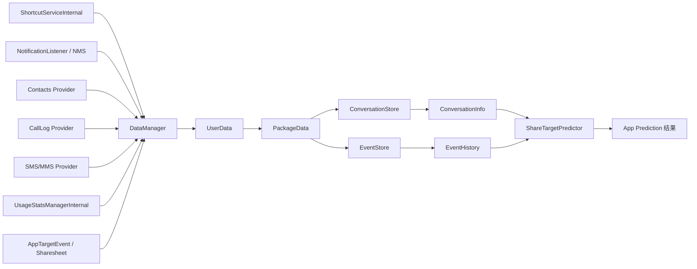
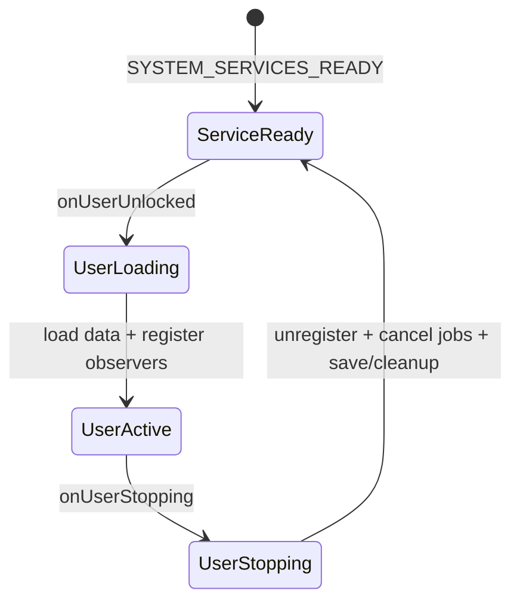
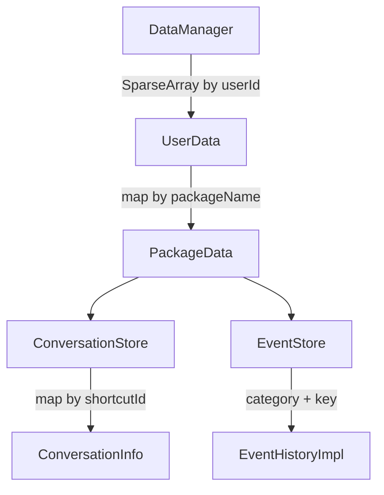
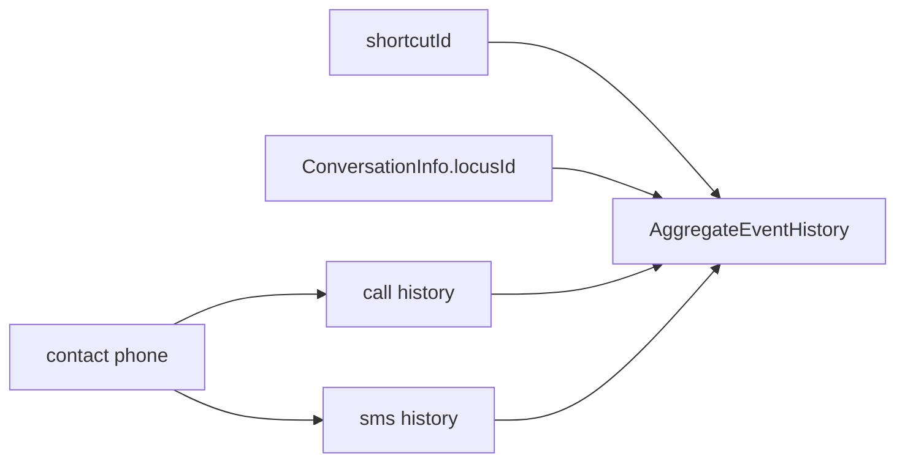
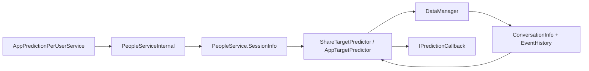
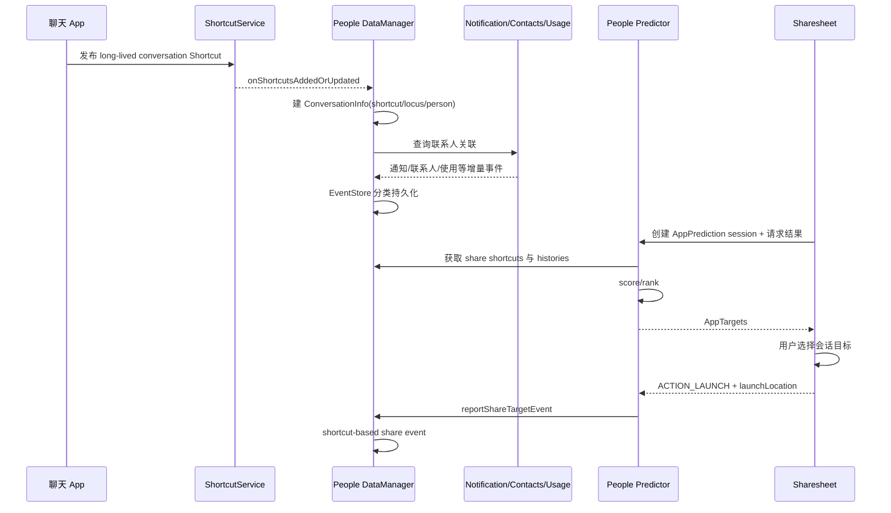

# 59 PeopleService、ConversationInfo 与联系人/会话数据聚合

> 源码版本：Android 11 / API 30 / `android-11.0.0_r48`  
> 学习方式：macOS 只读源码，不要求编译。  
> 版本说明：原计划的 Search UI Framework 在当前 Android 11 源码中不存在，因此本章改为本版本真实存在、且直接承接 App Prediction 的 PeopleService。  
> 本章目标：理解 Android 如何以 Conversation Shortcut 为主键，把联系人、通知频道、通知交互、通话、短信、应用使用和分享事件聚合成会话画像，并把这些数据提供给 Direct Share 等系统预测能力。

---

## 1. PeopleService 解决什么问题

系统想在分享面板中推荐“把照片发给小明”，不能只知道某个聊天 App 最近启动过。它还需要知道：

- 哪个 `ShortcutInfo` 代表和小明的对话；
- 该 shortcut 是否是 long-lived conversation；
- 它关联哪个 `Person`、联系人 URI 或电话号码；
- 最近是否收到、打开过该会话通知；
- 默认短信/电话应用中是否有与此号码的交互；
- 用户是否把会话设为重要、静音、气泡或降级；
- 最近分享目标、应用使用和前台事件怎样分布。

这些数据分散在 ShortcutService、NotificationManager、ContactsProvider、CallLog、SMS/MMS Provider 和 UsageStats 中。PeopleService 的任务是把它们按会话关联起来，形成可供系统内部预测与排序使用的数据层。

一句话理解：**PeopleService 不是通讯录，而是 system_server 内部的“人物/会话关系与交互历史聚合器”。**

---

## 2. 先区分五个对象

| 对象 | 角色 |
|---|---|
| `Person` | App 在 Shortcut/Notification 中描述的人物语义 |
| Contacts Provider 联系人 | 用户通讯录中的真实联系人记录 |
| `ShortcutInfo` | App 发布的可启动快捷方式，conversation 的根身份 |
| `ConversationInfo` | PeopleService 内部聚合后的会话元数据 |
| `EventHistory` | 与 shortcut/locus/号码/Activity 关联的时间事件历史 |

关键关系：

```text
ConversationInfo 以 shortcutId 为核心
→ 可带 LocusId
→ 可从 ShortcutInfo.Person 关联 Contact URI/phone
→ 可关联 NotificationChannel conversationId
→ EventHistory 再聚合通知、分享、通话、短信、使用事件
```

Person 不等于 Contacts 联系人；Shortcut 也不等于 NotificationChannel。PeopleService 做的是关联，不是把它们强行合并成同一种对象。

---

## 3. 整体架构



PeopleService 本身很薄，复杂工作集中在 `DataManager` 和 `data/`、`prediction/` 子包。

---

## 4. 核心源码地图

### 服务与内部接口

```text
frameworks/base/services/people/java/com/android/server/people/PeopleService.java
frameworks/base/services/core/java/com/android/server/people/PeopleServiceInternal.java
```

### 数据聚合层

```text
frameworks/base/services/people/java/com/android/server/people/data/
    DataManager.java
    UserData.java
    PackageData.java
    ConversationInfo.java
    ConversationStore.java
    Event.java
    EventList.java
    EventIndex.java
    EventHistory.java
    EventHistoryImpl.java
    AggregateEventHistoryImpl.java
    EventStore.java
    ContactsQueryHelper.java
    CallLogQueryHelper.java
    SmsQueryHelper.java
    MmsQueryHelper.java
    UsageStatsQueryHelper.java
```

### 预测层

```text
frameworks/base/services/people/java/com/android/server/people/prediction/
    AppTargetPredictor.java
    ShareTargetPredictor.java
    SharesheetModelScorer.java
    ConversationData.java
```

### 上游相关对象

```text
frameworks/base/core/java/android/content/pm/ShortcutInfo.java
frameworks/base/core/java/android/app/Person.java
frameworks/base/core/java/android/app/Notification.java
frameworks/base/core/java/android/app/NotificationChannel.java
```

---

## 5. PeopleService 是 LocalService，不是普通 Binder 服务

启动代码：

```java
public void onStart() {
    publishLocalService(PeopleServiceInternal.class, new LocalService());
}
```

它没有通过 `publishBinderService()` 暴露给 App，也不是 Manifest 中可由三方实现的 `android.app.Service`。

```text
PeopleService
→ 运行在 system_server
→ 发布 PeopleServiceInternal
→ 由 system_server 内其他服务通过 LocalServices 调用
```

这与上一章 `ContentSuggestionsService`、第 57 章远端 `AppPredictionService` 不同。PeopleService 是 AOSP 内置的数据和预测后端之一。

安全意义：联系人、通话、短信和通知聚合数据不会通过一个公开 Binder API 直接交给普通 App。

---

## 6. 启动与用户生命周期

`PeopleService` 在三个阶段委托 `DataManager`：

```text
PHASE_SYSTEM_SERVICES_READY → DataManager.initialize()
onUserUnlocked(user)        → DataManager.onUserUnlocked(userId)
onUserStopping(user)        → DataManager.onUserStopping(userId)
```

### 为什么等待 SYSTEM_SERVICES_READY

初始化需要取得：

- `ShortcutServiceInternal`；
- `PackageManagerInternal`；
- `NotificationManagerInternal`；
- `UserManager`。

这些依赖必须已由 SystemServer 启动并发布。

### 为什么等待用户解锁

会话与事件数据存放在用户数据目录，并需要访问 Contacts、SMS、CallLog 等用户数据。CE 存储在解锁前不可用，因此不能只在开机时无条件加载。



---

## 7. DataManager 初始化了哪些入口

全局初始化：

```java
mShortcutServiceInternal.addShortcutChangeCallback(...);
registerReceiver(ACTION_SHUTDOWN, ...);
```

每个用户解锁后的 `setupUser()` 还会：

- 从磁盘加载 `UserData` / `PackageData`；
- 更新默认拨号器和默认短信应用；
- 每 120 秒查询一次 UsageStats 新事件；
- 监听默认拨号器/短信 App 变化广播；
- 监听 Contacts 数据变化；
- 注册 system NotificationListener；
- 注册 PackageMonitor；
- system user 额外监听 CallLog 和 MMS/SMS；
- 调度周期性数据维护任务。

这不是一个单请求拉取所有数据的流程，而是一套长时间运行的增量同步系统。

---

## 8. 内存数据层级



层级含义：

```text
userId
  └─ packageName
       ├─ conversations[shortcutId]
       └─ event categories
            ├─ shortcut[shortcutId]
            ├─ locus[locusId]
            ├─ call[phoneNumber]
            ├─ sms[phoneNumber]
            └─ class[activityClass]
```

必须把 userId 放在第一层。同一个包名、shortcutId、电话号码在不同 Android 用户中不能共用同一数据记录。

---

## 9. ConversationInfo 的字段

Android 11 中核心字段：

```text
shortcutId
LocusId
contactUri
contactPhoneNumber
notificationChannelId
shortcutFlags
conversationFlags
```

conversation flags 可表达：

- important conversation；
- notification silenced；
- bubbled；
- demoted；
- Person important；
- Person bot；
- contact starred。

shortcut flags 则来自 `ShortcutInfo`，例如 long-lived、cached for notifications。

### 元数据与事件历史必须分开

```text
ConversationInfo：当前相对稳定的会话属性
EventHistory：带时间戳的交互序列和索引
```

“会话当前被设为重要”是 metadata；“昨天打开过三次通知”是 event history。

---

## 10. Conversation Shortcut 是根身份

`addOrUpdateConversationInfo(ShortcutInfo)` 以：

```text
userId + packageName + shortcutId
```

找到 `PackageData` 和旧 `ConversationInfo`，然后用 Builder 增量更新。

它会从 ShortcutInfo 提取：

- shortcut id；
- locus id；
- shortcut flags；
- persons 数组中的第一个 Person；
- Person 的 important/bot；
- Person URI 对应的 Contacts 信息。

因此 App 想让会话被系统正确理解，首先要发布符合 conversation 要求的 long-lived shortcut，并正确设置 Person/LocusId 等语义。PeopleService 不会凭聊天页面文字自动猜出会话 id。

---

## 11. Person 如何关联 Contacts

当 ShortcutInfo 带 `Person[]`，源码选择第一个 Person：

```java
Person person = shortcutInfo.getPersons()[0];
String contactUri = person.getUri();
```

若 URI 非空，`ContactsQueryHelper` 查询 Contacts Provider，得到：

```text
规范 contactUri
是否 starred
phoneNumber
```

并写入 ConversationInfo。

关键边界：

- App 提供的 Person URI 只是关联线索；
- ContactsQueryHelper 从系统通讯录确认并标准化；
- 找不到联系人时 conversation 仍可存在，只是没有联系人增强信息；
- 只看 persons[0] 是 Android 11 当前实现细节，多人会话不能因此被理解为只有一个参与者。

---

## 12. 联系人变化如何回写会话

每用户注册 `ContactsContentObserver`。变化时：

```text
ContactsQueryHelper.querySince(lastTimestamp)
→ 得到变化 contactUri、starred、phone
→ 遍历该 user 的 PackageData
→ ConversationStore.getConversationByContactUri()
→ Builder 基于旧 ConversationInfo 更新
→ addOrUpdate
→ 更新 lastUpdatedTimestamp
```

这说明 ConversationStore 不仅按 shortcutId 查询，还需要按 contactUri 建辅助索引。

注意当前实现的 selector 只保存找到的一条 conversation；阅读时要留意批量联系人变化、多个 App 会话关联同一联系人等实现局限，不能把 observer 当成完整 Contacts 镜像同步器。

---

## 13. 通知如何补充会话画像

`DataManager.NotificationListener` 是以 system service 身份为每个 user 注册的 `NotificationListenerService`。

### 通知发布

```text
onNotificationPosted(StatusBarNotification)
→ 校验 sbn.user == listener.user
→ 取 Notification.shortcutId
→ 确认 PackageData 中存在 conversation
→ active notification count +1
→ shortcut-based EventHistory 添加 NOTIFICATION_POSTED
```

### 通知移除

```text
active count -1
→ 全部清空时按条件 uncache shortcut
→ 若 remove reason == REASON_CLICK
→ 添加 NOTIFICATION_OPENED 事件
```

“通知消失”不等于“用户打开”：超时、App 取消、系统清理都可能移除，只有 `REASON_CLICK` 才记录 opened。

---

## 14. Conversation NotificationChannel 如何回写状态

`onNotificationChannelModified()` 通过：

```text
packageName + channel.getConversationId()
```

找到 ConversationInfo，然后更新：

- notificationChannelId；
- important conversation；
- demoted；
- notification silenced（importance <= LOW）；
- canBubble。

频道删除时这些通知设置恢复默认值。

这里有三种“重要”容易混淆：

```text
Person.isImportant()        → App 对人物的语义标注
Contact starred            → 用户在通讯录收藏
Channel important          → 用户/系统的会话通知重要级别
```

ConversationInfo 分别保存，预测模型可赋予不同权重。

---

## 15. 为什么 Notification 会缓存 Shortcut

Conversation notification 可能引用一个 shortcut，即使它不是当前 active dynamic shortcut，通知系统也需要保持它可解析。ShortcutService 支持以 notification cache flag 缓存。

PeopleService 记录 active notification count。最后一条相关通知移除，并且：

```text
shortcut is cached for notification
AND conversation 没有持久 notificationChannelId
```

才请求 `uncacheShortcuts()`。

不能每移除一条通知就 uncache，因为同一 conversation 可能还有其他活动通知。

---

## 16. 通话记录为何只关联默认拨号器

system user 监听 `CallLog.CONTENT_URI`。`CallLogQueryHelper` 解析新增通话，产生：

```text
phoneNumber + Event(call type, timestamp)
```

DataManager 对所有已解锁 user：

1. 取得该 user 的 default dialer `PackageData`；
2. 用 phoneNumber 找到 conversation；
3. 写入 `EventStore.CATEGORY_CALL`。

为什么不是写给所有聊天 App？CallLog 是系统电话语义，只有默认拨号器是系统认可的归属 App。否则任意声明相同号码的 App 都可能得到通话历史关联，造成错误和隐私扩大。

---

## 17. SMS/MMS 为何只关联默认短信应用

逻辑与通话类似：

```text
MmsSms ContentObserver
→ MmsQueryHelper / SmsQueryHelper 增量查询
→ phoneNumber + message Event
→ 对每个已解锁 user 找 default SMS PackageData
→ conversationByPhoneNumber
→ CATEGORY_SMS history
```

CallLog 和 MMS/SMS 数据跨 profile 共享，因此源码只在 system user 注册一次 observer，再分发到相应已解锁用户数据。

“只注册一次”不等于“数据不分用户”。最终仍根据每个 user 的默认 App 和 PackageData 写入各自层级。

---

## 18. UsageStats 增量查询

每个解锁用户每 120 秒运行 `UsageStatsQueryRunnable`：

```text
lastEventTimestamp
→ UsageStatsQueryHelper.querySince(lastTimestamp)
→ queryEventsForUser
→ 把 shortcut/locus/app 前台等事件映射到 EventStore
→ 更新 lastEventTimestamp
```

查询初始窗口从当前时间向前最多 5 分钟，避免刚启动/observer 延迟时完全漏掉最近事件。

另有 `queryAppUsageStats()` 聚合 package 的 launch count、chosen count 等，用于当直接会话候选不足时提升常用分享 App。

UsageStats 是一个数据源，不是 PeopleService 唯一真相。预测会组合 shortcut、会话事件、分享历史和 package usage。

---

## 19. 分享事件如何进入 EventHistory

第 57 章的 `AppTargetEvent.ACTION_LAUNCH` 进入 PeopleService predictor 后，`DataManager.reportShareTargetEvent()` 只处理 launch。

### Direct Share 目标

若 launchLocation 是 Direct Share：

```text
AppTarget 必须带 ShortcutInfo
→ 跳过旧 ChooserTarget 特殊项
→ conversation 不存在则从 ShortcutInfo 建立
→ CATEGORY_SHORTCUT_BASED[shortcutId]
→ 添加由 MIME type 映射的 share event
```

### 普通 App 分享目标

```text
CATEGORY_CLASS_BASED[className]
→ 添加 share event
```

因此同一次 Sharesheet 用户选择，会根据目标粒度进入 conversation 或 Activity class 的不同历史。

---

## 20. EventStore 的五类命名空间

```text
CATEGORY_SHORTCUT_BASED → shortcutId
CATEGORY_LOCUS_ID_BASED → locusId string
CATEGORY_CALL           → phoneNumber
CATEGORY_SMS            → phoneNumber
CATEGORY_CLASS_BASED    → Activity className
```

为什么不能把所有 key 放进一个 Map？

字符串可能碰撞：某个 shortcutId 恰好等于电话号码或 className。category 既提供语义，又控制数据清理和聚合条件。



call 只在 package 是默认拨号器时聚合，sms 只在默认短信 App 时聚合。

---

## 21. AggregateEventHistory 为什么需要

`PackageData.getEventHistory(shortcutId)` 先找 ConversationInfo，然后组合：

- shortcut-based history；
- locus-based history；
- 若为默认拨号器，加 phone call history；
- 若为默认短信 App，加 phone SMS history。

返回的是 `AggregateEventHistoryImpl`，它提供多个历史的组合视图，而不是必须把所有 Event 复制进一个新列表。

优点：

- 保留来源分类；
- 避免重复存储；
- 默认 App 变化后可动态决定是否组合 call/SMS；
- 各 category 可独立清理。

---

## 22. Event 与 EventIndex

`Event` 至少包含：

```text
timestamp
eventType
```

事件类型可表达通知 posted/opened、分享不同 MIME 类型、通话、短信、应用使用等。

`EventHistoryImpl` 同时维护：

```text
EventList recentEvents
SparseArray<EventIndex> indexes by event type
```

Recent list 适合查看具体近期事件；EventIndex 适合快速查询时间槽/频率特征，供评分模型计算近期性和频率，而不必每次扫描全部历史。

这是典型“原始近期数据 + 预聚合索引”设计。

---

## 23. 磁盘持久化

每个 package 目录包含：

```text
ConversationStore → conversation proto
EventStore
  ├─ shortcut/
  ├─ locus/
  ├─ call/
  ├─ sms/
  └─ class/
```

`EventHistoryImpl` 为 recent events 和 indexes 使用 proto disk reader/writer，事件新增后采用 scheduled save，关机时还会立即保存。

设计目标：

- 不为每个通知立即同步 fsync；
- 崩溃时最多损失一小段尚未写盘的近期事件；
- 开机/解锁后异步加载；
- 不阻塞通知或 Binder 热路径。

ConversationInfo 还支持 backup payload，但事件历史与敏感派生数据是否备份要看各层实现，不能假设整个 EventStore 原样跨设备恢复。

---

## 24. 包卸载、Shortcut 删除和孤儿数据

### 包卸载

`PerUserPackageMonitor.onPackageRemoved()`：

```text
UserData.deletePackageData(packageName)
```

应同时移除 conversation 与事件目录，避免卸载重装后错误继承旧画像。

### Shortcut 删除

Shortcut callback：

```text
PackageData.deleteDataForConversation(shortcutId)
→ NotificationManagerInternal.onConversationRemoved(...)
```

这会清理会话关联并通知通知系统。

### orphan events

定期 prune 会删除已无 ConversationInfo/Locus/合法 package 的孤儿历史。因为各数据源异步到达，短暂孤儿可以存在，但不能无限增长。

---

## 25. 默认拨号器/短信 App 变化

每个 user 注册广播：

```text
ACTION_DEFAULT_DIALER_CHANGED
ACTION_DEFAULT_SMS_PACKAGE_CHANGED_INTERNAL
```

`UserData` 更新默认 package 后：

- 新事件只进入新的默认 App 对应数据；
- 聚合历史时 `PackageData.isDefaultDialer/isDefaultSmsApp` 动态判断；
- prune 会删除非默认 App 的 call/SMS category histories。

这防止旧默认 App 永久保留特殊系统数据关联。

---

## 26. PeopleService 与 AppPrediction 的衔接

第 57 章中 `AppPredictionPerUserService` 可以按 `uiSurface` 选择 People Service。此时调用链不经过远端 AppPredictionService，而是 system_server 内部：



`PeopleService.LocalService` 维护 prediction session map，实现与远端预测服务相同的一组逻辑操作：

- create session；
- target event；
- location shown；
- sort targets；
- register/unregister callback；
- request update；
- destroy session。

它是 App Prediction 的一个本地后端，不是另一个面向 App 的预测 API。

---

## 27. ShareTargetPredictor 如何使用数据

预测层大体完成：

1. 从 ShortcutService 取匹配 IntentFilter 的 share shortcuts；
2. 为每个 shortcut 找 `ConversationInfo` 与聚合 EventHistory；
3. 用 SharesheetModelScorer 根据近期性、频率、事件类型等打分；
4. 若高质量会话目标不足，用 UsageStats 提升常用/常被选择的 App；
5. 形成有序 `AppTarget`；
6. 通过 prediction callback 返回 Sharesheet。

Framework 源码中的评分常量是启发式模型实现细节。学习重点应是数据怎样进入、如何按 user/package/conversation 隔离、为什么历史可被聚合，而不是死记某个权重。

---

## 28. 线程与锁

### system_server 主/回调线程

- `PeopleService` 生命周期由 SystemServiceManager 调用；
- NotificationListener 回调由通知框架线程进入；
- ContentObserver 使用 BackgroundThread Handler；
- Shortcut callback 再投递 background executor。

### ScheduledExecutor

用于：

- user setup/cleanup；
- UsageStats 每 120 秒轮询；
- proto 延迟写盘；
- EventHistory 磁盘加载；
- 数据维护。

### DataManager mLock

主要保护 user lifecycle、observer/listener maps 和部分 UserData 状态。耗时查询和磁盘操作尽量放 executor，但部分 setup 代码在锁内注册观察者，阅读时要关注回调重入和锁范围。

ConversationStore/EventHistoryImpl 还用自己的 synchronized 保护内部 map/list。不要把所有 People 数据理解为由同一把全局锁保护。

---

## 29. 隐私与权限边界

PeopleService 聚合的是高敏感数据：

- 联系人 URI、收藏状态和电话号码；
- 通话、短信事件；
- 通知发布/打开历史；
- 应用使用和分享行为。

防线包括：

1. 仅发布 system_server LocalService；
2. 以 userId 为第一层隔离；
3. 只在 user unlocked 后加载；
4. call/SMS 只关联对应默认 App；
5. NotificationListener 以 system service 身份内部使用；
6. 不存储消息正文或通话内容，只存关联和事件；
7. package/shortcut 删除时清理；
8. 定期 prune old/orphan 数据；
9. 预测结果仍经 App Prediction 的调用权限边界；
10. 日志和 dump 应避免输出完整号码、URI 和行为细节。

“没有正文”不代表数据不敏感。元数据也能揭示社交关系和行为模式。

---

## 30. 数据一致性不是数据库事务

各来源独立异步：

```text
Shortcut 更新
Notification post/remove
Contacts observer
Call/SMS observer
UsageStats poll
Package remove
默认 App 广播
```

因此短时间内可能出现：

- 通知先到，shortcut callback 稍后到；
- shortcut 已删，旧通知尚未移除；
- 联系人号码变化，旧 phone history 仍在；
- 默认短信 App 切换，旧 category 待 prune；
- user stopping 与后台 query 并发。

设计依赖幂等更新、存在性检查、orphan pruning、默认 App 动态判断和生命周期取消，而不是跨所有 Provider 的单个 ACID 事务。

---

## 31. 一次会话进入 Direct Share 的完整链路



推荐列表不是直接从 Contacts Provider 生成，而是从 App 发布的可启动 conversation shortcuts 出发，用 People 数据增强排序。

---

## 32. 常见误解纠正

### 误解 1：PeopleService 就是 ContactsProvider

错误。Contacts 是一个数据源；PeopleService 的主键和启动目标来自 conversation shortcut，并聚合多种历史。

### 误解 2：它是普通 App 可绑定的 People API

错误。Android 11 中只发布 `PeopleServiceInternal` LocalService，运行于 system_server。

### 误解 3：ConversationInfo 保存所有聊天消息

错误。它保存 shortcut、locus、联系人关联和通知设置等元数据，不保存消息正文。

### 误解 4：Person.isImportant 与重要会话完全一样

错误。App 的 Person 标注、联系人 starred、NotificationChannel important 是三个来源。

### 误解 5：通知被移除就记录 opened

错误。只有 remove reason 为用户点击才写 `NOTIFICATION_OPENED`。

### 误解 6：电话/SMS 历史会关联到所有声明同一号码的 App

错误。分别只关联 default dialer/default SMS package。

### 误解 7：只用 shortcutId 就能找到所有历史

不完整。`PackageData` 还通过 ConversationInfo 组合 locus、phone call 和 SMS history。

### 误解 8：system user 监听一次就表示多用户数据混在一起

错误。共享 Provider 只需一个 observer，最终仍按已解锁 user 与默认 App 写入独立 UserData。

### 误解 9：PeopleService 就是 AppPredictionManagerService

错误。它可以作为某些 uiSurface 的本地预测后端，并提供数据，但预测入口、权限和 session 路由仍由 App Prediction Framework 管理。

### 误解 10：所有数据更新具有原子一致性

错误。它是多个异步源的最终一致聚合系统，需要 prune 和存在性校验。

### 误解 11：事件落盘每次都同步完成

错误。通常延迟调度写盘，关机/特定时机再立即保存。

### 误解 12：不保存正文就没有隐私风险

错误。联系人关系、时间和交互频率本身就是敏感元数据。

---

## 33. 只读源码练习

### 练习 1：追服务生命周期

阅读 `PeopleService.onStart()`、`onBootPhase()`、`onUserUnlocked()`、`onUserStopping()`，说明 LocalService、依赖初始化与 CE 用户数据加载为什么分阶段。

### 练习 2：画数据层级

从 `DataManager.mUserDataArray` 追到 UserData、PackageData、ConversationStore/EventStore，写出每层 key 和删除条件。

### 练习 3：追 Shortcut → ConversationInfo

阅读 `ShortcutServiceCallback.onShortcutsAddedOrUpdated()` 和 `addOrUpdateConversationInfo()`，记录 ShortcutInfo、Person、ContactsQueryHelper 分别提供哪些字段。

### 练习 4：追通知生命周期

阅读 NotificationListener 的 posted、removed、channel modified。解释 active count、REASON_CLICK、shortcut cache 和 channel flags。

### 练习 5：对比 Call 与 SMS

追踪两个 ContentObserver，比较 query helper、phoneNumber key、默认 App 限制和 EventStore category。

### 练习 6：理解聚合历史

阅读 `PackageData.getEventHistory(shortcutId)`，画出 shortcut/locus/call/sms 四条 history 合并条件，并解释默认 App 变化后的结果。

### 练习 7：追 Direct Share 反馈

从 `PeopleService.LocalService.notifyAppTargetEvent()` 追到 predictor，再到 `DataManager.reportShareTargetEvent()`，区分 direct-share shortcut 与普通 app class event。

### 练习 8：追清理与持久化

阅读 package removed、shortcut removed、`pruneDataForUser()`、shutdown receiver、ConversationStore/EventHistoryImpl 的 save/load，列出每类数据何时删除和何时落盘。

---

## 34. 分层排错路线

### 症状 A：某个会话不出现在 Direct Share

检查：

1. App 是否发布有效 conversation shortcut；
2. shortcut 是否 long-lived、带 Person 和正确 category/intent；
3. Shortcut callback 是否识别为 conversation；
4. 对应 user 是否已解锁并完成 DataManager setup；
5. ConversationStore 是否有 package + shortcutId；
6. 分享 IntentFilter 是否匹配 share target；
7. predictor 是否使用 PeopleService 后端；
8. 会话是否被 demoted 或 shortcut 已失效。

### 症状 B：通知交互没有提升会话

检查 Notification.shortcutId、SBN user、ConversationInfo 是否已存在、posted/opened event 是否写入 shortcut category、remove reason 是否真是 CLICK、EventHistory 是否加载并参与评分。

### 症状 C：联系人收藏变化不生效

检查 Person URI、ContactsQueryHelper 是否找到规范 URI、observer user、lastUpdatedTimestamp、ConversationStore contactUri index、是否有多个 conversation 匹配而当前实现只更新一条。

### 症状 D：电话或短信事件缺失

检查当前 package 是否为 default dialer/default SMS、conversation 是否有电话号码、system user observer 是否注册、querySince 时间戳、Provider 权限/数据、目标 user 是否已解锁。

### 症状 E：包卸载后仍有旧推荐

检查 PackageMonitor user、UserData.deletePackageData、磁盘目录删除、predictor 是否缓存旧 AppTarget、callback 是否收到新结果、UsageStats 是否仍短暂包含旧 package。

### 症状 F：重启后历史为空或异常

检查 user 是否已解锁、package data directory、proto load 是否报错、scheduled save 是否在关机前完成、backup/restore 与 event history 是否被错误地当成同一范围。

---

## 35. 本章自检问题

1. PeopleService 与 ContactsProvider 的职责区别是什么？
2. 为什么 PeopleService 只发布 LocalService？
3. 为什么系统服务 ready 和 user unlocked 要分开处理？
4. People 数据的 user/package/conversation/event 四级结构是什么？
5. ConversationInfo 的 shortcut flags 与 conversation flags 有何不同？
6. Person、Contact、NotificationChannel 三种重要性怎样区分？
7. 通知移除为什么不能直接等于通知打开？
8. Call/SMS 为什么只关联默认 App？
9. EventStore 为什么需要 category + key？
10. AggregateEventHistory 怎样组合 shortcut、locus、call 和 sms？
11. EventList 与 EventIndex 分别优化什么查询？
12. PeopleService 如何成为 App Prediction 的本地后端？
13. 为什么多数据源只能做到最终一致？
14. 不存储正文为何仍需严格隐私保护？

---

## 36. 最终主链

```text
SystemServer 启动 PeopleService
→ publishLocalService(PeopleServiceInternal)
→ PHASE_SYSTEM_SERVICES_READY 获取 Shortcut/Package/Notification 内部服务
→ user unlocked 创建 UserData 并异步加载磁盘
→ 按 user 注册 Contacts observer、NotificationListener、PackageMonitor、默认 App 广播
→ system user 注册共享 CallLog 与 SMS/MMS observers
→ ShortcutService 通知新增/更新 conversation shortcut
→ DataManager 以 user + package + shortcutId 建 ConversationInfo
→ 从 ShortcutInfo 取得 LocusId/flags/Person
→ ContactsQueryHelper 关联 contact URI、starred、phone
→ NotificationListener 写 posted/opened 事件并同步 channel important/silenced/bubble/demoted
→ CallLog/SMS helpers 仅向对应 default app 写 phone-based history
→ UsageStats 每 120 秒增量导入使用事件
→ Sharesheet ACTION_LAUNCH 写 shortcut/class-based share event
→ EventStore 按 shortcut/locus/call/sms/class 分类存储 EventHistory
→ ConversationStore 与 EventHistory 延迟 Proto 落盘
→ AppPrediction per-user 根据 uiSurface 选择 PeopleServiceInternal
→ ShareTargetPredictor 获取 matching shortcuts
→ PackageData 聚合 ConversationInfo 与 shortcut/locus/call/sms histories
→ SharesheetModelScorer 结合近期性、频率和 UsageStats 排序
→ IPredictionCallback 返回 Direct Share AppTargets
→ package/shortcut 删除、默认 App 变化、周期维护触发清理
→ user stopping 注销监听、取消任务并释放用户数据
```

理解这条链后，你会看到 Direct Share 的“推荐某个人”并不是读取通讯录后按姓名排序，而是从 App 可启动的 conversation shortcut 出发，用系统内部受用户隔离的联系人关联、通知设置和多来源交互历史进行增强，并通过 App Prediction 会话安全地送到系统 UI。
