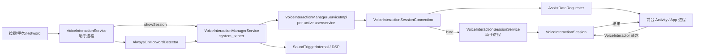
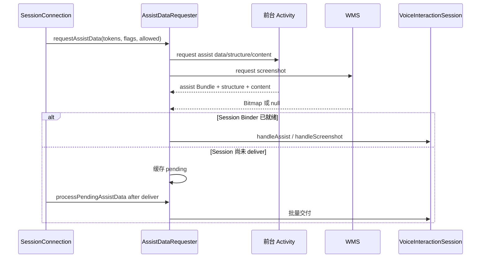
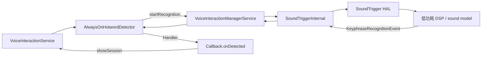
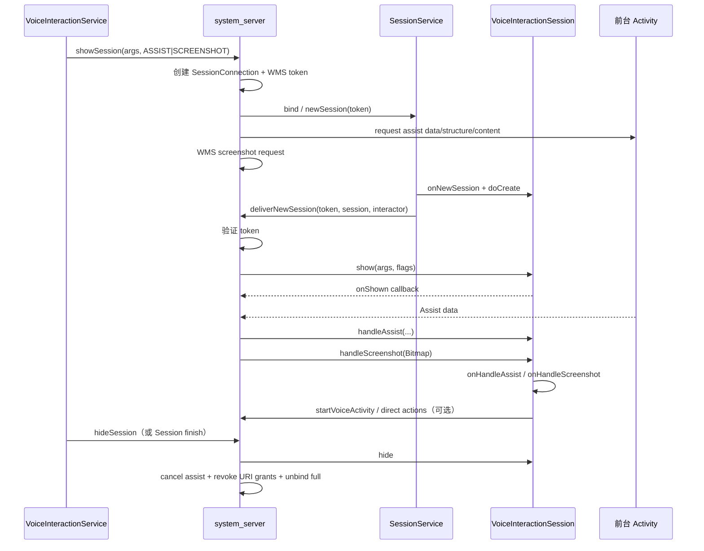

# 60 VoiceInteractionManagerService、VoiceInteractionSession 与语音助手

> 源码版本：Android 11 / API 30 / `android-11.0.0_r48`  
> 学习方式：macOS 只读源码，不要求编译。  
> 本章目标：理解默认语音助手如何被选择和常驻绑定，助手 Session 如何创建浮层、取得前台 Activity 的 AssistStructure/AssistContent/截图，应用如何通过 VoiceInteractor 与 Session 双向交互，以及 AlwaysOnHotwordDetector 如何连接 SoundTrigger 硬件。

---

## 1. 一次“唤醒助手并询问当前页面”的直觉链路

```text
用户长按电源键/手势/说出热词
→ 系统确认当前用户的 active VoiceInteractionService
→ VoiceInteractionService 请求 showSession
→ system_server 创建或复用 VoiceInteractionSessionConnection
→ 绑定 VoiceInteractionSessionService
→ SessionService 创建 VoiceInteractionSession
→ system_server 添加 TYPE_VOICE_INTERACTION 窗口 token
→ 请求前台 Activity 的 Assist 数据与可选截图
→ Session 显示助手浮层
→ onHandleAssist / onHandleScreenshot 收到页面上下文
→ 助手理解请求、与 App VoiceInteractor 交互或启动 voice/assistant Activity
→ hide/finish 后撤销 URI 权限、停止 voice task 并释放绑定
```

一句话理解：**VoiceInteraction Framework 不是单纯语音转文字，而是“系统选择的助手 + 受控浮层 Session + 前台页面上下文 + App 语音请求 + 可选热词硬件”的协调框架。**

---

## 2. 五个容易混淆的组件

| 组件 | 生命周期/角色 |
|---|---|
| `VoiceInteractionService` | 当前助手的常驻入口，接收 ready/shutdown、热词、请求显示 Session |
| `VoiceInteractionSessionService` | 按需创建具体 `VoiceInteractionSession` |
| `VoiceInteractionSession` | 真正展示助手 UI、接收 Assist 数据、处理 App 请求 |
| `VoiceInteractor` | Activity 侧与当前语音 Session 对话的客户端对象 |
| `RecognitionService` | 通用语音识别，将音频转成文本，不等于助手 Session |

再加一个硬件相关对象：

```text
AlwaysOnHotwordDetector
→ 低功耗热词检测
→ SoundTriggerInternal / SoundTrigger HAL / DSP
```

热词检测只负责“是否听到已注册关键词”，并不等于完整 ASR、自然语言理解或助手 UI。

---

## 3. 整体架构



控制中心位于 system_server，但 UI 和助手逻辑运行在被选中的助手 App 进程。

---

## 4. 核心源码地图

### system_server

```text
frameworks/base/services/voiceinteraction/java/com/android/server/voiceinteraction/
    VoiceInteractionManagerService.java
    VoiceInteractionManagerServiceImpl.java
    VoiceInteractionSessionConnection.java
    VoiceInteractionManagerServiceShellCommand.java

frameworks/base/services/core/java/com/android/server/am/AssistDataRequester.java
```

### 助手服务与 Session

```text
frameworks/base/core/java/android/service/voice/
    VoiceInteractionService.java
    VoiceInteractionServiceInfo.java
    VoiceInteractionSessionService.java
    VoiceInteractionSession.java
    AlwaysOnHotwordDetector.java
    IVoiceInteractionService.aidl
    IVoiceInteractionSessionService.aidl
    IVoiceInteractionSession.aidl
```

### Activity 侧

```text
frameworks/base/core/java/android/app/VoiceInteractor.java
frameworks/base/core/java/android/app/Activity.java
frameworks/base/core/java/android/app/ActivityThread.java
frameworks/base/core/java/android/app/AssistStructure.java
frameworks/base/core/java/android/app/AssistContent.java
```

### Binder 总接口

```text
frameworks/base/core/java/com/android/internal/app/
    IVoiceInteractionManagerService.aidl
    IVoiceInteractor.aidl
    IVoiceInteractorCallback.aidl
    IVoiceInteractorRequest.aidl
```

---

## 5. 助手服务怎样声明

概念 Manifest：

```xml
<service
    android:name=".MyVoiceInteractionService"
    android:permission="android.permission.BIND_VOICE_INTERACTION"
    android:exported="true">
    <intent-filter>
        <action android:name="android.service.voice.VoiceInteractionService" />
    </intent-filter>
    <meta-data
        android:name="android.voice_interaction"
        android:resource="@xml/voice_interaction_service" />
</service>
```

metadata 概念结构：

```xml
<voice-interaction-service
    android:sessionService=".MySessionService"
    android:recognitionService=".MyRecognitionService"
    android:settingsActivity=".SettingsActivity"
    android:supportsAssist="true" />
```

`VoiceInteractionServiceInfo` 会解析并强制检查：

- 主服务要求 `BIND_VOICE_INTERACTION`；
- sessionService 必须存在；
- recognitionService 必须存在；
- metadata 格式合法；
- supportsAssist 等能力标志。

只声明一个普通 Service 并不能成为系统助手。

---

## 6. 当前助手如何被选择

Android 11 同时涉及：

```text
RoleManager.ROLE_ASSISTANT
Settings.Secure.ASSISTANT
Settings.Secure.VOICE_INTERACTION_SERVICE
Settings.Secure.VOICE_RECOGNITION_SERVICE
```

它们不是完全同义：

- assistant role 表示用户选择的助手角色持有者；
- ASSISTANT 可指向 Assist Activity 或 VoiceInteractionService；
- VOICE_INTERACTION_SERVICE 指向当前可常驻的语音交互服务；
- VOICE_RECOGNITION_SERVICE 指向通用 RecognitionService。

`VoiceInteractionManagerService` 监听 role 和 secure settings 变化，为当前 user 重新解析、停止旧实现并启动新实现。

切换助手意味着高权限组件变化，不能只替换 UI 包名；还要停止旧热词识别、销毁 Session、解绑服务并重新建立安全状态。

---

## 7. VoiceInteractionManagerService 与 Impl

`VoiceInteractionManagerService` 是 SystemService，并发布 `voiceinteraction` Binder。它负责：

- 当前用户切换；
- 监听助手/识别器设置；
- 权限检查；
- SoundTrigger 模型管理；
- Binder API 总入口；
- 创建当前 `VoiceInteractionManagerServiceImpl`。

`VoiceInteractionManagerServiceImpl` 代表当前 user 下已选中的一个 VoiceInteractionService：

```text
ComponentName mComponent
VoiceInteractionServiceInfo mInfo
session component
IVoiceInteractionService mService
VoiceInteractionSessionConnection mActiveSession
disabled show context flags
```

master service 是跨用户与配置管理者；Impl 是当前具体助手实例管理者。

---

## 8. VoiceInteractionService 为什么相对常驻

它是轻量控制入口，负责：

- `onReady()`：系统确认它成为 active service；
- `showSession()`：请求显示交互 UI；
- `onGetSupportedVoiceActions()`；
- 创建和管理 `AlwaysOnHotwordDetector`；
- `onShutdown()`：失去 active 身份时清理。

它不应该长期持有完整 Session UI。Session 通过另一个 service 按需建立，以便：

- 未显示助手时减少 UI 资源；
- 显示时提高进程调度优先级；
- hide 后解除 full binding；
- Session 崩溃可以独立重建。

---

## 9. onReady 为什么是可用分界线

`VoiceInteractionService.onReady()` 中：

```java
mSystemService = IVoiceInteractionManagerService.Stub.asInterface(
        ServiceManager.getService(Context.VOICE_INTERACTION_MANAGER_SERVICE));
mSystemService.asBinder().linkToDeath(...);
mKeyphraseEnrollmentInfo = new KeyphraseEnrollmentInfo(getPackageManager());
```

在此之前调用 `showSession()` 或 `createAlwaysOnHotwordDetector()` 会抛 `IllegalStateException`。

`Service.onCreate()` 只表示进程组件已创建；`onReady()` 才表示 system_server 已把它确认为当前 active voice interaction service，并允许使用高权限接口。

---

## 10. showSession 的第一阶段

助手调用：

```java
showSession(args, SHOW_WITH_ASSIST | SHOW_WITH_SCREENSHOT);
```

Binder 进入 manager service，最终：

```java
VoiceInteractionManagerServiceImpl.showSessionLocked(args, flags, ...)
```

若没有 active session，创建：

```java
new VoiceInteractionSessionConnection(
        serviceStub, sessionComponent, user, context, callback,
        assistantUid, handler);
```

然后取得需要收集上下文的 Activity token：

- 指定 activityToken 时只针对它；
- 否则从所有可见 stack 取得 top visible activities。

多窗口下可能有多个 Activity AssistState，不应永远假设只有一个前台页面。

---

## 11. SessionConnection 构造时做什么

`VoiceInteractionSessionConnection` 构造器：

1. 创建唯一 `mToken = new Binder()`；
2. 保存 session component、user、assistant UID；
3. 创建 `AssistDataRequester`；
4. 创建 URI permission owner；
5. 绑定 `VoiceInteractionSessionService`；
6. 向 WMS 添加 `TYPE_VOICE_INTERACTION` window token。

初始绑定 flags 包括：

```text
BIND_AUTO_CREATE
BIND_WAIVE_PRIORITY
BIND_ALLOW_OOM_MANAGEMENT
BIND_ALLOW_BACKGROUND_ACTIVITY_STARTS
```

这使 session service 可以创建，但未显示时不必一直按顶层 UI 高优先级运行。

`mToken` 同时是：

- system_server 与 session service 配对凭证；
- Session 窗口 token；
- 后续 show/startActivity/direct actions 等调用的 active-session 身份依据。

---

## 12. 显示时为什么二次 full bind

`showLocked()` 中，若尚未 full bound，再绑定一次：

```text
BIND_AUTO_CREATE
BIND_TREAT_LIKE_ACTIVITY
BIND_SCHEDULE_LIKE_TOP_APP
BIND_ALLOW_BACKGROUND_ACTIVITY_STARTS
```

显示助手时，它需要快速绘制、处理语音和交互，因此按类似前台 Activity 调度；隐藏后解除 full connection，降低资源优先级。

```text
基础 bind：保持 session service 可创建/管理
full bind：Session 正在显示，临时提升调度与存活优先级
```

这是 Android 系统常见的“生命周期不变，但绑定强度随可见性改变”的设计。

---

## 13. SessionService 如何创建 Session

绑定成功：

```text
VoiceInteractionSessionConnection.onServiceConnected()
→ IVoiceInteractionSessionService.newSession(token, args, flags)
→ VoiceInteractionSessionService Handler
→ doNewSession()
```

`doNewSession()`：

```java
if (mSession != null) mSession.doDestroy();
mSession = onNewSession(args);
mSystemService.deliverNewSession(token,
        mSession.mSession, mSession.mInteractor);
mSession.doCreate(mSystemService, token);
```

它向 system_server 交付两根 Binder：

```text
IVoiceInteractionSession：system_server 控制 show/hide/assist/destroy
IVoiceInteractor：Activity 向 Session 提交语音交互请求
```

manager service 只有在 token 与 active connection 的 token 完全相同才接受 `deliverNewSession()`。

---

## 14. Session 的 UI 是什么窗口

`VoiceInteractionSession` 内部创建自己的 window/dialog，使用 system_server 预先加入 WMS 的 `TYPE_VOICE_INTERACTION` token。

Session 生命周期包括：

```text
onCreate
onPrepareShow
onShow
onHide
onDestroy
```

“Session 创建”和“Session 已显示”不是同一状态：

- session service 可能已连接；
- Session Binder 可能已 deliver；
- 但 window 还未真正显示；
- show callback 的 `onShown()` 甚至只是 Session 报告，源码 TODO 指出并未严格等待 WMS 确认窗口已绘制。

因此 showSession 返回 true 只代表请求被接受，不代表用户已看到第一帧。

---

## 15. Assist 数据有哪些层次

请求 `SHOW_WITH_ASSIST` 后，每个 Activity 可提供：

```text
Bundle assistData
AssistStructure structure
AssistContent content
taskId
activity assist token/id
activityIndex / activityCount
```

### assistData

Activity 在 `onProvideAssistData()` 提供的自定义 Bundle，加上系统信息。

### AssistStructure

View 层级的结构化快照，包括节点、文本、bounds、autofill/语义信息。它不是远端可操作的真实 View。

### AssistContent

Activity 在 `onProvideAssistContent()` 提供的 Intent、web URI、ClipData 或结构化内容描述。

### screenshot

若请求且策略允许，另一路以 Bitmap 送给 `onHandleScreenshot()`。

结构、内容、截图是不同数据，可能独立缺失或异步到达。

---

## 16. AssistDataRequester 的职责

`VoiceInteractionSessionConnection` 创建 `AssistDataRequester`，show 时调用：

```java
requestAssistData(
    topActivities,
    fetchStructure,
    fetchScreenshot,
    structureAllowed,
    screenshotAllowed,
    assistantUid,
    assistantPackage);
```

它协调 ATMS/Activity、WMS screenshot、AppOps 和异步回调，并在 Session Binder 尚未准备好时缓存 pending 数据。



---

## 17. 用户与助手都可以禁用上下文

用户设置：

```text
Settings.Secure.ASSIST_STRUCTURE_ENABLED
Settings.Secure.ASSIST_SCREENSHOT_ENABLED
```

助手还可设置自己的 disabled show context flags。show 时两者合并：

```java
disabledContext |= getUserDisabledShowContextLocked();
```

最终请求同时考虑：

- 调用 flags 是否要求 assist/screenshot；
- 用户是否允许；
- 助手是否主动禁用；
- AppOps 是否允许；
- 目标 Activity/window 的安全策略；
- Activity 是否提供内容。

`SHOW_WITH_ASSIST` 是请求，不是强制读取权限。

---

## 18. Assist disclosure 为什么存在

如果确实存在 pending Assist 数据或 screenshot 请求，并且策略要求披露，system_server 会显示 assist disclosure。

目的：让用户知道当前助手正在读取前台页面上下文，而不是把这类高敏感跨 App 数据采集完全隐形化。

是否披露由 `AssistUtils.shouldDisclose()` 和系统配置决定。不能因为某设备 UI 上没看到固定提示就推断没有 Assist 数据传输。

---

## 19. onHandleAssist 如何区分多窗口

`VoiceInteractionSession` 新 API 接收 `AssistState`，内部包含：

- activityId/taskId；
- assist data；
- structure；
- content；
- index/count。

默认分发：

```text
index == 0 → onHandleAssist
index > 0  → onHandleAssistSecondary
```

top focused Activity 通常是主 assist，其余可见 Activity 作为 secondary。多窗口、分屏和多显示场景下，助手需要用 task/activity id 正确关联，不能把多个 structure 拼成一个页面。

---

## 20. AssistContent 中 URI 权限怎样转移

AssistContent 可包含 Intent/ClipData 的 `content://` URI。仅把 URI 字符串跨进程传给助手并不意味着助手有读取权限。

SessionConnection：

1. 从 assistData 得到源 Activity UID；
2. 检查 Intent flags 是否允许 URI access；
3. 遍历 Intent/AssistContent ClipData；
4. 通过 UriGrantsManager 验证源 UID 有权授权；
5. 以专门 permission owner 向助手 package 授予临时 read permission；
6. hide/cancel 时统一 revoke。

```text
数据对象可见
≠ URI 内容可读
```

这是跨进程传内容 URI 的标准 capability 转移模式。

---

## 21. 隐藏 Session 时清理什么

`hideLocked()`：

```text
mShown = false
清空 show args/flags
AssistDataRequester.cancel()
清空 pending show callbacks
IVoiceInteractionSession.hide()
撤销 permission owner 的 URI grants
finishVoiceTask(session)
通知 session hidden listener
解除 full binding
```

隐藏不一定销毁基础 SessionConnection。之后再次 show 可以复用 Session，重新 full bind 和请求上下文。

`cancelLocked()`/finish 才进一步：

- session.destroy；
- unbind base connection；
- 从 WMS remove window token；
- 清空 session/interactor/service Binder。

所以 hide 与 destroy 是两级生命周期。

---

## 22. startVoiceActivity 与 startAssistantActivity

Session 可启动两类 Activity。

### startVoiceActivity

system_server 检查：

```text
token 匹配 active session
AND session 当前 shown
```

然后给 Intent 增加：

```text
CATEGORY_VOICE
FLAG_ACTIVITY_NEW_TASK
FLAG_ACTIVITY_MULTIPLE_TASK
```

通过 ATMS 建立 voice task，并传递 Session/Interactor Binder。

### startAssistantActivity

同样要求 active + shown，但 ActivityOptions 使用 `ACTIVITY_TYPE_ASSISTANT`，用于助手专属 Activity 容器语义。

这不是普通 App 可以伪造 token 调用的后台启动通道。

---

## 23. VoiceInteractor 是 Activity 侧协议

当 Activity 由 voice session 启动或处于 voice interaction 中，它可取得 `VoiceInteractor`，并提交：

```text
ConfirmationRequest
PickOptionRequest
CompleteVoiceRequest
AbortVoiceRequest
CommandRequest
```

例如 Activity 需要用户确认购买：

```text
Activity VoiceInteractor.submitRequest(ConfirmationRequest)
→ IVoiceInteractor.startConfirmation(...)
→ VoiceInteractionSession 主线程 onConfirm(SessionRequest)
→ 助手用语音/UI 与用户交互
→ request.sendConfirmationResult(...)
→ IVoiceInteractorCallback
→ Activity Request.onConfirmationResult()
```

VoiceInteractor 不是 SpeechRecognizer。Activity 发送的是语义请求，例如“确认”“选一个选项”，助手决定怎样向用户表达和收集答案。

---

## 24. 双边 Request 对象为何类型相似

Activity 侧有：

```text
VoiceInteractor.ConfirmationRequest
VoiceInteractor.PickOptionRequest
...
```

Session 侧有：

```text
VoiceInteractionSession.ConfirmationRequest
VoiceInteractionSession.PickOptionRequest
...
```

它们不是同一 Java 对象。Binder Stub 将 Activity 侧参数转换成 Session 侧 Request wrapper；Session 发送结果时再经 callback 回到 Activity 侧原 Request。

每个请求还对应 `IVoiceInteractorRequest` Binder，用于 cancel 和身份匹配。请求完成或取消后应从 active request map 移除，防止重复结果。

---

## 25. PickOption 为什么可以多次返回

选择请求可能有多个候选，助手可以：

- 返回中间选择，`finished=false`；
- 继续澄清；
- 最终 `finished=true`；
- 或 cancel。

CommandRequest 也支持中间结果与最终完成。Confirmation、Complete、Abort 通常是一次性终态。

Activity 不能假设任何 callback 一到就必然结束请求，要看 `finished/isCompleted`。

---

## 26. Direct Actions

助手可对当前 Activity 请求 `DirectAction`，让 App 暴露无需解析自然语言 UI 的结构化动作。

链路：

```text
VoiceInteractionSession.requestDirectActions(ActivityId)
→ manager service 验证 active session token
→ ATMS 根据 taskId 找 top Activity
→ 比较 assistToken 防止 task/activity 被替换
→ IApplicationThread.requestDirectActions
→ ActivityThread 检查 Activity 存在且生命周期合适
→ Activity.onGetDirectActions(...)
→ RemoteCallback 返回 Session
```

执行时再走 `performDirectAction()` 和 Activity 的对应回调。

`taskId` 单独不够，必须比较 assistToken；否则 task id 复用或 top Activity 变化时，助手可能对错误页面执行动作。

---

## 27. AlwaysOnHotwordDetector 的状态机

创建：

```java
createAlwaysOnHotwordDetector(keyphrase, locale, callback)
```

只允许一个 active detector；第二次创建会 shutdown 前一个。

主要 availability：

```text
STATE_HARDWARE_UNAVAILABLE
STATE_KEYPHRASE_UNSUPPORTED
STATE_KEYPHRASE_UNENROLLED
STATE_KEYPHRASE_ENROLLED
STATE_INVALID
```

只有 enrolled 状态才能安全调用 startRecognition。unsupported 与 unenrolled 不同：

- unsupported：设备/metadata 不支持此 phrase+locale；
- unenrolled：支持，但用户尚未录入声纹/模型。

---

## 28. 热词链路



Manager service 会验证调用者是当前 active VoiceInteractionService，查找匹配 keyphrase sound model，再调用 SoundTriggerInternal。

热词被检测到后通常隐式停止本次 recognition；若希望继续多轮监听，需要使用允许多触发 flag 或在处理完成后重新 start，取决于设备和 config。

---

## 29. 热词 payload 与音频

`EventPayload` 可能提供：

- trigger audio bytes；
- AudioFormat；
- capture session id，用于继续捕获音频；
- 或全部为空，仅表示检测发生。

是否有 trigger audio 取决于：

```text
startRecognition flags
SoundTrigger hardware capability
model/driver event
隐私策略
```

`onDetected()` 不代表助手已经拿到整句用户语音文本。后续完整语音识别仍可能通过 RecognitionService/音频捕获完成。

---

## 30. 热词安全边界

只有当前 active VoiceInteractionService 可以操作相关模型/recognition。manager service 还负责：

- 校验 calling UID/active service；
- 按 keyphraseId/locale 读取 enrolled model；
- start/stop/unload；
- 参数范围查询与设置；
- 服务切换时停止 detector；
- system service Binder death 时让 VoiceInteractionService shutdown。

普通 App 不能因为知道 keyphrase text 就直接让 DSP 常驻监听。

Android 后续版本对 HotwordDetectionService、沙箱化检测等有新架构；本章只讲 Android 11 的 `AlwaysOnHotwordDetector + SoundTriggerInternal`，不要混入新版本类。

---

## 31. Voice Interaction 与通用语音识别的区别

```text
RecognitionService / SpeechRecognizer
→ 输入音频
→ 输出文本/置信度

VoiceInteractionService / Session
→ 系统助手身份与生命周期
→ 浮层 UI
→ 前台页面 Assist 上下文
→ App VoiceInteractor 语义请求
→ Direct Actions / voice task
→ 可使用热词和 RecognitionService
```

助手可以使用识别服务，但识别服务本身不能自动获得 AssistStructure、TYPE_VOICE_INTERACTION 窗口或 active session token。

---

## 32. 服务与 Session 死亡

### manager Binder 死亡

`VoiceInteractionService` linkToDeath，触发 `onShutdownInternal()`，停止 active hotword detector。

### SessionService 断连

`VoiceInteractionSessionConnection.onServiceDisconnected()` 通知 Impl session connection gone，清空远端 service；active Session 需要取消/重建。

### Session Binder 尚未交付

show args、flags、assist data 和 show callbacks 暂存。deliverNewSession 后：

```text
session.show(...)
processPendingAssistData()
```

### Activity 死亡/切换

Assist 或 DirectAction 结果可能迟到，系统用 activity token/assist token/task id 校验。Session/UI 也需拒绝已经不适用于当前页面的结果。

---

## 33. 完整显示时序



绑定、Session deliver、UI show、Assist 到达四条异步链可能以不同顺序完成，SessionConnection 的 pending 状态正是为了解决这种竞态。

---

## 34. 常见误解纠正

### 误解 1：VoiceInteractionService 就是助手 UI

错误。它是常驻控制入口；UI 由按需创建的 VoiceInteractionSession 提供。

### 误解 2：SessionService 和 Session 是同一个对象

错误。前者是 Android Service 工厂，后者是实际交互会话/UI 对象。

### 误解 3：助手就是 SpeechRecognizer

错误。语音识别只是输入能力；助手框架还管理系统身份、页面上下文、窗口、App 请求和动作。

### 误解 4：SHOW_WITH_ASSIST 保证拿到所有 View 文本

错误。用户设置、助手 disabled flags、AppOps、窗口/Activity 策略和数据生成都可能阻止或返回 null。

### 误解 5：AssistStructure 是可远程操作的 View 树

错误。它是快照；操作应通过 Intent、VoiceInteractor 或 Direct Actions。

### 误解 6：URI 放进 AssistContent 后助手自动可读

错误。system_server 必须检查并转授临时 URI permission，hide 时撤销。

### 误解 7：showSession 返回 true 就表示浮层已绘制

错误。只表示请求被接受；Session、Assist 和首帧仍异步。

### 误解 8：隐藏就是销毁

错误。hide 解除 full bind、撤销上下文权限，但 base connection/Session 可复用；finish/cancel 才完全销毁。

### 误解 9：VoiceInteractor Request 是语音转文字请求

错误。它是确认、选项、完成、终止和扩展 command 等语义交互。

### 误解 10：DirectAction 只凭 taskId 就能执行

错误。system_server 还比较 activity assistToken，防止作用于错误 Activity。

### 误解 11：检测到热词就已经识别完整命令

错误。SoundTrigger 通常只报告 keyphrase，完整 ASR/理解是后续阶段。

### 误解 12：Android 11 已使用后续版本沙箱化 HotwordDetectionService

错误。本版本主链是 AlwaysOnHotwordDetector 与 SoundTriggerInternal。

---

## 35. 只读源码练习

### 练习 1：解析服务 metadata

阅读 `VoiceInteractionServiceInfo`，列出主服务 permission、sessionService、recognitionService、settingsActivity、supportsAssist 的校验流程。

### 练习 2：追助手切换

阅读 manager service 对 RoleManager 和三个 Secure Settings 的观察逻辑，说明切换 assistant 时为何必须 shutdown 旧 service 与 detector。

### 练习 3：追 Session 创建

从 `showSessionLocked()` 追到 SessionConnection bind、`newSession()`、`onNewSession()`、`deliverNewSession()`。标出 token 的每次比较。

### 练习 4：追 Assist 数据

从 `showLocked()` 追 `AssistDataRequester`，再到 `onAssistDataReceivedLocked()` 和 `VoiceInteractionSession.onHandleAssist()`，列出 Bundle、structure、content、screenshot 的独立路径。

### 练习 5：追 URI grant

阅读 `grantClipDataPermissions()`、`grantUriPermission()` 和 hide revoke，解释源 UID、目标助手 package、permission owner 与 userId。

### 练习 6：追 VoiceInteractor Confirmation

从 Activity `submitRequest()` 追到 Session `onConfirm()`，再追 `sendConfirmationResult()` 返回 Activity。画出两类 Request wrapper 与三根 Binder。

### 练习 7：追 Direct Actions

阅读 Session `requestDirectActions()`、manager `requestDirectActionsLocked()`、ActivityThread `requestDirectActions()`，解释 taskId 与 assistToken 的双重校验。

### 练习 8：追 Hotword

从 `createAlwaysOnHotwordDetector()`、availability refresh、`startRecognition()` 追到 manager 和 SoundTriggerInternal，再沿 recognition callback 返回 `onDetected()`。

---

## 36. 分层排错路线

### 症状 A：VoiceInteractionService 没有成为 active

检查：

1. ROLE_ASSISTANT holder；
2. `VOICE_INTERACTION_SERVICE` secure setting；
3. service 是否要求 `BIND_VOICE_INTERACTION`；
4. metadata 是否有合法 session/recognition service；
5. supportsAssist 与角色要求；
6. 当前 user 是否正确；
7. `onReady()` 是否到达。

### 症状 B：showSession 调用成功但 UI 不出现

检查 SessionService 组件解析、base/full bind、WMS token、`onServiceConnected()`、`newSession()`、`onNewSession()`、deliver token 匹配、Session `onShow()`、窗口 attach 和 show callback。

### 症状 C：Session 显示但没有页面上下文

检查 show flags、用户 ASSIST_STRUCTURE/SCREENSHOT 设置、disabled context、AppOps、Activity 是否提供 assist、Session 是否在数据到达前 deliver、pending data 是否 process、Structure 是否因安全策略为空。

### 症状 D：AssistContent URI 无法读取

检查 URI scheme、Intent grant flags、源 Activity UID、ClipData item、UriGrantsManager 验证、目标 package/user、permission 是否已因 Session hide 被撤销。

### 症状 E：VoiceInteractor 请求无回调

检查 Activity 是否真的有 active VoiceInteractor、Session 是否 still active、request 是否被 cancel、Session 是否发送终态结果、callback Binder 是否死亡、请求 map 是否提前移除。

### 症状 F：DirectAction 返回空

检查 active Session token、taskId、top Activity、assistToken、Activity 生命周期状态、Activity 是否实现并返回 actions、请求期间页面是否切换。

### 症状 G：AlwaysOnHotwordDetector 不能启动

检查 `onAvailabilityChanged()` 状态、硬件 module、phrase/locale metadata、模型 enrollment、active service UID、是否创建第二个 detector 使旧实例 invalid、SoundTrigger start status。

---

## 37. 本章自检问题

1. VoiceInteractionService、SessionService、Session 的职责分别是什么？
2. RecognitionService 与 Voice Interaction Framework 有何区别？
3. Role Assistant 与三个 Secure Settings 各表达什么？
4. 为什么 `onReady()` 才是高权限接口可用分界线？
5. SessionConnection 的 token 有哪几种用途？
6. base bind 与 full bind 为什么分开？
7. Session deliver 的两根 Binder 分别做什么？
8. AssistData、AssistStructure、AssistContent、screenshot 有何区别？
9. 用户和助手如何共同禁用 show context？
10. AssistContent URI 为什么要临时 grant 并在 hide 时 revoke？
11. hide 与 cancel/destroy 有什么区别？
12. VoiceInteractor 的五种 Request 是什么语义？
13. DirectAction 为什么需要 taskId + assistToken？
14. 热词检测、trigger audio 和完整 ASR 有何区别？
15. Android 11 的热词主链经过哪些层？

---

## 38. 最终主链

```text
用户为当前 user 选择 ROLE_ASSISTANT
→ VoiceInteractionManagerService 更新 ASSISTANT / VOICE_INTERACTION_SERVICE / recognizer 设置
→ 解析 VoiceInteractionServiceInfo，验证 BIND_VOICE_INTERACTION 与 metadata
→ 创建 VoiceInteractionManagerServiceImpl 并绑定 active VoiceInteractionService
→ VoiceInteractionService.onReady，取得 manager Binder、EnrollmentInfo 并监听死亡
→ 按键/手势或 AlwaysOnHotwordDetector.onDetected
→ VoiceInteractionService.showSession(args, flags)
→ manager 校验 active service 并进入 Impl.showSessionLocked
→ 创建 VoiceInteractionSessionConnection
→ 创建 session token/URI permission owner/AssistDataRequester
→ base bind SessionService + WMS 添加 TYPE_VOICE_INTERACTION token
→ show 时 full bind，按 top visible activities 请求 Assist/截图
→ SessionService.newSession(token)
→ onNewSession 创建 VoiceInteractionSession
→ deliverNewSession(token, IVoiceInteractionSession, IVoiceInteractor)
→ system_server 验证 token 并保存两根 Binder
→ Session.doCreate + show
→ AssistDataRequester 将 Bundle/AssistStructure/AssistContent 和 screenshot 交给 Session
→ system_server 为 AssistContent 的 content URI 临时 grant
→ Session onHandleAssist/onHandleScreenshot 理解页面
→ 可与 Activity VoiceInteractor 完成确认/选项/command
→ 可用 taskId + assistToken 请求/执行 DirectActions
→ 可在 active shown token 校验后启动 voice/assistant Activity
→ hide：取消 Assist、撤销 URI、finish voice task、解除 full bind
→ finish/cancel：destroy Session、解绑 base service、移除 WMS token
```

热词分支：

```text
VoiceInteractionService.createAlwaysOnHotwordDetector(phrase, locale)
→ KeyphraseEnrollmentInfo 判断支持与 enrollment
→ startRecognition
→ VoiceInteractionManagerService 校验 active assistant UID
→ 查 KeyphraseSoundModel
→ SoundTriggerInternal → SoundTrigger HAL → DSP
→ KeyphraseRecognitionEvent
→ AlwaysOnHotwordDetector.Callback.onDetected
→ 助手再决定 showSession、捕获后续音频和运行完整识别
```

掌握这两条链后，就能把“助手没弹出”“弹出但读不到页面”“Activity 语音确认没回调”“热词模型未注册”等问题定位到完全不同的层，而不是笼统归因于麦克风或语音识别。
