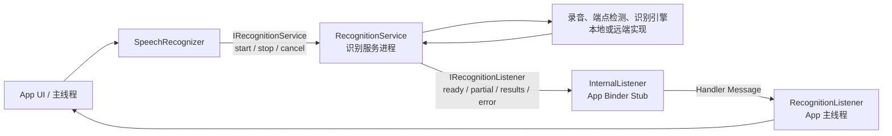
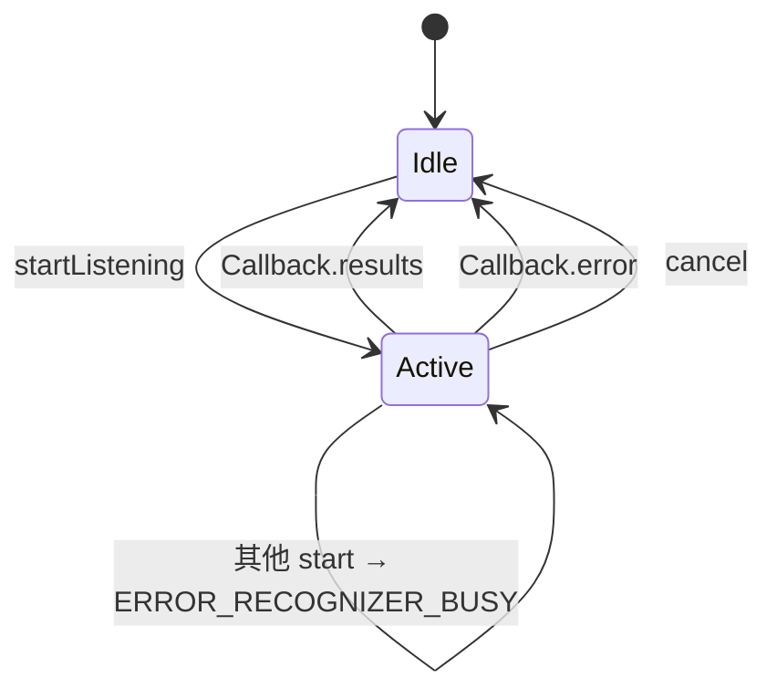
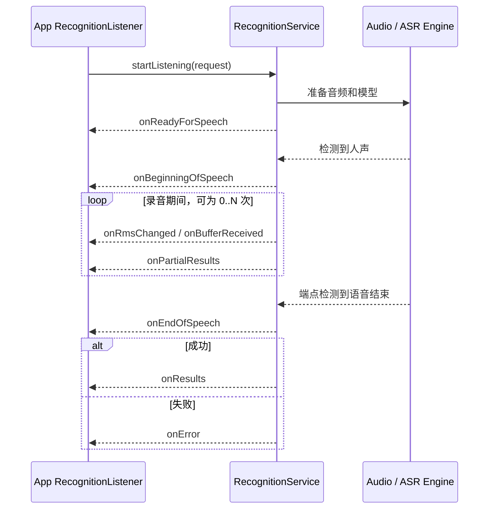
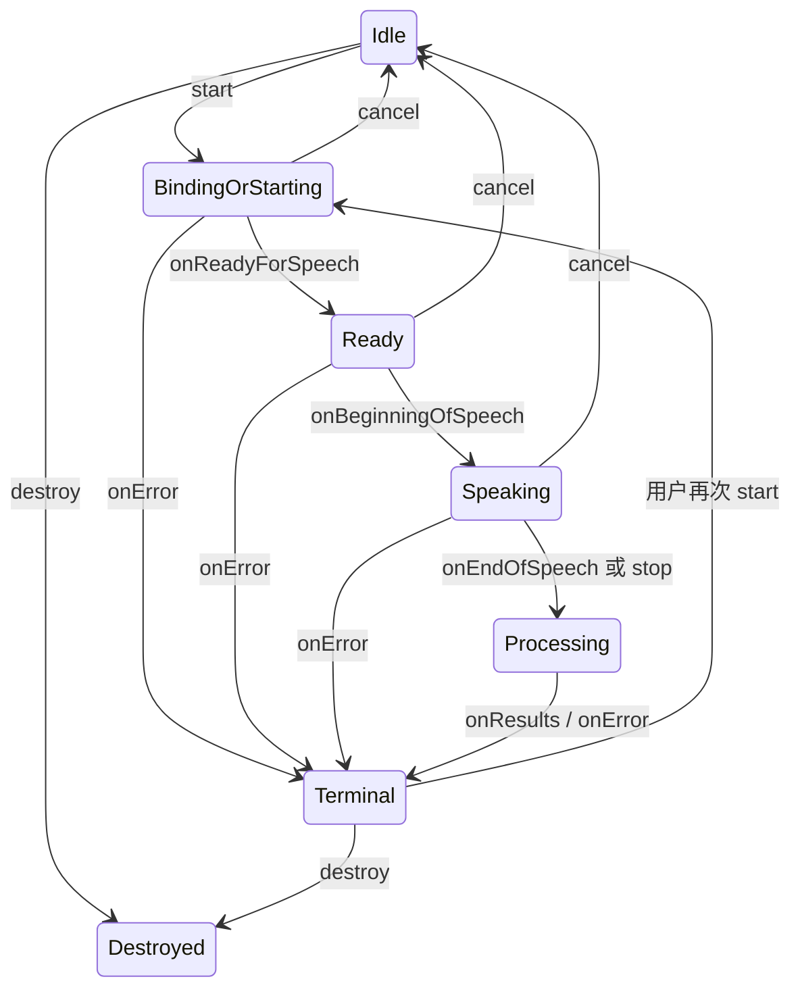

# 61 SpeechRecognizer、RecognitionService 与语音识别回调链

> 源码版本：Android 11 / API 30 / `android-11.0.0_r48`  
> 学习方式：macOS 只读源码，不要求编译。  
> 本章目标：理解应用如何通过 `SpeechRecognizer` 找到并绑定默认识别服务，`RecognitionIntent` 如何携带识别参数，`RecognitionService` 如何检查录音权限、管理单个活动请求，并把 ready、partial、final、error 等事件经 Binder 回送到应用主线程。

---

## 1. 先建立一个直觉模型

用户按住或点击“说话”按钮后，最典型的链路是：

```text
App 主线程
  SpeechRecognizer.startListening(intent)
      ↓ 首次调用时绑定默认 RecognitionService
识别服务进程
  RecognitionService.onStartListening(intent, callback)
      ↓ 打开麦克风、端点检测、特征提取、识别
      ↓ 可选：把特征/音频交给网络服务
  callback.readyForSpeech / partialResults / results / error
      ↓ IRecognitionListener.oneway Binder
App Binder 线程收到回调
      ↓ InternalListener.Handler 投递
App 主线程
  RecognitionListener.onResults(...)
```

一句话概括：**`SpeechRecognizer` 是客户端门面，`RecognitionService` 是可替换的识别提供方，二者通过两组 oneway AIDL 双向通信；框架传的是控制命令和结果事件，真正的录音与识别算法通常在服务实现里。**

---

## 2. 先划清五个容易混淆的概念

| 名称 | 解决的问题 | 是否自带界面 | 本章是否主角 |
|---|---|---:|---:|
| `SpeechRecognizer` | App 内嵌语音转文字 | 否 | 是，客户端入口 |
| `RecognitionService` | 提供实际语音识别能力 | 否 | 是，服务端基类 |
| `RecognizerIntent.ACTION_RECOGNIZE_SPEECH` | 启动一个识别 Activity 并通过 Activity result 返回 | 通常有 | 只作对比 |
| `VoiceInteractionService/Session` | 系统助手、浮层、页面上下文与语音交互 | 有 | 上一章内容 |
| `TextToSpeech` | 把文字合成为声音 | 否/由 App 决定 | 下一章内容 |

“语音识别”和“语音助手”不是同义词：

```text
语音识别（ASR）     音频 → 文本候选
自然语言理解（NLU） 文本 → 意图/槽位
语音助手            唤醒 + ASR + NLU + 执行动作 + UI/上下文
语音合成（TTS）     文本 → 音频
```

因此 `RecognitionService` 只承诺识别事件与结果协议，不负责“帮我打开设置”这种业务动作。

---

## 3. Android 11 的版本边界

本章严格以当前源码为准，有两个很容易被新版文档误导的点：

1. Android 11 的 `SpeechRecognizer` 没有 `createOnDeviceSpeechRecognizer()`、`isOnDeviceRecognitionAvailable()`；
2. Android 11 的 `RecognizerIntent` 没有后来版本加入的 `EXTRA_AUDIO_SOURCE`/音频注入能力。

所以本版本的标准理解是：

- App 提交意图参数，不直接把 PCM 流塞给 `SpeechRecognizer`；
- 识别服务在获得 `RECORD_AUDIO` 授权的调用上下文后，负责自己的音频输入和识别实现；
- `EXTRA_PREFER_OFFLINE=true` 只是偏好提示，不等于“系统保证离线”。

看到网上的新版示例时，先问：这个 API 在 API 30 源码里存在吗？

---

## 4. 核心源码地图

```text
frameworks/base/core/java/android/speech/
    SpeechRecognizer.java          App 侧门面、绑定、命令排队、主线程回调
    RecognitionListener.java       App 侧事件接口
    RecognizerIntent.java          请求参数和 Activity 模式常量
    RecognitionService.java        服务实现基类、权限与活动请求管理
    IRecognitionService.aidl       App → Service：start/stop/cancel
    IRecognitionListener.aidl      Service → App：事件和结果
```

继续寻找真正算法时，不要停在 Framework 基类。应先找设备当前选择的组件，再进入该组件源码：

```text
Settings.Secure.VOICE_RECOGNITION_SERVICE
    → ComponentName
    → 对应 APK/模块的 RecognitionService 子类
    → 音频前端、端点检测、模型或云端客户端
```

AOSP Framework 定义“插座”，厂商或预装识别器提供“电器”。因此只读 `RecognitionService.java` 看不到完整 ASR 模型是正常的。

---

## 5. 两条公开使用路径

### 5.1 Activity 模式

```java
Intent intent = new Intent(RecognizerIntent.ACTION_RECOGNIZE_SPEECH);
intent.putExtra(RecognizerIntent.EXTRA_LANGUAGE_MODEL,
        RecognizerIntent.LANGUAGE_MODEL_FREE_FORM);
startActivityForResult(intent, REQUEST_SPEECH);
```

特点：

- 系统找到能处理该 action 的 Activity；
- 识别 UI、权限体验和生命周期主要由对方 Activity 管理；
- 结果通常放在 `RecognizerIntent.EXTRA_RESULTS`；
- 设备可能没有匹配 Activity，调用方应处理 `ActivityNotFoundException`。

### 5.2 嵌入式 Listener 模式

```java
SpeechRecognizer recognizer = SpeechRecognizer.createSpeechRecognizer(context);
recognizer.setRecognitionListener(listener);

Intent request = new Intent(RecognizerIntent.ACTION_RECOGNIZE_SPEECH);
request.putExtra(RecognizerIntent.EXTRA_LANGUAGE_MODEL,
        RecognizerIntent.LANGUAGE_MODEL_FREE_FORM);
request.putExtra(RecognizerIntent.EXTRA_PARTIAL_RESULTS, true);
recognizer.startListening(request);
```

特点：

- App 自己画麦克风、波形、候选文本和错误 UI；
- 通过 `RecognitionListener` 得到细粒度事件；
- 仍然是绑定系统选择的 `RecognitionService`，不是 `SpeechRecognizer` 自己做模型推理；
- 创建、设置 listener、start、stop、cancel 都要求从 App 主线程调用。

本章重点是第二条。

---

## 6. 总体架构：两条 Binder 方向



这里有四个关键线程事实：

1. App 必须在主线程操作 `SpeechRecognizer`；
2. AIDL 的 `oneway` 调用是异步 Binder 事务，不等待对端业务处理完成；
3. 服务端 Binder 入口再向 `RecognitionService.mHandler` 发消息，抽象方法在服务主线程执行；
4. 回调到 App 后先落在 Binder 线程，`InternalListener` 再通过创建于主线程的 Handler 转给 `RecognitionListener`。

因此公开 listener 可以安全更新 UI，但不应在回调里做耗时 I/O。

---

## 7. 创建对象不等于已经绑定服务

源码中的工厂方法只做检查和构造：

```java
public static SpeechRecognizer createSpeechRecognizer(
        Context context, ComponentName serviceComponent) {
    if (context == null) {
        throw new IllegalArgumentException("Context cannot be null)");
    }
    checkIsCalledFromMainThread();
    return new SpeechRecognizer(context, serviceComponent);
}
```

此刻：

- 没有打开麦克风；
- 没有建立 Binder；
- 没有创建识别 session；
- 只是保存 `Context` 和可选的显式服务组件。

第一次 `startListening()` 才惰性绑定：

```java
Intent serviceIntent = new Intent(RecognitionService.SERVICE_INTERFACE);
String component = Settings.Secure.getString(
        mContext.getContentResolver(),
        Settings.Secure.VOICE_RECOGNITION_SERVICE);
serviceIntent.setComponent(ComponentName.unflattenFromString(component));
mContext.bindService(serviceIntent, mConnection,
        Context.BIND_AUTO_CREATE | Context.BIND_INCLUDE_CAPABILITIES);
```

默认服务不是用普通隐式 Intent 随便挑一个，而是从 secure setting 取出用户当前选择的组件，再显式绑定。

若调用 `createSpeechRecognizer(context, component)`，则绕过默认选择，定向连接指定实现。普通 App 通常不需要这样做。

---

## 8. 服务尚未连接时，start 去了哪里

Binder 连接是异步的。`startListening()` 返回时，`onServiceConnected()` 可能还没发生。框架用一个临时队列化解这个时间差：

```java
private void putMessage(Message msg) {
    if (mService == null) {
        mPendingTasks.offer(msg);
    } else {
        mHandler.sendMessage(msg);
    }
}
```

连接成功后再按顺序搬运：

```java
public void onServiceConnected(ComponentName name, IBinder service) {
    mService = IRecognitionService.Stub.asInterface(service);
    while (!mPendingTasks.isEmpty()) {
        mHandler.sendMessage(mPendingTasks.poll());
    }
}
```

这解释了两个现象：

- 第一次识别可能比后续识别慢，因为包含 bind 和服务进程启动；
- `startListening()` 是“提交命令”，不是“麦克风已经准备好”。真正可以提示用户开口的节点是 `onReadyForSpeech()`。

如果默认组件为空或 bind 失败，客户端直接收到 `ERROR_CLIENT`。

---

## 9. RecognitionIntent：参数是请求，不是强制命令

常用参数如下：

| Extra | 类型 | 含义 | 注意 |
|---|---|---|---|
| `EXTRA_LANGUAGE_MODEL` | String | `free_form` 或 `web_search` | Activity 模式文档要求提供；实现可自行解释 |
| `EXTRA_LANGUAGE` | String | BCP 47 语言标签，如 `zh-CN` | 只是告诉识别器偏好语言 |
| `EXTRA_MAX_RESULTS` | int | 最多返回多少候选 | 实现可能调整 |
| `EXTRA_PARTIAL_RESULTS` | boolean | 请求中间结果 | 服务可以忽略 |
| `EXTRA_PREFER_OFFLINE` | boolean | 希望只用离线识别 | 服务可以忽略，不是能力保证 |
| `EXTRA_PROMPT` | String | Activity 模式给用户看的提示 | Listener 模式通常由 App 自己画 UI |

端点检测还有三项时间参数：

```text
EXTRA_SPEECH_INPUT_MINIMUM_LENGTH_MILLIS
EXTRA_SPEECH_INPUT_COMPLETE_SILENCE_LENGTH_MILLIS
EXTRA_SPEECH_INPUT_POSSIBLY_COMPLETE_SILENCE_LENGTH_MILLIS
```

源码注释反复强调：极少需要主动修改；不合适的值会产生意外结果；识别器还可能完全忽略。

正确心智模型是：

```text
Intent extras = 调用方表达偏好
RecognitionService 实现 = 决定支持程度、默认值与实际行为
```

不要把 `EXTRA_PARTIAL_RESULTS=true` 理解成“每 100 ms 必有一个 partial”。

---

## 10. App → Service：IRecognitionService

Android 11 AIDL 很小：

```aidl
oneway interface IRecognitionService {
    void startListening(in Intent recognizerIntent,
            in IRecognitionListener listener,
            String packageName, String featureId);
    void stopListening(in IRecognitionListener listener,
            String packageName, String featureId);
    void cancel(in IRecognitionListener listener,
            String packageName, String featureId);
}
```

参数里的 `listener` 不只是回调地址，也是本次请求的身份标识。服务端会比较它的 Binder 对象，判断 stop/cancel 是否来自发起 start 的同一客户端。

`packageName` 与 `featureId` 用于权限数据交付归因；服务端不能只相信一段字符串，还会结合 Binder calling UID 和 `PermissionChecker`。

`oneway` 的含义：客户端线程把事务交给 Binder 后无需等待服务方法返回。因此：

- 方法正常返回不代表识别成功；
- 成功、失败和阶段变化全部通过 listener 异步表达；
- 连续快速发命令会形成时序问题，业务层仍应维护状态机。

---

## 11. RECORD_AUDIO 权限在哪一层检查

`RecognitionServiceBinder.startListening()` 先检查权限：

```java
if (service != null && service.checkPermissions(
        listener, true, packageName, featureId)) {
    service.mHandler.sendMessage(/* MSG_START_LISTENING */);
}
```

`checkPermissions()` 对 start 使用：

```java
PermissionChecker.checkCallingPermissionForDataDelivery(
        this, Manifest.permission.RECORD_AUDIO,
        packageName, featureId, null)
```

不足时回调：

```java
listener.onError(SpeechRecognizer.ERROR_INSUFFICIENT_PERMISSIONS);
```

这表示权限不是只靠 App UI 层自觉判断。识别服务的 Binder 边界再次验证调用者是否有权让敏感麦克风数据用于本次交付。

应用侧仍应先申请运行时权限，否则用户体验只会变成一次错误回调：

```xml
<uses-permission android:name="android.permission.RECORD_AUDIO" />
```

权限获批也不等于识别一定成功：麦克风硬件、AudioRecord、服务、网络和模型都可能继续失败。

---

## 12. 为什么说服务端只有一个活动请求

`RecognitionService` 只有一个字段：

```java
private Callback mCurrentCallback = null;
```

新 start 到来时：

```java
if (mCurrentCallback == null) {
    mCurrentCallback = new Callback(listener, callingUid);
    onStartListening(intent, mCurrentCallback);
} else {
    listener.onError(SpeechRecognizer.ERROR_RECOGNIZER_BUSY);
}
```

所以“单请求”是这个基类的明确状态机，不只是某个厂商实现的性能限制。



特别注意：`stopListening()` 不会在框架基类里立即把 `mCurrentCallback` 清空，因为服务还要对已录音频做最终识别。只有：

- 服务调用 `results()`；
- 服务调用 `error()`；
- 客户端执行匹配的 `cancel()`；

才会走回 Idle。

这就是“刚 stop 马上又 start，为什么收到 busy”的源码解释。

---

## 13. start 的服务端入口

Binder 入口不会直接在 Binder 线程执行抽象识别方法，而是投递到服务 Handler：

```text
RecognitionServiceBinder.startListening()
  → 权限检查
  → MSG_START_LISTENING
  → RecognitionService 主线程
  → dispatchStartListening()
  → onStartListening(intent, callback)
```

子类真正需要实现三个方法：

```java
protected abstract void onStartListening(
        Intent recognizerIntent, Callback listener);
protected abstract void onStopListening(Callback listener);
protected abstract void onCancel(Callback listener);
```

一个概念实现大致是：

```java
protected void onStartListening(Intent request, Callback callback) {
    // 主线程：解析语言、partial、offline 等偏好
    // 工作线程：创建录音、运行端点检测和识别引擎
    // 准备好后 callback.readyForSpeech(...)
}
```

`onStartListening()` 在服务主线程，重计算、网络和持续读音频都不能直接堵在这里。`Callback` 的文档允许识别器从任意线程调用，因此工作线程可以安全上报事件，由 Binder 再跨进程发送。

---

## 14. 客户死亡为何会触发取消

开始识别时，服务端给 listener Binder 注册死亡通知：

```java
listener.asBinder().linkToDeath(() -> {
    mHandler.sendMessage(
            mHandler.obtainMessage(MSG_CANCEL, listener));
}, 0);
```

如果 App 进程崩溃或被杀：

```text
listener Binder 死亡
→ DeathRecipient.binderDied
→ 服务主线程 dispatchCancel
→ 子类 onCancel
→ mCurrentCallback = null
```

它防止识别服务永远替一个已经不存在的客户端录音、联网或占着 busy 状态。

但 App 正常销毁页面时不能依赖进程死亡，仍应主动调用 `destroy()`。

---

## 15. Service → App：IRecognitionListener

回调接口包含：

```text
onReadyForSpeech(Bundle)
onBeginningOfSpeech()
onRmsChanged(float)
onBufferReceived(byte[])
onEndOfSpeech()
onPartialResults(Bundle)
onResults(Bundle)
onError(int)
onEvent(int, Bundle)
```

一种常见但不保证完整的顺序：



不要把它当作每个节点都必达的硬协议：

- RMS 和 buffer 明确“不保证调用”；
- partial 可以是 0、1 或多次；
- 失败可能在 ready 之前发生；
- 某些服务对事件细节支持不同；
- 终态应以 `onResults` 或 `onError` 为主，而不是仅凭 `onEndOfSpeech`。

---

## 16. Binder 回调为什么最终在 App 主线程

`InternalListener` 继承 `IRecognitionListener.Stub`。服务跨进程调用 Stub 时，入口最初可处于 App Binder 线程。它没有直接调用业务 listener，而是发 Message：

```java
public void onPartialResults(Bundle results) {
    Message.obtain(mInternalHandler,
            MSG_PARTIAL_RESULTS, results).sendToTarget();
}
```

`mInternalHandler` 创建于 `SpeechRecognizer` 所在的主线程，处理时才调用：

```java
mInternalListener.onPartialResults((Bundle) msg.obj);
```

完整线程切换：

```text
识别引擎工作线程
→ RecognitionService.Callback
→ IRecognitionListener Binder transaction
→ App Binder 线程
→ InternalListener Handler queue
→ App 主线程
→ RecognitionListener
```

这层 Handler 是公开 API 能承诺“所有回调在应用主线程执行”的原因。

---

## 17. partial、final 和 confidence 怎么读

Listener 模式使用的 key 是：

```java
ArrayList<String> texts = bundle.getStringArrayList(
        SpeechRecognizer.RESULTS_RECOGNITION);
float[] scores = bundle.getFloatArray(
        SpeechRecognizer.CONFIDENCE_SCORES);
```

两点别混：Activity 模式结果常量是 `RecognizerIntent.EXTRA_RESULTS`，Listener 模式结果常量是 `SpeechRecognizer.RESULTS_RECOGNITION`。

候选通常按可信程度从高到低排列，但调用方仍要防御：

- Bundle 为 null；
- 候选列表为 null 或空；
- confidence 数组缺失；
- confidence 数组长度与候选不一致；
- 某项为 `-1`，表示可信度不可用。

```java
List<String> texts = results.getStringArrayList(
        SpeechRecognizer.RESULTS_RECOGNITION);
float[] confidence = results.getFloatArray(
        SpeechRecognizer.CONFIDENCE_SCORES);

String best = texts == null || texts.isEmpty() ? null : texts.get(0);
```

partial 是“当前猜测”，可能被后续 partial 或 final 完全改写。例如：

```text
partial 1: “打开地”
partial 2: “打开地图”
final:     “打开地图导航”
```

所以 partial 适合灰色预览，不适合立即执行付款、删除、开锁等不可逆操作。关键动作应等待 final，并根据风险再次确认。

---

## 18. 终止回调如何解除 busy

服务实现调用 final：

```java
public void results(Bundle results) throws RemoteException {
    Message.obtain(mHandler, MSG_RESET).sendToTarget();
    mListener.onResults(results);
}
```

调用 error 也是同样先排入 `MSG_RESET`：

```java
public void error(int error) throws RemoteException {
    Message.obtain(mHandler, MSG_RESET).sendToTarget();
    mListener.onError(error);
}
```

`MSG_RESET` 最终令：

```java
mCurrentCallback = null;
```

容易误解之处是：`onEndOfSpeech()` 只说明输入端认为用户说完了，并不清除 callback；此时识别器可能仍在解码或等待服务器结果。

服务实现必须确保一次请求最终走到 `results()` 或 `error()`，否则基类会一直 busy。对识别服务开发者而言，这是完成协议，不只是“可选通知”。

---

## 19. stop、cancel、destroy 的精确区别

| 操作 | 语义 | 是否期待最终结果 | 是否解绑服务 | 对象还能否继续使用 |
|---|---|---:|---:|---:|
| `stopListening()` | 提前结束采集，识别已经听到的内容 | 是 | 否 | 是，终态后再 start |
| `cancel()` | 放弃当前请求 | 否 | 否 | 是 |
| `destroy()` | 取消当前请求并释放客户端连接 | 否 | 是 | 不应再使用 |

### stop

```text
用户点击“说完了”
→ onStopListening(callback)
→ 停止继续采集
→ 对已有音频收尾识别
→ results 或 error
```

默认端点检测会自动判断说话结束，普通交互通常无需主动 stop。

### cancel

```text
页面仍在，但用户点“取消”
→ onCancel(callback)
→ 服务丢弃本次工作
→ 基类立即清除 mCurrentCallback
```

cancel 不是“要求尽快给个结果”，而是“我不要这次结果”。

### destroy

源码会尝试 cancel，然后 unbind、清队列、清 Binder 和 listener：

```java
public void destroy() {
    if (mService != null) mService.cancel(...);
    if (mConnection != null) mContext.unbindService(mConnection);
    mPendingTasks.clear();
    mService = null;
    mConnection = null;
    mListener.mInternalListener = null;
}
```

典型生命周期：页面结束时 destroy，而不是只 cancel。

---

## 20. stop/cancel 还会校验是不是原调用者

服务端通过 listener Binder 比较请求归属：

```text
没有活动请求时 stop
→ ERROR_CLIENT

活动请求属于另一个 listener 时 stop
→ ERROR_RECOGNIZER_BUSY

活动请求属于当前 listener 时 stop
→ onStopListening(currentCallback)
```

cancel 的不同点：

- 没有活动请求：忽略；
- listener 不匹配：忽略；
- 匹配：调用 `onCancel()` 并清空活动 callback。

框架不是把 stop/cancel 当成全局按钮，而是针对“由这一个 listener 建立的请求”。

---

## 21. setRecognitionListener 的时序陷阱

源码注释指出：旧的未完成命令使用旧 listener，后续命令使用新 listener。更准确地说，listener 更换本身也作为 Message 排队：

```java
public void setRecognitionListener(RecognitionListener listener) {
    putMessage(Message.obtain(
            mHandler, MSG_CHANGE_LISTENER, listener));
}
```

因此正确顺序是：

```text
create
→ setRecognitionListener
→ startListening
```

不要在一次识别中途随意换 listener，再猜哪些迟到事件会落到谁。业务层更稳妥的方案是：

- 一个页面/控制器拥有一个 recognizer；
- listener 长期固定；
- 用 request generation/session token 在业务层过滤过期结果；
- 生命周期结束统一 destroy。

---

## 22. 九类错误码：先按层分类

Android 11 的错误码只有 1～9：

| 值 | 常量 | 含义 | 优先检查 |
|---:|---|---|---|
| 1 | `ERROR_NETWORK_TIMEOUT` | 网络超时 | 网络质量、服务端耗时 |
| 2 | `ERROR_NETWORK` | 其他网络问题 | 联网、DNS、VPN、服务可达性 |
| 3 | `ERROR_AUDIO` | 音频录制失败 | 麦克风占用、AudioRecord/路由 |
| 4 | `ERROR_SERVER` | 识别服务内部错误 | provider 日志、服务健康度 |
| 5 | `ERROR_CLIENT` | 客户端状态或连接错误 | 默认服务、bind、调用顺序 |
| 6 | `ERROR_SPEECH_TIMEOUT` | 等待期间没检测到语音 | 用户未说话、输入太小、端点参数 |
| 7 | `ERROR_NO_MATCH` | 有音频但无法得到匹配结果 | 语言、噪声、发音、模型 |
| 8 | `ERROR_RECOGNIZER_BUSY` | 服务已有活动请求 | 重复 start、上一请求未终止 |
| 9 | `ERROR_INSUFFICIENT_PERMISSIONS` | 缺少录音权限 | Manifest、运行时授权、AppOps |

注意版本差异：若网上看到 `ERROR_TOO_MANY_REQUESTS` 等更大的常量，不要倒灌进 API 30。

错误恢复策略也不应“一律马上重试”：

- 权限错误：引导授权；
- busy：等待终态或 cancel，再重启；
- speech timeout/no match：允许用户自然重说；
- network：提供离线/键盘降级，使用退避；
- client：先检查对象生命周期和服务选择，不要死循环。

---

## 23. 端点检测究竟是什么

端点检测（endpointer/VAD）回答的不是“说了什么”，而是：

```text
什么时候开始有人说话？
什么时候可以认为这句话结束？
```

因此链路可拆成：

```text
麦克风 PCM
→ 音频前处理（增益、降噪、回声消除，依实现）
→ VAD/端点检测
→ 声学/语言模型或远端 ASR
→ N-best 文本候选与可信度
```

`onBeginningOfSpeech` 和 `onEndOfSpeech` 更接近端点检测事件；`onPartialResults` 和 `onResults` 更接近识别解码事件。二者不要混成一个状态。

`stopListening()` 是调用方人工告诉端点：“就把现在当成输入结束”；它并不等于取消解码。

---

## 24. 音频数据是否经过 App

标准 `SpeechRecognizer` 路径下：

```text
麦克风 → RecognitionService/其引擎 → 文本回调 → App
```

App 没有先用 `AudioRecord` 读出 PCM 再交给 API 30 `SpeechRecognizer`。`onBufferReceived(byte[])` 也不是 App 给服务喂音频，而是服务可选地把已收到的音频片段回送给 App，主要用于反馈；格式是大端 16-bit 单声道，采样率由实现决定，并且不保证回调。

所以不要把 `onBufferReceived` 当作可靠录音文件来源：

- 可能一次也不调用；
- 采样率未由公共协议固定；
- 它的目的主要是视觉反馈；
- 保存用户语音还涉及隐私、告知和存储安全。

---

## 25. 网络识别与离线识别的边界

`SpeechRecognizer` API 屏蔽了实现位置：

```text
App 看见的是相同 callback
底层可能是：
  A. 全本地模型
  B. 音频/特征上传云端
  C. 本地快速结果 + 云端重排
  D. 根据语言、网络、模型包动态选择
```

`RecognizerIntent` 源码也警告 Activity 识别实现可能把音频流发送到远端并消耗带宽。

设计产品时应明确：

- 麦克风使用时机和可见状态；
- 是否可能上传语音；
- 弱网和无网降级；
- 是否真的安装所需离线语言模型；
- 敏感场景是否允许第三方默认识别服务处理内容。

Framework 的统一接口不等于统一的隐私或质量实现。

---

## 26. 为什么它不适合无限连续监听

`SpeechRecognizer` 类注释明确说它不是为连续识别设计的。原因包括：

- 每轮有清晰的 start → terminal 生命周期；
- 服务基类只有一个活动 callback；
- 识别可能持续联网和占用大量带宽；
- 麦克风、CPU/DSP、网络和电量成本高；
- 长期后台录音还有权限、隐私与系统限制。

“收到 final 后立刻 start，再循环一整天”虽然代码上可能写得出来，却绕不过 provider 限流、busy、网络成本和隐私问题。

连续唤醒词场景应区分：

```text
低功耗热词检测 → 只判断关键词，通常借助 SoundTrigger/DSP
一次完整识别   → 唤醒后短时间录音并转文字
```

上一章的 `AlwaysOnHotwordDetector` 和本章 ASR 正好是这两层。

---

## 27. 一个稳健的 App 状态机

不要只用 `isListening` 布尔值。建议至少区分：

```text
Idle
BindingOrStarting
Ready
Speaking
Processing
Terminal
Destroyed
```

事件映射：



现实服务可能跳过 Ready、Speaking、Processing 中的部分回调，因此业务状态机要允许任何非终态直接进入 terminal error。

---

## 28. 防止迟到回调污染新一轮 UI

Binder、网络和 Handler 都是异步的。一个常见竞态：

```text
请求 A 开始
→ 用户取消 A
→ 请求 B 开始
→ A 的迟到 partial 到达 UI
→ 错把 A 文本显示成 B 的结果
```

Framework 的 listener Binder 能帮助服务校验 start/stop/cancel 归属，但 App 自己的 UI 仍需管理业务世代。

概念方案：

```java
long generation = 0;

void begin() {
    long myGeneration = ++generation;
    // listener 处理结果前检查 myGeneration 是否仍有效
}

void cancelUiRequest() {
    generation++;
    recognizer.cancel();
}
```

实际由于一个 `RecognitionListener` 对象接收所有轮次，通常把“当前轮 id + 当前状态 + 是否已 terminal”保存在控制器中，终态后拒绝重复事件。关键是把回调视为异步消息，而不是同步函数返回值。

---

## 29. 一个较完整的客户端伪代码

```java
final class SpeechController implements RecognitionListener {
    private SpeechRecognizer recognizer;
    private boolean destroyed;
    private boolean active;

    void initialize(Context context) {
        // 必须在主线程
        if (!SpeechRecognizer.isRecognitionAvailable(context)) {
            showTextInputFallback();
            return;
        }
        recognizer = SpeechRecognizer.createSpeechRecognizer(context);
        recognizer.setRecognitionListener(this);
    }

    void start(String languageTag) {
        if (destroyed || recognizer == null || active) return;
        Intent request = new Intent(RecognizerIntent.ACTION_RECOGNIZE_SPEECH);
        request.putExtra(RecognizerIntent.EXTRA_LANGUAGE_MODEL,
                RecognizerIntent.LANGUAGE_MODEL_FREE_FORM);
        request.putExtra(RecognizerIntent.EXTRA_LANGUAGE, languageTag);
        request.putExtra(RecognizerIntent.EXTRA_PARTIAL_RESULTS, true);
        request.putExtra(RecognizerIntent.EXTRA_MAX_RESULTS, 3);
        active = true;
        recognizer.startListening(request);
    }

    @Override public void onPartialResults(Bundle bundle) {
        showPreview(readFirst(bundle));
    }

    @Override public void onResults(Bundle bundle) {
        active = false;
        commitFinalText(readFirst(bundle));
    }

    @Override public void onError(int error) {
        active = false;
        showRecoverableError(error);
    }

    void cancel() {
        if (recognizer != null && active) recognizer.cancel();
        active = false;
    }

    void release() {
        if (recognizer != null) recognizer.destroy();
        recognizer = null;
        active = false;
        destroyed = true;
    }

    // 其余回调按 UI 需要实现
}
```

这是解释结构的伪代码，不是完整权限和生命周期模板。生产代码还需处理运行时权限、配置变化、空 Bundle、可访问性、音频焦点提示和隐私说明。

---

## 30. RecognitionService 实现者的完成协议

服务实现者应把每次 callback 看作一张只允许终结一次的“请求票据”：

```text
onStartListening(callback X)
→ 0..N 个非终态事件
→ 恰好一个 terminal：results 或 error
```

cancel 是客户端撤票：

```text
onCancel(callback X)
→ 停止录音/网络/推理
→ 不再向 X 发送结果
```

实现时至少要防：

- 工作线程在 cancel 后仍回调；
- result 和 error 同时到达；
- stop 被误实现成 cancel；
- 忘记终态导致基类永久 busy；
- 主线程阻塞；
- 客户 Binder 死亡后资源不释放；
- 旧请求线程把结果发到新请求。

常见做法是为引擎任务维护原子 terminal/cancelled 状态，并在每次回调前核对当前 request token。

---

## 31. 服务怎样在 Manifest 中声明

概念声明：

```xml
<service
    android:name=".MyRecognitionService"
    android:exported="true">
    <intent-filter>
        <action android:name="android.speech.RecognitionService" />
    </intent-filter>
    <meta-data
        android:name="android.speech"
        android:resource="@xml/recognition_service" />
</service>
```

三个层次：

1. action 让 PackageManager 能按 `SERVICE_INTERFACE` 发现；
2. metadata 描述识别服务能力，具体是否采用还取决于系统选择和设置；
3. `SpeechRecognizer` 用 secure setting 得到的组件做显式绑定，服务基类在 Binder 入口核验调用方 `RECORD_AUDIO` 权限与归因。

这里要特别防止套用新版示例：当前 Android 11 的
`frameworks/base/core/res/AndroidManifest.xml` **没有定义**
`android.permission.BIND_SPEECH_RECOGNITION_SERVICE`，所以本章不能把它写成 API 30
服务声明的必需权限。`RecognitionService.java` 在本版本真正执行的安全检查，是前面读到的
`PermissionChecker` 录音权限检查。厂商实现是否额外声明自有绑定权限，要单独阅读其 Manifest；
额外权限还必须兼容普通持有录音权限的客户端能否完成绑定。

`SpeechRecognizer.isRecognitionAvailable()` 只是查询是否存在能处理该 service action 的服务。它不保证：

- 用户已授予麦克风权限；
- secure setting 指向有效组件；
- 所需语言可识别；
- 离线模型已安装；
- 当前网络和服务端正常。

所以 available 只是一道早期能力检查。

---

## 32. 默认识别服务与默认助手的关系

上一章看到：

```text
Settings.Secure.VOICE_INTERACTION_SERVICE
Settings.Secure.VOICE_RECOGNITION_SERVICE
```

它们可以相关，但不是一个设置：

- 前者选择系统语音交互/助手服务；
- 后者选择普通 `SpeechRecognizer` 默认绑定的识别服务；
- 某个 `VoiceInteractionService` metadata 也可声明配套 recognitionService；
- 系统在助手切换时可能协调设置，但读代码时仍要分别追踪。

排查“助手能听懂，但普通 App SpeechRecognizer 不工作”时，不能仅证明助手 Session 正常，还要检查默认 recognition component。

---

## 33. 一次完整调用逐行串联

### 第 1 段：App 初始化

```text
createSpeechRecognizer
→ 主线程检查
→ 保存 context/component
setRecognitionListener
→ MSG_CHANGE_LISTENER
→ InternalListener 保存业务 listener
```

### 第 2 段：首次 start 与绑定

```text
startListening(intent)
→ 主线程检查
→ 创建 Connection
→ 读取 VOICE_RECOGNITION_SERVICE
→ bindService
→ MSG_START 暂存 mPendingTasks
```

### 第 3 段：服务连接

```text
onServiceConnected
→ IRecognitionService.Stub.asInterface
→ 把 pending message 发给 mHandler
→ handleStartListening
→ mService.startListening(intent, mListener, package, attribution)
```

### 第 4 段：服务端接收

```text
RecognitionServiceBinder.startListening
→ RECORD_AUDIO data-delivery 权限检查
→ MSG_START_LISTENING
→ dispatchStartListening
→ linkToDeath(listener)
→ 创建 Callback(listener, callingUid)
→ onStartListening
```

### 第 5 段：事件回程

```text
识别引擎
→ Callback.partialResults/results/error
→ IRecognitionListener
→ App InternalListener Stub
→ mInternalHandler
→ App 主线程 RecognitionListener
```

### 第 6 段：终结与释放

```text
results/error
→ 服务 Handler MSG_RESET
→ mCurrentCallback = null
→ 服务可接受下一次 start

页面销毁
→ SpeechRecognizer.destroy
→ cancel + unbind + clear
```

---

## 34. 常见误区逐个纠正

### 误区 1：`startListening()` 返回说明开始录音

不对。首次 start 还可能在等待 bind。以 `onReadyForSpeech()` 作为“识别器已准备”的提示更合适。

### 误区 2：收到 `onEndOfSpeech()` 就能立刻开始下一轮

不对。服务还可能在处理最终结果，基类仍为 busy。等待 `onResults()` 或 `onError()`。

### 误区 3：`stopListening()` 和 `cancel()` 一样

不对。stop 要求对已有音频给结果；cancel 放弃结果并释放活动请求。

### 误区 4：partial 是逐字稳定转写

不对。它是可反复改写的暂定候选，甚至可能完全没有。

### 误区 5：`PREFER_OFFLINE` 保证数据不上网

不对。Android 11 注释明确是偏好，识别器可以忽略。需要严格隐私保证时，应选择可验证的具体实现和产品策略。

### 误区 6：App 要自己用 AudioRecord 采集再传入

不对。API 30 标准路径没有公共音频注入 extra，音频采集属于识别服务实现。

### 误区 7：回调发生在 Binder 线程，不能更新 UI

对内部 Stub 是 Binder 入口，但 `InternalListener` 通过 Handler 转到 App 主线程后才调用公开 listener。

### 误区 8：`isRecognitionAvailable=true` 就肯定能识别

不对。它只证明 PackageManager 找得到候选 service。

---

## 35. 只读源码练习（macOS 可完成）

### 练习 1：画出首次与第二次 start 的差别

阅读：

```text
SpeechRecognizer.startListening
SpeechRecognizer.Connection.onServiceConnected
SpeechRecognizer.putMessage
```

回答：为什么第一次会进入 `mPendingTasks`，连接后为什么第二次通常直接进 Handler？

### 练习 2：证明公开回调在主线程

从 `IRecognitionListener.aidl` 追到 `InternalListener.onResults()`，再追 `mInternalHandler.handleMessage()`。标出 Binder 线程与主线程的切换点。

### 练习 3：证明 stop 不会马上解除 busy

阅读：

```text
dispatchStopListening
Callback.results
Callback.error
dispatchClearCallback
```

找出真正令 `mCurrentCallback=null` 的路径。

### 练习 4：对比权限检查

比较 start 的 `forDataDelivery=true` 与 stop/cancel 的 preflight 检查，思考为什么开始交付麦克风敏感数据时要求更具体的 package/feature 归因。

### 练习 5：核对版本常量

执行只读搜索：

```bash
rg -n "EXTRA_AUDIO|createOnDevice|ERROR_TOO_MANY" \
  frameworks/base/core/java/android/speech
```

用“搜索不到”建立 Android 11 与新版 API 的边界。

### 练习 6：列出回调协议

从 `RecognitionListener.java` 为每个事件标记：必选/可选、非终态/终态、UI 适合显示什么。

### 练习 7：追默认组件

搜索：

```bash
rg -n "VOICE_RECOGNITION_SERVICE" frameworks/base
```

观察默认值/助手切换逻辑怎样写入该设置，以及 `SpeechRecognizer` 怎样读取。

### 练习 8：设计一个竞态测试表

不必编译，只写出预期：

```text
start → start
start → stop → start（final 尚未到）
start → cancel → start
start → destroy
start → App 进程死亡
```

逐项回答服务端 `mCurrentCallback` 应为何值、客户端应看到什么。

---

## 36. 阅读后的自检题

1. `SpeechRecognizer` 自己是否执行语音模型？
2. 为什么 create 后还没有 Binder 连接？
3. 默认 recognition service 从哪里选择？
4. `mPendingTasks` 解决了什么异步问题？
5. 为什么 `startListening()` 返回不能当作 ready？
6. `EXTRA_PARTIAL_RESULTS=true` 是否保证有 partial？
7. `onEndOfSpeech` 为什么不是终态？
8. stop、cancel、destroy 分别怎样影响结果和连接？
9. 哪些路径把服务端 `mCurrentCallback` 清空？
10. 为什么连续两次 start 可能得到 busy？
11. 回调从服务工作线程到 App 主线程经过哪些层？
12. `RESULTS_RECOGNITION` 和 `RecognizerIntent.EXTRA_RESULTS` 分别用于哪条 API？
13. confidence 为 `-1` 表示什么？
14. Android 11 是否支持通过公共 extra 注入一段录音？
15. `PREFER_OFFLINE` 为什么不能作为严格隐私承诺？

如果能不看文档回答其中 12 题以上，就掌握了本章主线。

---

## 37. 本章最终心智模型

记住下面这张图即可恢复整章：

```text
App 主线程
  SpeechRecognizer
  ├─ create：只创建对象
  ├─ first start：读默认组件 + bind + pending queue
  ├─ start/stop/cancel：IRecognitionService oneway Binder
  └─ destroy：cancel + unbind + clear
                    ↓
RecognitionService 主线程
  ├─ RECORD_AUDIO / attribution 权限检查
  ├─ mCurrentCallback：一个活动请求
  ├─ onStartListening：开始录音与识别
  ├─ onStopListening：停止采集但继续求 final
  └─ onCancel：放弃请求
                    ↓
识别引擎工作线程（实现自定，本地或远端）
                    ↓
Callback → IRecognitionListener Binder
                    ↓
App InternalListener Handler
                    ↓
RecognitionListener（主线程）
  ready → beginning → [rms/buffer/partial]* → end → results | error
```

最重要的四句话：

1. **`SpeechRecognizer` 是异步客户端代理，不是识别引擎。**
2. **`stop` 是“听完并给结果”，`cancel` 是“放弃结果”，`destroy` 是“连对象和绑定一起释放”。**
3. **`results/error` 才是请求终态，`endOfSpeech` 只是音频输入结束。**
4. **Android 11 的 extras 多数是 provider 可忽略的偏好，而且没有新版的公共音频注入/专用 on-device API。**

下一章将沿相反方向学习 `TextToSpeech`、`TextToSpeechService` 与语音合成播放链路：文字如何被选择引擎、切分、合成成 PCM，再通过音频系统播放或写入文件。
