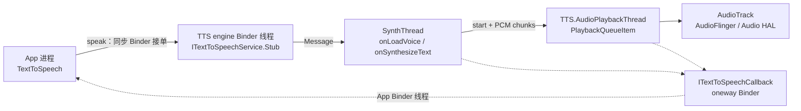

# 62 TextToSpeech 与 TextToSpeechService：`speak()` 成功了，为什么还是没声音？

导航 App 刚提交“前方左转”，路线却立即重新规划了。App 又调用：

```java
int result = tts.speak(
        "路线已重新规划",
        TextToSpeech.QUEUE_FLUSH,
        null,
        "route-43");
```

`result` 是 `SUCCESS`，但旧提示音仍多播了一小段，新提示甚至没有声音。这不能用“TTS 坏了”一句话解释。

先记住本章结论：

> **`speak()` 返回 `SUCCESS` 只代表请求已被 TTS 引擎服务放入合成队列，不代表已合成、已开始播放或已被人听到。`QUEUE_FLUSH` 也不是清空整个引擎；Android 11 按调用者 Binder 身份停止它的当前任务、标记其待处理任务为已 flush，并清理其播放项，然后才入队新请求。**

读完后，你应该能：

1. 从 `TextToSpeech.speak()` 追到 `TextToSpeechService.onSynthesizeText()`。
2. 分清 Binder 线程、`SynthThread`、`TTS.AudioPlaybackThread` 和 App 回调线程。
3. 解释 `QUEUE_ADD`、`QUEUE_FLUSH`、`stop()` 和 `shutdown()` 的边界。
4. 分清 `onBeginSynthesis`、`onAudioAvailable`、`onStart` 和 `onDone`。
5. 用“初始化→入队→合成→播放→终态”证据链定位无声音。

本文基于 Android 11 / `android-11.0.0_r48`，只追 AOSP 通用 TTS Framework。具体引擎使用本地模型、网络合成还是厂商音色包，由引擎 APK 决定，不能从 `frameworks/base` 推断。macOS 上只做静态阅读，不编译、不冒充真机实测。

---

## 1. 先把“成功”拆成五张回执

可以把 TTS 看成一家“先接单、再制作、最后配送”的广播站：

```text
OnInit(SUCCESS)       = 广播站已接通
speak() == SUCCESS    = 订单收入队列
onBeginSynthesis      = 引擎已声明输出音频格式
onStart               = 播放工人开始处理这个播放项
onDone/error/stop     = 这个 utterance 到达终态
```

任意一张回执都不能代替后面的回执。

| 证据 | 它能证明 | 它不能证明 |
|---|---|---|
| `OnInit(SUCCESS)` | App 与某个 engine 的回调和默认参数已建立 | 指定语言/音色可用 |
| `speak() == SUCCESS` | Binder 到达服务，`SpeechItem` 成功投递到 `SynthHandler` | 引擎已开始生成 PCM |
| `onBeginSynthesis()` | `SynthesisCallback.start()` 已给出采样率、编码和声道数 | PCM 已从扬声器发出 |
| `onAudioAvailable()` | 一块 PCM 已生成并复制给回调 | 这块 PCM 已播放 |
| `onStart()` | AOSP 播放项开始 `run()`，即将初始化/写入 `AudioTrack` | 用户耳朵已听到 |
| `onDone()` | Framework 的请求成功完成；播放分支已等待 `AudioTrack` 完成并释放 | 音量、路由和物理扬声器一定让人听见 |

### 这五张回执不是完全串行

`onBeginSynthesis()` 先于后续 PCM。但 `SynthesisCallback.start()` 会把播放项交给另一条线程，合成线程随后又可立即调用 `audioAvailable()`。

因此 `onStart()` 和第一次 `onAudioAvailable()` 的到达先后会受两条线程调度影响。不要把回调日志强行套成一条毫无并发的直线。

---

## 2. TTS 不在 `system_server`：一次播报跨了哪些进程和线程？

TTS Framework 把“调用规则”和“语音算法”分开。App 只面对 `TextToSpeech`；真正的引擎是一个能处理 `android.intent.action.TTS_SERVICE` 的 Service，通常运行在引擎 APK 进程。



| 位置 | 主要对象 | 负责什么 |
|---|---|---|
| App 线程 | `TextToSpeech` | 选引擎、保存请求参数、发 Binder 命令 |
| engine Binder 线程 | `ITextToSpeechService.Stub` | 校验入参、创建 `SpeechItem`、入队，尽快返回 |
| engine `SynthThread` | `SynthHandler` | 串行执行 voice 加载、合成、文件输出等项目 |
| engine 播放线程 | `AudioPlaybackHandler` | 消费播放项，把 PCM 写给 `AudioTrack` |
| App Binder 回调线程 | `ITextToSpeechCallback.Stub` | 调用 `UtteranceProgressListener` |

### 为什么合成和播放要拆成两条线程？

合成引擎可能还在生成后半句，前半句 PCM 已经可以开始播放。如果必须等整句生成完再播，首声延迟和内存占用都会增大。

AOSP 的办法是“流式生产 + 有界背压”：

```text
SynthThread 生成 PCM chunk
        ↓ put()
SynthesisPlaybackQueueItem 缓冲
        ↓ take()
AudioPlaybackThread 写 AudioTrack
```

当尚未消费的音频超过约 500 ms 时，`SynthesisPlaybackQueueItem.put()` 会等待播放线程赶上。这避免引擎无限生产 PCM，代价是播放太慢时会反向压住合成线程。

---

## 3. `new TextToSpeech()` 返回后，为什么还不能立即 `speak()`？

构造函数只是启动异步建连。`initTts()` 依次尝试：

```text
1. 构造时指定的 engine
2. 用户设置的默认 engine
3. 已安装引擎中排名最高的 engine
```

每级都可能因未安装或 `bindService()` 失败而回退。若构造时禁用 fallback，指定引擎失败就直接 `OnInit(ERROR)`。

源码的三步骨架是：

```java
if (mRequestedEngine != null) {
    if (mEnginesHelper.isEngineInstalled(mRequestedEngine)
            && connectToEngine(mRequestedEngine)) {
        mCurrentEngine = mRequestedEngine;
        return SUCCESS;
    }
    // 禁止 fallback 时在这里失败结束
}

final String defaultEngine = getDefaultEngine();
// 尝试 defaultEngine
final String highestRanked = mEnginesHelper.getHighestRankedEngineName();
// 最后尝试 highestRanked
```

这是精简后的分支结构，不是一段可直接替换原文件的连续源码。关键结论是：“请求了哪个引擎”不必然等于“最终连上哪个引擎”。

### Service 连上后还有一次 Setup

`onServiceConnected()` 拿到 Binder 后，会启动 `SetupConnectionAsyncTask`：

```text
onServiceConnected
→ ITextToSpeechService.Stub.asInterface(service)
→ service.setCallback(callerIdentity, mCallback)
→ 读默认 language/country/variant
→ 读该 locale 的 default voice name
→ mEstablished = true
→ OnInitListener.onInit(result)
```

`TextToSpeech.runAction()` 会检查 `mServiceConnection` 和 `isEstablished()`。所以构造函数刚返回就调 `speak()`，可能直接得到 `ERROR`。

### Android 11 的引擎可见性不是麦克风权限

target Android 11 的 App 应在 Manifest 声明：

```xml
<queries>
    <intent>
        <action android:name="android.intent.action.TTS_SERVICE" />
    </intent>
</queries>
```

它解决的是 package visibility：让 App 能查询 TTS engine Service。TTS 是文本转输出音频，这段配置不是 `RECORD_AUDIO`，也不自动授予任何 Service 权限。

---

## 4. `Locale` 和 `Voice` 为什么不是一回事？

`Locale` 回答“说什么语言/地区变体”，`Voice` 还表达某个引擎中的具体音色、质量、延迟、是否需要网络及 feature 集合。一个中文 locale 可以有多个 voice。

Android 11 的 `setLanguage(Locale)` 不只把 Locale 存入字段。它大致执行：

```text
isLanguageAvailable(locale)
→ getDefaultVoiceNameFor(locale)
→ loadVoice(callerIdentity, voiceName)
→ 把 voiceName 和 voice 的 locale 写入本 TextToSpeech 实例参数
```

语言可用性不是 boolean：

| 返回值 | 含义 |
|---|---|
| `LANG_AVAILABLE` | 语言可用，未必匹配 country/variant |
| `LANG_COUNTRY_AVAILABLE` | 语言 + country 可用 |
| `LANG_COUNTRY_VAR_AVAILABLE` | 语言 + country + variant 可用 |
| `LANG_MISSING_DATA` | 引擎认识该语言，但数据缺失 |
| `LANG_NOT_SUPPORTED` | 不支持 |

### 两个容易踩的边界

第一，`OnInit(SUCCESS)` 只表示连接和默认 setup 成功，不保证导航指定的中文 voice 已安装。仍要检查 `setLanguage()` 或 `setVoice()` 的结果。

第二，服务端 `loadVoice()` 先调用 `onIsValidVoiceName()`，成功后把 `LoadVoiceItem` 放进同一条 `SynthThread` 队列。后续 `speak()` 可以排在它后面，但这仍是引擎协议，不是 Framework 替具体引擎验证模型文件和网络资源。

---

## 5. `speak()` 到底把什么东西放进了队列？

App 端的关键调用很短：

```java
return runAction((ITextToSpeechService service) -> {
    return service.speak(
            getCallerIdentity(), text, queueMode,
            getParams(params), utteranceId);
}, ERROR, "speak");
```

`ITextToSpeechService.speak()` 是普通同步 Binder 方法，不是 `oneway`。因此调用 `speak()` 的 App 线程会等待引擎 Binder Stub 完成校验与入队，然后拿到整数返回值；它不会等合成和播放。

服务端 Stub 做的事很克制：

```java
SpeechItem item = new SynthesisSpeechItem(
        caller,
        Binder.getCallingUid(),
        Binder.getCallingPid(),
        params,
        utteranceId,
        text);
return mSynthHandler.enqueueSpeechItem(queueMode, item);
```

`SynthesisSpeechItem` 保存：

- 文本和 utterance id；
- 调用者 Binder token、UID 和 PID；
- language/country/variant 与 voice name；
- speech rate 和 pitch；
- `AudioAttributes`、volume、pan 和 audio session id。

它还在 `isValid()` 检查文本非空且不超过 `TextToSpeech.getMaxSpeechInputLength()`。

### `SUCCESS` 的真正代码边界

`enqueueSpeechItem()` 最终以 `sendMessage()` 为界：

```java
Message msg = Message.obtain(this, runnable);
msg.obj = speechItem.getCallerIdentity();

if (sendMessage(msg)) {
    return TextToSpeech.SUCCESS;
}
return TextToSpeech.ERROR;
```

所以 `SUCCESS` 证明 `SynthThread` 的 Looper 接收了 Message。这时可能还有 voice 加载、其他 utterance 或慢合成排在前面。

用一句话区分控制面与数据面：

```text
Binder speak() 返回 = 控制请求已接单
PCM 经 AudioTrack 播放 = 数据真正流动
```

---

## 6. `QUEUE_FLUSH` 为什么既不是全局清空，也不是时间倒流？

`QUEUE_ADD` 很直接：新项排在已有项后。导航的方向指令会过期，所以常使用 `QUEUE_FLUSH` 替换自己的旧播报。

引擎收到 flush 时先执行：

```java
if (queueMode == TextToSpeech.QUEUE_FLUSH) {
    stopForApp(speechItem.getCallerIdentity());
}
// 随后才为新 speechItem 创建 Message 并 sendMessage
```

`stopForApp()` 不粗暴清空整个队列，而是同时处理三种位置：

```text
还在 SynthHandler 队列中
    → 将 callerIdentity 加入 mFlushedObjects
    → 轮到旧项时，setCurrentSpeechItem() 拒绝它并发 stop

正在 SynthThread 上合成
    → 只移除属于该 callerIdentity 的 current item
    → synthesisCallback.stop() + engine onStop()

已进入 AudioPlaybackHandler
    → 删除该 callerIdentity 的待播项
    → current playback 也属于它时，stop AudioTrack
```

### 这里的“caller”到底是谁？

App 端 `getCallerIdentity()` 返回该 `TextToSpeech.Connection` 中的 `ITextToSpeechCallback.Stub`。引擎把这个 Binder 对象同时当作回调端点和队列归属 token。

因此要用两层口径理解：

- API 文档说 flush 针对给定 calling app，不删除其他 caller 的项；
- r48 实现实际用 `TextToSpeech` 连接的 Binder identity 匹配。同一 App 若创建多个 `TextToSpeech` 实例，不要假设某个实例的 flush 会顺手清理其他实例。

### 为什么旧声音可能还有一点尾音？

`stop()` 能停后续合成、丢掉待播缓冲并停 `AudioTrack`，但无法“撤回”已经送入混音器/硬件且已经发出的声波。

`AudioPlaybackHandler` 源码还明确注释了一个竞态窗口：如果 `stopForApp()` 刚好发生在 `mQueue.take()` 返回之后、`mCurrentWorkItem` 赋值之前，这个已取出项仍可能运行。

所以 flush 是最大努力的取消/替换协议，不是物理世界的原子“立即静音”。

### flush 也不会抢走其他调用者的位置

其他 caller 的合成项和播放项会保留。因此新导航播报虽然替换了自己的旧播报，仍可能排在引擎中其他 caller 的任务之后。

---

## 7. 引擎怎样把一句文字变成可流式播放的 PCM？

`SynthHandler` 执行 `SynthesisSpeechItem.playImpl()` 时，先创建 `PlaybackSynthesisCallback`，然后进入具体引擎：

```java
mSynthesisCallback = createSynthesisCallback();
synthesisCallback = mSynthesisCallback;

TextToSpeechService.this.onSynthesizeText(
        mSynthesisRequest, synthesisCallback);

if (synthesisCallback.hasStarted()
        && !synthesisCallback.hasFinished()) {
    synthesisCallback.done();
}
```

`onSynthesizeText()` 是引擎子类必须实现的核心算法入口。`SynthesisRequest` 交给引擎文本、voice/language、rate、pitch、caller UID 和引擎自定义参数。

引擎应通过 `SynthesisCallback` 按协议产生数据：

```text
callback.start(sampleRate, audioFormat, channelCount)
callback.audioAvailable(chunk1, 0, length1)
callback.audioAvailable(chunk2, 0, length2)
...
callback.done()
```

失败时调 `callback.error(errorCode)`；停止时 Framework 会调用 callback 和 engine `onStop()`，让引擎停止继续生产。

### `start()` 不是一个普通的“开始日志”

`PlaybackSynthesisCallback.start()` 会：

1. 向 App 发 `onBeginSynthesis()`；
2. 检查声道等输出条件；
3. 创建 `SynthesisPlaybackQueueItem`；
4. 将播放项投给 `AudioPlaybackHandler`。

在 `start()` 之前调 `audioAvailable()` 会因 `mItem == null` 得到输出错误。每个 chunk 不得超过 `getMaxBufferSize()`；AOSP 播放回调返回 8192 字节。

### `audioAvailable()` 为什么要复制数组？

引擎可能在回调返回后复用原 buffer。Framework 先复制指定区间，一份发给 App 的 `onAudioAvailable()`，同一份再放入播放项。这样换取了清晰的所有权，代价是额外内存复制。

### engine `done()` 和 App `onDone()` 不在同一完成点

engine 调 `callback.done()` 表示不再生成 PCM，它只把播放项的 `mDone` 设为 true，唤醒等待数据的播放线程。播放线程仍要写完已缓冲 PCM，等待 `AudioTrack`、释放 track，最后才向 App 发 `onDone()`。

当有缺陷的引擎调过 `start()` 却在 `onSynthesizeText()` 返回前没调 `done()` 时，上面源码会补一次 `done()`。这是 r48 的容错，不是鼓励引擎忽略协议。

---

## 8. 四个进度回调分别对应哪条源码？

### `onBeginSynthesis`：音频格式已知

`PlaybackSynthesisCallback.start()` 先执行：

```java
mDispatcher.dispatchOnBeginSynthesis(
        sampleRateInHz, audioFormat, channelCount);
```

它表示合成引擎已给出后续 PCM 的格式，不表示 `AudioTrack.play()` 已发生。

### `onAudioAvailable`：PCM 生成进度

`PlaybackSynthesisCallback.audioAvailable()` 复制 buffer 后，先 `dispatchOnAudioAvailable(bufferCopy)`，再 `item.put(bufferCopy)`。回调文档也明确说这些字节可能过一段时间才播放。

它适合观察引擎是否真的生成数据，不适合当作扬声器时间轴。

### `onStart`：播放项开始运行

`SynthesisPlaybackQueueItem.run()` 先发 `dispatchOnStart()`，然后初始化 `BlockingAudioTrack`：

```java
dispatcher.dispatchOnStart();

if (!mAudioTrack.init()) {
    dispatcher.dispatchOnError(TextToSpeech.ERROR_OUTPUT);
    return;
}
```

这证明 `onStart()` 是“即将播放”的 Framework 节点，不是音频硬件确认第一个样本已离开扬声器。甚至 `AudioTrack.init()` 也可能在 `onStart()` 后失败，紧接着发 `onError(ERROR_OUTPUT)`。

### `onRangeStart`：更接近播放位置的文本范围

引擎若知道某段文字对应哪个 PCM frame，可调 `SynthesisCallback.rangeStart(frame, start, end)`。播放项将 marker 设给 `AudioTrack`，到达 marker 后再向 App 发 `onRangeStart()`。

它适合做逐字/逐词高亮，但只有引擎提供时才出现，不是所有 engine 的必选能力。

### `onDone`：AOSP 播放分支已完成

`SynthesisPlaybackQueueItem` 把数据写完后执行：

```java
mAudioTrack.waitAndRelease();

if (mStatusCode == TextToSpeech.SUCCESS) {
    dispatcher.dispatchOnSuccess();
} else if (mStatusCode == TextToSpeech.STOPPED) {
    dispatcher.dispatchOnStop();
} else {
    dispatcher.dispatchOnError(mStatusCode);
}
```

`dispatchOnSuccess()` 经 oneway Binder callback 最终调用 App 的 `UtteranceProgressListener.onDone()`。这是比 `speak()` 返回强得多的完成点。

但它仍是软件协议视角：路由到蓝牙还是扬声器、设备音量、DSP/硬件和环境是否让用户实际听见，并没有一个“人耳 ACK”返回 TTS。

---

## 9. 回调、错误和线程边界有哪些坑？

### 进度回调不保证在 App 主线程

`UtteranceProgressListener` 类注释明确说，回调可从多个线程调用。Android 11 中，`TextToSpeech.Connection.mCallback` 是 Binder Stub，它直接调用 listener，没有统一 post 到 App main Looper。

回调里要更新 UI 时，显式切回主线程：

```java
private final Handler main = new Handler(Looper.getMainLooper());

@Override
public void onDone(String utteranceId) {
    main.post(() -> showCompleted(utteranceId));
}
```

### r48 有一个值得记录的 errorCode 实现边界

Service 回调协议携带 `onError(utteranceId, errorCode)`，但 r48 的 App 端 Stub 实现是：

```java
public void onError(String utteranceId, int errorCode) {
    UtteranceProgressListener listener = mUtteranceProgressListener;
    if (listener != null) {
        listener.onError(utteranceId);
    }
}
```

也就是说，这个版本的这条实现路径丢掉了具体 `errorCode`，调用的是旧的单参 `onError(String)`。这是 Android 11 r48 源码行为，不应扩大成所有 Android 版本的 API 承诺；读其他版本时应重新核对 `Connection.mCallback`。

### 错误码只说明异常大类

| 错误 | 说明的范围 |
|---|---|
| `ERROR_SERVICE` | 服务连接/引擎服务层 |
| `ERROR_SYNTHESIS` | 合成过程 |
| `ERROR_OUTPUT` | 文件或 `AudioTrack` 输出层 |
| `ERROR_NETWORK` / `ERROR_NETWORK_TIMEOUT` | 需网络引擎的网络层 |
| `ERROR_INVALID_REQUEST` | 请求内容/参数无效 |
| `ERROR_NOT_INSTALLED_YET` | voice 数据尚未安装完 |

它们是定位起点，不是根因报告。例如 `ERROR_OUTPUT` 仍要区分 `AudioTrack` 创建失败、文件写入失败和设备路由变化。

---

## 10. `stop()`、`shutdown()`、`isSpeaking()` 的名字为什么容易骗人？

### `stop()` 停的是该 caller 在当前引擎连接中的任务

`TextToSpeech.stop()` 最终调用：

```java
service.stop(getCallerIdentity());
```

它与 `QUEUE_FLUSH` 使用同一个 `stopForApp(caller)` 机制，只是不再追加新 speech item。已经开始的项应收到 `onStop(id, true)`，在合成前就被 flush 的项收到 `onStop(id, false)`。

`true/false` 表达是否已开始处理，不表示用户是否听到过声音。

### `shutdown()` 还要解除回调和 Service 连接

`shutdown()` 的核心步骤是：

```text
service.setCallback(callerIdentity, null)
→ service.stop(callerIdentity)
→ unbindService(connection)
→ mServiceConnection = null
→ mCurrentEngine = null
```

所以 Activity/Service 确定不再用该 TTS 实例时应调 `shutdown()`。只调 `stop()` 会留着 bind 和 callback；只等对象被 GC 不是可靠的资源生命周期。

### `isSpeaking()` 不是某个 utterance 的完成回执

Service 端返回：

```java
return mSynthHandler.isSpeaking()
        || mAudioPlaybackHandler.isSpeaking();
```

`SynthHandler.isSpeaking()` 只看 current speech item，`AudioPlaybackHandler.isSpeaking()` 看队列或 current work item。而 `ITextToSpeechService.isSpeaking()` 没有 caller 参数，因此这是引擎服务层的即时状态，不是导航 `route-43` 的专属状态。

它还有时序竞态：查询返回后状态就可能改变。要判断特定请求，用唯一 utterance id 和终态回调，不要轮询 `isSpeaking()` 冒充事务结果。

---

## 11. 同样的 PCM 为什么可以播放，也可以写文件？

`SynthesisSpeechItem` 使用 `PlaybackSynthesisCallback`；`synthesizeToFile()` 创建另一种 speech item，使用 `FileSynthesisCallback`。两者都向同一个 engine `onSynthesizeText()` 提供 `SynthesisCallback`，不同的是 chunk 出口：

```text
speak
  PCM chunk → SynthesisPlaybackQueueItem → AudioTrack

synthesizeToFile
  PCM chunk → FileChannel → WAV 数据区
```

`FileSynthesisCallback.start()` 先预留 44 字节 WAV header；`audioAvailable()` 写 PCM；`done()` 回到文件头填采样率、声道和 data length，再发成功回调。

这产生两个实用边界：

1. `synthesizeToFile()` 返回 `SUCCESS` 仍只表示入队；文件可能已被创建或截断，却还没有合法的完整 WAV。
2. 只有等该 utterance 的 `onDone()`，才能按 Framework 协议认为文件输出已成功完成。

### `AudioAttributes` 决定用途与路由线索，不等于已获得音频焦点

导航可为 TTS 设置 `USAGE_ASSISTANCE_NAVIGATION_GUIDANCE`。`BlockingAudioTrack` 用这些 attributes 创建 `AudioTrack`，让 AudioPolicy 理解内容用途并选择相应策略。

但在 r48 的 `android.speech.tts` 通用播放路径中，找不到 `requestAudioFocus()`。设置 attributes 不能被解读成“TTS 会自动完成 App 的所有音频焦点策略”。播报如何与音乐共存、duck 或暂停，还要按产品需求与 AudioFocus/AudioPolicy 分析。

---

## 12. 如何写一个能区分“接单”和“播完”的客户端？

下面代码只保留生命周期和证据点：

```java
private final Handler main = new Handler(Looper.getMainLooper());
private TextToSpeech tts;

void startTts(Context context) {
    tts = new TextToSpeech(context.getApplicationContext(), status -> {
        TextToSpeech engine = tts;
        if (status != TextToSpeech.SUCCESS || engine == null) {
            recordInitFailure(status);
            return;
        }

        engine.setOnUtteranceProgressListener(progressListener);
        int language = engine.setLanguage(Locale.SIMPLIFIED_CHINESE);
        recordLanguageResult(language);
    });
}
```

为什么用 `applicationContext`？这个例子将 TTS 作为跨 Activity 的导航能力，避免连接不必要地绑住某个 Activity。但最终仍要有明确所有者调 `shutdown()`。

进度 listener 为每个 id 记录节点：

```java
private final UtteranceProgressListener progressListener =
        new UtteranceProgressListener() {
    @Override public void onBeginSynthesis(
            String id, int rate, int format, int channels) {
        record(id, "begin", rate, format, channels);
    }

    @Override public void onStart(String id) {
        record(id, "playback-start");
    }

    @Override public void onDone(String id) {
        main.post(() -> markFinished(id));
    }

    @Override public void onError(String id) {
        main.post(() -> markFailed(id));
    }

    @Override public void onStop(String id, boolean interrupted) {
        main.post(() -> markStopped(id, interrupted));
    }
};
```

提交时同时记录“同步接单结果”：

```java
int accepted = tts.speak(text, TextToSpeech.QUEUE_FLUSH, null, id);
record(id, accepted == TextToSpeech.SUCCESS
        ? "accepted" : "rejected");
```

这样日志不会把 `accepted` 误写成 `played`。每个请求使用唯一 id，否则回调到达时无法与导航指令一一对应。

### 构造回调里为什么还要防 `tts == null`？

字段赋值必须等 `new` 表达式返回才完成，而初始化失败回调可能很快发生。示例只在 `status == SUCCESS` 且字段非空时使用实例，避免将构造时序当成绝对承诺。

这段只是说明状态组织，不是完整产品代码。线程安全、所有者生命周期、重复初始化、音频焦点和引擎切换仍应由应用架构统一处理。

---

## 13. 回到“旧提示多播一段，新提示没声音”，应该怎样验证？

不要从“调大音量”开始猜。给 `route-42` 和 `route-43` 分别填下列证据：

| 检查点 | 要记录什么 | 缺失时优先看哪里 |
|---|---|---|
| A. 引擎 ready | `OnInit` 结果、实际 engine、language/voice 结果 | engine 可见性、选择、bind/setup、voice 数据 |
| B. 请求接单 | `speak()` 返回值与唯一 id | 连接未 established、请求无效、服务死亡 |
| C. 引擎开始 | `onBeginSynthesis`、格式、第一块 audio | SynthThread 前方排队、voice 加载、引擎/网络 |
| D. 播放开始 | `onStart`，是否随后 `ERROR_OUTPUT` | AudioPlaybackQueue、`AudioTrack.init()`、播放项阻塞 |
| E. 请求终态 | `onDone` / `onError` / `onStop(interrupted)` | stop/flush 竞态、播放排空、输出异常 |

### 旧 `route-42` 为什么还有尾音？

按以下顺序排除：

1. 新旧请求是否来自同一 `TextToSpeech` 实例/Binder token？
2. 旧 id 是否收到 `onStop`，`interrupted` 是 true 还是 false？
3. 尾音是否只是已交给混音/硬件的极短数据？
4. 是否落入 `AudioPlaybackHandler` 已 take 但尚未设 current 的竞态窗口？
5. 听到的旧声音是否实际来自另一个 caller/实例？

### 新 `route-43` 为什么没声音？

- 没有 B：请求根本没接单，先查连接和入参。
- 有 B 没 C：它可能还在 SynthThread 排队，或引擎没进入合成。
- 有 C/audio 没 D：合成正常，重点看播放队列和播放线程。
- 有 D 紧接 error：看 `AudioTrack` 创建/输出。
- 有 D 和 `onDone` 但人没听到：再查 volume、mute、AudioAttributes、AudioPolicy 路由、蓝牙/扬声器和硬件数据路径。
- 收到 `onStop`：请求被 stop、flush 或调用者死亡中止，不是自然播完。

这就是学这章的意义：将“没声音”从一个模糊现象，拆成可被证伪的连接、队列、引擎、播放和路由问题。

---

## 14. 在 Mac 上不编译，怎样证明本章的核心结论？

### 验证一：构造是异步建连

```bash
rg -n 'initTts|connectToEngine|onServiceConnected|SetupConnectionAsyncTask|dispatchOnInit' frameworks/base/core/java/android/speech/tts/TextToSpeech.java
```

记录三级 engine 选择，再记录 `bindService`、`setCallback`、`mEstablished` 和 `OnInit` 的先后。预期证明：对象构造完不是可用完成点。

### 验证二：`speak SUCCESS` 只是入队

```bash
rg -n 'public int speak|enqueueSpeechItem|sendMessage' frameworks/base/core/java/android/speech/tts/TextToSpeech.java frameworks/base/core/java/android/speech/tts/TextToSpeechService.java
```

从 App `service.speak()` 追到 Stub 创建 `SynthesisSpeechItem`，最后找到返回 `SUCCESS` 的 `sendMessage(msg)` 分支。

### 验证三：flush 按 caller identity 停止

```bash
rg -n 'QUEUE_FLUSH|stopForApp|mFlushedObjects|maybeRemoveCurrentSpeechItem' frameworks/base/core/java/android/speech/tts/TextToSpeechService.java

rg -n 'getCallerIdentity|ITextToSpeechCallback.Stub' frameworks/base/core/java/android/speech/tts/TextToSpeech.java
```

画出 pending synth、current synth、pending playback 和 current playback 四种位置，为每个位置标出 stop 方式。

### 验证四：engine done 不等于 App onDone

```bash
rg -n 'onSynthesizeText|synthesisCallback.done|createSynthesisCallback' frameworks/base/core/java/android/speech/tts/TextToSpeechService.java

rg -n 'public int done|item.done|waitAndRelease|dispatchOnSuccess' frameworks/base/core/java/android/speech/tts/PlaybackSynthesisCallback.java frameworks/base/core/java/android/speech/tts/SynthesisPlaybackQueueItem.java
```

预期链路：

```text
engine callback.done()
→ PlaybackSynthesisCallback.item.done()
→ 播放线程排空已缓冲 PCM
→ BlockingAudioTrack.waitAndRelease()
→ dispatchOnSuccess()
→ App onDone()
```

### 验证五：回调线程和 r48 errorCode 边界

```bash
rg -n 'can be called from multiple threads|onError' frameworks/base/core/java/android/speech/tts/UtteranceProgressListener.java frameworks/base/core/java/android/speech/tts/TextToSpeech.java
```

确认 listener 的线程注释，再对照 `Connection.mCallback.onError()` 实际调用的 overload。

### 自检题与答案

**1. `speak()` 返回 `SUCCESS`，能否立即把导航状态记为“已播完”？**

不能。它只证明 `SpeechItem` 成功发给 `SynthHandler`。特定 utterance 的成功终态要看 `onDone(id)`。

**2. `QUEUE_FLUSH` 会否清掉引擎中所有 App 的播报？**

不会。公开语义是针对调用者；r48 以该 `TextToSpeech` 连接的 Binder caller identity 匹配合成与播放项，其他 caller 的项保留。

**3. `onBeginSynthesis()` 和 `onStart()` 哪个表示扬声器已出声？**

两个都不是物理确认。`onBeginSynthesis()` 表示引擎已调 `start()` 并给出 PCM 格式；`onStart()` 表示 Framework 播放项开始运行，它甚至先于 `AudioTrack.init()` 成功。

**4. 为什么 `onAudioAvailable()` 可能早于 `onStart()` 到达 App？**

`start()` 将播放项放进 `AudioPlaybackHandler` 后返回到 SynthThread，SynthThread 可立即生成并回调 PCM；另一条播放线程何时调度到 `run()` 并发 `onStart()` 不确定。

**5. engine 调了 `callback.done()`，为什么 App 还没收到 `onDone()`？**

engine done 只关闭 PCM 生产端。播放线程还要消费缓冲、等 `AudioTrack`、释放 track，再 dispatch success。

**6. `onDone()` 到了但用户说没听见，还要查什么？**

查音量/mute、`AudioAttributes`、AudioPolicy 路由、蓝牙/扬声器、AudioFlinger/HAL 与硬件。`onDone()` 是 Framework 播放完成点，没有人耳回执。

**7. `stop()` 和 `shutdown()` 的差异是什么？**

`stop()` 中止并清理该 caller 的合成/播放任务，保留连接以备后续使用。`shutdown()` 还注销 callback、stop、unbind，并清理当前 engine/连接引用。

**8. `isSpeaking() == false` 能否代替 `route-43` 的 `onDone()`？**

不能。它是引擎合成/播放工作的即时布尔快照，不携带 utterance id，也不说明该请求是成功、失败还是被停止。

### 本章 takeaway

遇到 TTS 问题时，给每个 utterance id 画五格：

```text
[engine ready]
      ↓
[speak accepted]
      ↓
[begin / PCM produced]
      ↓
[playback item started]
      ↓
[done | error | stop]
```

然后为每格填真实回调或源码状态。最后一格前的任何 `SUCCESS` 都只是阶段成功，不是整条播报的事务成功。

---

## 源码定位表

| 目的 | 文件与符号 |
|---|---|
| App 公共 API、引擎选择与连接 | `frameworks/base/core/java/android/speech/tts/TextToSpeech.java` |
| 服务 Binder 协议 | `frameworks/base/core/java/android/speech/tts/ITextToSpeechService.aidl` |
| oneway 进度回调协议 | `frameworks/base/core/java/android/speech/tts/ITextToSpeechCallback.aidl` |
| engine 基类、SynthThread、SpeechItem 与 flush | `frameworks/base/core/java/android/speech/tts/TextToSpeechService.java` |
| 引擎请求参数 | `frameworks/base/core/java/android/speech/tts/SynthesisRequest.java` |
| engine 输出协议 | `frameworks/base/core/java/android/speech/tts/SynthesisCallback.java` |
| PCM 到播放项 | `frameworks/base/core/java/android/speech/tts/PlaybackSynthesisCallback.java` |
| PCM 缓冲与播放终态 | `frameworks/base/core/java/android/speech/tts/SynthesisPlaybackQueueItem.java` |
| 播放队列与线程 | `frameworks/base/core/java/android/speech/tts/AudioPlaybackHandler.java` |
| `AudioTrack` 创建、写入与等待 | `frameworks/base/core/java/android/speech/tts/BlockingAudioTrack.java` |
| WAV 文件输出 | `frameworks/base/core/java/android/speech/tts/FileSynthesisCallback.java` |
| App 进度回调语义 | `frameworks/base/core/java/android/speech/tts/UtteranceProgressListener.java` |
| AOSP 引擎声明示例 | `development/samples/TtsEngine/AndroidManifest.xml` |

源码行号会随分支变化，应用类名和方法名定位。本文可确定的是 r48 Framework 如何选 engine、排队、接收 PCM、播放和回调；具体引擎模型、网络服务、设备路由和实际首声延迟，必须在目标产品上另行验证。
