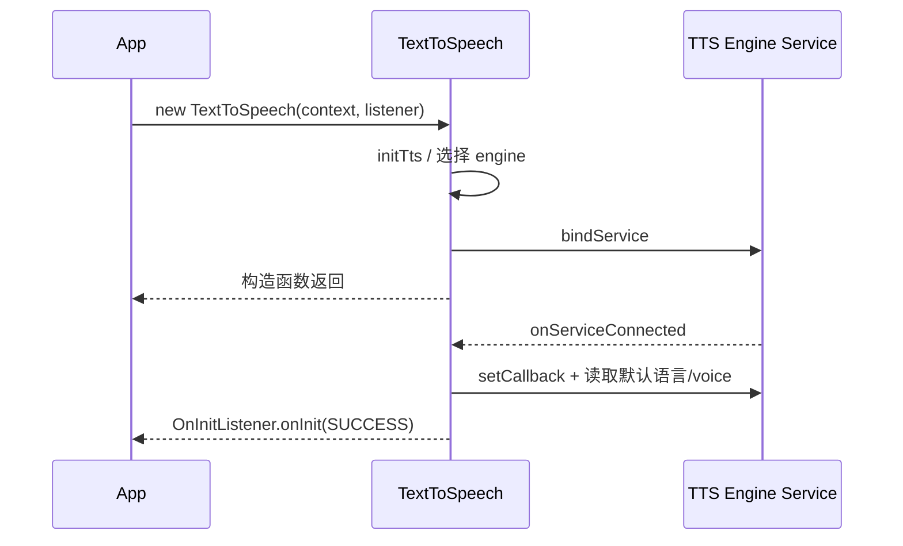
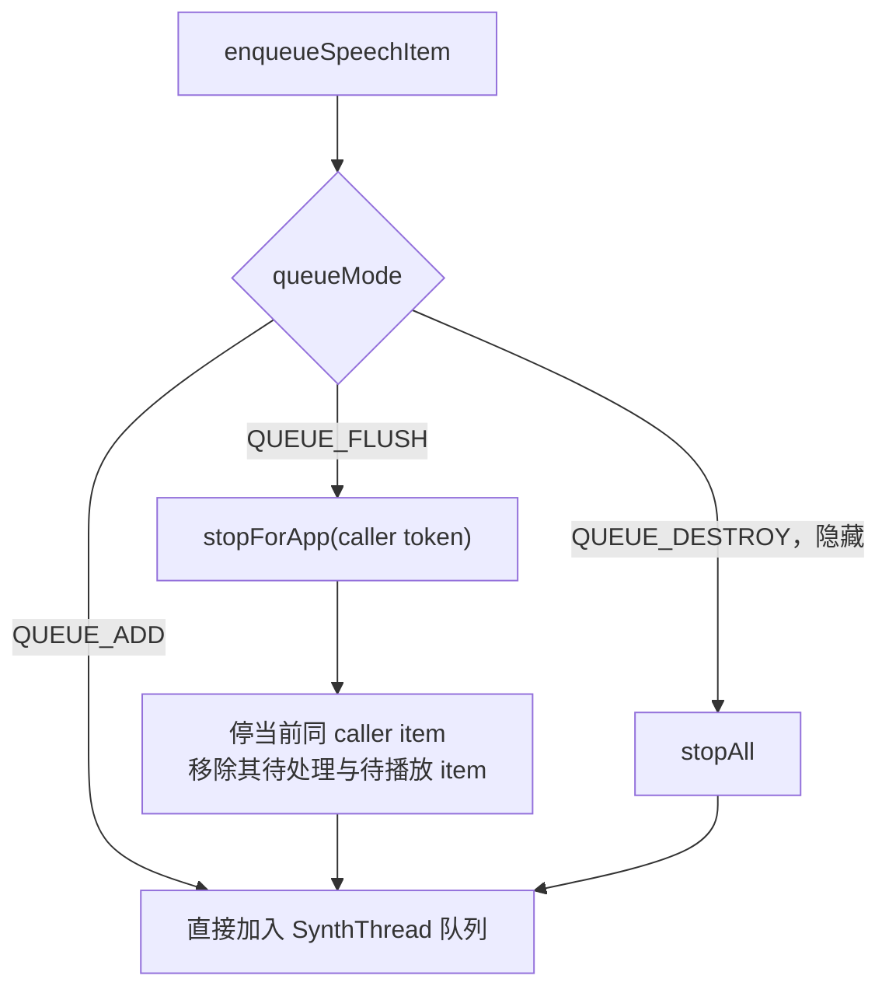
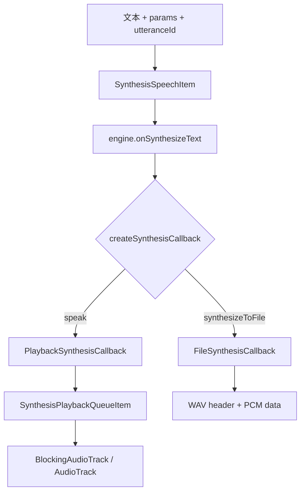
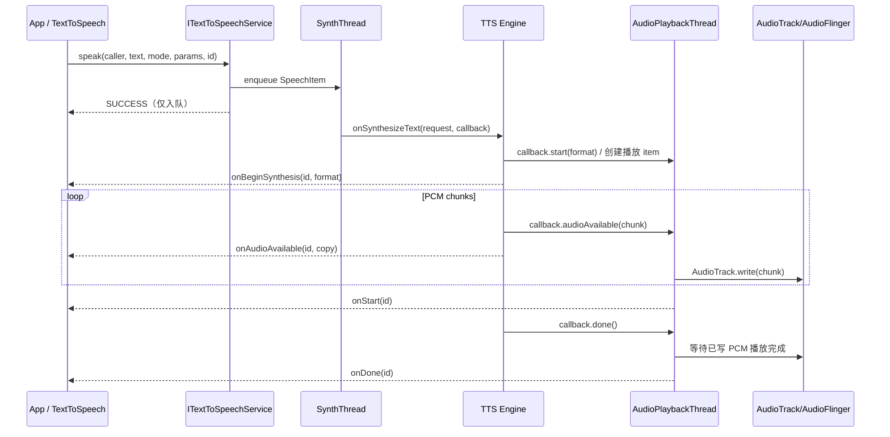

# 62 TextToSpeech、TextToSpeechService 与语音合成播放链路

> 源码版本：Android 11 / API 30 / `android-11.0.0_r48`  
> 学习方式：macOS 只读源码，不要求编译。  
> 本章目标：理解 `TextToSpeech` 如何选择并绑定引擎，语言与 `Voice` 如何进入请求参数，文本如何经过 Binder、合成队列、引擎和 `SynthesisCallback` 变成流式 PCM，再由独立播放线程送入 `AudioTrack` 或写成 WAV 文件；同时掌握进度回调、队列刷新、停止和释放的准确语义。

---

## 1. 从一句“前方左转”开始

导航 App 调用：

```java
tts.speak("前方左转", TextToSpeech.QUEUE_ADD, null, "nav-42");
```

背后不是一个同步的“文字换声音”函数，而是一条异步流水线：

```text
App TextToSpeech
→ 绑定选中的 TTS engine Service
→ ITextToSpeechService.speak(...)
→ SynthHandler 把 SpeechItem 放入合成队列
→ TextToSpeechService.onSynthesizeText(...)
→ 引擎生成一小块又一小块 PCM
→ SynthesisCallback.audioAvailable(...)
→ AudioPlaybackHandler 播放队列
→ BlockingAudioTrack / AudioTrack
→ AudioFlinger → Audio HAL → 扬声器
```

一句话理解：**TTS Framework 负责引擎发现、Binder 协议、请求排队、PCM 搬运、播放/文件输出和回调；真正把文字推理成音频的算法由 `TextToSpeechService` 子类实现。**

---

## 2. 先划清六个角色

| 角色 | 所在侧 | 职责 |
|---|---|---|
| `TextToSpeech` | App 进程 | 公共客户端 API、选引擎、绑定、保存默认请求参数 |
| `ITextToSpeechService` | Binder | speak、file、audio、silence、stop、语言和 voice 查询 |
| `TextToSpeechService` | TTS 引擎进程 | 服务基类、请求队列、线程和回调管理 |
| TTS engine 子类 | TTS 引擎进程 | 实现 `onSynthesizeText()`，真正生成 PCM |
| `SynthesisCallback` | Framework 给引擎 | 接收 start、PCM chunks、range、error、done |
| `UtteranceProgressListener` | App 进程 | 接收 begin/start/audio/range/done/error/stop |

不要混淆两组 callback：

```text
SynthesisCallback
  引擎实现 → Framework
  “我生成的 PCM 是这些”

UtteranceProgressListener
  Framework → App
  “你的 utterance 现在走到这里”
```

---

## 3. 与上一章 SpeechRecognizer 的方向正好相反

```text
SpeechRecognizer：麦克风音频 → 文本
TextToSpeech：      文本 → PCM 音频 → 扬声器/文件
```

但二者有相同的 Framework 设计习惯：

- App 面向公共门面对象；
- 能力由独立 Service 提供；
- Binder 传控制命令和异步事件；
- 具体模型通常不在 `frameworks/base`；
- 调用返回成功只代表请求被接受，不代表最终业务成功。

最值得记住的不同点：`RecognitionListener` 被框架切回 App 主线程，而 `UtteranceProgressListener` 在当前源码中由 Binder Stub 直接调用，**不能假设在主线程**。

---

## 4. 核心源码地图

```text
frameworks/base/core/java/android/speech/tts/
    TextToSpeech.java
    TextToSpeechService.java
    TtsEngines.java
    Voice.java
    SynthesisRequest.java
    SynthesisCallback.java
    AbstractSynthesisCallback.java
    PlaybackSynthesisCallback.java
    FileSynthesisCallback.java
    AudioPlaybackHandler.java
    PlaybackQueueItem.java
    SynthesisPlaybackQueueItem.java
    AudioPlaybackQueueItem.java
    SilencePlaybackQueueItem.java
    BlockingAudioTrack.java
    UtteranceProgressListener.java
    ITextToSpeechService.aidl
    ITextToSpeechCallback.aidl
```

与音频系统的接点：

```text
frameworks/base/media/java/android/media/AudioTrack.java
frameworks/av/services/audioflinger/
```

本章先读 Framework 通用流水线。要继续看神经网络、拼接合成、语言包或云端协议，必须进入具体引擎 APK/模块；`TextToSpeechService` 只是引擎基类。

---

## 5. Android 11 的包可见性要求

`TextToSpeech.java` 类注释明确提醒：target Android 11 的 App 应在 Manifest 声明查询 TTS Service：

```xml
<queries>
    <intent>
        <action android:name="android.intent.action.TTS_SERVICE" />
    </intent>
</queries>
```

原因是 Android 11 引入更严格的 package visibility。TTS 引擎发现依赖查询能处理：

```text
TextToSpeech.Engine.INTENT_ACTION_TTS_SERVICE
= android.intent.action.TTS_SERVICE
```

这不是启动 Service 的权限，也不是麦克风权限。TTS 是输出声音，不需要 `RECORD_AUDIO`；`queries` 的作用是让调用方能“看见”候选引擎包。

### 5.1 引擎服务本身怎样声明

AOSP 的 `development/samples/TtsEngine` 给出当前版本可直接对照的结构：

```xml
<service
    android:name=".RobotSpeakTtsService"
    android:label="@string/app_name">
    <intent-filter>
        <action android:name="android.intent.action.TTS_SERVICE" />
        <category android:name="android.intent.category.DEFAULT" />
    </intent-filter>
    <meta-data
        android:name="android.speech.tts"
        android:resource="@xml/tts_engine" />
</service>
```

服务必须继承 `TextToSpeechService`。action 负责发现和绑定，`android.speech.tts`
metadata 指向 `<tts-engine>` XML，可声明设置 Activity 等引擎信息。不要把系统 Manifest 中的
`BIND_TEXT_SERVICE` 套到这里：它的注释针对拼写检查等 `TextService`，不是 TTS engine。

---

## 6. 构造 TextToSpeech 是异步初始化

典型代码：

```java
TextToSpeech tts = new TextToSpeech(context, status -> {
    if (status == TextToSpeech.SUCCESS) {
        // 从这里开始设置语言、voice、listener，并提交 speak
    }
});
```

构造函数末尾调用 `initTts()`，但绑定 Service 是异步的。对象已经返回，不等于可用。



在 `onInit(SUCCESS)` 前调用 `speak()`，`runAction()` 可能因为连接尚未 fully established 而返回 `ERROR`。

---

## 7. 引擎选择的三级回退

`initTts()` 的顺序非常清楚：

```text
第 1 级：构造函数明确请求的 engine package
  ├─ 已安装且 bind 成功 → 使用
  └─ 不可用且允许 fallback → 继续

第 2 级：用户设置中的默认 TTS engine
  ├─ bind 成功 → 使用
  └─ 失败 → 继续

第 3 级：系统中优先级最高的 engine
  ├─ bind 成功 → 使用
  └─ 失败 → onInit(ERROR)
```

源码骨架：

```java
if (mRequestedEngine != null) { /* try requested */ }
String defaultEngine = getDefaultEngine();
if (defaultEngine != null) { /* try default */ }
String highest = mEnginesHelper.getHighestRankedEngineName();
if (highest != null) { /* try highest */ }
```

因此“我传了某个包名”不一定等于最终正在使用该包，除非关闭 fallback 或用 `getDefaultEngine()/getEngines()`、初始化结果及产品日志确认。

当前实际连接的包保存在 `mCurrentEngine`，可通过 `getDefaultEngine()` 理解默认选择，但“默认包”和“当前成功连接包”仍是两个概念。

---

## 8. 连接建立还要做一次 Setup

`onServiceConnected()` 只拿到了 Binder，并未马上认为初始化完成：

```text
onServiceConnected
→ ITextToSpeechService.Stub.asInterface
→ SetupConnectionAsyncTask
    → service.setCallback(callerIdentity, mCallback)
    → 读取 client default language
    → 读取该 locale 的 default voice
→ mEstablished = true
→ dispatchOnInit(result)
```

为什么先注册 callback？因为每个客户端实例需要用自己的 Binder token 接收 utterance 进度，也需要靠这个 token 区分队列归属。

`getCallerIdentity()` 返回的就是客户端 `ITextToSpeechCallback.Stub` Binder。它既是回调端点，也是服务端识别“这是哪个 `TextToSpeech` 实例”的身份 token。

---

## 9. OnInitListener 的两个容易踩坑点

### 9.1 不要在构造回调里依赖尚未完成赋值的字段

类注释提醒：初始化失败时 listener 可能在 `TextToSpeech` 实例完成构造前就被立即调用。

危险写法：

```java
tts = new TextToSpeech(context, status -> {
    tts.setLanguage(Locale.CHINA); // 极端失败路径下 tts 可能尚未赋值
});
```

可把初始化与使用放到独立方法，并对字段状态做保护。

### 9.2 OnInit 成功只说明客户端与 engine 初始化完成

它不保证：

- 某种语言一定支持；
- 指定 voice 的数据已经下载；
- 下一条网络合成一定成功；
- 音频设备一定可播放；
- 文件描述符一定可写。

这些要在 `setLanguage/setVoice` 返回值和每个 utterance 的进度回调中继续判断。

---

## 10. speak() 的 SUCCESS 只表示成功入队

源码文档直接写道：返回值是 **queuing the speak operation** 的成功或失败。

```java
int result = tts.speak(text, queueMode, params, utteranceId);
```

若 `result == SUCCESS`，只可得出：

```text
客户端连接可用
→ Binder 请求送达
→ 服务验证请求并把 SpeechItem 放进 SynthThread queue
```

不能得出：

```text
引擎已经开始推理
PCM 已生成
扬声器已经发声
音频已经播放完
```

最终状态要看：

```text
onDone(utteranceId)
onError(utteranceId, errorCode)
onStop(utteranceId, interrupted)
```

这与 JobScheduler 的 schedule 成功、MediaCodec 的异步 buffer、上一章 SpeechRecognizer start 返回具有同一种设计思想：**提交成功不等于执行成功。**

---

## 11. ITextToSpeechService：控制面协议

核心 Binder 方法：

```aidl
int speak(IBinder caller, CharSequence text,
        int queueMode, Bundle params, String utteranceId);
int synthesizeToFileDescriptor(IBinder caller, CharSequence text,
        ParcelFileDescriptor fd, Bundle params, String utteranceId);
int playAudio(IBinder caller, Uri uri,
        int queueMode, Bundle params, String utteranceId);
int playSilence(IBinder caller, long duration,
        int queueMode, String utteranceId);
int stop(IBinder caller);
boolean isSpeaking();
```

语言/voice 管理方法：

```text
isLanguageAvailable
loadLanguage
getClientDefaultLanguage
getVoices
loadVoice
getDefaultVoiceNameFor
```

以及：

```text
setCallback(caller, ITextToSpeechCallback)
```

这里的数据分两类：

- 文本、参数、语言、voice、队列命令通过 Binder 控制面传递；
- PCM 并不是经 Binder 从 App 发到引擎，而是在引擎进程内部通过 `SynthesisCallback` 流向播放器或文件；只有 App 请求 `onAudioAvailable` 进度时，PCM 副本才经 callback Binder 返回 App。

---

## 12. 服务启动后创建两条工作线程

`TextToSpeechService.onCreate()` 创建：

```java
SynthThread synthThread = new SynthThread();
synthThread.start();
mSynthHandler = new SynthHandler(synthThread.getLooper());

mAudioPlaybackHandler = new AudioPlaybackHandler();
mAudioPlaybackHandler.start();
```

所以至少要区分：

| 线程 | 主要职责 |
|---|---|
| Service 主线程 | 生命周期，如 `onCreate/onDestroy` |
| Binder 线程 | 接收 App 的 AIDL 调用、查询方法、stop 请求 |
| `SynthThread` | 串行取出 SpeechItem，调用引擎 `onSynthesizeText` |
| Audio playback thread | 消费 PCM/音频/静音队列，操作播放对象 |
| App Binder 线程 | 接收 `ITextToSpeechCallback` 并直接调用 progress listener |

合成和播放拆线程的意义是：引擎可以流式生产后续 PCM，播放线程同时消费前面的 PCM，形成流水线，而不是整句话全部生成完才开始发声。

---

## 13. SpeechItem：队列中的统一任务对象

服务把不同请求包装成不同 item：

```text
SynthesisSpeechItem
  文本 → PCM → 播放

SynthesisToFileOutputStreamSpeechItem
  文本 → PCM → WAV 文件

AudioSpeechItem
  播放已有 Uri 音频

SilenceSpeechItem
  播放一段静音/延时
```

共同基类 `SpeechItem` 保存：

```text
callerIdentity
callerUid / callerPid
started / stopped
```

并定义：

```text
isValid()
play() → playImpl()
stop() → stopImpl()
```

`SpeechItem` 的“play”是广义执行，不一定真播放：文件合成 item 的 play 是在 SynthThread 上把 PCM 写入文件。

---

## 14. SynthHandler 怎样入队

Binder 线程调用：

```java
mSynthHandler.enqueueSpeechItem(queueMode, item);
```

主要步骤：

```text
1. item.isValid
2. 根据 queueMode 决定是否 flush
3. 把 Runnable Message 放到 SynthThread Looper
4. SynthThread 取到后设为 mCurrentSpeechItem
5. speechItem.play()
6. 完成后清除 current
```

文本合法性至少包括：

```text
text != null
text.length <= TextToSpeech.getMaxSpeechInputLength()
```

Android 11 的 `getMaxSpeechInputLength()` 明确返回 4000 个字符。业务仍应按自然停顿切句，因为仅仅“不超过硬限制”不等于低延迟、自然韵律或良好取消体验。

---

## 15. QUEUE_ADD 与 QUEUE_FLUSH

### QUEUE_ADD

```text
已有：A1 → A2
新来：A3, QUEUE_ADD
结果：A1 → A2 → A3
```

### QUEUE_FLUSH

```text
App A：A1 正在执行，A2/A3 等待
App B：B1 等待或播放
App A 提交 A4, QUEUE_FLUSH

结果：停止/移除 A1、A2、A3
      保留 App B 的项目
      再加入 A4
```

源码注释非常重要：`QUEUE_FLUSH` 是 **per caller**，不是清空整个 TTS engine 的所有客户。

隐藏的 `QUEUE_DESTROY` 才会全局 purge，但普通 App 不应使用它。



---

## 16. 为什么 flush 实现看起来很复杂

仅调用 `Handler.removeCallbacksAndMessages(caller)` 不够，因为可能与 SynthThread 正在把 item 设为 current 发生竞态。

`SynthHandler` 维护：

```text
mFlushedObjects：正在被按 caller flush 的 token 列表
mFlushAll：正在全局 flush 的计数
```

flush 流程：

```text
startFlushingSpeechItems(caller)
→ 当前同 caller item：取出并 stop
→ AudioPlaybackHandler.stopForApp(caller)
→ 在 SynthThread 队尾放一个 endFlushing runnable
```

若一个旧 Message 已经无法物理删除，它执行时 `setCurrentSpeechItem()` 仍会通过 `isFlushed(item)` 拒绝启动，然后触发 stop 回调。

为什么用 List/计数而非 Set/boolean？源码注释解释：多个 flush 可以重叠，必须等最后一个 flush 边界 Message 走过，才算停止过滤旧任务。

---

## 17. 真正的引擎入口：onSynthesizeText

`SynthesisSpeechItem.playImpl()` 创建 callback 后调用：

```java
TextToSpeechService.this.onSynthesizeText(
        mSynthesisRequest, synthesisCallback);
```

引擎必须实现：

```java
protected abstract void onSynthesizeText(
        SynthesisRequest request,
        SynthesisCallback callback);
```

API 契约非常严格：

- 在单一 `SynthThread` 调用，不是 Service 主线程；
- 方法必须同步阻塞到本次合成结束；
- 不得保存 callback 并在方法返回后继续使用；
- PCM 应按 `start → audioAvailable* → done` 送出；
- 即使 error，也应完成 `done()` 协议。

概念实现：

```java
protected void onSynthesizeText(SynthesisRequest req,
        SynthesisCallback cb) {
    int status = cb.start(24000,
            AudioFormat.ENCODING_PCM_16BIT, 1);
    if (status != TextToSpeech.SUCCESS) return;

    while (engine.hasNextChunk()) {
        byte[] pcm = engine.nextChunk();
        status = cb.audioAvailable(pcm, 0, pcm.length);
        if (status != TextToSpeech.SUCCESS) break;
    }
    cb.done();
}
```

这只是协议示意。真实引擎还要响应跨线程 `onStop()`，校验最大 buffer，处理 error code 和释放模型任务。

---

## 18. SynthesisRequest 里有什么

从客户端 Bundle 和默认设置组装出的请求包含：

```text
text / CharSequence（可带 TtsSpan）
language / country / variant
voice name
speech rate
pitch
engine-specific parameters
caller UID 等服务内部上下文
```

三个常见维度：

### Speech rate

`setSpeechRate(float)` 最终转换为内部整数比例；1.0 是正常速度。它改变后续请求的默认参数，不会倒改已经入队的 item。

### Pitch

`setPitch(float)` 同样影响后续请求。速度和音高不是同一维度。

### Audio attributes

决定输出的 usage/content type 等音频策略语义。旧式 stream type 仍可转换，但新代码应优先思考 `AudioAttributes`，因为 AudioPolicy 根据属性决定路由、音量组和与其他音频的关系。

---

## 19. Locale 与 Voice 不是同一个抽象

```text
Locale：语言/地区/变体，例如 zh-CN
Voice：某引擎提供的一套具体声音与后端能力
```

同一 Locale 可能有多个 voice：

```text
中文女声（本地、普通质量、低延迟）
中文男声（本地、高质量）
中文自然声（网络、更高延迟）
```

`Voice` 包含：

```text
name
locale
quality
latency
requiresNetworkConnection
features
```

API 21 起，`setLanguage(locale)` 在客户端会先问服务该 locale 的 default voice name，再走 `setVoice()`/`loadVoice()` 语义。因此语言是用户意图，voice 是实际合成后端的更具体选择。

---

## 20. 语言可用返回值不是简单 boolean

| 返回值 | 意义 |
|---:|---|
| `LANG_COUNTRY_VAR_AVAILABLE` = 2 | 语言、国家、variant 都精确支持 |
| `LANG_COUNTRY_AVAILABLE` = 1 | 支持语言和国家，不支持/忽略 variant |
| `LANG_AVAILABLE` = 0 | 只保证语言层级 |
| `LANG_MISSING_DATA` = -1 | 理论支持，但语音数据缺失 |
| `LANG_NOT_SUPPORTED` = -2 | 不支持 |

所以正确判断通常是：返回值是否大于等于 `LANG_AVAILABLE`，同时根据产品是否要求地区/variant 精确匹配进一步判断。

`onLoadLanguage()` 还是一种“即将使用”的提示，服务注释不保证每次合成前一定调用。引擎不能把正确性完全建立在“此前肯定 load 过”上。

---

## 21. PCM 流式协议

引擎对 callback 的正常调用序列：

```text
callback.start(sampleRate, encoding, channelCount)
callback.audioAvailable(buffer1, ...)
callback.audioAvailable(buffer2, ...)
...
callback.done()
```

支持的公开格式包括：

```text
ENCODING_PCM_8BIT
ENCODING_PCM_16BIT
ENCODING_PCM_FLOAT（目标版本满足要求）
1 或 2 声道
```

每块大小必须不超过 `callback.getMaxBufferSize()`。当前播放和文件 callback 的上限都围绕 8192 bytes 设计。

为什么分块而不是一次大数组：

- 降低首音延迟；
- 限制峰值内存；
- 合成与播放可并行；
- stop 可以较快生效；
- 网络流式引擎可以边收边播。

---

## 22. PlaybackSynthesisCallback：PCM 进入播放队列

播放型 callback 的 `start()` 会：

```text
校验格式和声道
→ dispatchOnBeginSynthesis
→ 创建 SynthesisPlaybackQueueItem
→ AudioPlaybackHandler.enqueue(item)
```

`audioAvailable()` 会复制 PCM：

```java
byte[] copy = new byte[length];
System.arraycopy(buffer, offset, copy, 0, length);
mDispatcher.dispatchOnAudioAvailable(copy);
item.put(copy);
```

这里复制是为了所有权安全：引擎在方法返回后可以复用原数组，而播放线程和 App callback 仍要异步消费数据。

`item.put()` 可能阻塞，因为不能让生产者无限领先。`SynthesisPlaybackQueueItem` 限制未消费音频大约最多 500 ms，形成反压：

```text
引擎太快
→ PCM 缓冲达到阈值
→ SynthThread 暂时阻塞在 put
→ 播放线程消费
→ 唤醒生产者继续
```

这防止一段很长的朗读把大量 PCM 全堆进内存。

---

## 23. AudioPlaybackHandler 与 BlockingAudioTrack

`AudioPlaybackHandler` 有自己的阻塞队列和线程，串行执行 `PlaybackQueueItem.run()`：

```text
SynthesisPlaybackQueueItem → 流式 PCM
AudioPlaybackQueueItem     → 已有 Uri 音频
SilencePlaybackQueueItem   → 静音时长
```

对合成音频：

```text
SynthesisPlaybackQueueItem
→ BlockingAudioTrack.init()
→ AudioTrack.write(...)
→ 等待播放头消费/完成
→ dispatchOnSuccess 或 Error/Stop
```

再往下就是第 28 章的音频播放链：

```text
AudioTrack Java
→ JNI/native AudioTrack
→ AudioFlinger PlaybackThread/MixerThread
→ AudioPolicy 选路由
→ Audio HAL
→ speaker/Bluetooth/USB 等设备
```

TTS 不绕过 Android 音频系统，它只是 AudioTrack 的上游 PCM 生产者。

---

## 24. onBeginSynthesis 与 onStart 完全不同

| 回调 | 表示什么 |
|---|---|
| `onBeginSynthesis` | 引擎开始生成 PCM，并公布 sample rate/format/channel |
| `onAudioAvailable` | 某块 PCM 已生成 |
| `onStart` | 这条 utterance 开始实际播放，或文件合成开始写入 |
| `onDone` | 播放完成，或文件成功写完 |

队列中可能出现：

```text
utterance A 正在扬声器播放
utterance B 已开始合成并产生 PCM
但 B 还没有开始播放
```

因此 B 可以先收到 `onBeginSynthesis/onAudioAvailable`，稍后才收到 `onStart`。

若 UI 要显示“正在生成”，看 begin；要显示“正在朗读”，看 start；要在真正播放完后翻页，看 done。

---

## 25. UtteranceProgressListener 的终态

```text
onDone(id)                 正常完成
onError(id, errorCode)     失败
onStop(id, interrupted)    被 stop/flush
```

同一 utterance 不应既 done 又 error。`onStop` 的 `interrupted` 参数：

- true：已经开始合成/执行后被中断，输出不完整；
- false：还没开始就从队列被 flush。

这能帮助 UI 区分：

```text
“用户听了一半取消”
vs
“请求尚未轮到就被新请求替换”
```

每条重要请求都应提供唯一且非空的 `utteranceId`。没有 id，许多 progress dispatch 会直接跳过，App 难以可靠匹配结果。

---

## 26. 进度回调不保证在主线程

客户端 `Connection` 内部的 Binder Stub 直接调用：

```java
public void onSuccess(String utteranceId) {
    UtteranceProgressListener listener = mUtteranceProgressListener;
    if (listener != null) {
        listener.onDone(utteranceId);
    }
}
```

中间没有 Handler，因此线程链路是：

```text
TTS engine synthesis/playback thread
→ ITextToSpeechCallback oneway Binder
→ App Binder thread
→ UtteranceProgressListener
```

若要更新 View：

```java
@Override
public void onDone(String id) {
    mainHandler.post(() -> showCompleted(id));
}
```

还应保持回调轻量，不能阻塞 Binder 线程；共享状态需考虑并发，因为不同 utterance 的事件可能来自不同服务线程并经 Binder 线程池抵达。

---

## 27. onAudioAvailable 不是播放进度

它告诉 App “这块 PCM 已经合成出来”，不是“人耳已经听到这块 PCM”。源码注释明确说，受缓冲区和队列影响，音频可能过一段时间才播放。

适合用途：

- 实时分析或可视化合成 PCM；
- 构建自定义数据处理；
- 观察输出格式与分块。

不适合用途：

- 驱动逐字高亮的实际播放位置；
- 把收到 PCM 当作扬声器已播完；
- 在 Binder 回调里做重型编码或磁盘写入。

逐字高亮更适合 `onRangeStart()`。

---

## 28. rangeStart 如何实现逐字高亮

引擎在合成线程报告：

```java
callback.rangeStart(markerInFrames, start, end);
```

含义：从该 utterance 的第 `markerInFrames` 帧音频开始，对应文本区间 `[start, end)` 将被朗读。

`SynthesisPlaybackQueueItem` 把 marker 与 `AudioTrack` 播放头关联，真正接近该帧时才向 App 发：

```text
UtteranceProgressListener.onRangeStart(id, start, end, frame)
```

注意：

- 只有引擎主动提供 timing 信息才会发生；
- `synthesizeToFile()` 不会按播放头触发 range 回调；
- start/end 是输入文本字符索引，end 不包含；
- emoji、组合字符、Span 和不同语言的“字”概念会使 UI 映射复杂，不能总把 Java char 当视觉字符。

---

## 29. synthesizeToFile 不是把裸 PCM 直接写盘

客户端把目标 `File` 打开为可写 `ParcelFileDescriptor`，跨 Binder 传给服务。服务创建 `FileSynthesisCallback`。

文件 callback 流程：

```text
start
→ 先预留 44 bytes WAV header
→ audioAvailable*：顺序写 PCM
→ done：回到文件开头补 WAV header
→ onDone
```

WAV header 包含 sample rate、channel、bits/data length 等信息。只有 `done()` 成功执行，header 中的数据长度才最终正确。

若中途 stop/error：

- 文件可能存在但不完整；
- 不应只凭文件存在就判定成功；
- 应等待对应 utterance 的 `onDone`；
- 失败时由 App 决定是否删除残留文件。

`synthesizeToFile()` 的同步返回值同样只代表“文件合成操作成功入队”。

当前 Binder 实现把文件合成固定以 `QUEUE_ADD` 加入同一个 SynthThread 队列：公开的新式
`synthesizeToFile()` 没有 `queueMode` 参数。若要撤销等待中或执行中的文件任务，使用本实例的
`stop()`；不要误以为它能像 `speak(..., QUEUE_FLUSH, ...)` 一样在提交时选择 flush。

---

## 30. speak 与 synthesizeToFile 的分叉



两条路径共用：

- 同一个合成入口；
- `SynthesisRequest`；
- callback 的 start/audioAvailable/error/done 协议；
- utterance progress callback。

不同的是 PCM 消费者：播放队列或 FileChannel。

---

## 31. playAudio、addSpeech 与 playEarcon

并非每个 `speak(text)` 都一定调用合成引擎。客户端可建立映射：

```text
某段固定文本 → Uri 音频
某个 earcon 名称 → Uri 音效
```

如果 `mUtterances.get(text)` 命中，`speak()` 实际调用服务的 `playAudio()`。

用途：

- 高频固定提示复用录好的自然音频；
- 短促提示音；
- 避免固定句反复合成。

这条路径进入 `AudioPlaybackQueueItem`，由媒体播放器/播放队列处理，不经过 `onSynthesizeText()`。

所以调试“为什么引擎没有收到某句话”时，要先确认 App 是否曾用 `addSpeech()` 注册了文本映射。

---

## 32. playSilentUtterance 也是队列项目

静音并不是“什么都不做”，而是：

```text
SilencePlaybackQueueItem(duration)
→ 占据播放队列中的一段时间
→ 可以有 utteranceId 和完成回调
```

它常用于语句间可控停顿：

```text
speak(A, QUEUE_ADD)
playSilentUtterance(300ms, QUEUE_ADD)
speak(B, QUEUE_ADD)
```

这比在主线程 `sleep(300)` 正确，因为停顿属于同一异步播放队列，且可被 stop/flush。

---

## 33. stop() 的精确作用域

客户端调用：

```java
tts.stop();
```

服务端：

```text
stopForApp(callerIdentity)
→ 标记该 caller 正在 flush
→ 停止该 caller 当前 synthesis/file item
→ 清除该 caller 待处理 SynthThread items
→ AudioPlaybackHandler.stopForApp(caller)
→ 停止该 caller 当前/待播放 items
```

它不会故意清掉其他 App 通过同一 engine 提交的语音。

stop 还必须跨两个阶段：

- 合成层：让引擎停止继续产生 PCM；
- 播放层：丢弃已经产生但尚未播放的 PCM，并停止当前 AudioTrack。

只停引擎不清播放队列，用户还会听到缓存；只停 AudioTrack 不通知引擎，则 SynthThread 还可能继续耗 CPU/网络。

---

## 34. 引擎 onStop() 的线程约束

`TextToSpeechService.onStop()`：

- 即使当前没有合成也可能调用；
- 可以从多个线程调用；
- 不在 synthesis thread 上调用。

这意味着引擎必须用线程安全方式打断当前 `onSynthesizeText()`：

```text
Binder/其他服务线程：onStop → 设置 cancelled / 取消网络 / 唤醒等待
SynthThread：onSynthesizeText 观察 cancelled → 停止生成 → 返回
```

不能让 `onStop()` 等待 SynthThread 持有的同一把锁，而 SynthThread 又等 `onStop()` 改状态，否则容易死锁。

`SynthesisCallback.audioAvailable()` 的返回值也可能变成 `STOPPED/ERROR`，引擎应及时检查，而不是无视返回值继续生产。

---

## 35. shutdown() 比 stop() 多做什么

| 方法 | 停本实例请求 | 注销 callback | 解绑 Service | 对象后续可用 |
|---|---:|---:|---:|---:|
| `stop()` | 是 | 否 | 否 | 是 |
| `shutdown()` | 是 | 是 | 是 | 否 |

`shutdown()` 已连接路径：

```text
service.setCallback(callerToken, null)
→ service.stop(callerToken)
→ Connection.disconnect / unbindService
→ mServiceConnection = null
→ mCurrentEngine = null
```

若还在连接中，它会直接 unbind `mConnectingServiceConnection`。

页面或拥有者永久销毁时必须 shutdown，避免：

- ServiceConnection 泄漏；
- engine 进程/Service 无意义存活；
- callback 持有对象；
- 旧实例继续占着队列身份。

不要在每句话结束后 shutdown；需要复用时保留连接，只在生命周期终点释放。

---

## 36. 服务死亡与自动重连

`TextToSpeech.runAction()` 捕获 `RemoteException` 后可按参数触发重新初始化。连接断开时也会清理 service reference。

这能处理一部分 engine 崩溃，但 App 仍要理解：

- 正在执行的 utterance 通常已经失败或丢失；
- 重连不是事务重放保证；
- 同一个 utteranceId 不应盲目重复产生副作用；
- UI 应等待新一轮 init/明确状态再提交。

朗读文字通常可安全重试，但导航指令、无障碍播报仍要避免过时语句在恢复后突然播放。

---

## 37. 错误码按层理解

| 常量 | 值 | 层次/含义 |
|---|---:|---|
| `ERROR` | -1 | 通用同步调用失败 |
| `STOPPED` | -2 | 服务内部停止状态，客户端通常从 onStop 感知 |
| `ERROR_SYNTHESIS` | -3 | 引擎无法合成输入 |
| `ERROR_SERVICE` | -4 | TTS Service 状态失败 |
| `ERROR_OUTPUT` | -5 | AudioTrack 或文件输出失败 |
| `ERROR_NETWORK` | -6 | 网络连接问题 |
| `ERROR_NETWORK_TIMEOUT` | -7 | 网络超时 |
| `ERROR_INVALID_REQUEST` | -8 | null、过长或其他非法请求 |
| `ERROR_NOT_INSTALLED_YET` | -9 | voice 所需数据尚未安装完 |

排障不要只显示“朗读失败”：

```text
INVALID_REQUEST → 检查文本长度/参数
NOT_INSTALLED   → 引导安装 voice data 或换 voice
NETWORK        → 离线 voice/文字 UI 降级
OUTPUT         → 音频路由、AudioTrack、文件 FD/空间
SERVICE        → 引擎连接和进程日志
SYNTHESIS      → 文本、语言、voice、引擎模型
```

覆写 `onError(String, int)` 才能保留具体错误码；只实现旧的 `onError(String)` 会丢失分类信息。

---

## 38. isSpeaking() 到底表示什么

服务实现通常综合：

```text
SynthHandler 有 current speech item
或 AudioPlaybackHandler 正在播放/仍有状态
```

它是一个瞬时快照，不是未来保证：

```text
调用 isSpeaking() 得到 false
→ 下一微秒另一线程入队
→ 状态变 true
```

因此不能用：

```java
if (!tts.isSpeaking()) tts.speak(...);
```

来建立严格的互斥协议。业务应使用自己的 utteranceId、队列策略和状态机。

另外“speaking”可能涵盖正在合成或队列播放状态，不等同于此刻扬声器一定输出非静音采样。

---

## 39. AudioAttributes、焦点与路由

TTS 请求最终创建 AudioTrack，仍受音频策略影响：

- `AudioAttributes` 的 usage/content type；
- 系统音量和静音状态；
- 蓝牙、耳机、扬声器路由；
- 其他 App 的 AudioFocus；
- 通话/导航/无障碍等场景策略。

`KEY_PARAM_VOLUME` 和 `KEY_PARAM_PAN` 是本请求的局部缩放/声像，不等于改变系统音量。

TTS Framework 本身并不自动替所有业务设计完整的 AudioFocus 交互。App 要根据产品场景决定是否请求 focus、是否 duck 其他音频、丢失 focus 时 stop/pause（TTS 没有真正通用 pause）或重新排队。

“onDone 了但用户没听见”可能是音量/路由问题，不一定是合成失败。

---

## 40. 文本长度、切句与 TtsSpan

硬上限检查只是第一层。长文本更适合按语义切成多个 utterance：

```text
段落
→ 按句号/问号/自然停顿切句
→ 为每句生成稳定 utteranceId
→ QUEUE_ADD
```

收益：

- 更快首音；
- 可按句取消/恢复；
- 更准确地显示进度；
- 网络失败只重试局部；
- 引擎更容易生成自然韵律。

但切得太碎会导致韵律断裂和大量 Binder/队列开销。

`CharSequence` 可以携带 `TtsSpan`，向引擎表达数字、日期、时间、电话号码等语义，通常比手工把所有内容改写成拼音或读法字符串更结构化。支持程度仍取决于引擎。

---

## 41. 一个稳健的客户端结构

```java
final class TtsController {
    private TextToSpeech tts;
    private boolean ready;
    private final Handler main = new Handler(Looper.getMainLooper());

    void initialize(Context context) {
        tts = new TextToSpeech(context, status -> {
            if (status != TextToSpeech.SUCCESS) {
                main.post(this::showEngineUnavailable);
                return;
            }
            int language = tts.setLanguage(Locale.SIMPLIFIED_CHINESE);
            ready = language >= TextToSpeech.LANG_AVAILABLE;
            tts.setOnUtteranceProgressListener(
                    new UtteranceProgressListener() {
                @Override public void onStart(String id) {
                    main.post(() -> showSpeaking(id));
                }

                @Override public void onDone(String id) {
                    main.post(() -> showDone(id));
                }

                @Override public void onError(String id, int code) {
                    main.post(() -> showError(id, code));
                }

                @Override public void onError(String id) {
                    main.post(() -> showError(id, TextToSpeech.ERROR));
                }
            });
        });
    }

    int speak(String text, String id) {
        if (!ready || tts == null) return TextToSpeech.ERROR;
        return tts.speak(text, TextToSpeech.QUEUE_ADD, null, id);
    }

    void release() {
        ready = false;
        if (tts != null) tts.shutdown();
        tts = null;
    }
}
```

这是理解结构的示例。实际工程还需：

- 防止初始化失败回调早于字段赋值；
- 保证 initialize/release 幂等；
- 处理配置变化和拥有者生命周期；
- 选择 voice 与下载降级；
- 管理 AudioFocus；
- 为过时播报建立 generation/session 校验。

---

## 42. 导航播报为何常用 QUEUE_FLUSH

假设道路状态快速变化：

```text
旧请求：500 米后左转
新请求：前方道路封闭，请直行
```

若全用 `QUEUE_ADD`，新指令排在旧指令后，等播放时可能已经过时。导航常按优先级选择：

```text
低优先级提示 → QUEUE_ADD
必须立即替换的关键指令 → QUEUE_FLUSH
```

但 flush 会停止该 TTS 实例之前的所有 utterance，不只一条。因此业务最好：

- 用独立 `TextToSpeech` 实例/控制器隔离不同播报域，或统一调度；
- 给请求标优先级和时效；
- 不把辅助说明和紧急指令无脑混入同一 FIFO；
- 处理被 flush 项的 `onStop`，不要当错误弹窗。

---

## 43. 无障碍与安全场景的特殊考虑

语音输出可能泄露屏幕上的敏感内容。设计时考虑：

- 锁屏时是否允许读验证码、消息正文；
- 蓝牙/扬声器路由变化后内容是否仍适合外放；
- 多用户切换与当前上下文；
- App 退到后台后旧播报是否应继续；
- 日志中不要记录完整敏感文本；
- 网络 voice 是否会把文本发给远端服务。

`Voice.isNetworkConnectionRequired()` 是选择依据之一，但仍需了解具体引擎的数据处理声明。统一 Framework API 不自动构成离线隐私保证。

---

## 44. 完整 speak 时序图



图中 callback 到 App 实际经 `ITextToSpeechCallback` Binder；为了可读性省略了该参与者。

---

## 45. 常见误区逐个纠正

### 误区 1：new 完对象就能 speak

不对。必须等待 `OnInitListener` 成功。

### 误区 2：speak 返回 SUCCESS 表示播放成功

不对。只表示成功入队，最终看 done/error/stop。

### 误区 3：QUEUE_FLUSH 会清空整个引擎

不对。公开语义按 caller 清理，其他 App 的队列不应受影响。

### 误区 4：onBeginSynthesis 就是扬声器开始发声

不对。它是 PCM 生成开始；真正播放开始看 onStart。

### 误区 5：onAudioAvailable 表示这块声音已播放

不对。它可能仍在播放队列和 AudioTrack buffer 中。

### 误区 6：所有回调都在主线程

不对。progress listener 由 Binder Stub 直接调用，应自行切主线程。

### 误区 7：setLanguage 成功就选定唯一声音

不完整。Locale 会映射到引擎的 default voice，同语言仍可能有多个 voice。

### 误区 8：stop 和 shutdown 一样

不对。stop 保留连接供复用；shutdown 注销 callback 并解绑，实例应废弃。

### 误区 9：文件存在说明 synthesizeToFile 成功

不对。中途失败也可能留下不完整文件，要等待 onDone。

### 误区 10：TTS Service 在 system_server

通常不对。公共类在 Framework，具体 engine Service 通常运行在引擎 App 进程。

---

## 46. 分层排障方法

### 第一层：发现与初始化

```text
Manifest 是否声明 queries
requested/default/highest-ranked engine 是否存在
bindService 是否成功
onInit 是否 SUCCESS
```

### 第二层：语言与 voice

```text
isLanguageAvailable/setLanguage 返回什么
getVoices 是否含目标 voice
voice data 是否 notInstalled
是否要求网络
```

### 第三层：请求入队

```text
speak 返回 SUCCESS/ERROR
文本是否 null/过长
utteranceId 是否唯一且非空
是否刚被 QUEUE_FLUSH/stop
```

### 第四层：引擎合成

```text
onBeginSynthesis 是否到达
onAudioAvailable 是否产生
ERROR_SYNTHESIS/NETWORK/NOT_INSTALLED
引擎 onSynthesizeText 是否阻塞或违反 callback 协议
```

### 第五层：音频输出

```text
onStart 是否到达
ERROR_OUTPUT
音量、路由、AudioFocus、蓝牙状态
AudioTrack/AudioFlinger 日志
```

### 第六层：完成与释放

```text
是否收到唯一终态
stop/flush 是否产生 onStop
页面销毁是否 shutdown
旧 utterance 是否污染新 UI
```

---

## 47. macOS 只读源码练习

### 练习 1：追引擎三级选择

阅读 `TextToSpeech.initTts()` 与 `TtsEngines`，画出 requested、default、highest-ranked 的回退条件。

### 练习 2：证明 speak SUCCESS 只代表入队

从：

```text
TextToSpeech.speak
→ ITextToSpeechService.speak
→ TextToSpeechService.mBinder
→ SynthHandler.enqueueSpeechItem
```

找到返回 SUCCESS 的具体位置，再说明此时为何还没调用 `onSynthesizeText()`。

### 练习 3：证明 QUEUE_FLUSH 是 per caller

阅读 `stopForApp()`、`mFlushedObjects`、Message.obj 和 `AudioPlaybackHandler.stopForApp()`，解释 caller Binder token 如何贯穿两条队列。

### 练习 4：画出两条线程

追踪 `SynthThread` 与 `AudioPlaybackHandler`，标出谁生产 PCM、谁消费 PCM、反压发生在哪里。

### 练习 5：对比两个 callback

列出 `SynthesisCallback` 与 `ITextToSpeechCallback/UtteranceProgressListener` 的方向、进程、线程和事件。

### 练习 6：追文件格式

阅读 `FileSynthesisCallback.start/audioAvailable/done`，解释为什么先写 44-byte 空 header，最后再回填。

### 练习 7：追逐字高亮

从引擎 `SynthesisCallback.rangeStart` 追到 `SynthesisPlaybackQueueItem` 和 App `onRangeStart`，说明 frame 与字符区间的关系。

### 练习 8：分析 stop 竞态

画出 stop 同时发生在以下位置时的行为：

```text
SpeechItem 尚在 SynthHandler 队列
onSynthesizeText 尚未 callback.start
PCM 正在生产
PCM 已产生、正在播放
文件正在写入
```

### 练习 9：连接第 28 章

从 `BlockingAudioTrack` 找到 `AudioTrack` 构造和 write，继续套用第 28 章 AudioFlinger/AudioPolicy 心智模型。

---

## 48. 阅读后自检题

1. `TextToSpeech` 与 `TextToSpeechService` 分别在哪一侧？
2. target Android 11 为什么需要 TTS service 的 `<queries>`？
3. 引擎选择的三级回退顺序是什么？
4. 为什么必须等待 onInit？
5. callback Binder 为什么同时可作为 caller identity？
6. speak 返回 SUCCESS 能证明到哪一步？
7. `SynthThread` 与 audio playback thread 分工是什么？
8. `QUEUE_FLUSH` 会不会清理其他 App 的 utterance？
9. flush 标记为什么使用 List 和计数，而不是简单 boolean？
10. 引擎调用 `SynthesisCallback` 的正确顺序是什么？
11. PCM 分块和 500 ms 反压解决什么问题？
12. onBeginSynthesis、onStart、onDone 各表示什么？
13. 为什么 progress listener 不能直接假设在主线程？
14. Locale 与 Voice 有什么区别？
15. rangeStart 的 frame 与 `[start,end)` 各指什么？
16. synthesizeToFile 为什么最后才写 WAV header？
17. stop 为什么要同时处理合成队列和播放队列？
18. shutdown 比 stop 多释放哪些资源？
19. onDone 但听不到声音时为何还要排查路由和音量？
20. 为什么长文本最好按自然语义切句？

能独立回答 16 题以上，就掌握了本章主线。

---

## 49. 本章最终心智模型

```text
App
  TextToSpeech
  ├─ initTts：requested → default → highest-ranked engine
  ├─ bind + setCallback + default language/voice
  ├─ speak：只负责提交，SUCCESS = 入队成功
  ├─ stop：清本 caller 的 synthesis + playback
  └─ shutdown：注销 callback + stop + unbind
                    ↓ Binder
TTS engine process
  TextToSpeechService
  ├─ Binder thread：接收命令
  ├─ SynthHandler/SynthThread：串行 SpeechItem
  │    └─ onSynthesizeText(request, callback)
  │          start → audioAvailable* → done/error
  └─ AudioPlaybackHandler thread
       └─ SynthesisPlaybackQueueItem
            └─ BlockingAudioTrack → AudioTrack → AudioFlinger → 设备

另一分支：
  FileSynthesisCallback → 44-byte WAV header + PCM → onDone

进度回程：
  ITextToSpeechCallback Binder → UtteranceProgressListener
  begin / audio / start / range / done | error | stop
  注意：不是主线程保证
```

最重要的五句话：

1. **TTS 构造和 speak 都是异步流程：先等 onInit，speak 的 SUCCESS 也只表示入队。**
2. **合成线程生产 PCM，播放线程消费 PCM；流式传输和反压让首音更快、内存更稳。**
3. **`QUEUE_FLUSH` 与 `stop()` 按 caller token 清理，既要停合成，也要停已经缓存的播放。**
4. **`onBeginSynthesis`、`onAudioAvailable`、`onStart`、`onDone` 分别对应生成、数据、播放开始和最终完成，不能混用。**
5. **`UtteranceProgressListener` 不保证主线程；UI 更新要主动切换，生命周期终点必须 `shutdown()`。**

下一章建议进入 `MediaSession`、`MediaController` 与系统媒体控制链路，学习播放器如何向系统发布播放状态、元数据和控制命令，并与通知、锁屏、蓝牙按键及 AudioFocus 建立联系。
