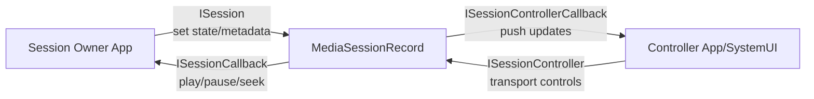
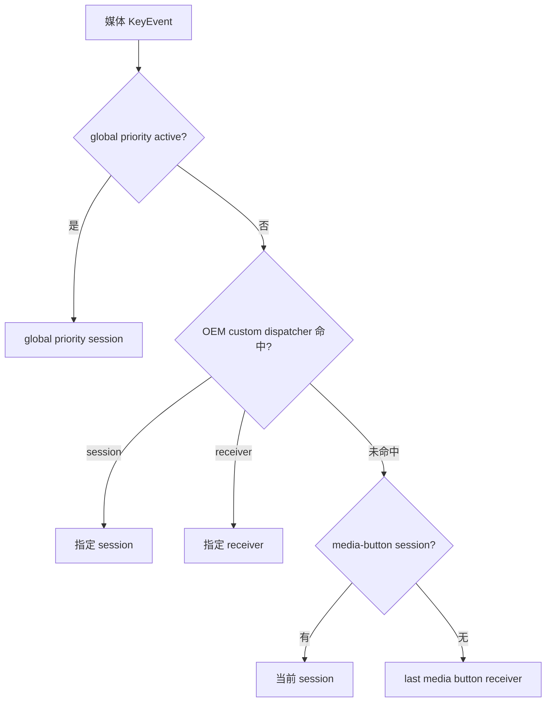

# 63 MediaSession、MediaController 与系统媒体控制链路

> 源码版本：Android 11 / API 30 / `android-11.0.0_r48`  
> 学习方式：macOS 只读源码，不要求编译。  
> 本章目标：理解播放器如何用 `MediaSession` 向系统发布能力、状态和元数据，控制端如何凭 `Token` 创建 `MediaController` 并发送命令，`MediaSessionService` 如何维护 session、控制器和优先级，以及耳机/蓝牙媒体键、通知、锁屏、音量与 AudioFocus 怎样和会话协作。

---

## 1. 先回答：MediaSession 会不会播放音乐

**不会。**

真正播放通常由 App 内的播放器完成：

```text
MediaPlayer / ExoPlayer / 自研播放器
→ MediaCodec / AudioTrack
→ AudioFlinger / SurfaceFlinger
→ 扬声器与屏幕
```

`MediaSession` 做的是另一件事：把播放器包装成系统能理解、能控制、能观察的会话。

```text
播放器真实状态
→ App 更新 MediaSession
→ system_server 保存会话镜像
→ SystemUI/锁屏/蓝牙/车机/其他 Controller 看见

外部按下播放键
→ 系统选择一个 MediaSession
→ MediaSession.Callback.onPlay()
→ App 再命令真实播放器播放
```

一句话：**播放器负责“播”，MediaSession 负责“向系统描述并接受控制”。**

---

## 2. 六个核心角色

| 角色 | 位置 | 作用 |
|---|---|---|
| 播放器 | 媒体 App | 真正准备、解码、播放、暂停、seek |
| `MediaSession` | 媒体 App | 发布状态/元数据，接收控制命令 |
| `MediaSession.Token` | 可跨进程传递 | 指向特定 session 的能力句柄 |
| `MediaController` | 控制端进程 | 查询状态、监听变化、发 transport command |
| `MediaSessionRecord` | system_server | session 的系统端记录和双向 Binder 中介 |
| `MediaSessionService` | system_server | 创建、排序、发现、媒体键和音量路由 |

再加一个排序器：

```text
MediaSessionStack
→ 管理同一用户下的 sessions
→ 选 active sessions
→ 选 media-button session
→ 选默认音量 session
```

---

## 3. 核心源码地图

### App 公共 API

```text
frameworks/base/media/java/android/media/session/
    MediaSession.java
    MediaController.java
    MediaSessionManager.java
    PlaybackState.java
    ISessionManager.aidl
    ISession.aidl
    ISessionCallback.aidl
    ISessionController.aidl
    ISessionControllerCallback.aidl
```

### system_server

```text
frameworks/base/services/core/java/com/android/server/media/
    MediaSessionService.java
    MediaSessionRecord.java
    MediaSessionRecordImpl.java
    MediaSessionStack.java
    AudioPlayerStateMonitor.java
    MediaButtonReceiverHolder.java
```

### 关联模块

```text
frameworks/base/core/java/android/app/Notification.java       MediaStyle
frameworks/base/services/core/java/com/android/server/audio/  AudioFocus/音量
frameworks/base/packages/SystemUI/                            媒体通知/锁屏 UI
packages/apps/Bluetooth/                                      AVRCP 等控制端
```

---

## 4. 三条数据流，不要混在一起


把它拆成：

1. 发布流：播放器 → Session → Record → Controllers；
2. 控制流：Controller/硬件键 → Record → Session Callback → 播放器；
3. 媒体数据流：播放器 → AudioTrack/Surface，完全不经过 MediaSession。

MediaSession 传的是小型状态和控制消息，不传连续音视频帧。

---

## 5. 创建 Session 时发生什么

```java
MediaSession session = new MediaSession(context, "MusicPlayback");
```

构造函数：

```text
创建 App 侧 CallbackStub
→ 取得 MediaSessionManager
→ manager.createSession(callbackStub, tag, sessionInfo)
→ ISessionManager Binder 到 system_server
→ 创建 MediaSessionRecord
→ 返回 ISession
→ 从 ISession.getController() 构造 Token
→ 同进程再创建一个便捷 MediaController
```

`MediaSessionRecord` 同时保存两种 Binder 方向：

```text
ISession
  session owner → system_server
  setActive/setState/setMetadata/destroy

ISessionController
  controller → system_server
  play/pause/seek/query/registerCallback

ISessionCallback
  system_server → session owner
  把 transport command 送回 App

ISessionControllerCallback
  system_server → controller
  推送 state/metadata/queue/session destroyed
```

---

## 6. system_server 怎样建立 MediaSessionRecord

`MediaSessionService.createSessionInternal()` 的源码注释列出四件事：

```text
1. 给 App callback Binder 注册死亡通知
2. 加入 sessions 集合
3. 加入 priority stack
4. 加入相应用户的记录
```

它还记录：

```text
owner pid / uid / userId / packageName
tag / sessionInfo
callback Binder
playback state / metadata / queue
local 或 remote volume 信息
active / destroyed
```

Android 11 对单 UID 创建 session 有上限，源码常量为 100；普通 App 不应频繁“每首歌 new 一个 session”。正确模型是一个播放域长期复用一个 session，歌曲变化更新 metadata。

App 进程死亡时，callback Binder 的 `linkToDeath` 让系统清除记录，避免留下幽灵 session。

---

## 7. 创建、active、playing 是三种不同状态

```text
created：系统已有 MediaSessionRecord
active：session 愿意被发现并接收命令
playing：PlaybackState 声明真实播放器正在播放
```

典型组合：

| created | active | PlaybackState | 含义 |
|---:|---:|---|---|
| 是 | 否 | NONE | 已注册但尚未发布 |
| 是 | 是 | PAUSED | 会话可控制，目前暂停 |
| 是 | 是 | PLAYING | 会话可控制且正在播放 |
| 是 | 否 | PLAYING | 状态自相矛盾，系统发现/按键行为可能异常 |

`setActive(true)` **不会**启动播放器，也不会自动把 state 改成 PLAYING。`setPlaybackState(PLAYING)` 也不会替 App 调播放器的 `play()`。

建议顺序：

```text
创建 session
→ setCallback
→ 发布初始 metadata/state
→ setActive(true)
→ 接受控制
```

永久结束时 `release()`，短暂停止且可能很快恢复时可保留 session 并发布准确状态。

---

## 8. Callback：外部命令进入 App 的入口

```java
session.setCallback(new MediaSession.Callback() {
    @Override public void onPlay() {
        player.play();
    }

    @Override public void onPause() {
        player.pause();
    }

    @Override public void onSeekTo(long pos) {
        player.seekTo(pos);
    }
}, handler);
```

可接收：

```text
prepare / play / pause / stop
next / previous / fastForward / rewind
seekTo
playFromMediaId/search/uri
skipToQueueItem
setRating
setPlaybackSpeed
customAction / command
mediaButtonEvent
```

`setCallback(callback, handler)` 决定回调 Looper。未给 handler 时源码 `new Handler()`，使用调用线程当前 Looper；因此应在有 Looper 的明确线程设置，生产代码常显式给播放器控制线程 Handler。

Binder Stub 不直接执行播放器业务，而是 `postToCallback()` 发 Message 到该 Handler，避免在 Binder 线程操作播放器。

---

## 9. 控制命令不是状态更新

外部调用 `controller.getTransportControls().play()` 后：

```text
TransportControls.play
→ ISessionController.play(packageName)
→ MediaSessionRecord.ControllerStub
→ SessionCb / ISessionCallback.onPlay
→ App CallbackMessageHandler
→ MediaSession.Callback.onPlay
→ App 自己调用 player.play
```

之后 App 还必须观察真实播放器并发布：

```java
session.setPlaybackState(new PlaybackState.Builder()
        .setState(PlaybackState.STATE_PLAYING,
                player.getCurrentPosition(), 1f,
                SystemClock.elapsedRealtime())
        .setActions(actions)
        .build());
```

如果只执行播放器、不更新 session，控制端还会显示 PAUSED；如果只更新 session、不执行播放器，系统会显示 PLAYING 但没有声音。

正确设计是让“真实播放器状态”成为事实源，MediaSession 是其镜像。

---

## 10. PlaybackState 不只是播放/暂停枚举

它包含：

```text
state
position
playback speed
last update time
buffered position
supported actions bitmask
active queue item id
error message
custom actions
extras
```

常见状态：

```text
NONE / STOPPED / PAUSED / PLAYING
BUFFERING / CONNECTING / ERROR
FAST_FORWARDING / REWINDING
SKIPPING_TO_PREVIOUS/NEXT/QUEUE_ITEM
```

`actions` 告诉 Controller 现在支持什么。例如没有下一首时不要公布 `ACTION_SKIP_TO_NEXT`。SystemUI 可据此决定按钮是否可用。

状态是“事实 + 能力”的组合，不是仅给日志看的标签。

---

## 11. 播放位置为何带 updateTime 和 speed

App 不可能每毫秒都跨 Binder 更新 position。Controller 可按以下方式估算：

```text
estimatedPosition
= publishedPosition
 + (nowElapsedRealtime - updateTime) × speed
```

前提是 state 仍在播放型状态且 speed 合理。

因此发布时应使用同一个单调时钟：

```java
SystemClock.elapsedRealtime()
```

常见错误：

- 用 `System.currentTimeMillis()`；
- seek 后不立即更新 position/updateTime；
- 暂停时仍发布 speed=1；
- 缓冲或直播没有正确表达未知位置。

这些都会让锁屏进度条漂移或跳变。

---

## 12. MediaMetadata 是“当前内容”的描述

```java
MediaMetadata metadata = new MediaMetadata.Builder()
        .putString(MediaMetadata.METADATA_KEY_TITLE, title)
        .putString(MediaMetadata.METADATA_KEY_ARTIST, artist)
        .putString(MediaMetadata.METADATA_KEY_ALBUM, album)
        .putLong(MediaMetadata.METADATA_KEY_DURATION, duration)
        .putBitmap(MediaMetadata.METADATA_KEY_ALBUM_ART, artwork)
        .build();
session.setMetadata(metadata);
```

Framework 会按配置的最大 bitmap 尺寸缩放过大的位图，避免用 Binder 传超大封面。

元数据用途：

- 媒体通知和锁屏标题/封面；
- 蓝牙 AVRCP 曲目信息；
- 车机/手表控制界面；
- Controller 当前内容；
- duration 与播放进度关联。

歌曲切换时应以明确而紧凑的顺序更新 metadata、queue active item 和 playback state。它们是多次 Binder 调用，Framework 没有提供跨三者的原子事务；控制端可能在不同回调间看到短暂中间状态，因此 UI 要容忍异步一致性，并可用 mediaId/queueId 判断数据是否属于同一条内容。

---

## 13. Queue 不是播放器队列的自动代理

`session.setQueue(List<QueueItem>)` 只是发布快照。Framework 不会：

- 自动替播放器切下一首；
- 自动维护当前 index；
- 自动同步数据库；
- 替 App 处理 `onSkipToQueueItem(id)`。

App 收到 skip 命令后，应在自己的播放队列中按稳定 queueId 查找项目，切换真实播放器，再更新 state/metadata/queue。

源码注释要求 queue 保持合理大小；若业务是无限列表，发布当前附近的滑动窗口，避免巨型 Binder transaction。

---

## 14. Token 是跨进程找到特定会话的能力句柄

```java
MediaSession.Token token = session.getSessionToken();
MediaController controller = new MediaController(context, token);
```

Token 内含 system_server 暴露的 `ISessionController` Binder 引用和 owner UID 信息。拥有 token 的控制端可以：

- 查询 metadata/state/queue/playback info；
- 注册 callback；
- 发送 transport controls；
- 调整该 session 的音量路径。

session owner 负责决定如何分发 token。常见载体是 `MediaStyle` notification、MediaBrowser/Service 连接或应用自己的可信 IPC。

Token 不是音频数据，也不是“登录 token”；它指向这一个媒体控制通道。

---

## 15. MediaController 的两类使用方式

### 同步快照查询

```text
getPlaybackState
getMetadata
getQueue
getExtras
getPlaybackInfo
getSessionActivity
```

这些通过 Binder 读取 system_server 中 `MediaSessionRecord` 的当前镜像。读完马上可能变化，因此只是一刻快照。

### 异步持续监听

```java
controller.registerCallback(callback, handler);
```

Controller 首个本地 callback 注册时，会向 `ISessionController` 注册一个共享 Binder Stub；system_server 把更新推给 Stub，再由 Controller 按每个 callback 对应 Handler 分发。

不用时必须 `unregisterCallback()`，避免 Handler/界面被持有以及销毁页面继续接收事件。

---

## 16. Controller 回调线程

`registerCallback(callback, handler)`：

- 显式传 handler：事件投递到该 Handler；
- 传 null：源码创建与调用线程 Looper 关联的 Handler；
- callback 不是直接在 system_server Binder 线程执行业务。

若调用线程没有 Looper，又传入 null，内部 `new Handler()` 无法建立可靠投递目标；因此跨模块代码最好总是显式传 Handler。源码还提醒：`unregisterCallback()` 前已经投递到 Handler 的更新仍可能随后到达，页面销毁后应再用生命周期标志忽略迟到消息。

常见事件：

```text
onSessionDestroyed
onSessionEvent
onPlaybackStateChanged
onMetadataChanged
onQueueChanged
onQueueTitleChanged
onExtrasChanged
onAudioInfoChanged
```

UI 应以回调参数作为新快照，不要假设 metadata 和 state 回调严格组成事务。必要时按 mediaId/queueId 校验关联。

---

## 17. MediaSessionRecord 是双向中继站



Record 的价值不只是转发：

- 缓存 session 状态供同步查询；
- 管理多个 controller callback；
- 保存调用者身份；
- 参与优先级排序和媒体键选择；
- 区分 local/remote volume；
- 处理 Binder death；
- 对封面、Bundle 和权限做系统边界控制。

---

## 18. setPlaybackState 如何广播给 Controllers

大致链路：

```text
MediaSession.setPlaybackState
→ ISession.setPlaybackState
→ MediaSessionRecord.SessionStub.setPlaybackState
→ 更新 mPlaybackState
→ 通知 MediaSessionService 状态变化/重排
→ Handler pushPlaybackStateUpdate
→ 遍历 controller callback holders
→ ISessionControllerCallback.onPlaybackStateChanged
→ MediaController.Callback Handler
```

Binder 回调失败时，Record 会移除死亡 Controller，防止列表长期堆积。

状态变化还可能改变 session 排序，尤其从暂停转入 buffering/connecting/playing，或进入快进、下一首等用户动作状态。

---

## 19. active session 排序规则

`MediaSessionStack.getPriorityList()` 的注释给出三组：

```text
1. active 且 PlaybackState 属于 active playback state
2. active 但 PlaybackState 非 active
3. inactive
```

active playback state 包括：

```text
PLAYING
BUFFERING
CONNECTING
FAST_FORWARDING / REWINDING
SKIPPING_TO_PREVIOUS / NEXT / QUEUE_ITEM
```

这说明：

- `setActive(true)` 只是进入可发布集合；
- 播放状态继续影响同类 session 的优先级；
- “active session 列表第一个”不是简单的最后创建者；
- 系统还结合真实音频播放 UID 修正媒体按键目标。

---

## 20. 为什么系统还观察真实 AudioPlaybackConfiguration

App 可能忘记或错误发布 PlaybackState。Android 11 的 `AudioPlayerStateMonitor` 监听实际音频播放器活动，并维护近期播放 UID。

```text
AudioTrack/MediaPlayer 实际开始输出
→ AudioPlaybackConfiguration 变化
→ AudioPlayerStateMonitor
→ MediaSessionStack.updateMediaButtonSessionIfNeeded
→ 在该 UID 的 sessions 中找状态最匹配者
```

`findMediaButtonSession(uid)` 优先选择：

```text
session 的 PlaybackState active 与真实 audio playback active 相匹配
```

若没有完全匹配，再取该 UID 中优先级最高的 session。

因此媒体键选择不是只信 App 自报，也不是只看谁在真正发音，而是把真实播放器 UID 与该 UID 的 session 状态结合起来。

---

## 21. 媒体按键从哪里来

常见来源：

```text
有线耳机按键
蓝牙耳机/车机 AVRCP
键盘媒体键
SystemUI 播放/暂停控件
应用显式 dispatchMediaButtonEvent
```

硬件事件经输入/蓝牙等系统路径进入 `MediaSessionManager/MediaSessionService`。它们最终被表示为媒体 `KeyEvent`，例如：

```text
KEYCODE_MEDIA_PLAY_PAUSE
KEYCODE_MEDIA_PLAY
KEYCODE_MEDIA_PAUSE
KEYCODE_MEDIA_NEXT
KEYCODE_MEDIA_PREVIOUS
KEYCODE_HEADSETHOOK
```

`MediaController.dispatchMediaButtonEvent()` 只接受 `KeyEvent.isMediaSessionKey()` 判定为媒体键的事件，普通键会返回 false。

---

## 22. 系统怎样选择媒体键接收者

简化优先级：

```text
全局优先级 session（系统受限能力，且 active）
→ 当前用户 MediaSessionStack 选出的 media-button session
→ 若没有活动 session，最近保存的 MediaButtonReceiver
```

OEM 还可通过 `MediaKeyDispatcher` 覆盖某些选路和单击/双击/长按行为。



这里的“最近”不是简单按 App 最后打开时间；真实音频活动、session active/state、用户和策略都会参与。

---

## 23. 媒体键进入 Session 后怎样处理

```text
MediaSessionService.dispatchMediaKeyEventLocked
→ MediaSessionRecord.sendMediaButton
→ ISessionCallback.onMediaButton
→ App CallbackMessageHandler
→ MediaSession.Callback.onMediaButtonEvent(intent)
```

基类 `Callback.onMediaButtonEvent()` 会根据当前 `PlaybackState.actions` 把部分标准键转换成 `onPlay/onPause/onSkip...`。

因此 actions 不准确会直接影响按键行为。例如播放器能暂停却没发布 `ACTION_PAUSE/ACTION_PLAY_PAUSE`，默认媒体键处理可能不会调用预期 callback。

App 可以覆写 `onMediaButtonEvent()` 做特殊处理，但应保留清晰的 down/up、重复和单/双击语义，避免一个物理点击执行两次。

---

## 24. MediaButtonReceiver 是“没有活 Session 时”的恢复入口

```java
session.setMediaButtonReceiver(pendingIntent);
```

它允许 session 已停止或 App 不活跃时，系统把后续媒体键发给一个明确 PendingIntent，App 可恢复播放服务并重建/激活 session。

这与当前 active session 的 callback 路径不同：

```text
active session 存在
→ 直接发 ISessionCallback

没有可用 session
→ last MediaButtonReceiverHolder
→ PendingIntent / ACTION_MEDIA_BUTTON
```

PendingIntent 应尽量显式，避免把媒体事件交给错误组件；接收后也要检查用户、生命周期和当前播放意图，不能收到任意事件就自动播放敏感内容。

---

## 25. 为什么媒体键分发可能持 WakeLock

当事件需要唤醒后台组件处理时，`MediaSessionService` 可持有名为 `handleMediaEvent` 的 partial WakeLock，并用 timeout/ResultReceiver 在投递完成后释放。

目的：

```text
屏幕灭、CPU 可能睡眠
→ 用户按耳机播放键
→ 系统暂时保持 CPU
→ App/receiver 有机会处理
→ 完成或超时后释放
```

Android 11 源码超时常量为 5000 ms。它是系统投递保险，不授权 App 长时间后台运行；App 开始持续播放后应通过合规前台服务等生命周期机制维持工作。

---

## 26. MediaController.TransportControls

TransportControls 提供高层命令：

```text
prepare / prepareFromMediaId/search/uri
play / playFromMediaId/search/uri
pause / stop
seekTo
skipToNext/Previous/QueueItem
fastForward / rewind
setRating / setPlaybackSpeed
sendCustomAction
```

它们是“请求”，不是远程直接操作某个 `MediaPlayer` 对象。session owner 可以：

- 接受并执行；
- 根据状态忽略；
- 校验调用者；
- 异步准备后再发布 BUFFERING/PLAYING；
- 对未授权 custom command 拒绝。

`MediaSession.getCurrentControllerInfo()` 只能在 callback 执行期间读取，可配合 `MediaSessionManager.isTrustedForMediaControl()` 做信任判断。

---

## 27. 控制权限与 active sessions 可见性

知道某个 session 的 Token 与“枚举系统所有 session”是不同权限面。

`MediaSessionManager.getActiveSessions(componentName)` 通常要求：

- `MEDIA_CONTENT_CONTROL` 特权权限；或
- 调用方是用户授权的 notification listener。

系统要防止普通 App 随意观察所有正在播放的内容、控制其他 App。

拥有合法 Token 的 Controller 可面向该 session 交互，但 session owner 仍可在 callback 中检查 `RemoteUserInfo`，尤其是自定义命令和敏感操作。

多用户场景还会校验 user/profile，不能把当前用户的媒体状态无条件泄露给其他用户。

---

## 28. 本地音量与远端音量

### 本地播放

```java
session.setPlaybackToLocal(audioAttributes);
```

音量命令由 system_server 根据 `AudioAttributes` 映射到适当 stream，通过 AudioManager/AudioService 调系统音量。

### 远端播放

```java
session.setPlaybackToRemote(volumeProvider);
```

用于 Cast、外部音箱等由 App/远端设备管理音量的场景。系统把 adjust/set 命令回送：

```text
VolumeProvider.onAdjustVolume(direction)
VolumeProvider.onSetVolumeTo(value)
```

App 更新远端设备后应调用 `VolumeProvider.setCurrentVolume()`，MediaSession 再把新值发布给 Controllers。

---

## 29. optimistic remote volume

远端设备确认可能有网络延迟。`MediaSessionRecord` 收到音量命令后会先计算 `mOptimisticVolume`，立即推给 UI，并在约 1000 ms 后回退到 session 最后正式报告的音量。

```text
用户按音量+
→ Controller/系统送 adjust
→ system_server 先显示预计值
→ VolumeProvider 控制远端设备
→ App 上报真实 currentVolume
```

若 App 不回报，UI 可能短暂变化后回退。这不是系统“音量自己跳”，而是 optimistic 值过期。

远端还分：

```text
VOLUME_CONTROL_FIXED       不可调
VOLUME_CONTROL_RELATIVE    只能升/降
VOLUME_CONTROL_ABSOLUTE    可直接设具体值
```

---

## 30. MediaStyle Notification 与 Session Token

概念代码：

```java
Notification notification = new Notification.Builder(context, channelId)
        .setContentTitle(title)
        .setSmallIcon(icon)
        .setStyle(new Notification.MediaStyle()
                .setMediaSession(session.getSessionToken())
                .setShowActionsInCompactView(0, 1, 2))
        .addAction(previousAction)
        .addAction(playPauseAction)
        .addAction(nextAction)
        .build();
```

Token 把通知与 session 关联，SystemUI 可取得统一 metadata/state/controller，而不是把通知按钮当成 session 本身。

二者分工：

```text
MediaSession：控制协议与状态源
MediaStyle Notification：可见 UI、操作入口、前台服务呈现
```

只建 session 不保证自动出现通知；只发普通通知也不等于建立系统媒体控制会话。

---

## 31. 锁屏与 SystemUI 展示来自哪里

SystemUI 结合：

- 媒体通知；
- 其关联 Session Token；
- `MediaController` 的 metadata/state/actions；
- active session 和系统策略；
- 用户/锁屏隐私设置。

因此锁屏标题不更新时，可能是：

```text
metadata 没更新
notification 还绑旧 token
session 未 active
PlaybackState/actions 不准确
通知生命周期错误
SystemUI 选择的是另一个高优先级 session
```

不能只排查 Notification 文本。

---

## 32. 蓝牙 AVRCP 为什么需要 Session

蓝牙耳机/车机通过 AVRCP 表达播放、暂停、下一首、曲目信息与播放位置。Android 的 Bluetooth App 可作为 Controller 消费 session 信息，并把远端按键送入媒体控制链。

概念路径：

```text
车机按下一首
→ Bluetooth AVRCP
→ MediaSessionManager/Controller
→ 目标 MediaSession.Callback.onSkipToNext
→ 播放器切歌
→ session 更新 metadata/state
→ AVRCP 把新曲目信息回给车机
```

MediaSession 是 App 播放器与多种外部控制表面之间的统一协议层，避免每个播放器直接实现所有蓝牙/SystemUI/锁屏细节。

---

## 33. AudioFocus 与 MediaSession 是两套机制

```text
MediaSession
→ 谁能控制我、我在播什么、状态是什么

AudioFocus
→ 多个音频 App 同时想发声时，谁应播放、暂停或 duck
```

`session.setActive(true)` 不会自动请求 AudioFocus；`setPlaybackState(PLAYING)` 也不会获得 focus。

正确播放流程常为：

```text
收到 onPlay
→ 请求 AudioFocus
→ focus granted
→ 启动真实播放器
→ 发布 PLAYING

收到 focus loss
→ pause/duck 真实播放器
→ 发布 PAUSED 或相应状态
```

两者必须由 App 协调，否则会出现“系统显示正在播放但因 focus 没声音”或“播放器暂停了但锁屏仍显示 playing”。

---

## 34. PlaybackState 与真实播放的交叉校验

系统的 `AudioPlayerStateMonitor` 提醒我们采用双证据：

```text
声明状态：MediaSession PlaybackState
真实活动：AudioPlaybackConfiguration
```

排障矩阵：

| PlaybackState | 真实 Audio active | 可能情况 |
|---|---:|---|
| PLAYING | 是 | 正常 |
| PLAYING | 否 | 未启动、静音等待、状态没更新、远端播放 |
| PAUSED | 是 | 状态漏更、其他播放器属于同 UID、短暂尾音 |
| PAUSED | 否 | 正常暂停 |

远端播放时本机无 AudioTrack 是合理例外，不能机械地把“无本地 audio active”判成错误。

---

## 35. release 的完整语义

```java
session.release();
```

经 `ISession.destroySession()` 通知 system_server：

- 标记 Record destroyed；
- 从用户 sessions/priority stack 移除；
- 通知 Controllers `onSessionDestroyed()`；
- 清理 callback 和死亡链接；
- 重新选择媒体键与音量目标。

`release()` 不等同于 `player.release()`，反之亦然。拥有者销毁时通常两者都要处理：

```text
停止/释放真实播放器
→ 发布最终状态（视设计）
→ setActive(false)（可选过渡）
→ MediaSession.release
```

释放后不要复用旧 Token 创建新业务会话，应新建 session/token。

---

## 36. 一个较完整的播放器侧骨架

```java
final class PlaybackSessionOwner {
    private final Player player;
    private final MediaSession session;

    PlaybackSessionOwner(Context context, Handler playbackHandler, Player player) {
        this.player = player;
        session = new MediaSession(context, "music");
        session.setCallback(new MediaSession.Callback() {
            @Override public void onPlay() {
                requestFocusAndPlay();
            }

            @Override public void onPause() {
                player.pause();
                publishState();
            }

            @Override public void onSeekTo(long position) {
                player.seekTo(position);
                publishState();
            }

            @Override public void onSkipToNext() {
                skipInRealQueue(+1);
            }
        }, playbackHandler);

        session.setPlaybackToLocal(new AudioAttributes.Builder()
                .setUsage(AudioAttributes.USAGE_MEDIA)
                .setContentType(AudioAttributes.CONTENT_TYPE_MUSIC)
                .build());
        publishMetadata();
        publishState();
        session.setActive(true);
    }

    void onRealPlayerStateChanged() {
        publishState();
    }

    void release() {
        abandonAudioFocus();
        player.release();
        session.release();
    }
}
```

关键不是代码形式，而是单向事实流：外部命令改变真实播放器，真实播放器事件再驱动 Session 状态。

---

## 37. 一个 Controller 侧骨架

```java
MediaController controller = new MediaController(context, token);

MediaController.Callback callback = new MediaController.Callback() {
    @Override public void onPlaybackStateChanged(PlaybackState state) {
        renderState(state);
    }

    @Override public void onMetadataChanged(MediaMetadata metadata) {
        renderMetadata(metadata);
    }

    @Override public void onSessionDestroyed() {
        disableControls();
    }
};

controller.registerCallback(callback, mainHandler);
controller.getTransportControls().play();

// 页面结束
controller.unregisterCallback(callback);
```

Controller 应：

- 根据 `state.getActions()` 决定按钮能力；
- 容忍 null state/metadata；
- 处理 session destroyed；
- 不假设发送 play 后下一行就能读到 PLAYING；
- 对 callback 和同步查询的竞态做幂等 UI 更新。

---

## 38. 多 session 场景

同一个 App/UID 可能有多个 session，例如独立投屏会话和本地播放器。但过多 session 会让优先级、媒体键和 Controller UI 难以理解。

系统选媒体键目标时，会在真实播放 UID 对应 sessions 中优先找 PlaybackState 与实际音频活动匹配者。若多个都自称 PLAYING，系统只能依赖栈顺序等次级规则。

设计原则：

- 同一控制域复用一个 session；
- 只有确实独立的播放端才拆 session；
- 每个 session 的 active/state/volume type 必须真实；
- session tag 用于调试，保持可辨识；
- release 不再使用的 session。

---

## 39. active session 监听为何敏感

系统活跃媒体列表可能泄露：

- 用户正在听什么；
- 哪个 App 活跃；
- 标题、作者、封面；
- 播放习惯和时间；
- 可向其他 App 发送控制命令。

因此 `getActiveSessions`/listener 受 `MEDIA_CONTENT_CONTROL` 或 notification-listener 授权约束，并做用户校验。它不是普通 App 的全局播放器枚举 API。

如果只需控制自家 session，直接保存并分发自己的 Token，不要申请过度权限。

---

## 40. 常见误区逐个纠正

### 误区 1：MediaSession 是播放器

不对。它不解码、不写 AudioTrack，只发布和控制。

### 误区 2：setActive(true) 就开始播放

不对。active 是可发现/可接收命令状态。

### 误区 3：setPlaybackState(PLAYING) 会调用 player.play

不对。它只是发布状态镜像。

### 误区 4：Controller.play() 是同步成功

不对。它发出请求，App callback 异步决定和执行。

### 误区 5：媒体键总发给最后创建的 Session

不对。系统综合 global priority、真实音频 UID、active/state、栈和策略。

### 误区 6：MediaStyle 通知就是 MediaSession

不对。通知是 UI；Token 将它关联到控制会话。

### 误区 7：有 MediaSession 就自动拥有 AudioFocus

不对。Focus 是 AudioService 的另一套仲裁。

### 误区 8：setQueue 后系统会自动切歌

不对。App 必须实现 callback 并操作真实队列。

### 误区 9：远端音量可直接改系统 STREAM_MUSIC

不对。远端播放经 VolumeProvider 控制目标设备。

### 误区 10：player.release 就够了

不对。session 也必须 release，否则系统端记录和 Controller 仍可能存在。

---

## 41. 分层排障方法

### Session 层

```text
是否创建/active
是否设置 callback 及正确 Handler
是否及时 setPlaybackState/setMetadata
actions 是否包含所需操作
```

### Controller 层

```text
Token 是否属于当前 session
callback 是否注册/注销
收到 onSessionDestroyed 吗
transport command 是否到 App callback
```

### system_server 层

```text
MediaSessionRecord 是否存在
MediaSessionStack 排序
media-button session 是谁
owner/controller Binder 是否死亡
用户和权限是否匹配
```

### 播放层

```text
真实 player 是否执行
AudioFocus 是否 granted/lost
AudioPlaybackConfiguration 是否 active
AudioTrack/MediaCodec/网络是否正常
```

### UI/外设层

```text
MediaStyle token 是否正确
SystemUI 是否选中另一 session
蓝牙 AVRCP 是否收到 state/metadata
音量是 local 还是 remote
```

---

## 42. adb 只读观察（可选，不要求编译）

连接设备时可尝试：

```bash
adb shell dumpsys media_session
```

重点看：

```text
当前 user/full user
media button session
sessions stack
每个 session 的 package/tag/uid
active、state、actions
metadata 摘要
local/remote volume
last media button receiver
```

还可以：

```bash
adb shell dumpsys audio
adb shell dumpsys notification
```

用三份证据对照：session 声明、真实音频活动、通知展示。macOS 只有源码也不影响完成正文练习。

---

## 43. macOS 只读源码练习

### 练习 1：追 Session 创建

从 `MediaSession` 构造追到 `MediaSessionManager.createSession`、`MediaSessionService.createSessionInternal` 和 `MediaSessionRecord`，标出三个进程/对象边界。

### 练习 2：画出四组 AIDL

解释 `ISession`、`ISessionController`、`ISessionCallback`、`ISessionControllerCallback` 的调用方向和拥有者。

### 练习 3：追 play 命令往返

从 `TransportControls.play()` 追到 App `Callback.onPlay()`，再说明为何还必须由播放器事件调用 `setPlaybackState()`。

### 练习 4：证明 active 不等于 playing

分别找到 `mIsActive` 和 `mPlaybackState` 在 `MediaSessionRecord` 中的字段、setter 与排序使用位置。

### 练习 5：追 active session 排序

阅读 `MediaSessionStack.getPriorityList()`，列出三组优先级，并找出 active playback state 集合。

### 练习 6：追真实音频校正

从 `AudioPlayerStateMonitor` 回调追到 `updateMediaButtonSessionIfNeeded()` 和 `findMediaButtonSession(uid)`。

### 练习 7：追媒体按键

从 `MediaSessionManager.dispatchMediaKeyEvent()` 追到 `dispatchMediaKeyEventLocked()`，画出 session 与 last receiver 两条分支。

### 练习 8：追本地/远端音量

比较 `MediaSessionRecord.adjustVolume()` 中 local AudioManager 路径和 remote SessionCb/VolumeProvider 路径，解释 optimistic volume。

### 练习 9：追 Controller 回调

从 `setMetadata()` 或 `setPlaybackState()` 追到 `push...Update()`，再到 `MediaController.Callback` 的 Handler。

### 练习 10：连接通知与 AudioFocus

分别证明：MediaStyle 只是携带 session token；MediaSession 源码不会在 setActive 时自动 requestAudioFocus。

---

## 44. 阅读后自检题

1. MediaSession 是否处理音视频帧？
2. Session 创建时 system_server 建立什么对象？
3. 四组 AIDL 的方向分别是什么？
4. Token 为什么能跨进程创建 Controller？
5. created、active、playing 有何区别？
6. Controller.play 为什么不是同步播放成功？
7. 为什么播放器状态应当是事实源？
8. PlaybackState.actions 如何影响 SystemUI 和媒体键？
9. position/updateTime/speed 如何估算当前位置？
10. 为什么封面会在 setMetadata 时缩放？
11. setQueue 后谁负责真正切歌？
12. Controller callback 线程由什么决定？
13. active sessions 为什么需要特权或通知监听授权？
14. 系统如何结合真实音频 UID 选择媒体键 session？
15. 没有活动 session 时媒体键可能去哪里？
16. 媒体键 WakeLock 解决什么问题？
17. 本地和远端音量路径有何区别？
18. optimistic volume 为什么可能回退？
19. MediaStyle notification 与 session 如何关联？
20. MediaSession 与 AudioFocus 为什么必须分别管理？
21. release session 后 Controller 会收到什么？
22. 远端播放为何可能 PLAYING 但本机 audio inactive？

能独立回答 18 题以上，就掌握了本章主线。

---

## 45. 本章最终心智模型

```text
播放器 App
  Real Player（真正播放，事实源）
       ↕
  MediaSession
  ├─ Callback：接 play/pause/seek/媒体键
  ├─ setActive：是否发布/接收控制
  ├─ setPlaybackState：状态、位置、速度、actions
  ├─ setMetadata/Queue：内容快照
  ├─ local/remote volume
  └─ Token
       ↕ Binder
system_server
  MediaSessionService
  └─ MediaSessionRecord
       ├─ 缓存状态
       ├─ 转发控制与更新
       ├─ Controller callbacks
       └─ MediaSessionStack
            ├─ active sessions 排序
            ├─ 结合真实 AudioPlayback UID
            ├─ 选择 media-button session
            └─ 选择 volume session
       ↕ Binder
控制表面
  MediaController / SystemUI / 锁屏 / 蓝牙 / 车机

正交机制：
  MediaStyle Notification = UI 与前台呈现
  AudioFocus = 多 App 发声仲裁
  AudioTrack/MediaCodec = 真正媒体数据路径
```

最重要的五句话：

1. **MediaSession 不播放媒体，它是播放器面向系统的状态与控制协议。**
2. **created、active、PLAYING 必须分开；App 要让 Session 忠实镜像真实播放器。**
3. **Controller 命令经 system_server 回到 Session Callback，执行后还要反向发布新状态。**
4. **媒体键目标由系统综合 session 栈、真实音频播放 UID、用户和策略选择，不是简单“最后创建”。**
5. **通知、AudioFocus 和媒体数据播放与 MediaSession 协作，但都是独立机制，生命周期结束要分别释放。**

下一章建议学习 `MediaBrowserService`、`MediaBrowser` 与媒体目录浏览链路：Controller 如何先发现服务、浏览媒体树、订阅子节点、加载条目，再取得 Session Token 进入本章控制通道。
