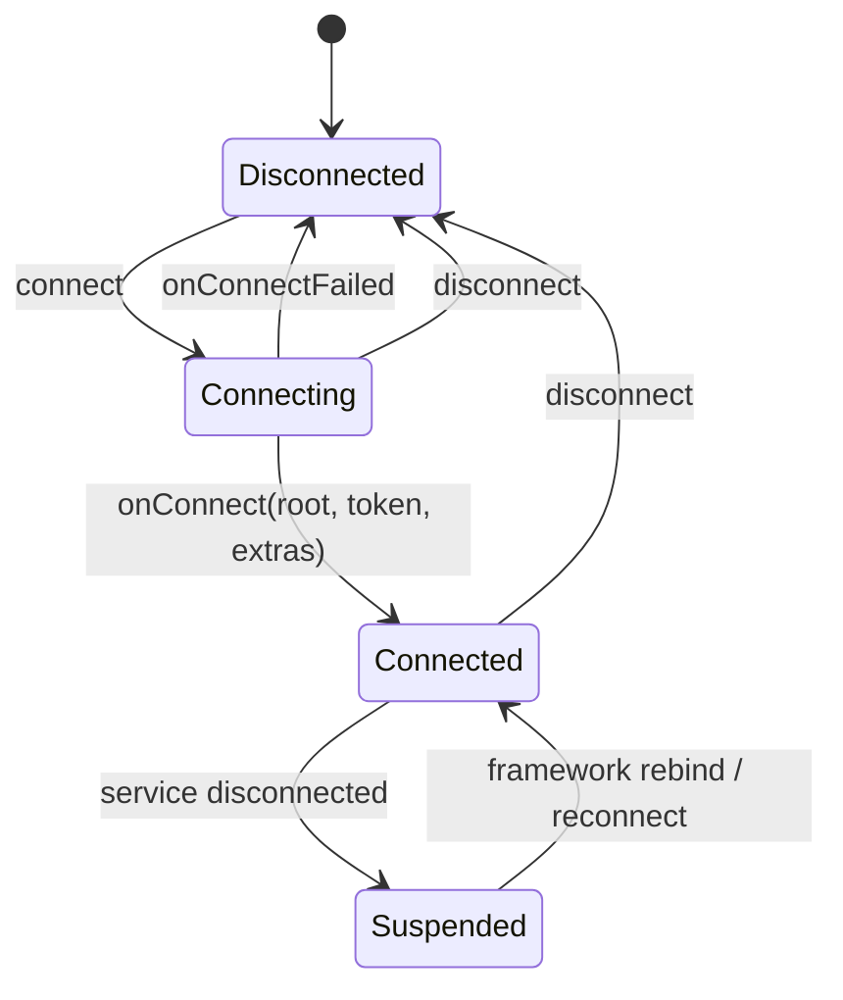
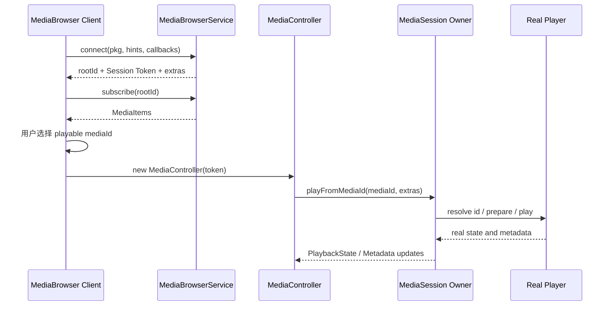

# 64 MediaBrowserService、MediaBrowser 与媒体目录浏览链路

> 源码版本：Android 11 / API 30 / `android-11.0.0_r48`  
> 学习方式：macOS 只读源码，不要求编译。  
> 本章目标：理解媒体客户端如何绑定 `MediaBrowserService`，服务如何根据调用方身份返回不同 `BrowserRoot`，目录订阅如何触发 `onLoadChildren()`，分页、异步 Result、更新通知和重连如何工作，以及浏览得到的 `MediaItem` 如何通过 Session Token 接入上一章的播放控制通道。

---

## 1. 先建立最重要的边界：浏览不等于播放

车机打开一个音乐 App 的媒体目录时：

```text
MediaBrowser
→ 连接 MediaBrowserService
→ 得到 rootId
→ subscribe(rootId)
→ 得到“专辑、歌手、最近播放”等 MediaItem
→ 继续订阅某个 browsable item
→ 得到具体歌曲 playable item
```

用户点击歌曲后才进入另一条链：

```text
MediaBrowser.getSessionToken()
→ 创建 MediaController
→ TransportControls.playFromMediaId(songId, extras)
→ MediaSession.Callback.onPlayFromMediaId
→ App 真正播放器加载并播放
```

一句话：**MediaBrowser 协议负责“发现、授权和浏览媒体目录”；MediaSession 协议负责“控制播放和观察播放状态”；真实播放器负责“解码并输出”。**

---

## 2. 五个核心角色

| 角色 | 所在侧 | 职责 |
|---|---|---|
| `MediaBrowser` | 客户端 App/车机/SystemUI | 连接、订阅目录、请求单个 item |
| `MediaBrowserService` | 媒体提供方 App | 验证客户端、提供 root 和树形内容 |
| `BrowserRoot` | 连接握手结果 | 给该客户端的 rootId 与协商 extras |
| `MediaItem` | 跨进程目录节点 | `MediaDescription` + browsable/playable flags |
| `MediaSession.Token` | 浏览连接返回 | 从“浏览”跳转到“控制”的句柄 |

内部还有：

```text
ConnectionRecord
→ 保存 pkg/pid/uid/rootHints/root/callbacks/subscriptions

Result<T>
→ onLoadChildren/onLoadItem 的一次性完成协议
```

---

## 3. 核心源码地图

```text
frameworks/base/media/java/android/media/browse/
    MediaBrowser.java
    MediaBrowserUtils.java
    MediaBrowser.aidl

frameworks/base/media/java/android/service/media/
    MediaBrowserService.java
    IMediaBrowserService.aidl
    IMediaBrowserServiceCallbacks.aidl
```

接上上一章：

```text
frameworks/base/media/java/android/media/session/
    MediaSession.java
    MediaController.java
```

平台实现很集中，适合完整通读。这里没有 system_server 的 `MediaSessionService` 参与目录加载：浏览 Binder 直接连接媒体提供方 App 的 Service；只有返回的 Session Token 指向 system_server 中的 MediaSession 控制记录。

---

## 4. Android 11 平台 API 的版本边界

当前源码的 `MediaBrowser` 公开能力只有：

```text
connect / disconnect
getRoot / getExtras / getSessionToken
subscribe / unsubscribe
getItem
```

当前 `IMediaBrowserService.aidl` 也只有：

```text
connect / disconnect
addSubscription / removeSubscription
getMediaItem
```

它**没有**平台级 `search()`、`sendCustomAction()`。网上经常出现这些 API，通常来自 `MediaBrowserCompat`、AndroidX Media 或后续 Media3 的另一套抽象，不能倒灌进 API 30 的 `android.media.browse` 主线。

本章只讲当前平台源码。需要兼容库时，应另画一层“compat protocol → platform/自定义 Messenger”的适配链。

---

## 5. 服务如何声明

```xml
<service
    android:name=".MusicBrowserService"
    android:exported="true">
    <intent-filter>
        <action android:name="android.media.browse.MediaBrowserService" />
    </intent-filter>
</service>
```

服务继承：

```java
public final class MusicBrowserService extends MediaBrowserService {
    // onGetRoot / onLoadChildren
}
```

`SERVICE_INTERFACE` 的值就是：

```text
android.media.browse.MediaBrowserService
```

若只允许系统、车机或自家 App，可以额外设计签名权限或在 `onGetRoot()` 做调用方授权。仅仅 `exported=true` 不等于所有客户端都应该看到全部私人媒体库。

---

## 6. MediaBrowser 的创建与线程

```java
MediaBrowser browser = new MediaBrowser(
        context,
        new ComponentName(context, MusicBrowserService.class),
        connectionCallback,
        rootHints);
```

构造函数保存：

```text
Context
明确的 Service ComponentName
ConnectionCallback
rootHints 副本
当前线程对应的 Handler
本地 subscriptions Map
```

它不会立刻绑定，必须显式 `connect()`。

浏览器的 ServiceConnection 和 Binder callbacks 最终都会通过内部 Handler 回到创建它的 Looper。实际使用中应在有 Looper 的固定线程（通常主线程）创建并操作，不要跨线程随意 connect/subscribe/disconnect。

---

## 7. 客户端连接状态机

```text
DISCONNECTED
→ connect()
CONNECTING
→ ServiceConnection.onServiceConnected
→ IMediaBrowserService.connect
→ callbacks.onConnect
CONNECTED

异常：
CONNECTING → onConnectFailed → DISCONNECTED
CONNECTED → Service 进程断开 → SUSPENDED
任意有效状态 → disconnect → DISCONNECTING → DISCONNECTED
```



重复在非法状态调用 `connect()` 会抛 `IllegalStateException`。`getRoot/getExtras/getSessionToken` 也只允许在 CONNECTED 状态读取。

---

## 8. 第一步只是 bindService

`connect()` 构造显式 Intent：

```text
Intent(MediaBrowserService.SERVICE_INTERFACE)
→ setComponent(mServiceComponent)
→ bindService(..., BIND_AUTO_CREATE)
```

`ServiceConnection.onServiceConnected()` 只表示 Android Service Binder 建立。浏览协议还没有完成，它继续：

```text
IBinder → IMediaBrowserService
→ 创建新的 ServiceCallbacks Binder Stub
→ service.connect(packageName, rootHints, callbacks)
```

所以这里也有两个“连接完成”：

```text
Service bind 完成
≠
MediaBrowser 授权/Root/Token 握手完成
```

对业务可用的节点是 `ConnectionCallback.onConnected()`。

---

## 9. 为什么每次连接都创建新的 callback Stub

源码注释说明：每次 connect 创建新的 `mServiceCallbacks`，这样旧连接的迟到响应可以被丢弃。

客户端收到结果时先判断：

```java
if (!isCurrent(callback, "onLoadChildren")) return;
```

判断包括：

```text
callback 是否仍是当前连接的 callback 对象
状态是否已经 DISCONNECTING/DISCONNECTED
ServiceConnection 是否仍是当前实例
```

典型竞态：

```text
连接 A 发起 load
→ disconnect A
→ reconnect B
→ A 的结果迟到
```

若只凭 parentId 接收，A 会污染 B；新的 Binder callback 身份相当于 connection generation token。

---

## 10. 服务端 connect 的第一道安全检查

AIDL 入口得到：

```text
pkg：客户端自报包名
pid/uid：Binder 内核提供的真实身份
rootHints
callbacks Binder
```

服务先校验包名确实属于 calling UID：

```java
if (!isValidPackage(pkg, uid)) {
    throw new IllegalArgumentException(
            "Package/uid mismatch");
}
```

这阻止恶意进程冒充另一个包名。但它只证明“包和 UID 对得上”，不代表有权访问媒体内容。细粒度授权必须由 `onGetRoot(pkg, uid, hints)` 决定。

Binder 身份和字符串包名结合，是 Android 跨进程入口的常见模式。

---

## 11. onGetRoot 是授权与视图协商点

```java
@Override
public BrowserRoot onGetRoot(
        String clientPackageName,
        int clientUid,
        Bundle rootHints) {
    if (!isAllowed(clientPackageName, clientUid)) {
        return null;
    }
    return new BrowserRoot("root", buildExtras(rootHints));
}
```

它可以根据客户端返回不同目录入口：

```text
自家 App → 完整媒体库 root
Android Auto → 适合驾驶的精简 root
可信系统 UI → 最近播放 root
未授权客户端 → null
```

`rootHints` 是客户端表达场景/偏好的提示；服务不能把它当可信身份。身份来自 Binder uid + 已验证 package。

`getCurrentBrowserInfo()` 可在 onGetRoot/onLoadChildren/onLoadItem 执行期间得到 `RemoteUserInfo`，也可配合 `MediaSessionManager.isTrustedForMediaControl()`，但“trusted for media control”与“允许读取所有私人目录”仍应按产品策略判断。

---

## 12. onGetRoot 返回 null 的准确含义

```text
onGetRoot → null
→ 不建立 ConnectionRecord
→ callbacks.onConnectFailed()
→ 客户端 ConnectionCallback.onConnectionFailed()
```

它不是：

- “媒体库暂时为空”；
- “root 没有 children”；
- “等数据库加载好再自动成功”；
- “返回一个空根节点”。

它表示：**拒绝这次浏览连接，或无法为该客户端提供根。**

若允许连接但当前没有内容，应返回非空 `BrowserRoot("root", extras)`，之后对 root 的 `onLoadChildren()` 返回空 List。

---

## 13. ConnectionRecord 保存什么

```text
pkg / pid / uid
rootHints
callbacks
BrowserRoot
subscriptions:
  parentId → List<(callbackToken, options)>
```

服务用 callback Binder 作为 `mConnections` 的 key，并注册 `linkToDeath`：

```text
客户端进程死亡
→ ConnectionRecord.binderDied
→ Service Handler
→ mConnections.remove(callbackBinder)
```

由此自动清掉该客户端的全部订阅，避免服务继续为死亡浏览器查询数据库和发送结果。

服务所有连接表和目录回调都串行到 `mHandler`，默认是 Service 主线程；昂贵 I/O 不能直接阻塞 `onLoadChildren()`。

---

## 14. Session Token 为什么可能稍后才返回

服务应尽早调用：

```java
setSessionToken(mediaSession.getSessionToken());
```

但 connect 与 session 初始化可能有先后：

```text
onGetRoot 返回非空
→ ConnectionRecord 已保存
→ 若 mSession == null，暂不 callbacks.onConnect
→ 稍后 setSessionToken(token)
→ 遍历所有等待连接
→ callbacks.onConnect(rootId, token, extras)
```

`setSessionToken()`：

- token 不能为 null；
- 整个 Service 实例只能设置一次；
- 会唤醒之前已获准但仍等待 token 的连接。

这保证客户端 `onConnected()` 时，`getSessionToken()` 一定可用。

---

## 15. BrowserRoot 不是一个 MediaItem

`BrowserRoot` 只包含：

```text
rootId
extras
```

它是协议入口，不要求自身作为 `MediaItem` 出现在列表里。客户端拿到 rootId 后：

```java
browser.subscribe(browser.getRoot(), callback);
```

服务再把这个字符串交给 `onLoadChildren(rootId, result)`。

rootId 的格式完全由服务定义，可以是数据库 ID、逻辑路径或不透明 token。客户端不应解析 `"artist/42"` 的内部结构，而应把 mediaId 当 opaque identifier 原样回传。

---

## 16. MediaItem 的数据模型

```text
MediaItem
├─ flags
│   ├─ FLAG_BROWSABLE
│   └─ FLAG_PLAYABLE
└─ MediaDescription
    ├─ mediaId（必需、非空）
    ├─ title/subtitle/description
    ├─ iconBitmap/iconUri
    ├─ mediaUri
    └─ extras
```

flags 是位标志，一个 item 理论上可同时 browsable 和 playable，但客户端应按服务语义处理。

```text
browsable → 可 subscribe(mediaId) 查看 children
playable  → 可 playFromMediaId(mediaId, extras)
```

`MediaItem` 只是描述和 ID，不携带歌曲的完整音频字节，也不保证 `mediaUri` 对任意客户端直接可读。

---

## 17. subscribe 的本地与远端两层状态

```java
browser.subscribe(parentId, options, callback);
```

客户端先把订阅保存在本地：

```text
mSubscriptions[parentId]
→ callback list + options list
```

若已连接，再调用远端：

```text
IMediaBrowserService.addSubscription(
    parentId,
    callback.mToken,
    options,
    mServiceCallbacks)
```

因此未连接时也可以 subscribe：本地先记住，连接成功后自动重放全部订阅。

这也是为什么 callback 自己有一个 Binder `mToken`：同一 parentId 可以按不同 callback/options 保存多份订阅并精确 unsubscribe。

---

## 18. 服务端如何去重订阅

订阅 key 不是只有 parentId，而是：

```text
parentId + callback token 身份 + 等价 options
```

服务检查：

```java
if (token == oldToken
        && MediaBrowserUtils.areSameOptions(options, oldOptions)) {
    return;
}
```

但“等价 options”在 Android 11 平台实现中有一个重要限制：
`MediaBrowserUtils.areSameOptions()` **只比较** `EXTRA_PAGE` 与 `EXTRA_PAGE_SIZE`，不会深度比较整个 Bundle。
因此同一 parentId、同一 callback token、相同分页参数而仅自定义 extras 不同的两次订阅，可能被当成重复。
如果业务要让自定义筛选条件形成独立订阅，不能假设平台会按整个 Bundle 区分；应设计不同 parentId、不同 callback，或使用能力更合适的兼容/Media3 协议。

新订阅加入后立即 `performLoadChildren()`，所以 subscribe 同时具有：

1. 立刻加载当前 children；
2. 保持订阅，等待以后 `notifyChildrenChanged()` 触发重载。

它不是只调用一次的 query。

---

## 19. onLoadChildren 的同步完成协议

最简单实现：

```java
@Override
public void onLoadChildren(String parentId,
        Result<List<MediaItem>> result) {
    List<MediaItem> children = repository.loadCached(parentId);
    result.sendResult(children);
}
```

Framework 调用结束后检查：

```text
sendResult 已调用？
或 detach 已调用？
```

两者都没有会抛 `IllegalStateException`。这是强制完成协议，防止服务悄悄吞掉请求、客户端永久等待而开发者毫无提示。

结果语义：

```text
empty list → parent 合法，但当前没有 children
null       → parentId 无效或加载错误 → 客户端 onError
non-empty  → onChildrenLoaded
```

---

## 20. detach 的准确语义

昂贵查询不能堵 Service 主线程：

```java
@Override
public void onLoadChildren(String parentId,
        Result<List<MediaItem>> result) {
    result.detach();
    executor.execute(() -> {
        List<MediaItem> items = repository.query(parentId);
        result.sendResult(items);
    });
}
```

`detach()` 表示：

```text
允许当前 onLoadChildren/onLoadItem 返回
→ Result 尚未完成
→ 未来必须且只能 sendResult 一次
```

它不是取消、不是自动超时管理，也不是允许永远不返回。框架本类没有替业务设置“数据库最多几秒”的 deadline；服务应自行处理超时、取消和异常，并最终 sendResult(null/错误语义)。

非法组合会抛异常：

- `sendResult()` 两次；
- `detach()` 两次；
- send 后 detach；
- 返回时既没 send 也没 detach。

---

## 21. detach 后的连接竞态

结果生成期间客户端可能 disconnect。`performLoadChildren()` 的 `Result.onResultSent()` 会检查：

```text
mConnections.get(callbackBinder) 是否仍是原 ConnectionRecord
```

若连接已经消失或换代，结果被丢弃。

这意味着服务工作线程仍可能完成数据库查询，但不会把旧结果错误发给新连接。业务若查询昂贵，最好再实现可取消任务，客户端死亡/取消订阅时减少无用工作；平台 `Result` 本身不是完整 cancellation token。

---

## 22. 两种 onLoadChildren 与分页回退

服务有两个重载：

```java
onLoadChildren(parentId, result)
onLoadChildren(parentId, result, options)
```

若子类没有覆写带 options 版本，基类会：

```text
标记 RESULT_FLAG_OPTION_NOT_HANDLED
→ 调用无 options 版本取得完整列表
→ Framework applyOptions(list, options)
```

若子类覆写带 options 版本，则可以在数据库层分页：

```text
SELECT ... LIMIT pageSize OFFSET page*pageSize
```

后者避免先构造完整大列表再切片，适合大型媒体库。

---

## 23. 分页 options 的准确含义

```text
MediaBrowser.EXTRA_PAGE
MediaBrowser.EXTRA_PAGE_SIZE
```

例如：

```java
Bundle options = new Bundle();
options.putInt(MediaBrowser.EXTRA_PAGE, 2);
options.putInt(MediaBrowser.EXTRA_PAGE_SIZE, 20);
```

表示第 2 页、每页 20 条；page 从 0 开始，因此范围是索引 `[40, 60)`。

基类 `applyOptions()` 的大意：

```text
page/pageSize 都未指定 → 原列表
page < 0 或 pageSize < 1 → empty list
start = page * pageSize
start 超出列表 → empty list
end = min(start + pageSize, size)
→ subList(start, end)
```

客户端和服务必须约定稳定排序，否则数据变化时翻页会重复或漏项。

---

## 24. Subscription callback 如何匹配 options

服务回调：

```text
onLoadChildrenWithOptions(parentId, list, options)
```

客户端根据 parentId 找 Subscription，再用 `Subscription.getCallback(context, options)` 找到对应 callback。

所以同一个 parentId 可以同时订阅：

```text
第 0 页 callback A
第 1 页 callback B
无分页 callback C
```

如果返回结果的分页 options 与本地已保存订阅不匹配，客户端会忽略，不会随便交给同 parentId 的任意 callback。

这里同样使用 `areSameOptions()`，也就是只看标准 page/pageSize；它不会用自定义 extras 精确路由 callback。这是平台 API 30 的能力边界，不要把 Bundle 看成完整的订阅复合主键。

---

## 25. notifyChildrenChanged 不是直接推送新列表

服务数据变化时：

```java
notifyChildrenChanged(parentId);
```

Framework 并不携带新 children，而是遍历订阅者并重新调用：

```text
performLoadChildren(parentId, connection, subscriptionOptions)
→ onLoadChildren
→ 新列表回调客户端
```

因此它是“失效通知 + 重新查询”，不是 delta push。

优点：服务始终从真实数据源重建结果。代价：频繁通知可能造成重复数据库查询和大量 Binder 列表传输，业务应合并高频变更。

---

## 26. 带 options 的 notify 如何筛选订阅

```java
notifyChildrenChanged(parentId, changeOptions);
```

服务用 `MediaBrowserUtils.hasDuplicatedItems(changeOptions, subscriptionOptions)` 判断两个分页范围是否相交，只重载可能受影响的订阅。

例如变化范围在 page 3：

```text
订阅 page 0 → 不一定重载
订阅 page 3 → 重载
无分页订阅 → 覆盖整个集合，重载
```

这里的 options 是“变化影响范围”，不是新结果数据。若使用自定义 options，基类只理解标准分页重叠，复杂过滤需服务自行设计通知策略。

---

## 27. unsubscribe 的两种粒度

```java
browser.unsubscribe(parentId);
```

移除该 parentId 的全部 callbacks/options。

```java
browser.unsubscribe(parentId, callback);
```

只移除该 callback token 对应的订阅；同 parentId 的其他 callback/options 可保留。

服务端 token 为 null 表示整组移除，非 null 则遍历删除 token 相同的 pair。

已在路上的旧结果仍可能到达，但客户端会再次检查本地 subscription 和当前 connection；取消后找不到匹配 callback，结果被忽略。

---

## 28. getItem 是一次性查询

```java
browser.getItem(mediaId, itemCallback);
```

要求已连接，然后：

```text
创建 ResultReceiver（绑定 Browser Handler）
→ IMediaBrowserService.getMediaItem
→ 服务检查 ConnectionRecord
→ performLoadItem
→ onLoadItem(itemId, Result<MediaItem>)
→ ResultReceiver 回 App
```

与 subscribe 的区别：

| getItem | subscribe |
|---|---|
| 查询一个 mediaId | 查询 parent 的 children |
| 一次性 | 保持订阅 |
| ItemCallback | SubscriptionCallback |
| 不因 notify 自动刷新 | notify 后重新加载 |

服务不覆写 `onLoadItem()` 时，默认设置 NOT_IMPLEMENTED flag 并返回 null，客户端进入 `onError(mediaId)`。

---

## 29. MediaItem null 与 Result list null 不同场景

```text
onLoadChildren.sendResult(null)
→ SubscriptionCallback.onError(parentId)

onLoadChildren.sendResult(emptyList)
→ onChildrenLoaded(parentId, emptyList)

onLoadItem.sendResult(null)
→ 若是子类主动完成且未设置 NOT_IMPLEMENTED flag，
  ResultReceiver 携带 KEY_MEDIA_ITEM=null，客户端调用 onItemLoaded(null)

onLoadItem 默认未实现
→ 基类设置 RESULT_FLAG_ON_LOAD_ITEM_NOT_IMPLEMENTED
→ ResultReceiver 返回错误码 → onError(mediaId)
```

客户端不能把所有 null 都简单显示成“空文件夹”。错误、无子项和单 item 不存在是不同语义。

---

## 30. 回调线程链路

服务侧：

```text
Binder thread
→ MediaBrowserService.mHandler.post
→ Service 主线程
→ onGetRoot/onLoadChildren/onLoadItem
```

客户端侧：

```text
IMediaBrowserServiceCallbacks Binder thread
→ MediaBrowser 内部 mHandler.post
→ Browser 创建线程 Looper
→ ConnectionCallback/SubscriptionCallback
```

异步 `detach()` 后，业务工作线程可调用 `sendResult()`；结果最终仍经 Binder 和 Browser Handler 返回客户端 callback。

不要在 Service 主线程做数据库大查询，也不要在客户端 callback 做大图解码或复杂 diff；分别移到工作线程，再把 UI 更新放主线程。

---

## 31. 浏览结果为什么用 ParceledListSlice

children 列表跨 Binder 发送时包装成 `ParceledListSlice`，而不是裸 `List`。它是 Framework 常见的大列表分片传输工具，用来降低单次 Parcel 过大的风险。

但它不是无限容量通行证：

- 每个 MediaDescription 仍应轻量；
- 不要塞巨大 bitmap；
- 用 iconUri 而非大量原始封面更稳妥；
- 大目录仍应分页；
- extras 避免自定义超大 Parcelable。

树节点传描述，真正媒体数据通过播放器的数据源路径读取。

---

## 32. 浏览到播放的完整接缝



mediaId 是两套协议之间的业务关联键，但 Framework 不替你建立数据库映射。服务端 `onLoadChildren()` 发布的 playable ID，必须能被 Session callback `onPlayFromMediaId()` 稳定解析。

---

## 33. rootHints 与 BrowserRoot extras 的方向

```text
rootHints：Browser → Service
BrowserRoot.extras：Service → Browser
```

标准 root hint/extras 包括倾向：

```text
EXTRA_RECENT
EXTRA_OFFLINE
EXTRA_SUGGESTED
```

它们表达“我想看最近/离线/推荐视图”等协商，不是强制命令。服务可据此选择 root 或 extras。

服务特有 key 应使用完整命名空间，避免冲突。Bundle 跨进程时只用双方都能反序列化的安全类型，不要放客户端/服务私有 Parcelable 类。

---

## 34. 认证与登录状态怎样表达

一种常见设计：未登录客户端仍允许 connect，但返回一个有限 root：

```text
root
└─ “请登录” browsable/playable action item 或空目录 + extras
```

另一种是未授权直接 `onGetRoot → null`，连接失败。

选择取决于交互表面：车机可能无法处理任意登录 UI，通常需要通过 SessionActivity/PendingIntent 或受控流程引导。

关键是不要把 rootHints 中的“已登录=true”当凭据。真实账户和权限由服务自己的 UID、账户存储、签名或授权状态验证。

---

## 35. 服务端数据模型建议

```text
MediaNode
├─ stable mediaId
├─ parentId
├─ type: browsable/playable/both
├─ MediaDescription fields
├─ sortKey
└─ access policy
```

稳定 ID 很重要：

- Controller 用它 `playFromMediaId`；
- queue item 也可能引用它；
- 分页/刷新需要识别同一内容；
- 收藏、最近播放可能持久化它；
- 客户端不能依赖列表下标。

不要直接暴露可猜测的本地绝对文件路径作为 mediaId。ID 应由服务解析，播放时再做权限和存在性检查。

---

## 36. 一个服务端骨架

```java
public final class MusicService extends MediaBrowserService {
    private MediaSession session;
    private Executor executor;

    @Override public void onCreate() {
        super.onCreate();
        session = new MediaSession(this, "library");
        session.setCallback(sessionCallback);
        setSessionToken(session.getSessionToken());
    }

    @Override public BrowserRoot onGetRoot(
            String pkg, int uid, Bundle hints) {
        if (!accessPolicy.canBrowse(pkg, uid)) return null;
        return new BrowserRoot("root", null);
    }

    @Override public void onLoadChildren(
            String parentId, Result<List<MediaItem>> result) {
        result.detach();
        executor.execute(() -> {
            List<MediaItem> items;
            try {
                items = repository.children(parentId);
            } catch (UnknownParentException e) {
                items = null;
            }
            result.sendResult(items);
        });
    }

    @Override public void onDestroy() {
        session.release();
        super.onDestroy();
    }
}
```

生产实现还需把 Session 激活、PlaybackState/Metadata、AudioFocus、前台通知和播放器生命周期按上一章组合起来。

---

## 37. 一个客户端骨架

```java
MediaBrowser browser = new MediaBrowser(
        context, serviceComponent,
        new MediaBrowser.ConnectionCallback() {
            @Override public void onConnected() {
                MediaController controller = new MediaController(
                        context, browser.getSessionToken());
                browser.subscribe(browser.getRoot(), rootCallback);
            }

            @Override public void onConnectionFailed() {
                showUnavailable();
            }

            @Override public void onConnectionSuspended() {
                disableBrowserUi();
            }
        }, null);

MediaBrowser.SubscriptionCallback rootCallback =
        new MediaBrowser.SubscriptionCallback() {
    @Override public void onChildrenLoaded(
            String parentId, List<MediaBrowser.MediaItem> children) {
        render(children);
    }

    @Override public void onError(String parentId) {
        showLoadError(parentId);
    }
};
```

页面销毁时：

```text
unregister MediaController callbacks
unsubscribe（按所有权决定，可选）
MediaBrowser.disconnect
清理 UI 对 browser/controller 的引用
```

---

## 38. onConnectionFailed 与 onConnectionSuspended

| 回调 | 含义 | 典型原因 |
|---|---|---|
| `onConnectionFailed` | 浏览握手未建立 | bind 失败、onGetRoot=null、协议连接失败 |
| `onConnectionSuspended` | 已有服务连接意外断开 | 服务进程崩溃/被杀、Binder 断开 |

Suspended 时旧的 root/token 不应继续当作可靠当前连接数据。Framework 的 Service binding 可能恢复，成功后订阅会重新发送；UI 应显示临时不可用，而不是立即把用户媒体库永久清空。

主动 `disconnect()` 是正常生命周期动作，不等同于 connection failure。

---

## 39. 重连为何能恢复订阅

客户端订阅首先保存在 `mSubscriptions`，`forceCloseConnection()` 清理 Binder/root/token，但不会无条件清空本地订阅表。

新 `onConnect()` 成功后：

```text
遍历 mSubscriptions
→ 遍历每个 callback/options
→ addSubscription 到新 ServiceCallbacks connection
```

这让临时服务死亡后 UI 无需重新编写全部订阅逻辑。

但重连后的 rootId/token 可能变化；业务不能持有旧 token 永远不换。应在每次 `onConnected()` 重新读取 root、extras、Session Token，并重建/更新 Controller。

---

## 40. notify 与数据一致性的竞态

```text
订阅 page 0
→ 服务开始异步 query 版本 A
→ 数据变化到版本 B，notifyChildrenChanged
→ 又开始 query B
→ B 先返回，A 后返回
```

平台 Result 检查连接是否仍有效，但不会自动比较同一连接中两次查询的业务版本。旧 A 可能晚到覆盖新 B。

服务可：

- 在 repository 层串行同 parent 查询；
- 给结果建立 generation 并丢弃过期工作；
- 使用数据库事务快照和稳定排序；
- 合并通知；
- 客户端按内容 revision（自定义 extras）拒绝倒退。

异步 Result 解决线程阻塞，不自动解决业务时序。

---

## 41. 大目录与 Binder 性能

一次返回几万条 MediaItem 会造成：

- 数据库和对象构造耗时；
- Parcel 序列化成本；
- Binder transaction/分片压力；
- 客户端反序列化和 UI diff 卡顿；
- 封面 bitmap 内存膨胀。

正确方向：

```text
稳定排序 + 分页
轻量 MediaDescription
iconUri 懒加载
后台查询 + detach
合并 notify
只发布当前交互需要的层级
```

`ParceledListSlice` 是安全网，不是放弃分页设计的理由。

---

## 42. 多用户与隐私

MediaBrowserService 运行在服务 App 所属用户环境，Binder 提供 calling UID。服务应考虑：

- 当前用户/工作资料是否允许访问；
- 私人媒体库与访客用户隔离；
- 客户端包签名和系统信任；
- 锁屏/驾驶模式只暴露安全内容；
- iconUri/mediaUri 是否正确授予读取权限；
- 不在 root extras 中泄露账户 token 或内部路径。

`onGetRoot()` 是最早的策略门，但 `onLoadChildren/onLoadItem/onPlayFromMediaId` 仍应防御性复核内容级权限，因为权限和登录状态可能在连接期间变化。

---

## 43. 为什么 onLoadChildren 仍要检查 parentId

客户端拿到 root 后，可以自行构造任意字符串调用 subscribe；不能假设所有 parentId 都由服务先前发出。

```text
onLoadChildren("../../private")
onLoadItem("other-user-secret")
playFromMediaId("deleted-item")
```

服务必须把 ID 当不可信输入：

- 验证格式和归属；
- 检查当前连接访问策略；
- 不拼接为未经规范化的文件路径；
- 不存在/无权访问时返回 null/error；
- 播放时重新查库，而不是信任客户端 extras。

浏览协议的“树”是逻辑树，不是把文件系统路径直接开放给远端。

---

## 44. 平台 MediaBrowser 与 MediaBrowserCompat 不要混读

常见包名：

```text
android.media.browse.MediaBrowser              平台 API
android.service.media.MediaBrowserService      平台 Service

android.support.v4.media.MediaBrowserCompat    旧 support/AndroidX 兼容层
androidx.media.MediaBrowserServiceCompat       兼容 Service
androidx.media3.session.MediaBrowser            Media3 模型
```

它们概念相似，但：

- AIDL/Messenger 协议可能不同；
- search/custom actions 等能力不同；
- callback 和连接 extras 不完全相同；
- Session/Controller 类型可能是 compat 或 Media3 token。

读调用栈时先看 import，确认是哪一代 API，再选择源码目录。

---

## 45. 常见误区逐个纠正

### 误区 1：MediaBrowserService 负责播放

不对。它提供目录；播放控制经返回的 Session Token。

### 误区 2：onGetRoot 返回 null 表示空目录

不对。它拒绝/失败连接；空目录应返回 BrowserRoot，并对 children 返回 empty list。

### 误区 3：BrowserRoot 就是根 MediaItem

不对。它只是 rootId + extras 的握手对象。

### 误区 4：subscribe 是一次查询

不对。它会立即加载，并保留到 unsubscribe/disconnect，供 notify 触发重载。

### 误区 5：notifyChildrenChanged 携带了新列表

不对。它让匹配订阅重新执行 onLoadChildren。

### 误区 6：detach 后可以不管 Result

不对。detach 只是允许稍后 sendResult，仍必须一次性完成。

### 误区 7：分页一定由 Service 自己实现

不一定。未覆写 options 版本时，Framework 可对完整列表 applyOptions；大库才应在数据层分页。

### 误区 8：MediaItem 中包含音频文件

不对。它主要是 ID、描述和 flags。

### 误区 9：getItem 会持续接收变化

不对。它是一次性查询；持续变化用 subscribe + notify。

### 误区 10：Android 11 平台 MediaBrowser 有 search/customAction

不对。当前平台源码没有，要分清 Compat/Media3。

---

## 46. 分层排障

### 绑定层

```text
ComponentName 是否正确
Service action/exported 是否正确
bind 是否成功
onServiceConnected 是否到达
```

### 握手层

```text
package/uid 是否匹配
onGetRoot 是否返回 null
Session Token 是否及时 set
onConnected/onConnectionFailed/onSuspended 哪个发生
```

### 订阅层

```text
parentId 是否稳定有效
callback token/options 是否匹配
onLoadChildren 是否 send 或 detach
null 与 empty list 是否用对
分页参数是否从 0 开始
```

### 异步层

```text
detach 后是否最终 sendResult
连接断开后旧结果是否被丢弃
同 parent 的旧查询是否晚到覆盖新查询
工作线程异常是否转换成结果
```

### 播放接缝

```text
getSessionToken 是否来自当前连接
playable mediaId 是否能被 Session 解析
Session 是否 active、actions 是否包含 playFromMediaId
真实播放器/AudioFocus/通知是否正常
```

---

## 47. macOS 只读源码练习

### 练习 1：追双阶段连接

从 `MediaBrowser.connect()` 追到 ServiceConnection，再追 `IMediaBrowserService.connect()` 和 `onGetRoot()`，标出 bind 成功与 browse 成功的区别。

### 练习 2：证明包名不能冒充

阅读 `ServiceBinder.connect()` 和 `isValidPackage()`，解释字符串 package 与 Binder UID 如何交叉验证。

### 练习 3：追等待 Session Token

构造“onGetRoot 已返回，但 mSession 仍为 null”的时序，再追 `setSessionToken()` 如何通知所有 ConnectionRecord。

### 练习 4：画订阅的数据结构

同时画客户端 `mSubscriptions` 与服务端 `ConnectionRecord.subscriptions`，解释 parentId/token/options 三元组。

### 练习 5：证明订阅会自动恢复

从客户端 `onServiceConnected` 成功后的循环找到重新 addSubscription 的代码，说明旧 callback 响应为何被 generation 检查丢弃。

### 练习 6：验证 Result 完成协议

阅读 `Result.sendResult/detach/isDone` 和 `performLoadChildren` 返回后的检查，列出四种非法调用。

### 练习 7：追分页回退

从带 options 的 `onLoadChildren()` 默认实现追到 flag 与 `applyOptions()`，用 45 条数据计算 page=2、size=20 的结果范围。

### 练习 8：追 notify

从 `notifyChildrenChanged()` 追到 `hasDuplicatedItems()`、`performLoadChildren()`，证明它没有直接推列表。

### 练习 9：对比 subscribe 与 getItem

分别画 AIDL、Result 类型、callback 和生命周期。

### 练习 10：接入上一章

从 `getSessionToken()` 创建 MediaController，再追 `playFromMediaId()` 到 Session callback，说明哪个对象真正操作播放器。

### 练习 11：核对版本边界

执行：

```bash
rg -n "search|customAction" \
  frameworks/base/media/java/android/media/browse \
  frameworks/base/media/java/android/service/media
```

区分注释中的自然语言“searching”与真正公开方法/AIDL 是否存在。

---

## 48. 阅读后自检题

1. MediaBrowser、MediaSession、真实播放器分别负责什么？
2. 浏览 Binder 是否经过 system_server 的 MediaSessionService？
3. bind 成功与 onConnected 有什么差别？
4. 为什么每次连接创建新的 ServiceCallbacks？
5. 服务如何验证 packageName 没冒充？
6. onGetRoot 是哪两类决策的入口？
7. onGetRoot 返回 null 与空 children 有何区别？
8. BrowserRoot 为什么不是 MediaItem？
9. ConnectionRecord 保存哪些身份和订阅数据？
10. Token 尚未设置时，获准连接怎样等待？
11. browsable 与 playable flag 各意味着什么？
12. subscribe 为什么既是查询又是长期订阅？
13. parentId/token/options 如何共同区分订阅？
14. onLoadChildren 返回 null 与 empty list 分别触发什么？
15. detach 后还必须做什么？
16. options 版本未覆写时谁负责分页？
17. page=2、pageSize=20 对应哪些索引？
18. notifyChildrenChanged 是否携带新列表？
19. getItem 与 subscribe 生命周期有何不同？
20. 回调怎样从 Binder 线程转到 Browser Handler？
21. 断线重连后为什么应重新读取 Token？
22. 平台 Result 为什么不能自动解决旧查询晚到？
23. mediaId 为什么应稳定且不可当可信文件路径？
24. Android 11 平台是否有 search/customAction？

能独立回答 20 题以上，就掌握了本章主线。

---

## 49. 本章最终心智模型

```text
Browser Client
  MediaBrowser
  ├─ bind 明确的 MediaBrowserService
  ├─ connect(pkg, rootHints, callback generation)
  ├─ subscribe(parentId, callbackToken, options)
  ├─ getItem(mediaId)
  └─ getSessionToken → MediaController
                 ↕ Binder（直接到媒体 App）
Media Provider App
  MediaBrowserService 主线程
  ├─ 验证 package ↔ calling UID
  ├─ onGetRoot：授权 + 为客户端选择目录视图
  ├─ ConnectionRecord：身份/root/subscriptions/death
  ├─ onLoadChildren：sendResult 或 detach→sendResult
  ├─ 分页：服务实现或 Framework applyOptions
  ├─ notifyChildrenChanged：失效并重查，不是推列表
  └─ onLoadItem：一次性 item 查询

浏览到播放：
  playable mediaId
  + MediaSession.Token
  → MediaController.playFromMediaId
  → MediaSession.Callback
  → Real Player
```

最重要的五句话：

1. **浏览、控制、播放是三层：MediaBrowser 找内容，MediaSession 控制，播放器输出。**
2. **onGetRoot 返回 null 是拒绝连接；允许但没内容应返回 root，再返回空 children。**
3. **subscribe 是长期订阅，notify 只触发重新加载；getItem 才是一次性查询。**
4. **Result 必须 send，或先 detach 再且仅再 send 一次；异步不等于没有完成责任。**
5. **Android 11 平台没有 search/customAction；读源码先确认 import 和 API 世代。**

下一章建议学习 `MediaRouter`、`MediaRouteProvider` 与投屏路由选择链路：媒体如何发现本机/蓝牙/远端显示设备，选择 route，建立远端播放会话，并与本章 Session Token 和远端音量协作。
