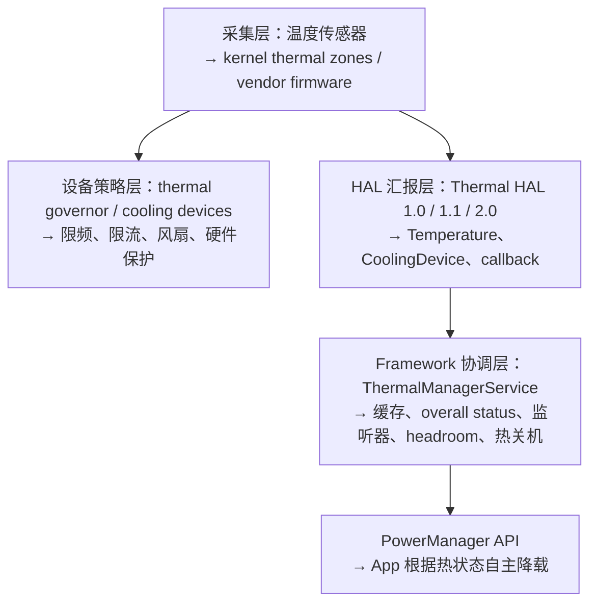

# 70 Android 热管理、ThermalManagerService 与性能降频链路

> 源码版本：Android 11 / API 30 / `android-11.0.0_r48`  
> 学习方式：macOS 只读源码，不要求编译。  
> 本章目标：理解温度传感器、Thermal HAL、ThermalManagerService、PowerManager 公共 API 与底层 thermal governor 的分工，追踪温度/节流事件、整体 thermal status、headroom、监听器和热关机，并明确 Framework 收到严重状态不等于 Framework 亲自修改 CPU/GPU 频率。

---

## 1. 四层模型：先把“监控”和“执行”拆开



最重要的边界：

> **ThermalManagerService 主要汇报、聚合和触发 Framework 级安全动作；多数实时 CPU/GPU 降频已经在内核、固件或 vendor thermal 策略中发生。**

Framework App 收到 `SEVERE` 后主动降帧/减负，是额外协作，不是底层保护的唯一来源。

---

## 2. 核心源码地图

```text
frameworks/base/services/core/java/com/android/server/power/
    ThermalManagerService.java
    PowerManagerService.java

frameworks/base/core/java/android/os/
    PowerManager.java
    Temperature.java
    CoolingDevice.java
    IThermalService.aidl
    IThermalEventListener.aidl
    IThermalStatusListener.aidl

hardware/interfaces/thermal/
    1.0/
    1.1/
    2.0/

kernel/vendor（具体设备实现）
    thermal zone / cooling device / governor / firmware
```

Android 11 没有单独公开的 `android.os.ThermalManager` 类；面向普通 App 的 API 位于 `PowerManager`：

```text
getCurrentThermalStatus()
addThermalStatusListener(...)
removeThermalStatusListener(...)
getThermalHeadroom(...)
```

类名版本边界非常重要，避免拿新版本文档在当前源码里寻找不存在的入口。

---

## 3. Temperature：不只是一摄氏度数值

`Temperature` 包含：

```text
value   → 当前值，通常为摄氏度；某些特殊类型语义不同
type    → CPU/GPU/BATTERY/SKIN/USB_PORT/NPU 等
name    → HAL 定义的传感器名称
status  → 当前 throttling severity
```

### 3.1 类型

```text
TYPE_CPU / GPU / NPU
TYPE_BATTERY
TYPE_SKIN
TYPE_USB_PORT
TYPE_POWER_AMPLIFIER
TYPE_BCL_VOLTAGE / CURRENT / PERCENTAGE
```

`SKIN` 是机身表面/用户体感相关热约束，未必等于 SoC 结温。设备可能 CPU 温度高但整体 status 仍由另一关键传感器决定。

### 3.2 节流级别

```text
NONE
LIGHT
MODERATE
SEVERE
CRITICAL
EMERGENCY
SHUTDOWN
```

status 比绝对温度更适合跨设备使用：不同芯片、传感器和阈值不能用同一个“45°C 就降频”规则。

---

## 4. CoolingDevice 是什么

Cooling device 是 thermal 子系统可施加的降热手段，例如：

```text
CPU/GPU frequency limiter
CPU core control
fan
battery charging current limiter
modem/组件功率限制
```

`CoolingDevice.value` 通常表示当前 cooling state/级别，但精确含义取决于类型和设备实现。

注意：Framework 查询 cooling device 不代表由 Java 服务直接操纵它。HAL/内核 thermal governor 常常已经选择并应用 cooling state，TMS 只是读取用于诊断。

---

## 5. 服务启动与 HAL 版本回退

`ThermalManagerService.onStart()` 发布：

```text
Context.THERMAL_SERVICE
→ IThermalService.Stub
```

在 `PHASE_ACTIVITY_MANAGER_READY` 连接 HAL：

```text
优先 Thermal HAL 2.0
→ 失败则 1.1
→ 再失败则 1.0
→ setCallback(onTemperatureChangedCallback)
→ 读取当前所有 Temperature
→ 初始化缓存与 overall status
→ 初始化 severe thresholds/headroom watcher
→ mHalReady=true
```

如果没有 HAL，服务仍发布但记录警告，查询可能返回空数组或 NaN。上层不能假设所有设备都支持完整 thermal API。

### 5.1 为什么需要三个 Wrapper

`ThermalHal20Wrapper/11Wrapper/10Wrapper` 把不同 HIDL 接口适配成统一内部方法：

```text
connectToHal
getCurrentTemperatures
getCurrentCoolingDevices
setCallback
```

2.0 能直接表达更丰富的 throttling severity；旧接口可能只有 isThrottling 或需要 Framework 转换/轮询。

---

## 6. HAL 回调主链

```text
温度越过 vendor 阈值/状态变化
→ Thermal HAL callback
→ Wrapper 转为 android.os.Temperature
→ ThermalManagerService.onTemperatureChangedCallback
→ Binder.clearCallingIdentity
→ onTemperatureChanged(temperature, sendStatus=true)
→ shutdownIfNeeded
→ mTemperatureMap[name] 更新
→ status 变化时通知 event listener
→ 重算 overall thermal status
→ overall 改变时通知 status listeners
```

回调先清除 HAL Binder 调用身份，避免后续 system_server 操作错误继承 vendor HAL 的调用身份。

---

## 7. 两类 Listener 不要混

### 7.1 Thermal event listener

```text
IThermalEventListener.notifyThrottling(Temperature)
```

收到具体传感器对象，可按 type 过滤。注册、查询具体温度需要 `DEVICE_POWER` 特权，因此普通 App 通常不能使用这一底层接口。

新注册后服务会立即发送当前缓存温度，而不是只等待下一次变化。这让监听者马上建立完整初始状态。

### 7.2 Thermal status listener

```text
IThermalStatusListener.onStatusChange(int overallStatus)
```

面向公开 `PowerManager.OnThermalStatusChangedListener`。它只告诉 App 当前整机严重程度，适合应用决定降低画质、帧率或任务并发。

精确注册链：

```text
PowerManager.addThermalStatusListener(executor, listener)
→ 创建 IThermalStatusListener.Stub
→ IThermalService.registerThermalStatusListener(stub)
→ ThermalManagerService.mThermalStatusListeners.register(stub)
→ 立即 postStatusListener(stub)
```

新注册也立即收到当前 status。

### 7.3 线程

TMS 把 Binder listener 通知 post 到 `FgThread`；`PowerManager` 的客户端 Stub 再用调用者提供的 `Executor` 执行业务 listener。默认重载使用主线程 Executor。

```text
HAL Binder thread
→ TMS FgThread
→ App Binder callback
→ App Executor
```

业务回调不应执行长期重计算；它本来就是告诉你该减负。

---

## 8. Overall thermal status 怎样聚合

TMS 缓存：

```text
mTemperatureMap[name] = latest Temperature
```

每次变化后遍历全部温度，取最高 severity：

```java
newStatus = max(all temperature.status);
```

所以整体 status 是“当前最严重传感器状态”，不是所有温度平均值，也不是 CPU 专属状态。

例子：

```text
CPU = MODERATE
GPU = LIGHT
SKIN = SEVERE
BATTERY = NONE
→ overall = SEVERE
```

只有 overall 变化才通知 status listener；某传感器温度值变化但 severity 不变，不一定触发公开 status 回调。

---

## 9. 为什么 event 通知只看 status 是否变化

`onTemperatureChanged()` 更新 map，但 event listener 的条件是：

```text
第一次看到该 name
或 old.status != new.status
```

它不是高频温度采样 API。若从 41.0°C 变 41.2°C 仍处于 NONE，Framework 不必因此广播给所有 listener。

这样降低 Binder/回调开销，也推动上层根据 severity 采取稳定策略，而不是追逐噪声。

---

## 10. 热关机链路

任何温度事件先执行 `shutdownIfNeeded()`。只有 status 为 `THROTTLING_SHUTDOWN` 才进入：

```text
CPU/GPU/NPU/SKIN
→ PowerManager.shutdown(reason=thermal_state)

BATTERY
→ PowerManager.shutdown(reason=battery_thermal_state)
```

USB_PORT 等类型在当前 switch 中不会直接走这两个 shutdown reason。

热关机是最后安全线，不是正常节流手段。到 SHUTDOWN 前，底层通常已经经历 LIGHT→MODERATE→SEVERE→CRITICAL→EMERGENCY 的限频/限流。

### 10.1 Framework shutdown 与硬件保护

即使 system_server 卡死，芯片/PMIC/固件也应有硬件级过温保护。Framework 有序关机用于尽量同步数据和提供可诊断原因，但不能是唯一防护。

---

## 11. App 公共 API

```java
PowerManager pm = context.getSystemService(PowerManager.class);

int status = pm.getCurrentThermalStatus();

pm.addThermalStatusListener(executor, statusValue -> {
    // 根据严重程度降低工作负载
});
```

推荐策略不是等到 SHUTDOWN：

```text
LIGHT       → 可记录趋势，通常保持体验
MODERATE    → 减少非必要并发/后台预取
SEVERE      → 降低渲染帧率、分辨率、算法复杂度
CRITICAL+   → 停止重负载任务，优先保存进度与安全
```

具体响应应有 hysteresis/冷却恢复策略，避免状态在边界变化时频繁开关功能。

---

## 12. Thermal headroom

`PowerManager.getThermalHeadroom(forecastSeconds)` 返回“距离 severe threshold 的归一化热预算趋势”，不是摄氏度：

```text
1.0 → 当前或预测达到 SEVERE throttling threshold
<1  → 仍有一定余量
>1  → 已超过 severe 阈值，但不能精确映射成更高 status
NaN → 不支持、样本不足或调用过频
```

### 12.1 预测怎样形成

TMS 的 `TemperatureWatcher` 关注慢变化传感器（主要是 skin），周期采样并利用 severe threshold 与温度趋势估算未来 0..60 秒。

```text
历史 skin samples
→ 当前温度相对 severe threshold 的比例
→ 对时间趋势做简单外推
→ forecast headroom
```

它不是精确温度预言；负载、环境和散热姿态随时会改变。

### 12.2 限频调用

PowerManager 端规定调用太频繁会返回 NaN，源码最小间隔为 500ms；文档建议约每秒即可。初始样本不足时也可能无法预测。

正确用法是趋势控制，例如视频编码在 headroom 接近 1 前降低复杂度，不是每帧查询。

---

## 13. 真正降频发生在哪里

典型 Linux/vendor 数据面：

```text
thermal sensor
→ kernel thermal zone
→ trip point
→ thermal governor
→ cooling device state
→ cpufreq/devfreq/核心/充电等限制
```

或者：

```text
vendor firmware/thermal daemon/Power HAL
→ 直接调整 CPU/GPU/DDR/充电功率
→ Thermal HAL 向 Framework 汇报 severity
```

因此链路可能是并行关系：

```text
温度上升
├─ 底层立即限频（保护和闭环控制）
└─ HAL 回调 Framework（通知 App、系统策略、关机）
```

不要误画成：

```text
ThermalManagerService → 给 CPU 写频率
```

当前 Android 11 TMS 没有这种通用 Java 调频代码。

---

## 14. Framework 可以做哪些协同策略

收到 overall status 后，不同系统组件或 App 可主动：

- 降低动画/游戏/相机处理复杂度；
- 延迟后台工作；
- 降低视频编码分辨率或帧率；
- 停止高功率外设；
- 限制充电或显示亮度（通常由 vendor/其他服务实现）；
- 在 SHUTDOWN 时有序关机。

但需要逐版本核实当前源码是否真的注册 thermal listener。

### 14.1 Android 11 的刷新率版本边界

在当前 `android-11.0.0_r48` 的 `DisplayModeDirector.java` 中，找不到后续 Android 版本常见的 `SkinThermalStatusObserver`/thermal vote 实现。

所以本章不能声称 Android 11 AOSP 的 DisplayModeDirector 会根据 thermal status 自动限制刷新率。设备仍可能由 vendor 策略、SurfaceFlinger/Power HAL 或产品补丁做热降刷新率，但那不是当前基线源码中的通用链路。

学习源码必须区分：

```text
后续版本 AOSP 能力
当前 Android 11 基线
设备厂商定制
```

---

## 15. HAL 2.0、1.1、1.0 的差别思维

不要死记每个 HIDL 方法，先抓住能力演进：

```text
1.0：查询温度/cooling device，较旧的 throttling 表达
1.1：增加 thermal callback
2.0：结构化 Temperature/CoolingDevice，明确 severity 和过滤回调
```

Wrapper 还负责：

- HAL death recipient；
- 服务死亡后重连；
- RemoteException 后重新 connect；
- 把 HIDL type/status 转成 Framework Parcelable；
- 旧 HAL 数据合法性处理。

上层 TMS 因此不需要到处写版本判断。

---

## 16. 权限与隐私

公开 overall status/headroom 可供普通 App 进行负载自适应；具体传感器名、绝对温度、cooling device 查询和 event listener 受 `DEVICE_POWER` 权限保护。

原因包括：

- 底层硬件拓扑属于设备实现细节；
- 高频/绝对传感器数据可能形成设备指纹或侧信道；
- 普通 App 应根据抽象 severity，而非硬编码 vendor sensor 名称。

服务端总是做权限检查，不能因为 AIDL 文件在源码中可见就认为三方 App 可直接调用全部方法。

---

## 17. Listener 生命周期

TMS 使用 `RemoteCallbackList` 管理 event/status listener：

```text
register Binder callback
→ Binder death 自动移除
→ beginBroadcast/finishBroadcast 安全遍历
```

PowerManager 客户端还维护 listener 到内部 Binder Stub 的 map，防止重复注册，并在 remove 时找到同一远端对象。

应用仍应在自身生命周期中配对 add/remove，避免无意义回调和对象引用。

---

## 18. Shell override 只改变 Framework status

TMS shell 支持：

```text
cmd thermalservice override-status STATUS
cmd thermalservice reset
```

override 后 `mIsStatusOverride=true`，HAL 温度 map 仍可更新，但 overall status 不再由 map 自动覆盖，直到 reset。

这适合验证 App/Framework listener 对不同 status 的响应，但要牢记：

> **override-status 不会让设备真的升温，也不保证触发内核 CPU/GPU 限频。**

同理，它不应被当作真实热性能测试。

---

## 19. 完整事件示例：游戏导致机身过热

```text
游戏持续 CPU/GPU 高负载
→ 芯片和 skin 温度上升
→ 底层 governor/vendor 策略逐步限制频率/功率
→ Thermal HAL 报 SKIN=MODERATE
→ TMS 缓存并计算 overall=MODERATE
→ PowerManager listener 回调游戏
→ 游戏降低非关键后台任务

继续升温
→ SKIN=SEVERE
→ overall=SEVERE
→ 游戏降帧/画质/分辨率
→ 底层继续加强 cooling state

极端失控
→ status=SHUTDOWN
→ TMS PowerManager.shutdown(thermal_state)
→ 同时硬件保护仍独立存在
```

这是一套跨层闭环：底层确保安全，上层尽量在安全边界前保住体验。

---

## 20. 常见误解修正

1. `Temperature.value` 高不等于 status 必然高，阈值由设备/HAL 定义。
2. overall status 不是平均温度，而是所有缓存传感器 severity 的最大值。
3. status listener 不提供具体哪个传感器过热。
4. event listener 不是高频温度流，主要在 severity 变化时通知。
5. TMS 通常不直接写 CPU/GPU 频率。
6. App 主动降载是协同优化，不替代底层热保护。
7. headroom=1 不是 100°C，而是达到 severe 热预算阈值。
8. headroom>1 不能精确推断 CRITICAL/EMERGENCY。
9. shell override 不会制造真实降频。
10. Android 11 基线 DisplayModeDirector 没有后续版本的 thermal observer，不能跨版本套用。

---

## 21. 故障排查

### 21.1 App 收不到 status 回调

```text
Thermal HAL 是否 ready
→ TMS overall status 是否实际变化
→ listener 是否注册成功/重复注册异常
→ Binder callback 是否存活
→ Executor 是否阻塞
→ 是否误用需要 DEVICE_POWER 的 event API
```

### 21.2 设备明显发热但 status 始终 NONE

检查 HAL 连接、传感器 status 是否由 vendor 正确更新、是否只有 value 变化没有 severity、shell override 是否未 reset，以及厂商实现是否缺失。

### 21.3 性能下降但 Framework status 不高

底层 governor 可能已因瞬时结温、电流、功耗预算或固件策略降频，而公开 overall status 主要反映较高层热严重度。还要检查 Battery Saver、Power HAL hints、调度和 GPU 限制。

### 21.4 headroom 总是 NaN

```text
HAL 是否支持/ready
→ 是否有 skin severe threshold
→ 是否积累多个 sample
→ 调用是否快于 500ms
→ forecastSeconds 是否 0..60
```

### 21.5 status 到 SHUTDOWN 却没关机

确认 Temperature type 是否在 `shutdownIfNeeded()` switch 范围、status 是否真的等于 SHUTDOWN、PowerManager shutdown 权限/线程是否正常，同时查看硬件保护是否先动作。

---

## 22. macOS 只读练习

先用下列命令定位 HAL 回退、状态聚合和 headroom 三条主线：

```bash
rg -n "onActivityManagerReady|ThermalHal20Wrapper|ThermalHal11Wrapper|ThermalHal10Wrapper" frameworks/base/services/core/java/com/android/server/power/ThermalManagerService.java
rg -n "onTemperatureChanged|notifyEventListenersLocked|notifyStatusListenersLocked|shutdownIfNeeded" frameworks/base/services/core/java/com/android/server/power/ThermalManagerService.java
rg -n "class TemperatureWatcher|updateSevereThresholds|getForecast|MINIMUM_SAMPLE_COUNT" frameworks/base/services/core/java/com/android/server/power/ThermalManagerService.java
rg -n "getCurrentThermalStatus|addThermalStatusListener|getThermalHeadroom|MINIMUM_HEADROOM_TIME_MILLIS" frameworks/base/core/java/android/os/PowerManager.java
```

1. 阅读 `onActivityManagerReady()`，画出 HAL 2.0→1.1→1.0 回退。
2. 对照 Temperature type/status，解释 CPU 温度与 skin status 的区别。
3. 从 HAL callback 追到 `onTemperatureChanged()` 和两类 listener。
4. 找出 event listener 为什么只在 status 变化时通知。
5. 用四个传感器手算 overall max status。
6. 追 `shutdownIfNeeded()`，列出 thermal 与 battery thermal reason。
7. 从 `PowerManager.addThermalStatusListener` 追 App Executor。
8. 阅读 `TemperatureWatcher.getForecast()`，解释样本、severe threshold 和 NaN。
9. 搜索三个 HAL Wrapper 的 death/reconnect 处理。
10. 在 DisplayModeDirector 中搜索 thermal，验证 Android 11 版本边界。
11. 画出“底层降频”和“Framework 通知”两条并行链。

---

## 23. 推荐阅读顺序

```text
1. Temperature/CoolingDevice 数据模型
2. TMS onActivityManagerReady + HAL wrappers
3. onTemperatureChanged + status aggregation
4. Binder listener/query API
5. PowerManager public listener/headroom
6. shutdownIfNeeded
7. TemperatureWatcher forecast
8. kernel/vendor thermal 实现边界
```

阅读任何热问题固定问：

```text
当前值来自哪个传感器？
这是绝对 value 还是 severity？
当前代码是在汇报、做 Framework 策略，还是实际操纵 cooling device？
当前行为属于 AOSP 11、后续版本还是厂商定制？
```

---

## 24. 完整心智模型

```text
温度/功耗上升
   ├─────────────────────────────────────┐
   ↓                                     ↓
底层保护链                            Framework 协作链
sensor → thermal zone                Thermal HAL callback
→ trip/governor                      → ThermalManagerService
→ cooling device                     → Temperature map
→ CPU/GPU/充电限频限流               → overall=max(status)
                                      ├→ event/status listener
                                      ├→ App 主动降载
                                      ├→ headroom forecast
                                      └→ SHUTDOWN 有序关机

硬件/固件最终保护独立存在
```

总结：**Android 热管理是底层闭环保护与 Framework 协作通知的组合；ThermalManagerService 把设备特有传感器抽象成 severity/headroom，并负责监听与最后关机，但真实频率和功率限制大多由更底层执行。**

---

## 25. 自测题

1. 温度采集、设备节流、HAL 汇报、Framework 协调各负责什么？
2. Temperature 的 value、type、name、status 有何区别？
3. overall thermal status 怎样计算？
4. event listener 与 status listener 有何区别？
5. 为什么数值变化但 status 不变时可能没有 event？
6. TMS 怎样兼容 HAL 2.0/1.1/1.0？
7. 哪些 Temperature type 会触发 Framework 热关机？
8. headroom=1、>1、NaN 分别表示什么？
9. 为什么 TMS 不是 CPU 调频器？
10. shell override 能验证什么、不能验证什么？
11. 为什么不能把后续版本 thermal refresh-rate 策略套到 Android 11？

能画出底层保护与 Framework 通知两条并行链，并解释 overall status/headroom，本章就掌握了。

---

## 26. 下一章预告

```text
71 BatteryService、Health HAL 与电池状态分发链路
```

下一章将追踪 Health HAL 的电量、电压、温度、充电状态怎样进入 BatteryService，如何生成 ACTION_BATTERY_CHANGED、低电量/关机判断、BatteryStats 记账和充电 UI，并分清 BatteryService 当前状态与 BatteryStats 历史耗电统计。
