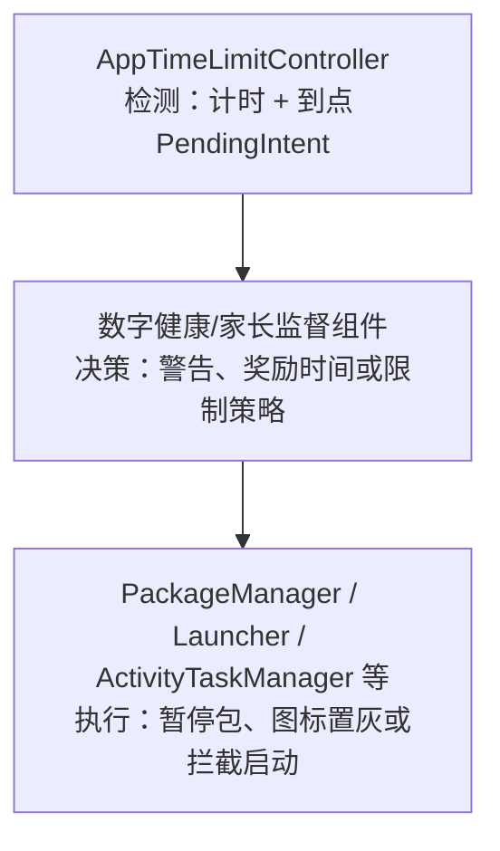

# 75 AppTimeLimitController、UsageObserver 与 Digital Wellbeing 使用时长限制链路

> 源码基线：Android 11（`android-11.0.0_r48`）  
> 本章目标：理解系统如何观察一组应用/功能的前台使用时间、触发限额回调，并明确“计时通知”与“真正限制应用”的边界。  
> 阅读方式：Mac 上只读源码，不需要编译或运行真机实验。

---

## 1. 先纠正标题里最容易产生的误解

看到 `AppTimeLimitController`，很容易以为：

> 时间一到，它会直接杀掉、暂停或禁止打开目标应用。

Android 11 源码不是这样。它的主要职责是：

1. 接收某个应用或应用内 token 开始/停止使用的信号；
2. 为有权限的观察者累计一组实体的使用时长；
3. 达到阈值时发送观察者注册的 `PendingIntent`；
4. 对 session observer，在一段不活跃时间后再通知 session 结束；
5. 为 supervision/数字健康类组件提供剩余额度查询。



所以本章必须始终区分：

> **Limit reached 是一个可信回调事件，不是 Controller 自己完成的强制封禁。**

Google Digital Wellbeing 的完整应用实现并不等同于这份 AOSP Framework 源码；本章讲的是 Android 11 平台为数字健康、家长监督等特权组件提供的底层计时能力和接口边界。

---

## 2. 源码地图

| 文件 | 作用 | 重点 |
|---|---|---|
| `frameworks/base/services/usage/java/com/android/server/usage/AppTimeLimitController.java` | 使用时长计时核心 | UserData、UsageGroup、Handler timeout |
| `frameworks/base/services/usage/java/com/android/server/usage/UsageStatsService.java` | 事件与 Binder 接入 | Activity 前后台、observer 注册、PendingIntent 发送 |
| `frameworks/base/core/java/android/app/usage/UsageStatsManager.java` | System API | 三类 observer、usage token、回调 extras |
| `frameworks/base/core/java/android/app/usage/IUsageStatsManager.aidl` | Binder 协议 | 注册/注销、reportUsageStart/Stop |
| `frameworks/base/services/core/java/android/app/usage/UsageStatsManagerInternal.java` | system_server 内部模型 | `AppUsageLimitData` |
| `frameworks/base/services/tests/servicestests/src/com/android/server/usage/AppTimeLimitControllerTests.java` | 行为测试 | 嵌套、重叠、session、阈值边界 |

### 2.1 运行位置

`AppTimeLimitController` 是 `UsageStatsService` 内部创建的普通 Java 对象，运行在 `system_server`：

```java
mAppTimeLimit = new AppTimeLimitController(listener, mHandler.getLooper());
```

它不是独立 Binder 服务。App 通过 `UsageStatsManager → IUsageStatsManager → UsageStatsService.BinderService` 间接访问。

### 2.2 线程与锁

- Binder 线程负责接收注册/注销和 token 上报；
- UsageStatsService 的 BackgroundThread 处理 Activity usage event；
- `AppTimeLimitController.mLock` 保护所有 user、observer、active entity 和 group；
- `MyHandler` 负责延迟 timeout、limit reached 和 session end 消息；
- `PendingIntent.send()` 由 `UsageStatsService` 的回调 listener 执行，而不是在核心计时代码里直接跨应用调用。

---

## 3. 三类 Observer 先放在一张表里

| 类型 | API | 到达 limit 后 | session 结束 | 初始已用时间 | 主要权限 |
|---|---|---|---|---|---|
| App Usage Observer | `registerAppUsageObserver()` | 回调后自动注销 | 无 | 0 | `OBSERVE_APP_USAGE` |
| Usage Session Observer | `registerUsageSessionObserver()` | 回调但保留，未来 session 可重新计时 | 有 | 0 | `OBSERVE_APP_USAGE` |
| App Usage Limit Observer | `registerAppUsageLimitObserver()` | limit 状态保留，需显式注销 | 无专用 session end | 可传 `timeUsed` | supervision app，或同时有 `SUSPEND_APPS` 与 `OBSERVE_APP_USAGE` |

这三者共用 `UsageGroup` 计时框架，但生命周期语义不同。只看方法名很容易把它们误认为三个重载。

---

## 4. 数据结构：按“被观察用户”和“观察者 UID”双向建索引

### 4.1 `UserData`：某个用户当前在用什么

```text
UserData(userId=10)
  ├─ currentlyActive
  │    "com.example.video" → 1
  │    "com.example.game"  → 2
  └─ observedMap
       "com.example.video" → [group A, group C]
       "feature/token"     → [group B]
```

- `currentlyActive` 的 value 是引用计数，不是 boolean；
- `observedMap` 是从 entity name 反查所有关注它的 groups，避免每次 start/stop 扫描全部 observer。

### 4.2 `ObserverAppData`：某个调用 UID 注册了什么

```text
ObserverAppData(uid=10050)
  ├─ appUsageGroups[observerId]
  ├─ sessionUsageGroups[observerId]
  └─ appUsageLimitGroups[observerId]
```

observerId 只在“观察者 UID + observer 类型”范围内定位。不同 UID 可以使用相同 observerId；同一 UID 的 AppUsageGroup 与 SessionUsageGroup 也维护在不同 map。

### 4.3 为什么需要双向索引

注册/注销时按观察者 UID 和 observerId 查最方便；usage start/stop 时按 entity name 查最方便。双向结构用一些内存换取事件热路径效率。

---

## 5. `UsageGroup`：真正的计时状态机

每个 group 保存：

```text
mObserverId
mObserved[]               被观察的一组包/token
mTimeLimitMs              阈值
mUsageTimeMs              已结算累计时间
mActives                  当前组内活跃实体数
mLastKnownUsageTimeMs     本轮开始/上次结算时点
mLastUsageEndTimeMs       上次整组结束时点
mLimitReachedCallback     到点 PendingIntent
```

时间来自 `getUptimeMillis()`，默认是 `SystemClock.uptimeMillis()`。这意味着深度睡眠期间不会累计“前台使用时间”，符合用户没有实际操作应用的直觉。

### 5.1 group 是 OR 计时，不是每个包相加

假设观察 `[VideoA, VideoB]`，时间线：

```text
VideoA: |---------- 10 分钟 ----------|
VideoB:       |---------- 10 分钟 ----------|
并集：  |--------------- 15 分钟 ---------------|
```

group 累计的是“至少一个 observed entity 活跃”的并集时间，即 15 分钟，而不是 20 分钟。`mActives` 从 0→1 才开始，1→0 才停止，重叠不会双算。

这对于“娱乐类应用总额度 1 小时”很重要：多个 Activity 重叠或切换不能凭空消耗双倍额度。

---

## 6. 实体开始使用：`noteUsageStart()`

外层先更新单个 entity 的引用计数：

```text
第一次 start(name)  → currentlyActive[name] = 1，并通知相关 groups
第二次 start(name)  → currentlyActive[name] = 2，不再次启动 groups
```

然后 `UsageGroup.noteUsageStart()`：

```java
if (mActives++ == 0) {
    startTimeMs = Math.max(mLastUsageEndTimeMs, startTimeMs);
    mLastKnownUsageTimeMs = startTimeMs;
    long remaining = mTimeLimitMs - mUsageTimeMs
            - currentTimeMs + startTimeMs;
    if (remaining > 0) {
        postCheckTimeoutLocked(this, remaining);
    }
}
```

### 6.1 为什么要 `max(lastEnd, start)`

`reportPastUsageStart()` 可以报告“这个 token 在若干毫秒前已经开始”。如果它与上一段 usage 重叠，直接从过去时点累计会重复计算。取上一次结束和报告开始中的较晚值，用于缩小重叠风险。

源码注释也承认一个罕见副作用：复杂的跨段乱序可能少算部分时间。这个组件追求低成本、健壮计时，不是完整事件溯源数据库。

### 6.2 为什么一开始就发送延迟消息

若应用一直保持前台，没有 stop 事件，就不能等 stop 时才发现超限。因此 start 时根据剩余时间安排 `MSG_CHECK_TIMEOUT`：

```text
start ───── remaining time ───── timeout check
```

Handler 消息只是“到时检查”，不是盲目宣布超限。触发时还会重新确认 group 是否活跃、累计时间和剩余时间。

---

## 7. 实体停止使用：`noteUsageStop()`

外层 entity 引用计数：

```text
count 2 → 1：仍有一个实例活跃，不通知 group stop
count 1 → 0：移出 currentlyActive，通知相关 groups
不存在的 name stop：抛 IllegalArgumentException
```

group 内：

```java
if (--mActives == 0) {
    boolean notCrossed = mUsageTimeMs < mTimeLimitMs;
    mUsageTimeMs += stopTimeMs - mLastKnownUsageTimeMs;
    mLastUsageEndTimeMs = stopTimeMs;
    if (notCrossed && mUsageTimeMs >= mTimeLimitMs) {
        postInformLimitReachedListenerLocked(this);
    }
    cancelCheckTimeoutLocked(this);
}
```

只有整个 group 从有活动变为无活动才结算本段。若恰好在 stop 时跨阈值，也会发送 limit reached；并取消此前的 timeout 检查。

### 7.1 防御不平衡 start/stop

如果 `mActives` 超过 observed 数量，或 stop 使它小于 0，源码会记录错误并夹回合理范围。外层引用计数和 group 计数是两道防线。

---

## 8. timeout 为什么还要二次检查

`checkTimeout(currentTimeMs)`：

1. 若已经达到 limit，直接返回，避免重复通知；
2. 用 `user.isActive(mObserved)` 确认至少一个实体仍活跃；
3. 计算从 `mLastKnownUsageTimeMs` 到现在的新用量；
4. 若足以用完剩余额度，更新累计并投递 limit reached；
5. 否则按新的剩余时间再次安排检查。

为什么定时消息可能“早醒”？

- handler 调度与测试时钟；
- group 注册时某实体已经活跃；
- past usage start；
- start/stop 消息交错；
- 系统负载导致消息晚到。

因此延迟消息是提醒重新计算，不是真理来源。

---

## 9. App Usage Observer：一次性额度

公开/System API：

```java
registerAppUsageObserver(
        observerId,
        observedEntities,
        timeLimit,
        timeUnit,
        callbackIntent);
```

达到阈值后 `AppUsageGroup.onLimitReached()`：

```java
super.onLimitReached();
remove();
```

即先通知，再自动注销。后续继续使用不会再次触发同一 observer；想开始新额度，观察者必须重新注册。

### 9.1 同 observerId 再注册

`addAppUsageObserver()` 发现同 UID map 中已有相同 observerId，会先 `group.remove()` 再建立新 group。因此它是替换，不是合并或报错。

### 9.2 数量与最短时间限制

默认每 UID observer 上限为 1000，最小 time limit 为 1 分钟（测试可覆盖方法）。这样避免特权应用注册海量毫秒级定时器拖垮 system_server。

---

## 10. Session Usage Observer：一次“连续使用会话”

它多两个概念：

- `newSessionThresholdMs`：停止多久才算下一次新 session；
- `sessionEndCallback`：达到使用 limit 后，随后结束会话时通知。

### 10.1 新 session 的判定

新 usage 开始且 group 原本无 active：

```java
if (startTimeMs - mLastUsageEndTimeMs > mNewSessionThresholdMs) {
    mUsageTimeMs = 0;
}
cancel pending session-end message;
```

如果停用时间没有超过 threshold，重新回来仍算同一 session，并取消尚未触发的 session end。

### 10.2 为什么 session end 要延迟通知

用户可能只是 Activity 短暂切换：

```text
视频 App stop ── 3 秒系统弹窗 ── 视频 App start
```

如果 stop 立即认为 session 结束，会产生大量碎片。Controller 在 group 无 active 且已经达到 limit 后，延迟 `newSessionThreshold`；期间若重新 start，就取消 end message。

### 10.3 一个完整 session 时间线

```text
t0 start
   ├──── 使用达到 30 分钟 ────> limit reached callback
   ├──── 继续使用 5 分钟
t1 stop
   ├──── 空闲 threshold ───────> session end callback（本 session 35 分钟）
t2 下一次 start
   └──── 已超过 threshold，usageTime 清零，开始新 session
```

SessionUsageGroup 到 limit 后不自动 remove，因此未来新 session 还能再次触发。

---

## 11. App Usage Limit Observer：可查询的总额度

这个 API 更适合 supervision/数字健康策略持有者：

```java
registerAppUsageLimitObserver(
        observerId,
        observedEntities,
        timeLimit,
        timeUsed,
        callbackIntent);
```

特点：

- 注册时可以传入已经使用的 `timeUsed`；
- 达到 limit 后不会自动删除；
- 需显式 `unregisterAppUsageLimitObserver()`；
- Framework 可通过 `getAppUsageLimit()` 找出某 package 相关 group 的额度/剩余时间；
- 如果 `timeUsed >= timeLimit`，callback 可以为 null，并不会再次安排到点通知。

### 11.1 为什么允许传初始 timeUsed

`AppTimeLimitController` 本身不把 observer group 持久化到磁盘。策略应用可能在自己的数据库保存“今日已用 20 分钟”，进程/服务重新注册时把它传回，继续剩余额度。

这也是重要边界：

> Controller 管理当前注册期的内存计时；跨重启、跨日期的“每日额度账本”主要由观察者策略组件负责恢复和重建。

### 11.2 选择哪个 group 返回

一个 package 可能属于多个 AppUsageLimitGroup。查询时源码逐个比较 `getUsageRemaining()`，选择**剩余时间最少**的 group，然后一起返回它的总额度和剩余时间。不是选“总 time limit 最小”：例如 30 分钟额度还剩 20 分钟，60 分钟额度却只剩 5 分钟，后者才是当前更严格的限制。多个额度不会相加。

---

## 12. Package 与应用内 Token：被观察实体不只有包名

### 12.1 Activity usage

Activity resumed 时，`UsageStatsService.reportEvent()` 根据 `mUsageSource` 调用：

```java
mAppTimeLimit.noteUsageStart(event.mPackage, userId);
// 或 event.mTaskRootPackage
```

真正 stop 在 `ACTIVITY_STOPPED`/destroyed 处理，而 pause 主要更新可见 Activity 状态。这样短暂停顿或多 Activity 切换不一定立即终止计时。

### 12.2 应用内 usage token

应用可以用：

```java
reportUsageStart(activity, "video_player");
reportUsageStop(activity, "video_player");
```

服务构造完整名字：

```text
callingPackage + "/" + token
```

这防止不同包都使用 `video_player` 时命名冲突。观察者必须使用同样的完整 token 作为 observed entity。

### 12.3 token 必须绑定 Activity

服务按 Activity Binder/instance 维护 `mUsageReporters`：

- 同一 Activity 重复 start 同 token 会抛异常；
- 未 start 就 stop 会抛异常；
- Activity stopped/crashed 时，系统代替 reporter 停掉仍活跃 token；
- token 使用不能脱离 Activity 永久在后台计时。

这既防止泄漏，也让“应用内功能使用”仍锚定用户可见会话。

### 12.4 `reportPastUsageStart()`

允许报告 `timeAgoMs`，弥补调用到达 Framework 前已经发生的一小段使用。Controller 用当前 uptime 减去 timeAgo 得到开始点，并通过 overlap 修正避免明显重复。

---

## 13. Activity 多实例为何需要两级计数

假设同一包在分屏/多窗口有两个 Activity：

```text
Activity A resume ───────────────── stop
        Activity B resume ─── stop
```

`UsageStatsService.mVisibleActivities` 按 instanceId 追踪具体 Activity，避免重复 resumed/stopped。

进入 Controller 后：

- `currentlyActive[package]` 记录同 entity 的实例数；
- `UsageGroup.mActives` 记录该 group 内多少不同 observed entities 正活跃。

```text
Activity instance 层 → package 引用计数层 → observed group 并集层
```

少任何一层都可能造成重复计时或提前停止。

---

## 14. PendingIntent 回调链

Controller 到点后并不自己调用应用代码：

```text
MyHandler MSG_INFORM_LIMIT_REACHED_LISTENER
  → UsageGroup.onLimitReached()
  → TimeLimitCallbackListener.onLimitReached(...)
  → UsageStatsService 创建 Intent extras
  → callbackIntent.send(context, 0, intent)
  → PendingIntent 创建者指定的组件收到回调
```

limit callback 带：

- observer id；
- time limit；
- time used；

session end callback 带 observer id 和本 session time used。

具体 extra 常量定义在 `UsageStatsManager`，调用者应使用常量解析，而不是硬编码字符串。

### 14.1 为什么使用 PendingIntent

- 观察者进程不在时仍能被系统启动/唤醒接收；
- PendingIntent 固化创建者身份与目标；
- 不需要 Controller 长期持有远端 callback Binder；
- 可由系统安全地跨进程发送。

### 14.2 回调被取消

`PendingIntent.send()` 可能抛 `CanceledException`。源码记录警告，但不会倒退使用时间或重新注册一次性 group。观察者必须管理 PendingIntent 生命周期。

### 14.3 移除 group 如何处理竞态消息

`UsageGroup.remove()` 把 `mLimitReachedCallback` 设为 null；Session group 也清空 end callback。即使 Handler 中已有竞态消息，执行时不会再向旧 PendingIntent 发送有效回调。

---

## 15. 权限为何分两档

### 15.1 普通 observer

注册 AppUsageObserver/SessionObserver 需要 `OBSERVE_APP_USAGE`。这是 signature/privileged 能力，普通第三方应用无法仅靠请求运行时权限获得。

### 15.2 Usage Limit observer

要求：

- 当前 active supervision app；或
- 同时拥有 `SUSPEND_APPS` 和 `OBSERVE_APP_USAGE`。

原因是它不仅接收一次到点通知，还能声明已用时间、保留限制数据并供系统查询，通常与真正的应用暂停策略紧密配合。

### 15.3 userId 不能由调用者任意选择

BinderService 使用：

```java
int callingUid = Binder.getCallingUid();
int userId = UserHandle.getUserId(callingUid);
```

observer 归入调用者所属用户。清除 calling identity 只是为了安全调用内部服务，不会改变已经捕获的真实 UID/userId。

---

## 16. 数字健康的“检测—决策—执行”三层

用每日游戏 60 分钟举例。

### 16.1 检测层：Framework

```text
Game Activity resumed/stopped
  → AppTimeLimitController 累计 uptime
  → 60 分钟时发送 PendingIntent
```

### 16.2 决策层：数字健康/监督应用

收到 callback 后可能：

- 更新自己的每日额度数据库；
- 显示“时间已用完”通知；
- 判断今天是否仍有奖励时间；
- 判断当前用户/家庭策略；
- 决定暂停哪些 package。

### 16.3 执行层：其他系统机制

可能使用特权 API：

- suspend package；
- 设置 distraction restrictions；
- 启动拦截/提示界面；
- Launcher 对图标置灰；
- DevicePolicy/监督能力。

这些不是 `AppTimeLimitController.onLimitReached()` 自动做的。AOSP Framework 提供积木，完整产品策略由系统应用和设备配置组合。

---

## 17. 为什么 Controller 使用 uptime 而 UsageStats 历史使用 wall time

上一章 UsageStatsDatabase 要回答“昨天几点使用”，所以最终落墙上时间；本章只回答“当前注册期活跃了多长时间”，适合 uptime：

| 需求 | 时间 |
|---|---|
| 查询昨天下午使用记录 | wall clock |
| 活跃连续 30 分钟触发回调 | uptime |
| Handler 延迟检查 | uptime time base |
| 跨设备重启恢复每日额度 | 观察者自己的持久化策略 |

设备深睡时 uptime 不增长，而 Activity 不可能在深睡中被用户持续操作，正符合“使用时长”语义。

不要从 UsageStatsDatabase 的累计前台时间直接推断 Controller 当前 `mUsageTimeMs`：两者数据结构、时间轴、注册起点和异常修复逻辑不同。

---

## 18. 内存生命周期与恢复边界

源码中 `mUsers`、`mObserverApps`、groups 都是内存结构，没有像 UsageStatsDatabase 那样的 group 文件写盘链路。

后果：

- system_server/设备重启后 observer 需重新注册；
- AppUsageLimitObserver 可以通过 `timeUsed` 恢复已有用量；
- PendingIntent 注册不会神奇地使整个 group 跨重启自动复活；
- 用户删除时 `onUserRemoved()` 移除 UserData；源码 TODO 提醒仍需处理在途 delayed messages；
- 观察者应用数据条目当前不主动移除，源码基于“能注册的 App 数量很小且固定”的假设。

这也是为什么完整数字健康产品需要自己的持久化和开机恢复逻辑。

---

## 19. 完整案例：两个视频 App 共用 30 分钟 session

观察者注册：

```text
observerId = 7
observed = [VideoA, VideoB]
timeLimit = 30 min
newSessionThreshold = 10 min
limit callback = P_limit
session end callback = P_end
```

时间线：

```text
09:00 VideoA start      group actives 0→1，安排 30 分钟 timeout
09:10 VideoB start      group actives 1→2，不新开计时段
09:20 VideoA stop       group actives 2→1，仍连续计时
09:30 timeout check     累计并集 30 分钟，发送 P_limit
09:35 VideoB stop       actives 1→0，总计 35 分钟，安排 10 分钟 session end
09:40 VideoA start      空闲仅 5 分钟，取消 session end，继续同 session
09:42 VideoA stop       再安排 session end
09:52 无重新开始       发送 P_end，报告 session 总用时约 37 分钟
10:05 VideoA start      距上次结束 >10 分钟，usageTime 清零，新 session
```

关键观察：

- A/B 重叠不双算；
- limit reached 不会强行结束正在进行的 session；
- 短暂离开不足 threshold，不切新 session；
- session end 是延迟确认；
- 下一次新 session 可以再次触发 limit。

---

## 20. 异常与边界情况

### 20.1 注册时目标已活跃

`add...Observer()` 完成映射后调用 `noteActiveLocked()`，扫描 observed entities。若某个目标已经在 `currentlyActive`，新 group 会立即从“现在”开始计时，不会漏掉注册后的持续部分，也不会追溯注册前全部历史。

### 20.2 limit 已用完再注册

AppUsageLimitObserver 若 `timeUsed >= timeLimit`，构造时把 callback 设 null。它代表额度已经耗尽但仍可查询，不应重复到点通知。

### 20.3 多个 group 观察同一实体

`observedMap[name]` 保存列表，一次 start/stop 会更新所有 group。它们的 threshold、observer UID 和生命周期互不影响。

### 20.4 同名 token

完整 token 带 calling package；不同包的相同短 token 不冲突。同包不同 Activity 使用同 token 时，外层 reporter 和 entity 引用计数共同保证直到最后一个实例停止才结束。

### 20.5 消息晚到

Handler timeout 晚到会用当前 uptime 重新计算，`timeUsed` 可能略大于 limit。回调同时提供原 limit 和实际 elapsed，调用者不要假定两者严格相等。

### 20.6 Activity pause 与 stop

Android 11 中计时结束锚在 stopped/destroyed，而不是一看到 paused 就立刻 stop。pause 后 Activity 可能仍可见或很快恢复；`mVisibleActivities` 保存状态，stop 时完成清理。

---

## 21. 只读源码练习路线

### 第一轮：只读公共 API

```bash
sed -n '760,990p' \
  frameworks/base/core/java/android/app/usage/UsageStatsManager.java
```

做一张三类 observer 对比表，特别标出自动注销、session end、timeUsed 和权限。

### 第二轮：只追 Activity 到计时器

```bash
rg -n "ACTIVITY_RESUMED|ACTIVITY_STOPPED|noteUsageStart|noteUsageStop" \
  frameworks/base/services/usage/java/com/android/server/usage/UsageStatsService.java \
  frameworks/base/services/usage/java/com/android/server/usage/AppTimeLimitController.java
```

解释为何 paused 和 stopped 的职责不同。

### 第三轮：只读 UsageGroup

```bash
sed -n '220,540p' \
  frameworks/base/services/usage/java/com/android/server/usage/AppTimeLimitController.java
```

手画 `mActives: 0→1→2→1→0`，并在图上标出什么时候安排/取消 timeout。

### 第四轮：只追 token

```bash
rg -n "reportPastUsageStart|reportUsageStop|buildFullToken|mUsageReporters" \
  frameworks/base/services/usage/java/com/android/server/usage/UsageStatsService.java
```

回答 Activity 异常停止时，谁替应用补发 token stop。

---

## 22. 常见误区纠正

### 误区 1：时间到达后 Controller 自动暂停应用

不对。它发送 PendingIntent；策略组件决定并调用其他执行能力。

### 误区 2：观察多个包时，各包时间相加

不对。Group 统计 observed entities 活跃区间的并集，重叠不双算。

### 误区 3：AppUsageObserver 每天自动重置

不对。到点后自动注销；“每天”是外部策略重新注册和持久化的概念。

### 误区 4：Session observer stop 后立即回调 session end

不对。要连续空闲超过 newSessionThreshold，期间重新 start 会取消消息。

### 误区 5：PendingIntent 让 observer 配置自动跨重启保存

不对。Controller group 在内存中；重启后需策略组件重建。

### 误区 6：UsageStats 历史前台时间等于 observer usageTime

不对。前者是持久化 wall-time 聚合，后者从注册起使用 uptime 进行内存计时。

### 误区 7：pause 就一定结束应用使用

不对。本版本主要在 stopped/destroyed 清理计时，以适应可见性和短暂切换。

### 误区 8：observerId 在全系统唯一

不对。它至少与观察者 UID、observer 类型共同构成定位上下文。

### 误区 9：普通 App 可以注册别的应用使用观察

不对。需要特权 `OBSERVE_APP_USAGE`；Usage Limit 还需要更强监督/暂停能力。

### 误区 10：回调的 timeUsed 必定刚好等于 limit

不对。线程调度或 stop 时结算可能使实际值超过阈值。

---

## 23. 排查“为什么没有收到到点回调”

按以下层次检查：

### ① 注册层

- 是否有权限？
- observed array 是否为空？
- time limit 是否至少 1 分钟？
- PendingIntent 是否有效？
- 相同 observerId 是否被后来注册替换？

### ② 命名层

- 观察的是 package 还是 `package/token`？
- usage source 是 current Activity 还是 task root？
- userId 是否与目标使用事件一致？

### ③ 事件层

- Activity 是否真的 reported resumed/stopped？
- instanceId 是否重复/缺失导致事件被防重？
- token 是否成功 start，是否随 Activity stop 被自动清理？

### ④ 计时层

- group 是否已有其他 active entity？
- uptime 是否真正增长？
- limit 是否已经触发过并使一次性 observer 自动注销？
- session 是否被短暂重启取消了 end callback？

### ⑤ 回调层

- PendingIntent 是否被取消？
- receiver/service 是否可启动？
- 观察者是否误读 extras？
- 回调收到后是否由应用自己的逻辑丢弃？

### ⑥ 执行层

- 即使已回调，策略应用是否真的调用了 suspend/限制 API？
- Launcher/ATMS 是否采用该限制状态？

最后一层尤其重要：没被拦截不等于没计到时间。

---

## 24. 练习题

### 题 1

观察 A、B 两个包。A 使用 10 分钟，后 5 分钟与 B 重叠，B 再单独使用 5 分钟。group 用量是多少？

### 题 2

为什么 start 时就要安排 timeout，不能只在 stop 时结算？

### 题 3

Session observer 达到 limit 后，用户离开 5 秒又回来，而 newSessionThreshold 是 10 秒。是否触发 session end？是否清零用量？

### 题 4

为什么 AppUsageLimitObserver 接受 `timeUsed`，普通 AppUsageObserver 不需要？

### 题 5

Activity crash 后应用忘记 reportUsageStop(token)，Framework 如何收尾？

### 题 6

limit reached callback 已发送，但应用仍能打开。是否说明 Controller 有 bug？

### 参考答案

1. 15 分钟：A 的 10 分钟已经包含那 5 分钟重叠区间，B 随后再单独使用 5 分钟，所以并集是 10+5=15，而不是各自 10 分钟相加得到 20。
2. 应用可能一直活跃而迟迟没有 stop；必须在剩余额度耗尽时主动检查和回调。
3. 不触发；重新 start 会取消延迟 end，空闲未超过阈值，仍是同一 session且不清零。
4. 它用于长期/可恢复的监督额度，策略组件可把自己保存的既有用量带回 Framework。
5. UsageStatsService 将 token 绑定 Activity，处理 Activity stopped/destroyed 时遍历未结束 token 并代为 noteUsageStop。
6. 不一定。Controller 只计时通知，真正暂停/拦截由接收回调的特权策略组件执行。

---

## 25. 复读后的易懂性补强

复读后，最容易不理解的是“为什么已经叫 Limit，系统却不直接限制”。用秒表和门禁比喻：

### 25.1 Controller 是秒表裁判

它知道参赛者何时开始、停止，负责避免重叠双算，到点吹哨并告诉主办方实际用时。

### 25.2 数字健康应用是规则制定者

它定义今天额度、奖励时间、哪些应用属于一组，保存跨重启记录，收到哨声后决定警告还是限制。

### 25.3 包管理/界面系统是门禁执行者

真正让图标置灰、暂停包或拦截 Activity，需要另一套有权限的系统接口。

```text
秒表（检测） ≠ 规则（决策） ≠ 门禁（执行）
```

另一个易混点是“两级计数”：

```text
currentlyActive[name]
  解决同一 package/token 的多个实例

group.mActives
  解决一个 group 中多个不同 observed entity 重叠
```

前者避免同包两个 Activity 过早 stop，后者避免 A/B 两个包重叠双算。

---

## 26. 本章总结

完整链路：

```text
特权观察者通过 UsageStatsManager 注册 observer
  → BinderService 校验权限并绑定 callingUid/userId
  → AppTimeLimitController 创建 UserData + ObserverAppData + UsageGroup
  → observedMap 建立 entity 到 groups 的反向索引

Activity resumed/stopped 或应用内 token start/stop
  → currentlyActive 做同实体引用计数
  → UsageGroup.mActives 做组内并集计时
  → start 按剩余时间安排 Handler timeout
  → stop 或 timeout 二次核算 usageTime
  → 达到 limit 后通过 listener 发送 PendingIntent
  → Session group 延迟确认 session end
  → 数字健康/监督组件决定是否调用其他 API 真正限制应用
```

学完本章应能解释五条边界：

1. UsageStats 历史统计与 AppTimeLimit 当前注册计时；
2. package usage 与 `package/token` 应用内功能 usage；
3. 同实体实例计数与 group 内多实体计数；
4. 一次性 observer、session observer 与持久 limit observer；
5. 达到阈值通知与应用限制执行。

下一章将学习 `DeviceConfig、SettingsProvider 与系统动态配置下发链路`，理解前面多章反复出现的阈值、feature flag 和策略参数如何存储、监听、更新并安全地影响 system_server 行为。
