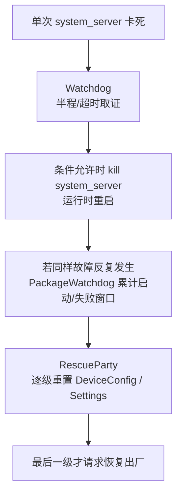

# 78 Watchdog、SystemServer 卡死检测与 RescueParty 故障自愈链路

> 源码版本：Android 11 / API 30 / `android-11.0.0_r48`  
> 学习方式：macOS 只读源码，不要求编译或刷机  
> 前置章节：18 ANR、76 DeviceConfig、77 SystemProperties

---

## 1. 这一章解决什么问题

Android 的核心服务大量运行在 `system_server`。如果它的主线程、前台线程或 Binder 线程池永久卡住，电话、窗口、电源、安装等系统能力可能一起失效。

Android 还面临另一类问题：某项错误配置下发后，系统组件不断崩溃或开机后反复重启。即使每次重启都成功拉起 `system_server`，错误配置仍在，设备还是会继续失败。

Android 11 用两组容易被名字混淆的机制处理它们：

| 机制 | 观察对象 | 典型问题 | 主要动作 |
|---|---|---|---|
| `Watchdog` | `system_server` 内关键线程、Monitor、Binder 线程、FD | 一次运行中长期不响应 | 留证据并杀死 `system_server`，由 init 重启 |
| `PackageWatchdog` | 包的崩溃/ANR、显式健康检查、开机次数 | 一段时间内重复失败 | 选择用户影响最小的健康观察者执行缓解 |
| `RescueParty` | `PackageWatchdog` 的一个持久观察者 | 系统包反复崩溃/ANR或运行时重启循环 | 分级重置 DeviceConfig/Settings，最终可恢复出厂 |

先记住：



它们可以前后发生，但不是同一个类，也不是同一套超时状态机。

---

## 2. 本章源码地图

| 文件 | 作用 |
|---|---|
| `frameworks/base/services/core/java/com/android/server/Watchdog.java` | 关键线程存活检测、半程/超时诊断和杀进程 |
| `frameworks/base/services/core/java/com/android/server/WatchdogDiagnostics.java` | 打印被阻塞线程及锁持有者信息 |
| `frameworks/base/services/core/java/com/android/server/PackageWatchdog.java` | 包健康观察、失败窗口、开机循环和观察者选择 |
| `frameworks/base/services/core/java/com/android/server/RescueParty.java` | 分级配置重置与恢复出厂 |
| `frameworks/base/services/java/com/android/server/SystemServer.java` | 启动 Watchdog、注册 RescueParty、记录本次启动 |
| `frameworks/base/services/core/java/com/android/server/am/ActivityManagerService.java` | SettingsProvider 就绪通知、允许/禁止 Watchdog 重启 |
| `frameworks/base/services/core/java/com/android/server/am/SettingsToPropertiesMapper.java` | DeviceConfig 到 native property 及 native reset 反馈 |
| `frameworks/base/core/java/android/provider/Settings.java` | Settings/Config reset 接口和 monitor callback |
| `frameworks/base/services/core/java/com/android/server/am/AppErrors.java` | App crash/ANR 进入 PackageWatchdog 的入口之一 |

---

## 3. Watchdog 在什么时候启动

`SystemServer.run()` 创建并启动独立的 watchdog 线程：

```java
final Watchdog watchdog = Watchdog.getInstance();
watchdog.start();
```

`Watchdog` 自己继承 `Thread`，线程名为 `watchdog`。它不能依赖被检查线程来推进检测，否则被检查线程卡住时，检测者也会一起失效。

默认超时：

```java
private static final long DEFAULT_TIMEOUT = 60 * 1000;
private static final long CHECK_INTERVAL = DEFAULT_TIMEOUT / 2;
```

所以默认节奏是：

```text
0 秒：投递检查任务
30 秒：若仍未完成，进入 WAITED_HALF，先抓一次栈
60 秒：若仍未完成，进入 OVERDUE，完整取证并考虑杀 system_server
```

这里的 30/60 秒使用 `SystemClock.uptimeMillis()`。设备深度睡眠时 uptime 不增长，被检查线程也没有运行机会，因而不会因为睡眠产生假超时。

---

## 4. Watchdog 检查哪些线程

构造函数为多个公共线程创建 `HandlerChecker`：

- foreground thread；
- system_server main thread；
- ui thread；
- i/o thread；
- display thread；
- animation thread；
- surface animation thread。

它没有“扫描 Java 所有线程”。检查集合是明确注册的关键线程，服务也可以调用：

```java
Watchdog.getInstance().addThread(handler);
Watchdog.getInstance().addMonitor(monitor);
```

`addThread` 检查某个 Looper 是否能执行队首任务；`addMonitor` 检查一段服务自定义的同步健康逻辑是否能返回。

---

## 5. HandlerChecker：向队首投递一张“签到卡”

核心不是读取 `Thread.State`，而是向目标 Handler 队首投递 `HandlerChecker` 自身：

```java
mCompleted = false;
mStartTime = SystemClock.uptimeMillis();
mHandler.postAtFrontOfQueue(this);
```

目标线程真正执行 `run()` 后：

1. 顺序调用注册的 `Monitor.monitor()`；
2. 最后把 `mCompleted` 设为 `true`；
3. 清空 `mCurrentMonitor`。

可以把它想成保安给每个关键办公室塞一张签到卡：

```text
watchdog 把卡塞到消息队列最前面
  → 线程能调度到它
  → Monitor 能逐个返回
  → 在卡上签“完成”
```

卡迟迟拿不回来，只说明目标线程或 Monitor 没有及时推进；它不会直接告诉你根因。根因可能是死锁、长时间磁盘 I/O、Binder 同步等待、锁竞争、无限循环或 Binder 线程枯竭。

### 5.1 为什么空闲 Looper 可以直接视为完成

若目标 Looper 正在 poll，且这个 checker 没有 Monitor：

```java
if (mMonitors.size() == 0
        && mHandler.getLooper().getQueue().isPolling()) {
    mCompleted = true;
    return;
}
```

poll 表示线程正在等待新消息，本身就是“消息循环还能工作”的证据，不必为了签到额外唤醒它。

### 5.2 为什么用 postAtFrontOfQueue 仍可能等很久

“队首”只能排在尚未执行的消息前面，不能抢占当前正在运行的代码：

```text
目标线程正在执行一个 90 秒同步任务
  → Watchdog 的卡已排到队首
  → 但必须等当前任务返回
  → 仍会超时
```

因此 system_server 的 Handler 回调里不应做无界阻塞工作。

---

## 6. Monitor 与 Handler 可运行性不是一回事

`HandlerChecker.run()` 会执行 Monitor：

```java
for (Monitor monitor : mMonitors) {
    mCurrentMonitor = monitor;
    monitor.monitor();
}
mCompleted = true;
```

这能区分两种描述：

- `Blocked in handler on ...`：签到任务甚至没开始，线程卡在前面的工作；
- `Blocked in monitor X on ...`：签到任务已开始，但某个 Monitor 卡住。

Monitor 常用于尝试获得服务关键锁。若另一线程永久持锁，`monitor()` 无法返回，Watchdog 能把当前 Monitor 名称写进 subject。

注意：Monitor 自己运行在 `mMonitorChecker` 对应的 foreground thread 上。它不是并行探针；某个 Monitor 卡住后，同一个 checker 后续 Monitor 也无法执行。

---

## 7. BinderThreadMonitor 检测什么

Watchdog 默认注册：

```java
private static final class BinderThreadMonitor implements Watchdog.Monitor {
    public void monitor() {
        Binder.blockUntilThreadAvailable();
    }
}
```

它等待 system_server Binder 线程池出现可接收新调用的线程。

这检测的是“Binder 服务入口是否还有处理能力”，不是检测 Binder 驱动是否活着。如果所有 Binder 工作线程都被同步调用、锁或下游服务占满，外部进程即使能发请求，也没人及时处理。

常见危险模式：

```text
system_server Binder 线程 A 持有 Lock-1
  → 同步调用进程 B
进程 B 回调 system_server
  → 等待空闲 Binder 线程或 Lock-1
其余 Binder 线程也在相似等待
  → Binder 线程池枯竭
```

---

## 8. 四个完成状态

每个 `HandlerChecker` 根据耗时返回：

| 状态 | 条件 | 动作 |
|---|---|---|
| `COMPLETED` | `mCompleted == true` | 下一轮 |
| `WAITING` | 未完成且小于半个超时 | 继续等待 |
| `WAITED_HALF` | 超过一半但未到总超时 | 首次抓栈，暂不杀 |
| `OVERDUE` | 超过总超时 | 完整诊断和恢复决策 |

多个 checker 的总状态取最大值：

```java
state = Math.max(state, hc.getCompletionStateLocked());
```

只要有一个关键 checker 达到 `OVERDUE`，整轮就按超时处理。

半程抓栈很重要：60 秒时锁关系可能已经变化。30 秒现场能提供更早证据，也能与最终栈比较，判断线程是否一直停在同一位置。

---

## 9. 超时后收集哪些证据

OVERDUE 后 Watchdog 不立即杀进程，而是先尽量留现场：

1. EventLog 写入 `WATCHDOG` 事件和阻塞描述；
2. 抓 system_server、关键 Java 进程的栈；
3. 抓感兴趣 native daemon 与 HAL 进程的栈；
4. 收集 PSI 内存压力与 CPU 状态；
5. 触发内核 SysRq `w`，打印阻塞任务；
6. 触发 SysRq `l`，打印各 CPU backtrace；
7. 尝试写入 DropBox，标签为 `watchdog`；
8. 若最终确实要杀进程，在 kill 分支调用 `WatchdogDiagnostics.diagnoseCheckers()`；
9. 条件允许时杀死自身。

感兴趣的 native 进程包括 `surfaceflinger`、`netd`、`vold`、音视频服务、statsd，以及若干 HAL PID。这不表示 Watchdog 会杀掉它们，而是因为 system_server 可能正同步等待它们，需要一起取证。

写 DropBox 被放在独立线程，并只 `join(2000)`。因为 AMS 自身可能已经死锁，如果 Watchdog 无限等待 AMS 写日志，恢复机制也会被拖死。

---

## 10. 为什么杀 system_server 能恢复

最终路径：

```java
Process.killProcess(Process.myPid());
System.exit(10);
```

Watchdog 杀的是自己所在的 `system_server` 进程，并不等于直接重启整台设备。Zygote 作为 `system_server` 的父进程会处理这个关键子进程的退出；Android 运行时链路随后退出并由 init 管理的 zygote service 重新拉起，新的 Zygote 再孵化新的 `system_server`。

可画成：

```text
关键线程卡死
  → Watchdog 留现场
  → kill system_server
  → Zygote 处理 system_server 这个关键子进程的退出并结束运行时
  → init 重新拉起 zygote service
  → 新 Zygote 孵化新的 system_server
  → SystemServer 再次启动系统服务
```

“运行时重启”对用户看起来可能像一次短暂重启，但它与完整 kernel reboot、关机开机、恢复出厂不是同一件事。

---

## 11. 哪些情况不会杀进程

源码有三类主要保护：

- 当前或最近连接过 debugger；
- `mAllowRestart == false`；
- `IActivityController.systemNotResponding()` 要求继续等待。

AMS 的调试/测试路径可以调用 `setAllowRestart(false)`。这适合诊断，但生产恢复能力会暂时关闭。

Watchdog 还支持 `pauseWatchingCurrentThread(reason)` / `resumeWatchingCurrentThread(reason)`，用于已知的长操作。pause 是计数的，必须成对恢复。滥用 pause 会让真实死锁失去检测，因此它不是普通性能优化工具。

---

## 12. OpenFdMonitor：不只检查线程卡死

在 debuggable 构建上，Watchdog 还可能创建 `OpenFdMonitor`。当文件描述符接近 `RLIMIT_NOFILE` 软上限时，它把问题当成需要重启 system_server 的严重状态。

原因是 FD 耗尽后：

- socket、文件、pipe 无法创建；
- Binder 或诊断动作可能失败；
- 系统服务会出现大面积、难以预测的异常。

它会预留一定余量，以便在真正耗尽前仍能完成诊断。Android 11 此检查只在 debuggable 构建启用，不应把它误写成所有 user 设备必有的恢复路径。

---

## 13. Watchdog 与普通 ANR 的区别

| 问题 | 普通应用 ANR | system_server Watchdog |
|---|---|---|
| 被观察者 | 应用进程/组件 | system_server 关键线程和 Monitor |
| 常见触发 | input、broadcast、service 等超时 | Handler 签到或 Monitor 60 秒未完成 |
| 处置主体 | AMS/ANR 流程 | 独立 watchdog 线程 |
| 典型结果 | 弹框、杀应用、记录 traces | 取证后杀 system_server |
| 意义 | 某个应用无响应 | 核心系统控制面可能整体失效 |

system_server 中发生的某个服务调用慢，不一定立刻触发 Watchdog；只有它阻塞了被监控线程/Monitor 超过阈值，或造成 Binder 线程池不可用，才进入这条链。

---

## 14. 为什么还需要 PackageWatchdog

进程重启只能清掉内存状态。如果根因是持久化配置：

```text
错误 DeviceConfig/Settings
  → 系统组件启动后读取
  → 崩溃或卡死
  → system_server 被重启
  → 又读取同一个错误值
  → 再次失败
```

这时需要跨一次运行保存“近期失败次数”，并选择能够撤销配置、回滚包或执行其他缓解的观察者。`PackageWatchdog` 是协调框架，`RescueParty` 是其中一个观察者。

---

## 15. PackageWatchdog 的失败窗口

Android 11 默认对普通 App crash/ANR 使用：

```java
DEFAULT_TRIGGER_FAILURE_DURATION_MS = 1 分钟;
DEFAULT_TRIGGER_FAILURE_COUNT = 5;
```

即同一个被观察包在 1 分钟窗口内累计 5 次失败，才通知健康观察者。这个阈值可由 DeviceConfig 的 watchdog namespace 调整，所以源码默认值不等于所有运行设备永远固定的值。

native crash 与显式 health check failure 被视为需要立即处理，不走普通计数阈值。

失败理由包括：

- native crash；
- explicit health check；
- app crash；
- app not responding。

PackageWatchdog 并不亲自决定“重置设置还是回滚 APK”。它询问注册的 `PackageHealthObserver`，比较各候选措施的用户影响等级，选择影响最小且愿意处理的观察者。

---

## 16. 启动循环如何判断

`SystemServer` 在启动早期执行：

```java
RescueParty.registerHealthObserver(mSystemContext);
PackageWatchdog.getInstance(mSystemContext).noteBoot();
```

默认启动循环阈值：

```text
10 分钟内记录 5 次 system_server 启动
```

达到阈值时：

1. `PackageWatchdog` 询问每个观察者 `onBootLoop()`；
2. 选用户影响最低的可用缓解；
3. 调用 `executeBootLoopMitigation()`；
4. `RescueParty` 将救援等级加一并执行。

这里记录的是 system_server runtime start，不应简单理解为“用户按电源键完整开机 5 次”。Watchdog 杀 system_server 后的运行时重启也可能推进这个计数，这正是它可以打破反复启动失败的原因。

---

## 17. RescueParty 为什么叫“救援队”

`RescueParty` 是持久 `PackageHealthObserver`：

```java
public boolean isPersistent() {
    return true;
}
```

它主要愿意观察：

- module 包；
- 同时带 `FLAG_SYSTEM` 和 `FLAG_PERSISTENT` 的包。

对于这些关键包的反复 crash/ANR，它逐步提高 `sys.rescue_level`，从较小影响的配置重置开始，最后才走恢复出厂。

这是一种“逐级升级”策略：

```text
先撤销可疑的非可信配置
  → 仍失败，再扩大重置范围
  → 仍失败，再重置可信默认覆盖
  → 最后手段才是恢复出厂
```

---

## 18. 四级救援动作

Android 11 的等级如下：

| level | 常量 | 主要动作 | 用户影响 |
|---:|---|---|---|
| 0 | `NONE` | 不处理 | 无 |
| 1 | `RESET_SETTINGS_UNTRUSTED_DEFAULTS` | 把非系统包设置过的值恢复到“当前默认值”；没有默认值则删除 | 低 |
| 2 | `RESET_SETTINGS_UNTRUSTED_CHANGES` | 删除非系统包设置的值；若系统包提供默认值则恢复该默认值 | 低 |
| 3 | `RESET_SETTINGS_TRUSTED_DEFAULTS` | 全部恢复为系统包提供的可信默认值，并删除非系统包设置的其余值 | 高 |
| 4 | `FACTORY_RESET` | 请求 recovery 擦除用户数据 | 高且破坏性最大 |

这里的 trusted/untrusted 描述的是“设置该值或默认值的包是否属于系统”，不是说某个配置值经过了密码学签名。Level 1 和 Level 2 名字很像：前者以当前默认值为目标，后者更强调清除非系统包做过的更改；Level 3 才把系统包给出的可信默认值作为全局恢复基准。

前三层的 `resetAllSettings()` 会尝试处理：

- DeviceConfig；
- Settings.Global（system user）；
- 每个用户的 Settings.Secure。

它不会在这里统一重置 Settings.System。应按本版本源码理解，而不能凭“all settings”函数名扩大范围。

第 4 层通过 `RecoverySystem.rebootPromptAndWipeUserData()` 在独立线程请求恢复出厂。独立线程用于避免关机期间与 PackageWatchdog 锁发生死锁。

---

## 19. scoped DeviceConfig reset

Android 11 会通过 Settings.Config monitor callback 记录两类关系：

```text
某 namespace 更新
  → 找出读取过它的系统包
  → 开始观察这些包两天

某包读取 namespace
  → 记录 package → namespace
  → 同时记录 namespace → packages
```

若随后某包反复失败，低等级救援可以只重置该包访问过的 namespace：

```text
failed package
  → getAffectedNamespaceSet(package)
  → 对相关 namespace 执行 DeviceConfig.resetToDefaults()
```

如果没有关系信息，或救援等级更高，则可能退化为全局 DeviceConfig reset。这个设计比“一出问题就清空所有动态配置”更克制。

映射保存在 `RescuePartyObserver` 内存 Map 中，观察窗口等状态由 PackageWatchdog 管理。排障时不要假设所有 package-namespace 关系都会永久跨重启保存。

---

## 20. SettingsProvider 为什么是执行救援的关键时点

`RescueParty.onSettingsProviderPublished()` 在 SettingsProvider 已发布时调用：

```java
handleNativeRescuePartyResets();
executeRescueLevel(context, null);
Settings.Config.registerMonitorCallback(...);
```

原因很实际：前三层动作依赖 ContentResolver、Settings 和 DeviceConfig。Provider 未就绪时，即使 `sys.rescue_level` 已增加，也无法可靠完成这些重置。

所以“检测到启动循环”和“执行配置重置”可能位于不同启动阶段：

```text
启动早期 noteBoot
  → 判定 boot loop
  → increment sys.rescue_level

SettingsProvider 发布
  → 读取 rescue level
  → 真正 reset DeviceConfig/Global/Secure
```

这也是第 77 章 system property 的应用：`sys.rescue_level` 在当前运行环境中传递救援状态。

---

## 21. RescueParty 何时被禁用

`isDisabled()` 包含多层保护：

- 测试显式 enable 时强制开启；
- DeviceConfig 映射的 disable property；
- eng 构建默认禁用；
- userdebug 且 USB 活跃时禁用；
- `persist.sys.disable_rescue` 手工禁用。

开发机连接 USB 时，反复调试和重启可能是人为行为。若 RescueParty 自动重置配置，会破坏现场，所以 userdebug 场景有保护。

这也说明：“源码包含 RescueParty”不等于当前设备一定执行。必须结合 build type、USB、properties 和日志判断。

---

## 22. 两条链如何接起来

一个可能的真实场景：

```text
错误 DeviceConfig 下发
  → system_server 服务读到错误值
  → 主线程发生死锁
  → Watchdog 30 秒抓早期栈
  → 60 秒完整取证并 kill system_server
  → init/runtime 重启 system_server
  → PackageWatchdog.noteBoot 增加启动次数
  → 再次读取错误配置，再次死锁
  → 10 分钟内第 5 次启动
  → PackageWatchdog 判定 boot loop
  → RescueParty level + 1
  → SettingsProvider 就绪后重置配置
  → 下一轮启动不再读取毒配置
```

但这只是可能连接方式，不是“每次 Watchdog 都立即触发 RescueParty”。单次 Watchdog 主要负责恢复进程；达到 PackageWatchdog 的窗口/阈值后，才会执行持久故障缓解。

---

## 23. 诊断时看什么证据

### 23.1 Watchdog 日志关键词

```bash
rg -n "WAITED_HALF|WATCHDOG KILLING SYSTEM PROCESS|Blocked in handler|Blocked in monitor" \
  frameworks/base/services/core/java/com/android/server/Watchdog.java
```

设备日志中重点找：

- `Watchdog: WAITED_HALF`；
- `*** WATCHDOG KILLING SYSTEM PROCESS`；
- subject 中的线程或 Monitor；
- DropBox `watchdog` 条目；
- system_server PID 变化；
- traces 中是否两次都停在同一锁/调用。

### 23.2 RescueParty 日志和状态

```text
RescueParty: Incremented rescue level ...
RescueParty: Attempting rescue level ...
RescueParty: Finished rescue level ...
```

同时区分：

- 触发原因是 package crash/ANR 还是 boot loop；
- `sys.rescue_level` 是几；
- 是否被 build/USB/property 禁用；
- reset 是 scoped namespace 还是全局；
- reset 是否抛异常；
- 是否已经到 factory reset。

### 23.3 不要只看最后一帧栈

若线程停在 Binder Proxy：

```text
system_server 调用下游 native service
  → 下游是否活着？
  → Binder 线程是否枯竭？
  → 下游是否反向等待 system_server 的锁？
```

若停在 Java `synchronized`：

```text
谁持有这把锁？
  → 持锁者栈在哪里？
  → 持锁期间是否做 Binder/磁盘 I/O？
  → 30 秒与 60 秒栈是否相同？
```

WatchdogDiagnostics 的价值就在于补充阻塞线程和锁持有者线索。

---

## 24. 常见误解澄清

### 误解一：Watchdog 每 60 秒杀一次 system_server

错误。它持续每半个周期检查；只有 checker 到 `OVERDUE`，且无 debugger、允许重启、controller 未要求等待，才杀。

### 误解二：线程状态是 RUNNABLE 就说明没卡

错误。无限循环可能一直是 RUNNABLE，却无法执行签到任务。Watchdog 看的是“能否及时推进”，不是枚举状态。

### 误解三：WAITED_HALF 就已经判死刑

错误。半程只抓取早期现场。目标线程在总超时前完成，下一轮会恢复正常。

### 误解四：RescueParty 是 Watchdog 的内部步骤

错误。RescueParty 通过 PackageWatchdog 的健康观察框架工作，处理跨时间的重复故障。

### 误解五：RescueParty 第一次触发就清数据

错误。默认从低影响设置重置开始，逐级升级到 level 4 才请求恢复出厂。

### 误解六：重置成功代表故障一定恢复

错误。配置可能不是根因，重置可能只消除一个诱因。还需观察后续启动、崩溃次数和实际配置值。

---

## 25. Mac 上的五轮只读源码练习

### 第一轮：只追 Watchdog 调度

```bash
sed -n '100,280p' frameworks/base/services/core/java/com/android/server/Watchdog.java
sed -n '480,690p' frameworks/base/services/core/java/com/android/server/Watchdog.java
```

画出 `scheduleCheckLocked → WAITED_HALF → OVERDUE`。

### 第二轮：列出被检查线程和 Monitor

```bash
rg -n "new HandlerChecker|addMonitor|addThread|BinderThreadMonitor" \
  frameworks/base/services/core/java/com/android/server
```

回答每个 checker 的目标 Looper，以及 Monitor 在哪条线程执行。

### 第三轮：追 PackageWatchdog 阈值

```bash
sed -n '70,135p' frameworks/base/services/core/java/com/android/server/PackageWatchdog.java
sed -n '350,475p' frameworks/base/services/core/java/com/android/server/PackageWatchdog.java
```

区分普通 crash/ANR 计数、立即失败和 boot loop。

### 第四轮：追 RescueParty 等级动作

```bash
sed -n '70,380p' frameworks/base/services/core/java/com/android/server/RescueParty.java
```

为四个 level 标出 reset 范围、触发时机和用户影响。

### 第五轮：把启动入口串起来

```bash
rg -n "watchdog.start|registerHealthObserver|noteBoot|onSettingsProviderPublished" \
  frameworks/base/services/java/com/android/server/SystemServer.java \
  frameworks/base/services/core/java/com/android/server/am/ActivityManagerService.java
```

回答为什么 `noteBoot` 早，而 settings reset 必须等 Provider published。

---

## 26. 自测题

1. Watchdog 为什么向 Handler 队首投递任务，而不只读取 Thread.State？
2. `WAITED_HALF` 和 `OVERDUE` 分别做什么？
3. Monitor 卡住与 Handler 卡住的 subject 有何区别？
4. BinderThreadMonitor 能发现哪类系统性问题？
5. 为什么 Watchdog 使用 uptime 而不是 wall clock？
6. 为什么 DropBox 写入必须限时等待？
7. Watchdog 杀 system_server 与恢复出厂有何区别？
8. PackageWatchdog 默认怎样判断普通包重复失败？
9. `noteBoot()` 统计的是哪类启动？
10. RescueParty 为什么从低影响 reset 开始？
11. 为什么 SettingsProvider 发布后才执行配置 reset？
12. scoped DeviceConfig reset 的 package/namespace 关系从哪来？
13. 为什么 userdebug + USB 场景可能禁用 RescueParty？
14. 单次 Watchdog 是否必然让 rescue level 加一？

如果第 14 题回答“是”，需要重读第 16 和第 22 节。

---

## 27. 本章总结

```text
单次运行卡死检测：
Watchdog 独立线程
  → HandlerChecker 向关键 Looper 队首投递签到
  → Monitor 检查关键锁和 Binder 线程可用性
  → 30 秒 WAITED_HALF 抓早期栈
  → 60 秒 OVERDUE
  → Java/native/HAL/CPU/内核/DropBox 取证
  → 条件允许时 kill system_server
  → init/runtime 拉起新 system_server

重复故障自愈：
SystemServer 启动
  → RescueParty 注册为 PackageWatchdog observer
  → noteBoot / package crash / ANR / health check
  → 失败窗口或 boot-loop 阈值
  → 选择用户影响最低的 observer
  → RescueParty level 逐级增加
  → SettingsProvider 就绪后 reset DeviceConfig/Global/Secure
  → 最终级别才请求 factory reset
```

必须牢牢记住五条边界：

1. Handler 可调度性与 Java Thread.State；
2. 半程留证与最终超时；
3. system_server 运行时重启与完整设备重启；
4. Watchdog 单次卡死恢复与 PackageWatchdog 重复失败统计；
5. RescueParty 配置回滚与最终恢复出厂。

下一章将学习 `RollbackManager、PackageWatchdog 与模块更新回滚链路`，继续回答：如果根因不是配置，而是新安装的 APK/APEX 版本，Android 如何选择并提交包版本回滚。
