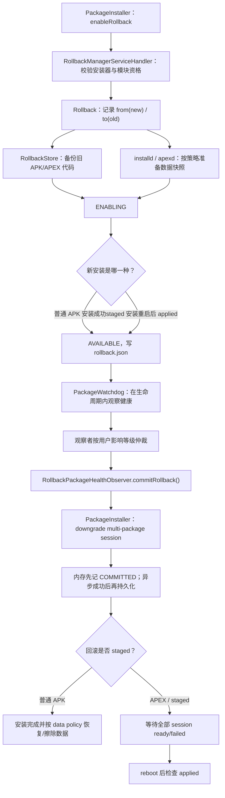

# 79 RollbackManager、PackageWatchdog 与模块更新回滚链路

> 源码版本：Android 11 / API 30 / `android-11.0.0_r48`  
> 学习方式：macOS 只读源码，不要求编译或刷机  
> 前置章节：13 PackageManagerService、26 ART/APEX、78 Watchdog 与 RescueParty

---

## 1. 本章要解决的问题

Android 系统组件更新后，如果新版本频繁崩溃，仅仅重启进程或清除动态配置可能不够。根因可能就在新 APK 或 APEX 的代码中，这时系统需要把它降回先前版本。

但“回滚”不能等事故发生后才临时寻找旧包。安装新版本以前，系统就必须：

1. 确认这次安装允许回滚；
2. 保存当前旧版本代码；
3. 按策略快照应用数据；
4. 记录新旧版本、安装 session 和多包关系；
5. 新版本安装成功后，在有限时间内观察健康；
6. 出现重复故障时，把保存的旧版本作为一次降级安装提交。

一句话模型：

```text
安装前买保险
  → 安装后进入观察期
  → 新版本反复失败
  → 用保险柜中的旧版本执行降级安装
```

---

## 2. 先区分四个容易混淆的词

| 词 | 本章含义 |
|---|---|
| rollback data | 旧版本 APK/APEX 代码、副本元数据和可能的 app data snapshot |
| available rollback | 已准备完成、当前可以提交的回滚 |
| commit rollback | 创建并提交一次“安装旧版本”的 PackageInstaller session |
| staged rollback | 回滚安装本身要跨重启应用，常见于 APEX/staged session |

`commitRollback()` 并不是简单改一个“当前版本号”，也不是把正在运行的进程内存换回去。它重新走 PackageInstaller 的安装与校验流程，只是带有 downgrade、rollback 等专用参数。

---

## 3. 源码地图

| 文件 | 作用 |
|---|---|
| `frameworks/base/core/java/android/content/rollback/RollbackManager.java` | 对特权调用方暴露查询和提交 API |
| `frameworks/base/core/java/android/content/rollback/RollbackInfo.java` | 一组原子回滚的公开信息 |
| `frameworks/base/core/java/android/content/rollback/PackageRollbackInfo.java` | 单个包的新旧版本、APEX、数据策略 |
| `frameworks/base/services/core/java/com/android/server/rollback/RollbackManagerService.java` | SystemService 外壳与 Binder 发布 |
| `frameworks/base/services/core/java/com/android/server/rollback/RollbackManagerServiceImpl.java` | 回滚准备、可用化、提交、过期、启动恢复 |
| `frameworks/base/services/core/java/com/android/server/rollback/Rollback.java` | 单个 rollback 的状态机和 commit 实现 |
| `frameworks/base/services/core/java/com/android/server/rollback/RollbackStore.java` | `/data/rollback` 元数据与旧代码保存 |
| `frameworks/base/services/core/java/com/android/server/rollback/AppDataRollbackHelper.java` | 通过 installd/ApexManager 快照、恢复或清理数据 |
| `frameworks/base/services/core/java/com/android/server/rollback/RollbackPackageHealthObserver.java` | PackageWatchdog 观察者，自动选择并提交回滚 |
| `frameworks/base/services/core/java/com/android/server/rollback/WatchdogRollbackLogger.java` | 模块名映射和 statsd 日志 |
| `frameworks/base/services/core/java/com/android/server/PackageWatchdog.java` | crash/ANR/native crash 健康事件与观察者仲裁 |
| `frameworks/base/services/core/java/com/android/server/pm/PackageInstallerService.java` | 创建、查询和持久化 PackageInstaller session |
| `frameworks/base/services/core/java/com/android/server/pm/PackageInstallerSession.java` | 新版本安装和回滚降级安装的 session 执行层 |

---

## 4. 服务启动和线程模型

`RollbackManagerService` 在 `onStart()` 中创建实现并发布：

```java
mService = new RollbackManagerServiceImpl(getContext());
publishBinderService(Context.ROLLBACK_SERVICE, mService);
```

实现类构造时：

- 从 `/data/rollback` 加载已有 rollback；
- 创建 `RollbackManagerServiceHandler`；
- 把该 Handler 加入第 78 章的 Watchdog；
- 创建 `RollbackPackageHealthObserver` 并注册到 PackageWatchdog；
- 注册用户解锁、包替换、rollback enable 等回调。

它给自身 Handler 的 Watchdog 超时是 10 分钟，不是默认 60 秒。这条线程可能执行备份、PackageInstaller 交互等长任务，但仍不能无限卡死。

这里实际有两条专用线程，不要把它们混成一条：

| 线程 | 主要工作 |
|---|---|
| `RollbackManagerServiceHandler` | enable、commit、过期、包替换和用户解锁后的快照补处理 |
| `RollbackPackageHealthObserver` 自己的 HandlerThread | PackageWatchdog 触发后的提交、staged session 监听与重启衔接 |

修改状态的 Binder 入口通常在权限/身份校验后 `post` 到
`RollbackManagerServiceHandler`。但这不是所有接口的统一模板：

- `getAvailableRollbacks()`、`getRecentlyCommittedRollbacks()` 直接在 Binder 线程持有
  `mLock` 复制当前信息；
- `notifyStagedSession()` 把工作投递给 Handler 后，会在 Binder 线程通过队列等待
  rollbackId，因为 PackageInstaller 的 staged 流程需要同步拿到结果；
- `commitRollback()` 则只投递任务，最终结果通过 `IntentSender` 异步返回。

---

## 5. Rollback 的状态机

Android 11 定义四个内部状态：

```text
ENABLING
  │ 安装前旧代码和数据准备成功
  │ 新版本安装成功（staged 还要等重启 applied）
  ▼
AVAILABLE
  │ commitRollback()
  ▼
COMMITTED

任意准备失败、过期、版本被其他更新替换
  → DELETED
```

| 状态 | 含义 |
|---|---|
| `ENABLING` | 正在建立回滚，尚不能使用 |
| `AVAILABLE` | 旧版本材料齐全，可以提交 |
| `COMMITTED` | 已发起并记录回滚提交；异步安装失败时可能退回 AVAILABLE，更不等于 staged 版本已经生效 |
| `DELETED` | 元数据、旧代码和数据快照被清理 |

源码在调用 `parentSession.commit()` 前就设置 COMMITTED，所以它首先表示“回滚提交动作已经发起并被状态机记录”，不是一张最终成功证书。异步 PackageInstaller 失败时，状态会恢复 AVAILABLE；对于 staged rollback，即使提交回调成功，真正切换代码仍需要 session ready、重启并检查 applied。

---

## 6. 回滚必须在新版本安装前启用

安装方通过：

```java
sessionParams.setEnableRollback(true);
```

设置 `INSTALL_ENABLE_ROLLBACK`。PackageManager 在安装提交过程中发送 `ACTION_PACKAGE_ENABLE_ROLLBACK`，RollbackManager 根据 sessionId 做准备。

上面这句对应普通 APK 安装，以及 staged train 在重启后安装 APK 部分时走的 PMS
安装链。纯 staged/APEX 的重启前准备入口不同：`StagingManager` 在
`PreRebootVerificationHandler` 的起始阶段同步调用
`IRollbackManager.notifyStagedSession(sessionId)`。两条入口最终都会进入
`enableRollbackForPackageSession()`，但触发者、线程以及是否同步等待结果并不相同。

普通 APK 的有序广播还有一个工程边界：PMS 默认最多等 10 秒（DeviceConfig
`rollback/enable_rollback_timeout` 可调整）。超时后安装会继续，并发送
`ACTION_CANCEL_ENABLE_ROLLBACK` 清理仍在 ENABLING 的对象。因此“请求了 enable”不等于
“安装一定拥有回滚保险”；排障要确认 RollbackManager 是否在超时前返回成功。

为什么必须在安装前？

```text
旧版本仍是当前安装版本
  → 可以读取旧 APK/APEX 路径
  → 可以记录 oldVersionCode
  → 可以为当前 app data 建快照

若先覆盖再准备
  → 旧代码可能已经消失
  → 用户数据可能已被新版本迁移
  → 无法可靠恢复
```

因此 rollback 不是任意 APK 的历史版本仓库。只有明确启用并成功准备的安装，才会出现 available rollback。

---

## 7. 谁可以启用回滚

`enableRollbackAllowed()` 检查：

1. installerPackageName 不能为空；
2. 安装器拥有 `MANAGE_ROLLBACKS`；
3. 目标包在 rollback whitelist/模块范围内；
4. 或调用方拥有测试专用 `TEST_MANAGE_ROLLBACKS`。

Android 11 源码明确写着“目前只允许模块或测试”。普通第三方应用不能把系统当成任意版本降级器。

提交、查询最近回滚等 API 同样受 `MANAGE_ROLLBACKS` 或对应测试权限保护。
其中 `commitRollback()` 还接收 `callerPackageName`，所以额外用 AppOps
`checkPackage(uid, callerPackageName)` 校验包名与 UID；查询接口没有调用方包名参数，
不会执行这一步。不要把“权限检查”和“commit 专有的包名归属检查”混为一谈。

---

## 8. enableRollbackForPackageSession 做什么

关键步骤：

1. 校验 `INSTALL_ENABLE_ROLLBACK`；
2. 拒绝 instant app；
3. 解析即将安装的新 APK，取得 packageName/newVersion；
4. 校验安装器是否有资格；
5. 查询当前已安装旧版本；
6. 判断 APK 还是 APEX；
7. 为 APK-in-APEX 补充 PackageRollbackInfo；
8. 保存旧代码路径；
9. 记录新旧 VersionedPackage 和 rollbackDataPolicy。

核心版本方向：

```text
versionRolledBackFrom = 正在安装的新版本
versionRolledBackTo   = 当前设备上的旧版本
```

例如：

```text
当前：com.android.foo version 100
更新：com.android.foo version 120

rollback info：
from = 120
to   = 100
```

观察故障时必须匹配 `from=120`，否则包可能已经再次升级到 130，旧 rollback 就不能盲目套用。

---

## 9. 多包 session 为什么是一个 Rollback

模块更新可能包含多个必须原子切换的包。父 session 下有多个 child session：

```text
parent multi-package session
  ├─ child A：APEX
  ├─ child B：APK
  └─ child C：APK
```

RollbackManager 为整个父 session 建立一个 Rollback，逐个 enable child，并用 `allPackagesEnabled()` 确认没有漏项。

提交回滚时也建立 multi-package parent session，把各旧版本 child 加入后整体 commit。这样避免：

```text
A 已退回旧接口
B 仍是依赖新接口的版本
  → 产生比更新故障更严重的版本撕裂
```

所以 `RollbackInfo` 表示“一组原子回滚”，不一定只包含一个包。

---

## 10. APK-in-APEX 为什么特殊

APEX 内部可以携带 APK。健康事件可能报的是内部 APK 包名，但真正可替换的容器是父 APEX。

启用时系统先记录 embedded APK，再记录 embedding APEX。源码强调顺序必须如此，避免父 APEX 已成功加入、内部 APK 元数据却不完整。

提交时：

```java
if (pkgRollbackInfo.isApkInApex()) {
    continue;
}
```

不会单独创建内部 APK 的降级 session；父 APEX 降级后，内部 APK 自然随容器一起回到旧版本。

自动健康匹配对 APK-in-APEX 还有 Android 11 的版本信息限制，因此部分判断会退化到包名推理。笔记分析 bug 时要保留这个版本边界。

---

## 11. 旧代码保存在哪里

`RollbackStore` 使用：

```text
/data/rollback/<rollbackId>/
  ├─ rollback.json（状态和版本等元数据）
  └─ packages/...（旧代码副本）
```

具体结构由 `RollbackStore` 管理，不要手工修改。元数据需要跨 system_server 重启保存；否则 PackageWatchdog 发现事故时，内存中的 rollback 已经消失。

当 build fingerprint 改变，即设备发生系统级升级，构造函数会删除旧 rollback。跨系统构建保留旧代码可能违反签名、接口、扩展版本或数据兼容约束。

---

## 12. 应用数据为什么也要考虑

代码从 120 降到 100，但版本 120 可能已经升级数据库 schema：

```text
v100 认识 schema 3
v120 首次运行后迁移到 schema 5
代码回到 v100
  → v100 无法读取 schema 5
  → 回滚后仍崩溃
```

所以 `rollbackDataPolicy` 决定数据如何处理。Android API 定义三种策略：RESTORE 备份并恢复、WIPE 不备份且回滚时清除、RETAIN 不备份也不恢复；安装方必须根据模块数据兼容性选择。

需要保留 Android 11 的实现边界：`PackageManager.java` 把 RETAIN 标注为“尚未实现”，`AppDataRollbackHelper` 中 APEX CE 数据的 WIPE 分支也仍有 TODO。读到 API 常量不能直接推断本版本所有包类型都完整实现了该策略。

默认 `setEnableRollback(true)` 使用 RESTORE：安装新版本前快照数据，回滚时恢复旧快照。

代码回滚成功不等于数据一定兼容。分析 rollback 时必须同时查看：

- code version；
- rollback data policy；
- DE/CE snapshot 是否完成；
- 用户当时是否已解锁；
- restore 是否仍 pending。

---

## 13. DE、CE 与用户未解锁

FBE 下：

- DE 数据在开机早期可访问；
- CE 数据要等用户解锁。

快照时若用户未解锁：

```text
先快照 DE
  → 把用户记为 pending backup
  → 用户解锁后再处理 CE
```

恢复时若 CE 快照存在但用户仍锁定：

```text
先处理可访问部分
  → 记录 pending restore
  → 解锁后补做 CE restore
```

若从备份到恢复期间用户一直没解锁，CE 数据没有被新版本实际修改，源码会移除 pending backup，而不是恢复一个从未创建的 CE 快照。

APEX 数据处理也不同：部分 DE snapshot/restore 由 apexd/staged 机制负责，`AppDataRollbackHelper` 对 APEX 在这里主要处理 CE；APK 则通过 installd 的 snapshot/restore 接口处理。

---

## 14. 什么时候从 ENABLING 变 AVAILABLE

### 非 staged APK

新版本安装 session 成功，rollback 准备完整后可变为 AVAILABLE。

### staged/APEX

staged 安装提交后并未立即生效：

```text
staged update session committed
  → reboot
  → apexd/PackageInstaller 验证并应用
  → boot completed
  → session.isStagedSessionApplied()
  → makeRollbackAvailable()
```

因此 staged rollback 在更新真正 applied 前保持 ENABLING。若 staged session 不存在或失败，准备中的 rollback 会被删除。

`makeRollbackAvailable()` 会：

1. 状态设为 AVAILABLE；
2. timestamp 更新为当前时间；
3. 持久化；
4. 让 RollbackPackageHealthObserver 观察这些包；
5. 安排过期检查。

观察期从“新版本实际可用”开始更合理，而不是从下载或创建 session 开始。

---

## 15. Available rollback 会保留多久

默认：

```java
DEFAULT_ROLLBACK_LIFETIME_DURATION_MILLIS = 14 天;
```

运行设备可从 DeviceConfig `rollback_boot` namespace 读取 `rollback_lifetime_in_millis` 调整。

到期时 `runExpiration()` 删除 AVAILABLE rollback 及其旧代码/数据快照。保留不是越久越好：

- 占用 `/data`；
- 旧版本安全性可能更差；
- 数据长期演进后越来越难降级；
- 当前包可能已经被其他版本替换。

收到 package replaced 后，若已安装版本不再匹配 rollback 预期的 “from version”，对应 ENABLING/AVAILABLE rollback 也会被清理。

---

## 16. 手动提交 rollback 的调用链

`RollbackManager.commitRollback()`：

```text
特权调用方
  → IRollbackManager Binder
  → 权限 + uid/package 校验
  → RollbackManagerServiceHandler
  → getRollbackForId
  → Rollback.commit
```

调用方还传入 `causePackages`，表示哪些版本化包促使这次回滚。它用于历史记录和统计，不是要被安装的旧包文件来源。

结果通过 `IntentSender` 异步返回：

- STATUS_SUCCESS；
- STATUS_FAILURE；
- STATUS_FAILURE_ROLLBACK_UNAVAILABLE；
- STATUS_FAILURE_INSTALL。

“API 方法返回”只代表请求已发出，不代表降级安装已经成功，更不代表 staged rollback 已在重启后生效。

---

## 17. Rollback.commit 如何重新安装旧版本

`Rollback.commit()` 创建一个 PackageInstaller multi-package parent：

```java
parentParams.setRequestDowngrade(true);
parentParams.setMultiPackage();
parentParams.setInstallReason(INSTALL_REASON_ROLLBACK);
if (isStaged()) parentParams.setStaged();
```

每个非 APK-in-APEX 包创建 child session：

- `setRequestDowngrade(true)`；
- `setRequiredInstalledVersionCode(fromVersion)`；
- staged 时 `setStaged()`；
- APEX 时 `setInstallAsApex()`；
- 从 RollbackStore 读取旧代码并 `session.write()`；
- 加入 parent session。

`requiredInstalledVersionCode` 是重要的竞态保护：

```text
准备 rollback 时 from=120
提交前包已变成 130
  → 当前版本不等于 120
  → 拒绝用为 120 准备的回滚覆盖 130
```

这防止陈旧回滚误伤后来安装的版本。

---

## 18. 提交失败与成功的状态处理

真正调用 `parentSession.commit()` 前，状态先在**内存中**变为 COMMITTED，并记录
committedSessionId、开始数据恢复标志；此刻尚没有异步安装结果，也没有在这一行之后立刻
调用 `RollbackStore.saveRollback()`：

```java
mState = ROLLBACK_STATE_COMMITTED;
info.setCommittedSessionId(parentSessionId);
mRestoreUserDataInProgress = true;
parentSession.commit(receiver.getIntentSender());
```

因此要再分清“内存状态”和“磁盘状态”：此前 AVAILABLE 状态已经保存到
`rollback.json`；PackageInstaller 成功回调中才会补写 causePackages、删除已不再需要的旧代码
副本，并保存 COMMITTED 状态。原文若把这理解成“提交请求一发出就已把 COMMITTED 落盘”，
会误判 system_server 在异步回调前异常退出时的恢复依据。

若 PackageInstaller 安装失败：

- 内存状态恢复 AVAILABLE；磁盘上此前保存的状态本来就是 AVAILABLE；
- 清除 restore-in-progress；
- committedSessionId 重置；
- 返回 STATUS_FAILURE_INSTALL；
- 旧材料仍在，可以分析或再次尝试。

若 PackageInstaller 回调成功：

- causePackages 写入 RollbackInfo；
- 删除已不再需要的旧代码副本；
- 持久化 committed 状态；
- 发送 `ACTION_ROLLBACK_COMMITTED`；
- 通过 IntentSender 返回成功。

非 staged rollback 成功时，旧代码已经安装；staged rollback 的“提交成功”只是 session 准备成功，还要等待 ready、重启和 applied。

---

## 19. PackageWatchdog 如何自动选择回滚

`RollbackPackageHealthObserver` 注册名为 `rollback-observer`。

收到普通包 crash/ANR 时：

```text
failed VersionedPackage
  → 遍历 available rollbacks
  → 查 PackageRollbackInfo.versionRolledBackFrom
  → 精确匹配失败包名和版本
  → 有匹配则报告 USER_IMPACT_MEDIUM
```

PackageWatchdog 会与 RescueParty 等观察者的影响等级比较，选择非 NONE 且用户影响最小的方案。

这里还要补上“何时才进入仲裁”：对普通 app crash/ANR，PackageWatchdog 默认要求同一包在
1 分钟窗口内失败 5 次，达到阈值后才询问观察者；这两个值可由 `rollback` namespace 下的
DeviceConfig 键 `watchdog_trigger_failure_duration_millis` 与
`watchdog_trigger_failure_count` 调整。native crash 和 explicit health check 属于立即处理路径，
不会套用这个普通失败计数。

第 78 章中 RescueParty 的低级配置 reset 可能报告 LOW，而 rollback observer 报 MEDIUM。因此若两者都愿意处理，框架会优先选择影响更低者。不能看到 PackageWatchdog 就断言“一定回滚 APK”。随着 RescueParty level 升高，它可能报告 HIGH，此时 MEDIUM 的代码回滚反而会先被选中；这不是一个固定的“永远先 reset”顺序。

---

## 20. 普通 crash/ANR 与 native crash 的差异

普通 crash/ANR 有明确的 `VersionedPackage`，observer 可以找出“谁失败就回滚谁所在的 Rollback”。

native crash 可能无法可靠归因到某一个更新模块。Android 11 策略更激进：

```java
if (failureReason == NATIVE_CRASH) {
    rollbackAll();
}
```

即只要存在 available rollback，就把所有 available rollbacks 作为候选全部提交。理由是开机后关键 native 进程反复崩溃可能让系统无法稳定运行，而故障来源难以映射。

这有更大用户影响，所以 observer 报 MEDIUM，并通过日志记录 `sys.init.updatable_crashing_process_name` 等线索。

---

## 21. native crash 观察窗口

boot completed 后，如果还有 available rollback：

```text
RollbackPackageHealthObserver.onBootCompleted
  → PackageWatchdog.scheduleCheckAndMitigateNativeCrashes()
  → 周期检查 init 暴露的 updatable crashing 状态
  → 检测到严重 native crash
  → FAILURE_REASON_NATIVE_CRASH
  → rollbackAll()
```

源码默认轮询间隔和次数在 PackageWatchdog 中定义，Android 11 基线为每 30 秒、最多 10 次，也就是启动后短时间重点观察。

这不是永久监控所有 native crash，而是更新后的高风险启动窗口。

---

## 22. staged rollback 为什么必须重启

APK 普通安装可以在运行期替换代码，随后杀掉相关进程重启。APEX 提供的是更底层、可能被早期系统进程装载的文件系统内容，通常通过 staged session 在下次启动切换。

自动回滚 staged session 时：

1. `commitRollback` 成功返回；
2. observer 把 rollbackId 加入 pending set；
3. 监听 `ACTION_SESSION_UPDATED`；
4. 等待每个 staged rollback session ready 或 failed；
5. 所有 pending 都处理完；
6. `PowerManager.reboot("Rollback staged install")`；
7. 下次启动确认 applied 并记录结果。

为什么不第一个 ready 就马上重启？native crash 的 `rollbackAll()` 可能同时提交多个 staged rollback。必须等全部 session 都 ready/failed，否则重启可能只应用了一部分。

---

## 23. 重启前后如何保存诊断关联

observer 把已 ready 的 staged rollback ID 和用于日志的包名写入：

```text
/data/rollback-observer/last-staged-rollback-ids
```

格式近似：

```text
rollbackId,loggingPackage
```

写入后 flush 并 `FileUtils.sync()`，因为马上可能重启。

下次 boot completed：

- 读取并删除该文件；
- 从 recently committed rollbacks 找对应结果；
- `WatchdogRollbackLogger` 记录 boot-triggered rollback 的状态。

这个小文件不是 rollback 的完整权威数据库；完整状态仍由 `/data/rollback` 和 PackageInstaller session 管理。它只是跨重启衔接日志归因。

---

## 24. Rollback 与 RescueParty 的职责边界

| 机制 | 怀疑对象 | 准备条件 | 缓解动作 |
|---|---|---|---|
| RescueParty | Settings/DeviceConfig 配置 | 无需预存旧 APK | 分级 reset 配置，最终 factory reset |
| Rollback observer | 新安装的 APK/APEX 代码或配套数据 | 安装前已 enable rollback 并保存材料 | 降级安装旧代码、按策略恢复数据 |
| Watchdog | 当前 system_server 卡死 | 关键线程被监控 | 取证并重启运行时 |
| PackageWatchdog | 重复健康失败 | observer 已注册/观察 | 仲裁并选择影响最低的缓解 |

一次故障可能经过多层：

```text
新模块导致 system_server 卡死
  → Watchdog 恢复当前运行时
  → PackageWatchdog 累计失败/启动循环
  → RescueParty 或 rollback observer 竞争处理
  → 有低影响配置 reset 时可能先 reset
  → 后续仍失败时才可能升级或选择代码 rollback
```

但选择结果由当时可用 observer、failure reason、影响等级和 rollback 是否 available 决定，不是固定顺序脚本。

---

## 25. 回滚不能保证什么

### 25.1 不能回滚未提前启用的安装

没有旧代码和数据快照，就没有 available rollback。

### 25.2 不能保证数据向后兼容

RESTORE 策略能恢复快照，但快照失败、CE pending 或外部共享数据都可能留下边界。

### 25.3 不能绕过安装安全检查

旧包仍通过 PackageInstaller、签名/APEX 验证、版本约束和 staged session。

### 25.4 不能无限期使用

默认 14 天过期，包被再次替换或 build fingerprint 改变也会失效。

### 25.5 COMMITTED 不总等于已生效

对 staged rollback，必须区分 committed、session ready、设备重启、session applied。

---

## 26. 常见误解复盘

### 误解一：系统会自动保存每个 APK 的上一个版本

错误。只有符合资格、安装时显式启用且准备成功的 rollback 才保存。

### 误解二：commitRollback 只是把版本号改小

错误。它创建 downgrade PackageInstaller sessions，把备份代码写入并重新安装。

### 误解三：发生一次崩溃就自动回滚

错误。普通 crash/ANR 默认先经过 PackageWatchdog 的“1 分钟内 5 次”阈值（可由 DeviceConfig 调整）；还要有匹配版本的 available rollback，并赢得 observer 影响等级仲裁。native crash/explicit health check 则是立即处理路径，不能把两类失败混成同一阈值。

### 误解四：APK-in-APEX 可以单独回滚

错误。真正安装的是父 APEX，内部 APK 随父容器一起降级。

### 误解五：staged rollback 返回 SUCCESS 后代码已切换

错误。SUCCESS 表示回滚 session 提交成功；还需 ready、重启和 applied。

### 误解六：代码回滚后用户数据自然匹配

错误。必须检查 rollbackDataPolicy、DE/CE snapshot 和 pending restore。

### 误解七：rollbackAll 会回滚设备上所有系统包

错误。它只遍历当前 `getAvailableRollbacks()` 返回的回滚集合。

---

## 27. Mac 上的六轮只读练习

### 第一轮：画状态机

```bash
sed -n '65,115p'   frameworks/base/services/core/java/com/android/server/rollback/Rollback.java
rg -n "makeAvailable|mState = ROLLBACK_STATE|delete\("   frameworks/base/services/core/java/com/android/server/rollback/Rollback.java
```

画出 ENABLING、AVAILABLE、COMMITTED、DELETED。

### 第二轮：追安装前准备

```bash
sed -n '700,1035p'   frameworks/base/services/core/java/com/android/server/rollback/RollbackManagerServiceImpl.java
```

标出权限、当前旧版本、新版本、APEX、APK-in-APEX 和数据策略。

### 第三轮：追旧代码重新安装

```bash
sed -n '450,650p'   frameworks/base/services/core/java/com/android/server/rollback/Rollback.java
```

回答 parent/child session、downgrade、requiredInstalledVersion 和 staged 标志的作用。

### 第四轮：追自动健康回滚

```bash
sed -n '60,180p'   frameworks/base/services/core/java/com/android/server/rollback/RollbackPackageHealthObserver.java
sed -n '300,440p'   frameworks/base/services/core/java/com/android/server/rollback/RollbackPackageHealthObserver.java
```

区分普通失败的精确匹配和 native crash 的 rollbackAll。

### 第五轮：追数据快照

```bash
sed -n '35,230p'   frameworks/base/services/core/java/com/android/server/rollback/AppDataRollbackHelper.java
```

为 APK/APEX、DE/CE、locked/unlocked 用户画表。

### 第六轮：追 staged 重启

```bash
sed -n '160,310p'   frameworks/base/services/core/java/com/android/server/rollback/RollbackPackageHealthObserver.java
sed -n '530,610p'   frameworks/base/services/core/java/com/android/server/rollback/RollbackManagerServiceImpl.java
```

标出 committed、ready、reboot、applied、boot log 五个完成点。

---

## 28. 自测题

1. 为什么 rollback 必须在新版本安装前 enable？
2. fromVersion 和 toVersion 分别是谁？
3. 为什么多包更新必须建立一个原子 Rollback？
4. APK-in-APEX 为什么不单独创建降级 session？
5. ENABLING 何时才能进入 AVAILABLE？
6. staged rollback 的 COMMITTED 为什么不代表已生效？
7. requiredInstalledVersionCode 防止什么竞态？
8. 默认 available rollback 生命周期多长？能否动态调整？
9. build fingerprint 改变为什么清理旧 rollback？
10. RESTORE data policy 解决什么问题，又不能保证什么？
11. 用户未解锁时 CE snapshot/restore 如何延后？
12. PackageWatchdog 如何在 RescueParty 和 rollback observer 间选择？
13. 为什么 native crash 会 rollbackAll？
14. staged rollback 为什么等待所有 pending session 再重启？
15. recently committed rollback 与 available rollback 有何区别？

---

## 29. 初学者最后应画出的总图



---

## 30. 本章总结

本章最重要的七条边界：

1. 回滚材料准备与事故后提交；
2. from 新版本与 to 旧版本；
3. 单包信息与多包原子 Rollback；
4. APK 即时安装与 APEX/staged 跨重启应用；
5. 代码降级与 app data snapshot/restore；
6. AVAILABLE、COMMITTED、ready、applied；
7. PackageWatchdog 仲裁框架、RescueParty 配置重置与 Rollback 代码降级。

下一章将学习 `Apexd、APEX 激活、staged install 与 boot rollback/checkpoint 链路`，继续深入 APEX 为什么必须在启动早期挂载，以及 staged session 失败时底层如何保护设备可启动。
