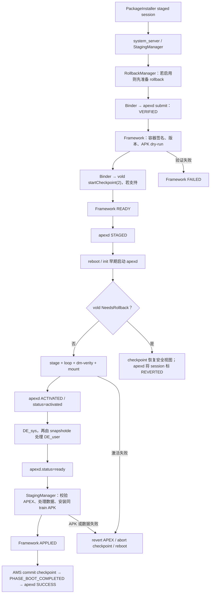

# 80 apexd、APEX 激活、staged install 与 boot rollback/checkpoint 链路

> 源码版本：Android 11 / API 30 / `android-11.0.0_r48`  
> 学习方式：macOS 只读源码，不要求编译、刷机或真实安装 APEX  
> 前置章节：22 存储与 FBE、26 ART/APEX、77 SystemProperties、79 RollbackManager

---

## 1. 为什么 Android 需要 APEX

普通 APK 很适合 Activity、Service 等应用组件，但一些系统模块必须在 PackageManager 启动之前就可用，例如：

- native shared library；
- native daemon；
- ART/runtime；
- boot classpath JAR；
- 底层配置和数据文件。

如果这些内容只装在 APK 中，会出现启动顺序悖论：

```text
PackageManager 启动需要底层库
  → 底层库却要等 PackageManager 安装 APK 后才可见
```

APEX 是可以在启动早期验证并挂载的文件系统容器。`apexd` 是 native daemon，负责验证、选择、挂载、激活和回退 APEX。

---

## 2. 一句话理解 APEX

把 APEX 想成一个“带双重签名、可直接挂载的只读小分区”：

```text
外层：zip/APK 容器
  ├─ AndroidManifest.xml
  ├─ apex_manifest.pb
  ├─ apex_manifest.json（可选的人类可读副本）
  ├─ apex_pubkey
  └─ apex_payload.img
       └─ ext4 文件系统镜像 + AVB/dm-verity
```

APEX 文件在外层兼容 APK 工具和分发设施，但核心内容不是像 APK 那样解压到普通目录，而是把 `apex_payload.img` 通过 loop/device-mapper 挂载到 `/apex`。

这里要特别保留 Android 11 r48 的实现边界：`ApexFile::Open()` 查找并解析的是
`apex_manifest.pb`，找不到就直接失败；`apex_manifest.json` 可以由构建工具附带，便于人阅读，
但不能把它写成 apexd 的唯一运行时清单入口。仓库里的 `system/apex/docs/README.md`
较早段落仍用“四个文件”和 JSON 讲概念，读实现时应以
`system/apex/apexd/apex_file.cpp` 的 `kManifestFilenamePb` 为准。

---

## 3. 本章源码地图

| 文件 | 作用 |
|---|---|
| `system/apex/docs/README.md` | APEX 格式和总体设计 |
| `system/apex/apexd/apexd.rc` | apexd、bootstrap、snapshotde 服务声明 |
| `system/apex/apexd/apexd_main.cpp` | 启动模式、Binder 服务、activated/ready 状态 |
| `system/apex/apexd/apexd.cpp` | 扫描、验证、激活、session、revert 主逻辑 |
| `system/apex/apexd/apex_file.cpp` | 解析 APEX、payload/AVB 信息 |
| `system/apex/apexd/apexd_verity.cpp` | dm-verity 建立与校验 |
| `system/apex/apexd/apexd_loop.cpp` | loop device 管理 |
| `system/apex/apexd/apexd_session.cpp` | apexd session 状态持久化 |
| `system/apex/proto/session_state.proto` | VERIFIED/STAGED/ACTIVATED/SUCCESS/REVERTED 等持久状态定义 |
| `system/apex/apexd/apexd_checkpoint_vold.cpp` | 与 vold checkpoint 交互 |
| `system/apex/apexd/apexservice.cpp` | `IApexService` Binder 实现 |
| `system/vold/Checkpoint.cpp` | checkpoint 尝试计数、commit/abort/restore 实现 |
| `system/core/rootdir/init.rc` | apexd 启动、状态等待、snapshotde 与 `markBootAttempt` 时序 |
| `frameworks/base/services/core/java/com/android/server/pm/ApexManager.java` | system_server 对 apexservice 的封装 |
| `frameworks/base/services/core/java/com/android/server/pm/StagingManager.java` | staged session 验证、重启前后协调 |
| `frameworks/base/services/core/java/com/android/server/pm/PackageInstallerSession.java` | PackageInstaller staged session 状态 |
| `frameworks/base/services/core/java/com/android/server/rollback/RollbackManagerServiceImpl.java` | 上章 rollback 数据与 staged rollback 衔接 |

---

## 4. APEX 的双层验证

APEX 有两层签名：

1. 外层 APK container signature；
2. 内层 payload AVB key/dm-verity。

它们回答不同问题：

| 层 | 主要目的 |
|---|---|
| APK container signature | 使用 PackageInstaller/分发基础设施，并与设备上当前包的容器签名兼容 |
| apex payload key | 保证挂载的文件系统镜像由对应 APEX 的受信密钥签名 |
| dm-verity | 运行时按块验证 payload，没有被落盘篡改 |

`apex_pubkey` 必须和预装同名 APEX 的信任关系匹配。更新包不能只因为包名相同就替换系统底层代码。

“安装前验证成功”与“运行时每个块都可信”也是两件事：前者决定能否进入 staged 状态，后者由 dm-verity 在读取文件系统块时提供完整性保护。

---

## 5. 预装 APEX 与更新 APEX

预装 APEX 通常位于只读分区，例如 `/system/apex`；更新版本位于 data 侧的 active APEX 目录。

启动选择逻辑可以简化为：

```text
同一个 module name
  ├─ /data 上有合法、可激活、版本更合适的更新
  │    → data APEX 覆盖预装 APEX
  └─ 否则
       → 使用 built-in APEX
```

这里“覆盖”不是修改 `/system` 原文件，而是选择另一份 APEX 挂载到活动路径。预装版本仍是重要的安全基线和回退来源。

---

## 6. 为什么 Android 11 的 APEX 安装必须 staged

APEX 中的库/可执行文件可能已被 init、linker、Zygote 或 native 服务加载。运行中直接把挂载点切到新版本会造成同一启动周期内的版本撕裂：

```text
进程 A 已加载旧 libX
进程 B 新启动后加载新 libX
配置和服务端又来自另一版本
  → 整机处于不可验证的混合状态
```

在 Android 11 r48 的 `PackageInstallerSession.handleInstall()` 中，非 staged 的 APEX
会直接以 `INSTALL_FAILED_INTERNAL_ERROR` 失败，并提示 APEX 只能通过 staged session 安装。
这里不是“多数更新通常如此”，而是本版本这条 PackageInstaller 路径的硬约束。

staged install 把“验证”和“应用”拆到重启两侧：

```text
本次运行：下载、验证、记录 ready
重启早期：在依赖者启动前挂载新 APEX
启动完成：确认成功并清理保护材料
```

---

## 7. Framework 与 apexd 的分工

| Framework/StagingManager | native apexd |
|---|---|
| 管理 PackageInstaller session | 解析和验证 APEX payload |
| 校验 APK container signature | 校验 APEX key/AVB |
| 协调 APK + APEX multi-package | 保存 apexd session 状态 |
| 做 APK dry-run install | 启动早期选择并挂载 APEX |
| 启动 filesystem checkpoint | 与 vold 查询 checkpoint 状态 |
| 设置 SessionInfo ready/applied/failed | VERIFIED/STAGED/ACTIVATED/SUCCESS/REVERTED |
| boot 后安装同组 APK | 激活失败时恢复 APEX 侧状态 |

两边各有 session 状态，名字相近但不是同一个对象。排障必须同时看 PackageInstaller SessionInfo 和 `ApexSessionInfo`。

线程和进程也要分开：

| 所在位置 | 执行上下文 | 主要职责 |
|---|---|---|
| `system_server` | `StagingManager.PreRebootVerificationHandler` 使用 `BackgroundThread` 的 Looper | 重启前串联 rollback、APEX、APK 和 checkpoint 验证 |
| `system_server` | 启动恢复及 `PHASE_BOOT_COMPLETED` 回调 | 对账 activated/applied，并最终标记 successful |
| `apexd` native 进程 | Binder 线程池 + 启动主线程 | 验证、session 持久化、早期激活与故障回退 |
| `apexd-snapshotde` 一次性进程 | init 在 DE 用户数据可用后执行 | 处理 DE_user snapshot/restore，成功后写 `apexd.status=ready` |
| `vold` native 进程 | checkpoint Binder/启动挂载链 | 维护 checkpoint 计数并提交或恢复受保护文件系统 |

因此 `StagingManager` 调 `ApexManager` 不是普通 Java 函数一路跑到底：它会跨 Binder 进入
`apexd`；checkpoint 又跨 Binder 进入 vold。

---

## 8. staged session 的重启前总流程

安装器创建 staged PackageInstaller session，可能是：

- 单个 APEX；
- 单个 staged APK；
- 同时包含 APEX/APK 的 multi-package train；
- RollbackManager 创建的 staged rollback。

提交后 `StagingManager.commitSession()` 启动 pre-reboot verification：

```text
PackageInstaller commit staged session
  → StagingManager 保存 session
  → 若 enable rollback：同步通知 RollbackManager 准备旧代码/数据元数据
  → APEX：submitStagedSession 到 apexservice
  → Framework 再校验 container signature/版本/降级规则
  → APK：创建临时 session 做 dry-run install
  → 若支持 checkpoint：startCheckpoint(2)
  → Framework session 先标 ready
  → apexd markStagedSessionReady
  → 等待用户/系统重启
```

签名、APEX/APK 验证、checkpoint 或 ready 转换失败时，session 会在重启前被标 failed，
避免把明显有问题的更新带入启动早期。唯一要单独记忆的是 rollback 准备：源码为了与普通
非 staged 安装保持一致，`notifyStagedSession()` 失败只记录错误，不会让整个更新失败；结果是
“更新仍可继续，但这次可能没有可用 rollback”，不能笼统说所有环节都是 fail-closed。

---

## 9. submitStagedSession 在 apexd 做什么

StagingManager 组装 `ApexSessionParams`：

- parent sessionId；
- APEX childSessionIds；
- 是否为 rollback；
- 是否启用了 rollback；
- rollbackId。

apexd 的 `submitStagedSession()`：

1. 无 filesystem checkpoint 时先备份当前 active packages；
2. 扫描每个 session staging 目录；
3. `verifySessionDir()` 验证 APEX；
4. 执行可选 pre-install hook；
5. 拒绝同时“这是 rollback”又“为它启用 rollback”的矛盾状态；
6. 记录 build fingerprint、child IDs、rollback 信息；
7. 将 apexd session 持久化为 `VERIFIED`。

此时 APEX 还没有成为本次运行的 active 版本。

---

## 10. Framework 还会做哪些验证

apexd 验证成功后，StagingManager 仍检查：

- 解析 APEX 的 AndroidManifest；
- 设备上必须已有同名 active APEX，Android 11 不允许通过此路径凭空新增 APEX；
- 当前版本符合 `requiredInstalledVersionCode`；
- downgrade 是否被安装 flags/调试条件允许；
- 新旧 APEX 的 APK container signature 是否兼容；
- multi-package 中的 APK 能否 dry-run 安装；
- APK-in-APEX 缓存和包信息是否一致。

这说明 apexservice “返回成功”不是整个 staged session ready。Framework 还负责跨包一致性和 PackageManager 语义。

---

## 11. 为什么先标 Framework ready，再标 apexd STAGED

源码特意采用看似反直觉的顺序：

```text
session.setStagedSessionReady()
  → mApexManager.markStagedSessionReady()
```

若反过来：

```text
apexd 已标 STAGED
  → 突然断电/重启
  → Framework session 仍未 ready
  → apexd 可能激活 APEX
  → 同 train 的 APK 却不会安装
  → 原子更新被撕裂
```

按源码顺序，即使 Framework ready 后、调用 apexd 前重启，apexd 没有 STAGED 记录，就不会激活 APEX；Framework 下次发现 APEX 未激活，会把 session 判失败。宁可整组失败，也不要只应用 APEX 半组。

---

## 12. checkpoint 在 ready 前启动

pre-reboot verification 末尾：

```java
if (storageManager.supportsCheckpoint()) {
    storageManager.startCheckpoint(2);
}
```

参数 2 是传给 `StorageManagerService`/vold 的“允许尝试次数”。r48 的
`cp_startCheckpoint(2)` 会在 metadata 计数文件中写入 `3`；init 每次启动通过
`vdc checkpoint markBootAttempt` 先递减一次，因此第一次尝试期间看到的是 `2`。AOSP 测试
也把外部语义称为“checkpointing retry count should be 2”。排障时不要只看文件初始值 3
就误报为允许三次失败，也要确认当前启动是否已经执行 `markBootAttempt`。

checkpoint 的目标不是只备份 APEX 文件，而是保护 fstab 中声明
`checkpoint=fs` 或 `checkpoint=block` 的文件系统（典型是 userdata）在更新启动期间的一致性，
并不等于无条件复制整个 `/data` 目录。

概念模型：

```text
创建 checkpoint
  → 新启动在 checkpoint 保护窗口修改 /data
  → 启动成功：commitChanges，保留新状态
  → 启动失败：abortChanges/rollback，恢复安全数据视图
```

不同文件系统可能用 snapshot、日志或其他机制实现。Framework 通过 StorageManager/vold 接口使用能力，不应把 checkpoint 简化成“复制整个 /data 文件夹”。

---

## 13. 没有 checkpoint 怎么办

Android 11 同时支持无 filesystem checkpoint 的设备。apexd 会在 submit 阶段执行 `BackupActivePackages()`，为 active APEX 保存自身回退副本。

关键区别：

| 有 checkpoint | 无 checkpoint |
|---|---|
| vold 能回滚更广泛的文件系统变化 | apexd 主要依靠 active APEX backup |
| revert 时不应手工恢复 active package backup | revertActiveSessions 会恢复 apexd 备份 |
| 可更安全地并行多个 root staged session | 源码限制多个独立 root staged session |
| success 通常等 boot completed 再确认 | session applied 后可较早 mark successful |

无 checkpoint 不等于完全没有回退，只是保护范围、并发能力和成功确认时机不同。

---

## 14. apexd 启动为什么这么早

`apexd.rc` 中主服务是 core class、root、oneshot，并通过 init 特定触发启动。还有：

- `apexd-bootstrap --bootstrap`；
- `apexd-snapshotde --snapshotde`。

主进程启动后：

1. 连接 vold checkpoint 接口；
2. 收集预装 APEX key/metadata；
3. 判断是否处于 boot；
4. `onStart()` 扫描 session 和 active APEX；
5. 注册 `apexservice` Binder；
6. 设置 `apexd.status=activated`；
7. 等待启动结果；
8. `onStart()` 先处理 DE_sys；稍后的 `apexd-snapshotde --snapshotde` 再处理
   DE_user，成功后设置 `apexd.status=ready`。

APEX 内容可能被早期服务依赖，所以这发生在 Java PackageManager 完整启动之前。

---

## 15. activated 与 ready 不是同一个完成点

`apexd.status` 至少有：

```text
starting → activated → ready
```

| 状态 | 含义 |
|---|---|
| starting | apexd 正在扫描、选择和挂载 |
| activated | APEX 已正确挂载，可基于它做配置；但 DE 数据 snapshot/restore 尚未全部完成 |
| ready | APEX 挂载及相关 DE 数据处理完成，可以安全使用其内容 |

第 77 章提到 init property trigger，这里就是典型应用。init 可等待 `apexd.status=activated` 做挂载相关配置，真正使用 APEX 文件的服务应等待 `ready`。

把 activated 当 ready，可能在数据恢复尚未完成时启动依赖服务。

---

## 16. 启动早期怎样激活 APEX

`apexd::onStart()` 的主线：

```text
查询 vold 是否要求 rollback
  → 扫描 staged session 并把应激活包移到 active 集合
  → 恢复未完成的 revert
  → 扫描 /data active APEX
  → 过滤不应激活的包
  → 激活 data APEX
  → 扫描并激活 built-in APEX
  → snapshot/restore DE_sys data
```

随后 init 等待 `apexd.status=activated`，完成 APEX 配置和 user 0 DE 初始化，再执行
`apexd-snapshotde` 处理 DE_user，最后才得到 `ready`。这也解释了为什么 activated 与 ready
之间不是一个无意义的同义状态。

每个 APEX 大致经历：

```text
打开并解析 APEX
  → 选择 payload offset/size
  → 创建 loop device
  → 对更新 APEX 建立 dm-verity device
  → mount 到版本化路径 /apex/name@version
  → 建立 /apex/name 当前版本可见路径
  → 记录 mounted/active 信息
```

实际挂载细节以 `apexd.cpp`、`apexd_loop.cpp` 和 `apexd_verity.cpp` 为准。

---

## 17. loop device 与 dm-verity 各做什么

| 组件 | 作用 |
|---|---|
| loop device | 把普通 APEX 文件中的 payload 区域暴露成块设备 |
| device mapper | 在块设备之上建立映射层 |
| dm-verity | 依据已签名 hash tree 校验读取块 |
| mount | 把 ext4 payload 变成目录树 |
| bind mount/current path | r48 把版本化挂载点 bind 到 `/apex/<name>`，让消费者使用稳定路径 |

类比：

```text
APEX 文件 = 封好的书箱
loop = 把书箱内容当成一块磁盘
dm-verity = 每翻一页都核对防伪哈希
mount = 把书的目录呈现到 /apex
```

dm-verity 提供完整性，不负责判断“新版本业务逻辑是否有 bug”。业务 bug 要靠 staged 启动验证、PackageWatchdog 和 Rollback 机制处理。

---

## 18. 重启后 StagingManager 如何恢复 session

system_server 启动后 `resumeSession()`：

1. 从 PackageInstaller 持久化记录恢复 staged session；
2. 有 APEX 时查询 `apexservice.getStagedSessionInfo()`；
3. 若仍是 VERIFIED，说明重启前验证没走完，重新触发 pre-reboot verification；
4. 检查 checkpoint 模式是否符合预期；
5. 检查 apexd session 是否 activation failed/reverted；
6. 要求 APEX 至少 activated 或 success；
7. 校验 APK-in-APEX；
8. 做 APEX session 数据 snapshot/restore；
9. 安装同 train 的 staged APK；
10. Framework session 标 `APPLIED`。

所以“APEX 挂载成功”仍不是整个 multi-package session applied；同组 APK 和数据步骤也必须成功。

---

## 19. checkpoint 模式不符合意味着什么

若设备支持 checkpoint，但重启后 `needsCheckpoint()==false`：

```text
本应在 checkpoint 尝试窗口内继续 staged install
  → 现在已经不处于 checkpoint
  → 可能刚经历了 fs rollback/回到安全状态
  → 不应再次应用同一 staged session
  → 将 session 标 failed
```

这避免数据已经回退到旧状态后，Framework 又把新 APEX/APK session 继续装一遍。

若连“是否支持/需要 checkpoint”都无法查询，源码选择失败 session、revert APEX 并重启，而不是在未知保护状态下冒险继续。

---

## 20. applied 与 successful 的区别

Framework 安装完 APEX 相关 APK、同组 APK 和数据步骤后：

```java
session.setStagedSessionApplied();
```

随后：

- 无 checkpoint：立即 `markStagedSessionSuccessful()`；
- 有 checkpoint：先保存 sessionId，等 boot completed 再标 successful。

| 完成点 | 含义 |
|---|---|
| ready | 重启前验证完成，允许下次启动尝试 |
| activated | apexd 已在本次启动挂载对应 APEX |
| applied | Framework 完成 train 中 APK/数据等后续步骤 |
| successful | 启动观察点通过，可清理 apexd backup/保护材料 |

这四个状态不能互换。

---

## 21. 为什么 checkpoint 设备晚点标 SUCCESS

有 checkpoint 时，新系统必须先证明能走到足够稳定的启动阶段。若刚挂载 APEX 就标 success 并删除回退材料，随后 system_server 或关键 native 服务崩溃，checkpoint 失去意义。

启动成功确认实际分两步，而且顺序很重要。AMS 的 `finishBooting()` 先调用 `IStorageManager.commitChanges()` 提交 filesystem checkpoint；随后进入 `PHASE_BOOT_COMPLETED`，StagingManager 的 Lifecycle 才把记录的 session 交给：

```text
mApexManager.markStagedSessionSuccessful(sessionId)
```

apexd 只接受 `ACTIVATED → SUCCESS`，然后清理 backup。对于 staged rollback 还会处理 DE pre-restore snapshot。若 checkpoint commit 抛异常，AMS 会请求重启。

要注意源码在 `pm.reboot(...)` 调用后没有显式 `return`；正常设备应很快进入重启流程，
但阅读 Java 控制流时不要声称“后续 `PHASE_BOOT_COMPLETED` 在语法上绝不可能执行”。
排障应同时检查 checkpoint 提交日志、reboot reason 和 apexd session，而不是只根据一条异常
反推最终状态。

“系统已经显示桌面”也不必然等于 apexd session success；应以 session 状态、boot phase 和日志为证据。

---

## 22. 启动失败时谁触发回退

存在几种路径：

### 22.1 vold checkpoint 重试耗尽

init 在每次 boot 的 `post-fs` 阶段执行 `vdc checkpoint markBootAttempt`；当 metadata
计数降为 0 时，vold 的 `needsRollback()` 返回 true。fs_mgr/vold 负责把受保护文件系统
恢复到安全视图，apexd 启动后则把活动 APEX session 对账为 reverted：

```text
启动尝试耗尽，checkpoint metadata 计数为 0
  → fs_mgr/vold 在启动挂载链恢复 checkpoint 数据视图
  → apexd onStart 查询 NeedsRollback=true
  → revertActiveSessions：将 APEX session 标 REVERTED
  → 不从 /data/apex/backup 手工恢复 APEX（checkpoint 模式）
```

`onStart()` 这一分支调用的是 `revertActiveSessions()`，本身没有紧接着调用
`revertActiveSessionsAndReboot()`；不能把文件系统恢复、APEX session 对账和另一次重启
错误压成 apexd 内的一条函数调用。

### 22.2 APEX staging 或挂载激活失败

重启时若 `scanStagedSessionsDirAndStage()` 的单个 session 校验、postinstall 或
`stagePackages()` 失败，该 session 会被标为 `ACTIVATION_FAILED`，之后由 Framework 对账并
进入失败处理。若后续扫描 `/data/apex/active` 失败，或
`ActivateApexPackages(data_apex)` 挂载激活失败，`onStart()` 才直接尝试
`revertActiveSessionsAndReboot()`。这两种失败都发生在 apexd 启动期，但不是同一个立即重启
分支。

### 22.3 启动中的 native 进程反复崩溃

init 将非 critical 的 updatable native 进程识别为“启动完成前累计退出超过 4 次”，或
“启动完成后 4 分钟内退出超过 4 次”时，设置
`sys.init.updatable_crashing=1` 和进程名。apexd 的 `waitForBootStatus()` 每次最多等待该属性
30 秒，并在循环间检查 `sys.boot_completed`；命中后记录进程名，revert active sessions 并
重启。这里不是一次 native crash 就立即触发，也不要与第 79 章 PackageWatchdog 启动后
30 秒轮询、最多 10 次的策略混在一起。

### 22.4 Framework 后续 APK/数据安装失败

`StagingManager.onInstallationFailure()`：

- session 标 failed；
- 有 checkpoint 时 `abortChanges()`；
- 要求 apexd revert active sessions；
- 必要时重启。

这些路径关注的层不同，但目标都是避免“APEX 已换新、/data 或 APK 仍在旧/半新状态”。

---

## 23. revertActiveSessions 在两种设备上的差异

apexd 源码明确区分：

### 支持 filesystem checkpoint 的设备路径

```text
标记/推进 session revert
  → 不手工恢复 active package backup
  → 依靠 filesystem checkpoint 恢复一致数据视图
```

这里分支条件实际是 `gSupportsFsCheckpoints`，不是只看某一刻
`gInFsCheckpointMode` 的布尔值。源码日志会提示：

```text
Not restoring active packages in checkpoint mode.
```

### 非 checkpoint 模式

```text
恢复 BackupActivePackages 保存的 APEX
  → 清理失败的新 active 包
  → session 记为 reverted
  → 重启后挂载旧 APEX
```

因此“revertActiveSessions 就是复制旧 APEX”只适用于部分设备。

---

## 24. boot rollback 与第 79 章显式 rollback 的区别

| staged boot failure revert | RollbackManager commitRollback |
|---|---|
| 正在应用 staged session 时发现设备起不来 | 更新已经 available，后续健康事件触发 |
| apexd/vold/StagingManager 主导 | RollbackManager + PackageWatchdog 主导 |
| 目标是撤销尚未确认成功的启动尝试 | 目标是创建一次正式旧版本降级安装 |
| 可用 checkpoint 自动恢复 | 依赖安装前准备的 Rollback 数据 |
| session 常进入 REVERTED/FAILED | Rollback 进入 COMMITTED，创建新 staged rollback session |

两者最终都可能让旧 APEX 再次 active，但触发时机、状态数据库和数据恢复来源不同。

---

## 25. checkpoint、RollbackManager snapshot 与 APEX backup 不同

这是本章最容易混淆的三个“备份”：

| 保护机制 | 范围 | 创建时机 | 主要用途 |
|---|---|---|---|
| filesystem checkpoint | 更新启动期间的文件系统状态 | staged ready 前 | 启动失败整体回安全视图 |
| RollbackManager app-data snapshot | 某包各用户 DE/CE 数据 | enable rollback/安装流程 | 以后正式 commitRollback 时恢复 |
| apexd active package backup | 当前 active APEX 文件 | 无 checkpoint 时 submit staged session | staged 激活失败时恢复旧 APEX |

它们可能同时出现，但不能互相替代。

---

## 26. session 状态对照表

| Framework PackageInstaller | apexd ApexSession | 解释 |
|---|---|---|
| committed/verifying | VERIFIED | apexd 验证过，Framework 其他验证可能未完成 |
| READY | 短暂仍可能是 VERIFIED，随后为 STAGED | Framework 先 READY，再调用 apexd 标 STAGED；允许下次启动激活 |
| READY，重启中 | STAGED，随后尝试转为 ACTIVATED 或 ACTIVATION_FAILED | apexd 启动早期处理；Android 11 没有名为 ACTIVATION_PENDING 的持久状态 |
| APPLIED | ACTIVATED | APEX 已挂载，Framework train 后续也完成 |
| APPLIED/成功确认 | SUCCESS | boot 观察完成，清理 backup |
| FAILED | ACTIVATION_FAILED/REVERTED 等 | 激活或后续阶段失败 |

这不是严格的一一同步时钟；异常断电时两边可能暂时处于不同阶段，StagingManager 的恢复逻辑就是用来重新对账。

---

## 27. 排障时应该看什么

### 27.1 Framework

```bash
rg -n "submitSessionToApexService|setStagedSessionReady|resumeSession|setStagedSessionApplied|abortCheckpoint"   frameworks/base/services/core/java/com/android/server/pm/StagingManager.java
```

关注：

- sessionId/parent/child；
- ready/applied/failed；
- stagedSessionErrorCode/message；
- APK dry-run；
- checkpoint support/needs；
- 是否存在同名 overlapping session。

### 27.2 apexd

```bash
rg -n "submitStagedSession|markStagedSessionReady|markStagedSessionSuccessful|revertActiveSessions"   system/apex/apexd/apexd.cpp
```

关注：

- APEX key/container signature；
- version/downgrade；
- VERIFIED/STAGED/ACTIVATED/SUCCESS/REVERTED；
- crashingNativeProcess；
- active modulePath/version；
- loop/dm-verity/mount 错误。

### 27.3 存储和启动

可直接从 r48 源码追到计数与 init 时序：

```bash
rg -n "cp_startCheckpoint|cp_markBootAttempt|cp_needsRollback|cp_commitChanges|cp_abortChanges" \
  system/vold/Checkpoint.cpp
rg -n "markBootAttempt|prepareCheckpoint|apexd.status|apexd-snapshotde" \
  system/core/rootdir/init.rc
```

关注：

- `apexd.status`；
- vold supportsCheckpoint/needsCheckpoint/needsRollback；
- boot attempt/retry；
- init 是否等到 activated/ready；
- reboot reason；
- boot completed 后是否 mark successful。

只看 PackageInstaller “commit success”不足以判断 APEX 更新成功。

---

## 28. 常见误解复读

### 误解一：APEX 就是扩展名不同的 APK

错误。外层兼容 APK 分发，但核心 payload 是可挂载、受 AVB/dm-verity 保护的文件系统镜像。

### 误解二：submitStagedSession 成功后新 APEX 已生效

错误。它只到 VERIFIED，之后还要 Framework 验证、READY、重启、ACTIVATED、APPLIED、SUCCESS。

### 误解三：activated 就可以启动所有依赖服务

错误。Android 11 还区分 ready，等待 DE snapshot/restore 完成。

### 误解四：checkpoint 是 APEX 旧文件副本

错误。checkpoint 是文件系统一致性保护；无 checkpoint 时 apexd 才显式备份 active APEX。

### 误解五：markStagedSessionSuccessful 和 markStagedSessionReady 是同一阶段

错误。ready 在重启前，successful 在启动尝试通过后。

### 误解六：staged boot revert 就是 RollbackManager rollback

错误。前者撤销尚未确认的启动尝试，后者正式提交已准备的旧版本降级安装。

### 误解七：dm-verity 能发现 APEX 业务 bug

错误。它检测块完整性，不理解 Java/native 业务语义。

---

## 29. Mac 上的六轮只读练习

### 第一轮：理解格式和挂载

```bash
sed -n '1,180p' system/apex/docs/README.md
rg -n "createLoopDevice|createVerityTable|mount\(" \
  system/apex/apexd/apexd.cpp \
  system/apex/apexd/apexd_loop.cpp \
  system/apex/apexd/apexd_verity.cpp
```

### 第二轮：追 pre-reboot verification

```bash
sed -n '1450,1590p'   frameworks/base/services/core/java/com/android/server/pm/StagingManager.java
```

解释为什么先 Framework READY 后 apexd STAGED。

### 第三轮：追 apexd session

```bash
sed -n '1940,2065p' system/apex/apexd/apexd.cpp
sed -n '18,48p' system/apex/proto/session_state.proto
rg -n "UpdateStateAndCommit" \
  system/apex/apexd/apexd_session.cpp \
  system/apex/apexd/apexd_session.h
```

### 第四轮：追启动激活

```bash
sed -n '1835,1950p' system/apex/apexd/apexd.cpp
sed -n '100,180p' system/apex/apexd/apexd_main.cpp
```

画出 starting、activated、ready。

### 第五轮：追 Framework 恢复

```bash
sed -n '560,720p'   frameworks/base/services/core/java/com/android/server/pm/StagingManager.java
```

区分 APEX activated、APK install、APPLIED 和 SUCCESS。

### 第六轮：追 checkpoint/revert

```bash
sed -n '380,430p'   frameworks/base/services/core/java/com/android/server/pm/StagingManager.java
sed -n '1690,1775p' system/apex/apexd/apexd.cpp
```

比较有/无 filesystem checkpoint 的回退动作。

---

## 30. 自测题

1. 为什么 APEX 能在 PackageManager 之前提供系统库？
2. 外层 container signature 和 payload key 分别保护什么？
3. loop device、dm-verity 和 mount 各做什么？
4. 为什么 APEX 更新要跨重启？
5. submitStagedSession 成功处于什么阶段？
6. 为什么 Framework READY 必须早于 apexd STAGED？
7. checkpoint 为什么在 ready 前启动？
8. 没有 checkpoint 时 apexd 如何保留回退能力？
9. activated 和 ready 有何区别？
10. 重启后 StagingManager 为什么还要安装同 train APK？
11. APPLIED 和 SUCCESS 为什么分开？
12. checkpoint 设备为什么到 boot completed 才 mark successful？
13. needsCheckpoint=false 为什么可能意味着已经回到安全状态？
14. boot failure revert 与 RollbackManager commitRollback 有何不同？
15. 三种“备份”分别保护什么？

---

## 31. 初学者最终总图



---

## 32. 本章总结

本章必须掌握八条边界：

1. APK 应用模型与 APEX 启动早期文件系统模块；
2. container signature、payload key 与 dm-verity；
3. Framework PackageInstaller session 与 apexd session；
4. VERIFIED、READY/STAGED、ACTIVATED、APPLIED、SUCCESS；
5. activated 与 ready；
6. filesystem checkpoint、RollbackManager data snapshot、apexd package backup；
7. checkpoint 设备与非 checkpoint 设备的 revert；
8. staged boot failure revert 与正式 RollbackManager rollback。

下一章将学习 `Vold、fs_mgr、文件系统 checkpoint 与 userdata 回滚实现链路`，把本章调用的 `startCheckpoint/needsCheckpoint/abortChanges` 继续追到底层文件系统与启动挂载过程。
